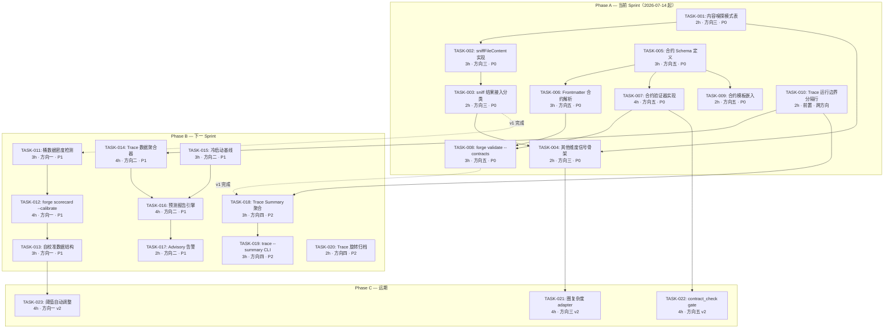
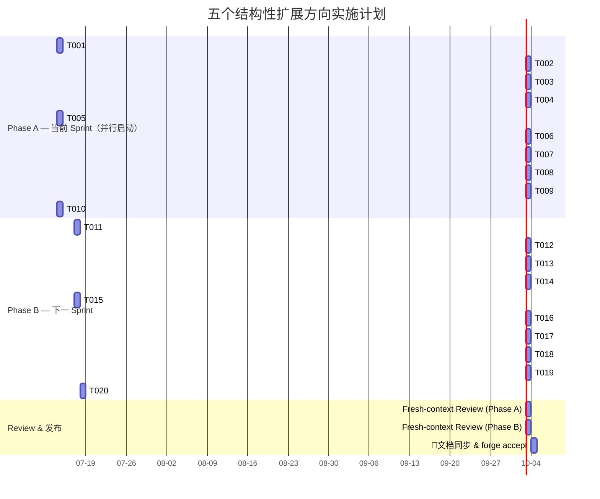

# Tech Lead 分析报告：五个结构性扩展方向 — 交叉验证与实现规划

> **分析基准**: `docs/requirements/2026-07-11-five-structural-extension-directions-architect-pm-combined.md`
> **代码基线**: `commit a7d55ac` (HEAD, 2026-07-12)
> **交叉验证输入**: 独立 Tech Lead 交叉阅读反馈（2026-07-12）
> **分析角色**: Tech Lead
> **状态**: 初版

---

## 目录

1. [执行摘要](#1-执行摘要)
2. [任务分解](#2-任务分解)
3. [执行顺序与依赖图](#3-执行顺序与依赖图)
4. [技术风险](#4-技术风险)
5. [资源评估](#5-资源评估)
6. [质量保证](#6-质量保证)
7. [实施计划](#7-实施计划)
8. [附录：决策记录](#8-附录决策记录)

---

## 1. 执行摘要

### 1.1 总体评价

交叉验证确认：五个方向全部为**真实缺口**，未在任何已有分析文档中作为独立系统性方向展开。其中两个方向（方向三 · 静态分析风险提取、方向五 · Agent 产出合约验证）定位为 **P0** — 涉及安全下限和数据完整性的正确性缺口；两个方向（方向一 · 路由阈值自校准、方向二 · 预测性运行估算）定位为 **P1** — 学习闭环和可观测性的水平扩展；一个方向（方向四 · 跨运行失效分类）定位为 **P2** — 运维智能的成本收益极佳但优先级靠后。

| 优先级 | 方向 | 价值评估 | 工时估算（v1） | 建议行动 |
|--------|------|---------|---------------|---------|
| **P0** 🚨 | 方向三 · 静态分析风险提取 | 最高 — 安全下限 Opus 是空壳，只等一个永不会来的输入 | 1-2 天（v1 窄切口） | **立即启动 Phase A** |
| **P0** 🚨 | 方向五 · Agent 产出合约验证 | 最高 — 已有实际静默失败案例（Sprint 28） | 2-3 天（v1） | **立即启动 Phase A** |
| **P1** ⚡ | 方向一 · 路由阈值自校准 | 高 — scorecard 数据已存在，阈值自校准是学习闭环缺失的最后一维度 | 2-3 天（v1 只读报告） | Phase B |
| **P1** ⚡ | 方向二 · 预测性运行估算 | 高 — trace 数据已丰富，预测是反应性预算→主动性成本管理的跃迁 | 2-3 天（v1） | Phase B |
| **P2** 📊 | 方向四 · 跨运行失效分类 | 中 — trace 数据写入但从不消费；v1 实现成本最低 | 1.5-2 天（v1） | Phase B |

### 1.2 关键交叉验证发现

交叉阅读在以下方面修正了原始文档的命题范围：

| 方向 | 原始建议 | 交叉修正 | 理由 |
|------|---------|---------|------|
| 方向三 | v1 做「正则内容嗅探」范围偏大 | 窄化为 **Go 文件 `import` 路径检测** | 复用 `arch-check` 已有 `extractJsImports` 模式的 Go 等价物；准确度高一个数量级，成本几乎不变 |
| 方向五 | `forge validate --contracts` 的子命令引用独立文件 | 合约直接定义在 **agent 卡 YAML frontmatter** 中 | 降低采用壁垒 — 新 agent 卡创建时就自带合约模板 |
| 方向一 | 阈值自校准可直接实现 | 需要先加 **数据密度检测** | 当前 `Scorecard` 按 `(model, task_type)` 聚合，没有 `complexity_bucket`/`mode` 分桶；样本不足时自校准引入噪声 |
| 方向二 | 预测引擎依赖本地历史 | 需要内置一份 **ForgeOS 通用基线** 作为冷启动 fallback | 首次运行的仓库没有任何历史数据；可从 forge-core 自身运行数据聚合基线 |
| 方向四 | `forge trace --summary` 可直接读取 `.forge/trace.jsonl` | 需要先在 Tracer 中写入 **运行边界分隔行** | 当前 trace 事件没有运行边界标识，两次连续 `forge evolve` 的跟踪行无法区分 |

### 1.3 关键背景（来自 AGENTS.md / CURRENT_SPRINT.md / ARCHITECTURE.md）

- 项目严格执行「先拆分，再继续」纪律 — 文件 ≥500 行 / 函数 ≥50 行触发的重构是硬闸门
- `forge accept` 是聚合 Stop 闸门，拒绝伪造 N/A
- **fresh-context Reviewer 必须独立** — 实现者不能审自己的代码
- forge-core Go 运行时 **零外部依赖**（`go.mod` 无 `require`）
- 18 个 Go 包，全绿，纯标准库
- 核心引擎已落地：Orchestrator · Model-Router · Context-Engine · Memory-Engine · Evaluation-Engine
- `policy.yml` 声明 6 维评分但只有 `risk` 维度有信号生产 — 这是一个路由系统在**虚假承诺状态**
- `cmd/forge` 包文件数预算为 16，修改时必须遵守

---

## 2. 任务分解

### 2.1 方向三 · 静态分析驱动的风险提取（P0 🚨）

#### 现状

`risk.FromChangedPaths` 只读文件路径字符串，不解析文件内容。`policy.yml` 声明了 6 维评分（complexity/dependency_change/security/risk/context_size/business_impact），但只有 `risk` 维度有规则实现，其他维度信号生产函数为零。风险下限（`risk=critical → Opus`）是一个被保护得很好的空壳——它在等一个永不来的输入。

#### 任务清单

---

**TASK-001: 定义内容嗅探模式表**

- **标题**: 在 `risk_diff.go` 中新增 `contentPatterns` 模式表，定义 Go import 路径到风险特征的映射
- **涉及文件**: `forge-core/internal/risk/risk_diff.go`（新增 `contentPatterns` 表和辅助类型）
- **前置依赖**: 无
- **预估工时**: 2 小时
- **验收标准**:
  - 定义 `type contentPattern struct { pattern *regexp.Regexp; feature string; weight float64 }`
  - 定义模式表覆盖：
    - `import ".*payment"` → `TouchesPayment = true`
    - `import ".*billing"` → `TouchesPayment = true`
    - `import ".*auth"` → `TouchesAuth = true`
    - `import ".*secret"` / `import ".*crypto"` → `TouchesSecrets = true`
    - `import ".*migration"` → `TouchesMigration = true`
    - `func.*[Cc]redit` → `TouchesPayment = true`
    - `func.*[Mm]igrate` → `TouchesMigration = true`
  - 模式表不可导出（`var contentPatterns = [...]contentPattern{...}`），强制通过 `FromChangedPaths` 接入
  - 每条模式有行内注释引用变更来源（如 `// maps to risk_diff.go's paymentKeywords`）
  - 单元测试验证每条模式匹配/不匹配的用例

---

**TASK-002: 实现文件内容嗅探函数**

- **标题**: 实现 `sniffFileContent` 函数，读取文件内容并匹配 `contentPatterns` 表
- **涉及文件**: `forge-core/internal/risk/risk_diff.go`
- **前置依赖**: TASK-001
- **预估工时**: 3 小时
- **验收标准**:
  - 新建 `sniffFileContent(path string) map[string]bool` 函数
  - 只处理 `.go` 后缀文件（其他文件类型静默跳过，不报错）
  - 逐行扫描，匹配 `contentPatterns` 表中的正则
  - 返回被触发的 feature 集合（`map[string]bool`），key 为 feature 名称
  - 失败安全：文件不可读/权限错误时返回空 map，不阻断调用链
  - 文件大小保护：超过 1MB 的文件跳过内容扫描（仅记录告警），防止大文件性能问题
  - 单元测试覆盖：Go 文件匹配、非 Go 文件跳过、大文件跳过、不可读文件

---

**TASK-003: 将 sniff 结果接入风险分类**

- **标题**: 将 `sniffFileContent` 的结果合并到 `FromChangedPaths` 的特征提取逻辑中
- **涉及文件**: `forge-core/internal/risk/risk_diff.go`（修改 `FromChangedPaths` 函数）
- **前置依赖**: TASK-002
- **预估工时**: 2 小时
- **验收标准**:
  - `FromChangedPaths` 在处理完路径启发式后，对每个 `.go` 文件调用 `sniffFileContent`
  - 内容嗅探结果与路径启发式结果取 **OR 合并**（只推高不压低，延续 Sprint 9 的 merge 策略）
  - 合并后的结果仍然只推高不压低：如果路径启发式已标记 `TouchesPayment=true`，内容嗅探不必重复
  - 新增一个 `content_sniffed` 布尔特征字段标识是否有内容嗅探参与判决，供 trace/遥测消费
  - `--verbose` 模式下输出 `[risk] snifffed file.go: matched patterns=[payment]`
  - 单元测试验证：纯路径不匹配但内容匹配的场景、路径和内容都匹配的合并场景

---

**TASK-004: 补充其他维度的信号生产骨架**

- **标题**: 为 `complexity` 和 `dependency_change` 维度添加信号生产函数骨架（v1 仅返回 0.5 + TODO）
- **涉及文件**: `forge-core/internal/risk/risk_diff.go` + `forge-core/internal/routing/routing.go`
- **前置依赖**: TASK-003
- **预估工时**: 2 小时
- **验收标准**:
  - 在 `risk_diff.go` 中定义 `func EstimateComplexity(paths []string) float64` 函数，v1 返回 `0.5` + 注释说明「v2 将接入圈复杂度」
  - 在 `risk_diff.go` 中定义 `func EstimateDependencyChange(paths []string) float64` 函数，v1 返回 `0.5` + 注释说明「v2 将接入 lockfile 差分」
  - 在 `routing.Score()` 的维结构构造处，用这两个函数替代硬编码的 `0.5`
  - 单元测试验证骨架函数返回预期值
  - 注释诚实注明当前实现是 placeholder，将在后续版本中升级

---

### 2.2 方向五 · Agent 产出合约验证框架（P0 🚨）

#### 现状

`parseReviewerVerdict`、`parseConfidenceScore`、`parseClaudeCostUsd` 全部基于 exact-match 字符串解析，无结构性验证。Sprint 28 已有真实静默失败案例：`parseConfidenceScore` 遇到 `CONFIDENCE: 85%` → `strconv.Atoi` 拒绝 → 默认值 50 → 下游预算分配偏了 40%。agent 卡 YAML frontmatter 当前没有合约声明段。

#### 任务清单

---

**TASK-005: 定义 Agent 产出合约 Schema 类型**

- **标题**: 定义合约 Schema Go 类型，支持 agent 卡 frontmatter 中的 `contract:` 声明
- **涉及文件**: 新建 `forge-core/internal/contract/schema.go`
- **前置依赖**: 无
- **预估工时**: 3 小时
- **验收标准**:
  - 定义核心类型：

```go
// OutputContract defines the validation rules for an agent phase output.
type OutputContract struct {
    // Verdict defines the expected verdict token format.
    Verdict *VerdictContract `yaml:"verdict,omitempty" json:"verdict,omitempty"`
    // Confidence defines the expected confidence score format.
    Confidence *ConfidenceContract `yaml:"confidence,omitempty" json:"confidence,omitempty"`
    // Emits defines validation rules for artifact files declared in emits:.
    Emits []EmitsContract `yaml:"emits,omitempty" json:"emits,omitempty"`
}

type VerdictContract struct {
    // AllowedValues lists the acceptable verdict strings.
    AllowedValues []string `yaml:"allowed_values" json:"allowed_values"`
    // Location specifies where to find the verdict: "last_line" or "json_envelope.result".
    Location string `yaml:"location" json:"location"`
    // CaseSensitive defaults to true; false means case-insensitive matching.
    CaseSensitive bool `yaml:"case_sensitive" json:"case_sensitive"`
}

type ConfidenceContract struct {
    // Min and Max define the acceptable range.
    Min int `yaml:"min" json:"min"`
    Max int `yaml:"max" json:"max"`
    // AllowPercentage, if true, parses "85%" as 85.
    AllowPercentage bool `yaml:"allow_percentage" json:"allow_percentage"`
    // HeuristicMap maps natural language to scores: {"high": 80, "medium": 50, "low": 20}.
    HeuristicMap map[string]int `yaml:"heuristic_map,omitempty" json:"heuristic_map,omitempty"`
}

type EmitsContract struct {
    // File pattern to match against emits: entries (e.g., "gap-report.md").
    File string `yaml:"file" json:"file"`
    // RequiredFields lists fields that MUST be present in the artifact.
    RequiredFields []string `yaml:"required_fields,omitempty" json:"required_fields,omitempty"`
}
```

  - 类型支持 YAML 反序列化（用于 frontmatter 解析）和 Go struct 直接构造（用于硬编码合约）
  - 默认值安全：零值 `OutputContract{}` 表示无合约约束（向后兼容）
  - 添加 `ValidateContract(c OutputContract) error` 前置校验函数——检查枚举值合法、范围合理、Location 值有效
  - 100% 单元测试覆盖合法/边界/非法合约定义

---

**TASK-006: 解析 agent 卡 frontmatter 中的合约声明**

- **标题**: 扩展现有 agent 卡解析逻辑，从 frontmatter YAML 中提取 `contract:` 段
- **涉及文件**: `forge-core/internal/asset/agent.go`（或对应 frontmatter 解析文件）
- **前置依赖**: TASK-005
- **预估工时**: 3 小时
- **验收标准**:
  - 新增 `type AgentContract struct { Contract *OutputContract }` 嵌入层
  - agent 卡 frontmatter 解析时，如果存在 `contract:` 段则反序列化为 `OutputContract`，缺失时留 nil
  - 兼容性：无 `contract:` 的旧 agent 卡正常加载，合约字段为零值 nil，不阻断
  - 新增 `func (a *Agent) Contract() *OutputContract` 方法，返回 nil 表示无合约
  - 合约验证在加载时执行：如果 `contract:` 存在但格式非法（如 `allowed_values` 为空），记录告警但不阻断加载
  - 单元测试验证：合法合约、非法合约告警、无合约旧卡、frontmatter 与合约共存

---

**TASK-007: 实现合约验证器**

- **标题**: 实现 `contract.Validate` 函数，验证 agent 实际输出是否符合合约
- **涉及文件**: 新建 `forge-core/internal/contract/validate.go`
- **前置依赖**: TASK-005
- **预估工时**: 4 小时
- **验收标准**:
  - 定义 `type ValidationResult struct { Pass bool; Verdict *VerdictResult; Confidence *ConfidenceResult; Emits []EmitsResult; Warnings []string }`
  - `func Validate(output string, artifacts map[string]string, c *OutputContract) ValidationResult`
  - Verdict 验证：
    - 根据 `Location` 从 output 中提取候选值（`last_line` 取最后非空行；`json_envelope.result` 从 JSON 中取 `result` 字段）
    - `CaseSensitive` 为 false 时做大小写不敏感比较
    - 如果 `AllowedValues` 为空，跳过 verdict 验证（不限制）
  - Confidence 验证：
    - 从 output 中提取 `CONFIDENCE:` 行并解析数值
    - 支持 `AllowPercentage` 去掉 `%` 后缀
    - 支持 `HeuristicMap` 的文本映射
    - 数值在 `[Min, Max]` 范围内为有效
  - Emits 验证：
    - 对 `artifacts` map（key=文件名, value=文件内容）中的每个条目匹配 `EmitsContract.File`
    - 对匹配的文件，检查内容是否包含 `RequiredFields` 中的字段（宽松 grep，非完整结构化解析）
  - 验证结果中 `Pass` 为 true 当且仅当所有非跳过项均通过
  - 单元测试覆盖：完全通过、部分通过、全部拒绝、无合约（nil → 默认通过）、各种边界输入

---

**TASK-008: 添加 `forge validate --contracts` CLI 子命令**

- **标题**: 在 `forge validate` 子命令中新增 `--contracts` flag，验证所有 agent 卡的合约声明
- **涉及文件**: `forge-core/cmd/forge/validate.go`（或新建 `forge-core/cmd/forge/validate_contracts.go`）
- **前置依赖**: TASK-006, TASK-007
- **预估工时**: 3 小时
- **验收标准**:
  - `forge validate --contracts` 扫描 `.agent/agents/*.md` 和 `.agent/skills/*.md` 中声明了 `contract:` 的所有 agent 卡
  - 对每个合约声明，运行 `contract.ValidateContract` 前置校验
  - 输出表格格式：

```
Agent                        Contract              Status
reviewer.md                  verdict: last_line    ✅ valid
product-manager.md           verdict + confidence  ✅ valid
cto.md                       (no contract)         ⚠️  missing
planner.md                   verdict: invalid_loc   ❌ invalid location
```

  - 退出码：任意合约格式非法 → exit 1（可被 `--warn` 降级为告警）
  - 缺失合约的 agent 卡输出告警（⚠️ ）但不影响退出码
  - 单元测试验证各种合约状态组合

---

**TASK-009: 将合约模板嵌入新 agent 卡创建流程**

- **标题**: 修改 agent 卡模板和 `forge-init` 路径，使新 agent 卡创建时就携带合约段
- **涉及文件**: `.agent/templates/agent.md`（或对应的模板文件）、`forge-core/cmd/forge/agent.go`（若存在 agent 创建子命令）
- **前置依赖**: TASK-005
- **预估工时**: 2 小时
- **验收标准**:
  - agent 卡模板新增带注释的 `contract:` 段（默认注释掉，用户取消注释即可启用）：

```yaml
---
name: example-agent
role: your-role
# contract:
#   verdict:
#     allowed_values: ["APPROVE", "REQUEST_CHANGES"]
#     location: last_line
#     case_sensitive: false
---
```

  - `forge-init` 生成的项目中 agent 卡模板包含上述注释合约段
  - 更新 `check.py` 新增 `check_agent_contract_template` 验证模板文件包含合约段
  - 文档注释：在 `.agent/agents/README.md` 或对应文档中说明合约字段的使用方法

---

### 2.3 前置依赖 · Trace 运行边界分隔（跨方向）

#### 现状

`trace.jsonl` 文件连续记录所有运行的事件，但两次 `forge evolve` 的事件流在文件中没有分隔标志。无法区分单次运行的边界。

#### 任务清单

---

**TASK-010: 添加 Trace 运行边界分隔行**

- **标题**: 在 Tracer 初始化时写入运行边界分隔行，标识一次新运行的开始
- **涉及文件**: `forge-core/internal/trace/trace.go`
- **前置依赖**: 无
- **预估工时**: 2 小时
- **验收标准**:
  - 在 `NewTracer` 或首次写入时，写入一行 `=== RUN START === <timestamp> <run_id>` 分隔行
  - `run_id` 格式为 `YYYYMMDDHHMMSS-<random-hex>`，每次 `NewTracer` 生成新 ID
  - 分隔行写入频率：每个 Tracer 生命周期一次（不在每次 `WriteEvent` 时重复写入）
  - 分隔行格式与 JSONL 兼容但不作为 JSON 解析（以 `===` 开头，消费者按前缀过滤）
  - `ReadEvents(runID string)` 函数：读取指定 run_id 的事件子集（按分隔行分界）
  - 向后兼容：旧的无分隔行文件可完整读取（无 run_id 过滤时返回全部事件）
  - 单元测试验证：分隔行写入、按 run_id 分界读取、旧文件兼容

---

### 2.4 方向一 · 路由阈值自校准引擎（P1 ⚡）

#### 现状

路由系统的 tier 分界阈值（`HaikuMax=0.34`, `SonnetMax=0.69`）是硬编码常量。Scorecard 系统积累了丰富的每模型每任务类型质量/延迟/成本数据，但从不反向校准阈值。当前 `Scorecard` 按 `(model, task_type)` 聚合，没有按 `complexity_bucket` 或 `mode` 分桶。

#### 任务清单

---

**TASK-011: 实现 Scorecard 桶数据密度检测**

- **标题**: 在 scorecard 系统中新增数据密度检测函数，判断各分桶的样本量是否足够校准
- **涉及文件**: `forge-core/internal/routing/scorecard.go`
- **前置依赖**: 无（可独立于 TASK-012/013）
- **预估工时**: 3 小时
- **验收标准**:
  - 定义 `type BucketDensity struct { BucketKey string; SampleCount int; MinSamples int; Sufficient bool }`
  - 实现 `func CheckBucketDensity(s *Store) []BucketDensity` 函数
  - 按 `(model, task_type)` 聚合计算各桶的 `SampleCount`
  - `MinSamples` 默认值 = 30（可通过 `policy.yml` 的 `calibration.min_samples` 覆盖）
  - 输出：标记哪些桶样本充足、哪些不足
  - `Sufficient` 为 false 的桶在校准过程中静默跳过（不参与校准，不报错）
  - 单元测试覆盖：数据充足的桶、不足的桶、空 store、有缺失维度的数据

---

**TASK-012: 实现 `forge scorecard --calibrate` 只读报告**

- **标题**: 添加 `forge scorecard --calibrate` 子命令，对比当前阈值 vs scorecard 数据建议值，只报告不动手
- **涉及文件**: `forge-core/cmd/forge/scorecard.go`（或新建 `forge-core/cmd/forge/calibrate.go`）
- **前置依赖**: TASK-011
- **预估工时**: 4 小时
- **验收标准**:
  - `forge scorecard --calibrate` 读取当前 `scorecards.json` 和 `policy.yml` 中的阈值
  - 按 `(model, task_type)` 分桶计算建议阈值：
    - 对每个 tier（Haiku/Sonnet/Opus），计算该 tier 内所有样本的 `QualityScore` 中位数和 p90
    - 建议阈值 = 高一级 tier 的 p10 - 0.05（保守偏移，避免来回震荡）
  - 输出校准报告表格：

```
Bucket                    Current.Threshold    Suggested.Threshold    Samples    Action
(model=sonnet,task=impl)  0.69                0.72                   142        ↗ increase
(model=haiku,task=review) 0.34                0.31                   58         ↘ decrease
(model=opus,task=arch)    0.69                0.69                   12         ⏸ insufficient data (min=30)
```

  - **只报告不修改**：不写文件，不改变运行时行为
  - 样本不足的桶标注 `insufficient data (min=N)`，不输出建议值
  - 单元测试验证：校准算法、不同数据分布下的建议值、边界情况

---

**TASK-013: 实现阈值自校准基础数据结构**

- **标题**: 定义 `CalibratedThresholds` 类型，作为后续自动调整的数据基础
- **涉及文件**: 新建 `forge-core/internal/routing/calibrate.go`
- **前置依赖**: TASK-012
- **预估工时**: 3 小时
- **验收标准**:
  - 定义：

```go
type CalibratedThresholds struct {
    HaikuMax  float64
    SonnetMax float64
    // Per-model overrides (key="model_name", value=threshold)
    ModelOverrides map[string]ModelThresholds
    // Metadata
    GeneratedAt    time.Time
    SampleCount    int
    MinSamples     int
}

type ModelThresholds struct {
    HaikuMax  float64
    SonnetMax float64
}
```

  - 实现 `func (ct *CalibratedThresholds) Apply(force bool) error` 方法：
    - `force=false` 时，仅当 `SampleCount >= MinSamples` 且新阈值与当前阈值差异 > 0.02（防抖动）才写入
    - `force=true` 时无条件写入
    - 写入方式：生成新的 `calibrated_thresholds.json` 到 `.forge/` 目录（不改源码，不改 `routing.go` 的 const）
  - 运行时读取逻辑：如果 `.forge/calibrated_thresholds.json` 存在且有效，覆盖 const 值
  - 单元测试验证：序列化/反序列化、Apply 逻辑、force vs non-force、差异阈值防抖

---

### 2.5 方向二 · 预测性运行估算引擎（P1 ⚡）

#### 现状

ForgeOS 有反应性预算护栏（budget guard），但零预测性。Trace 数据（`DurationMs`、`CostUsdMicros`、`Status`、`Model`）丰富但无消费代码做预测。冷启动仓库没有任何历史数据。

#### 任务清单

---

**TASK-014: 实现 Trace 数据聚合器**

- **标题**: 实现按 `(model, task_type, mode)` 分桶的 trace 数据聚合引擎
- **涉及文件**: 新建 `forge-core/internal/trace/aggregate.go`
- **前置依赖**: TASK-010（运行边界分隔）
- **预估工时**: 4 小时
- **验收标准**:
  - 定义 `type AggregatedStats struct { Mean, Median, P90, P99 float64; SampleCount int }` 聚合结构
  - 定义 `type BucketKey struct { Model, TaskType, Mode string }` 分桶键
  - 实现 `func AggregateTraceEvents(runReader Reader, bucketFn func(Event) BucketKey) map[BucketKey]AggregatedStats`
  - 实现两个生成器函数：
    - `PhaseDurationBuckets(events []Event) map[BucketKey][]float64`：按 phase 级的 `DurationMs` 分桶
    - `PhaseCostBuckets(events []Event) map[BucketKey][]float64`：按 phase 级的 `CostUsdMicros` 分桶
  - 聚合计算：均值、中位数、P90、P99
  - 离群值处理：剔除超过 P99 3 倍的值（可选，默认启用）
  - 单元测试验证：聚合算法、分桶逻辑、离群值剔除、空事件

---

**TASK-015: 实现冷启动基线**

- **标题**: 从 forge-core 自身开发仓库聚合「通用基线」，编译进二进制作为新仓库 fallback
- **涉及文件**: 新建 `forge-core/internal/trace/baseline.go` + 生成 `internal/trace/baseline_data.go`
- **前置依赖**: TASK-014
- **预估工时**: 3 小时
- **验收标准**:
  - 在 forge-core 仓库上运行 N 次 evolve（N≥50），聚合产生基线数据
  - 基线数据格式按 `(mode, lifecycle)` 聚合：

```go
// BaselineCost holds pre-computed cost stats for cold-start scenarios.
type BaselineCost struct {
    Mode          string  // "explorer" | "balanced" | "engineering"
    Lifecycle     string  // "idea" | "mvp" | "growth" | "production"
    MeanCostUsd   float64
    MedianCostUsd float64
    P90CostUsd    float64
    MeanDuration  float64 // seconds
    MedianDuration float64
    P90Duration   float64
}
```

  - 基线数据通过 `go generate` 从 `.forge/` trace 文件生成 `baseline_data.go`
  - 如果没有本地历史数据，预测引擎优先使用基线
  - 基线标注为 `source: forge-core-baseline` 以区分本地数据
  - 单元测试验证基线数据可加载、格式正确

---

**TASK-016: 实现预测报告引擎和 `forge run --dry-run` 输出**

- **标题**: 组合 trace 聚合 + 基线 fallback + scorecard 历史均值，生成预测报告
- **涉及文件**: 新建 `forge-core/cmd/forge/predict.go` + `forge-core/internal/trace/predict.go`
- **前置依赖**: TASK-014, TASK-015
- **预估工时**: 4 小时
- **验收标准**:
  - `func PredictRun(wf asset.Workflow, mode string, traceReader Reader) *Prediction`
  - 预测按 phase 粒度：对每个 phase，查找匹配 `(model, task_type, mode)` 桶的历史数据
  - Fallback 链：本地数据 → 基线数据 → 通用常量（成本 = $0.05，时长 = 30s）
  - 输出字段：总成本（中位数 + P90 区间）、总时长（中位数 + P90 区间）、预计迭代次数（从 scorecard 的 `AvgIterations`）、最贵 phase、最长 phase
  - `forge run --dry-run --workflow <wf>` 输出示例：

```
=== Run Prediction (dry-run) ===

Workflow: evolve (mode=balanced, lifecycle=growth)

Phase                  Model     Cost (median)    Duration (median)    Source
scan                   haiku     $0.02           12s                  local (42 samples)
gap-analysis           sonnet    $0.12           45s                  local (38 samples)
roadmap                opus      $0.35           90s                  baseline (forge-core)
implement              sonnet    $0.25           120s                 local (156 samples)
review                 opus      $0.18           60s                  local (29 samples)
evaluate               haiku     $0.03           15s                  baseline (forge-core)

Total: $0.95 (P90: $1.42) | Duration: 5.7 min (P90: 8.2 min) | Est. iterations: 2.3
```

  - 每个 phase 标注数据源（local / baseline / estimated），方便用户判断可信度
  - 单元测试验证：预测算法、fallback 链、各数据源的标记正确

---

**TASK-017: 预测数据接入运行时 advisory 告警**

- **标题**: 在 `checkRunBudget` 中注入预测值比较，实际成本超过预测 2x 时输出 advisory warning
- **涉及文件**: `forge-core/internal/orchestrator/budget.go`
- **前置依赖**: TASK-016
- **预估工时**: 2 小时
- **验收标准**:
  - `checkRunBudget` 在每次 phase 执行后，检查累计成本是否超过预测值的 2 倍
  - 超过 2x → 输出 `WARNING: run cost ($X) exceeds 2x prediction ($Y)`，不阻断
  - 超过 3x → 输出 `CRITICAL: run cost ($X) exceeds 3x prediction ($Y)`，可触发 fail-closed（由 `FORGE_PREDICT_STRICT=1` 控制）
  - 没有预测数据时静默跳过（不告警，不报错）
  - 单元测试验证：告警阈值、strict 模式、无预测数据跳过

---

### 2.6 方向四 · 跨运行失效分类引擎（P2 📊）

#### 现状

`trace.Tracer` 向 `.forge/trace.jsonl` 写入丰富事件流，但全仓没有子系统消费历史 trace 来回答跨运行的问题。`doctor` 包只检查当前运行状态的健康 snapshots。

#### 任务清单

---

**TASK-018: 实现 `forge trace --summary` 聚合逻辑**

- **标题**: 实现 trace 事件按 `(Kind, Status)` 和 `(Model, Status)` 的聚合计数引擎
- **涉及文件**: 新建 `forge-core/internal/trace/summary.go`
- **前置依赖**: TASK-010（运行边界分隔）
- **预估工时**: 3 小时
- **验收标准**:
  - 定义 `type TraceSummary struct { TotalEvents int; ByKindStatus map[string]map[string]int; ByModelStatus map[string]map[string]int; Phases []PhaseSummary }`
  - 定义 `type PhaseSummary struct { PhaseName string; Total, Passed, Failed, AvgDurationMs float64; TotalCostUsd float64 }`
  - 实现 `func ComputeSummary(events []Event, runID string) (*TraceSummary, error)`
  - 支持 `runID=""` 时使用全部事件（不分运行边界）
  - 支持 `runID="last"` 时取最后一个运行边界内的事件
  - Phase 聚合按 phase name 分组合计，计算通过率、平均耗时、总成本
  - 实现运行时间区间：`since` 参数（取最近 N 小时的事件）
  - 单元测试验证：聚合正确性、多运行边界、空事件、带 time window 的过滤

---

**TASK-019: 实现 `forge trace --summary` CLI 命令**

- **标题**: 添加 CLI 子命令以表格形式输出 trace summary
- **涉及文件**: 新建 `forge-core/cmd/forge/trace.go`
- **前置依赖**: TASK-018
- **预估工时**: 3 小时
- **验收标准**:
  - `forge trace --summary` 输出按 `(Kind, Status)` 聚合的表格：

```
Kind                  Status          Count    %
gate:lint             PASS            142      68.3%
gate:lint             FAIL            12       5.8%
gate:test             PASS            89       42.8%
gate:test             FAIL            45       21.6%  ← 多数失败来自这里
agent:planner         OK              78       100%
agent:implementer     OK              156      100%
reviewer:arch         APPROVE         34       45.3%
reviewer:arch         CHANGES         41       54.7%
```

  - `forge trace --summary --by-model` 输出按 model 聚合的失败率排名：

```
Model                Failures     Total    Fail Rate
haiku                89           523      17.0%
sonnet               45           312      14.4%
opus                 12           189      6.3%
```

  - `forge trace --summary --since 7d` 限制时间窗口
  - `forge trace --summary --run last` 仅最后一次运行
  - 支持 `--json` flag 输出 JSON 格式（方便脚本处理）
  - 表格以失败率降序排列，最易失败的 phase/model 在最前
  - 单元测试验证：表格输出格式、JSON 输出、各种 flag 组合

---

**TASK-020: 实现 trace 旋转归档机制**

- **标题**: 实现 trace 文件的自动旋转归档，防止无限增长
- **涉及文件**: `forge-core/internal/trace/rotate.go`
- **前置依赖**: TASK-010
- **预估工时**: 2 小时
- **验收标准**:
  - 定义 `type RotateConfig struct { MaxSizeMB int; MaxFiles int; Compress bool }`
  - 默认值：`MaxSizeMB=10`、`MaxFiles=5`、`Compress=true`
  - 实现 `func (t *Tracer) CheckRotate() error` 方法，在每次 `WriteEvent` 时检查文件大小
  - 超过 `MaxSizeMB` 时执行旋转：`.forge/trace.jsonl` → `.forge/trace.1.jsonl.gz`
  - 保留 `MaxFiles` 个归档文件，超出时删除最旧的
  - 旋转时不丢失事件（先写入新文件，再旋转旧文件）
  - 支持 `--trace-max-size` 和 `--trace-max-files` 配置项
  - 单元测试验证：旋转触发、归档文件命名、文件数限制、压缩/非压缩模式

---

### 2.7 Phase C · 深度扩展（非当前 Sprint）

---

**TASK-021: 圈复杂度接入 harness adapter（方向三 v2）**

- **标题**: 通过 harness adapter pipe 接入 `gocyclo`/`lizard`，为 `complexity` 维度提供真实信号
- **涉及文件**: `harness/adapters/`（新建 cyclomatic adapter）、`forge-core/internal/risk/risk_diff.go`
- **前置依赖**: TASK-004
- **预估工时**: 4 小时
- **验收标准**:
  - harness adapter 调用外部工具（`gocyclo` 或 `lizard`）计算 Go 文件的圈复杂度
  - 输出标准化为每条函数的复杂度值
  - `EstimateComplexity` 函数使用 adapter 结果替代 placeholder 的 0.5
  - 无外部工具时优雅降级回 placeholder

---

**TASK-022: Contract check gate 插入编排循环（方向五 v2）**

- **标题**: 在 phase 执行完成后、进入下一 phase 前插入可选的 `contract_check` gate
- **涉及文件**: `forge-core/internal/orchestrator/orchestrator.go`、`forge-core/internal/orchestrator/gates.go`
- **前置依赖**: TASK-007
- **预估工时**: 4 小时
- **验收标准**:
  - 如果当前 agent 卡声明了 `OutputContract`，phase 完成后自动运行 `contract.Validate`
  - 验证失败记录 trace 事件 + 触发 `on_fail` loop-back（如同 gate FAIL）
  - 不阻断 run 但显著延缓收敛，迫使 agent 修复产出格式
  - 可通过 `policy.yml` 或 workflow 定义中的 `contract_check: off` 关闭

---

**TASK-023: 阈值自动调整写入引擎（方向一 v2）**

- **标题**: 将 `CalibratedThresholds` 接入运行时，实现每 N 次 scorecard update 自动调整阈值
- **涉及文件**: `forge-core/internal/routing/calibrate.go` + `forge-core/internal/routing/routing.go`
- **前置依赖**: TASK-013
- **预估工时**: 4 小时
- **验收标准**:
  - 每 50 次 scorecard update 触发一次自动校准
  - 自动读取 `calibrated_thresholds.json` 覆盖 const 值
  - `BandForScore` 和 `TierForScore` 优先读取校准值
  - 校准变动写入 trace 事件
  - 可通过环境变量 `FORGE_AUTO_CALIBRATE=off` 关闭

---

## 3. 执行顺序与依赖图

### 3.1 依赖图



### 3.2 并行策略

| 并行组 | 任务 | 所需角色 | 建议并行数 |
|--------|------|---------|-----------|
| **GA-1** | T001→T002→T003（方向三核心链） | 1 名资深 Go 工程师 | 1 Agent |
| **GA-2** | T004（方向三骨架） | 1 名 Go 工程师 | 1 Agent（与 GA-1 共享结果） |
| **GA-3** | T005→T006→T007→T008（方向五核心链） | 1 名资深 Go 工程师 | 1 Agent |
| **GA-4** | T009（合约模板）+ T010（边界分隔） | 1 名 Go 工程师 | 1 Agent |
| **GB-1** | T011→T012→T013（方向一） | 1 名 Go 工程师 | 1 Agent |
| **GB-2** | T014→T016→T017（方向二核心） | 1 名资深 Go 工程师 | 1 Agent |
| **GB-3** | T015（冷启动基线） | 1 名 Go 工程师 | 1 Agent（依赖 GB-2 的聚合器） |
| **GB-4** | T018→T019（方向四） | 1 名 Go 工程师 | 1 Agent |
| **GB-5** | T020（trace 归档） | 1 名 Go 工程师 | 1 Agent（可独立于 GB-4） |

**关键依赖约束**：
- Phase A 全部任务必须在 Phase B 启动前完成（v1 交付物作为 B 的前置条件）
- GA-1 和 GA-3 是 Phase A 的最长关键路径（~7-10 小时/链）
- **GB-2（方向二核心）** 是 Phase B 的最长关键路径（~8 小时）
- T010（运行边界分隔）是 T014 和 T018 的前置条件——但由于 T010 只有 2 小时，可在 Phase A 早期完成
- Phase C 无时间约束，可在 Phase B 交付后随时启动

---

## 4. 技术风险

### 4.1 高风险项

| # | 风险 | 方向 | 级别 | 说明 | 缓解措施 |
|---|------|------|------|------|---------|
| R1 | **内容嗅探正则的 false positive** | 三 | 🟡 | `import ".*payment"` 可能匹配注释中的 `payment`、vendor 中的 `payment`库等，导致风险高估 | v1 策略保守：只推高不压低。模式定义在 `contentPatterns` 表中集中管理，false positive 可通过调整 regex 修复。后续可加 vendor 目录白名单排除 |
| R2 | **合约 Schema 过度设计** | 五 | 🟡 | `OutputContract` 的 4 个子类型可能过于复杂，导致 agent 卡作者不愿使用 | v1 强制要求最少可用集（verdict 类型 + confidence 类型），`EmitsContract` 和 `HeuristicMap` 为可选。模板中的合约段默认注释掉，降低心理负担 |
| R3 | **冷启动基线数据代表性不足** | 二 | 🟡 | ForgeOS 自身开发仓库的 trace 分布可能与用户仓库完全不同（如项目规模、复杂度、使用模式差异） | 基线数据明确标注 `source: forge-core-baseline`，用户可直观判断。本地数据积累超过 30 个 sample 后自动切换为 local 优先。基线仅作 fallback |
| R4 | **Trace 运行边界分隔行对现有消费者的影响** | 前置 | 🟢 | 现有的 trace 读取代码可能无法处理 `=== RUN START ===` 这样非 JSON 的行 | 所有读取路径必须容错跳过非 JSON 行。`ReadEvents` 的默认行为是按行解析，跳过无效 JSON。T010 验收标准中强制测试旧消费者兼容性 |
| R5 | **阈值自校准的数据驱动震荡** | 一 | 🟡 | 如果校准周期过短或数据噪声大，阈值可能在每次校准中来回震荡，导致路由不稳定 | TASK-013 中设计差异阈值（0.02）防抖，同时要求 `MinSamples≥30`。v1 只报告不动手，v2 才启用自动调整。自动调整频率限制为每 50 次 scorecard update 一次 |
| R6 | **`cmd/forge` 包文件数预算溢出** | 全部 | 🟡 | 新增多个 CLI 子命令（`--calibrate`、`--dry-run`、`--summary`）可能导致 `cmd/forge` 文件数超过 16 | 每个子命令按职责拆入 `internal/` 包（如 `internal/trace/`、`internal/contract/`），`cmd/forge` 中的文件仅保留极薄的 CLI 分发层——这是 arch-check 已经执法的闸门 |

### 4.2 外部依赖

| 依赖 | 方向 | 当前状态 | 风险 |
|------|------|---------|------|
| 无 | 全部 | forge-core 零外部依赖 | 🟢 无新增外部依赖。所有 v1 实现仅使用 Go 标准库（`regexp`、`encoding/json`、`compress/gzip` 等已内置） |

### 4.3 性能考虑

| 维度 | 方向 | 当前 | 期望 | 策略 |
|------|------|------|------|------|
| 文件内容嗅探 | 三 | 不读文件 | 读 .go 文件 + 正则扫描 | 1MB 上限跳过大文件；逐行扫描 + 低复杂度正则；平均每次 sniff 应 < 1ms |
| 合约验证 | 五 | 无 | 每个 phase 完成后验证 | 验证器不写文件、仅内存计算；`EmitsContract` 验证仅 grep 不解析 AST |
| Trace 聚合 | 二/四 | 无 | 读取全部 trace 事件 | 仅支持适度规模的 trace 文件（默认 MaxSize=10MB，约 5 万事件）；v1 不做流式/增量聚合 |
| 预测计算 | 二 | 无 | 每次 `--dry-run` 触发 | 聚合计算 O(N) 扫描全部事件，N 为历史 trace 事件数；典型场景应 < 200ms |
| 阈值校准 | 一 | 无 | 每次 `--calibrate` 触发 | 计算 O(K×B)，K=模型数×任务类型数，B=每桶样本数；典型场景应 < 500ms |

### 4.4 测试覆盖的难点

| 难点 | 方向 | 说明 | 策略 |
|------|------|------|------|
| 内容嗅探的真实仓库差异 | 三 | 不同项目的 Go 代码组织模式不同（vendor vs module、monorepo vs 多仓库），影响 pattern 匹配精度 | 用 forge-core 自身代码作为认证测试集，外加模拟的已知 match/non-match 边界文件 |
| agent 合约验证的端到端测试 | 五 | 需要真实的 agent 输出 fixture 来验证验证器逻辑 | 从现有 trace/已知运行中提取 agent 输出片段，构建 fixture 库（含合法/非法/边界格式） |
| 预测精度的真实评估 | 二 | 预测是否准确需要与实际运行数据对比 | v1 不要求预测准确度达到特定指标（先 ship 框架再迭代），但 `forge run --dry-run` 输出标注数据源以管理预期 |
| 跨运行 trace 聚合的可重复性 | 四 | trace 文件依赖真实运行顺序和并发模型 | 用 fixture trace 文件构造已知的失败/成功模式，验证聚合结果的确定性 |

---

## 5. 资源评估

### 5.1 人员需求

| 角色 | 所需技能 | 数量 | 分配 |
|------|---------|------|------|
| **资深 Go 工程师**（方向三核心） | 精通 Go、正则设计、单元测试、risk 系统理解 | 1 人 | T001-T004 |
| **资深 Go 工程师**（方向五核心） | 精通 Go、YAML/JSON Schema 设计、agent 卡系统理解 | 1 人 | T005-T009 |
| **Go 工程师**（前置 + 方向一/二） | Go 并发、trace 系统理解、数据分析 | 1 人 | T010, T014-T017 |
| **Go 工程师**（方向四 + 方向一辅助） | Go、CLI 设计、文件系统和归档 | 1 人 | T011-T013, T018-T020 |
| **文档/模板作者** | Markdown、YAML frontmatter、agent 卡生态 | 1 人（兼职） | T009（合约模板）|
| **Reviewer**（fresh-context） | 全栈理解 forge-core 架构 | 每方向 1 人 | 每个方向交付后独立审查 |
| **Tech Lead** | 架构决策、跨方向协调、review | 1 人 | 全程 |

**总计**: 2-3 名开发人员全职 + 1-2 名兼职（文档 + reviewer），持续 2 sprints（Phase A 约 1 周，Phase B 约 1 周）

### 5.2 关键里程碑

| 里程碑 | 时间 | 交付物 | 验证方式 |
|--------|------|--------|---------|
| **M1**: Phase A v1 完成 | Day 5-6 | T001-T010 全部代码 + 测试 | `go test -race` 全绿，方向三/五 `forge accept` 自测 PASS |
| **M2**: Trace 边界分隔就绪 | Day 2 | T010 交付，方向四/二前置条件满足 | trace 读取兼容性测试通过 |
| **M3**: Phase B v1 完成 | Day 12-14 | T011-T020 全部代码 + 测试 | `go test -race` 全绿，全部方向 `forge accept` PASS |
| **M4**: Fresh-context review | Day 15-17 | 每个方向 reviewer 至少 1 个 blocking 或 important 发现 | 全部 reviewer APPROVE |
| **M5**: 文档同步 + 最终闸门 | Day 18 | agent 卡文档更新、模板更新、`forge accept` 完整 ACCEPTED | `forge accept: ACCEPTED` |

### 5.3 阻塞点与解决策略

| Blockers | 方向 | 解决策略 |
|----------|------|---------|
| 旧 trace 文件没有运行边界分隔行 | 四/二 | T010 交付后，新 trace 文件自动携带分隔行。旧文件使用试探性恢复：相邻事件间隔 > 30 分钟视为不同运行。该启发式在 `ReadEvents` 中作为 optional 参数 |
| agent 卡 frontmatter 解析器不支持 `contract:` 新字段 | 五 | 需要扩展现有 frontmatter 解析。如果 frontmatter 解析器是通用 YAML 解析，兼容性应自动保证；如果是手动字段解析，需要新增字段提取路径 |
| `cmd/forge` 包文件数预算 | 全部 | 任何使 `cmd/forge` 文件数超过 16 的修改都必须先创建新 `internal/` 包或重构。**不允许抬升 `package.max_files` 预算**（参考 Sprint 5-10 对上帝文件的重构先例） |
| 冷启动基线数据收集需要真实的 forge-core 运行 | 二 | T015 要求在 forge-core 仓库上运行 50 次 evolve。为加速，可编写 bash 脚本 `scripts/collect-baseline.sh` 以最小 workload 模式循环运行，预计 2-3 小时完成 |

---

## 6. 质量保证

### 6.1 单元测试覆盖要求

| 方向 | 最低覆盖（新增代码） | 关键测试场景 |
|------|--------------------|------------|
| **方向三** | 95% | 每条 content pattern 的匹配/不匹配；大文件跳过；不可读文件；Go/非 Go 文件；嗅探 + 路径启发式 OR 合并；骨架函数返回 0.5 |
| **方向五** | 95% | 合约 Schema 序列化/反序列化；所有 Validate 路径（pass/fail/skip）；frontmatter 解析/缺失/非法；CLI 输出表格格式；缺失合约告警 |
| **方向一** | 90% | 桶密度检测；校准算法（中位数/P90）；差异阈值防抖；序列化/反序列化；Apply 逻辑；样本不足跳过 |
| **方向二** | 90% | 聚合算法（均值/中位数/P90/P99）；分桶逻辑；离群值剔除；fallback 链（local→baseline→常量）；冷启动基线数据加载 |
| **方向四** | 90% | 聚合计数；按 run_id 过滤；按时间窗口过滤；表格格式输出；JSON 输出；归档旋转触发/文件数限制 |
| **前置（T010）** | 95% | 分隔行写入格式；按 run_id 分界读取；旧文件兼容；非 JSON 行容错 |

### 6.2 集成测试策略

| 测试类型 | 方向 | 方法 | 工具 |
|---------|------|------|------|
| **端到端风险分类** | 三 | 创建一个包含 `import "payment"` 的模拟 .go 文件 → `FromChangedPaths` 应该检测到 `TouchesPayment` | `risk_diff_test.go` + fixture 文件 |
| **合约验证器集成** | 五 | 构造含合约的 agent 卡 frontmatter → 解析合约 → 用 agent 输出 fixture 运行 Validate → 验证 Pass/Fail | `contract/validate_test.go` + fixture |
| **预测报告端到端** | 二 | 用已知 trace fixture + scorecard fixture → 运行 PredictRun → 验证输出结构与预期一致 | `trace/predict_test.go` + fixture JSONL |
| **trace --summary 端到端** | 四 | 用多运行边界的 fixture trace 文件 → 运行 `--summary --run last` → 验证只包含最后运行的事件 | `cmd/forge/trace_test.go` + fixture |
| **calibrate 读报告** | 一 | 用已知 scorecard 数据 → 运行 `--calibrate` → 验证建议值与预期一致 | `cmd/forge/scorecard_test.go` + fixture |

### 6.3 代码审查要点

每个 PR 在 fresh-context reviewer 审查时必须关注：

| 关注点 | 方向 | 审查问题 |
|--------|------|---------|
| **嗅探 false positive 风险** | 三 | 正则是否过于宽泛导致匹配不应匹配的代码？（如 `payment` 匹配注释中的 `payment gateway`？）vendor 目录是否被排除？ |
| **合约验证 fail-safe** | 五 | 合约验证失败时是否有一个安全的默认行为？验证器 panic 是否会阻断编排循环？合约格式非法时是否告警不阻断？ |
| **预测 fallback 安全** | 二 | 没有历史数据时预测器是否静默跳过而非输出错误的预测？基线数据是否标注来源？ |
| **trace 分隔行兼容性** | 前置 | 所有 trace 读取路径是否跳过非 JSON 行？是否有代码假设每行都是 JSON？ |
| **校准防抖** | 一 | 校准是否有足够的 guard 防止噪声震荡？`MinSamples` 是否合理？差异阈值 0.02 是否适用于所有场景？ |
| **包文件数预算** | 全部 | 新增文件是否在 `cmd/forge` 下？如果是，是否超过了 16 文件上限？是否需要将子命令逻辑移入 `internal/`？ |

### 6.4 性能测试需求

| 测试 | 方向 | 场景 | 基准 |
|------|------|------|------|
| 嗅探性能 | 三 | 100 个 .go 文件（平均 300 行）依次 sniff | 目标：≤100ms 全部完成 |
| 合约验证性能 | 五 | 100 次 Validate 调用（含 Emits 验证） | 目标：≤50ms 全部完成 |
| Trace 聚合性能 | 二/四 | 50000 条 trace 事件（默认 MaxSize 上限） | 目标：≤500ms 全部聚合 |
| 校准计算性能 | 一 | 50 个桶 × 平均 100 样本 | 目标：≤200ms 完成计算 |
| Trace 旋转 I/O | 四 | 10MB 文件旋转 + gzip | 目标：≤500ms 完成旋转 |

---

## 7. 实施计划

### 7.1 甘特图



### 7.2 阶段详情

#### Phase A: 基础交付（Day 1-5）

| 日期 | 活动 | 产出 |
|------|------|------|
| Day 1 AM | T001（模式表）+ T005（合约 Schema）+ T010（边界分隔） | 三个任务并行启动，产出基础类型定义 |
| Day 1 PM | T002（嗅探实现）+ T006（frontmatter 解析） | 核心实现并行推进 |
| Day 2 | T003（结果接入）+ T007（验证器）+ T009（模板） | 方向三和方向五的核心逻辑完成 |
| Day 3 | T004（骨架函数）+ T008（CLI 子命令） | 方向三/五 v1 功能完整 |
| Day 4 | T001-T010 全部测试补全 + 回归 | 全绿 |
| Day 5 | 方向三/五 内部审查 + 修复 | 准备进入 Phase B |

**风险检查点（Day 3）**：
- T003 的 sniff→分类集成：内容嗅探结果是否正确地与路径启发式 OR 合并？
- T007 的验证器：是否通过了所有已知的 agent 输出格式 fixture（含 Sprint 28 的 `CONFIDENCE: 85%`）？
- T010 的旧文件兼容性：所有现有 trace 读取路径是否跳过非 JSON 行？

#### Phase B: 扩展交付（Day 6-12）

| 日期 | 活动 | 产出 |
|------|------|------|
| Day 6 | T011（密度检测）+ T014（聚合器）+ T018（Summary 聚合） | 三个方向的基础数据层并行启动 |
| Day 7 | T012（calibrate 报告）+ T015（基线）+ T020（归档）+ T019（Summary CLI） | T020/T019 可提前完成（轻量） |
| Day 8-9 | T016（预测引擎核心） + T013（自校准数据结构） | 最长关键路径任务 |
| Day 9-10 | T017（advisory 告警）| 预测引擎接入运行时 |
| Day 10-11 | Phase B 全部测试补全 + 回归 | 全绿 |
| Day 12 | 完整 `forge accept` 预演 | 全部改动集成 |

**风险检查点（Day 8）**：
- T016 的 fallback 链：本地数据→基线→常量是否按预期工作？是否有不可达的状态？
- T013 的 Apply 方法：差异阈值防抖是否有效？`force=true` 的极端场景是否安全？
- T019 的表格格式：在各种边界（空 trace、单运行、多运行）下输出是否一致？

#### Phase C: 远期（独立排期）

不在此实施计划中。建议在 Phase A+B 交付后，由 tech lead 根据实际效果和新的使用数据，决定 Phase C（T021-T023）的优先级和排期。

### 7.3 总体工时汇总

| 阶段 | 方向 | 任务数 | 总工时（人·天） |
|------|------|--------|----------------|
| Phase A | 方向三 v1 | 4 任务 | ~2.3 天 |
| Phase A | 方向五 v1 | 5 任务 | ~3.8 天 |
| Phase A | 前置（T010） | 1 任务 | ~0.5 天 |
| **Phase A 合计** | | **10 任务** | **~6.5 天** |
| Phase B | 方向一 v1 | 3 任务 | ~2.5 天 |
| Phase B | 方向二 v1 | 4 任务 | ~3.3 天 |
| Phase B | 方向四 v1 | 3 任务 | ~2 天 |
| **Phase B 合计** | | **10 任务** | **~7.8 天** |
| **总计** | | **20 任务** | **~14.3 天** |

**注意**：以上为纯开发工时。加上 review、修复发现问题、文档同步等，实际日历时间约为 2-2.5 周（考虑到并行执行）。

---

## 8. 附录：决策记录

### ADR-2026-07-12-005: 为什么方向三和方向五是 P0 而不是 P1

**决策**: 方向三（静态分析风险提取）和方向五（Agent 产出合约验证）定位为 P0。

**理由**:
1. **方向三** 涉及「虚假承诺状态」——`policy.yml` 声明路由是多维的，但运行时只有 `risk` 维度有信号。安全下限（`risk=critical → Opus`）是一个空壳，在等一个永不来的输入。这不是增量改进——这是系统在**对自己撒谎**。
2. **方向五** 已有实际静默失败的生产案例（Sprint 28 的置信度解析偏了 40%）。这不是理论风险——这是已经发生且被记录的真实成本。
3. 两个方向都有清晰的 v1 窄切口（方向三：Go import 嗅探 ~50 行；方向五：frontmatter 合约 ~200 行），实现成本低、杠杆清晰。

### ADR-2026-07-12-006: 合约验证嵌入 frontmatter 而非独立文件

**决策**: Agent 产出合约直接定义在 agent 卡 YAML frontmatter 的 `contract:` 段中，而非引用的独立 schema 文件。

**理由**:
1. **降低采用壁垒**：新 agent 卡创建时模板自带注释合约段，取消注释即可激活
2. **减少文件碎片**：不增加独立的 `.contract.yml` 文件，与 agent 卡定义保持在一起
3. **单一真相源**：合约与 agent 卡版本绑定，不会出现 agent 卡升级但合约文件未更新的漂移
4. **简化验证**：`forge validate --contracts` 只需要扫描 agent 卡目录，不需要解析额外的引用图

**权衡**：合约无法被多个 agent 卡共享。如果未来出现大量 agent 卡共享同一合约的场景，可以引入 `contract_ref` 字段引用共享合约文件。

### ADR-2026-07-12-007: v1 校准只报告不修改

**决策**: `forge scorecard --calibrate` v1 只输出建议值，不修改运行时行为。

**理由**:
1. **数据驱动信任**：先让用户看到建议阈值，建立对校准机制的信任
2. **安全第一**：自动修改阈值可能引入路由行为突变，在无充分验证前不应启用
3. **分步验证**：v1（只读报告）→ v2（手动 apply）→ v3（自动调整），每一步都有足够的观察周期
4. **延续项目传统**：项目已有类似的分步策略（如 S1 先声明再执行、S5 先检测再执法）

### ADR-2026-07-12-008: trace 边界分隔使用显式标记行而非启发式

**决策**: Tracer 初始化时显式写入 `=== RUN START ===` 分隔行，而非使用时间间隔启发式推断运行边界。

**理由**:
1. **确定性**：启发式（如「相邻事件间隔 > 30 分钟视为不同运行」）在长时间运行的 phase 或并发场景下不可靠
2. **零歧义**：显式标记行的边界是确切的，不需要推测
3. **轻量级**：每 Tracer 生命周期写入一行，成本可忽略不计
4. **向后兼容**：旧文件使用启发式恢复（通过 `ReadEvents` 的 optional fallback 模式）

### ADR-2026-07-12-009: 冷启动基线编译进 binary 而非外部文件

**决策**: forge-core 自身仓库的聚合基线数据通过 `go generate` 编译进 `baseline_data.go`，而非作为运行时加载的外部 JSON。

**理由**:
1. **零依赖扩展**：保持 forge-core 零外部依赖的传统
2. **版本绑定**：基线数据随编译器版本绑定，不会出现 binary 与新基线不匹配
3. **部署简化**：不需要额外的数据文件管理、路径配置或分发管道
4. **离线可用**：不依赖网络或外部存储，`--dry-run` 在任何环境下可用

**权衡**：基线数据在两次发布之间不会更新。但基线仅作冷启动 fallback——一旦本地数据积累超过 30 样本，基线不再被使用。

### ADR-2026-07-12-010: 方向四 v1 不做跨仓库聚合

**决策**: `forge trace --summary` v1 只读取当前 `.forge/trace.jsonl`，不做跨仓库或远程 trace 聚合。

**理由**:
1. **成本最低**：纯本地、零依赖、~220 行实现
2. **最大用户覆盖**：单仓库用户占 ForgeOS 用户的大多数
3. **后续扩展路径清晰**：v2 可以引入 `forge trace archive` 归档 + `forge trace query` 查询，v3 可以引入远程后端
4. **避免前期过度设计**：跨仓库 trace 聚合会引入身份认证、访问控制、加密传输等复杂的横向问题

---

*文档结束*
