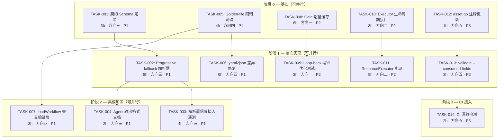
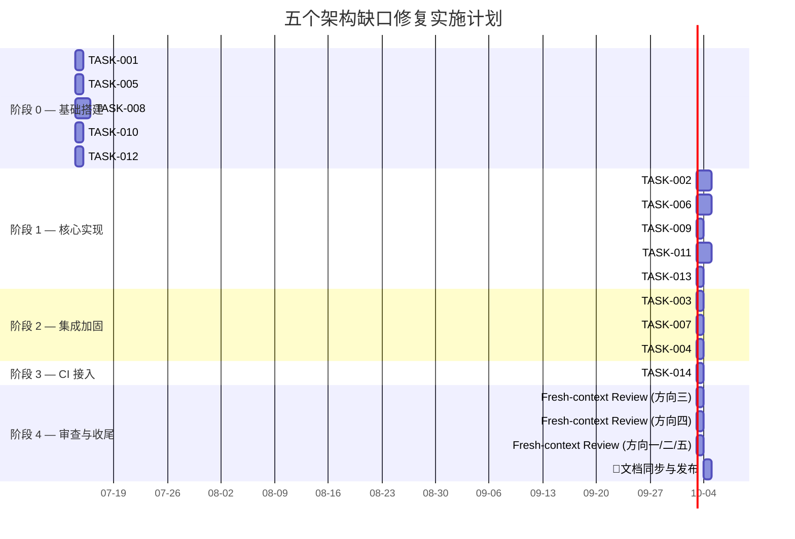

# Tech Lead 分析报告：五个架构缺口交叉验证

> **分析基准**: `docs/requirements/2026-07-12-five-uncovered-architectural-gaps-scan.out.md`
> **代码基线**: `commit a7d55ac` (HEAD, 2026-07-12)
> **分析角色**: Tech Lead
> **状态**: 初版

---

## 目录

1. [执行摘要](#1-执行摘要)
2. [任务分解](#2-任务分解)
3. [执行顺序与依赖图](#3-执行顺序与依赖图)
4. [技术风险](#4-技术风险)
5. [资源评估](#5-资源评估)
6. [质量保证](#6-质量保证)
7. [实施计划](#7-实施计划)
8. [附录：决策记录](#8-附录决策记录)

---

## 1. 执行摘要

### 1.1 总体评价

交叉验证确认了三个高价值发现、一个中等价值发现、一个需要修正命题的低优先级发现。**方向三（Agent 输出契约验证）和方向四（双 YAML 解析器静默语义漂移）应作为 P1 立即修复**。

| 优先级 | 方向 | 价值评估 | 工时估算 | 建议行动 |
|--------|------|---------|---------|---------|
| **P1** 🥇 | 方向三 · Agent 输出契约验证 | 最高 — 三条 load-bearing 路径全部基于 exact-match，无 fallback | 4-5 天 | **立即启动** |
| **P1** 🥇 | 方向四 · 双 YAML 解析器静默语义漂移 | 高 — 正确性风险，但积存成本低 | 3-4 天 | **立即启动** |
| **P2** 🥈 | 方向一 · Gate loop-back 重跑 | 中 — 墙钟优化，非正确性 | 3-5 天 | 方向三/四完成后 |
| **P2** 🥈 | 方向二 · AgentExecutor 生命周期真空 | 中 — 架构性债，当前无触发条件 | 3-4 天 | 方向三/四完成后 |
| **P3** 🔽 | 方向五 · asset.go 注释同步 + schema 校验缺失 | 低 — hygeine 改进 | 1-2 天 | 穿插在迭代间隙 |

### 1.2 关键背景（来自 CURRENT_SPRINT.md）

- 项目严格执行「先拆分，再继续」纪律 — 文件 ≥500 行 / 函数 ≥50 行触发的重构是硬闸门
- `forge accept` 是聚合 Stop 闸门，拒绝伪造 N/A
- **fresh-context Reviewer 必须独立** — 实现者不能审自己的代码
- forge-core Go 运行时**零外部依赖**（`go.mod` 无 `require`）
- 18 个 Go 包，全绿，纯标准库
- 「引用注释而不 grep 消费代码」被明确定位为方法缺陷（方向五的教训）

---

## 2. 任务分解

### 2.1 方向三 · Agent 输出契约验证（P1 🥇）

#### 现状

`cost.go` 中三个解析器全部基于 exact-match，无 schema 验证，无 progressive fallback：

| 解析器 | 机制 | 脆弱性 |
|--------|------|--------|
| `parseReviewerVerdict` | `lastNonEmptyLine` + switch exact-match | 加粗 `**APPROVE**`、句号 `APPROVE.`、尾部空行 → 静默 APPROVE |
| `parseConfidenceScore` | `strconv.Atoi` | `85%`、`85/100`、`eighty-five` → 全部拒绝（no signal） |
| `parseClaudeCostUsd` | `json.Unmarshal` | 多行输出 / stderr 混杂 → 整包拒绝 |
| `classifyClaudeOverload` | JSON envelope + 文本 fallback | **相对稳健** — 但仍缺少结构化 schema |

#### 任务清单

---

**TASK-001: 定义 Agent 输出契约 Schema**

- **标题**: 为三个机读契约定义结构化 Schema（JSON Schema 或 Go struct）
- **涉及文件**: 新建 `forge-core/internal/contract/schema.go`（或复用 `forge-core/cmd/forge/` 内已有模式）
- **前置依赖**: 无
- **预估工时**: 3 小时
- **验收标准**:
  - 为 VERDICT token 定义 `type VerdictContract struct`，含 `Verdict string` 枚举验证
  - 为 CONFIDENCE 定义 `type ConfidenceContract struct`，含 `Score int` + `[0,100]` 范围验证
  - 为 cost envelope 定义 `type CostContract struct`，复用已有的 `total_cost_usd` 指针模式
  - 三个 Schema 有配套单元测试，验证合法/边界/非法输入
  - 文档注释注明「加载机契约：这是 agent 卡 `.md` 与解析器之间的唯一协议」

---

**TASK-002: 实现 progressive fallback 解析器**

- **标题**: 将 exact-match 解析升级为 progressive fallback 链（structred → relaxed → heuristic）
- **涉及文件**: `forge-core/cmd/forge/cost.go`
- **前置依赖**: TASK-001
- **预估工时**: 8 小时
- **验收标准**:
  - **`parseReviewerVerdict`** 升级：
    - Layer 1: 结构化 JSON envelope 解析（若 claude 输出 JSON 包，从中取 `result` 段的 VERDICT token）
    - Layer 2: 当前 exact-match（保持不变作为 fallback）
    - Layer 3: 宽松匹配 — 大小写不敏感、移除 markdown 标记后匹配
    - Layer 3 不可静默 APPROVE — 必须记录告警（`logf("warning: verdict matched via relaxed rules")`）
  - **`parseConfidenceScore`** 升级：
    - Layer 1: `Atoi`（不变）
    - Layer 2: 解析 `"85%"`、`"85/100"`、`"85.0"` → 取数值部分
    - Layer 3: 文本启发式（`"high"` → 80, `"medium"` → 50, `"low"` → 20）
    - Layer 3 必须标记为 `relaxed=true`，供消费者决策
  - **`parseClaudeCostUsd`** 升级：
    - Layer 1: `json.Unmarshal` 单 JSON 对象（不变）
    - Layer 2: 多行输出中 grep `total_cost_usd` 行并提取数值
    - Layer 2 必须记录告警
  - 所有 fallback 路径返回一个 `(value, confidence enum, warning string)` 三元组
  - `confidence` 枚举: `EXACT` / `PARSED` / `RELAXED` / `HEURISTIC`
  - 100% 测试覆盖率（含现有点不通过的用例如 `"**APPROVE**"`、`"85%"`）

---

**TASK-003: 解析结果纳入观察/遥测管道**

- **标题**: 将解析 confidence 等级注入 trace/telemetry 管道，使 degraded 解析可观测
- **涉及文件**: `forge-core/cmd/forge/cost.go`、`forge-core/cmd/forge/prompt_context.go`、`forge-core/cmd/forge/observe.go`（若存在）
- **前置依赖**: TASK-002
- **预估工时**: 4 小时
- **验收标准**:
  - `observeFor`（或对应消费者）记录每个解析操作的 `parse_confidence` 维度
  - trace event 携带 `verdict_match: exact|parsed|relaxed|heuristic|missing`
  - `forge run` 在 verbose 模式（`--verbose`）下输出解析质量摘要
  - 遥测管道拒绝注入 `RELAXED`/`HEURISTIC` 级别的数据到 scorecard（不污染基线）
  - 单元测试验证 confidence 传播链完整

---

**TASK-004: 添加 Agent 输出格式规范（agent 卡文档）**

- **标题**: 为 `reviewer.md`、`product-manager.md`、`cto.md` 补充精确的输出格式规范段
- **涉及文件**: `.agent/agents/reviewer.md`、`.agent/agents/product-manager.md`、`.agent/agents/cto.md`
- **前置依赖**: TASK-001
- **预估工时**: 2 小时
- **验收标准**:
  - 每个 agent 卡新增 `## 输出契约` 段，定义精确的末行格式
  - 注明大小写敏感、禁止 markdown 包裹、禁止尾随标点
  - 注明 JSON 包时优先走结构化路径
  - 引用 `forge-core/cmd/forge/cost.go` 中的对应解析函数（SoT 不漂移）
  - `check.py` 新增 `check_agent_output_contract` 验证 agent 卡包含该段

---

### 2.2 方向四 · 双 YAML 解析器静默语义漂移（P1 🥇）

#### 现状

`loadWorkflow`（`main.go:353-393`）中 Go 解析器（`yaml2json.Decode`）正常时立即返回，**从不与 Python shim 的输出交叉验证**。两种解析器的 `any`→`json.Marshal` round-trip 的类型假设不完全一致（`int` vs `float64`、block scalar 处理、空序列等）。

#### 任务清单

---

**TASK-005: 添加 golden-file 回归测试**

- **标题**: 为当前全部 7 个真实 workflow YAML 文件建立 golden-file 回归测试
- **涉及文件**: 新建 `forge-core/cmd/forge/workflow_golden_test.go`
- **前置依赖**: 无
- **预估工时**: 4 小时
- **验收标准**:
  - 遍历 `.agent/workflows/*.yml` 全部文件（当前 7 个）
  - 对每个文件：分别用 Go 解析器和 Python shim 解析 → byte-compare JSON 输出
  - 断言 `bytes.Equal(goResult, pythonResult)` — **非自比，是真交叉检验**
  - 首次运行生成 golden file（`testdata/*.golden.json`），后续运行锁定
  - CI 模式下 golden file 不在 `GITHUB_ACTIONS` 中时自动更新（`-update` flag）
  - 覆盖边界：空 phase 列表、缺失字段、特殊 YAML 构造（anchor、multi-doc）
  - Python shim 不可用时测试**诚实 skip**（非 PASS，非 FAIL）

---

**TASK-006: 修复 yaml2json 已知差异**

- **标题**: 修复 Go yaml2json 解析器中与 Python shim 有差异的已知子问题
- **涉及文件**: `forge-core/internal/yaml2json/`（相关文件）
- **前置依赖**: TASK-005（先测量差异再修）
- **预估工时**: 6 小时
- **验收标准**:
  - block scalar（`>` / `|`）处理与 PyYAML 一致（Sprint 27 修了部分，验证是否仍有差异）
  - `int` vs `float64` 类型决策与 Python 一致（Sprint 27 提到过）
  - 裸 `-` 序列项正确处理（Sprint 30 修过，回归验证）
  - 空 map 与 null 的处理一致
  - 所有修改后 golden file 回归测试全绿

---

**TASK-007: 添加 loadWorkflow 内部交叉验证层**

- **标题**: 在 `loadWorkflow` 中 Go 解析成功后添加与 Python shim 的交叉验证（可选 fence）
- **涉及文件**: `forge-core/cmd/forge/main.go`
- **前置依赖**: TASK-005
- **预估工时**: 3 小时
- **验收标准**:
  - `loadWorkflow` 在 Go 解析成功后，异步调用 Python shim（goroutine with timeout）
  - 比较两个输出，如果不同则记录告警（`logf("WARNING: Go and Python parsers disagree ...")`）
  - **不破坏正常流程** — 仅告警，不阻断
  - 通过 `FORGE_STRICT_YAML=1` 环境变量可使不一致变为致命错误
  - 覆盖测试：mock 使 Go/Python 输出不同 → 验证告警/致命

---

### 2.3 方向一 · Gate loop-back 重跑（P2 🥈）

#### 现状

`RunFrom` 的 for-loop 在 loop-back 后**无条件重跑所有 gate**。当前 engine 无增量缓存机制。代码已验证（行号偏移 ~27，逻辑精确匹配）。

#### 任务清单

---

**TASK-008: 设计增量门缓存机制**

- **标题**: 设计并实现 gate 结果的增量缓存，避免 loop-back 时重跑相同 gate
- **涉及文件**: `forge-core/internal/orchestrator/orchestrator.go` + `forge-core/internal/orchestrator/gate_cache.go`（新建）
- **前置依赖**: 无
- **预估工时**: 6 小时
- **验收标准**:
  - `GateCache` 结构体，key 为 `(phaseIndex, gateName)`，value 为 `(verdict, outputHash)`
  - `RunFrom` 在 loop-back 时先查缓存，命中且 gate 输入未变则返回缓存结果
  - `outputHash` 为 gate 标准输出的 SHA256 — 输入未变 → 输出不变 → 跳过重跑
  - 如果 gate 脚本本身在两次调用之间被修改（通过 `os.Stat` + `ModTime`），强制失效
  - 向后兼容：无缓存时行为与现有完全一致
  - 遥测：`--verbose` 输出缓存命中/未命中统计

---

**TASK-009: 添加 loop-back 墙钟优化集成测试**

- **标题**: 为 loop-back 增量缓存添加端到端墙钟优化验证
- **涉及文件**: `forge-core/internal/orchestrator/orchestrator_test.go`
- **前置依赖**: TASK-008
- **预估工时**: 3 小时
- **验收标准**:
  - 建立含 3 个 gate phase 的 workflow 测试 fixture
  - 模拟 loop-back：首次跑触发 gate FAIL → 修 → 重跑
  - 验证第二次跑时，未变化 gate 的输出条数 = 0（仅重跑失败 gate + 后续 gate）
  - 验证缓存命中数 = 预期值
  - 验证 gate 脚本修改后缓存自动失效

---

### 2.4 方向二 · AgentExecutor 生命周期真空（P2 🥈）

#### 现状

`AgentExecutor` 接口只有一个 `Execute(ctx, p, mode) error` 方法。缺少 `Init` / `Shutdown` / `Rollback` / `Health` 生命周期钩子。`DryRunExecutor` 仍是唯一实现。

#### 任务清单

---

**TASK-010: 扩展 AgentExecutor 接口添加生命周期方法**

- **标题**: 为 AgentExecutor 接口添加 Init/Shutdown/Rollback/Health 方法
- **涉及文件**: `forge-core/internal/orchestrator/executor.go`
- **前置依赖**: 无（可独立于 TASK-011）
- **预估工时**: 3 小时
- **验收标准**:
  - 新接口定义：

```go
type AgentExecutor interface {
    // Execute performs the agent action for one phase.
    Execute(ctx context.Context, p asset.Phase, mode string) error
    // Init is called once before the first Execute. Resources (temp dirs, env vars)
    // should be set up here. Called at most once per Engine.RunFrom call.
    Init(ctx context.Context, wf asset.Workflow) error
    // Shutdown is called once after the last Execute (or on error). Resources
    // should be cleaned up here. Called at most once per Engine.RunFrom call.
    Shutdown(ctx context.Context) error
    // Rollback is called when a phase fails, to undo any side effects of
    // previously completed phases. Implementation is OPTIONAL (default no-op).
    Rollback(ctx context.Context, failedPhase asset.Phase) error
    // Health returns nil if the executor is healthy, or an error describing
    // the problem. Called before each Execute and on external health checks.
    Health(ctx context.Context) error
}
```

  - `DryRunExecutor` 实现所有新方法（全部无操作或返回 nil）
  - `Engine.RunFrom` 在循环前调用 `Init`，在循环后（或错误时）调用 `Shutdown`
  - 发生 phase 错误时调用 `Rollback`（仅对已成功完成的 phase）
  - 每次 `Execute` 前调用 `Health`
  - 向后兼容：现有 workflow 零行为变化

---

**TASK-011: 实现 ResourceExecutor（第一生命周期执行器）**

- **标题**: 实现一个支持资源生命周期的真实执行器（临时目录/环境变量治理）
- **涉及文件**: 新建 `forge-core/internal/orchestrator/resource_executor.go`
- **前置依赖**: TASK-010
- **预估工时**: 5 小时
- **验收标准**:
  - `ResourceExecutor` wraps `DryRunExecutor`（或未来的 `CommandExecutor`）
  - `Init`: 创建基于 workflow 名称的临时工作目录（`$TMPDIR/forge-<wf>/`）
  - `Init`: 注入环境变量（`FORGE_WORKFLOW`、`FORGE_PHASE_DIR`）
  - `Shutdown`: 清理临时目录（可配置保留）
  - `Rollback`: 按 phase 反向顺序清理产物
  - `Health`: 验证临时目录可写、磁盘空间充足
  - 与 `CommandExecutor` 兼容 — 当同时启用时，生命周期方法按正确顺序调用

---

### 2.5 方向五 · asset.go 注释同步 + schema 校验缺失（P3 🔽）

#### 修正命题

交叉验证发现原命题（4 个字段「未被消费」）**3/4 事实错误**。修正命题为：

> **P3 · 治理 hygiene**: `asset.go` 中 4 处 `ADDED HERE ONLY` 注释全部过期 + 没有 `forge validate --consumed-fields` 命令

#### 任务清单

---

**TASK-012: 更新 asset.go 过期注释**

- **标题**: 同步 asset.go 中 4 处 ADDED HERE ONLY 注释与实际消费代码
- **涉及文件**: `forge-core/internal/asset/asset.go`（line 121, 131, 141, 288 附近）
- **前置依赖**: 无
- **预估工时**: 1 小时
- **验收标准**:
  - `RequiresTools` 注释改为: `// consumed by prompt_context.go:requiresToolsGuard (degrade-and-flag)`
  - `Readonly(Phase)` 注释改为: `// enforced by engine_build.go:readonlyToolScope (disallow Edit/Write)`
  - `SecondaryTemplate` 注释改为: `// consumed by prompt_artifacts.go:secondaryTemplateContext`
  - `Readonly(Workflow)` 注释改为: `// phase-level Readonly enforced; workflow-level Readonly is structural (sets default for child phases); see engine_build.go`
  - 每条注释末尾统一格式: `// consumed by <file>:<func>` — 便于自动化扫描

---

**TASK-013: 实现 `forge validate --consumed-fields` 命令**

- **标题**: 添加一个验证子命令，为每个 asset struct 字段输出消费状态
- **涉及文件**: `forge-core/cmd/forge/validate.go` 或新文件 `forge-core/cmd/forge/validate_consumed.go`
- **前置依赖**: TASK-012
- **预估工时**: 3 小时
- **验收标准**:
  - `forge validate --consumed-fields` 输出一个表格：

```
Field                    Consumer                        Status
SecondaryTemplate        prompt_artifacts.go:117         ✅ consumed
Readonly(Phase)          engine_build.go:161             ✅ consumed
RequiresTools            prompt_context.go:423           ✅ consumed
SchemaCommand            (no consumer)                   ❌ orphan
```

  - 消费状态基于一个硬编码的注册表（`consumedFields map[string]string`），新字段必须手动注册
  - 没有自动检测「注释 ↔ 代码」一致性（超出范围），但每个 `ADDED HERE ONLY` 注释必须对应一个注册表条目
  - 注册表作为 SoT（注释引用注册表，而非注册表读注释）
  - 退出码：有 orphan 字段 → exit 1（可被 `--warn` 降级为告警）

---

**TASK-014: 添加字段消费状态的 CI 漂移检测**

- **标题**: 将 `forge validate --consumed-fields` 接入 `forge accept` 闸门
- **涉及文件**: `harness/check.py`（或 `harness/acceptance.mjs`）
- **前置依赖**: TASK-013
- **预估工时**: 2 小时
- **验收标准**:
  - `forge accept` 聚合中新增一个检查项：`consumed-fields`（无 orphan 字段 → PASS）
  - 注册表条目的添加/删除在代码审查时必须审核
  - 自测验证：引入一个故意 orphan 的字段 → `forge accept: REJECTED`

---

## 3. 执行顺序与依赖图

### 3.1 依赖图



### 3.2 并行策略

| 并行组 | 任务 | 所需角色 | 建议并行 Agent 数 |
|--------|------|---------|------------------|
| **G0** | T001, T005, T008, T010, T012 | 3 名资深 Go 工程师 + 1 名文档 | 3-4 |
| **G1** | T002, T006, T009, T011, T013 | 2 名资深 Go 工程师 + 1 名 DevOps | 2-3 |
| **G2** | T003, T007, T004 | 1 名 Go 工程师 + 1 名文档 | 2 |
| **G3** | T014 | 1 名 DevOps/CI 工程师 | 1 |

**关键依赖约束**：
- G1 全部任务必须在 G0 对应前序完成后才能开始
- G2 全部任务必须在 G1 完成后才能开始
- G3 只能在 G2 完成后开始
- **T001 → T002 → T003** 是方向三的最长关键路径

---

## 4. 技术风险

### 4.1 高风险项

| # | 风险 | 方向 | 级别 | 说明 | 缓解措施 |
|---|------|------|------|------|---------|
| R1 | **Progressive fallback 的置信度等级设计不当** | 三 | 🔴 | `EXACT`/`PARSED`/`RELAXED`/`HEURISTIC` 的分级可能过粗或过细。过细则接入方选择困难；过粗则无法区分「格式漂移小错」和「完全无信号」 | 初始设计保留 4 级，在 `forge run --verbose` 中可观测。先 ship 再迭代，不强求完美分级 |
| R2 | **Golden-file 测试的 Python shim 依赖** | 四 | 🟡 | CI 环境可能没有 Python3 或 PyYAML，导致 golden-file 测试被跳过，失去交叉验证价值 | CI 必须安装 python3 + PyYAML。在 `test_workflow_golden.go` 中，`skipIfNoPython()` 诚实 skip，但在 CI 中强制要求。`docs/ignition.md` 记录依赖 |
| R3 | **yaml2json 差异修复引入新回归** | 四 | 🟡 | 7 个真实 workflow 文件的 round-trip 行为极复杂——修一处差异可能破坏另一处。Go 类型系统（`int` vs `float64`）的隐式假设难以穷举 | golden-file 测试是安全网。所有修复必须通过 7 个真实文件的 byte-identical 验证 |
| R4 | **Gate 缓存键的语义精确性** | 一 | 🟡 | 仅靠 `outputHash` 可能不够——gate 可能依赖环境变量、文件系统状态、或全局服务状态。缓存命中但语义不同 → 假阳性跳过 | 缓存设计从保守开始：仅缓存 run-scoped 且 gate 输出 + gate 脚本 ModTime 作为 key。环境变量变化不命中缓存 |
| R5 | **Executor 生命周期与 CommandExecutor 的集成冲突** | 二 | 🟡 | `CommandExecutor` 有自己的一套资源管理（环境变量、工作目录）。`Init`/`Shutdown` 可能与现有行为冲突 | `ResourceExecutor` 作为装饰器（wrapper），而非继承。CommandExecutor 的原生行为保持不动 |

### 4.2 外部依赖

| 依赖 | 方向 | 当前状态 | 风险 |
|------|------|---------|------|
| Python3 + PyYAML | 四 | 存在（shim） | 低 — 已有，但 CI 必须保持 |
| Claude CLI | 三 | 存在（真点火已验证） | 低 — `--output-format json` 是 CLAUDE.md 官方特性 |
| 文件系统（临时目录） | 二 | 无 | 低 — 标准库支持 |
| OSV/NVD 数据库 | 不相关 | SCA 已有框架 | 低 — 不涉及本分析 |

### 4.3 性能考虑

| 维度 | 方向 | 当前 | 期望 | 策略 |
|------|------|------|------|------|
| Gate loop-back 重跑 | 一 | 无条件全量重跑 | 增量缓存后只重跑变化 gate | 缓存命中 → sub-millisecond 返回；未命中 → 原行为 |
| YAML 解析交叉验证 | 四 | 单路径（Go 成功时不跑 Python） | 交叉验证开启后多 ~100ms | Python shim 在 goroutine 中运行，不影响主路径响应 |
| Progressive fallback 解析 | 三 | 单路径 exact-match | 3 层 fallback 链 | 从 EXACT 开始，失败时短路到下一层 |

### 4.4 测试覆盖的难点

| 难点 | 方向 | 说明 | 策略 |
|------|------|------|------|
| 真 agent 的输出变化 | 三 | 不同的 Claude 版本、温度、prompt 可能产生不同的格式漂移 | 用 fixture 文件模拟已知的格式漂移模式，而非依赖真实 agent |
| yaml2json 的 int/float 分歧 | 四 | Go yaml2json 使用 `any`，JSON marshal 时 `int` 与 `float64` 的序列化不同 | golden-file 测试覆盖所有 7 个真实文件 + 边界构造（超大数字、科学计数法） |
| loop-back 场景的端到端测试 | 一 | 需要一个能真实触发 loop-back 的 gate 和修复流程 | 用 mock gate（首次 FAIL，第二次 PASS）模拟 loop-back |

---

## 5. 资源评估

### 5.1 人员需求

| 角色 | 所需技能 | 数量 | 分配 |
|------|---------|------|------|
| **资深 Go 工程师**（方向三/四核心） | 精通 Go、JSON Schema 设计、测试驱动开发 | 2 人 | T001-T003, T005-T007 |
| **Go 工程师**（方向一/二） | Go 并发、接口设计、缓存模式 | 1 人 | T008-T011 |
| **DevOps / CI 工程师** | Python、GitHub Actions、harness 框架 | 1 人（兼职） | T014 及 CI 集成 |
| **技术作者** | Markdown、agent 卡文档 | 1 人（兼职） | T004, T012 |
| **Reviewer**（fresh-context） | 全栈理解 forge-core 架构 | 每方向 1 人 | 每方向最后审查 |
| **Tech Lead** | 架构决策、跨方向协调 | 1 人 | 全程 |

**总计**: 3-4 名开发人员全职 + 1-2 名兼职人员，持续 1-2 sprints。

### 5.2 关键里程碑

| 里程碑 | 时间 | 交付物 | 验证方式 |
|--------|------|--------|---------|
| **M1**: Schema 定义完成 | Day 3 | `forge-core/internal/contract/schema.go` + 全部 golden file | `go test -race` 全绿，arch-check PASS |
| **M2**: 核心修复完成 | Day 8 | T002, T006, T011 代码 + 测试 | `forge accept: ACCEPTED` |
| **M3**: 集成加固完成 | Day 11 | T003, T007, T009 代码 + 遥测 | `go test -race` + gate.mjs + arch-check PASS |
| **M4**: CI 闸门接入完成 | Day 13 | T014 完成，`forge validate --consumed-fields` 集成 | `forge accept: ACCEPTED` |
| **M5**: Review + 文档 | Day 14 | 全部 fresh-context review + agent 卡文档更新 | 每个方向 reviewer APPROVE |

### 5.3 阻塞点与解决策略

| Blockers | 方向 | 解决策略 |
|----------|------|---------|
| Python3/PyYAML 在 CI 中不可用 | 四 | 安装依赖的 `apt-get`/`pip` 命令在 `.github/workflows/forge.yml` 中预装。若平台限制，golden-file 测试诚实 skip |
| Claude CLI 输出格式变化（`--output-format json`） | 三 | 方向三的第一原则：解析器 fail open。格式变化时回到 relaxed 模式，不阻断正常流程 |
| Go yaml2json 重写引入新 bug | 四 | 必须通过 7 个真实文件的 golden-file 测试 + `-race` 检测 |
| `cmd/forge` 包文件数预算 | 全部 | 任何使 `cmd/forge` 文件数超过 16 的修改都必须先创建新 `internal/` 包或重构。**不允许抬升 `package.max_files` 预算** |

---

## 6. 质量保证

### 6.1 单元测试覆盖要求

| 方向 | 最低覆盖 | 关键测试场景 |
|------|---------|------------|
| **方向三** | 95%（`cost.go`） | 每种解析器的每个 fallback layer；所有已知失败的输入（`**APPROVE**`、`85%`、多行 cost JSON）；confidence 传播链 |
| **方向四** | 90%（yaml2json + golden） | 全部 7 个真实 workflow 文件的 byte-identical 输出；block scalar / anchor / empty 构造 |
| **方向一** | 85%（orchestrator gate） | 缓存命中/未命中/失效；gate 脚本修改检测；env 变化后不命中 |
| **方向二** | 90%（executor + resource） | Init/Shutdown/Rollback/Health 完整调用链；Init 失败不进入 Execute；Rollback 顺序正确 |

### 6.2 集成测试策略

| 测试类型 | 方向 | 方法 | 工具 |
|---------|------|------|------|
| **Golden-file 回归** | 四 | 7 个真实 workflow YAML → 比较 Go vs Python 输出 | `go test` + `testdata/*.golden.json` |
| **Loop-back 墙钟** | 一 | mock gate 触发 FAIL → 修 → 重跑 → 验证增量缓存 | `orchestrator_test.go` 集成测试 |
| **Parse confidence chain** | 三 | 注入已知输入 → 验证 `observeFor` 在 trace 中记录置信度 | `cost_test.go` + trace mock |
| **Cross-validate layer** | 四 | mock Go/Python 产生不同输出 → 验证告警/致命 | `main_test.go` 集成测试 |
| **Executor lifecycle** | 二 | 验证 Init→Execute→Shutdown 完整调用，验证错误时 rollback | `executor_test.go` |

### 6.3 代码审查要点

每个 PR 在 fresh-context reviewer 审查时必须关注：

| 关注点 | 方向 | 审查问题 |
|--------|------|---------|
| **Fallback 安全** | 三 | RELAXED/HEURISTIC 匹配是否可能误判非 verdict 文本为批准？是否 fail open 正确？ |
| **Golden-file 漂移** | 四 | golden 文件是否被手动修改而非自动生成？是否有文件被排除？ |
| **缓存正确性** | 一 | 缓存键是否包含所有相关性维度？是否有语义上不同但哈希相同的风险？ |
| **生命周期顺序** | 二 | Init 失败后是否跳过所有 Execute？Shutdown 是否在 panic 时也被调用？ |
| **消费状态注册表** | 五 | 新字段是否已注册？注册表条目的 consumer 引用是否精确到函数级别？ |

### 6.4 性能测试需求

| 测试 | 方向 | 场景 | 基准 |
|------|------|------|------|
| Gate 缓存基准测试 | 一 | 10 gate phases, 3 次 loop-back | 全量重跑 vs 增量缓存，目标：缓存后 ≤5ms/phase |
| Golden-file 测试 latency | 四 | 7 个文件 Go + Python 解析 | 目标：≤2s 总时间（golden 测试不在关键路径上） |
| Fallback 解析器性能 | 三 | 1000 次解析（EXACT / RELAXED / HEURISTIC） | 目标：≤1μs/parse（相比当前 ≤0.1μs 的 exact-match 在可接受范围内） |

---

## 7. 实施计划

### 7.1 甘特图



### 7.2 阶段详情

#### 阶段 1: 基础搭建（Day 1-2）

| 日期 | 活动 | 产出 |
|------|------|------|
| Day 1 AM | TASK-001: Schema 定义 + TASK-012: 注释更新 | `contract/schema.go` + `asset.go` 注释 |
| Day 1 PM | TASK-005: Golden-file 测试 | 7 个 `.golden.json` 文件 + 回归测试 |
| Day 2 AM | TASK-008: 缓存设计 + TASK-010: 生命周期接口 | `gate_cache.go` + `executor.go` 接口扩展 |
| Day 2 PM | 团队内部审查 G0 产出 | G0 全绿，进入 G1 |

#### 阶段 2: 核心实现（Day 3-6）

| 日期 | 活动 | 产出 |
|------|------|------|
| Day 3-4 | TASK-002: Fallback 解析器实现 | 升级版 `cost.go` 全部 3 个解析器 |
| Day 3-4 | TASK-006: yaml2json 差异修复 | 修正版 `yaml2json/` |
| Day 4-5 | TASK-009 + TASK-011: 缓存测试 + 资源执行器 | `orchestrator_test.go` + `resource_executor.go` |
| Day 5-6 | TASK-013: `validate --consumed-fields` | `validate_consumed.go` + 注册表 |

**风险检查点（Day 5）**：
- TASK-002 的 fallback 链是否通过了全部已知失败的测试用例？
- TASK-006 的 7 个 golden file 是否 **byte-identical**？
- TASK-013 的注册表是否覆盖了所有 `asset.go` 字段？

#### 阶段 3: 集成加固（Day 7-9）

| 日期 | 活动 | 产出 |
|------|------|------|
| Day 7 | TASK-003: 遥测接入 | `observeFor` 解析置信度维度 |
| Day 8 | TASK-007: 交叉验证层 | `loadWorkflow` 告警逻辑 |
| Day 8-9 | TASK-004 + TASK-014: 文档 + CI | 更新 agent 卡 + `forge accept` 检查项 |
| Day 9 | 完整 `forge accept` 预演 | 全部改动集成，6 PASS + 0 FAIL + 5 N/A |

#### 阶段 4: 审查与发布（Day 10-14）

| 日期 | 活动 | 产出 |
|------|------|------|
| Day 10-11 | 方向三 fresh-context review | 至少 1 个 blocking 或 important 发现 |
| Day 11-12 | 方向四 fresh-context review | 同上 |
| Day 12 | 方向一/二/五 fresh-context review | 同上 |
| Day 13 | 修复 review 发现 + 回归 | 所有发现已修 + 回归测试 |
| Day 14 | 文档同步 + 最终 `forge accept` | **ACCEPTED** |

---

## 8. 附录：决策记录

### ADR-2026-07-12-001: 为何方向三优先于方向一

**决策**: 方向三（Agent 输出契约验证，P1）优先于方向一（Gate loop-back，P2）。

**理由**:
1. 方向三涉及**正确性**（静默 APPROVE = 跳过必要的更改请求），方向一涉及**性能**（墙钟优化）
2. 方向三的 fallback 实现可以作为方向一缓存设计的前置条件（都是从 exact-match 到 progressive matching 的模式）
3. 方向三的成本低（~4 天），收益高（防止静默错误）

### ADR-2026-07-12-002: progressive fallback 的置信度等级

**决策**: 采用 4 级置信度枚举（EXACT / PARSED / RELAXED / HEURISTIC）。

**理由**:
- 太细（如 EXACT_JSON / EXACT_LINE / TRIMMED / LOWERCASE / STEM / HEURISTIC）会让消费者难以决策
- 太粗（如 HIGH / MEDIUM / LOW）会丢失有用信息
- 4 级对应具体的解析行为边界：
  - EXACT = 格式与 Schema 完全一致（零容错）
  - PARSED = 从结构化信封（JSON）中提取
  - RELAXED = 格式有小偏差（大小写、标点、markdown 包裹）但内容精确匹配
  - HEURISTIC = 从文本中推测（`"high"` → 80），不确定

### ADR-2026-07-12-003: Golden-file 测试不自动更新

**决策**: golden-file 测试仅通过 `-update` flag 更新，禁止 CI 自动覆盖。

**理由**:
- 自动更新可能掩盖真实的语义漂移
- 格式：`go test ./cmd/forge/ -run TestWorkflowGolden -update`
- CI 中缺少 `-update` flag → 严格比较
- 这遵循项目「honesty」传统：N/A 时诚实 skip，失败时诚实 FAIL

### ADR-2026-07-12-004: 方向五不升级为 P2

**决策**: 尽管修正命题后方向五有合理价值，仍保持 P3。

**理由**:
- `forge validate --consumed-fields` 是一个治理工具，它本身不修复任何 bug
- 注释过期是 hygien 问题，不是功能缺失
- 项目有更紧急的正确性问题（方向三/四）需要资源
- 方向五可以穿插在迭代间隙，由单 agent 在半天内完成

---

*文档结束*
