# Tech Lead 分析报告:五个高价值系统级扩展方向

> **角色**: 资深 Tech Lead | **日期**: 2026-07-12  
> **审计对象**: 已验证的五方向(Time Budget · Cross-Artifact Consistency · Multi-Agent Deliberation · Graduated Quality Scoring · Adaptive Governance)  
> **基础假设**: 代码层验证确认五方向均为**真的不存在**文档/代码已有覆盖,可行性评估基于 forge-core 现有架构

---

## 目录

1. [方向概述与优先级](#1-方向概述与优先级)
2. [任务分解](#2-任务分解)
3. [执行顺序与依赖图](#3-执行顺序与依赖图)
4. [技术风险](#4-技术风险)
5. [资源评估](#5-资源评估)
6. [质量保证](#6-质量保证)
7. [实施计划](#7-实施计划)
8. [总结与推荐](#8-总结与推荐)

---

## 1. 方向概述与优先级

### 方向对比矩阵

| # | 方向 | 核心命题 | 当前状态 | 影响范围 | 预估工作量 | 优先级 |
|---|---|---|---|---|---|---|
| ① | **Time Budget** (时间预算) | `forge run/evolve` 缺乏 wall-clock 总时间规划;只有单命令 Timeout | `Timeout` 在 `CommandExecutor` 级别,单命令不覆盖全 run;trace 的 `DurationMs` 事后统计;`MaxIter` 是安全后盾非规划器 | 核心运行时(CLI+orchestrator) | ~3-4 人·周 | **P1** |
| ② | **Cross-Artifact Consistency** (跨制品一致性) | 无 PRD→Code→Test 可追溯性;无声明式约束格式 | `converge.Signals` 有 `RoadmapCompletion`(agent 自报,非客观检查)、`FileDelta`(启发式 git diff)、`CodeTestRatio`(无实际跨阶段内容验证) | 收敛引擎+编排层+harness | ~4-6 人·周 | **P2** |
| ③ | **Multi-Agent Deliberation** (多 Agent 协商) | 无 mesh/network 拓扑;全 pipeline 拓扑 | `phaseOutputLedger` 前馈、`reviewFindingsLedger` 跨迭代、`trace` 线性 JSONL、无 `deliberation` 数据结构 | 核心编排层(prompt+orchestrator) | ~5-8 人·周 | **P3** |
| ④ | **Graduated Quality Scoring** (渐进式质量评分) | 所有闸门是二值 PASS/FAIL/NA | `gate.Result{Status: "PASS"|"FAIL"|"NA"}`, `converge.evalOne` → threshold 二值,`acceptance.mjs decide` → ACCEPTED/REJECTED,无 rubric 系统 | 闸门层(harness+gate+converge) | ~3-5 人·周 | **P1** |
| ⑤ | **Adaptive Governance** (自适应治理) | mode 策略每次运行静态固定 | `mode.Effective()` 启动调用一次;`mode_gating.go` 全一次性决策;`doctor/anomaly.go` 检测趋势但无反馈回路到治理层;`LoopEngine.OnIteration` 存在但无 Policy 回灌 | 治理层(mode+orchestrator+CLI) | ~5-8 人·周 | **P2** |

### 优先级说明

- **P1(必须)**: 方向①和④直接关系到"真点火"场景下的可预测性和可信任度——无时间预算则 24h 自治运行无法预估烧钱速度;无渐进评分则所有闸门告警无差异化处理
- **P2(重要)**: 方向②和⑤决定 ForgeOS 作为长期自治系统的自我进化能力;但短期内可通过人工检查和简单脚本缓解
- **P3(期望)**: 方向③是最高杠杆的架构演进方向,但它建立在前四个方向的基础之上,且当前 pipeline 拓扑对单项目场景足够

---

## 2. 任务分解

### 方向①: Time Budget (时间预算)

#### 当前架构分析

org.chorestrator 当前的时间控制体系:

```
CommandExecutor.Timeout       → 单个子进程超时(秒级)
Engine.MaxIter                 → 循环安全后盾(迭代次数,非时间)
trace.Event.DurationMs         → 事后记录(无预测)
LoopEngine.MaxAgentCalls       → 数量上限,非时间预算
```

**缺口**: 无「开始前先算:总 wall-clock 预算」→「按阶段分配」→「执行中动态调整」的全链路时间治理。24h 自治运行里,无时间预算意味着成本失控。

#### 任务分解表

| 任务 ID | 任务标题 | 涉及文件 | 前置依赖 | 预估工时 | 验收标准 |
|---|---|---|---|---|---|
| TASK-001 | **时间预算数据结构定义** | `internal/budget/time.go` (新建), `internal/asset/asset.go` (Phase/Workflow 扩展) | 无 | 3h | `TimeBudget` struct 含: `TotalBudget time.Duration`, `PhaseAllocations []PhaseAllocation{PhaseName, MaxDuration, Buffer}`, `Strategy string(fixed\|adaptive\|proportional)`. Workflow/StopCondition 可声明 `time_budget` |
| TASK-002 | **阶段时间分配器** | `internal/budget/allocate.go` (新建), `internal/budget/allocate_test.go` | TASK-001 | 4h | `Allocate(phases []Phase, totalBudget Duration, strategy string) error` —— 按 mode/lifecycle 将总预算分配到各阶段,预留 buffer。proportional 模式根据历史耗时(从 scorecard/trace 读)分配。全覆盖单元测试 |
| TASK-003 | **运行时时间追踪器** | `internal/budget/tracker.go` (新建) | TASK-001 | 3h | `BudgetTracker` 跟踪: 已用 wall-clock、剩余预算、每阶段消耗。`Remaining() time.Duration`, `PhaseBudget(phaseIdx int) time.Duration`, `Exhausted() bool` |
| TASK-004 | **Engine 时间预算集成** | `internal/orchestrator/orchestrator.go` (扩展), `internal/orchestrator/budget_test.go` | TASK-002, TASK-003 | 6h | `Engine.Budget *TimeBudget` 字段;`RunFrom` 每次迭代检查 `ctx` 的同时检查预算;超预算的相位不执行,返回 `BudgetExhausted` 错误;dry-run 叙述预算分配 |
| TASK-005 | **LoopEngine 跨迭代时间治理** | `internal/orchestrator/loop.go` (扩展) | TASK-004 | 4h | `LoopEngine.OnBeforeIteration` 检查剩余预算;迭代后更新剩余;跨迭代重新分配(adaptive strategy)。单测验证 budget 耗尽时 loop 提前收敛(非 FAIL) |
| TASK-006 | **CLI 时间预算参数** | `cmd/forge/main.go`, `cmd/forge/evolve.go`, `cmd/forge/run_budget.go` (新建) | TASK-004, TASK-005 | 4h | `--time-budget 30m` 标志(解析 30m/1h/2h);`--budget-strategy fixed\|adaptive`;`forge preflight` 报告预算分配;`forge run/evolve budget` 子命令预览分配 |
| TASK-007 | **时间预算 trace 事件** | `internal/trace/trace.go`, `internal/budget/events.go` (新建) | TASK-003 | 2h | 新增 `budget_allocation`/`budget_warning`/`budget_exhausted` 三类事件;`DecisionEvent` 扩展携带预算信息;scorecard 预算消耗趋势 |

**方向①合计: ~26h (约 3.5 人·日)**

---

### 方向②: Cross-Artifact Consistency (跨制品一致性)

#### 当前架构分析

`converge.Signals` 当前:

```go
RoadmapCompletion float64   // agent 自报,无客观验证
FileDelta         float64   // git diff 关键词匹配启发式
CodeTestRatio     float64   // git diff --stat
```

**缺口**: 无「PRD 里的模块声明 → 代码包确实存在 → 测试覆盖该模块」的可追溯性。agent 说做完了(勾选 ROADMAP 项)不等物品确实被写出来了。

#### 任务分解表

| 任务 ID | 任务标题 | 涉及文件 | 前置依赖 | 预估工时 | 验收标准 |
|---|---|---|---|---|---|
| TASK-101 | **声明式约束 DSL 定义** | `internal/consistency/constraint.go` (新建), `internal/consistency/constraint_test.go` | 无 | 6h | 定义 `Constraint` 类型: `{Kind: "module_exists"|"test_covers"|"api_contract"|"declaration_in_prd", Source, Target, Matcher}`。JSON 序列化/反序列化。支持 AND/OR 组合 |
| TASK-102 | **PRD→Code 模块追溯检查器** | `internal/consistency/prd_checker.go` (新建), `internal/consistency/prd_checker_test.go` | TASK-101 | 5h | 读取 PRD 文档(从 `docs/discovery/`),提取声明模块名(正则/启发式),对照代码库存在的包/文件路径。输出 `ModuleCoverage: map[string]bool`。对 `docs/requirements/` 方向类文档同样适用 |
| TASK-103 | **Code→Test 覆盖追溯检查器** | `internal/consistency/test_checker.go` (新建) | TASK-101 | 4h | 对每个生产模块,检查对应的 `_test.go` 或 spec 文件存在。支持多语言适配。输出 `TestCoverage: map[string]bool` |
| TASK-104 | **约束文件加载与校验框架** | `internal/consistency/loader.go` (新建), `internal/consistency/loader_test.go` | TASK-101 | 3h | 从 `.agent/consistency/` 目录加载 `.cons` 约束文件;`forge check` 新增 `consistency` 检查项;约束声明不在时诚实 N/A |
| TASK-105 | **converge.Signals 扩展** | `internal/converge/converge.go`, `internal/converge/consistency_test.go` | TASK-102, TASK-103 | 4h | `Signals` 新增字段: `ConsistencyCheck map[string]string` (约束名→PASS/FAIL/NA);新 `evalConsistency` 分支;收敛报告渲染约束检查结果 |
| TASK-106 | **CLI 约束检查命令** | `cmd/forge/consistency.go` (新建) | TASK-104, TASK-105 | 3h | `forge consistency [--prd-dir] [--check-all]` 命令,输出模块级追溯矩阵(framework: 文件存在性,code: 对应模块,test: 对应测试)。CI 可集成 |

**方向②合计: ~25h (约 3.5 人·日)**

---

### 方向③: Multi-Agent Deliberation (多 Agent 协商)

#### 当前架构分析

当前拓扑:

```
planner → implementer → harness-gates → reviewer → qa (单向 pipeline)
```

数据流:
- `phaseOutputLedger` → 前馈 phase 输出到后续 phase
- `reviewFindingsLedger` → 跨迭代汇总评审发现
- `trace` → 线性 JSONL 审计轨迹

**缺口**: 无「双向协商」数据结构;各 agent 间不能并行讨论或形成共识。REVIEW 段 reviewer 做出裁决后没有回馈给 implementer 做结构化的联合调试。

#### 任务分解表

| 任务 ID | 任务标题 | 涉及文件 | 前置依赖 | 预估工时 | 验收标准 |
|---|---|---|---|---|---|
| TASK-201 | **Deliberation 数据结构定义** | `internal/deliberation/types.go` (新建), `internal/deliberation/types_test.go` | 无 | 5h | `Message{From, To, Phase, Kind, Body, Timestamp}`; `Thread{Topic, Messages[], Status, Resolution}`; `Topology{MeshConnections[]}`; round-trip JSON |
| TASK-202 | **协商拓扑配置框架** | `internal/deliberation/topology.go` (新建), `asset/asset.go` (Phase/Workflow 扩展) | TASK-201 | 4h | Phase 加 `DeliberatesWith []string`(协商对端 phase 名);Workflow 加 `DeliberationTopology` 块;向后兼容:空=现有 pipeline 行为 |
| TASK-203 | **协商消息总线** | `internal/deliberation/bus.go` (新建), `internal/deliberation/bus_test.go` | TASK-201 | 6h | `DeliberationBus`: async channel-based 消息路由;`Publish(msg)`;`Subscribe(phase) chan`;`Thread(phase) []Message`;生命周期跟随 session(不持久化)。dry-run 记录消息流 |
| TASK-204 | **reviewer→implementer 反馈回路** | `internal/orchestrator/orchestrator.go` (扩展), `internal/deliberation/feedback.go` (新建) | TASK-203, TASK-201 | 8h | harness-gate FAIL 后,不是简单 loop-back,而是通过 DeliberationBus 将 gate 具体反馈注回 implementer;implementer 可以回复澄清。`reviewFindingsLedger` 通过协商总线注入 implementer prompt。定向修复 vs 全量重跑 |
| TASK-205 | **并行协商相位** | `internal/orchestrator/parallel.go` (扩展), `internal/orchestrator/waves.go` | TASK-203 | 6h | 当 `depends_on` 和 `deliberates_with` 共存时,并行执行的 agent 可通过协商总线交换中间结果。新增 `DeliberateWave` 调度器,在依赖波次基础上增加协商轮次 |
| TASK-206 | **协商 trace 事件** | `internal/trace/trace.go`, `internal/deliberation/trace.go` (新建) | TASK-203 | 3h | 新增 `deliberation_message`/`deliberation_round`/`deliberation_resolved` 三类事件;trace 播放器可回放协商过程 |

**方向③合计: ~32h (约 4 人·日)**

---

### 方向④: Graduated Quality Scoring (渐进式质量评分)

#### 当前架构分析

所有闸门:

```go
// gate/result.go
type Result struct {
    Name   string
    OK     bool
    Status string // PASS | FAIL | NA
}
```

`converge.evalOne` → 二值 threshold 对比

`acceptance.mjs decide` → ACCEPTED / REJECTED 二值

**缺口**: 无中间状态。lint 有一个 warning 和有一个 error 都被 report 为 FAIL。ACC 闸门没有"可接受程度"的概念。

#### 任务分解表

| 任务 ID | 任务标题 | 涉及文件 | 前置依赖 | 预估工时 | 验收标准 |
|---|---|---|---|---|---|
| TASK-301 | **评分 Rubric 定义与 DSL** | `internal/score/rubric.go` (新建), `internal/score/rubric_test.go` | 无 | 6h | `Rubric{Name, Criteria[], Weight, PassThreshold, FailThreshold}`; `Criterion{Metric, Operator, Weight, Level(string|float|enum)}`; 支持连续评分(0-100)和等级评分(A/B/C/D/F)。YAML/JSON 均支持 |
| TASK-302 | **渐进式评分引擎** | `internal/score/eval.go` (新建), `internal/score/eval_test.go` | TASK-301 | 6h | `Evaluate(rubric, signals) ScoreResult`; `ScoreResult{Overall float64, Breakdown map[string]float64, Level string, Passed bool}`; `Level` 从 PASS/CONDITIONAL_PASS/BORDERLINE/FAIL/MINOR_FAIL/MAJOR_FAIL 枚举。阈值可配置 |
| TASK-303 | **gate.Result 扩展** | `internal/gate/gate.go`, `internal/gate/gate_test.go` | TASK-302 | 3h | `Result` 加 `Score float64` 和 `Level string`(可选,向后兼容:0 和空字符串=现有二值)。`ProbeAll` 的每 criterion 输出加 `score` 和 `level` |
| TASK-304 | **acceptance.mjs 评分适配** | `harness/acceptance.mjs`, `harness/acceptance-quality.mjs`, `harness/acceptance-kernel.mjs` | TASK-303 | 6h | `--score-mode` 模式:输出评分而非二值。`--json` 加 `score` 和 `level` 字段。`decide` 函数加 `acceptance_mode: strict|graduated|advisory`。`forge accept --mode graduated` |
| TASK-305 | **converge 评分集成** | `internal/converge/converge.go`, `internal/converge/score_test.go` | TASK-304 | 4h | `Signals` 新增 `ScoreResult *ScoreResult`(指针: nil=无评分模式);新 `evalScore` 分支: `score >= pass_threshold → Met`, `score >= fail_threshold < pass_threshold → Conditional`, `score < fail_threshold → Unmet` |
| TASK-306 | **CLI 渐进式评分命令** | `cmd/forge/score.go` (新建), `cmd/forge/score_test.go` | TASK-304, TASK-305 | 4h | `forge score [--rubric] [--mode graduated] [--json]`;`forge gate --mode graduated`;`forge accept --mode graduated`;输出评分矩阵(蛛网图/雷达图格式) |
| TASK-307 | **评分 Rubric 模板** | `.agent/rubrics/` (新建目录), `.agent/rubrics/quality.yml`, `.agent/rubrics/security.yml` | TASK-301 | 2h | 默认 rubrics: `quality.yml`(lint 结果→分+覆盖率→分+测试通过率→分), `security.yml`(secret 扫描+风险评估)。`forge-init` 复制模板 |

**方向④合计: ~31h (约 4 人·日)**

---

### 方向⑤: Adaptive Governance (自适应治理)

#### 当前架构分析

```go
// mode.Effective() 启动时调用一次,静态贯穿整个 run/evolve
p := mode.Effective(mode, lifecycle)
// mode_gating.go 所有决策使用这一份 Policy
// doctor/anomaly.go 检测趋势但无处反馈
// LoopEngine.OnIteration 存在但不改 Policy
```

**缺口**: 无反馈回路。运行过程中积累的信息(闸门失败率、agent 超时率、成本趋势)从不反哺治理决策。

#### 任务分解表

| 任务 ID | 任务标题 | 涉及文件 | 前置依赖 | 预估工时 | 验收标准 |
|---|---|---|---|---|---|
| TASK-401 | **治理反馈信号定义** | `internal/governance/signal.go` (新建) | 无 | 4h | `FeedbackSignal{Kind, Value, Trend, Confidence, Timestamp}`; `SignalKind` 枚举: `GateFailRate`, `AgentTimeoutRate`, `CostAcceleration`, `ConvergeIterationCount`, `ReviewRejectRate`, `FileDeltaTrend` |
| TASK-402 | **信号采集器(运行时)** | `internal/governance/collector.go` (新建), `internal/governance/collector_test.go` | TASK-401 | 5h | `Collector` 挂入 `LoopEngine.OnIteration` 和 `Engine.OnGateResult`;每迭代采集: gate pass/rate、agent 超时、使用成本增量、文件变化趋势。滑动窗口(默认最近 10 次迭代或 30 分钟) |
| TASK-403 | **自适应策略引擎** | `internal/governance/adaptive.go` (新建), `internal/governance/adaptive_test.go` | TASK-402 | 8h | `AdaptivePolicy{ModePolicy, Thresholds[], Escalations[]}`; 规则引擎: `if gate_fail_rate > 0.3 over window => escalate mode to engineering`, `if cost_acceleration > 1.5 => tighten budget`, `if no_progress > 2 => suggest human review`; 输出 `GovernanceDelta{Field, OldValue, NewValue, Reason}` |
| TASK-404 | **mode.Effective 动态重评估** | `internal/mode/mode.go` (扩展), `internal/mode/dynamic_test.go` | TASK-403 | 5h | `mode.EffectiveDynamic(current Policy, signals []FeedbackSignal) Policy`; 只收紧不放松(方向同 lifecycle production override); 返回 new Policy + reasons(记录到 trace)。向后兼容:无信号输入返回原 Policy |
| TASK-405 | **LoopEngine 自适应集成** | `internal/orchestrator/loop.go` (扩展), `internal/orchestrator/loop_adaptive_test.go` | TASK-404 | 6h | `LoopEngine.Adaptive bool`; 若 true,每迭代调用 `EffectiveDynamic` 更新 `Engine.ModePolicy`; 收紧后下迭代立即生效; `forge evolve --adaptive` 启用 |
| TASK-406 | **治理自适应 trace 事件** | `internal/trace/trace.go`, `internal/governance/trace.go` (新建) | TASK-403 | 2h | 新增 `governance_escalation`/`governance_mode_change`/`governance_signal` 三类事件; 每次自适应调整都记录原值、新值、理由 |
| TASK-407 | **预检:自适应治理预测报告** | `cmd/forge/governance.go` (新建), `cmd/forge/governance_test.go` | TASK-405, TASK-406 | 5h | `forge governance [--predict] [--history trace.jsonl]`; 离线分析 trace + scorecard 预测自适应行为(不实际改变 Policy);`forge preflight` 扩展输出自适应风险等级 |
| TASK-408 | **doctor 反馈回路集成** | `internal/doctor/anomaly.go` (扩展), `internal/doctor/governance_test.go` | TASK-403 | 4h | `doctor.DetectAnomalies()` 输出作为 `FeedbackSignal` 源; 新 `SignalKind: LongFunctionTrend`, `CircularDependencyTrend`, `OversizedFileTrend`; 结构趋势恶化自动收紧闸门 |

**方向⑤合计: ~39h (约 5 人·日)**

---

## 3. 执行顺序与依赖图

### 阶段划分

```
阶段 1(基础设施): TASK-001, TASK-101, TASK-201, TASK-301, TASK-401
阶段 2(核心引擎): TASK-002~004, TASK-102~105, TASK-202~204, TASK-302~305, TASK-402~405
阶段 3(CLI+集成): TASK-005~006, TASK-106, TASK-205~206, TASK-306~307, TASK-406~408
阶段 4(验证+发布): 全方向验收测试+集成测试+文档
```

### Mermaid 依赖图

```mermaid
graph TB
    %% ===== Phase 1: Foundation =====
    subgraph Phase1 [阶段 1: 基础设施搭建]
        T001[TASK-001: 时间预算数据结构]
        T101[TASK-101: 约束 DSL 定义]
        T201[TASK-201: Deliberation 数据结构]
        T301[TASK-301: 评分 Rubric DSL]
        T401[TASK-401: 治理反馈信号定义]
    end

    %% ===== Phase 2: Core Engines =====
    subgraph Phase2 [阶段 2: 核心功能实现]
        %% Direction 1
        T002[TASK-002: 阶段时间分配器]
        T003[TASK-003: 运行时时间追踪器]
        T004[TASK-004: Engine 时间预算集成]
        
        %% Direction 2
        T102[TASK-102: PRD→Code 追溯检查器]
        T103[TASK-103: Code→Test 覆盖追溯]
        T104[TASK-104: 约束文件加载框架]
        T105[TASK-105: converge.Signals 扩展]
        
        %% Direction 3
        T202[TASK-202: 协商拓扑配置]
        T203[TASK-203: 协商消息总线]
        T204[TASK-204: reviewer→implementer 反馈]
        
        %% Direction 4
        T302[TASK-302: 渐进式评分引擎]
        T303[TASK-303: gate.Result 扩展]
        T304[TASK-304: acceptance.mjs 评分适配]
        T305[TASK-305: converge 评分集成]
        
        %% Direction 5
        T402[TASK-402: 信号采集器]
        T403[TASK-403: 自适应策略引擎]
        T404[TASK-404: mode 动态重评估]
        T405[TASK-405: LoopEngine 自适应集成]
    end

    %% ===== Phase 3: CLI + Integration =====
    subgraph Phase3 [阶段 3: CLI/集成/测试]
        %% Direction 1
        T005[TASK-005: LoopEngine 跨迭代时间治理]
        T006[TASK-006: CLI 时间预算参数]
        T007[TASK-007: 时间预算 trace 事件]
        
        %% Direction 2
        T106[TASK-106: CLI 约束检查命令]
        
        %% Direction 3
        T205[TASK-205: 并行协商相位]
        T206[TASK-206: 协商 trace 事件]
        
        %% Direction 4
        T306[TASK-306: CLI 渐进式评分命令]
        T307[TASK-307: 评分 Rubric 模板]
        
        %% Direction 5
        T406[TASK-406: 治理自适应 trace 事件]
        T407[TASK-407: 自适应治理预测报告]
        T408[TASK-408: doctor 反馈回路集成]
    end

    %% ===== Dependencies =====
    T001 --> T002 --> T003 --> T004
    
    T101 --> T102 --> T104 --> T105
    T101 --> T103 --> T104
    
    T201 --> T202 --> T203 --> T204
    
    T301 --> T302 --> T303 --> T304 --> T305
    
    T401 --> T402 --> T403 --> T404 --> T405
    
    T004 --> T005
    T005 --> T006 --> T007
    
    T104 --> T106
    
    T203 --> T205 --> T206
    
    T304 --> T306 --> T307
    
    T404 --> T406 --> T407
    T403 --> T408
    
    %% Cross-direction dependencies
    T303 -.-> T305
    
    %% Group markers for parallel execution
    T002 -.->|并行组 A| T102
    T002 -.->|并行组 A| T202
    T002 -.->|并行组 A| T302
    T002 -.->|并行组 A| T402
    
    T003 -.->|并行组 B| T103
    T003 -.->|并行组 B| T203
    T003 -.->|并行组 B| T303
    T003 -.->|并行组 B| T403
    
    T005 -.->|并行组 C| T106
    T005 -.->|并行组 C| T205
    T005 -.->|并行组 C| T306
    T005 -.->|并行组 C| T406
```



### 可并行执行的任务组

| 并行组 | 包含任务 | 条件 | 推荐人力 |
|---|---|---|---|
| **组 A** (Phase 2 并行) | T002, T102, T202, T302, T402 | 各自 Phase 1 完成 | 5 人 |
| **组 B** (Phase 2 次并行) | T003, T103, T203, T303, T403 | 组 A 时序依赖(部分可重叠) | 5 人 |
| **组 C** (Phase 3 并行) | T005, T106, T205, T306, T406 | Phase 2 核心完成 | 5 人 |
| **独立任务** | T105(依赖 T102+T103+T104), T204(依赖 T202+T203), T305(依赖 T302+T303+T304), T405(依赖 T402+T403+T404) | 各自上游完成 | 3-5 人 |

---

## 4. 技术风险

### 4.1 风险矩阵

| 风险 ID | 风险描述 | 影响方向 | 可能性 | 影响程度 | 风险等级 | 缓解策略 |
|---|---|---|---|---|---|---|
| **R-001** | 时间预算与现有 `MaxIter`/`MaxAgentCalls`/`MaxLoopBack` 三套安全护栏语义冲突 | ① | 中 | 高 | **高** | 统一预算模型: `TimeBudget` 是最高级约束,其他护栏降级为次级。设计文档明确优先级: time > agent-calls > loop-back > max-iter |
| **R-002** | 跨制品约束 DSL 太过复杂,变成第三套 YAML 格式增加认知负荷 | ② | 高 | 中 | **高** | 严格限制 DSL 原语数 ≤ 5 (module_exists, test_covers, api_contract, declaration_in_prd, cross_ref)。不搞通用规则引擎 |
| **R-003** | 多 Agent 协商总线引入死锁/活锁风险(双向通信中 agent 互相等待) | ③ | 中 | 非常高 | **极高** | 协商轮次上限(默认 3 round);超时自动退化为单向 pipeline;消息总线不支持阻塞 await(全异步) |
| **R-004** | 渐进式评分改变现有 gate 二值契约,破坏所有现有 harness 消费者 | ④ | 高 | 高 | **高** | 评分字段全 optional(零值=现有行为);acceptance.mjs `--mode strict` 维持现有二值;新消费者必须显式 opt-in |
| **R-005** | 自适应治理动态收紧 mode 策略,可能导致用户困惑("为什么我的 explorer 变 engineering 了") | ⑤ | 中 | 中 | **中** | 每次自适应调整记录到 trace(`governance_mode_change`);`forge governance report` 输出调整链;`--adaptive` 必须显式启用(default false) |
| **R-006** | 五个方向同时开发导致架构不一致性(时间预算的数据结构影响 gate 评分,评分影响自适应,自适应影响时间预算) | 全部 | 中 | 高 | **高** | 设立架构扎口:所有方向的数据结构变更集中在 `internal/budget/`、`internal/score/`、`internal/governance/`、`internal/consistency/`、`internal/deliberation/` 包内,各包只通过接口对外暴露。cross-review 确保五方向不交叉污染 |

### 4.2 关键不确定性

1. **时间预算的 adaptive strategy(按历史自动分配)中,历史数据的冷启动问题**: 首轮 run 无历史 trace,需要 fallback 到 proportional-by-stage 或用户手工分配。首轮后的重分配窗口大小需要真实数据校准。
2. **约束 DSL 的 module_exists 在跨语言项目中的文件-模块映射**: Go 的 package path 和 Python 的 module name 模式不同。初期只支持 Go(forge-core 主语言),后续多语言通过 adapter 模式扩展。
3. **协商总线的真实性测试**: 干跑(dry-run)无法再现真 agent 的协商行为。需要真 `--agent-cmd=claude` 点火测试才能验证协商语义是否如设计。这在缺乏真跑预算时是诚实风险。
4. **自适应治理的震荡问题**: 如果 gate 失败率在阈值边界波动,可能导致 mode 频繁切换。需要 hysteresis(回滞)机制: 收紧后至少保持 N 迭代才允许放松。

### 4.3 性能风险

| 方向 | 性能关键点 | 当前估值 | 预估压力 | 策略 |
|---|---|---|---|---|
| ① | 每次迭代开 goroutine 做 budget check | O(1), <1μs | 无影响 | 不做优化,直接实现 |
| ② | PRD→Code 追溯全文件扫描 | O(N_files), ~50ms/10k 文件 | 大项目首次扫描较慢 | 增量扫描+缓存结果到 `.forge/consistency_cache.json` |
| ③ | 协商消息总线的 channel 通信 | O(messages), 极低 | 协商 round N 多时消息量 O(N²) | 限制每轮最多 5 条消息/phase |
| ④ | 评分引擎 eval | O(criteria), <10μs | 无影响 | 不做优化 |
| ⑤ | 自适应信号采集与策略评估 | O(window²), ~1ms/迭代 | 无影响 | 滑动窗口用 ring buffer |

### 4.4 测试覆盖难点

| 方向 | 难点 | 策略 |
|---|---|---|
| ① | 时间依赖型测试(真实 wall-clock) | 注入 `clock.Clock` 接口(同 `trace.Now` 模式),fake clock 控制时间流逝 |
| ② | PRD 文档不存在时(非 discover 阶段) | 诚实 N/A,不伪造 PASS |
| ③ | 真 agent 协商行为的可重复测试 | Fake executor 实现 `DeliberationBus`,脚本预设消息序列;真 `--agent-cmd` 验证只在点火阶段 |
| ④ | 评分阈值变更不影响现有二值行为 | 全部评分字段 optional;zero-value 退化为二值;现有断言不变 |
| ⑤ | 自适应策略的可预测性测试 | 确定性信号注入+固定决策规则;真随机/ML 预测不由 go 运行时做 |

---

## 5. 资源评估

### 5.1 人员需求

| 角色 | 所需技能 | 数量 | 负责方向 | 时段 |
|---|---|---|---|---|
| **Go 核心引擎开发** | Go 并发/interface 设计/测试 | 2-3 人 | ① 核心, ④ 核心, ⑤ 核心 | 全阶段 |
| **架构设计师** | 系统架构/DSL 设计/调用图 | 1 人(兼任) | ② DSL, ③ 消息总线, ⑤ 反馈回路 | 阶段 1-2 |
| **Node.js harness 开发** | Node.js/harness/mjs 模块 | 1 人 | ④ acceptance.mjs 改造 | 阶段 2 |
| **CLI 开发** | Go CLI/flag/编排 | 1 人 | 全方向 CLI 命令 | 阶段 3 |
| **QA/测试工程师** | 集成测试/性能测试/端到端 | 1 人(兼任) | 全方向验收 | 阶段 4 |
| **Tech Lead(架构扎口)** | 跨方向协调/设计评审 | 1 人(兼任) | 全方向一致性 | 全阶段 |

**最小团队**: 3 人 (1 Go 核心 + 1 Node/CLI + 1 Tech Lead 兼任架构/QA)

**推荐团队**: 5 人 (2 Go 核心 + 1 Node/CLI + 1 QA + 1 Tech Lead)

### 5.2 关键里程碑

| 里程碑 | 时间点 | 交付物 | 依赖 |
|---|---|---|---|
| **M1: Design Review** | Day 3 | 五方向设计文档 + 接口定义文档的 CR | — |
| **M2: 基础设施完成** | Day 7 | 五方向数据结构定义全部落地,编译全绿,`forge accept` ACCEPTED | Phase 1 |
| **M3: 核心引擎功能完成** | Day 18 | 五方向核心引擎单元测试全绿,`forge run` dry-run 验证各方向正确叙述 | Phase 2 |
| **M4: CLI 集成完成** | Day 24 | 全部 CLI 命令就绪,`forge preflight` 输出五方向检查结果 | Phase 3 |
| **M5: 真点火验证** | Day 28 | `--executor command --agent-cmd claude` 真跑验证方向①/④/⑤(方向③/②理论验证+单测) | Phase 4 |
| **M6: 发布** | Day 30 | `docs/FUNCTIONAL_REQUIREMENTS_AUDIT.md` 更新五方向 GAP 状态→RESOLVED | — |

### 5.3 阻塞点(Blockers)

| 阻塞点 | 影响方向 | 描述 | 解决策略 |
|---|---|---|---|
| **B-001** | ③ | **协商总线缺乏真 agent 验证预算**: Sprite 24-26 的真点火使用了明确授权;方向③需要真 claude 运行才能验证协商语义 | 前期用 fake executor+脚本验证消息路由;真验证放 Day 28 点火,需用户显式授权 |
| **B-002** | ② | **PRD 文档目录结构未标准化**: `docs/discovery/` 可能存在但无格式保证 | 初期只做文件存在性校验(module_exists),不做内容语义分析;等 `Discover` workflow 标准化后升级 |
| **B-003** | ⑤ | **`mode.EffectiveDynamic` 的收敛性问题**: 自适应收紧后可能无法自动放松 | v1 只收紧不放松(同 lifecycle production override);放松用 `forge governance --relax` 手动操作 |
| **B-004** | ① | **预算跨 session 持久化**: 如果真点火运行中断,预算已消耗多少需持久化 | 利用现有 `persist` 包的 checkpoint 机制;预算状态写入 `checkpoint.json` |

---

## 6. 质量保证

### 6.1 单元测试覆盖要求

| 包 | 最低覆盖率 | 关键测试点 |
|---|---|---|
| `internal/budget/` | 90% | 分配算法(boundary: 0 budget, 1 phase, 100 phases); 超时精确性; adaptive strategy 历史数据不足的 fallback; budget 耗尽后 phase 拒绝 |
| `internal/consistency/` | 85% | 约束 DSL parse error handling; module_exists 的 file-not-found; test_covers 的语言适配; 无约束文件时 N/A |
| `internal/deliberation/` | 85% | 消息路由正确性; 订阅/退订; 协商轮次超限; 消息排序; 空拓扑=现有 pipeline |
| `internal/score/` | 90% | Rubric parse/validate; eval 的阈值边界(刚好 PASS/刚好 FAIL); zero-value gate.Result 兼容; 多 criterion 加权求和 |
| `internal/governance/` | 85% | 信号采集窗口滑动; 策略触发的精确条件; hysteresis 防止震荡; 无信号输入时退化为原 Policy |
| `cmd/forge/`(新增) | 80% | CLI flag 解析; `--json` 输出格式; `--dry-run` 下的叙述正确性 |

### 6.2 集成测试策略

| 测试层级 | 类型 | 场景 | 工具 |
|---|---|---|---|
| **L1** | 包间集成 | budget tracker + Engine: budget 耗尽后 RunFrom 拒绝 phase | `go test` |
| **L2** | harness 集成 | acceptance.mjs `--score-mode` 输出评分 vs 原 `--json` 格式兼容 | `node --test` |
| **L3** | CLI 集成 | `forge run --time-budget 5s --max-iter 100` → 预算在迭代次数前耗尽 | `forge run` script |
| **L4** | 端到端(dry) | 所有方向同时启用,全 workflow dry-run 验证叙述正确性 | `forge run` + `forge accept` |
| **L5** | 端到端(真 agent) | 方向①/④/⑤ 用真 `--agent-cmd=claude` 验证(需授权) | `forge evolve` + trace 审计 |
| **regression** | 回归 | 全部方向 zero-value = 现有行为无变化 | git stash diff + `forge accept` |

### 6.3 代码审查要点

| 审查焦点 | 涉及方向 | 具体检查项 |
|---|---|---|
| **向后兼容** | 全部 | 新字段是否全 optional/zero-value? 现有 test fixture 是否不需修改? `forge accept` 是否仍 ACCEPTED? |
| **架构边界** | 全部 | 五个新包(`internal/budget/`, `internal/consistency/`, `internal/deliberation/`, `internal/score/`, `internal/governance/`)是否不互相 import? 是否不 import `cmd/forge`? |
| **干跑诚实性** | ①③⑤ | dry-run 下是否只叙述不执行真实动作? budget 耗尽在 dry-run 下是否只报不杀进程? |
| **约束 DSL 设计** | ② | DSL 原语是否 ≤5? 是否不发明通用规则引擎? `.cons` 文件是声明式不是脚本 |
| **协商安全性** | ③ | 是否有协商轮次上限? 是否有死锁检测? 消息是否需要签名/权限验证? |
| **评分粒度** | ④ | 评分是否从 acceptance.mjs 的 probe 层产生,不在 Go 层二次计算? rubric 是否配在 `.agent/rubrics/` 不是硬编码? |
| **自适应安全性** | ⑤ | 是否只收紧不放松(默认)? hysteresis 是否实现? 自适应调整是否全记录 trace? |

### 6.4 性能测试需求

| 测试 | 场景 | 指标 | 阈值 |
|---|---|---|---|
| budget check 开销 | 1000 个并发虚拟 phase | 额外延迟 | < 1ms/phase |
| 约束文件扫描 | 50k 文件仓库 | 首次扫描时间 | < 500ms |
| 协商消息吞吐 | 10 个 phase 各发 10 条消息 | 总线延迟 | < 10ms/消息 |
| 评分引擎性能 | 100 个 criterion 的 rubric | 单次 eval 时间 | < 100μs |
| 自适应策略评估 | 1k 条信号窗口 | 策略决策时间 | < 5ms |
| 全方向集成 | 全部方向启用下的 evolve dry-run | CLI 响应时间增量 | < 200ms |

---

## 7. 实施计划

### 甘特图

```mermaid
gantt
    title 五方向实施时间线
    dateFormat  YYYY-MM-DD
    axisFormat  %m-%d
    
    section 阶段 1: 基础设施 (Day 1-7)
    TASK-001: 时间预算数据结构         :done, d1_1, 2026-07-14, 1d
    TASK-101: 约束 DSL 定义            :done, d1_2, 2026-07-14, 2d
    TASK-201: Deliberation 数据结构    :done, d1_3, 2026-07-15, 2d
    TASK-301: 评分 Rubric DSL          :done, d1_4, 2026-07-15, 2d
    TASK-401: 治理反馈信号定义         :done, d1_5, 2026-07-14, 1d
    Design Review (M1)                 :milestone, m1, 2026-07-16, 0d
    基础设施集成验收                  :done, d1_6, 2026-07-17, 1d
    
    section 阶段 2: 核心引擎 (Day 8-20)
    TASK-002 时间分配器                :done, d2_1, after d1_1, 1d
    TASK-003 时间追踪器                :done, d2_2, after d2_1, 1d
    TASK-004 Engine 集成               :done, d2_3, after d2_2, 2d
    TASK-102 PRD→Code 追溯             :done, d2_4, after d1_2, 1.5d
    TASK-103 Code→Test 追溯            :done, d2_5, after d1_2, 1d
    TASK-104 约束加载框架              :done, d2_6, after d2_4 d2_5, 1d
    TASK-105 converge 约束集成         :done, d2_7, after d2_6, 1d
    TASK-202 协商拓扑配置              :done, d2_8, after d1_3, 1d
    TASK-203 协商消息总线              :done, d2_9, after d2_8, 2d
    TASK-302 评分引擎                  :done, d2_10, after d1_4, 2d
    TASK-303 gate.Result 扩展          :done, d2_11, after d2_10, 1d
    TASK-304 acceptance 评分适配       :done, d2_12, after d2_11, 2d
    TASK-402 信号采集器                :done, d2_13, after d1_5, 1.5d
    TASK-403 自适应策略引擎            :done, d2_14, after d2_13, 2d
    TASK-404 mode 动态重评估           :done, d2_15, after d2_14, 1.5d
    核心功能完成验收 (M2)              :milestone, m2, 2026-07-21, 0d
    核心引擎集成测试                  :done, d2_16, 2026-07-22, 3d
    
    section 阶段 3: CLI + 集成 (Day 21-27)
    TASK-005 跨迭代时间治理            :done, d3_1, after d2_3, 1d
    TASK-006 CLI 时间预算              :done, d3_2, after d3_1, 1d
    TASK-007 budget trace 事件         :done, d3_3, after d3_2, 1d
    TASK-106 CLI 约束检查              :done, d3_4, after d2_6, 1d
    TASK-205 并行协商相位              :done, d3_5, after d2_9, 2d
    TASK-206 协商 trace 事件           :done, d3_6, after d3_5, 1d
    TASK-305 converge 评分集成         :done, d3_7, after d2_12, 1.5d
    TASK-306 CLI 评分命令              :done, d3_8, after d3_7, 1d
    TASK-307 评分 Rubric 模板          :done, d3_9, after d3_8, 0.5d
    TASK-405 LoopEngine 自适应集成     :done, d3_10, after d2_15, 2d
    TASK-406 治理 trace 事件           :done, d3_11, after d3_10, 0.5d
    TASK-407 治理预测报告              :done, d3_12, after d3_11, 1.5d
    TASK-408 doctor 反馈集成           :done, d3_13, after d2_14, 1d
    CLI 集成验收 (M3)                  :milestone, m3, 2026-07-25, 0d
    
    section 阶段 4: 发布 (Day 26-32)
    真点火验证 (M4)                    :done, d4_1, 2026-07-28, 3d
    性能测试                          :done, d4_2, 2026-07-28, 2d
    文档更新                          :done, d4_3, 2026-07-29, 2d
    regression + forge accept          :done, d4_4, 2026-07-30, 1d
    FUNCTIONAL_REQUIREMENTS 更新       :done, d4_5, 2026-07-30, 1d
    发布 (M5)                          :milestone, m5, 2026-07-31, 0d
```

### 按方向拆分的时间投资

| 方向 | 阶段 1(h) | 阶段 2(h) | 阶段 3(h) | 阶段 4(h) | 合计 |
|---|---|---|---|---|---|
| ① Time Budget | 3 | 13 | 10 | 4 | **30h** |
| ② Cross-Artifact | 6 | 11 | 5 | 3 | **25h** |
| ③ Multi-Agent Deliberation | 5 | 14 | 10 | 3 | **32h** |
| ④ Graduated Quality Scoring | 6 | 16 | 7 | 4 | **33h** |
| ⑤ Adaptive Governance | 4 | 15 | 12 | 4 | **35h** |
| **跨方向集成测试** | 0 | 0 | 0 | 8 | **8h** |
| **总计** | **24h** | **69h** | **44h** | **26h** | **~163h** |

### 人员排期

```
Day 1-7:  5 人并行 (5 个方向基础结构各自独立)
Day 8-20: 4 人核心 + 1 人 Node (方向④需要 Node harness 改造)
Day 21-27: 3 人 CLI + 2 人集成测试
Day 28-32: 2 人真点火验证 + 2 人文档审计 + 1 人 Tech Lead 扎口
```

---

## 8. 总结与推荐

### 8.1 推荐实施顺序

基于风险水平、ROI 和依赖关系,我推荐以下执行顺序:

```
第一梯队 (立即开始):
  方向① Time Budget — 真点火安全护栏的缺失拼图,最高 ROI 最低风险
  方向④ Graduated Quality Scoring — 让闸门从"红灯/绿灯"变成"黄灯",直接影响开发体验

第二梯队 (第 2 周开始):
  方向⑤ Adaptive Governance — 需要方向④的信号作为输入,是 @ 系统的终极形态
  方向② Cross-Artifact Consistency — 独立于其他方向,但需要 PRD 格式的初步标准化

第三梯队 (第 3 周开始):
  方向③ Multi-Agent Deliberation — 架构上最复杂、风险最高、需要真 agent 验证
```

### 8.2 关键成功指标

| KPI | 当前值 | 目标值 | 测量方式 |
|---|---|---|---|
| 24h 自治运行成本可预测性 | 无 | ±20% 预算预测精度 | `forge run --time-budget 2h` 实际 vs 预估偏差 |
| 闸门区分度(micode failure vs major failure) | 二值 | 5 级评分+条件通过 | `forge gate --mode graduated` 输出 |
| 治理自适应频次(无需人工干预的 mode 调整) | 0 | 每 5 迭代自动调整 1 次 | trace `governance_mode_change` 事件计数 |
| 跨制品一致性(PRD 声明模块的代码实现率) | 无数据 | ≥80% | `forge consistency` 输出 |
| 多 agent 协商轮次(每次评审的迭代改进) | 0(单向) | 平均 1.5 轮 | trace `deliberation_round` 事件计数 |

### 8.3 最终建议

1. **方向①和④立即启动**: 它们是 ForgeOS「真点火」安全护栏的必要补充,且对现有体系零侵入(optional 字段+opt-in 模式)
2. **方向⑤与方向④共用信号基础设施**: 建议评分引擎和信号采集器同步设计,`internal/score/` 和 `internal/governance/` 通过 `FeedbackSignal` 接口打通
3. **方向②的 DSL 设计走最小主义**: 不发明通用规则引擎,5 个原语足够。PRD 格式标准化不由本方向负责
4. **方向③推迟到其他四个方向稳定后再开始**: 它在架构上最复杂、测试最难覆盖、且需要真 agent 点火验证。建议作为 v3 的核心方向
5. **全量回归测试纪律**: 每完成一个方向,必须跑 `forge accept` 确认 ACCEPTED。方向④改造 acceptance.mjs 时要格外小心回归

---

> **附注**: 本分析基于代码级验证结果。所有新包遵循现有架构纪律: 纯 Go 标准库、零外部依赖、不循环 import、`cmd/forge` 只做 CLI 胶水。每个新包的 `internal/` 路径确保不与现有代码产生架构漂移。
