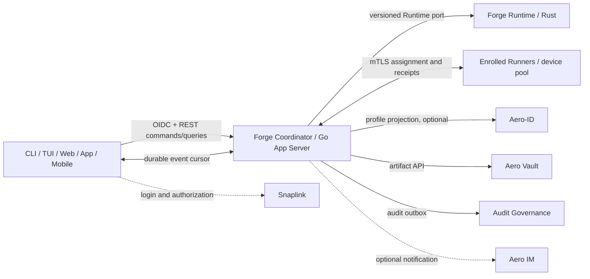

# Cross-Device Forge Sessions and Device Fabric — Implementation Plan

> Status: **User-approved implementation scope; implementation in progress; no phase is thereby declared delivered**
> Date: 2026-09-13
> Scope: shared Forge conversations across CLI, TUI, Web, App, and Mobile, plus authorized multi-device task execution.
> Related designs: [Product Control Plane Blueprint](product-control-plane-blueprint.md), [Product Control Plane Delivery Plan](product-control-plane-delivery-plan.md), [Device-Aware Execution Fabric](device-aware-execution-fabric.md), [Implementation Roadmap](implementation-roadmap.md), and [ADR-0007](../../adr/0007-local-first-conversation-hub.md), with the authenticated shared-session boundary tracked by [ADR-0113](../../adr/ADR-0113-authenticated-shared-conversation-coordinator-v1.md).

The user approved this staged product scope on 2026-09-13. `.agent/ROADMAP.md` tracks it as an active implementation route; this does not change prior Accepted ADRs or claim any phase complete. ADR-0113 records the authenticated shared-session boundary as a Proposed-only v2 decision candidate: its status remains `proposed` and its acceptance fields remain null under repository governance. The implementation includes an authenticated session/Prompt API, Hub-enforced owner binding, private-network TLS support, exact browser Origin allowlisting, and an owner-filtered paged change feed. Rust CLI exposes Snaplink device login, remote session commands, and `remote changes list`; the TUI exposes `sync`; and the Flutter Console `/forge/` surface polls the same feed every 15 seconds (at most four 128-row pages per poll). Feed cursors are dense and local to the exact owner tuple; the Hub's global journal cursor is not returned to clients. CLI/TUI persist reconnect cursors locally by exact Coordinator and saved owner credential with Unix private-file controls; explicit `FORGE_ACCESS_TOKEN` mode does not persist a cursor. Console stores the owner-local cursor in Web localStorage or native platform preferences, keyed by a digest of API origin, Forge client/resource, and the token's issuer/tenant/subject claims. It stores no token and advances the checkpoint only after required conversation/history refreshes succeed; malformed or opaque tokens receive process-only cursors. Saved CLI/TUI credentials now use a public Snaplink refresh-token grant with Linux Secret Service/macOS Keychain rotation; Flutter Forge credentials persist through Android/iOS/Linux/macOS/Windows secure storage, while Web remains tab-scoped. The Flutter feed retries a failed conversation snapshot after transport recovery, and CLI Prompt writes accept bounded multiline stdin with `-`. No client has push/live delivery. Prompt submission only stores a Prompt; it does not create a Run or schedule a device. A complete cross-client accepted journey, authoritative device inventory/scheduler, and Runner execution remain undelivered. The current HTTP listener also requires an exact Host match, which constrains reverse-proxy deployments. Code, focused tests, formal ADR lifecycle, and `forge accept` remain the sources for implementation and completion status.

The current client state also includes an owner-bound, metadata-only Conversation snapshot for offline list recovery; it never caches Prompt bodies or bearer tokens. This is still session continuity only and does not authorize Run creation, device inventory, scheduling, or dispatch.

## 1. Outcome

Deliver one logical Forge workspace that a user can reach from CLI, TUI, Web, desktop App, and Mobile. A conversation created on one client is visible on the others; any authorized client can submit a prompt and follow the same run timeline. Explicitly enrolled Forge Runners contribute fresh device capabilities to a shared eligible pool. The scheduler may automatically choose among eligible devices and must explain the placement decision.

Start with one account and one logical coordinator, with multiple devices. Design IDs and contracts to support Snaplink tenants and later team access, but defer shared-team ACLs, multi-coordinator federation, migration between coordinators, and production-scale HA.

## 2. Domain ownership and invariants

| Domain | Canonical owner | Boundary |
|---|---|---|
| Human identity, tenant, login and authorization | Snaplink | Stable account identity is the exact `(issuer, subject, tenant_id)` tuple from verified Snaplink claims. OAuth/AuthSession is never a Forge conversation. |
| Conversation, Prompt, Run, Runtime Session/Turn/Action | Forge Runtime (Rust), consistent with ADR-0007 | The App Server may expose APIs and rebuildable projections; it must not independently create a second canonical conversation or write the Runtime database. |
| Objective, WorkGraph, policy, device registry, placement intent and lease | Forge Core (Go) | One scheduler/control owner. It assigns authorized work to a Runtime/Runner; it does not duplicate Runtime Attempt state transitions. |
| Runner process, local sandbox, execution journal and attempt evidence | Forge Runtime on the target device | A device is not trusted merely because it is online or enrolled. Runner credentials are separate from user tokens. |
| Account profile and cross-product account links | Aero-ID, when needed | Profile/projection only; not Forge session, device capacity, scheduler, or source of authorization. |
| User collaboration and notifications | Aero IM, optional integration | Message rooms and delivery cursors are not the Forge prompt/run event source. |
| Input attachments and generated files | Aero Vault | Store content and metadata references; Forge remains the authority for prompt/run state. |
| Immutable audit facts and compliance queries | Snaplink Audit Governance | Consume Forge audit outbox events. It is not a live session store, scheduler, or execution approval authority. |
| Web/App/Mobile identity UI shell | Snaplink Console reuse where appropriate | Add a separate Forge Workbench surface; keep SSO administration and Forge execution workflows as distinct product areas. |

The public clients connect to one logical Forge Coordinator. For the first release, a device may be both a user client and a Runner, but these are separate roles and credentials. A Runner connects outbound to the Coordinator; the Coordinator does not scan a LAN or make arbitrary SSH connections.

The initial scope is one self-hosted logical Coordinator reachable only over a private network/VPN and HTTPS. Snaplink validates human identity; the exact verified `(issuer, subject, tenant)` tuple is the session owner, while Rust Hub remains the canonical Conversation/Prompt/Run store and enforces that owner on every query and write. ADR-0113 records this boundary as a Proposed-only candidate and is not an Accepted lifecycle record. A local Conversation is not uploaded merely because the user logs in: session claim/import previews the source profile, target account, selected conversations, projects, and content size, then requires explicit consent. Portable records use opaque IDs and never transmit canonical local paths.

## 3. Product and protocol requirements

### Shared sessions

- Every client uses the same versioned Forge API; clients do not read Go or Rust database files.
- Support conversation list, detail, create, prompt submission, run timeline, cancel, and resume/query. Conversations, Runs, login sessions, IM rooms, and device enrollment have separate IDs and state machines.
- Commands carry an idempotency key and expected aggregate version. Reusing the key with identical bytes returns the prior result; conflicting reuse is rejected.
- The Coordinator assigns durable event cursors. Clients reconnect from a cursor and receive ordered replay before live delivery. Duplicate delivery is allowed and clients deduplicate by event identity; gaps and expired cursors are explicit errors with a resnapshot path.
- Concurrent prompt submissions have a defined ordering or conflict result. A client retry must not create a second Prompt or Run.
- Stream only user-visible Agent events and tool/action evidence permitted by policy; never present hidden chain-of-thought as a product event.

### Identity and clients

- Human clients use Snaplink OIDC with issuer, subject, tenant, audience, and least-privilege scopes. CLI/TUI use the OAuth device authorization flow or another approved native-client flow; refresh credentials belong in the platform secure store, not Forge conversation tables.
- Web, desktop App, and Mobile use the same Session/Query/Command/Event contract. Flutter UI and auth components from Snaplink Console may be adapted, but Console's Admin and identity Portal routes do not become the Forge domain API.
- Mobile is a full session controller in the first client rollout. Mobile compute participation is opt-in and later; a phone that is offline, stale, or unable to meet a task's resource/isolation requirements is ineligible.

### Device inventory and scheduling

- Device enrollment is explicit and owner-approved. Each Runner proves a device identity using a device credential/mTLS; user access tokens are not installed into task sandboxes.
- A Runner reports a stable device ID, software/OS/runtime versions, CPU, memory, storage, accelerator/VRAM and supported capabilities, plus a timestamp/TTL. UI distinguishes `online`, `stale`, `offline`, `reserved`, `cordoned`, `revoked`, and `eligible`.
- Users can target one device or a named eligible pool. Automatic placement evaluates task resource needs, capability, data residency, trust zone, sandbox floor, concurrency, and current freshness. Dry-run results include eligible candidates and rejection reasons.
- A stale or revoked snapshot is never schedulable. Enrollment does not grant every conversation or artifact to that device. Device visibility is scoped by account/tenant and grants.
- Resource reservation is atomic and bounded by a lease. Every assignment carries a fencing epoch; a Runner whose lease is expired or fenced must self-stop and cannot publish a valid terminal result. A network timeout alone does not prove an old process stopped.
- No active LAN scan, automatic SSH config execution, arbitrary shell dispatch, or silent remote dependency installation. Initial enrollment can use an explicit one-time code and owner confirmation; any SSH bootstrap is a separately reviewed, structured, opt-in path.

### Artifacts, audit, and collaboration

- Forge stores canonical conversation/run/attempt metadata. Aero Vault stores large inputs and outputs with content digest, tenant, sensitivity, retention and provenance references. Runner staging verifies digest and authorization; it does not use shared mutable directories.
- Forge emits append-only audit facts through a durable outbox. Events include actor, tenant, conversation/run/attempt/device IDs, policy/placement decision and receipt references. Do not put full prompt/output bodies in the audit ledger by default; use governed artifact references or content digests when appropriate.
- Aero IM may deliver mentions, completion/failure alerts, and optional team collaboration notifications. Its delivery channel is not the authoritative Run timeline.
- Aero-ID can project profile preferences and cross-product links. It is not on the critical prompt-to-execution path unless a concrete account integration requires it.
- Cross-repository data exchange uses versioned APIs and event contracts with idempotency. No service reads or writes another repository's database directly.

## 4. Delivery sequence and exit gates

| Phase | Deliverables | Exit gate |
|---|---|---|
| **P0 — Scope and ownership decisions (product scope approved; detailed governance remains in progress)** | User-approved first-release scope: one personal account per logical self-hosted Coordinator, private-network HTTPS access; Snaplink is the identity authority; Rust Hub is the canonical Conversation/Prompt/Run owner; Go authenticates and applies route policy while Hub enforces exact owner; Runner identities remain separate. ADR-0113 records the authenticated shared-session candidate as Proposed-only. Device enrollment/lease threat model and detailed ecosystem integration contracts remain due before those phases. Roadmap and local-only R0 exclusions are aligned with the approved phases. | Each implemented persistent object has one owner; verified user identity and Runner identity are distinct; remote-session requirements and exclusions are testable. P0 does not enable Runner execution or claim the shared-session API is complete. |
| **P1 — Shared session control plane** | Snaplink authentication and tenant scope; authenticated Forge Query/Command API over private-network HTTPS in v1; Rust Runtime adapter and durable Conversation/Prompt ownership; server projection and replayable cursor; local session claim preview/consent; idempotent Prompt and conflict semantics. Run observation is a separate read-only surface. A Prompt remains stored conversation input unless a separately authorized execution-intent path accepts it. | Two authorized clients can create/list the same owner-bound Conversation, append one Prompt exactly once, and read the same history/change feed after reconnect. Run summaries and timelines expose only existing Runs. No database path is exposed. Public execution-consent and pending-intent routes require the applicable ADR lifecycle and acceptance gates; P1 does not assert that a Prompt creates or starts a Run. |
| **P2 — Common client surfaces** | Ship a thin CLI, TUI, Web Workbench, App, and Mobile client over the same SDK/contracts. Validate Flutter Console reuse as a presentation/auth component only. Add offline read cache and explicit pending-command/retry display where supported. | Contract tests prove identical command/query/event semantics across all clients. A client cannot display an unconfirmed local command as a committed server event. |
| **P3a — Offline declaration review** | Strict local validation and comparison of caller-supplied device declarations; resource and policy exclusion reasons; deterministic output explicitly marked unverified. Snapshot/lease timestamps are compared only to caller-supplied fixed evaluation time and are not verified freshness. No discovery, registration, persistence, network/API call, reservation, or dispatch. | Go dry-run tests prove bounded input, stable results, unverified declarations, and all execution/reservation/dispatch authority bits false. It reports declaration matches only and selects no target. |
| **P3b — Live inventory (authorization gated)** | Only after a formally Accepted architecture/security decision amends or supersedes ADR-0039 and ADR-0114 is accepted: explicit Runner identity/enrollment, outbound authenticated session, server-owned heartbeat time and TTL snapshots, revoke/cordon/drain, and owner-scoped read-only inventory. This phase does not dispatch work. | The authorized inventory can be observed across clients; stale, revoked, incompatible, and over-capacity devices are consistently represented. Its exit gate and implementation must match the accepted ADR exactly. Until then this phase is not authorized for implementation or exposure. |
| **P4 — Two-device remote execution (separately gated)** | Only after a further accepted execution/security decision: scheduler assignment; atomic resource reservation, lease/fencing and local watchdog; bounded TaskSpec; verified sandbox; cancel/timeout; Artifact staging through Vault; Runtime Attempt/Execution/Publish receipts; Audit Governance outbox integration; retry/reconciliation rules for `LOST` and uncertain effects. Begin with low-risk, bounded tasks. Untrusted or AI-generated executable code must meet the Fabric's microVM-equivalent isolation floor. | One explicitly authorized task runs on either of two authorized devices, with an explainable placement, one current fenced lease, verified artifacts, and end-to-end receipt/audit references. Expired or partitioned Runner cannot commit. Uncertain effects are not silently retried or called failed. |
| **P5 — Ecosystem and production expansion** | Aero IM notifications/presence integration; Aero-ID profile projection if useful; production Snaplink keys/scopes and revocation; multi-user/team ACL, quotas, HA/backups, recovery drills, supported remote targets, and optionally mobile Runner. Multi-coordinator federation remains last. | Security, retention, capacity and recovery SLOs are measured on the chosen deployment topology. Team/federation features have separate authorization and data-residency tests. |

P1 and P2 can overlap after the API and owner contracts are frozen. P3a is limited to offline caller declarations. P3b cannot begin until the required architecture/security decision is formally accepted; the user's product-roadmap approval is not that authorization. P4 needs an additional accepted execution decision, the local `ExecutionTarget` contract, validated isolation profiles, durable assignment/lease semantics, and explicit capabilities. This product priority moves the personal multi-device phases ahead of broad team/federation work; it does not remove the existing Wave 0–6 semantic gates for the features they own.

## 5. Ecosystem work packages

| Ecosystem repository | Planned integration | Minimum prerequisite |
|---|---|---|
| `snaplink` | OIDC for human clients; tenant/scope authorization; separate machine/Runner identity lifecycle | Registered Forge client/audience/scopes, issuer/JWKS validation, CLI/native flow and revocation contract |
| `snaplink-console` | Reuse Flutter shell, login, localization, capability/error handling for a separate Forge Workbench route | Stable Forge OpenAPI/Event contract; session token lifecycle reviewed for Web and native clients |
| `aero-id` | Optional profile, account links and cross-app preferences/projection | Stable Snaplink subject/tenant mapping and a concrete consumer; no dependency for Prompt dispatch |
| `aero-im` | Optional run notifications, presence and later team collaboration delivery | Forge event-to-IM adapter, idempotency and channel/user authorization mapping |
| `aero-vault` | Input attachments and generated Artifact content | Snaplink service credentials, tenant/ACL mapping, digest verification, retention and short-lived transfer authorization |
| `snaplink-audit-governance` | Append-only audit events and compliance queries | Forge transactional outbox, event schema/source registration, client binding, tenant mapping and redaction policy |

## 6. End-to-end acceptance journey

The first release is accepted only when this journey passes on a controlled two-device environment:

1. The user signs in through Snaplink from CLI, Web, and Mobile with one stable principal.
2. CLI creates a Conversation and submits a Prompt with an idempotency key. Web and Mobile show the same committed Conversation and Run; a repeated request creates no duplicate.
3. All clients can disconnect, reconnect from their last cursor, and converge to the same ordered visible timeline.
4. Two explicitly enrolled Linux Runners report fresh and visibly different capabilities. A dry-run explains which meets the TaskSpec and why another does not.
5. A bounded authorized task is assigned to an eligible Runner. The current lease/fencing epoch, Runtime execution evidence, artifact digest, and audit event all reference the same Conversation/Run/Attempt/Device IDs.
6. Tests expire a resource snapshot, revoke a Runner, interrupt a lease, and retry a command. Stale/revoked capacity is not assigned; an old Runner cannot commit; duplicate commands do not create duplicate effects; uncertain execution enters reconciliation.

Required automated evidence includes API schema compatibility, Go/Rust golden contract fixtures, Snaplink issuer/audience/scope negative cases, outbox/inbox duplicate and gap handling, concurrency/lease fencing tests, Runner sandbox boundary tests, and client reconnect tests. Live provider or external-storage tests must be reported separately from local mocks.

## 7. Open decisions and deferred scope

1. Coordinator topology and reachability: the approved first release is one self-hosted logical Coordinator behind private-network/VPN HTTPS access; public-internet exposure, HA, and federation are deferred.
2. Authenticated Conversation owner and Go-to-Rust command boundary: ADR-0113 proposes the exact Snaplink principal and Hub-enforced owner mapping. The ADR remains Proposed-only. The owner-enforced API, paged replay foundation, durable owner-local change cursors, and a sanitized read-only Run observer are implemented as partial slices. Metadata-only Run timeline resume is now covered by the Rust CLI/TUI and Flutter clients, including owner-bound checkpoints and a two-process TUI regression; full Run content and push/live event delivery remain open.
3. Session import policy: allowed source profiles, selection granularity, redaction, and maximum history size remain open. The first bounded CLI slice imports an ownerless local Hub transcript with explicit confirmation; it does not settle profile or redaction policy for a broader release.
4. Initial Runner OS/resource support and which low-risk TaskSpecs meet the verified sandbox floor.
5. Vault retention/data-residency mapping and audit payload redaction.

Deferred from v1: team-shared private Groups, arbitrary SSH, LAN discovery, unrestricted shell, production deployment, automatic migration of in-flight tasks, mobile background compute, multi-coordinator federation, Kubernetes/Nomad/Slurm, and automatic retry of unknown or irreversible effects.

## 8. Plan governance

The user has approved implementation of this staged product scope, and `.agent/ROADMAP.md`, the [Product Control Plane Blueprint](product-control-plane-blueprint.md), the [Product Control Plane Delivery Plan](product-control-plane-delivery-plan.md), and the [Functional Interaction Design](../forge-workspace/functional-interaction-design.md) now reflect that priority without changing the repository's ADR lifecycle rules. ADR-0113 is a Proposed-only decision candidate, not an Accepted ADR; implementation must keep its code and tests within that explicit boundary until the repository's formal lifecycle authorizes any transition. Before Runner enrollment or execution, complete the separate device principal, isolation, lease/fencing, and placement threat decisions. Do not mark a phase complete from a design document, generated contract, mock integration, or Runner self-report alone.

## 9. Source-repository contract audit (2026-09-12)

This audit records ecosystem implementation evidence as of 2026-09-12 unless a later section explicitly updates it. The user approved the staged product scope on 2026-09-13; this audit does not authorize external OAuth-client provisioning or claim that an integration is live.

- **Snaplink is the identity authority.** Aero ID consumes Snaplink bearer tokens and does not issue them. The specified `~/workspace/demo/snaplink` repository exposes a relying-party resource-server middleware that validates issuer, audience, expiry, signature, sender constraint, and projects `sub`, `client_id`, tenant, and scopes. Route handlers still have to enforce their required scope and object/tenant ownership. That repository already implements generic RFC 8628 `/device/code`, `/device/verify`, and `/token` endpoints: approval requires an authenticated access-token bearer, polling is bound to the initiating client, `slow_down` is supported, and DeviceCodeStore backends are configurable. It does not contain a Forge-specific public-client profile with the required audience/resource and least-privilege scopes, nor CLI/TUI device-login or secure credential storage; those clients must not reuse the Console admin client. A dedicated client must also preserve the same verified owner tuple across clients: Snaplink device tokens take `tenant_id` from the client configuration and apply the configured subject type, so matching user accounts alone does not prove that Console and CLI resolve to the same Hub owner. The client must request the Forge resource to obtain the expected audience, and the Forge resource server must continue to enforce audience and scopes.
- **Console already defines an Agent Hub client contract, not the Forge server API.** The actual repository is `~/workspace/demo/snaplink-console` (the originally supplied `~/workspace/snaplink-console` path is absent). Its Agent Hub client uses Bearer headers and separates token issuer from API origin. Existing routes cover instances, sessions, session events, turns, devices, and tasks; its scope names can guide a Forge API contract. Its Flutter UI login uses the `sso-admin-console` client, which is not the client identity for Forge. As of this audit, the Forge Go appserver provided only loopback health. Sprint 156 later added a separate authenticated `/api/v1` Forge session API; it does not implement the Console's Agent Hub routes.
- **Rust remains the Conversation owner.** `forge-runtime` exposes the application service operations and v30 change cursor. As of this audit, ADR-0112's one-shot read-only subprocess protocol was not mounted in App Server routes. Sprint 156 later connected the authenticated Forge API to the Runtime bridge for its bounded session, prompt, and change-feed operations; no Go database reader/writer or second Conversation database was added. Metadata-only Run timeline ownership and checkpoint resume are implemented through the existing bridge; full Run content, push/live delivery, and a managed shared-store lifecycle remain open.
- **Aero IM and Vault are downstream integrations.** IM supports authorized room messaging/WebSocket delivery and a machine notification API; its delivery cursor is shared by participant and room, so it is not a per-device Forge cursor. Vault supports tenant-scoped object upload/download and resumable object-lifecycle SSE, suitable for artifacts but not prompts, sessions, or scheduling. Audit Governance accepts tenant-bound events from registered sources and can be fed by a future transactional outbox; Snaplink's current login-failure outbox is too narrow for Forge task events.
- **Do not use Snaplink's current ReBAC HTTP routes as the Coordinator authorization gate.** Source inspection found no bearer/scope validation on those routes. Forge must first authenticate the token, enforce route scopes, then authorize each conversation, device, and task against the validated subject and tenant.

Repository evidence reviewed: `~/workspace/demo/snaplink/interfaces/ssoclient/rs`, `~/workspace/demo/snaplink/interfaces/sso/server_device.go`, `~/workspace/demo/snaplink-console/lib/api/agent_hub_api.dart`, `~/aero-id/internal/sso`, `~/aero-im/crates/aero-server/src/integrations.rs`, `~/aero-vault/internal/api/rest`, and `~/workspace/demo/snaplink-audit-governance/internal/auth`.

## 10. Runtime Hub read bridge implementation (2026-09-13)

The proposed ADR-0112 slice adds a private `--runtime-rpc` mode to the existing Rust `forge-runtime` executable and a Go `internal/runtimebridge` client. The RPC supports Global snapshot-at-cursor, bounded change pages, per-Conversation Prompt history, and bounded Conversation bootstrap pages; Rust opens only an existing current Hub in live read-only mode, omits project filesystem paths, and returns generic storage failures. Go uses fixed argv without a shell, exact single-line framing, strict duplicate/unknown/missing-field validation (including nested snapshot members and Global/Project/Group scope shapes), a response cap, a bounded child wait, and symlink-resolved separation between Runtime and App Server state directories. The configured executable must be the direct Runtime binary and must not launch child processes.

At its initial landing, this seam was not called from `appserver.Run` or exposed through HTTP and provided no authentication, account/tenant ownership, Prompt write, Run feed, or clients. Sprint 156 later connected selected bounded bridge operations to the authenticated Forge API. Conversation metadata also has a separate ID-keyset bootstrap page pinned to a change-log head, but `snapshot_at_cursor` still loads all Global project/group/member/conversation rows before the RPC byte cap; that operation remains local until every returned collection is bounded. A later increment adds bounded owner-scoped Run summaries and sanitized event metadata through the same bridge; see §20. ADR-0112 remains Proposed and its implementation does not complete P0 or P1.

## 11. Local Prompt history page (2026-09-13)

The Proposed ADR-0112 scope now includes a read-only `conversation_prompt_page` operation for one Conversation. Rust uses an exclusive `(created_at_ms DESC, prompt_id DESC)` keyset cursor, scans bounded metadata first, then loads no more than 128 Prompt bodies and 256 KiB of aggregate UTF-8 content. A dedicated DTO omits idempotency keys; an oversized or malformed stored row fails closed rather than returning a partial success. Go validates exact nested response shapes, Conversation isolation, page order/cursor continuity, and both content bounds.

At this intermediate point the page was a same-OS-user local process query; App Server routes were still health-only, with no Prompt write, authenticated owner mapping, client UI, remote bootstrap, or scheduling. Sprint 156 later added authenticated owner-scoped history and Prompt routes using bounded bridge operations. Prompt bodies remain sensitive. The byte-budgeted Prompt page does not fix the separately unbounded Global snapshot materialization; that snapshot is still not a remote bootstrap source. The proposed plan and ADR remain unadopted, so this implementation does not complete P0/P1.

## 12. Bounded local Conversation bootstrap page (2026-09-13)

The next local bridge increment adds a two-phase Conversation metadata page. The first request captures the store change head in the same read transaction as page one; continuations carry that fixed head. Phase one pages v29 migration baselines by binary Conversation ID. Phase two pages append-only change rows by cursor through the fixed head and hydrates only `conversation_created` rows, so every SQL phase reads at most `limit+1` indexed rows even when Prompt changes are interleaved. Later creations are excluded and reconciled through the existing change feed after the captured head. Entries include creation cursor and observed aggregate version so Prompt updates after the cutoff can be replayed idempotently. `scanned_through_cursor` exposes raw journal progress, including an empty final page that contains only Prompt events. No Prompt bodies or filesystem paths are returned.

This bounds per-query row materialization for the Conversation-list operation, but journal-head validation still scans the event count and has no hard CPU bound. It does not bound the projects/groups/members still loaded by `snapshot_at_cursor`; that full snapshot remains local-only. ADR-0113 records a Proposed-only durable owner contract: a nonempty verified issuer/subject/tenant tuple, Hub-side per-Conversation enforcement, and no implicit legacy-session claim. Sprint 156 now wires gateway authentication, Hub owner checks, bounded conversation routes, and negative cases. The configured session API is still not a formally accepted release, and the unbounded snapshot API is not exposed remotely.

## 13. Partial client surface implementation (2026-09-13)

The Rust CLI provides remote conversation list/create and prompt-history/append commands, with a line-oriented `remote tui` for browsing pages, opening history, creating conversations, and submitting prompts. The TUI reuses the same session API and its retry path preserves the in-process request identity; submitting a Prompt only stores the user Prompt and does not create or execute a Run. The CLI and TUI read `FORGE_API_URL` and `FORGE_ACCESS_TOKEN` from the process environment. They do not yet implement Snaplink RFC 8628 device authorization or secure persistent credential storage. Snaplink's generic flow exists in the specified repository, but a Forge-specific public client still needs deployment configuration and cross-client owner-claim parity must be verified before enabling shared login.

The Flutter Console adds a `/forge/` surface for listing/creating conversations, viewing paginated Prompt history, and appending Prompts. It reuses Console's existing Snaplink login and requests Forge conversation read/write scopes; this is a Console client slice, not a completed Web/App/Mobile rollout or a complete cross-client lifecycle. The latest focused Console run passed all 12 tests and `flutter analyze`. Rust formatting and strict Clippy passed. The CLI all-targets run passed 288 unit tests; a final rerun passed 286 with two long stress cases skipped after both had passed in the preceding run, and every integration target passed. Infrastructure passed 430 unit tests, 124 schema-migration tests, and all integration/doc targets after updating historical fixtures for v32. Go authn/runtimebridge/appserver race tests, vet, and a fresh real Go HTTP→Rust Runtime→Hub E2E passed. The specified Snaplink repository was not changed in this slice; its existing generic RFC 8628 flow was inspected, but no Snaplink test result is included here. A Forge-specific public-client configuration, CLI device-login, and secure credential storage remain open. These checks validate this implementation slice but do not constitute formal same-tree acceptance.

A pure Rust device-registry reference model exists with domain/application tests, but Go Forge Core remains the planned authority and has no persistent device inventory/lease projection or heartbeat endpoint yet. The owner-scoped replay feed carries only conversation and prompt change metadata; it is paged polling, not live delivery, and does not yet provide a Run intent/timeline. Placement/reservation service and Runner execution are also absent. These client and reference-model slices do not close P1/P2 or any device-fabric phase; ADR-0113 remains Proposed/null.

## 14. Owner-local replay cursor hardening (2026-09-13)

The owner-scoped feed uses a dense sequence maintained for each exact verified `(issuer, subject, tenant_id)` owner. Hub writes allocate the next sequence and append the corresponding global journal reference in the same transaction. Reads page by the owner sequence and keep the mapped global journal cursor internal for row validation; API responses expose only the owner-local cursor. Foreign-owner activity therefore neither creates gaps nor changes another owner's head or next cursor. The v32 migration backfills dense owner sequences from existing owned conversation changes and leaves ownerless legacy conversations outside the feed.

The Go and Flutter clients validate exact page shape, dense cursor continuity, `scanned_through_cursor` agreement, and `has_more` page bounds. Empty pages must leave the cursor unchanged. The feed excludes Prompt bodies and idempotency keys. Rust CLI/TUI resume from a private local checkpoint partitioned by coordinator and exact saved principal; explicit token overrides have no persistent checkpoint. Flutter Web/native resumes from an owner-bound local checkpoint and only persists after the selected history or conversation refresh needed for the page succeeds. This does not add push delivery, Run events, or formal phase acceptance; ADR-0113 remains Proposed/null.

## 15. Dedicated Snaplink Forge client profiles (2026-09-13)

The designated Snaplink repository now accepts an optional `clients[].grant_types` allowlist and copies it through YAML seeding into the token-endpoint policy. Omitted lists remain unrestricted for compatibility; configured lists reject blank and duplicate entries while retaining support for deployment-specific grant extensions. Its multi-replica Kubernetes sample enables RFC 8628 storage on the existing Redis OAuth backend and defines separate `forge-console` and `forge-cli` public clients. Both request resource `forge-api`, the two Forge conversation scopes, public subjects, and tenant `acme`, which makes `(issuer, subject, tenant_id)` parity explicit in this sample. These are source configuration seeds, not proof that a live deployment has reloaded them.

The Flutter Forge login now explicitly selects `forge-console`, requests only the Forge resource and conversation scopes, and stores its token in a client-scoped tab/memory slot. This keeps a narrowed Forge token from replacing the default Admin session and clears only the Forge slot after an unauthorized response; an explicit Console logout clears registered scoped slots too. The resource default is `forge-api`, matching the Forge server audience. Focused OAuth/session/Forge-route/widget tests and `flutter analyze` pass; Snaplink seed/config race tests and repository build/vet pass. A Snaplink handler integration test now drives separate Console direct-login and CLI device-grant clients and compares their exact `(iss, sub, tenant_id)` tuple and Forge audience; it also verifies the CLI grant allowlist rejects authorization-code exchange. The Rust CLI/TUI still lack RFC 8628 login and secure persistent credentials, so this does not yet prove that the deployed Console and CLI profiles actually produce the same owner. No Forge device enrollment, inventory endpoint, placement API, or remote execution was added. ADR-0113 remains Proposed/null, and this work does not complete P0/P1 or authorize remote Runner activity.

## 16. Native CLI device login (2026-09-13)

The Rust CLI adds `remote login` using Snaplink's RFC 8628 device-code and token endpoints. It requests the `forge-cli` public client (overridable with `SNAPLINK_CLIENT_ID`), resource `forge-api`, and only the two Forge conversation scopes. The device response is size- and lifetime-bounded; redirects are disabled; non-loopback HTTP is rejected; and the displayed verification URI must use HTTPS with no embedded credentials. A loopback HTTP verification URI is accepted only when the configured issuer is also loopback HTTP and both have the same origin. This supports Snaplink deployments whose user-verification page has a separate secure HTTPS origin while preventing a remote issuer from directing users to an arbitrary local HTTP service. Polling honors the issuer-provided interval and RFC `slow_down` increases. Access tokens are never printed.

On Unix, the CLI stores each access token partitioned by issuer, client, tenant, and subject below the configured XDG config root, using current-user-owned `0700` directories and `0600` files with symlink checks and atomic replacement. It fails closed on unsafe paths and on platforms without this protected-file implementation. `FORGE_ACCESS_TOKEN` remains an explicit higher-priority override; `SNAPLINK_SUBJECT` and `SNAPLINK_TENANT_ID` disambiguate multiple saved accounts. The CLI locally decodes claims to reject issuer/client/owner/audience/scope/expiry mismatches before storage, but does not verify JWT signatures; the Forge resource server performs signature and authorization checks. This slice stores no refresh token, so expiry requires running `remote login` again, and the POSIX file store is not an OS keychain.

Focused validation passed for all 34 `remote_command` tests, all 4 `remote_args` tests, `cargo fmt --all -- --check`, and strict CLI Clippy. The regression tests preserve the exact configured issuer spelling across login and credential lookup, including trailing slash, host case, and explicit default port. The designated Snaplink source profile restricts `forge-cli` to the device-code grant while `forge-console` retains authorization-code and refresh-token grants; no live configuration reload is claimed. The Flutter Forge focused suite passes 12 tests with `flutter analyze`; the Snaplink owner-parity race test also passes. The CLI configuration and usage are documented in [forge-runtime README](../../../forge-runtime/README.md).

The Prompt route still commits only the user Prompt and returns a storage result; it does not create a Run, publish a Run timeline, or submit work to a Runner. The CLI prints a clear stderr note after a successful Prompt write; the TUI and Flutter Console also make that distinction explicit: the Prompt was stored, and no task Run was started. The Go App Server currently compares each request Host to the exact bound listener authority. A reverse proxy that preserves a different public Host therefore receives `421 Misdirected Request`; there is no trusted forwarded-host configuration. This is an explicit deployment limitation pending a reviewed external-authority/proxy trust contract. No proxy header is treated as authority.

The Hub now has an inert atomic pending Run-intent and payload-free initial timeline contract, but public consent/intent APIs and consent UX remain absent; an internal startup-bound profile catalog is available to trusted policy code, while ordinary Prompt submission remains storage-only. Remaining work also includes the full task timeline, full Web/App/Mobile clients, refresh-token/OS credential-manager support, Web cursor persistence or streaming, and a Go-owned persistent device registry with governed enrollment, heartbeat, placement, leases, and Runner receipts. CLI/TUI checkpoints are per local installation and are not shared across devices. ADR-0113 remains Proposed/null. [ADR-0039](../../adr/adr-0039-default-off-device-aware-execution-fabric.md) still constrains live device registration, network scans, arbitrary SSH, and remote Runner execution; the metadata-only observer in §20 does not authorize them or complete P0/P1.

## 17. Separate Conversation scope from Run authorization (2026-09-13)

Global, Project, and Group identify how the configured Coordinator owner organizes a Conversation, not who may execute against a Project. The App Server pins one exact `(issuer, subject, tenant_id)` principal for this personal Coordinator and rejects other valid tenant accounts before they can create or read sessions; Hub queries continue to enforce exact Conversation ownership independently. Authenticated creation accepts each scope only when its referenced local Hub row exists. Group membership does not grant other accounts access, and a Project scope grants no execution authority. Project paths, files, Run journals, and provider/tool context are not exposed by these routes. This allows the same account to find and continue its scoped sessions from CLI, TUI, Console, and other clients without treating a scope association as project consent. There is no formal accepted release or data migration contract yet.

No remote Run-intent route is added. The existing local Run request accepts caller-provided Project and execution configuration, so it is not a safe remote contract. The Hub now provides an owner-to-Project consent record and atomically commits a Prompt, inert pending intent, and initial timeline marker after rechecking that consent. Public clients still need an explicitly authorized consent flow and server-owned execution profile policy; project scope must come from the Hub-owned Conversation, never the request. ADR-0113 remains Proposed/null and ADR-0039 continues to prohibit Runner enrollment or dispatch in this slice.

## 18. Remote session scopes and device enrollment decision boundary (2026-09-13)

The Rust CLI can create an owner-private Conversation in Global, Project, or Group scope with `remote sessions create --scope global|project:ID|group:ID`. By default, `remote sessions list --scope ...` filters the current server page; `--all` scans up to 64 keyset pages and applies the scope filter across those pages, returning the last cursor when more pages remain. The TUI accepts the same scope selector when creating a Conversation and displays scope on each loaded row. Scope remains organizational metadata: it grants no Project, Group, Runner, or execution authority.

ADR-0114 is a Proposed-only follow-up candidate for opt-in device identity, explicit owner approval, authenticated heartbeats, persisted freshness, revocation, and read-only owner-scoped inventory. It does not amend ADR-0039, whose current accepted boundary forbids live registration and heartbeat. No device endpoint, credential issuer, persistence, inventory UI, placement, reservation, or dispatch is implemented. The separately audited Console Agent Hub has device and task surfaces, but its task records do not bind to Forge Conversation/Run state, so it is not reused as the Forge execution authority.

## 19. Explicit local Conversation import (2026-09-13)

`remote sessions import LOCAL_CONVERSATION_ID` reads a current-schema local Hub in live read-only mode and prints the source scope, title, full user/assistant transcript, UTF-8 content size, target Coordinator, explicit Global destination scope, and local account-claim preview. It accepts only ownerless source Conversations and rejects legacy blank visible prompts, transcripts over 128 messages, and content over 256 KiB. The preview does not upload data. The user must repeat the command with its SHA-256 confirmation; the digest binds the selected source metadata and transcript, Global destination scope, Coordinator, and exact issuer/client/tenant/subject preview. Any source or target change invalidates the confirmation and displays the current preview for review.

After confirmation, CLI sends only the title and user/assistant Prompt bodies to `POST /api/v1/conversations/import`; it does not send a local Conversation ID, canonical path, Project path, Run, tool payload, or provider context. Go derives the owner from the verified token and enforces the write scope; Rust creates the new Global owner-bound Conversation, imported Prompt rows, and owner-local change entries in one transaction. The deterministic request key makes retries idempotent, while the source Conversation remains untouched. The Coordinator is authoritative for JWT signature and account authorization; local token claim decoding labels the preview only.

Rust storage, RPC, CLI request, parser, and Go HTTP-to-Rust integration tests cover limits, exact payload shape, owner isolation, rollback, replay after later Prompts, and source preview. This is a CLI-only first slice: it has no per-Prompt selection or redaction UI, does not make legacy sessions automatically shared, does not create or execute a Run, and does not complete P1 or the open session-import policy. ADR-0113 remains Proposed/null and ADR-0039 still prohibits live device enrollment or remote Runner execution.

## 20. Owner-scoped read-only Run observation (2026-09-13)

The Runtime Hub now exposes bounded Run summary pages and per-Run timeline metadata for an already owner-authorized Conversation. Go derives the exact `(issuer, subject, tenant_id)` owner from the verified principal, requires `forge:conversations:read`, and preserves uniform not-found behavior for missing and foreign-owned Conversations/Runs. SQLite checks ownership and reads each page in one deferred transaction. Run pages use a `(created_at_ms, run_id)` keyset cursor and are capped at 25 rows; timeline pages are capped at 128 events and resume after a dense sequence cursor. Both pages cap aggregate source event bytes at 2 MiB and may return a shorter nonempty page with `has_more=true`.

The response is deliberately metadata-only. Run summaries contain only ID, Prompt ID, creation time, latest event sequence, and a closed status value. Timeline entries contain only sequence, event timestamp, and one of `run_started`, `turn_started`, `activity`, or `run_finished`. Assistant text, tool details, execution configuration, paths, provider data, idempotency keys, and error messages never leave Runtime storage through these operations. All assistant, tool, and error event variants collapse to `activity`; `nonterminal` means only that the latest observed event is not a terminal event, not that a process is currently running.

The CLI offers `remote runs list CONVERSATION_ID` and `remote runs timeline CONVERSATION_ID RUN_ID`; Flutter Console exposes the same read-only pages from its Forge conversation view. The TUI now offers `runs [--before TIME RUN_ID]` and `timeline RUN_ID [AFTER_SEQUENCE]` against its selected session, with pagination cursors and metadata-only rendering. These operations observe Runs already present in the Hub and do not create one. The Prompt route still stores a Prompt without creating a Run or submitting work. This increment does not provide Run content, push delivery, a Run-intent contract, owner-to-Project execution consent, device enrollment, placement, or remote execution. ADR-0113 remains Proposed-only and ADR-0039 continues to prohibit live device registration and Runner dispatch; this is a partial observation slice, not completion of P1.

## 21. Offline placement dry-run and ecosystem boundaries (2026-09-13)

Forge Core adds `forge device-placement dry-run --input FILE|-` as an offline-only comparison over a bounded, strict, caller-supplied JSON inventory and requirements document. It evaluates a fixed caller-supplied `evaluated_at_ms`, exact declared `(issuer, subject, tenant_id)` owner tuples, approval/cordon/liveness/freshness/lease, OS/architecture/resources/runtime/GPU, residency zones, trust zone, sandbox floor, and concurrency. Output is deterministic with sorted per-device exclusion reasons and uses `matches_requirements`; every inventory and security attribute is labeled an unverified caller declaration. It selects no device and hard-codes `execution_authorized`, `reservation_created`, and `dispatch_performed` to `false`. The command makes no network/API calls and adds no persistence, discovery, enrollment, reservation, dispatch, or execution. It is a comparison of declarations, not verified inventory or placement authority.

The Rust `device_registry::placement` reference model has typed requirements and policy filters over the same resource and placement dimensions, including residency, trust, sandbox, and concurrency. This is policy-dimension parity only: the Go command owns its separate versioned offline contract and exact owner-tuple comparison; the Rust model is not a live observation or dispatch adapter. Neither model changes ADR-0039 or advances Proposed-only ADR-0114.

The ecosystem audit keeps Snaplink as the sole identity and token authority and the Hub as canonical Conversation, Prompt, and Run state. Aero-ID exposes account/source/membership projections but has no general public account-link or consent API; the in-progress internal membership-check candidate is bounded-stale projection data, not a Hub grant. Aero IM's installation-scoped machine notification API is a downstream status/link channel, not session storage. Aero Vault's tenant-scoped object API is suitable for artifact bytes and ACLs, not application secret management. Snaplink Audit Governance accepts tenant-scoped evidence at `POST /api/v1/events`; Forge should relay minimized lifecycle facts from a Hub-owned outbox and verify ledgered receipts, without treating audit events as Run state. Service tokens remain audience-specific and are not forwarded between products.

The Flutter Android APK has been built; iOS and real-device behavior have not been validated. These implementation and audit notes do not mark P3 or P1 complete and do not change any ADR status.

## 22. Project execution consent persistence (2026-09-13)

Rust Hub schema v33 adds an owner-to-Project execution consent record with an opaque execution-profile ID and SHA-256 digest, grant time, and bounded expiry. One exact `(issuer, subject, tenant_id)` owner may have at most one unexpired, unrevoked grant per Project. Grant creation and revocation use immediate Hub transactions, owner-scoped idempotency keys, and append-only `granted` / `revoked` event rows; the migration pins the full v33 structural contract and rolls back on final-contract failure.

This is an inert authorization record only. Its trusted Runtime RPC accepts a profile ID/digest from the local control-plane caller, but there is no HTTP consent route and no public client may choose those values. A future Coordinator route must select the profile from server-owned policy, authorize the Project independently, and derive the owner solely from verified Snaplink claims. A grant response, including an idempotent replay, is a receipt for that original operation rather than proof that consent remains active; pending Run-intent creation must recheck expiry, revocation, owner, Project, profile ID, and digest in the same transaction that stores its Prompt and intent.

The v33 consent foundation does not create a Run, pending intent, execution profile, reservation, audit event, device record, or dispatch. ADR-0113 remains Proposed/null, and ADR-0039 still prohibits live device enrollment, heartbeat, discovery, and remote Runner execution. The separate atomic Prompt-plus-pending-intent Hub contract is implemented in §23; it does not reuse `RunStore::begin_run_with_prompt` or emit `run_started` before execution begins.

## 23. Inert pending Run-intent submission (2026-09-13)

Rust Hub schema v34 adds a distinct `pending_run_intents` record and a payload-free `submitted` timeline event. A fresh submission accepts only the exact verified owner, a stored Conversation ID, Prompt text, idempotency key, expected aggregate version, and a trusted server-selected profile ID plus SHA-256 digest. Inside one `BEGIN IMMEDIATE` transaction, Hub first resolves exact idempotent replay; otherwise it requires an owner-bound Project-scoped Conversation, exact CAS, and one unexpired, unrevoked consent grant matching the owner, derived Project, profile ID, and digest. It then writes the user Prompt through the existing atomic Prompt/change-journal path, the inert pending intent, and sequence-1 `submitted` event. The transaction never creates or changes ordinary `runs` or `run_events`.

Replay is a receipt for the original operation: same owner/key/Conversation/Prompt body returns the original Prompt and intent with `replayed=true`, even when the Conversation head, grant state, or currently selected server profile has changed. It performs no new write and makes no claim that consent is still active. Changed content or Conversation conflicts. Project scope is derived from Hub data; Global and Group Conversations are rejected for intent submission. Owner-filtered pages and timelines use separate DTOs, return uniform not-found for missing/foreign records, and omit Prompt bodies and profile digests from read projections.

The Rust Runtime RPC v2 candidate contract and Go `internal/runtimebridge` client now cover Project consent grant/revoke, intent submit, intent pages, and payload-free timelines. Go applies strict request/response validation and preserves the original profile in intent replay receipts. A private owner-filtered Project identity RPC feeds a fail-closed Go profile catalog loaded from trusted `forge-server` startup bindings. The ordinary authenticated HTTP `/prompts` route still uses Prompt append; no production Run-intent or consent route is wired. No provider, worker, device, reservation, audit event, or dispatch is reachable from this slice.

Verification on the current tree: infrastructure pending-intent atomicity 6/6 (including five injected rollback points), application original-receipt test 1/1, Runtime RPC submit/read/malformed-field tests 2/2, v33→v34 migration and final-validation rollback 2/2, and fresh/legacy current-schema validation/reopen 1/1. Strict all-target Clippy for the four Runtime crates and workspace format check pass. Go `internal/runtimebridge` race tests and vet pass; the Go→real Rust subprocess integration passes against a fresh temporary Hub, including consent grant/revocation, replay after profile/CAS change, owner isolation, and confirmation that no Run was created. These focused checks do not constitute full repository acceptance.

The existing HTTP Prompt route now has a real Go→Rust regression for its storage-only semantics: first append returns `201`, an exact key/body retry after the Conversation advances returns `200` with the original Prompt ID and `replayed=true`, changed content under the key and a new stale-CAS write return `409`, only the two accepted writes advance history/change feed, and the Run page stays empty. The test creates its Hub below `t.TempDir()`. Authenticated `/run-intents` and `/execution-consents` paths remain `404`. The Go consent grant/revoke helpers in the pending-intent subprocess test now use the strict private bridge instead of raw Runtime RPC framing.

The next public-client step requires an HTTP path wired to that catalog, an explicitly authorized consent flow, and the applicable ADR lifecycle and same-tree acceptance gates. ADR-0113 remains Proposed/null; ADR-0039 continues to prohibit live enrollment, heartbeat, discovery, and remote Runner dispatch. This increment completes neither P1 nor P3 and does not make a Prompt an executing task.

## 24. Private HTTP consent and inert intent handler candidate (2026-09-13)

Go App Server now has a package-private HTTP handler candidate for owner-bound execution consent preview/grant/revoke and pending Run-intent submit/page/timeline. The paths are `GET|POST /api/v1/conversations/{id}/execution-consents`, `DELETE /api/v1/execution-consents/{grant_id}`, `POST|GET /api/v1/conversations/{id}/run-intents`, and `GET /api/v1/conversations/{id}/run-intents/{intent_id}/timeline`. Read and write scopes follow the existing conversation scopes. The grant command requires `confirm_execution_profile=true`, the exact Project/profile ID and profile digest returned by the prior preview, an idempotency key, and an expiry. The handler independently resolves the Project from the owner-filtered Hub and the profile from its server catalog; these expected values only bind confirmation to what the user saw, never select a Project or profile. A changed Project/profile returns `409 execution_profile_changed` and requires a fresh preview. The preview reports the Hub's 30-day maximum TTL. Intent submission accepts only Prompt text and expected aggregate version plus the idempotency header.

The handler is deliberately not registered by `appserver.Run` or the normal conversation route constructor. The HTTP-to-Rust integration test constructs it directly with a temporary Hub; normal production route construction continues to return `404` for intent paths. This produces implementation evidence without treating user approval of the overall roadmap as ADR lifecycle acceptance or permission to expose the candidate. The endpoint still requires a product consent UI that presents the selected server profile before issuing the explicit grant command.

The real Go HTTP→Runtime→Hub test verifies server-selected profile binding, Project-scope rejection for Global Conversations, route scopes, strict rejection of caller-selected profile fields, profile confirmation mismatch on Project/profile ID/digest or catalog drift, grant and intent idempotency, sanitized owner-filtered page/timeline reads, revocation blocking a new intent, original replay after revocation, foreign-owner denial, and no ordinary Run creation. A second real HTTP→Runtime→Hub regression uses two distinct signed access tokens and two independent HTTP clients: client A creates a session, client B lists it and appends a Prompt, then client A reads that Prompt and its owner change event. Go full tests, race tests for `internal/appserver`, `internal/executionprofile`, and `internal/runtimebridge`, full Go vet, and the temporary-Hub integrations pass. This remains an unexposed intent/consent API candidate only; existing Console/CLI/TUI session and Prompt surfaces use the authenticated session API, but no intent UI is connected. ADR-0113 remains Proposed/null, and ADR-0039 still blocks live device enrollment and remote execution.

## 25. Older Prompt history pages in CLI and TUI (2026-09-13)

`remote prompts list CONVERSATION_ID` accepts the paired `--before-created-at-ms` and `--before-prompt-id` cursor returned by the previous page. The TUI's `older` command requests the page before its selected session's most recent history cursor after `open`; a failed request keeps the cursor for retry, while switching selection or refreshing history resets the continuation. The CLI client validates that every returned row is strictly older than the requested cursor, complementing existing page-order, owner, size, and response-shape checks.

This change only reads existing owner-scoped Prompt history through the authenticated session API. It creates no Run or intent and does not alter ADR-0113's proposed lifecycle state or ADR-0039's prohibition on device registration and remote execution. Focused Rust remote-client tests, Prompt argument tests, the TUI HTTP cursor fixture, strict CLI Clippy, workspace formatting, and diff checks passed. The full CLI package suite remains unverified because this turn stopped at an unrelated long-running Agent stress test.

## 26. Contract-only Forge Prompt audit projection (2026-09-13)

Forge Core now has a pure `auditprojection.Project(owner, change)` function for one exact Hub `prompt_appended` change. It accepts the owner passed by Forge's authenticated, owner-scoped caller plus the ID-only committed change DTO; the function validates owner shape but cannot itself verify a token or Hub authorization. Prompt text, title, path, provider data, token, and request idempotency key are not present in either input. The versioned event carries the tenant, a stable pseudonym derived from the length-framed issuer/subject/tenant tuple, Conversation/Prompt IDs, aggregate version, occurrence time, and deterministic event/idempotency IDs. The raw subject is not exported. Tenant and aggregate/operation identifiers are checked against Audit Governance's 85-byte, no-whitespace/path-separator/delimiter constraints. The event's only payload field is `content_included: false`; event IDs hash a domain separator and length-framed exact owner/change identity. The JSON Schema and golden fixture are under `docs/contracts/`.

This pins the minimized event contract only. Audit Governance's `actor.id` field accepts a nonempty string and does not verify that it came from Snaplink; Forge's authenticated call boundary must supply the owner. A future tenant-side registration must bind the `forge-runtime` source to the approved producer client and register this exact active schema with `content_included` as its only allowed payload field. There is no durable Hub outbox, delivery cursor, network client, Audit Governance source/schema registration, acknowledgement, retry worker, or external call; the projection is not transactionally coupled to the change journal. A later outbox decision must define transactionality, bounds, retention, and failure behavior. No Run or device event is projected. ADR-0111/0112 lifecycle triggers and ADR-0039 remain unchanged.

## 27. Automatic read-only Run observation in Console (2026-09-13)

The Flutter Forge screen's existing 15-second change-sync timer now also refreshes the selected Conversation's bounded Run summary page and the selected Run's metadata-only timeline after its current scanned sequence. It updates a Run summary if that Run is in the refreshed page, discovers a new latest Run when none is selected, and appends only validated sequential timeline markers. Generation checks discard responses after Conversation/Run selection changes. A malformed timeline page leaves the sequence unchanged for retry; a failed Run poll does not write or advance any Run state. The API calls remain authenticated GETs under the existing conversation-read scope.

The slice does not add task submission, consent, a Run-start endpoint, device inventory, dispatch, or delivery guarantees beyond periodic polling. Focused Console widget tests cover status refresh, incremental timeline reads, rejection/retry without cursor advancement, and read-only authenticated requests; the existing conversation/cursor widget tests, Dart analysis, Web build, and diff check also pass. P2 remains partial, and ADR-0039's live device boundary is unchanged.

## 28. Real Rust CLI through Coordinator multi-principal E2E (2026-09-13)

The multi-client integration now launches built `forge-runtime` CLI processes against the same temporary Go HTTP Coordinator and real Rust Hub used by the existing A/B HTTP-client flow. CLI principal A creates a Conversation, principal B lists it and appends a Prompt, and A reads the Prompt history and owner-local change feed. A third signed principal C has the same issuer, audience, and tenant with valid scopes but a different subject; it authenticates successfully, receives an empty owner list, and receives uniform not-found for the foreign Conversation. This drives the authorization request through Go and verifies object isolation at the Hub boundary.

The test checks that the Prompt creates neither an ordinary Run nor a pending Run intent. Its request recorder requires exactly the expected Conversation/Prompt/change reads and writes plus the Run-list GET, including query strings; device, placement, dispatch, consent, intent, or other HTTP paths fail the allowlist. CLI processes use explicit test-token/API environment values, temporary HOME/XDG directories, a reduced environment, timeouts, and bounded output. This is an actual CLI→Go→Rust end-to-end integration, but does not establish a live Flutter/Console connection or complete P2. Focused and race-enabled E2E, App Server package tests with `FORGE_RUNTIME_BIN`, vet, formatting, and diff checks passed. No production route or CLI behavior changed.

## 29. Shared owned-Conversation page contract and Snaplink device-grant alignment (2026-09-13)

The owner-scoped Conversation list response now has a canonical fixture at `docs/contracts/fixtures/forge-owned-conversation-page-v1.json`, parsed by Go Runtime bridge models, the Rust CLI, and Flutter Forge Console through `scripts/test-forge-contracts.sh`. The Flutter parser receives the actual requested page limit and cursor; like the Rust client it rejects unknown fields, invalid scopes/IDs, non-increasing IDs, and inconsistent `has_more` / `next_after_id` relationships. Rust now rejects unknown page and entry fields and validates the nested Conversation projection before displaying it. Go's strict fixture decoder checks that its Runtime model matches the same closed shape. The shared fixture test is a contract guard; the real CLI→Go→Rust E2E remains the transport and ownership evidence.

The Snaplink device-code token response now follows an explicit client grant allowlist before adding a refresh token. A device-only client gets no refresh token, while explicitly allowed clients and legacy clients with no configured allowlist retain refresh issuance and rotation. This closes an issuer/profile inconsistency; it does not enable refresh for Forge CLI, change the seeded `forge-cli` grants, or imply that Console/CLI tokens are automatically refreshed.

Verification: the root contract script passes Go, Rust, and Flutter fixture tests; focused Flutter model/API tests and Dart analysis pass; Rust CLI strict Clippy and formatting pass; the rebuilt CLI passes the race-enabled real Coordinator/Hub E2E; Snaplink device grant tests plus Go build/vet pass. P2 remains partial, Flutter has no live Coordinator journey, and ADR-0039 / ADR-0114 device enrollment and dispatch gates are unchanged.

## 30. Forge Console client-scoped refresh-token rotation (2026-09-13)

The explicitly selected `forge-console` login now stores Snaplink's refresh token alongside its access token in that OAuth client's existing session slot. The Forge API uses the public-client `refresh_token` grant against Snaplink's configured origin after a 401, shares a concurrent rotation, stores the replacement access/refresh pair, and retries the rejected API request once. A write retry keeps its original body and idempotency key. It sends no client secret and never forwards refresh credentials to Forge. If rotation fails or a replacement access token is rejected, the Forge slot is cleared and known-rejected bearer tokens are not sent again. Web remains tab-scoped session storage; native credentials remain in process memory.

Refresh tests cover request shape, per-client isolation, token rotation, single-flight concurrency, failed-grant cleanup, one idempotent Prompt replay, and no loop after a second 401. This improves authenticated session continuity only; it adds no device enrollment, Runner inventory, or execution path.

## 31. Shared offline placement policy test vector (2026-09-13)

Go's offline caller-supplied placement evaluator and Rust's typed placement reference model now consume the same test-only fixture for their overlapping resource and policy checks: OS, architecture, CPU, memory, storage, one runtime, residency, trust, sandbox floor, and concurrency. The fixture pins sorted `matches_requirements` and common reason projections while leaving full owner-tuple matching, unknown-state handling, heartbeat/lease rules, and GPU semantics in their existing language-specific tests. It is documented at `docs/contracts/forge-device-placement-policy-parity-v1.md` and included in `scripts/test-forge-contracts.sh`.

The Go JSON scanner also rejects `null` at required wire values, closing a gap where Go's decoder could silently retain zero values for present nullable primitive fields. The parity vector remains a test-only mapping, not a new product API or a live inventory contract. It has no target selection, reservation, authorization, or dispatch output. ADR-0039 remains unchanged and ADR-0114 remains Proposed/null.

## 32. Persistent TUI Prompt transcript (2026-09-13)

The remote TUI now stores the selected Conversation's validated Prompt rows in process-local view state and renders them on every command redraw. `open` loads the latest page, `older` merges the next older page, `sync` merges the latest page after owner-feed/session refresh, and a confirmed local Prompt write fetches and merges the latest page. Rows are deduplicated by Prompt ID and displayed in chronological `(created_at_ms, id)` order; switching the selected Conversation clears the prior transcript. A newest-page refresh retains the cursor for the oldest already loaded row, avoiding redundant history-page reads after sync. Content and role are rendered as JSON-escaped strings so terminal control characters remain visible as data.

If Prompt history refresh fails after an accepted Prompt POST, the write stays confirmed, the pending-write recovery state is cleared, and the prior transcript remains visible. A sync session/history refresh failure keeps the durable owner-change cursor unchanged and returns control to the TUI for retry. The change feed remains manual; this adds no Run creation, task execution, device inventory, or dispatch path.

Focused TUI tests cover cross-client Prompt visibility after `sync`, local append refresh, retained transcript after failed refresh, cursor non-advancement, older-page merge/deduplication, chronological ordering including same-millisecond IDs, conversation selection isolation, and preservation of the oldest loaded-page cursor during newest-page refresh. `cargo test -p forge-runtime-cli remote_command::tui` (14 tests), strict all-target CLI Clippy, workspace formatting, and the Rust diff check pass. ADR-0039 remains unchanged and ADR-0114 remains Proposed/null.

## 33. Flutter Console API through Coordinator and Rust Hub (2026-09-13)

The multi-client Go/Rust integration can now launch a Flutter test against the same temporary Go Coordinator and real Rust Hub after another client has created and updated an owned session. It exercises Console's production `ForgeConversationsApi`, Forge-scoped token slot, `ForgeSessionsGate`, and actual `ForgeSessionsScreen` over loopback HTTP: the service reads the session and Prompt written by another client, appends a Prompt and reads the owner change feed; the gate loads the screen from the scoped token slot, which renders the same session/history and submits another Prompt through its UI. A Go client then reads all three Prompts back from the Hub. Console uses its own signed test principal token for the same exact owner tuple; the short-lived token is supplied through a private temporary JSON input file, and the Coordinator origin is passed as a compile-time define.

The HTTP recorder requires exactly the four API-service calls and four screen calls for session list, Prompt history, read-only Run page, Prompt append, and change feed. No Run write or device route is allowed. `scripts/test-forge-shared-session-e2e.sh` builds the Rust CLI and runs the actual Flutter gate/widget/API-service → Go Coordinator → Rust Hub path; the same integration passes under Go's race detector, and focused Dart analysis is clean. This renders the Forge screen under Flutter's widget binding; it does not validate browser deployment, native OAuth lifecycle, or a real Mobile device journey. It creates no Run, pending intent, device registration, inventory, placement, or dispatch. ADR-0039 and Proposed ADR-0114 remain unchanged.

## 34. Roadmap parity and default-off device route evidence (2026-09-13)

The Roadmap now records the Flutter API-service, Forge-scoped token slot, gate, and screen E2E and its evidence limit: it traverses the shared Go Coordinator/Rust Hub, but does not verify browser deployment, Web, desktop, Mobile, or their OAuth lifecycles. A route-level regression builds the configured session Coordinator and probes representative device inventory, enrollment, and heartbeat paths; each receives the fixed `404 not_found` response. This pins the current default route surface without creating credentials, persistence, or a device API. It is evidence that these candidate routes are not wired, not a substitute for reviewing future aliases or the ADR acceptance evidence.

ADR-0114 remains Proposed/null and ADR-0039 remains planning-only. No live device route or persistence is authorized before the required architecture/security decision is formally Accepted; P4 still requires its separate execution/security decision.

## 35. Real Forge TUI process through Coordinator PTY E2E (2026-09-13)

The optional shared-session integration now launches the real `forge-runtime remote tui` process in a util-linux PTY after the Flutter gate/widget/API-service and non-interactive CLI flows. It feeds `open <shared-id>`, `prompt ...`, and `quit`, then checks the terminal output for the shared session title, another client's existing Prompt, the storage-only success message, and the new Prompt. The Coordinator recorder allows exactly four TUI calls: session list, Prompt history read, Prompt append, and post-write history refresh. A Go client reads all four Prompts back from the same Rust Hub. The test asserts no Run write or device/scheduling call occurs. This verifies a scripted TUI process interaction under PTY; it does not verify manual keyboard UX, browser deployment, or native/mobile journeys. The shell harness checks for util-linux `script` because it uses that implementation's PTY options.

Validation: `scripts/test-forge-shared-session-e2e.sh` builds the Rust CLI and passes the full Flutter/CLI/TUI → Go Coordinator → Rust Hub integration; the multi-client integration passes under Go's race detector, the device-route default-off regression passes, App Server vet is clean, and focused Dart analysis is clean. ADR-0039 remains unchanged and ADR-0114 remains Proposed/null. No Run, pending intent, device registration, inventory, placement, or dispatch is created.

## 36. Forge Console Web browser journey through Coordinator and Rust Hub (2026-09-13)

The optional browser mode builds the actual Flutter Web bundle using `/forge/` as its base href, then serves those static assets through a test-only same-origin wrapper around the existing Go Coordinator. API requests continue through the normal authenticated conversation routes and recorder; the wrapper does not change production hosting. Python Playwright opens the real `/forge/` route in headless Chromium, enables Flutter's accessibility tree, seeds a signed short-lived test token into the Forge-specific browser tab `sessionStorage`, and selects the session created by another client. It loads the shared Prompt history and submits a new Prompt through the screen. The browser requires a successful Prompt `201`; Go reads the new exact Prompt back from the same Rust Hub.

The request allowlist permits session list reads, owner-scoped Prompt history reads, the target session's Prompt POST, the owner change feed, and metadata-only Run reads; all other API paths, including Run writes and device/scheduling routes, fail. The test token remains in a mode-0600 temporary JSON input file and is not passed in process arguments or the URL. This same-origin test does not verify production reverse-proxy deployment, cross-origin CORS, Snaplink's live OAuth, or native/mobile journeys. `FORGE_BROWSER_E2E=1 scripts/test-forge-shared-session-e2e.sh` enables the optional build/browser test and requires Python Playwright plus Chromium.

Validation: the browser-enabled script and its matching `go test -race` integration pass, as do the focused device-route default-off regression, App Server vet, focused Dart analysis, Go formatting, shell syntax, Python syntax, and repository diff checks. ADR-0039 remains unchanged; ADR-0114 remains Proposed/null. No Run, pending intent, device inventory, placement, or dispatch is created.

## 37. Forge Console foreground refresh for native clients (2026-09-13)

The shared Flutter Forge screen now suspends its 15-second change-feed timer whenever the app is not resumed. On return to the foreground it immediately reads the owner-scoped change feed and refreshes the Conversation list, so a Prompt submitted by CLI/TUI/Web while the mobile app was backgrounded appears without waiting for the next timer tick. The existing cursor is still advanced only after the required reads succeed.

The Flutter widget test simulates the valid inactive/hidden/paused/resumed lifecycle sequence and verifies both the change-feed request and refreshed session title. Focused widget/native-route tests, Dart analysis, and an Android debug APK build pass. This verifies app code and a simulated lifecycle, not a physical Android/iOS device, OS credential store, or native OAuth journey. It adds no Run write, inventory, scheduling, or execution behavior; ADR-0039 and Proposed ADR-0114 remain unchanged.

## 38. Forge Console device-scoped sign-out (2026-09-13)

Forge Sessions now offers an explicit “Sign out of Forge on this device” action. It clears only the Forge Console access-token, refresh-token, session-ID, and client slots, then replaces the route with the Forge-scoped Snaplink login request. The independent Snaplink Admin Console credential remains available. Owner-bound change cursors remain as non-secret local checkpoints so the same owner can resume after signing back in.

The native-route widget test verifies the Forge slots are cleared, the Admin token is retained, and login returns with the Forge client/resource/scopes. This is local credential removal only: it does not call a server revocation endpoint or invalidate a token already issued by Snaplink. Service-side per-session revocation remains a separate P1 gap. No Conversation/Prompt data, Run, device record, or execution state is changed.

## 39. Forge sign-out requests token revocation and App Server online introspection (2026-09-13)

The Forge Console sign-out path now sends independent form requests to Snaplink `POST /token/revoke` for the current access token and latest rotated refresh token, in that order. Snaplink accepts public `none` authentication only for revocation and only for a registered active client; introspection stays confidential-client-only, and both endpoints require the registered authentication method. The presented access/refresh token is bound to that exact client ID; an unknown or foreign-client token receives the same empty `200` without mutation. Revocation validates token authenticity without requiring the user to remain lifecycle-active, so a suspended account can still revoke its credentials. Invalid/unknown tokens remain an empty `200`; recognized backend failures return `503` with `Retry-After`.

Revoking an active, recognized refresh token removes its owning rotation family when the store exposes that capability, without reaching other login families. Unknown, expired, or already-consumed refresh tokens retain the uniform `200` no-op and do not trigger a family lookup; the Console therefore submits its freshest rotated refresh token. Redis commits a tombstone atomically in the family index before physical cleanup; `Issue`, `Inspect`, and `Consume` honor it, so a partially cleaned family stays unusable and cannot mint a live descendant. If physical cleanup fails, remaining keys keep their original finite TTL unless storage cleanup is separately retried; an HTTP retry may return `200` after the token is recognized as already revoked. This is logical family revocation, not a cross-key Redis transaction.

The Forge App Server has a default-off remote introspection mode configured with a same-origin HTTPS URL, dedicated confidential client ID, and owner-private secret file. It calls Snaplink on every authenticated API request with no local JWKS fallback or result cache; Snaplink's active-token response projects `tenant_id` from the verified token claim so Forge can retain its exact issuer/audience/tenant/subject restrictions. An inactive response or introspection failure blocks the next request. A configured Snaplink cluster must also use its durable/shared revocation store and cross-replica invalidation for another replica to observe a revoke; the existing distributed profile contains this wiring. The Console still completes local sign-out when either revocation request fails, so this is a best-effort client notification rather than a durable retry queue. A request already authorized before revocation cannot be recalled.

Validation: Console token-refresh/sign-out and native-route tests pass (9/9), with `flutter analyze` clean. Forge authn/App Server race tests and vet pass, as does `scripts/test-forge-shared-session-e2e.sh` across Flutter, CLI, TUI, Go Coordinator, and Rust Hub. Snaplink's affected Redis/OAuth/SSO packages pass their regular and race suites; the mixed-evidence and Discovery regressions, `go build ./...`, and `go vet ./...` pass. These tests use no production credentials and do not validate a physical Mobile device. The full Snaplink repository gates remain incomplete: the race-enabled all-package run timed out in the docs route test while docscheck traversed ignored `.pi-batch/worktrees`, `make ci` stops at formatting errors inside that ignored tree, and the architecture gate reports the existing `docs` directory fan-out limit. This closes the service-revocation integration gap for Forge credentials but does not complete P1/P2 or authorize device inventory, scheduling, Runner dispatch, or remote execution; ADR-0039 remains in force and ADR-0114 remains Proposed/null.

## 40. Bounded CLI session scan across pages (2026-09-13)

The Rust CLI adds `remote sessions list --all` to follow the validated owner-scoped Conversation keyset cursor across up to 64 pages (8,192 rows). An optional exact `--scope` filter is applied across every scanned page, so matching Project or Group sessions are not hidden just because they fell after the first 128 rows. The JSON response preserves the last server cursor and `has_more`; callers can continue with `--after <next_after_id> --all`. The request count and materialized result are bounded, pages are not a single frozen snapshot, and the default single-page behavior is unchanged.

Parser tests cover the opt-in and duplicate-option rejection. Client tests verify a scope match on the second validated page, strict cursor continuation, the terminal response, and the 64-page cap with a continuation cursor. This changes no API contract, authentication grant, Conversation ownership, Run lifecycle, or device/scheduling route.

The shared-session E2E now creates 130 additional owner-bound Conversations through the live Coordinator→Rust Hub HTTP path, then launches the actual CLI under a second client identity for `--all`. It verifies the full owner result is strictly ordered across exactly two cursor-linked GET pages, all seeded sessions are visible, and a valid foreign subject receives only its empty owner page. The Flutter API/widget and TUI journeys still pass in the same harness. Both `scripts/test-forge-shared-session-e2e.sh` and the matching race-enabled App Server E2E pass. No Run, pending intent, device route, inventory, placement, or dispatch is introduced.

## 41. Persist local process observations on the existing Run event (2026-09-13)

The local `exec_command` adapter now returns its typed `ExecutionEvidence` through an additive `AgentTool::execute_with_invocation_evidence` method; existing tools keep their output-only contract and default to no evidence. `ToolFinished` stores this as an optional `execution_evidence` field. `None` is omitted from JSON and legacy v1 events without the field still decode, so this adds no event sequence or SQLite schema migration. The existing Run journal validates the evidence ABI/source, owner session and Run IDs, immediately preceding `ToolStarted` sequence, `exec_command` name, and exact local target before accepting it. Tool-message recovery and effect ordering are unchanged.

SQLite readback confirms the evidence survives in the local Run event journal and the recovery point remains `CommitToolMessage`. The value remains `LocalProcessObservation`, never a device attestation; remote owned-Run timelines continue exposing only their Activity projection, not this payload. At the time of this persistence slice the environment digest was still `not_captured`; the bounded local capture is now recorded in §55. Artifact refs remain empty, other Runtime operations do not use Fabric, ADR-0114 remains Proposed/null, ADR-0039's live registration prohibition is unchanged, and no inventory, scheduler, Runner or remote execution path is enabled.

The stale Attempt-boundary scanner whitelist now recognizes only explicit `execution::fabric` leaf imports in addition to its existing Attempt path. Root execution aliases/globs, Fabric aliases/globs, lifecycle imports, and extra execution module declarations remain rejected.

Validation: full `cargo test -p forge-runtime-domain` passes; the local execution coding-agent integration and SQLite Run-store persistence test pass; `cargo test --workspace --no-run` passes; `cargo clippy --workspace --lib -- -D warnings`, strict Clippy for the changed integration-test targets, formatting, and the full 22-test Attempt-boundary suite pass. `cargo clippy --workspace --all-targets -- -D warnings` still reports five existing `needless_borrow` lints in `crates/infrastructure/src/sqlite_hub/owned_run_read.rs`; that file is outside this change.

## 42. Offline placement policy parity for state, freshness, leases, and GPU (2026-09-13)

The shared Go/Rust dry-run test vectors now include pending/revoked approval, cordoned and offline declarations, a future snapshot, a stale snapshot with an expired lease, and the exact 90-second freshness boundary. A second vector covers required GPU presence and declared-memory thresholds. Rust maps its heartbeat/Runner/GPU reason vocabulary to the common test labels; the mapping exists only in test adapters. The Go dry-run still verifies every result is explicitly unverified and leaves execution authorization, reservation, and dispatch false.

These are deterministic comparisons of caller-supplied declarations. They do not establish device identity, verify a heartbeat, create inventory, select a target, or reserve or dispatch work. The fixtures intentionally exclude fields whose current implementations do not share semantics, including full owner-tuple comparison, unknown state handling, arbitrary freshness limits, invalid lease TTL, GPU runtime, and multi-GPU memory/count. Focused Go and Rust parity tests and the shared contract script pass. ADR-0039 remains unchanged and ADR-0114 remains Proposed/null.

## 43. TUI local scope filtering across server pages (2026-09-13)

`remote tui` now accepts `filter global|project:ID|group:ID` and `filter clear`. The filter is applied only while rendering the locally loaded Conversation pages; it does not change owner authorization, issue a different API query, or imply device identity. `next` continues using the original server `next_after_id`, even when the currently loaded page has no matching rows. Clearing the filter reveals the loaded pages again, and a filtered-out loaded or separately selected Conversation remains openable with its owner-scoped Prompt history. The TUI labels this behavior in the command help and filtered-selection display.

Tests verify exact scope/ID matching, a 128-row first page with no match followed by a matching second page requested using the original `after_id`, clearing the filter, and opening a selected Conversation outside the current filter. `cargo test -p forge-runtime-cli remote_tui`, strict CLI Clippy, workspace format check, and diff check pass. This improves session navigation only; it does not resolve client instance attribution, expose Run-intent submission, or alter device/execution authorization.

## 44. Native Forge credential persistence for cold start (2026-09-13; desktop behavior superseded by §46)

Flutter Console now stores the Forge OAuth credential tuple (client ID, access token, session ID, refresh token) as one versioned record through the platform secure-storage plugin on Android and iOS. Login waits for the record to write and read back before entering Forge; `ForgeSessionsGate` restores and validates it asynchronously on cold start. Refresh rotation persists the replacement before updating the in-memory session. Forge-only sign-out revokes the freshest tokens on a best-effort basis and clears this slot; application-wide session cleanup also removes the Forge native record. A failed write prevents successful Forge completion, and a failed delete leaves the user on the Forge route with a retryable error rather than silently restoring the credential next launch.

Android backup is disabled for this application so the secure-storage key material cannot be restored without its source device. iOS uses this-device-only Keychain accessibility and the required Runner entitlements. Web retains its Forge tab-scoped `sessionStorage` record and existing Admin separation; other native desktop targets still use process memory and do not gain cold-start persistence in this slice. No API, OAuth grant, Coordinator contract, or server-side session behavior changed.

`flutter test` passes the full Console suite (2,235 tests; JSON result `success: true`), `flutter analyze --no-pub` is clean, and `flutter build apk --debug --no-pub` succeeds. iOS compilation and physical Android/iOS lifecycle behavior were not exercised in this Linux environment. This closes a credential-resume gap for Android/iOS clients only; live device registration, inventory, resource discovery, scheduling, and dispatch remain unimplemented. ADR-0039's prohibitions remain in force and ADR-0114 remains Proposed/null.

## 45. CLI/TUI refresh rotation with OS credential storage (2026-09-14)

The Rust CLI and TUI now use Snaplink's public `refresh_token` grant for saved Forge credentials. The refresh token is kept in the OS keyring (macOS Keychain or Linux Secret Service); the access-token record remains issuer/client/exact-owner-bound in the existing private Unix credential directory. Synchronous keyring reads and writes run on Tokio's blocking pool. A saved credential refreshes when it expires within 60 seconds, both before a remote client is returned and before each later API request from a long-lived TUI. An explicit `FORGE_ACCESS_TOKEN` still bypasses saved credentials and refresh. API writes are not automatically replayed after `401`.

Refresh and device-login replacement use a stable per-account `flock` file with owner/mode/symlink validation. Under the lock, the process reloads the latest access credential before reading or rotating the refresh token, so independent CLI/TUI processes on the same machine reuse a successor rather than double-consuming a single-use token. The successor refresh token is verified in the OS keyring before the access-token file is atomically replaced; `invalid_grant` removes the stale keyring entry. A failed login replacement restores its previous refresh-token value. Temporary access-token files have unique per-process suffixes so simultaneous writes for different owners do not collide.

The Snaplink distributed source profile now permits `refresh_token` for `forge-cli` and enables a five-second rotation grace backed by Redis. This supports an immediate retry of the same refresh token after an ambiguous response across replicas; it is source configuration only and has not been deployed. The grace does not recover a lost response after five seconds. The Console client grant remains unchanged by the Rust client work.

Supported persisted CLI/TUI login is limited to macOS and Linux. Linux requires a working D-Bus Secret Service; without it, secure refresh storage fails closed. Windows, Android, iOS, and other unsupported CLI targets do not receive a persistent refresh-token backend; they must use an explicit access-token environment override until a platform store is added. Flutter's Android/iOS secure-storage implementation remains covered by §44. Focused Rust tests verify the public form request, access-token selection for the API call, secure rotation persistence, concurrent-provider single rotation, `invalid_grant` cleanup, and access/refresh separation. Snaplink's distributed profile loader test pins both the client grant and shared Redis grace settings.

`cargo test -p forge-runtime-cli client_auth::tests`, `credentials::tests`, and `login::tests` pass (3, 8, and 8 tests respectively); `cargo check -p forge-runtime-cli --all-targets` passes. The focused Snaplink profile test passes. Live Snaplink login/refresh, physical macOS Keychain behavior, Linux desktop Secret Service interaction, Windows/macOS/iOS builds, and device testing were not performed. This only advances session continuity: it creates no Run or pending intent and does not enable device registration, inventory, resource discovery, scheduling, or dispatch. ADR-0039 remains in force and ADR-0114 remains Proposed/null.

## 46. Desktop Forge credential persistence in Flutter Console (2026-09-14)

Flutter Console's existing versioned Forge credential record and cold-start gate now persist on Linux, macOS, and Windows as well as Android/iOS. Web remains tab-scoped in `sessionStorage`, and unsupported platforms remain fail-closed. macOS DebugProfile and Release entitlements now include the secure-storage plugin's required Keychain access-group capability, and the stored item is explicitly device-bound. Native refresh rotation continues to store the new access/refresh pair before exposing the replacement session.

Platform behavior follows the installed secure-storage backends: Linux uses libsecret and requires an available Secret Service/keyring; Windows uses encrypted app-support files with the key in Windows Credential Manager; Apple platforms use Keychain. An unavailable native backend does not fall back to an in-memory Forge login. The Console's Forge guide now documents Linux libsecret/runtime-keyring requirements and Windows ATL build requirements.

The new platform-policy tests allow Android, iOS, Linux, macOS, and Windows while rejecting Web and unknown platforms. The focused platform-policy, credential-store, refresh, and OAuth client-selection suites pass (20 tests), `flutter analyze --no-pub` is clean, and both the `/forge/` Web build and Android debug APK build succeed. This environment lacks `libsecret-1-dev`, so the Linux desktop build stops at the native plugin's missing `libsecret-1>=0.18.4` dependency and no Secret Service round-trip could be exercised; macOS/Windows builds and physical-device verification also remain untested. The change adds session continuity only; it enables no instance inventory, resource discovery, scheduling, or dispatch. ADR-0039 remains in force and ADR-0114 remains Proposed/null.

## 47. Periodic recovery after a transient snapshot outage (2026-09-14)

The Flutter Forge screen now treats a successful periodic owner change-feed read as a transport recovery signal. If the initial or latest Conversation snapshot failed while the feed was unavailable, the next successful 15-second poll retries that snapshot automatically. Existing in-memory session and Prompt state is retained while the snapshot is unavailable, and the owner cursor still advances only after required reads succeed. Manual refresh and foreground resume keep their existing behavior.

A widget regression covers the sequence of an initial snapshot network failure, a successful later feed read, and automatic recovery of the Conversation list without a manual refresh. `flutter test test/forge_sessions_widget_test.dart` passes, and the change remains read-only session synchronization: it does not add Run writes, inventory, scheduling, or dispatch. ADR-0039 remains in force and ADR-0114 remains Proposed/null.

## 48. Remote CLI stdin Prompt submission (2026-09-14)

`forge-runtime remote prompts add` now accepts a sole `-` content argument and reads the Prompt from stdin. This preserves newlines and keeps sensitive or long Prompt text out of argv and shell history. The reader is bounded to the shared 256 KiB UTF-8 limit, rejects empty/whitespace-only or invalid UTF-8 input, and rejects mixing `-` with additional Prompt tokens. The resolved content is passed through the existing owner-scoped API, expected aggregate version, explicit idempotency key, and storage-only semantics; it never creates a Run.

Remote argument, stdin-reader, and multiline request tests pass, as do all 101 remote CLI/TUI tests, `cargo check -p forge-runtime-cli --all-targets`, strict CLI Clippy, and workspace formatting. This improves cross-client Prompt entry only; it adds no execution, device inventory, scheduling, or dispatch behavior. ADR-0039 remains in force and ADR-0114 remains Proposed/null.

## 49. Offline owner-bound Conversation metadata recovery (2026-09-14)

The Flutter Console now retains a bounded last-successful Conversation list snapshot for temporary network outages. The cache contains only Conversation ID, scope, title, timestamps, and aggregate version; it excludes Prompt bodies, Run data, bearer tokens, and owner claims. Its key and record binding use the normalized Forge origin, client/resource, and JWT issuer/tenant/subject digest. Opaque tokens do not enable the cache, and malformed records, unknown fields, duplicate or misordered IDs, invalid scope/metadata, more than 128 entries, or JSON over 256 KiB are ignored. A stale/offline banner makes the fallback visible, and a successful network read replaces it. Forge sign-out clears the current owner's cache.

The cache service and first-read outage widget tests pass with `flutter analyze --no-pub`; no Prompt or Run content is made available offline, and cached metadata never authorizes a write. This advances the P2 read-continuity slice only. It adds no device inventory, scheduling, dispatch, or execution route; ADR-0039 remains in force and ADR-0114 remains Proposed/null.

## 50. Flutter desktop cross-process refresh rotation lock (2026-09-14)

Flutter Console refresh rotation now coordinates independent Linux, macOS, and Windows desktop processes with a per-client advisory `dart:io FileLock` in the application-support directory. Once a process owns the lock it reloads the secure credential record before consuming the single-use refresh token; a waiting process reuses the successor access/refresh pair written by the winner. Lock or secure-store failures fail closed, while Web and Mobile retain their tab/process-scoped no-op lock behavior.

The lock abstraction is injectable for tests, and focused refresh/credential tests cover serialized actions, stale-record reload, rotation, and failure cleanup. Full Flutter tests, `flutter analyze --no-pub`, Web build, and Android debug APK build pass. Real macOS/Windows multi-process and native keychain runs remain unverified; Linux still requires libsecret and a Secret Service. This closes a same-desktop refresh race only and adds no Run, device inventory, scheduling, dispatch, or execution route. ADR-0039 remains in force and ADR-0114 remains Proposed/null.

## 51. Flutter Forge read retry policy (2026-09-15)

The shared Flutter Forge transport retries only bounded, idempotent `GET` reads after a transport failure or transient HTTP 408, 425, 429, or 5xx response. It performs at most three attempts with 50 ms and 100 ms backoff. Conversation creation and Prompt writes do not receive transient automatic replay; their existing explicit retry state and idempotency key remain the recovery path. A 401 still follows the existing one-time access-token refresh flow, including the original idempotency key for an authorized write retry.

API tests cover transient read recovery, malformed/oversized response status
preservation, and confirm that a failed write sends exactly one request. The
transport keeps the received HTTP status when a response body is invalid or
exceeds the bound, so transient 5xx responses still use the bounded GET retry
policy and a malformed 401 still reaches the one-time token refresh path. This
improves temporary cross-client read convergence without changing owner
authorization, Prompt/Run semantics, device inventory, scheduling, dispatch,
or execution. `flutter analyze --no-pub`, the full Flutter suite, Web build,
Android APK build, and diff checks pass. ADR-0039 remains in force and
ADR-0114 remains Proposed/null.

## 52. Bounded remote read retry for CLI/TUI (2026-09-15)

Remote CLI/TUI read requests now retry only replay-safe `GET` operations after a transport/read failure or transient `408`, `425`, `429`, or `5xx` response. The client allows at most three total attempts with a fixed 50/100-ms backoff. Mutating Conversation and Prompt `POST` requests keep the existing explicit idempotency and manual-retry path; a `401` never triggers an API replay. This improves temporary cross-client session-list, change-feed, Prompt-history, and metadata-only Run-read continuity without creating a Run or altering device boundaries.

Request tests cover authenticated read recovery after a transient response and prove that a transient Prompt write is sent once. Existing TUI failure fixtures now exercise the bounded retry exhaustion path and preserve selected history/cursor behavior. Rust remote tests, strict CLI Clippy, and workspace formatting pass. ADR-0039 remains in force and ADR-0114 remains Proposed/null.

## 53. Flutter pagination and credential-write convergence (2026-09-15)

The Forge session list now retains its existing `after_id` cursor when a
load-more read fails; only a first-page fallback restored from the bounded
metadata cache clears pagination state. A later retry therefore requests the
same page instead of silently losing the remaining sessions. Desktop Linux,
macOS, and Windows credential store writes and clears now share the same
per-client lock as refresh rotation through a lock-owned scope, so login and
sign-out wait for an in-flight single-use refresh exchange without recursively
acquiring the non-reentrant file lock. A failed secure-store reload clears the
in-memory slot before the next API request. Web and mobile retain their no-op
lock.

Widget tests cover the preserved page cursor, while credential and refresh
tests cover serialized login, sign-out, stale-record reload, and fail-closed
secure-store reads. These changes remain session/read continuity only; device
inventory, scheduling, dispatch, and execution stay gated by ADR-0039 and
ADR-0114.

## 54. Agent session request history across instances (2026-09-16)

The Agent operations surface now exposes a bounded, instance-pinned request
history for accepted session-create and session-close operations. The shared
Flutter API uses one authenticated `GET /api/v1/agent/session-operations`
page (default 20, maximum 50), opaque cursors, strict closed DTO/status/error
validation, instance binding, duplicate detection, and a 256 KiB response
limit. Selecting a record can refresh its existing request detail through a
read-only GET; a record with a confirmed session ID can be opened only after
the returned session is checked against both the requested session and the
fixed instance. No create/close/retry POST is issued by history browsing.

The dialog is available for an offline or empty instance, preserves the page
cursor after a failed older-page read, reports unsupported legacy Hub routes
(404/405/501), and clears late results when authorization, credentials,
selection, or the dialog changes. It deliberately keeps locally unconfirmed
requests in their existing retry state and never exposes idempotency keys,
credentials, executor identity, or local session IDs. This is an Agent Hub
operations-history surface, not Forge Conversation/Prompt authority and not
device inventory or scheduling.

The current shared Flutter worktree passes the full VM suite (1509 passed,
3 skipped) and `flutter analyze --no-pub`; isolated API/controller/widget
coverage and the older baseline evidence are recorded in
`snaplink-console/docs/AGENT_SESSION_REQUEST_HISTORY_VERIFICATION.md`. The
tests use MockClient/local fixtures and do not claim live Hub, browser
deployment, native OAuth, or physical-device evidence. ADR-0039 remains in
force and ADR-0114 remains Proposed/null.

## 55. ADR-0039 §14 Local ABI Step 0 — bounded environment digest (2026-09-16)

The local `exec_command` adapter now captures a bounded, deterministic
environment digest before starting the process. The capture uses a fixed safe
allowlist (including `PATH`, home/temp directories, language, and the Rust,
Go, and Node cache locations), canonicalizes names case-insensitively, sorts
entries, and hashes a domain-separated canonical manifest with SHA-256. Names
that look like credentials, tokens, keys, secrets, passwords, or auth values
are excluded; raw environment values are never written to the Evidence ABI or
journal. The command receives that exact captured safe snapshot, so the
observation and the process cannot diverge. The work directory remains an
independent workspace/cwd constraint and is not encoded in the digest.

Capture is fail-closed to `NotCaptured` for duplicate names, invalid UTF-8,
missing `PATH`, oversized names/values/manifests, too many entries, or
serialization failure. Captured values are validated as lowercase 64-hex
SHA-256 with a bounded entry count; legacy `NotCaptured` events remain
readable. This is still a local process observation: it does not write CAS or
artifact refs, contact a network, register or heartbeat a device, create an
inventory, reserve a resource, schedule, dispatch, or enable remote
execution. `ExecutionTarget::Local`, `Mobility::Pinned`, and empty artifact
refs remain unchanged.

The frozen fixture, sensitive-key exclusion, duplicate and bound failures,
invalid UTF-8, malformed captured values, and same-snapshot process checks
pass. Validation covers infrastructure `456/456`, domain fabric `5/5`, and
environment/fabric targeted `10/10` tests, workspace formatting, and focused
Clippy. The broader infrastructure Clippy run still reports five existing
`needless_borrow` warnings in `sqlite_hub/owned_run_read.rs`; that unrelated
file was not changed. ADR-0039 remains planning-only and ADR-0114 remains
Proposed with null acceptance fields.

## 76. Pure Run intent observation and placement preview (2026-09-16)

The shared `forge-run-intent-observation-v1` fixture now binds the authenticated
owner declaration, Conversation ID, payload-free accepted-prompt receipt,
existing Run summary, and the existing `forge-session-placement-observation/v1`
result. Go `deviceplacement`, Rust Runtime domain, and Flutter Console expose
the same deterministic preview fields: prompt acceptance, Run reference and
prompt binding, placement binding, Run status/sequence, decision count, and
eligible declared Runner count. Prompt content is excluded.

The preview is always `preview_only`; it selects no device or instance and
keeps owner/device declarations unverified. All placement authority bits remain
false, and supplied timestamps/sequences are bounded to the cross-client safe
integer range. Strict fixture consumers reject mismatched Conversation/Prompt/
Run links, invalid submitted-event receipts, duplicate placement identifiers,
selected targets, authority mutations, unknown fields, or malformed trailing
JSON. The contract script covers Go, Rust, and Flutter.

This is a value-only observation. It does not create a prompt or Run, read a
clock, contact Hub or Runner, persist data, discover/register/heartbeat devices,
select a target, reserve capacity, authorize execution, dispatch a command, or
execute a process. ADR-0039 remains planning-only, ADR-0114 remains Proposed
with null acceptance fields, and P4 still requires a separate Accepted
execution/security decision.
## 56. Shared-session response contract fixture across clients (2026-09-16)

The previously frozen Conversation-list fixture covered only one response
shape. `docs/contracts/fixtures/forge-shared-session-v1.json` now freezes the
five response shapes used by the authenticated shared-session surface:
owner-scoped Conversation list and detail, newest-first Prompt history with
its cursor, dense owner-local change feed, and the storage-only Prompt append
receipt.
Go Runtime bridge validators, the Rust CLI/TUI response validators, and
Flutter Console model decoders all consume the same fixture through
`scripts/test-forge-contracts.sh`; the fixture requires exact fields, owner and
Conversation identity, cursor ordering, aggregate versions, and append role.

This is a contract and integration guard only. It does not create a Run,
pending intent, device record, inventory, reservation, scheduler decision, or
remote execution authority. The checks remain local fixture tests; they do not
claim live OAuth, browser deployment, native/mobile runtime, or production
Coordinator evidence. ADR-0039 remains unchanged and ADR-0114 remains
Proposed/null.

## 57. Local ABI validation convergence (2026-09-16)

The Local ABI now owns its bounded validation at the Rust domain boundary.
`EnvironmentDigest::is_valid` checks the fixed SHA-256 representation,
entry-count bound, lowercase digest alphabet, and bounded `NotCaptured`
reason; infrastructure reuses that validator instead of maintaining a second
shape definition. `ExecutionEvidence::validate_local` centralizes the
local-target, source/version, Run identity, adjacent `ToolStarted` sequence,
truncation flag, and rendered-output byte binding, and the Run journal calls
that validator before applying a `ToolFinished` event. Invalid UTF-8
environment names now fail closed as `NotCaptured`, while valid allowlisted
entries remain available to the command snapshot.

This is still ABI/evidence validation only. It does not add a device identity,
heartbeat, inventory, placement, reservation, scheduler, CAS artifact, or
remote execution path. Domain Fabric and journal focused tests, infrastructure
environment/fabric tests, infrastructure `456/456`, strict domain Clippy, and
workspace formatting pass. ADR-0039 remains planning-only and ADR-0114 remains
Proposed with null acceptance fields.

## 58. Shared-session and local ABI gate convergence (2026-09-16)

The shared-session fixture and Local ABI validation slices now pass their
cross-repository gates after the test layout was split into bounded modules.
The Go App Server → Rust Hub → CLI/TUI/Flutter live journey was rerun with
independent owner-bound clients: the Flutter API service and screen, Rust CLI,
and Rust TUI all read and append the same Conversation, while the HTTP recorder
rejects Run-intent, device, placement, scheduling, and dispatch routes. The
Flutter live test injects an in-memory credential store so the integration
harness does not depend on a host platform secure-store/file-lock plugin; this
does not change production credential storage.

The final checks report Go build/vet/full tests and the live shared-session E2E
passing; Rust workspace no-run compilation, CLI tests (386), infrastructure
tests (457), SQLite Run-store integration tests (12), Run-journal transcript
tests (15), strict CLI/domain/infrastructure Clippy, workspace formatting, and
the shared Go/Rust/Flutter contract script passing. Flutter reports 1,578
passed and 4 skipped with clean analysis. `node harness/gate.mjs` reports 4,245
files and zero size violations. These checks still do not claim browser
deployment, native App/Mobile OAuth or physical-device evidence.

No live device enrollment, heartbeat, inventory, reservation, scheduler,
placement authority, or remote execution was added. ADR-0039 remains
planning-only and ADR-0114 remains Proposed with `acceptance_id` and
`accepted_at_unix_ms` unset.

## 59. Offline device-resource observation contract (2026-09-16)

The offline boundary now has a separate read-only observation fixture,
`docs/contracts/fixtures/forge-device-inventory-observation-v1.json`. It
freezes a caller-pinned evaluation time, exact owner declaration, instance and
device identifiers, approval/cordon/liveness state, snapshot and lease times,
CPU/memory/storage/runtime/GPU declarations, residency/trust/sandbox labels,
and concurrency values. The envelope requires explicit unverified markers and
keeps execution authorization, reservation, and dispatch false.

Go validates the fixture through the existing bounded placement declarations;
the Rust device-registry reference maps it to typed candidates and performs a
pure dry-run; Flutter exposes `ForgeDeviceInventoryPage` as a strict read-only
model with exact fields, bounds, owner equality, and stable device ordering.
The contract script exercises all three consumers. This is a display and
comparison contract only: it is not a live inventory API, does not prove
freshness or identity, and does not select a device.

No route, persistence, registration, heartbeat, discovery, reservation,
scheduler, dispatch, or remote execution was added. ADR-0039 remains
planning-only and ADR-0114 remains Proposed with null acceptance fields.

## 60. Owner-bound Conversation detail across clients (2026-09-16)

The authenticated shared-session API now supports a read-only
`GET /api/v1/conversations/{conversation_id}` detail projection. The Go App
Server forwards only the verified issuer/subject/tenant tuple to the Rust Hub;
missing and foreign IDs return the same sanitized `not_found` response. Rust
Hub SQLite enforces the owner join, and the Runtime bridge validates the exact
two-field `conversation` plus `aggregate_version` projection. The shared
fixture includes this response and the Go, Rust, and Flutter contract checks
consume it.

CLI adds `remote sessions show CONVERSATION_ID`, TUI refreshes the selected
entry through the detail read before loading Prompt history, and Flutter's
`ForgeConversationsApi.getConversation` checks the returned ID. All detail
reads use the bounded GET retry policy; no Prompt, Run, device, placement,
reservation, scheduling, or execution authority is created. The Web gate
test also confirms Forge credentials stay in the tab-scoped client slot and
do not overwrite the Admin session.

Go and Rust detail route/owner-isolation tests, Rust remote request and parser
tests, Flutter API/contract tests, the shared contract script, Go build/vet/
tests, Rust workspace compilation, and the root size gate pass. Browser
deployment, native App/Mobile OAuth, and physical-device evidence remain
unverified. ADR-0039 remains planning-only and ADR-0114 remains Proposed with
null acceptance fields.

## 61. Cross-repository regression closure for the shared slices (2026-09-16)

After the detail and offline-observation additions, the final regression run
passes Go build, vet, the full Go race suite, the shared contract script, Rust
workspace compilation, Rust formatting, strict Clippy for the CLI, domain, and
infrastructure crates, 388 CLI tests, 457 infrastructure library tests, the
Flutter VM suite (`1,578 passed, 4 skipped`), Flutter analysis, and the
browser-only Forge credential gate. The root file-size gate reports 4,251
files with zero violations, and both repository diff checks are clean.

The checks still exercise local fixtures and test servers. They do not claim
live Runner identity, device registration or heartbeat, authoritative
inventory, reservations, scheduling, dispatch, remote execution, native
App/Mobile OAuth, or physical-device behavior. ADR-0039 remains planning-only
and ADR-0114 remains Proposed with null acceptance fields.

## 62. Pure lease and fencing contract for future Runner execution (2026-09-16)

Rust Runtime now exposes a pure in-memory `execution::lease` contract for the
next Fabric boundary. A bounded lease binds one attempt, target, epoch, and
fencing token to a server-observed issue/expiry window. Renewal rotates both
epoch and token; stale proofs, foreign attempts/targets, reused tokens,
backwards time, invalid TTLs, and expired leases fail closed. Terminal receipts
are idempotent for the original proof/disposition, while a changed result is
rejected; `uncertain` is terminal and carries no automatic retry meaning.

This is an ABI/model slice only. It has no clock source, persistence, network,
Runner listener, reservation, scheduler, artifact transfer, or process
dispatch, and it does not change the current local-only ExecutionTarget.
Focused domain tests and strict domain Clippy pass. ADR-0039 remains
planning-only; ADR-0114 and the separate P4 execution decision remain
unaccepted.

## 63. Read-only Run observer resume contract (2026-09-16)

The shared `forge-run-observer-resume-v1` fixture now freezes the metadata-only
Run timeline resume shape across Go, Rust CLI, and Flutter. Three pages advance
`after_sequence` from `scanned_through_sequence` and cover event sequences
`1..5` without gaps; each consumer validates the Conversation/Run binding,
bounded page limit, cursor continuity, and sanitized event metadata.

This is an observer contract only. It does not add Run creation, content
delivery, execution recovery, live streaming, device inventory, scheduling,
Runner dispatch, or remote execution. The contract script runs the Go, Rust,
and Flutter fixture consumers. ADR-0039 remains planning-only; ADR-0114 and
the separate P4 execution decision remain unaccepted.

## 64. Pure heartbeat sequencing contract (2026-09-16)

The next device boundary is now frozen as the read-only
`forge-device-heartbeat-contract-v1` fixture. It describes only a pure
transition over a pre-bound device, an explicit server-observed timestamp, a
caller-supplied lease duration, and Runner generation/sequence counters. Go's
effect-free reference package and the Rust device-registry model consume the
same cases for initial generation, monotonic sequence, generation restart,
replay, skipped/old generations, instance changes, server-clock regression,
revocation, TTL bounds, and timestamp overflow.

The fixture deliberately carries capability declarations and authority bits as
metadata only. Identity proof, credentials, owner binding, persistence,
server-clock acquisition, enrollment, heartbeat listeners, inventory reads,
reservation, scheduling, dispatch, and execution remain outside this slice;
all authority bits are false. ADR-0039 remains planning-only and ADR-0114
remains Proposed with null acceptance fields.

## 65. Pure device identity proof and approval binding contract (2026-09-16)

The next P3b boundary now has a shared
`forge-device-identity-proof-contract-v1` fixture. Go and the Rust
device-registry reference model independently check exact owner
`(issuer, subject, tenant_id)` binding, immutable device/key binding, one-time
challenge identity and freshness, credential revoked/expired states, and the
separate pending-versus-approved owner decision. A changed key is rejected as
a rotation mismatch; it is never silently rebound. A consumed or expired
challenge and an expired proof fail closed.

This remains a structural binding contract. The proof digest is a test-vector
label rather than a cryptographic signature, and the transition has no key
material, verifier, issuer, challenge consumption, persistence, network,
approval write, inventory authority, or execution authority. All fixture
authority bits are false. ADR-0039 remains planning-only and ADR-0114 remains
Proposed with null acceptance fields; this contract does not authorize live
enrollment or expose a device endpoint.

## 66. Pure heartbeat persistence compare-and-swap contract (2026-09-16)

The next inventory boundary now includes the shared
`forge-device-heartbeat-persistence-contract-v1` fixture. It describes a
value-level expected-revision check followed by the existing heartbeat
transition, returning a complete replacement snapshot and incremented
revision. Initial insert, next sequence, replay, revision conflict, foreign
device, revoked device, server-clock rollback, missing snapshot, invalid
revision, and revision overflow cases are covered by independent Go and Rust
consumers.

This is a transaction ABI candidate only. It performs no database write, clock
read, authentication, retry, listener, inventory publication, reservation,
scheduling, dispatch, or execution. All authority bits remain false. ADR-0039
remains planning-only and ADR-0114 remains Proposed with null acceptance
fields.

## 67. Pure inventory status projection contract (2026-09-16)

`forge-device-inventory-status-contract-v1` freezes the shared display
projection for approval, cordon, liveness, reservation declaration, snapshot
freshness, and lease expiry. Its deterministic precedence is revoked,
cordoned, offline, stale, pending, reserved, then online. `declared_eligible`
is true only for an online declaration and is explicitly not a scheduler,
reservation, or execution decision. Future snapshots, invalid lease windows,
and unknown states fail closed.

Go and Rust consume the same strict cases. The projection has no identity,
persistence, server clock, route, discovery, reservation, scheduling,
dispatch, or Runner effect. ADR-0039 remains planning-only and ADR-0114
remains Proposed with null acceptance fields.

## 68. Flutter inventory status projection consumer (2026-09-16)

Flutter Console now consumes `forge-device-inventory-status-contract-v1`
through a strict `ForgeDeviceInventoryStatusObservation` decoder and the same
fixed-time pure projection as Go and Rust. The contract test checks the exact
fixture envelope, keeps every authority bit false, and exercises all eleven
status/error cases. Status precedence and the `declared_eligible` display
flag remain aligned across the three clients.

This is still a local fixture consumer. It reads no clock, endpoint, or
persistent inventory state and cannot reserve, schedule, dispatch, or
authorize execution. ADR-0039 remains planning-only and ADR-0114 remains
Proposed with null acceptance fields.

## 69. Pure owner-scoped inventory snapshot canonicalization (2026-09-16)

The next inventory boundary now freezes
`forge-device-inventory-snapshot-canonical-v1`. Go, Rust, and Flutter accept
the same fixed owner tuple and caller-supplied observation time, copy rows
without mutating the input, and order them by `(device_id, instance_id)`. A
foreign owner row, duplicate composite key, invalid identifier, or invalid
observation value fails closed. The shared cases include an unsorted
multi-instance snapshot and an empty snapshot, with a matching
domain-separated SHA-256 integrity label over the canonical values.

The owner, rows, observation time, and digest remain unverified declarations;
the digest is neither identity proof nor authorization. This is a pure
read-only value contract: it has no owner lookup, clock read, persistence,
route, registration, heartbeat listener, discovery, reservation, scheduler,
dispatch, or Runner effect. ADR-0039 remains planning-only and ADR-0114
remains Proposed with null acceptance fields.

## 70. Pure Runner command and terminal receipt ABI (2026-09-16)

Rust Runtime now freezes a bounded `RunnerCommand` and
`RunnerTerminalReceipt` value contract for the future Runner boundary. A
command uses direct `argv`, an opaque staged-workspace reference, an
idempotency key, bounded timeout/output limits, and one exact lease proof. Its
domain-separated digest binds terminal receipts to the command bytes. Receipt
validation rechecks the same proof against a supplied lease grant, including
epoch, fencing token, and caller-supplied observation time; existing lease
semantics preserve idempotent replay and terminal `uncertain` handling.

The strict fixture is consumed by the Rust domain tests and the contract
script. This is intentionally Runtime-only because the Runner command ABI is
owned by Forge Runtime; Go has no dispatch or assignment consumer at this
stage. The slice performs no process execution, clock read, storage write,
transport, reservation, artifact staging, audit publication, or authority
grant. `workspace_ref` is opaque and never a host path, and the command cannot
be interpreted as a shell string. ADR-0039 remains planning-only and P4 still
requires a separately Accepted execution/security decision.

## 71. Flutter offline placement dry-run consumer (2026-09-16)

Flutter Console now consumes the existing Go/Rust placement parity fixtures
through `ForgeDevicePlacementRequest` and a fixed-time pure evaluator. The
consumer checks the same resource, runtime, GPU, residency, trust, sandbox,
concurrency, approval, cordon, liveness, freshness, and lease declarations,
then sorts device results and exclusion reasons deterministically. Malformed
requests and duplicate device IDs fail closed.

The result envelope marks owner and device attributes unverified and keeps
`execution_authorized`, `reservation_created`, and `dispatch_performed` false;
it never selects a target. The Flutter tests consume both CPU-only and GPU
parity fixtures alongside the Go and Rust consumers through the contract
script. This is a local comparison model, not an inventory endpoint,
reservation, scheduler, or Runner path. ADR-0039 remains planning-only and
ADR-0114 remains Proposed with null acceptance fields.

## 72. Rust CLI offline placement dry-run consumer (2026-09-16)

The Rust CLI now exposes the bounded command
`device placement dry-run --input FILE|-`. It accepts the strict existing
`forge.device-placement-policy-parity-test/v1` document, bounds file/stdin input
to 2 MiB, rejects unknown fields and malformed owner/resource declarations, and
reuses the domain placement evaluator for both CPU-only and GPU parity fixtures.
JSON and human output preserve stable device/instance and exclusion ordering.

The output is explicitly an offline projection: identity verification,
heartbeat persistence, authoritative inventory, reservation, execution
authorization, and dispatch are all `false`. The command opens no Hub or
network endpoint and writes no persistence. CLI argument tests, four bounded
command/fixture tests, and the contract script cover file, stdin, malformed,
unknown-field, and oversized inputs. ADR-0039 remains planning-only and
ADR-0114 remains Proposed with null acceptance fields.

## 73. Rust CLI offline inventory show consumer (2026-09-16)

The Rust CLI now exposes the bounded read-only command
`device inventory show --input FILE|-`. It consumes the strict
`forge.device-inventory-observation/v1` fixture, validates the declared owner
tuple, device/instance identifiers, duplicate composite keys, and explicit
unverified/authority-false markers, then sorts rows by `(device_id,
instance_id)`. JSON output includes the declared CPU, memory, storage, GPU,
runtime, liveness, placement, and concurrency fields so a CLI operator can
inspect the same offline resource view used by the other consumers.

File/stdin, stable ordering, unknown-field, oversized-input, and attempted
authority mutation cases are covered by the CLI integration test and the
cross-repository contract script. This command does not open Hub, use a clock,
persist inventory, register a device, select a target, reserve capacity,
schedule, dispatch, or execute a task. ADR-0039 remains planning-only and
ADR-0114 remains Proposed with null acceptance fields.

## 74. Pure session-to-device placement observation (2026-09-16)

The shared `forge-session-placement-observation-v1` fixture now binds an
owner tuple, Conversation ID, and Run ID to the existing fixed-time placement
parity request. Go's `deviceplacement` package, Rust Runtime's domain model,
and Flutter Console's `forge_session_placement` model preserve each
device/Runner-instance pair, stable exclusion reasons, and the same
`matches_requirements` projection. Duplicate instance bindings, owner/session
identifier errors, and candidate mismatches fail closed.

The observation is explicitly metadata-only: declarations remain unverified,
no device or instance is selected, and identity verification, heartbeat
persistence, authoritative inventory, reservation, execution authorization,
and dispatch are all false. The contract script covers the three consumers
and the malformed duplicate-instance case. It adds no endpoint, clock,
storage, registration, scheduling, reservation, Runner, or process execution;
ADR-0039 remains planning-only, ADR-0114 remains Proposed with null acceptance
fields, and P4 still requires a separate Accepted execution/security decision.

## 75. TUI offline inventory inspection (2026-09-16)

The interactive Rust TUI now accepts `inventory show --input FILE` and renders
the same bounded inventory observation used by the standalone CLI. The command
keeps the interactive stdin stream intact by requiring a filesystem path;
stdin input remains available through `device inventory show --input -` in the
standalone CLI. TUI output includes the declared resource rows and explicit
unverified/authority-false markers, so an operator can inspect device resources
alongside shared sessions without confusing a local declaration with a live
inventory.

The TUI path invokes no device HTTP route, Hub mutation, clock, persistence,
registration, target selection, reservation, scheduling, dispatch, or Runner.
The focused TUI regression and contract script verify that no `/api/v1/devices`
request is emitted. ADR-0039 remains planning-only and ADR-0114 remains
Proposed with null acceptance fields.

## 76. Pure Run-intent observation across session and placement (2026-09-16)

The shared `forge-run-intent-observation-v1` fixture now binds a payload-free
accepted Prompt receipt, an already observed Run summary, and the existing
session-to-device placement observation. Go `deviceplacement`, Rust Runtime's
domain model, and Flutter Console expose the same preview metadata: exact
Conversation/Prompt/Run links, Run status and sequence, placement decision and
eligible-instance counts, and replay state. Prompt content is never carried.

This is a value-only preview. `preview_only` is always true, no device or
Runner instance is selected, owner/device declarations remain unverified, and
identity, heartbeat, inventory, reservation, execution, and dispatch authority
bits remain false. Strict fixture consumers and confused-binding tests run in
the cross-repository contract script. The observer does not create a Prompt or
Run, read a clock, contact Hub or Runner, persist data, discover/register a
device, schedule, reserve, dispatch, or execute a process. ADR-0039 remains
planning-only, ADR-0114 remains Proposed with null acceptance fields, and P4
still requires a separately Accepted execution/security decision.

## 77. CLI and TUI offline Run-intent preview (2026-09-16)

Rust Runtime now exposes
`device placement run-intent-preview --input RUN_FILE|- --placement-input SESSION_FILE|-`.
The bounded command strictly decodes the shared Run-intent and session
placement fixtures, rejects unknown fields and confused owner/Conversation/
Prompt/Run bindings, recomputes the placement observation through the Rust
domain evaluator, and then calls the pure Run-intent observer. JSON and human
output preserve the payload-free receipt, observed Run status/sequence, and
placement decision/eligible-instance counts. At most one input may consume
stdin.

The interactive TUI offers the same view as
`run-intent-preview --input RUN_FILE --placement-input SESSION_FILE`, requiring
two filesystem paths so its command stream remains intact. Focused CLI and TUI
tests cover stable output, unknown and oversized inputs, owner mismatch, false
authority, empty selected target, and absence of a device request. Both paths
are read-only: they create no Prompt or Run, read no clock, contact no Hub or
Runner, write no state, select no target, reserve no capacity, dispatch no
command, and execute no process. ADR-0039 remains planning-only, ADR-0114
remains Proposed with null acceptance fields, and P4 still requires a
separately Accepted execution/security decision.

## 78. Pure multi-instance resource summary (2026-09-16)

The shared `forge-device-resource-summary-v1` fixture now combines a
caller-supplied inventory declaration with its already observed session
placement declaration. Go `deviceplacement`, Rust Runtime's domain model, and
Flutter Console aggregate the declared device and Runner-instance counts,
available CPU, memory, storage, and GPU totals, and the eligible device and
instance counts. Inputs are bound by the exact owner tuple, Conversation/Run,
and `(device_id, instance_id)` pairs; duplicate, foreign, missing, malformed,
or overflow declarations fail closed, and output order is deterministic.

All resource and eligibility values remain unverified caller declarations.
The result includes an explicit notice, keeps selected device/instance empty,
and fixes identity, heartbeat, authoritative inventory, reservation,
execution, and dispatch authority bits to `false`. Rust's placement candidate
does not carry issuer/subject identity fields; those values are accepted only
as the caller-supplied owner binding and are never inferred as device proof.
The aggregate includes declarations from ineligible instances in its resource
totals, so totals are an observation of supplied values and do not represent
schedulable capacity.

The contract script runs strict Go, Rust, and Flutter fixture consumers,
including confused-binding and GPU aggregation cases. This slice adds no
endpoint, network discovery, clock, storage, registration, heartbeat,
selection, reservation, scheduling, dispatch, Runner, or process execution.
ADR-0039 remains planning-only, ADR-0114 remains Proposed with null
acceptance fields, and P4 still requires a separately Accepted
execution/security decision.

## 79. CLI/TUI offline multi-instance resource summary (2026-09-16)

Rust Runtime now exposes `device inventory resource-summary --input FILE|-`.
It strictly decodes the shared resource-summary fixture, reuses the pure
domain aggregator, and emits stable JSON or human-readable aggregate metrics.
Unknown fields, oversized input, confused owner bindings, and claimed
authority fail closed; the standalone CLI permits bounded stdin.

The interactive TUI exposes `inventory resource-summary --input FILE`,
reusing the same local evaluator while keeping its interactive stdin stream
intact. Focused tests verify the aggregate metrics, false authority, and
absence of a `/api/v1/devices` request. Help and usage text identify both
paths.

Both surfaces remain read-only observations: no device route, network
discovery, clock, persistence, registration, heartbeat, target selection,
reservation, scheduling, dispatch, Runner, or process execution is added.
ADR-0039 remains planning-only and ADR-0114 remains Proposed with null
acceptance fields; P4 still requires a separate Accepted execution/security
decision.

## 80. CLI/TUI offline inventory status projection (2026-09-16)

Rust Runtime now exposes `device inventory status --input FILE|-` for the
shared `forge-device-inventory-status-contract-v1` fixture. The bounded,
strict decoder requires the pure projection envelope and all-false authority
bits, rejects unknown fields, duplicate case names, oversized input, and
expected-result mismatches, then recomputes each case through the existing
fixed-time domain projector. JSON and human output preserve status, freshness,
and the display-only `declared_eligible` flag, including the contract's
fail-closed error cases.

The interactive TUI exposes `inventory status --input FILE`, using the same
local evaluator and requiring a file path so its command stream remains
available. Focused CLI and TUI tests cover file/stdin, stable output,
authority mutation, duplicate/unknown/oversized input, and absence of a
`/api/v1/devices` request. The slice adds no route, clock, storage,
registration, heartbeat, target selection, reservation, scheduling, dispatch,
Runner, or process execution. ADR-0039 remains planning-only, ADR-0114
remains Proposed with null acceptance fields, and P4 still requires a separate
Accepted execution/security decision.

## 81. CLI/TUI offline inventory snapshot canonicalization (2026-09-16)

Rust Runtime now exposes `device inventory snapshot-canonical --input FILE|-`
for the shared `forge-device-inventory-snapshot-canonical-v1` fixture. The
bounded strict decoder requires the pure owner-scoped snapshot envelope and
all-false authority bits, rejects unknown fields, duplicate case names,
oversized input, and expected-result mismatches, then reuses the domain
canonicalizer and digest. JSON and human output preserve stable
`(device_id, instance_id)` ordering and the contract error cases.

The interactive TUI exposes `inventory snapshot-canonical --input FILE`,
using the same local evaluator and requiring a file path so its command stream
remains available. Focused CLI and TUI tests cover file/stdin, authority
mutation, duplicate/unknown/oversized input, digest mismatch, and absence of
a `/api/v1/devices` request. The slice adds no route, clock, storage,
registration, heartbeat, target selection, reservation, scheduling, dispatch,
Runner, or process execution. ADR-0039 remains planning-only, ADR-0114
remains Proposed with null acceptance fields, and P4 still requires a separate
Accepted execution/security decision.

## 82. Flutter identity and heartbeat persistence contract consumers (2026-09-16)

Flutter Console now consumes the shared
`forge-device-identity-proof-contract-v1` and
`forge-device-heartbeat-persistence-contract-v1` fixtures. The identity model
rechecks exact owner/device/key/challenge bindings, credential and approval
states, and caller-supplied validity windows. The heartbeat model uses bounded
`BigInt` values for the uint64 contract and computes the complete replacement
value for the compare-and-swap plan, including revision, generation, sequence,
server-time, lease, rollback, and overflow rejection.

Both consumers use strict unknown-field decoding and require all authority bits
to remain false. Their tests exercise the shared cases plus granted-authority
and unknown-field rejection. This extends the value-contract parity to the
Flutter Web/App/Mobile codebase without adding cryptography, key material,
challenge consumption, persistence, clock reads, network routes, enrollment,
inventory authority, reservation, scheduling, dispatch, Runner, or process
execution. ADR-0039 remains planning-only, ADR-0114 remains Proposed with null
acceptance fields, and P4 still requires a separate Accepted execution/security
decision.

## 83. Flutter heartbeat sequencing contract consumer (2026-09-16)

Flutter Console now consumes the shared `forge-device-heartbeat-contract-v1`
fixture alongside the Go and Rust reference models. Its pure transition checks
device binding, revoked approval, generation and sequence monotonicity, Runner
instance changes, caller-supplied server time, bounded lease TTL, and uint64
lease-expiry overflow. All numeric values use bounded `BigInt` values so the
full contract range remains exact on Web and native Flutter targets.

The strict fixture consumer validates capabilities as declarations, rejects
unknown fields and granted authority, and runs all twelve shared cases. It
does not authenticate a Runner, read a clock, persist or publish heartbeat
state, open a route, register a device, reserve capacity, schedule, dispatch,
or execute a process. ADR-0039 remains planning-only, ADR-0114 remains
Proposed with null acceptance fields, and P4 still requires a separate
Accepted execution/security decision.

## 84. Flutter live shared-session cold-start restore evidence (2026-09-16)

The authenticated Go HTTP to Rust Hub integration now exercises the Flutter
`ForgeSessionsGate` through a cold-start credential path. The test writes the
Forge client token to an injected secure-storage backend, clears the in-memory
client slot, and lets the gate restore the token before reading the shared
Conversation and appending a Prompt. This keeps the Forge credential isolated
from the Admin client slot and verifies the same owner-scoped API path used by
the Console surface.

The evidence remains test-backend based: it does not claim a physical Android
or iOS secure-storage run, browser OAuth, or production deployment. Prompt
append remains a storage-only operation and creates no Run. The integration
continues to allow only Conversation, Prompt, change-feed, and metadata-only
Run reads; it adds no device route, inventory authority, reservation,
scheduling, dispatch, or Runner execution. ADR-0039 remains planning-only,
ADR-0114 remains Proposed with null acceptance fields, and P4 still requires a
separate Accepted execution/security decision.

## 85. Cross-client pending-write recovery metadata contract (2026-09-16)

The shared `forge-pending-write-recovery-v1` fixture now gives Go, Rust, and
Flutter the same value-only projection for an interrupted Conversation write.
It carries the operation, optional Conversation ID, expected aggregate
version, idempotency key, pending or unconfirmed state, and caller-supplied
observation times. An unconfirmed write requires reconciliation before retry;
every retry is bound to the original idempotency key. Strict consumers reject
unknown fields, invalid operation-specific bindings, invalid keys, and
regressed observation times.

Prompt content, title, scope, credentials, and Run payloads are absent from
the metadata. The projection reads no clock, contacts a service, writes
persistence, creates a Run, or grants retry authority. It does not claim
cross-process Prompt-body persistence or automatic replay; clients remain
responsible for their own protected transient write path and explicit
reconciliation. No device route, inventory authority, reservation,
scheduling, dispatch, or Runner execution is added. ADR-0039 remains
planning-only, ADR-0114 remains Proposed with null acceptance fields, and P4
still requires a separately Accepted execution/security decision.

## 86. Flutter live Prompt idempotency replay evidence (2026-09-16)

The authenticated Go HTTP to Rust Hub integration now has the Flutter API
client submit the same Prompt twice with the same expected Conversation version
and idempotency key. The first response creates one user Prompt; the second
returns the identical Prompt identity and aggregate version with `replayed=true`.
The subsequent owner change feed and Go readback still contain one copy of the
Prompt, while the widget path appends its separate Prompt once.

This exercises real owner-scoped Go→Rust storage semantics through Flutter and
proves a client retry does not duplicate a Prompt. It remains a storage-only
operation: no Run is created, no task starts, and no device or execution route
is called. The test still uses a signed test token and injected credential
backend rather than production OAuth or physical Android/iOS storage. ADR-0039
remains planning-only, ADR-0114 remains Proposed with null acceptance fields,
and P4 still requires a separately Accepted execution/security decision.

## 87. Cross-client Snaplink Forge profile contract (2026-09-16)

The shared `forge-snaplink-profile-v1` fixture now freezes the authentication
configuration used by the CLI/TUI and Flutter Web/App/Mobile clients. It binds
the `forge-api` issuer resource/audience and the two conversation scopes,
restricts `forge-cli` to the public RFC 8628 device-code plus refresh-token
grants, and gives the public `forge-console` client authorization-code plus
refresh-token grants.
Go verifies the same profile against the Forge resource-server configuration;
Rust checks the device-login constants and Flutter checks the Console OAuth
profile against the fixture.

The issuer in the fixture is a deployment placeholder and every authority bit
is false. The contract proves configuration parity only; it does not prove
live Snaplink registration, issuer/JWKS reachability, token issuance, user
consent, Conversation access, device inventory, scheduling, dispatch, or
Runner execution. ADR-0039 remains planning-only, ADR-0114 remains Proposed
with null acceptance fields, and P4 still requires a separately Accepted
execution/security decision.

## 88. Pure Prompt/Run to Runner-command binding (2026-09-16)

The shared `forge-runner-execution-intent-v1` fixture now binds an accepted
Prompt receipt and existing Run reference to the strict direct-argv
`RunnerCommand` ABI. The value repeats the exact owner, Conversation, Prompt,
Run, Attempt, command, opaque target, command digest, lease-proof and
idempotency identities so a future adapter can reject a confused handoff
before it reaches a Runner. Go `deviceplacement`, Rust Runtime, and Flutter
Console consume the same fixture; Flutter reproduces the domain-separated
command digest and both Go/Rust/Flutter tests reject foreign Run or target
bindings.

This is still an execution-before observation. `selected_target_id` is null,
`preview_only` is true, and device identity, command persistence, reservation,
execution authorization, dispatch, and audit publication are all false. It
does not issue or persist a lease, read a clock, stage a workspace, open
transport, dispatch a command, execute a process, or publish audit. ADR-0039
remains planning-only, ADR-0114 remains Proposed with null acceptance fields,
and P4 still requires a separately Accepted execution/security decision.

## 89. Cross-language Runner terminal receipt observation (2026-09-16)

Go `deviceplacement` and Flutter Console now consume the existing
`forge-runner-command-terminal-receipt-v1` value fixture beside the Rust
Runtime implementation. Each consumer strictly rechecks the direct-argv
command digest, command identity, attempt/target/epoch/fencing proof, bounded
lease window, and caller-supplied observation time. Completed receipts require
the declared receipt digest; failed and uncertain receipts preserve their
bounded reason, and `uncertain` is projected as a reconciliation-required
outcome with `automatic_retry=false`.

This is ABI parity and fail-closed handoff evidence only. The grant is a
caller-supplied declaration: no lease is issued, renewed, persisted, or
revoked, and no clock, Runner transport, process, reservation, staging,
dispatch, or audit outbox is touched. All authority bits remain false. ADR-
0039 remains planning-only, ADR-0114 remains Proposed with null acceptance
fields, and P4 still requires a separately Accepted execution/security
decision.

## 90. Local Snaplink JWKS authenticated session boundary (2026-09-16)

Forge now has a test-only cross-repository authentication boundary that starts
the real Snaplink SSO HTTP server behind an ephemeral TLS listener. Two public
Forge clients obtain independent access tokens through Snaplink's password
login, while the Forge resource-server validates those tokens through the
Snaplink JWKS endpoint with the exact `forge-api` audience and tenant/subject
pins.

The authenticated HTTP test then creates a Conversation with one client, lists
it with the other, and appends a Prompt. The backend observes the same verified
`(issuer, subject, tenant_id)` owner tuple for every operation. The harness
uses only in-memory test stores and temporary keys; it does not register a
device, call a device route, persist inventory or heartbeat, select or reserve
capacity, dispatch a Runner, execute a process, or publish an audit outbox.
Production OAuth registration, deployment issuer configuration, and the
Proposed ADR-0113 shared-session decision remain open. ADR-0039 stays
planning-only, ADR-0114 stays Proposed with null acceptance fields, and P4
still needs a separately Accepted execution/security decision.

## 91A. Snaplink introspection-backed authenticated session boundary (2026-09-16)

Forge now has a test-only cross-repository E2E for the opt-in resource-server
introspection path. It starts the real Snaplink SSO handler behind an ephemeral
TLS listener, obtains a token through the public `forge-console` password
login, and configures Forge with only `IntrospectURL`, a confidential
`forge-introspector` client using `client_secret_basic`, and a temporary
owner-private 0600 secret file. `authn` therefore uses Snaplink's
`/token/introspect` on every protected request and has no JWKS fallback in this
mode.

The test creates a Conversation, lists it, and appends a Prompt through the
real Forge HTTP boundary; the backend receives one exact verified
`(issuer, subject, tenant_id)` owner tuple. Snaplink revocation is then called
for the public token client and the next request is rejected after another
introspection call, proving the active verdict is not cached. Separate cases
fail closed for a wrong audience (401), wrong tenant (403), missing write scope
(403), and an incorrect introspection secret (401). The Forge module keeps a
local replace for the requested Snaplink ecosystem at
`/home/u1/workspace/demo/snaplink`; this is required for the tested
`tenant_id` introspection projection and avoids claiming compatibility with an
older remote pseudo-version that omits that verified provenance field.

This remains authentication/session evidence only. It adds no production
execution route, device enrollment or inventory authority, heartbeat
persistence, reservation, scheduling, dispatch, Runner execution, or audit
outbox. ADR-0039 remains planning-only, ADR-0114 remains Proposed with null
acceptance fields, ADR-0113 remains Proposed, and P4 still requires a
separately Accepted execution/security decision.

## 91B. Snaplink-authenticated inert execution intent over Rust Hub (2026-09-16)

The private inert execution candidate now has a test-only E2E that uses real
Snaplink JWTs and a real temporary Rust Hub. Client A creates a Project
Conversation, reads the Hub-owned execution profile, and grants consent;
client B submits a consent-checked pending Run intent and reads its bounded
intent/timeline views. Revocation blocks a fresh intent, while the original
idempotency key returns its immutable replay receipt. Normal Run projection
stays empty, and the production conversation surface still returns 404 for
consent and pending-intent paths.

The test is skipped without `FORGE_RUNTIME_BIN` and keeps the candidate
construction private to focused tests. It does not register devices, publish
inventory or heartbeat authority, issue leases, reserve or select capacity,
schedule, dispatch, contact a Runner, execute a process, or publish audit.
ADR-0039 remains planning-only, ADR-0114 remains Proposed with null
acceptance fields, and P4 still needs a separately Accepted execution/security
decision.

## 92. Snaplink JWT consumed by the real CLI/TUI and Flutter shared-session clients (2026-09-16)

The §91B cross-process test now sends the real Snaplink-issued JWTs through the
actual `forge-runtime` CLI binary after the Go HTTP boundary is started. The
CLI lists the owner Conversation with client A, reads the Prompt history with
client B, and observes the ordinary Run page as empty. The same client B token
then drives the real TUI to open the Conversation and append a Prompt. When
`FORGE_CONSOLE_E2E=1` is enabled, the Flutter Console API and widget tests use
that Snaplink token to cold-start, read the same Conversation, and append
idempotent Prompts. This proves that the same verified Snaplink session owner
can be consumed by the real CLI/TUI and Flutter processes, not only by the Go
test HTTP helper. When `FORGE_BROWSER_E2E=1` is enabled, the same server also
serves the Flutter Web build and drives the browser path with that token.

The test remains conditional on `FORGE_RUNTIME_BIN` and uses temporary homes
and an in-memory Snaplink issuer/Rust Hub. It does not exercise CLI device-code
credential persistence, because that path depends on the host OS credential
store. No production route, device enrollment or inventory authority,
heartbeat persistence, lease, reservation, scheduling, dispatch, Runner
execution, or audit outbox is added. ADR-0039 remains planning-only,
ADR-0114/0113 remain Proposed/null, and P4 still requires a separately
Accepted execution/security decision.

## 93. Snaplink change-feed cursor consumed by the real CLI and TUI (2026-09-16)

The authenticated §92 process test now also reads the owner-scoped change feed
with the real Rust CLI. It verifies the Conversation-created and Prompt-appended
events, their dense cursors, and the absence of unrelated events. The real TUI
then runs its `sync` command with the same Snaplink identity, advances through
the two events, refreshes the selected Conversation and Prompt history, and
appends another Prompt. Exact request assertions keep the path limited to
Conversation, Prompt, and change-feed reads plus the explicitly tested Prompt
write.

This is cross-client observation and cursor-resume evidence only. It does not
create a Run, register a device, publish heartbeat or inventory authority,
issue a lease, reserve or select capacity, schedule, dispatch, contact a
Runner, execute a process, or publish an audit outbox. ADR-0039 remains
planning-only, ADR-0114/0113 remain Proposed/null, and P4 still requires a
separately Accepted execution/security decision.

## 94. Real Snaplink RFC 8628 login and saved CLI credential consumption (2026-09-16)

An opt-in Go app-server E2E now drives the actual Rust CLI through the
RFC 8628 device flow against a temporary Snaplink issuer. It reads the device
verification code, approves it through the Forge Console bearer, waits for the
CLI token poll to complete, and checks the owner-bound credential file and
protected refresh-token storage. A second CLI process then loads the saved
credential and sends its Bearer token to a Forge session-list request. The
test also proves that refresh-token material is absent from the JSON credential
file and that issuer, client, subject, and tenant binding survive the handoff.

The test is opt-in (`FORGE_DEVICE_LOGIN_E2E=1`) because it requires an unlocked
host Secret Service/keyring; the default shared-session suite remains
environment-independent. This proves authentication credential continuity only.
It does not register a Forge device, publish heartbeat or inventory authority,
create a Run, reserve capacity, schedule, dispatch, contact a Runner, execute a
process, or publish an audit outbox. ADR-0039 remains planning-only,
ADR-0114/0113 remain Proposed/null, and P4 still requires a separately
Accepted execution/security decision.

## 95. Saved CLI change-feed cursor resumed across processes (2026-09-16)

The opt-in RFC 8628 E2E now continues beyond credential loading: the first
Rust CLI process runs `remote changes list` without an explicit cursor and
persists the owner-bound checkpoint; a second process with the same saved
Snaplink credential runs the same command and resumes from that checkpoint.
The temporary Forge endpoint returns one dense owner-visible event for the
first request and an empty page for the second, while the test asserts the
exact `after_cursor=0` then `after_cursor=1` request sequence. This verifies
that reconnect state is partitioned by Coordinator and saved owner rather
than being an in-memory or global cursor.

This remains authentication and read-replay continuity evidence only. The
test is still opt-in because it requires an unlocked host Secret Service; it
does not register a Forge device, persist heartbeat or inventory authority,
create a Run, reserve capacity, schedule, dispatch, contact a Runner, execute
a process, or publish an audit outbox. ADR-0039 remains planning-only,
ADR-0113/0114 remain Proposed with null acceptance fields, and P4 still needs
a separately Accepted execution/security decision.

## 96. Authenticated offline placement preview boundary (2026-09-16)

The configured Forge session handler now exposes a bounded
`POST /api/v1/device-placement/preview` observation route. The request must be
the strict `forge.device-placement-dry-run/v1` declaration already consumed by
the Go evaluator, and its declared owner must exactly match the verified
Snaplink `(issuer, subject, tenant_id)` tuple. The route requires the existing
conversation read scope, rejects query parameters and non-POST methods, and
returns the deterministic placement result with all authority bits fixed to
false.

The handler evaluates only bytes supplied by the caller. It does not read a
device registry, Hub, clock, network, inventory or heartbeat store; it does not
select a target, reserve capacity, schedule, dispatch, contact a Runner, or
write an audit record. `/api/v1/devices` and heartbeat paths remain 404. This
is a P3a offline declaration preview for authenticated clients, not P3b live
inventory and not a P4 execution surface. ADR-0039 remains planning-only,
ADR-0113/0114 remain Proposed with null acceptance fields, and P4 still needs
a separately Accepted execution/security decision.

## 97. Flutter authenticated placement preview consumer (2026-09-16)

Flutter Console's Forge API client can now submit the same strict placement
declaration to `/api/v1/device-placement/preview`. Request models serialize
the bounded owner, requirement, GPU, and device values without changing their
unverified meaning; the response decoder requires stable device/reason order,
the fixed notice and schema, exact owner parity, and all three authority flags
to remain false. A response that claims execution, reservation, dispatch, or
another owner is rejected before the UI can consume it.

The client uses the authenticated conversation bearer and a single POST; it
does not retry an uncertain write, persist the declaration, read a registry,
or infer live capacity. The result remains a display-only P3a offline
comparison for Web/App/Mobile clients. P3b live inventory and P4 scheduling or
Runner execution remain gated: ADR-0039 is planning-only, ADR-0113/0114 remain
Proposed with null acceptance fields, and P4 needs a separate Accepted
execution/security decision.

## 98. Authenticated placement preview consumed by CLI and TUI (2026-09-16)

The Rust remote CLI now provides `remote placement preview --input FILE|-` and
posts the caller-supplied P3a declaration once to the authenticated
`/api/v1/device-placement/preview` route. The response decoder binds the
returned owner and exact `(device_id)` set to the submitted declaration,
requires deterministic result/reason ordering, and rejects any authority bit,
schema, notice, or binding drift. The interactive TUI provides
`placement-preview --input FILE` with the same validation while reserving its
stdin for commands; both surfaces render only offline comparison metadata.

Focused Rust CLI/TUI tests cover request headers/body, file bounds, malformed
input, exact device-set binding, authority mutation, and response rendering.
The authenticated Snaplink→Go→Rust process E2E also invokes the real CLI and
PTY TUI against the route and allowlists exactly one placement POST per
surface. This is client consumption evidence for P3a only: no registry read, live
enrollment/heartbeat, target selection, reservation, scheduling, dispatch,
Runner, process execution, or audit outbox is added. ADR-0039 remains
planning-only, ADR-0113/0114 remain Proposed with null acceptance fields, and
P4 still requires a separately Accepted execution/security decision.

## 99. Pure Aero-ID profile and source-membership projection (2026-09-16)

Forge now has an isolated `forge.aero-id-profile-projection/v1` contract for
the optional P5 Aero-ID integration. It carries only the display-oriented
profile fields exposed by Aero-ID, source-scoped memberships, an explicit
caller-supplied Snaplink owner tuple, and bounded consistency metadata. Go,
Rust, and Flutter consume the same strict fixture, reject unknown or
authority-bearing values, require deterministic membership ordering, and
support exact owner-tuple binding to prevent cross-owner display.

This is a pure projection consumer and does not call Aero-ID, persist a
snapshot, read a clock, mint or forward an `aero-id` audience token, or add a
Forge route. Memberships and profile values remain unverified and do not
become Forge authorization, tenant grants, device identity, inventory,
reservation, scheduling, dispatch, Runner, or execution authority. A live
Aero-ID client still requires a separately registered audience/client and an
explicit integration decision; Snaplink remains the identity and
authorization authority. ADR-0039 remains planning-only, ADR-0113/0114 remain
Proposed with null acceptance fields, and P4 still requires a separately
Accepted execution/security decision.

## 100. Flutter Console live placement-preview consumption (2026-09-16)

The optional Snaplink-authenticated Flutter Console integration now consumes
the same strict P3a placement declaration used by the Go route and Rust
CLI/TUI. The real Flutter API process submits one
`POST /api/v1/device-placement/preview`, verifies the returned owner tuple and
fixed evaluation time against its request, checks the declared device result,
and rejects any execution, reservation, or dispatch authority. The Go
integration recorder allows exactly this additional observation request and
continues to reject unrelated device or effect paths.

This closes live API evidence for the Web/App/Mobile client transport; it does
not claim that the current Console screen has live device inventory. The
declaration remains caller-supplied and unverified, is not persisted, and is
not retried after uncertain delivery. No registry, heartbeat, enrollment,
target selection, reservation, scheduling, dispatch, Runner, process
execution, or audit outbox is added. ADR-0039 remains planning-only,
ADR-0113/0114 remain Proposed with null acceptance fields, and P4 still needs
a separately Accepted execution/security decision.

## 101. Snaplink-authenticated read-only Run observation from CLI and TUI (2026-09-16)

An opt-in app-server E2E now seeds one deterministic completed Run through a
local Rust Hub fixture, then uses a real Snaplink access token with the actual
Rust CLI to read the owner-scoped Run page and metadata-only timeline. The
same owner drives a PTY TUI to open the Conversation, list Runs, and inspect
the timeline. Recorder assertions require the CLI and TUI to issue only the
expected Run reads; timeline output is checked to exclude prompt/output/tool
payload fields.

The local fixture command is the producer of the test Run; the authenticated
remote surfaces are read-only observers and do not create, resume, cancel,
dispatch, or execute work. This slice adds no public Run write route, device
registration, inventory or heartbeat authority, scheduler, reservation,
Runner, artifact transfer, or audit outbox. ADR-0039 remains planning-only,
ADR-0113/0114 remain Proposed with null acceptance fields, and P4 still needs
a separately Accepted execution/security decision.

## 102. Flutter API observation of a populated Run (2026-09-16)

The opt-in authenticated Run-observation E2E now also drives the real Flutter
Console API client after the local deterministic fixture creates a completed
Run. Flutter reads the same owner-scoped Run page and metadata-only timeline as
the CLI and TUI, verifies the conversation/run binding, completed status,
contiguous sequence markers, and payload-free event types, and issues only the
two bounded GET requests expected by the recorder.

This closes the populated-Run transport check for the shared Web/App/Mobile
client path. It does not add Run writes, resume/cancel, dispatch, device
registration, inventory/heartbeat, scheduler, reservation, Runner/process
execution, or an audit outbox. ADR-0039 remains planning-only, ADR-0113/0114
remain Proposed with null acceptance fields, and P4 still needs a separately
Accepted execution/security decision.

## 103. Flutter Web browser observation of a populated Run (2026-09-16)

When the opt-in browser E2E is enabled, the authenticated Snaplink Run
observation now serves the real Flutter Web build and drives Chromium through
`/forge/`. The browser selects the seeded completed Run, verifies the
metadata-only timeline markers and completed status are visible, and rejects
fixture or event payload text. The recorder allows only the bounded session,
Prompt, Run, and timeline reads (plus the validated change-feed read); no
browser write is issued.

This proves the Web route renders the same owner-scoped read path used by the
shared Flutter API client. It does not add browser-specific authority or any
Run write, device registration, inventory/heartbeat, scheduler, reservation,
Runner/process execution, or audit outbox. ADR-0039 remains planning-only,
ADR-0113/0114 remain Proposed with null acceptance fields, and P4 still needs
a separately Accepted execution/security decision.

## 104. Flutter native App/Mobile observation of a populated Run (2026-09-16)

The authenticated populated-Run E2E now also cold-starts the shared Flutter
Forge gate with an injected credential backend and mounts the real
`ForgeSessionsGate`/`ForgeSessionsScreen` widget path. The native test reads the
owner Conversation, Run summary, and metadata-only timeline over the real Go
HTTP endpoint, verifies the completed Run and both terminal markers, and
asserts that fixture or event payload text is absent. The recorder allows only
bounded Conversation, Prompt, Run, and timeline reads.

This is transport and widget evidence for the desktop App and Mobile clients
that share the Flutter screen implementation; it does not claim platform
secure-storage or production OAuth provisioning. No Run write, device
registration, inventory/heartbeat, scheduler, reservation, Runner/process
execution, or audit outbox is added. ADR-0039 remains planning-only,
ADR-0113/0114 remain Proposed with null acceptance fields, and P4 still needs
a separately Accepted execution/security decision.

## 105. Authenticated placement and Run-intent observation binding (2026-09-16)

The Snaplink-authenticated Run-observation E2E now submits one caller-supplied
P3a placement declaration through the normal authenticated session route before
reading the same Run timeline. Go verifies the exact owner tuple, stable device
result, and all-false authority envelope; the pure Go observer then binds that
placement to the same Conversation and Run and validates the payload-free
Prompt/Run reference, with no selected target. The recorder requires exactly
one placement POST between the Run-page and timeline reads and still rejects
all device, heartbeat, reservation, dispatch, and execution paths.

This is cross-client binding evidence only: the placement is unverified caller
data and the Prompt receipt used by the pure observer is a bounded test fixture,
not a new write route or execution intent. No scheduler, reservation, Runner,
process execution, artifact transfer, or audit outbox is added. ADR-0039 remains
planning-only, ADR-0113/0114 remain Proposed with null acceptance fields, and P4
still needs a separately Accepted execution/security decision.

## 106. Flutter Forge Sessions offline device observation panel (2026-09-16)

The shared Flutter Forge Sessions screen now accepts an explicit, caller-supplied
P3a offline device observation. Its pure builder reuses the strict inventory
declaration, placement dry-run, session-placement binding, resource-summary, and
status-projection contracts. The screen renders the observation only when its
Conversation and Run IDs exactly match the selected owner-scoped Run; a foreign
Run is omitted. The panel shows declared resources, Runner instances, status,
placement exclusions, and the all-false authority envelope while retaining the
unverified notice.

This is an injection/display slice, not a live inventory integration. It adds no
device or heartbeat route, registry read, enrollment, persistence, clock,
network scan, scheduler, reservation, dispatch, Runner, process execution, or
Audit Governance outbox. Normal Forge Sessions behavior remains unchanged when
no observation is supplied. ADR-0039 remains planning-only, ADR-0113/0114
remain Proposed with null acceptance fields, and P4 still needs a separately
Accepted execution/security decision.

## 107. Canonical cross-client session device observation envelope (2026-09-16)

The P3a device view now has a canonical `forge.session-device-observation/v1`
envelope. Flutter strictly decodes and re-encodes the owner, Conversation/Run,
caller inventory, placement observation, resource summary, null selection, and
all-false authority fields; it recomputes the resource aggregate before the
Sessions panel consumes the value. Go has the matching bounded decoder and
validator, including exact nested keys, duplicate/null rejection, owner and
Run binding, deterministic device/instance/reason ordering, safe integer
bounds, and summary recomputation. A shared fixture and the contract script
exercise both consumers.

This is a wire-contract and offline-consumption slice. It does not add a live
inventory or heartbeat route, registry persistence, clock, network scan,
scheduler, reservation, target selection, dispatch, Runner/process execution,
or Audit Governance outbox. Rust CLI/TUI production consumption and the
session-bound preview route remain the next P3a slice; P3b still requires an
Accepted amendment/supersession of ADR-0039 plus ADR-0114 acceptance, and P4
still requires a separate Accepted execution/security decision.

## 108. Session-bound device observation preview across CLI, TUI, and Go (2026-09-16)

The canonical session-device envelope is now consumed by the Rust CLI and TUI
from a bounded local `FILE|-` input. Both surfaces strictly validate the same
owner, Conversation/Run, inventory, placement, resource-summary, null-selection,
ordering, and all-false authority rules, then render only the recomputed
unverified resource summary. The TUI path is local and does not issue a device
request.

Go also exposes the authenticated P3a preview at
`POST /api/v1/conversations/{conversation}/runs/{run}/device-observation/preview`.
It requires `forge:conversations:read`, exact path/body/session owner parity,
and caller-supplied placement candidates; it recomputes the canonical envelope
without reading a registry, clock, or network and without selecting a target.
Malformed, foreign, query-bearing, wrong-scope, and unrelated device paths fail
closed. This provides a shared offline observation seam for CLI, TUI, Web, App,
and Mobile consumers while keeping the values unverified.

No live enrollment, heartbeat, inventory persistence, scheduler, reservation,
dispatch, Runner/process execution, or Audit Governance outbox was added.
ADR-0039 remains planning-only, ADR-0113/0114 remain Proposed with null
acceptance fields, P3b still requires an Accepted amendment/supersession of
ADR-0039 plus ADR-0114 acceptance, and P4 still requires a separate Accepted
execution/security decision.

## 109. Flutter authenticated session device observation consumer (2026-09-16)

The shared Flutter `ForgeConversationsApi` now submits the same strict
caller-supplied session placement request to the Go preview route and consumes
the returned canonical envelope. It performs the pure placement validation
before transport, binds the response to the requested owner, Conversation, Run,
evaluation time, and exact device/Runner declarations, and rejects candidate
drift or any envelope/authority mutation. The API method is available to the
shared Web, App, and Mobile client path. The Sessions screen can receive an
explicit placement request, fetch the preview once for the matching selected
Run, and render it only after the same strict wire and Conversation/Run checks;
the existing observation injection remains available for local/offline callers.

The request is a single non-idempotent preview POST and is never retried after
an uncertain response. This remains P3a caller-supplied display data: no
server-owned inventory is read or persisted, no target is selected, and no
reservation, scheduling, dispatch, Runner/process execution, or Audit
Governance outbox is added. ADR-0039 remains planning-only, ADR-0113/0114
remain Proposed with null acceptance fields, P3b still requires the accepted
live-inventory decision, and P4 still requires a separate Accepted
execution/security decision.

## 110. Snaplink-authenticated Flutter session observation E2E (2026-09-16)

The opt-in populated-Run E2E now drives the real Flutter API client through the
Snaplink-authenticated Go route with the same owner, Conversation, and Run. It
submits one caller-supplied placement declaration, strictly consumes the
`forge.session-device-observation/v1` response, verifies the unverified
inventory/Runner binding and all-false authority, and records exactly one
`device-observation/preview` POST after the metadata-only Run reads. The test
passed with the real `forge-runtime` binary and Snaplink issuer; it remains
opt-in under `FORGE_RUNTIME_BIN` and `FORGE_CONSOLE_E2E`.

This is transport and binding evidence only. The route still does not prove
Conversation/Run existence from a registry, read or persist live inventory,
register or heartbeat a device, select a target, reserve capacity, schedule,
dispatch, execute a Runner, transfer artifacts, or emit an Audit Governance
outbox. ADR-0039 remains planning-only, ADR-0113/0114 remain Proposed with
null acceptance fields, P3b still requires the accepted live-inventory
decision, and P4 still requires a separate Accepted execution/security
decision.

## 111. Authenticated session observation preview in Rust CLI and TUI (2026-09-16)

The Rust remote CLI now accepts `remote session-observation preview --input
FILE|-`; the authenticated TUI accepts `session-observation-preview --input
FILE`. Both send the bounded caller-supplied owner, Conversation, Run,
placement declaration, and Runner-instance candidate set once to the
session-bound Go preview route. The CLI validates the canonical response and
prints the envelope JSON. The TUI requires the request Conversation to match
the selected session, validates the same envelope and recomputed resource
summary, and renders only the unverified resource and placement projection.

The client binds the response owner, Conversation, Run, evaluation time, and
exact `(device_id, instance_id, declaration)` set to the request; unknown
fields, candidate drift, selected targets, summary drift, and authority claims
fail closed. TUI `-` input remains rejected so the interactive command stream
cannot be consumed by a declaration. Tests cover parser bounds, authenticated
Bearer/path/body delivery, one-shot preview semantics, authority mutation,
and TUI rendering. The opt-in Snaplink Run-observation E2E now drives the real
Rust CLI and PTY TUI through this route and requires exactly one session
observation POST per surface. This is a stateless P3a observation seam: it does
not prove Conversation/Run existence, read or persist live inventory, register or
heartbeat devices, select or reserve capacity, schedule, dispatch, execute a
Runner, or publish an Audit Governance outbox. ADR-0039 remains planning-only,
ADR-0113/0114 remain Proposed with null acceptance fields, P3b still requires
the accepted live-inventory decision, and P4 still requires a separate
Accepted execution/security decision.

## 112. Flutter Sessions Run-intent observation card (2026-09-16)

The shared Flutter Forge Sessions screen now accepts an optional pure
`forge.run-intent-observation/v1` value. It renders the existing read-only
Prompt-to-Run card only when the observation's Conversation and Run IDs match
the selected owner-scoped Run. The widget boundary rechecks the schema,
offline evaluation mode, prompt/Run/placement binding flags, null selection,
unverified declarations, and every all-false authority bit before rendering;
foreign Run values and caller-constructed authority mutations are omitted.
The same optional value is forwarded through `ForgeSessionsGate`, so Web,
App, and Mobile share the guarded presentation path.

This is a pure display integration. It adds no Prompt or Run write, consent or
profile route, device registration, heartbeat, inventory persistence, target
selection, reservation, scheduler, dispatch, Runner/process execution, or
Audit Governance outbox. ADR-0039 remains planning-only, ADR-0113/0114 remain
Proposed with null acceptance fields, P3b still requires the accepted
live-inventory decision, and P4 still requires a separate Accepted
execution/security decision.

## 113. Flutter strict Run-intent observation envelope consumer (2026-09-16)

The Flutter `ForgeRunIntentObservation` model now strictly consumes and
re-encodes the canonical `forge.run-intent-observation/v1` metadata envelope.
The parser enforces exact top-level keys, owner and identifier shape, safe
integer bounds, known Run status, bounded decision counts, null target fields,
and the all-false authority envelope. It rejects unknown fields, target
selection, authority mutation, count drift, and unsafe integer values before a
Sessions card can receive the value. It recognizes only the fixed `v=1` and
`type=device_run_intent_preview` framing used by the standalone Rust command,
then re-encodes the canonical envelope without that local framing. Contract
tests cover round-trip output and adversarial mutations while retaining the
payload-free prompt receipt.

This is a cross-client wire-consumption and display-integrity slice. It does
not add a public Run-intent or consent route, create a Prompt or Run, read a
clock, select or reserve a device, schedule, dispatch, execute a Runner,
persist inventory, or publish an Audit Governance outbox. ADR-0039 remains
planning-only, ADR-0113/0114 remain Proposed with null acceptance fields, P3b
still requires the accepted live-inventory decision, and P4 still requires a
separate Accepted execution/security decision.

## 114. Snaplink-authenticated Flutter Run-intent observation E2E (2026-09-16)

The opt-in populated-Run E2E now serializes the same Go pure Run-intent
observation that binds the authenticated Prompt receipt, Conversation, Run,
and caller-supplied placement declaration. The real Flutter native
`ForgeSessionsGate` consumes that strict envelope, verifies the exact selected
Conversation/Run binding, and renders the read-only Run-intent card beside the
metadata-only Run timeline. The existing HTTP recorder remains unchanged:
only the bounded Conversation, Prompt, Run, timeline, and session-device
observation reads/preview are allowed.

This is cross-client transport and presentation evidence for a caller-supplied
observation. It does not expose a public Run-intent or consent API, create or
execute a Run, read or persist live inventory, select or reserve a device,
schedule, dispatch, contact a Runner, transfer artifacts, or emit an Audit
Governance outbox. ADR-0039 remains planning-only, ADR-0113/0114 remain
Proposed with null acceptance fields, P3b still requires the accepted
live-inventory decision, and P4 still requires a separate Accepted
execution/security decision.

## 115. Canonical offline inventory and resource-summary envelopes (2026-09-16)

The Rust CLI's JSON output for `device inventory show --input FILE|-` now
emits the exact `forge.device-inventory-observation/v1` envelope consumed by
the Go and Flutter contract readers. It no longer adds CLI-only `v`, `type`,
or nested authority framing; the human/TUI rendering is unchanged. The local
resource-summary command follows the same rule for
`forge.device-resource-summary/v1`, preserving its canonical nested authority
object while removing the CLI-only wrapper fields. Focused CLI tests assert
the canonical keys and all-false authority values.

This is still a caller-supplied, bounded, offline declaration path. It does
not register or heartbeat a device, persist inventory, discover the network,
select a target, reserve capacity, schedule, dispatch, run a Runner, or emit
an Audit Governance outbox. ADR-0039 remains planning-only, ADR-0113/0114
remain Proposed with null acceptance fields, P3b still requires the accepted
live-inventory decision, and P4 still requires a separate Accepted
execution/security decision.

## 116. Flutter import of canonical offline device observations (2026-09-16)

The shared Flutter Forge Sessions Run panel now offers a bounded process-local
import flow for the canonical `forge.session-device-observation/v1` JSON
produced by the offline CLI/TUI and Go preview seams. Web, App, and Mobile can
paste the same envelope, and the existing strict Flutter wire consumer
recomputes the resource summary, rejects unknown or authority-bearing fields,
and requires an exact selected Conversation/Run binding before rendering the
read-only inventory and declared-resource panels. Malformed input and foreign
Run input remain in the dialog with a generic error; no raw payload or parser
error is shown.

The imported value is held only in the current Sessions widget state. It is
never persisted, sent back to Forge, retried, used to create a Prompt or Run,
or treated as live inventory. The import action issues no request and exposes
no target, reservation, scheduler, dispatch, Runner/process execution, or Audit
Governance outbox. ADR-0039 remains planning-only, ADR-0113/0114 remain
Proposed with null acceptance fields, P3b still requires the accepted
live-inventory decision, and P4 still requires a separate Accepted
execution/security decision.

## 117. Nine-instance cross-client observation transport and rendering (2026-09-16)

The canonical nine-candidate placement fixture now drives an authenticated
multi-instance preview contract instead of a single-device example. The Go
session-bound preview test verifies stable `(device_id, instance_id)` ordering,
owner and Conversation/Run binding, byte-identical repeated output, nine
inventory/placement entries, aggregate CPU 66, memory 135168 bytes, storage
67584 bytes, and two eligible devices/Runner instances. Every selection and
authority field remains false.

The opt-in Snaplink Run-observation E2E uses that same nine-instance request for
the Rust CLI, PTY TUI, Flutter API client, and native App/Mobile Sessions gate.
The Flutter Web browser path imports the canonical envelope returned by the
CLI through the new process-local dialog and renders the same aggregate plus
candidate endpoints; the import produces no preview POST. The recorder still
rejects device registry, heartbeat, scheduler, reservation, dispatch, and
execution routes. This is cross-client P3a evidence for caller declarations;
it does not read or persist live inventory or authorize task computation.
ADR-0039 remains planning-only, ADR-0113/0114 remain Proposed with null
acceptance fields, P3b still requires the accepted live-inventory decision, and
P4 still requires a separate Accepted execution/security decision.

## 118. Rust CLI/TUI terminal receipt observation preview (2026-09-16)

The pure `forge.runner-command-terminal-receipt/v1` contract is now available
through the bounded Rust CLI command `device runner-receipt-preview --input
FILE|-` and the file-only TUI command `runner-receipt-preview --input FILE`.
Both strictly decode the shared grant, direct-argv command, and terminal
receipt fixture, recompute the domain-separated command digest, validate lease
fencing against the caller-supplied observation time, and render the same
metadata-only receipt projection. Completed receipts remain preview-only;
uncertain receipts require manual reconciliation and automatic retry stays
false. Unknown fields, digest/proof drift, expired observations, and any
authority bit fail closed.

This adds a local cross-client receipt consumer only. It does not contact a
Runner, read a clock, persist a command or receipt, select or reserve a
device, dispatch or execute a process, stage Vault artifacts, or publish an
Audit Governance outbox. ADR-0039 remains planning-only, ADR-0113/0114 remain
Proposed/null, P3b still requires the accepted live-inventory decision, and P4
still requires a separate Accepted execution/security decision.

## 119. Rust CLI/TUI Runner execution-intent observation preview (2026-09-16)

The pure `forge.runner-execution-intent/v1` contract is now available through
the bounded Rust CLI command `device runner-execution-intent-preview --input
FILE|-` and the file-only TUI command
`runner-execution-intent-preview --input FILE`. Both strictly decode the
owner, payload-free Prompt receipt, existing Run reference, repeated
Conversation/Prompt/Run/attempt/command/target identities, and direct-argv
command declaration. The Runtime domain recomputes the command digest and
requires null target selection plus all-false authority before emitting the
canonical metadata-only observation.

This is a local handoff observation only. It creates no Prompt or Run, reads no
Hub state or clock, issues or persists a lease, selects or reserves a device,
dispatches or executes a Runner, stages Vault artifacts, or publishes an Audit
Governance outbox. ADR-0039 remains planning-only, ADR-0113/0114 remain
Proposed/null, P3b still requires the accepted live-inventory decision, and P4
still requires a separate Accepted execution/security decision.

## 120. Flutter Runner execution-intent observation card and Web/native E2E (2026-09-16)

The shared Flutter `ForgeSessionsGate` and `ForgeSessionsScreen` now consume
the canonical `forge.runner-execution-intent/v1` observation envelope and
render a read-only Prompt/Run/attempt/command binding card for the exact
selected Conversation/Run. The strict consumer accepts only the canonical
schema and `pure_runner_binding_only` mode, exact keys and identifiers, the
repeated idempotency identity, a null selected target, and an all-false Runner
authority envelope. The card shows metadata and digest identity only; argv,
output, lease actions, target selectors, and execution controls are absent.

The authenticated populated-Run native Flutter E2E now receives the same pure
Go observation that was derived from the Rust-compatible direct-argv digest,
checks the selected Run binding, and renders the card beside the existing
metadata-only timeline. The Web Sessions path exposes the same bounded
process-local import dialog, and the opt-in browser E2E can inject the
observation without issuing a preview POST. Contract and widget tests cover
round-trip decoding, unknown-field/target/authority rejection, foreign Run
omission, no-POST import, and the display-only card. This remains a local
observation bridge: it adds no public
execution route, Prompt/Run write, live inventory or heartbeat authority,
lease persistence, selection, reservation, scheduler, dispatch, Runner or
process execution, artifact transfer, or Audit Governance outbox. ADR-0039
remains planning-only, ADR-0113/0114 remain Proposed/null, P3b still requires
the accepted live-inventory decision, and P4 still requires a separate
Accepted execution/security decision.

## 121. Session-bound Runner terminal receipt observation envelope (2026-09-16)

The pure terminal receipt projection now has a session-bound value bridge,
`forge.session-runner-receipt-observation/v1`. Go and Rust bind an existing
`forge.runner-execution-intent/v1` observation to the existing
`forge.runner-command-terminal-receipt/v1` observation and repeat the owner,
Conversation, Prompt, Run, attempt, command, target, and digest identities.
The canonical envelope nests the payload-free receipt metadata, requires
`prompt_run_binding_valid`, `receipt_binding_valid`, and `preview_only`, keeps
`selected_target_id` null, and fixes the wrapper authority fields false.
Unknown fields, foreign or drifted receipt identities, selected targets,
authority mutation, and inconsistent uncertain/reconciliation state fail
closed. The shared fixture and Go/Rust contract tests prove completed and
uncertain receipt behavior; uncertain remains manual reconciliation with no
automatic retry.

This is a value-only cross-aggregate bridge. It does not add a public route,
read a clock, persist a receipt or lease, register or heartbeat a device,
select or reserve capacity, schedule, dispatch, contact a Runner, execute a
process, transfer artifacts, or publish an Audit Governance outbox. Flutter
now strictly consumes the same envelope in the shared Sessions gate, renders
a metadata-only card for the exact selected Conversation/Run, and supports a
bounded process-local Web/App/Mobile import. The authenticated native and
browser E2E paths inject the Go observation without a receipt POST and verify
the card; unknown fields, foreign Run bindings, target selection, and
authority mutation remain fail-closed. ADR-0039 remains planning-only,
ADR-0113/0114 remain Proposed/null, P3b still requires the accepted
live-inventory decision, and P4 still requires a separate Accepted
execution/security decision.

## 122. Rust CLI/TUI session-bound Runner receipt preview (2026-09-16)

The canonical `forge.session-runner-receipt-observation/v1` envelope is now
available through the bounded local CLI command
`device session-runner-receipt-preview --input FILE|-` and the file-only TUI
command `session-runner-receipt-preview --input FILE`. Rust strictly decodes
the owned wire projection, rechecks the schema/mode, owner and
Conversation/Prompt/Run identifiers, nested terminal receipt disposition,
null target selection, and all-false wrapper/nested authority. JSON output is
the canonical envelope; human output contains metadata only and never exposes
argv or command output.

Both clients read only caller-supplied files (or CLI stdin); TUI reserves
stdin for its interactive command stream. This slice does not contact a Hub,
read a clock, persist a receipt or lease, register or heartbeat a device,
select or reserve capacity, schedule, dispatch, contact a Runner, execute a
process, transfer artifacts, or publish an Audit Governance outbox. ADR-0039
remains planning-only, ADR-0113/0114 remain Proposed/null, P3b still requires
the accepted live-inventory decision, and P4 still requires a separate
Accepted execution/security decision.

## 122. Rust CLI/TUI session-bound Runner receipt observation preview (2026-09-16)

The canonical `forge.session-runner-receipt-observation/v1` envelope is now
available through the bounded local Rust CLI command
`device session-runner-receipt-preview --input FILE|-` and the file-only TUI
command `session-runner-receipt-preview --input FILE`. Both decode the strict
Go/Rust envelope, reuse the domain validation for owner/Conversation/Prompt/Run
and receipt identity binding, and render only payload-free receipt metadata.
The TUI keeps `-` reserved for its interactive command stream. Unknown fields,
selected targets, authority bits, malformed uncertain/reconciliation state, and
foreign or drifted identities fail closed.

This closes the local CLI/TUI consumer set for the session-bound receipt value
without adding a route, Hub or clock read, receipt/lease persistence, device
registration or heartbeat, selection, reservation, scheduler, dispatch, Runner
or process execution, artifact transfer, or Audit Governance outbox. ADR-0039
remains planning-only, ADR-0113/0114 remain Proposed/null, P3b still requires
the accepted live-inventory decision, and P4 still requires a separate Accepted
execution/security decision.

## 123. Authenticated session Runner receipt observation preview (2026-09-16)

The canonical `forge.session-runner-receipt-observation/v1` envelope is now
available through the authenticated read-only session route
`POST /api/v1/conversations/{conversation_id}/runs/{run_id}/runner-receipt-observation/preview`.
It uses the existing `forge:conversations:read` scope, accepts the envelope as
the strict request body, requires the path Conversation/Run to equal the
envelope identifiers, and requires the envelope owner to equal the verified
Snaplink principal. The route revalidates exact top-level and nested fields,
receipt/session identity, null target selection, and all-false authority before
returning canonical JSON. Flutter's `ForgeConversationsApi` posts the same
value only after local display-only and path-binding checks and rejects any
owner or envelope drift in the response.

This is an authenticated display bridge for caller-supplied evidence. It does
not read Hub state or a clock, persist or publish receipt/lease state, select
or reserve capacity, issue a lease, schedule, dispatch, contact a Runner,
execute a process, transfer artifacts, or add an inventory route. ADR-0039
remains planning-only, ADR-0113/0114 remain Proposed/null, P3b still requires
the accepted live-inventory decision, and P4 still requires a separate Accepted
execution/security decision.

## 123. Authenticated session Runner receipt observation preview (2026-09-16)

The canonical `forge.session-runner-receipt-observation/v1` envelope is now
available through the authenticated read-only session route
`POST /api/v1/conversations/{conversation_id}/runs/{run_id}/runner-receipt-observation/preview`.
It uses the existing `forge:conversations:read` scope, accepts the envelope as
the strict body, requires the path Conversation/Run to equal the envelope
identifiers, and requires the envelope owner to equal the authenticated
principal. The route revalidates exact top-level fields, nested receipt
identity/state, null target selection, and all-false authority, then returns
canonical JSON bytes.

This is an authenticated display bridge for caller-supplied evidence. It does
not read Hub state or a clock, persist or publish receipt/lease state, select or
reserve capacity, issue a lease, schedule, dispatch, contact a Runner, execute
a process, transfer artifacts, or add an inventory route. ADR-0039 remains
planning-only, ADR-0113/0114 remain Proposed/null, P3b still requires the
accepted live-inventory decision, and P4 still requires a separate Accepted
execution/security decision.

## 124. Authenticated Rust CLI/TUI session Runner receipt observation preview (2026-09-16)

The canonical `forge.session-runner-receipt-observation/v1` envelope is now
consumed by the authenticated Rust CLI command
`remote session-runner-receipt preview --input FILE|-` and the TUI command
`session-runner-receipt-preview --input FILE`. Both read a bounded caller
file, bind Conversation/Run to the selected session, POST once to the existing
read-only preview route, and strictly validate the canonical echo, owner/path
binding, null target, nested receipt state, and all-false authority. The TUI
keeps `session-runner-receipt-offline-preview --input FILE` for file-only local
inspection and reserves `-` for its interactive command stream.

This slice does not read Hub state or a clock, create a Run, persist receipt or
lease state, select or reserve a device, schedule, dispatch, contact a Runner,
execute a process, transfer artifacts, or publish an Audit Governance outbox.
No public execution or inventory route was added. ADR-0039 remains
planning-only, ADR-0113/0114 remain Proposed/null, P3b still requires the
accepted live-inventory decision, and P4 still requires a separate Accepted
execution/security decision.

## 125. Snaplink authenticated Rust receipt preview E2E (2026-09-16)

The opt-in populated-Run Snaplink E2E now drives the real Rust CLI and PTY TUI
through the authenticated session Runner receipt preview route. Both surfaces
submit the same bounded `forge.session-runner-receipt-observation/v1` value
once, verify owner/Conversation/Prompt/Run, command and digest identity, null
target selection, and all-false authority, and are checked by the HTTP recorder
for exactly one receipt preview POST per surface. The TUI output remains
metadata-only and rejects command payload text and device routes.

This is cross-client transport evidence for caller-supplied display data. It
does not create a Run, read or persist a lease/receipt, register or heartbeat a
device, select or reserve capacity, schedule, dispatch, contact a Runner,
execute a process, transfer artifacts, or publish an Audit Governance outbox.
ADR-0039 remains planning-only, ADR-0113/0114 remain Proposed/null, P3b still
requires the accepted live-inventory decision, and P4 still requires a separate
Accepted execution/security decision.

## 126. Snaplink authenticated Flutter receipt preview E2E (2026-09-16)

The opt-in populated-Run Flutter API and native Sessions E2E now consume the
same canonical `forge.session-runner-receipt-observation/v1` value as the Rust
surfaces. The API client performs one authenticated POST to the session receipt
preview route and verifies the exact Conversation/Prompt/Run and command
digest bindings, while the native screen renders the metadata-only card for
the selected Run. The recorder allowlist includes that single receipt preview
POST and still excludes device and execution routes.

This is cross-client display transport evidence. It does not create a Run,
persist a receipt or lease, register or heartbeat a device, select or reserve
capacity, schedule, dispatch, contact a Runner, execute a process, transfer
artifacts, or publish an Audit Governance outbox. ADR-0039 remains
planning-only, ADR-0113/0114 remain Proposed/null, P3b still requires the
accepted live-inventory decision, and P4 still requires a separate Accepted
execution/security decision.

## 127. Snaplink authenticated Flutter Web receipt preview E2E (2026-09-16)

The opt-in populated-Run browser E2E now drives the real Flutter Web build in
Chromium, imports the canonical session Runner receipt card for the selected
Run, and sends the same bounded envelope through the browser's authenticated
`POST /api/v1/conversations/{conversation_id}/runs/{run_id}/runner-receipt-observation/preview`
request. The browser validates the `200` canonical echo as a JSON value, while
the Go recorder requires exactly one receipt preview POST and continues to
reject device, inventory, and execution routes. The card remains
metadata-only and the browser checks that command payload and private timeline
payload text stay absent. The receipt parser also accepts a finite, exactly
integral Web `num` within the platform-safe integer bound when release Dart2JS
materializes an integral JSON number as `double`; fractional or rounded values
remain rejected.

This is browser transport evidence for caller-supplied display data. It does
not create a Run, persist a receipt or lease, register or heartbeat a device,
select or reserve capacity, schedule, dispatch, contact a Runner, execute a
process, transfer artifacts, or publish an Audit Governance outbox. ADR-0039
remains planning-only, ADR-0113/0114 remain Proposed/null, P3b still requires
the accepted live-inventory decision, and P4 still requires a separate
Accepted execution/security decision.

## 128. Snaplink authenticated Flutter Web session device observation preview E2E (2026-09-16)

The opt-in populated-Run browser E2E now sends the caller-supplied
`forge.session-device-observation/v1` request through the authenticated
`POST /api/v1/conversations/{conversation_id}/runs/{run_id}/device-observation/preview`
route before importing the canonical response into the Web Sessions panel. The
browser verifies a successful response with the exact Conversation/Run
binding, null selected device and instance, and all-false authority, then
renders the same nine-instance unverified observation used by the native and
Rust surfaces. The Go recorder requires exactly one device-observation preview
POST in addition to the receipt preview POST and continues to reject live
device, inventory, and execution routes. Browser text waits scroll through the
long declaration panel so later metadata cards remain observable. The browser
also mutates `selected_target_id` in a local receipt import, verifies the
Flutter error, then reimports the canonical value; the rejected mutation does
not issue another API request.

This is authenticated P3a transport evidence for caller-supplied display data.
It does not read or persist a device registry, register or heartbeat a device,
select or reserve capacity, schedule, dispatch, contact a Runner, execute a
process, transfer artifacts, or publish an Audit Governance outbox. ADR-0039
remains planning-only, ADR-0113/0114 remain Proposed/null, P3b still requires
the accepted live-inventory decision, and P4 still requires a separate
Accepted execution/security decision.

## 129. Flutter Web session device observation fail-closed import E2E (2026-09-16)

The populated-Run browser path now mutates the canonical session device
observation locally by setting `selected_device_id`, verifies that the Flutter
import dialog reports `Invalid offline device observation.`, closes the failed
dialog, and successfully reimports the original canonical response. The
negative import is process-local and does not issue another device-observation
preview request; the recorder still observes exactly one authenticated POST.

This closes the Web consumer's selected-target fail-closed check for the P3a
display envelope. It does not read or persist live inventory, register or
heartbeat a device, select or reserve capacity, schedule, dispatch, contact a
Runner, execute a process, transfer artifacts, or publish an Audit Governance
outbox. ADR-0039 remains planning-only, ADR-0113/0114 remain Proposed/null,
P3b still requires the accepted live-inventory decision, and P4 still requires
a separate Accepted execution/security decision.

## 130. Flutter Prompt byte preservation across retry (2026-09-16)

The Flutter Sessions prompt path now treats trimming as an empty-input check
only. A non-empty Prompt keeps the exact entered whitespace and newline bytes
when it is sent, when a transport failure stores the pending write, and when
the same idempotency key is retried. The widget regression covers a Prompt with
leading spaces and a trailing newline and verifies both attempts carry the
same content and idempotency identity, keeping Flutter aligned with the CLI,
TUI, and authenticated API semantics.

This is a client-side input and retry consistency fix. It does not create a Run,
change Prompt authority, add device inventory or heartbeat persistence, select
or reserve a target, schedule, dispatch, execute a Runner, transfer artifacts,
or publish an Audit Governance outbox. ADR-0039 remains planning-only,
ADR-0113/0114 remain Proposed/null, and P3b/P4 retain separate governance
gates.

## 131. Snaplink authenticated Flutter Web Prompt byte preservation E2E (2026-09-16)

The independent-client shared-session E2E now drives the real Flutter Web
route with a Prompt containing leading spaces and a trailing newline. The Go
client reads the resulting Rust Hub Prompt and compares the exact content
bytes, while the browser recorder continues to require the bounded session
list/history reads and one Prompt POST with no Run, device, inventory, or
scheduling route. This verifies that Web input semantics match the Flutter
native retry path and the CLI/TUI/API contract.

This remains a Prompt storage and cross-client observation check. It does not
create or execute a Run, persist device inventory or heartbeat state, select or
reserve a target, schedule, dispatch, contact a Runner, transfer artifacts, or
publish an Audit Governance outbox. ADR-0039 remains planning-only,
ADR-0113/0114 remain Proposed/null, and P3b/P4 retain separate governance
gates.

## 132. Authenticated Flutter-to-Rust Prompt byte parity E2E (2026-09-16)

The shared-session E2E now drives the real Flutter API/native test path with
Prompt values containing leading spaces and trailing newlines. The authenticated
Rust CLI reads the resulting Hub history and compares both values exactly, while
the PTY TUI re-renders their JSON-escaped values from the same owner-scoped
Conversation. This closes the cross-client byte-preservation evidence between
Flutter, the Hub, CLI, and TUI after §130's local retry regression.

The slice remains a storage/read observation check: it creates no Run, grants no
authority, persists no device inventory or heartbeat, selects or reserves no
target, and performs no scheduling, dispatch, Runner execution, artifact
transfer, or Audit Governance outbox publication. ADR-0039 remains
planning-only, ADR-0113/0114 remain Proposed/null, and P3b/P4 retain separate
governance gates.

## 133. Flutter Forge foreground refresh coalescing across platforms (2026-09-16)

The shared Flutter Sessions screen now coalesces overlapping foreground
refreshes. Android/iOS lifecycle delivery and desktop window integrations can
produce another `resumed` notification while the prior owner change-feed,
session, and Run reads are still pending; the screen keeps one in-flight
resume refresh and starts a later one only after the previous operation
finishes. The existing valid inactive/hidden/paused/resumed widget sequence now
also covers a second foreground cycle during the pending read and proves that
only one change-feed request and one follow-up conversation refresh occur.
Focused Sessions widget tests, targeted analyzer, Web release build, and
Android debug APK build pass.

This is read-only client lifecycle coordination. It does not create a Run,
change Prompt authority, persist inventory or heartbeat state, select or
reserve a target, schedule, dispatch, contact a Runner, execute a process,
transfer artifacts, or publish an Audit Governance outbox. ADR-0039 remains
planning-only, ADR-0113/0114 remain Proposed/null, and P3b/P4 retain separate
governance gates.

## 134. Flutter session device observation rejects selected instances (2026-09-16)

The shared Web/App/Mobile offline observation import now has a regression for a
caller mutation of `selected_instance_id`. The import dialog reports
`Invalid offline device observation.`, leaves the observation panel absent, and
does not issue a request. This complements the existing selected-device check
and keeps the `(device_id, instance_id)` declaration pair display-only and
unselected.

This is a local P3a validation boundary. It does not read or persist live
inventory, register or heartbeat a device, select or reserve capacity,
schedule, dispatch, contact a Runner, execute a process, transfer artifacts,
or publish an Audit Governance outbox. ADR-0039 remains planning-only,
ADR-0113/0114 remain Proposed/null, and P3b/P4 retain separate governance
gates.

## 135. Flutter Forge session deep-link selection (2026-09-16)

The Forge route now carries `/forge/conversations/{conversation_id}` into the
authenticated Sessions screen. When the requested owner-scoped Conversation is
outside the first keyset page, Flutter performs one authenticated detail read,
merges the result into the local view, and loads its Prompt and Run metadata.
Refreshes preserve the explicitly selected owner session across page-boundary
changes, while the detail endpoint remains authoritative for access and exact
identity. A widget regression covers a deep link whose Conversation is absent
from the first list page and verifies the bounded request sequence.

This is a read-only P2 navigation and session-observation slice. The route
does not grant access, alter ownership, create a Run, submit a Prompt, persist
device inventory or heartbeat state, select or reserve capacity, schedule,
dispatch, contact a Runner, execute a process, transfer artifacts, or publish
an Audit Governance outbox. ADR-0039 remains planning-only, ADR-0113/0114
remain Proposed/null, and P3b/P4 retain separate governance gates.

## 136. Flutter Forge session selection URL synchronization (2026-09-16)

Selecting another owner-scoped Conversation in the Flutter Sessions list now
updates the same-document `/forge/conversations/{conversation_id}` route with
`BrowserNavigation.replaceState`. The authenticated screen stays mounted, no
navigation reload or additional route read is triggered, and a refresh or
bookmark can restore the selected session through the existing owner-scoped
deep-link path. The URL remains only a selection hint; the authenticated list
or detail read remains authoritative.

This is a read-only P2 navigation continuity slice. It does not grant access,
alter ownership, create a Run, submit a Prompt, persist device inventory or
heartbeat state, select or reserve capacity, schedule, dispatch, contact a
Runner, execute a process, transfer artifacts, or publish an Audit Governance
outbox. ADR-0039 remains planning-only, ADR-0113/0114 remain Proposed/null,
and P3b/P4 retain separate governance gates.

## 137. Flutter Forge same-document history selection recovery (2026-09-16)

The authenticated Forge Sessions screen now listens to
`BrowserNavigation.listenToLocationChange` and restores an owner-scoped
Conversation when a same-document push/replace or back/forward event changes
the `/forge/conversations/{conversation_id}` selection. A session already in
the first page is reused locally; a session outside that page performs one
bounded list/detail resolution through the authenticated owner-scoped detail
endpoint. Returning to `/forge` clears only the local selection and metadata.
Duplicate URL events are coalesced, stale location work cannot hydrate a later
selection, and the listener is removed when the screen is disposed. Widget
coverage exercises local recovery, back navigation, detail fallback, duplicate
reads, and disposal.

This remains read-only P2 navigation continuity. It does not rebuild the
authenticated gate, write Prompt or Run data, persist inventory or heartbeat
state, select or reserve capacity, schedule, dispatch, contact a Runner,
execute a process, transfer artifacts, or publish an Audit Governance outbox.
ADR-0039 remains planning-only, ADR-0113/0114 remain Proposed/null, and P3b/P4
retain separate governance gates.

## 138. Flutter Forge gate restores the current same-document route (2026-09-16)

The authenticated `ForgeSessionsGate` now treats the route passed by the
entrypoint as a bootstrap hint while secure credentials are loading. When
restore completes it re-reads `BrowserNavigation.currentUri`, so a
same-document deep link entered during the async restore selects the current
Conversation and a return to `/forge` clears an obsolete entry selection
before the Sessions screen is created. A delayed secure-store regression
covers both transitions through a test-only route-aware screen builder.

This closes a P2 route/credential timing race and remains read-only. The
current URL still grants no access; the authenticated owner-scoped list/detail
reads remain authoritative. No Prompt or Run write, device registration or
heartbeat persistence, inventory authority, target selection or reservation,
scheduling, dispatch, Runner execution, artifact transfer, or Audit Governance
outbox was added. ADR-0039 remains planning-only, ADR-0113/0114 remain
Proposed/null, and P3b/P4 retain separate governance gates.

## 139. Flutter Forge creates a bookmarkable session selection (2026-09-16)

After the authenticated create response succeeds, the Sessions screen now
updates the same-document URL to `/forge/conversations/{conversation_id}` using
the shared selection route helper. The create request remains pending on a
transport failure, so a retry keeps the previous `/forge` or existing session
URL; only the confirmed server Conversation changes the selection. The URL
replacement is handled by the mounted screen without an extra list/detail,
Prompt, or Run read. Widget coverage verifies both successful creation and
failure/retry behavior.

This remains read-only navigation continuity around the existing Prompt and
Conversation writes. The route is only a bookmark hint and the authenticated
owner-scoped response remains authoritative. No device registration or
heartbeat persistence, live inventory authority, target selection or
reservation, scheduling, dispatch, Runner execution, artifact transfer, or
Audit Governance outbox was added. ADR-0039 remains planning-only,
ADR-0113/0114 remain Proposed/null, and P3b/P4 retain separate governance
gates.

## 140. Rust TUI opens owner sessions outside the loaded page (2026-09-16)

The authenticated Rust TUI `open` and `detail/show` commands now resolve an
owner-scoped Conversation through the existing detail GET when its ID is not
in the loaded page or the current selected entry. `open` then loads Prompt
history; `detail` renders the validated metadata-only projection. A successful
fallback commits `selected_entry` only after the detail response passes the
existing owner/ID checks, while a missing or foreign session leaves the prior
selection and history untouched. Loaded-page `open` keeps its existing fast
path without a detail GET. Focused PTY-style tests cover both fallback
commands and failed lookup preservation.

This is authenticated Conversation/Prompt read continuity for CLI/TUI and does
not widen authorization. It adds no Prompt or Run write, device registration or
heartbeat persistence, live inventory authority, target selection or
reservation, scheduling, dispatch, Runner execution, artifact transfer, or
Audit Governance outbox. ADR-0039 remains planning-only, ADR-0113/0114 remain
Proposed/null, and P3b/P4 retain separate governance gates.

## 141. Ecosystem interface revalidation and outbound-audit boundary (2026-09-16)

The six named repositories were rechecked against the current Forge state.
There is no additional production contract that can safely make a Forge
Conversation or Run consume the Console Agent Hub's device capacity, task
placement, or execution APIs. Console's `AgentHubApi` has its own
`/instances`, `/sessions`, `/devices`, `/tasks`, `/turns`, and task-reschedule
operations. Its device rows identify an Agent Hub `instance_id`, expose
project-scoped capacity and task state, and have no authenticated Forge
Conversation/Prompt/Run/Attempt binding, device-key proof, Forge owner tuple,
heartbeat sequence/freshness guarantee, lease/fencing epoch, or Forge Runner
receipt. Treating those rows as Forge inventory would therefore create an
unauthorized second registry and scheduler.

Snaplink remains the sole verified human identity boundary; its existing Forge
introspection/client-profile evidence does not establish a Runner principal or
device enrollment. Aero-ID's account/membership projection remains optional
and unverified for Forge authorization. Aero IM is a downstream messaging
surface, and Aero Vault is tenant-scoped object storage; neither provides a
Forge execution contract. Audit Governance does expose tenant-bound
`POST /api/v1/events`, while Aero-ID's existing publisher demonstrates that a
real client needs a per-tenant source binding, bearer credential, bounded
receipt handling, and unhealthy-binding policy. Forge has none of those
approved production prerequisites: it has no registered source, tenant client
binding, Hub-owned transactional outbox, relay retry/receipt lifecycle, or
accepted redaction policy.

Accordingly, the existing `forge.prompt.accepted.v1` projection remains the
only safe integration seam. It is deterministic and content-free; a new
source-level negative test rejects network, database, process, runtime, and
effect-entry imports or publisher/dispatch/enrollment declarations in its
package, and `scripts/test-forge-contracts.sh` executes that boundary. A live
relay must be introduced in a separately governed package
only after the source registration, tenant credentials, outbox/receipt
contract, and execution/security decisions are accepted. This adds no device
registration or heartbeat, inventory persistence, target selection,
reservation, scheduler, dispatch, Runner execution, artifact transfer, or
Audit Governance publication. ADR-0039 remains planning-only, ADR-0113/0114
remain Proposed/null, and P3b/P4 retain their separate governance gates.

## 142. Flutter failed deep-link selection preserves the current session (2026-09-16)

When a same-document `/forge/conversations/{conversation_id}` selection is
outside the loaded page and its authenticated owner-scoped detail lookup
fails, the shared Flutter Web/App/Mobile screen now keeps the last successful
Conversation list, current selection, and already rendered Prompt/Run state.
It reports the detail error without issuing a Prompt or Run read for the
inaccessible ID. The URL remains an untrusted selection hint and the failed ID
is never committed as the selected Conversation. Authorization failures still
take the existing fail-closed path that clears visible owner data and
credentials. Widget coverage verifies the preserved state and bounded
list/detail request sequence; the existing authorization regression continues
to verify data clearing.

This is read-only P2 navigation resilience. It does not grant access, write a
Prompt or Run, persist device inventory or heartbeat state, select or reserve
capacity, schedule, dispatch, contact a Runner, execute a process, transfer
artifacts, or publish an Audit Governance outbox. ADR-0039 remains
planning-only, ADR-0113/0114 remain Proposed/null, and P3b/P4 retain separate
governance gates.

## 143. Rust TUI renders per-instance resource declarations (2026-09-16)

The authenticated Rust TUI session-device observation renderer now keeps the
`(device_id, instance_id)` identity visible for every placement decision and
prints the bounded caller-declared CPU, memory, storage, GPU presence, and GPU
memory values alongside the match or exclusion result. The previous rendering
showed only a device ID, so a user could not distinguish or inspect the
resource declaration associated with each Runner instance even though the
strict response validator preserved both identities. Focused PTY-style
coverage exercises eligible and excluded rows and continues to prove that the
observation path does not call a device route.

This is a human-readable projection of an authenticated, caller-supplied
P3a observation. It does not read or persist live inventory, register or
heartbeat a device, select or reserve capacity, schedule, dispatch, contact a
Runner, execute a process, transfer artifacts, or publish an Audit Governance
outbox. ADR-0039 remains planning-only, ADR-0113/0114 remain Proposed/null,
and P3b/P4 retain their separate governance gates.

## 144. Flutter clears imported Runner observations across session selection (2026-09-16)

The shared Flutter Sessions screen now treats process-local Runner execution
and terminal-receipt observations as scoped to the selected Conversation/Run.
Changing the Conversation, clearing the same-document `/forge` selection,
creating a new Conversation, or observing a different Run clears those
imports before the next metadata reads complete. Returning to the former
session therefore cannot silently resurrect a stale local Runner card; the
existing widget-supplied observations remain independently filtered by their
own exact Conversation/Run binding.

Widget coverage imports both display-only Runner observations, changes to a
second owner-scoped Conversation, and returns to the first one, proving both
cards disappear and no stale local state is reused. This is local display
state hygiene only. It adds no Prompt or Run write, device registration or
heartbeat persistence, live inventory authority, target selection,
reservation, scheduler, dispatch, Runner/process execution, artifact
transfer, or Audit Governance outbox. ADR-0039 remains planning-only,
ADR-0113/0114 remain Proposed/null, and P3b/P4 retain separate governance
gates.

## 145. Rust TUI clears owner-scoped view after authorization rejection (2026-09-16)

The authenticated Rust TUI now clears its owner-scoped Conversation list,
selected Conversation, Prompt history, pagination cursor, and pending write
state when a session read or write receives HTTP 401 or 403. It reports the
clear to the operator and remains usable for an explicit reauthentication
flow. Ordinary missing-session, conflict, and transient failures retain the
last trusted view, matching the Flutter fail-closed authorization behavior
without turning a recoverable read outage into data loss. The focused TUI
regression exercises a populated session, Prompt history, and Run read that
returns 403, then verifies the final render contains no stale owner data.

This is P2 client-state hygiene only. It does not add credential revocation,
device registration or heartbeat persistence, live inventory authority,
target selection, reservation, scheduling, dispatch, Runner/process
execution, artifact transfer, or Audit Governance publication. ADR-0039
remains planning-only, ADR-0113/0114 remain Proposed/null, and P3b/P4 retain
their separate governance gates.

## 146. Strict nested session device-observation request boundary (2026-09-16)

The authenticated Go session device-observation preview now decodes its
caller-supplied request through the same bounded, duplicate-free, non-null,
nested shape contract as the standalone placement preview. Previously the
route checked only the five top-level fields; a missing nested `gpu` object
could become a valid Go zero value even though the canonical placement
contract requires the complete requirements and device declaration shape.
The shared decoder requires all owner, placement, requirements, GPU, device,
and candidate fields before pure placement evaluation. Route and package
regressions reject incomplete nested declarations while preserving the
existing owner/path/scope checks.

This closes request-shape drift at the authenticated P3a observation seam. It
does not read or persist live inventory, register or heartbeat a device,
select or reserve capacity, schedule, dispatch, contact a Runner, execute a
process, transfer artifacts, or publish an Audit Governance outbox. ADR-0039
remains planning-only, ADR-0113/0114 remain Proposed/null, and P3b/P4 retain
their separate governance gates.

## 147. Flutter Forge sign-out hides owner data before credential cleanup (2026-09-16)

The shared Flutter Web/App/Mobile Forge Sessions screen now invalidates and
hides its Conversation, Prompt, Run, and process-local observation state as
soon as the user starts device-scoped sign-out. The change-feed timer stops
while Snaplink token revocation and secure-store cleanup complete, so a slow
provider cannot leave the previous owner view visible or allow a foreground
refresh to repopulate it during logout. If secure-store deletion fails, the
route keeps the owner view hidden and offers an explicit retry; successful
cleanup continues to the Forge-scoped login route. A native-route regression
seeds a Conversation and Prompt, blocks revocation, and verifies both are
absent during the pending sign-out state.

This is client state hygiene and credential lifecycle behavior only. It does
not add a Run write, device registration or heartbeat persistence, live
inventory authority, target selection, reservation, scheduling, dispatch,
Runner/process execution, artifact transfer, or Audit Governance outbox.
ADR-0039 remains planning-only, ADR-0113/0114 remain Proposed/null, and P3b
and P4 retain their separate governance gates.

## 148. Flutter Forge refreshes a replaced session device observation request (2026-09-16)

The shared Flutter Web/App/Mobile Sessions screen now reacts when its parent
replaces the caller-supplied session device-observation declaration while the
screen State remains mounted. It clears the previous fetched/imported response,
invalidates its in-flight generation, and issues one bounded authenticated
preview for the new Conversation/Run request. Equivalent declarations are
coalesced; a changed declaration cannot leave the previous resource panel
visible as if it described the new request. A widget regression updates the
same screen from no request to a matching request and verifies one preview and
the resulting per-instance observation panel.

This remains P3a caller-supplied observation and client-state hygiene. It does
not add live inventory or heartbeat persistence, device registration, target
selection, reservation, scheduling, dispatch, Runner/process execution,
artifact transfer, or Audit Governance outbox. ADR-0039 remains
planning-only, ADR-0113/0114 remain Proposed/null, and P3b/P4 retain their
separate governance gates.

## 149. Rust TUI clears owner view after placement-preview authorization failure (2026-09-16)

The authenticated Rust TUI placement preview now applies the same fail-closed
owner-view handling as session, Run, and session-observation reads. A 401/403
from the stateless caller-declared placement preview clears the in-memory
Conversation list, selection, Prompt history, pagination, and pending writes,
then reports the transition before the next render. A PTY-style regression
loads a private session, receives a 403 from the placement preview route, and
verifies the following render contains no prior owner data.

This is P2 client-state hygiene around a P3a read-only preview. It does not
persist inventory or heartbeat state, register a device, select or reserve a
target, schedule, dispatch, contact a Runner, execute a process, transfer
artifacts, or publish an Audit Governance outbox. ADR-0039 remains
planning-only, ADR-0113/0114 remain Proposed/null, and P3b/P4 retain their
separate governance gates.

## 150. Flutter rejects duplicate Runner instance declarations (2026-09-16)

The Flutter offline device-inventory decoder now rejects a page containing the
same `instance_id` more than once. Device IDs were already required to be
strictly ordered, but duplicate Runner instance identities could previously
pass the inventory envelope and make a later resource summary ambiguous. The
Flutter boundary now matches the Go and Rust contract, and a fixture regression
proves that duplicate instance declarations are rejected before rendering or
aggregation.

This is cross-client P3a contract parity for caller-supplied display data. It
does not read or persist live inventory or heartbeat state, register a device,
select or reserve capacity, schedule, dispatch, contact a Runner, execute a
process, transfer artifacts, or publish an Audit Governance outbox. ADR-0039
remains planning-only, ADR-0113/0114 remain Proposed/null, and P3b/P4 retain
their separate governance gates.

## 151. Flutter stops owner polling after authorization invalidation (2026-09-16)

The shared Flutter Web/App/Mobile Forge Sessions screen now stops its
foreground owner change-feed timer as soon as any authenticated read or write
is rejected with HTTP 401/403. The existing fail-closed path still clears the
Conversation, Prompt, Run, and process-local observation view and removes the
Forge credential slot; stopping the timer prevents a stale rejected
credential from immediately issuing another poll while reauthentication or
navigation is starting. Widget coverage advances the clock beyond one polling
interval after an authorization failure and verifies that no further session
read is sent.

This is P2 client lifecycle hygiene around the existing authenticated shared
session API. It does not add live inventory or heartbeat persistence, device
registration, target selection, reservation, scheduling, dispatch,
Runner/process execution, artifact transfer, or Audit Governance outbox.
ADR-0039 remains planning-only, ADR-0113/0114 remain Proposed/null, and P3b
and P4 retain their separate governance gates.

## 152. Rust CLI rejects duplicate device and Runner instance declarations (2026-09-16)

The Rust `device inventory show` input boundary now keeps separate bounded
identity sets for `device_id` and `instance_id`. A caller-supplied observation
with either a repeated device identity or a repeated Runner instance identity
is rejected before normalization and rendering. Previously only a repeated
`(device_id, instance_id)` pair failed, allowing an ambiguous device or Runner
identity to pass the standalone CLI even though the Flutter, Go, and
authenticated TUI consumers require each identity to be unique. CLI coverage
mutates each identity independently and proves both inputs fail closed.

This is P3a offline contract parity for caller-supplied display data. It does
not read or persist live inventory or heartbeat state, register a device,
select or reserve capacity, schedule, dispatch, contact a Runner, execute a
process, transfer artifacts, or publish an Audit Governance outbox. ADR-0039
remains planning-only, ADR-0113/0114 remain Proposed/null, and P3b/P4 retain
their separate governance gates.

## 153. Flutter keeps authorization-invalidated polling disabled across resume (2026-09-16)

The shared Flutter Web/App/Mobile Forge Sessions screen now keeps owner polling
disabled after an authenticated 401/403, including when the platform reports a
later `resumed` lifecycle event. The timer start path, foreground refresh, and
change-feed poll all honor the authorization-invalidated state, so a rejected
credential cannot re-enter the owner API until the route is recreated through
the Forge login flow. Widget coverage resumes the app after the rejection and
proves that neither the Conversation snapshot nor change feed is requested.

This remains P2 client lifecycle hygiene around the authenticated shared
session API. It does not add live inventory or heartbeat persistence, device
registration, target selection, reservation, scheduling, dispatch,
Runner/process execution, artifact transfer, or Audit Governance outbox.
ADR-0039 remains planning-only, ADR-0113/0114 remain Proposed/null, and P3b
and P4 retain their separate governance gates.

## 154. Rust rejects duplicate keys in the Aero-ID profile projection (2026-09-16)

The Rust domain consumer for the pure `forge.aero-id-profile-projection/v1`
fixture now scans the complete JSON value for duplicate object keys before
`serde` materializes the projection. This closes a strictness gap with the Go
decoder: `serde_json` would otherwise keep the last duplicate value, allowing
an ambiguous caller-supplied profile or membership projection to pass. A
nested and root-level duplicate-key regression now fails closed while the
existing bounded, unknown-field, ordering, owner-binding, and all-false
authority checks remain unchanged.

This is cross-client P5 projection contract parity only. It does not call
Aero-ID, mint or forward an audience token, persist a profile, add an
authorization route, register a device, persist inventory or heartbeat state,
select or reserve capacity, schedule, dispatch, contact a Runner, execute a
process, transfer artifacts, or publish an Audit Governance outbox. Snaplink
remains the identity authority; ADR-0039 remains planning-only,
ADR-0113/0114 remain Proposed/null, and P3b/P4 retain their separate
governance gates.

## 155. Rust CLI/TUI rejects duplicate JSON keys in offline inventory snapshots (2026-09-16)

The Rust `device inventory snapshot-canonical` boundary now scans the complete
bounded JSON value for duplicate object keys before `serde` materializes the
offline fixture. Root and nested duplicate-key regressions fail closed, so a
later field cannot silently replace an earlier snapshot, owner, row, expected
digest, or authority value. The existing bounded input, unknown-field,
case-identity, canonical ordering, digest, and all-false authority checks are
unchanged; the authenticated TUI uses this same command boundary.

This is P3a offline contract hygiene for caller-supplied display data. It does
not read or persist live inventory or heartbeat state, register a device,
select or reserve capacity, schedule, dispatch, contact a Runner, execute a
process, transfer artifacts, or publish an Audit Governance outbox. ADR-0039
remains planning-only, ADR-0113/0114 remain Proposed/null, and P3b/P4 retain
their separate governance gates.

## 156. Rust TUI explicit local Conversation import (2026-09-16)

The interactive Rust TUI now accepts `import LOCAL_CONVERSATION_ID
[--confirm SHA256]` and reuses the CLI's bounded ownerless local Hub source
loader, target binding, preview digest, idempotent import request, and result
validation. With no confirmation it renders the local title and visible
user/assistant Prompt preview without uploading. A confirmation must be the
current lowercase SHA-256 digest; a mismatch renders a fresh preview and makes
no request. The remote dispatcher passes the optional `--state-dir` through to
the TUI so the preview reads the same local Hub selected by the CLI. The source
Conversation is never mutated, and 401/403 import failures clear the in-memory
owner session view before the next render.

This closes the P1/P2 TUI parity gap for explicit cross-instance session
continuity while keeping consent visible and bounded. It does not create a Run,
register or heartbeat a device, publish authoritative inventory, select or
reserve capacity, schedule, dispatch, contact a Runner, execute a process,
transfer artifacts, or publish an Audit Governance outbox. ADR-0039 remains
planning-only, ADR-0113/0114 remain Proposed/null, and P3b/P4 retain their
separate governance gates.

## 157. Rust CLI/TUI heartbeat persistence CAS preview (2026-09-16)

The standalone Rust CLI and authenticated TUI now consume the shared
`forge-device-heartbeat-persistence-contract-v1` fixture through an explicit
`heartbeat-persistence-preview` command. Each bounded case restores the
caller-supplied snapshot, applies the pure domain heartbeat and revision
compare-and-swap rules, and compares accepted replacement fields or the
contract error. Recursive duplicate-key rejection, unknown-field checks,
bounded case names/input, approval-state validation, and all-false authority
output keep the declaration deterministic; the TUI is file-only so its
interactive stdin is preserved.

This is P3a contract parity and P3b preparation only. The returned value is
not written to persistence, no clock or network route is read, and no device
is enrolled or authenticated. It does not publish authoritative inventory,
select or reserve a target, schedule, dispatch, contact a Runner, execute a
process, transfer artifacts, or publish an Audit Governance outbox. ADR-0039
remains planning-only, ADR-0113/0114 remain Proposed/null, and P3b/P4 retain
their separate governance gates.

## 158. Rust CLI/TUI identity proof binding preview (2026-09-16)

The standalone Rust CLI and authenticated TUI now consume the shared
`forge-device-identity-proof-contract-v1` fixture through an explicit
`identity-proof-preview` command. Each bounded case constructs the declared
owner, device binding, challenge, and proof values and compares them with the
pure Rust identity evaluator. Recursive duplicate-key rejection,
unknown-field checks, bounded case names/input, expected-result matching, and
all-false authority output keep the preview deterministic; the TUI is file-only
so its interactive stdin remains available.

This is P3a contract parity and P3b preparation only. The returned value does
not perform cryptography, access key material, consume a challenge, persist or
enroll a device, read a clock, or open a network route. It does not publish
authoritative inventory, select or reserve a target, schedule, dispatch,
contact a Runner, execute a process, transfer artifacts, or publish an Audit
Governance outbox. ADR-0039 remains planning-only, ADR-0113/0114 remain
Proposed/null, and P3b/P4 retain their separate governance gates.

## 159. Rust identity proof envelope parity (2026-09-16)

The Rust CLI/TUI identity-proof consumer now applies the same fixed envelope
checks as the Go and Flutter contract consumers: the exact notice and schema
mode, matching declared/device owner, canonical `device-a`/`key-a` base
binding, approved/active base state, unconsumed base challenge, twelve unique
cases, and an all-false authority envelope. Envelope mutations now fail before
case evaluation, while the per-case pure binding comparison remains unchanged.

This is strict P3a fixture parity only. It still performs no cryptography,
key-material access, challenge consumption, persistence, enrollment, network
call, live inventory, target selection/reservation, scheduling, dispatch,
Runner execution, artifact transfer, or Audit outbox publication. ADR-0039
remains planning-only, ADR-0113/0114 remain Proposed/null, and P3b/P4 remain
separately gated.

## 160. Rust CLI/TUI inventory row bound parity (2026-09-16)

The Rust `device inventory show` boundary now enforces the shared maximum of
128 caller-supplied device/Runner-instance declarations, matching the Go,
Flutter, resource-summary, and session-observation consumers. A 129-row
declaration is rejected before sorting or rendering; the authenticated TUI
inherits the same local command boundary and continues to emit no device
request.

This remains P3a offline declaration hygiene. It does not discover, register,
persist, authenticate, or publish live inventory, select or reserve capacity,
schedule, dispatch, contact a Runner, execute a process, transfer artifacts, or
publish an Audit Governance outbox. ADR-0039 remains planning-only,
ADR-0113/0114 remain Proposed/null, and P3b/P4 retain their separate gates.

## 161. Cross-client Prompt idempotency replay (2026-09-16)

The owned SQLite Prompt append path now preserves the aggregate version from
that Prompt's original `prompt_appended` change when an idempotency key is
replayed. A replay therefore returns the same Prompt identity, content,
replayed marker, and original aggregate version even after later Prompts have
advanced the Conversation head. A Rust infrastructure regression covers a
replay after a later write, and the shared Flutter Console → Rust CLI E2E
reuses the Console key from another client and verifies one history entry plus
stable change-feed versions.

This is P1/P2 cross-client write retry parity. It does not add device
registration, heartbeat persistence, live inventory, target selection,
reservation, scheduling, dispatch, Runner/process execution, artifact
transfer, or Audit Governance publication. ADR-0039 remains planning-only,
ADR-0113/0114 remain Proposed/null, and P3b/P4 retain their separate gates.

## 162. Rust CLI/TUI inventory safe-integer parity (2026-09-16)

The Rust `device inventory show` boundary now rejects positive evaluation,
snapshot, lease, memory, storage, and GPU-memory declarations above the shared
JavaScript/Dart safe integer limit `9_007_199_254_740_991`. The authenticated
TUI inherits this same local decoder, so a caller cannot display a numeric
observation that Flutter or Web clients would lose precision while parsing.
Focused CLI coverage mutates each numeric field independently and proves
fail-closed behavior.

This remains P3a offline declaration hygiene. It does not discover, register,
persist, authenticate, or publish live inventory, select or reserve capacity,
schedule, dispatch, contact a Runner, execute a process, transfer artifacts,
or publish an Audit Governance outbox. ADR-0039 remains planning-only,
ADR-0113/0114 remain Proposed/null, and P3b/P4 retain their separate gates.

## 163. Owner-bound Run timeline checkpoint/resume (2026-09-16)

Rust CLI/TUI and Flutter now support an explicit metadata-only Run timeline
resume path. Rust `remote runs timeline CONVERSATION_ID RUN_ID --resume` and
TUI `timeline RUN_ID --resume` load a private checkpoint bound to coordinator,
issuer, client, subject, tenant, Conversation, and Run; manual
`--after-sequence` remains a one-off read and cannot overwrite that checkpoint.
Flutter persists the same bounded sequence-only checkpoint per authenticated
owner/coordinator/client/Conversation/Run and resumes it when a Run is
re-entered after a cold start or selection recovery. A checkpoint advances
only after the client validates the dense metadata page; malformed, stale,
unauthorized, or failed reads leave it unchanged. No bearer token, Prompt
body, event payload, device declaration, or execution data is persisted.

This closes a safe P2 reconnect slice for Run observation while retaining
explicit consent for resume. It does not add live event delivery, full Run
content, device registration, heartbeat persistence, inventory authority,
target selection, reservation, scheduling, dispatch, Runner/process
execution, artifact transfer, or Audit Governance publication. ADR-0039
remains planning-only, ADR-0113/0114 remain Proposed/null, and P3b/P4 retain
their separate gates.

## 164. Flutter Native populated-Run remount resume evidence (2026-09-16)

The real Flutter Web/App/Mobile widget E2E now mounts the authenticated
Sessions route, reads a populated completed Run from `after_sequence=0`,
unmounts it, and mounts the route again with the same credential store. The
second mount receives no device-observation declaration and must resume the
metadata-only timeline from the persisted owner-bound positive sequence. The
Go recorder requires one zero cursor, one positive cursor, and exactly one
caller-supplied device-observation preview POST; change-feed cursors remain
bounded authenticated reads. The second mount renders no duplicate event
markers, proving that the checkpoint is used rather than replaying the first
page.

This is native reconnect evidence for the safe P2 Run observation slice. It
does not add live event delivery, device registration, heartbeat persistence,
authoritative inventory, target selection, reservation, scheduling, dispatch,
Runner/process execution, artifact transfer, or Audit Governance publication.
ADR-0039 remains planning-only, ADR-0113/0114 remain Proposed/null, and P3b
and P4 retain their separate governance gates.

## 165. Go Runner execution-intent command digest parity (2026-09-16)

The Go `ObserveRunnerExecutionIntent` boundary now recomputes the
domain-separated `forge.runtime.runner-command.v1` digest from the supplied
direct-argv command and requires it to equal the repeated
`execution_intent.command_sha256` value. A mismatched digest fails closed while
the matching Rust-compatible canonical bytes remain accepted; regression
coverage exercises both paths. This keeps a future cross-language execution
handoff bound to the exact command declaration instead of trusting a caller's
detached digest.

This is P4 preparation and pure value validation only. It does not verify a
device, issue or persist a lease, select or reserve capacity, schedule,
dispatch, contact a Runner, execute a process, transfer artifacts, or publish
an Audit Governance outbox. ADR-0039 remains planning-only, ADR-0113/0114
remain Proposed/null, and P3b/P4 retain their separate governance gates.

## 166. Cross-client Run JSON-safe integer parity (2026-09-16)

Run page cursors, timeline cursors, Run summaries, timeline pages, and
metadata-only resume checkpoints now use the shared JSON-safe integer ceiling
`9_007_199_254_740_991` across the Go appserver/runtime bridge and Rust remote
client, runtime RPC, CLI, TUI, and credential checkpoint. The accepted ceiling
remains valid while `+1` fails closed at every boundary, preventing Flutter,
Web, Rust, and Go clients from silently disagreeing after numeric precision is
lost. Focused tests cover request, response, parser, runtime-RPC, and
checkpoint boundaries.

This is P2/P3a transport and reconnect hygiene only. It does not add live
device registration, heartbeat persistence, authoritative inventory, target
selection, reservation, scheduling, dispatch, Runner/process execution,
artifact transfer, or Audit Governance publication. ADR-0039 remains
planning-only, ADR-0113/0114 remain Proposed/null, and P3b/P4 retain their
separate governance gates.

## 167. Run summary invariant parity (2026-09-16)

Rust remote Run-page validation now rejects a zero `latest_sequence` and
repeated `run_id` values within one page, matching the Go runtime bridge's
owner-page validation. The JSON-safe timestamp/sequence ceiling remains
`9_007_199_254_740_991`, and focused regressions cover zero-sequence,
duplicate-summary, cursor, and timeline cases. A Run summary without a
journal sequence can no longer be presented as a valid completed or running
Run by one client while another client rejects it.

This is read-only P2/P3a response hygiene. It does not create or mutate Runs,
register devices, persist heartbeats, publish authoritative inventory, select
or reserve capacity, schedule, dispatch, contact a Runner, execute a process,
transfer artifacts, or publish an Audit Governance outbox. ADR-0039 remains
planning-only, ADR-0113/0114 remain Proposed/null, and P3b/P4 retain their
separate governance gates.

## 168. Flutter Web Run checkpoint reload evidence (2026-09-16)

The real Chromium Web E2E now opens a populated Run, consumes its metadata-only
timeline from sequence zero, reloads the `/forge/` route with the same tab
credential, re-enters the same Conversation and Run, and verifies the persisted
owner-bound positive cursor. The remount renders `No timeline markers to show.`
without replaying the first page's `run_started` or `run_finished` markers. The
same browser run continues to validate the caller-supplied device observation
and session Runner receipt previews, while the recorder accepts the initial
zero cursor followed only by positive checkpoint cursors and bounded refreshes.

This is Web evidence for the safe P2 reconnect and P3a observation slices. It
does not add live event delivery, device enrollment, heartbeat persistence,
authoritative inventory, target selection, reservation, scheduling, dispatch,
Runner/process execution, artifact transfer, or Audit Governance publication.
ADR-0039 remains planning-only, ADR-0113/0114 remain Proposed/null, and P3b/P4
retain their separate governance gates.

## 169. Rust TUI owner-bound Run timeline resume process evidence (2026-09-16)

The authenticated Rust TUI now has a real two-process integration path for the
metadata-only Run timeline checkpoint. The first PTY process reads the selected
owner-scoped Run from sequence zero and persists only its validated positive
cursor in the private credential state. A second independent PTY process uses
the same saved credential binding and reads after that cursor; it renders an
empty page without replaying the first page's timeline markers. The recorder
asserts both processes use only owner-scoped Conversation, Prompt, Run, and
timeline GETs, with no device, inventory, Runner, or execution request.

This is P2 reconnect evidence for the Rust TUI and a read-only owner-bound
checkpoint. It does not add live event delivery, device enrollment,
heartbeat persistence, authoritative inventory, target selection, reservation,
scheduling, dispatch, Runner/process execution, artifact transfer, or Audit
Governance publication. ADR-0039 remains planning-only, ADR-0113/0114 remain
Proposed/null, and P3b/P4 retain their separate governance gates.

## 170. Cross-client Prompt JSON-safe integer parity (2026-09-16)

Prompt page timestamps and (created_at_ms, prompt_id) cursors now share the
JSON-safe integer ceiling 9_007_199_254_740_991 across the Go HTTP route,
Go runtime bridge request/response and append receipt validation, Rust runtime
RPC, Rust remote CLI parser and Prompt page response validation, and Flutter
API/model boundaries. The ceiling remains accepted and +1 fails closed
before a request is sent or a Prompt page is presented. Hub SQLite storage
still retains its existing signed-integer range; this is a transport boundary,
not a storage migration.

This is P1/P2 cross-client pagination and response hygiene only. It does not
add live device registration, heartbeat persistence, authoritative inventory,
target selection, reservation, scheduling, dispatch, Runner/process
execution, artifact transfer, or Audit Governance publication. ADR-0039
remains planning-only, ADR-0113/0114 remain Proposed/null, and P3b/P4 retain
their separate governance gates.

## 171. Cross-client Conversation JSON-safe timestamp parity (2026-09-16)

Conversation `created_at_ms` and `updated_at_ms` now share the JSON-safe
integer ceiling `9_007_199_254_740_991` across Go runtimebridge
snapshot/bootstrap/page/detail/create/import validation, the Go HTTP
serialization boundary, Rust remote Conversation projections, Rust runtime RPC
snapshot/bootstrap/owned responses, and Flutter Conversation decoding. The
ceiling remains accepted and `+1` fails closed before transport or
presentation. Rust RPC returns a bounded query/storage error for an unsafe
stored value; Hub and SQLite storage ranges are unchanged.

This is P1/P2 cross-client transport hygiene only. It does not add live device
registration, heartbeat persistence, authoritative inventory, target
selection, reservation, scheduling, dispatch, Runner/process execution,
artifact transfer, or Audit Governance publication. ADR-0039 remains
planning-only, ADR-0113/0114 remain Proposed/null, and P3b/P4 retain their
separate governance gates.

## 172. Cross-client Conversation changes JSON-safe integer parity (2026-09-16)

The global and owner-scoped Conversation change feeds now share the JSON-safe
integer ceiling `9_007_199_254_740_991` across the Go Runtime bridge, Go
owner-scoped HTTP route, Rust runtime RPC and remote CLI/TUI client, and
Flutter change model. The boundary covers after/scanned/next/head cursors,
change cursors, schema versions, aggregate versions, and creation timestamps;
the ceiling remains accepted and `+1` fails closed before a request is sent,
when a response is decoded, or when a Runtime RPC result is serialized.
Unsafe stored global and owner changes produce bounded query/storage errors;
SQLite journal ranges remain unchanged.

This is P1/P2 cross-client feed and pagination hygiene only. It does not add
live device registration, heartbeat persistence, authoritative inventory,
target selection, reservation, scheduling, dispatch, Runner/process
execution, artifact transfer, or Audit Governance publication. ADR-0039
remains planning-only, ADR-0113/0114 remain Proposed/null, and P3b/P4 retain
their separate governance gates.

## 173. Cross-client Conversation timestamp chronology parity (2026-09-17)

Conversation transport now requires `updated_at_ms >= created_at_ms` in the
Flutter model, Go HTTP/runtimebridge validation, Rust remote projection, and
Rust Runtime RPC response guard. An out-of-order row is rejected before a
client renders it; the existing SQLite chronology constraint remains the
storage invariant. The JSON-safe timestamp ceiling from §171 is preserved.

This is P1/P2 response hygiene only. It does not add live device registration,
heartbeat persistence, authoritative inventory, target selection, reservation,
scheduling, dispatch, Runner/process execution, artifact transfer, or Audit
Governance publication. ADR-0039 remains planning-only, ADR-0113/0114 remain
Proposed/null, and P3b/P4 retain their separate governance gates.

## 174. Cross-client pending Run-intent JSON-safe numeric parity (2026-09-17)

Pending Run-intent cursors, timeline sequences, submit aggregate versions,
intent summaries, Prompt receipts, and payload-free event markers now share
the JSON-safe integer ceiling `9_007_199_254_740_991` across the private Go
HTTP candidate route, Go Runtime bridge, and Rust Runtime RPC/HubService
boundaries. The ceiling remains
accepted while `+1` fails closed before a request is opened; Rust RPC output
guards also return `storage_corrupt` for a representable but unsafe stored
projection. SQLite's signed-integer storage range is unchanged, and the
Flutter surface has no pending-intent RPC consumer; its separate display-only
Run-intent observation contract already enforces the same bound.

This is P2 transport and inert-intent receipt hygiene only. The pending intent
still stores a consent-checked Prompt receipt and never starts a Run or exposes
a public execution path. No live device registration, heartbeat persistence,
authoritative inventory, target selection, reservation, scheduling, dispatch,
Runner/process execution, artifact transfer, or Audit Governance publication
was added. ADR-0039 remains planning-only, ADR-0113/0114 remain Proposed/null,
and P3b/P4 retain their separate governance gates.

## 175. Cross-client Conversation aggregate-version JSON-safe parity (2026-09-17)

Owner Conversation aggregate versions now use the JSON-safe integer ceiling
`9_007_199_254_740_991` across Go runtimebridge/HTTP list, detail, create and
import projections, Prompt append receipts and expected-version requests, Rust
remote/RPC projections and CAS requests, and Flutter owned Conversation and
append-receipt models/API. The ceiling is accepted while `+1` fails closed at
request, response, RPC, and model boundaries; unsafe stored owner rows and
receipts return bounded transport/storage errors. Hub SQLite storage and its
schema/ADR invariants are unchanged.

This is P1/P2 aggregate transport and CAS-input hygiene only. It does not add
live device registration, heartbeat persistence, authoritative inventory,
target selection, reservation, scheduling, dispatch, Runner/process
execution, artifact transfer, or Audit Governance publication. ADR-0039
remains planning-only, ADR-0113/0114 remain Proposed/null, and P3b/P4 retain
their separate governance gates.

## 176. Pending Run-intent HTTP candidate response guard (2026-09-17)

The private pending Run-intent HTTP candidate now validates backend response
numbers before serialization. Submit receipts check Prompt timestamps,
aggregate versions, intent sequences, and the initial event marker; page and
timeline responses check cursors, sequence values, and event timestamps
against the JSON-safe ceiling `9_007_199_254_740_991`. An unsafe replacement
backend fails with a bounded service error rather than leaking a value that
Web, Flutter, or Rust would parse differently. Production route wiring remains
disabled.

This is P2 candidate transport hygiene only. The intent remains inert and no
Run, live inventory, scheduling, dispatch, Runner/process execution, artifact
transfer, or Audit Governance publication was added. SQLite storage is
unchanged. ADR-0039 remains planning-only, ADR-0113/0114 remain Proposed/null,
and P3b/P4 retain their separate governance gates.

## 177. Flutter placement preview response re-evaluation parity (2026-09-17)

The authenticated Flutter placement-preview client now recomputes the same
deterministic P3a evaluator over its validated caller declaration and requires
the response owner, evaluation time, device set, eligibility, and exclusion
reasons to match before rendering. Authority bits, schema, ordering, and
JSON-safe numeric bounds remain fail-closed. Flutter's owner text now rejects
the full C0/C1 control range used by Go, and `min_cpu_cores` accepts only the
Go wire `uint32` range. Regressions cover altered eligibility, owner/device or
time drift, claimed authority, C1 input, and the uint32 boundary.

This closes a cross-client P3a display-consistency gap without treating the
server response as live inventory. The request remains an authenticated,
stateless, caller-supplied preview with no reservation, target selection,
scheduling, dispatch, Runner/process execution, artifact transfer, or Audit
Governance publication. ADR-0039 remains planning-only, ADR-0113/0114 remain
Proposed/null, and P3b/P4 retain their separate governance gates.

## 178. Go owner-scoped inventory read candidate seam (2026-09-17)

Forge Core now has a private, unregistered candidate handler that accepts an
injected owner-scoped observation source for focused contract tests. The
handler derives the exact owner tuple from verified Snaplink claims, requires
a separate `forge:devices:read` scope, rejects query/body/method misuse,
validates the bounded `forge.device-inventory-observation/v1` envelope and
JSON-safe resource numbers, and fails closed on source errors or oversized
responses. The source is an injected fixture seam; it does not discover,
enroll, persist, heartbeat, reserve, select, schedule, dispatch, or execute
devices.

The candidate constructor is not called by production route wiring. The
production Coordinator continues to return 404 for `/api/v1/devices`,
enrollment, and heartbeat paths. This is preparation for a future P3b
authorization review only: ADR-0039 remains planning-only, ADR-0114 remains
Proposed/null, and no live inventory authority is exposed.

## 179. Rust/Go/Flutter placement strict-parity hardening (2026-09-17)

Rust CLI/TUI placement preview now consumes the complete strict request shape,
uses the shared `available_storage_bytes` wire key, rejects unknown/null and
duplicate JSON keys, bounds all cross-client numeric fields to
`9_007_199_254_740_991`, and re-evaluates the deterministic placement result
from the caller declaration before rendering. Existing HTTP and TUI fixtures
use the full nested declaration; response eligibility, exclusion reasons,
device set, owner, evaluation time, ordering, and authority bits must match
the local result exactly. Go placement decoding and output now enforce the
same JSON-safe numeric bound, so Go, Rust, and Flutter fail closed on the same
declaration values; Flutter also enforces the Go/Rust `uint16` bound for
`concurrency_slots` and covers both that edge and the rejection above it.

This remains P3a offline comparison only. It selects no target and grants no
execution, reservation, dispatch, Runner, artifact, or Audit authority; no
live inventory, heartbeat, or scheduler route was added. ADR-0039 remains
planning-only, ADR-0113/0114 remain Proposed/null, and P3b/P4 retain their
separate governance gates.

## 180. Rust offline resource-summary declaration parity (2026-09-17)

Rust CLI/TUI resource-summary and session-device-observation consumers now
aggregate the caller-supplied declaration fields directly instead of routing
them through the live registry's `RunnerInstance` and `CapabilitySnapshot`
constructors. This keeps P3a parity with Go and Flutter for zero capacity,
unknown approval/cordon/liveness/trust values, and zero or otherwise
non-registry snapshot/lease timestamps while retaining owner and
device/instance binding, bounded rows, safe-integer aggregate arithmetic,
placement consistency, duplicate-key rejection, and all-false authority.
Nested duplicate-key regressions cover both local envelopes, and the raw
aggregator is shared by the Rust resource-summary and session-observation
commands.

This remains a caller-supplied offline declaration projection. It adds no
live inventory, heartbeat, enrollment, target selection, reservation,
scheduling, dispatch, Runner/process execution, artifact transfer, or Audit
Governance publication. ADR-0039 remains planning-only, ADR-0113/0114 remain
Proposed/null, and P3b/P4 retain their separate governance gates.

## 181. Cross-client Prompt replay after Coordinator bridge reconstruction (2026-09-17)

The Go HTTP-to-Rust integration now checks the durable owner Conversation and
Prompt projection through a newly constructed Runtime bridge after the initial
write sequence. It replays the first Prompt's idempotency key after a later
Prompt has advanced the Conversation head and requires the original append
receipt, including its original aggregate version, then re-reads Prompt
history and the owner list. This keeps the cross-client contract explicit:
retries return the committed operation's receipt and do not rewrite it to the
current head.

This is P1/P2 persistence and idempotency evidence only. Prompt submission
still stores a Prompt without creating a Run or authorizing device work; no
live inventory, scheduling, dispatch, Runner, artifact, or Audit operation was
added. ADR-0039 remains planning-only, ADR-0113/0114 remain Proposed/null,
and P3b/P4 retain their separate governance gates.

## 182. Rust TUI change-feed cursor process recovery (2026-09-17)

The Rust TUI now has explicit two-process evidence for its owner-bound
Conversation change-feed checkpoint. The first TUI state consumes a dense page
from cursor zero and persists cursor one only after the session snapshot and
selected Prompt history refresh succeed. A fresh client and TUI state then
loads the same Coordinator/issuer/client/subject/tenant-bound checkpoint,
requests after cursor one, renders an empty page, and does not replay the first
change. A Go integration test repeats the journey with two real PTY-launched
TUI processes and the saved Forge credential file; the recorder accepts only
Conversation, change-feed, and Prompt-history reads.

This is P2 reconnect evidence for shared session visibility. It adds no live
event stream, Prompt or Run mutation, device inventory, heartbeat, target
selection, reservation, scheduling, dispatch, Runner execution, artifact
transfer, or Audit Governance publication. ADR-0039 remains planning-only,
ADR-0113/0114 remain Proposed/null, and P3b/P4 retain their separate
governance gates.

## 183. TUI cursor recovery test portability and bounded fixture serving (2026-09-17)

The TUI change-feed recovery regressions are now explicitly Unix-gated where
the saved-credential checkpoint helper depends on Unix filesystem permissions,
so non-Unix test targets compile without referring to a Unix-only helper. The
shared-session E2E lane includes the saved-credential two-PTY test in its
standard Rust-binary test selection. Rust fixture listeners now use a bounded
accept loop with a five-second deadline, restore accepted streams to blocking
mode for request reads on platforms that inherit the listener mode, and gate
the Unix-only credential imports. A missing request therefore fails the server
thread and join instead of hanging the test process.

This changes test coverage and failure behavior only. The production TUI,
Conversation/change-feed routes, saved cursor binding, and all P2/P3b/P4 gates
are unchanged; no live event stream, device inventory, heartbeat, scheduler,
reservation, dispatch, Runner execution, artifact transfer, or Audit
Governance publication was added. ADR-0039 remains planning-only,
ADR-0113/0114 remain Proposed/null, and P3b/P4 retain their separate
governance gates.

## 184. Flutter Web Conversation change-feed cursor reload recovery (2026-09-17)

The real Chromium Forge Console path now accepts an explicit `reload_session`
browser-test input. When enabled, it captures the owner-scoped Conversation
change-feed bootstrap from `after_cursor=0`, waits for the opaque Web
local-storage checkpoint to contain a positive cursor, reloads the same
`/forge/` tab, and captures the next automatic feed read with that positive
cursor before sending the Prompt. The Go recorder asserts the bounded
Conversation, Prompt-history, Run, and change-feed reads, and requires the
observed change-feed sequence to begin with cursor zero and then a positive
cursor. The existing `run_id` observation branch sends `reload_session=false`
and keeps its Run timeline and observation request sequence unchanged.

This is P2 Web reconnect evidence only. Production route wiring and the
Conversation/change-feed contract are unchanged; no live event stream, device
inventory, enrollment, heartbeat, target selection, reservation, scheduling,
dispatch, Runner execution, artifact transfer, or Audit Governance publication
was added. ADR-0039 remains planning-only, ADR-0113/0114 remain Proposed/null,
and P3b/P4 retain their separate governance gates.

## 185. Session device observation Go→Rust TUI→Flutter envelope roundtrip (2026-09-17)

The authenticated populated-Run integration now carries the canonical
`forge.session-device-observation/v1` response produced through the Rust
remote path into the Flutter API test. Flutter strictly decodes that response
and compares it with the response returned by its own authenticated preview
call, including the owner, Conversation/Run, `evaluated_at_ms`, all nine
`(device_id, instance_id)` pairs, nine placement decisions, resource totals,
eligibility counts, null selection, and every `authority` bit set to false.
The real Rust TUI path checks the same timestamp, resource summary, matching
candidate rows, and offline authority line in its rendered output. This is
cross-surface P3a roundtrip evidence over caller-supplied declarations; it
does not add live inventory, enrollment, heartbeat, selection, reservation,
scheduling, dispatch, Runner execution, artifact transfer, or Audit
publication. ADR-0039 remains planning-only, ADR-0113/0114 remain
Proposed/null, and P3b/P4 retain their separate governance gates.

## 186. Default-disabled gate for the Go inventory read candidate (2026-09-17)

The private Go owner-scoped inventory candidate now requires an explicit
injected configuration with both `Enabled=true` and a non-nil source. A
missing, zero-value, disabled, or source-less configuration returns the same
bounded 404 surface as the unregistered production route. The enabled fixture
path still derives the owner from verified claims, requires
`forge:devices:read`, and validates the source response; scope, foreign-owner,
unsafe-number, unavailable-source, and response-budget cases fail closed.

This is a P3b preparation gate only. The candidate remains unregistered from
the Coordinator, so `/api/v1/devices`, enrollment, and heartbeat remain 404;
there is no live discovery, persistence, registration, reservation, target
selection, scheduling, dispatch, Runner execution, or Audit publication.
ADR-0039 remains planning-only, ADR-0113/0114 remain Proposed/null, and P3b/P4
retain their separate governance gates.

## 187. Go heartbeat persistence compare-and-swap boundary (2026-09-17)

Forge Core's heartbeat package now exposes a pure value-level `PersistedInstance`
and `Commit` evaluator for the future storage transaction. It rejects malformed
restored snapshots, requires an exact expected revision, detects revision
overflow, applies the existing generation/sequence/lease transition, and
returns a complete replacement without mutating the supplied snapshot. The
boundary has focused regressions for invalid lease state, successful and stale
CAS attempts, and the shared ten-case persistence fixture remains aligned with
the Rust domain consumer.

This is a transaction ABI and P3b preparation only. It performs no database
write, clock read, authentication, enrollment, heartbeat listener, inventory
publication, reservation, target selection, scheduling, dispatch, Runner
execution, artifact transfer, or Audit publication. Production inventory,
enrollment, and heartbeat routes remain 404; ADR-0039 remains planning-only,
ADR-0113/0114 remain Proposed/null, and P3b/P4 retain their separate
governance gates.

## 188. Go heartbeat capability snapshot parity (2026-09-17)

Forge Core's pure heartbeat model now carries a bounded `CapabilitySnapshot` on
both `Heartbeat` and `Instance`. Its CPU, memory, storage, GPU, runtime, label,
capacity, count, and duplicate checks mirror the Rust Runner registry model;
runtime names and GPU rows are canonicalized before the transition returns.
`Apply` and the compare-and-swap `Commit` boundary retain the snapshot, while
malformed heartbeat or restored-instance declarations fail closed. The shared
v1 heartbeat and persistence fixture JSON remains unchanged: its contract
consumers inject the existing top-level capability declaration into each
heartbeat/current value before evaluation.

This is a pure P3b contract-preparation slice. It performs no device request,
clock read, storage write, enrollment, inventory publication, reservation,
target selection, scheduling, dispatch, Runner execution, or Audit operation;
production device routes remain 404, ADR-0039 remains planning-only,
ADR-0113/0114 remain Proposed/null, and P3b/P4 retain their separate gates.

## 189. Flutter heartbeat capability declaration parity (2026-09-17)

The Flutter pure heartbeat fixture consumer now validates the top-level
capability declaration with the same bounded rules as Rust and Go: normalized
OS/architecture and runtime tags, CPU/memory/storage capacity ceilings,
available-capacity relations, runtime and GPU collection limits, GPU memory,
labels, and duplicate detection. Optional GPU rows are decoded and sorted by
identifier while runtime names are lower-cased and sorted. Regressions cover
canonicalization, GPU rows, invalid capacity, and duplicate declarations.

This is offline contract parsing only. It does not add a heartbeat request,
device registration, clock or storage access, authoritative inventory,
selection, reservation, scheduling, dispatch, Runner execution, or Audit
operation; production device routes remain 404, ADR-0039 remains
planning-only, ADR-0113/0114 remain Proposed/null, and P3b/P4 retain their
separate gates.

## 190. Flutter heartbeat capability propagation parity (2026-09-17)

Flutter heartbeat signals and observed instances now carry the validated
capability snapshot through the pure transition. The persistence heartbeat and
CAS state use the same capability value, inject the existing persistence
fixture's bounded default declaration without changing its JSON, canonicalize
before returning, and reject missing or malformed heartbeat/current snapshots.
Regression coverage checks accepted heartbeat and CAS outputs retain runtime
and GPU declarations and that a missing snapshot fails closed.

This is pure offline transition propagation. It adds no heartbeat request,
registration, clock or storage access, authoritative inventory, selection,
reservation, scheduling, dispatch, Runner execution, or Audit operation;
production routes remain 404, ADR-0039 remains planning-only,
ADR-0113/0114 remain Proposed/null, and P3b/P4 retain their separate gates.

## 191. Go persisted capability canonicality boundary (2026-09-17)

The Go heartbeat persistence evaluator now rejects restored `CapabilitySnapshot`
values that validate but are not canonical: case-normalized OS/architecture,
runtime ordering, and GPU ordering must match the Rust constructor semantics.
The comparison is a pure semantic value check, so nil and empty Go slices
represent the same empty Rust `Vec`; canonicalization copies collections and
cannot mutate the supplied persisted snapshot. Focused CAS regressions cover
noncanonical declarations, canonical replacement, and unchanged input state.

This is a pure persisted-value boundary for P3b preparation. It performs no
storage write, clock read, authentication, enrollment, device routing,
inventory publication, selection, reservation, scheduling, dispatch, Runner
execution, artifact transfer, or Audit operation; production device routes
remain 404, ADR-0039 remains planning-only, ADR-0113/0114 remain Proposed/null,
and P3b/P4 retain their separate governance gates.

## 192. Go/Rust heartbeat boundary error precedence parity (2026-09-17)

Forge Core now checks heartbeat device binding, revocation, and lease bounds
before canonicalizing a declared capability snapshot. This matches the Rust
heartbeat transition's stable rejection order for a foreign, revoked, or
invalid-lease heartbeat, even when the declaration also contains malformed
capabilities. Focused regressions pin each precedence result while the
capability validation remains fail-closed for an otherwise eligible device.

This is pure transition error-contract preparation. It performs no device
request, credential verification, storage write, clock read, enrollment,
heartbeat listener, inventory publication, selection, reservation, scheduling,
dispatch, Runner execution, artifact transfer, or Audit operation; production
device routes remain 404, ADR-0039 remains planning-only,
ADR-0113/0114 remain Proposed/null, and P3b/P4 retain their separate gates.

## 193. Go persisted inventory value and owner-isolation boundary (2026-09-17)

Forge Core now has a pure `PersistedInventoryState` value contract that joins
an owner-tuple-bound device record with one bounded Runner instance record.
The tuple remains an unverified declaration at this boundary. Restore
validation requires nonzero revision, exact device/Runner binding, canonical
capability collections, valid approval/cordon/reservation declarations, and a
bounded capability lease. `CommitPersistedInventory` applies an exact-revision
compare-and-swap over a complete replacement, while
`ProjectPersistedInventory` reuses the fixed-time status rules and rejects a
foreign evaluation owner. Regression coverage includes stale and expired
projection, revoked/pending/cordoned/offline display states, replacement
immutability, revision conflict/overflow, noncanonical capabilities, and
owner/device binding changes.

This is a P3b persistence ABI and restart/replay preparation only. It performs
no database write, server-clock read, credential verification, enrollment,
heartbeat listener, authoritative inventory publication, reservation, target
selection, scheduling, dispatch, Runner execution, artifact transfer, or Audit
operation. Production device routes remain 404; ADR-0039 remains
planning-only, ADR-0113/0114 remain Proposed/null, and P3b/P4 retain their
separate governance gates.

## 194. Go/Rust Runner lease and fencing contract parity (2026-09-17)

Forge Core now has a pure `executionlease` value model aligned with the Rust
Runtime `execution::lease` model. Both sides validate bounded grant identity,
TTL, epoch, fencing token, and time windows; renewal advances the fencing epoch
with a new token; old proofs fail after renewal; and terminal receipts replay
only when proof and disposition are identical. Completed receipts require a
lowercase SHA-256 digest, failed/uncertain receipts require a bounded reason,
and uncertain is terminal with `automatic_retry=false`. The shared
`forge-runner-lease-fencing-v1` fixture checks the same sixteen active, renew,
proof, terminal, replay, conflict, and terminal-renewal cases with strict JSON
decoding and all authority bits false.

This is a P4 precondition and cross-runtime error-contract slice only. Time is
caller-supplied; no clock, database, enrollment, credential verification,
inventory route, reservation, target selection, scheduler, transport, Runner,
process execution, artifact transfer, or Audit publication was added. ADR-0039
remains planning-only, ADR-0113/0114 remain Proposed/null, and the separate
accepted execution/security decision required for P4 remains outstanding.

## 195. Go/Rust persisted inventory CAS and projection parity (2026-09-17)

The Rust device-registry reference now exposes the same complete persisted
inventory value already modeled in Go: revision, owner tuple, device
approval/cordon/reservation declarations, and one bounded Runner instance with
canonical capabilities. The shared
`forge-device-inventory-persistence-v1` fixture drives strict Go and Rust
consumers through exact-revision replacement, revision overflow, device/Runner
binding rejection, foreign or invalid owner projection, and the deterministic
online/stale/pending/cordoned/offline/revoked status precedence. Both sides
return an immutable replacement value and evaluate only the supplied time.

This is a P3b persistence and restart contract preparation slice. The owner
tuple and capabilities remain unverified declarations; no database write,
server clock, authentication, enrollment, heartbeat listener, inventory route,
reservation, target selection, scheduler, transport, Runner execution,
artifact transfer, or Audit publication was added. ADR-0039 remains
planning-only, ADR-0113/0114 remain Proposed/null, and P3b/P4 retain their
separate acceptance gates.

## 196. Go/Rust Attempt lifecycle contract parity (2026-09-17)

Forge Core now exposes an authority-neutral `executionattempt.Lifecycle` value
that reduces only the frozen Platform Core Attempt graph. Rust Runtime's
`AttemptLifecycle` and the Go value consume the strict
`forge-attempt-lifecycle-v1` fixture, covering all thirteen legal edges plus
same-state, undeclared, terminal, and unknown-state rejection. A reduction
returns a new value and leaves its source unchanged; no lifecycle value is
durable state or execution authorization.

This is a pure P4 execution-model precondition only. It performs no database
write, clock read, authentication, enrollment, inventory publication,
reservation, target selection, scheduling, dispatch, Runner transport,
process execution, artifact transfer, or Audit publication. All fixture
authority bits are false; ADR-0039 remains planning-only, ADR-0113/0114 remain
Proposed/null, and the separately accepted P4 execution/security decision is
still required.

## 197. Go/Rust Attempt request contract parity (2026-09-17)

Forge Core now exposes an authority-neutral `executionattempt.AttemptRequest`
value aligned with Rust Runtime's frozen `AttemptRequest`. Both sides validate
the full Attempt scope and exact entity references, control aggregate versions,
executor declaration, optional context/capability/grant records, bounded
approval/effect sets, budget, timeout, and idempotency key. Construction
defensively copies and deterministically sorts the approval and effect sets.
The strict `forge-attempt-request-v1` fixture covers valid normalization,
scope/reference mismatches, record-role errors, effect
and budget bounds, timeout, idempotency, and control-version rejection. Error
classes are shared as `invalid_value` and `reference_mismatch`.

This is a pure P4 request-model precondition only. It performs no reference
resolution, database write, clock read, authentication, enrollment, inventory
publication, reservation, target selection, scheduling, dispatch, Runner
transport, process execution, artifact transfer, or Audit publication. All
fixture authority bits are `false`; ADR-0039 remains planning-only,
ADR-0113/0114 remain Proposed/null, and the separately accepted P4
execution/security decision remains required.

## 198. Go/Rust persisted inventory placement-input parity (2026-09-17)

Forge Core and the Rust device-registry reference now expose a pure,
value-level conversion from one `PersistedInventoryState` to a placement input
for an exact caller-declared owner tuple. The conversion copies only the
persisted revision, owner, device/Runner state, timestamps, and canonical
capability snapshot. It rejects a foreign owner tuple and a malformed
device/Runner binding with the stable `owner_mismatch` and
`runner_device_mismatch` errors. Owners and capabilities remain unverified
declarations.

Persisted inventory contains no data-residency, trust, sandbox, or concurrency
attributes. The resulting input therefore records empty residency and sandbox
sets, `unknown` trust, and zero concurrency; a policy requiring any of them
fails closed. The shared strict
`forge-device-inventory-placement-input-v1` fixture drives Go and Rust
consumers over online, stale, expired, pending, cordoned, revoked, offline,
foreign-owner, and binding-mismatch values. The conversion neither evaluates a
policy nor selects a target.

This is a pure P3b contract boundary only. It adds no route, database, clock,
network, discovery, enrollment, inventory publication, selection,
reservation, scheduler, dispatch, Runner execution, artifact transfer, or
Audit publication. Production device routes remain 404; ADR-0039 remains
planning-only, ADR-0113/0114 remain Proposed/null, and P3b/P4 retain their
separate governance gates.

## 199. Go/Rust content-free Run observer evidence parity (2026-09-17)

Forge Core and Rust Runtime now project an existing owner-scoped Run summary
into the pure `forge.run.observed.v1` evidence value. The value contains only
an opaque owner reference, bounded Conversation/Run/Prompt identifiers,
JSON-safe creation and sequence metadata, and the observed status. Raw owner
claims and Prompt, result, tool, provider, path, token, lease, and credential
content are excluded. Eight authority fields are fixed `false`.

The shared strict fixture is consumed by Go and Rust and checks unknown-field,
metadata-bound, status, owner-shape, content-free, and authority invariants.
The same shape is compatible with the already audited Aero-ID and Audit
Governance observer boundaries, but Catalyst does not publish, enqueue, or
persist it. This is evidence compatibility only; it does not attest identity,
authorization, persistence, execution, or dispatch.

This is a pure P2/P4 evidence boundary. It adds no clock, database, outbox,
network, route, device registration, heartbeat, inventory authority,
placement, reservation, scheduler, dispatch, Runner execution, artifact
transfer, or Audit publication. ADR-0039 remains planning-only,
ADR-0113/0114 remain Proposed/null, and P3b/P4 retain their separate
governance gates.

## 200. Ecosystem observer-fixture parity (2026-09-17)

The canonical `forge.run.observed.v1` fixture is now consumed by the three
read-only client boundaries that already participate in the Forge ecosystem:
Aero-ID's Audit Governance publisher contract, Audit Governance's receiver
contract, and Snaplink Console's Dart evidence parser. Standalone copies are
embedded in the Go repositories so their tests do not depend on a workspace
absolute path; the contract runner compares those copies with Catalyst's
canonical fixture before running the focused tests.

Each consumer uses strict closed-field decoding, rejects content-bearing
fields and enabled authority bits, and preserves only the opaque owner
reference plus bounded Run metadata. Aero-ID may copy the allow-listed
`execution_run_id` and `workflow_instance_id` correlation fields into its
Audit envelope, but no consumer publishes, persists, authorizes, schedules,
reserves, dispatches, or executes a Run. Console parsing is display/evidence
only and does not call a service.

This is a cross-repository P2/P4 evidence compatibility slice. It adds no
device registration, heartbeat, inventory authority, placement, reservation,
scheduler, Runner transport, artifact transfer, or Audit publication from
Catalyst. ADR-0039 remains planning-only, ADR-0113/0114 remain Proposed/null,
and the P3b/P4 governance gates remain required.

## 201. Go/Rust persisted placement timestamp safety parity (2026-09-17)

The persisted-inventory-to-placement boundary now rejects Runner observation
and capability-lease timestamps above the JSON-safe integer ceiling
(`9007199254740991`) in both Go and Rust. The shared placement-input fixture
adds unsafe observation and unsafe lease-expiry cases and expects the stable
`invalid_persisted_inventory_placement_input` rejection. This closes a
cross-runtime freshness-input mismatch before a candidate can reach a pure
placement comparison.

This remains a value-only P3b preparation slice. It adds no route, database,
clock, heartbeat listener, enrollment, inventory publication, selection,
reservation, scheduler, dispatch, Runner execution, artifact transfer, or
Audit operation. All fixture authority fields remain false; ADR-0039 remains
planning-only, ADR-0113/0114 remain Proposed/null, and P3b/P4 retain their
separate governance gates.

## 202. Go/Rust Run execution-evidence binding parity (2026-09-17)

Forge Core and Rust Runtime now bind two already validated metadata values—a
`forge.run.observed.v1` Run summary and a
`forge.session-runner-receipt-observation/v1` terminal receipt—into the pure
`forge.run.execution-evidence.v1` value. The binding requires the same opaque
owner reference and exact Conversation/Run/Prompt IDs, carries only bounded
Attempt/target/command metadata and command digest, and preserves uncertain
receipt plus manual-reconciliation flags without automatic retry. Unknown
fields, raw content, foreign owners, mismatched IDs, and enabled authority
bits fail closed.

All eight evidence authority fields remain false. The value is display/evidence
metadata only; it does not persist a receipt, issue a lease, select a target,
authorize execution, dispatch a Runner, transfer artifacts, or publish Audit
events. ADR-0039 remains planning-only, ADR-0113/0114 remain Proposed/null,
and P3b/P4 retain their separate governance gates.

## 203. Console Attempt-lifecycle fixture consumer (2026-09-17)

Snaplink Console now strictly consumes the shared
`forge-attempt-lifecycle-v1` fixture for the offline Platform Core state graph.
It validates the closed state set, all legal transition edges and explicit
rejection classes, rejects unknown fields and enabled authority, and exposes
no network, persistence, device, lease, placement, or execution behavior.

This is a P4 client-contract slice only. It does not claim an Attempt was
accepted, started, completed, or executed; ADR-0039 remains planning-only,
ADR-0113/0114 remain Proposed/null, and the separate accepted P4
execution/security decision remains required.

## 204. Console Run execution-evidence fixture consumer (2026-09-17)

Snaplink Console now strictly parses the shared
`forge.run.execution-evidence.v1` value produced by the Go/Rust evidence
binding. It validates the opaque owner digest, bounded identifiers and
timestamp, closed disposition/uncertain pair, content-free flags, command
digest, exact field set, and all-false authority object. The parser preserves
manual-reconciliation evidence without implying a retry or execution result.

This is an offline display-contract slice only. It adds no network request,
receipt persistence, device registration, inventory authority, lease,
placement, reservation, dispatch, Runner execution, artifact transfer, or
Audit publication. ADR-0039 remains planning-only, ADR-0113/0114 remain
Proposed/null, and P3b/P4 retain their separate governance gates.

## 205. Go/Rust persisted inventory offline placement evaluation adapter (2026-09-17)

Forge Core Go and Rust Runtime now adapt one already owner-bound
`PersistedInventoryPlacementInput` into their existing pure placement
comparators. Both use the persisted owner tenant, caller-supplied evaluation
time, and the same bounded resource requirements; the result preserves the
revision, device/Runner instance IDs, unverified markers, and deterministic
exclusion reasons. Persisted inventory has no residency, trust, sandbox, or
concurrency source, so policies requiring those attributes fail closed. Both
runtimes use the same 90-second persisted-heartbeat freshness boundary. GPU
capabilities are rejected with the stable
`unsupported_persisted_placement_capability` error until both runtimes have a
lossless multi-GPU adapter.

The shared `forge-device-inventory-placement-evaluation-v1` fixture covers a
resource-compatible but policy-excluded persisted input and all-false
evaluation authority. The adapter performs no selection, reservation,
dispatch, Runner transport, process execution, persistence, clock read,
heartbeat, enrollment, or route operation; reservation declarations remain
observational only. ADR-0039 remains planning-only, ADR-0113/0114 remain
Proposed/null, and P3b/P4 retain their separate governance gates.

## 206. Console persisted inventory placement-input fixture consumer (2026-09-17)

Snaplink Console now strictly parses the canonical
`forge-device-inventory-placement-input-v1` fixture. The offline value model
checks exact envelope, owner and Runner/device bindings, persisted state,
bounded capability declarations, all twelve case shapes, closed policy
defaults, unsafe timestamp rejection cases, and all-false authority. Unknown
root, case, and expected-result fields fail closed.

This is a read-only cross-client contract slice. The Console parser does not
send a request, register a device, publish inventory, select a target, reserve
capacity, schedule, dispatch, execute a Runner, or persist a receipt. ADR-0039
remains planning-only, ADR-0113/0114 remain Proposed/null, and P3b/P4 retain
their separate governance gates.

## 207. Flutter persisted inventory placement-evaluation fixture consumer (2026-09-17)

Snaplink Console's shared Web/App/Mobile API layer now strictly parses the
`forge-device-inventory-placement-evaluation-v1` fixture. The value model
checks the exact evaluation envelope and source binding, policy requirements,
sorted exclusion reasons, bounded identifiers, and all-false authority. Unknown
fields, enabled authority, invalid reason tokens, and inconsistent accepted
decisions fail closed.

This remains an offline display and contract slice. Flutter does not request
inventory, register or heartbeat a device, select a target, reserve capacity,
schedule, dispatch, execute a Runner, or persist a receipt. ADR-0039 remains
planning-only, ADR-0113/0114 remain Proposed/null, and P3b/P4 retain their
separate governance gates.

## 208. Go/Rust persisted inventory batch placement evaluation (2026-09-17)

Forge Core and Rust Runtime now evaluate a bounded set of already owner-bound
persisted inventory inputs together through the same fixed-time pure placement
comparator. The batch value checks the full owner tuple, rejects duplicate
device or Runner-instance identities, preserves revision and instance identity
for every sorted decision, allows an empty candidate set, and keeps selected
target fields null. Non-empty GPU capabilities and malformed timestamps fail
closed with stable errors shared by both runtimes.

The shared `forge-device-inventory-placement-batch-evaluation-v1` fixture covers
online, pending, expired, stale, offline, and future declarations, duplicate
and owner errors, empty input, all-false authority, and the
`forge.persisted-inventory-placement-evaluation/v1` output. This is still a
value-only comparison: no registry read, clock, route, registration,
heartbeat, target selection, reservation, scheduler, dispatch, Runner,
artifact, persistence, or Audit action was added. ADR-0039 remains
planning-only, ADR-0113/0114 remain Proposed/null, and P3b/P4 retain their
separate governance gates.

## 209. Rust CLI/TUI persisted inventory batch-evaluation consumer (2026-09-17)

Rust CLI now accepts
`device inventory placement-batch-evaluation --input FILE|-`, and the
authenticated TUI exposes the same file-only preview. Both consumers strictly
validate the canonical batch fixture and its sibling placement-input source,
reject duplicate JSON keys, unknown fields, authority mutations, duplicate
identities, unsafe timestamps, and source drift, then render only deterministic
metadata decisions with null selection. The stdin path embeds the bounded
source fixture so it does not consume TUI input.

This is a local offline observation boundary. It does not request a device,
register or heartbeat one, publish inventory, select or reserve capacity,
schedule, dispatch, execute a Runner, persist a receipt, or contact an Audit
outbox. ADR-0039 remains planning-only, ADR-0113/0114 remain Proposed/null,
and P3b/P4 retain their separate governance gates.

## 210. Flutter Web/App/Mobile persisted inventory batch-evaluation consumer (2026-09-17)

Snaplink Console's shared Web/App/Mobile API layer now strictly parses the
canonical `forge-device-inventory-placement-batch-evaluation-v1` fixture. The
value model preserves the owner tuple, fixed evaluation time, requirements,
bounded case decisions, stable error cases, null selection, and all-false
authority; unknown fields, duplicate identities, invalid reasons, enabled
authority, and inconsistent decision identities fail closed.

This remains an offline display and contract slice. Flutter does not request
inventory, register or heartbeat a device, select a target, reserve capacity,
schedule, dispatch, execute a Runner, or persist a receipt. ADR-0039 remains
planning-only, ADR-0113/0114 remain Proposed/null, and P3b/P4 retain their
separate governance gates.

## 211. Flutter Web/App/Mobile persisted inventory restore/CAS projection consumer (2026-09-17)

Snaplink Console's shared Web/App/Mobile API layer now strictly parses and
purely evaluates `forge-device-inventory-persistence-v1`. The consumer keeps
revision, owner, device/Runner bindings, bounded capability declarations, and
full uint64 values as `BigInt`; it evaluates restore, complete replacement by
exact revision, and fixed-time status projection against the canonical twelve
cases. It rejects malformed state, binding drift, foreign or invalid owners,
revision conflicts/overflow, duplicate case names, unknown fields, unknown
error tokens, and every enabled authority bit.

This is a value-only restart/CAS preparation slice. Flutter performs no storage
write, heartbeat, clock read, device request, registration, inventory
publication, target selection, reservation, scheduling, dispatch, Runner
execution, receipt persistence, or Audit publication. ADR-0039 remains
planning-only, ADR-0113/0114 remain Proposed/null, and P3b/P4 retain their
separate governance gates.

## 212. Rust CLI/TUI persisted inventory restore/CAS projection preview (2026-09-17)

Rust CLI now accepts `device inventory persistence-preview --input FILE|-`, and
the authenticated TUI exposes the same file-only offline preview. The command
strictly decodes `forge-device-inventory-persistence-v1`, rejects duplicate
JSON keys, unknown fields, enabled authority, invalid state vocabulary, and
unexpected case results, then evaluates restore, exact-revision replacement,
and fixed-time projection through the Rust domain value model. Output contains
only bounded state and case metadata; it never returns a selected target or an
execution capability.

This is a pure CAS/projection consumer. It performs no storage write, clock
read, network request, device registration, heartbeat, inventory publication,
target selection, reservation, scheduling, dispatch, Runner execution, receipt
persistence, or Audit operation. ADR-0039 remains planning-only,
ADR-0113/0114 remain Proposed/null, and P3b/P4 retain their separate
governance gates.

## 213. Real forge-server process shared-session smoke and negative boundary (2026-09-17)

The forge-server process test now starts the actual server binary with the
actual Rust Runtime bridge and a temporary, trusted loopback Snaplink JWKS
issuer. Two independently signed client tokens create, list, append, replay,
and read the same owner-scoped Conversation and Prompt through the listening
HTTP process. The test also covers wrong Host, wrong pinned owner, missing
write scope, stale aggregate version, and the caller-supplied placement
preview; every placement authority bit remains false.

The same process boundary proves the default server is health-only and that
device registration, enrollment, heartbeat, execution-consent, and run-intent
paths remain 404. This is runtime wiring and negative evidence only. It adds
no device registry, credential issuer, heartbeat listener, authoritative
inventory, target selection, reservation, scheduler, dispatch, Runner
transport, remote execution, artifact transfer, or Audit operation. ADR-0039
remains planning-only, ADR-0113/0114 remain Proposed/null, and P3b/P4 retain
their separate acceptance gates.

## 214. Flutter Forge response and change-feed hardening (2026-09-17)

Snaplink Console now scans each raw Forge JSON response for duplicate object
keys before Dart decoding, including the shared Conversation list and Prompt
append paths. `ForgePromptAppendResult` requires its closed response envelope,
and the Sessions screen takes an owner snapshot before saving a change cursor
when a feed event targets a conversation outside the loaded page. API/model and
periodic widget regressions cover duplicate, unknown, missing, and unloaded
conversation cases.

This is client-side parsing and read synchronization hardening. It adds no
device registration, enrollment, heartbeat, inventory authority, target
selection, reservation, scheduling, dispatch, Runner execution, artifact
transfer, receipt persistence, or Audit operation. ADR-0039 remains
planning-only, ADR-0113/0114 remain Proposed/null, and P3b/P4 retain their
separate acceptance gates.

## 215. Go persisted inventory to owner-bound observation source (2026-09-17)

Forge Core now has a pure adapter that converts already restored
`PersistedInventoryState` values, an exact owner tuple, and an explicit
evaluation time into the existing `forge.device-inventory-observation/v1`
inventory envelope. It reuses the fixed 90-second persisted-inventory
projection, canonicalizes resource declarations, sorts device rows, rejects
foreign owners, duplicate device or Runner identities, unsafe timestamps,
reservation declarations that the observation envelope cannot represent, and
GPU declarations that do not yet have a lossless observation mapping. The
result keeps owner and resources unverified and all inventory, reservation,
execution, and dispatch authority false.

The private Go inventory read candidate has a test-only source bridge for this
adapter. The bridge derives the owner from verified claims supplied by the
candidate, checks cancellation before conversion, and is not registered in
production routes. Focused tests cover canonical ordering, pending/stale/
offline/expired declarations, owner isolation, unsupported values, unsafe
time, and response validation.

This is a P3b preparation and owner-bound observation seam only. It adds no
device table, control-store schema change, clock read, heartbeat listener,
credential issuer, enrollment route, production inventory route, target
selection, reservation, scheduler, dispatch, Runner execution, artifact
transfer, or Audit publication. `/api/v1/devices`, enrollment, and heartbeat
remain 404; ADR-0039 remains planning-only, ADR-0113/0114 remain
Proposed/null, and P3b/P4 retain their separate acceptance gates.

## 216. Rust persisted inventory to owner-bound observation source (2026-09-17)

Rust Runtime now has a pure domain adapter that converts already restored
`PersistedInventoryState` values, an exact `SnapshotOwner`, and an explicit
evaluation time into the existing `forge.device-inventory-observation/v1`
envelope. It reuses restore validation and the fixed 90-second projection,
sorts device/Runner rows, rejects foreign owners, duplicate identities,
unsafe timestamps, reservations, and GPU declarations that the current
single-GPU observation shape cannot represent losslessly. Resource, owner,
and state fields remain unverified declarations; execution, reservation, and
dispatch authority are always false.

Focused Rust domain tests cover canonical ordering, owner/time binding,
pending/cordoned/offline declarations, duplicate identities, future and
unsafe timestamps, reservation/GPU rejection, JSON field shape, and all-false
authority. This is a P3b preparation seam only: it adds no storage, clock
read, listener, credential issuer, route, registration, enrollment,
heartbeat, inventory publication, target selection, reservation, scheduling,
dispatch, Runner execution, artifact transfer, or Audit operation. ADR-0039
remains planning-only, ADR-0113/0114 remain Proposed/null, and P3b/P4 retain
their separate acceptance gates.

## 217. Flutter Prompt request preflight parity (2026-09-17)

Snaplink Console now rejects unsafe Prompt request values before transport.
listPrompts requires a safe owner-session Conversation ID and validates the
Prompt cursor ID; appendPrompt validates the Conversation ID, non-empty
bounded UTF-8 content, and the bounded idempotency-key shape. Prompt cursor
decoding rejects control characters as well. Focused API/model tests prove
these failures perform zero HTTP requests.

This aligns Flutter's Prompt read/write preflight with the Rust remote client
and Go Conversation handlers. It is a client boundary only: no Run or pending
intent is created, no execution profile is resolved, and no inventory,
selection, reservation, scheduling, dispatch, Runner, receipt, or Audit
operation is added. ADR-0039 remains planning-only, ADR-0113/0114 remain
Proposed/null, and P3b/P4 retain their separate acceptance gates.

## 218. Rust persisted inventory observation preview (2026-09-17)

Rust Runtime now accepts `device inventory persisted-observation --input
FILE|-` and the authenticated TUI exposes the same file-only preview. The
strict `forge-device-inventory-persisted-observation/v1` fixture carries
already restored value declarations, an exact owner/time, all-false input
authority, and the expected shared `forge.device-inventory-observation/v1`
envelope. CLI and TUI recompute the envelope through the Rust domain adapter,
check the expected envelope value, render bounded per-device resource/status rows,
and reject duplicate JSON keys, unknown fields,
authority mutations, invalid state/capability values, owner drift, unsafe or
future timestamps, duplicate identities, reservations, and lossy GPU values.

The preview is offline and display-only. It performs no storage read/write,
clock read, network request, route call, registration, enrollment, heartbeat,
inventory publication, target selection, reservation, scheduling, dispatch,
Runner execution, artifact transfer, receipt persistence, or Audit operation;
owner, timestamps, states, and resources remain unverified and all output
authority fields remain false. ADR-0039 remains planning-only,
ADR-0113/0114 remain Proposed/null, and P3b/P4 retain their separate gates.

## 219. Flutter persisted inventory observation envelope consumer (2026-09-17)

Snaplink Console's shared Web/App/Mobile inventory model now consumes the
expected `forge.device-inventory-observation/v1` envelope emitted by the Rust
persisted-observation preview fixture. The contract test verifies the outer
source metadata, owner/time binding, sorted device/Runner rows, declared
CPU/memory/storage values, liveness/approval states, and all-false authority.
An authority mutation is rejected by the same strict inventory parser used by
the Forge display path.

This is a cross-client display contract only. Flutter does not read storage,
call the device route, register or heartbeat a device, select or reserve a
target, schedule or dispatch a Run, execute a Runner, persist a receipt, or
publish Audit evidence. ADR-0039 remains planning-only, ADR-0113/0114 remain
Proposed/null, and P3b/P4 retain their separate gates.

## 220. Aero-ID and Audit Governance execution-evidence consumer parity (2026-09-17)

Aero-ID and Snaplink Audit Governance now consume byte-identical copies of the
canonical `forge.run.execution-evidence.v1` fixture. Their strict receiver
tests validate the closed metadata shape, lowercase owner and command digests,
content exclusion, compatible event payload, and all-false authority. Unknown
fields and raw prompt/result/output content are rejected before either
consumer can treat the value as evidence.

This is read-only ecosystem contract validation. The consumers do not publish
events, enqueue an outbox record, persist a receipt, register a device,
publish inventory, select or reserve a target, schedule or dispatch a Run,
invoke a Runner, transfer artifacts, or grant Audit authority. ADR-0039
remains planning-only, ADR-0113/0114 remain Proposed/null, and P3b/P4 retain
their separate acceptance gates.

## 221. Persisted observation JSON-safe resource bounds (2026-09-17)

The Go and Rust persisted-inventory observation adapters now reject available
memory and storage declarations above the JSON-safe integer ceiling before
constructing the shared `forge.device-inventory-observation/v1` envelope.
Regression cases cover both resource dimensions in each runtime, preserving
cross-client decoding parity for the existing Flutter Web/App/Mobile consumer.

This is a pure value boundary. It adds no storage, clock, route, registration,
heartbeat, authoritative inventory, target selection, reservation, scheduling,
dispatch, Runner, receipt, or Audit behavior. ADR-0039 remains planning-only,
ADR-0113/0114 remain Proposed/null, and P3b/P4 retain their separate gates.

## 222. Aero IM and Aero Vault integration gate audit (2026-09-17)

The ecosystem audit confirms that Aero IM's machine notification endpoint is a
side-effecting publish path requiring installation authorization, target
mapping, idempotency, and durable message delivery. Aero Vault currently owns
generic tenant-scoped object metadata and storage, without a Forge ArtifactRef
ABI or an accepted mapping for digest, size, sensitivity, retention, and
version. No Forge adapter is added until those contracts and their outbox/
receipt or artifact authorization decisions are accepted.

This keeps IM notification delivery and Vault object writes outside the current
session/inventory preview. No network call, message publication, object write,
artifact staging, device registration, inventory authority, selection,
reservation, scheduling, dispatch, Runner, or Audit operation was added.
ADR-0039 remains planning-only, ADR-0113/0114 remain Proposed/null, and P3b/P4
retain their separate acceptance gates.

## 223. Rust CLI/TUI Attempt request preview (2026-09-17)

The Rust CLI now accepts `device attempt-request-preview --input FILE|-`, and
the authenticated TUI exposes the same file-only `attempt-request-preview
--input FILE` command. Both consumers strictly decode the shared
`forge-attempt-request-v1` fixture, reject duplicate keys, unknown fields,
authority mutations, malformed case envelopes, and expectation drift, then
reduce every supplied request through the existing pure Attempt request model.
Output contains only bounded case names, stable `invalid_value` or
`reference_mismatch` classes, normalized effect/approval metadata, and an
all-false authority object.

This closes the CLI/TUI consumer gap for the P4 Attempt request precondition.
It reads only caller-supplied bytes and performs no reference resolution,
storage, clock, network, inventory, reservation, target selection, scheduling,
dispatch, Runner execution, artifact transfer, receipt persistence, or Audit
operation. Flutter currently consumes the Attempt lifecycle fixture but has no
Attempt request card; that remains a separate display-only follow-up. ADR-0039
remains planning-only, ADR-0113/0114 remain Proposed/null, and the separately
accepted P4 execution/security decision remains required.

## 224. Rust TUI selected Run incremental sync (2026-09-17)

The authenticated Rust TUI now retains the validated `scanned_through_sequence`
for the Run selected by `timeline RUN_ID`. A later `sync` performs the same
bounded, owner-bound metadata-only timeline GET used by the existing Run
contract, starting after that process-local sequence, renders any contiguous
new events, and advances the local cursor only after validation. Changing the
selected Conversation or clearing owner state also clears the local Run
selection. A PTY-style regression proves the initial sequence-zero read and a
subsequent `sync` sequence-one read render both event markers; transport,
authorization, malformed-page, and cursor-regression failures leave the
Conversation change cursor unadvanced.

This closes the Rust TUI parity gap with Flutter's selected-Run foreground
observation while keeping durable cross-process resume behind the explicit
`timeline RUN_ID --resume` checkpoint. It adds no Run write, execution,
device/inventory request, target selection, reservation, scheduling, dispatch,
Runner, artifact, receipt, or Audit operation. ADR-0039 remains
planning-only, ADR-0113/0114 remain Proposed/null, and P3b/P4 retain their
separate acceptance gates.

## 225. Flutter Attempt request preview consumer (2026-09-17)

Snaplink Console's shared Web/App/Mobile API layer now consumes the
`forge-attempt-request-v1` fixture as a bounded, read-only preview. The strict
decoder checks the closed envelope, all-false authority, unique case names,
request shape, normalized sorted effects and approval IDs, stable rejection
classes, and duplicate JSON keys when the source is provided as raw text. A
small display card renders case outcomes and explicitly labels the result as
offline and unverified.

This is a Flutter contract and presentation slice only. It does not resolve
references, read or write storage, call a route, read a clock, select or
reserve a device, schedule or dispatch a Run, execute a Runner, transfer an
artifact, persist a receipt, or publish Audit evidence. ADR-0039 remains
planning-only, ADR-0113/0114 remain Proposed/null, and P3b/P4 retain their
separate acceptance gates.

## 226. Flutter pending Run-intent preview consumer (2026-09-17)

Snaplink Console now consumes the shared `forge-pending-run-intent-v1`
fixture across the common Web/App/Mobile Forge surface. The strict bounded
decoder verifies the owner envelope, all-false authority, Prompt/intent/event
bindings, page and payload-free timeline continuity, JSON-safe numbers,
expectation parity, and duplicate keys from raw fixture text. The optional
Sessions card renders only receipt metadata and intentionally omits Prompt
content.

This is a read-only pending-intent observation. It does not create a Run,
resolve a Project profile, read or write storage, call the private candidate
route, select or reserve a device, schedule or dispatch work, execute a
Runner, transfer an artifact, persist a receipt, or publish Audit evidence.
ADR-0039 remains planning-only, ADR-0113/0114 remain Proposed/null, and
P3b/P4 retain their separate acceptance gates.

## 227. Rust CLI/TUI and Flutter authenticated pending Run-intent observation (2026-09-17)

The Rust authenticated remote client now exposes owner-scoped `GET
/api/v1/conversations/{conversation_id}/run-intents` and payload-free timeline
reads through `remote run-intents list` and `remote run-intents timeline`. The
CLI parser requires bounded pages, JSON-safe timestamps/sequences, and complete
keyset cursor pairs. Strict DTO validation enforces owner binding, newest-first
ordering, cursor binding, pending status, sequence continuity, closed metadata
fields, and the absence of Prompt content. The TUI adds the same selected
Conversation commands and renders only intent/profile/status metadata and
immutable event envelopes. Mock HTTP and TUI tests prove authenticated GET
requests and reject unknown or payload fields.

The existing real Snaplink-issued-token, Go app-server, and Rust Hub process
E2E now exercises both commands against the same test-only inert receipt. Its
request recorder asserts the added list/timeline GETs and confirms that no
execution or device route is touched; the production route still returns 404.

Snaplink Console's shared Web/App/Mobile API layer now has the matching
owner-bound list/timeline response models and bounded request validation. The
live read methods remain an API seam only; the Sessions card continues to
consume the offline fixture and no candidate submit method is wired into the
product flow.

This slice is observation-only. It does not submit a pending intent, create a
Run, resolve a caller-selected Project profile, read or write device storage,
register or heartbeat a device, publish authoritative inventory, select or
reserve a target, schedule or dispatch work, execute a Runner, transfer an
artifact, persist a receipt, or publish Audit evidence. Production execution
routes remain 404/default-off. ADR-0039 remains planning-only,
ADR-0113/0114 remain Proposed/null, and P3b/P4 retain their separate accepted
amendment and execution/security gates.

## 228. Flutter owner-bound device inventory read candidate seam (2026-09-17)

Snaplink Console's shared Web/App/Mobile Forge API now includes a strict,
owner-bound `GET /api/v1/devices` candidate method. It validates the expected
owner tuple before transport, decodes the existing
`forge.device-inventory-observation/v1` envelope, and rejects a response for a
different owner. Focused tests prove the authenticated GET has no query,
request body, or idempotency key and that invalid owner input is rejected
before any request.

The method is an API seam for the explicitly injected Go read candidate only;
the production route remains unregistered and returns 404. This adds no
enrollment or heartbeat, does not read a live registry, and cannot select or
reserve a target, schedule or dispatch work, execute a Runner, persist a
receipt, or publish Audit evidence. Inventory values and authority markers
remain unverified; ADR-0039 remains planning-only, ADR-0114 remains
Proposed/null, and P3b/P4 retain their separate acceptance gates.

## 229. Flutter live pending Run-intent API E2E parity (2026-09-17)

The test-only inert execution surface now drives Snaplink Console's shared
Web/App/Mobile `ForgeConversationsApi` against the same owner-scoped pending
Run-intent receipt already read by the Rust CLI and TUI. The Flutter API E2E
reads the bounded list and payload-free timeline through authenticated GETs,
checks the intent and initial `submitted` event, then continues the existing
Prompt retry and stateless placement-preview checks. Go's request recorder
requires both exact pending paths when this input is enabled and rejects any
extra execution or device request.

This closes live API evidence for the common Flutter client seam without
wiring the pending projection into the Sessions card. The production app
server still leaves execution-consent and pending-intent routes at 404; no
pending intent is submitted by this slice, and no device registration,
heartbeat, authoritative inventory, target selection, reservation, scheduling,
dispatch, Runner, artifact, receipt, or Audit operation is added. ADR-0039
remains planning-only, ADR-0113/0114 remain Proposed/null, and P3b/P4 retain
their separate acceptance gates.

## 230. Flutter authenticated inventory candidate E2E (2026-09-17)

The test-only inert Go server now mounts the explicitly enabled, owner-bound
inventory read candidate beside the existing shared-session routes. A real
Snaplink-issued token carrying the separate `forge:devices:read` scope drives
Snaplink Console's common Web/App/Mobile API through a single authenticated
`GET /api/v1/devices`. The Flutter test verifies the returned owner tuple,
bounded device and Runner identity, unverified markers, and all-false authority;
the Go recorder and fixture source verify exactly one request and the owner
derived from verified claims.

This is transport evidence for the §228 API seam only. The candidate is mounted
inside the test server and is not registered by the production route graph;
production `/api/v1/devices`, enrollment, and heartbeat remain 404. No live
registry, credential issuer, discovery, selection, reservation, scheduling,
dispatch, Runner, receipt, or Audit operation was added. ADR-0039 remains
planning-only, ADR-0114 remains Proposed/null, and P3b/P4 retain their separate
acceptance gates.

## 231. Rust CLI/TUI authenticated inventory candidate parity (2026-09-17)

Rust Runtime now exposes `remote inventory show` and the interactive TUI's
`inventory read` as bounded, authenticated GET-only observations of the same
owner-bound `/api/v1/devices` candidate used by Snaplink Console. Both clients
reuse the strict `forge.device-inventory-observation/v1` envelope validator,
reject unknown or duplicate response fields, require unverified markers and
all-false authority, and render only device/Runner metadata. The real
Snaplink-issued-token → Go inert server → Rust CLI/TUI E2E records the exact
owner-bound GET and checks the returned owner and resource declarations.

The candidate remains mounted only in the test server; production
`/api/v1/devices`, enrollment, and heartbeat stay 404. This slice adds no
registry, credential issuer, discovery, selection, reservation, scheduling,
dispatch, Runner execution, receipt persistence, or Audit publication. ADR-0039
remains planning-only, ADR-0114 remains Proposed/null, and P3b/P4 retain their
separate accepted amendment and execution/security gates.

## 232. Flutter Runner lease/fencing contract parity (2026-09-17)

Snaplink Console's shared Web/App/Mobile API layer now consumes the existing
`forge-runner-lease-fencing/v1` fixture through a pure in-memory value model.
It covers lease activity, renewal with a new fencing token, proof binding,
terminal receipt replay/conflict behavior, and the rule that an `uncertain`
terminal outcome cannot be renewed or automatically retried. The decoder now
rejects explicit null optional fields, malformed Unicode, and identifiers or
reasons that exceed the Go/Rust UTF-8 byte bounds. Local JSON round trips
preserve uint64 values above the Web safe-integer range as decimal strings;
this helper is explicitly not a network transport encoder.

This closes Flutter contract parity only. The model does not read a clock,
persist or issue a lease, reserve capacity, contact a Runner, authorize
execution, dispatch work, or publish Audit evidence. Production lease,
reservation, dispatch, and Runner routes remain absent/default-off. ADR-0039
remains planning-only, ADR-0114 remains Proposed/null, and P3b/P4 retain
their separate acceptance gates.

## 233. Flutter Runner terminal receipt Unicode/UTF-8 parity (2026-09-17)

Snaplink Console's Runner terminal receipt value boundary now rejects isolated
UTF-16 surrogate code units before measuring UTF-8 byte bounds. Lease
identities and fencing tokens, command and argv text, and failed/uncertain
reasons therefore follow the same well-formed Unicode requirement as the
Go/Rust receipt ABI; Dart's replacement behavior cannot turn an invalid value
into an apparently bounded one. Contract coverage exercises isolated high and
low surrogates through command, grant, and disposition validation.

This is a pure Flutter value-boundary correction. It adds no clock, lease
store or issuer, device registration, heartbeat, inventory authority,
reservation, scheduling, dispatch, Runner transport, execution, receipt
persistence, or Audit publication. Production device and execution routes
remain default-off; ADR-0039 remains planning-only, ADR-0114 remains
Proposed/null, and P3b/P4 retain their separate acceptance gates.

## 234. Flutter Runner lease fixture duplicate-key parity (2026-09-17)

The Flutter `forge-runner-lease-fencing/v1` fixture loader now scans the raw
bounded UTF-8 document and rejects duplicate JSON object keys at every nesting
level before Dart materializes maps. Root envelope and nested authority
duplicates are covered; the existing closed-field, authority, lease, and
fencing cases continue to consume the same Go/Rust fixture. This aligns the
fixture boundary with the strict duplicate-key handling already used by the
other cross-runtime contract consumers.

This is a fixture decoder hardening slice only. It adds no network request,
clock, lease store or issuer, device registration, heartbeat, inventory
authority, reservation, scheduling, dispatch, Runner transport, execution,
receipt persistence, or Audit publication. Production device and execution
routes remain default-off; ADR-0039 remains planning-only, ADR-0114 remains
Proposed/null, and P3b/P4 retain their separate acceptance gates.

## 235. Authenticated uncertain Runner receipt preview parity (2026-09-17)

The test-only authenticated Snaplink session Run E2E now sends both completed
and uncertain terminal receipt observations through the same Go preview route.
Rust CLI and PTY TUI each validate the disposition, uncertainty,
manual-reconciliation, and all-false authority markers; each surface is
required to issue exactly one receipt-preview POST with no device, execution,
or dispatch request. When `FORGE_CONSOLE_E2E=1`, Flutter's shared
Web/App/Mobile API consumes the same uncertain envelope, revalidates the
reconciliation markers, and is held to the same four-request recorder contract
(Run GET, timeline GET, session observation POST, receipt preview POST).

This is test-only transport and observation evidence. The uncertain branch
does not renew a lease, retry a command, select a target, persist a receipt,
contact a Runner, authorize execution, dispatch work, or publish Audit data;
production device and execution routes remain default-off. ADR-0039 remains
planning-only, ADR-0114 remains Proposed/null, and P3b/P4 retain their
separate acceptance gates.

## 236. Flutter Forge owner tuple Unicode/UTF-8 parity (2026-09-17)

Snaplink Console's shared `ForgeDeviceOwner` decoder now rejects isolated
UTF-16 high and low surrogates before measuring UTF-8 bytes. Issuer, subject,
and `tenant_id` therefore follow the well-formed Unicode boundary used by the
Go/Rust owner contract; valid multibyte values at the exact 512-byte limit
remain accepted and values above it fail closed. Contract coverage exercises
both surrogate directions and both UTF-8 boundary outcomes for all three
owner tuple fields.

This is a pure owner-value decoder correction. It adds no network request,
device registration, heartbeat, inventory authority, lease store or issuer,
reservation, scheduling, dispatch, Runner transport, execution, receipt
persistence, or Audit publication. Production device and execution routes
remain default-off; ADR-0039 remains planning-only, ADR-0114 remains
Proposed/null, and P3b/P4 retain their separate acceptance gates.

## 237. Flutter native uncertain Runner receipt preview parity (2026-09-17)

The existing Flutter native populated-Run widget E2E now runs both completed
and uncertain session Runner receipt inputs. Before mounting the screen, the
test sends the canonical envelope through the authenticated Flutter API and
asserts the echoed disposition, reconciliation/manual-review flags,
`automatic_retry=false`, and `follow_up`; the rendered card also exposes the
disposition and follow-up values. Go's recorder requires exactly one receipt
preview POST and one device-observation POST per native invocation, permits
only the owner-scoped Run/timeline reads, and rejects device, execution, or
dispatch paths.

This is test-only native observation evidence; the browser route remains a
separate follow-up. The uncertain branch does not renew a lease, retry a
command, select a target, persist a receipt, contact a Runner, authorize
execution, dispatch work, or publish Audit data. Production device and
execution routes remain default-off; ADR-0039 remains planning-only,
ADR-0114 remains Proposed/null, and P3b/P4 retain their separate gates.

## 238. Flutter Web uncertain Runner receipt preview parity (2026-09-17)

The browser observation E2E now runs completed and uncertain session Runner
receipt envelopes through separate authenticated Chromium sessions. The Web
helper validates the echoed terminal metadata and requires the uncertainty,
reconciliation/manual-review, no-automatic-retry, and follow-up invariants;
the page assertion also requires the disposition and follow-up strings to be
visible in the receipt card. Go's recorder applies the existing exact
owner-scoped Run/timeline/session-observation contract and requires exactly one
receipt-preview POST per browser run, with no device, execution, or dispatch
request.

The code is test-only Web observation evidence. With the prebuilt Flutter Web
bundle and the host Google Chrome executable, the authenticated Go → Flutter
Web run passes in `43.270s`; the recorder still sees one receipt-preview POST
per browser session and no device, execution, or dispatch request. No lease
renewal, retry, target selection, receipt persistence, Runner contact,
execution, dispatch, or Audit publication was added. Production device and
execution routes remain default-off; ADR-0039 remains planning-only,
ADR-0114 remains Proposed/null, and P3b/P4 retain their separate gates.

## 239. Rust session Runner receipt duplicate-key parity (2026-09-17)

Rust's offline `device session-runner-receipt-preview` input and the
authenticated `remote session-runner-receipt preview` input now scan the
bounded raw UTF-8 document for duplicate JSON object keys before
`serde_json` materializes maps. Root and nested authority duplicates are
rejected, matching the strict Go and Flutter receipt consumers. Focused CLI
and TUI tests cover both input paths while preserving the existing 2 MiB
limit, closed fields, binding checks, and all-false authority; the full
`scripts/test-forge-contracts.sh` suite exits 0.

This is input decoder hardening only. It adds no network route, receipt or
lease persistence, device registration, heartbeat, inventory authority,
target selection, reservation, scheduling, dispatch, Runner contact,
execution, or Audit publication. Production device and execution routes
remain default-off; ADR-0039 remains planning-only, ADR-0114 remains
Proposed/null, and P3b/P4 retain their separate gates.

## 240. Authenticated inventory Runner resource parity (2026-09-17)

The authenticated test-only inventory candidate now verifies the complete
per-Runner resource declaration across the Rust CLI, Rust TUI, and Flutter's
shared Web/App/Mobile API. The two owner-bound rows retain distinct
`(device_id, instance_id)` identities while the cross-runtime E2E checks their
architecture, CPU, memory, storage, runtime, and concurrency values. The
recorder still requires the single owner-scoped inventory GET and the source
derives the same owner tuple from the verified token claims.

This closes observation parity for the bounded candidate page only. It does
not turn declarations into inventory authority, select a target, reserve
capacity, renew a lease, contact a Runner, authorize execution, dispatch work,
or publish Audit evidence. The candidate remains mounted only by the inert
test server; production `/api/v1/devices`, enrollment, and heartbeat remain
404. ADR-0039 remains planning-only, ADR-0114 remains Proposed/null, and
P3b/P4 retain their separate gates.

## 241. Cross-client pending Run-intent submit parity (2026-09-17)

The inert, owner-scoped pending Run-intent candidate is now writable from all
three shared-session clients. Rust CLI accepts
`remote run-intents submit CONVERSATION_ID --expected-version N PROMPT` (or a
bounded UTF-8 stdin prompt) with a required idempotency key; Rust TUI exposes
`run-intents submit TEXT` and reuses its pending-write retry/recovery path; and
Flutter's shared Web/App/Mobile API exposes the same authenticated POST with
CAS versioning and strict Prompt/intent/event binding checks. The real
Snaplink-issued E2E drives CLI, TUI, and Flutter against one owner-scoped
receipt, then verifies the shared pending metadata and payload-free timeline.

This is a consent-checked inert receipt only: it stores a Prompt and pending
metadata and never starts an ordinary Run, selects a device, creates a lease,
authorizes execution, schedules or dispatches work, contacts a Runner, or
publishes Audit evidence. Production `/api/v1/conversations/:id/run-intents`
and execution routes remain 404; device registration, heartbeat, authoritative
inventory, and scheduler/Runner services remain disabled. ADR-0039 remains
planning-only, ADR-0113/0114 remain Proposed/null, and P3b/P4 retain their
separate acceptance gates.

## 242. Fresh pending Run-intent cross-client write/recovery parity (2026-09-17)

The authenticated inert E2E now proves independent fresh pending Run-intent
writes rather than only idempotent replay. Rust CLI creates a second
owner-scoped receipt with a new CAS version/idempotency key; Flutter's shared
Web/App/Mobile API creates another fresh receipt at the next version; Rust TUI
submits a third fresh receipt, refreshes Prompt history, and leaves the
conversation at the next aggregate version. Each surface then reads shared
metadata/timeline while the recorder allows only the owner-scoped session,
pending-intent, Prompt, inventory-observation and stateless placement-preview
paths.

The TUI 409/CAS path now clears the stale pending write, refreshes the
selected session, and requires a new submission instead of retrying a
guaranteed-stale version. This remains a test-only inert receipt path: no
ordinary Run, target selection, lease, execution authorization, scheduling,
dispatch, Runner contact, receipt persistence, or Audit publication. Production
run-intent/device/execution routes remain 404; ADR-0039 remains
planning-only, ADR-0113/0114 remain Proposed/null, and P3b/P4 retain their
separate acceptance gates.

## 243. Fresh pending Run-intent cross-client readback convergence (2026-09-17)

The fresh-write E2E now reads back every owner-scoped receipt after the
cross-client sequence. Rust CLI validates the new list item and its own
payload-free timeline; Flutter's shared Web/App/Mobile API validates the fresh
list item and timeline while retaining the original receipt read; and Rust TUI
refreshes the pending list after its fresh submit. A final owner-scoped Go
readback binds every pending receipt to the converged Prompt history, checks
the expected aggregate versions and `submitted` event, rejects Prompt content
in timeline responses, and confirms the ordinary Run page is empty.

The assertions adapt to the optional Console/TUI test clients while requiring
each client that ran to contribute its fresh Prompt and receipt. This remains
read-only/inert evidence: no ordinary Run, target selection, lease, execution
authorization, scheduling, dispatch, Runner contact, receipt persistence, or
Audit publication was added. Production run-intent/device/execution routes
remain 404; ADR-0039 remains planning-only, ADR-0113/0114 remain Proposed/null,
and P3b/P4 retain their separate acceptance gates.

## 244. Flutter Prompt history refresh merge convergence (2026-09-17)

The shared Flutter Sessions screen now merges an owner change-feed Prompt
refresh by Prompt ID instead of replacing the locally loaded history. When a
user has already paged into older Prompts, a Prompt appended by CLI, TUI, Web,
App, Mobile, or another authenticated client is added while the older rows and
the deepest pagination cursor remain visible. Initial loads and explicit older
page loads retain their existing cursor and generation checks.

The regression drives the real owner-scoped screen through an older-page read,
an authenticated `prompt_appended` change, and the subsequent newest-page
refresh, then requires the old, newest, and cross-client Prompt rows plus the
older-page affordance. This is a client-side read synchronization correction;
it adds no device registration, inventory, heartbeat, target selection,
reservation, scheduling, dispatch, Runner, execution, receipt, or Audit
operation. Production device and execution routes remain default-off; ADR-0039
remains planning-only, ADR-0113/0114 remain Proposed/null, and P3b/P4 retain
their separate acceptance gates.

## 245. Flutter Sessions owner-bound inventory candidate display (2026-09-17)

The shared Flutter Sessions Gate/Screen now accepts an explicitly injected
owner tuple and inventory-candidate reader. When both are supplied, Web/App/
Mobile performs one bounded owner-scoped read of the test-only candidate and
renders the existing resource panel with both Runner instances, resource
values, and all unverified/all-false authority markers. A refresh performs one
new read; an owner mismatch is rejected before rendering, while the default
Gate remains request-free for `/devices`.

The widget regression covers two Runner rows, a refresh read count, and a
foreign-owner response. The authenticated candidate E2E now mounts the real
Sessions screen and asserts the same panel while the Go recorder still
requires exactly one owner-bound inventory GET among the screen's normal
owner-scoped session reads. This is an observation display seam only: no
enrollment, heartbeat, authoritative inventory, target selection, reservation,
scheduling, dispatch, Runner, execution, receipt, or Audit operation was added.
Production `/api/v1/devices`, enrollment, and heartbeat remain 404; ADR-0039
remains planning-only, ADR-0114 remains Proposed/null, and P3b/P4 retain their
separate acceptance gates.

## 246. Flutter Sessions owner-bound pending Run-intent metadata observation (2026-09-17)

The shared Flutter Sessions Gate/Screen now accepts an explicitly injected
owner-scoped pending Run-intent metadata reader. When supplied, Web/App/Mobile
performs one bounded list read for the selected Conversation, re-decodes the
closed page to enforce Conversation binding, cursor ordering, pending status,
and the initial sequence, then renders intent, Prompt ID, Project/Profile,
status, aggregate version, sequence, and the fixed `submitted` marker without
showing Prompt content. Refresh and change-feed synchronization re-read the
selected session; switching sessions, authorization failure, sign-out, or a
stale generation clears the projection. The default Gate remains request-free
for `/run-intents`.

Widget coverage proves metadata-only rendering, no action button, refresh
read-count behavior, foreign-Conversation fail-closed handling, and the
default no-request path. The authenticated inert E2E mounts the real Sessions
screen with the explicit reader and requires one bounded owner-scoped pending
metadata GET; it rejects a pending-intent POST from the widget. This remains a
read-only receipt projection: no pending submission, ordinary Run, target
selection, lease, reservation, scheduling, dispatch, Runner, execution,
receipt, or Audit operation was added. Production run-intent/device/execution
routes remain 404; ADR-0039 remains planning-only, ADR-0113/0114 remain
Proposed/null, and P3b/P4 retain their separate acceptance gates.

## 247. Flutter Sessions pending Run-intent timeline metadata expansion (2026-09-17)

The shared Flutter Sessions Gate/Screen now accepts an explicitly injected
owner-scoped pending Run-intent timeline reader. The list card stays collapsed
and performs no timeline read until an owner expands one receipt. The opt-in
read is bounded to the initial payload-free page, then strictly re-decodes
Conversation and intent binding, `after_sequence=0`, the contiguous submitted
event, `scanned_through_sequence`, and the closed event shape before rendering
event ID, sequence, emitted time, type, and scanned-through metadata. Prompt
content remains hidden and the default Gate stays request-free for the timeline
route.

Widget coverage proves zero read before expansion, one read after expansion,
cached re-expansion, foreign Conversation/intent rejection, invalid event type
rejection, and the default no-request path. The authenticated inert E2E expands
the real Sessions receipt and requires one owner-scoped timeline GET; it
continues to reject widget Run-intent writes. Conversation changes, selection
changes, refresh, authorization failure, sign-out, and stale generations clear
the timeline projection with its parent metadata. No pending submission,
ordinary Run, device selection, lease, reservation, scheduling, dispatch,
Runner, execution, receipt, or Audit operation was added. Production
run-intent/device/execution routes remain 404; ADR-0039 remains planning-only,
ADR-0113/0114 remain Proposed/null, and P3b/P4 retain their separate
acceptance gates.

## 248. Flutter Sessions pending timeline refresh lifecycle (2026-09-17)

The shared Flutter Sessions refresh path now carries whether change-feed
synchronization already refreshed pending Run-intent metadata. A single manual
refresh therefore performs at most one pending metadata list read even when it
also reloads the owner Conversation snapshot. The snapshot refresh does not
trigger a second pending read, and a missing projection still gets one bounded
fallback read.

When the refreshed page remains the same owner Conversation and every pending
intent retains the same closed metadata value, previously validated payload-free
timeline pages stay attached to their intent. The expanded receipt therefore
continues to show its event markers through a change-feed refresh; a changed
page, failed read, Conversation switch, authorization failure, sign-out, or
stale generation clears the timeline map and invalidates in-flight responses.
No Prompt body, pending submission, ordinary Run, device selection, lease,
reservation, scheduling, dispatch, Runner, execution, receipt, or Audit
operation was added. Production run-intent/device/execution routes remain 404;
ADR-0039 remains planning-only, ADR-0113/0114 remain Proposed/null, and P3b/P4
retain their separate acceptance gates.

## 249. Flutter Sessions owner-scoped inventory refresh lifecycle (2026-09-17)

The shared Sessions screen now retains the last owner-validated inventory
snapshot while an explicitly injected candidate refresh is in flight. A
temporary network, service, or response-validation failure marks that snapshot
stale and keeps the resource rows visible, so an unavailable refresh cannot be
misread as an empty device pool. A successful response replaces the snapshot
and clears the stale marker.

Authorization failure, sign-out, owner/reader replacement, and stale
generation responses still clear the inventory projection and stop old data
from returning to the screen. Widget coverage proves the panel and stale
indicator remain during a blocked refresh and after a bounded 503 failure;
the existing 401 and foreign-owner cases remain fail-closed. No enrollment,
heartbeat, authoritative inventory, reservation, scheduling, dispatch, Runner,
execution, receipt, or Audit operation was added. Production `/api/v1/devices`
remains 404; ADR-0039 remains planning-only, ADR-0114 remains Proposed/null,
and P3b/P4 retain their separate acceptance gates.

## 250. Flutter Web shared-session deep-link and cold-reload parity (2026-09-17)

The authenticated Forge Web browser E2E now opens the real Sessions route at
`/forge/conversations/{conversation_id}` and verifies that the owner-bound
Conversation is selected without a title click. A reload keeps the same
deep-link path, resumes the persisted owner change-feed cursor after the
initial `after_cursor=0` bootstrap, and still reaches Prompt history before
the prompt write. The existing `/forge/` and Run-observation flows keep their
prior navigation paths; the browser harness also resolves the first lazy
inventory row before scrolling to the tail so viewport virtualization cannot
make a valid observation look absent.

The real Chromium run passes through the existing authenticated inert server,
and the Go recorder continues to require only owner-scoped conversation,
Prompt, Run, timeline, and change-feed reads plus the expected Prompt write.
No route, device registration, enrollment, heartbeat, authoritative
inventory, target selection, reservation, scheduling, dispatch, Runner,
execution, receipt, or Audit operation was added. Production `/api/v1/devices`,
run-intent, and execution routes remain 404; ADR-0039 remains planning-only,
ADR-0113/0114 remain Proposed/null, and P3b/P4 retain their separate
acceptance gates.

## 251. Lossless persisted inventory observation v2 contract parity (2026-09-17)

The offline persisted-inventory adapter now has an explicit
`forge.device-inventory-observation/v2` envelope that retains the values v1
could not represent without loss: reservation state, every GPU declaration,
and the persisted revision, Runner generation, and heartbeat sequence. Go and
Rust build the same owner-bound, sorted, JSON-safe envelope from restored
values; Flutter has a strict v2 decoder/encoder and rejects unknown fields,
owner drift, unsorted or duplicate GPU rows, invalid reservation values, and
any enabled authority bit. The Rust CLI and TUI expose a bounded local
`persisted-observation-v2` preview over the same fixture, while v1 remains
unchanged for existing clients.

This is a lossless offline observation contract only. It performs no storage
write, enrollment, heartbeat listener, authoritative inventory publication,
reservation, target selection, scheduling, dispatch, Runner contact,
execution, receipt, or Audit operation. Production `/api/v1/devices` and
execution routes remain 404; ADR-0039 remains planning-only, ADR-0113/0114
remain Proposed/null, and P3b/P4 retain their separate acceptance gates.

## 252. Flutter Sessions lossless v2 inventory preview panel (2026-09-17)

Snaplink Console's shared Sessions surface now accepts an explicit
`ForgeDeviceInventoryPageV2` value and renders a read-only v2 panel. The panel
shows the persisted revision, Runner generation, heartbeat sequence,
reservation state, resource declarations, and every declared GPU while
preserving the offline/unverified banner and all-false authority markers.
The default Gate supplies no v2 value, so the existing authenticated route
does not add a request or alter the v1 inventory candidate path.

This is an injected display seam only. It adds no v2 HTTP route, storage write,
enrollment, heartbeat listener, authoritative inventory publication, target
selection, reservation, scheduling, dispatch, Runner contact, execution,
receipt, or Audit operation. Production `/api/v1/devices` and execution routes
remain 404; ADR-0039 remains planning-only, ADR-0113/0114 remain Proposed/null,
and P3b/P4 retain their separate acceptance gates.

## 253. Lossless v2 offline placement comparison (2026-09-17)

Go Core and Rust Runtime now compare every candidate in the lossless v2
inventory observation against a caller-supplied fixed resource requirement. The
decision keeps persisted revision, Runner generation, heartbeat sequence,
reservation state, GPU count, and aggregate available GPU memory beside the
sorted exclusion reasons. A reserved declaration is reported as
`device_reserved`, and a GPU requirement succeeds when at least one declared
GPU has enough available memory; v2 GPU runtime requirements fail closed because
the observation carries no accelerator runtime claim.

The shared v2 placement fixture is consumed by focused Go and Rust domain tests
and covers owner drift, duplicate devices, multi-GPU retention, stale/expired
leases, reservation exclusion, and the all-false authority envelope. This is a
pure offline comparison that selects no target and performs no reservation,
lease, scheduling, dispatch, Runner contact, execution, receipt, or Audit
operation. Production device and execution routes remain 404; ADR-0039 remains
planning-only, ADR-0113/0114 remain Proposed/null, and P3b/P4 retain their
separate acceptance gates. The cross-client CLI/TUI and Flutter consumers are
specified in §254 below.

## 254. Cross-client v2 placement comparison consumers (2026-09-17)

The offline v2 placement comparison is now consumable from the Rust CLI and
authenticated TUI through the file-only `device inventory
placement-evaluation-v2 --input FILE|-` command. Snaplink Console also has a
strict decoder for the same fixture and binds every decision back to the
lossless observation before displaying it. Both consumers retain reservation,
GPU totals, revision, Runner generation, and heartbeat metadata while keeping
selected target IDs null and every authority bit false.

These are local contract consumers only. They perform no HTTP request,
enrollment, heartbeat, authoritative inventory publication, reservation,
scheduling, dispatch, Runner contact, execution, receipt, or Audit operation.
Production device and execution routes remain 404; ADR-0039 remains
planning-only, ADR-0113/0114 remain Proposed/null, and P3b/P4 retain their
separate acceptance gates.

## 255. Flutter Sessions v2 placement comparison panel (2026-09-17)

Snaplink Console's shared Sessions Gate and Screen now accept an optional
`ForgeDeviceInventoryPlacementEvaluationV2` value. When supplied, a read-only
panel renders the caller requirements, every observation-bound decision,
reservation state, GPU count and aggregate memory, persisted revision, Runner
generation, heartbeat, sorted exclusion reasons, null selected IDs, and the
all-false authority summary. The default Gate leaves the value unset, so no
placement request is made by the existing route.

This is an injected display seam only. It performs no HTTP request, target
selection, reservation, scheduling, dispatch, Runner contact, execution,
receipt, or Audit operation. Production device and execution routes remain 404;
ADR-0039 remains planning-only, ADR-0113/0114 remain Proposed/null, and P3b/P4
retain their separate acceptance gates.

## 256. Rust v2 placement declaration canonicality parity (2026-09-17)

The Rust v2 placement adapter now applies the same fail-closed declaration
boundary as Go Core and Snaplink Console. Candidate device rows must be sorted;
OS, architecture, and runtime tags must already be lowercase and unique;
cordon, reservation, trust, sandbox, residency, and concurrency values must
use the bounded v2 vocabulary; and GPU rows must be sorted, unique, and within
the shared count and memory limits. Zero available CPU or memory remains a
valid exhausted observation and is reported as a resource exclusion instead of
being discarded by the adapter.

This closes a cross-runtime normalization gap without changing the v2 value
contract. The adapter still performs no storage write, enrollment, heartbeat
listener, authoritative inventory publication, target selection, reservation,
scheduling, dispatch, Runner contact, execution, receipt, or Audit operation.
Production device and execution routes remain 404; ADR-0039 remains
planning-only, ADR-0113/0114 remain Proposed/null, and P3b/P4 retain their
separate acceptance gates.

## 257. Cross-client v2 placement preview integrity (2026-09-17)

Forge Core now exposes the bounded local `forge device-placement
persisted-observation-v2 --input FILE|-` consumer. It rejects duplicate keys,
unknown or null fields, invalid UTF-8, oversized input, authority mutations,
and fixture drift before invoking the pure v2 evaluator; output remains a
sorted, unselected, all-false evaluation with no network or storage effect.
The Go observation and placement adapters also reject aggregate GPU memory
above the JSON-safe integer ceiling.

Snaplink Console's v2 placement decoder now recomputes every candidate's
exclusion reasons from the fixed evaluation time, resource/GPU declarations,
90-second freshness window, bounded capability lease, and closed policy
attributes. Its raw-text entrypoint rejects duplicate JSON object keys before
decoding. It rejects a forged expected decision, unsupported accelerator
runtime requirement, or invalid lease before a Web/App/Mobile panel can render
it. Rust applies the same v2 runtime declaration limit as the observation wire
contract. All three consumers therefore preserve the same unverified,
read-only comparison semantics while selected IDs and every authority bit stay
false.

This is local contract validation only. It adds no device route, enrollment,
heartbeat listener, authoritative inventory, target selection, reservation,
scheduling, dispatch, Runner contact, execution, receipt, or Audit operation.
Production device and execution routes remain 404; ADR-0039 remains
planning-only, ADR-0113/0114 remain Proposed/null, and P3b/P4 retain their
separate acceptance gates.

## 258. v2 capability-lease boundary parity (2026-09-17)

Forge Core's lossless v2 observation validator and Snaplink Console's v2
observation decoder now apply the same capability lease TTL boundary already
enforced by Rust's restored Runner: an observation lease must last at least
1 second and no more than 10 minutes from its snapshot time. Regression
coverage exercises both rejected edges and the inclusive bounds while
preserving the shared fixture's valid 100-second lease.

This closes an offline declaration-validation drift only. It adds no device
route, enrollment, heartbeat listener, authoritative inventory, target
selection, reservation, scheduling, dispatch, Runner contact, execution,
receipt, or Audit operation. Production device and execution routes remain 404;
ADR-0039 remains planning-only, ADR-0113/0114 remain Proposed/null, and P3b/P4
retain their separate acceptance gates.

## 259. v2 CLI and runtime declaration boundary parity (2026-09-17)

The Rust CLI's v2 local preflight now keeps zero available CPU as a valid
exhausted observation, uses the shared 32-runtime and JSON-safe capability
bounds, and tests that path without making a device request. Go's v2
observation validator and Snaplink Console's v2 decoder use the same lowercase
ASCII runtime, OS, and architecture grammar with a 64-byte limit, so URL-like
punctuation and overlong declarations fail closed consistently.

This is offline value validation only. It adds no device route, enrollment,
heartbeat listener, authoritative inventory, target selection, reservation,
scheduling, dispatch, Runner contact, execution, receipt, or Audit operation.
Production device and execution routes remain 404; ADR-0039 remains
planning-only, ADR-0113/0114 remain Proposed/null, and P3b/P4 retain their
separate acceptance gates.

## 260. Flutter raw v2 inventory envelope duplicate-key parity (2026-09-17)

Snaplink Console's lossless `forge.device-inventory-observation/v2` decoder now
accepts a bounded raw JSON document and scans every object before
`dart:convert` materializes maps. Root and nested duplicate names therefore
fail closed instead of being silently replaced, while the typed map entrypoint
and lossless round trip remain unchanged. The fixture regression exercises both
duplicate depths and a valid raw decode.

This closes a client-side transport parsing gap only. It adds no device route,
enrollment, heartbeat listener, authoritative inventory, target selection,
reservation, scheduling, dispatch, Runner contact, execution, receipt, or Audit
operation. Production device and execution routes remain 404; ADR-0039 remains
planning-only, ADR-0113/0114 remain Proposed/null, and P3b/P4 retain their
separate acceptance gates.

## 261. Rust v2 persisted-observation CLI canonical-tag parity (2026-09-17)

The Rust CLI/TUI `persisted-observation-v2` reader now applies the same
lowercase ASCII `._-+` canonical grammar and 64-byte bound already used by Go,
Flutter, and the Rust placement evaluator for v2 operating-system,
architecture, and runtime declarations. Uppercase, URL-style punctuation, and
Unicode declarations fail closed before the local observation is rendered;
GPU vendor labels retain their separate display-label grammar.

This closes a local consumer drift only. The reader remains a bounded,
unverified offline value preview and adds no device route, enrollment,
heartbeat listener, authoritative inventory, target selection, reservation,
scheduling, dispatch, Runner contact, execution, receipt, or Audit operation.
Production device and execution routes remain 404; ADR-0039 remains
planning-only, ADR-0113/0114 remain Proposed/null, and P3b/P4 retain their
separate gates.

## 262. Flutter Sessions Gate precondition preview wiring (2026-09-17)

The shared Web/App/Mobile `ForgeSessionsGate` now forwards explicitly injected
Attempt-request and pending Run-intent fixture values through the real Gate to
the Sessions screen. A widget regression mounts that production path, verifies
both read-only cards, and records exactly one owner-scoped Conversation GET;
fixture authority remains false and no device or execution request is made.

This is execution-precondition display wiring only. It adds no Attempt or
Run-intent production write, Run creation, device route, enrollment, heartbeat,
authoritative inventory, target selection, reservation, scheduling, dispatch,
Runner contact, execution, receipt, or Audit operation. Production device and
execution routes remain 404; ADR-0039 remains planning-only, ADR-0113/0114
remain Proposed/null, and P3b/P4 retain their separate acceptance gates.

## 263. Rust v2 persisted-observation capability-lease parity (2026-09-17)

Rust's lossless v2 placement domain and CLI/TUI persisted-observation reader
now enforce the shared capability lease TTL of 1 second through 10 minutes,
matching Go, Flutter, and the restored Runner contract. Lower and upper edge
regressions prove the bounds are inclusive, while short and overlong leases
fail closed before local rendering or offline comparison.

This is offline declaration validation only. It adds no device route,
enrollment, heartbeat listener, authoritative inventory, target selection,
reservation, scheduling, dispatch, Runner contact, execution, receipt, or Audit
operation. Production device and execution routes remain 404; ADR-0039 remains
planning-only, ADR-0113/0114 remain Proposed/null, and P3b/P4 retain their
separate acceptance gates.

## 264. Flutter Sessions Gate v2 placement precondition parity (2026-09-17)

The shared Web/App/Mobile `ForgeSessionsGate` now has regression evidence that
an explicitly injected lossless v2 placement evaluation reaches the real
Sessions screen alongside the existing Attempt and pending Run-intent
precondition previews. The Gate path performs the normal single owner-scoped
Conversation read, renders the observation-bound Runner decision metadata,
and issues no `/devices` request. Rust CLI/TUI already consume the same v2
placement fixture through their bounded file-only previews, so all five client
surfaces now have a tested display seam for the same placement precondition.

This is injected, offline, read-only wiring only. It does not select a target,
create a reservation or lease, schedule or dispatch work, contact a Runner,
execute a command, persist a receipt, or publish Audit evidence. Production
device and execution routes remain 404; ADR-0039 remains planning-only,
ADR-0113/0114 remain Proposed/null, and P3b/P4 retain their separate
acceptance gates.

## 265. Aero-ID and Audit Governance observer receiver hardening (2026-09-17)

Aero-ID and Snaplink Audit Governance now reject duplicate JSON object names
recursively before decoding the shared `forge.run.observed.v1` evidence fixture,
covering both the root envelope and nested `authority` object. Aero-ID's
observer publisher also copies only non-empty, trimmed, non-control-character
`execution_run_id` and `workflow_instance_id` correlation values into the
governance envelope; non-string or unsafe payload values are omitted.

This keeps evidence consumers deterministic and content-free. It adds no event
publication, outbox write, device registration, heartbeat, inventory authority,
reservation, scheduling, dispatch, Runner execution, receipt persistence, or
Audit authority. ADR-0039 remains planning-only, ADR-0113/0114 remain
Proposed/null, and P3b/P4 retain their separate acceptance gates.

## 266. Cross-platform credential-storage preflight contract (2026-09-17)

Forge Runtime now exposes the local, read-only `remote credentials status`
preflight. Its versioned `forge.remote-credential-capabilities/v1` response
reports the current platform and independently describes environment-token
fallback, OS refresh-token keyring, credential metadata persistence, refresh
locking, and complete saved-login availability. The preflight does not open a
keyring, create credential files, contact Snaplink, or touch device/execution
routes. Windows is included in the OS-keyring backend compilation boundary, but
its missing secure metadata and refresh-lock implementations remain explicit,
so the result still directs saved-login callers to `FORGE_ACCESS_TOKEN` until
those pieces are implemented. Android and other unsupported targets report the
same fail-closed status rather than being inferred from Unix behavior.

This closes a cross-platform capability-discovery gap only. It does not add
credential persistence, enrollment, heartbeat, authoritative inventory, target
selection, reservation, scheduling, dispatch, Runner contact, execution,
receipt, or Audit behavior. Production device and execution routes remain 404;
ADR-0039 remains planning-only, ADR-0113/0114 remain Proposed/null, and P3b/P4
retain their separate acceptance gates.

## 267. Flutter native OAuth client-slot isolation (2026-09-17)

Snaplink Console's native `ForgeCredentialStore` now derives a bounded
secure-storage key from every non-default OAuth client ID. The original
first-party Forge key remains stable so existing installs can restore their
credentials, while additional client slots no longer overwrite or delete one
another during login, restore, refresh, or sign-out. The record continues to
bind the stored payload to its exact client ID, and the web/sessionStorage
path is unchanged.

The credential-store regression writes two client slots through one backend,
cold-restores both access/refresh pairs, clears one slot, and proves the other
record and in-memory client session remain available. This is client-slot
isolation only: it adds no OAuth route, device registration, enrollment,
heartbeat, inventory authority, target selection, reservation, scheduling,
dispatch, Runner contact, execution, receipt, or Audit behavior. Production
device and execution routes remain 404; ADR-0039 remains planning-only,
ADR-0113/0114 remain Proposed/null, and P3b/P4 retain their separate
acceptance gates.

## 268. Go owner-bound lossless v2 inventory candidate (2026-09-17)

Forge Core now has a separate, private `/api/v1/devices/observations/v2`
owner-bound candidate constructor for the lossless inventory envelope. The
candidate requires an explicitly enabled injected source, derives the owner
from verified bearer claims, requires `forge:devices:read`, validates the
complete v2 observation (including revision, Runner generation, heartbeat,
reservation, multi-GPU declarations, canonical tags, lease bounds, and
all-false authority), and applies the existing response budget. A persisted
state adapter builds the v2 value without storage writes, heartbeat reads, or
selection side effects. Query, method, scope, foreign-owner, source-failure,
context-cancellation, and default-disabled regressions are covered.

The v2 candidate is not mounted by production route constructors; its route
and the legacy candidate remain 404 on the session coordinator. This is an
owner-bound observation lifecycle seam only. It adds no enrollment, heartbeat
listener, authoritative inventory, target selection, reservation, scheduling,
dispatch, Runner contact, execution, receipt, or Audit operation. ADR-0039
remains planning-only, ADR-0113/0114 remain Proposed/null, and P3b/P4 retain
their separate acceptance gates.

## 269. Bounded CLI change-feed watch and backoff (2026-09-17)

Forge Runtime now exposes `remote changes watch`, a bounded live-delivery
helper for clients that do not yet have a push transport. It polls the same
authenticated owner-bound dense Conversation change feed for a caller-bounded
number of cycles, resumes from the saved Coordinator/account cursor by
default, and returns the observed change rows plus the final scanned cursor.
Empty pages use exponential delay between a caller-bounded minimum and
maximum; change or continuation pages reset the delay so a backlog is drained
without an idle wait. With a saved login, each valid advancing page commits
its cursor before the next poll; an explicit `--after-cursor` remains a
one-off watch and never replaces the saved checkpoint. Poll count and delay
bounds are finite and validated, so a disconnected or silent Coordinator
cannot create an unbounded client loop. Regression coverage serves two empty
pages followed by a change and verifies that the watch observes the
cross-instance update; parser coverage verifies the bounds and rejects an
inverted delay range.

This extends authenticated Conversation read delivery only. It does not add a
push/WebSocket route, Run/Prompt mutation, device registration, enrollment,
heartbeat, authoritative inventory, target selection, reservation, scheduling,
dispatch, Runner contact, execution, receipt, or Audit operation. Production
device and execution routes remain 404; ADR-0039 remains planning-only,
ADR-0113/0114 remain Proposed/null, and P3b/P4 retain their separate
acceptance gates.

## 270. Flutter Web OAuth lifecycle contract (2026-09-17)

Snaplink Console now has a browser-only OAuth lifecycle regression that runs
against the real Chrome `sessionStorage` adapter. It cold-mounts a second
`ForgeCredentialStore` in the same tab, rotates an expired access token through
the public refresh grant after an authenticated Conversation request receives
401, retries the read once with the replacement token, and verifies the
rotated access/refresh pair is stored in the Forge client slot. Forge sign-out
then clears only that slot while the Admin client slot remains available.

This closes browser-platform lifecycle coverage; the test uses an injected
HTTP client and never contacts Snaplink or any device/execution endpoint. It
adds no OAuth route, device registration, enrollment, heartbeat, inventory
authority, target selection, reservation, scheduling, dispatch, Runner
contact, execution, receipt, or Audit behavior. Production device and
execution routes remain 404; ADR-0039 remains planning-only, ADR-0113/0114
remain Proposed/null, and P3b/P4 retain their separate acceptance gates.

## 271. Flutter adaptive change-feed polling and recovery (2026-09-17)

The shared Web/App/Mobile `ForgeSessionsScreen` now uses a one-shot owner
change-feed poll with bounded adaptive backoff. The normal 15-second read
interval expands to 30, 60, and at most 120 seconds after consecutive feed
or required snapshot failures; a valid empty page is still a successful
transport recovery and resets the next poll to 15 seconds. Lifecycle pause,
sign-out, authorization invalidation, and disposal cancel the pending timer,
and a resumed route never creates overlapping feed reads. The existing
owner-local cursor still advances only after the same required Conversation,
Prompt, Run, and metadata refreshes succeed; every operation remains an
authenticated GET read.

Widget coverage drives a malformed feed page, proves the 15-to-30-second
backoff, then observes a valid empty page and proves recovery to the base
interval. This improves polling continuity only. It does not add push or
WebSocket delivery, Prompt/Run mutation, device registration, enrollment,
heartbeat, authoritative inventory, target selection, reservation,
scheduling, dispatch, Runner contact, execution, receipt, or Audit behavior.
Production device and execution routes remain 404; ADR-0039 remains
planning-only, ADR-0113/0114 remain Proposed/null, and P3b/P4 retain their
separate acceptance gates.

## 273. Snaplink JWT to Flutter lossless v2 inventory candidate evidence (2026-09-17)

Forge Core now has a cross-process regression for the private lossless v2
inventory candidate. A real in-memory Snaplink SSO issuer signs the bearer
token, an explicitly assembled test mux mounts the owner-bound Go source, and
a separate Flutter test process reads `/api/v1/devices/observations/v2` through
the authenticated API client and strictly decodes the exact v2 envelope. The
evidence retains the verified owner tuple, revision/generation/heartbeat
counters, a reserved device, two GPU declarations with their memory values,
and a second unreserved device with no GPUs. The candidate response remains
bounded and all authority flags remain false.

The test-only mount is never passed to production route constructors; the same
Snaplink-authenticated production handler still returns 404. Existing Go route
tests continue to cover the required device scope, invalid query/method,
foreign-owner rejection, source failure, cancellation, and response budget.
This is cross-client observation evidence only: it adds no enrollment,
heartbeat listener, authoritative inventory, target selection, reservation,
scheduling, dispatch, Runner contact, execution, receipt, or Audit operation.
ADR-0039 remains planning-only, ADR-0113/0114 remain Proposed/null, and P3b/P4
retain their separate acceptance gates.

## 272. Rust TUI bounded change-feed watch consumer (2026-09-17)

The authenticated Rust remote TUI now consumes the same bounded owner-feed
watch as `remote changes watch`. `changes watch` accepts finite poll and
backoff bounds, optionally takes an explicit cursor, renders only validated
change metadata, advances the in-process owner cursor, and applies aggregate
version updates to loaded sessions. The client continues to own saved cursor
checkpointing after each valid advancing page; an explicit cursor remains a
one-off read. TUI regressions serve empty and changed pages, require
authenticated GET requests with empty bodies, verify cursor and session state
updates, and reject invalid bounds before any request.

This extends authenticated Conversation read delivery for the terminal
surface only. It does not add push/WebSocket transport, Prompt/Run mutation,
device registration, enrollment, heartbeat, authoritative inventory, target
selection, reservation, scheduling, dispatch, Runner contact, execution,
receipt, or Audit behavior. Production device and execution routes remain
404; ADR-0039 remains planning-only, ADR-0113/0114 remain Proposed/null, and
P3b/P4 retain their separate acceptance gates.

## 274. Rust TUI pending Run-intent timeline resume boundary (2026-09-17)

The authenticated Rust TUI now supports `run-intents timeline INTENT_ID
--resume` after a successful metadata-only timeline read in the same process.
It retains the validated `scanned_through_sequence` together with the exact
Conversation and pending intent binding, requests the next page with that
cursor, and refuses to resume when the session or intent differs. A response
that would move the cached cursor backwards is rejected without changing the
local observation state; authorization failures clear the owner-scoped view.
The checkpoint is intentionally process-local in this slice, so the TUI does
not infer a durable pending-intent checkpoint or resume across a new login.

Focused PTY-style mock coverage proves the initial `after_sequence=0` read,
the bound `--resume` request at sequence one, empty continuation handling,
single event rendering, and no-request rejection for an unbound resume. This
is authenticated pending-intent observation only. It adds no Prompt or Run
mutation, public consent route, device registration, enrollment, heartbeat,
authoritative inventory, target selection, reservation, scheduling, dispatch,
Runner contact, execution, receipt, or Audit behavior; production device and
execution routes remain 404, ADR-0039 remains planning-only,
ADR-0113/0114 remain Proposed/null, and P3b/P4 retain their separate gates.

## 276. Aero-IM/Aero-Vault Forge observer evidence conformance (2026-09-17)

The named ecosystem now includes standalone receiver conformance for the
content-free `forge.run.observed.v1` value. Aero-IM's audit connector and
Aero-Vault's governance relay each embed a byte-identical copy of the
canonical fixture and reject duplicate JSON object names recursively, unknown
or content-bearing fields, unsafe metadata, and any enabled authority bit.
Aero-IM additionally proves that the bounded observer payload can cross its
typed audit envelope without adding Prompt/result/tool/token/artifact content.
The contract runner compares both external copies with Catalyst's canonical
fixture and runs their focused tests.

This is evidence compatibility only. It adds no publisher, outbox, relay
activation, device registration, enrollment, heartbeat, authoritative
inventory, target selection, reservation, scheduling, dispatch, Runner
contact, execution, receipt persistence, or Audit authority. Production device
and execution routes remain 404; ADR-0039 remains planning-only,
ADR-0113/0114 remain Proposed/null, and P3b/P4 retain their separate
acceptance gates.

## 275. Flutter pending Run-intent metadata cursor pagination (2026-09-17)

Snaplink Console's shared Web/App/Mobile Forge surface now supports an
explicitly injected paged pending Run-intent reader. The first read uses no
cursor; a `Load more pending Run-intents` action passes the strictly decoded
`next_cursor` back as the `before` cursor, validates the older page's owner,
Conversation, order, and duplicate identity boundary, then merges metadata
rows while retaining already loaded payload-free timeline markers. The legacy
single-page reader remains supported, and the default Gate still leaves both
candidate readers unset.

The new widget regression drives two bounded pages, checks the cursor from the
first response is used for the second request, and verifies the older receipt
appears while the continuation control disappears. This is read-only pending
intent observation: Prompt bodies remain excluded and there is no consent
write, Run creation, device registration, inventory authority, selection,
reservation, scheduling, dispatch, Runner contact, execution, receipt, or Audit
operation. Production `/run-intents` and device/execution routes remain 404;
ADR-0039 remains planning-only, ADR-0113/0114 remain Proposed/null, and P3b/P4
retain their separate acceptance gates.

## 277. Rust CLI/TUI authenticated lossless v2 inventory candidate (2026-09-17)

Forge Runtime now has an explicit `remote inventory show-v2` command and the
interactive `inventory read-v2` view for the private lossless
`forge.device-inventory-observation/v2` candidate. Both send one authenticated
logical authenticated `GET` to `/api/v1/devices/observations/v2` (with bounded
transient retry), validate the complete owner-bound
revision, Runner generation/heartbeat, reservation, and multi-GPU envelope,
and render metadata-only rows. Authority-bearing or malformed responses fail
closed; the TUI clears its owner-scoped view after an authorization failure.

This closes the Rust CLI/TUI transport evidence beside the existing Flutter
JWT-to-Go candidate test. Production constructors never mount the candidate,
so `/api/v1/devices/observations/v2` remains 404 until ADR-0039 and ADR-0114
receive their required acceptance. No registration, enrollment, heartbeat,
authoritative inventory, target selection, reservation, scheduling, dispatch,
Runner contact, execution, receipt, or Audit behavior was added; ADR-0039
remains planning-only, ADR-0113/0114 remain Proposed/null, and P3b/P4 retain
their separate acceptance gates.

When `FORGE_RUNTIME_BIN` is explicitly supplied, the same Snaplink JWT fixture
also launches the real Rust CLI and compares its decoded envelope with the Go
and Flutter reads; the default contract runner leaves that cross-process check
opt-in.

## 278. Flutter authenticated lossless v2 inventory reader lifecycle (2026-09-17)

Snaplink Console's shared Web/App/Mobile `ForgeSessionsGate` and
`ForgeSessionsScreen` now accept an optional owner-bound
`ForgeDeviceInventoryV2Reader`. When explicitly injected, the screen calls the
existing `ForgeConversationsApi.readDeviceInventoryCandidateV2` seam after the
owner session snapshot, re-decodes the returned value through the strict v2
model, verifies the exact owner tuple, and renders the actual page through the
existing read-only lossless v2 panel. Refresh repeats the bounded GET; a
transient failure retains the last validated page and marks it stale, while a
401 clears the owner-scoped sessions and v2 projection with the existing v1
lifecycle behavior. The default Gate leaves the reader unset and makes no v2
device request.

API and widget regressions cover the exact authenticated v2 path, owner drift,
actual Runner/revision/GPU/reservation rendering, refresh, stale snapshot
retention, 401 cleanup, and the request-free default. This is an injected
observation seam only: no enrollment, heartbeat listener, authoritative
inventory, target selection, reservation, scheduling, dispatch, Runner
contact, execution, receipt, or Audit operation was added. Production
`/api/v1/devices/observations/v2` remains 404; ADR-0039 remains planning-only,
ADR-0113/0114 remain Proposed/null, and P3b/P4 retain their separate
acceptance gates.

## 279. Local Run execution-evidence preview and selected-Run metadata card (2026-09-17)

Forge Runtime now consumes the canonical content-free
`forge.run.execution-evidence.v1` fixture through the local
`device run-execution-evidence-preview --input FILE|-` command. The interactive
TUI exposes the matching `run-execution-evidence-preview --input FILE` command
and reuses the same bounded input, recursive duplicate-key rejection, strict
unknown-field/authority/content validation, and metadata-only rendering. The
TUI path rejects `-` so its interactive input stream remains available; neither
path performs HTTP, device access, persistence, target selection, reservation,
dispatch, process execution, or Audit publication.

Snaplink Console's shared Web/App/Mobile Gate and Sessions screen accept an
explicit `ForgeRunExecutionEvidence` injection. The screen strictly re-decodes
the supplied wire projection, requires exact selected Conversation/Run binding,
and renders a card containing only Run/receipt metadata, uncertainty and
reconciliation state, and all-false authority. The owner reference remains a
digest and is never converted into an owner identity. Foreign, content-bearing,
uncertain-pair-invalid, or authoritative values are hidden; the default Gate
still performs no execution-evidence request. Focused Rust and Flutter tests
cover the shared fixture, duplicate/unknown/authority/content rejection,
selected-Run matching, strict re-decode, reconciliation display, and the
request-free device boundary.

This is local observation and UI evidence only. ADR-0039 remains
planning-only, ADR-0113/0114 remain Proposed/null, and P3b/P4 retain their
separate acceptance gates; no enrollment, heartbeat, authoritative inventory,
selection, reservation, scheduling, dispatch, Runner contact, execution,
receipt persistence, or Audit operation was added.

## 280. Run observer preview and selected-Run metadata parity (2026-09-17)

Forge Runtime now consumes the canonical content-free
`forge.run.observed.v1` value through a local `device run-observed-preview
--input FILE|-` command and the matching path-only TUI preview. Both clients
strictly bound the opaque owner digest, Conversation/Run/Prompt identifiers,
status, timestamps, and latest sequence, reject duplicate or unknown fields,
content, unsafe metadata, and any enabled authority bit, and render metadata
only. They perform no HTTP, storage, device access, target selection,
reservation, dispatch, process execution, or Audit publication.

Snaplink Console's shared Web/App/Mobile Gate and Sessions screen now accept
an explicit `ForgeRunObserved` injection. The screen re-decodes it through the
strict wire model, requires the exact selected Conversation/Run binding and
all-false display boundary, and renders the owner digest and Run metadata in a
read-only card. Foreign, content-bearing, or authoritative values remain
hidden; the default Gate still performs no Run observer request.

This is local observation and UI evidence only. ADR-0039 remains
planning-only, ADR-0113/0114 remain Proposed/null, and P3b/P4 retain their
separate acceptance gates; no enrollment, heartbeat, authoritative inventory,
selection, reservation, scheduling, dispatch, Runner contact, execution,
receipt persistence, or Audit operation was added.

## 281. Host-side native cold-start shared-session lifecycle (2026-09-17)

Snaplink Console now has a dedicated `forge_mobile_shared_session_e2e_test.dart`
host-side harness for the native credential lifecycle. It writes a Forge OAuth
record through the same `ForgeCredentialStore` persistence abstraction used by
Android/iOS, clears the in-memory client slot, restores from the injected
secure-store backend twice as two cold starts, and reads the same owner-bound
Conversation before appending a Prompt. The second cold start replays the same
idempotency key; the harness checks the aggregate version, owner change-feed
cursor, and exactly one matching Prompt. Its initial `android-host` input
marker made the result explicit host-side evidence rather than a physical
Android claim; §348 adds the matching `ios-host` variant.

The opt-in Go multiclient E2E launches this Flutter harness against the real
Snaplink JWT → Go app server → Rust Hub path. Recorder assertions require the
exact conversations/prompts/change-feed sequence and reject `/devices`,
`/run-intents`, placement, and dispatch paths; a Go client then re-reads the
Conversation detail and Prompt history to verify the post-append version and
no duplicate. No physical-device instrumentation was available or inferred.
This remains authenticated shared-session evidence only: ADR-0039 remains
planning-only, ADR-0113/0114 remain Proposed/null, and no device registration,
heartbeat, authoritative inventory, selection, reservation, scheduling,
dispatch, Runner, execution, receipt, or Audit operation was added.

## 282. Populated-Run ForgeRunObserved Flutter live E2E (2026-09-17)

The opt-in Snaplink JWT → Go → Rust populated-Run E2E now projects the real
completed Run summary through the pure `ProjectRunObserved` value function and
places the strict `forge.run.observed.v1` JSON in the private 0600 Flutter
input document. The native Flutter live test decodes the value with
`ForgeRunObserved.fromJson`, checks `isFor` and `isDisplayOnly`, injects it
through the real `ForgeSessionsGate`, and requires the selected Run metadata
card. Local fake-API probes in the same test exercise foreign, content-bearing,
and authoritative candidates and require the Sessions screen to hide all three
without adding requests to the live recorder sequence.

This is populated-Run metadata observation only. The observer input is
content-free and all authority bits remain false; no observer route, device
registration, inventory authority, target selection, reservation, scheduling,
dispatch, Runner, execution, receipt persistence, or Audit operation was added.
ADR-0039 remains planning-only, ADR-0113/0114 remain Proposed/null, and P3b/P4
retain their separate acceptance gates.

## 283. Flutter selected-Run observer reader lifecycle (2026-09-17)

Snaplink Console's shared Web/App/Mobile Sessions surface now accepts an
explicit `ForgeRunObservedReader` callback for one selected
Conversation/Run. When supplied, the screen re-decodes the returned
`forge.run.observed.v1` value, checks the exact selected binding and all-false
display boundary, refreshes it with the existing owner/session refresh path,
and retains the last validated metadata while a transient refresh fails. The
default Gate leaves the reader unset and performs no observer request.

Focused widget coverage proves reader loading, selected binding, strict
display-only validation, and refresh replacement. This remains an injected
metadata observation seam; no observer route, device registration, inventory
authority, target selection, reservation, scheduling, dispatch, Runner,
execution, receipt persistence, or Audit operation was added. ADR-0039 remains
planning-only, ADR-0113/0114 remain Proposed/null, and P3b/P4 retain their
separate acceptance gates.

## 284. Rust CLI/TUI Runner lease-fencing preview parity (2026-09-17)

Forge Runtime now exposes the canonical `forge.runner-lease-fencing/v1`
fixture through `device runner-lease-fencing-preview --input FILE|-` and the
path-only TUI command `runner-lease-fencing-preview --input FILE`. Both
consumers reject recursive duplicate JSON keys, unknown fields, noncanonical
schema/mode, enabled authority, oversized input, and fixture drift before
running all bounded lease, renewal, proof, terminal, replay, conflict, and
uncertain-result cases. Output contains only lease identity/time metadata and
case outcomes; fencing tokens, receipt digests, and terminal reasons are
redacted. Focused CLI/TUI tests prove no device request and all-false
authority.

This is pure cross-client execution-precondition evidence. It does not issue
or persist a lease, read a clock, register a device, select or reserve a
target, schedule or dispatch work, contact a Runner, execute a process,
persist a receipt, or publish Audit evidence. ADR-0039 remains planning-only,
ADR-0113/0114 remain Proposed/null, production device and execution routes
remain closed, and P3b/P4 retain their separate acceptance gates.

## 285. Android secure-storage instrumentation boundary (2026-09-17)

Snaplink Console now includes an opt-in Android instrumentation boundary for
the native `flutter_secure_storage` backend. The test writes a Forge-shaped
credential record under a unique namespace, opens a second native storage
instance, restores the record, and verifies deletion and cleanup. A small
runner requires an explicitly supplied disposable `emulator-N` serial before
installing APKs and executing the test; without a serial it returns an explicit
skip, and an unavailable serial fails rather than fabricating a pass.

This proves native storage-instance compatibility only. It does not start the
Flutter activity or engine, claim process death/activity recreation, exercise a
physical Android shared-session Prompt flow, or contact a Coordinator. The
host-side JWT-to-Go-to-Rust lifecycle test remains the authenticated session
evidence. No device registration, enrollment, heartbeat, authoritative
inventory, target selection, reservation, scheduling, dispatch, Runner,
execution, receipt, or Audit behavior was added; ADR-0039 remains
planning-only, ADR-0113/0114 remain Proposed/null, and P3b/P4 retain their
separate acceptance gates.

## 288. Flutter placement-batch observation parity (2026-09-17)

Snaplink Console's shared Web/App/Mobile Forge Sessions surface now accepts an
explicit `ForgeDeviceInventoryPlacementBatchEvaluationFixture` and renders the
same canonical `forge.device-inventory-placement-batch-evaluation/v1` value
used by the Rust CLI/TUI and Go contract tests. The panel shows the fixed
evaluation time, requirement summary, every candidate's revision and exclusion
reasons, and the absence of a selected target. The strict model continues to
require null selection and all-false authority; the default Gate remains
unset, so no device or placement request is made.

Widget coverage loads the canonical fixture through both the standalone panel
and a real `ForgeSessionsScreen`, checks the shared metadata and exclusion
rows, and asserts that session bootstrap emits no `/devices` or placement
request. This is cross-client P3a observation parity only. It does not create
an inventory, select or reserve a target, schedule or dispatch work, contact a
Runner, execute a process, persist a receipt, or publish Audit evidence.
ADR-0039 remains planning-only, ADR-0113/0114 remain Proposed/null, and P3b
and P4 retain their separate acceptance gates.

## 287. Aero-IM/Aero-Vault Forge execution-evidence conformance (2026-09-17)

The canonical `forge.run.execution-evidence.v1` value is now consumed by the
named Aero-IM audit connector and Aero-Vault governance receiver. Both
repositories keep byte-identical fixture copies and reject duplicate JSON
object names recursively, unknown or content-bearing fields, unsafe
identifiers, non-lowercase owner/command digests, and any enabled authority
bit. Aero-IM additionally round-trips the bounded value through its typed
audit payload envelope and verifies that Prompt/result/tool/token/artifact
content cannot cross the receiver boundary. The contract runner compares both
copies with Catalyst's canonical fixture and runs the focused tests.

This is receiver compatibility evidence only. It does not publish an event,
activate an outbox or relay, persist a receipt, contact a Runner, or authorize
device registration, inventory, reservation, scheduling, dispatch, or
execution. ADR-0039 remains planning-only, ADR-0113/0114 remain Proposed/null,
production device and execution routes remain closed, and P3b/P4 retain their
separate acceptance gates.

## 286. Flutter response duplicate-key scanner hardening (2026-09-17)

The shared Flutter Forge API now scans response bytes with a JSON-structure
parser before `jsonDecode` materializes maps. It only treats actual object
member names as keys, skips braces and colons inside strings, handles arrays
and literals, and normalizes escaped names such as `"kind"` and
`"\\u006bind"` before duplicate detection. This closes the ambiguity where a
duplicate field could otherwise be silently replaced by Dart's map decoder,
without changing the authenticated request surface.

API, resilience, model, and origin tests cover nested duplicates, braces and
quoted punctuation in string values, escaped Unicode key aliases, and invalid
JSON. This is response-integrity hardening only: no device request,
registration, inventory authority, selection, reservation, scheduling,
dispatch, Runner, execution, receipt, or Audit behavior was added. ADR-0039
remains planning-only, ADR-0113/0114 remain Proposed/null, and P3b/P4 retain
their separate acceptance gates.

## 289. Owner-scoped persisted inventory file read boundary (2026-09-17)

Forge Core Go now has an explicitly injected, read-only filesystem adapter for
the persisted inventory value contract. It reads a complete
`forge.device-inventory-file/v1` envelope through the side-effect-free
`statefs` boundary, rejects aliases, oversized or duplicate-key JSON, restores
the existing revisioned state, checks the exact owner tuple, and evaluates the
display projection at a caller-supplied time. The private candidate bridge can
feed this adapter into both v1 and lossless v2 observation handlers, proving a
separate-process restart image and revision replay rejection.

The adapter never writes state, obtains a clock, authenticates a device,
accepts a heartbeat, or mounts a production route. Production
`/api/v1/devices` and `/api/v1/devices/observations/v2` remain 404; the private
candidate still requires explicit injection and `forge:devices:read`. No
enrollment, heartbeat authority, inventory authority, selection, reservation,
scheduling, dispatch, Runner, execution, receipt, or Audit operation was added.
ADR-0039 remains planning-only, ADR-0113/0114 remain Proposed/null, and P3b/P4
retain their separate acceptance gates.

## 290. Android Activity recreation shared-session lifecycle (2026-09-17)

Snaplink Console now has an opt-in Android instrumentation entrypoint that
starts the real `ForgeSessionsGate` and `ForgeSessionsScreen` in a debuggable
APK, restores the Forge credential through Android secure storage, and reads a
bounded authenticated Conversation/Prompt/Run fixture. The
`ActivityScenario.recreate()` test starts the same `MainActivity` again and
checks that the restored session issues an authenticated Conversation request
after recreation. A debug-only MethodChannel records path, authorization, and
request count; the product router does not expose this entrypoint. The runner
requires an explicit disposable `emulator-N`, reports a clear skip when none
is supplied, and fails when a requested serial is unavailable.

This closes a real native Activity lifecycle boundary while keeping the HTTP
fixture read-only and in process. It does not claim a physical-device
prompt-to-Coordinator flow, device registration, heartbeat, inventory
authority, target selection, reservation, scheduling, dispatch, Runner,
execution, receipt, or Audit behavior. ADR-0039 remains planning-only,
ADR-0113/0114 remain Proposed/null, production device and execution routes
remain closed, and P3b/P4 retain their separate acceptance gates.

## 291. Injected local Runner execution preview (2026-09-17)

Forge Core Go now has an explicitly injected `LocalRunnerPreviewAdapter` that
accepts an already validated Runner execution intent, caller-supplied lease
proof, and fixed observation time. It invokes only the injected direct-argv
executor, bounds output, maps clean non-zero exits to `failed`, maps executor
errors to `uncertain` with manual reconciliation, and binds the metadata-only
result through the existing terminal and session Runner receipt observations.
Output and executor error text never enter the returned value; every preview
authority bit remains false. Focused tests include a deterministic fake and a
test-only direct `printf` process, lease rejection before invocation, output
limits, uncertainty, and authority mutation rejection.

This is an execution-boundary preview, not remote execution. The adapter is
not constructed by production routes, does not discover or select a device,
issue or persist a lease, create an Attempt or Run, open transport, persist a
receipt, or publish Audit. ADR-0039 remains planning-only, ADR-0113/0114
remain Proposed/null, production device and execution routes remain closed,
and P3b/P4 retain their separate acceptance gates.

## 292. Authenticated file-backed inventory read through Rust CLI/TUI (2026-09-17)

The private v2 inventory candidate now has an opt-in cross-process path backed
by the persisted inventory file adapter. A test-only mux derives the owner from
the real Snaplink JWT, reads a 0600 owner-bound state file, and serves the
lossless display-only observation. Separate Rust CLI and interactive TUI
processes authenticate to that mux and render the same revision and heartbeat
metadata; all authority bits remain false. The TUI harness supplies an empty
owner conversation page only to satisfy its normal session bootstrap.

The test requires `FORGE_INVENTORY_FILE_E2E=1` and an explicit
`FORGE_RUNTIME_BIN`; with either absent it skips. The production route
constructor is checked separately and remains 404. No enrollment, heartbeat
listener, authoritative inventory, selection, reservation, scheduling,
dispatch, Runner, execution, receipt, or Audit behavior was added. ADR-0039
remains planning-only, ADR-0113/0114 remain Proposed/null, and P3b/P4 retain
their separate acceptance gates.

## 293. Flutter Runner lease/fencing preview import (2026-09-17)

Snaplink Console's shared Web/App/Mobile Forge Sessions surface now accepts a
bounded workspace JSON read for the canonical
`forge.runner-lease-fencing/v1` fixture. Strict decoding requires the
offline sixteen-case contract and all-false authority, then renders only the
schema, lease timing, and redacted case outcomes. Fencing tokens, receipt
digests, terminal reasons, target identity, reservation, dispatch, and action
fields never enter the card. The import is exposed as a compact, semantic
AppBar action so it remains reachable without changing the session list's
scroll geometry; the validated result is rendered in the list.

Web/App/Mobile widget coverage exercises the bounded injected reader and
canonical fixture, while the existing device and Runner observation suites
continue to prove the selected-Run import controls remain reachable. No
device request, enrollment, heartbeat, inventory authority, target
selection, reservation, scheduling, dispatch, Runner contact, process
execution, receipt persistence, or Audit publication was added. ADR-0039
remains planning-only, ADR-0113/0114 remain Proposed/null, and P3b/P4 retain
their separate acceptance gates.

## 294. Runner dispatch-plan preview value contract (2026-09-17)

Forge Core now exposes a pure `ObserveRunnerDispatchPlanPreview` value
function that joins an offline persisted-inventory placement candidate with
the authority-neutral Attempt lifecycle state, Runner execution-intent target,
and lease grant. It reports deterministic candidate ordering and bounded
`matches_requirements`, `lease_target_match`, `lease_active`,
`attempt_state_admissible`, and `declarative_ready` metadata. The selected
target is always null and all authority fields remain false; no fencing token,
argv, workspace, output, reservation, or dispatch command is represented.

Focused Go coverage verifies accepted, terminal, expired, owner-mismatch,
target-mismatch, lease-mismatch, authority-mutation, ordering, and input
immutability cases. The contract is a pre-dispatch comparison only: it does
not read a registry or clock, select or reserve a device, schedule or dispatch
work, contact a Runner, execute a process, persist a receipt, or publish Audit
evidence. ADR-0039 remains planning-only, ADR-0113/0114 remain Proposed/null,
and P3b/P4 retain their separate acceptance gates.

## 295. Atomic multi-instance persisted inventory read (2026-09-17)

Forge Core now has an explicitly injected `forge.device-inventory-file-set/v1`
read adapter for one owner-scoped, atomically replaced inventory image. It
restores up to 128 complete device/Runner states, requires a regular `0600`
file, exact envelope and member owners, deterministic `(device_id,
instance_id)` ordering, and rejects duplicate device or Runner instance IDs,
duplicate or unknown JSON members, trailing values, aliases, broad
permissions, and any malformed member as one fail-closed snapshot. A pure
`statefs.AtomicWrite` replacement followed by a second read proves that one
instance's revision/heartbeat can advance without exposing a mixed image.

The private appserver candidate projects that same aggregate through both the
legacy v1 and lossless v2 observation envelopes. An opt-in real Snaplink JWT
test now serves two instances from the file-set to separate Rust CLI and PTY
TUI processes, and optionally the Flutter Web/App/Mobile API E2E; the clients
observe stable ordering, revision/generation/heartbeat, reservation, and GPU
declarations. The production `/api/v1/devices` and
`/api/v1/devices/observations/v2` constructors remain unmounted and return
404. This is still a read-only, caller-declared observation boundary: no
enrollment, heartbeat ingestion, authoritative inventory, target selection,
reservation, scheduling, dispatch, Runner execution, receipt, or Audit
operation was added. ADR-0039 remains planning-only, ADR-0113/0114 remain
Proposed/null, and P3b/P4 retain their separate acceptance gates.

## 296. Client-instance/session view contract (2026-09-17)

Forge Core now defines the pure `forge.client-instance-session-view/v1`
observation for independent CLI, TUI, Web, App, and Mobile instances. Each
caller-declared instance carries a bounded `instance_id`, client kind, sorted
opaque owner-scoped session references, fixed observation time, and display
status. The strict Go value and canonical fixture reject duplicate instances
or sessions, unsupported client kinds/statuses, owner or identifier drift,
null/unknown/duplicate/trailing JSON, and oversized input. Every owner and
session value remains unverified; the envelope is read-only with all
identity, session-read, Prompt-write, device, reservation, execution,
dispatch, and Audit authority bits false.

Rust CLI now consumes the same local fixture with
`device client-session-view-preview --input FILE|-`; the interactive TUI has
the path-only `client-session-view-preview --input FILE` command. Both render
only instance metadata. This gives the clients a stable vocabulary for
instance/session visibility without changing the verified owner Conversation
authority and without treating Agent Hub instance/task state as Forge state.
No production instance route, registration, session binding, Prompt mutation,
Run creation, device enrollment, heartbeat, scheduling, reservation, dispatch,
Runner, or execution behavior was added. ADR-0039 remains planning-only,
ADR-0113/0114 remain Proposed/null, and P3b/P4 retain their separate
acceptance gates.

## 297. Flutter client-instance/session view fixture surface (2026-09-17)

Snaplink Console now has a strict Dart value for the shared
`forge.client-instance-session-view/v1` fixture and a metadata-only panel for
the owner declaration plus CLI/TUI/Web/App/Mobile instance rows. The canonical
fixture is consumed through an explicit environment path in contract tests;
the optional value is forwarded through `ForgeSessionsGate` to the shared
`ForgeSessionsScreen` and is strictly re-decoded before rendering. The default
Gate and screen leave it null, so no reader, network request, Agent Hub
authority, Prompt write, Run creation, or device route is enabled.

Focused contract coverage rejects duplicate, unknown, null, trailing, bounded,
owner, client-kind, status, ordering, and all-false-authority violations.
Shared widget coverage renders the panel directly and through the real Forge
Sessions screen while asserting that no `/devices` request occurs. The panel
has no Prompt/Run action or device selection control and remains a local,
read-only observation. No production instance route, registration, session
binding, Prompt mutation, Run creation, device enrollment, heartbeat,
scheduling, reservation, dispatch, Runner, execution, receipt, or Audit
behavior was added. ADR-0039 remains planning-only, ADR-0113/0114 remain
Proposed/null, and P3b/P4 retain their separate acceptance gates.

## 298. Client-instance/resource view composition (2026-09-17)

Forge Core now exposes the pure `forge.client-instance-resource-view/v1`
composition for one owner-declared image: sorted CLI/TUI/Web/App/Mobile
instance rows with opaque session references, plus sorted device/Runner
resource summaries containing revision, generation, heartbeat, liveness,
reservation state, capacity, and GPU capacity metadata. A Runner
`runner_instance_id` is kept distinct from a client `instance_id`. Owner and
device attributes remain unverified, and the value fixes all owner, session,
device identity, reservation, execution, dispatch, and Audit authority bits to
false. Secrets, fencing tokens, argv, workspaces, output, and receipts are not
represented.

The strict Go value/decoder and canonical fixture reject owner drift, duplicate
devices or Runner instances, unsupported lifecycle states, capacity inversions,
unsorted rows, duplicate/unknown/null/trailing JSON, and oversized input.
Forge Runtime CLI consumes it with
`device client-instance-resource-view-preview --input FILE|-`; the interactive
TUI has the path-only `client-instance-resource-view-preview --input FILE`
command. Both render metadata only. This is a local/fixture composition; no
production instance or device route, enrollment, heartbeat ingestion,
authoritative inventory, session binding, Prompt mutation, Run creation,
selection, reservation, scheduling, dispatch, Runner, execution, receipt, or
Audit behavior was added. ADR-0039 remains planning-only, ADR-0113/0114 remain
Proposed/null, and P3b/P4 retain their separate acceptance gates.

## 299. Flutter client-instance/resource view consumption (2026-09-17)

Snaplink Console now strictly consumes the shared
`forge.client-instance-resource-view/v1` fixture. An optional local value is
forwarded through `ForgeSessionsGate` to the shared `ForgeSessionsScreen`,
strictly re-decoded before display, and rendered as owner, client-instance,
Runner, lifecycle, reservation, capacity, and GPU metadata. Client
`instance_id` and Runner `runner_instance_id` remain visibly distinct.

Contract coverage rejects unknown, duplicate, trailing, owner-drift,
unsorted, duplicate-device/Runner, capacity-inversion, over-bound, and
authority mutations. Shared Web/App/Mobile widget coverage renders the panel
directly and through the real Sessions screen while asserting no `/devices`
request. The panel has no Prompt, Run, target-selection, reservation, or
execution control; the default Gate leaves the value null. No production
instance or device route, enrollment, heartbeat, authoritative inventory,
session binding, Prompt mutation, Run creation, selection, scheduling,
dispatch, Runner, execution, receipt, or Audit behavior was added. ADR-0039
remains planning-only, ADR-0113/0114 remain Proposed/null, and P3b/P4 retain
their separate acceptance gates.

## 300. Persisted inventory to cross-client resource view (2026-09-17)

Forge Core now maps an explicitly read, owner-bound
`forge.device-inventory-file-set/v1` image into the strict
`forge.client-instance-resource-view/v1` composition. The pure adapter keeps
client `instance_id` separate from Runner `runner_instance_id`, carries
revision/generation/heartbeat/liveness/reservation/capacity and aggregate GPU
memory, sorts all client and resource rows, and rejects foreign owners,
duplicate devices or Runner instances, unsafe JSON numbers, and invalid
capability declarations. It performs no clock, discovery, write, reservation,
selection, scheduling, dispatch, or execution operation.

A private appserver candidate at `/api/v1/client-instances/resource-view` is
available only through an explicitly enabled test source. An opt-in real
Snaplink JWT E2E reads the candidate and feeds the exact response to separate
Rust CLI and PTY TUI processes plus the Flutter API client; all consumers
observe the same five client kinds and two Runner rows. The test also checks
the production constructor remains 404. The Flutter API method remains a
candidate reader and the default Sessions Gate remains unset, so no client
registration or network request is enabled by default. ADR-0039 remains
planning-only, ADR-0113/0114 remain Proposed/null, production device and
execution routes remain closed, and P3b/P4 retain their separate acceptance
gates.

## 301. Explicit Console reader for client-instance/resource view (2026-09-17)

Snaplink Console now has an explicit owner-plus-reader seam for the
`forge.client-instance-resource-view/v1` candidate. `ForgeSessionsGate` and
`ForgeSessionsScreen` invoke it only when both values are supplied, strictly
re-decode the returned JSON, require the requested owner and all-false
`isDisplayOnly` boundary, preserve the last validated view during a refresh
failure, and clear it when the reader or owner changes. The default Gate and
Screen remain reader-free and make no candidate request.

Focused Web/App/Mobile widget coverage exercises the explicit reader through
the real Sessions screen and confirms the reader is the only source of the
panel; existing default tests continue to assert no device or candidate
request. The reader is still an injected observation seam, not client
registration or device authority. No production instance or device route,
enrollment, heartbeat, authoritative inventory, session binding, Prompt
mutation, Run creation, selection, reservation, scheduling, dispatch, Runner,
execution, receipt, or Audit behavior was added. ADR-0039 remains
planning-only, ADR-0113/0114 remain Proposed/null, production routes remain
closed, and P3b/P4 retain their separate acceptance gates.

## 302. Authenticated candidate for client-instance/session view (2026-09-17)

Forge Core now exposes a private, explicitly enabled candidate at
`/api/v1/client-instances/session-view`. It derives the owner only from the
verified bearer claims, requires the existing `forge:conversations:read`
scope, rejects query/body/method misuse, validates the returned
`forge.client-instance-session-view/v1` envelope, enforces exact owner parity,
and bounds the response. The source is an injected read-only adapter; it does
not register a client instance, persist heartbeat state, bind a Conversation,
write a Prompt, create a Run, discover a device, select a target, or dispatch
work. The default production route constructor does not mount this candidate
and continues to return 404.

Snaplink Console now has an explicit owner-plus-reader seam for this candidate.
When both values are supplied, the shared Web/App/Mobile Sessions screen
strictly re-decodes the response, checks owner and display-only invariants,
retains the last validated view during a refresh failure, and clears it when
the seam changes. The default Gate remains reader-free. An opt-in JWT E2E feeds
the exact candidate response through the Rust CLI, PTY TUI, and Flutter API;
all clients preserve the same five client kinds and sorted session references.
This is an observation seam only: ADR-0039 remains planning-only,
ADR-0113/0114 remain Proposed/null, production instance/device/execution
routes remain closed, and P3b/P4 retain their separate acceptance gates.

## 303. Authenticated Rust CLI/TUI readers for client-instance candidates (2026-09-17)

Forge Runtime now has authenticated, bounded remote reads for both
`remote client-instances session-view` and `remote client-instances
resource-view`. Each command sends one bearer-authenticated GET with no query
or body, strictly decodes the existing owner-bound envelope, and rejects
authority mutations before rendering. The TUI exposes the same commands and
labels the projection as `remote`; authorization failures clear the local
owner-scoped session observation. Rust mock-server coverage checks exact paths,
headers, empty bodies, strict authority rejection, and metadata-only output.

The opt-in Snaplink JWT E2E now runs the direct Rust CLI and PTY TUI commands
against the explicitly enabled candidate mux, in addition to the offline
fixture readers and Flutter API seam. The production constructor still returns
404, and no `/devices` or mutation path is required by these readers. This
slice adds no client registration, session binding, enrollment, heartbeat
ingestion, inventory authority, device selection, reservation, scheduling,
dispatch, Runner, execution, receipt, or Audit behavior. ADR-0039 remains
planning-only, ADR-0113/0114 remain Proposed/null, and P3b/P4 retain their
separate acceptance gates.

## 304. Owner-bound local Runner execution-readiness preview candidate (2026-09-17)

Forge Core now exposes a private, explicitly enabled candidate at
`/api/v1/conversations/{conversation_id}/run-intents/{intent_id}/execution-readiness-preview`.
The POST body is the strict local preview request: a value-only Runner
execution intent, a caller-supplied lease grant, and a fixed observation time.
The candidate derives the owner from the verified Snaplink bearer token,
requires `forge:conversations:read`, binds the conversation and intent IDs to
the path, and rejects owner, lease, query, method, unknown, duplicate, and
authority mutations before invoking an injected deterministic Runner-shaped
executor. Completed, failed, and uncertain outcomes remain metadata-only; the
response omits argv, workspace, fencing token, output, and error text while
keeping selected target null and all authority bits false.

The candidate is composed only by a focused test constructor. The production
session constructor does not mount it and continues to return 404. No normal
Run, Attempt, device state, inventory authority, reservation, scheduling,
remote dispatch, Runner transport, durable receipt, or Audit event is created.
ADR-0039 remains planning-only, ADR-0113/0114 remain Proposed/null, and P3b/P4
retain their separate acceptance gates.

## 305. Authenticated Rust CLI/TUI local Runner preview consumer (2026-09-17)

Forge Runtime now exposes the explicitly enabled test candidate through
`remote runner execution-readiness-preview --input FILE|-`. The bounded request
reader rejects duplicate/unknown fields and validates the existing Runner
intent, lease grant, fencing proof, and fixed observation time. The remote
client sends one bearer-authenticated POST to the exact Conversation/intent
path, intentionally using the non-retrying write path because the injected
executor may be invoked. Returned identity, nested session receipt, selected
target, and all authority bits are revalidated before JSON or human rendering;
argv, workspace, fencing token, output, and executor diagnostics never render.

The TUI exposes the same candidate as
`runner-execution-readiness-preview --input FILE`, requires the selected
owner-scoped Conversation to match the request, and clears its local session
view after 401/403. Rust mock-server coverage proves exact path/body/header,
single POST behavior, no retry after a 500, binding/authority rejection,
metadata-only rendering, selected-session enforcement, and authorization
cleanup. Production Forge routes remain unmounted and 404; no Run/Attempt,
device registration, inventory authority, reservation, scheduling, remote
transport, durable receipt, or Audit event is created. ADR-0039 remains
planning-only, ADR-0113/0114 remain Proposed/null, and P3b/P4 retain their
separate acceptance gates.

## 306. Authenticated Flutter local Runner preview consumer (2026-09-17)

Snaplink Console now exposes an explicit
`ForgeConversationsApi.previewLocalRunnerExecutionReadiness` consumer for the
same test-only candidate. The typed request serializes the existing
`forge.runner-execution-intent/v1` declaration, caller-supplied lease grant,
and fixed observation time; it validates both Conversation and intent path
segments before sending. The response is strictly decoded and rebound to the
owner, Conversation, Prompt, Run, command, attempt, target, digest, receipt,
observation time, preview, and all-false authority invariants. The API sends
one POST without bearer refresh/replay because the injected executor may be
invoked, and focused tests prove exact path, body, auth header, and
single-call behavior.

This is an explicit API seam only: the default Forge Gate/Sessions screen does
not call it, no production route is mounted, and no Run/Attempt, device
registration, inventory authority, reservation, scheduling, remote transport,
durable receipt, or Audit event is created. ADR-0039 remains planning-only,
ADR-0113/0114 remain Proposed/null, and P3b/P4 retain their separate
acceptance gates.

## 307. Production observation-candidate route closure (2026-09-17)

The Forge Core production authenticated-session constructor now mounts only the
owner-scoped Conversation API. Placement preview, session device observation,
Runner receipt observation, and local Runner execution-readiness preview are
composed only by explicitly named test/opt-in candidate constructors. A
configured production route regression, using the same outer route and
Snaplink-authenticated session boundary, proves each candidate remains an exact
404; focused candidate tests continue to exercise their private mux.

This closes a governance wiring drift and does not change any candidate
contract or add device registration, heartbeat ingestion, inventory authority,
session binding, selection, reservation, scheduling, dispatch, Runner
transport, Run/Attempt creation, receipt persistence, or Audit behavior.
ADR-0039 remains planning-only, ADR-0113/0114 remain Proposed/null, and P3b/P4
retain their separate acceptance gates.

## 308. Cross-client local Runner preview over one authenticated candidate (2026-09-17)

The opt-in Snaplink JWT local Runner preview integration now drives the same
owner-bound request through four consumers: a direct authenticated HTTP probe,
the Rust CLI, the Rust TUI after its owner-scoped session refresh, and the
Flutter typed API process. All clients use the same candidate mux and token;
the injected executor call count is asserted exactly, and each consumer
rechecks the Prompt/Run/Attempt/command/receipt binding with all authority bits
false. The response remains metadata-only, with executor output and fencing
data absent.

This is transport and consumer parity evidence for the test-only adapter. It
does not create a Run or Attempt, register a device, ingest heartbeat or
inventory state, select or reserve capacity, dispatch a remote Runner, persist
a receipt, or publish Audit evidence. Production candidate routes remain 404;
ADR-0039 remains planning-only, ADR-0113/0114 remain Proposed/null, and P3b/P4
retain their separate acceptance gates.

## 309. Cross-client execution-consent preview preflight (2026-09-17)

Forge Core now has a strict, read-only execution-consent preview candidate at
`GET /api/v1/conversations/{conversation_id}/execution-consents`. It derives
the owner from the verified bearer, resolves the project/profile through the
owner-scoped Conversation service, rejects query/body misuse, and returns only
`conversation_id`, `project_id`, `profile_id`, `profile_sha256`, and
`maximum_ttl_ms`. The candidate is composed by the inert/test constructor; the
production session constructor remains an exact `404`.

Forge Runtime adds `remote execution-consent preview CONVERSATION_ID` and the
TUI's `execution-consent-preview` command. Snaplink Console adds the typed
`getExecutionConsentPreview` reader. Rust and Dart consumers reject unknown,
duplicate, null, malformed, unsafe, or Conversation-mismatched responses;
they display the digest and TTL without granting consent or creating a Run.
An opt-in Snaplink JWT E2E feeds one candidate response to direct HTTP, Rust
CLI, Rust TUI, and Flutter, with a canonical fixture and production-404
regression.

This slice is preflight metadata only. It does not grant consent, append a
Prompt, create a Run/Attempt, enroll or select a device, issue a lease, reserve
capacity, schedule or dispatch work, contact a Runner, persist a receipt, or
publish Audit evidence. ADR-0039 remains planning-only, ADR-0113/0114 remain
Proposed/null, and P3b/P4 retain their separate acceptance gates.

## 310. Joined identity-heartbeat-inventory lifecycle contract (2026-09-17)

Forge Core now joins the existing pure device identity proof, heartbeat
generation/sequence CAS, persisted inventory CAS, and fixed-time status
projection into `forge.device-enrollment-heartbeat-lifecycle/v1`. The adapter
accepts only caller-supplied values, rejects pending approval before a heartbeat
replacement, evaluates heartbeat and inventory revisions as one replacement
plan, and returns stale/online metadata with no partial result after a conflict.
It does not verify cryptography, consume a challenge, read a clock, write
storage, issue a device credential, or publish authoritative inventory.

The canonical fixture covers pending approval, the first approved heartbeat,
sequence replay, generation advance, server-clock rollback, inventory revision
conflict, skipped generation, expired capability projection, revoked
credentials, and owner tuple drift. Go Core, Forge Runtime's domain tests, and
Snaplink Console's Flutter test consume the same fixture and preserve the
owner tuple, capability declaration, CAS revisions, projection state, and
all-false authority boundary. A restart restore check confirms the last
replacement remains a complete value image.

This is P3b preparation only. The production Run server continues to return
exact 404 for enrollment, heartbeat, `/api/v1/devices`, and device/client
observation candidates. ADR-0039 remains planning-only; ADR-0113/0114 remain
Proposed with null acceptance metadata; no registration, credential issuance,
heartbeat listener, reservation, scheduling, dispatch, Runner, execution,
receipt, or Audit behavior is enabled.

## 311. Composite lifecycle replacement image for the P3b persistence gate (2026-09-17)

Forge Core now provides a value-only `PersistedEnrollmentHeartbeatLifecycleState`
that keeps the immutable owner/device binding, heartbeat observation, and
inventory observation in one complete replacement image. Its outer revision
must equal both nested CAS revisions; restore rejects split revisions,
owner/device drift, heartbeat/inventory capability drift, and malformed
bindings. Commit derives nested revisions from the current image, so a stale
writer cannot combine a fresh lifecycle revision with an older heartbeat or
inventory value. Capability collections are copied at the restart boundary.

This is the persistence and restart seam needed before an accepted ADR-0114
implementation can own a device table. It performs no file/database I/O,
clock read, cryptographic verification, challenge consumption, credential
issuance, route registration, or authority transition. The production `Run`
server remains exact 404 for enrollment, heartbeat, and device inventory;
ADR-0039 remains planning-only and ADR-0113/0114 remain Proposed with null
acceptance metadata.

## 312. Cross-language lifecycle persistence image contract (2026-09-17)

The composite restart image now has the canonical
`forge.device-enrollment-heartbeat-lifecycle-persistence/v1` fixture. It
defines the one outer revision, matching heartbeat/inventory revisions, and
lossless Runner/device fields that a future durable adapter must restore as a
single value. Forge Runtime's domain contract consumes the same image and
rejects split revisions, Runner/device or generation drift, owner drift, and
zero revisions; Go Core remains the value-level implementation and copies
capability collections across restore.

This is cross-language contract evidence only. It has no storage or network
I/O, clock, cryptographic verification, challenge consumption, credential
issuance, device registration, inventory authority, reservation, scheduling,
dispatch, Runner, execution, receipt, or Audit behavior. Production
enrollment, heartbeat, inventory, and client/device observation candidates
remain exact 404; ADR-0039 remains planning-only and ADR-0113/0114 remain
Proposed with null acceptance metadata.

## 313. Joined Run–Attempt–lease–dispatch preflight (2026-09-17)

Forge Core now provides the pure
`forge.run-attempt-lease-dispatch-preflight/v1` value adapter. It binds the
caller-supplied Run status to the existing Attempt state, Runner intent,
fixed-time lease proof, and offline placement preview, requiring exact owner,
Conversation, and Run identity parity. The adapter reports deterministic
readiness and sorted rejection reasons for terminal Run/Attempt state,
inactive leases, or an empty declarative candidate set.

The canonical fixture and focused Go tests prove accepted, terminal, expired,
identity-mismatch, input-immutability, and observation-validation cases.
Forge Runtime's domain test and Snaplink Console's strict Flutter fixture
model consume the same envelope; the shared Sessions Gate accepts an explicit
fixture and renders its metadata-only card across Web/App/Mobile while the
default value remains unset and request-free.
`selected_target_id` remains `null`, every authority bit remains `false`, and
lease fencing material, command argv, workspace, output, and error fields are
absent. This is preflight metadata only: no Run/Attempt store, clock, lease
issuance, reservation, scheduling, dispatch, Runner, receipt, Audit, or
production route is added; ADR-0039 remains planning-only and ADR-0113/0114
remain Proposed with null acceptance metadata.

## 314. Rust CLI/TUI Run–Attempt–lease preflight consumer (2026-09-17)

Forge Runtime now strictly consumes the same
`forge.run-attempt-lease-dispatch-preflight/v1` envelope through
`device run-attempt-lease-dispatch-preflight-preview --input FILE|-` and the
path-only TUI command
`run-attempt-lease-dispatch-preflight-preview --input FILE`. The domain value
rejects unknown or duplicate fields, unsafe identifiers and numbers,
inconsistent Run/Attempt admissibility, unsorted rejection reasons, target
selection, and any authority bit. Human output contains only owner-bound
metadata, lease/readiness facts, and the explicit `selected_target_id=null`
boundary.

Focused CLI and TUI tests consume the canonical fixture and assert that TUI
bootstrap performs no `/api/v1/devices` request. This remains a caller-
supplied, offline observation: it does not read a store or clock, issue a
lease, select or reserve a target, schedule or dispatch work, contact a
Runner, persist a receipt, or publish Audit evidence. Production device and
execution routes remain closed; ADR-0039 remains planning-only,
ADR-0113/0114 remain Proposed with null acceptance metadata, and P3b/P4
retain their separate acceptance gates.

## 315. Authenticated cross-client Run–Attempt–lease preflight consumer (2026-09-17)

The explicitly enabled Forge Core candidate now accepts one owner-bound
`POST /api/v1/conversations/{conversation_id}/runs/{run_id}/attempt-lease-dispatch-preflight/preview`
through the real Snaplink JWT verifier. The route rechecks the verified owner,
Conversation, Run, nested Runner intent, strict request fields, and the
metadata-only observation before returning; the production authenticated
session constructor keeps the exact 404 closure.

Forge Runtime's authenticated remote CLI and selected-session TUI send one
path-bound request with no refresh/retry, strictly decode the response, and
render only Run/Attempt/lease/readiness metadata. Snaplink Console exposes the
same typed one-shot API and an explicit Gate/Screen reader seam; its default
remains unset and request-free. A canonical request fixture is consumed by
Go, Rust, and Flutter, and the opt-in JWT E2E drives direct HTTP, Rust CLI, and
Rust TUI through the same inert candidate mux.

This is transport and contract evidence only. It does not read or mutate a
Run/Attempt store, issue or persist a lease, select or reserve a device,
schedule or dispatch work, contact a Runner, execute a process, persist a
receipt, or publish Audit evidence. `selected_target_id` stays `null`, every
authority field stays `false`, and fencing material remains out of client
output. ADR-0039 remains planning-only, ADR-0113/0114 remain Proposed with
null acceptance metadata, and P3b/P4 retain their separate acceptance gates.

## 316. Canonical Run–Attempt–lease preflight request/response closure (2026-09-18)

Forge Core now treats the canonical preflight request and response as one
executable contract pair. A focused test rejects duplicate, unknown, or
trailing request JSON, evaluates the exact request through the existing pure
placement, Runner-intent, Attempt-state, and lease adapter, validates the
result, and requires its indented JSON bytes to equal the canonical response.
The request's synthetic fixed timestamps were aligned with the response's
`evaluated_at_ms`, and Catalyst and Snaplink Console retain byte-identical
request fixtures.

This closes fixture drift without adding an operational path. The evaluator
still reads no registry, Run/Attempt store, or clock; `selected_target_id`
remains `null`, all authority stays false, and production candidate routes
remain exact 404. No inventory authority, lease issuance, reservation,
scheduling, dispatch, Runner contact, execution, receipt persistence, or Audit
publication was added. ADR-0039 remains planning-only, ADR-0113/0114 remain
Proposed with null acceptance metadata, and P3b/P4 retain their separate gates.

## 317. Flutter authenticated Run–Attempt–lease preflight E2E parity (2026-09-18)

The opt-in Snaplink JWT preflight harness now launches the real Snaplink
Console Flutter typed API against the same candidate mux and bearer token used
by direct HTTP, the Rust CLI, and the Rust TUI. The Flutter process reads a
0600 input document, reconstructs the strict request, posts exactly once, and
rechecks owner, Conversation/Run, Attempt, command, target, lease epoch,
observation time, candidate count, null selection, preview mode, and every
false authority bit. The E2E remains opt-in through `FORGE_CONSOLE_E2E=1` and
does not alter the normal Console Gate, which remains request-free.

This is cross-client transport evidence for the inert preflight candidate. It
does not read or mutate a Run/Attempt store, issue a lease, select or reserve
a device, schedule or dispatch work, contact a Runner, execute a process,
persist a receipt, or publish Audit evidence. Production candidate routes
remain exact 404; ADR-0039 remains planning-only, ADR-0113/0114 remain
Proposed with null acceptance metadata, and P3b/P4 retain their separate
acceptance gates.

## 318. Audit Governance receiver compatibility for accepted Prompt evidence (2026-09-18)

Audit Governance now has a strict receiver contract test for Forge's minimized
`forge.prompt.accepted.v1` envelope. It consumes the byte-identical canonical
fixture, rejects unknown and duplicate fields plus Prompt/content/token/
credential/artifact leakage, and passes the value through the real
`Event.ValidateBasic()` boundary. The contract runner exports the fixture,
runs Forge's source projection tests, compares the downstream mirror, and
runs the focused Audit Governance receiver test.

This is downstream compatibility evidence only. It does not add a Forge
outbox, publisher, relay, source registration, delivery receipt, or tenant
credential flow; the existing Aero-ID/Aero-IM/Aero-Vault integration remains
read-only contract coverage. No device enrollment, inventory authority,
selection, reservation, scheduling, dispatch, Runner, execution, or Audit
publication was enabled. ADR-0039 remains planning-only, ADR-0113/0114 remain
Proposed with null acceptance metadata, and P3b/P4 retain their separate
acceptance gates.

## 319. Cross-ecosystem accepted Prompt contract consumers (2026-09-18)

The canonical minimized `forge.prompt.accepted.v1` envelope is now consumed
by strict receiver tests in Aero-ID, Aero-IM, Aero-Vault, and Audit Governance.
Each receiver rejects unknown and duplicate JSON fields and raw Prompt or
credential-bearing content; the Aero-IM test additionally carries the exact
value through its typed `AuditClaimPayload` without enabling a publisher.
The contract runner compares each mirror byte-for-byte and runs the focused
receiver suites.

This establishes compatibility evidence across the named ecosystem repos
without creating a Forge outbox, source registration, tenant credential
binding, relay, delivery receipt, or event publication. It does not add
device enrollment, inventory authority, selection, reservation, scheduling,
dispatch, Runner, or execution behavior. ADR-0039 remains planning-only,
ADR-0113/0114 remain Proposed with null acceptance metadata, and P3b/P4
retain their separate acceptance gates.

## 320. Committed Prompt to audit projection causal binding (2026-09-18)

Forge Core now exposes the pure `auditprojection.ProjectCommittedPrompt`
adapter. It requires the owner-scoped Prompt receipt and the ID-only Hub
`prompt_appended` change to agree on Prompt ID, Conversation ID, user role,
and committed timestamp before delegating to the minimized
`forge.prompt.accepted.v1` projection. The authenticated HTTP-to-Rust
integration now reads the durable Prompt page and owner change feed together,
matches every Prompt change to exactly one stored Prompt, and checks that an
exact idempotency retry creates neither a second change nor a second projected
event identity. The same checks run after rebuilding the Go bridge over the
reopened Hub.

This closes a causal-binding gap without adding an audit table, outbox,
publisher, network call, receipt, or external credential. The projection still
contains no Prompt content and all device, inventory, selection, reservation,
scheduling, dispatch, Runner, execution, and Audit publication authority stays
false. A durable Audit Governance outbox remains a separate decision requiring
source registration, tenant credentials, bounded retry/receipt semantics,
retention, and recovery; ADR-0039 remains planning-only and ADR-0113/0114
remain Proposed with null acceptance metadata.

## 321. Authenticated Run observed projection candidate (2026-09-18)

The content-free `forge.run.observed.v1` value now has an explicitly enabled
read-only candidate transport at
`GET /api/v1/conversations/{conversation_id}/runs/{run_id}/observation`.
The candidate derives the owner only from the verified JWT, reads the existing
owner-filtered Run summary pages, and projects the matching summary through
`auditprojection.ProjectRunObserved`. Unknown and foreign Runs use the same
not-found boundary, requests with a body or query are rejected, and the
response contains only opaque owner linkage, Conversation/Run/Prompt IDs,
status, sequence, and all-false authority metadata.

Snaplink Console exposes the candidate through an explicit
`readRunObservedCandidate` reader and rechecks the path binding and display-only
invariants. Authenticated Go and Flutter integration tests compare the
transported projection with the same owner-scoped Run page used by Rust CLI/TUI
and the existing Web/App/Mobile timeline surfaces. The production authenticated
session constructor does not mount the candidate and remains exact 404.

This closes transport parity for an already persisted read-only Run summary;
it does not add an outbox, publisher, receipt, credential, device enrollment,
inventory authority, selection, reservation, scheduling, dispatch, Runner, or
execution behavior. `forge.run.observed.v1` remains evidence metadata with no
freshness or execution-authority claim. ADR-0039 remains planning-only and
ADR-0113/0114 remain Proposed with null acceptance metadata; P3b/P4 retain
their separate acceptance gates.

## 322. Atomic owner-bound Run observation read (2026-09-18)

The authenticated Run observation candidate now uses a single Rust Hub
`owned_run_observation` operation instead of scanning owner Run pages. Runtime
RPC validation requires the exact owner, Conversation, and Run identifiers;
the SQLite store checks Conversation ownership and Run membership in one
deferred read snapshot, returns the same not-found boundary for absent or
foreign data, and projects only the bounded scalar summary into
`forge.run.observed.v1`. The Go bridge strictly validates the returned
projection against the caller and path, while the candidate route maps backend
errors through the existing uniform API boundary.

This gives the explicit Go/Flutter reader an atomic owner-scoped source and
keeps Rust CLI/TUI, direct HTTP, and Flutter on the same projection. It does
not add a production Run route, page authority, outbox, publisher, receipt,
credential, device enrollment, inventory authority, selection, reservation,
scheduling, dispatch, Runner, or execution behavior. The observation remains
metadata-only with all authority bits false; ADR-0039 remains planning-only
and ADR-0113/0114 remain Proposed with null acceptance metadata.

## 324. TUI selected-Run observation refresh (2026-09-18)

The authenticated Rust TUI now refreshes the selected Run's
`forge.run.observed.v1` metadata during `sync`, immediately after the
owner-bound incremental Run timeline read. The response is strictly decoded
and validated by the existing remote client, rendered as content-free
metadata, and retained only in process-local state for the selected
Conversation/Run. Changing sessions or losing authorization clears the
observation with the rest of the local session view.

This closes the TUI refresh gap while preserving the same one-shot GET and
all-false authority boundary as `run-observed`. It adds no Run write, device
inventory authority, target selection, reservation, scheduling, dispatch,
Runner, execution, receipt, or Audit publication; production routes remain
404 and ADR-0039 remains planning-only while ADR-0113/0114 remain Proposed
with null acceptance metadata.

## 323. Rust CLI/TUI authenticated Run observation reader (2026-09-18)

Forge Runtime now exposes `remote runs observed CONVERSATION_ID RUN_ID`
and TUI `run-observed RUN_ID` for the explicitly enabled test-only
Run observation candidate. Both use one authenticated GET with no body; the
CLI binds both IDs from the command, while TUI takes Conversation only from
the selected owner-scoped session. Responses are strictly decoded and
validated for exact Conversation/Run binding, `forge.run.observed.v1`,
metadata-only content false, and all-false authority; auth failures clear
the TUI session view.

The opt-in Snaplink JWT E2E now compares the direct HTTP projection with the
Rust CLI and TUI responses, while Flutter remains an explicit reader. This
adds no production route, outbox/publisher, receipt/credential flow, device
enrollment/inventory authority, target selection, reservation, scheduling,
dispatch, Runner, or execution behavior. ADR-0039 remains planning-only and
ADR-0113/0114 remain Proposed/null.

## 325. Opt-in TUI inventory refresh during sync (2026-09-18)

Forge Runtime's authenticated TUI now keeps a process-local copy of the
lossless owner-scoped v2 inventory observation after an explicit
`inventory read-v2`. Subsequent `sync` commands refresh that same candidate
with one authenticated GET, strictly validate it through the existing remote
client, render the bounded device/Runner/GPU metadata, and replace the prior
value only after validation succeeds. A normal session sync remains
request-free for device routes until the user has explicitly opened the
inventory view; an authorization failure clears the inventory with the rest of
the owner-scoped TUI state, while transient validation/transport failure keeps
the last value and leaves the Conversation cursor unadvanced.

This gives the CLI/TUI side a repeatable resource observation path for multiple
instances without inventing inventory authority or selection. It does not add
device enrollment, heartbeat ingestion, authoritative persistence, target
selection, reservation, scheduling, dispatch, Runner contact, execution,
receipt, or Audit publication. Production device routes remain 404;
ADR-0039 remains planning-only and ADR-0113/0114 remain Proposed/null.

## 326. Browser Run observation candidate transport parity (2026-09-18)

The opt-in Chromium Forge Web journey now receives the canonical
`forge.run.observed.v1` projection in its private input and performs one
same-origin bearer `GET /api/v1/conversations/{conversation_id}/runs/{run_id}/observation`.
The browser test compares the decoded response byte-value semantics with the
Go projection, requires exact Conversation/Run binding, a closed metadata-only
shape, and all-false authority. Its request recorder now requires this
candidate read alongside the existing owner-scoped Run list and timeline
reads.

This is an explicit browser transport check; the ordinary Forge entry point
and Gate remain reader-free, and the production session constructor still
returns exact 404 for the candidate. No device enrollment, heartbeat,
authoritative inventory, target selection, reservation, scheduling, dispatch,
Runner, execution, receipt, or Audit publication was added. ADR-0039 remains
planning-only and ADR-0113/0114 remain Proposed with null acceptance metadata.

## 327. Explicit Flutter Gate Run observation reader (2026-09-18)

Snaplink Console's shared Web/App/Mobile `ForgeSessionsGate` now has an
explicitly enabled adapter for the authenticated Run observation candidate. It
constructs the typed `ForgeConversationsApi.readRunObservedCandidate` reader
from the restored Forge credential and an explicitly supplied candidate API
origin, then passes the same strict reader seam to `ForgeSessionsScreen`.
Caller-supplied readers still take precedence, while the default Gate remains
reader-free and makes no `/observation` request.

Focused widget coverage proves the opt-in path sends exactly one owner/path-
bound bearer GET and renders the metadata-only Run card; a second regression
proves default construction remains candidate-route request-free. The adapter
does not mount a production route or change its 404 boundary, and no device
enrollment, inventory authority, selection, reservation, scheduling, dispatch,
Runner, execution, receipt, or Audit publication is enabled. ADR-0039 remains
planning-only and ADR-0113/0114 remain Proposed with null acceptance metadata.

## 328. Flutter scheduled Run observation refresh (2026-09-18)

Snaplink Console's shared Web/App/Mobile Sessions screen now forces its
explicit `ForgeRunObservedReader` during every owner change-feed refresh of
the selected Run. This covers the scheduled poll path, which invokes
incremental sync directly rather than the manual/resume refresh wrapper; an
already rendered metadata-only observation therefore cannot remain cached
after the selected Run timeline advances. The reader still runs only when
explicitly configured, and transient failures retain the last validated value
while authorization failures clear the owner-scoped view.

Focused widget coverage advances the fake poll clock and proves the reader is
called again through the scheduled sync path. The default Gate remains
request-free and production observation/device routes remain closed. No Run
write, device enrollment, inventory authority, target selection, reservation,
scheduling, dispatch, Runner, execution, receipt, or Audit publication was
added; ADR-0039 remains planning-only and ADR-0113/0114 remain Proposed with
null acceptance metadata.

## 329. Flutter scheduled v2 inventory refresh (2026-09-18)

The shared Web/App/Mobile Sessions screen now refreshes an explicitly injected
owner-bound v2 inventory reader during the scheduled change-feed poll. The
poll path calls incremental sync directly, so it now performs the same forced
resource refresh that the manual/resume wrapper already performs. The reader
remains opt-in and owner-validated; transient errors retain the last validated
snapshot, authorization failures clear owner-scoped state, and the default
Gate still makes no inventory request.

Focused widget coverage advances the fake poll clock and proves a second v2
inventory read through the scheduled path. This remains a display-only
observation: no enrollment, heartbeat ingestion, inventory authority, target
selection, reservation, scheduling, dispatch, Runner, execution, receipt, or
Audit publication was added. Production device routes remain closed under
ADR-0039 and Proposed ADR-0113/0114.

## 330. Flutter scheduled client-instance view refresh (2026-09-18)

The shared Web/App/Mobile Sessions screen now refreshes explicitly injected
owner-bound client-instance session and resource readers during scheduled
change-feed polling. The timer path therefore keeps instance identity/session
metadata and unverified resource summaries aligned with the owner feed without
requiring a manual or foreground refresh. Both readers remain opt-in, strict
owner/display-only validation still applies, transient failures keep the last
validated value, and the default Gate remains request-free.

Focused widget coverage advances the fake poll clock and proves a second
resource-view read through the scheduled path. This remains observation only:
no client registration, session binding mutation, device enrollment,
inventory authority, target selection, reservation, scheduling, dispatch,
Runner, execution, receipt, or Audit publication was added. Production
candidate routes remain closed under ADR-0039 and Proposed ADR-0113/0114.

## 331. Flutter scheduled pending Run-intent refresh (2026-09-18)

The shared Web/App/Mobile Sessions screen now refreshes an explicitly injected
owner-scoped pending Run-intent metadata reader during scheduled change-feed
polling when the feed has no new changes. A change-bearing sync already reads
the metadata as part of its selected-conversation update, so the scheduled
path avoids a duplicate read while still keeping an opted-in pending-intent
panel current between manual or foreground refreshes. The reader remains
metadata-only and default-off; transient failures retain the validated value,
authorization failures clear owner state, and the default Gate remains
request-free.

Focused widget coverage advances the fake poll clock and proves a second
pending-intent metadata read through the scheduled path. No Prompt body,
Run/Attempt write, device enrollment, inventory authority, target selection,
reservation, scheduling, dispatch, Runner, execution, receipt, or Audit
publication was added; production candidate routes remain closed under
ADR-0039 and Proposed ADR-0113/0114.

## 332. Flutter Runner dispatch-plan preview consumer (2026-09-18)

Snaplink Console now has a strict typed consumer and display-only card for the
canonical `forge.runner-dispatch-plan-preview/v1` observation already emitted
by Forge Core and consumed by Forge Runtime CLI/TUI. The consumer validates the
owner declaration, bounded identity/digest/timestamp values, Attempt
admissibility, candidate ordering and readiness equations, and the fixed
`selected_target_id=null` plus all-false authority boundary. Its duplicate-key
scanner tracks actual object scopes, so repeated field names in separate
candidate array elements remain valid while duplicates within one object fail
closed.

Focused Flutter contract/widget coverage consumes the canonical fixture when
provided, rejects authority, selection, candidate, unknown-field, and duplicate
key mutations, and renders metadata without an action control. The new value
and card are not wired into the default Sessions Gate or any production route;
no inventory authority, target selection, reservation, scheduling, lease
issuance, dispatch, Runner contact, execution, receipt, or Audit publication
was added. ADR-0039 remains planning-only and ADR-0113/0114 remain Proposed
with null acceptance metadata.

## 333. TUI scheduled pending Run-intent refresh (2026-09-18)

Forge Runtime TUI now records the owner and Conversation binding, page cursor,
and selected pending Run-intent after the user explicitly opens `run-intents`.
Subsequent `sync` calls refresh only that exact metadata page; ordinary
session sync remains request-free when the pending-intent view was not opened.
A failed refresh leaves the change cursor and prior page intact, while
authorization failure and Conversation changes clear the bound state.

Focused TUI tests cover refresh, cursor binding, failure preservation, and
authorization cleanup. The page remains metadata-only and process-local: no
Prompt body, Run/Attempt write, device enrollment, inventory authority,
target selection, reservation, scheduling, dispatch, Runner, execution,
receipt, or Audit publication was added. Production candidate routes remain
closed under ADR-0039 and Proposed ADR-0113/0114.

## 334. Explicit Flutter Gate v2 inventory candidate adapter (2026-09-18)

Snaplink Console's shared Web/App/Mobile `ForgeSessionsGate` now exposes a
default-off, explicitly enabled adapter for the authenticated v2 inventory
observation candidate. The adapter uses the restored Forge credential, an
explicit candidate origin, and the caller-supplied owner declaration before
forwarding the typed reader to the existing strict Sessions screen seam;
caller-supplied readers still take precedence. Focused widget coverage proves
one exact bearer GET and separately proves the default Gate makes no inventory
request.

This remains an unverified, display-only inventory observation: no enrollment,
heartbeat ingestion, inventory authority, target selection, reservation,
scheduling, dispatch, Runner, execution, receipt, or Audit publication was
added. Production device routes remain closed under ADR-0039 and Proposed
ADR-0113/0114.

## 335. TUI scheduled client-instance view refresh (2026-09-18)

Forge Runtime TUI now retains owner-bound client-instance session and resource
observations only after the user explicitly opens the corresponding candidate.
Subsequent `sync` calls refresh the opened session/resource views through the
same authenticated GETs and strict display-only envelope checks. A failed
refresh preserves the prior observations and change cursor; authorization
failure or owner/session changes clear the in-process views. Ordinary TUI sync
remains request-free when neither view was opened.

Focused TUI tests cover both view refreshes, binding, failure preservation,
and authorization cleanup. No client registration, session mutation, device
enrollment, inventory authority, target selection, reservation, scheduling,
dispatch, Runner, execution, receipt, or Audit publication was added.
Production candidate routes remain closed under ADR-0039 and Proposed
ADR-0113/0114.

## 336. Chromium Web v2 inventory candidate parity (2026-09-18)

The opt-in Chromium journey now reads the same authenticated
`forge.device-inventory-observation/v2` candidate used by the CLI, TUI, and
Flutter harness. It retains the browser token, performs exactly one
owner-bound bearer GET, compares the response byte-for-value with the
canonical projection, and rejects open fields or any authority bit. The
ordinary Web Gate remains request-free; the candidate is mounted only on the
test mux and production device routes remain 404.

The real Flutter Web release build, Google Chrome, Snaplink JWT issuer, and
Forge candidate source were exercised together. No enrollment, heartbeat
ingestion, inventory authority, target selection, reservation, scheduling,
dispatch, Runner, execution, receipt, or Audit publication was added; ADR-0039
remains planning-only and ADR-0113/0114 remain Proposed/null.

## 337. Chromium client-instance session/resource candidate parity (2026-09-18)

The opt-in Chromium journey now reads the authenticated
`forge.client-instance-session-view/v1` and
`forge.client-instance-resource-view/v1` candidates through the same Forge
mux used by the Rust and Flutter readers. It performs exactly one bearer GET
for each candidate, compares both responses with the canonical projections,
requires owner/display-only bindings and all-false authority, retains the
browser credential, and rejects device or execution-effect routes. The shared
entry enables it only when `FORGE_BROWSER_E2E=1` (and leaves an explicit
`FORGE_CLIENT_INSTANCE_BROWSER_E2E=0` opt-out); the ordinary Web Gate stays
request-free and production candidate routes remain exact 404.

Focused Go wiring plus the real Flutter Web build, Google Chrome, Snaplink JWT
issuer, and Forge mux pass together. No client registration, session mutation,
inventory authority, target selection, reservation, scheduling, dispatch,
Runner, execution, receipt, or Audit publication was added; ADR-0039 remains
planning-only and ADR-0113/0114 remain Proposed/null.

## 338. Flutter Gate client-instance session/resource candidate adapters (2026-09-18)

The shared Web/App/Mobile `ForgeSessionsGate` now provides two explicitly
enabled, default-off adapters for the authenticated
`forge.client-instance-session-view/v1` and
`forge.client-instance-resource-view/v1` candidates. Each adapter uses the
restored Forge credential and an explicit candidate origin, requires an
explicit owner declaration, and binds every request to that owner before the
strict typed API validates the display-only response. Caller-supplied readers
remain authoritative when present, and the ordinary Gate remains request-free
when the flags are unset.

Focused Gate coverage proves one owner-bound bearer GET for each candidate,
renders both metadata panels, and proves explicit readers take precedence
without candidate requests. No client registration or session mutation,
device enrollment, inventory authority, target selection, reservation,
scheduling, dispatch, Runner, execution, receipt, or Audit publication was
added; production candidate routes remain exact 404 under ADR-0039 and
Proposed ADR-0113/0114.

## 339. Flutter typed client-instance session/resource E2E parity (2026-09-18)

The shared authenticated E2E entry now enables the existing Flutter typed API
readers for both client-instance session and resource candidates. Each test
crosses the real Snaplink JWT issuer, owner-bound candidate mux, and
`ForgeConversationsApi`, validates the canonical owner/display-only projection,
and preserves the production constructor's exact 404 closure. The session and
resource readers remain independently disableable for focused debugging.

The shared script passes with both Flutter E2E cases enabled and no browser
mode. This adds transport evidence only: no client registration, session
mutation, device enrollment, heartbeat ingestion, inventory authority, target
selection, reservation, scheduling, dispatch, Runner, execution, receipt, or
Audit publication was added; ADR-0039 remains planning-only and ADR-0113/0114
remain Proposed/null.

## 340. Flutter Gate scheduled client-instance candidate refresh (2026-09-18)

The shared Web/App/Mobile Gate candidate adapters now have a focused scheduled
polling journey. With both explicitly enabled owner-bound readers configured,
the real `ForgeSessionsScreen` change-feed timer performs a second authenticated
session-view and resource-view GET after the initial load, and both requests
retain the restored bearer credential. The test also keeps both metadata panels
visible after the scheduled read.

This proves adapter wiring through the scheduled screen boundary while keeping
the candidate default-off and display-only. No client registration, session
mutation, device enrollment, heartbeat ingestion, inventory authority, target
selection, reservation, scheduling, dispatch, Runner, execution, receipt, or
Audit publication was added; production candidate routes remain closed under
ADR-0039 and Proposed ADR-0113/0114.

## 341. Cross-ecosystem client-instance observation contract parity (2026-09-18)

The canonical `forge.client-instance-session-view/v1` and
`forge.client-instance-resource-view/v1` fixtures are now mirrored and
strictly consumed by Aero-ID, Aero-IM's audit connector, Aero-Vault's
governance relay, and Snaplink Audit Governance. Each receiver rejects
duplicate or unknown fields, foreign resource-owner declarations, and any
authority mutation while preserving the CLI/TUI/Web/App/Mobile instance rows,
resource bounds, and all-false display boundary. The contract runner compares
all four copies byte-for-byte and runs the focused receiver suites.

This is interoperability evidence for the read-only candidate only. The
receivers do not publish or persist a client-instance event, authenticate an
instance, enroll a device, select or reserve a target, schedule or dispatch a
Run, contact a Runner, execute a process, or grant Audit authority. Production
candidate routes remain closed under ADR-0039; ADR-0113/0114 remain Proposed
with null acceptance metadata.

## 342. Flutter Gate authenticated Run–Attempt–lease preflight candidate adapter (2026-09-18)

The shared Web/App/Mobile `ForgeSessionsGate` now has an explicitly enabled,
default-off adapter for the authenticated Run–Attempt–lease–dispatch preflight
candidate. The adapter requires a caller-supplied typed request, restores the
Forge bearer credential, uses an explicit candidate origin, and keeps the
owner/Conversation/Run binding fixed to the Gate declaration before forwarding
the strict one-shot POST reader to the selected Run screen. An explicitly
injected reader remains authoritative, and the ordinary Gate remains
request-free.

Focused widget coverage drives a real selected Run through the Gate and proves
one owner-bound Bearer POST plus metadata-only preview rendering; a second case
proves that enabling the flag without a typed request performs no candidate
request. This remains a stateless, display-only preflight: no Run or Attempt
store, lease issuance, target selection, reservation, scheduling, dispatch,
Runner, execution, receipt, or Audit publication was added. Production
candidate routes remain closed under ADR-0039 and Proposed ADR-0113/0114.

## 343. Chromium Web Run–Attempt–lease preflight candidate parity (2026-09-18)

The opt-in Chromium journey now loads the real Flutter Web Forge route with a
Snaplink JWT, then posts one caller-supplied Run–Attempt–lease preflight
request to the inert candidate mux. It compares the response with the
canonical observation, fixes the Conversation/Run path binding, and rejects
target selection or any authority bit. The ordinary Web Gate remains
request-free and the production authenticated-session constructor remains
exact 404.

This adds browser transport evidence only. No Run or Attempt store, lease
issuance, device enrollment, inventory authority, target selection,
reservation, scheduling, dispatch, Runner, execution, receipt, or Audit
publication was added; ADR-0039 remains planning-only and ADR-0113/0114 remain
Proposed with null acceptance metadata.

## 344. Cross-ecosystem Run–Attempt–lease preflight observation parity (2026-09-18)

The canonical `forge.run-attempt-lease-dispatch-preflight/v1` observation is
now mirrored and strictly consumed by Aero-ID, Aero-IM's audit connector,
Aero-Vault's governance relay, and Snaplink Audit Governance. Receiver tests
reject duplicate and unknown fields, selected targets, and any non-zero
identity, lease, reservation, execution, dispatch, or Audit authority while
retaining the owner, Run/Attempt, lease-state, candidate-count, and stable
rejection metadata. `scripts/test-forge-contracts.sh` compares all four copies
byte-for-byte and runs the focused receiver suites.

This is interoperability evidence for a caller-supplied, metadata-only
preflight. It does not publish or persist a Run/Attempt, issue a lease, select
or reserve a target, schedule or dispatch work, contact a Runner, execute a
process, create a receipt, or publish Audit evidence. Production candidate
routes remain closed under ADR-0039; ADR-0113/0114 remain Proposed with null
acceptance metadata.

## 346. Cross-ecosystem P3b lifecycle persistence image parity (2026-09-18)

The canonical `forge.device-enrollment-heartbeat-lifecycle-persistence/v1`
fixture is now mirrored and strictly consumed by Aero-ID, Aero-IM's audit
connector, Aero-Vault's governance relay, and Snaplink Audit Governance. Each
receiver preserves the complete owner/device binding, capability declaration,
heartbeat image, inventory image, and one outer revision with matching nested
revisions. Unknown and duplicate fields, forged authority, split revisions,
and mismatched lifecycle bindings are rejected.

This is P3b preparation and interoperability evidence only. The receivers do
not authenticate a device, consume a challenge, issue a credential, persist a
heartbeat or inventory row, register a device, select or reserve capacity,
schedule or dispatch a Run, contact a Runner, execute work, or publish Audit
evidence. Production enrollment, heartbeat, and inventory routes remain closed
under ADR-0039 and Proposed ADR-0114; ADR-0113/0114 remain Proposed with null
acceptance metadata.
## 347. Cross-ecosystem Runner capability lease/fencing evidence parity (2026-09-18)

The canonical `forge-runner-lease-fencing/v1` fixture is now mirrored and
strictly consumed by Aero-ID, Aero-IM's audit connector, Aero-Vault's
governance relay, and Snaplink Audit Governance. Receiver tests require the
bounded grant and all sixteen active, renewal, proof, terminal, replay,
conflict, and uncertain cases; unknown/duplicate fields, lease authority
mutation, and raw output content fail closed. The contract runner compares all
four copies byte-for-byte and runs the focused receiver suites.

This is capability-lease interoperability evidence only. It does not verify a
Runner identity, issue or persist a lease, reserve capacity, select a target,
dispatch a command, execute a process, persist a receipt, or publish Audit
evidence. Production device and execution routes remain closed under
ADR-0039; ADR-0113/0114 remain Proposed with null acceptance metadata, and P4
still requires a separately Accepted execution/security decision.

## 348. Host-side Android/iOS shared-session lifecycle parity (2026-09-18)

The authenticated native cold-start harness now accepts explicit `android-host`
and `ios-host` markers. The Forge Core multiclient E2E runs both platform
variants through the same Snaplink JWT → Forge Core Go → Forge Runtime Rust
path. Each variant restores the credential through the injected native secure
store abstraction across two cold starts, reads the owner-scoped Conversation
and Prompt history, appends one idempotent Prompt, replays it, and observes the
owner change cursor.

The request recorder proves that both variants issue only Conversation, Prompt,
and change-feed calls; device, Run-intent, placement, dispatch, and execution
paths remain untouched. This is host-side lifecycle evidence and does not claim
a physical Android/iOS device run. Production device and execution routes
remain closed under ADR-0039 and Proposed ADR-0113/0114.

## 349. Host-side mobile owner cursor persistence across cold starts (2026-09-18)

The native host harness now seeds and restores the owner-local change-feed
checkpoint through `ForgeChangeCursorStore` alongside the native credential.
Cold start one reads the restored cursor, performs a bounded empty feed read,
and persists the checkpoint before appending one idempotent Prompt. Cold start
two restores the same checkpoint, reads the single new owner-visible Prompt
change, and advances the checkpoint after validation. Android-host and
ios-host variants run this path through the real Snaplink JWT → Forge Core Go
→ Forge Runtime Rust API boundary.

The Go recorder requires the exact owner Conversation, Prompt, and two
change-feed reads and rejects device, Run-intent, placement, dispatch, and
execution requests. The cursor is an owner/coordinator/client/resource-bound
cache; it is not a global journal authority or a device registry. This remains
host-side lifecycle evidence and does not claim physical Android/iOS execution.
Production device, scheduling, and execution routes remain closed under
ADR-0039 and Proposed ADR-0113/0114.

## 350. Cross-ecosystem device resource-summary receiver parity (2026-09-18)

The canonical `forge.device-resource-summary/v1` observation is now mirrored
and strictly consumed by Aero-ID, Aero-IM's audit connector, Aero-Vault's
governance relay, and Snaplink Audit Governance. The receivers enforce the
bounded owner binding, nested inventory/placement rows, deterministic ordering,
aggregate resource totals, null selected targets, and an all-false authority
boundary. Unknown and duplicate fields, authority mutation, foreign device
owners, and selected targets fail closed; `scripts/test-forge-contracts.sh`
compares all four copies byte-for-byte and runs the focused Go/Rust suites.

This is offline, caller-declared resource perception evidence only. It does
not authenticate or enroll a device, persist heartbeat/inventory state, expose
a production inventory route, select or reserve capacity, schedule or dispatch
work, contact a Runner, execute a process, persist a receipt, or publish Audit
evidence. Production device routes remain closed under ADR-0039 and Proposed
ADR-0113/0114.

## 351. Cross-ecosystem persisted inventory observation receiver parity (2026-09-18)

The canonical `forge.device-inventory-persisted-observation/v1` image is now
mirrored and strictly consumed by Aero-ID, Aero-IM's audit connector,
Aero-Vault's governance relay, and Snaplink Audit Governance. The receivers
preserve the owner-bound persisted device and Runner state, normalize the
read-only observation projection, require deterministic device ordering, and
reject unknown or duplicate fields, foreign owners, and authority mutations.
`scripts/test-forge-contracts.sh` compares all four copies byte-for-byte and
runs the focused Go/Rust suites.

This is a restored-value interoperability contract only. It does not register
a device, authenticate a Runner, consume heartbeat input, make inventory
authoritative, expose a production inventory route, select or reserve a
target, schedule or dispatch work, execute a process, persist a receipt, or
publish Audit evidence. Production device routes remain closed under
ADR-0039 and Proposed ADR-0113/0114.

## 352. Cross-ecosystem heartbeat persistence receiver parity (2026-09-18)

The canonical `forge-device-heartbeat-persistence-contract-v1` fixture is now
mirrored and strictly consumed by Aero-ID, Aero-IM's audit connector,
Aero-Vault's governance relay, and Snaplink Audit Governance. The four
receivers validate the bounded owner/device binding, approval state, ten-case
compare-and-swap plan, revision chain, heartbeat generation and sequence,
server-clock monotonicity, lease expiry calculation, and stable rejection
errors. Unknown and duplicate fields, forged authority, foreign devices, and
invalid persisted revision state fail closed; the contract runner compares all
four copies byte-for-byte and runs the focused Go/Rust suites.

This is pure binding-only interoperability evidence. It does not persist a
heartbeat, authenticate or enroll a device, publish inventory, issue a lease,
select or reserve capacity, schedule or dispatch a Run, contact a Runner,
execute work, persist a receipt, or publish Audit evidence. Production device,
heartbeat, inventory, scheduling, and execution routes remain closed under
ADR-0039 and Proposed ADR-0113/0114.

## 353. Cross-ecosystem inventory persistence receiver parity (2026-09-18)

The canonical `forge.device-inventory-persistence/v1` image is now mirrored
and strictly consumed by Aero-ID, Aero-IM's audit connector, Aero-Vault's
governance relay, and Snaplink Audit Governance. The receivers preserve the
owner/device/Runner binding, persisted revision, compare-and-swap replacement,
projection status, freshness boundary, pending/cordoned/offline/revoked
classification, owner and Runner mismatch errors, and revision overflow.
Unknown and duplicate fields, forged authority, foreign owners or Runner
devices, and invalid persisted revisions fail closed; the contract runner
compares all four copies byte-for-byte and runs the focused Go/Rust suites.

This is pure persisted-value interoperability evidence. It does not write an
inventory row, ingest a heartbeat, authenticate or enroll a device, make
inventory authoritative, select or reserve capacity, issue a lease, schedule
or dispatch a Run, contact a Runner, execute work, persist a receipt, or
publish Audit evidence. Production device, heartbeat, inventory, scheduling,
and execution routes remain closed under ADR-0039 and Proposed ADR-0113/0114.

## 354. Cross-ecosystem inventory status projection receiver parity (2026-09-18)

The canonical `forge-device-inventory-status-contract/v1` image is now
mirrored and strictly consumed by Aero-ID, Aero-IM's audit connector,
Aero-Vault's governance relay, and Snaplink Audit Governance. The receivers
recompute the fixed-time status precedence (`revoked`, `cordoned`, `offline`,
`stale`, `pending`, `reserved`, `online`), freshness and lease boundary, and
the display-only `declared_eligible` value. They cover future snapshots,
invalid lease windows, and unknown liveness errors while rejecting unknown or
duplicate fields and every authority mutation; `scripts/test-forge-contracts.sh`
compares all four copies byte-for-byte and runs the focused Go/Rust suites.

This is a pure projection interoperability contract. `declared_eligible` is
not a reservation, target selection, scheduler decision, lease, dispatch, or
execution permission. No inventory route, database write, heartbeat listener,
device authentication/enrollment, Runner, receipt, or Audit publication was
added. Production device, inventory, scheduling, and execution routes remain
closed under ADR-0039 and Proposed ADR-0113/0114.

## 355. Cross-ecosystem inventory snapshot canonical receiver parity (2026-09-18)

The canonical `forge-device-inventory-snapshot-canonical/v1` image is now
mirrored and strictly consumed by Aero-ID, Aero-IM's audit connector,
Aero-Vault's governance relay, and Snaplink Audit Governance. The receivers
validate the caller-declared owner tuple, copy and sort rows by
`(device_id, instance_id)` without mutating input, reject foreign owners and
duplicate composite rows, and recompute the domain-separated canonical digest.
They cover empty and ordered snapshots plus invalid IDs and zero observation
time, reject unknown or duplicate fields, authority mutations, and digest
drift; `scripts/test-forge-contracts.sh` compares all four copies byte-for-byte
and runs the focused Go/Rust suites.

The owner and inventory declarations remain explicitly unverified. The digest
is an integrity label only; it is not identity proof, authentication,
freshness, reservation, target selection, scheduling, dispatch, execution, or
Audit permission. No route, clock source, storage write, registration,
heartbeat listener, discovery, Runner, or Audit publication was added.
Production device, inventory, scheduling, and execution routes remain closed
under ADR-0039 and Proposed ADR-0113/0114.

## 356. Cross-ecosystem inventory observation v1 receiver parity (2026-09-18)

The canonical `forge-device-inventory-observation/v1` image is now mirrored
and strictly consumed by Aero-ID, Aero-IM's audit connector, Aero-Vault's
governance relay, and Snaplink Audit Governance. The receivers validate the
fixed owner and evaluation time, complete CPU/memory/storage, GPU/runtime,
residency/trust/sandbox, liveness, lease, and concurrency declarations,
preserve deterministic device ordering, and reject foreign or duplicate
device/instance rows, invalid bounds, unknown or duplicate fields, unverified
flag changes, and authority mutations. `scripts/test-forge-contracts.sh`
compares all four copies byte-for-byte and runs focused Go/Rust suites.

This remains `offline_static_only` caller-supplied observation. Owner and
resource values are unverified; the notice and false authority flags do not
select a target or produce a schedulable claim. No route, storage write,
registration, heartbeat listener, discovery, reservation, scheduler, dispatch,
Runner, receipt, or Audit publication was added. Production device, inventory,
scheduling, and execution routes remain closed under ADR-0039 and Proposed
ADR-0113/0114.

## 357. Lossless inventory observation v2 contract documentation (2026-09-18)

The previously fixture-only `forge.device-inventory-observation/v2` value now
has an independent contract description in
`docs/contracts/forge-device-inventory-observation-v2.md`. It documents the
lossless revision, Runner generation and heartbeat sequence, declared
reservation state, multi-GPU shape, canonical resource and lease bounds,
owner binding, deterministic ordering, strict unknown/duplicate rejection, and
the all-false authority boundary. The document explicitly keeps every value
caller-supplied and unverified, including a `reserved` declaration.

This is a documentation and governance boundary only. It adds no v2 receiver
mirror, storage write, heartbeat ingestion, enrollment, authentication,
production inventory route, target selection, reservation, scheduler,
dispatch, Runner, execution, receipt, or Audit publication. §358 may add
four-ecosystem v2 receiver parity only as strict offline value consumption;
ADR-0039 remains planning-only and ADR-0113/0114 remain Proposed/null.

## 358. Cross-ecosystem inventory observation v2 receiver parity (2026-09-18)

The canonical lossless `forge-device-inventory-observation/v2` image is now
mirrored and strictly consumed by Aero-ID, Aero-IM's audit connector,
Aero-Vault's governance relay, and Snaplink Audit Governance. Receivers retain
the caller-declared revision, Runner generation and heartbeat sequence,
reservation state, resource/lease bounds, canonical runtimes, and sorted
multi-GPU rows. They reject owner drift, duplicate or unsorted device/Runner
or GPU rows, unsafe counters, invalid lease windows, non-canonical tags,
invalid GPU memory or aggregate bounds, unknown/duplicate fields, selected or
schedulable claims, unverified flag changes, and all authority mutations.
`scripts/test-forge-contracts.sh` compares all four copies byte-for-byte and
runs focused Go/Rust suites.

This remains strict offline value consumption. Revisions, heartbeat metadata,
and `reservation_state: "reserved"` are unverified declarations, not
freshness, authentication, or a live reservation. No route, storage write,
heartbeat listener, enrollment, device authentication, target selection,
reservation, scheduler, dispatch, Runner, execution, receipt, or Audit
publication was added. ADR-0039 remains planning-only and ADR-0113/0114
remain Proposed/null.

## 359. iOS host shared-session credential rotation boundary (2026-09-18)

The host-side native lifecycle harness now carries a second valid access token
for the explicit `ios-host` path (and its Android parity path). After the first
cold start reads the owner Conversation/change cursor and appends one Prompt,
the test replaces the persisted credential tuple, clears only the in-memory
client slot, and requires the second cold start to restore the rotated token.
The second client then replays the same idempotent Prompt and observes the
owner-visible change through the real Snaplink JWT → Forge Core Go → Forge
Runtime Rust API boundary.

This is host-side credential-rotation evidence with an injected persistence
backend; it does not claim a physical iPhone, iOS Keychain, simulator, or
native device execution. Device, inventory, reservation, scheduling,
dispatch, Runner, execution, receipt, and Audit routes remain untouched.
ADR-0039 remains planning-only and ADR-0113/0114 remain Proposed/null.

## 360. Explicit Android emulator Coordinator journey (2026-09-18)

Snaplink Console now has a separately selected Android instrumentation class
for a real Coordinator journey. An owner-only (`0600` or stricter) private
input file supplies the API origin,
owner Conversation, expected aggregate version, owner-local cursor, Prompt,
idempotency key, and short-lived JWT; the runner copies it into the debug app
sandbox and passes only its filename to `am instrument`. The Flutter debug
entrypoint restores the credential from the real Android secure-storage plugin,
uses the authenticated `ForgeConversationsApi` against the caller-supplied
Forge Go→Rust service, records only the Conversation, Prompt, and change-feed
paths, persists the cursor, and reports a bounded metadata result. The native
test recreates `MainActivity`, repeats the same idempotent Prompt probe, and
requires the second cold-start result to remain owner-bound and replayed.

The ordinary instrumentation command remains a successful no-device skip; the
Coordinator mode requires an explicit disposable `emulator-N`, a reachable
Coordinator, and a valid private input file. An unavailable or failing
explicit run fails closed. This slice adds no production route, client
registration, device authentication, heartbeat/inventory authority, target
selection, reservation, scheduler, lease issuance, dispatch, Runner,
execution, receipt, or Audit publication. It is real Android-emulator
evidence only when the opt-in command completes; host-side iOS evidence remains
injected and does not claim an iPhone, Keychain, or simulator run. ADR-0039
remains planning-only and ADR-0113/0114 remain Proposed/null.

## 361. Android Coordinator input credential boundary (2026-09-18)

The opt-in Android Coordinator runner now rejects a local input file that is
group- or world-readable before it is copied into the debug app sandbox. The
documented flow sets `umask 077` and `chmod 600`; only the filename crosses
the instrumentation boundary, while the short-lived JWT remains in the
owner-only file and then in Android secure storage. The no-device skip and
explicit-emulator failure behavior are unchanged.

This is a test-runner credential boundary only. It adds no client registration,
device authentication, heartbeat or inventory authority, target selection,
reservation, scheduling, dispatch, Runner execution, receipt, or Audit
publication. ADR-0039 remains planning-only and ADR-0113/0114 remain
Proposed/null.

## 362. Explicit iOS XCTest shared-session acceptance boundary (2026-09-18)

Snaplink Console now carries an opt-in `RunnerTests` boundary for a future
macOS iOS Simulator/device acceptance run. The Linux-safe validator requires
an owner-only input file with an exact platform, origin, original/rotated
credential, owner Conversation, cursor, Prompt, and idempotency schema. Both
the validator's no-follow descriptor read and the XCTest direct-file reader
reject symlinks, while Conversation and idempotency identifiers are restricted
to path-safe ASCII. The runner passes only that file path to `xcodebuild`; it
rejects public permissions, unsafe origins, duplicate tokens, and unknown fields
before any Apple tool is invoked. The XCTest route policy permits only
Conversation, Prompt, and change-feed reads/writes and rejects device,
inventory, placement, reservation, dispatch, Run-intent, execution, receipt,
and heartbeat paths.

The runner is closed by default and reports a clear Linux skip after input
validation because this environment has no Xcode or iOS Simulator. This is a
native input/route boundary, not physical iPhone, Keychain, simulator,
enrollment, scheduling, remote execution, or receipt evidence. ADR-0039
remains planning-only and ADR-0113/0114 remain Proposed/null.

## 363. Mobile acceptance input strict decoding (2026-09-18)

The Android and iOS opt-in acceptance validators now reject duplicate JSON
keys before schema checks and enforce the Forge JSON-safe integer ceiling.
`expected_version` must be positive, the owner-local cursor remains
non-negative, and both are bounded to `9_007_199_254_740_991`. This keeps the
private-file boundary aligned with the Flutter API's request preflight instead
of allowing platform-specific last-key-wins or numeric coercion behavior.

The contract script now runs both validator syntax checks and their default
no-device/opt-in skips. This is strict validation for disposable mobile
acceptance inputs only. It adds no authenticated production route, client
registration, device or inventory authority, selection, reservation,
scheduling, dispatch, Runner
execution, receipt, or Audit publication. ADR-0039 remains planning-only and
ADR-0113/0114 remain Proposed/null.

## 364. Device Fabric activation gate (2026-09-18)

Forge Core now has a pure `forge.device-fabric-activation-gate/v1` policy
adapter. The zero-value request keeps the fabric `OFF`; any explicit
`INVENTORY` or `OBSERVE` activation requires accepted, non-planning ADR-0039
metadata together with accepted ADR-0113/0114 decisions and independent
evidence for Coordinator owner isolation, device proof of possession,
owner approval/revocation, heartbeat CAS/freshness, owner-scoped inventory,
default-off route closure, and security review. `EXECUTE` additionally requires
a separately accepted P4 decision plus Runner isolation, lease/fencing,
cancellation and uncertain-effect handling, Vault artifact authorization, and
Audit outbox evidence. `MIGRATE` and `FEDERATE` remain explicitly blocked by
their own decision codes.

`appserver.Config.Validate` rejects an explicit device-fabric activation when
any gate requirement is missing, while the normal configuration remains
unchanged and no production device route is registered. Stable sorted reason
codes make an eventual activation review auditable without reading credentials,
device identifiers, or request payloads. Current ADR-0039 is still
planning-only and ADR-0113/0114 still have Proposed/null lifecycle metadata;
therefore this gate currently permits only `OFF` and opens no enrollment,
heartbeat, inventory, selection, reservation, scheduling, dispatch, Runner,
execution, receipt, or Audit path.

## 365. Device Fabric activation review packet (2026-09-18)

Forge Core now defines the review-only
`forge.device-fabric-activation-request/v1` packet and its canonical JSON
Schema. The packet is limited to `INVENTORY`/`OBSERVE`, carries explicit ADR
lifecycle metadata, bounded artifact/reviewer references, and all-false
authority markers. The pure decoder rejects duplicate or unknown fields,
trailing values, non-canonical JSON, unsafe references, invalid lifecycle
metadata, and any authority escalation. Its evaluator feeds the existing
activation gate but never mutates ADR state or reads the referenced evidence.

The repository includes a proposed snapshot fixture and a clearly marked
synthetic accepted fixture for positive value-level testing. The threat model
records the owner-isolation, device-proof, approval/revocation, heartbeat
freshness, inventory-scope, route-closure, and security-review evidence still
needed before a future activation. A private manifest file can be supplied to
`forge-server` for a startup check; an absent file keeps the Fabric `OFF`, and
even a structurally accepted review packet does not mount a device route.

This slice adds no enrollment, heartbeat listener, inventory persistence,
device credential, placement, reservation, scheduler, dispatch, Runner,
execution, migration, federation, or Audit authority. ADR-0039 remains
planning-only and ADR-0113/0114 remain Proposed/null, so the current production
surface stays default-off/404.

## 366. Flutter local client-instance session scope filter (2026-09-18)

The shared Web/App/Mobile Forge Sessions screen now exposes a local display
filter whenever an explicitly supplied client-instance session/resource
observation is present. Selecting `cli`, `tui`, `web`, `app`, or `mobile`
projects the already authenticated owner Conversation page onto the selected
instance's opaque `session_ids`; a session outside that projection cannot
remain selected in the Prompt panel. The filter is process-local and labels
the instance metadata as unverified, so it does not alter API requests,
Prompt idempotency, Conversation ownership, or the ability to send a Prompt
through the existing owner-scoped API.

Focused Web/App/Mobile widget coverage proves that two owner conversations are
visible before filtering and that the selected instance hides the unrelated
conversation. The existing client-instance reader/resource tests and the
request-free default Gate remain green. This is a client display projection
only: it adds no instance registration, session binding mutation, device
enrollment, heartbeat or inventory authority, target selection, reservation,
scheduling, dispatch, Runner, execution, receipt, or Audit publication.
ADR-0039 remains planning-only and ADR-0113/0114 remain Proposed/null.

## 367. Heartbeat transition boundary hardening (2026-09-18)

Forge Core's pure `deviceheartbeat.Apply` transition now rejects malformed
device and Runner instance identifiers, unknown approval states, and zero
generation or sequence values before capability validation or incarnation
comparison. Stable `invalid_device_id`, `invalid_instance_id`, and
`unknown_approval_state` errors make the boundary explicit; `pending` and
`approved` remain known pure inputs, while `revoked` retains its existing
rejection. The compare-and-swap `Commit` path inherits the same preflight, and
focused tests exercise malformed values with invalid capabilities so a payload
cannot bypass the boundary on a prior-observation path.

This is value-level input hardening only. No heartbeat listener, credential or
device authentication, enrollment, persistence adapter, inventory authority,
target selection, reservation, scheduling, dispatch, Runner execution, receipt,
Audit publication, or production device route was added. ADR-0039 remains
planning-only and ADR-0113/0114 remain Proposed/null, so the Fabric and all
device surfaces stay default-off/404.

## 368. Pure owner approval, terminal revocation, and key rotation state machine (2026-09-18)

Forge Core now has the pure `forge.device-approval-rotation/v1` value state
machine for the ADR-0114 enrollment lifecycle. It validates an exact owner and
device binding and admits only `pending`, `approved`, and `revoked`: pending
may be approved or revoked, approved may be revoked, and revocation is
terminal. A key rotation while pending or approved preserves the immutable
device ID, owner tuple, and approval state, replaces key material, and computes
the next key generation without accepting a caller-supplied generation.

Unknown states/actions, owner or device drift, malformed key material,
unchanged rotation keys, repeated approval, terminal revocation, and generation
overflow fail closed. The transition exposes a preview-only replacement plan;
owner authentication, credential issuance, authoritative inventory, and
execution authorization remain false. A canonical fixture, schema, contract
document, and focused contract-script test cover the boundary. This is a pure
enrollment-lifecycle contract only: no device listener, credential store,
route, inventory write, selection, reservation, scheduling, dispatch, Runner,
execution, receipt, or Audit authority was added. ADR-0039 remains
planning-only and ADR-0114 remains Proposed/null.

## 369. CLI/TUI local client-instance session scope (2026-09-18)

Forge Runtime now lets the CLI project the owner-scoped session list onto a
caller-declared client instance with `remote sessions list --instance` and an
optional strict local session/resource-view file. The TUI exposes the same
projection through `instance INSTANCE_ID` after an explicit
`client-instances session-view` or `resource-view` read. The projection filters
already fetched owner conversations by opaque `session_ids`, reselects a
visible session when needed, and clears the local Prompt/Run panels when the
selected session falls outside the projection.

The view is validated as a display observation, rejects path-like or duplicate
session identifiers, and never adds an instance query parameter, changes
owner/authentication, repeats a write, or grants device authority. Focused CLI
argument/client and TUI state/command tests pass. This slice adds no client
registration, enrollment, heartbeat, inventory authority, target selection,
reservation, scheduling, dispatch, Runner, execution, receipt, or Audit
publication; ADR-0039 remains planning-only and ADR-0113/0114 remain
Proposed/null.

## 370. Cross-ecosystem device approval and key-rotation receiver parity (2026-09-18)

The canonical `forge.device-approval-rotation/v1` pure lifecycle fixture is
now mirrored and strictly consumed by Aero-ID, Aero-IM's audit connector,
Aero-Vault's governance relay, and Snaplink Audit Governance. Each receiver
requires the pending initial state, exact owner/device binding in accepted
replacement cases, terminal-safe approval/revocation/rotation expectations,
unknown-field and duplicate-key rejection, and all-false authority markers.
The contract runner compares all four copies byte-for-byte and runs focused Go
and Rust receiver tests.

This is offline interoperability evidence for a future enrollment authority.
It does not authenticate an owner, verify device proof, issue or rotate a
credential, persist approval state, publish inventory, expose a route, select
or reserve capacity, schedule or dispatch work, contact a Runner, execute a
process, persist a receipt, or publish Audit evidence. ADR-0039 remains
planning-only and ADR-0113/0114 remain Proposed/null, so all production device
surfaces stay default-off/404.

## 371. Authenticated Coordinator read-page transport hardening (2026-09-18)

The Forge Core authenticated Coordinator now validates owner-bound Prompt pages,
Run summaries, Run timelines, and content-free Run observations again at the
HTTP boundary before serializing them. The checks bind every page or observation
to its path Conversation/Run and verified owner, enforce bounded content and
JSON-safe integers, reject malformed identities, require newest-first or
contiguous cursor order, and keep Run projections metadata-only. This
duplicates the Rust bridge's defensive validation at the last response
boundary so a future backend implementation cannot bypass the wire contract by
returning a typed but unsafe value.

Focused HTTP tests inject foreign Conversation IDs, unsafe timestamps/sequences,
cursor drift, and an unapproved Run event type and verify a bounded gateway
error without exposing the malformed value. This adds no new authority,
execution, device, inventory, or production route; ADR-0039 remains
planning-only and ADR-0113/0114 remain Proposed/null.

## 372. Owner-scoped lifecycle registry restart image (2026-09-18)

Forge Core now defines the read-only
`forge.device-enrollment-heartbeat-lifecycle-file-set/v1` restart boundary for
a future Go-owned registry. A private `0600` file can carry up to 128 complete
identity, heartbeat, and inventory lifecycle images under one exact
`(issuer, subject, tenant_id)` owner tuple. The adapter restores every nested
revision and capability snapshot, rejects foreign members, duplicate devices
or Runner instances, aliases, broad permissions, oversized or ambiguous JSON,
and returns deterministic device/Runner ordering.

This closes the registry aggregation shape needed before a durable enrollment
transaction without creating a write path or treating restored values as
authoritative. It does not authenticate proof of possession, consume a
challenge, issue a credential, accept a heartbeat, publish inventory, open an
HTTP route, select or reserve capacity, schedule or dispatch work, contact a
Runner, execute a task, write a receipt, or publish Audit evidence. ADR-0039
remains planning-only and ADR-0114 remains Proposed/null, so production device
surfaces stay default-off/404.

## 373. Restart-boundary execution reconciliation observation (2026-09-18)

Forge Core and Forge Runtime now share the pure
`forge.execution-reconciliation-observation/v1` value contract. It joins
caller-supplied Run status, Attempt state, lease proof, and an optional
terminal receipt at one explicit observation time. The implementation rejects
foreign or expired proofs, future receipts, unsafe identifiers/timestamps,
and lease/Attempt binding drift. It classifies active work waiting for a
terminal receipt, expired work without terminal evidence, terminal state
conflicts, and completed/failed/uncertain receipts; uncertain, stale, and
conflicting evidence requires manual reconciliation and `automatic_retry` is
always false.

The canonical fixture, JSON Schema, Go contract tests, and Rust domain fixture
test are wired into `scripts/test-forge-contracts.sh`. The observation carries
only metadata and all authority bits remain false. It reads no registry, Run
store, clock, or Runner; it does not issue or renew a lease, select or reserve
a device, schedule or dispatch work, persist a receipt, or publish Audit
evidence. Production device and execution surfaces remain default-off under
ADR-0039 planning-only and Proposed ADR-0113/0114.

## 374. Cross-ecosystem execution-reconciliation receiver parity (2026-09-18)

The canonical `forge.execution-reconciliation-observation/v1` fixture is now
mirrored byte-for-byte in Aero-ID, Aero-IM's audit connector, Aero-Vault's
governance relay, and Snaplink Audit Governance. Each receiver strictly
decodes the read-only restart observation, validates owner/Run/Attempt/lease
bindings and terminal proof alignment, preserves expired, uncertain, and
state-conflict cases as manual-reconciliation signals, and keeps every
authority marker false. Unknown and duplicate JSON members, authority
mutations, foreign proofs, and automatic-retry fields fail closed.

`scripts/test-forge-contracts.sh` compares all four mirrors and runs focused
Go/Rust receiver tests. This slice adds no authentication, persistence, lease
issuance, target selection, reservation, scheduling, dispatch, Runner,
execution, receipt, Audit, or production route. ADR-0039 remains
planning-only and ADR-0113/0114 remain Proposed/null; production device and
execution surfaces remain default-off/404.

## 375. Authenticated execution-reconciliation preview boundary (2026-09-18)

Forge Core now has an opt-in-only authenticated
`execution-reconciliation/preview` candidate under an owner-bound Conversation
and Run path. It accepts the caller's complete Run/Attempt/lease/terminal
restart image, checks exact path and authenticated owner at the HTTP boundary,
and returns the same metadata-only classification as the Go value contract.
Missing/duplicate fields, foreign owners, path drift, unsafe epochs, expired
proofs, and future receipts fail closed; `automatic_retry=false` and all
authority bits remain false.

The candidate is mounted only by focused test constructors; the production
Coordinator constructor remains 404/default-off. It reads no Run/device
registry, does not issue/renew a lease, select/reserve a target, schedule or
dispatch work, contact a Runner, persist a receipt, or publish Audit evidence.
ADR-0039 remains planning-only and ADR-0113/0114 remain Proposed/null.

## 376. CLI/TUI execution-reconciliation preview consumers (2026-09-18)

Forge Runtime now provides explicit CLI and TUI consumers for the authenticated
execution-reconciliation preview candidate. Both consume the bounded canonical
fixture shape, reject unknown/duplicate/missing fields, bind the Conversation
and Run path to the caller-supplied owner image, issue exactly one authenticated
POST, and require the response to equal the pure reconciliation projection.
The TUI additionally requires the selected owner Conversation and clears its
local session on `401`/`403`; human output is metadata-only and reports no
automatic retry or authority.

No consumer retries, renews a lease, selects/reserves a target, schedules or
dispatches work, contacts a Runner, persists a receipt, or publishes Audit
evidence. No production device route is mounted: production remains
404/default-off, and ADR-0039 remains planning-only while ADR-0113/0114 remain
Proposed/null.

## 377. Flutter Web/App/Mobile execution-reconciliation preview consumer (2026-09-18)

Snaplink Console now provides an explicitly injected Web/App/Mobile consumer
for the authenticated `execution-reconciliation/preview` candidate. The
strict `ForgeExecutionReconciliationObservation` value re-decodes the
canonical `forge.execution-reconciliation-observation/v1` envelope, rejects
unknown, duplicate, missing, unsafe, foreign, or path-drifting fields, and
requires the returned Conversation/Run/Attempt/lease/terminal bindings to
match the caller image. The shared API sends exactly one owner-bound POST and
requires `automatic_retry=false`, manual-reconciliation signals where the
contract requires them, and all authority markers false before a metadata-only
card or Gate reader can display the result.

The adapter is opt-in and candidate-only: the default Sessions Gate remains
request-free, a 401/403 is surfaced without bearer refresh or replay, and the
consumer does not renew a lease, select or
reserve a target, schedule or dispatch work, contact a Runner, persist a
receipt, or publish Audit evidence. Production Coordinator construction still
returns 404/default-off; ADR-0039 remains planning-only and ADR-0113/0114
remain Proposed/null.

## 378. Owner-scoped per-device lifecycle registry CAS aggregation (2026-09-18)

Forge Core now computes a complete replacement for the future
owner-scoped enrollment/heartbeat/inventory registry through a pure per-device
CAS value function. `expectedDeviceRevision=0` creates a device and a
nonzero value must match that device's outer lifecycle revision; updates do not
use a global registry revision, so an unrelated device cannot be clobbered.
The function clones and validates the current image before applying the joined
identity/heartbeat/inventory transition, preserves the existing server-owned
cordon and reservation values, validates the complete result, and returns
deterministically sorted device/Runner members without mutating the caller's
image.

Owner drift, stale revisions, invalid lifecycle members, duplicate device or
Runner identities, capacity above 128 members, and revision overflow fail
closed. The returned registry and lifecycle result are value images only: the
function performs no I/O, lock, clock read, credential or proof
authentication, challenge consumption, heartbeat listener work, inventory
write, or authority transition. It does not select or reserve capacity,
schedule or dispatch work, contact a Runner, persist a receipt, or publish
Audit evidence. Production device routes remain 404/default-off; ADR-0039
remains planning-only and ADR-0114 remains Proposed/null.

## 379. Flutter explicit execution-reconciliation reader binding (2026-09-18)

Snaplink Console now exposes an explicit `ForgeExecutionReconciliationReader`
and a typed `ForgeExecutionReconciliationInput` seam from the Sessions Gate to
the selected Conversation/Run. An opt-in candidate adapter revalidates the
caller-supplied owner, Conversation, Run, Attempt, lease, and terminal image
before issuing the single authenticated preview POST; a returned observation
is strictly re-decoded and compared with the local pure projection before it
can reach the read-only card. The default Gate remains request-free, and a
candidate flag without an explicit typed input cannot create a request.

This is a Flutter Web/App/Mobile observation seam only. It does not read or
write the lifecycle registry, renew a lease, select or reserve capacity,
schedule or dispatch work, contact a Runner, persist a receipt, or publish
Audit evidence. Production Coordinator construction remains 404/default-off;
ADR-0039 remains planning-only and ADR-0113/0114 remain Proposed/null.

## 380. Candidate owner-scoped lifecycle registry file CAS boundary (2026-09-18)

Forge Core now has an explicitly injected private-file adapter for the complete
owner-scoped enrollment/heartbeat/inventory registry image. It reads a strict
`forge.device-enrollment-heartbeat-lifecycle-file-set/v1` snapshot, keeps the
exact bytes and `0600` mode as an opaque CAS token, validates every replacement
member before encoding, sorts device/Runner members deterministically, and
publishes with `AtomicWriteTrackedIfUnchanged`. A missing leaf is a valid
revision-zero create expectation only when its existing parent is private;
stale create/update tokens fail with a stable CAS conflict and cannot replace
the current image.

This is a restart/persistence candidate only. The adapter has no credential or
proof verification, challenge consumption, clock, heartbeat listener, device
registration, approval/revocation transition, inventory authority, HTTP route,
lock, target selection, reservation, scheduler, dispatch, Runner, receipt, or
Audit behavior. Production Coordinator construction remains 404/default-off;
ADR-0039 remains planning-only and ADR-0114 remains Proposed/null. Focused Go
tests cover create, deterministic restore, stale-token preservation, owner and
duplicate rejection, permissions, and filesystem drift.

## 381. Lifecycle registry to multi-instance inventory observation bridge (2026-09-18)

Forge Core now has an explicitly injected bridge from the complete owner-scoped
`forge.device-enrollment-heartbeat-lifecycle-file-set/v1` restart image to the
existing authenticated device inventory observation candidates. It restores all
validated lifecycle members, projects each member's joined inventory value, and
feeds both the bounded v1 display envelope and the lossless v2 envelope. The
bridge preserves deterministic device/Runner ordering, owner binding, revision
and heartbeat metadata in v2, and keeps all inventory, reservation, selection,
and dispatch markers false. Each read reloads the file so a later CAS image is
visible without sharing file-owned capability memory.

This closes only the candidate read chain from a registry-shaped restart image
to a multi-instance resource view. It performs no enrollment, proof or
credential authentication, heartbeat ingestion, inventory authority transition,
HTTP production routing, target selection, reservation, scheduling, dispatch,
Runner execution, receipt persistence, or Audit publication. Production device
routes remain 404/default-off; ADR-0039 remains planning-only and ADR-0114
remains Proposed/null.

## 382. Authenticated candidate lifecycle registry read/replace CAS boundary (2026-09-18)

Forge Core now has an explicitly injected candidate HTTP boundary at
`/api/v1/device-enrollment-heartbeat/lifecycle-registry`. `GET` uses the
dedicated `forge:devices:lifecycle:read` scope and returns one canonical,
owner-bound complete registry image. `PUT` uses the separate
`forge:devices:lifecycle:write` scope, accepts only the complete `states`
array, re-reads the current private image, and asks the injected file adapter
to replace it with exact-image CAS. Owner comes only from the verified bearer
principal; request bodies cannot select an owner. Stale images map to a stable
conflict, malformed lifecycle members fail before the write, and private-file
permissions plus the existing 2 MiB image bound remain enforced.

This is a candidate transport and migration seam only. The production
Coordinator constructor and route table do not mount it, and it does not
authenticate device proof, consume challenges, issue credentials, listen for
heartbeats, publish authoritative inventory, select or reserve capacity,
schedule or dispatch work, contact a Runner, execute a process, persist a
receipt, or publish Audit evidence. Production device routes remain
404/default-off; ADR-0039 remains planning-only and ADR-0114 remains
Proposed/null.

## 383. Rust CLI/TUI lifecycle registry candidate reader (2026-09-18)

Forge Runtime now exposes an explicit read-only consumer for the candidate
/api/v1/device-enrollment-heartbeat/lifecycle-registry path. The CLI accepts
remote lifecycle-registry show (with read as an equivalent spelling) and
the TUI accepts lifecycle-registry show; both issue one authenticated GET
only after the explicit command. The normal TUI startup and sync path remain
request-free for this registry.

The response decoder uses closed Rust DTOs, rejects unknown fields and
duplicate keys, requires the exact schema and bounded owner tuple, checks
deterministic device/Runner ordering, and verifies outer, heartbeat, and
inventory revisions plus nested owner/device/Runner/capability bindings. The
TUI renders resource observations as display-only metadata and keeps all
authority markers false.

This is a candidate reader only. It does not PUT, enroll, accept heartbeats,
publish inventory authority, select or reserve capacity, schedule or dispatch
work, contact a Runner, persist a receipt, or publish Audit evidence.
Production Coordinator construction remains 404/default-off; ADR-0039 remains
planning-only and ADR-0114 remains Proposed/null.

## 384. Lifecycle registry source composition for inventory candidates (2026-09-18)

Forge Core now has a focused migration constructor that connects one private
owner-scoped lifecycle-registry file source to both authenticated device
observation candidates: `/api/v1/devices` (bounded v1) and
`/api/v1/devices/observations/v2` (lossless v2). A single registry image is
read for each request, sorted deterministically, and checked for owner,
revision, Runner generation, and heartbeat sequence bindings; both responses
keep execution, reservation, and dispatch markers false.

This composition is test/migration-only. The production Coordinator and route
table remain unchanged and return 404 for both device paths. It does not
enroll or authenticate a device, accept a heartbeat, grant inventory
authority, select or reserve capacity, schedule or dispatch work, contact a
Runner, persist a receipt, or publish Audit evidence. ADR-0039 remains
planning-only and ADR-0114 remains Proposed/null.

## 385. Flutter lifecycle registry candidate contract and Gate boundary (2026-09-18)

Snaplink Console now has strict Flutter contract, authenticated API, panel,
and Gate coverage for the candidate lifecycle-registry GET. The contract
decoder rejects unknown and duplicate fields, foreign owner tuples, unsorted
or duplicate device/Runner identities, identity/revision/heartbeat/capability
binding drift, and any authority mutation. The API test proves one empty-body
authenticated GET at the exact candidate path, while origin drift is rejected
before transport and a foreign response cannot be displayed.

The read-only panel renders lifecycle rows as metadata only. The Sessions Gate
keeps the default path request-free; the candidate reader requires an explicit
owner, origin, bearer, and opt-in flag, and missing origin remains inert. These
tests exercise only the observation surface: no PUT, enrollment, heartbeat,
inventory authority, selection, reservation, scheduling, dispatch, Runner,
receipt, or Audit behavior was added. Production remains 404/default-off;
ADR-0039 remains planning-only and ADR-0114 remains Proposed/null.

## 423. Runtime Run read client-instance projection boundary (2026-09-18)

Forge Runtime CLI `remote runs list`, `observed`, and `timeline` now accept an
explicit `--instance INSTANCE_ID` with optional `--instance-view FILE|-`.
Before any owner-bound Run summary, observation, or timeline request, the
caller-declared session projection is validated locally or read once from the
explicit candidate; a Conversation absent from `session_ids` is rejected
without issuing its private Run request. Visible reads retain their existing
cursor, resume, metadata-only, and owner binding behavior.

Runtime TUI Runs list, Run observed, timeline, and selected-Run sync reads now
reuse the active local client-instance projection. Hidden selected sessions
produce no private Run GET; stale selected Run metadata is cleared locally
while pending recovery state remains untouched. Focused parser, dispatch, and
TUI tests cover hidden-request closure and local-view request avoidance. This
is a display boundary over unverified declarations: it adds no instance
authority, registration, enrollment, heartbeat, inventory authority, device
selection, reservation, scheduling, dispatch, Runner execution, receipt,
Audit publication, or production route; ADR-0039 remains planning-only and
ADR-0114 remains Proposed/null.

## 386. Candidate device heartbeat transaction and lifecycle-file CAS hardening (2026-09-18)

Forge Core now has an explicitly injected candidate heartbeat boundary at
`/api/v1/device-enrollment-heartbeat/heartbeat`. The request carries only the
owner-bound device declaration, challenge/proof value image, Runner heartbeat,
lease policy, and expected per-device revision; the owner is derived from the
verified bearer principal and the observation time is supplied by an injected
server clock. The boundary reuses identity binding, approval, heartbeat
generation/sequence, inventory projection, and owner-scoped registry CAS
rules, then publishes one complete candidate image through the private file
adapter. Separate `forge:devices:lifecycle:heartbeat` scope, strict closed
JSON, replay/old-generation/foreign-proof rejection, and production-route
closure are covered by focused HTTP tests.

The same candidate file adapter now serializes writers with a sibling
platform lock, rejects lifecycle revision/generation/heartbeat/server-time
rollback and device deletion, and preserves the current image on stale or
concurrent CAS. Exact same-image retries remain idempotent. This is still
candidate-only: the proof field is not cryptographic proof-of-possession,
challenge consumption and credential issuance remain unimplemented, and the
returned authority flags stay false. No production listener, device
registration, authoritative inventory, target selection, reservation,
scheduling, dispatch, Runner execution, receipt, or Audit publication is
enabled; ADR-0039 remains planning-only and ADR-0114 remains Proposed/null.

## 387. Owner-scoped registry placement preview boundary (2026-09-18)

Forge Core now has an explicitly injected candidate at
`/api/v1/device-placement/registry-preview`. The request contains only the
strict placement `requirements` object. The verified bearer supplies the owner,
the injected server clock supplies `evaluated_at_ms`, and the candidate source
reads the complete owner-scoped lifecycle-registry v2 observation so every
device and Runner instance is evaluated together. The response reuses
`forge.device-inventory-placement-evaluation/v2`, preserving deterministic
device/instance decisions, revision/generation/heartbeat counters, reservation
declarations, GPU aggregates, and sorted exclusion reasons.

The candidate rejects query parameters, unknown or duplicate fields, foreign
owners, invalid source images, invalid clock values, and missing preview scope.
It always returns null selected targets and all-false authority markers. This
connects the multi-instance resource view to a requirement comparison without
letting a caller supply devices, rewrite server-owned state, select capacity,
create a reservation, schedule or dispatch work, contact a Runner, execute a
process, persist a receipt, or publish Audit evidence. The contract is recorded
in `docs/contracts/forge-device-inventory-registry-placement-preview-v1.md`.
The Rust CLI/TUI and Flutter Web/App/Mobile consumers remain separate explicit
candidate transports and are covered by §388; they do not change the
production route boundary.

Production Coordinator construction remains 404/default-off; ADR-0039 remains
planning-only and ADR-0114 remains Proposed/null.

## 388. Registry placement preview cross-client transport closure (2026-09-18)

Forge Runtime now exposes explicit CLI and TUI commands for the candidate
`POST /api/v1/device-placement/registry-preview`. Both read a bounded
requirements-only document, reject duplicate or unknown fields, issue one
authenticated POST without retrying an uncertain write, and strictly decode
the compact v2 response. Decisions must remain ordered and unique, the owner
and server evaluation time must be valid, selected targets must be null, and
all authority markers must remain false. Startup and `sync` do not refresh
this candidate; the TUI only contacts it after the explicit command.

Snaplink Console now shares the same compact response boundary across
Web/App/Mobile. Its API, Sessions Gate, and display-only panel require an
explicit owner, requirements, candidate origin, and opt-in flag. The default
Gate is request-free; an enabled reader makes one owner-bound POST and refreshes
only through the existing explicit/manual or scheduled observation cadence.
The response decoder is separate from the full offline fixture decoder so the
HTTP shape cannot be mistaken for caller-supplied inventory.

This closes the candidate transport loop for the multi-instance resource
comparison while keeping production Coordinator construction at 404/default-
off. It adds no registration, heartbeat acceptance, inventory authority,
target selection, reservation, scheduler, dispatch, Runner execution, receipt,
or Audit authority. ADR-0039 remains planning-only and ADR-0114 remains
Proposed/null.

## 389. Flutter client-instance candidate authorization boundary (2026-09-18)

The shared Web/App/Mobile client-instance session-view and resource-view
candidate readers now make authorization failures one-shot. They pass
`retryUnauthorized=false` to the authenticated transport, so a caller that
also owns a token-refresh callback cannot replay an opt-in candidate GET after
a `401`; the candidate remains bound to the reviewed owner/origin invocation.
Focused transport coverage proves one bearer request and zero refresh calls
for each candidate path, while the existing Gate/session/resource suites keep
the default path request-free and preserve normal owner-session refresh
behavior.

This is transport failure handling only. It does not register a client,
authenticate a device, write a Prompt, create a Run, publish inventory,
select or reserve capacity, schedule or dispatch work, contact a Runner,
persist a receipt, or publish Audit evidence. Production candidate routes
remain 404/default-off; ADR-0039 remains planning-only and ADR-0114 remains
Proposed/null.

## 390. Registry placement preview cross-ecosystem receiver parity (2026-09-18)

The compact response from the owner-scoped registry placement candidate is
now fixed as `forge-device-inventory-registry-placement-preview-v1.json`.
Aero-ID, Aero-IM's audit connector, Aero-Vault's governance relay, and
Snaplink Audit Governance mirror the fixture byte-for-byte and strictly
decode the same `forge.device-inventory-placement-evaluation/v2` response.
Each receiver requires the exact top-level shape, valid owner and JSON-safe
evaluation time, bounded counters and GPU aggregate, deterministic unique
device/instance ordering, sorted unique exclusion reasons, true unverified
declaration markers, an eligible count matching the decisions, null selected
targets, and all-false authority. Unknown, duplicate, trailing, selected, or
authority-bearing mutations fail closed.

This closes receiver interoperability evidence for the existing candidate
transport only. The four ecosystems do not authenticate device instances,
publish Audit facts, persist inventory, select or reserve capacity, schedule
or dispatch work, contact a Runner, execute a process, or add a production
route. Production remains 404/default-off; ADR-0039 remains planning-only and
ADR-0114 remains Proposed/null.

## 391. Cross-ecosystem device identity proof receiver parity (2026-09-18)

The canonical `forge.device-identity-proof-contract/v1` pure binding vector is
now mirrored byte-for-byte by Aero-ID, Aero-IM's audit connector, Aero-Vault's
governance relay, and Snaplink Audit Governance. Each receiver strictly checks
the owner/device/key/challenge envelope, all twelve accepted and rejected
binding cases, digest and timestamp bounds, unique case names, and the
all-false authority envelope. Unknown, duplicate, trailing, authority-bearing,
and malformed mutations fail closed.

This is identity-binding interoperability evidence only. The proof digest is a
test-vector label; no receiver performs cryptography, consumes a challenge,
issues a credential, persists enrollment, records approval, accepts a
heartbeat, publishes Audit authority, selects or reserves capacity, schedules
or dispatches work, contacts a Runner, or enables a production route.
ADR-0039 remains planning-only and ADR-0114 remains Proposed/null.

## 392. Owner-scoped device approval and key lifecycle candidate (2026-09-18)

Forge Core now has an explicitly injected `POST
/api/v1/device-enrollment-heartbeat/approval-candidate` boundary. The
verified bearer supplies the owner, the request supplies only a device ID,
one pure approval/revocation/key-rotation action, optional next-key values,
and an expected per-device lifecycle revision. The handler reads the complete
owner-scoped registry, derives the current pure `deviceapproval.State`, and
publishes its replacement plan into an optional `approval_candidate` value
through the existing exact-image private-file CAS.

The live `DeviceBinding`, heartbeat, inventory, credential state, Runner
observation, and registry revision remain unchanged. The response is
`preview_only` with `candidate_published=true` and every authority flag false;
the separate lifecycle approval scope, strict JSON, owner/device/revision
binding, terminal revocation, rotation-generation, stale-CAS, and production
404 tests fail closed. This is an approval gate candidate that prepares a
future device execution path without authenticating cryptographic proof,
issuing or rotating credentials, accepting a heartbeat, publishing inventory
authority, selecting or reserving capacity, scheduling, dispatching, contacting
a Runner, executing a process, persisting a receipt, or publishing Audit
evidence. ADR-0039 remains planning-only and ADR-0114 remains Proposed/null.

## 393. Flutter explicit candidate scheduling-review receipt (2026-09-18)

Snaplink Console now exposes the existing inert pending Run-intent contract as
an explicit user action across the shared Web/App/Mobile Sessions surface. A
candidate-only submitter is created only when the Gate receives the reviewed
owner, candidate origin, and opt-in flag; the default Gate remains request-free
and the action is absent. The action binds the selected owner Conversation,
Prompt bytes, aggregate version, and idempotency key, then renders a strict
metadata receipt with pending status and all execution authority false.

The candidate POST disables bearer-refresh replay after `401`, so an uncertain
write is not silently duplicated; a caller can retry deliberately with the
same idempotency key after reauthentication. The receipt creates no Run,
device selection, reservation, scheduler decision, dispatch, Runner work,
execution, or Audit authority. Production device/scheduler construction
remains 404/default-off; ADR-0039 remains planning-only and ADR-0114 remains
Proposed/null.

## 394. Pure Ed25519 device proof-of-possession verifier (2026-09-18)

Forge Core now contains a pure `deviceidentity.VerifySignedProof` boundary for
the next identity-proof review. A device signs deterministic,
domain-separated JSON bytes that bind its device ID, key ID, public-key
digest, exact owner tuple, challenge ID/digest, and proof validity window.
Verification decodes an exact Ed25519 public key and signature, checks the
public-key digest against the already-bound device, verifies the signature,
then delegates owner/device/key/challenge/approval/credential/time/replay
semantics to the existing structural evaluator. Invalid UTF-8 owner claims,
key encodings, digest drift, signature drift, and binding drift fail closed.

This is a pure cryptographic value check only. It consumes no challenge,
issues or rotates no credential, persists no enrollment or approval, accepts
no heartbeat, publishes no inventory authority, selects or reserves no
capacity, schedules or dispatches no work, contacts no Runner, creates no Run
or receipt, publishes no Audit fact, and adds no production route. The
candidate HTTP lifecycle and approval boundaries remain explicitly injected;
ADR-0039 remains planning-only and ADR-0114 remains Proposed/null.

## 395. Flutter candidate resource and Run-status authorization boundary (2026-09-18)

The shared Web/App/Mobile Console now treats the owner-scoped v1 inventory,
lossless v2 inventory, and content-free Run-observation GETs as one-shot
candidate reads at the authorization boundary. A `401` from any of these
opt-in resource/status refreshes is not replayed with a rotated bearer; the
ordinary owner Conversation transport retains its separate refresh policy.
The Sessions screen continues to keep the last validated snapshot while a
candidate refresh is in flight or fails. Its scheduled change-feed path now
refreshes both the legacy v1 and lossless v2 inventory readers, so a surface
using either resource projection observes the same owner-scoped cadence as an
explicit/manual refresh; an unset reader remains request-free.

This closes candidate resource/status transport behavior only. The decoded
values remain owner-bound, unverified, display-only observations with all
execution, reservation, dispatch, and authority markers false. No registration,
heartbeat acceptance, inventory authority, target selection, reservation,
scheduling, dispatch, Runner execution, Run creation, receipt, Audit evidence,
or production device route was added; ADR-0039 remains planning-only and
ADR-0114 remains Proposed/null.

## 396. Cross-ecosystem Ed25519 device proof receiver parity (2026-09-18)

The canonical `forge.device-identity-proof/ed25519/v1` signed proof vector is
now mirrored byte-for-byte by Aero-ID, Aero-IM's audit connector, Aero-Vault's
governance relay, and Snaplink Audit Governance. Each receiver strictly checks
the owner/device/key/challenge envelope, raw base64url key and signature sizes,
the public-key SHA-256 digest, domain-separated deterministic payload bytes,
Ed25519 verification, validity windows, expected `bound_approved` projection,
and the all-false authority envelope. Unknown, duplicate, trailing, signature,
and authority mutations fail closed.

This closes cross-ecosystem cryptographic proof-input parity for a future
enrollment/heartbeat boundary. It consumes no challenge, issues or rotates no
credential, persists no enrollment or approval, accepts no heartbeat, publishes
no inventory authority, selects or reserves no capacity, schedules or dispatches
no work, contacts no Runner, creates no Run or receipt, publishes no Audit fact,
and adds no production route. ADR-0039 remains planning-only and ADR-0114
remains Proposed/null.

## 397. Pure device-only credential lifecycle replacement plan (2026-09-18)

Forge Core now contains `devicecredential.Apply`, a pure metadata transition
for issue, revoke, and short-lived key rotation. The value binds one exact
owner tuple, device ID, approval state, credential ID, key ID, public-key
digest, and key generation to an explicit validity window. Issue and rotation
require an injected observation time inside a one-second-to-one-hour window;
revocation is terminal and rotation increments the generation. No bearer
secret, token, or credential material is represented or created.

The transition only marks `owner_binding_matched` after structural comparison;
authentication, material creation, persistence, inventory authority, and
execution authorization remain false. The canonical fixture and focused tests
cover pending/approved issue, revoke, rotation, terminal state, window, key,
generation, and binding failures. This prepares the credential boundary needed
by ADR-0114. An explicitly injected owner-scoped
`POST /api/v1/device-enrollment-heartbeat/credential-candidate` now applies
the same plan to a lifecycle-registry image, publishes only an optional
`credential_candidate` through same-revision CAS, and hides that value from the
live registry projection. Its dedicated scope, strict binding/revision checks,
terminal rotation/revoke behavior, and production 404 closure are tested.
The candidate still issues no credential or bearer material and does not enable
enrollment, heartbeat, inventory authority, placement, scheduling, dispatch,
Runner execution, Run, receipt, Audit, or a production route. ADR-0039 remains
planning-only and ADR-0114 remains Proposed/null.

## 398. Cross-ecosystem credential lifecycle receiver parity (2026-09-18)

The canonical `forge.device-credential-lifecycle/v1` pure metadata fixture is
now mirrored byte-for-byte by Aero-ID, Aero-IM's audit connector, Aero-Vault's
governance relay, and Snaplink Audit Governance. Each receiver strictly checks
the six issue/revoke/rotate cases, owner/device/key/generation bindings,
credential states and validity windows, terminal rejection, and the all-false
authority envelope. Unknown, duplicate, trailing, secret-bearing, invalid
action, and authority mutations fail closed.

This is receiver interoperability evidence for the existing injected
credential candidate only. No receiver creates bearer material, authenticates a
caller, persists lifecycle state, accepts a heartbeat, publishes inventory
authority, selects or reserves capacity, schedules or dispatches work, contacts
a Runner, creates a Run or receipt, publishes Audit evidence, or opens a
production route. ADR-0039 remains planning-only and ADR-0114 remains
Proposed/null.

## 399. Cross-client credential lifecycle candidate decoder (2026-09-18)

Forge Runtime CLI/TUI and Snaplink Console now consume a shared
`forge.device-credential-lifecycle/v1` candidate response as a bounded local
metadata value. The Runtime adds `device credential-candidate-preview
--input FILE|-` and TUI `credential-candidate-preview --input FILE`; both
strictly reject unknown/duplicate fields, owner/device/key/window drift,
secret-bearing fields, and any enabled authority. Snaplink Console exposes the
same strict decoder and owner-binding helper for a caller-supplied value. All
paths are file/value backed and request-free by default: no credential POST,
Bearer refresh, credential material, challenge consumption, heartbeat,
inventory authority, selection, reservation, scheduling, dispatch, Runner,
receipt, Audit, or production route was added. ADR-0039 remains planning-only
and ADR-0114 remains Proposed/null.

## 400. Cross-client credential lifecycle candidate authenticated transport (2026-09-18)

Forge Runtime and Snaplink Console now expose an explicitly invoked,
owner-scoped transport adapter for the injected credential lifecycle
candidate. Runtime sends one strict metadata-only POST to
`/api/v1/device-enrollment-heartbeat/credential-candidate`, validates the
response against device/action/revision and issue/rotate bindings, and never
retries the write. Snaplink Console uses the same exact path with an explicit
candidate origin, revalidates the request and owner-bound response, and sets
`retryUnauthorized=false`; a 401 therefore causes no token refresh or replay.

The request body and response carry no bearer, private key, or credential
material, and every authority marker remains false. The default Web/App/Mobile Gate,
Rust startup, and TUI sync do not call this adapter; Core production routing
remains 404/default-off. This slice adds no challenge consumption, credential
issuance, enrollment, heartbeat acceptance, inventory authority, target
selection, reservation, scheduling, dispatch, Runner, Run, receipt, or Audit
behavior. ADR-0039 remains planning-only and ADR-0114 remains Proposed/null.

## 401. Explicit Rust CLI/TUI credential lifecycle candidate command (2026-09-18)

Forge Runtime now exposes the authenticated candidate only through an explicit
command boundary: the CLI accepts `remote credential-candidate preview --input
FILE|-`, while the interactive TUI accepts `credential-candidate --input FILE`.
Both paths use the strict bounded request decoder, reject duplicate/unknown or
secret-bearing input, issue exactly one owner-scoped POST, and bind the response
to the caller's device, action, lifecycle revision, and issue/rotate metadata.
The TUI keeps `-` reserved for the standalone CLI and its startup and `sync`
paths remain request-free; response rendering is metadata-only and rejects
authority or credential material.

This is an explicit consumer for the injected candidate only. It does not
consume a challenge, issue or persist a credential, accept enrollment or
heartbeat state, publish inventory, select or reserve a target, schedule,
dispatch, execute a Runner, create a Run, persist a receipt, or publish Audit
events. Production constructors remain 404/default-off; ADR-0039 remains
planning-only and ADR-0114 remains Proposed/null.

## 402. Flutter Sessions Gate credential-candidate transport closure (2026-09-18)

Snaplink Console now wires the explicit credential lifecycle candidate through
the shared Web/App/Mobile Sessions Gate with a pinned owner, request, and
candidate origin. The Gate revalidates those bindings before the one-shot
metadata-only POST, and the Sessions screen displays the response only after
strict owner/device/action/revision and all-false authority checks. Focused
widget coverage proves the opt-in Gate sends one Bearer POST, the default Gate
stays request-free even when metadata is supplied, and a foreign-owner
response is rejected. The Gate and display panel also pass Dart analysis after
removing stale undefined binding references.

This closes the client wiring for the injected candidate only. It does not
consume a challenge, issue or persist a credential, accept enrollment or
heartbeat state, publish inventory, select or reserve a target, schedule,
dispatch, execute a Runner, create a Run, persist a receipt, or publish Audit
events. Production constructors remain 404/default-off; ADR-0039 remains
planning-only and ADR-0114 remains Proposed/null.

## 403. Cross-ecosystem device credential candidate response parity (2026-09-18)

The canonical `forge-device-credential-candidate-v1.json` response is now
mirrored byte-for-byte by Aero-ID, Aero-IM's audit connector, Aero-Vault's
governance relay, and Snaplink Audit Governance. Each receiver strictly
decodes the metadata-only `forge.device-credential-lifecycle/v1` envelope,
checks owner/device/revision and credential state bindings, enforces the
issue/revoke/rotate `previous` and `next` relationships, bounds safe numeric
windows, and requires `preview_only`, `candidate_published`, and every
authority marker to remain inert. Unknown, duplicate, trailing,
secret-bearing, owner/device/key, preview, candidate-publication, and
authority mutations fail closed.

This closes receiver interoperability evidence for the explicitly injected
credential candidate only. The mirrors create no bearer or private-key
material, authenticate no caller, persist no lifecycle state, consume no
challenge, accept no enrollment or heartbeat, publish no inventory authority,
select or reserve no capacity, schedule or dispatch no work, contact no
Runner, create no Run or receipt, publish no Audit fact, and add no production
route. ADR-0039 remains planning-only and ADR-0114 remains Proposed/null.

## 404. Lifecycle-registry projection into client-instance session and resource views (2026-09-18)

Forge Core now has a private test/migration constructor that feeds the same
owner-bound lifecycle-registry file source into the display-only
`/api/v1/client-instances/session-view` and
`/api/v1/client-instances/resource-view` candidates. The session projection
carries five caller-declared CLI, TUI, Web, App, and Mobile rows; the resource
projection joins those rows with the deterministically sorted device/Runner
resource image from the registry. Focused tests cover owner drift, duplicate
client/device rows, query/body/scope rejection, read-only/all-false authority,
and simultaneous session/resource reads. The normal production constructor is
unchanged and both paths remain 404.

This makes the candidate views consume one owner-scoped source without
turning declarations into registration or device authority. It adds no client
registration, enrollment, heartbeat acceptance, inventory authority, target
selection, reservation, scheduling, dispatch, Runner execution, Run,
receipt, Audit publication, or production route. ADR-0039 remains
planning-only and ADR-0114 remains Proposed/null.

## 405. Authenticated cross-client session projection acceptance (2026-09-18)

Forge Core now has an opt-in authenticated acceptance path that creates two
real owner-scoped Conversations, serves one explicit five-kind
CLI/TUI/Web/App/Mobile session projection, filters each client instance's
Conversation list locally, sends a Prompt from the TUI projection, and reads
that Prompt from a separate authenticated client. The test also records the
HTTP boundary and rejects instance query leakage and any device, placement,
reservation, dispatch, Runner, or execution request. The normal production
constructor remains unchanged and the candidate route is still asserted as
404.

This proves shared owner Conversation/Prompt behavior and local instance
display projection; it does not register a client, make instance metadata
authoritative, add device scheduling, select or reserve capacity, dispatch or
execute a Runner, create a Run, persist a receipt, publish Audit, or open a
production device route. ADR-0039 remains planning-only and ADR-0114 remains
Proposed/null.

## 406. Flutter resource-view display-only transport guard (2026-09-18)

Snaplink Console's explicit client-instance/resource-view candidate API now
requires both the expected owner and the model's `isDisplayOnly` predicate,
matching the session-view reader and the Sessions screen's final response
check. A focused transport test rejects a response that clears the read-only
marker, while the existing one-shot 401 behavior remains covered.

This is a metadata response guard only. It adds no client registration,
Prompt or Run mutation, device authentication, enrollment, heartbeat,
inventory authority, target selection, reservation, scheduling, dispatch,
Runner execution, receipt, Audit, or production route behavior. ADR-0039
remains planning-only and ADR-0114 remains Proposed/null.

## 407. Authenticated Console client-instance projection and Prompt acceptance (2026-09-18)

The opt-in Forge Core acceptance harness now runs the shared Flutter
Web/App/Mobile Sessions surface against the same real Snaplink JWT, owner
Conversations, and injected client-instance/session-view candidate used by the
CLI/TUI projection test. The Console restores the bearer through its
persistent-credential seam, loads the five CLI/TUI/Web/App/Mobile declarations,
filters the owner Conversation list to `client-web-001`, and submits one Prompt
through the normal owner-scoped Conversation API. An independent authenticated
client reads the stored Prompt back and the request recorder rejects instance
query leakage plus device, placement, reservation, dispatch, Runner, and
execution paths. The production candidate route remains 404 and the normal
Gate remains request-free because the origin, owner, and enable flag are test
harness inputs only.

This proves the shared Flutter surface used by Web/App/Mobile can display a
caller-declared instance projection and use the existing owner Conversation
Prompt write without treating instance rows as authority. It does not register
an instance, create a Run or pending intent, select or reserve a device,
schedule or dispatch work, execute a Runner, persist a receipt, publish Audit,
or open a production device route. ADR-0039 remains planning-only and
ADR-0114 remains Proposed/null.

## 408. Runtime TUI client-instance Prompt write boundary (2026-09-18)

Forge Runtime TUI now rechecks the active local client-instance/session
projection before creating a new Prompt write and again before retrying an
unconfirmed Prompt. If the selected Conversation is not declared for the
selected instance, or the validated view is unavailable, TUI reports a local
failure, sends no HTTP request, and retains the pending content and
idempotency key for explicit recovery. With no instance filter, existing
owner-scoped Prompt behavior is unchanged; ordinary scope filters keep their
prior semantics.

This is a local display/write guard over an unverified declaration. It does not
change the authenticated request, grant instance authority, register a client,
accept a heartbeat, publish inventory, select or reserve capacity, schedule,
dispatch, execute a Runner, create a Run, persist a receipt, publish Audit, or
open a production route. ADR-0039 remains planning-only and ADR-0114 remains
Proposed/null.

## 409. Authenticated resource-view-only client-instance Prompt acceptance (2026-09-18)

The opt-in Forge Core acceptance harness now mounts only the authenticated
owner-bound client-instance/resource-view candidate and drives both the Runtime
TUI and the shared Snaplink Console Web/App/Mobile Sessions surface from that
single observation. It creates two real owner Conversations, updates the
resource projection with their declared instance session IDs, filters the TUI
and Console to one instance, writes one Prompt from each surface, and reads
both Prompts back through an independent authenticated Runtime client. The
request recorder rejects any session-view request, instance query leakage,
device or placement read/write, reservation, dispatch, Runner, and execution
path. The production session/resource candidates remain 404.

This proves that the composed resource observation can be the only instance
projection input while retaining the shared owner Conversation/Prompt API. It
does not register a client or device, authenticate a device, accept enrollment
or heartbeat, publish inventory authority, select or reserve capacity,
schedule, dispatch, execute a Runner, create a Run, persist a receipt, publish
Audit, or open a production route. ADR-0039 remains planning-only and ADR-0114
remains Proposed/null.

## 410. CLI client-instance Prompt read/write boundary (2026-09-18)

Forge Runtime CLI `remote prompts list` and `remote prompts add` now accept an
optional `--instance INSTANCE_ID` with `--instance-view FILE|-`. Before either
owner-scoped Prompt request, the CLI strictly validates the supplied local
session/resource declaration or performs one explicit authenticated session
view read, then checks the target Conversation's declared `session_ids`.
Hidden Conversations fail locally and issue no Prompt GET/POST; visible ones
reuse the existing owner, CAS, and idempotency paths. No `instance` query is
sent to Coordinator and omitting the option preserves existing behavior.

This is a caller-side display/write guard over an unverified declaration, not
an instance authorization mechanism. It adds no client registration,
enrollment, heartbeat, inventory authority, target selection, reservation,
scheduling, dispatch, Runner execution, Run, receipt, Audit, or production
route. ADR-0039 remains planning-only and ADR-0114 remains Proposed/null.

## 411. Runtime TUI client-instance Prompt read boundary (2026-09-18)

Forge Runtime TUI now applies the active local client-instance projection
before `open CONVERSATION_ID` resolves an owner Conversation or loads its
Prompt history, and before `older` requests the next Prompt page. A hidden
Conversation, or a filter without a validated session/resource view, is
rejected locally with no Conversation or Prompt GET. No instance filter and
ordinary scope-filter behavior remain unchanged, and visible Conversations
continue through the existing owner-scoped reads.

This is a local display read guard over an unverified declaration. It adds no
instance authorization, registration, enrollment, heartbeat, inventory
authority, target selection, reservation, scheduling, dispatch, Runner
execution, Run, receipt, Audit, or production route. ADR-0039 remains
planning-only and ADR-0114 remains Proposed/null.

## 412. Runtime TUI client-instance detail and sync read boundary (2026-09-18)

The Runtime TUI now applies the active client-instance projection before
`detail/show CONVERSATION_ID` resolves an owner Conversation, and before
`sync` refreshes Prompt history for the selected Conversation. A hidden
Conversation, or a filter without a validated session/resource view, is
rejected locally and sends no Conversation or Prompt GET. The existing
no-filter and ordinary scope-filter behavior remains unchanged.

This is a local display read guard over an unverified declaration. It adds no
instance authorization, registration, enrollment, heartbeat, inventory
authority, target selection, reservation, scheduling, dispatch, Runner
execution, Run, receipt, Audit, or production route. ADR-0039 remains
planning-only and ADR-0114 remains Proposed/null.

## 413. Console client-instance Prompt history read boundary (2026-09-18)

The shared Snaplink Console Web/App/Mobile Sessions screen now rechecks the
selected client-instance session or resource projection before selecting a
Conversation or loading Prompt history. Deep links, owner change-feed refresh,
initial selection, and the older-history cursor all use the same local guard;
hidden or undeclared Conversations produce no Prompt GET and clear the local
Prompt panel. The owner Conversation API and production routes are unchanged.

This is a caller-side display projection guard over unverified metadata. It
adds no instance authorization, registration, enrollment, heartbeat,
inventory authority, target selection, reservation, scheduling, dispatch,
Runner execution, Run, receipt, Audit, or production route. ADR-0039 remains
planning-only and ADR-0114 remains Proposed/null.

## 414. CLI client-instance Conversation detail read boundary (2026-09-18)

Forge Runtime CLI `remote sessions show CONVERSATION_ID` now accepts the same
optional `--instance INSTANCE_ID` and `--instance-view FILE|-` projection
arguments as Prompt commands. Before a detail GET, the CLI validates the
caller-supplied local view or performs one explicit authenticated session-view
read, then rejects a Conversation absent from the selected instance's
`session_ids`. Visible Conversations reuse the existing owner-scoped GET, and
omitting the option preserves existing behavior.

This is a local display read guard over an unverified declaration, not instance
authorization or registration. It adds no enrollment, heartbeat, inventory
authority, target selection, reservation, scheduling, dispatch, Runner
execution, Run, receipt, Audit, or production route. ADR-0039 remains
planning-only and ADR-0114 remains Proposed/null.

## 415. Runtime TUI v1 inventory refresh boundary (2026-09-18)

Runtime TUI now retains the owner-scoped v1 device-inventory observation after
an explicit `inventory read` and refreshes that same candidate during a later
`sync`. The refresh is process-local and opt-in, follows the existing
owner-visible change/history refresh boundary, validates the authenticated
response through the existing client, and clears the local observation after
an authorization failure. Ordinary TUI startup and `sync` remain free of
device requests until the user explicitly opens the inventory view.

This keeps v1 inventory observation current alongside the existing v2 and
client-instance/resource refreshes. It does not register a device or client,
accept enrollment or heartbeat, publish inventory authority, select or reserve
capacity, schedule, dispatch, execute a Runner, create a Run, persist a
receipt, publish Audit, or open a production route. ADR-0039 remains
planning-only and ADR-0114 remains Proposed/null.

## 416. Authenticated Runner dispatch-plan preview transport and receiver parity (2026-09-18)

Forge Core's injected `/api/v1/conversations/{conversation_id}/runs/{run_id}/runner-dispatch-plan-preview`
candidate is now consumed by Runtime CLI/TUI and Snaplink Console through
explicit opt-in transports. Runtime accepts the full bounded Run/Attempt/lease
request only to extract `dispatch_plan`, posts one owner/path-bound candidate
request, rejects response binding or authority drift, and never retries a 401;
TUI additionally requires the selected local session to match the declared
Conversation. Console requires a repeated candidate origin, re-decodes
owner/Attempt/target/lease bindings, and sends one `retryUnauthorized=false`
POST. Core's strict wire output preserves empty candidate reasons as `[]`,
allowing Rust and Flutter decoders to consume ready candidates.

The canonical `forge.runner-dispatch-plan-preview/v1` observation is now
mirrored and strictly validated by Aero-ID, Aero-IM, Aero-Vault, and Snaplink
Audit Governance; the contract script checks byte-for-byte fixture parity and
focused receiver tests. This remains a comparison-only observation: candidate
attributes are unverified, `selected_target_id` is always null, all
authority/effect flags are false, and no registry, lease issuance, reservation,
scheduling, dispatch, Runner, Run, receipt, Audit, or production route is
enabled. ADR-0039 remains planning-only and ADR-0114 remains Proposed/null.

## 417. Console Sessions Gate Runner dispatch-plan preview candidate (2026-09-18)

The shared Snaplink Console Web/App/Mobile Sessions Gate now accepts an
explicit, typed Run/Attempt/lease dispatch-plan declaration and can fetch the
same authenticated Runner dispatch-plan preview used by Runtime. The Gate
pins owner, Conversation, Run, and the nested dispatch plan before creating a
candidate reader; the screen re-decodes the request and response, verifies
Attempt/command/target/lease/time bindings, retains a validated prior value on
transient failure, clears owner state on authorization failure, and renders
only the display-only preview card. The default Gate remains request-free and
the candidate origin and enable flag are required.

Focused Flutter coverage proves one bearer POST and the rendered metadata
card when the explicit request and fixture are supplied, plus no candidate
request through the default Gate. This completes the opt-in transport-to-view
path for Web/App/Mobile without adding inventory authority, target selection,
reservation, scheduling, dispatch, Runner execution, receipt, Audit, or a
production route; ADR-0039 remains planning-only and ADR-0114 remains
Proposed/null.

## 418. Console Sessions Gate local Runner execution-readiness candidate (2026-09-18)

The shared Snaplink Console Web/App/Mobile Sessions Gate now accepts an
explicit Prompt/Run/Attempt/lease local Runner preview request and can post it
to the injected execution-readiness candidate. The request is revalidated
against its Conversation and intent path before transport; the response is
strictly re-decoded against the Prompt, Run, command, lease, receipt, time,
and all-false authority bindings before the Sessions screen renders a
metadata-only card. The card intentionally omits argv, workspace, fencing
material, output, diagnostics, and any execution action. Candidate origin and
enablement remain explicit, and the default Gate is request-free.

Focused Flutter coverage proves one authenticated POST and display of the
validated observation, plus no candidate traffic from the default Gate. This
extends the remote execution readiness path without selecting a device,
reserving capacity, dispatching a command, persisting a Run or receipt, or
opening a production route; ADR-0039 remains planning-only and ADR-0114
remains Proposed/null.

## 419. Console Sessions Gate v1 inventory candidate adapter (2026-09-18)

The shared Snaplink Console Web/App/Mobile Sessions Gate now has an explicit,
default-off adapter for the owner-scoped v1 device-inventory observation.
When a caller supplies the verified owner, candidate origin, and enable flag,
the Gate restores the Forge credential, performs one authenticated `/devices`
GET through the existing one-shot candidate transport, and forwards the typed
reader to the Sessions screen. Caller-supplied readers still take precedence,
and the screen keeps its existing strict owner/observation validation and
display-only inventory panel.

Focused Flutter coverage proves the exact origin, bearer, path, and one-read
behavior, plus request-free default construction and missing-origin closure.
This closes the v1 Web/App/Mobile resource-observation transport gap without
enrollment, heartbeat acceptance, inventory authority, target selection,
reservation, scheduling, dispatch, Runner execution, receipt, Audit, or a
production route; ADR-0039 remains planning-only and ADR-0114 remains
Proposed/null.

## 420. Runtime pending Run-intent client-instance boundary (2026-09-18)

Forge Runtime CLI `remote run-intents list`, `submit`, and `timeline` now accept
the same optional `--instance INSTANCE_ID` and `--instance-view FILE|-`
projection used by Prompt and Conversation commands. Before a pending
Run-intent GET or POST, the CLI validates the explicit local declaration or
performs one authenticated client-instance session-view read, then rejects a
Conversation absent from the selected instance's declared `session_ids`.
Visible Conversations preserve the existing owner, cursor, CAS, and
idempotency behavior; hidden Conversations issue no private read or submit.

Runtime TUI applies the active local instance projection before pending
Run-intent list, timeline, submit, retry, and explicit sync refreshes. A hidden
Conversation or an unavailable validated view is blocked before HTTP while a
pending idempotency tuple remains available for recovery. This is a local
display/write boundary over unverified declarations: pending Run-intents remain
metadata-only and inert, with no Run start, device selection, reservation,
scheduling, dispatch, Runner execution, receipt, Audit, or production route.
ADR-0039 remains planning-only and ADR-0114 remains Proposed/null.

## 421. Console Sessions Gate execution-consent preview candidate (2026-09-18)

The shared Snaplink Console Web/App/Mobile Sessions Gate now exposes an
explicit, default-off execution-consent preview reader. A caller must provide
the verified owner, a candidate-only origin, and the enable flag; the selected
Conversation ID is supplied by the Sessions screen and checked against the
strict response. The adapter performs one read-only
`GET /api/v1/conversations/{id}/execution-consents` with
`retryUnauthorized=false`, and the screen renders only the project/profile,
digest, and maximum-TTL metadata card. Owner or Conversation binding drift is
rejected, transient failures retain only validated stale metadata, and the
default Gate remains request-free.

Focused Flutter coverage proves the exact candidate origin, bearer, path,
selected Conversation binding, one-read behavior, default-off behavior, and
no unauthorized replay. No consent grant, Run creation, device selection,
reservation, scheduling, dispatch, Runner execution, receipt, Audit, or
production route was enabled; ADR-0039 remains planning-only and ADR-0114
remains Proposed/null.

## 422. Local Runner execution-preview contract parity (2026-09-21)

The canonical `forge.runner-local-execution-preview/v1` observation is now
mirrored byte-for-byte into Aero-ID, Aero-IM's audit connector, Aero-Vault,
and Snaplink Audit Governance. Each receiver strictly validates the nested
Runner intent, session receipt, command/Attempt/target bindings, bounded
numeric values, duplicate or unknown JSON fields, and the all-false authority
boundary. The contract runner compares all four fixture copies and executes
the focused receiver suites.

This is interoperability evidence for the injected local Runner preview only.
It does not authenticate or enroll a device, issue or persist a lease, select
or reserve capacity, schedule or dispatch work, open a remote transport,
persist a Run or receipt, publish Audit, or mount a production route. ADR-0039
remains planning-only and ADR-0114 remains Proposed/null.

## 424. Console Sessions Run client-instance read boundary (2026-09-21)

The shared Snaplink Console Web/App/Mobile Sessions screen now rechecks the
selected local client-instance projection inside its Runs list and scheduled
Run observation refresh paths, in addition to the Conversation selection
guard. If the selected Conversation is not declared by the active instance,
the screen clears Run, timeline, pending-intent, and Run-adjacent metadata and
sends no `/runs` request. Visible owner-scoped Runs retain their existing
pagination, timeline, and metadata-only behavior.

This is a local display boundary over unverified instance declarations. It
does not grant instance authority, register a client, enroll a device, accept
a heartbeat, publish inventory authority, select or reserve capacity,
schedule or dispatch work, execute a Runner, persist a Run or receipt, publish
Audit, or open a production route. ADR-0039 remains planning-only and
ADR-0114 remains Proposed/null.

## 425. Console Sessions pending Run-intent client-instance read/write boundary (2026-09-21)

The shared Snaplink Console Web/App/Mobile Sessions screen now rechecks the
selected local client-instance projection inside pending Run-intent list,
older-page, timeline, and inert scheduling-review submission paths. A hidden
Conversation clears pending Run-intent and Run-adjacent metadata before any
`/run-intents` callback or candidate POST; a visible Conversation keeps its
existing owner, cursor, CAS, and idempotency behavior. Focused client-instance
widget coverage records pending Run-intent reads only for the visible
Conversation while a hidden deep link produces no callback.

This is a local display/write boundary over unverified instance declarations.
Pending Run-intents remain inert metadata and do not create a Run, select or
reserve a device, schedule or dispatch work, execute a Runner, persist a
receipt, publish Audit, or open a production route. ADR-0039 remains
planning-only and ADR-0114 remains Proposed/null.

## 426. Console Sessions execution-consent client-instance read boundary (2026-09-21)

The shared Snaplink Console Web/App/Mobile Sessions screen now rechecks the
selected local client-instance projection before and after an explicit
execution-consent preview reader. A hidden Conversation produces no reader
callback, and a projection change while the callback is in flight cannot
reattach the returned preview to the screen. Visible owner and Conversation
binding validation remains unchanged; the preview still exposes metadata only.

This is a local display boundary over unverified instance declarations. It
does not grant consent, create a Run, select or reserve a device, schedule or
dispatch work, execute a Runner, persist a receipt, publish Audit, or open a
production route. ADR-0039 remains planning-only and ADR-0114 remains
Proposed/null.

## 427. Console Sessions complete Run-resource client-instance boundary (2026-09-21)

The shared Snaplink Console Web/App/Mobile Sessions screen now applies the
selected local client-instance projection to the remaining Run-bound paths:
Run timeline and device observation reads, content-free Run observation,
Run–Attempt–lease preflight, Runner dispatch-plan preview, local Runner
execution-readiness preview, and execution reconciliation. Each path checks
the projection before invoking its reader or API and again before accepting an
asynchronous response, so a hidden Conversation cannot start a private read
and an in-flight response cannot reattach after the instance changes. Hidden
Run metadata and pending write state are cleared together.

The ordinary Prompt append and inert scheduling-review submitter now use the
same projection at entry and after their asynchronous result; visible
Conversation owner, CAS, idempotency, and content binding behavior remains
unchanged. Focused client-instance widget coverage includes a strict Run
observation reader and proves that only the visible Conversation is observed
when a hidden deep link is attempted.

This remains a local display/write boundary over caller-declared, unverified
instance metadata. It does not register a client, enroll or authenticate a
device, accept a heartbeat, publish authoritative inventory, select or reserve
capacity, schedule or dispatch work, execute a Runner, persist a Run or receipt,
publish Audit, or open a production route. ADR-0039 remains planning-only and
ADR-0114 remains Proposed/null.

## 428. Console Sessions dynamic client-instance projection revocation boundary (2026-09-21)

The shared Snaplink Console Web/App/Mobile Sessions screen now reconciles the
selected local client-instance projection whenever an explicit session-view or
resource-view response is committed, and when a caller replaces an injected
preview while the screen remains mounted. If the refreshed projection no
longer declares the selected Conversation, the screen immediately invalidates
Prompt history, Run summaries, timeline state, pending Run-intent state, and
all Run-adjacent candidate observations while incrementing the relevant
generations to reject in-flight responses. The Conversation selection remains
a local bookmark, but a later projection that declares it again cannot
resurrect the old private metadata without a new owner read.

Focused Flutter coverage drives a visible session through hidden and restored
client-instance previews and proves that the Run row and Prompt content do not
reappear. This remains a local display projection over caller-declared,
unverified metadata. It does not register a client, enroll or authenticate a
device, accept a heartbeat, publish authoritative inventory, select or reserve
capacity, schedule or dispatch work, execute a Runner, persist a Run or receipt,
publish Audit, or open a production route. ADR-0039 remains planning-only and
ADR-0114 remains Proposed/null.

## 429. Console Sessions static Run-resource client-instance render boundary (2026-09-21)

The shared Snaplink Console Web/App/Mobile Sessions screen now applies the
active client-instance projection to caller-injected and cached Run-resource
observations before rendering them. Run observations, device observations,
Runner receipts, execution evidence and reconciliation, Attempt/lease
preflight, dispatch-plan and local Runner previews, execution-consent and
pending-intent candidates, plus their error, stale, and loading states are
hidden when the selected Conversation or Run is outside the selected instance.
This closes the same-session static-observation path without allowing a stale
caller value to bypass the local projection.

Focused Flutter coverage proves a caller-injected content-free Run observation
renders for a visible selected instance and disappears as soon as a refreshed
projection hides that session. The boundary remains a local display filter over
unverified metadata. It does not register a client, enroll or authenticate a
device, accept a heartbeat, publish authoritative inventory, select or reserve
capacity, schedule or dispatch work, execute a Runner, persist a Run or receipt,
publish Audit, or open a production route. ADR-0039 remains planning-only and
ADR-0114 remains Proposed/null.

## 430. Console Sessions removed client-instance projection empty boundary (2026-09-21)

The shared Snaplink Console Web/App/Mobile Sessions screen now treats a selected client instance that disappears from a refreshed session/resource view as an invalid local projection. It keeps the visible Conversation list empty instead of falling back to all owner sessions, hides the selected Run and all Run-bound observations through the existing §429 gate, and retains the local instance filter menu so the user can explicitly clear the stale filter. An unavailable projection while a filter is selected follows the same empty boundary.

Focused Flutter coverage removes the selected Web instance entirely and proves that the owner Conversation does not reappear while the filter clear entry remains available. This remains a local display boundary over unverified declarations. It does not register a client, enroll or authenticate a device, accept a heartbeat, publish authoritative inventory, select or reserve capacity, schedule or dispatch work, execute a Runner, persist a Run or receipt, publish Audit, or open a production route. ADR-0039 remains planning-only and ADR-0114 remains Proposed/null.

## 431. Runtime TUI missing client-instance projection fail-closed boundary (2026-09-21)

Forge Runtime's shared TUI client-instance session filter now treats an active instance selection without a validated session/resource projection as an empty local projection. A refresh gap, candidate replacement, or cleared observation can no longer broaden the rendered list back to every owner Conversation; the selected Conversation and its local Prompt/Run panels are cleared until a validated projection is available again. Requests that already use the explicit guard remain request-free for hidden or unavailable sessions.

Focused Rust coverage proves the pure matcher returns false when an instance filter has no view and the TUI renders neither owner session while the filter remains active. This is a local display and write boundary over caller-declared, unverified metadata. It does not register a client, enroll or authenticate a device, accept a heartbeat, publish authoritative inventory, select or reserve capacity, schedule or dispatch work, execute a Runner, persist a Run or receipt, publish Audit, or open a production route. ADR-0039 remains planning-only and ADR-0114 remains Proposed/null.

## 432. Console Sessions client-instance reader revocation boundary (2026-09-21)

The shared Snaplink Console Web/App/Mobile Sessions screen now keeps an active
local client-instance filter fail-closed while its owner session-view reader is
removed or replaced. Revoking the reader no longer clears the filter and
broadens the Conversation list to every owner session; the screen clears the
selected Prompt/Run metadata and holds an empty projection until a validated
session/resource declaration is available again. A missing instance-view
collection also produces an empty result for an explicit instance ID.

Focused Flutter coverage selects the Web instance through an explicit owner
reader, removes that reader while the route remains mounted, and proves that
neither the Web nor CLI Conversation reappears while the stale-filter clear
surface remains available. This is a local display boundary over unverified
metadata. It does not register a client, enroll or authenticate a device,
accept a heartbeat, publish authoritative inventory, select or reserve
capacity, schedule or dispatch work, execute a Runner, persist a Run or
receipt, publish Audit, or open a production route. ADR-0039 remains
planning-only and ADR-0114 remains Proposed/null.

## 433. Console Sessions resource-view reader revocation boundary (2026-09-21)

The shared Snaplink Console Web/App/Mobile Sessions screen now applies the
same fail-closed lifecycle to the owner-bound resource-view reader. When a
resource projection is removed or replaced while an instance filter is active,
the filter remains selected, private Prompt/Run metadata is revoked, and the
Conversation list stays empty until a validated session/resource declaration
returns. This also prevents a restored resource declaration from resurrecting
state fetched under the previous projection.

Focused Flutter coverage drives the resource-view-only path through a selected
Web instance, revokes its reader while the route remains mounted, and proves
that neither the Web nor CLI Conversation reappears while the stale-filter
clear surface remains available. This is a local display boundary over
unverified metadata. It does not register a client, enroll or authenticate a
device, accept a heartbeat, publish authoritative inventory, select or reserve
capacity, schedule or dispatch work, execute a Runner, persist a Run or
receipt, publish Audit, or open a production route. ADR-0039 remains
planning-only and ADR-0114 remains Proposed/null.

## 434. Runtime TUI client-instance reader revocation boundary (2026-09-21)

Forge Runtime's TUI now treats an explicitly opened client-instance reader as
revocable local state. `client-instances clear session-view|resource-view`
removes one candidate without clearing the active instance filter; if no other
validated reader declares the selected session, the rendered projection stays
empty and private Prompt/Run state is cleared. A non-authorizing refresh
failure also drops only the affected stale candidate, while a 401/403 still
clears the complete owner view.

Focused Rust coverage proves explicit reader revocation and a failed refresh
preserve the selected filter, hide the Conversation, and clear private Run and
Prompt state. This remains a local display boundary over caller-declared,
unverified metadata. It does not register a client, enroll or authenticate a
device, accept a heartbeat, publish authoritative inventory, select or reserve
capacity, schedule or dispatch work, execute a Runner, persist a Run or
receipt, publish Audit, or open a production route. ADR-0039 remains
planning-only and ADR-0114 remains Proposed/null.

## 435. Cross-client Prompt CAS receipt sequencing (2026-09-21)

Forge Runtime and Snaplink Console now validate the owner-scoped Prompt append
receipt against the request's aggregate-version compare-and-swap. A successful
new append or an idempotent replay must return exactly
`expected_version + 1` within the JSON-safe integer boundary. Rust rejects a
stale or skipped receipt before the CLI/TUI can advance its local Conversation
version; Flutter rejects the same response before the shared Web/App/Mobile
Sessions surface replaces its selected entry. The existing Prompt and content
bindings remain enforced, and a stable idempotency key still permits the
Coordinator to replay the original receipt without creating a duplicate.

Focused Rust request coverage and Flutter API coverage exercise the non-
sequential response. This closes a cross-client CAS receipt boundary only. A
Prompt still stores Conversation input and does not create a Run, select or
reserve a device, schedule or dispatch work, execute a Runner, persist a
receipt, publish Audit, or open a production route. ADR-0039 remains
planning-only and ADR-0114 remains Proposed/null.

## 436. Cross-client Prompt replay receipt visibility (2026-09-21)

The Runtime remote Prompt writer now requires the successful receipt to carry a
boolean `replayed` marker in addition to the exact next aggregate version. A
missing or non-boolean marker is rejected before the CLI/TUI can clear its
pending write. The TUI and Snaplink Console tell the user when a retry replayed
the existing Prompt, while a fresh append keeps the existing stored-message
notice. The Flutter widget retry path and the TUI ambiguous-retry path now
exercise the replayed response with the same idempotency key.

This closes receipt-shape and user-visible idempotency ambiguity only. It does
not cache Prompt bodies across processes, create a Run, select or reserve a
device, schedule or dispatch work, execute a Runner, persist a receipt, publish
Audit, or open a production route. ADR-0039 remains planning-only and
ADR-0114 remains Proposed/null.

## 437. CLI Prompt replay receipt visibility (2026-09-21)

The Runtime CLI now derives its human-readable Prompt acknowledgement from the
validated `replayed` receipt marker. A fresh append reports that the Prompt was
stored, while an idempotent retry reports that the existing message was
replayed; a missing marker has a conservative acknowledgement instead of
claiming a fresh write. The JSON response remains unchanged for automation.

Focused Rust coverage exercises all three display branches. This keeps CLI,
TUI, and Snaplink Console aligned on Prompt idempotency semantics only. It does
not create a Run, select or reserve a device, schedule or dispatch work,
execute a Runner, persist a receipt, publish Audit, or open a production route.
ADR-0039 remains planning-only and ADR-0114 remains Proposed/null.

## 438. Cross-ecosystem execution-lease checkpoint parity (2026-09-21)

The restart-safe `forge.execution-lease-checkpoint/v1` value is now mirrored
byte-for-byte in Aero-ID, Aero-IM's audit connector, Aero-Vault, and Snaplink
Audit Governance. Each receiver uses strict unknown-field and duplicate-key
decoding, requires the five authority bits to remain false, validates the
grant/terminal proof relationship and bounded terminal dispositions, preserves
uncertain receipts as terminal, and rejects the canonical foreign-proof case.
Forge Core's checkpoint contract and Forge Runtime's domain contract are wired
into the same validation script.

This is pure checkpoint interoperability evidence for a future restart/fencing
adapter. It does not issue or persist a live lease, enroll or authenticate a
device, reserve capacity, select a target, schedule or dispatch work, execute a
Runner, persist a Run or receipt, publish Audit, or open a production route.
ADR-0039 remains planning-only, ADR-0114 remains Proposed/null, and the P4
execution/security decision is still required before any live authority.

## 439. Runtime CLI/TUI execution-lease checkpoint preview (2026-09-21)

Forge Runtime now exposes `device execution-lease-checkpoint-preview
--input FILE|-` and the matching TUI command. Both consume the canonical
restart image through the pure `LeaseState::from_checkpoint` validator,
reconcile all four cases, and render only grant identity/time metadata plus
accepted, terminal, uncertain, or `invalid_checkpoint` status. JSON and human
output omit fencing tokens, terminal proofs, receipt digests, and reason text;
duplicate/unknown fields and authority mutations fail closed. The contract
script runs the CLI parser/preview and request-free TUI coverage.

This gives local clients a common checkpoint inspection surface only. It does
not restore or persist a live lease, register a device, reserve capacity,
select a target, schedule or dispatch work, execute a Runner, persist a Run or
receipt, publish Audit, or open a production route. ADR-0039 remains
planning-only, ADR-0114 remains Proposed/null, and the P4 execution/security
decision is still required before live authority.

## 440. Console execution-lease checkpoint projection (2026-09-21)

Snaplink Console's shared Web/App/Mobile Forge Sessions surface now consumes
the same `forge.execution-lease-checkpoint/v1` fixture as Forge Runtime. The
strict local model rejects unknown or duplicate fields, authority mutations,
grant drift, invalid terminal proof relationships, and expectation drift. Its
metadata-only card shows the grant identity/time and the four bounded case
outcomes while omitting fencing tokens, terminal proofs, receipt digests, and
reason text.

This closes a cross-client checkpoint visibility gap only. It does not restore
or persist a lease, enroll a device, reserve capacity, select a target,
schedule or dispatch work, execute a Runner, persist a Run or receipt, publish
Audit, or open a production route. ADR-0039 remains planning-only, ADR-0114
remains Proposed/null, and the P4 execution/security decision is still
required before live authority.

## 441. Console local execution-lease checkpoint import (2026-09-21)

The shared Snaplink Console Web/App/Mobile Sessions surface now provides a
bounded local JSON import for the same execution-lease checkpoint contract
already consumed by Runtime CLI/TUI. The platform picker or an injected reader
is limited by the existing workspace-file cap; duplicate keys, unknown fields,
authority mutations, invalid grant/terminal relationships, and expectation
drift are rejected before the metadata card is shown. The import remains
process-local and request-free.

This improves local client parity only. It does not restore or persist a lease,
enroll a device, reserve capacity, select a target, schedule or dispatch work,
execute a Runner, persist a Run or receipt, publish Audit, or open a production
route. ADR-0039 remains planning-only, ADR-0114 remains Proposed/null, and the
P4 execution/security decision is still required before live authority.

## 442. Console local v2 device inventory import (2026-09-21)

The shared Snaplink Console Web/App/Mobile Forge Sessions surface now imports
the lossless `forge.device-inventory-observation/v2` JSON contract through the
platform picker or an injected bounded reader. The document is size-limited,
duplicate-key checked, strictly decoded, re-decoded before display, and
rendered through the existing metadata-only inventory panel. The import keeps
revision, generation, heartbeat, reservation, and GPU declarations visible as
unverified resource metadata while retaining all execution, reservation, and
dispatch flags as false.

This closes a local resource-observation parity gap with Runtime CLI/TUI only.
It makes no `/devices` request and adds no enrollment, heartbeat acceptance,
inventory authority, target selection, reservation, scheduling, dispatch,
Runner, receipt, Audit, or production route. ADR-0039 remains planning-only,
ADR-0114 remains Proposed/null, and P3b/P4 remain gated.

## 443. Console local v2 placement evaluation import (2026-09-21)

The shared Snaplink Console Web/App/Mobile Forge Sessions surface now imports
the strict `forge.device-inventory-placement-evaluation/v2` comparison used by
Runtime file previews. The platform picker or injected reader is bounded by
the existing workspace-file cap; duplicate keys, unknown fields, owner/time or
observation drift, selected targets, and authority mutations are rejected
before the metadata panel is displayed. Requirements, candidate decisions,
and deterministic exclusion reasons remain visible as unverified declarations.

This adds cross-client dry-run explanation only. It does not select a device,
reserve capacity, schedule or dispatch work, execute a Runner, persist a
receipt, publish Audit, or open a production route. ADR-0039 remains
planning-only, ADR-0114 remains Proposed/null, and P3b/P4 remain gated.

## 444. Console local placement-batch evaluation import (2026-09-21)

The shared Snaplink Console Web/App/Mobile Forge Sessions surface now imports
the bounded `forge.device-inventory-placement-batch-evaluation/v1` dry-run
fixture used by Runtime file previews. The reader is capped by the workspace
file limit, rejects duplicate JSON members, and strictly re-decodes the full
six-case candidate set, error cases, requirements, null selection, and
all-false authority before rendering the existing panel.

This completes local batch-comparison visibility across the clients while
remaining an unverified declaration. It does not register devices, accept
heartbeats, select or reserve capacity, schedule or dispatch work, execute a
Runner, persist receipts, publish Audit, or open a production route. ADR-0039
remains planning-only, ADR-0114 remains Proposed/null, and P3b/P4 remain
gated.

## 445. Cross-ecosystem placement-batch evaluation receiver parity (2026-09-21)

The canonical `forge.device-inventory-placement-batch-evaluation/v1` fixture
is now mirrored byte-for-byte and strictly consumed by Aero-ID, Aero-IM,
Aero-Vault, and Snaplink Audit Governance. Receiver tests preserve the six
candidate cases, requirement binding, deterministic exclusion reasons, stable
error cases, null selected target, and all-false authority while rejecting
unknown/duplicate/trailing fields and authority or selection mutations.

This is offline interoperability evidence only. It does not authenticate a
device, accept a heartbeat, make inventory authoritative, select or reserve a
target, schedule or dispatch work, execute a Runner, persist a receipt, publish
Audit, or open a production route. ADR-0039 remains planning-only, ADR-0114
remains Proposed/null, and P3b/P4 remain gated.

## 446. Cross-ecosystem persisted-inventory placement-input parity (2026-09-21)

The canonical `forge.device-inventory-placement-input/v1` fixture is now
mirrored byte-for-byte and strictly consumed by Aero-ID, Aero-IM, Aero-Vault,
and Snaplink Audit Governance. Receiver tests cover the twelve online,
stale, expired, pending, cordoned, revoked, offline, owner, Runner/device,
policy-unknown, and unsafe-timestamp cases. They preserve closed unknown
policy attributes, owner/Runner bindings, timestamps, and stable errors while
rejecting unknown, duplicate, trailing, owner, and authority mutations.

This remains pure P3a interoperability evidence. It does not authenticate a
Runner, accept a heartbeat, make inventory authoritative, select or reserve a
target, schedule or dispatch work, execute a Runner, persist a receipt, publish
Audit, or open a production route. ADR-0039 remains planning-only, ADR-0114
remains Proposed/null, and P3b/P4 remain gated.

## 447. Cross-ecosystem persisted-inventory placement-evaluation parity (2026-09-21)

The canonical `forge.device-inventory-placement-evaluation/v1` fixture is now
mirrored byte-for-byte and strictly consumed by Aero-ID, Aero-IM, Aero-Vault,
and Snaplink Audit Governance. Receivers preserve the fixed policy, source
case, revision/device/Runner binding, deterministic exclusion reasons, safe
evaluation timestamp, unverified declaration markers, and all-false authority.
Unknown, duplicate, trailing, source, and authority mutations fail closed.

This closes the remaining P3a receiver gap for the single persisted-inventory
comparison value. It remains offline interoperability evidence only: no Runner
authentication, heartbeat acceptance, authoritative inventory, target
selection, reservation, scheduling, dispatch, execution, receipt, Audit
publication, or production route was enabled. ADR-0039 remains planning-only,
ADR-0114 remains Proposed/null, and P3b/P4 remain gated.

## 448. Runtime persisted-inventory placement-evaluation v1 preview (2026-09-21)

Forge Runtime CLI and TUI now consume the canonical
`forge.device-inventory-placement-evaluation/v1` value through a bounded local
file preview. The reader strictly rejects duplicate/unknown/trailing JSON,
source-fixture drift, policy or authority mutations, and recomputes the
single `online` decision through the Rust persisted-inventory comparator before
rendering revision, device/Runner binding, deterministic reasons, and
unverified markers. TUI file reads remain request-free; `-` remains reserved
for the standalone CLI.

This closes the Runtime side of the v1 placement comparison across CLI/TUI. It
does not authenticate a Runner, accept a heartbeat, make inventory
authoritative, select or reserve a target, schedule or dispatch work, execute
a Runner, persist a receipt, publish Audit, or open a production route.
ADR-0039 remains planning-only, ADR-0114 remains Proposed/null, and P3b/P4
remain gated.

## 449. Console persisted-inventory placement-evaluation v1 preview (2026-09-21)

The shared Snaplink Console Web/App/Mobile Forge Sessions surface now imports
the canonical `forge.device-inventory-placement-evaluation/v1` value through a
bounded local reader or platform workspace picker. The strict decoder rejects
duplicate, unknown, trailing, oversized, invalid source-envelope, policy-shape,
and authority fields before the display-only panel renders the source case,
persisted revision, device/Runner binding, deterministic exclusion reasons,
unverified declarations, and placement requirements.

Injected and imported previews remain request-free; focused widget coverage
proves that neither `/devices` nor placement transport is opened and that the
panel exposes no target-selection control. This remains pure P3a
interoperability evidence: no Runner authentication, heartbeat acceptance,
authoritative inventory, target selection, reservation, scheduling, dispatch,
execution, receipt, Audit publication, or production route was enabled.
ADR-0039 remains planning-only, ADR-0114 remains Proposed/null, and P3b/P4
remain gated.

## 450. Cross-ecosystem persisted-inventory placement-evaluation v2 parity (2026-09-21)

The canonical `forge.device-inventory-placement-evaluation/v2` value is now
mirrored byte-for-byte and strictly consumed by Aero-ID, Aero-IM, Aero-Vault,
and Snaplink Audit Governance. Each receiver validates the nested lossless v2
observation, requirements, sorted decision set, source binding, revision /
generation / heartbeat counters, reservation declaration, GPU totals, and
deterministic exclusion reasons. Unknown, duplicate, trailing, owner/time,
observation, decision, selected-target, and authority mutations fail closed.

This closes the v2 receiver parity gap for the P3a comparison value only. It
does not authenticate a Runner, accept a heartbeat, make inventory
authoritative, select or reserve a target, schedule or dispatch work, execute
a Runner, persist a receipt, publish Audit, or open a production route.
ADR-0039 remains planning-only, ADR-0114 remains Proposed/null, and P3b/P4
remain gated.

## 451. Console local multi-instance resource-summary import (2026-09-21)

Snaplink Console's shared Web/App/Mobile Forge Sessions surface now accepts
the complete `forgeos.device-resource-summary-contract/v1` fixture through a
bounded local reader or the platform workspace picker. The decoder rejects
duplicate and unknown fields, oversized or trailing JSON, owner drift, nested
inventory/placement binding drift, aggregate totals that do not recompute from
their declarations, and any authority-bearing or selected-target value. The
new read-only panel exposes the Conversation/Run binding, device and Runner
counts, aggregate CPU/memory/storage/GPU totals, eligible counts, and the
explicit no-selection/all-false authority boundary.

Injected and imported summaries remain process-local and request-free; focused
contract and widget tests prove that neither `/devices` nor placement transport
is opened. This advances cross-client resource perception for P3a evidence only:
no Runner authentication, heartbeat acceptance, authoritative inventory,
target selection, reservation, scheduling, dispatch, execution, receipt, Audit
publication, or production route was enabled. ADR-0039 remains planning-only,
ADR-0114 remains Proposed/null, and P3b/P4 remain gated.

## 452. Console local client-instance resource-view import (2026-09-21)

Snaplink Console's shared Web/App/Mobile Forge Sessions surface now accepts
the complete `forge.client-instance-resource-view/v1` observation through a
bounded local reader or the platform workspace picker. The strict existing
decoder is reused and the value is re-decoded before display, preserving
owner, sorted client-instance/session rows, sorted device/Runner resources,
capacity bounds, and the all-false authority boundary. The local observation
also feeds the existing instance filter, so a caller can inspect the same
instance-to-session/resource mapping without broadening a selected filter.

The import remains process-local and request-free; focused widget coverage
proves that neither `/devices` nor the client-instance/resource candidate route
is opened and that no scheduling control is exposed. This advances P3a
cross-client resource perception only: it does not register or authenticate a
Runner, accept a heartbeat, make inventory authoritative, select or reserve a
target, schedule or dispatch work, execute a Runner, persist a Run or receipt,
publish Audit, or open a production route. ADR-0039 remains planning-only,
ADR-0114 remains Proposed/null, and P3b/P4 remain gated.

## 453. Console local client-instance session-view import (2026-09-21)

The shared Snaplink Console Web/App/Mobile Forge Sessions surface now imports
the complete `forge.client-instance-session-view/v1` observation through a
bounded local reader or the platform workspace picker. The existing strict
decoder is re-applied before display, preserving the owner declaration,
sorted instance IDs, sorted session IDs, bounded timestamps, and all-false
authority. The imported observation also feeds the local instance filter, so
the same session mapping can be inspected without widening a selected view.

The import is process-local and request-free; focused widget coverage proves
that neither `/devices` nor the client-instance/session candidate route is
opened and that no Prompt, Run, or scheduling control is exposed. This is P3a
cross-client session perception only: it does not authenticate an instance,
create or append a Prompt, create a Run, accept device inventory, select or
reserve a target, schedule or dispatch work, execute a Runner, publish Audit,
or open a production route. ADR-0039 remains planning-only, ADR-0114 remains
Proposed/null, and P3b/P4 remain gated.

## 454. Five-client instance matrix parity (2026-09-21)

The canonical `forge.client-instance-session-view/v1` and
`forge.client-instance-resource-view/v1` fixtures now carry sorted declarations
for all five supported client kinds: CLI, TUI, Web, desktop App, and Mobile.
The same bytes are mirrored and strictly consumed by Forge Core, Runtime CLI /
TUI, Snaplink Console, Aero-ID, Aero-IM, Aero-Vault, and Snaplink Audit
Governance. Console local imports therefore show the complete instance matrix;
the existing local instance filter still scopes only owner session visibility.

This is interoperability and display coverage for P2/P3a declarations. The
owner, session, device, and Runner values remain unverified, and every
authority bit remains false. It does not authenticate a client instance,
accept inventory heartbeats, select or reserve a device, schedule or dispatch
work, execute a Runner, persist a Run or receipt, publish Audit, or open a
production route. ADR-0039 remains planning-only, ADR-0114 remains
Proposed/null, and P3b/P4 remain gated.

## 455. Authenticated Web/App/Mobile client-instance Prompt parity (2026-09-21)

The opt-in Snaplink JWT acceptance path now runs the shared Flutter Sessions
surface as three independent owner-authenticated clients: Web, desktop App,
and Mobile. Each client receives its own declared instance ID, filters the
owner Conversation list through the strict client-instance/session projection,
and appends one Prompt only to a Conversation declared for that instance.
The test reads both Conversation histories through a separate authenticated
Runtime client and verifies the Prompt values across the cross-client boundary.

The same acceptance still exercises all five CLI/TUI/Web/App/Mobile session
declarations, keeps the TUI Prompt write inside its selected instance, rejects
device, placement, reservation, dispatch, Runner, and execution requests, and
asserts the production client-instance candidate route remains 404. This is
authenticated session and Prompt interoperability evidence only: client
instance declarations remain candidate metadata rather than installation
authentication, and no device registration, heartbeat acceptance, inventory
authority, scheduling, dispatch, Runner execution, Run/receipt persistence, or
Audit publication was added. ADR-0039 remains planning-only, ADR-0114 remains
Proposed/null, and P3b/P4 remain gated.

## 456. Authenticated Web/App/Mobile resource-view projection parity (2026-09-21)

The opt-in authenticated resource-view acceptance now drives the shared Flutter
Sessions surface as three independent owner-authenticated clients: Web, desktop
App, and Mobile. Each client consumes the same strict
`forge.client-instance-resource-view/v1` candidate, confirms all five declared
client instances and the display-only device resource, filters its own declared
Conversation projection, and appends one Prompt only to that Conversation. A
separate authenticated Runtime client verifies the Web/App/Mobile Prompt
receipts alongside the TUI receipt.

The screen keeps the owner-level client-instance/session and resource
observations mounted while switching Conversations, and an in-flight owner
list refresh cannot restore the pre-filter selection. This closes the
cross-client resource-view selection race without adding device authority:
candidate values remain unverified, resource routes are still test-only, the
production candidate routes remain 404, and device, placement, reservation,
dispatch, Runner, and execution requests remain absent. ADR-0039 remains
planning-only, ADR-0114 remains Proposed/null, and P3b/P4 remain gated.

## 457. Authenticated Web/App/Mobile dispatch-plan projection parity (2026-09-21)

The opt-in authenticated candidate acceptance now runs three independent
Web/App/Mobile clients through the same resource-to-dispatch boundary. Each
client first reads the strict five-instance
`forge.client-instance-resource-view/v1` candidate, confirms its own
Conversation declaration and the two display-only device rows, then submits
one owner/Conversation/Run-bound `forge.runner-dispatch-plan-preview/v1`
request. The candidate returns both resource candidates and one declarative
ready count while selected target, reservation, execution, dispatch, and Audit
authority remain absent.

The acceptance uses independent JWT client IDs, so resource perception and the
dispatch-plan POST both cross the real owner-authenticated boundary for each
client. The default production constructors remain closed and return 404 for
both candidate paths. This is a comparison-only scheduling preflight value: it does not
issue a lease, select or reserve a device, authorize or dispatch a Runner,
persist a Run or receipt, or publish Audit. ADR-0039 remains planning-only,
ADR-0114 remains Proposed/null, and P3b/P4 remain gated.

## 458. Authenticated Web/App/Mobile execution-readiness projection parity (2026-09-21)

The opt-in authenticated acceptance now extends the resource-to-execution
preflight chain across three independent Web/App/Mobile clients. Each client
reads the strict five-instance resource view, confirms its own Conversation
declaration and both display-only Runner resources, then posts one bound
`forge.runner-local-execution-preview/v1` request through the owner-scoped
execution-readiness candidate. The injected executor returns a completed,
redacted metadata receipt with the expected command, Attempt, target, and Run
bindings; the client verifies that all execution and Audit authority bits stay
false.

The candidate is an inert adapter seam: it does not create a Run, issue or
persist a lease, reserve a device, expose command argv/output, or authorize a
remote Runner. The default production constructor keeps both the resource and
execution-readiness paths at 404. ADR-0039 remains planning-only, ADR-0114
remains Proposed/null, and P3b/P4 remain gated.

## 459. Authenticated Web/App/Mobile execution-reconciliation projection parity (2026-09-21)

The opt-in authenticated acceptance now extends the resource-to-restart-image
chain across three independent Web/App/Mobile clients. Each client reads the
strict five-instance resource view, confirms its own Conversation declaration
and both display-only Runner resources, then posts one owner/Conversation/Run
bound `forge.execution-reconciliation-observation/v1` restart image. The
candidate deterministically classifies the active lease as `await_terminal`
and returns only redacted metadata with every authority bit false.

The restart image is evaluated by a pure candidate adapter: it does not read or
mutate durable Run, Attempt, lease, registry, or Runner state, retry work, or
publish Audit. The default production constructor keeps both the resource and
execution-reconciliation paths at 404. ADR-0039 remains planning-only,
ADR-0114 remains Proposed/null, and P3b/P4 remain gated.

## 460. Activation-gated owner inventory route (2026-09-21)

Forge Server now has a real production assembly seam for the first device-fabric
stage. The default route constructor remains closed, while an explicit
`forge.device-fabric-activation-manifest/v1` request that passes the accepted
ADR-0039/0113/0114 gate and supplies an owner-private lifecycle registry image
mounts authenticated `GET /api/v1/devices` and its lossless v2 observation
path. The source rechecks the verified JWT owner against the complete persisted
enrollment/heartbeat/inventory image and samples the Coordinator clock per read
for liveness and expiry projection.

The route is observation-only: it does not enroll a device, accept a heartbeat,
issue a device credential, select or reserve capacity, schedule or dispatch a
Runner, or enable execution. Missing activation, missing private image,
proposed/planning-only ADR metadata, invalid image ownership, and the ordinary
production constructor all fail closed. This is the first production route
assembly for P3a inventory visibility; P3b/P4 and live device mutation remain
gated by their separate decisions and evidence.

## 461. Activation-gated five-client session/resource views (2026-09-21)

The accepted Fabric assembly now optionally mounts authenticated
`/api/v1/client-instances/session-view` and `/api/v1/client-instances/resource-view`
from a second owner-private, atomically replaced
`forge.client-instance-session-view/v1` declaration image. Each request
revalidates the declaration file, exact JWT owner tuple, and complete lifecycle
registry before composing the five CLI/TUI/Web/App/Mobile rows with the latest
persisted device resources. Both source images are read on every request; the
resource rows retain the Runner observation and lease timestamps from the
lifecycle image rather than inventing a new resource timestamp.

The declaration image remains metadata only: it does not register an instance,
authenticate a client installation, write a Prompt, create a Run, select or
reserve capacity, schedule or dispatch a Runner, execute work, or publish
Audit. The default constructor and missing-image cases stay at 404, and
non-accepted or owner-confused images fail closed. ADR-0039 remains
planning-only, ADR-0114 remains Proposed/null, and P3b/P4 remain gated.

When the opt-in production E2E has a Runtime binary and Console enabled, it
creates two real owner Conversations through the same accepted `Run`, swaps
the private declaration image to those IDs, and drives Web, desktop App, and
Mobile Prompt appends through the authenticated Sessions Gate; the Runtime TUI
also filters its declared instance, opens the second Conversation, and appends
a Prompt, while the Runtime CLI reads its declared instance list and appends a
Prompt with the owner-bound aggregate-version CAS. Runtime then reads both
histories and verifies the instance-specific Prompt receipts. This proves
session/Prompt parity on the accepted assembly without adding device or Runner
authority.

## 462. Activation-gated registry placement preflight (2026-09-21)

The accepted Fabric assembly now optionally mounts the owner-scoped
`POST /api/v1/device-placement/registry-preview` preflight beside the v1/v2
inventory reads. It evaluates requirements against the same freshly read
lossless lifecycle-registry image and samples the Coordinator clock at the
request boundary. The request contains requirements only; the response keeps
all candidates, revision/generation/heartbeat bindings, and deterministic
exclusion reasons while selected device/Runner IDs remain null and every
authority flag remains false.

The ordinary server constructor and missing or blocked activation still return
404 or fail startup. The production test crosses the real authenticated `Run`
HTTP boundary and, when the Runtime binary is configured, reads the same
preview through the authenticated Runtime remote CLI. This is a display-only
scheduling preflight: it does not
select or reserve a device, issue a lease, dispatch a task, contact a Runner,
execute work, persist a Run/receipt, or publish Audit. ADR-0039 remains
planning-only, ADR-0114 remains Proposed/null, and P4 execution remains gated.

## 463. Activation-gated lifecycle registry read (2026-09-21)

The accepted Fabric assembly now also exposes the complete owner-private
`forge.device-enrollment-heartbeat-lifecycle-file-set/v1` image through
authenticated `GET /api/v1/device-enrollment-heartbeat/lifecycle-registry`.
The handler reuses the strict private-file decoder, checks the verified JWT
owner on every read, and returns the same sorted device, instance, heartbeat,
and capability declarations that feed the inventory and placement projections.

This assembly is deliberately GET-only. `PUT` and every other method return
404 before the candidate write adapter, and enrollment, heartbeat, approval,
credential, reservation, dispatch, and Runner routes are not composed. The
accepted production test reads the route through the Runtime CLI
(`remote lifecycle-registry show`) and the explicit TUI command, proving the
real authenticated cross-process path while keeping all authority flags false.
The ordinary constructor, absent image, and blocked activation remain closed;
ADR-0039 remains planning-only, ADR-0114 remains Proposed/null, and P3b/P4
remain gated.

## 464. Accepted lifecycle registry read through Flutter Console (2026-09-21)

The shared Snaplink Console Web/App/Mobile API now consumes the lifecycle
registry returned by the Accepted Fabric assembly through the same authenticated
owner-bound reader used by the candidate Gate. The API keeps the ordinary
constructor closed, verifies the candidate origin and exact owner tuple, then
strictly decodes the canonical schema, sorted device/Runner joins, revisions,
heartbeat counters, capabilities, and display-only boundary. The production
E2E reaches the real Forge Server route with a Snaplink JWT and verifies both
device rows, online/offline liveness, and the shared schema.

This is a read-only resource-perception slice for the shared Flutter surface;
it does not enroll devices, accept heartbeats, issue credentials, select or
reserve capacity, schedule or dispatch a Runner, execute work, or publish
Audit. ADR-0039 remains planning-only, ADR-0114 remains Proposed/null, and
P3b/P4 remain gated.

## 465. Accepted registry placement preflight through Flutter Console (2026-09-21)

The shared Snaplink Console Web/App/Mobile API now posts the explicit placement
requirements to the Accepted Fabric
`/api/v1/device-placement/registry-preview` route. It verifies the response
owner, canonical schema and evaluation mode, sorted device/Runner decisions,
safe evaluation time, and every unverified declaration marker. The production
E2E reaches the real Forge Server with the same Snaplink JWT used by the
session/resource tests and confirms both lifecycle candidates are returned
without a selected device or instance.

This is the scheduling comparison boundary: it exposes deterministic exclusion
reasons and eligible counts so each client can understand the same placement
result, while selected target, reservation, lease, dispatch, execution, and
Audit authority remain absent. ADR-0039 remains planning-only, ADR-0114 remains
Proposed/null, and P3b/P4 remain gated.

## 466. Accepted inventory resource perception through Flutter Console (2026-09-21)

The shared Snaplink Console Web/App/Mobile Sessions surface now reads both
owner-scoped inventory projections from the Accepted Fabric assembly. The
production E2E feeds the authenticated v1 response into the user-facing
resource panel and consumes the lossless v2 response through the same API
client, retaining device/Runner IDs, revision, generation, heartbeat sequence,
and GPU shape while checking the dynamic Coordinator observation time.

Both reads use the verified owner from the bearer and preserve the strict
unverified/display-only boundary: inventory declarations remain observations,
all authority flags stay false, and no enrollment, heartbeat write, credential,
selection, reservation, lease, dispatch, Runner, execution, Run, receipt, or
Audit path is composed. The default Console Gate and ordinary Forge Server
constructor remain request-free/closed; ADR-0039 remains planning-only,
ADR-0114 remains Proposed/null, and P3b/P4 remain gated.

## 467. Fail-closed production assembly for the OBSERVE stage (2026-09-21)

The device-fabric route assembler now explicitly accepts only the reviewed
`INVENTORY` and `OBSERVE` stages. Accepted `OBSERVE` mounts the same
owner-scoped lifecycle, v1/v2 inventory, registry placement-preflight, and
optional client-instance read projections as `INVENTORY`, and its authenticated
route test covers each read-only path. `EXECUTE`, `MIGRATE`, and `FEDERATE`
remain unavailable to the current production server even if their pure gate
decision later has all required evidence; a dedicated assembly must be added
before any such mode can start.

This closes a mode-confusion risk without changing the pure gate's staged
policy or enabling execution. Config startup and route construction fail closed
for unsupported active modes; enrollment, heartbeat writes, credentials,
selection, reservation, lease, dispatch, Runner, execution, Run, receipt, and
Audit remain absent. ADR-0039 remains planning-only, ADR-0114 remains
Proposed/null, and P3b/P4 remain gated.

## 468. Accepted OBSERVE production Run coverage (2026-09-21)

The real Forge Server `Run` path now starts with an explicitly accepted
`OBSERVE` request and serves the owner-scoped lifecycle registry, v1/v2
inventory, and registry placement-preflight projections through the same
authenticated HTTP boundary used by `INVENTORY`. When the optional client
instance declaration image is configured, the same `Run` also serves the five
owner-scoped session/resource projections. The production test validates owner
binding, lossless observation schemas, null selected targets, and all false
authority markers, then proves the lifecycle `PUT` surface remains unmounted.

This is a deployment/assembly check for the reviewed observation stage; it does
not promote the repository's Proposed/null ADR fields or make the synthetic
accepted fixture a live registration. Enrollment, heartbeat writes, approval,
credentials, reservation, lease, dispatch, Runner, execution, Run, receipt,
and Audit paths remain absent, while ADR-0039 stays planning-only and P3b/P4
remain gated.

## 469. Accepted EXECUTE admission assembly (2026-09-21)

Forge Server now has a dedicated production assembly for an explicitly
accepted `EXECUTE` request whose P4 decision and runner/lease/cancellation/Vault/
Audit evidence all pass the pure gate. It reuses the owner-scoped lifecycle,
v1/v2 inventory, registry placement-preflight, and optional five-client
session/resource projections, then mounts the existing consent and pending
Run-intent API through the same authenticated `Run` boundary. It also exposes
the pure Attempt/lease, Runner-receipt, dispatch-plan, and reconciliation
preflight projections so a client can submit one complete binding packet before
any future transport is enabled. The outer route also covers owner-scoped
consent revocation, so CLI, TUI, Web, desktop App, and Mobile clients have one
admission surface.

This is an execution-intent admission record, not remote execution. The
handlers still derive Project/profile policy from the owner-filtered Hub,
require explicit consent and idempotency/CAS values, and persist only the
pending Prompt/intent receipt. They do not select a device, issue or persist a
lease, reserve capacity, create a Run, dispatch a Runner, execute work, or
publish Audit. The preflight projections themselves read no durable Run,
Attempt, lease, registry, or Runner state and keep selected targets and
authority false. `OFF`, `INVENTORY`, and `OBSERVE` remain default/read-only as
before; `MIGRATE` and `FEDERATE` remain unassembled. The acceptance uses
synthetic gate data only, so ADR-0039 remains planning-only, ADR-0114 remains
Proposed/null, and live registration, heartbeat, credentials, scheduling, and
remote execution remain gated.

## 470. Runner transport admission verifier (2026-09-21)

Forge Core now has a pure `internal/runnertransport` verifier for the D3
Runner envelope already used by the ecosystem scripts. It validates the
method/path binding, exact canonical payload bytes, lower-case HMAC-SHA256
signature, injected ±300-second timestamp window, bounded nonce, and optional
bounded replay cache. The returned observation contains only a payload digest
and fixed all-false authority fields; invalid signatures do not poison the
nonce cache. A Go golden check matches the existing Python
`fabric_rpc._sign` bytes for a heartbeat payload.

This fixes the transport contract needed by a future registration/heartbeat/
lease/evidence adapter but does not mount a Runner HTTP route or accept a
secret from a client. Credential storage, device identity/approval, durable
replay semantics, TLS or mTLS, lease persistence, target selection, dispatch,
execution, and Audit outbox integration remain behind the accepted
`EXECUTE`+P4 gate. Default, `INVENTORY`, and `OBSERVE` production behavior is
unchanged; ADR-0039 remains planning-only and ADR-0114 remains Proposed/null.

## 471. EXECUTE scheduler selection preview (2026-09-21)

Forge Server now adds the owner-scoped `POST
/api/v1/device-placement/scheduler-preview` route to the accepted `EXECUTE +
P4` assembly. It re-evaluates the lossless v2 inventory observation at the
Coordinator clock, sorts `(device_id, instance_id)` deterministically, and
returns the first eligible pair when one exists. The shared
`forge.scheduler-selection-preview/v1` contract gives CLI, TUI, Web, desktop
App, and Mobile one comparable candidate declaration and a reason when no
candidate is eligible.

The route keeps `preview_only` true and all placement, reservation, lease,
execution, dispatch, and Audit authority false. It does not create a Run or
Attempt, persist a lease, contact a Runner, or mutate the lifecycle registry;
the selected IDs are displayable comparison output only. The v2 source still
contains unverified declarations, so the next P4-approved adapter must repeat
validation and acquire a fenced durable lease before dispatch. Default, OFF,
INVENTORY, and OBSERVE routes remain closed, while MIGRATE and FEDERATE remain
unassembled. See
[`forge-scheduler-selection-preview-v1.md`](../../contracts/forge-scheduler-selection-preview-v1.md).
