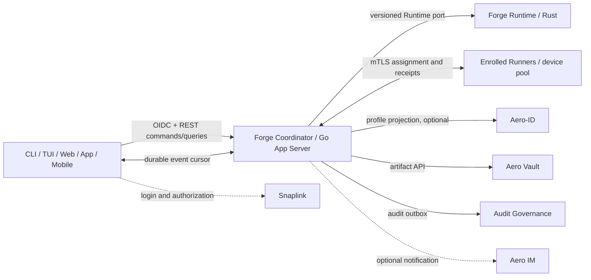

# Cross-Device Forge Sessions and Device Fabric — Implementation Plan

> Status: **User-approved implementation scope; implementation in progress; no phase is thereby declared delivered**
> Date: 2026-09-13
> Scope: shared Forge conversations across CLI, TUI, Web, App, and Mobile, plus authorized multi-device task execution.
> Related designs: [Product Control Plane Blueprint](product-control-plane-blueprint.md), [Product Control Plane Delivery Plan](product-control-plane-delivery-plan.md), [Device-Aware Execution Fabric](device-aware-execution-fabric.md), [Implementation Roadmap](implementation-roadmap.md), and [ADR-0007](../../adr/0007-local-first-conversation-hub.md), with the authenticated shared-session boundary tracked by [ADR-0113](../../adr/ADR-0113-authenticated-shared-conversation-coordinator-v1.md).

The user approved this staged product scope on 2026-09-13. `.agent/ROADMAP.md` tracks it as an active implementation route; this does not change prior Accepted ADRs or claim any phase complete. ADR-0113 records the authenticated shared-session boundary as a Proposed-only v2 decision candidate: its status remains `proposed` and its acceptance fields remain null under repository governance. The implementation includes an authenticated session/Prompt API, Hub-enforced owner binding, private-network TLS support, exact browser Origin allowlisting, and an owner-filtered paged change feed. Rust CLI exposes Snaplink device login, remote session commands, and `remote changes list`; the TUI exposes `sync`; and the Flutter Console `/forge/` surface polls the same feed every 15 seconds (at most four 128-row pages per poll). Feed cursors are dense and local to the exact owner tuple; the Hub's global journal cursor is not returned to clients. CLI/TUI persist reconnect cursors locally by exact Coordinator and saved owner credential with Unix private-file controls; explicit `FORGE_ACCESS_TOKEN` mode does not persist a cursor. Console stores the owner-local cursor in Web localStorage or native platform preferences, keyed by a digest of API origin, Forge client/resource, and the token's issuer/tenant/subject claims. It stores no token and advances the checkpoint only after required conversation/history refreshes succeed; malformed or opaque tokens receive process-only cursors. No client has push/live delivery. CLI credentials are currently access-token-only files protected by Unix owner/mode checks; refresh-token rotation and OS credential-manager integration remain open. Prompt submission only stores a Prompt; it does not create a Run or schedule a device. A complete cross-client accepted journey, authoritative device inventory/scheduler, and Runner execution remain undelivered. The current HTTP listener also requires an exact Host match, which constrains reverse-proxy deployments. Code, focused tests, formal ADR lifecycle, and `forge accept` remain the sources for implementation and completion status.

## 1. Outcome

Deliver one logical Forge workspace that a user can reach from CLI, TUI, Web, desktop App, and Mobile. A conversation created on one client is visible on the others; any authorized client can submit a prompt and follow the same run timeline. Explicitly enrolled Forge Runners contribute fresh device capabilities to a shared eligible pool. The scheduler may automatically choose among eligible devices and must explain the placement decision.

Start with one account and one logical coordinator, with multiple devices. Design IDs and contracts to support Snaplink tenants and later team access, but defer shared-team ACLs, multi-coordinator federation, migration between coordinators, and production-scale HA.

## 2. Domain ownership and invariants

| Domain | Canonical owner | Boundary |
|---|---|---|
| Human identity, tenant, login and authorization | Snaplink | Stable account identity is the exact `(issuer, subject, tenant_id)` tuple from verified Snaplink claims. OAuth/AuthSession is never a Forge conversation. |
| Conversation, Prompt, Run, Runtime Session/Turn/Action | Forge Runtime (Rust), consistent with ADR-0007 | The App Server may expose APIs and rebuildable projections; it must not independently create a second canonical conversation or write the Runtime database. |
| Objective, WorkGraph, policy, device registry, placement intent and lease | Forge Core (Go) | One scheduler/control owner. It assigns authorized work to a Runtime/Runner; it does not duplicate Runtime Attempt state transitions. |
| Runner process, local sandbox, execution journal and attempt evidence | Forge Runtime on the target device | A device is not trusted merely because it is online or enrolled. Runner credentials are separate from user tokens. |
| Account profile and cross-product account links | Aero-ID, when needed | Profile/projection only; not Forge session, device capacity, scheduler, or source of authorization. |
| User collaboration and notifications | Aero IM, optional integration | Message rooms and delivery cursors are not the Forge prompt/run event source. |
| Input attachments and generated files | Aero Vault | Store content and metadata references; Forge remains the authority for prompt/run state. |
| Immutable audit facts and compliance queries | Snaplink Audit Governance | Consume Forge audit outbox events. It is not a live session store, scheduler, or execution approval authority. |
| Web/App/Mobile identity UI shell | Snaplink Console reuse where appropriate | Add a separate Forge Workbench surface; keep SSO administration and Forge execution workflows as distinct product areas. |

The public clients connect to one logical Forge Coordinator. For the first release, a device may be both a user client and a Runner, but these are separate roles and credentials. A Runner connects outbound to the Coordinator; the Coordinator does not scan a LAN or make arbitrary SSH connections.

The initial scope is one self-hosted logical Coordinator reachable only over a private network/VPN and HTTPS. Snaplink validates human identity; the exact verified `(issuer, subject, tenant)` tuple is the session owner, while Rust Hub remains the canonical Conversation/Prompt/Run store and enforces that owner on every query and write. ADR-0113 records this boundary as a Proposed-only candidate and is not an Accepted lifecycle record. A local Conversation is not uploaded merely because the user logs in: session claim/import previews the source profile, target account, selected conversations, projects, and content size, then requires explicit consent. Portable records use opaque IDs and never transmit canonical local paths.

## 3. Product and protocol requirements

### Shared sessions

- Every client uses the same versioned Forge API; clients do not read Go or Rust database files.
- Support conversation list, detail, create, prompt submission, run timeline, cancel, and resume/query. Conversations, Runs, login sessions, IM rooms, and device enrollment have separate IDs and state machines.
- Commands carry an idempotency key and expected aggregate version. Reusing the key with identical bytes returns the prior result; conflicting reuse is rejected.
- The Coordinator assigns durable event cursors. Clients reconnect from a cursor and receive ordered replay before live delivery. Duplicate delivery is allowed and clients deduplicate by event identity; gaps and expired cursors are explicit errors with a resnapshot path.
- Concurrent prompt submissions have a defined ordering or conflict result. A client retry must not create a second Prompt or Run.
- Stream only user-visible Agent events and tool/action evidence permitted by policy; never present hidden chain-of-thought as a product event.

### Identity and clients

- Human clients use Snaplink OIDC with issuer, subject, tenant, audience, and least-privilege scopes. CLI/TUI use the OAuth device authorization flow or another approved native-client flow; refresh credentials belong in the platform secure store, not Forge conversation tables.
- Web, desktop App, and Mobile use the same Session/Query/Command/Event contract. Flutter UI and auth components from Snaplink Console may be adapted, but Console's Admin and identity Portal routes do not become the Forge domain API.
- Mobile is a full session controller in the first client rollout. Mobile compute participation is opt-in and later; a phone that is offline, stale, or unable to meet a task's resource/isolation requirements is ineligible.

### Device inventory and scheduling

- Device enrollment is explicit and owner-approved. Each Runner proves a device identity using a device credential/mTLS; user access tokens are not installed into task sandboxes.
- A Runner reports a stable device ID, software/OS/runtime versions, CPU, memory, storage, accelerator/VRAM and supported capabilities, plus a timestamp/TTL. UI distinguishes `online`, `stale`, `offline`, `reserved`, `cordoned`, `revoked`, and `eligible`.
- Users can target one device or a named eligible pool. Automatic placement evaluates task resource needs, capability, data residency, trust zone, sandbox floor, concurrency, and current freshness. Dry-run results include eligible candidates and rejection reasons.
- A stale or revoked snapshot is never schedulable. Enrollment does not grant every conversation or artifact to that device. Device visibility is scoped by account/tenant and grants.
- Resource reservation is atomic and bounded by a lease. Every assignment carries a fencing epoch; a Runner whose lease is expired or fenced must self-stop and cannot publish a valid terminal result. A network timeout alone does not prove an old process stopped.
- No active LAN scan, automatic SSH config execution, arbitrary shell dispatch, or silent remote dependency installation. Initial enrollment can use an explicit one-time code and owner confirmation; any SSH bootstrap is a separately reviewed, structured, opt-in path.

### Artifacts, audit, and collaboration

- Forge stores canonical conversation/run/attempt metadata. Aero Vault stores large inputs and outputs with content digest, tenant, sensitivity, retention and provenance references. Runner staging verifies digest and authorization; it does not use shared mutable directories.
- Forge emits append-only audit facts through a durable outbox. Events include actor, tenant, conversation/run/attempt/device IDs, policy/placement decision and receipt references. Do not put full prompt/output bodies in the audit ledger by default; use governed artifact references or content digests when appropriate.
- Aero IM may deliver mentions, completion/failure alerts, and optional team collaboration notifications. Its delivery channel is not the authoritative Run timeline.
- Aero-ID can project profile preferences and cross-product links. It is not on the critical prompt-to-execution path unless a concrete account integration requires it.
- Cross-repository data exchange uses versioned APIs and event contracts with idempotency. No service reads or writes another repository's database directly.

## 4. Delivery sequence and exit gates

| Phase | Deliverables | Exit gate |
|---|---|---|
| **P0 — Scope and ownership decisions (product scope approved; detailed governance remains in progress)** | User-approved first-release scope: one personal account per logical self-hosted Coordinator, private-network HTTPS access; Snaplink is the identity authority; Rust Hub is the canonical Conversation/Prompt/Run owner; Go authenticates and applies route policy while Hub enforces exact owner; Runner identities remain separate. ADR-0113 records the authenticated shared-session candidate as Proposed-only. Device enrollment/lease threat model and detailed ecosystem integration contracts remain due before those phases. Roadmap and local-only R0 exclusions are aligned with the approved phases. | Each implemented persistent object has one owner; verified user identity and Runner identity are distinct; remote-session requirements and exclusions are testable. P0 does not enable Runner execution or claim the shared-session API is complete. |
| **P1 — Shared session control plane** | Snaplink authentication and tenant scope; authenticated Forge Query/Command API over private-network HTTPS in v1; Rust Runtime adapter and durable Conversation/Prompt ownership; server projection and replayable cursor; local session claim preview/consent; idempotent Prompt and conflict semantics. Run observation is a separate read-only surface. A Prompt remains stored conversation input unless a separately authorized execution-intent path accepts it. | Two authorized clients can create/list the same owner-bound Conversation, append one Prompt exactly once, and read the same history/change feed after reconnect. Run summaries and timelines expose only existing Runs. No database path is exposed. Public execution-consent and pending-intent routes require the applicable ADR lifecycle and acceptance gates; P1 does not assert that a Prompt creates or starts a Run. |
| **P2 — Common client surfaces** | Ship a thin CLI, TUI, Web Workbench, App, and Mobile client over the same SDK/contracts. Validate Flutter Console reuse as a presentation/auth component only. Add offline read cache and explicit pending-command/retry display where supported. | Contract tests prove identical command/query/event semantics across all clients. A client cannot display an unconfirmed local command as a committed server event. |
| **P3a — Offline declaration review** | Strict local validation and comparison of caller-supplied device declarations; resource and policy exclusion reasons; deterministic output explicitly marked unverified. Snapshot/lease timestamps are compared only to caller-supplied fixed evaluation time and are not verified freshness. No discovery, registration, persistence, network/API call, reservation, or dispatch. | Go dry-run tests prove bounded input, stable results, unverified declarations, and all execution/reservation/dispatch authority bits false. It reports declaration matches only and selects no target. |
| **P3b — Live inventory (authorization gated)** | Only after a formally Accepted architecture/security decision amends or supersedes ADR-0039 and ADR-0114 is accepted: explicit Runner identity/enrollment, outbound authenticated session, server-owned heartbeat time and TTL snapshots, revoke/cordon/drain, and owner-scoped read-only inventory. This phase does not dispatch work. | The authorized inventory can be observed across clients; stale, revoked, incompatible, and over-capacity devices are consistently represented. Its exit gate and implementation must match the accepted ADR exactly. Until then this phase is not authorized for implementation or exposure. |
| **P4 — Two-device remote execution (separately gated)** | Only after a further accepted execution/security decision: scheduler assignment; atomic resource reservation, lease/fencing and local watchdog; bounded TaskSpec; verified sandbox; cancel/timeout; Artifact staging through Vault; Runtime Attempt/Execution/Publish receipts; Audit Governance outbox integration; retry/reconciliation rules for `LOST` and uncertain effects. Begin with low-risk, bounded tasks. Untrusted or AI-generated executable code must meet the Fabric's microVM-equivalent isolation floor. | One explicitly authorized task runs on either of two authorized devices, with an explainable placement, one current fenced lease, verified artifacts, and end-to-end receipt/audit references. Expired or partitioned Runner cannot commit. Uncertain effects are not silently retried or called failed. |
| **P5 — Ecosystem and production expansion** | Aero IM notifications/presence integration; Aero-ID profile projection if useful; production Snaplink keys/scopes and revocation; multi-user/team ACL, quotas, HA/backups, recovery drills, supported remote targets, and optionally mobile Runner. Multi-coordinator federation remains last. | Security, retention, capacity and recovery SLOs are measured on the chosen deployment topology. Team/federation features have separate authorization and data-residency tests. |

P1 and P2 can overlap after the API and owner contracts are frozen. P3a is limited to offline caller declarations. P3b cannot begin until the required architecture/security decision is formally accepted; the user's product-roadmap approval is not that authorization. P4 needs an additional accepted execution decision, the local `ExecutionTarget` contract, validated isolation profiles, durable assignment/lease semantics, and explicit capabilities. This product priority moves the personal multi-device phases ahead of broad team/federation work; it does not remove the existing Wave 0–6 semantic gates for the features they own.

## 5. Ecosystem work packages

| Ecosystem repository | Planned integration | Minimum prerequisite |
|---|---|---|
| `snaplink` | OIDC for human clients; tenant/scope authorization; separate machine/Runner identity lifecycle | Registered Forge client/audience/scopes, issuer/JWKS validation, CLI/native flow and revocation contract |
| `snaplink-console` | Reuse Flutter shell, login, localization, capability/error handling for a separate Forge Workbench route | Stable Forge OpenAPI/Event contract; session token lifecycle reviewed for Web and native clients |
| `aero-id` | Optional profile, account links and cross-app preferences/projection | Stable Snaplink subject/tenant mapping and a concrete consumer; no dependency for Prompt dispatch |
| `aero-im` | Optional run notifications, presence and later team collaboration delivery | Forge event-to-IM adapter, idempotency and channel/user authorization mapping |
| `aero-vault` | Input attachments and generated Artifact content | Snaplink service credentials, tenant/ACL mapping, digest verification, retention and short-lived transfer authorization |
| `snaplink-audit-governance` | Append-only audit events and compliance queries | Forge transactional outbox, event schema/source registration, client binding, tenant mapping and redaction policy |

## 6. End-to-end acceptance journey

The first release is accepted only when this journey passes on a controlled two-device environment:

1. The user signs in through Snaplink from CLI, Web, and Mobile with one stable principal.
2. CLI creates a Conversation and submits a Prompt with an idempotency key. Web and Mobile show the same committed Conversation and Run; a repeated request creates no duplicate.
3. All clients can disconnect, reconnect from their last cursor, and converge to the same ordered visible timeline.
4. Two explicitly enrolled Linux Runners report fresh and visibly different capabilities. A dry-run explains which meets the TaskSpec and why another does not.
5. A bounded authorized task is assigned to an eligible Runner. The current lease/fencing epoch, Runtime execution evidence, artifact digest, and audit event all reference the same Conversation/Run/Attempt/Device IDs.
6. Tests expire a resource snapshot, revoke a Runner, interrupt a lease, and retry a command. Stale/revoked capacity is not assigned; an old Runner cannot commit; duplicate commands do not create duplicate effects; uncertain execution enters reconciliation.

Required automated evidence includes API schema compatibility, Go/Rust golden contract fixtures, Snaplink issuer/audience/scope negative cases, outbox/inbox duplicate and gap handling, concurrency/lease fencing tests, Runner sandbox boundary tests, and client reconnect tests. Live provider or external-storage tests must be reported separately from local mocks.

## 7. Open decisions and deferred scope

1. Coordinator topology and reachability: the approved first release is one self-hosted logical Coordinator behind private-network/VPN HTTPS access; public-internet exposure, HA, and federation are deferred.
2. Authenticated Conversation owner and Go-to-Rust command boundary: ADR-0113 proposes the exact Snaplink principal and Hub-enforced owner mapping. The ADR remains Proposed-only. The owner-enforced API, paged replay foundation, durable owner-local change cursors, and a sanitized read-only Run observer are implemented as partial slices; full Run content, durable Run timeline resume, and live event delivery remain open.
3. Session import policy: allowed source profiles, selection granularity, redaction, and maximum history size remain open. The first bounded CLI slice imports an ownerless local Hub transcript with explicit confirmation; it does not settle profile or redaction policy for a broader release.
4. Initial Runner OS/resource support and which low-risk TaskSpecs meet the verified sandbox floor.
5. Vault retention/data-residency mapping and audit payload redaction.

Deferred from v1: team-shared private Groups, arbitrary SSH, LAN discovery, unrestricted shell, production deployment, automatic migration of in-flight tasks, mobile background compute, multi-coordinator federation, Kubernetes/Nomad/Slurm, and automatic retry of unknown or irreversible effects.

## 8. Plan governance

The user has approved implementation of this staged product scope, and `.agent/ROADMAP.md`, the [Product Control Plane Blueprint](product-control-plane-blueprint.md), the [Product Control Plane Delivery Plan](product-control-plane-delivery-plan.md), and the [Functional Interaction Design](../forge-workspace/functional-interaction-design.md) now reflect that priority without changing the repository's ADR lifecycle rules. ADR-0113 is a Proposed-only decision candidate, not an Accepted ADR; implementation must keep its code and tests within that explicit boundary until the repository's formal lifecycle authorizes any transition. Before Runner enrollment or execution, complete the separate device principal, isolation, lease/fencing, and placement threat decisions. Do not mark a phase complete from a design document, generated contract, mock integration, or Runner self-report alone.

## 9. Source-repository contract audit (2026-09-12)

This audit records ecosystem implementation evidence as of 2026-09-12 unless a later section explicitly updates it. The user approved the staged product scope on 2026-09-13; this audit does not authorize external OAuth-client provisioning or claim that an integration is live.

- **Snaplink is the identity authority.** Aero ID consumes Snaplink bearer tokens and does not issue them. The specified `~/workspace/demo/snaplink` repository exposes a relying-party resource-server middleware that validates issuer, audience, expiry, signature, sender constraint, and projects `sub`, `client_id`, tenant, and scopes. Route handlers still have to enforce their required scope and object/tenant ownership. That repository already implements generic RFC 8628 `/device/code`, `/device/verify`, and `/token` endpoints: approval requires an authenticated access-token bearer, polling is bound to the initiating client, `slow_down` is supported, and DeviceCodeStore backends are configurable. It does not contain a Forge-specific public-client profile with the required audience/resource and least-privilege scopes, nor CLI/TUI device-login or secure credential storage; those clients must not reuse the Console admin client. A dedicated client must also preserve the same verified owner tuple across clients: Snaplink device tokens take `tenant_id` from the client configuration and apply the configured subject type, so matching user accounts alone does not prove that Console and CLI resolve to the same Hub owner. The client must request the Forge resource to obtain the expected audience, and the Forge resource server must continue to enforce audience and scopes.
- **Console already defines an Agent Hub client contract, not the Forge server API.** The actual repository is `~/workspace/demo/snaplink-console` (the originally supplied `~/workspace/snaplink-console` path is absent). Its Agent Hub client uses Bearer headers and separates token issuer from API origin. Existing routes cover instances, sessions, session events, turns, devices, and tasks; its scope names can guide a Forge API contract. Its Flutter UI login uses the `sso-admin-console` client, which is not the client identity for Forge. As of this audit, the Forge Go appserver provided only loopback health. Sprint 156 later added a separate authenticated `/api/v1` Forge session API; it does not implement the Console's Agent Hub routes.
- **Rust remains the Conversation owner.** `forge-runtime` exposes the application service operations and v30 change cursor. As of this audit, ADR-0112's one-shot read-only subprocess protocol was not mounted in App Server routes. Sprint 156 later connected the authenticated Forge API to the Runtime bridge for its bounded session, prompt, and change-feed operations; no Go database reader/writer or second Conversation database was added. Run timeline ownership and a managed shared-store lifecycle remain open.
- **Aero IM and Vault are downstream integrations.** IM supports authorized room messaging/WebSocket delivery and a machine notification API; its delivery cursor is shared by participant and room, so it is not a per-device Forge cursor. Vault supports tenant-scoped object upload/download and resumable object-lifecycle SSE, suitable for artifacts but not prompts, sessions, or scheduling. Audit Governance accepts tenant-bound events from registered sources and can be fed by a future transactional outbox; Snaplink's current login-failure outbox is too narrow for Forge task events.
- **Do not use Snaplink's current ReBAC HTTP routes as the Coordinator authorization gate.** Source inspection found no bearer/scope validation on those routes. Forge must first authenticate the token, enforce route scopes, then authorize each conversation, device, and task against the validated subject and tenant.

Repository evidence reviewed: `~/workspace/demo/snaplink/interfaces/ssoclient/rs`, `~/workspace/demo/snaplink/interfaces/sso/server_device.go`, `~/workspace/demo/snaplink-console/lib/api/agent_hub_api.dart`, `~/aero-id/internal/sso`, `~/aero-im/crates/aero-server/src/integrations.rs`, `~/aero-vault/internal/api/rest`, and `~/workspace/demo/snaplink-audit-governance/internal/auth`.

## 10. Runtime Hub read bridge implementation (2026-09-13)

The proposed ADR-0112 slice adds a private `--runtime-rpc` mode to the existing Rust `forge-runtime` executable and a Go `internal/runtimebridge` client. The RPC supports Global snapshot-at-cursor, bounded change pages, per-Conversation Prompt history, and bounded Conversation bootstrap pages; Rust opens only an existing current Hub in live read-only mode, omits project filesystem paths, and returns generic storage failures. Go uses fixed argv without a shell, exact single-line framing, strict duplicate/unknown/missing-field validation (including nested snapshot members and Global/Project/Group scope shapes), a response cap, a bounded child wait, and symlink-resolved separation between Runtime and App Server state directories. The configured executable must be the direct Runtime binary and must not launch child processes.

At its initial landing, this seam was not called from `appserver.Run` or exposed through HTTP and provided no authentication, account/tenant ownership, Prompt write, Run feed, or clients. Sprint 156 later connected selected bounded bridge operations to the authenticated Forge API. Conversation metadata also has a separate ID-keyset bootstrap page pinned to a change-log head, but `snapshot_at_cursor` still loads all Global project/group/member/conversation rows before the RPC byte cap; that operation remains local until every returned collection is bounded. A later increment adds bounded owner-scoped Run summaries and sanitized event metadata through the same bridge; see §20. ADR-0112 remains Proposed and its implementation does not complete P0 or P1.

## 11. Local Prompt history page (2026-09-13)

The Proposed ADR-0112 scope now includes a read-only `conversation_prompt_page` operation for one Conversation. Rust uses an exclusive `(created_at_ms DESC, prompt_id DESC)` keyset cursor, scans bounded metadata first, then loads no more than 128 Prompt bodies and 256 KiB of aggregate UTF-8 content. A dedicated DTO omits idempotency keys; an oversized or malformed stored row fails closed rather than returning a partial success. Go validates exact nested response shapes, Conversation isolation, page order/cursor continuity, and both content bounds.

At this intermediate point the page was a same-OS-user local process query; App Server routes were still health-only, with no Prompt write, authenticated owner mapping, client UI, remote bootstrap, or scheduling. Sprint 156 later added authenticated owner-scoped history and Prompt routes using bounded bridge operations. Prompt bodies remain sensitive. The byte-budgeted Prompt page does not fix the separately unbounded Global snapshot materialization; that snapshot is still not a remote bootstrap source. The proposed plan and ADR remain unadopted, so this implementation does not complete P0/P1.

## 12. Bounded local Conversation bootstrap page (2026-09-13)

The next local bridge increment adds a two-phase Conversation metadata page. The first request captures the store change head in the same read transaction as page one; continuations carry that fixed head. Phase one pages v29 migration baselines by binary Conversation ID. Phase two pages append-only change rows by cursor through the fixed head and hydrates only `conversation_created` rows, so every SQL phase reads at most `limit+1` indexed rows even when Prompt changes are interleaved. Later creations are excluded and reconciled through the existing change feed after the captured head. Entries include creation cursor and observed aggregate version so Prompt updates after the cutoff can be replayed idempotently. `scanned_through_cursor` exposes raw journal progress, including an empty final page that contains only Prompt events. No Prompt bodies or filesystem paths are returned.

This bounds per-query row materialization for the Conversation-list operation, but journal-head validation still scans the event count and has no hard CPU bound. It does not bound the projects/groups/members still loaded by `snapshot_at_cursor`; that full snapshot remains local-only. ADR-0113 records a Proposed-only durable owner contract: a nonempty verified issuer/subject/tenant tuple, Hub-side per-Conversation enforcement, and no implicit legacy-session claim. Sprint 156 now wires gateway authentication, Hub owner checks, bounded conversation routes, and negative cases. The configured session API is still not a formally accepted release, and the unbounded snapshot API is not exposed remotely.

## 13. Partial client surface implementation (2026-09-13)

The Rust CLI provides remote conversation list/create and prompt-history/append commands, with a line-oriented `remote tui` for browsing pages, opening history, creating conversations, and submitting prompts. The TUI reuses the same session API and its retry path preserves the in-process request identity; submitting a Prompt only stores the user Prompt and does not create or execute a Run. The CLI and TUI read `FORGE_API_URL` and `FORGE_ACCESS_TOKEN` from the process environment. They do not yet implement Snaplink RFC 8628 device authorization or secure persistent credential storage. Snaplink's generic flow exists in the specified repository, but a Forge-specific public client still needs deployment configuration and cross-client owner-claim parity must be verified before enabling shared login.

The Flutter Console adds a `/forge/` surface for listing/creating conversations, viewing paginated Prompt history, and appending Prompts. It reuses Console's existing Snaplink login and requests Forge conversation read/write scopes; this is a Console client slice, not a completed Web/App/Mobile rollout or a complete cross-client lifecycle. The latest focused Console run passed all 12 tests and `flutter analyze`. Rust formatting and strict Clippy passed. The CLI all-targets run passed 288 unit tests; a final rerun passed 286 with two long stress cases skipped after both had passed in the preceding run, and every integration target passed. Infrastructure passed 430 unit tests, 124 schema-migration tests, and all integration/doc targets after updating historical fixtures for v32. Go authn/runtimebridge/appserver race tests, vet, and a fresh real Go HTTP→Rust Runtime→Hub E2E passed. The specified Snaplink repository was not changed in this slice; its existing generic RFC 8628 flow was inspected, but no Snaplink test result is included here. A Forge-specific public-client configuration, CLI device-login, and secure credential storage remain open. These checks validate this implementation slice but do not constitute formal same-tree acceptance.

A pure Rust device-registry reference model exists with domain/application tests, but Go Forge Core remains the planned authority and has no persistent device inventory/lease projection or heartbeat endpoint yet. The owner-scoped replay feed carries only conversation and prompt change metadata; it is paged polling, not live delivery, and does not yet provide a Run intent/timeline. Placement/reservation service and Runner execution are also absent. These client and reference-model slices do not close P1/P2 or any device-fabric phase; ADR-0113 remains Proposed/null.

## 14. Owner-local replay cursor hardening (2026-09-13)

The owner-scoped feed uses a dense sequence maintained for each exact verified `(issuer, subject, tenant_id)` owner. Hub writes allocate the next sequence and append the corresponding global journal reference in the same transaction. Reads page by the owner sequence and keep the mapped global journal cursor internal for row validation; API responses expose only the owner-local cursor. Foreign-owner activity therefore neither creates gaps nor changes another owner's head or next cursor. The v32 migration backfills dense owner sequences from existing owned conversation changes and leaves ownerless legacy conversations outside the feed.

The Go and Flutter clients validate exact page shape, dense cursor continuity, `scanned_through_cursor` agreement, and `has_more` page bounds. Empty pages must leave the cursor unchanged. The feed excludes Prompt bodies and idempotency keys. Rust CLI/TUI resume from a private local checkpoint partitioned by coordinator and exact saved principal; explicit token overrides have no persistent checkpoint. Flutter Web/native resumes from an owner-bound local checkpoint and only persists after the selected history or conversation refresh needed for the page succeeds. This does not add push delivery, Run events, or formal phase acceptance; ADR-0113 remains Proposed/null.

## 15. Dedicated Snaplink Forge client profiles (2026-09-13)

The designated Snaplink repository now accepts an optional `clients[].grant_types` allowlist and copies it through YAML seeding into the token-endpoint policy. Omitted lists remain unrestricted for compatibility; configured lists reject blank and duplicate entries while retaining support for deployment-specific grant extensions. Its multi-replica Kubernetes sample enables RFC 8628 storage on the existing Redis OAuth backend and defines separate `forge-console` and `forge-cli` public clients. Both request resource `forge-api`, the two Forge conversation scopes, public subjects, and tenant `acme`, which makes `(issuer, subject, tenant_id)` parity explicit in this sample. These are source configuration seeds, not proof that a live deployment has reloaded them.

The Flutter Forge login now explicitly selects `forge-console`, requests only the Forge resource and conversation scopes, and stores its token in a client-scoped tab/memory slot. This keeps a narrowed Forge token from replacing the default Admin session and clears only the Forge slot after an unauthorized response; an explicit Console logout clears registered scoped slots too. The resource default is `forge-api`, matching the Forge server audience. Focused OAuth/session/Forge-route/widget tests and `flutter analyze` pass; Snaplink seed/config race tests and repository build/vet pass. A Snaplink handler integration test now drives separate Console direct-login and CLI device-grant clients and compares their exact `(iss, sub, tenant_id)` tuple and Forge audience; it also verifies the CLI grant allowlist rejects authorization-code exchange. The Rust CLI/TUI still lack RFC 8628 login and secure persistent credentials, so this does not yet prove that the deployed Console and CLI profiles actually produce the same owner. No Forge device enrollment, inventory endpoint, placement API, or remote execution was added. ADR-0113 remains Proposed/null, and this work does not complete P0/P1 or authorize remote Runner activity.

## 16. Native CLI device login (2026-09-13)

The Rust CLI adds `remote login` using Snaplink's RFC 8628 device-code and token endpoints. It requests the `forge-cli` public client (overridable with `SNAPLINK_CLIENT_ID`), resource `forge-api`, and only the two Forge conversation scopes. The device response is size- and lifetime-bounded; redirects are disabled; non-loopback HTTP is rejected; and the displayed verification URI must use HTTPS with no embedded credentials. A loopback HTTP verification URI is accepted only when the configured issuer is also loopback HTTP and both have the same origin. This supports Snaplink deployments whose user-verification page has a separate secure HTTPS origin while preventing a remote issuer from directing users to an arbitrary local HTTP service. Polling honors the issuer-provided interval and RFC `slow_down` increases. Access tokens are never printed.

On Unix, the CLI stores each access token partitioned by issuer, client, tenant, and subject below the configured XDG config root, using current-user-owned `0700` directories and `0600` files with symlink checks and atomic replacement. It fails closed on unsafe paths and on platforms without this protected-file implementation. `FORGE_ACCESS_TOKEN` remains an explicit higher-priority override; `SNAPLINK_SUBJECT` and `SNAPLINK_TENANT_ID` disambiguate multiple saved accounts. The CLI locally decodes claims to reject issuer/client/owner/audience/scope/expiry mismatches before storage, but does not verify JWT signatures; the Forge resource server performs signature and authorization checks. This slice stores no refresh token, so expiry requires running `remote login` again, and the POSIX file store is not an OS keychain.

Focused validation passed for all 34 `remote_command` tests, all 4 `remote_args` tests, `cargo fmt --all -- --check`, and strict CLI Clippy. The regression tests preserve the exact configured issuer spelling across login and credential lookup, including trailing slash, host case, and explicit default port. The designated Snaplink source profile restricts `forge-cli` to the device-code grant while `forge-console` retains authorization-code and refresh-token grants; no live configuration reload is claimed. The Flutter Forge focused suite passes 12 tests with `flutter analyze`; the Snaplink owner-parity race test also passes. The CLI configuration and usage are documented in [forge-runtime README](../../../forge-runtime/README.md).

The Prompt route still commits only the user Prompt and returns a storage result; it does not create a Run, publish a Run timeline, or submit work to a Runner. The CLI prints a clear stderr note after a successful Prompt write; the TUI and Flutter Console also make that distinction explicit: the Prompt was stored, and no task Run was started. The Go App Server currently compares each request Host to the exact bound listener authority. A reverse proxy that preserves a different public Host therefore receives `421 Misdirected Request`; there is no trusted forwarded-host configuration. This is an explicit deployment limitation pending a reviewed external-authority/proxy trust contract. No proxy header is treated as authority.

The Hub now has an inert atomic pending Run-intent and payload-free initial timeline contract, but public consent/intent APIs and consent UX remain absent; an internal startup-bound profile catalog is available to trusted policy code, while ordinary Prompt submission remains storage-only. Remaining work also includes the full task timeline, full Web/App/Mobile clients, refresh-token/OS credential-manager support, Web cursor persistence or streaming, and a Go-owned persistent device registry with governed enrollment, heartbeat, placement, leases, and Runner receipts. CLI/TUI checkpoints are per local installation and are not shared across devices. ADR-0113 remains Proposed/null. [ADR-0039](../../adr/adr-0039-default-off-device-aware-execution-fabric.md) still constrains live device registration, network scans, arbitrary SSH, and remote Runner execution; the metadata-only observer in §20 does not authorize them or complete P0/P1.

## 17. Separate Conversation scope from Run authorization (2026-09-13)

Global, Project, and Group identify how the configured Coordinator owner organizes a Conversation, not who may execute against a Project. The App Server pins one exact `(issuer, subject, tenant_id)` principal for this personal Coordinator and rejects other valid tenant accounts before they can create or read sessions; Hub queries continue to enforce exact Conversation ownership independently. Authenticated creation accepts each scope only when its referenced local Hub row exists. Group membership does not grant other accounts access, and a Project scope grants no execution authority. Project paths, files, Run journals, and provider/tool context are not exposed by these routes. This allows the same account to find and continue its scoped sessions from CLI, TUI, Console, and other clients without treating a scope association as project consent. There is no formal accepted release or data migration contract yet.

No remote Run-intent route is added. The existing local Run request accepts caller-provided Project and execution configuration, so it is not a safe remote contract. The Hub now provides an owner-to-Project consent record and atomically commits a Prompt, inert pending intent, and initial timeline marker after rechecking that consent. Public clients still need an explicitly authorized consent flow and server-owned execution profile policy; project scope must come from the Hub-owned Conversation, never the request. ADR-0113 remains Proposed/null and ADR-0039 continues to prohibit Runner enrollment or dispatch in this slice.

## 18. Remote session scopes and device enrollment decision boundary (2026-09-13)

The Rust CLI can create an owner-private Conversation in Global, Project, or Group scope with `remote sessions create --scope global|project:ID|group:ID`. By default, `remote sessions list --scope ...` filters the current server page; `--all` scans up to 64 keyset pages and applies the scope filter across those pages, returning the last cursor when more pages remain. The TUI accepts the same scope selector when creating a Conversation and displays scope on each loaded row. Scope remains organizational metadata: it grants no Project, Group, Runner, or execution authority.

ADR-0114 is a Proposed-only follow-up candidate for opt-in device identity, explicit owner approval, authenticated heartbeats, persisted freshness, revocation, and read-only owner-scoped inventory. It does not amend ADR-0039, whose current accepted boundary forbids live registration and heartbeat. No device endpoint, credential issuer, persistence, inventory UI, placement, reservation, or dispatch is implemented. The separately audited Console Agent Hub has device and task surfaces, but its task records do not bind to Forge Conversation/Run state, so it is not reused as the Forge execution authority.

## 19. Explicit local Conversation import (2026-09-13)

`remote sessions import LOCAL_CONVERSATION_ID` reads a current-schema local Hub in live read-only mode and prints the source scope, title, full user/assistant transcript, UTF-8 content size, target Coordinator, explicit Global destination scope, and local account-claim preview. It accepts only ownerless source Conversations and rejects legacy blank visible prompts, transcripts over 128 messages, and content over 256 KiB. The preview does not upload data. The user must repeat the command with its SHA-256 confirmation; the digest binds the selected source metadata and transcript, Global destination scope, Coordinator, and exact issuer/client/tenant/subject preview. Any source or target change invalidates the confirmation and displays the current preview for review.

After confirmation, CLI sends only the title and user/assistant Prompt bodies to `POST /api/v1/conversations/import`; it does not send a local Conversation ID, canonical path, Project path, Run, tool payload, or provider context. Go derives the owner from the verified token and enforces the write scope; Rust creates the new Global owner-bound Conversation, imported Prompt rows, and owner-local change entries in one transaction. The deterministic request key makes retries idempotent, while the source Conversation remains untouched. The Coordinator is authoritative for JWT signature and account authorization; local token claim decoding labels the preview only.

Rust storage, RPC, CLI request, parser, and Go HTTP-to-Rust integration tests cover limits, exact payload shape, owner isolation, rollback, replay after later Prompts, and source preview. This is a CLI-only first slice: it has no per-Prompt selection or redaction UI, does not make legacy sessions automatically shared, does not create or execute a Run, and does not complete P1 or the open session-import policy. ADR-0113 remains Proposed/null and ADR-0039 still prohibits live device enrollment or remote Runner execution.

## 20. Owner-scoped read-only Run observation (2026-09-13)

The Runtime Hub now exposes bounded Run summary pages and per-Run timeline metadata for an already owner-authorized Conversation. Go derives the exact `(issuer, subject, tenant_id)` owner from the verified principal, requires `forge:conversations:read`, and preserves uniform not-found behavior for missing and foreign-owned Conversations/Runs. SQLite checks ownership and reads each page in one deferred transaction. Run pages use a `(created_at_ms, run_id)` keyset cursor and are capped at 25 rows; timeline pages are capped at 128 events and resume after a dense sequence cursor. Both pages cap aggregate source event bytes at 2 MiB and may return a shorter nonempty page with `has_more=true`.

The response is deliberately metadata-only. Run summaries contain only ID, Prompt ID, creation time, latest event sequence, and a closed status value. Timeline entries contain only sequence, event timestamp, and one of `run_started`, `turn_started`, `activity`, or `run_finished`. Assistant text, tool details, execution configuration, paths, provider data, idempotency keys, and error messages never leave Runtime storage through these operations. All assistant, tool, and error event variants collapse to `activity`; `nonterminal` means only that the latest observed event is not a terminal event, not that a process is currently running.

The CLI offers `remote runs list CONVERSATION_ID` and `remote runs timeline CONVERSATION_ID RUN_ID`; Flutter Console exposes the same read-only pages from its Forge conversation view. The TUI now offers `runs [--before TIME RUN_ID]` and `timeline RUN_ID [AFTER_SEQUENCE]` against its selected session, with pagination cursors and metadata-only rendering. These operations observe Runs already present in the Hub and do not create one. The Prompt route still stores a Prompt without creating a Run or submitting work. This increment does not provide Run content, push delivery, a Run-intent contract, owner-to-Project execution consent, device enrollment, placement, or remote execution. ADR-0113 remains Proposed-only and ADR-0039 continues to prohibit live device registration and Runner dispatch; this is a partial observation slice, not completion of P1.

## 21. Offline placement dry-run and ecosystem boundaries (2026-09-13)

Forge Core adds `forge device-placement dry-run --input FILE|-` as an offline-only comparison over a bounded, strict, caller-supplied JSON inventory and requirements document. It evaluates a fixed caller-supplied `evaluated_at_ms`, exact declared `(issuer, subject, tenant_id)` owner tuples, approval/cordon/liveness/freshness/lease, OS/architecture/resources/runtime/GPU, residency zones, trust zone, sandbox floor, and concurrency. Output is deterministic with sorted per-device exclusion reasons and uses `matches_requirements`; every inventory and security attribute is labeled an unverified caller declaration. It selects no device and hard-codes `execution_authorized`, `reservation_created`, and `dispatch_performed` to `false`. The command makes no network/API calls and adds no persistence, discovery, enrollment, reservation, dispatch, or execution. It is a comparison of declarations, not verified inventory or placement authority.

The Rust `device_registry::placement` reference model has typed requirements and policy filters over the same resource and placement dimensions, including residency, trust, sandbox, and concurrency. This is policy-dimension parity only: the Go command owns its separate versioned offline contract and exact owner-tuple comparison; the Rust model is not a live observation or dispatch adapter. Neither model changes ADR-0039 or advances Proposed-only ADR-0114.

The ecosystem audit keeps Snaplink as the sole identity and token authority and the Hub as canonical Conversation, Prompt, and Run state. Aero-ID exposes account/source/membership projections but has no general public account-link or consent API; the in-progress internal membership-check candidate is bounded-stale projection data, not a Hub grant. Aero IM's installation-scoped machine notification API is a downstream status/link channel, not session storage. Aero Vault's tenant-scoped object API is suitable for artifact bytes and ACLs, not application secret management. Snaplink Audit Governance accepts tenant-scoped evidence at `POST /api/v1/events`; Forge should relay minimized lifecycle facts from a Hub-owned outbox and verify ledgered receipts, without treating audit events as Run state. Service tokens remain audience-specific and are not forwarded between products.

The Flutter Android APK has been built; iOS and real-device behavior have not been validated. These implementation and audit notes do not mark P3 or P1 complete and do not change any ADR status.

## 22. Project execution consent persistence (2026-09-13)

Rust Hub schema v33 adds an owner-to-Project execution consent record with an opaque execution-profile ID and SHA-256 digest, grant time, and bounded expiry. One exact `(issuer, subject, tenant_id)` owner may have at most one unexpired, unrevoked grant per Project. Grant creation and revocation use immediate Hub transactions, owner-scoped idempotency keys, and append-only `granted` / `revoked` event rows; the migration pins the full v33 structural contract and rolls back on final-contract failure.

This is an inert authorization record only. Its trusted Runtime RPC accepts a profile ID/digest from the local control-plane caller, but there is no HTTP consent route and no public client may choose those values. A future Coordinator route must select the profile from server-owned policy, authorize the Project independently, and derive the owner solely from verified Snaplink claims. A grant response, including an idempotent replay, is a receipt for that original operation rather than proof that consent remains active; pending Run-intent creation must recheck expiry, revocation, owner, Project, profile ID, and digest in the same transaction that stores its Prompt and intent.

The v33 consent foundation does not create a Run, pending intent, execution profile, reservation, audit event, device record, or dispatch. ADR-0113 remains Proposed/null, and ADR-0039 still prohibits live device enrollment, heartbeat, discovery, and remote Runner execution. The separate atomic Prompt-plus-pending-intent Hub contract is implemented in §23; it does not reuse `RunStore::begin_run_with_prompt` or emit `run_started` before execution begins.

## 23. Inert pending Run-intent submission (2026-09-13)

Rust Hub schema v34 adds a distinct `pending_run_intents` record and a payload-free `submitted` timeline event. A fresh submission accepts only the exact verified owner, a stored Conversation ID, Prompt text, idempotency key, expected aggregate version, and a trusted server-selected profile ID plus SHA-256 digest. Inside one `BEGIN IMMEDIATE` transaction, Hub first resolves exact idempotent replay; otherwise it requires an owner-bound Project-scoped Conversation, exact CAS, and one unexpired, unrevoked consent grant matching the owner, derived Project, profile ID, and digest. It then writes the user Prompt through the existing atomic Prompt/change-journal path, the inert pending intent, and sequence-1 `submitted` event. The transaction never creates or changes ordinary `runs` or `run_events`.

Replay is a receipt for the original operation: same owner/key/Conversation/Prompt body returns the original Prompt and intent with `replayed=true`, even when the Conversation head, grant state, or currently selected server profile has changed. It performs no new write and makes no claim that consent is still active. Changed content or Conversation conflicts. Project scope is derived from Hub data; Global and Group Conversations are rejected for intent submission. Owner-filtered pages and timelines use separate DTOs, return uniform not-found for missing/foreign records, and omit Prompt bodies and profile digests from read projections.

The Rust Runtime RPC v2 candidate contract and Go `internal/runtimebridge` client now cover Project consent grant/revoke, intent submit, intent pages, and payload-free timelines. Go applies strict request/response validation and preserves the original profile in intent replay receipts. A private owner-filtered Project identity RPC feeds a fail-closed Go profile catalog loaded from trusted `forge-server` startup bindings. The ordinary authenticated HTTP `/prompts` route still uses Prompt append; no production Run-intent or consent route is wired. No provider, worker, device, reservation, audit event, or dispatch is reachable from this slice.

Verification on the current tree: infrastructure pending-intent atomicity 6/6 (including five injected rollback points), application original-receipt test 1/1, Runtime RPC submit/read/malformed-field tests 2/2, v33→v34 migration and final-validation rollback 2/2, and fresh/legacy current-schema validation/reopen 1/1. Strict all-target Clippy for the four Runtime crates and workspace format check pass. Go `internal/runtimebridge` race tests and vet pass; the Go→real Rust subprocess integration passes against a fresh temporary Hub, including consent grant/revocation, replay after profile/CAS change, owner isolation, and confirmation that no Run was created. These focused checks do not constitute full repository acceptance.

The existing HTTP Prompt route now has a real Go→Rust regression for its storage-only semantics: first append returns `201`, an exact key/body retry after the Conversation advances returns `200` with the original Prompt ID and `replayed=true`, changed content under the key and a new stale-CAS write return `409`, only the two accepted writes advance history/change feed, and the Run page stays empty. The test creates its Hub below `t.TempDir()`. Authenticated `/run-intents` and `/execution-consents` paths remain `404`. The Go consent grant/revoke helpers in the pending-intent subprocess test now use the strict private bridge instead of raw Runtime RPC framing.

The next public-client step requires an HTTP path wired to that catalog, an explicitly authorized consent flow, and the applicable ADR lifecycle and same-tree acceptance gates. ADR-0113 remains Proposed/null; ADR-0039 continues to prohibit live enrollment, heartbeat, discovery, and remote Runner dispatch. This increment completes neither P1 nor P3 and does not make a Prompt an executing task.

## 24. Private HTTP consent and inert intent handler candidate (2026-09-13)

Go App Server now has a package-private HTTP handler candidate for owner-bound execution consent preview/grant/revoke and pending Run-intent submit/page/timeline. The paths are `GET|POST /api/v1/conversations/{id}/execution-consents`, `DELETE /api/v1/execution-consents/{grant_id}`, `POST|GET /api/v1/conversations/{id}/run-intents`, and `GET /api/v1/conversations/{id}/run-intents/{intent_id}/timeline`. Read and write scopes follow the existing conversation scopes. The grant command requires `confirm_execution_profile=true`, the exact Project/profile ID and profile digest returned by the prior preview, an idempotency key, and an expiry. The handler independently resolves the Project from the owner-filtered Hub and the profile from its server catalog; these expected values only bind confirmation to what the user saw, never select a Project or profile. A changed Project/profile returns `409 execution_profile_changed` and requires a fresh preview. The preview reports the Hub's 30-day maximum TTL. Intent submission accepts only Prompt text and expected aggregate version plus the idempotency header.

The handler is deliberately not registered by `appserver.Run` or the normal conversation route constructor. The HTTP-to-Rust integration test constructs it directly with a temporary Hub; normal production route construction continues to return `404` for intent paths. This produces implementation evidence without treating user approval of the overall roadmap as ADR lifecycle acceptance or permission to expose the candidate. The endpoint still requires a product consent UI that presents the selected server profile before issuing the explicit grant command.

The real Go HTTP→Runtime→Hub test verifies server-selected profile binding, Project-scope rejection for Global Conversations, route scopes, strict rejection of caller-selected profile fields, profile confirmation mismatch on Project/profile ID/digest or catalog drift, grant and intent idempotency, sanitized owner-filtered page/timeline reads, revocation blocking a new intent, original replay after revocation, foreign-owner denial, and no ordinary Run creation. A second real HTTP→Runtime→Hub regression uses two distinct signed access tokens and two independent HTTP clients: client A creates a session, client B lists it and appends a Prompt, then client A reads that Prompt and its owner change event. Go full tests, race tests for `internal/appserver`, `internal/executionprofile`, and `internal/runtimebridge`, full Go vet, and the temporary-Hub integrations pass. This remains an unexposed intent/consent API candidate only; existing Console/CLI/TUI session and Prompt surfaces use the authenticated session API, but no intent UI is connected. ADR-0113 remains Proposed/null, and ADR-0039 still blocks live device enrollment and remote execution.

## 25. Older Prompt history pages in CLI and TUI (2026-09-13)

`remote prompts list CONVERSATION_ID` accepts the paired `--before-created-at-ms` and `--before-prompt-id` cursor returned by the previous page. The TUI's `older` command requests the page before its selected session's most recent history cursor after `open`; a failed request keeps the cursor for retry, while switching selection or refreshing history resets the continuation. The CLI client validates that every returned row is strictly older than the requested cursor, complementing existing page-order, owner, size, and response-shape checks.

This change only reads existing owner-scoped Prompt history through the authenticated session API. It creates no Run or intent and does not alter ADR-0113's proposed lifecycle state or ADR-0039's prohibition on device registration and remote execution. Focused Rust remote-client tests, Prompt argument tests, the TUI HTTP cursor fixture, strict CLI Clippy, workspace formatting, and diff checks passed. The full CLI package suite remains unverified because this turn stopped at an unrelated long-running Agent stress test.

## 26. Contract-only Forge Prompt audit projection (2026-09-13)

Forge Core now has a pure `auditprojection.Project(owner, change)` function for one exact Hub `prompt_appended` change. It accepts the owner passed by Forge's authenticated, owner-scoped caller plus the ID-only committed change DTO; the function validates owner shape but cannot itself verify a token or Hub authorization. Prompt text, title, path, provider data, token, and request idempotency key are not present in either input. The versioned event carries the tenant, a stable pseudonym derived from the length-framed issuer/subject/tenant tuple, Conversation/Prompt IDs, aggregate version, occurrence time, and deterministic event/idempotency IDs. The raw subject is not exported. Tenant and aggregate/operation identifiers are checked against Audit Governance's 85-byte, no-whitespace/path-separator/delimiter constraints. The event's only payload field is `content_included: false`; event IDs hash a domain separator and length-framed exact owner/change identity. The JSON Schema and golden fixture are under `docs/contracts/`.

This pins the minimized event contract only. Audit Governance's `actor.id` field accepts a nonempty string and does not verify that it came from Snaplink; Forge's authenticated call boundary must supply the owner. A future tenant-side registration must bind the `forge-runtime` source to the approved producer client and register this exact active schema with `content_included` as its only allowed payload field. There is no durable Hub outbox, delivery cursor, network client, Audit Governance source/schema registration, acknowledgement, retry worker, or external call; the projection is not transactionally coupled to the change journal. A later outbox decision must define transactionality, bounds, retention, and failure behavior. No Run or device event is projected. ADR-0111/0112 lifecycle triggers and ADR-0039 remain unchanged.

## 27. Automatic read-only Run observation in Console (2026-09-13)

The Flutter Forge screen's existing 15-second change-sync timer now also refreshes the selected Conversation's bounded Run summary page and the selected Run's metadata-only timeline after its current scanned sequence. It updates a Run summary if that Run is in the refreshed page, discovers a new latest Run when none is selected, and appends only validated sequential timeline markers. Generation checks discard responses after Conversation/Run selection changes. A malformed timeline page leaves the sequence unchanged for retry; a failed Run poll does not write or advance any Run state. The API calls remain authenticated GETs under the existing conversation-read scope.

The slice does not add task submission, consent, a Run-start endpoint, device inventory, dispatch, or delivery guarantees beyond periodic polling. Focused Console widget tests cover status refresh, incremental timeline reads, rejection/retry without cursor advancement, and read-only authenticated requests; the existing conversation/cursor widget tests, Dart analysis, Web build, and diff check also pass. P2 remains partial, and ADR-0039's live device boundary is unchanged.

## 28. Real Rust CLI through Coordinator multi-principal E2E (2026-09-13)

The multi-client integration now launches built `forge-runtime` CLI processes against the same temporary Go HTTP Coordinator and real Rust Hub used by the existing A/B HTTP-client flow. CLI principal A creates a Conversation, principal B lists it and appends a Prompt, and A reads the Prompt history and owner-local change feed. A third signed principal C has the same issuer, audience, and tenant with valid scopes but a different subject; it authenticates successfully, receives an empty owner list, and receives uniform not-found for the foreign Conversation. This drives the authorization request through Go and verifies object isolation at the Hub boundary.

The test checks that the Prompt creates neither an ordinary Run nor a pending Run intent. Its request recorder requires exactly the expected Conversation/Prompt/change reads and writes plus the Run-list GET, including query strings; device, placement, dispatch, consent, intent, or other HTTP paths fail the allowlist. CLI processes use explicit test-token/API environment values, temporary HOME/XDG directories, a reduced environment, timeouts, and bounded output. This is an actual CLI→Go→Rust end-to-end integration, but does not establish a live Flutter/Console connection or complete P2. Focused and race-enabled E2E, App Server package tests with `FORGE_RUNTIME_BIN`, vet, formatting, and diff checks passed. No production route or CLI behavior changed.

## 29. Shared owned-Conversation page contract and Snaplink device-grant alignment (2026-09-13)

The owner-scoped Conversation list response now has a canonical fixture at `docs/contracts/fixtures/forge-owned-conversation-page-v1.json`, parsed by Go Runtime bridge models, the Rust CLI, and Flutter Forge Console through `scripts/test-forge-contracts.sh`. The Flutter parser receives the actual requested page limit and cursor; like the Rust client it rejects unknown fields, invalid scopes/IDs, non-increasing IDs, and inconsistent `has_more` / `next_after_id` relationships. Rust now rejects unknown page and entry fields and validates the nested Conversation projection before displaying it. Go's strict fixture decoder checks that its Runtime model matches the same closed shape. The shared fixture test is a contract guard; the real CLI→Go→Rust E2E remains the transport and ownership evidence.

The Snaplink device-code token response now follows an explicit client grant allowlist before adding a refresh token. A device-only client gets no refresh token, while explicitly allowed clients and legacy clients with no configured allowlist retain refresh issuance and rotation. This closes an issuer/profile inconsistency; it does not enable refresh for Forge CLI, change the seeded `forge-cli` grants, or imply that Console/CLI tokens are automatically refreshed.

Verification: the root contract script passes Go, Rust, and Flutter fixture tests; focused Flutter model/API tests and Dart analysis pass; Rust CLI strict Clippy and formatting pass; the rebuilt CLI passes the race-enabled real Coordinator/Hub E2E; Snaplink device grant tests plus Go build/vet pass. P2 remains partial, Flutter has no live Coordinator journey, and ADR-0039 / ADR-0114 device enrollment and dispatch gates are unchanged.

## 30. Forge Console client-scoped refresh-token rotation (2026-09-13)

The explicitly selected `forge-console` login now stores Snaplink's refresh token alongside its access token in that OAuth client's existing session slot. The Forge API uses the public-client `refresh_token` grant against Snaplink's configured origin after a 401, shares a concurrent rotation, stores the replacement access/refresh pair, and retries the rejected API request once. A write retry keeps its original body and idempotency key. It sends no client secret and never forwards refresh credentials to Forge. If rotation fails or a replacement access token is rejected, the Forge slot is cleared and known-rejected bearer tokens are not sent again. Web remains tab-scoped session storage; native credentials remain in process memory.

Refresh tests cover request shape, per-client isolation, token rotation, single-flight concurrency, failed-grant cleanup, one idempotent Prompt replay, and no loop after a second 401. This improves authenticated session continuity only; it adds no device enrollment, Runner inventory, or execution path.

## 31. Shared offline placement policy test vector (2026-09-13)

Go's offline caller-supplied placement evaluator and Rust's typed placement reference model now consume the same test-only fixture for their overlapping resource and policy checks: OS, architecture, CPU, memory, storage, one runtime, residency, trust, sandbox floor, and concurrency. The fixture pins sorted `matches_requirements` and common reason projections while leaving full owner-tuple matching, unknown-state handling, heartbeat/lease rules, and GPU semantics in their existing language-specific tests. It is documented at `docs/contracts/forge-device-placement-policy-parity-v1.md` and included in `scripts/test-forge-contracts.sh`.

The Go JSON scanner also rejects `null` at required wire values, closing a gap where Go's decoder could silently retain zero values for present nullable primitive fields. The parity vector remains a test-only mapping, not a new product API or a live inventory contract. It has no target selection, reservation, authorization, or dispatch output. ADR-0039 remains unchanged and ADR-0114 remains Proposed/null.

## 32. Persistent TUI Prompt transcript (2026-09-13)

The remote TUI now stores the selected Conversation's validated Prompt rows in process-local view state and renders them on every command redraw. `open` loads the latest page, `older` merges the next older page, `sync` merges the latest page after owner-feed/session refresh, and a confirmed local Prompt write fetches and merges the latest page. Rows are deduplicated by Prompt ID and displayed in chronological `(created_at_ms, id)` order; switching the selected Conversation clears the prior transcript. A newest-page refresh retains the cursor for the oldest already loaded row, avoiding redundant history-page reads after sync. Content and role are rendered as JSON-escaped strings so terminal control characters remain visible as data.

If Prompt history refresh fails after an accepted Prompt POST, the write stays confirmed, the pending-write recovery state is cleared, and the prior transcript remains visible. A sync session/history refresh failure keeps the durable owner-change cursor unchanged and returns control to the TUI for retry. The change feed remains manual; this adds no Run creation, task execution, device inventory, or dispatch path.

Focused TUI tests cover cross-client Prompt visibility after `sync`, local append refresh, retained transcript after failed refresh, cursor non-advancement, older-page merge/deduplication, chronological ordering including same-millisecond IDs, conversation selection isolation, and preservation of the oldest loaded-page cursor during newest-page refresh. `cargo test -p forge-runtime-cli remote_command::tui` (14 tests), strict all-target CLI Clippy, workspace formatting, and the Rust diff check pass. ADR-0039 remains unchanged and ADR-0114 remains Proposed/null.

## 33. Flutter Console API through Coordinator and Rust Hub (2026-09-13)

The multi-client Go/Rust integration can now launch a Flutter test against the same temporary Go Coordinator and real Rust Hub after another client has created and updated an owned session. It exercises Console's production `ForgeConversationsApi`, Forge-scoped token slot, `ForgeSessionsGate`, and actual `ForgeSessionsScreen` over loopback HTTP: the service reads the session and Prompt written by another client, appends a Prompt and reads the owner change feed; the gate loads the screen from the scoped token slot, which renders the same session/history and submits another Prompt through its UI. A Go client then reads all three Prompts back from the Hub. Console uses its own signed test principal token for the same exact owner tuple; the short-lived token is supplied through a private temporary JSON input file, and the Coordinator origin is passed as a compile-time define.

The HTTP recorder requires exactly the four API-service calls and four screen calls for session list, Prompt history, read-only Run page, Prompt append, and change feed. No Run write or device route is allowed. `scripts/test-forge-shared-session-e2e.sh` builds the Rust CLI and runs the actual Flutter gate/widget/API-service → Go Coordinator → Rust Hub path; the same integration passes under Go's race detector, and focused Dart analysis is clean. This renders the Forge screen under Flutter's widget binding; it does not validate browser deployment, native OAuth lifecycle, or a real Mobile device journey. It creates no Run, pending intent, device registration, inventory, placement, or dispatch. ADR-0039 and Proposed ADR-0114 remain unchanged.

## 34. Roadmap parity and default-off device route evidence (2026-09-13)

The Roadmap now records the Flutter API-service, Forge-scoped token slot, gate, and screen E2E and its evidence limit: it traverses the shared Go Coordinator/Rust Hub, but does not verify browser deployment, Web, desktop, Mobile, or their OAuth lifecycles. A route-level regression builds the configured session Coordinator and probes representative device inventory, enrollment, and heartbeat paths; each receives the fixed `404 not_found` response. This pins the current default route surface without creating credentials, persistence, or a device API. It is evidence that these candidate routes are not wired, not a substitute for reviewing future aliases or the ADR acceptance evidence.

ADR-0114 remains Proposed/null and ADR-0039 remains planning-only. No live device route or persistence is authorized before the required architecture/security decision is formally Accepted; P4 still requires its separate execution/security decision.

## 35. Real Forge TUI process through Coordinator PTY E2E (2026-09-13)

The optional shared-session integration now launches the real `forge-runtime remote tui` process in a util-linux PTY after the Flutter gate/widget/API-service and non-interactive CLI flows. It feeds `open <shared-id>`, `prompt ...`, and `quit`, then checks the terminal output for the shared session title, another client's existing Prompt, the storage-only success message, and the new Prompt. The Coordinator recorder allows exactly four TUI calls: session list, Prompt history read, Prompt append, and post-write history refresh. A Go client reads all four Prompts back from the same Rust Hub. The test asserts no Run write or device/scheduling call occurs. This verifies a scripted TUI process interaction under PTY; it does not verify manual keyboard UX, browser deployment, or native/mobile journeys. The shell harness checks for util-linux `script` because it uses that implementation's PTY options.

Validation: `scripts/test-forge-shared-session-e2e.sh` builds the Rust CLI and passes the full Flutter/CLI/TUI → Go Coordinator → Rust Hub integration; the multi-client integration passes under Go's race detector, the device-route default-off regression passes, App Server vet is clean, and focused Dart analysis is clean. ADR-0039 remains unchanged and ADR-0114 remains Proposed/null. No Run, pending intent, device registration, inventory, placement, or dispatch is created.

## 36. Forge Console Web browser journey through Coordinator and Rust Hub (2026-09-13)

The optional browser mode builds the actual Flutter Web bundle using `/forge/` as its base href, then serves those static assets through a test-only same-origin wrapper around the existing Go Coordinator. API requests continue through the normal authenticated conversation routes and recorder; the wrapper does not change production hosting. Python Playwright opens the real `/forge/` route in headless Chromium, enables Flutter's accessibility tree, seeds a signed short-lived test token into the Forge-specific browser tab `sessionStorage`, and selects the session created by another client. It loads the shared Prompt history and submits a new Prompt through the screen. The browser requires a successful Prompt `201`; Go reads the new exact Prompt back from the same Rust Hub.

The request allowlist permits session list reads, owner-scoped Prompt history reads, the target session's Prompt POST, the owner change feed, and metadata-only Run reads; all other API paths, including Run writes and device/scheduling routes, fail. The test token remains in a mode-0600 temporary JSON input file and is not passed in process arguments or the URL. This same-origin test does not verify production reverse-proxy deployment, cross-origin CORS, Snaplink's live OAuth, or native/mobile journeys. `FORGE_BROWSER_E2E=1 scripts/test-forge-shared-session-e2e.sh` enables the optional build/browser test and requires Python Playwright plus Chromium.

Validation: the browser-enabled script and its matching `go test -race` integration pass, as do the focused device-route default-off regression, App Server vet, focused Dart analysis, Go formatting, shell syntax, Python syntax, and repository diff checks. ADR-0039 remains unchanged; ADR-0114 remains Proposed/null. No Run, pending intent, device inventory, placement, or dispatch is created.

## 37. Forge Console foreground refresh for native clients (2026-09-13)

The shared Flutter Forge screen now suspends its 15-second change-feed timer whenever the app is not resumed. On return to the foreground it immediately reads the owner-scoped change feed and refreshes the Conversation list, so a Prompt submitted by CLI/TUI/Web while the mobile app was backgrounded appears without waiting for the next timer tick. The existing cursor is still advanced only after the required reads succeed.

The Flutter widget test simulates the valid inactive/hidden/paused/resumed lifecycle sequence and verifies both the change-feed request and refreshed session title. Focused widget/native-route tests, Dart analysis, and an Android debug APK build pass. This verifies app code and a simulated lifecycle, not a physical Android/iOS device, OS credential store, or native OAuth journey. It adds no Run write, inventory, scheduling, or execution behavior; ADR-0039 and Proposed ADR-0114 remain unchanged.

## 38. Forge Console device-scoped sign-out (2026-09-13)

Forge Sessions now offers an explicit “Sign out of Forge on this device” action. It clears only the Forge Console access-token, refresh-token, session-ID, and client slots, then replaces the route with the Forge-scoped Snaplink login request. The independent Snaplink Admin Console credential remains available. Owner-bound change cursors remain as non-secret local checkpoints so the same owner can resume after signing back in.

The native-route widget test verifies the Forge slots are cleared, the Admin token is retained, and login returns with the Forge client/resource/scopes. This is local credential removal only: it does not call a server revocation endpoint or invalidate a token already issued by Snaplink. Service-side per-session revocation remains a separate P1 gap. No Conversation/Prompt data, Run, device record, or execution state is changed.

## 39. Forge sign-out requests token revocation and App Server online introspection (2026-09-13)

The Forge Console sign-out path now sends independent form requests to Snaplink `POST /token/revoke` for the current access token and latest rotated refresh token, in that order. Snaplink accepts public `none` authentication only for revocation and only for a registered active client; introspection stays confidential-client-only, and both endpoints require the registered authentication method. The presented access/refresh token is bound to that exact client ID; an unknown or foreign-client token receives the same empty `200` without mutation. Revocation validates token authenticity without requiring the user to remain lifecycle-active, so a suspended account can still revoke its credentials. Invalid/unknown tokens remain an empty `200`; recognized backend failures return `503` with `Retry-After`.

Revoking an active, recognized refresh token removes its owning rotation family when the store exposes that capability, without reaching other login families. Unknown, expired, or already-consumed refresh tokens retain the uniform `200` no-op and do not trigger a family lookup; the Console therefore submits its freshest rotated refresh token. Redis commits a tombstone atomically in the family index before physical cleanup; `Issue`, `Inspect`, and `Consume` honor it, so a partially cleaned family stays unusable and cannot mint a live descendant. If physical cleanup fails, remaining keys keep their original finite TTL unless storage cleanup is separately retried; an HTTP retry may return `200` after the token is recognized as already revoked. This is logical family revocation, not a cross-key Redis transaction.

The Forge App Server has a default-off remote introspection mode configured with a same-origin HTTPS URL, dedicated confidential client ID, and owner-private secret file. It calls Snaplink on every authenticated API request with no local JWKS fallback or result cache; Snaplink's active-token response projects `tenant_id` from the verified token claim so Forge can retain its exact issuer/audience/tenant/subject restrictions. An inactive response or introspection failure blocks the next request. A configured Snaplink cluster must also use its durable/shared revocation store and cross-replica invalidation for another replica to observe a revoke; the existing distributed profile contains this wiring. The Console still completes local sign-out when either revocation request fails, so this is a best-effort client notification rather than a durable retry queue. A request already authorized before revocation cannot be recalled.

Validation: Console token-refresh/sign-out and native-route tests pass (9/9), with `flutter analyze` clean. Forge authn/App Server race tests and vet pass, as does `scripts/test-forge-shared-session-e2e.sh` across Flutter, CLI, TUI, Go Coordinator, and Rust Hub. Snaplink's affected Redis/OAuth/SSO packages pass their regular and race suites; the mixed-evidence and Discovery regressions, `go build ./...`, and `go vet ./...` pass. These tests use no production credentials and do not validate a physical Mobile device. The full Snaplink repository gates remain incomplete: the race-enabled all-package run timed out in the docs route test while docscheck traversed ignored `.pi-batch/worktrees`, `make ci` stops at formatting errors inside that ignored tree, and the architecture gate reports the existing `docs` directory fan-out limit. This closes the service-revocation integration gap for Forge credentials but does not complete P1/P2 or authorize device inventory, scheduling, Runner dispatch, or remote execution; ADR-0039 remains in force and ADR-0114 remains Proposed/null.

## 40. Bounded CLI session scan across pages (2026-09-13)

The Rust CLI adds `remote sessions list --all` to follow the validated owner-scoped Conversation keyset cursor across up to 64 pages (8,192 rows). An optional exact `--scope` filter is applied across every scanned page, so matching Project or Group sessions are not hidden just because they fell after the first 128 rows. The JSON response preserves the last server cursor and `has_more`; callers can continue with `--after <next_after_id> --all`. The request count and materialized result are bounded, pages are not a single frozen snapshot, and the default single-page behavior is unchanged.

Parser tests cover the opt-in and duplicate-option rejection. Client tests verify a scope match on the second validated page, strict cursor continuation, the terminal response, and the 64-page cap with a continuation cursor. This changes no API contract, authentication grant, Conversation ownership, Run lifecycle, or device/scheduling route.
