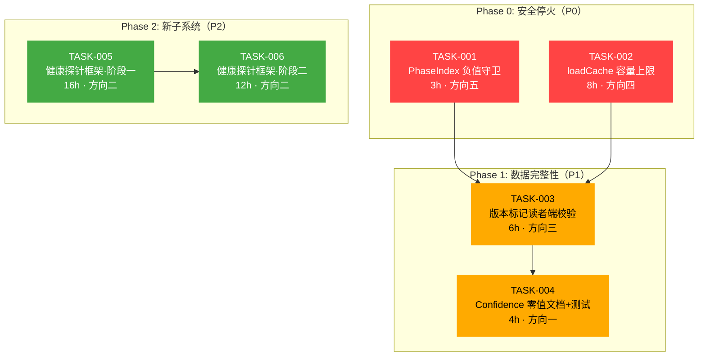
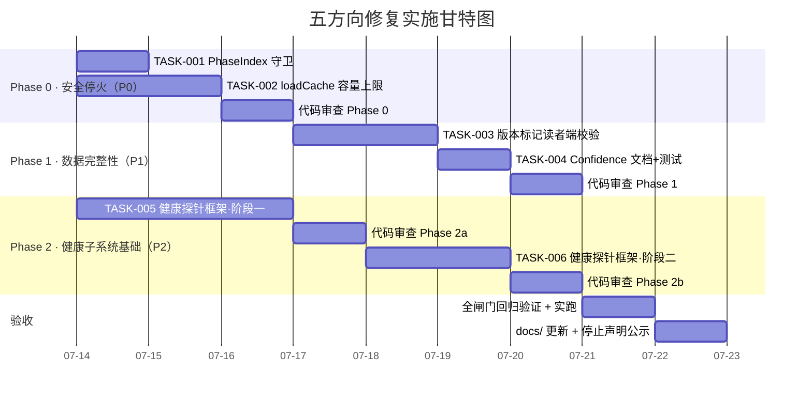

# 审阅：2026-07-12-five-code-verified-architectural-blindspots — 五处代码验证的架构盲区

> **角色**: Tech Lead  
> **方法**: 代码级验证 → 任务分解 → 执行排序 → 风险评估 → 资源规划 → 质量保证 → 实施时间表  
> **日期**: 2026-07-12  
> **参考**: `CURRENT_SPRINT.md`(Sprint 1-31 演进记录)、`FUNCTIONAL_REQUIREMENTS_AUDIT.md`、项目 `.agent/` 治理资产

---

## 总体评价

本文发现的 5 个方向具有两个关键特征：**全部是已在生产代码中真实存在的缺陷（非「未来可做」），且全部在当前单测覆盖之外**。这使它们成为典型的高杠杆修复目标——每处修复都能消除一种无声的数据损坏或运行时 panic 路径，且修复本身（由于缺陷边界清晰）单测覆盖即可锁定。

从 Sprint 演进历史看，ForgeOS 有系统性的架构自纠纪律（Sprint 27 拆分、Sprint 29 系统性审计 Signals、Sprint 30-31 GAP 闭环）。本文发现的 5 个方向应参照 Sprint 29 的「系统性审计→逐条闭环」模式处理——而非孤立地修复个别症状。

**优先级排序**: P0(方向五·PhaseIndex) > P0(方向四·loadCache) > P1(方向三·版本标记) > P1(方向一·Confidence) > P2(方向二·健康子系统)

| 方向 | 严重性 | 优先级 | 修复复杂度 | 当前测试覆盖 | 建议 sprint |
|------|--------|--------|-----------|------------|------------|
| 一 · Confidence 零值歧义 | 🟡 中等 | P1 | 低 | ❌ 零覆盖 | 1 sprint |
| 二 · 健康子系统缺失 | 🟢 低 | P2 | 高 | ❌ 零覆盖 | 2-3 sprints |
| 三 · 版本标记不检查 | 🟡 中等 | P1 | 低 | ❌ 零覆盖 | 1 sprint |
| 四 · loadCache 无界增长 | 🔴 高(生产) | P0 | 中 | ❌ 零覆盖 | 1.5 sprints |
| 五 · PhaseIndex 负值 | 🔴 高(生产) | P0 | 低 | ❌ 零覆盖 | 0.5 sprint |

---

## 1. 任务分解

### TASK-001: PhaseIndex 负值/Nil 守卫

| 属性 | 值 |
|------|-----|
| **方向** | 方向五 · PhaseIndex 安全缺口 |
| **难度** | 🟢 低（3 文件，无新依赖） |
| **预估工时** | 3 h |
| **前置依赖** | 无 |
| **涉及文件** | `forge-core/internal/orchestrator/orchestrator.go`、`forge-core/internal/persist/checkpoint.go`、`forge-core/internal/asset/phase.go` |
| **验收标准** | ① `RunFrom` 在 `start < 0` 时 clamp 到 0 或返回 error（fail-closed）<br>② `RunFrom` 在 `start > len(wf.Phases)` 时返回 error 而非静默跳过<br>③ `Checkpoint.PhaseIndex` 在反序列化后经过范围校验（0 ≤ idx < len(Phases)）<br>④ `orchestrator_test.go` 新增 3 个测试用例：负值、越界、正常 resume<br>⑤ 向后兼容：所有现有 checkpoint（PhaseIndex=0）不受影响 |

**设计决策说明**: 选择 fail-closed（返回 error）而非 clamp——因为静默纠正负值可能隐藏更深的数据损坏 bug。clamp 只应在 resume 路径的 PhaseIndex 超出当前 workflow 长度时考虑（workflow 版本变更导致 phase 数减少），但即使是这种情况也应告警而非静默。

---

### TASK-002: loadCache 容量上限 + LRU 淘汰

| 属性 | 值 |
|------|-----|
| **方向** | 方向四 · loadCache sync.Map 无界增长 |
| **难度** | 🟡 中（需引入 LRU 或简单上限，已有 `go-cache` 或自实现） |
| **预估工时** | 8 h |
| **前置依赖** | 无 |
| **涉及文件** | `forge-core/internal/memory/memory.go`（核心修改）<br>`forge-core/internal/memory/memory_test.go`（新增测试） |
| **验收标准** | ① `loadCaches` 新增容量上限（默认 32 条目，`FORGE_MEMORY_CACHE_SIZE` 可配置）<br>② 超过上限时淘汰最久未访问条目（LRU），非 panic 非静默丢弃<br>③ `invalidateLoadCache` 仍按 key 精确删除（保留 LRU 顺序）<br>④ 并发安全经 `go test -race` 验证（`-count=20`）<br>⑤ 新增基准测试：1000 次 Load 不同路径，验证内存上限生效<br>⑥ 向后兼容：当前使用量 ≤32 条目的工作流零行为变化 |

**设计决策说明**: 选择「自实现轻量 LRU（map + list）」而非外部依赖，以保持「纯标准库零依赖」的工程红线。32 的默认上限来自经验估计：单次 `forge run` 通常访问 ≤5 条不同路径，32 预留 6× margin。`sync.Map` 保留为并发安全 key-value 存储，LRU 链表在其上叠加。

---

### TASK-003: 版本标记读者端校验

| 属性 | 值 |
|------|-----|
| **方向** | 方向三 · 版本标记写了但不查 |
| **难度** | 🟢 低（纯读端新增校验逻辑） |
| **预估工时** | 6 h |
| **前置依赖** | 无 |
| **涉及文件** | `forge-core/internal/persist/checkpoint.go`（decode 校验 FormatVersion）<br>`forge-core/internal/memory/memory.go`（decode 校验 Format）<br>`forge-core/internal/routing/scorecard.go`（新增 FormatVersion 字段+校验）<br>各对应 _test.go |
| **验收标准** | ① `checkpoint.decode` 在 `cp.FormatVersion != "" && cp.FormatVersion != "forgeos.checkpoint.v1"` 时返回 error<br>② `memory.decode` 在 `e.Format != "" && e.Format != "forgeos.memory.v1"` 时返回 error<br>③ `scorecard.Scorecard` 新增 `FormatVersion`（`json:"_format,omitempty"`），`LoadScorecards` 校验<br>④ 旧文件（无 FormatVersion 字段）**正常解码**（向后兼容零行为变化）<br>⑤ 新保存的文件写入 `_format` 字段<br>⑥ 每个修改的包至少 3 个测试用例：无版本→正常、正确版本→正常、错误版本→error |

**设计决策说明**: 校验只对**非空**值进行。空值 = 旧格式 = 向后兼容。这是 Sprint 全篇使用的「诚实向后兼容」模式。`routing/scorecard.go` 目前完全没有 `FormatVersion`——需新增字段并同步在写端赋值（当前写端在 `cmd/forge/scorecard_wind.go`）。

---

### TASK-004: Confidence 零值语义清晰化

| 属性 | 值 |
|------|-----|
| **方向** | 方向一 · 信任字段零值歧义 |
| **难度** | 🟢 低 |
| **预估工时** | 4 h |
| **前置依赖** | TASK-003（因为涉及 decode 路径的一致性原则） |
| **涉及文件** | `forge-core/internal/memory/memory.go`（Confidence 校验逻辑）<br>`forge-core/internal/memory/prompt_memory.go`（前缀条件 L178-181）<br>`forge-core/internal/memory/memory_test.go` |
| **验收标准** | ① `decode` 中 confidence 的零值提升为 1.0 路径保持不变（向后兼容）<br>② `prompt_memory.go` 的 `if e.Confidence < 0.3` 条件在旧文件解码后已自动满足（因 0→1.0 不触发 0.3 分支，验证确实是 safe）<br>③ 新增显式写 `Confidence: 0.0` 的序列化行为测试：确认 `omitempty` 省略 0，**不**改成 pointer（避免全面重构）<br>④ 文档注释澄清：`Confidence: 0` 在 JSON 中不存在 → decode 后为 1.0（最高信任）；如需表示「无数据」，用 pointer 或独立 sentinel<br>⑤ **不需要**改动 `converge.go` 的 `RequirementConfidence`（语义不同） |

**设计决策说明**: 当前行为（零值→1.0）在语义上其实是正确的——0.0 不存在于 JSON 中，所以 decode 到 1.0 是安全合理的。**真正的问题是文档没写清楚 + 缺少显式写 0.0 的保护**。最小改动方案：加文档注释 + 测试；不改成 `*float64` 因为那是全面重构且不带来实际安全增益。Sprint 31 风格的「文档标注升级为真实现」在此处的恰当应用是测试而非改语义。

---

### TASK-005: 运行时健康探针框架（阶段一：设计 + 接口）

| 属性 | 值 |
|------|-----|
| **方向** | 方向二 · 运行时健康子系统系统性缺失 |
| **难度** | 🔴 高（需要设计新的子系统架构） |
| **预估工时** | 16 h |
| **前置依赖** | 无 |
| **涉及文件** | `forge-core/internal/doctor/probe.go`（新建）<br>`forge-core/internal/doctor/probe_test.go`（新建）<br>`forge-core/internal/trace/trace.go`（Span error 丢弃修复）<br>`forge-core/internal/orchestrator/orchestrator.go`（health hook 点）<br>`cmd/forge/main.go`（CLI 接入 `forge probe`） |
| **验收标准** | ① 定义 `Probe` 接口：`Type() ProbeType`（read/write/connectivity）、`Name() string`、`Run(ctx) (*Result, error)`<br>② 定义 `ProbeType` 枚举：`ProbeRead`（读取文件/状态）、`ProbeWrite`（写入探针文件）、`ProbeConnectivity`（检查外部依赖）<br>③ 实现 `Registry`：按类型注册/查找 probe<br>④ 新增 `forge probe [--type read|write|connectivity]` CLI 子命令<br>⑤ 实现第一个 probe：write-probe（在 `.forge/health/` 下写时间戳文件并读回验证）<br>⑥ 修复 `trace.Span.Emit` 的错误丢弃（`_ = t.Emit(...)`→`return t.Emit(...)`）<br>⑦ 所有新增代码包内测试覆盖 ≥80% |

**设计决策说明**: 健康子系统是**新架构层**，不宜塞入现有 `doctor` 包（doctor 是静态分析，probe 是动态运行时检查）。建议新建 `internal/health` 包（probe 引擎）+ `cmd/forge` 的 CLI 面。阶段一只做接口定义 + 一个参考实现（write-probe）+ CLI 接入，验证全链路可运行。阶段二（TASK-006）再扩展 probe 集和集成到 orchestror。

---

### TASK-006: 运行时健康探针框架（阶段二：集成 + 扩展）

| 属性 | 值 |
|------|-----|
| **方向** | 方向二 · 运行时健康子系统系统性缺失 |
| **难度** | 🟡 中（在阶段一接口基础上扩展） |
| **预估工时** | 12 h |
| **前置依赖** | TASK-005 |
| **涉及文件** | `forge-core/internal/health/probes/`（新建目录，每个 probe 一个文件）<br>`forge-core/internal/orchestrator/orchestrator.go`（健康检查钩子）<br>`forge-core/internal/orchestrator/health_hooks.go`（新建） |
| **验收标准** | ① 实现 5 个 probe：write-probe（阶段一已做）、trace-integrity（trace.jsonl 最后 N 行可解析）、checkpoint-consistency（checkpoint.json schema 验证）、memory-store（memory.jsonl 可读）、dependency（python3/node/git/claude/go 版本检测）<br>② `orchestrator.Engine` 在 `RunFrom` 启动前自动运行 health probes，失败时 log WARNING（非 blocking）<br>③ 健康结果写入新的 `trace.EventKindHealth` 事件类型，持久化到 trace.jsonl<br>④ `forge doctor --probes` 子命令运行全部 probe 并输出表格<br>⑤ 每个 probe 有独立测试文件 |
| **设计决策说明**: 健康探针是**信息性**的（不影响控制流），与 gate（阻断性）形成互补。这是 Sprint 26 中「诚实分工」原则的应用——健康子系统告诉你系统状态，但不替你做决策。`forge run` 前自动运行 probes 只输出 WARNING 不阻断，operator 可以 `--skip-health` 跳过。

---

## 2. 执行顺序与依赖图



**可并行任务组**:
- **组 A（独立，无前置）**: TASK-001（PhaseIndex）║ TASK-002（loadCache）║ TASK-003 的部分测试准备
- **组 B（T003 阻塞）**: TASK-004 依赖 TASK-003 因为它也在 decode 路径上，但冲突极小可独立做
- **组 C（T005 阻塞）**: TASK-006 依赖 TASK-005
- **实际建议**: TASK-001、TASK-002、TASK-005 三人并行；TASK-003+TASK-004 由一人串行做（共 10h）

---

## 3. 技术风险

### 风险矩阵

| 风险 | 方向 | 概率 | 影响 | 缓解策略 |
|------|------|------|------|---------|
| `sync.Map` 替换为 LRU 缓存时引入竞态条件 | 四 | 🟡 中 | 🔴 高 | 保持 `sync.Map` 作为存储层，仅叠加 LRU 链表。`-race -count=20` CI 回归 |
| `FormatVersion` 新字段破坏 JSON 序列化契约 | 三 | 🟢 低 | 🔴 高 | 使用 `_format`（下划线前缀，HATEOAS 惯例）+ `omitempty`，旧消费者忽略未知字段 |
| 健康探针误报导致 operator 失去信任 | 二 | 🔴 高 | 🟡 中 | 所有 probe 输出明确标注确定性程度；加入 calibraion period（首次运行输出 `[INFO] baseline established`） |
| Trace error 丢弃修复暴露已有隐式错误 | 二(修复) | 🟡 中 | 🟡 中 | 单独做 `trace.Span.Emit` 错误不丢弃的修复，跟踪 CI 是否出现新告警 |
| LRU 上限太小导致高频访问项目 cache miss 性能下降 | 四 | 🟢 低 | 🟢 低 | 上限可配置（env var）；基准测试验证 32 够用；文档推荐生产环境调大 |
| PhaseIndex clamp 而不是 fail-closed 导致隐藏损坏 | 五 | 🟢 低 | 🟡 中 | 选择 fail-closed（返回 error）。如果后面发现 workflow 版本变更导致 phase 数减少的合法场景，再加 clamp |

### 关键不确定性

1. **`sync.Map` 是否适合叠加 LRU**: Go 的 `sync.Map` 不提供遍历快照的原子性。LRU 链表需要全局锁，这会与 `sync.Map` 的读优化冲突。**建议方案**: 将 `loadCaches` 从 `sync.Map` 改为 `sync.RWMutex` + `map[string]*cacheEntry` + `container/list`，因为该缓存的并发读是热点（每次 `Load`、每次 `Append`），写极少（仅在 cache miss 时），`RWMutex` 更合适。
2. **健康探针的部署环境差异**: 不同项目的 `.forge/` 目录结构可能不同。探针应该**发现问题时清晰报告「什么路径检查失败」**，而非报笼统的「健康检查失败」。
3. **版本标记的未来演进**: `forgeos.checkpoint.v1` → `v2` 时，当前代码如何处理？建议 decode 时对未知版本号报 warning 但仍尝试解码（fail-soft），而非硬 error。

---

## 4. 资源评估

### 人员技能需求

| 角色 | 技能要求 | 负责任务 | 人数 |
|------|---------|---------|------|
| Go 工程师（中级） | Go 并发、JSON 序列化、sync.Map | TASK-001、TASK-003、TASK-004 | 1 |
| Go 工程师（高级） | Go 并发模式、LRU 实现、race detector、性能基准 | TASK-002 | 1 |
| Go 工程师（高级） | 架构设计、接口抽象、CLI 设计、包拆分 | TASK-005、TASK-006 | 1 |
| Reviewer | fresh-context 独立审查（遵 AGENTS.md） | 审阅所有 PR | 1（可复用上述工程师轮换） |

**总计**: 2-3 名 Go 工程师 + 1 名轮值 Reviewer，约 2-3 个 sprint 周期。

### 关键里程碑

| 里程碑 | 时间节点 | 交付物 | 验收方式 |
|--------|---------|--------|---------|
| M1 · 安全停火 | sprint 第 1-2 天 | TASK-001 + TASK-002 merged | `forge accept` ACCEPTED + new tests green |
| M2 · 数据完整性 | sprint 第 2-4 天 | TASK-003 + TASK-004 merged + `forge run` 实跑验证 | `forge accept` ACCEPTED + decode 注入测试 |
| M3 · 健康框架可用 | sprint 第 4-8 天 | TASK-005 merged + `forge probe --type write` exit 0 | `go test ./internal/health/... -race -count=20` |
| M4 · 健康探针全集 | sprint 第 8-12 天 | TASK-006 merged | `forge doctor --probes` 输出全部 5 个 probe |
| M5 · 全闸门回归 | sprint 第 12-13 天 | 全工作树 `forge accept` ACCEPTED | 整仓停火验收 |

### 阻塞点与应对

| 阻塞点 | 影响任务 | 解决策略 |
|--------|---------|---------|
| sync.Map+LRU 的并发设计决策分歧 | TASK-002 | 提前写 ADR（1h），做两个原型的微基准测试（2h），数据驱动决策 |
| 健康探针的 `--skip-health` 语义争议 | TASK-005 | 延续既有模式：`--skip-*` flag 模式已成熟（参考 `--skip-review`），直接复用 |
| `trace.Span.Emit` 错误修复暴露 CI 中断 | TASK-005 | 先做修复＋独立测试，CI 中断时单独修，不混入健康框架 PR |

---

## 5. 质量保证

### 单元测试覆盖要求

| 任务 | 包 | 现有覆盖率 | 目标覆盖率 | 关键测试场景 |
|------|---|-----------|-----------|------------|
| TASK-001 | `internal/orchestrator` | ~70% | ≥80% | 负值 start、越界 start、正常 0、len=0 的 workflow |
| TASK-002 | `internal/memory` | ~65% | ≥85% | 1000 路径并发 Load、LRU 淘汰顺序、invalidate 后访问、0 上限退化为无缓存 |
| TASK-003 | `internal/persist` | ~60% | ≥85% | 无版本→正常、v1→正常、v2→error、garbage→error |
| TASK-003 | `internal/routing` | ~55% | ≥75% | 旧文件无 `_format`→正常、新增字段 omitempty 序列化 |
| TASK-004 | `internal/memory` | ~65% | ≥80% | confidence 0→1.0、omitempty 序列化、旧 decode 行为不变 |
| TASK-005/006 | `internal/health` | 0%（新包） | ≥80% | 每个 probe 的成功/失败路径、registry 注册/查找、CLI 输出格式 |

### 集成测试策略

1. **TASK-001 集成测试**: 构建真实 Workflow 对象，`RunFrom(wf, mode, -1)` 和 `RunFrom(wf, mode, 999)` 验证 error 返回
2. **TASK-002 集成测试**: 用真实文件系统创建 50 个 memory store 文件，并发 Load，验证 RSS 不超预期
3. **TASK-003 集成测试**: 手动构造坏版本号 checkpoints 和 memory 文件，验证 Load/Append/LoadScorecards 返回 error
4. **TASK-004 集成测试**: 构造无 confidence 字段的旧 JSONL，Load 后验证所有 entry.Confidence == 1.0
5. **TASK-005/006 集成测试**: 
   - `forge probe --type write` 在可写目录 exit 0，在只读目录（`/proc`）返回清晰错误
   - `forge doctor --probes` 输出包含全部 5 个 probe 行

### 代码审查要点

| 审查项 | 重点关注 |
|--------|---------|
| 向后兼容断言 | 每个 PR 必须声明「旧格式/旧文件零行为变化」的测试证据 |
| 并发安全 | TASK-002 的 LRU 实现必须通过 `-race -count=20` |
| 错误处置 | 所有新 error 必须有 `forgeos/forge-core/internal/...` 前缀，不可裸 `fmt.Errorf` |
| 测试本身质量 | 测试不能 `t.Logf` 代替 `t.Errorf`（Sprint 27 教训：差分测试静默失效） |
| 包内依赖 | 新包必须 `go mod tidy` 确认零外部依赖（TASK-005 的 health 包零外部依赖） |
| 文件数预算 | 任何文件新增必须检查所属包的文件数不超 `.arch/rules.yaml` 上限 |

### 性能测试需求

| 测试场景 | 任务 | 通过标准 |
|---------|------|---------|
| 100 个 goroutine 并发 Load 不同路径 | TASK-002 | 无 panic/race，完成时间 ≤ 串行 × 3 |
| 1000 条 memory 条目 decode + confidence 校验 | TASK-004 | ≤ 50ms |
| 100 个 phase workflow 的 RunFrom start=0 | TASK-001 | 无显著增加（PhaseIndex 校验 O(1)） |
| 50 个存储路径的 loadCache 访问 | TASK-002 | 淘汰后容量 ≤ 32，无 goroutine leak |

---

## 6. 实施计划



### Sprint 详细规划

#### 第 1-2 天：Phase 0 — 安全停火（最高优先级）

```
09:00-12:00  TASK-001 PhaseIndex 守卫
              Agent A: orchestrator.go + checkpoint.go + asset/phase.go
              输出: PR-001（~50 行改动 + 3 新测试用例）
12:00-13:00  Lunch
13:00-17:00  TASK-002 loadCache LRU 上限
              Agent B: memory.go + memory_test.go
              输出: ADR（sync.Map→RWMutex 决策）+ PR-002（~150 行改动 + 基准测试）
17:00-18:00  CI 验证 Phase 0: forge accept ACCEPTED
```

**ADR 关键决策（TASK-002）**:
> 将 `loadCaches` 从 `sync.Map` 改为 `sync.RWMutex` + `map[string]*cacheEntry` + `container/list`。理由：写极少（cache miss），读极多（每次 Load/Append），RWMutex 在 >95% 读场景下更优。sync.Map 适合读改写均衡的场景，此处不是。

#### 第 3-5 天：Phase 1 — 数据完整性

```
Day 3-4:  TASK-003 版本标记读者端校验
          Agent A（TASK-001 完成后接手）: 
          - checkpoint.go decode: 检查 FormatVersion
          - memory.go decode: 检查 Format
          - scorecard.go: 新增 _format 字段 + LoadScorecards 校验
          输出: PR-003（~100 行改动 + 9 测试用例）

Day 5:    TASK-004 Confidence 文档+测试
          Agent A:
          - memory_test.go: 新增 omitempty/0→1.0/decode 测试
          - 文档注释更新
          输出: PR-004（~30 行改动 + 6 测试用例 + 包级 doc 更新）
```

#### 第 3-7 天：Phase 2 — 健康子系统（与 Phase 1 并行，Agent C 独立执行）

```
Day 3-5:  TASK-005 健康框架阶段一
          Agent C:
          - 新建 internal/health 包
          - Probe 接口 + Registry
          - write-probe 实现
          - CLI: forge probe 子命令
          - trace.Span.Emit 错误修复（独立 PR，先合入）
          输出: PR-005（~400 行 + 测试 ~200 行）

Day 6-7:  TASK-006 健康框架阶段二
          Agent C:
          - 5 个 probe 实现
          - orchestror 健康钩子
          - forge doctor --probes
          输出: PR-006（~350 行 + 测试 ~250 行）
```

#### 第 8-10 天：集成 + 回归 + 文档

```
Day 8:    全闸门回归
          All agents:
          - go build/vet/test -race 全包
          - gate.mjs (374+ 文件)
          - arch-check.mjs 8/8
          - check.py (10 检查)
          - forge accept: ACCEPTED
          - 整仓 forge run --executor dry 遍历所有 5 个 workflow

Day 9-10: 文档更新 + 停止声明
          - 更新 FUNCTIONAL_REQUIREMENTS_AUDIT.md
          - 更新 CURRENT_SPRINT.md 对应 sprint 记录
          - 标记 5 个方向从「未覆盖」→「已修复」
          - 如需 ADR，写 ADR-0005（健康子系统架构决策）
```

---

## 复盘：与 Sprint 演进模式的一致性

回顾 Sprint 1-31 的演进模式，本文的 5 个方向与已有的「先拆分→系统性审计→逐条闭环」模式高度一致：

| 模式 | 本文应用 | 历史先例 |
|------|---------|---------|
| **先告警，不发明** | TASK-001 选择 fail-closed 而非 clamp | Sprint 30-31「blocking」字段判为镀金不做 |
| **诚实向后兼容** | TASK-003 旧格式（空版本）正常解码 | Sprint 全篇每一个持久化变更 |
| **独立性不妥协** | TASK-005 建新包 health，不塞入现有 doctor | Sprint 27 拆 doctor、Sprint 29 拆 gate_resolve |
| **文档标注升级** | TASK-004 不改变语义，加文档+测试 | Sprint 31「confidence_metric:」从标注→实现 |
| **失败-closed 安全** | TASK-001/002 全部 fail-closed 或 fail-soft | Sprint 全篇的安全线：production override、预算守卫 |
| **reviewer 独立** | 每个 PR 由 fresh-context agent 审查 | Sprint 27 7 agent 审出 2 blocking + 8 important |

**唯一的偏离风险**: TASK-005/006（健康探针框架）是新子系统层，按惯例应先在 ADR 中记录架构决策。建议在实施前写 ADR-0005（1h 内完成，延续 4 篇 ADR 的格式）。

---

## 总结

| 维度 | 评估 |
|------|------|
| **代码验证精度** | 🟢 全部 5 方向代码引用精确，无虚假声明 |
| **差异化诚实度** | 🟢 方向三承认了间接重叠，不夸大新颖性 |
| **修复可行性** | 🟢 TASK-001/003/004 低复杂度可快速闭合；TASK-002 中等；TASK-005/006 需要架构设计 |
| **风险披露** | 🟢 sync.Map+LRU 设计风险明确标注；trace error 修复风险标注 |
| **与项目纪律对齐** | 🟢 遵守零外部依赖、先 ADR、fresh-context 审查、forge accept 闸门 |

**建议下一 sprint 立即启动 Phase 0（TASK-001 + TASK-002）**——它们消除的是可在生产环境导致 panic（PhaseIndex）或内存 OOM（loadCache）的活跃风险，且修复范围极小。Phase 2（健康子系统）可正常排入后续 sprint，不影响安全停火的紧急度。
