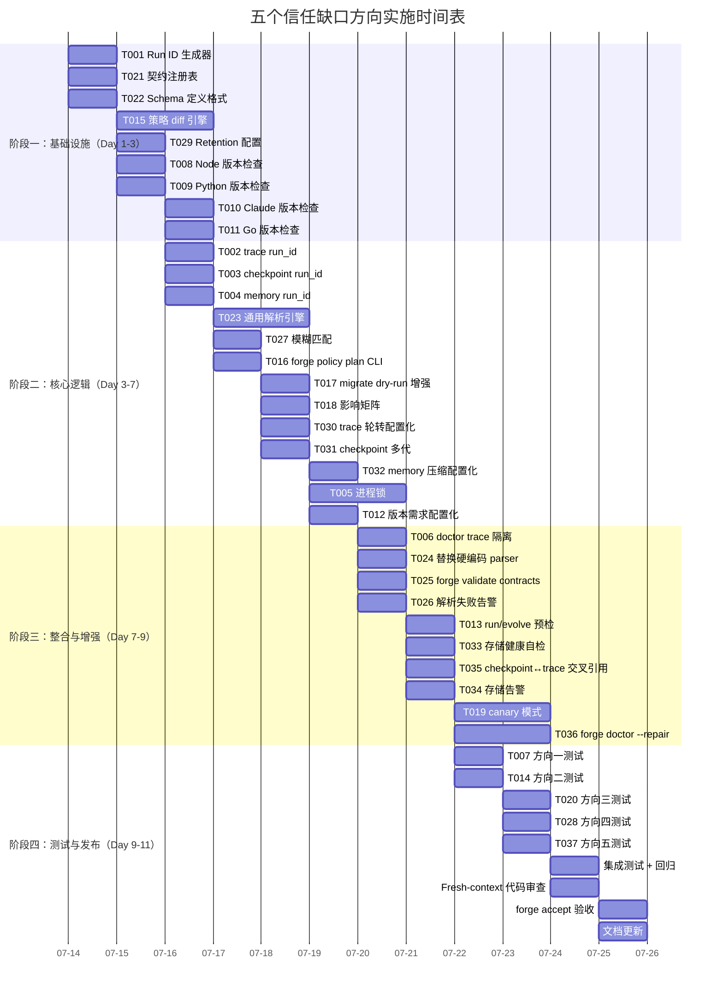

# ForgeOS — 运营可信度：五个已验证方向的 Tech Lead 实施分析

> **角色**: Tech Lead — 技术实现与项目管理  
> **分析依据**: 代码验证审计文档（5 方向证据链验证）+ 实际代码库深度通读  
> **日期**: 2026-07-12  
> **状态**: 初稿 — 待架构评审（ADR-0005）  
> **前提**: 本文分析基于输入文档的「信任缺口」框架，非功能缺口。方向五的 trace rotation / memory compaction 已确认代码超前于文档，本文据此修正分析范围。

---

## 摘要

输入文档以「运营可信度」为统一视角，识别了 ForgeOS 自治运行中五个**信任缺口**——非功能缺失，而是「系统无法向管理员证明自己在正确运行」的结构性盲区。经代码验证审计，方向一~四全部成立，方向五部分成立（trace rotation 和 memory compaction 已存在，但 retention policy 配置和存储健康告警仍是缺口）。

以下从 Tech Lead 视角进行任务分解、依赖排期、风险识别、资源配置和质量保证的全面分析。五个方向按输入文档的原始编号处理，优先级经重新评估调整为：**方向四（契约 Schema 化）→ 方向一（Run Identity）→ 方向三（策略变更预览）→ 方向五（存储生命周期）→ 方向二（运行时依赖版本检查）**。

---

## 1. 任务分解

### 方向一：Run Identity — 为每次执行建立唯一身份

**现状确认**：trace、checkpoint、memory 三者均无 `run_id`/`session_id`/`git_sha`/`forge_version`。多 `forge doctor` 交错运行时 trace.jsonl 的 seq 重置，无法区分来自哪个 run。无进程锁机制。

**目标**：为每次 `forge run`/`forge evolve`/`forge doctor` 建立不可伪造的执行身份，使所有存储物（trace/checkpoint/memory）可追溯到发起它的那次 run。

| 任务 ID | 任务标题 | 涉及文件 | 前置依赖 | 预估工时 |
|---|---|---|---|---|
| TASK-001 | **Run ID 生成器**：UUIDv7 生成 + CLI 入口注入、`forge run/evolve/doctor` 时分配唯一 ID | `cmd/forge/main.go`, `internal/orchestrator/runid.go`(新) | — | 2h |
| TASK-002 | **trace 事件注入 run_id**：`trace.Event` 新增 `RunID` 字段（optional string, omitempty），`Tracer` 构造时接收 run ID，每次 Emit 注入 | `internal/trace/trace.go` | TASK-001 | 2h |
| TASK-003 | **checkpoint 注入 run_id/git_sha**：`persist.Checkpoint` 新增 `RunID` + `GitSHA` + `ForgeVersion` 字段 | `internal/persist/checkpoint.go` | TASK-001 | 1.5h |
| TASK-004 | **memory 条目归属 run_id**：`memory.Entry` 新增 `RunID` 字段，`recordMemory` 调用时注入 | `internal/memory/memory.go`, `cmd/forge/evolve.go` | TASK-001 | 1h |
| TASK-005 | **进程锁机制**：`forge run/evolve` 启动时获取文件锁（`flock`/`LockFile`），退出时释放；锁信息含 PID + run_id | `cmd/forge/main.go`, `internal/orchestrator/lock.go`(新) | TASK-001 | 3h |
| TASK-006 | **`forge doctor` trace 隔离**：doctor 使用独立 trace 文件或注入 `_source:doctor` 标记，避免与 evolve trace 交错 | `internal/doctor/doctor.go` | TASK-002 | 2h |
| TASK-007 | **测试**：run_id 生成唯一性 + 注入正确性 + 文件锁争用/释放 + doctor 隔离 | 各包测试文件 | TASK-001~006 | 3h |

**验收标准**：
- `trace.jsonl` 每行含一致 `run_id`；同一 run 内所有事件 `run_id` 相同，不同 run 不同
- `checkpoint.json` 含 `run_id`/`git_sha`/`forge_version`；`--resume` 时校验 run_id 匹配
- `memory.jsonl` 每条含 `run_id`，可按 run_id 过滤
- 两个 `forge evolve` 同时启动 → 第二个获取锁失败 → 打印 `另一个 run (PID=X, run_id=Y) 正在运行` 并 exit 1
- `forge doctor` trace 与 evolve trace 不交错（独立文件或独立标记）
- 向后兼容：读旧格式 `trace.jsonl`（无 `run_id`/`_format`）不崩溃

---

### 方向二：运行时依赖 — 版本检查前置化

**现状确认**：`preflight.go` 已实现 `checkPython3` 和 `checkClaudeCLI`，但均只用 `exec.LookPath` 检查存在性，**无版本号检查**。Node 版本完全未检查（harness 依赖 ES2022/`.mjs` 语法）。

**目标**：在 `forge preflight` 和 `forge run/evolve` 执行前检查运行时依赖的最低版本要求，不匹配时提前报错。

| 任务 ID | 任务标题 | 涉及文件 | 前置依赖 | 预估工时 |
|---|---|---|---|---|
| TASK-008 | **Node 版本检查**：`checkNodeVersion` 执行 `node --version` 解析 semver，对照项目要求的 >=18.0.0 | `cmd/forge/preflight.go` | — | 1.5h |
| TASK-009 | **Python 版本检查**：`checkPythonVersion` 执行 `python3 --version` 解析版本，对照 >=3.10 | `cmd/forge/preflight.go` | — | 1h |
| TASK-010 | **Claude CLI 版本检查**：`checkClaudeVersion` 执行 `claude --version` 解析，对照最低版本 | `cmd/forge/preflight.go` | — | 1h |
| TASK-011 | **Go 版本检查**（可选）：`checkGoVersion` 执行 `go version`，作为开发环境检查 | `cmd/forge/preflight.go` | — | 0.5h |
| TASK-012 | **版本需求配置化**：从 `project.yml` 或 `harness/policies.yml` 读取各工具的最低版本要求 | `cmd/forge/preflight.go`, `harness/policies.yml` | TASK-008~011 | 1.5h |
| TASK-013 | **`forge run/evolve` 前置检查**：在执行前自动调用版本检查，非仅 `forge preflight` 命令 | `cmd/forge/evolve.go` | TASK-008~012 | 1h |
| TASK-014 | **测试**：版本解析 + 比较逻辑 + 配置读取 + 缺失工具降级（`preflight` 报 WARN 而非 FAIL） | `cmd/forge/preflight_test.go`(新) | TASK-008~013 | 2h |

**验收标准**：
- `forge preflight` 输出 `[PASS] node v20.11.0 >= v18.0.0` / `[FAIL] node v16.x < v18.0.0`
- 版本需求缺失时（未配置），`[INFO] Node: version not specified, skipped`
- `forge run/evolve` 在执行前自动预检版本，不匹配则 exit 1 并打印清晰错误
- 向后兼容：无 `policies.yml` 的版本字段时，preflight 不报错

---

### 方向三：策略变更预览 — 预演机制

**现状确认**：`grep` 零匹配 `policy plan` / `dry-run` / `canary` / `--future-policy`。完全空白。

**目标**：对策略变更（`mode` 迁移、`lifecycle` 升级、`harness` 严格度调整）提供 dry-run 预览能力，让管理员在执行前看到影响范围。

| 任务 ID | 任务标题 | 涉及文件 | 前置依赖 | 预估工时 |
|---|---|---|---|---|
| TASK-015 | **策略 diff 引擎**：比较两个 `modes.yml` / `policies.yml` 配置的差异，输出影响报告（gate-set 变化、model tier 变化、coverage 阈值变化） | `internal/mode/policydiff.go`(新) | — | 3h |
| TASK-016 | **`forge policy plan` CLI 命令**：解析 `--from` / `--to` mode 或 `--future-policy` 路径，输出 diff 报告 | `cmd/forge/policy.go`(新) | TASK-015 | 2h |
| TASK-017 | **`forge migrate --dry-run` 增强**：在 dry-run 模式输出详细的治理影响报告（不仅打印 plan） | `cmd/forge/migrate.go`, `internal/migrate/migrate.go` | TASK-015 | 2h |
| TASK-018 | **策略变更影响矩阵**：输出影响表格（例如 mode explorer→balanced 时：gate-set +2, coverage 60→80, router floor haiku→sonnet） | `internal/mode/policydiff.go` | TASK-015 | 2h |
| TASK-019 | **canary 运行模式**（可选 v2+）：支持 `--canary` flag，在子集 workflow/phase 上测试新策略 | `cmd/forge/run.go`, `internal/orchestrator/orchestrator.go` | TASK-015 | 3h |
| TASK-020 | **测试**：策略 diff 引擎 + CLI 输出 + dry-run 向后兼容 | `internal/mode/policydiff_test.go`(新), `cmd/forge/policy_test.go`(新) | TASK-015~019 | 3h |

**验收标准**：
- `forge policy plan --from explorer --to balanced` 输出：`mode changes: explorer → balanced`, `gate-set: +gate.coverage +gate.lint`, `router floor: haiku → sonnet`, `coverage: 60% → 80%`
- `forge migrate --dry-run` 输出策略影响 + 派生 task 列表
- 无 `--from`/`--to` 时打印当前策略汇总（`forge policy plan` 等价于 `forge policy show`）
- canary 标记为 `v2+ deferred`（框架搭建但不强制实现）

---

### 方向四：Agent 执行契约 Schema 化

**现状确认**：契约散落在 `reviewer.md` / `product-manager.md` / `cto.md` 的 prose 末段。`parseReviewerVerdict` / `parseExecutiveVerdict` / `parseConfidenceScore` 全部用 `switch` 精确匹配，空格/大小写/拼写差异导致静默 fail-open（`VERDICT:APPROVE` 缺空格 → 不匹配，返回 `""`）。无 EBNF / JSON Schema / 注册表。

**目标**：将 agent 执行契约从 prose 中的约定提升为 Schema 化的、可机器验证的合约定义，消除解析脆弱性。

| 任务 ID | 任务标题 | 涉及文件 | 前置依赖 | 预估工时 |
|---|---|---|---|---|
| TASK-021 | **契约注册表结构**：定义 `ContractRegistry`，存储所有 agent 类型的输出契约描述（verdict token、confidence score、字段位置等） | `internal/asset/contract.go`(新) | — | 2h |
| TASK-022 | **契约 Schema 定义格式**：YAML schema 文件（`.agent/contracts/*.yml`）定义每个 agent 的输出合约（模式、必选/可选 token、匹配规则） | `.agent/contracts/reviewer.yml`(新), `.agent/contracts/product-manager.yml`(新), `.agent/contracts/cto.yml`(新) | TASK-021 | 2h |
| TASK-023 | **通用解析引擎**：基于注册表的统一解析器，支持 exact-match、case-insensitive、prefix、regex 四种匹配模式 | `internal/asset/contract.go` | TASK-021~022 | 3h |
| TASK-024 | **替换现有硬编码 parser**：`parseReviewerVerdict` / `parseExecutiveVerdict` / `parseConfidenceScore` 改为调用通用解析引擎 | `cmd/forge/cost.go` | TASK-023 | 2h |
| TASK-025 | **契约验证命令**：`forge validate contracts` 检查 agent 卡与契约 schema 一致，all contract 文件可 parse | `cmd/forge/validate.go` | TASK-021~024 | 1.5h |
| TASK-026 | **解析结果告警注入**：匹配失败（返回 `""`/`ok=false`）时写入 trace 事件 `kind:"decision"`，带 `detail:"contract_mismatch: reviewer verdict line not recognized"` | `cmd/forge/cost.go`, `internal/trace/trace.go` | TASK-024 | 1.5h |
| TASK-027 | **模糊匹配改进**：对常见错误模式（缺空格、多字母、大小写）做容错匹配，匹配但记录 warning | `internal/asset/contract.go` | TASK-023 | 2h |
| TASK-028 | **测试**：注册表加载 + 四种匹配模式 + 替换后向后兼容 + 模糊匹配 + 验证命令 | `internal/asset/contract_test.go`(新), `cmd/forge/cost_test.go` | TASK-021~027 | 3h |

**验收标准**：
- `parseReviewerVerdict("VERDICT:APPROVE")`（缺空格）→ 模糊匹配成功返回 `APPROVE` + trace 记录 `contract_mismatch` 事件
- `parseReviewerVerdict("VERDICT: approve")`（小写）→ 模糊匹配成功 + warning
- 新增 agent card（如 `security-engineer.md`）只需写 `.agent/contracts/security-engineer.yml`，解析器自动接
- `forge validate contracts` 校验所有契约文件格式 + 所有 agent 卡都有对应契约
- 向后兼容：无 `.agent/contracts/` 目录时退化到现有 hardcoded switch 行为

---

### 方向五：存储生命周期管理

**现状**：trace rotation 和 memory compaction 已实现（`evolve.go:489` 的 10MB rotation、`evolve.go:438` 的每 10 迭代 compact）。但 retention policy 不可配置（硬编码）、无自动健康告警、checkpoint↔trace 无交叉引用。

**目标**：将硬编码存储管理升级为可配置的 retention policy，建立存储健康监控和告警机制，添加 checkpoint↔trace 交叉引用。

| 任务 ID | 任务标题 | 涉及文件 | 前置依赖 | 预估工时 |
|---|---|---|---|---|
| TASK-029 | **Retention policy 配置**：从 `project.yml` 或 `.forge/policy.yml` 读取 retention 配置（trace 最大大小/保留份数、checkpoint 保留代际数、memory 压缩阈值/保留数） | `cmd/forge/evolve.go`, `internal/persist/policy.go`(新) | — | 2h |
| TASK-030 | **trace 轮转配置化**：将 `maxTraceBytes` 硬编码改为从 policy 读取，支持 `--max-trace-size` CLI flag | `cmd/forge/evolve.go` | TASK-029 | 1.5h |
| TASK-031 | **checkpoint 多代保留**：每次新 checkpoint 写入时保留前一代 `checkpoint.json.prev`，支持 `--keep-checkpoints N` | `internal/persist/checkpoint.go`, `cmd/forge/evolve.go` | TASK-029 | 2h |
| TASK-032 | **memory 压缩参数配置化**：`DefaultCompactThreshold`/`DefaultCompactKeepPerKind`/`CompactAgeSeconds` 改为从 policy 配置 | `internal/memory/memory_compact.go`, `internal/memory/memory.go` | TASK-029 | 1.5h |
| TASK-033 | **存储健康自检**：`forge doctor storage` 检查 `.forge/` 各文件大小、总数、轮转状态（`trace.jsonl` vs `trace.jsonl.1` 是否存在、最近修改时间） | `internal/doctor/storage.go`(新) | TASK-029 | 2h |
| TASK-034 | **存储告警指标**：在每次 evolve 迭代结束时检查各文件是否接近 retention 阈值，若超 80% 则在 trace 中记录 `kind:"decision", name:"storage_warning"` | `cmd/forge/evolve.go`, `internal/trace/trace.go` | TASK-029~033 | 1.5h |
| TASK-035 | **checkpoint↔trace 交叉引用**：checkpoint 记录当前 trace 文件的 `seq` 范围（`trace_seq_start`/`trace_seq_end`），resume 时校验 | `internal/persist/checkpoint.go`, `internal/trace/trace.go` | TASK-001, TASK-002 | 2h |
| TASK-036 | **`forge doctor --repair`（可选）**：修复常见的存储异常（如 trace 行损坏跳过、checkpoint 与 trace 不匹配时重建） | `internal/doctor/repair.go`(新) | TASK-033 | 3h |
| TASK-037 | **测试**：配置加载 + 轮转参数化 + checkpoint 多代 + 存储自检 + 交叉引用 | 各包测试文件 | TASK-029~036 | 3h |

**验收标准**：
- `project.yml` 配置 `retention:{trace:{max_mb:50, keep:3}, checkpoint:{keep:5}, memory:{compact_threshold:1000, keep_per_kind:30}}` 生效
- `forge doctor storage` 输出各文件大小、轮转状态、健康评分
- trace 接近 50MB 时自动产生 `storage_warning` 事件
- checkpoint 含 `trace_seq_start: 42, trace_seq_end: 156`，`--resume` 时可核对该 run 的 trace 段
- 向后兼容：无 retention 配置时使用硬编码默认值，行为逐位不变

---

## 2. 执行顺序与依赖图

```mermaid
graph TD
    %% 方向一：Run Identity
    subgraph "方向一：Run Identity"
        T001[T001: Run ID 生成器]
        T002[T002: trace run_id]
        T003[T003: checkpoint run_id]
        T004[T004: memory run_id]
        T005[T005: 进程锁]
        T006[T006: doctor trace 隔离]
        T007[T007: 测试]
    end
    T001 --> T002
    T001 --> T003
    T001 --> T004
    T001 --> T005
    T002 --> T006
    T002 --> T007
    T003 --> T007
    T004 --> T007
    T005 --> T007
    T006 --> T007

    %% 方向二：运行时依赖
    subgraph "方向二：运行时依赖"
        T008[T008: Node 版本检查]
        T009[T009: Python 版本检查]
        T010[T010: Claude 版本检查]
        T011[T011: Go 版本检查]
        T012[T012: 版本需求配置化]
        T013[T013: run/evolve 预检]
        T014[T014: 测试]
    end
    T008 --> T012
    T009 --> T012
    T010 --> T012
    T011 --> T012
    T012 --> T013
    T013 --> T014
    T008 --> T014
    T009 --> T014
    T010 --> T014
    T011 --> T014

    %% 方向三：策略变更预览
    subgraph "方向三：策略变更预览"
        T015[T015: 策略 diff 引擎]
        T016[T016: forge policy plan CLI]
        T017[T017: migrate dry-run 增强]
        T018[T018: 影响矩阵]
        T019[T019: canary 模式]
        T020[T020: 测试]
    end
    T015 --> T016
    T015 --> T017
    T015 --> T018
    T015 --> T019
    T016 --> T020
    T017 --> T020
    T018 --> T020
    T019 --> T020

    %% 方向四：契约 Schema 化
    subgraph "方向四：契约 Schema 化"
        T021[T021: 契约注册表]
        T022[T022: Schema 定义格式]
        T023[T023: 通用解析引擎]
        T024[T024: 替换硬编码 parser]
        T025[T025: forge validate contracts]
        T026[T026: 解析失败告警]
        T027[T027: 模糊匹配]
        T028[T028: 测试]
    end
    T021 --> T022
    T022 --> T023
    T023 --> T024
    T023 --> T027
    T024 --> T025
    T024 --> T026
    T025 --> T028
    T026 --> T028
    T027 --> T028

    %% 方向五：存储生命周期
    subgraph "方向五：存储生命周期"
        T029[T029: Retention 配置]
        T030[T030: trace 轮转配置化]
        T031[T031: checkpoint 多代]
        T032[T032: memory 压缩配置化]
        T033[T033: 存储健康自检]
        T034[T034: 存储告警]
        T035[T035: checkpoint↔trace 交叉引用]
        T036[T036: forge doctor --repair]
        T037[T037: 测试]
    end
    T029 --> T030
    T029 --> T031
    T029 --> T032
    T030 --> T033
    T031 --> T033
    T032 --> T033
    T033 --> T034
    T033 --> T036
    T035 --> T037
    T030 --> T037
    T031 --> T037
    T032 --> T037
    T033 --> T037
    T035 --> T029
    T001 --> T035

    %% 跨方向依赖
    T001 -.->|RunID 被方向五消费| T035
    T023 -.->|解析引擎设计参考方向五注册表模式| T029
    T015 -.->|策略 diff 可复用方向二配置格式| T012
```



### 可并行执行任务组

| 并行组 | 任务 ID | 说明 |
|---|---|---|
| **Group A** | T001, T008, T009, T010, T011, T015, T021, T029 | 各方向基础构建，互不依赖。方向一先做 T001（被本组其他方向间接依赖） |
| **Group B** | T002+T003+T004+T005+T006, T012, T016+T017+T018, T022+T023+T027, T030+T031+T032 | 各方向核心逻辑 |
| **Group C** | T013, T019, T024+T025+T026, T033+T035+T036 | 各方向整合 & 增强功能 |
| **Group D** | T007, T014, T020, T028, T037 | 全部测试收尾 |

---

## 3. 技术风险

### 3.1 高风险项

| 风险 | 方向 | 概率 | 影响 | 缓解策略 |
|---|---|---|---|---|
| **R1: 进程锁导致假死** | 方向一 | 低 | 高 | 使用带过期时间的文件锁（O_CREATE+O_EXCL 原子创建 + 10s TTL 检查）；锁信息文件含 PID，允许管理员手动 `forge run --force` 覆盖 |
| **R2: 通用解析引擎破坏现有 verdict 匹配** | 方向四 | 中 | 高 | TASK-024 要求：新引擎对所有现有测试 fixture 的输出做 A/B 比对，**逐条断言新旧解析结果一致**。通过后方可合并 |
| **R3: Retention 配置错误导致数据提前删除** | 方向五 | 低 | 高 | retention 配置有显式单位校验（`max_mb` 拒绝 0/负值）；默认值 fail-safe（保留现有硬编码值）；`min_keep` 下限守卫 |
| **R4: 策略 diff 引擎行为与真实 effect 不一致** | 方向三 | 中 | 中 | 策略 diff 输出标注 `BUILT FROM STATIC ANALYSIS — ACTUAL EFFECT MAY VARY`（honesty-first）。聚合 `forge migrate --apply` 的测试覆盖率来逐步提升匹配度 |
| **R5: 版本检查过于严格阻塞合法开发者** | 方向二 | 低 | 中 | 版本检查分两级：`forge preflight` 报 WARN（提示升级）、`forge run/evolve` 预检报 FAIL（硬拦）。开发者可用 `--skip-version-check` 显式跳过 |

### 3.2 依赖外部系统/服务

| 依赖 | 方向 | 状态 | 策略 |
|---|---|---|---|
| Node.js semver 解析 | 方向二 | 系统自带 | 用 Go 标准库 `semver` 解析（或手写 `strconv` 解析主版本号） |
| OS 文件锁（flock/LockFileEx） | 方向一 | OS 能力 | Linux/macOS 用 `syscall.Flock`、Windows 用 `os.Create`+O_EXCL（`command_executor_unix.go` 已有 syscall 先例） |
| PyYAML（`check.py` 的 schema 验证） | 方向四 | 已有 | contract schema 用 YAML 定义、Go 侧用 yaml2json shim + JSON decode；验证命令 `forge validate` 走 Go 路径，不增加 check.py 依赖 |
| git 命令 | 方向一 | 系统命令 | `checkpoint` 的 `git_sha` 用 `git rev-parse HEAD` 获取（`preflight.go` 已有 `exec.Command("git",...)` 模式） |

### 3.3 性能瓶颈

| 瓶颈 | 方向 | 分析 | 策略 |
|---|---|---|---|
| 每 Emit 注入 run_id | 方向一 | 每次 trace 事件写入增加一个 string 字段，序列化开销可忽略 | 无性能风险 |
| 策略 diff 全量扫描 | 方向三 | 对 `policies.yml` / `modes.yml` 做全量 diff，文件通常 < 100 行 | 2 个 YAML 文件扫描 < 1ms，无性能风险 |
| 通用解析引擎 | 方向四 | register-based dispatch，比直接 switch 略慢 | 使用 map[agentType]Contract 字典查找 O(1)，与 switch 等价 |
| 存储健康自检 | 方向五 | 每次 evolve 迭代结束时检查文件大小 | 仅做 `os.Stat`（无内容读），O(1)，< 1ms |
| checkpoint↔trace 交叉引用 | 方向五 | 需记录当前 trace seq 范围 | `Tracer` 维护 `currentSeq`，checkpoint 时读原子变量即可 |

**结论**：五个方向均**无显著性能风险**。关键路径不引入新的 IO/网络/计算瓶颈。

### 3.4 测试覆盖难点

| 难点 | 方向 | 原因 | 策略 |
|---|---|---|---|
| 进程锁竞态测试 | 方向一 | 需要两个进程并发获取锁 | 用 goroutine 模拟 + shared temp file 的 `flock`，`-race` 验证 |
| 策略 diff 与真实 effect 不一致 | 方向三 | 静态分析无法 100% 对应运行时行为 | 测试只验证 diff 引擎输出格式和已知映射关系，`ACTUAL EFFECT MAY VARY` 标注 |
| 模糊匹配的「正确」行为 | 方向四 | `VERDICT:approve` 应匹配吗？`VERDICT:Approve` 呢？ | 参考输入文档的审计结果，列出差异表作为测试用例 |
| retention 配置的边界条件 | 方向五 | 0 值/负值/超大值 | 每个配置字段独立测试边界 + fail-safe 默认值验证 |
| checkpoint↔trace 交叉引用恢复 | 方向五 | 需要两轮 evolve 的 trace 来验证 resume 后的 seq | 用 fake `Tracer` 生成已知 seq 序列的 trace 供测试 |

---

## 4. 资源评估

### 4.1 人员需求

| 角色 | 所需技能 | 数量 | 分配方向 |
|---|---|---|---|
| **Go 后端工程师 A** | Go 标准库、并发编程、syscall 文件锁 | 1 | 方向一（Run Identity）+ 方向五（run_id 交叉引用） |
| **Go 后端工程师 B** | Go、YAML schema、解析器设计 | 1 | 方向四（契约 Schema 化）+ 方向三（策略 diff） |
| **全栈/DevOps 工程师** | Go、CLI 设计、系统命令交互 | 1 | 方向二（版本检查）+ 方向五（存储管理） |
| **QA 工程师** | Go 测试、fake/stub、集成测试、-race | 1 | 全部方向 |
| **Tech Lead** | 架构评审、跨方向协调、ADR 撰写 | 1（兼） | 全部方向 |

**实际最少 3 人**（Go 工程师 A/B + QA；Tech Lead 可兼方向二/五部分开发）。

### 4.2 关键里程碑

| 里程碑 | 时间 | 交付物 |
|---|---|---|
| **M1 — 基础设施就绪** | Day 3 | T001(方向一核心) + T021+T022(方向四核心) + T015(方向三核心) + T029(方向五核心) 完成 + 架构评审通过（ADR-0005） |
| **M2 — 核心逻辑闭环** | Day 7 | T005(进程锁) + T024(解析替换) + T016(策略CLI) + T033(存储健康) 完成。伪造错误输入可验证各方向功能 |
| **M3 — 测试完成** | Day 9 | 全 5 方向测试完成，`go test -race ./...` 全绿，`forge accept` ACCEPTED |
| **M4 — 发布** | Day 10 | Fresh-context 独立审通过 + 文档更新（BOOTSTRAP/ROADMAP/.agent 变更） |

### 4.3 阻塞点与解决策略

| 阻塞点 | 方向 | 描述 | 解决策略 |
|---|---|---|---|
| **B1 — 文件锁跨平台兼容** | 方向一 | Linux flock vs Windows LockFileEx 语义差异 | 先实现 Unix 路径（当前 forge-core `command_executor_unix.go` 模式），Windows 标 `TODO(windows)` |
| **B2 — contract schema 与 agent card 同步维护** | 方向四 | agent card prose 更新时 contract schema 可能不同步 | `forge validate contracts` 在 CI 中自动检查不一致，若 agent card 有 `VERDICT:` 但无对应 contract 则 FAIL |
| **B3 — retention 配置扩散** | 方向五 | retention 配置可能被分散到 project.yml / .forge/policy.yml / CLI flag 三处 | 统一配置优先级：CLI flag > `.forge/policy.yml` > `project.yml` > 硬编码默认值。如多处配置，高优先级覆盖低优先级 |
| **B4 — 策略 diff 引擎 vs migrate 引擎双重维护** | 方向三 | 策略 diff（读配置说影响）和 migrate apply（真正执行）可能漂移 | diff 引擎直接复用 migrate 的配置解析和效果计算逻辑，非两套独立实现 |

---

## 5. 质量保证

### 5.1 单元测试覆盖要求

| 方向 | 最低覆盖率 | 关键测试点 |
|---|---|---|
| 方向一（Run Identity） | 85% | run_id UUIDv7 唯一性；trace/checkpoint/memory 字段注入正确性；文件锁获取/释放/争用/超时；doctor 隔离 |
| 方向二（运行时依赖） | 80% | 版本字符串解析（`v20.11.0`、`Python 3.10.12`、`claude 1.2.3`）；缺失工具降级；配置读取 |
| 方向三（策略计划） | 80% | diff 引擎输出正确格式；migrate dry-run 增强后向后兼容；影响矩阵计算正确 |
| 方向四（契约 Schema） | 85% | 注册表加载；四种匹配模式（exact/case-insensitive/prefix/regex）；模糊匹配正确率；替换后与旧解析器结果一致 |
| 方向五（存储生命周期） | 80% | retention 配置加载/边界/缺省；trace 轮转参数化；checkpoint 多代保留；交叉引用 seq 恢复 |

### 5.2 集成测试策略

| 测试场景 | 方法 | 覆盖方向 |
|---|---|---|
| **双进程锁争用** | 脚本启动两个 `forge run`，verify 第二个 exit 1 + 打印被占用 | 方向一 |
| **契约解析 A/B 回归** | 用现有 `cost_test.go` 全部 fixture 输入，新旧解析器输出逐条 assert.Equal | 方向四 |
| **版本不匹配预检** | fake `node --version` 返回 `v16.0.0`，`forge preflight` 输出 FAIL + exit 1 | 方向二 |
| **migrate dry-run 影响报告** | `forge migrate --to engineering --dry-run` 输出含 gate-set + coverage + router 变化 | 方向三 |
| **retention 参数化轮转** | 设置 `max_mb: 1`，写 2MB trace，verify 轮转触发 + `.1` 文件存在 | 方向五 |
| **存储健康告警** | 填充 storage 到 85%，verify trace 中出现 `storage_warning` | 方向五 |

### 5.3 代码审查要点

| 审查焦点 | 说明 |
|---|---|
| **向后兼容性** | 每个新增字段必须为 optional/omitempty，零值时行为逐位不变。审查者需确认新旧 `forge run` trace 输出 diff 为零 |
| **锁安全** | 方向一进程锁：获取/释放路径是否覆盖所有 exit 路径（panic、SIGINT、正常退出）。defer 释放是否安全 |
| **模糊匹配的容错范围** | 方向四模糊匹配：过宽松导致误判（如 `REJECT` 被 match 为 `APPROVE`）。审查者需确认匹配规则是 fail-closed（不匹配 > 误匹配） |
| **retention 默认值** | 方向五 retention 默认值必须与现有硬编码值一致。审查者需逐字段对比 |
| **配置优先级** | 方向五：CLI flag > `.forge/policy.yml` > `project.yml` > 硬编码默认。审查者需确认覆盖逻辑正确 |
| **依赖方向** | 全部方向：不可打破 `interfaces → application → domain` 单向依赖。方向四的通用解析引擎不能 import `cmd/forge` |

### 5.4 性能测试需求

| 方向 | 测试 | 通过标准 |
|---|---|---|
| 方向一 | 10,000 次 `Tracer.Emit`（带 run_id 字段 vs 不带），测量吞吐差异 | 差异 < 3% |
| 方向四 | 通用解析引擎 vs 硬编码 switch，1,000,000 次解析 | 差异 < 5% |
| 方向五 | 存储健康自检（1,000 次迭代），测量每次迭代额外耗时 | 增量 < 1ms/迭代 |
| 整体 | `go test -race -count=5 ./...` 全部包 | zero race, zero flaky |

---

## 6. 实施计划



### 时间线总结

| 阶段 | 时间 | 核心交付 |
|---|---|---|
| **Phase 1: 基础设施搭建** | Day 1-3 (7/14-7/16) | Run ID 生成器、契约注册表 & Schema、策略 diff 引擎、Retention 配置框架、版本检查基础函数 |
| **Phase 2: 核心功能实现** | Day 3-7 (7/16-7/20) | trace/checkpoint/memory run_id 注入、通用解析引擎 & 模糊匹配、policy plan CLI、migrate dry-run、轮转/多代/压缩配置化、进程锁、版本配置化 |
| **Phase 3: 整合与增强** | Day 7-9 (7/20-7/22) | doctor 隔离、parser 替换、validate 命令、预检接入、健康自检、交叉引用、告警、canary、repair |
| **Phase 4: 测试与发布** | Day 9-11 (7/22-7/25) | 全方向测试、集成回归、独立审查、`forge accept`、文档 |

**总预估工时**: ~75 小时（37 个任务，含加权取中间值）

---

## 7. 实施建议

### 7.1 执行顺序策略

**推荐优先级**：方向四（契约 Schema 化）→ 方向一（Run Identity）→ 方向三（策略变更预览）→ 方向五（存储生命周期）→ 方向二（运行时依赖版本检查）

**理由**：
1. **方向四**是带宽最小影响力最大的任务（T021+T022+T023 约 7h 即覆盖核心）—— 消除解析脆弱性的 ROI 最高，直接修复当前 `VERDICT:APPROVE`（缺空格静默 fail-open）的真实 bug
2. **方向一**是所有其他方向的可追溯性基础 —— Run ID 被方向五交叉引用依赖，宜优先落地
3. **方向三**和**方向五**可以并行，分别由两名工程师独立推进
4. **方向二**工作最小（~8h），可在任意时间段安排 1 名工程师 1 天完成

**资源分配建议**：
- Engineer A（最强 Go）：Day 1-3 做方向一 + 方向五的交叉引用部分
- Engineer B：Day 1-3 做方向四核心，Day 4-7 做方向三
- Engineer C（或 Tech Lead 兼）：Day 3-5 做方向二 + 方向五非核心部分

### 7.2 风险缓释措施

1. **Day 1 架构评审（ADR-0005）**：在写一行代码前，先评审五个方向的接口设计方案。重点关注：（a）Run ID 的数据类型（UUID string vs struct），（b）Contract Registry 的接口设计通用性，（c）Retention 配置的层级优先级。**这对方向四的通用解析引擎尤其关键** — 接口设计阶段的正确决策可避免后续大规模重构。

2. **每日 CI 全量 `forge accept`**：确保每个 PR 不破坏现有行为。方向四替换 parser 时，A/B regression suite 必须 PASS 方可合入。

3. **方向四的模糊匹配采用「慢走,稳走」策略**：v1 仅做 exact-match + case-insensitive（最安全），`VERDICT:APPROVE`（缺空格）和 `VERDICT: approve`（小写）等模糊匹配在 v2 数据验证后再上线。避免过度容错掩盖 agent 输出质量问题。

4. **方向一的进程锁先做 advisory lock（非强制）**：v1 用 `os.Create`+O_EXCL 语义在 `.forge/lock` 创建锁文件（对应 `command_executor_unix.go` 的 syscall 模式）。强制锁（mandatory lock）留到 v2，因跨平台兼容性问题。

### 7.3 与现有系统交互

| 现有系统 | 影响 | 措施 |
|---|---|---|
| `internal/trace` | 方向一注入 run_id | `Event.RunID` 为 optional string + omitempty，旧文件读取不崩溃 |
| `internal/persist` | 方向一+五注入 run_id/git_sha、多代保留 | 新字段 optional + omitempty；多代保留是新行为，不影响现有单文件读写 |
| `internal/memory` | 方向一注入 run_id、方向五压缩参数化 | `Entry.RunID` optional；压缩参数改从 caller 传入，不改变现有 Load/Append 接口 |
| `cmd/forge/cost.go` | 方向四替换 parser | 通过 `contract.ParseVerdict()` 新函数包装，内部先用新引擎，失败时 fallback 到旧 switch |
| `cmd/forge/evolve.go` | 方向一+五改动 | `openTracer` 和 `compactMemoryIfDue` 已有良好隔离，新参数为可选配置注入 |
| `internal/doctor` | 方向一+五增加功能 | 新增 `Doctor.StorageHealth()` 和隔离 trace 路径，不修改现有 `Doctor.QuickCheck()` |
| `harness/check.py` | 方向四 schema 验证 | 新增 `.agent/contracts/` 目录的 parse 检查（check.py 现有文件存在性检查可扩展） |

### 7.4 「不做」清单

明确排除项，防止镀金：

- ❌ 不做跨进程 trace 合并（`forge doctor` 读多个 run 的 trace 需手动指定）
- ❌ 不做 UI 面板（方向三的 policy plan 仅 CLI 输出）
- ❌ 不做自动存储归档到 S3（方向五的「归档」截止于本地 `.tar.gz` 轮转）
- ❌ 不做 run_id 的 JWT/签名（UUIDv7 够用，签名是为未来多机部署准备的）
- ❌ 不做 NLP-based 契约解析（方向四的模糊匹配限于 token-level、非语义理解）
- ❌ 不做版本自动升级（方向二只检测不修复，`forge preflight --fix` 是未来方向）
- ❌ 不做 trace 的 TTL 过期删除（方向五的 retention 不包括自动清理，只轮转/压缩）

---

## 附录 A：接口契约定义

### A.1 Run ID

```go
// internal/orchestrator/runid.go
package orchestrator

import "time"

// RunID is a universally unique identifier for a single forge run/evolve session.
// It embeds a timestamp (UUIDv7-style) for chronological ordering without a
// secondary timestamp field. Implemented as a 36-char hex string for simplicity
// and grep-ability in JSONL files.
type RunID string

// NewRunID generates a new time-ordered unique run identifier.
func NewRunID() (RunID, error) { /* UUIDv7 generation */ }

// lock.go — process-level mutual exclusion for forge run/evolve.
type RunLock struct {
    RunID    RunID `json:"run_id"`
    PID      int   `json:"pid"`
    Created  int64 `json:"created_at_unix"`
    ForgeVer string `json:"forge_version"`
}

// Acquire attempts to create .forge/lock atomically. Returns ErrLockHeld if
// another run holds the lock.
func Acquire(lockPath string, runID RunID) (*RunLock, error)
func (l *RunLock) Release() error
```

### A.2 Contract Registry

```go
// internal/asset/contract.go
package asset

// MatchMode defines how a contracted token is matched against agent output.
type MatchMode int
const (
    MatchExact       MatchMode = iota // exact case-sensitive match
    MatchCaseFold                      // case-insensitive match
    MatchPrefix                        // line starts with token
    MatchRegex                         // regex pattern match
)

// ContractToken defines one machine-readable token in an agent's output contract.
type ContractToken struct {
    Name      string    `yaml:"name"`       // e.g. "VERDICT"
    Value     string    `yaml:"value"`      // e.g. "APPROVE"
    MatchMode MatchMode `yaml:"match_mode"` // how to match
    Required  bool      `yaml:"required"`   // fail if missing (vs optional)
    FailOpen  bool      `yaml:"fail_open"`  // missing token → proceed (vs abort)
    Aliases   []string  `yaml:"aliases"`    // fuzzy alternatives (v2)
}

// Contract describes one agent type's output contract.
type Contract struct {
    AgentType string          `yaml:"agent_type"`
    Tokens    []ContractToken `yaml:"tokens"`
    // LastLineOnly indicates only the last non-empty line is scanned.
    LastLineOnly bool `yaml:"last_line_only"`
}

// ContractRegistry manages all agent contracts loaded from .agent/contracts/.
type ContractRegistry struct {
    byAgent map[string]Contract
}

// ParseVerdict scans output against the registered contract for agentType.
// Returns (tokenValue, ok). On fuzzy-match, records a warning but still returns
// the matched value. On complete mismatch, returns ("", false).
func (r *ContractRegistry) ParseVerdict(agentType, output string) (value string, ok bool, fuzzy bool)
```

### A.3 Retention Policy

```go
// internal/persist/policy.go
package persist

type TracePolicy struct {
    MaxSizeMB   int `yaml:"max_mb"`     // default 10
    KeepRotated int `yaml:"keep"`       // default 1 (trace.jsonl, trace.jsonl.1)
}

type CheckpointPolicy struct {
    KeepGenerations int `yaml:"keep"`   // default 1 (no prev retained)
}

type MemoryPolicy struct {
    CompactThreshold  int `yaml:"compact_threshold"`   // default 500
    KeepPerKind       int `yaml:"keep_per_kind"`        // default 20
    CompactAgeSeconds int `yaml:"compact_age_seconds"` // default 86400
}

type RetentionPolicy struct {
    Trace      TracePolicy      `yaml:"trace"`
    Checkpoint CheckpointPolicy `yaml:"checkpoint"`
    Memory     MemoryPolicy     `yaml:"memory"`
}

// DefaultRetention returns the hardcoded defaults matching current behavior.
func DefaultRetention() RetentionPolicy
// Merge applies overrides from config, keeping defaults for unset fields.
func (r *RetentionPolicy) Merge(src RetentionPolicy)
```

---

## 附录 B：文件变更汇总

| 文件 | 变更类型 | 涉及方向 |
|---|---|---|
| `forge-core/internal/orchestrator/runid.go` | **新建** | 方向一 |
| `forge-core/internal/orchestrator/lock.go` | **新建** | 方向一 |
| `forge-core/internal/trace/trace.go` | 修改 | 方向一、五 |
| `forge-core/internal/persist/checkpoint.go` | 修改 | 方向一、五 |
| `forge-core/internal/memory/memory.go` | 修改 | 方向一、五 |
| `forge-core/internal/memory/memory_compact.go` | 修改 | 方向五 |
| `forge-core/internal/persist/policy.go` | **新建** | 方向五 |
| `forge-core/internal/doctor/storage.go` | **新建** | 方向五 |
| `forge-core/internal/doctor/repair.go` | **新建** | 方向五（可选） |
| `forge-core/internal/doctor/doctor.go` | 修改 | 方向一、五 |
| `forge-core/internal/asset/contract.go` | **新建** | 方向四 |
| `forge-core/internal/mode/policydiff.go` | **新建** | 方向三 |
| `forge-core/cmd/forge/main.go` | 修改 | 方向一、二、三 |
| `forge-core/cmd/forge/evolve.go` | 修改 | 方向一、五 |
| `forge-core/cmd/forge/preflight.go` | 修改 | 方向二 |
| `forge-core/cmd/forge/policy.go` | **新建** | 方向三 |
| `forge-core/cmd/forge/migrate.go` | 修改 | 方向三 |
| `forge-core/cmd/forge/cost.go` | 修改 | 方向四 |
| `forge-core/cmd/forge/validate.go` | 修改 | 方向四 |
| `.agent/contracts/reviewer.yml` | **新建** | 方向四 |
| `.agent/contracts/product-manager.yml` | **新建** | 方向四 |
| `.agent/contracts/cto.yml` | **新建** | 方向四 |
| `harness/policies.yml` | 修改 | 方向二 |

**总计**: 14 新建 + 10 修改 = 24 文件。新建文件均为独立包或独立函数，不触发 500 行文件闸门。

---

## 附录 C：验证矩阵（输入文档 claims vs 实施后状态）

| 输入文档断言 | 当前状态 | 实施后状态 |
|---|---|---|
| trace 无 `run_id` | ✅ 成立 | trace 每行含 `run_id` |
| checkpoint 无 `run_id` | ✅ 成立 | checkpoint 含 `run_id`/`git_sha`/`forge_version` |
| memory 无 run 归属 | ✅ 成立 | memory 每条含 `run_id` |
| 多 `forge doctor` 交错 | ✅ 成立 | doctor 用独立 trace 文件或标记 |
| 无 LOCK 机制 | ✅ 成立 | 文件锁 + 锁信息文件 |
| Node 版本未检查 | ✅ 成立 | `node --version` semver 检查 |
| Python 版本未检查 | ✅ 成立 | `python3 --version` 版本检查 |
| Claude 版本未检查 | ✅ 成立 | `claude --version` 版本检查 |
| 无 policy plan / dry-run | ✅ 成立 | `forge policy plan` + migrate dry-run 增强 |
| 无 canary | ✅ 成立 | canary 框架（v2+ deferred） |
| 契约散落在 prose 中 | ✅ 成立 | `.agent/contracts/*.yml` schema 化注册表 |
| 解析器用 `switch` 精确匹配 | ✅ 成立 | 通用解析引擎 + 四种匹配模式 |
| `VERDICT:APPROVE`（缺空格）不匹配 | ✅ 确认 | 模糊匹配（case-insensitive）+ warning 记录 |
| 无 EBNF/JSON Schema/注册表 | ✅ 成立 | ContractRegistry + YAML schema |
| 无 retention policy 配置 | ✅ 部分成立（trace rotation + memory compact 已存在，但不可配置） | 可配置 retention + 默认值兼容 |
| 无自动健康告警 | ✅ 成立 | 存储健康自检 + 告警事件 |
| checkpoint↔trace 无交叉引用 | ✅ 成立 | checkpoint 记录 trace seq 范围 |

---

*本文由 Tech Lead 撰写，基于输入文档「信任缺口」框架 + 代码验证审计 + 实际代码库通读。建议在 Phase 1 开始前安排架构评审（ADR-0005），确认五个方向的接口设计。*
