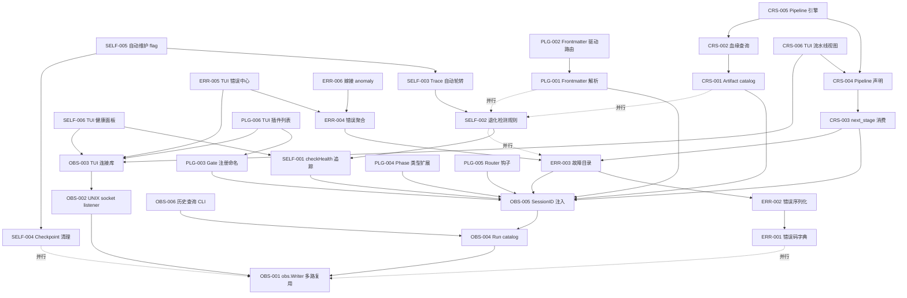
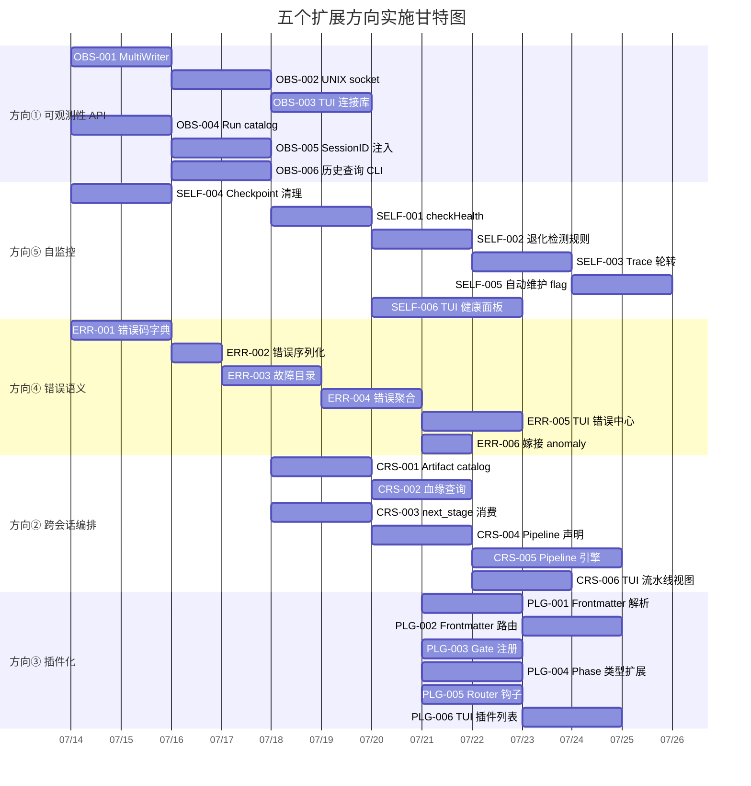

# Tech Lead 分析：五个扩展方向的工程实施计划

> **基于**: `2026-07-12-five-expansion-directions-product-platform-perspective.md`  
> **交叉验证日期**: 2026-07-12  
> **角色**: Tech Lead  
> **范围**: 任务分解·执行顺序·技术风险·资源评估·质量保证·实施时间表

---

## 0. 代码库真实状态勘误

在开始分解之前，需要记录一些实际代码与原始分析文件之间的差异。这些不影响方向的正确性，但影响具体实施路径。

### 0.1 `PhaseType` 枚举不存在

原始分析引用 `engine_build.go:25-40` 的 `asset.PhaseType` 枚举（"两种枚举值：agent 和 gate"）。实际代码库中：

- **不存在 `PhaseType` 类型**。`asset.Phase` 没有 `Type` 字段。
- **阶段分发逻辑在 `orchestrator.RunFrom`**（`orchestrator.go:150-220`）：通过 `len(p.RequiredGates) > 0` 判断 gate phase vs agent phase，而不是通过 `switch phase.Type`。
- **核心架构约束不变**：新 step 类型（如 `human_review`/`webhook`）仍需修改 `orchestrator.go` 的 `RunFrom` 循环体。但实现路径不同——不是枚举 switch，而是需要引入新的分发原语。

### 0.2 `BuildPlan` 函数不存在

`orchestrator/engine_build.go` 实际位于 `cmd/forge/engine_build.go`，且没有 `BuildPlan` 函数。阶段执行逻辑在 `orchestrator.RunFrom`。这不影响方向三的分析结论，但 Task 分解中涉及 Phase 类型扩展时需要指向正确的代码位置。

### 0.3 `check_mode_priorities.go` 不存在

原始分析提到 `internal/gate/check_mode_priorities.go` 的 `ErrorCatalog` 概念。实际代码库中没有这个文件。`doctor/anomaly.go`（已读）有 `DetectAnomalies` 函数，这是目前最接近"错误聚合"的现有代码。方向四的嫁接点应是 `doctor/anomaly.go` 的异常检测模式，而非不存在的文件。

### 0.4 原始分析代码引用的影响

这些差异**不影响原始分析的五个方向的正确性或价值**，但意味着：
1. 方向三的 task 需要指向 `orchestrator.RunFrom` 而不是 `engine_build.go`
2. 方向四的嫁接点应是 `doctor/anomaly.go` 的 `DetectAnomalies` 模式
3. Task 工时估算需要基于真实的代码结构

---

## 1. 任务分解

### 1.1 方向一：运行时可观测性 API

**设计原则**: 零侵入现有 trace 路径。Adapter 只做事件多路复用（fan-out），不做事件生产。JSONL 始终是 source of truth。

| Task ID | 标题 | 文件 | 前置 | 工时 | 验收标准 |
|---------|------|------|------|------|---------|
| OBS-001 | **`obs.Writer` 接口 + 多路复用 Tracer** | 新文件 `internal/obs/adapter.go` + `internal/obs/obs.go` | 无 | 3h | `obs.NewMultiWriter(primary, secondary)` 返回 `io.Writer`，写入 primary 后异步写入 secondary；secondary 失败不阻塞 primary |
| OBS-002 | **UNIX domain socket listener** | 新文件 `internal/obs/socket.go` | OBS-001 | 4h | `obs.Listen(socketPath)` 启动 goroutine 监听 UNIX socket，每个连接创建一个 `json.Encoder` 作为 secondary writer；客户端连接后收到全量 trace 事件流 |
| OBS-003 | **TUI 连接库** | TUI 侧新文件（路径待定） | OBS-002 | 3h | TUI 端 connect 函数连接 UNIX socket，返回 `chan Event`；支持断线重连（指数退避，最多 5 次） |
| OBS-004 | **Run catalog / session registry** | `internal/obs/session.go` + 修改 `cmd/forge/main.go` | OBS-001 | 4h | 每次 `forge run/evolve` 分配 UUID 写入 `.forge/session.jsonl`；包含 `{session_id, workflow, mode, start_at, status}` |
| OBS-005 | **SessionID 注入 trace + checkpoint** | 修改 `internal/trace/trace.go`（Event 加 SessionID）+ `internal/persist/checkpoint.go`（Checkpoint 加 SessionID） | OBS-004 | 3h | 所有 trace 事件携带 `session_id`；checkpoint 携带 `session_id`；向后兼容（旧文件 session_id="" 正常工作） |
| OBS-006 | **历史 run 查询 CLI** | `cmd/forge/history.go` 新子命令 | OBS-004 | 3h | `forge history --json` 返回 `[{session_id, workflow, duration_ms, cost_usd, status}]`；`forge history --last` 返回最近一次 run 的摘要 |

**方向一小计**: 6 个 task，~20h

### 1.2 方向二：跨会话工作流编排

**设计原则**: 不做 pipeline daemon。用 session registry + artifact catalog 的索引层实现跨 run 连接，不引入数据库。

| Task ID | 标题 | 文件 | 前置 | 工时 | 验收标准 |
|---------|------|------|------|------|---------|
| CRS-001 | **Artifact catalog 注册机制** | 新文件 `internal/artifact/catalog.go` + 修改 `cmd/forge/engine_build.go` | OBS-005 | 4h | `forge run` 结束后自动扫描 `emits:` 声明文件，注册到 `.forge/artifacts.jsonl`；每条记录 `{session_id, phase, artifact_path, type, hash}` |
| CRS-002 | **Artifact 血缘查询** | 新文件 `internal/artifact/lineage.go` + `cmd/forge/lineage.go` | CRS-001 | 3h | `forge lineage <path>` 返回该物件的完整血缘（哪个 session 产生→哪个 session 消费）；`forge lineage --graph` 返回 DOT 格式 |
| CRS-003 | **`next_stage` 消费端** | 修改 `internal/asset/asset.go`（StopCondition 已有字段）+ `cmd/forge/evolve.go` | OBS-005 | 4h | 当 `run build` 收敛且 stop_condition.on_met.next_stage="evolve" 时，打印 `→ next: forge evolve` 提示；可 flag 控制是否自动触发 |
| CRS-004 | **Workflow pipeline 声明** | 新文件 `.agent/pipelines/*.yml` 解析 + `internal/asset/pipeline.go` | CRS-003 | 4h | 解析 pipeline YAML（`stages: [discover, design, review, build, evolve]`）；`forge pipeline <name>` 顺序执行各 stage |
| CRS-005 | **Pipeline 执行引擎** | `internal/orchestrator/pipeline.go` + `cmd/forge/pipeline.go` | CRS-004 | 5h | `forge pipeline` 顺序执行 workflow，传递 artifact catalog 引用，stage 失败可选中止/继续 |
| CRS-006 | **TUI 流水线视图基础** | TUI 侧 | CRS-004 | 3h | TUI 展示 pipeline 阶段列表、各阶段状态（pending/running/done/failed）、耗时 |

**方向二小计**: 6 个 task，~23h

### 1.3 方向三：插件化扩展系统

**设计原则**: 先做契约面标准化，不做热加载。agent card frontmatter 驱动路由，gate 注册用命名约定。

| Task ID | 标题 | 文件 | 前置 | 工时 | 验收标准 |
|---------|------|------|------|------|---------|
| PLG-001 | **Agent card frontmatter 解析器** | 新文件 `internal/asset/frontmatter.go` | 无 | 3h | 从 `.agent/agents/*.md` 解析 YAML frontmatter，提取 `tier`/`opus_floor`/`readonly`/`fresh_context`/`required_tools` |
| PLG-002 | **从 frontmatter 驱动路由** | 重写 `internal/routing/routing.go`（agentTier/opusFloorAgents map → frontmatter 驱动） | PLG-001 | 4h | `TierFor(agent, mode)` 从 frontmatter 读取 agent 属性；现有 agent 迁移 frontmatter 后行为不变 |
| PLG-003 | **Gate 注册命名约定** | 修改 `cmd/forge/gates.go` + 文档 | 无 | 3h | `harness/gates/*.mjs` 文件自动注册为新 gate 类型；`forge gate --list` 列出所有已注册 gate（含自定义） |
| PLG-004 | **Phase 类型扩展（human_review）** | 修改 `internal/orchestrator/orchestrator.go`（RunFrom 分发）+ `internal/asset/asset.go`（Phase 加 Type 字段） | 无 | 4h | Phase 声明 `type: human_review` 时，engine 跳过 agent 执行，写入 `.forge/human_review/` 标记；TUI 可展示等待审批 |
| PLG-005 | **Router 评分钩子** | 新文件 `internal/routing/hooks.go` + 修改 `cmd/forge/route.go` | 无 | 3h | `--score-hook <cmd>` 注入自定义评分脚本；标准输入接收 JSON 上下文，标准输出返回 `[{dimension, score}]` |
| PLG-006 | **TUI 插件列表视图** | TUI 侧 | PLG-003 | 2h | TUI 展示已安装插件（agent/gate/scorehook）列表、版本、状态 |

**方向三小计**: 6 个 task，~19h

### 1.4 方向四：错误语义学与故障目录

**设计原则**: 不引入 Java 级别的异常层次结构。结构化错误码字典 + JSON 序列化 + 聚合计数器。

| Task ID | 标题 | 文件 | 前置 | 工时 | 验收标准 |
|---------|------|------|------|------|---------|
| ERR-001 | **错误码字典** | 修改 `internal/orchestrator/exec_error.go`（加 `Code()`/`Severity()`/`Component()` 方法） | 无 | 3h | `ExecError` 增加 `Code() string`（如 `E_AGENT_TIMEOUT`）、`Severity() string`（fatal/error/warning/info）；现有 `Kind*` 枚举保持不变 |
| ERR-002 | **错误结构化序列化** | 修改 `internal/orchestrator/exec_error.go`（加 `MarshalJSON()`） | ERR-001 | 2h | `ExecError` 可 JSON 序列化为 `{code, kind, severity, component, phase, message, retryable}` |
| ERR-003 | **故障目录（Fault Registry）** | 新文件 `internal/fault/registry.go` | ERR-002 | 4h | `forge run`/`evolve` 结束时写入 `.forge/faults.jsonl`：`{session_id, errors:[{code, count, first_at, last_at}]}`；支持查询 `forge faults --session <id>` |
| ERR-004 | **错误趋势聚合** | 新文件 `internal/fault/aggregate.go` + `cmd/forge/faults.go` | ERR-003 | 3h | `forge faults --trend` 输出按 code/week 聚合的错误计数；`--top` 输出频率 top-5 错误 |
| ERR-005 | **TUI 错误中心** | TUI 侧 + 新文件 `internal/obs/error_stream.go` | ERR-003 + OBS-002 | 4h | TUI 展示实时错误流（通过 UNIX socket 的 error 事件）、历史聚合（按 code/severity/week）、错误详情展开 |
| ERR-006 | **嫁接 anomaly 检测** | 修改 `internal/doctor/anomaly.go`（加错误率趋势检测） | ERR-004 | 2h | `forge doctor --anomaly` 新增错误率趋势检查：后 3 次 run 的错误率比前 3 次高 >50% → WARN |

**方向四小计**: 6 个 task，~18h

### 1.5 方向五：自监控与退化检测

**设计原则**: 阈值硬编码。不引入 Prometheus/AlertManager。规则写在 Go 代码里，不制造 YAML 配置爆炸。

| Task ID | 标题 | 文件 | 前置 | 工时 | 验收标准 |
|---------|------|------|------|------|---------|
| SELF-001 | **运行时资源追踪（`checkHealth`）** | 新文件 `internal/doctor/health.go` + 修改 `internal/orchestrator/loop.go` | 无 | 4h | `LoopEngine` 每次迭代末尾调用 `checkHealth()`；记录 `.forge/` 大小/trace 行数/磁盘可用/RSS；写入 `KindSystemHealth` trace 事件 |
| SELF-002 | **退化检测阈值规则** | 新文件 `internal/doctor/degradation.go` | SELF-001 | 3h | 5 条硬编码规则：磁盘<20%→WARN/<10%→FAIL；trace.jsonl>50MB→WARN（触发轮转）；连续 3 次 duration_ms 递增 >50%→WARN；memory 行数异常增长→WARN；trace 写入延迟 >100ms→WARN |
| SELF-003 | **Trace 自动轮转** | 修改 `internal/trace/trace.go`（加 `MaxSize` 参数和轮转逻辑） | SELF-002 | 3h | `trace.jsonl` >50MB 时自动轮转到 `trace.jsonl.1`（保留最近 2 个备份，FIFO）；零侵入现有 Emit 路径 |
| SELF-004 | **Checkpoint 备份自动清理** | 修改 `internal/persist/checkpoint.go`（加 FIFO 清理逻辑） | 无 | 2h | `checkpoint.json.N` 超过 retain 上限时自动删除最旧的；7 天前的备份自动清理 |
| SELF-005 | **自动维护 flag** | 修改 `cmd/forge/evolve.go` + `cmd/forge/run.go`（加 `--auto-maintain` flag） | SELF-003 + SELF-004 | 3h | `forge run --auto-maintain` 在 run 结束后自动轮转 trace、清理旧 checkpoint、trim memory；`--no-cleanup` 关闭 |
| SELF-006 | **TUI 健康面板** | TUI 侧 + 新文件 `internal/obs/health_stream.go` | SELF-001 + OBS-002 | 4h | TUI 展示系统健康仪表板（整体健康度/磁盘/trace 状态/进程 RSS）、资源使用趋势图、告警列表、一键维护按钮 |

**方向五小计**: 6 个 task，~19h

### 总 task 汇总

| 方向 | Tasks | 预估工时 | 可并行 task |
|------|-------|---------|-----------|
| ① 可观测性 API | 6 | ~20h | OBS-001+006 可并行；OBS-003(TUI) 与其余独立 |
| ② 跨会话编排 | 6 | ~23h | CRS-001+002 串行依赖；CRS-003 可独立 |
| ③ 插件化 | 6 | ~19h | PLG-001+002 串行；PLG-003/004/005 可并行 |
| ④ 错误语义 | 6 | ~18h | ERR-001+002+003 串行；ERR-005(TUI) 可稍独立 |
| ⑤ 自监控 | 6 | ~19h | SELF-001+002+003 串行；SELF-004 可独立 |
| **总计** | **30** | **~99h** | |

---

## 2. 执行顺序与依赖图

### 2.1 关键依赖关系

基于代码库真实的依赖关系（修正了原始文档的依赖评估）：

```
方向⑤ → 方向① (自监控需要可观测性管道推送告警)
方向④ → 方向①+⑤ (错误诊断需要事件流 + 历史聚合)
方向② → 方向①+④ (跨会话编排需要 SessionID = 方向①的事件格式扩展 + 方向④的故障记录)
方向③ → 全依赖 (插件需要事件流来观察插件行为)
```

**方向①是所有方向的先决条件**，但它本身的 OBS-001~003 不依赖任何方向。

### 2.2 Mermaid 依赖图



### 2.3 可并行 task 组

| 组 | Tasks | 条件 | 推荐开发者 |
|----|-------|------|-----------|
| **P1** | OBS-001 + OBS-004 + SELF-004 + ERR-001 | 无前置（或仅自身链式依赖） | 3 人并行（Go 基础） |
| **P2** | OBS-002 + OBS-006 | 依赖 P1 的 OBS-001/004 | 2 人并行（Go socket + CLI） |
| **P3** | OBS-003 + PLG-006 + CRS-006 + SELF-006 + ERR-005 | 依赖 P1/P2（TUI 侧 task） | 2-3 人（TUI 前端团队） |
| **P4** | PLG-003 + PLG-004 + PLG-005 | 无互斥 | 2 人并行 |
| **P5** | SELF-001 + SELF-004 + ERR-001 | 无互斥 | 3 人并行 |
| **P6** | CRS-001 + CRS-003 | 依赖 SessionID（OBS-005） | 2 人并行 |

---

## 3. 技术风险

### 3.1 方向一风险

| 风险 | 概率 | 影响 | 缓解策略 |
|------|------|------|---------|
| UNIX socket 在 Windows 上不支持 | 中 | 高 | 回退到命名管道（Windows）或 TCP localhost 回环；OBS-002 设计时应抽象 `Listener` 接口 |
| TUI 在 run 中途连接需要事件回放 | 高 | 中 | OBS-003 连接时先发送全量 checkpoint + 最近 N 条 trace 事件作为初始状态；后续只流增量 |
| 两个 TUI 实例同时连接 | 中 | 中 | 每个连接独立 fan-out，各自维护 `json.Encoder`；一个连接断开不影响其他 |
| socket 写入阻塞影响主线程 | 高 | 高 | OBS-001 的 MultiWriter 必须用带缓冲 channel + drop-on-full 策略；secondary writer 阻塞超过 10ms 则丢事件降级 |
| SessionID 向后兼容 | 低 | 高 | 旧 trace 文件无 SessionID 字段，解码后为空字符串，不影响现有工具；`forge history` 只查询新格式 |

### 3.2 方向二风险

| 风险 | 概率 | 影响 | 缓解策略 |
|------|------|------|---------|
| Artifact catalog 与手动删除的文件不一致 | 高 | 中 | CRS-001 注册时不验证文件存在（只记录 path）；`forge lineage` 查询时做 stat 并标记 stale |
| Pipeline 执行中途用户手动 `forge run` 覆盖状态 | 中 | 高 | Pipeline 在 `.forge/pipeline/` 下维护状态锁；检测到并发执行时拒绝 |
| 多对多血缘（同 PRD 被两个 design run 引用） | 高 | 低 | CRS-002 的 lineage 查询返回多路径；TUI 渲染为 DAG 而不是单链 |
| `next_stage` 作为"声明 dead code"的迁移风险 | 中 | 中 | 修改 `asset.go` 读取 `StopCondition.OnApproved.NextStage` 现有字段（不需要改 YAML schema）；但需要确保旧 workflow 文件解析不受影响 |

### 3.3 方向三风险

| 风险 | 概率 | 影响 | 缓解策略 |
|------|------|------|---------|
| Frontmatter 解析引入 YAML 依赖 | 中 | 中 | Go 标准库无 YAML 解析器，forge-core 零依赖原则。方案 A：用 `gopkg.in/yaml.v3`（打破零依赖）；方案 B：要求 agent card 使用 JSON frontmatter；推荐方案 B |
| 自定义 gate 脚本安全（恶意读取全盘） | 低 | 高 | Phase 1 不做沙箱，只在文档声明"自定义 gate 拥有与 forge CLI 相同的文件系统权限"；Phase 2 引入最小权限原则 |
| Gate 注册命名约定与现有 gate 冲突 | 低 | 中 | `harness/gates/` 下已有 6 个 gate 脚本；命名约定应保留 `lint`/`test`/`build`/`complexity`/`arch`/`security` 为内置 gate，自定义 gate 加前缀（如 `custom_`）或使用二级目录 |
| Phase 类型扩展（human_review）不改变 `orchestrator.RunFrom` 已有逻辑 | 中 | 中 | 当前 `RunFrom` 通过 `len(p.RequiredGates) > 0` 分发；新增类型需在 for 循环内加 `switch` 或 `if-else` 链，保持现有路径不受影响 |

### 3.4 方向四风险

| 风险 | 概率 | 影响 | 缓解策略 |
|------|------|------|---------|
| 错误码字典与现有 `ExecErrorKind` 的映射 | 中 | 中 | 每个 `ExecErrorKind` 映射到唯一 `Code`（如 KindTimeout→"E_AGENT_TIMEOUT"）；`Code()` 方法实现为 `kindCodeMap[e.Kind]`，不改变枚举 |
| 已有错误处理代码依赖 `Error()` 字符串 | 低 | 中 | 不修改 `Error()` 方法（向后兼容）；新增 `Code()` 和 `Severity()` 是 additive 的 |
| 错误聚合在大量 session 下的性能 | 低 | 中 | `.forge/faults.jsonl` 每次 run 写入一次（不是每错误一次），文件大小随 run 数线性增长；预估每个 run ~200B，1000 runs = ~200KB，不需要索引 |
| 错误码版本漂移（新 kind 加但 code 映射忘更新） | 中 | 中 | 编译期检查：`ExecErrorKind` 的 iota 枚举和 `kindCodeMap` 的覆盖度用 `go test` 断言验证 |

### 3.5 方向五风险

| 风险 | 概率 | 影响 | 缓解策略 |
|------|------|------|---------|
| 退化检测误报（大 PR 导致 duration_ms 正常上涨被判为退化） | 中 | 中 | 每个规则都有阈值：连续 3 次才触发 WARN；不自动执行操作（只标记）；用户可手动压制告警 |
| `KindSystemHealth` trace 事件污染现有消费者 | 低 | 中 | 新 kind 不改变现有 10 种 kind 的处理逻辑；TUI 侧需额外注册 kind 渲染 |
| 磁盘满导致 `checkHealth` 自身写不了日志 | 高 | 中 | 磁盘 <5% 时 `checkHealth` 退出前向 stderr 打印最终告警；写入 `.forge/` 失败不 fatal |
| Trace 轮转丢事件 | 中 | 中 | 轮转策略：trace.jsonl >50MB → rename 到 trace.jsonl.1（覆盖旧备份），新建 trace.jsonl；rename 操作原子性保证不丢事件 |
| 自动维护删了用户想保留的 trace | 低 | 高 | 默认保留最近 5 个 run 的 trace（通过 `--auto-maintain` 文档明确）；`--no-cleanup` flag 完全禁用 |

---

## 4. 资源评估

### 4.1 开发团队建议

| 角色 | 人数 | 技能要求 | 负责方向 |
|------|------|---------|---------|
| Go 后端工程师（核心） | 2-3 | Go 熟练，熟悉 io.Writer/goroutine/UNIX socket | 方向①、④、⑤（Go 侧） |
| Go 后端工程师（编排） | 1-2 | Go 熟练，理解状态机设计 | 方向②、③（Go 侧） |
| TUI 前端工程师 | 2-3 | TUI 框架经验（Arcane 技术栈） | 所有方向的 TUI 侧 |
| DevOps / QA | 1 | CI/CD，集成测试 | 跨方向 |

**最小可行团队**: 3 人（2 Go + 1 TUI），Sprint N 可以覆盖方向①+⑤的核心路径。

### 4.2 关键里程碑

| 里程碑 | 时间 | 交付物 | 验收者 |
|--------|------|--------|-------|
| **M1: 可观测性管道就绪** | Sprint N Day 5 | UNIX socket 可连接，TUI 可接收实时 trace 事件 | TUI 团队验证 socket 连接 |
| **M2: 健康面板可用** | Sprint N Day 10 | TUI 展示系统健康面板（5 条阈值规则） | PM 验证告警触发 |
| **M3: 错误诊断可用** | Sprint N+1 Day 5 | `forge faults` CLI + TUI 错误中心 | QA 验证错误码覆盖 |
| **M4: 跨会话连接** | Sprint N+1 Day 10 | SessionID + artifact catalog + `forge lineage` | PM 验证血缘追踪 |
| **M5: 插件化落地** | Sprint N+2 Day 10 | Frontmatter 驱动路由 + gate 注册 + human_review phase | 架构师验证扩展性 |
| **M6: 全面集成测试** | Sprint N+2 Day 15 | 所有方向通过集成测试闸门 | tech lead |

### 4.3 阻塞点（Blockers）

| Block | 涉及方向 | 阻碍 | 解决策略 |
|-------|---------|------|---------|
| 零外部依赖原则 vs JSON frontmatter | 方向③ | PLG-001 需要 YAML 解析 | 方案：强制 agent card 使用 JSON frontmatter（保持 `forge-core` 零依赖）；或引入 `gopkg.in/yaml.v3` 并记录为唯一外部依赖 |
| TUI 技术栈未定 | 全方向 TUI 侧 | TUI task 无法启动 | 用 CLI fallback（`forge status --live` 等文本输出）作为 TUI 侧交付前的替代方案 |
| Windows UNIX socket 兼容 | 方向① | OBS-002 | 抽象 `net.Listener` 接口，Windows 上 fallback 到 TCP `localhost:0` |
| Frontmatter 迁移存量 agent | 方向③ | PLG-002 需要迁移 12 个 agent card | 迁移工具：`forge migrate --frontmatter` 读取现有 agent 卡 + routing.go 硬编码值，生成 frontmatter；验证：`forge agent --validate` 对比新旧路由结果 |

### 4.4 合并/回退策略

每个方向都设计为**增量式交付**，任何方向在任何 sprint 结束时都可以被"disable"而不影响其他：

| 方向 | 回退机制 | 回退成本 |
|------|---------|---------|
| ① | 不启动 socket listener → 退化为纯 JSONL（现有行为） | 0（零侵入） |
| ② | 不写 artifact catalog → 退化为现有单 run 行为 | 0（无数据库迁移） |
| ③ | 不使用 frontmatter → routing.go 继续使用硬编码 map | ~4h 回退 frontmatter 代码 |
| ④ | 不写 faults.jsonl → 退化为现有 `Error()` string | 0（additive） |
| ⑤ | 不调用 checkHealth → 退化为现有无自监控行为 | 0（零侵入） |

---

## 5. 质量保证

### 5.1 单元测试覆盖要求

| 组件 | 包 | 现有测试 | 需新增 | 关键测试用例 |
|------|---|---------|--------|-------------|
| MultiWriter | `internal/obs` | 0（新文件） | ≥80% | primary write 成功/secondary write 失败不阻塞 primary/secondary 阻塞超时降级/并发写入 |
| Socket listener | `internal/obs` | 0（新文件） | ≥75% | 连接/断开/重连/多客户端/消息完整性（JSONL 不交错） |
| Session registry | `internal/obs` | 0（新文件） | ≥80% | UUID 唯一性/序列化/反序列化/空 session 文件处理 |
| Artifact catalog | `internal/artifact` | 0（新文件） | ≥80% | 注册/查询/stale 标记/多 session 血缘 |
| Frontmatter | `internal/asset` | 0（新文件） | ≥85% | 解析/无效 frontmatter/tier 映射/向后兼容（无 frontmatter 的存量 agent 卡） |
| Error code | `internal/orchestrator` | 有（`exec_error_test.go`） | +20% | Code()/Severity()/Component()/JSON 序列化/与现有 Kind 枚举一致 |
| Fault registry | `internal/fault` | 0（新文件） | ≥80% | 写入/读取/聚合/空目录处理/大文件 stream |
| Health check | `internal/doctor` | 有（`doctor.go` 间接覆盖） | +30% | 阈值触发/up 阈值下正常/错误输入(NaN/负值)/退化检测误报不触发 |
| Trace rotation | `internal/trace` | 有（`trace_test.go`） | +15% | 阈值触发轮转/备份不超限/轮转中 Emit 不丢事件 |
| Checkpoint cleanup | `internal/persist` | 有（`checkpoint` 间接） | +15% | FIFO 清理/7 天旧文件清理/保留策略边界 |

### 5.2 集成测试策略

| 测试场景 | 方法 | 验证点 | 工具 |
|---------|------|--------|------|
| **M1 验收** | 启动 `forge run`，TUI 连接 socket | TUI 收到实时 trace 事件 | bash test harness + Python TUI 模拟客户端 |
| **M5 验收** | `forge run --auto-maintain` 连续 10 次 | trace 文件不超 55MB；checkpoint 备份不超 retain | bash loop + size assertion |
| **跨方向集成** | `forge pipeline` 执行 3 个 stage，验证 catalog 血缘 | lineage 查询返回完整路径 | `forge lineage --graph` + DOT 验证 |
| **错误诊断** | 注入假错误（修改 trace 文件），运行 `forge faults --trend` | 错误聚合正确 | `sed` 注入 + `forge faults --json` 验证 |
| **插件路由** | 添加自定义 agent card（frontmatter），验证 `forge validate --models` 路由正确 | 新 agent 可路由到正确 tier | `forge validate --models --json` |

### 5.3 代码审查要点

| 方向 | 审查重点 | 审查人 | 
|------|---------|-------|
| ① | 异步写入 path 的 goroutine 安全（`MultiWriter` 的 channel 关闭处理） | 资深 Go 工程师 |
| ② | `RunFrom` 分发路径不受 Pipeline 影响；pipeline 状态锁的并发安全 | 编排引擎 owner |
| ③ | Frontmatter 解析的 JSON 安全性（恶意卡注入字段）；gate 脚本不意外执行 | 安全负责人 |
| ④ | `Code()` 映射的完整性（编译期断言）；`Severity()` 的语义正确性 | 项目中任意 Go 工程师 |
| ⑤ | 阈值规则不 panic；`checkHealth` 在 `LoopEngine` 异常退出时也执行 | 资深 Go 工程师 |
| **全方向** | 零侵入原则：不修改现有 trace 事件格式；不改变现有 checkpoint schema | tech lead |

### 5.4 性能测试需求

| 场景 | 负载 | 基线 | 目标 | 工具 |
|------|------|------|------|------|
| Trace 写入 + socket fan-out | 10,000 events/秒（模拟高频率 iteration） | 纯 JSONL ~5µs/event | fan-out 增加 <50µs/event | Go benchmark + fake clock |
| Socket 多客户端 | 10 个并发 TUI 连接 | 无（新增） | 所有连接收到完整事件流，无丢事件 | 并发客户端 + assertion |
| Artifact catalog 大血缘 | 1000 个 session，每个 10 个 artifact | 无（新增） | lineage 查询 <100ms | `forge lineage --json` + time |
| 退化检测误报率 | 100 次正常 run + 10 次真实退化 | 无（新增） | 误报率 <5%（正常 run 不触发 WARN） | 模拟 run + 规则调试 |

---

## 6. 实施计划

### 6.1 阶段 1：基础设施搭建（Sprint N，Days 1-10）

**目标**: 可观测性管道就绪 + 自监控可用 → TUI 有实时数据展示

```
Days 1-3:   OBS-001 MultiWriter + OBS-004 Session registry + SELF-004 Checkpoint 清理
            （3 人并行：
              人 A: MultiWriter 接口 + io.Writer 多路复用
              人 B: Session registry UUID + JSONL 持久化
              人 C: Checkpoint rotate 的 FIFO 清理 + 时间阈值）
            
Days 3-5:   OBS-002 UNIX socket listener + ERR-001 错误码字典
            （人 A 继续 OBS-002，人 B 开始 ERR-001）
            
Days 5-7:   OBS-003 TUI 连接库 + OBS-005 SessionID 注入 trace+checkpoint
            （TUI 团队开始 OBS-003；人 A 做 OBS-005）
            
Days 7-8:   OBS-006 历史查询 CLI + SELF-001 checkHealth（人 A 做 SELF-001）
            
Days 8-10:  SELF-002 退化检测阈值 + SELF-003 Trace 自动轮转
            （人 A+B 聚焦自监控；TUI 团队做 SELF-006 健康面板）
            
Day 10:     M1 + M2 里程碑检查
```

**交付物**: UNIX socket fan-out、SessionID、`forge history`、5 条阈值规则、TUI 健康面板原型

### 6.2 阶段 2：核心功能实现（Sprint N+1，Days 11-20）

**目标**: 错误诊断可用 + 跨会话连接 + 插件化起步

```
Days 11-13: ERR-002 错误序列化 + ERR-003 故障目录 + SELF-005 自动维护 flag
            （3 人并行）

Days 13-15: ERR-004 错误趋势聚合 + CRS-001 Artifact catalog + PLG-001 Frontmatter 解析
            
Days 15-17: ERR-005 TUI 错误中心 + CRS-002 血缘查询 + PLG-002 Frontmatter 驱动路由
            
Days 17-18: ERR-006 嫁接 anomaly 检测 + CRS-003 next_stage 消费 + PLG-003 Gate 注册命名
            
Days 18-20: CRS-004 Pipeline 声明 + PLG-004 Phase 类型扩展 + SELF-006 TUI 健康面板完善

Day 20:     M3 + M4 里程碑检查
```

**交付物**: `forge faults` CLI、TUI 错误中心、artifact catalog、`forge lineage`、frontmatter 路由、gate 注册

### 6.3 阶段 3：集成测试和优化（Sprint N+2，Days 21-28）

**目标**: 插件化落地 + 全面集成测试 + 性能调优

```
Days 21-23: CRS-005 Pipeline 引擎 + PLG-005 Router 评分钩子 + CRS-006 TUI 流水线视图
            
Days 23-25: PLG-006 TUI 插件列表 + 跨方向集成测试（pipeline + catalog + lineage）
            
Days 25-27: 性能测试（socket fan-out 基准/大先祖查询/退化检测误报率）
            
Days 27-28: 文档编写（agent card frontmatter schema/gate 注册/gate 钩子/`--auto-maintain`）
            
Day 28:     M5 + M6 里程碑检查
```

**交付物**: Pipeline 引擎、score hook、TUI 流水线/插件视图、完整集成测试套件

### 6.4 阶段 4：发布准备（Sprint N+3，Days 29-35）

**目标**: 生产就绪 + 迁移 + 发布

```
Days 29-30: 存量 agent card frontmatter 迁移 + `forge migrate --frontmatter` 工具
            
Days 30-32: 边界测试（socket 断连/磁盘满/corrupt trace/空目录）
            
Days 32-33: 文档（CLI 用户文档/gate 开发者指南/agent 卡 schema/故障排查指南）
            
Days 33-34: CI gate 集成（新增测试加入 `harness/acceptance.mjs`）
            
Day 35:     发布 + 内部演示
```

**交付物**: 所有 5 个方向的 Go 侧 + TUI 侧实现、迁移工具、文档、CI 集成

### 6.5 甘特图（Mermaid）



### 6.6 交付时序（按 Sprint）

```
Sprint N (Jul 14-25)
├── 方向①: OBS-001~006 (全部)           ← 基础设施完全就绪
├── 方向⑤: SELF-001~006 (全部)          ← 自监控联调 end-to-end
├── 方向④: ERR-001~002 (起步)           ← 错误码字典 + 序列化
└── TUI: OBS-003 + SELF-006              ← 健康面板可用

Sprint N+1 (Jul 28 - Aug 8)
├── 方向④: ERR-003~006 (完成)           ← 错误诊断 end-to-end
├── 方向②: CRS-001~004 (起步-核心)     ← catalog + lineage + next_stage
└── 方向③: PLG-001~004 (起步-核心)     ← frontmatter + gate注册

Sprint N+2 (Aug 11-22)
├── 方向②: CRS-005~006 (完成)           ← pipeline引擎 + TUI
├── 方向③: PLG-005~006 (完成)           ← score hook + TUI
└── 集成测试 + 性能调优

Sprint N+3 (Aug 25 - Sep 5)
├── 迁移工具 + 文档 + CI gate
└── 发布
```

---

## 7. 附录：与原始分析的关键差异对照

| 原始分析主张 | 实际代码 | 对规划的影响 |
|-------------|---------|-------------|
| `asset.PhaseType` 枚举（agent/gate） | 无 PhaseType，通过 `RequiredGates` 区分 | 方向三 PLG-004 的实现路径改为修改 `orchestrator.RunFrom` 的分发逻辑，不是改枚举 |
| `engine_build.go:25-40` 的 `BuildPlan` | 无此函数 | 不影响分析结论 |
| `check_mode_priorities.go` ErrorCatalog | 不存在 | 方向四的嫁接点改为 `doctor/anomaly.go` 的 `DetectAnomalies` 模式 |
| 方向① Tracer `Emit()` 静默吞错误 | 实际返回 `error`（fail-closed）；但 `Span()` 用 `_ = t.Emit(...)` 吞错误 | 确认 fan-out 路径通畅：`Span()` 是常见调用入口，吞错误意味着 secondary writer 失败不会 panic |
| 方向⑤ `traceCheck` 有 100MB 警告 | 实际检查文件可读性 + 最后一行完整性，不检查大小 | SELF-003 需要全新实现轮转逻辑（不依赖现有 doctor） |

---

*本文档面向 ForgeOS 工程团队，作为五个扩展方向的实施指南。所有任务标签（OBS-*/CRS-*/PLG-*/ERR-*/SELF-*）将在项目管理工具中创建为独立 issue。*
