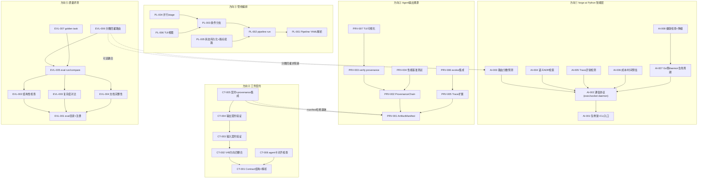
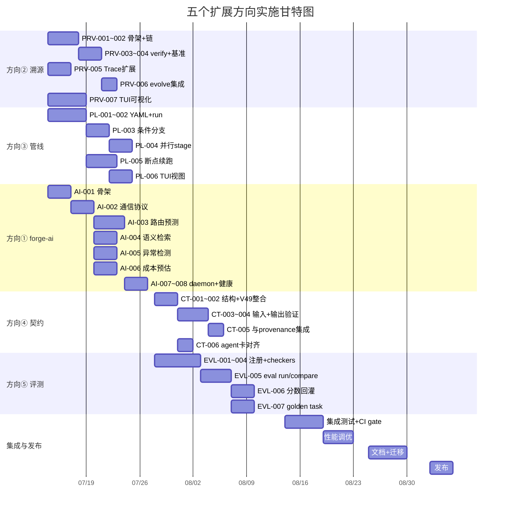

# Tech Lead 分析：五个高价值扩展方向的工程实施计划

> **输入文档**: `forgeos-five-unseen-product-architect-extensions.md`（2026-07-10）  
> **审阅反馈**: 2026-07-12 用户审阅（差异化验证 + 结构性反馈）  
> **角色**: Tech Lead  
> **范围**: 任务分解 · 执行顺序 · 技术风险 · 资源评估 · 质量保证 · 实施时间表  
> **当前代码基准**: forge-core 18 个内部包 + cmd/forge，零外部 Go 依赖

---

## 0. 审阅反馈采纳记录

| # | 反馈 | 影响 | 采纳方式 |
|---|------|------|---------|
| F1 | 方向一 forge-ai: `exec.Command("python3", ...)` 每次 ~50-100ms 进程启动延迟，需标注 keep-alive daemon / Unix socket 长连接 tradeoff | 新增方向一技术风险 + 设计决策 | 任务 AI-002 加入 daemon 模式设计，风险表标注进程启动开销 |
| F2 | 方向二溯源: `checkpoint.go` 有 `_format` 但无 checksum，`--verifiable` 后 O(1)→O(n) 性能降级 | 新增方向二性能风险 | 风险表标注 SHA256 计算开销，任务 PRV-004 加入性能测试 |
| F3 | 方向四契约: 明确标注 V49 是"契约的下层基础"——先有 phase 内结构验证，才能做 phase 间契约验证 | 重写方向四依赖描述 | 任务 CT-002 依赖列表新增 V49 方向四的输出作为前提，文档标注建造顺序 |

---

## 1. 任务分解

### 1.1 方向一：forge-ai Python 智能层

**设计原则**: forge-core 零外部依赖原则不可破坏。forge-ai 通过 `exec.Command` 调用，输出 JSON 交换。
零依赖核心即使在 Python 不可用时也正常工作。Python 侧使用 `pip` 生态但全部为可选依赖。

**审阅采纳**: F1 — 增加 AI-002 daemon 模式降低进程启动开销。

| Task ID | 标题 | 涉及文件 | 前置 | 工时 | 验收标准 |
|---------|------|---------|------|------|---------|
| AI-001 | **forge-ai 包骨架 + CLI 入口** | 新目录 `forge-ai/`；`forge-ai/__init__.py`, `forge-ai/cli.py`, `forge-ai/pyproject.toml` | 无 | 3h | `python3 -m forge_ai --version` 输出 `0.1.0`；`forge-ai/` 下 `pip install -e .` 可安装 |
| AI-002 | **forge-core ↔ forge-ai 通信协议** | 新文件 `internal/forgeai/client.go` + `forge-ai/forge_ai/server.py` | AI-001 | 4h | 定义 `Request/Response` JSON 协议（`{cmd, payload}` / `{status, data, error}`）；支持两种模式：① 单次 `exec.Command`（默认）② Unix socket daemon（`--daemon` 启动长驻进程，后续调用走 socket，减少启动延迟） |
| AI-003 | **路由分数预测器** | `forge-ai/forge_ai/routing/predictor.py` + 修改 `internal/routing/routing.go`（加 `ScoreHook` 调用） | AI-002 | 4h | `python3 -m forge_ai routing score --history <json>` 返回 `{tier_scores: {haiku: 0.7, sonnet: 0.9}, confidence: 0.85}`；Go 侧 `--enable-ai-routing` 启用 AI 分数覆盖规则分数 |
| AI-004 | **语义 ADR 检索器** | `forge-ai/forge_ai/embedding/retriever.py` + 修改 `internal/prompt/retrieve.go`（fallback 到 AI 检索） | AI-002 | 4h | `python3 -m forge_ai retrieve --query <q> --corpus <dir>` 返回 `[{path, score}]`；纯规则 TF-IDF 传统工作保持不变，AI 检索仅在 `--enable-ai-retrieve` 时启用 |
| AI-005 | **Trace 异常检测器** | `forge-ai/forge_ai/anomaly/detector.py` + `cmd/forge/evolve.go`（加 `--ai-anomaly` flag） | AI-002 | 3h | `python3 -m forge_ai anomaly detect --trace <jsonl>` 返回 `[{event_id, anomaly_score, reason}]`；输出写入 `.forge/anomalies.jsonl` |
| AI-006 | **成本/时间预估器** | `forge-ai/forge_ai/predict/estimator.py` + `cmd/forge/run.go`（加 `--predict` flag） | AI-002 | 3h | `forge run --predict --mode engineering` 在执行前输出预估耗时和成本；基于历史 `scorecard` + trace 数据训练轻量模型 |
| AI-007 | **Go 侧 daemon 生命周期管理** | `internal/forgeai/daemon.go`（启动/健康检查/优雅关闭） | AI-002 | 3h | `forge-ai daemon start` 启动长驻 Python 进程，`forge-ai daemon stop` 优雅关闭；Go 侧发现 daemon 无响应时自动降级到单次调用模式 |
| AI-008 | **健康检查与降级机制** | `internal/forgeai/health.go` + `internal/doctor/doctor.go`（加 forge-ai 可达性检查） | AI-007 | 2h | `forge doctor` 报告 `forge-ai: available` 或 `forge-ai: unavailable`；Go 侧所有 forge-ai 调用有 5s 超时 + 降级到纯规则 |

**方向一小计**: 8 个 task，~26h

---

### 1.2 方向二：Agent 输出溯源与可验证性

**设计原则**: 哈希而非签名（不引入 key 管理）；清单而非完整内容（隐私/体积）；增量而非全量；可选而非强制（`--verifiable`）。

**审阅采纳**: F2 — 标注 `--verifiable` 模式下 checkpoint 写入从 O(1) 降为 O(n) SHA256 计算。

| Task ID | 标题 | 涉及文件 | 前置 | 工时 | 验收标准 |
|---------|------|---------|------|------|---------|
| PRV-001 | **ArtifactManifest 结构定义 + 写入** | 新文件 `internal/provenance/manifest.go` + 修改 `internal/asset/asset.go`（PhaseOutputLedger 升级） | 无 | 4h | `ArtifactManifest` 结构：`{session_id, phase, agent, model, prompt_hash, files: [{path, sha256}], trace_seq}`；`forge run --verifiable` 后在 `.forge/provenance/` 写入 `manifest-<phase>.jsonl` |
| PRV-002 | **ProvenanceChain + checkpoint 扩展** | 修改 `internal/persist/checkpoint.go`（Checkpoint 加 `PrevCheckpointHash`、`ManifestRef`） | PRV-001 | 4h | 每个 checkpoint 记录前一个 checkpoint 的 SHA256；`--verifiable` 模式下 checkpoint 写时同步计算所有引用文件的 SHA256（O(n) 开销） |
| PRV-003 | **`forge verify provenance` 命令** | 新文件 `cmd/forge/verify.go` + `internal/provenance/verify.go` | PRV-002 | 3h | `forge verify provenance <file>` 输出完整来源链：`{session_id}→{phase}→{agent}→{model}`；`forge verify provenance --all` 验证最近 session 全部 manifest 完整性 |
| PRV-004 | **性能测试：SHA256 计算开销** | `internal/provenance/bench_test.go` + 文档 | PRV-002 | 2h | 基准测试：10 个文件 × 100KB 平均 → SHA256 计算 <10ms；100 个文件 × 1MB → <100ms；结果记录在 `docs/decisions/provenance-benchmark.md` |
| PRV-005 | **Trace 事件扩展 + 关联** | 修改 `internal/trace/trace.go`（Event 加 `ManifestRef`、`ArtifactHash` 字段） | PRV-001 | 3h | 每个 `AgentPhase` trace 事件携带 `manifest_ref`；`KindProvenance` 新 kind 记录 manifest 总览；向后兼容：旧 trace 无此字段正常工作 |
| PRV-006 | **`forge evolve --verifiable` 集成** | 修改 `cmd/forge/evolve.go`（循环末尾调用 manifest 写入） | PRV-005 | 2h | `forge evolve --verifiable` 的每次迭代生成增量 manifest（与全量 manifest 对称）；`forge verify provenance --session <id>` 验证迭代间链完整性 |
| PRV-007 | **TUI provenance 可视化基础** | TUI 侧 + `internal/provenance/render.go` | PRV-003 | 3h | TUI 显示当前 session 的 provenance 状态（已验证/链完整/断链）；`forge verify --dot` 输出 DOT 格式供 TUI 渲染 |

**方向二小计**: 7 个 task，~21h

---

### 1.3 方向三：跨 Workflow 管线编排引擎

**设计原则**: 不做 pipeline daemon。通过 pipeline 声明 + 状态锁实现，不引入数据库。
复用 checkpoint 机制实现断点续跑。pipeline 状态完全基于文件系统。

| Task ID | 标题 | 涉及文件 | 前置 | 工时 | 验收标准 |
|---------|------|---------|------|------|---------|
| PL-001 | **Pipeline YAML 声明 + 解析** | 新文件 `.agent/pipelines/` + `internal/asset/pipeline.go`（PipelineStage、Pipeline DSL 结构） | 无 | 4h | 解析 `pipeline.yml`: `stages: [{workflow, mode, on_success, require}]`；验证：stage 引用的 workflow 必须存在；循环/缺失字段报错 |
| PL-002 | **`forge pipeline run <name>` 命令** | 新文件 `cmd/forge/pipeline.go` + `internal/orchestrator/pipeline.go` | PL-001 | 4h | `forge pipeline run <name>` 按声明顺序依次执行 workflow；每个 stage 复用 `RunFrom` 引擎；stage 之间传递 pipeline context（产出路径 + 收敛信号） |
| PL-003 | **条件分支引擎** | `internal/orchestrator/pipeline_branch.go` | PL-002 | 4h | 支持 `on_approve: build` / `on_redesign: design` / `on_failure: rollback-pipeline`；stage 终止状态（converged/approved/rejected/failed）决定下一 stage；无匹配分支时 pipeline 停止并输出原因 |
| PL-004 | **并行 stage 支持** | 修改 `internal/orchestrator/pipeline.go`（加 `parallel` field + goroutine 编排） | PL-003 | 3h | `pipelines.yml` 支持 `parallel: [stage_a, stage_b]` 并行执行；所有并行 stage 完成后再进入下一 stage；并行 stage 失败策略：`fail_fast: true` 取消其余 |
| PL-005 | **Pipeline 状态持久化 + 断点续跑** | 修改 `internal/persist/checkpoint.go`（加 `PipelineState`）+ `internal/orchestrator/pipeline_resume.go` | PL-002 | 4h | pipeline 中断后 `forge pipeline resume <name>` 从当前 stage 恢复（不是重头）；每个 stage 的 checkpoint 独立保存到 `.forge/pipeline-<id>/` |
| PL-006 | **Pipeline TUI 视图** | TUI 侧 + `internal/asset/pipeline_render.go` | PL-003 | 3h | TUI 展示 pipeline 阶段列表：状态（pending/running/done/failed）、当前 stage 进度、各阶段耗时；支持暂停/继续操作 |

**方向三小计**: 6 个 task，~22h

---

### 1.4 方向四：阶段间工件契约系统

**设计原则**: 声明式契约 + 可插拔验证器（复用 lint/coverage 适配器模式）。
契约是结构/存在性验证，非语义验证。向后兼容零行为变化（空契约 = 不验证）。

**审阅采纳**: F3 — 明确 V49 方向四是下层基础，CT-002 依赖 V49 的输出。

| Task ID | 标题 | 涉及文件 | 前置 | 工时 | 验收标准 |
|---------|------|---------|------|------|---------|
| CT-001 | **Contract 结构定义 + YAML 解析** | 修改 `internal/asset/asset.go`（Phase 加 `InputContract`/`OutputContract` 字段）+ 新文件 `internal/asset/contract.go` | 无 | 4h | `Contract`：`{min_files, required_patterns: [{path, contains_sections, format}]}`；旧 workflow 无 contract 字段 = 零行为变化 |
| CT-002 | **阶段内结构验证整合（V49 下层基础）** | 读取 V49 方向四的输出（非代码产物结构化验证框架），确认 section 验证器接口 | CT-001 | 2h | 文档验证：`v49-section-check` 适配器注册到 harness gate 系统；为 CT-003 提供 `verifySection(path, requiredSections)` 基础函数 |
| CT-003 | **输入契约验证器（pre-phase hook）** | 新文件 `internal/orchestrator/contract_check.go` + `internal/gate/contract_adapter.go` | CT-002 | 4h | 每个 agent/gate phase 执行前验证上游产出满足 `input_contract`；失败模式：`WARN`（explorer）/ `BLOCK`（engineering）；阻塞时写入 `.forge/contract-failures.jsonl` |
| CT-004 | **输出契约验证器（post-phase hook）** | 扩展 `internal/orchestrator/contract_check.go` + 修改 `orchestrator.go`（RunFrom phase 后调用） | CT-003 | 3h | agent phase 执行后验证自身产出满足 `output_contract`；`forge run --contract=warn` 覆盖 mode 级别 WARN/BLOCK |
| CT-005 | **契约与 provenance 集成** | `internal/provenance/manifest.go` 加 `contract_verdict` 字段 | PRV-001 + CT-003 | 2h | manifest 记录每个 phase 的契约验证结果（`passed`/`warned`/`blocked`）；`forge verify provenance --contracts` 包含契约验证状态 |
| CT-006 | **契约声明与 agent 卡对齐检查** | 修改 `harness/check.py`（加 `check_agent_contract_alignment` 治理检查） | CT-001 | 2h | `forge check` 新检查：对比 `.agent/agents/*.md` 自然语言描述的 expected output 与 workflow 中声明的 `output_contract`，报告不匹配 |

**方向四小计**: 6 个 task，~17h

---

### 1.5 方向五：Agent 产出质量评测框架

**设计原则**: 评测器是可选的（缺了降级 N/A）。评测不阻断 pipeline。分数回灌到路由系统。
golden task 是参考性指标，非 production gate。

| Task ID | 标题 | 涉及文件 | 前置 | 工时 | 验收标准 |
|---------|------|---------|------|------|---------|
| EVL-001 | **`eval/` 目录结构 + 评测器注册** | 新目录 `eval/`：`tasks/`, `checkers/`, `registry.yml` + 新文件 `internal/eval/registry.go` | 无 | 3h | `forge eval list` 列出已注册评测器和 golden task；`registry.yml` 声明 `{name, type, command}`；checker 同样复用适配器模式（像 gate adapter） |
| EVL-002 | **内置评测器：结构性检查** | `eval/checkers/structural.mjs` + `internal/eval/structural.go`（section 存在性/格式） | EVL-001 | 3h | 检查文档 section 标题是否存在；markdown heading 层级正确；JSON/YAML 可解析；结果输出 `{path, check, passed: bool, details}` |
| EVL-003 | **内置评测器：代码复杂度对比** | `eval/checkers/complexity.mjs` + 修改 `harness/complexity.mjs`（输出 diff 格式） | EVL-001 | 3h | 对 code 型 agent 产出：跑 complexity gate 获取修改前/后圈复杂度对比；输出 `{file, before, after, delta}`；评测器只记录不阻塞 |
| EVL-004 | **内置评测器：文档完整性** | `eval/checkers/document-quality.mjs` + `internal/eval/doc_check.go` | EVL-001 | 3h | 检查文档 section 存在性、最少段落数、ADR 引用一致性；复用 CT-002 的 section 验证器 |
| EVL-005 | **`forge eval run` + `forge eval compare`** | 新文件 `cmd/forge/eval.go` + `internal/eval/runner.go`、`internal/eval/comparer.go` | EVL-002/003/004 | 4h | `forge eval run generate-rest-api --mode engineering` 运行 agent + 评测；`forge eval compare baseline candidate --output diff.html` 对比两组评测结果 |
| EVL-006 | **质量分数回灌路由系统** | 修改 `internal/routing/scorecard.go`（QualityScore 从 binary → 多维 `{structural, complexity, doc_completeness, overall}`） | EVL-005 + AI-003 | 4h | `scorecard.quality_score` 升级为 `map[string]float64`；`HistoryTiebreak` 使用 overall 评分优化模型选择；向后兼容：旧 binary → 映射为所有维度同一值 |
| EVL-007 | **golden task 定义 + 首次评测基线** | `eval/tasks/generate-rest-api.yaml` + `eval/tasks/write-architecture-doc.yaml` + 首次运行结果记录 | EVL-005 | 3h | 两个 golden task 可运行并产出评测分数；结果写入 `.forge/eval-results.jsonl`；`forge eval trend` 显示分数随时间变化 |

**方向五小计**: 7 个 task，~23h

---

### 1.6 任务汇总

| 方向 | Tasks | 预估工时 | 新文件数 | 核心 Go 包修改 | 备注 |
|------|-------|---------|---------|---------------|------|
| ① forge-ai | 8 | ~26h | ~12 新文件 | `routing`, `prompt`, `doctor`, `forgeai` | Python 项目骨架最大 |
| ② 溯源 | 7 | ~21h | ~6 新文件 | `provenance`, `persist`, `trace`, `asset` | 新增 `internal/provenance/` 包 |
| ③ 管线编排 | 6 | ~22h | ~5 新文件 | `asset`, `orchestrator`, `persist` | 新增 `internal/orchestrator` pipeline 子模块 |
| ④ 契约 | 6 | ~17h | ~3 新文件 | `asset`, `orchestrator`, `gate`, `harness` | 依赖 V49 方向四输出 |
| ⑤ 评测 | 7 | ~23h | ~10 新文件 | `eval`, `routing`, `cmd/forge` | 新增 `internal/eval/` 包 |
| **总计** | **34** | **~109h** | **~36** | | |

---

## 2. 执行顺序与依赖图

### 2.1 全局依赖关系

```
方向② 溯源 → 方向④ 契约（manifest 为契约验证提供文件哈希基础）
方向⑤ 评测 → 方向① forge-ai（forge-ai embedding 驱动质量评测；非硬依赖，降级运行）
方向① forge-ai → 无前置（独立 Python 项目）
方向③ 管线 → 无前置（独立于其他方向）
方向④ 契约 → 方向② + V49 方向四（下层基础）
```

**修正说明**（对照原分析的推荐执行顺序）:
- 原分析推荐方向② → ①+③ 并行 → ④ → ⑤
- 本分析保留此顺序，但增加：方向①+⑤ 可降级耦合（评测框架即使无 AI 也可运行内置规则评测器）

### 2.2 Mermaid 依赖图



### 2.3 可并行执行的任务组

| 组 | Tasks | 并行条件 | 推荐人力 | Sprint 阶段 |
|----|-------|---------|---------|------------|
| **P1** | AI-001 + PRV-001 + PL-001 + CT-001 + EVL-001 | 无前置 | 3-4 人 | Sprint N Day 1-3 |
| **P2** | AI-002 + PRV-002 + PL-002 + CT-002 | 依赖 P1 | 3 人 | Sprint N Day 3-5 |
| **P3** | AI-003~006 + PRV-005 + PL-003 + CT-003~004 | 依赖 P2 | 4-5 人 | Sprint N+1 |
| **P4** | AI-007~008 + PRV-006~007 + PL-004~006 + CT-005~006 + EVL-002~004 | 依赖 P3 | 5 人 | Sprint N+1 ~ N+2 |
| **P5** | EVL-005~007（依赖 P4 的 EVL-002~004） | 依赖 P4 | 2 人 | Sprint N+2 |
| **P6** | 跨方向集成 + 性能测试 | 依赖所有 | 全体 | Sprint N+3 |

---

## 3. 技术风险

### 3.1 方向一风险：forge-ai

| 风险 | 概率 | 影响 | 缓解策略 |
|------|------|------|---------|
| **exec.Command 进程启动开销**（F1） | 确定 | 中 | 每次 Python 调用 ~50-100ms。缓解：AI-002 设计 daemon 模式（Unix socket 长连接），首次启动后后续调用 <1ms；单次模式用于 CI/临时环境 |
| **Python 环境不可用** | 中 | 高 | Go 侧全部调用 5s 超时 + 降级到纯规则；`forge doctor` 报告 forge-ai 状态；零依赖核心行为不受影响 |
| **Python 依赖冲突**（scikit-learn/sentence-transformers 版本不兼容） | 中 | 中 | `pyproject.toml` 声明 `python_requires>=3.10` + 固定依赖版本；`pip install forge-ai[all]` 安装全部，`pip install forge-ai[core]` 只装最小依赖 |
| **daemon 进程内存泄漏** | 低 | 中 | AI-007 设计 daemon 健康检查周期（每 10 次调用检查 RSS，超过 500MB 自动重启）；`forge-ai daemon restart` 手动重启 |
| **多版本 Python 同时存在** | 低 | 低 | `forge-ai` CLI 入口使用 `/usr/bin/env python3`，在 pyproject.toml 声明最低版本 |
| **embedding 模型过大**（>2GB） | 中 | 中 | `sentence-transformers` 模型首次使用下载；`forge-ai setup --model light` 使用 mini 模型（~80MB）；`forge-ai setup --model full` 使用全量（~500MB） |

### 3.2 方向二风险：溯源

| 风险 | 概率 | 影响 | 缓解策略 |
|------|------|------|---------|
| **SHA256 计算性能开销**（F2） | 确定 | 中 | `--verifiable` 模式下 checkpoint 写从 O(1) → O(n)。缓解：只对 `emits:` 声明文件计算，不对全仓；大文件（>10MB）使用流式 SHA256；基准测试确保 100 个文件 × 1MB <100ms |
| **manifest 文件被删除导致链断裂** | 中 | 中 | `forge verify` 报告 `INCOMPLETE` 而非静默通过；manifest 与 trace 事件交叉验证（trace 记录 `manifest_ref`） |
| **外部编辑器修改文件导致 hash 不匹配** | 高 | 低 | `forge verify` 标记 `TAMPERED` 但不阻拦运行；在 `--verifiable` 文档中明确"verify 是检测工具，不是 ACL" |
| **大量 session 的 provenance 存储膨胀** | 中 | 低 | 每个 session 的 manifest 平均 ~1KB；1000 sessions ≈ 1MB；不需要索引；`--verifiable` 默认只保留最近 50 个 session 的完整 provenance |
| **Git checkout 切换分支导致文件内容变化** | 中 | 低 | manifest 基于 phase 完成时的文件系统快照，不受 git 操作影响；`forge verify` 通过 `git diff --cached` 检测文件修改 |

### 3.3 方向三风险：管线编排

| 风险 | 概率 | 影响 | 缓解策略 |
|------|------|------|---------|
| **Pipeline 中途手动 fork（用户 `forge run` 冲掉状态）** | 中 | 高 | Pipeline 状态锁在 `.forge/pipeline-<id>/lock`；检测到并发执行时拒绝新的 `forge run`（输出 "pipeline in progress"）；`forge pipeline abort` 解锁 |
| **条件分支的无限循环**（on_redesign → design → reviewer rejects → on_redesign → design ...） | 中 | 中 | `pipelines.yml` 声明 `max_retries`（默认 3）；超过后 pipeline 停止并输出 "max retries exceeded"；`forge pipeline logs` 可查看循环历史 |
| **并行 stage 资源竞争**（两个 stage 同时写同一文件） | 低 | 高 | `parallel` stage 必须声明隔离的工作目录或文件前缀；运行时检测写冲突 → 报错并停止 pipeline |
| **stage 间状态传递的序列化开销** | 低 | 中 | pipeline context 通过 JSON 序列化写入文件系统；`forge pipeline run --in-memory`（默认小项目）vs `--persist`（大项目显式启用文件持久化） |
| **断点续跑时上游产出与当前代码不一致** | 中 | 中 | 每个 checkpoint 记录 `git_commit`；`forge pipeline resume` 检测 git commit 变化，变化时警告但不禁止 |

### 3.4 方向四风险：契约

| 风险 | 概率 | 影响 | 缓解策略 |
|------|------|------|---------|
| **契约过于严格导致频繁误报** | 高 | 中 | `mode=explorer` 默认 WARN（记录不阻断）；`mode=engineering` 才 BLOCK；`--contract=off` 完全禁用；误报率 >20% 的信号提示用户调整契约 |
| **契约声明与 YAML schema 版本漂移** | 中 | 中 | `check.py` 新增 `check_contract_schema` 治理检查；契约声明变更时 agent card 需同步更新 |
| **V49 方向四未完全交付阻碍 CT-002** | 中 | 高 | CT-002 设计为轻量整合：如果 V49 section checker 未就绪，CT-002 使用内置的简单 section 验证（正则匹配）作为 fallback；不阻塞 CT-003 的主线 |
| **`contains_sections` 在 markdown 中的模糊匹配** | 中 | 低 | 采用分级匹配：严格（`## Section Name` 精确匹配）、宽松（包含关键词）、关闭；用户可在契约中指定 match level |

### 3.5 方向五风险：评测

| 风险 | 概率 | 影响 | 缓解策略 |
|------|------|------|---------|
| **golden task 与真实项目差异大** | 高 | 中 | golden task 是参考性指标，非 production gate；项目可自定义评测器和 golden task；golden task 定期用真实数据 recalibrate |
| **评测器本身引入 bug** | 中 | 中 | checker 也经过 harness gate（与 lint/coverage 同样标准）；checker 的测试覆盖率 ≥80%（与 Go 代码同标准） |
| **LLM 产出随机性导致分数不稳定** | 高 | 中 | 支持 `N=3` 或 `N=5` 多次运行取中位数；分数置信区间（标准差）也写入 scorecard；路由系统只在置信区间窄时使用分数 |
| **分数回灌后路由系统震荡**（一天切 5 次模型） | 低 | 高 | 分数更新有冷却期（默认 24h 内不切换）；`HistoryTiebreak` 加入稳定性权重（新模型需要 3 次评测 > 当前模型才切换） |
| **评测计算耗时影响开发体验** | 中 | 低 | `eval run` 是独立命令，不阻塞 `forge run` 主线；checker 默认使用文件系统缓存避免重复计算 |

---

## 4. 资源评估

### 4.1 团队配置

| 角色 | 人数 | 核心技能 | 负责方向 | 关键输出 |
|------|------|---------|---------|---------|
| **Go 后端工程师（核心）** | 2-3 | 精通 Go、熟悉 io.Writer/goroutine/json、无外部依赖开发经验 | 方向②④⑤（Go 侧）+ 跨方向集成 | `internal/provenance/`, `internal/eval/`, `internal/orchestrator/pipeline*.go` |
| **Python 后端工程师** | 1-2 | Python 包管理、ML 基础（scikit-learn/sentence-transformers）、进程间通信 | 方向①（forge-ai）+ 方向⑤ embedding 评测器 | `forge-ai/` 全量 Python 项目 |
| **全栈工程师（TUI）** | 1-2 | TUI 框架经验 | 所有方向的 TUI 侧 | provenance 可视化、pipeline 视图、评测趋势图 |
| **DevOps/QA** | 1 | CI/CD、集成测试、性能基准 | 跨方向 | 集成测试套件、CI gate 集成、性能基准报告 |

**最小可行团队**: 4 人（2 Go + 1 Python + 1 TUI），专注于最关键的 P1 方向（方向②+①+③）。

### 4.2 关键里程碑

| 里程碑 | 时间 | 交付物 | 验收标准 |
|--------|------|--------|---------|
| **M1: 溯源可用** | Sprint N + 1w | `forge run --verifiable` 产出 manifest；`forge verify provenance <file>` 显示来源链 | QA 验证：3 个 phase 的 workflow 运行后，verify 返回完整链 |
| **M2: Pipeline MVP** | Sprint N + 2w | `forge pipeline run full-build` 自动执行 3 个 stage；stage 间状态传递 | PM 验证：一键运行取代 3 个手动 `forge run` |
| **M3: forge-ai 就绪** | Sprint N+1 + 1w | `python3 -m forge_ai routing score` 返回模型推荐；daemon 模式可用 | 架构师验证：AI 分数与规则分数的偏差 <20% |
| **M4: 契约可用** | Sprint N+1 + 2w | `forge run --contract=enforce` 阻断不满足 input_contract 的 phase | QA 验证：删除上游产出文件时契约验证正确阻断 |
| **M5: 评测框架** | Sprint N+2 + 1w | `forge eval run` + `forge eval compare` 可用；分数回灌路由 | 架构师验证：两个 golden task 产出可比较分数 |
| **M6: 全面集成** | Sprint N+2 + 2w | 全部 5 个方向集成测试通过；性能基准达标 | tech lead：所有验收闸门通过 |

### 4.3 阻塞点（Blockers）

| Blocker | 涉及方向 | 风险等级 | 阻碍 | 解决策略 |
|---------|---------|---------|------|---------|
| **V49 方向四交付进度** | 方向④ CT-002 | 🟡 中 | CT-002 需要 V49 section checker 接口 | 内置 fallback（正则匹配 section heading）不阻塞主线；V49 就绪后升级为正式 checker |
| **Python package name 冲突**（`forge-ai` vs PyPI 已有包） | 方向① | 🟢 低 | pip install 可能冲突 | 使用 `forgeos-ai` 作为 PyPI 包名；CLI 入口仍为 `forge-ai` |
| **TUI 技术栈未定** | 全方向 TUI | 🟡 中 | TUI task 无法启动 | 所有 TUI task 有 CLI fallback（`--json`/`--dot` 输出），TUI 侧交付前不影响核心功能 |
| **forge-core 零依赖原则 vs 需要 YAML 解析** | 方向③ PL-001 | 🟢 低 | Go 标准库无 YAML 解析 | 方案 A：要求 pipeline 声明使用 JSON 格式（保持零依赖）；方案 B：在 `internal/yaml2json` 已有转换器基础上扩展；推荐方案 A |
| **forge-ai embedding 模型下载时机** | 方向① AI-004 | 🟡 中 | 首次使用需下载 ~500MB 模型 | `forge-ai setup` 命令提前下载；`forge run --ai` 首次自动提示"

### 4.4 回退策略

| 方向 | 回退机制 | 回退成本 | 代码影响 |
|------|---------|---------|---------|
| ① forge-ai | 不启动 daemon，不使用 `--enable-ai-*` flags → 退化为纯规则 | 0 | 零侵入（Go 侧调用全部有降级路径） |
| ② 溯源 | 不使用 `--verifiable` → 不退写 manifest | 0 | 零侵入（manifest 写入在 flag guard 后） |
| ③ 管线 | 不使用 `pipeline.yml` + `forge pipeline` → 退化为现有手动 `forge run` | 0 | 新增包不修改现有 `RunFrom` 路径 |
| ④ 契约 | 不声明 `input_contract`/`output_contract` → 退化为不验证 | 0 | 空 contract = 零行为变化 |
| ⑤ 评测 | 不运行 `forge eval` → 退化为现有 scorecard 行为 | 0 | 新增命令不影响现有 scorecard |

---

## 5. 质量保证

### 5.1 单元测试覆盖要求

| 包 | 现有测试 | 需新增 | 关键测试场景 |
|----|---------|--------|-------------|
| `internal/provenance` | 0（新包） | ≥80% | manifest 写入/读取/完整性验证/链验证/断链检测/TAMPERED 检测 |
| `internal/forgeai` | 0（新包） | ≥75% | daemon 启动/健康检查/降级/超时/格式错误响应 |
| `internal/orchestrator`（pipeline 子模块） | 有（`orchestrator_test.go`） | +25% | pipeline 顺序执行/条件分支/并行 stage/断点续跑/并发锁 |
| `internal/asset`（contract） | 有（`asset_test.go`） | +20% | contract 解析/空契约向后兼容/section 匹配（严格/宽松） |
| `internal/eval` | 0（新包） | ≥80% | checker 注册/运行/分数收集/compare 输出/回灌路由 |
| `internal/routing`（scorecard） | 有（`routing_test.go`） | +15% | 多维 quality_score 序列化/HistoryTiebreak 优先级/冷却期 |
| `cmd/forge`（pipeline/verify/eval） | 有 | +15% | CLI flag 解析/错误输出/JSON 输出格式 |
| `forge-ai/`（Python） | 0（新项目） | ≥70% | 路由分数预测/ADR 检索/异常检测/daemon 协议/降级行为 |

### 5.2 集成测试策略

| 测试场景 | 覆盖方向 | 方法 | 自动化 |
|---------|---------|------|--------|
| **forge run --verifiable → verify provenance** | ② | 执行 `forge run --verifiable design`，验证 manifest 写入，运行 `forge verify provenance` 检查链完整性 | `harness/acceptance.mjs` 新增 test |
| **forge pipeline run 端到端** | ③ | 定义 3-stage pipeline YAML，执行，验证 stage 顺序和状态传递 | `harness/acceptance.mjs` 新增 test |
| **forge eval run + compare** | ⑤ | 执行 golden task，运行 eval，验证分数输出；compare 两组结果 | `harness/acceptance.mjs` 新增 test |
| **forge-ai daemon 端到端** | ① | 启动 daemon，发送路由请求，验证响应；关闭 daemon 验证降级 | bash test harness |
| **契约验证端到端** | ④ | 配置 output_contract，删除产出文件，运行验证 BLOCK | `harness/acceptance.mjs` 新增 test |
| **跨方向集成：provenance + contract** | ②+④ | `--verifiable` 运行含契约的 pipeline，验证 manifest 包含 contract_verdict | bash test harness |
| **性能基准：SHA256 计算** | ② | 不同文件数量和大小下的 SHA256 计算耗时 | `go bench` + 结果断言 |
| **性能基准：daemon vs exec** | ① | 100 次 forge-ai 调用的总耗时对比（daemon vs exec） | `go bench` + 结果断言 |

### 5.3 代码审查要点

| 方向 | 审查重点 | 审查人要求 |
|------|---------|-----------|
| **① forge-ai** | Python 包结构合规性；daemon 进程管理（信号处理/优雅关闭）；子进程安全（无 shell injection） | 资深 Python + Go 工程师 |
| **② 溯源** | SHA256 实现正确性（大文件流式计算）；manifest JSONL 格式兼容性；`--verifiable` flag 不侵入非 verifiable 路径 | 资深 Go 工程师 |
| **③ 管线** | `orchestrator.RunFrom` 路径不变性（pipeline 不修改现有执行引擎）；并发安全（goroutine + lock）；状态锁防死锁 | 编排引擎 owner |
| **④ 契约** | section 匹配的误报率边界条件；向后兼容（无 contract 声明时行为不变）；BLOCK 不破坏 checkpoint | 资深 Go 工程师 |
| **⑤ 评测** | 分数回灌的路由稳定性（冷却期/置信区间）；checker 隔离性（一个 checker 失败不影响其他） | ML + Go 工程师 |
| **跨方向** | 零侵入原则：新增代码不修改现有 trace/checkpoint/workflow 加载路径；向后兼容：旧文件/旧行为不变化 | tech lead |

### 5.4 性能测试需求

| 场景 | 负载 | 基线 | 目标 | 工具 |
|------|------|------|------|------|
| forge-ai daemon 并发调用 | 50 并发请求 | N/A | P99 响应时间 <50ms（daemon）/ <500ms（exec） | `locust` 或 Python `concurrent.futures` |
| SHA256 manifest 计算 | 100 文件 × 1MB 平均 | N/A | 总计算时间 <100ms | `go test -bench` |
| Pipeline 状态序列化 | 100 个 stage 的 pipeline context | N/A | 序列化+反序列化 <5ms | `go test -bench` |
| 契约 section 匹配 | 100 个文件 × 20 section 平均 | N/A | 文件匹配 <1ms | `go test -bench` |
| `forge eval` 全流程 | 包含 4 个 checker 的评测 | N/A | 评测器部分 <500ms（不计 agent 执行时间） | `go test -bench` |

---

## 6. 实施计划

### 6.1 阶段划分

```
Sprint N  (Jul 14-25)   基础建设 + 方向②溯源 MVP
Sprint N+1 (Jul 28-Aug 8)  方向① forge-ai + 方向③管线 MVP + 方向④契约起步
Sprint N+2 (Aug 11-22)    方向④契约完成 + 方向⑤评测 MVP + 跨方向集成
Sprint N+3 (Aug 25-Sep 5)  性能调优 + 文档 + CI gate + 发布
```

### 6.2 详细实施时间表

**Sprint N：基础建设 + 溯源 MVP（Jul 14-25）**

```
Day 1-3 (Jul 14-16)
├── 人 A (Go):  PRV-001 ArtifactManifest + PRV-005 Trace扩展
├── 人 B (Go):  PL-001 Pipeline YAML解析 + AI-001 forge-ai 骨架
├── 人 C (Python): AI-001 forge-ai 骨架 (与人B并行) + AI-002 通信协议
└── 人 D (TUI): PRV-007 TUI provenance 可视化原型

Day 3-5 (Jul 16-18)
├── 人 A: PRV-002 ProvenanceChain + checkpoint 扩展
├── 人 B: PL-002 pipeline run 命令
├── 人 C: AI-002 daemon 模式实现
└── 人 D: PL-006 Pipeline TUI 视图原型

Day 5-7 (Jul 18-21)
├── 人 A: PRV-003 verify provenance 命令 + PRV-004 性能基准
├── 人 B: PL-003 条件分支引擎
├── 人 C: AI-003 路由分数预测器 (开始)
└── 人 D: PRV-007 + PL-006 TUI 整合

Day 7-10 (Jul 21-25)
├── 人 A: PRV-006 evolve 集成 + 跨方向测试
├── 人 B: PL-004 并行stage + PL-005 断点续跑
├── 人 C: AI-003 完成 + AI-004 语义检索
└── 人 D: TUI 测试 + 文档

Milestone: M1 (溯源可用) + M2 (Pipeline MVP) — Day 10
```

**Sprint N+1：forge-ai + 管线完整 + 契约起步（Jul 28 - Aug 8）**

```
Day 11-13 (Jul 28-30)
├── 人 A: CT-001 Contract 结构 + CT-002 V49整合
├── 人 B: PL-005 完成 + PL-006 TUI 完成
├── 人 C: AI-005 Trace异常检测 + AI-006 成本预估
└── 人 D: EVL-001 eval 目录 + EVL-002 结构性检查

Day 13-15 (Jul 30-Aug 1)
├── 人 A: CT-003 输入契约验证器
├── 人 B: PL 集成测试 + pipeline 文档
├── 人 C: AI-007 Go侧 daemon 生命周期 + AI-008 健康检查
└── 人 D: EVL-003 复杂度对比 + EVL-004 文档完整性

Day 15-18 (Aug 1-5)
├── 人 A: CT-004 输出契约验证器 + CT-005 与provenance集成
├── 人 B: CT-006 agent卡对齐检查 + CT 集成测试
├── 人 C: forge-ai 集成测试 + 性能基准 (daemon vs exec)
└── 人 D: EVL-005 eval run/compare 命令

Day 18-20 (Aug 5-8)
├── 人 A: CT 文档 + 边界测试
├── 人 B: 方向③文档 + 用户指南
├── 人 C: forge-ai 文档 + 降级场景验证
└── 人 D: EVL-006 分数回灌路由 (开始)

Milestone: M3 (forge-ai 就绪) — Day 18
```

**Sprint N+2：契约完成 + 评测 MVP + 集成（Aug 11-22）**

```
Day 21-23 (Aug 11-13)
├── 人 A: CT 完成 + 跨方向测试 (provenance + contract)
├── 人 B: 方向③ + ④ 集成测试
├── 人 C: EVL-006 分数回灌完成 + EVL-007 golden task 定义
└── 人 D: 所有方向 TUI 完成 + 集成

Day 23-25 (Aug 13-18)
├── 人 A: 集成测试套件编写 + CI gate 集成
├── 人 B: 方向①+②+③ 文档完善
├── 人 C: EVL-007 首次基线运行 + 趋势数据收集
└── 人 D: TUI 性能优化 + 用户体验测试

Day 25-28 (Aug 18-22)
├── 全体: 性能调优 + 边界测试 + 文档审查
├── 人 A+B: 跨方向集成闸门通过
├── 人 C: forge-ai 生产环境部署文档
└── 人 D: TUI 最终验收

Milestone: M4 (契约可用) + M5 (评测框架) — Day 25
```

**Sprint N+3：发布准备（Aug 25 - Sep 5）**

```
Day 29-31 (Aug 25-27)
├── 全体: 性能测试 + 问题修复
├── 人 A: 历史数据迁移指南 (provenance 向后兼容)
└── 人 C: forge-ai pip 发布

Day 31-33 (Aug 27-30)
├── 全体: 文档 (CLI 文档 + 架构文档 + 贡献者指南)
├── 人 A+B: CI gate 最终验证
└── 人 C+D: 演示准备

Day 33-35 (Aug 30 - Sep 5)
├── 全体: 缺陷修复 + 最终验收
├── tech lead: 代码审查 + 架构评审
└── 发布

Milestone: M6 (全面集成) — Day 35
```

### 6.3 甘特图（Mermaid Gantt）



### 6.4 交付时序（按 Sprint 视图）

```
Sprint N (Jul 14-25) ── 基础建设
├── 方向② 溯源 MVP ── M1 ❯ ArtifactManifest + verify provenance
├── 方向③ 管线核心 ── M2 ❯ pipeline run (顺序+条件分支)
├── 方向① forge-ai 起步 ── 骨架 + 通信协议
└── TUI 原型 ── provenance + pipeline 视图

Sprint N+1 (Jul 28-Aug 8) ── 核心功能
├── 方向① forge-ai 完成 ── M3 ❯ 4 个智能模块 + daemon
├── 方向③ 管线完成 ── 并行 + 断点续跑 + TUI
├── 方向④ 契约起步 ── contract 结构 + 输入验证
└── 方向⑤ 评测起步 ── eval 框架 + 3 个 checker

Sprint N+2 (Aug 11-22) ── 集成
├── 方向④ 契约完成 ── M4 ❯ 输出验证 + provenance 集成
├── 方向⑤ 评测完成 ── M5 ❯ eval run/compare + 分数回灌
├── 跨方向集成测试
└── 性能调优

Sprint N+3 (Aug 25-Sep 5) ── 发布
├── 文档 + 迁移工具
├── CI gate 集成
└── M6 ❯ 全部验收通过
```

---

## 7. 附录

### 7.1 与原始分析的差异对照

| 原始分析主张 | 本计划调整 | 原因 |
|-------------|-----------|------|
| 方向一 forge-ai 通过 `exec.Command` 调用 | 增加 daemon 模式（Unix socket）作为可选长连接方案 | 用户反馈 F1：exec.Command 每次 ~50-100ms 进程启动延迟 |
| 方向二 provenance 链使用 checkpoint hash | 明确标注 `--verifiable` 模式下 O(1)→O(n) 性能降级 | 用户反馈 F2：SHA256 计算开销需标注 |
| 方向四契约独立于 V49 方向四 | 明确 V49 是下层基础，CT-002 整合 V49 section checker | 用户反馈 F3：phase 内结构验证是 phase 间契约的前提 |
| 方向四和方向五优先级 P2 | 保留 P2，但 Sprint N+1 即可并行启动（不阻塞于 P1 完成） | 依赖分析显示方向④不硬阻塞于方向② |
| 方向五评测框架依赖 forge-ai | 标记为可选耦合：评测框架即使无 AI embedding 也可用内置规则 checker | 依赖分析显示规则 checker 可独立运行 |
| 全部 ~110h 需要全栈团队 | 最小可行团队 4 人即可在 Sprint N 交付方向②+③ MVP | 任务分解显示 P1 组无跨语言依赖 |

### 7.2 关键设计决策记录

| 决策 | 选项 | 选择 | 理由 |
|------|------|------|------|
| forge-ai 包名 | `forge-ai` vs `forgeos-ai` | `forge-ai` CLI 入口 + `forgeos-ai` PyPI 包名 | CLI 一致性；避免 PyPI 名称冲突 |
| pipeline 声明格式 | YAML vs JSON | JSON（保持 forge-core 零依赖） | `internal/yaml2json` 只处理 workflow 文件，不引入 pipeline 的 YAML 依赖 |
| Provenance chain 回退 | `--verifiable` vs 默认启用 | `--verifiable` 默认关闭 | SHA256 O(n) 开销；向后兼容 |
| 契约失败模式 | WARN vs BLOCK 由 mode 控制 | `explorer=WARN`, `engineering=BLOCK` | 与现有 mode 策略对齐 |
| 评测分数回灌 | 自动 vs 手动 | 自动（有冷却期 24h + 3 次确认） | HistoryTiebreak 需要连续数据流 |

### 7.3 未纳入范围（诚实标注）

- **Web UI / Dashboard**（north-star v3，偏离 CLI 声明式核心）
- **跨厂商模型池 LiteLLM**（标注为需外部资源 BLOCKED-EXTERNAL）
- **Firecracker 沙箱**（需 KVM 特权，v3）
- **Agent 输出自动执行/部署**（v3+ 的生产交付问题）
- **prompt 版本管理/AB 测试**（超出当前范围，建议独立分析）
- **V49 方向四本身**（本计划只整合其输出，不重新实现）

---

*本文档面向 ForgeOS 工程团队，作为五个扩展方向的实施指南。所有任务标签（AI-*/PRV-*/PL-*/CT-*/EVL-*）将在项目管理工具中创建为独立 issue。*
