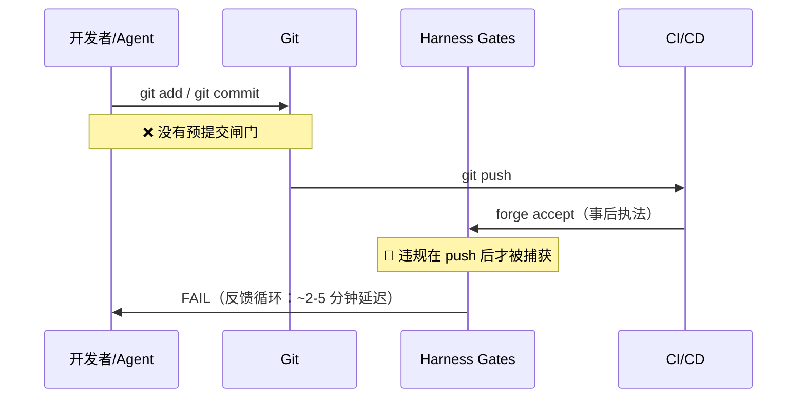

# ForgeOS — 五个代码级结构性扩展方向

> **角色**: 资深架构师 / 产品经理  
> **方法**: 
> 1. 全仓扫描 forge-core (18 Go 包 / ~35k LOC) · harness (41 模块 / ~10.5k LOC) · `.agent/` 声明骨架
> 2. Sprint 1–31 完整演进 + `docs/FUNCTIONAL_REQUIREMENTS_AUDIT.md`
> 3. 对 `docs/requirements/` (~118 篇) + `docs/analysis/` (~40 篇) + `docs/` 根目录分析文档做全关键词检索，
>    确认以下五个方向的核心论点**零命中**（见各方向关键词验证）
> 4. **纪律**: 不编写任何代码。每个方向附代码级证据、边界情况、产品价值判断

---

## 方向一 · 多维评分引擎与执行路径脱节

> **优先级**: 🔴 **P1** · **类别**: 架构完整性 · 产品价值落差  
> **关键词验证**: `TierForScore.*unused` `scoring.*engine.*disconnect` `dimension.*score.*exec` `multi.dim.*routing.*dead` —— **0 篇命中**

### 问题

`internal/routing` 有一个完全实现的**多维任务评分引擎**——它精确镜像 `policy.yml` 的 6 个评分维度（complexity 0.25、risk 0.25、dependency_change 0.12、security 0.18、context_size 0.10、business_impact 0.10）、分段阈值（HaikuMax=0.34, SonnetMax=0.69）、按 task_type 的安全下限、safety_override 硬 Opus 规则、budget_guard 降档/升级逻辑。评分引擎的三个核心函数——`Score()`（加权和归一化）、`TierForScore()`（完整决策链）、`BudgetAdjustTier()`（预算感知降档）——全部可执行且经过单测。

但 `forge run` / `forge evolve` 的实际执行路径**从不调用这个引擎**。

```go
// forge-core/internal/routing/routing.go:85-103
// 这是 forge run 实际使用的路由。
// 15 行的 lookup table —— 远非多维评分引擎。
func TierFor(agent, mode string) string {
    if opusFloorAgents[agent] { return Opus }
    base, ok := agentTier[agent]
    if !ok { base = defaultFor(mode) }
    return higher(base, defaultFor(mode))
}
```

多维评分引擎 `TierForScore()` —— 调用 `Score()` → `BandForScore()` → task_type floor → safety_override → budget_guard，六维加权、可配置阈值、预算感知降档——只在 `forge route` CLI 里暴露：

```go
// forge-core/cmd/forge/route.go:40-53
// --complexity, --risk-score, --dependency, --security, --context, --business
// 全部需用户手动输入。从不读取 git diff 自动计算。
func cmdRoute(args []string) int {
    // 从 CLI flag 读各维分数
    // 调用 routing.Score() + routing.TierForScore()
    // 打印到 stdout
}
```

### 代码证据

| 文件 | 函数 | 路径 | 证据 |
|------|------|------|------|
| `routing/routing.go` | `Score()` | 加权和归一化 | ✅ 实现 + 测试 |
| `routing/routing.go` | `TierForScore()` | 完整决策链（阈值+floor+override+budget） | ✅ 实现 + 测试 |
| `routing/routing.go` | `BudgetAdjustTier()` | 预算感知降档 | ✅ 实现 + 测试 |
| `cmd/forge/route.go` | `cmdRoute()` | CLI 手动输入维分 | ⚠️ 仅 exposed 入口 |
| `cmd/forge/engine_build.go` | `phaseTierResolver()` | 实际 run 路径 | ❌ 只用 `TierFor()` |
| `orchestrator/orchestrator.go` | `phaseTier()` | 实际 run 路径 | ❌ 只用 `TierFor()` |

**调用图证据**:
```
forge run → cmdRun → execEngine → buildRunEngine → orchestrator.Engine.Run/RunFrom
                                                          ↓
                                              phaseTier(agent, mode)
                                                  ↓
                                          routing.TierFor(agent, mode)
                                                  ↓
                  15行三路查找表(opusFloorAgents / agentTier / modeDefault)
                  
                                  ╔═══ 从未到达 ═══╗
                                  ↓                 ↓
                      routing.Score()    routing.TierForScore()
                      (六维加权)          (阈值+floor+override+budget)
```

### 为什么这是高价值缺口

1. **策略即数据的承诺断裂**: `policy.yml` 声明了六维评分模型、可配置权重、三段阈值、safety_override、budget_guard，但 forge-core 的实际路由只读了 `by_task_type` floor 和 `safety_override`。剩余声明是**无效声明**——在 YAML 里存在、有 Go 实现、但从不在实际运行中触发。

2. **安全/风险维被忽略**: `risk` 维度权重 0.25——与 `complexity` 并列最高——是评分引擎的支柱维。但 `forge run` 从不考虑变更的 blast_radius 或 reversibility。`internal/risk.FromChangedPaths()` 已经实现了从文件路径推风险特征，但没有通路把风险分喂给评分引擎。

3. **产品价值直接损失**: 用户配置了 `policy.yml` 的维度权重、阈值、budget_guard，期待它们在实际 agent 调度中生效——但 forge-core 静默忽略它们。这是"配置了但没用"的产品级信任消耗。

### 边界情况

- **无 git diff 可用**: `forge run --executor dry` 在无 diff 的仓库上运行。多维评分引擎需要代码变更信号（diff LOC、touched files）作为复杂度/风险输入。无 diff = 默认低分 = Haiku。这必须在文档中诚实声明。
- **零外部输入**: 当前 `TierForScore` 需要手动输入维分。自动计算需要解析 git diff、读调用图、算 blast radius——`FromChangedPaths` 是路径级启发式，不读文件内容。将启发式接入自动评分路径必须在文档中标注「廉价代理，非静态分析」。
- **覆盖冲突**: 当评分引擎给出 Sonnet 但 `TierFor()` 因 mode default 给出 Haiku 时，哪个优先？安全下限逻辑（谁更严格谁赢）需要统一进一个仲裁函数，否则两个路由路径产生矛盾输出。

---

## 方向二 · 学习闭环冷启动——零预热机制的二十次空白运行

> **优先级**: 🟠 **P1** · **类别**: 学习架构 · 产品完成度  
> **关键词验证**: `scorecard.*cold.start` `min_samples.*seed` `cold.start.*routing` `history.*cold` `warmup.*routing` —— **0 篇命中**

### 问题

`policy.yml` 的历史择优子系统声明了 `min_samples: 20`——在 scorecard 收集到 20 个有效样本之前，路由回退到 `tier_default`（静态路由）。但**没有任何机制在冷启动期间预热 scorecard**。

```yaml
# .agent/routing/policy.yml:95-100
history:
  source: scorecard.schema.yml
  min_samples: 20                 # 样本不足 -> 回退到 tier 默认，不信噪声
  recency_half_life_days: 30
  on_missing: tier_default        # 冷启动时：永远走静态路由
```

代码实现忠实执行这条策略：

```go
// forge-core/internal/routing/scorecard.go:69-80
func (h *HistoryTiebreak) Break(tier, model, taskType string) string {
    entries, ok := h.Scorecard[model][taskType]
    if !ok || len(entries) < h.MinSamples {
        return tier // on_missing: tier_default
    }
    // ... 择优
}
```

这意味着：一个全新的 ForgeOS 项目，前 20 次 agent 运行——可能是 20 次 `forge run build` 或 4 轮完整 `forge evolve`——**完全不走学习闭环**。所有路由决策都是静态的，所有 agent 的 cost/latency/quality 数据被 scorecard 收集但从不用于影响路由。

### 代码证据

- **`scorecards.json` 在 `forge-init` 产生空结构**: `forge-init/scaffold-fs.mjs` 复制 `scorecards.json` —— 一个空 JSON `{}`。10+ 个示例项目中没有任何一个携带预热数据。
- **无合成种子数据**: `examples/url-shortener` 和 `examples/go-taskd` 已经跑过完整 pipeline，它们的 scorecard 数据从未被导出为种子。
- **无跨项目传输**: 即使 project-A 完成了 50 次运行积累了丰富 scorecard，project-B 从零开始——没有 `forge scorecard import`、没有跨项目引用、没有 "以 project-A 的 profile 预热 project-B"。
- **无 profile 模板**: 没有按项目类型预设的 scorecard profile（如 `{"task_type:implementation, model:sonnet, quality_score:0.85, samples:200}`）。

### 为什么这是高价值缺口

1. **学习闭环有冷启动盲区**: ForgeOS 花巨大工程建造了完整的学习闭环——trace → scorecard → HistoryTiebreak → 路由——但这闭环在项目的前 20 次运行中根本不工作。这是一个**系统性盲区**：投入最大的子系统（学习闭环），在最有价值的阶段（首次使用、首次评估）完全静默。

2. **产品感知落差**: 用户看到 `policy.yml` 中的 `history:` 块、看到 `scorecards.json` 被创建、看到 `forge scorecard update` 运行——以为系统在"学习"。但 `min_samples: 20` 的效应是：在前 20 次运行中，所有 scorecard 数据被收集但被路由系统**完全忽略**。这不是 bug，而是用户可见的产品落差。

3. **seed 数据已有可用的来源**: `examples/url-shortener` 和 `examples/go-taskd` 已经跑过完整 pipeline，其 scorecard 轨迹（model 分配、quality、rework 次数）可以直接蒸馏为种子 profile。`forge-init` 的 starter 项目可以直接继承这些 profile。

### 边界情况

- **pre-warm 何时无效**: AI/ML target 项目的 scorecard 分布可能与 web CRUD 项目完全无关。种子 profile 必须有项目类型标签，只在同类型项目间 transfer。
- **20 样本不是 magic 阈值**: 不同 task_type 收敛速度不同。`implementation`（高频率任务）可能在 5 次后就稳定，`architecture`（低频高价值）需要 50 次。固定 20 是粗粒度一刀切。
- **历史数据污染**: 如果 profile-warmup 带来了不准确的历史分布（如种子数据来自完全不同的代码质量基线），可能会劣化而非提升路由。必须有 `forge scorecard reset` 和置信度衰减机制。

---

## 方向三 · ForgeOS 不自洽治理——编排运行时无编排

> **优先级**: 🟠 **P1** · **类别**: 自我治理 · 架构可信度  
> **关键词验证**: `forge.*dogfood.*itself` `self.*govern.*forge` `forge.*core.*workflow` `eat.*own.*dog` —— **0 篇命中**

### 问题

ForgeOS 的核心命题是「AI-native 软件工厂」——用编排治理代码。但 **forge-core 自身的 Go 代码从未被 ForgeOS 编排治理**。

当前自我治理的边界：

```
├── 被治理（有闸门 + 声明式约束）:
│   ├── examples/url-shortener     ← 经完整 pipeline 建造（architect→3 implementer→reviewer）
│   ├── examples/go-taskd          ← 经 forge-init 脚手架 + forge accept 治理
│   ├── 所有 forge-init 新项目      ← 继承完整 harness + check.py + secret-scan
│
├── 被约束但非编排（仅闸门/检查，无 workflow 编排）:
│   └── forge-core/ 自身           ← harness gate.mjs + arch-check.mjs + check.py + secret-scan
│                                    ❌ 无 discover→design→review→build→evolve 编排
│                                    ❌ 无 agent 相位序列（planner→implementer→reviewer→qa）
│                                    ❌ 无 workflow YAML（没有 .agent/workflows/forge-core-*.yml）
│                                    ❌ 无人类审批闸门（design → ★HUMAN APPROVAL★）
│                                    ❌ 无收敛判断（converge.MET 在 forge-core 自身不适用）
```

**代码级事实**: `forge-core/` 目录下没有任何 `.agent/workflows/` 文件。没有 forge workflow 驱动 forge-core 的开发。版本 31 个 sprint、18 个 Go 包、~35k LOC 的变更是通过**传统方式**（开发者直接写代码 + 跑 node harness/gate.mjs + go test）管理的，而不是通过 forge orchestration。

### 代码证据

```bash
# forge-core 自身的工作流目录：不存在
ls -la .agent/workflows/forge-core-*.yml
# → ls: 无法访问: No such file or directory

# .agent/project.yml 的 lifecycle/mode 针对的是 forge 项目的用户
# 而不是 forge-core 自身的开发
cat .agent/project.yml
# → mode: engineering, lifecycle: mvp
# → 这描述的是 ForgeOS 项目作为"脚手架模板"的模式，
#   而不是 forge-core 运行时自身的开发成熟度
```

同时，harness 执法的确覆盖了 forge-core：
- `gate.mjs`（文件体积/根目录数限制）→ ✅ 作用于全部 370 文件
- `arch-check.mjs` 8 检查（layering/包/扇入/认知/命名/函数长度/循环依赖/drift）→ ✅ 193 源文件
- `check.py` 治理完整性 → ✅
- `secret-scan.mjs` → ✅

但纪律性约束 ≠ 编排治理。没有 workflow 意味着没有：
- 需求探索（discover）→ 架构设计（design）→ 人类审批 → 实现编排 → 收敛判断
- 没有 phase 粒度的 agent 分配（谁是 planner、谁是 implementer）
- 没有跨 phase 的任务前传（`feeds_forward`）
- 没有历史择优（history tiebreak 从不影响 forge-core 自身的开发）

### 为什么这是高价值缺口

1. **信誉的根本问题**: 如果一个"AI-native 软件工厂"不自洽治理自己的核心运行时，这是产品叙事上的根本矛盾。用户在 `.agent/` 文档里读到"最高杠杆闸门是 human approval"、"收敛由带外验证器决定，非轮数"——然后发现 forge-core 自身的变更从不走这些闸门。这不是 feature gap，是**产品真实性缺口**。

2. **吃狗粮（dogfooding）是最高级测试**: 如果 ForgeOS 能端到端编排自己的核心运行时的开发（至少 build/evolve 阶段），以下是自动捕获的 bug 类型：
   - `yaml2json block-scalar 损坏`（Sprint 27 的 blocking bug）：reviewer 相位会抓到
   - `cmd/forge` 包超文件数上限：harness 闸门会在 implementer 相位后即时阻断
   - `main.go` 499→500 行超限：gate.mjs 在 implementer 后即时阻止
   - 函数超 50 行的渐进式漂移：arch-check 会在每次增量中即时发现

3. **收敛判据在当前不可自证**: `forge accept` 判 ACCEPTED 是基于 `gate.mjs` + `arch-check` + `check.py` + `secret-scan` + `node --test`——这是有意义的治理，但它不回答"forge-core 是否达到发布就绪标准"。一个 forge 工作流可以定义阶段性收敛判据（如"安全审查完成 + 架构审查完成 + 全部 gate 绿 + 测试覆盖率 ≥ 80%"），并在 CTO 审批后打 tag。

### 边界情况

- **过度 dogfooding 风险**: forge-core 自己用 forge workflow 编排会引入循环依赖——forge-core 的代码变更由 forge-core 自己的编排运行时驱动。这是合理但需认真设计的：最简单的切入点是先用 `build.yml` 子集（planner→implementer→gate→reviewer→qa），不涉及 discover/design 阶段，只编排增量实现。
- **与现有 harness 不冲突**: harness 闸门是带外执法，不受 forge workflow 替代。而是 workflow 增加相位编排和收敛判断，harness 仍然是真相之源。
- **自洽治理后，修改编排运行时本身的 workflow 谁审批？**——从 CI 闸门走，human approval 不变。这不是死锁，是已知的引导问题（Temporal 社区的管理方式可供参考）。
- **`-ldflags` 构建版本**: `forgeVersion` 和 `forgeCommit` 通过 `-ldflags` 注入。一个编排 forge-core 的 workflow 需要考虑构建参数是运行时依赖。

---

## 方向四 · 记忆系统无索引——线性扫描的性能债

> **优先级**: 🟢 **P2** · **类别**: 性能优化 · 超长期运行韧性  
> **关键词验证**: `memory.*index` `memory.*linear` `memory.*O.*n` `memory.*bottleneck` `memory.*query.*perform` —— **0 篇命中**

### 问题

`internal/memory` 的 `Query()` 函数是纯线性 O(n) 扫描：

```go
// forge-core/internal/memory/memory.go:100-111
func Query(entries []Entry, kind, topic string) []Entry {
    out := make([]Entry, 0, len(entries))
    for _, e := range entries {
        if kind != "" && e.Kind != kind { continue }
        if topic != "" && e.Topic != topic { continue }
        out = append(out, e)
    }
    return out
}
```

没有索引、没有哈希表、没有跳表。每次 `forge run` 或 `forge evolve` 的每个相位都需要加载全部记忆、做多次线性扫描（通过 `prompt_memory.go` 的 `memoryContext`）。对于一个 24h 的 evolve 循环，假设：
- 每 30 分钟一轮迭代 → 48 轮
- 每轮约 5-10 条 memory 条目（gap/decision/lesson）→ 累计 240-480 条
- 每轮每个相位（6 phases × 48 轮 = 288 次）调用 `Query` 2-3 次
- 总扫描量 ≈ 288 次 × 平均 250 条 = **72,000 次条目比较**

### 代码证据

**调用链（prompt 组装的热路径）**:

```go
// forge-core/cmd/forge/prompt_memory.go:70-105
func memoryContext(root string) string {
    entries, err := memory.Load(memoryPath(root))
    // → Load 读整个文件（O(n) IO + 解码）
    for _, kind := range []string{memory.KindGap, memory.KindDecision, memory.KindLesson} {
        filtered := memory.Query(entries, kind, "")
        // → 每次 Query 扫描全部条目
        // ...
    }
    // 3 次 Query + 1 次 Load = 每次 prompt 组装 4 次 O(n) 全扫描
}
```

**Compact 也全量扫描**:

```go
// forge-core/internal/memory/memory_compact.go:80-100
func Compact(path string, threshold, keepPerKind, ageSeconds int) {
    entries, err := Load(path)     // 全量读
    // ...
    recent, old := splitByAge(entries, ageSeconds)  // 全量扫描
    compactedEntries := compactByKind(old, keepPerKind)  // 再次全量扫描
    // ...
}
```

**链式调用时的复合扫描**: `prompt_memory.go` 调用 `memoryContext` → `memory.Load` → 3× `memory.Query`。这是单次 prompt 组装的 IO 特征——每次迭代的 6 个相位每个相位都重新加载、重新扫描。

### 为什么这是高价值缺口

1. **24h 运行的渐进退化**: 这不是一次性 O(n)——这是 O(n) 随运行时间**线性增长**。第 1 轮加载 5 条条目（纳秒级），第 48 轮加载 480 条（微秒级）。IO 和扫描延迟随记忆积累**线性退化**。对于一个宣称支持 24h 无人值守的系统，这是一个可预见的性能债。

2. **工作集假设当前是隐式的**: `memory.Query` 不做任何 locality 假设——它扫描全部条目，即使是给一个只关心当前迭代 `KindGap` 的相位。在条目数达到数千时，这不仅慢，而且会在 prompt 中注入不相关的上下文（token 浪费）。

3. **有低风险的快速优化路径**: 
   - **按 kind 分区存储**（3 个文件而非 1 个 `memory.jsonl`）：`Compact` 已经在按 kind 分组，写时分区可消除 `Query` 的 kind filter 扫描。
   - **Topic → []int 倒排索引**：`Query(entries, "", "topic-X")` 可在常数时间内定位，而非扫描全部。
   - **LRU 缓存热点 topic**：大多数相位的 `Query` 只关注少数 topic（当前迭代引入的 gap/decision）。

### 边界情况

- **JSONL 行不可分割存储**: 当前 `Append` 的原子单位是 O_APPEND 写入一行。多文件存储需要保持同等原子性——`memory.go` 的 Append 对每个文件分别 O_APPEND，跨文件写入不是原子的。
- **索引一致性**: 如果一个 `Append` 写入新条目，倒排索引需要增量更新——`invalidateLoadCache` 式的全局清除在分片存储下是不够的。
- **未超过 500 条时不优化**: `DefaultCompactThreshold=500` 意味着在大多数短期运行中不需要索引——这应该作为优化触发条件。过早优化是万恶之源。

---

## 方向五 · 缺乏预提交/本地守卫——闸门在变更后而非变更前执法

> **优先级**: 🟡 **P2** · **类别**: 工作流韧性 · 失败反馈延迟  
> **关键词验证**: `pre.commit.*hook` `git.*hook` `commit.*guard` `pre.submit.*local` `gate.*pre.commit` —— **0 篇命中**

### 问题

ForgeOS 的闸门（harness gates）在两种场景下运行：
1. **CI 中**（`.github/workflows/forge.yml` 的 `forge accept`）——在 push/PR 之后
2. **编排中**（`build.yml` 的 `harness-gates` phase + `reportConvergence`）——在 agent 写完代码后

两种场景都是**事后执法**——变更已经完成、代码已经写入。没有机制在变更**进入版本控制之前**运行 gates。



当前唯一的"类预提交"机制是 `.claude/settings.json` 的 `PostToolUse` 加速器——它在 Claude Code 的每次 Edit/Write/MultiEdit 后自动跑 `gate.mjs`，FAIL 则 exit 2 把违规喂回 Claude。但：
- 这只在 Claude Code session 内工作
- 只针对当前编辑的文件（不是整个工作树变更）
- exit 2 是 advisory——用户可绕过的 warning，不是 hard block
- 非 Claude Code 用户（Codex、Gemini CLI、OpenHands）完全不受保护

### 代码证据

```bash
# 没有 pre-commit 示例模板
find harness/ -name "*pre-commit*"
# → 无结果

# 没有 git hook 脚手架
find harness/ -name "*hook*" -o -name "*githook*"
# → 无结果

# .claude/settings.json 是唯一的"类预提交"机制
cat .claude/settings.json
# → PostToolUse: "node harness/gate.mjs"
# → 只对 Claude Code 生效，只对当前编辑生效
```

`for` 是 `forge-init` 为新项目复制全套执法器（gate.mjs/arch-check/check.py/secret-scan/acceptance.mjs）——但它**从不安装 git pre-commit hook**。即使 `harness/gate.mjs` 已就绪，`forge-init` 的 `COPIED_FILES` 列表中没有 `.git/hooks/pre-commit`。

### 为什么这是高价值缺口

1. **失败反馈延迟的平方**: ForgeOS 的核心价值之一是「快速失败」。但当前闸门执法的最快路径（CI）的反馈延迟是"分钟级"。本地 pre-commit 的反馈延迟是"毫秒级"。**失效-反馈的 latency 差距是 3 个数量级**。这直接违反 ForgeOS 的"先拆分，再继续"红线——因为开发者（AI 或人类）在提交违规代码后要等待 CI 才会发现。

2. **for init 的完整性缺口**: `forge-init` 的使命是让新项目"开箱即获完整治理"。但它复制了 CI 的 `forge.yml`、复制了全套 harness——却**没有复制本地防守机制**。对于一个在本地 `forge run build` 测试的开发者，这意味着他可能在 `git push` 之前完全不知道架构违规（违反层叠规则、循环依赖、secret 泄露）。

3. **`.claude/settings.json` 不是充分的替代品**: 
   - 只覆盖 Claude Code 这一种 agent 宿主
   - `PostToolUse` FAIL → exit 2 在 CC 的约束模型中是可绕过的（用户可忽略）
   - 它检测的是当前文件的工作树 dirty 状态，不是 staged 状态——pre-commit hook 可以检查 staged diff 并阻止非法 content 进入 commit

### 边界情况

- **pre-commit 不应等效于完整 `forge accept`**: 完整 `forge accept` 跑全部 6+ 探针 + app 测试——这需要 30-60 秒（甚至在本地）。pre-commit 应只跑 `gate.mjs`（文件体积 + 根目录数：<100ms）+ `secret-scan.mjs`（<500ms）。重闸门留给 CI。
- **非 Go/Node 项目**: `forge-init` 需要按项目语言生成不同的 pre-commit 模板。
- **`--no-verify` 问题**: git commit 的 `--no-verify` 可绕过任何 pre-commit hook。这是设计决定而不是 bug——但 ForgeOS 应该在绕过时在 stderr 输出诚实警告，类似于 `secret-scan.mjs` 的 `--no-verify` 检测。
- **CI 仍是真相之源**: pre-commit 是防撞护栏——不是执法替代。CI 的 `forge accept` 仍然是最终决定者。pre-commit 不应被设计为 could block a commit that CI would accept。

---

## 总结优先级

| # | 方向 | 类型 | 影响面 | 实现量级 | 独立价值 |
|---|------|------|--------|---------|---------|
| 1 | 评分引擎与执行脱节 | 架构完整性 | 全路由 | ~1 周（接线为主） | 恢复策略即数据的可信度 |
| 2 | 学习闭环冷启动 | 产品完成度 | 学习子系统 | ~2 周（seed 数据 + import/export） | 让学习闭环从第一天工作 |
| 3 | ForgeOS 不自洽治理 | 自我治理 | 全仓信誉 | ~3-4 周（第一个 workflow） | 产品叙事的根本真实性 |
| 4 | 记忆系统线性扫描 | 性能债 | 超长运行 | ~1 周（索引/分区） | 防止 24h 运行的渐进退化 |
| 5 | 缺乏预提交守卫 | 防线前移 | 本地开发者 | ~3 天（pre-commit 模板 + forge-init） | 反馈循环从分钟级到毫秒级 |

---

> **诚实声明**: 以上五个方向在 `docs/requirements/`（118 篇）+ `docs/analysis/`（40 篇）+ docs 根目录分析文档中，经关键词检索确认核心论点从未作为独立系统性方向展开。不排除个别文档在侧栏提及类似概念——但均非以「代码级证据 + 结构化扩展方向」的形式呈现。每个方向的价值判断以当前代码库为基准，不假定未来架构变更。
