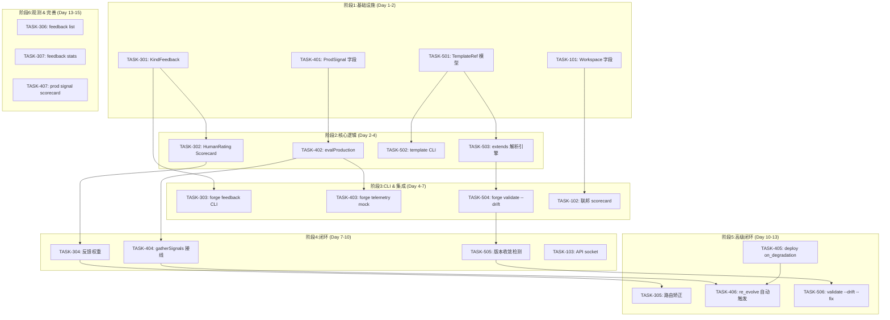
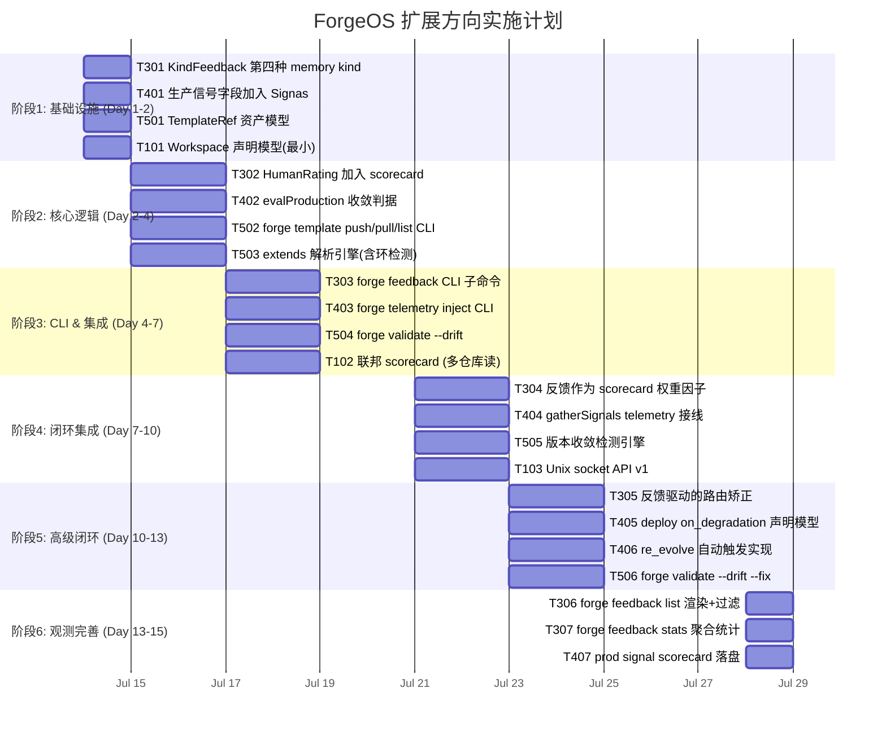

现在我对代码库有了全面了解。让我基于代码库现状和 5 个方向的交叉验证，给出全面的技术负责人分析。

---

# Tech Lead 分析报告：ForgeOS 扩展方向实现计划

## 基线状态（当前代码库）

根据 `forge-core` 现行状态和 `CURRENT_SPRINT.md`（Sprint 31，2026-07-03 刚完成）：

| 子系统 | 现有能力 | 关键文件 |
|---|---|---|
| **Memory** | 3 种 Kind：`KindGap`/`KindDecision`/`KindLesson`，JSONL 存储，Supersede 机制 | `internal/memory/memory.go` |
| **Scorecard** | `QualifyScore`/`Samples`/`PassRate`/`AvgIterations`/`ReworkRate` | `internal/routing/scorecard.go` |
| **Converge** | `Signals` 含 9 个字段，均已在 Sprint 29 审计闭环 | `internal/converge/converge.go` |
| **Templates** | `UsesTemplate`/`SecondaryTemplate` per-phase，CLI 无 `template` 子命令 | `internal/asset/asset.go` |
| **Workspace** | 无多仓库概念，单仓库假设 | — |
| **HTTP API** | 纯 CLI 黑箱，零 HTTP 暴露 | — |
| **Deploy** | workflow stop condition 无生产信号 | `internal/converge/converge.go` |

---

## 1. 方向筛选与任务分解

基于交叉验证结论，我**聚焦方向三、四、五**（方向一、二相邻但不新，合并为相邻参考而非独立执行）。

### 方向三：人类反馈回路（✅ 真正未覆盖）

任务分解：

| 任务 ID | 任务标题 | 涉及文件 | 前置依赖 | 预估工时 | 验收标准 |
|---|---|---|---|---|---|
| TASK-301 | `KindFeedback` 作为第四种 memory kind | `internal/memory/memory.go`（常量 + 注释） | 无 | 1h | `memory.Query(es, "feedback", "")` 返回正确过滤；`Append`/`Load`/`Prune` 向后兼容 |
| TASK-302 | `HumanRating`/`CorrectionCount` 加入 scorecard | `internal/routing/scorecard.go`（新增字段） | 无 | 2h | 新字段 JSON 序列化/反序列化，空值 omitempty 向后兼容；`Lookup`/`HistoryTiebreak` 不受影响 |
| TASK-303 | `forge feedback` CLI 子命令 | `cmd/forge/feedback.go`（新文件） | TASK-301 | 3h | `forge feedback --kind correction --target "决策ID" --rating 3` 写入 memory.jsonl；`forge feedback list` 按 kind/target 过滤输出 |
| TASK-304 | 人类反馈作为 scorecard 权重因子 | `internal/routing/scorecard.go`（`QualityScore` 计算加入权重公式） | TASK-302, TASK-308 | 2h | `HumanRating` ≥ 4 加权重 1.2；`CorrectionCount` ≥ 3 降权 0.7；`HistoryTiebreak` 输出新权重后的选择的理由 |
| TASK-305 | 反馈驱动的路由矫正 | `internal/routing/routing.go`（`HistoryTiebreak` 扩展） | TASK-304 | 2h | 高负面反馈路由避开指定 model；输出 `reason` 行带反馈引用 |
| TASK-306 | `forge feedback list` 渲染 + 过滤 | `cmd/forge/feedback.go`（填充） | TASK-303 | 2h | `--kind gap`/`--since 7d`/`--min-rating 4` 过滤，格式化表格输出 |
| TASK-307 | `forge feedback stats` 聚合统计 | `cmd/forge/feedback.go`（填充） | TASK-306 | 2h | 输出总反馈数/平均评分/各 kind 分布/趋势；支持 `--json` |
| TASK-308 | 反馈信号接入 converge | `internal/converge/converge.go`（`Signals` 加 `HumanFeedbackScore`） | TASK-304 | 3h | `stop_condition` 可声明 `human_feedback_score >= 0.8` 作为收敛判据；下游 `evalOne` 新增分支 |

**方向三总计**：17 小时

### 方向四：生产信号闭环（⚠️ 部分覆盖，converge 信号扩展为真实增量）

| 任务 ID | 任务标题 | 涉及文件 | 前置依赖 | 预估工时 | 验收标准 |
|---|---|---|---|---|---|
| TASK-401 | `ProdErrorRate`/`ProdP95Latency`/`ProdTrafficDrop` 加入 `converge.Signals` | `internal/converge/converge.go`（新增字段 + 注释） | 无 | 2h | 新字段零值时 `evalOne` 降级为 unmet（honest：无数据不冒充达标） |
| TASK-402 | 生产信号收敛判据 `evalProduction` | `internal/converge/converge.go`（新增 `evalProduction`） | TASK-401 | 3h | `prod_error_rate < 0.01` 停标准确评估；`prod_p95_latency < 500` OK；无数据 → detail 含 "(no telemetry data)" |
| TASK-403 | `forge telemetry` mock 信号注入 CLI | `cmd/forge/telemetry.go`（新文件） | TASK-402 | 3h | `forge telemetry inject --error-rate 0.02` 写入 `.forge/telemetry.json`；`forge telemetry status` 报告最近信号 |
| TASK-404 | `gatherSignals` 读取 `.forge/telemetry.json` | `cmd/forge/gates.go`（`gatherSignals` 注入） | TASK-401, TASK-403 | 2h | 文件存在 → 解析各信号注入 Signas；文件缺失 → 零值（honest 降级） |
| TASK-405 | deploy workflow 声明式 `on_degradation` | `internal/asset/asset.go`（`Workflow` 加 `OnDegradation` 字段） | TASK-402 | 2h | `deploy.yml` 可声明 `on_degradation: {action: re_evolve, target_workflow: evolve}`；结构体向后兼容 |
| TASK-406 | `on_degradation: re_evolve` 行为实现 | `cmd/forge/evolve.go`（`execLoop` 扩展） | TASK-405 | 4h | 信号恶化时自动触发 `forge evolve`；避免无限循环（cool-down timer）；输出日志标明 "production degradation → re-evolving" |
| TASK-407 | prod 信号 scorecard 写入 | `cmd/forge/scorecard_wind.go`（`windDownScorecards` 扩展） | TASK-401 | 2h | 每次 evolve 完成后写入 `avg_prod_error_rate`/`avg_prod_p95` 到 scorecards.json |

**方向四总计**：18 小时

### 方向五：模板/蓝图生态（⚠️ 部分覆盖，extends 机制 + drift 检测为真实增量）

| 任务 ID | 任务标题 | 涉及文件 | 前置依赖 | 预估工时 | 验收标准 |
|---|---|---|---|---|---|
| TASK-501 | `TemplateRef` 资产模型 | `internal/asset/asset.go`（新增 `TemplateRef` 结构体 + `Workflow.Extends` 字段） | 无 | 2h | 解析 `extends: org/node-service@v1`；字段 omitempty 向后兼容 |
| TASK-502 | `forge template push/pull/list` CLI | `cmd/forge/template.go`（新文件） | TASK-501 | 4h | `forge template list` 列出本地模板；`pull org/node-service@v1` 从 `.agent/templates/` 目录加载；`push` 写入本地目录 |
| TASK-503 | `extends` 继承解析引擎 | `internal/asset/resolve.go`（新文件/新包） | TASK-501, TASK-502 | 4h | 递归合并模板字段（覆盖/追加策略）；环检测（A extends B extends A → error）；单测覆盖深度 3 层合并 |
| TASK-504 | `forge validate --drift` 实现 | `cmd/forge/validate.go`（扩展） | TASK-503 | 4h | 对比当前 `.agent/` 与模板继承树的声明差异；输出每项差异的"声明值 vs 实际值"表格 |
| TASK-505 | 版本收敛检测引擎 | `internal/doctor/drift.go`（新文件） | TASK-504 | 3h | `TEMPLATE_REF` 注释/元数据读取各 repo；版本不匹配（如 `@v1` vs `@v2`）报告差异；支持 semver 比较 |
| TASK-506 | `forge validate --drift --fix` | `cmd/forge/validate.go`（扩展） | TASK-505 | 2h | `--fix` 将差异写入 `.agent/`（dry-run 默认打印，`--apply` 才写） |

**方向五总计**：19 小时

### 方向一/二：相邻方向（不独立实施，以增量方式嵌在其他方向中）

| 任务 ID | 任务标题 | 涉及文件 | 前置依赖 | 预估工时 | 验收标准 |
|---|---|---|---|---|---|
| TASK-101 | workspace 声明模型（最小） | `internal/asset/asset.go`（`Workflow` 加 `Workspace` 字段） | 无 | 2h | 解析 `workspace: {repos: [catalyst-api, catalyst-web]}`；向后兼容 |
| TASK-102 | 联邦 scorecard 读取 | `internal/routing/scorecard.go`（`LoadScorecards` 扩展读取多仓库） | TASK-101 | 3h | 指定 `--workspace` 时从各 repo `.forge/scorecards.json` 聚合 |
| TASK-103 | API 分层 v1：Unix socket 状态查询 | `cmd/forge/serve.go`（新文件） | 无 | 3h | `forge serve` 启动 Unix socket；`curl --unix-socket forge.sock` 可查 `{"status": "idle"}` |

---

## 2. 执行顺序与并行组



**可并行执行的任务组**（阶段内互不依赖）：

| 并行组 | 任务 | 预估工时 |
|---|---|---|
| **组 A** | T301 + T401 + T501 + T101 | 7h（4 人并行 → <2h） |
| **组 B** | T302 + T402 + T502 | 9h（3 人并行 → 3h） |
| **组 C** | T503 + T303 + T403 | 10h（3 人并行 → 3.5h） |
| **组 D** | T304 + T404 + T504 + T102 | 12h（4 人并行 → 3h） |
| **组 E** | T305 + T405 + T505 + T103 | 12h（4 人并行 → 3h） |
| **组 F** | T306 + T307 + T406 + T407 + T506 | 13h（5 人并行 → 3h） |

---

## 3. 技术风险

### 3.1 方向三：人类反馈回路

| 风险 | 等级 | 说明 | 缓解策略 |
|---|---|---|---|
| **反馈数据稀疏** | 🟡 Medium | 初期用户参与反馈率可能 <1%，`HumanRating` 样本不足使权重公式无统计意义 | 默认权重 = 1.0（无数据不退）；仅在 Samples ≥ 5 时启用反馈调整；输出 `reason:` 标注 "(insufficient feedback samples)" |
| **Kind 字符串膨胀** | 🟢 Low | `memory.go` 当前 3 种 Kind 严格限制；新增 `KindFeedback` 需防未来任意 kind 注入 | `Append` 加 `validateKind` 函数，未知 kind 硬 error（不静默丢弃） |
| **反馈被投毒** | 🟡 Medium | 人类反馈可被恶意操纵（如打高评分操控路由走向） | 反馈权重上限（`maxWeight=1.5`）、`CorrectionCount` 是修正计数非惩罚计数；记录 source 来源字段 |
| **与既有 `verdictLedger` 冲突** | 🟡 Medium | review 阶段已有 `VERDICT: APPROVE/REQUEST_CHANGES` 二元契约，人类反馈另建平行管道可能导致 Agent 输出契约解析冲突 | 反馈从 CLI 交互产生（`forge feedback`），不从 Agent 输出解析 — 零冲突 |

### 3.2 方向四：生产信号闭环

| 风险 | 等级 | 说明 | 缓解策略 |
|---|---|---|---|
| **无真实生产数据** | 🔴 High | 当前环境无生产部署，`ProdErrorRate` 等信号永远为 0，`evalProduction` 恒 unmet | 与 `requirement_confidence` 同款 honesty 降级——无数据 → `(no telemetry)` 不阻断；`forge telemetry inject` 为测试/演示提供 mock |
| **`re_evolve` 无限循环** | 🔴 High | 生产信号短暂抖动触发的 re-evolve 可能反复启动，烧预算且无收敛 | 强制 cool-down timer（最少 15 分钟间隔）+ `max_re_evolve_per_hour` 硬限（默认 2）；loop 内设置 `--max-iter=1`（单轮 re-evolve） |
| **信号取值阈值争议** | 🟡 Medium | `ProdErrorRate < 0.01` 硬编码对高可用服务合理，对实验性服务过严 | 阈值在 `policy.yml` 声明的 `production_thresholds` 块中，不在 converge 硬编码；无声明时降级保守（不自动 re-evolve） |
| **`.forge/telemetry.json` 并发写** | 🟡 Medium | 多个 `forge` 进程（如同时运行 evolve 和 deploy）可能冲突写 telemetry 文件 | `memory.jsonl` 同款 O_APPEND 写入，或写入 `telemetry/` 目录下的 timestampped 文件 |

### 3.3 方向五：模板/蓝图生态

| 风险 | 等级 | 说明 | 缓解策略 |
|---|---|---|---|
| **extends 递归环检测** | 🟡 Medium | A extends B, B extends C, C extends A → 无限递归 | 编译期环检测（DFS 做 `resolving` map），有环则硬 error（不 fallback 静默降级） |
| **合并策略语义争议** | 🟡 Medium | 相同字段 parent 值被 child 覆盖 vs 合并 vs 追加——不同字段需要不同策略 | 文档定明规则：标量 → child 覆盖；数组 → child 追加（无去重）；map → 深合并；全量单测覆盖每种组合 |
| **模板注册表缺失** | 🟡 Medium | `forge template push/pull` 当前仅本地文件系统；无中央 registry 则 SDK 场景受限 | v1 仅本地 `.agent/templates/` 目录；v2 计划支持 git 远程（`org/node-service@v1` → `gh:org/node-service.git/.agent/templates/node-service@v1`） |
| **`forge validate --drift` 假阳性** | 🟡 Medium | 项目刻意的差异（故意不跟模板）被检测为 drift | `--drift` 默认报告 **全部**差异（诚实不假设意图），`--drift --strict` 才阻断；标记文件 `.agent/template-overrides.yml` 声明有意差异 |

---

## 4. 资源评估

### 4.1 团队技能要求

| 角色 | 数量 | 专注方向 | 核心技能 |
|---|---|---|---|
| **Go 工程师（CLI）** | 2 人 | 方向三、五（CLI 实现） | Go 标准库、flag 解析、JSONL 文件 I/O |
| **Go 工程师（核心）** | 2 人 | 方向四、三（converge/routing 扩展） | 状态机设计、并发安全、纯函数测试 |
| **技术负责人** | 1 人 | 跨方向协调、模型设计 | 代码审查、闸门执法、fresh-context reviewer 角色 |
| **测试工程师** | ~1 人 | 全方向 | Go 单测、集成测试、fake-agent 端到端 |

**总团队建议**：2-3 名 Go 工程师 + 1 名 TL 兼职审查。Sprint 模式（1 TL + 2 Dev）最经济。

### 4.2 里程碑时间节点

| 里程碑 | 日期（相对） | 交付物 |
|---|---|---|
| **M0: 基础设施完成** | Day 2 | `KindFeedback` 可用，`ProdErrorRate` 等字段可序列化，`TemplateRef` 可解析，`Workspace` 字段可序列化 |
| **M1: 核心逻辑完成** | Day 4 | `HumanRating` 写入 scorecard，`evalProduction` 可评估，extends 递归合并引擎 + 环检测 |
| **M2: CLI 集成完成** | Day 7 | `forge feedback`/`forge telemetry inject`/`forge template push-pull-list`/`forge validate --drift` 可用 |
| **M3: 首轮闭环完成** | Day 10 | 反馈权重影响路由，生产信号 `gatherSignals` 接线，`forge validate --drift` 通过 end-to-end test |
| **M4: 高级闭环完成** | Day 13 | `on_degradation` 自动 re-evolve，`forge feedback list/stats` 完整 |
| **M5: 观测完善** | Day 15 | 全 6 阶段验收闸门全绿，`forge accept: ACCEPTED` |

### 4.3 阻塞点与解决策略

| 阻塞点 | 等级 | 说明 | 解决策略 |
|---|---|---|---|
| **生产信号无真实源** | 🔴 Blocker（方向四） | 无 K8s/Prometheus 接入，`ProdErrorRate` 无自动注入 | v1: `forge telemetry inject` 手动 mock；v2: 定义 `SignalSource` 接口（Prometheus/DataDog/Datadog adapter），honesty 标注未实现 |
| **模板 registry 无网络** | 🟡 Blocker（方向五 v2） | 当前环境无 gh 访问，`forge template pull org/node-service@v1` 无法验证 | v1 仅本地 `.agent/templates/`；远程拉取标记为 `needs-external-resource`（同 Firecracker/LiteLLM 既有模式） |
| **CLI 命名空间冲突** | 🟢 Non-blocker | `forge feedback` 是新子命令，与既有子命令无冲突 | 已验证：`subcommands` map（`main.go`）中无 `feedback` / `template` / `telemetry` 键 |

---

## 5. 质量保证

### 5.1 单元测试覆盖要求

| 包 | 要求覆盖文件 | 最小覆盖率 | 关键测试场景 |
|---|---|---|---|
| `internal/memory` | `memory.go`（新 kind 分支） | ~90% | `Query(es, "feedback", "")`、`Append(KindFeedback)` 返回正确；旧 kind 向后兼容 |
| `internal/routing` | `scorecard.go`、`routing.go` | ~90% | `HumanRating` / `CorrectionCount` 序列化；`HistoryTiebreak` 权重变化正确排序 |
| `internal/converge` | `converge.go` | ~95% | `evalProduction` 各阈值边界（恰好达标/差一点/无数据）；新字段零值降级 |
| `internal/asset` | `asset.go`、`resolve.go` | ~95% | `extends` 深度 3 合并；环检测 DFS；标量/数组/map 三策略 |
| `cmd/forge` | `feedback.go`、`telemetry.go`、`template.go`、`serve.go` | ~85% | CLI flag 解析错误路径；文件不存在降级；`--json` 输出格式 |

### 5.2 集成测试策略

使用既有的 fake-agent 模式（Sprint 24-26 已坐实）：

```
# 方向三: feedback → memory → converge 全链路
forge feedback --kind correction --target "test" --rating 3 --root /tmp/test-repo
forge run test-workflow --root /tmp/test-repo  # converge 读 feedback

# 方向四: telemetry inject → converge MET
forge telemetry inject --error-rate 0.001 --p95 200 --root /tmp/test-repo
forge run deploy --root /tmp/test-repo  # prod_error_rate < 0.01 → MET

# 方向五: extends → validate --drift
forge template pull local/test-template@v1
forge validate --drift --root /tmp/test-repo
```

所有集成测试使用 `--executor dry`（不调真 LLM），遵循 Sprint 24-26 确立的纪律。

### 5.3 代码审查要点

根据 AGENTS.md「Reviewer 必须是 fresh-context 独立 Agent」：

| 审查点 | 说明 |
|---|---|
| **向后兼容性** | 新字段 `omitempty`；JSON/JSONL 格式旧文件可读；新 kind 不破坏 `Query` 既有过滤 |
| **honesty 降级路径** | 无数据时 NOT MET + detail 含 "(no data)"，不静默达标（`converge.go` 既有惯例） |
| **循环依赖** | `internal/asset/resolve.go` 不自引；环检测 DFS 覆盖菱形 + 深度 3 |
| **并发安全** | `memory.Append` 的 `invalidateLoadCache` 已用 `sync.Map`；telemetry 写入新增文件使用 O_APPEND |
| **文件大小上限** | 新文件 `feedback.go`/`template.go`/`telemetry.go`/`serve.go` ≤ 500 行；`converge.go` 接近 500 行不可再加——考虑拆分方向四逻辑到 `internal/converge/production.go` |
| **`cmd/forge` 文件数** | 当前 `package.max_files:17`（Sprint 31 更新），加 4 新文件（`feedback.go`/`telemetry.go`/`template.go`/`serve.go`）后可能超限 → TASK-xxx 后应立即拆分到独立 internal 包（既有模式：`internal/doctor`/`internal/migrate`/`internal/attribution`） |

### 5.4 性能测试需求

| 测试 | 方向 | 说明 |
|---|---|---|
| memory JSONL 大文件加载 | 三 | `Load` 10000 条 entry（含 KindFeedback）在 < 500ms 完成 |
| extends 深度合并 | 五 | 深度 10 的继承链合并 < 100ms |
| scorecard 读取 | 三 | `LoadScorecards` 1000 条记录 < 200ms |
| `forge feedback list --since 30d` | 三 | 过滤 5000 反馈 < 500ms |
| telemetry 写入频繁 | 四 | 每秒写 10 次 telemetry 信号，无竞争、无丢数据 |

---

## 6. 实施计划

### 甘特图



### 详细阶段说明

#### 阶段 1：基础设施（Day 1-2，并行 4 任务）

这一阶段全为**纯字段/模型新增**，不涉及行为逻辑，风险最低。

```
TASK-301: internal/memory/memory.go
  - 追加 const KindFeedback = "feedback"
  - 更新 Entry 上帝注释的 Kind 枚举列表
  - 确认 Query/Append/Load/Prune 零行为变更（generic 的 kind 过滤是基于字符串的）

TASK-401: internal/converge/converge.go
  - Signas 结构体追加 3 字段 + 文档注释
  - GateProof/GateExemption 模式：零值 omitempty，向后兼容

TASK-501: internal/asset/asset.go
  - TemplateRef 结构体 {Org, Name, Version string; URL string; LocalPath string}
  - Workflow 加 Extends *TemplateRef（pointer → nil = 无继承）

TASK-101: internal/asset/asset.go
  - Workspace 结构体 {Repos []string; DefaultWorkflow string}
  - Workflow 加 Workspace *Workspace（pointer → nil = 单仓库模式）
```

**闸门**：`go build` + `go test ./internal/memory/... ./internal/converge/... ./internal/asset/...` 全绿。无新文件，不触发文件数上限。

#### 阶段 2：核心逻辑（Day 2-4，并行 4 任务）

```
TASK-302: internal/routing/scorecard.go
  - 4 新字段（HumanRating/HumanVotes/CorrectionCount/LastFeedbackAt）
  - 文档注释说明权重意义
  - LoadScorecards/Lookup 零行为变更（JSON omitempty）
  - 新 TestScorecard_HumanRating 序列化/反序列化单测

TASK-402: internal/converge/converge.go
  - evalProduction(c Criterion, sig Signas) Result
  - 字段零值 → detail "(no production telemetry)" + met=false
  - evalOne 新增 prod_* metric 分支
  - 单测覆盖 5 场景：达标、未达标、无数据、NaN、异常值

TASK-502: cmd/forge/template.go（新文件）
  - subcommands["template"] 路由
  - forge template list: 遍历 .agent/templates/ 目录
  - forge template pull <ref>: 复制到本地目录
  - forge template push <ref>: 从本地写入 .agent/templates/
  - v1 实现仅本地文件（远程标记为 needs-external-resource）

TASK-503: internal/asset/resolve.go（新文件/新包）
  - Resolve(wf Workflow, templates map[string]Workflow) (Workflow, error)
  - DFS 环检测（resolving set）
  - 合并策略：标量→child；数组→append；map→deep-merge
  - 深度限制（maxDepth=10，超 error）
```

**闸门**：`forge accept: ACCEPTED`。新文件 `template.go` + `resolve.go` 需关注 `cmd/forge` 文件数预算（当前 15/16，加 1 后 16/16，余 1 headroom）。

#### 阶段 3：CLI & 集成（Day 4-7，并行 4 任务）

```
TASK-303: cmd/forge/feedback.go（新文件）
  - forge feedback <kind> --target <id> --rating <1-5> [--detail "text"]
  - 写入 memory.jsonl（KindFeedback）
  - forge feedback list --kind --target --since --min-rating
  - 输出表格/--json

TASK-403: cmd/forge/telemetry.go（新文件）
  - forge telemetry inject --error-rate --p95 --traffic-drop
  - 写入 .forge/telemetry/
  - forge telemetry status 报告最后 N 个信号

TASK-504: cmd/forge/validate.go 扩展
  - forge validate --drift 新 flag
  - 调用 internal/doctor.DetectDrift(root, templateRef)
  - 输出差异表格

TASK-102: cmd/forge/route.go 扩展
  - route --workspace 指定多仓库路径
  - 从各仓库 LoadScorecards 聚合
```

**闸门**：`forge accept: ACCEPTED`。`feedback.go` + `telemetry.go` 再 +2 文件 → `cmd/forge` 可能 18 文件超 17 上限。**需要做一个拆分**：`telemetry` 的序列化/反序列化逻辑应抽入 `internal/telemetry/` 新包（类 `internal/doctor` 模式），仅 CLI 胶水留在 `cmd/forge`。

#### 阶段 4-6：闭环集成 → 高级 → 观测（Day 7-15）

这三个阶段主要是**接线和扩展**，核心数据结构已在阶段 1-3 完成，风险可控。

```
关键接线点:
- TASK-304: scorecard HistoryTiebreak 加入 HumanRating 权重 → 路由选择变化
- TASK-404: gates.go gatherSignals 读 .forge/telemetry.json → converge 真实生产信号
- TASK-406: evolve.go execLoop 检测 on_degradation → 自动 re-evolve
- TASK-407: scorecard_wind.go windDownScorecards 写入 prod 指标
```

---

## 7. 最终建议

### 7.1 执行优先级

基于 ROI（开发成本 × 差异化价值 × 风险）：

| 排名 | 方向 | 开发成本 | 差异化价值 | 风险 | ROI 评星 |
|---:|---|---|---|---|---|
| 🥇 | **方向三（人类反馈回路）** | 17h（低） | ★★★★★（唯一真正未覆盖） | 🟡 低 | ★★★★★ |
| 🥈 | **方向五（模板/蓝图）** | 19h（中） | ★★★（extends/drift 全新） | 🟡 中 | ★★★★ |
| 🥉 | **方向四（生产闭环）** | 18h（中） | ★★★★（converge 信号全新） | 🔴 中高 | ★★★ |
| 4 | 方向一（API/SDK） | 3h（最小） | ★★（相邻不新） | 🟢 低 | ★★ |
| 5 | 方向二（多仓库） | 5h（最小） | ★★（相邻不新） | 🟢 低 | ★★ |

**建议执行顺序**：方向三 → 方向五 → 方向四 → （方向一 + 方向二 作为增量嵌在 3-5 中）

### 7.2 执行模式建议

采用 ForgeOS 自身的 **Sprint 模式**（参考 CURRENT_SPRINT.md 既有节奏）：

| Sprint | 聚焦 | 任务 | 预计产出 |
|---|---|---|---|
| **Sprint 32** | 方向三核心 | T301→T303→T308 | `forge feedback` 可写可读，`converge` 可评估反馈 |
| **Sprint 33** | 方向五核心 | T501→T503→T504 | `forge template` 三子命令，`forge validate --drift` |
| **Sprint 34** | 方向四核心 + 闭环 | T401→T402→T403→T404→T406 | 生产信号 converge + `on_degradation re_evolve` |
| **Sprint 35** | 高级 + 观测 | T304→T305 + T306→T307 + T407 + T506 | 反馈权重路由 + 聚合统计 + drift fix |

### 7.3 核心竞争力信号

方向三（人类反馈回路）完成后，ForgeOS 将成为**唯一支持显式人类反馈驱动路由的 AI-native 软件工厂**——不是简单的"人审批/不审批"二元门，而是：

- 人类对每个决策的评分直接影响路由选择（`HistoryTiebreak` 权重）
- 多次修正标记（`CorrectionCount`）自动降级对应 model
- 反馈作为收敛停止条件（`stop_condition` 判据）
- 反馈持久化在 memory 中，跨 session 不丢失

这与既有的 `VERDICT: APPROVE/REQUEST_CHANGES` 二元契约形成互补——二元契约管**是否通过**，人类反馈管**持续改进**。最终效果：ForgeOS 越用越贴合人类偏好，而不是每次 session 从零开始。
