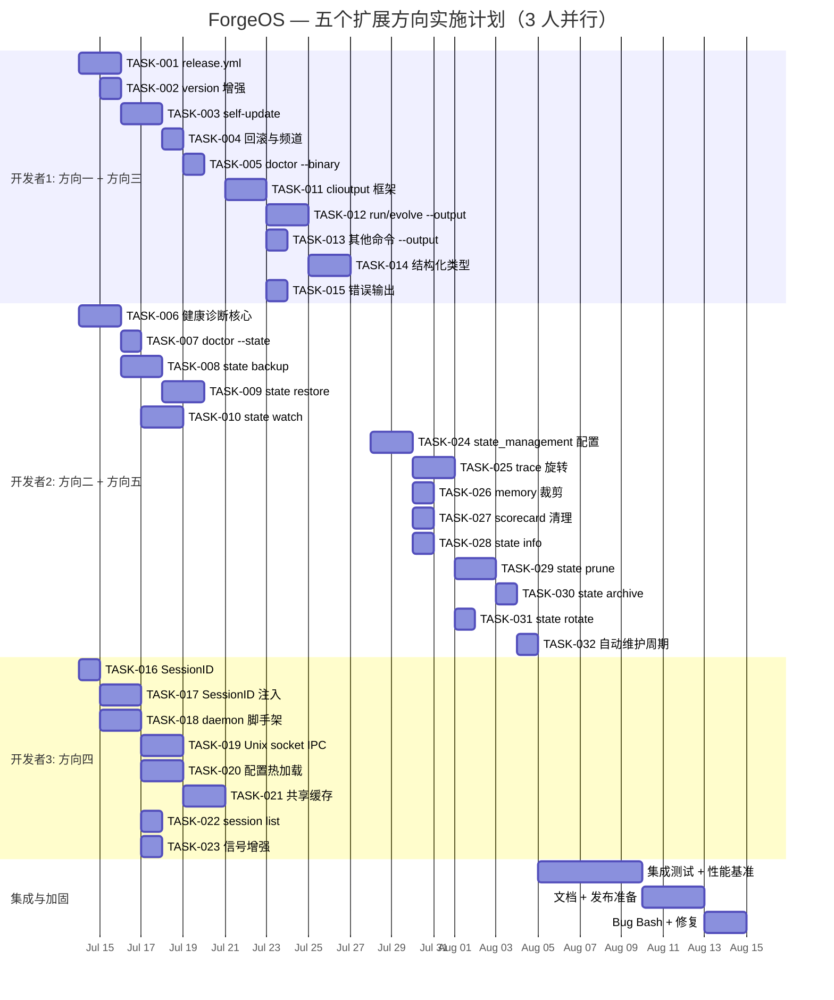

我已完整阅读这份 1022 行的分析文档。以下从 Tech Lead 角度进行系统性分析。

---

# Tech Lead 分析报告：ForgeOS 五个高价值扩展方向

## 1. 任务分解

将 5 个方向按层次拆解为 **32 个可执行任务**，每个任务 2-4 小时。

### 1.1 方向一：forge-core 二进制分发与生命周期管理

| 任务 ID | 任务标题 | 涉及文件 | 前置 | 工时 | 验收标准 |
|---------|----------|----------|------|------|----------|
| **TASK-001** | 实现 GitHub Actions release workflow | `.github/workflows/release.yml`（新） | 无 | 3h | tag v* 触发构建 linux/amd64 + darwin/amd64 + darwin/arm64；注入 `forgeVersion`/`forgeCommit`/`forgeBuildTime`；strip debug info；上传 artifact + sha256sum |
| **TASK-002** | 增强 `forge version` 输出 | `forge-core/cmd/forge/main.go` | 无 | 2h | 输出完整版本信息（版本、commit、构建时间、平台、go 版本）；显示最新可用版本（网络检查，静默降级） |
| **TASK-003** | 实现 `forge self-update` 子命令 | 新文件 `forge-core/cmd/forge/self_update.go` | TASK-001 | 4h | 从 GitHub Releases API 查询最新版本；下载匹配平台二进制；sha256sum 校验；原子替换（`forge.new` → rename） |
| **TASK-004** | 实现 `forge self-update` 回滚与频道支持 | `forge-core/cmd/forge/self_update.go` | TASK-003 | 2h | `--channel=stable\|beta` 频道选择；`--version=v2.4.0` 指定版本降级；更新前后保留 `~/.forge/bin/forge.prev` 用于手动回滚 |
| **TASK-005** | 实现 `forge doctor --binary` | `forge-core/internal/doctor/doctor.go` | TASK-001, TASK-002 | 2h | 报告二进制版本/构建/签名/完整性/最新版本；输出格式支持 `--json` |

### 1.2 方向二：状态目录健壮性与灾难恢复

| 任务 ID | 任务标题 | 涉及文件 | 前置 | 工时 | 验收标准 |
|---------|----------|----------|------|------|----------|
| **TASK-006** | 实现 `.forge/` 目录健康诊断核心逻辑 | 新文件 `forge-core/internal/state/health.go` | 无 | 4h | 诊断 checkpoint（JSON 解析+ schema 校验）；诊断 trace.jsonl（逐行 JSON + seq 连续性）；诊断 memory.jsonl（逐行 JSON + topic 检测）；诊断 scorecard 目录（文件数+大小） |
| **TASK-007** | 集成 `forge doctor --state` | `forge-core/internal/doctor/doctor.go` | TASK-006 | 2h | 输出方向二文档中所述的健康报告表格；支持 `--output json`；在 doctor 主命令中新增 `--state` 标志 |
| **TASK-008** | 实现 `forge state backup` | 新文件 `forge-core/cmd/forge/state_backup.go` | TASK-006 | 3h | 全量打包 `.forge/` 为 `.tar.zst`；生成 sha256sum；支持 `--output` 指定路径；备份前 flush checkpoint |
| **TASK-009** | 实现 `forge state restore` | 新文件 `forge-core/cmd/forge/state_restore.go` | TASK-008 | 3h | 校验备份 sha256sum；`--dry-run` 预览模式；`--backup-current` 恢复前自动备份当前状态；解压后校验恢复完整性 |
| **TASK-010** | 实现 `forge state watch` 周期性完整性检查 | 新文件 `forge-core/cmd/forge/state_watch.go` | TASK-006, TASK-007 | 4h | 每 N 秒循环检查目录健康；发现损坏行自动修复（删除损坏行并记录日志）；`--alert-hook` 可配置告警命令；输出时间戳日志 |

### 1.3 方向三：统一结构化输出协议

| 任务 ID | 任务标题 | 涉及文件 | 前置 | 工时 | 验收标准 |
|---------|----------|----------|------|------|----------|
| **TASK-011** | 实现 `internal/clioutput` 基础框架 | 新目录 `forge-core/internal/clioutput/` | 无 | 3h | `OutputMode` 枚举（Text/JSON/JSONCompact）；`ResultWriter` 接口；默认 text 模式；JSON 模式输出 `{"status":"ok","data":...}`；所有命令共享同一 writer |
| **TASK-012** | `forge run` / `forge evolve` 支持 `--output json` | `forge-core/cmd/forge/{run,evolve}.go` | TASK-011 | 3h | `--output text\|json` 标志；文本模式 100% 向后兼容；JSON 模式输出 RunResult/EvolveResult 结构 |
| **TASK-013** | 其余命令支持 `--output json` | `forge-core/cmd/forge/{status,validate,route}.go` | TASK-011 | 2h | status/validate/route 支持 `--output json`；`--json` 作为 `--output json` 的别名兼容旧脚本 |
| **TASK-014** | 实现结构化结果类型 | 新文件 `forge-core/internal/clioutput/types.go` | TASK-011, TASK-012 | 3h | 定义 `RunResult`/`EvolveResult`/`DoctorResult`；包含收敛状态/迭代/耗时/成本/错误码字段；时间戳和 forge 版本元数据 |
| **TASK-015** | 实现标准化错误输出 | 新文件 `forge-core/internal/clioutput/errors.go` | TASK-011 | 2h | 错误码分类表（E_WF\_\* / E_GATE\_\* / E_BUDGET\_\* / E_ORCH\_\* / E_CFG\_\* / E_SYS\_\*）；JSON 模式输出 `{"error":true,"error_code":"...","message":"..."}`；文本模式保持当前行为 |

### 1.4 方向四：多会话运行时协调与热加载

| 任务 ID | 任务标题 | 涉及文件 | 前置 | 工时 | 验收标准 |
|---------|----------|----------|------|------|----------|
| **TASK-016** | 实现 SessionID 类型与生成 | 新文件 `forge-core/internal/session/session.go` | 无 | 2h | UUID v7 生成；包含 command/workflow/mode/start_time/branch；`String()`/`MarshalJSON()`/`UnmarshalJSON()` |
| **TASK-017** | SessionID 注入 trace/checkpoint/memory/scorecard | `forge-core/internal/trace/`, `forge-core/internal/persist/checkpoint.go`, `forge-core/internal/memory/` | TASK-016 | 3h | 每个 trace event 携带 SessionID；checkpoint 新增 SessionID + ParentSessionID；memory event 新增 SessionID；scorecard 文件头新增 SessionID |
| **TASK-018** | 实现 `forge daemon` 脚手架（start/stop/status/logs） | 新目录 `forge-core/cmd/forge/daemon/` | 无 | 4h | `forge daemon start` 启动守护进程（pid 文件 + Unix socket）；`forge daemon stop` 优雅关闭；`forge daemon status` 报告运行状态；`forge daemon logs` 查看日志 |
| **TASK-019** | 实现 Unix socket IPC 通信协议 | 新文件 `forge-core/internal/daemon/ipc.go` | TASK-018 | 4h | 基于 JSON 行协议的请求/响应模型；客户端 `DaemonClient` 封装（Connect/Call/Close）；服务端 `DaemonServer` 路由处理 |
| **TASK-020** | 实现配置热加载 | 新文件 `forge-core/internal/daemon/watcher.go` | TASK-018 | 3h | inotify(Linux)/kqueue(macOS) 监听 `.agent/` 目录；mtime fallback（每 5 分钟）；变更通知 → 自动重载 YAML；日志记录重载事件 |
| **TASK-021** | 实现跨命令共享缓存 | `forge-core/internal/prompt/cache.go`, `forge-core/internal/daemon/` | TASK-018, TASK-019 | 4h | prompt cache 通过 daemon 的 Unix socket 查询预热；YAML 解析缓存；routing table 缓存；子命令在 daemon 不可用时退化到冷启动 |
| **TASK-022** | 实现 `forge session list` | 新文件 `forge-core/cmd/forge/session_list.go` | TASK-017, TASK-018 | 2h | 从 daemon 查询历史 session；表格输出 session ID/command/workflow/mode/start/duration/status；支持 `--output json` |
| **TASK-023** | 增强信号处理协议 | `forge-core/cmd/forge/main.go`, `forge-core/internal/daemon/signal.go` | TASK-018 | 2h | SIGINT → 完成当前 phase 后停止；SIGINT × 2 → 强制 abort；SIGHUP → 重载配置；SIGUSR1 → 打印状态到 stderr |

### 1.5 方向五：状态数据生命周期管理

| 任务 ID | 任务标题 | 涉及文件 | 前置 | 工时 | 验收标准 |
|---------|----------|----------|------|------|----------|
| **TASK-024** | 设计并实现 `state_management` 配置 | `.agent/project.yml`, 新文件 `forge-core/internal/state/config.go` | 无 | 3h | 配置结构（trace/memory/scorecard/checkpoint/global）；YAML 反序列化；默认值（保守策略：100MB / 365天 / retain:3） |
| **TASK-025** | 实现 trace.jsonl 大小触发旋转 | `forge-core/internal/trace/`, `forge-core/cmd/forge/evolve.go` | TASK-024 | 3h | 写入后检查文件大小；超过 `max_size` 时旋转（当前→.1）；最多保留 `max_files` 个旋转文件；旧文件可选 gzip 压缩 |
| **TASK-026** | 实现 memory 按条目数/年龄裁剪 | `forge-core/internal/memory/` | TASK-024 | 2h | 写入后检查总条目数；超过 `max_entries` 删除最旧条目；扫描年龄超 `max_age_days` 条目并删除；支持 `dedup`（内容哈希去重） |
| **TASK-027** | 实现 scorecard 按年龄清理 | `forge-core/cmd/forge/`, harness `scorecard-update.mjs` | TASK-024 | 2h | 每次 evolve 迭代结束检查 scorecard 目录；删除超 `max_age_days` 的文件；至少保留 `keep_min` 个最新文件 |
| **TASK-028** | 实现 `forge state info` | 新文件 `forge-core/cmd/forge/state_info.go` | TASK-024 | 2h | 输出方向二文档中的用量表格；支持 `--output json`；包含推荐操作 |
| **TASK-029** | 实现 `forge state prune` | 新文件 `forge-core/cmd/forge/state_prune.go` | TASK-025, TASK-026, TASK-027 | 3h | 按配置策略裁剪；`--force` 强制；`--dry-run` 预览；幂等执行（先写临时文件再 rename） |
| **TASK-030** | 实现 `forge state archive` | 新文件 `forge-core/cmd/forge/state_archive.go` | TASK-029 | 2h | 将旋转后的旧文件打包；输出到 `--output` 目录或 `./.forge-archive/`；归档后删除原始文件 |
| **TASK-031** | 实现 `forge state rotate` | 新文件 `forge-core/cmd/forge/state_rotate.go` | TASK-025 | 2h | 手工触发 trace 旋转；支持指定文件（`forge state rotate trace`）；旋转后打印新文件信息 |
| **TASK-032** | 实现 evolve 迭代尾部自动 prune | `forge-core/cmd/forge/evolve.go` | TASK-029 | 2h | 每次 evolve 迭代收敛后在尾部执行 `state prune`；输出 prune 摘要；daemon 模式下支持 `prune_interval` 定时执行 |

---

## 2. 执行顺序与依赖图

### 2.1 任务依赖图（Mermaid）

```mermaid
graph TD
    %% ===== Phase 1: Foundation =====
    subgraph Phase1 [Phase 1: Foundation - Week 1-2]
        %% 方向一
        T001["TASK-001 release.yml"]
        T002["TASK-002 version 增强"]

        %% 方向二
        T006["TASK-006 健康诊断核心"]

        %% 方向三
        T011["TASK-011 clioutput 框架"]

        %% 方向四
        T016["TASK-016 SessionID"]
        T018["TASK-018 daemon 脚手架"]

        %% 方向五
        T024["TASK-024 state_management 配置"]
    end

    %% ===== Phase 2: Core Features =====
    subgraph Phase2 [Phase 2: Core Features - Week 2-4]
        T001 --> T003["TASK-003 self-update"]
        T003 --> T004["TASK-004 self-update 回滚"]
        T001 --> T005["TASK-005 doctor --binary"]
        T002 --> T005

        T006 --> T007["TASK-007 doctor --state"]
        T006 --> T008["TASK-008 state backup"]
        T008 --> T009["TASK-009 state restore"]

        T011 --> T012["TASK-012 run/evolve --output json"]
        T011 --> T013["TASK-013 其他命令 --output json"]
        T011 --> T015["TASK-015 标准化错误输出"]
        T012 --> T014["TASK-014 结构化结果类型"]

        T016 --> T017["TASK-017 SessionID 注入"]

        T024 --> T025["TASK-025 trace 旋转"]
        T024 --> T026["TASK-026 memory 裁剪"]
        T024 --> T027["TASK-027 scorecard 清理"]
        T024 --> T028["TASK-028 state info"]
    end

    %% ===== Phase 3: Advanced Features =====
    subgraph Phase3 [Phase 3: Advanced - Week 4-7]
        T006 --> T010["TASK-010 state watch"]
        T007 --> T010

        T018 --> T019["TASK-019 Unix socket IPC"]
        T018 --> T020["TASK-020 配置热加载"]
        T019 --> T021["TASK-021 共享缓存"]
        T017 --> T022["TASK-022 session list"]
        T018 --> T022
        T018 --> T023["TASK-023 信号增强"]

        T025 --> T031["TASK-031 state rotate"]
        T025 --> T029["TASK-029 state prune"]
        T026 --> T029
        T027 --> T029
        T029 --> T032["TASK-032 自动维护周期"]
        T029 --> T030["TASK-030 state archive"]
    end

    %% ===== 并行组标注 =====
    classDef parallel fill:#e1f5fe,stroke:#0288d1
    classDef sequential fill:#fff3e0,stroke:#f57c00
    class T001,T002,T006,T011,T016,T018,T024 parallel
    class T003,T004,T005,T007,T008,T012,T013,T014,T015,T017,T025,T026,T027,T028 sequential
    class T009,T010,T019,T020,T021,T022,T023,T029,T030,T031,T032 sequential
```



### 2.2 可并行执行的任务组

以下任务组之间**无依赖关系**，可分配给不同开发者并行执行：

| 并行组 | 任务 | 建议开发者 |
|--------|------|-----------|
| **组 A**（发布管线） | TASK-001, TASK-002, TASK-003, TASK-004, TASK-005 | 开发者 1（DevOps） |
| **组 B**（状态健康） | TASK-006, TASK-007, TASK-008, TASK-009, TASK-010 | 开发者 2（核心/可靠性） |
| **组 C**（输出协议） | TASK-011, TASK-012, TASK-013, TASK-014, TASK-015 | 开发者 1（与 A 串行）或独立开发者 |
| **组 D**（会话/守护） | TASK-016, TASK-017, TASK-018, TASK-019, TASK-020, TASK-021, TASK-022, TASK-023 | 开发者 3（系统编程） |
| **组 E**（生命周期） | TASK-024, TASK-025, TASK-026, TASK-027, TASK-028, TASK-029, TASK-030, TASK-031, TASK-032 | 开发者 2（与 B 串行）或独立开发者 |

**核心并行路线**：
- **路线 1**：组 A → 组 C（同一开发者，串行）或组 A ∥ 组 C（两个开发者，并行）
- **路线 2**：组 B → 组 E（同一开发者，串行）或组 B ∥ 组 E（两个开发者，并行）
- **路线 3**：组 D（独立）
- **3 条路线完全并行**

---

## 3. 技术风险

### 3.1 高影响风险矩阵

| # | 风险 | 影响方向 | 概率 | 影响 | 等级 | 应对策略 |
|---|------|---------|------|------|------|----------|
| R1 | **GitHub API rate limit** 导致 `self-update` 版本检查频繁失败 | 方向一 | 高 | 中 | **高** | 缓存版本检查结果（TTL 1h）；离线模式静默降级；支持 `OFFLINE_PATH` 环境变量手动指定二进制 |
| R2 | **inotify 溢出**导致热加载遗漏变更 | 方向四 | 中 | 高 | **高** | mtime fallback 周期性全量检查（每 5 分钟）；`max_user_watches` 配置指导文档 |
| R3 | **Unix socket IPC 竞态**——守护进程 crash 时子进程 hang | 方向四 | 中 | 高 | **高** | IPC 请求加入超时（默认 5s）；连接失败时自动退化到冷启动；daemon 通过 `systemd`/`launchd` 自愈 |
| R4 | **JSON 输出 schema 演化**——旧脚本依赖的字段被移除 | 方向三 | 低 | 高 | **中** | 引入 schema 版本字段 `"output_version": "1.0"`；弃用字段标记 `deprecated`；至少保持一个版本的向后兼容 |
| R5 | **大 `.forge/` 备份/恢复性能**——GB 级目录的 tar 打包和恢复耗时过长 | 方向二 | 中 | 中 | **中** | 增量备份（只打包 checkpoint + memory，trace 单独）；大型 trace 支持流式归档而非全量打包 |
| R6 | **裁剪时进程崩溃**导致 `.forge/` 处于不一致状态 | 方向五 | 低 | 高 | **中** | 裁剪操作幂等化：先写临时文件 → sync → rename → 删除原文件；崩溃后下次裁剪可安全重试 |
| R7 | **多版本二进制并存时状态格式不兼容** | 方向一、四 | 中 | 中 | **中** | trace/checkpoint/memory 增加 `forge_version` 字段；新版读旧文件时输出兼容性警告 |
| R8 | **daemon 在 macOS 上的 `kqueue` 实现差异** | 方向四 | 中 | 中 | **中** | 使用 `fsnotify` 库（已封装 inotify/kqueue/Windows）；编写跨平台集成测试 |

### 3.2 外部依赖

| 依赖 | 方向 | 性质 | 替代方案 |
|------|------|------|----------|
| GitHub Releases API | 方向一 | 强依赖（self-update 核心） | GitLab Releases / 自建 CDN / `--offline-path` |
| `cosign` (Sigstore) | 方向一 | 可选（签名增强） | GPG 签名 / 无签名（降级） |
| `fsnotify` (inotify/kqueue) | 方向四 | 强依赖（热加载核心） | 纯轮询（性能差但可靠） |
| `uuid` 库 | 方向四 | 轻依赖 | 内联 UUID v7 生成（无需外部库） |
| `zstd` 压缩 | 方向二、五 | 可选 | gzip（更通用） |

### 3.3 性能考量

| 关注点 | 场景 | 预期瓶颈 | 优化策略 |
|--------|------|----------|----------|
| trace.jsonl 解析 | `forge doctor --state` 读取大 trace | GB 级 trace 的单线程逐行 JSON 解析 | 加行数缓存（`wc -l`）；只检查尾部 N 行；分块并行解析（并发 goroutine） |
| 守护进程内存 | daemon 长期运行 | YAML 缓存 + prompt cache 膨胀 | 设置缓存上限（LRU 淘汰）；支持 `--max-cache-size` 配置 |
| IPC 延迟 | 子命令每次调用走 Unix socket | socket 通信开销（~1ms/请求） | 批处理请求；连接池复用；daemon 不可用时退化到冷加载 |
| 备份速度 | 大型 `.forge/` 备份 | 全量 tar 打包 I/O 密集 | 增量备份 + 管道压缩（`tar --zstd -cf` 流式） |

### 3.4 测试覆盖难点

| 难点 | 涉及方向 | 原因 | 策略 |
|------|---------|------|------|
| self-update 原子替换 | 方向一 | 需要 mock GitHub API + 多平台二进制 | `httptest.Server` mock release API；非 root 用户路径测试 |
| 文件系统损坏恢复 | 方向二 | 需要构造损坏的 checkpoint/trace | 模糊测试注入损坏行；Golden file 测试已知损坏模式 |
| daemon 信号处理 | 方向四 | 信号测试需要子进程隔离 | `exec.Command` 启子进程发信号；超时控制 |
| 并发裁剪 | 方向五 | 多进程同时操作 `.forge/` | 文件锁（`flock`）保护；race detector 模式运行 |

---

## 4. 资源评估

### 4.1 团队配置

```
开发者 1（DevOps/Infra）
├── 核心技能：Go, GitHub Actions, CI/CD 流水线, Go 二进制分发
├── 负责：方向一（全部）+ 方向三（全部）
└── 预估工作量：~26 小时（方向一 13h + 方向三 13h）

开发者 2（Core/Reliability）
├── 核心技能：Go, 文件系统编程, 数据完整性, 测试
├── 负责：方向二（全部）+ 方向五（全部）
└── 预估工作量：~35 小时（方向二 16h + 方向五 19h）

开发者 3（Systems）
├── 核心技能：Go, Unix 系统编程, IPC, 信号处理, 并发
├── 负责：方向四（全部）
└── 预估工作量：~24 小时（方向四 24h）
```

**总计预估工时**：~85 小时（3 人并行，日历时间约 4-5 周）

### 4.2 关键里程碑

| 里程碑 | 时间点 | 交付物 | 验收标准 |
|--------|--------|--------|----------|
| **M1: 发布管线就绪** | 第 1 周结束 | release.yml + `forge version` 增强 | tag v2.5.0 → 自动构建并上传 GitHub Releases；`forge version` 输出完整版本信息 |
| **M2: 状态健康可诊断** | 第 2 周结束 | `forge doctor --state` + basic backup | 所有 `.forge/` 文件可诊断；`forge state backup` 创建可恢复的备份 |
| **M3: 结构化输出落地** | 第 3 周结束 | 全部命令 `--output json` | `forge run`/`evolve`/`status`/`validate`/`route` 输出标准 JSON；结构化错误码 |
| **M4: Daemon 可运行** | 第 4 周结束 | `forge daemon start/stop` + 热加载 | 守护进程启动/停止；`.agent/` 文件变更自动重载；SessionID 覆盖 trace/checkpoint/memory |
| **M5: 数据生命周期自动化** | 第 5 周结束 | 全部 `forge state` 子命令 + 自动裁剪 | `forge state prune --dry-run` 预览可删除文件；evolve 迭代尾部自动裁剪 |
| **M6: 全功能集成** | 第 6 周结束 | 所有方向完成 + e2e 测试 | 5 个方向的端到端测试全部通过；`forge accept` 闸门通过 |

### 4.3 阻塞点与解决策略

| 阻塞点 | 涉及方向 | 性质 | 解决策略 |
|--------|---------|------|----------|
| **GitHub API Token** 在 CI 外使用 | 方向一 | 外部依赖 | `self-update` 未认证时使用公共 API（60 req/h 限制）；文档指导用户设置 `GITHUB_TOKEN` 环境变量 |
| **跨平台测试环境**（macOS ARM64 二进制测试） | 方向一 | 基础设施 | CI 矩阵覆盖 ubuntu-latest + macos-latest + [self-hosted ARM]；或 qemu-user 模拟 |
| **Systemd/Launchd 集成** 文档 | 方向四 | 知识 | 不阻塞代码开发；提供 systemd unit 和 launchd plist 模板作为参考；留给用户自行配置 |
| **大文件性能基准** 缺失 | 方向二、五 | 数据 | 在实现前先建立 10MB/100MB/1GB `.forge/` 测试数据集；设定性能 P95 目标（`doctor --state` < 2s） |

---

## 5. 质量保证

### 5.1 单元测试覆盖要求

| 包/模块 | 目标覆盖率 | 重点测试 |
|---------|-----------|----------|
| `internal/clioutput/` | ≥ 90% | 每种输出模式的序列化；边界字段（空 slice/nil）；管道中断（SIGPIPE）优雅处理 |
| `internal/session/` | ≥ 95% | UUID v7 唯一性；JSON 序列化/反序列化；零值行为 |
| `internal/state/health.go` | ≥ 90% | 各种损坏模式（JSON 折半、seq 跳跃、空文件）；超大文件（OOM 防护） |
| `internal/state/config.go` | ≥ 95% | 默认值；无效配置回退；YAML 边界情况 |
| `internal/daemon/ipc.go` | ≥ 85% | 请求/响应编解码；连接超时；并发客户端；server crash 恢复 |
| `internal/daemon/watcher.go` | ≥ 80% | 文件变更事件序列；批量变更去重；inotify 溢出 fallback |
| `cmd/forge/self_update.go` | ≥ 85% | mock API 响应（最新版本/404/限流）；原子替换断电模拟；权限不足降级 |
| `cmd/forge/state_*.go` | ≥ 85% | dry-run vs 实际执行；幂等性（重复执行结果相同）；裁剪边界（文件数=0，刚超限） |

### 5.2 集成测试策略

| 测试套件 | 范围 | 方法 | 环境 |
|----------|------|------|------|
| **Release e2e** | 方向一 | 模拟 tag push → 构建 → 上传 → 下载 → self-update | CI（GitHub Actions） |
| **State lifecycle** | 方向二 + 五 | 创建 mock `.forge/` → backup → 注入损坏 → restore → prune → verify | CI + 本地 |
| **Output contract** | 方向三 | 每个命令跑 text + json + json-compact 模式，用 `jq` 验证 schema | CI |
| **Daemon lifecycle** | 方向四 | start → 验证 socket 存在 → 发 IPC 请求 → 修改配置 → 验证热加载 → stop | CI（跳过 macOS 特殊 case 或有 macOS runner） |
| **Full workflow** | 全部 | 完整的 `forge run build → evolve → state backup → doctor --state → doctor --binary` 链路 | CI（nightly） |

### 5.3 代码审查要点

| 审查焦点 | 涉及模块 | 检查项 |
|----------|---------|--------|
| **原子操作安全** | self-update, state backup, state prune | 是否使用临时文件 + rename？是否处理 partial write？是否处理断电/崩溃中间状态？ |
| **向后兼容性** | clioutput, session | 是否修改了现有命令的默认行为？新字段是否用 `omitempty`？有无破坏现有 stdout 解析脚本？ |
| **IPC 安全** | daemon/ipc.go | 是否有请求大小限制（防 OOM）？是否有认证/隔离？socket 文件权限是否 600？ |
| **文件系统并发** | state watcher, trace rotate | 是否使用文件锁？多进程同时写 trace 时是否安全？ |
| **错误处理** | 全部 | 错误是否包含足够上下文？是否区分用户错误和系统错误？JSON 模式的 error 是否遵循 schema？ |
| **配置默认值** | state_management | 默认值是否安全（保守，不丢失数据）？用户明确配置空值时是否合理处理？ |

### 5.4 性能测试需求

| 测试场景 | 方法 | 目标 | 触发 |
|----------|------|------|------|
| `doctor --state` 扫描大 trace | 生成 100MB/500MB/1GB trace.jsonl | P95 < 2s（1GB），< 500ms（100MB） | 每次 PR 修改 state health 时 |
| `state backup` 打包大目录 | 构建 100MB/500MB/1GB `.forge/` | P95 < 10s（1GB） | nightly |
| `self-update` 下载速度 | mock HTTP server 模拟慢连接 | 30s 超时阈值 | 每次 PR 修改 self_update 时 |
| Daemon IPC 延迟 | 1000 次顺序 IPC 调用 | P95 < 5ms | 每周 |
| 配置热加载延迟 | 修改 YAML → 检测到变更的时间 | P95 < 1s（inotify），< 5s（fallback） | 每周 |

---

## 6. 实施计划

### 6.1 甘特图（按周）



### 6.2 分阶段详情

#### 阶段 1：基础设施搭建（第 1 周，2026-07-14 ~ 2026-07-18）

| 日期 | 开发者 1 | 开发者 2 | 开发者 3 |
|------|---------|---------|---------|
| 周一 | TASK-001: release.yml | TASK-006: 健康诊断核心 | TASK-016: SessionID 类型 |
| 周二 | TASK-001 (续) | TASK-006 (续) | TASK-018: daemon 脚手架 |
| 周三 | TASK-002: version 增强 | TASK-007: doctor --state | TASK-018 (续) |
| 周四 | TASK-003: self-update 开始 | TASK-008: state backup | TASK-019: Unix socket IPC |
| 周五 | TASK-003 (续) | TASK-008 (续) | TASK-019 (续) |

**交付检查点 M1**：release.yml 可触发构建；`forge version` 输出完整版本；`forge doctor --state` 报告健康状态；daemon 可启动/停止；SessionID 实现完成。

#### 阶段 2：核心功能实现（第 2-3 周，2026-07-21 ~ 2026-08-01）

| 日期 | 开发者 1 | 开发者 2 | 开发者 3 |
|------|---------|---------|---------|
| W2 周一 | TASK-004: 回滚 | TASK-009: state restore | TASK-020: 热加载 |
| W2 周二 | TASK-005: doctor --binary | TASK-010: state watch | TASK-020 (续) |
| W2 周三 | TASK-011: clioutput 框架 | TASK-010 (续) | TASK-021: 共享缓存 |
| W2 周四 | TASK-012: run/evolve output | TASK-024: state_management 配置 | TASK-021 (续) |
| W2 周五 | TASK-012 (续) | TASK-025: trace 旋转 | TASK-022: session list |
| W3 周一 | TASK-013: 其他命令 output | TASK-026: memory 裁剪 | TASK-023: 信号增强 |
| W3 周二 | TASK-014: 结构化类型 | TASK-027: scorecard 清理 | 方向四集成调试 |
| W3 周三 | TASK-014 (续) | TASK-028: state info | 方向四集成调试 |
| W3 周四 | TASK-015: 错误输出 | TASK-029: state prune | 方向四 PR review + 修复 |
| W3 周五 | 方向一 + 三集成调试 | TASK-029 (续) | 方向四集成完成 |

**交付检查点 M2/M3/M4**：`self-update --version` 可升降级；`state backup + restore` 端到端；全部命令 `--output json`；daemon 配置热加载演示通过。

#### 阶段 3：集成测试与优化（第 4 周，2026-08-04 ~ 2026-08-08）

| 活动 | 工时 | 负责 |
|------|------|------|
| 编写跨方向集成测试（full workflow） | 2 天 | 全部开发者 |
| 性能基准测试 + 优化 | 1.5 天 | 开发者 2（主导）+ 开发者 1/3（协助） |
| 候选发布版（RC）构建 | 0.5 天 | 开发者 1 |
| 回归测试 + 闸门验证 | 1 天 | 全部开发者 |

**交付检查点 M5**：`forge state prune --dry-run` 预览正确；evolve 尾部自动裁剪；`forge accept` 闸门通过。

#### 阶段 4：发布准备（第 5 周，2026-08-11 ~ 2026-08-14）

| 活动 | 工时 | 负责 |
|------|------|------|
| Bug Bash（3 人 × 4h 集中测试） | 0.5 天 | 全部开发者 |
| 文档编写（CLI 参考 + 迁移指南 + 配置说明） | 2 天 | 开发者 1（主导） |
| README/CHANGELOG 更新 | 0.5 天 | 开发者 1 |
| 最终闸门 + 发布 tag v2.6.0 | 0.5 天 | 开发者 1 |
| 发布后监控（24h 热修复窗口） | 1 天 | 值班开发者 |

**交付检查点 M6**：v2.6.0 发布；全部 5 个方向功能可用；文档覆盖 CLI 变更和新配置。

### 6.3 关键时序汇总

```
第 1 周 ─── 基础设施
  ├─ M1: 发布管线就绪 ✅
  └─ 所有 3 条路线并行启动

第 2-3 周 ─ 核心功能
  ├─ M2: 状态健康可诊断 ✅
  ├─ M3: 结构化输出落地 ✅
  └─ M4: Daemon 可运行 ✅

第 4 周 ─── 集成与优化
  └─ M5: 生命周期自动化 ✅

第 5 周 ─── 发布准备
  └─ M6: v2.6.0 发布 🚀
```

---

## 总结建议

1. **先攻 P0（方向一 + 二）**：第 1 周集中打通发布管线和状态健康诊断。这两个方向没有外部依赖阻塞，且价值最高（消除采纳摩擦 + 消除单点故障）。

2. **方向四（daemon）是最大的技术债**：预估 24h / 1.5-2 sprints，涉及 IPC、文件监听、信号处理三个复杂子系统。建议由最有经验的 Go 系统开发者承担，并预留 20% buffer 应对跨平台兼容问题。

3. **方向三（输出协议）早期交付增量价值**：`clioutput` 框架（TASK-011）1-2 天可完成，之后逐个命令迁移。即使只完成 `forge run --output json`，CI/CD 集成方已经可用。

4. **方向五与方向二共享核心数据**：建议同一开发者负责以实现「健康诊断 → 备份恢复 → 裁剪归档」的数据链路连贯性。

5. **避免「完美主义陷阱」**：方向四的 daemon 不必一次性实现完整 gRPC/HTTP API。Unix socket IPC + 配置热加载已是足够的 MVP。Web UI / 服务化网关可推迟到后续迭代。
