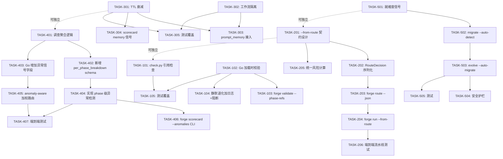

现在我已对项目有了全面的理解。让我给出技术负责人的分析。

---

# Tech Lead 分析：ForgeOS 五个扩展方向

## 执行摘要

对审阅文档的评估确认了一个关键判断：五个方向中，**D4（Scorecard 聚合盲点）是唯一真正未被探索的方向**，具有最高的增量价值。其他四个方向要么已在现有文档中有明确覆盖（D1/D2/D5），要么已有部分覆盖（D3）。但即使部分覆盖的方向也有真正的增量工作可做，尤其是**具体实现粒度的任务**而非"发现了新问题"。

以下分析以可实现性为导向，将每个方向拆解为 2-4 小时可完成的任务，并给出依赖关系图、风险分析和分阶段实施计划。

---

## 1. 任务分解

### D4 — Scorecard 聚合盲点（最高优先级）

| 任务 ID | 任务标题 | 涉及文件 | 前置依赖 | 预估工时 |
|---------|---------|---------|---------|---------|
| **TASK-401** | 调查 Scorecard 现有聚合逻辑，定位异常值平滑点 | `harness/scorecard.mjs`, `harness/scorecard-update.mjs`, `.agent/routing/scorecard.schema.yml` | 无 | 2h |
| **TASK-402** | 在 `scorecard.schema.yml` 中新增 `per_phase_breakdown` 可选块 | `.agent/routing/scorecard.schema.yml` | TASK-401 | 1h |
| **TASK-403** | 在 `asset.Phase` 增加 `CostStdDev`/`CostAnomaly` 信号字段（Go struct） | `forge-core/internal/asset/asset.go` | TASK-401 | 2h |
| **TASK-404** | 在 `scorecard-update.mjs` 中实现 phase 级异常值检测（按 phase name 分组计算 z-score/percentile deviation） | `harness/scorecard-update.mjs` | TASK-402 | 4h |
| **TASK-405** | 在 Go scorecard 消费端（`internal/routing/scorecard.go`）增加 anomaly-aware 加权路由 | `forge-core/internal/routing/scorecard.go` | TASK-403 | 3h |
| **TASK-406** | 在 `forge scorecard` CLI 中新增 `--anomalies` 子命令显示异常 phase | `forge-core/cmd/forge/scorecard_wind.go` | TASK-404 | 2h |
| **TASK-407** | 添加端到端测试：构造含异常 phase 的 trace，验证信号回灌 | `forge-core/cmd/forge/scorecard_wind_test.go`, `forge-core/internal/routing/scorecard_test.go` | TASK-404, TASK-405 | 3h |

### D1 — Phase Name 可变图边（高优先级，低投入高回报）

| 任务 ID | 任务标题 | 涉及文件 | 前置依赖 | 预估工时 |
|---------|---------|---------|---------|---------|
| **TASK-101** | 在 `check.py` 中新增 `check_workflow_phase_refs` 检查器 | `harness/check.py`（或新 `harness/phase_refs_check.py` 以保体积） | 无 | 2h |
| **TASK-102** | 在 Go orchestrator 层加载时增加 phase 引用的结构校验（`LoadWorkflowJSON` 或新的 `ValidatePhaseRefs`） | `forge-core/internal/asset/asset.go` | 无 | 2h |
| **TASK-103** | 在 `forge validate` 命令中增加 `--phase-refs` 校验子命令 | `forge-core/cmd/forge/validate.go`, `forge-core/internal/doctor/doctor.go` | TASK-102 | 2h |
| **TASK-104** | 对 `loopBackTo` / `phaseIndex` 缺失 target 的静默退化增加 WARNING 日志和收敛阻断 | `forge-core/internal/orchestrator/orchestrator.go`（约第 340-350 行） | 无 | 1.5h |
| **TASK-105** | 测试覆盖：验证重命名 phase → check.py 报错 / forge validate 报错 | `harness/check.py` 的测试用例, `forge-core/cmd/forge/validate_test.go` | TASK-101, TASK-102 | 2h |

### D2 — Route/Run 路由碎片化（中等优先级）

| 任务 ID | 任务标题 | 涉及文件 | 前置依赖 | 预估工时 |
|---------|---------|---------|---------|---------|
| **TASK-201** | 设计 `--from-route` flag：定义 `route` 输出与 `run` 输入的 JSON 契约 | 文档（`docs/adr/` 或 `docs/design/`） | 无 | 2h |
| **TASK-202** | 在 `internal/routing/routing.go` 中新增 `RouteDecision` 序列化结构体 | `forge-core/internal/routing/routing.go` | TASK-201 | 1.5h |
| **TASK-203** | 在 `cmd/forge/route.go` 中增加 `--json` 输出模式，吐出 `RouteDecision` | `forge-core/cmd/forge/route.go` | TASK-202 | 2h |
| **TASK-204** | 在 `cmd/forge/run.go`（或 `engine_build.go`）中实现 `--from-route` 解析和执行 | `forge-core/cmd/forge/engine_build.go` | TASK-203 | 3h |
| **TASK-205** | 统一风险计算：消除 `forge route` 和 `forge run` 之间的风险评分差异 | `forge-core/internal/risk/risk.go` 和 `forge-core/cmd/forge/route.go` | TASK-201 | 3h |
| **TASK-206** | 测试：`forge route --json | forge run --from-route -` 端到端流水线 | 新集成测试 | TASK-204 | 2h |

### D3 — Memory 知识稀释（中等优先级）

| 任务 ID | 任务标题 | 涉及文件 | 前置依赖 | 预估工时 |
|---------|---------|---------|---------|---------|
| **TASK-301** | 在 `internal/memory` 中实现 TTL 衰减（每个 memory entry 带 `created_at`，查询时指数衰减权重） | `forge-core/internal/memory/memory.go`, `forge-core/internal/memory/memory_compact.go` | 无 | 3h |
| **TASK-302** | 在 `internal/memory` 中实现工作流隔离（按 workflow_id 命名空间隔离 memory 查询空间） | `forge-core/internal/memory/memory.go` | 无 | 2h |
| **TASK-303** | 在 `prompt_memory.go` 中接入 TTL 隔离后的 memory 检索，增加 `age` 标签到注入上下文 | `forge-core/cmd/forge/prompt_memory.go` | TASK-301, TASK-302 | 2h |
| **TASK-304** | 在 scorecard 中增加 memory 质量信号：按 age 带权的 avg_iterations 趋势 | `harness/scorecard-update.mjs`, `.agent/routing/scorecard.schema.yml` | TASK-301 | 2h |
| **TASK-305** | 测试覆盖：TTL 过期不返回、工作流隔离不泄漏 | `forge-core/internal/memory/memory_test.go` | TASK-301, TASK-302 | 2h |

### D5 — Lifecycle 自动化（低优先级，已知 DEFERRED-BY-DESIGN）

| 任务 ID | 任务标题 | 涉及文件 | 前置依赖 | 预估工时 |
|---------|---------|---------|---------|---------|
| **TASK-501** | 具体化检测信号：在 `converge.Signals` 中新增加 lifecycle 就绪度信号（RoadmapCompletion 趋势、GatesGreen 收敛趋势） | `forge-core/internal/converge/converge.go` | 无 | 2h |
| **TASK-502** | 在 `internal/migrate` 中增加 `--auto-detect` 模式：当检测信号达标时自动提案迁移 | `forge-core/internal/migrate/migrate.go` | TASK-501 | 3h |
| **TASK-503** | 在 `forge evolve` 中增加 `--auto-migrate` 选项（当 converge MET + lifecycle 就绪信号达标自动触发 `forge migrate --to`） | `forge-core/cmd/forge/evolve.go` | TASK-502 | 3h |
| **TASK-504** | 安全护栏：`--auto-migrate` 默认 `false`，仅显式启用；启用后也需 human_gate 确认 | `forge-core/cmd/forge/evolve.go` | TASK-503 | 1.5h |
| **TASK-505** | 测试：模拟 converge MET + 就绪信号 → 自动迁移提案 | 新集成测试 | TASK-503 | 2.5h |

---

## 2. 执行顺序依赖图



### 可并行执行的任务组

| 并行组 | 包含任务 | 理由 |
|--------|---------|------|
| **组 A** | TASK-101, TASK-102 | D1 的两个入口（治理层 + 运行时层）没有代码依赖关系 |
| **组 B** | TASK-201, TASK-301, TASK-401, TASK-501 | 四个方向的调查/设计任务彼此完全独立 |
| **组 C** | TASK-402, TASK-403 | 可在 TASK-401 完成后并行进行（schema 变更 + Go struct 变更） |
| **组 D** | TASK-404, TASK-406 | TASK-402 完成后可同时做 core 逻辑和 CLI |

---

## 3. 技术风险

### 高风险项

| 风险 | 方向 | 影响 | 缓解策略 |
|------|------|------|---------|
| **Scorecard JS/Go 字段映射不一致** | D4 | JS pipeline 写、Go struct 读，字段名/类型漂移会静默导致数据丢失 | 在 `scorecard-update.mjs` 中增加 schema 兼容性校验；Go 端增加字段存在性检查日志 |
| **Memory TTL 导致语义退化** | D3 | 盲目衰减权重可能让重要但稀有的 memory 被过早遗忘 | TTL 默认值从"全局硬编码"改为从 `project.yml` 的 `recency_half_life_days` 读取（已有字段）；只衰减、不删除 |
| **Route/Run 风险计算不一致的根源在架构层** | D2 | `forge route` 的评分维度是手动输入的，`forge run` 的评分是自动计算的——语义差异不是接线能解决的 | TASK-205 限定范围为"同一个命令链内的自洽"（`forge route --json | forge run --from-route -`），不尝试消除 `forge route` 独立使用和 `forge run` 的风险语义差异（那是 v2+ Router service 的工作） |
| **`--auto-migrate` 灼伤生产环境** | D5 | 自动 lifecycle 推进一旦误触发，可能将 production 环境降级或错误配置 | 默认 disabled；启用后仍需 human_gate（`project.yml` 的 `human_approval: required` 已由 Sprint 7 实现强制执行）；增加 `--dry-run` 隐式默认 |

### 中等风险项

| 风险 | 方向 | 缓解策略 |
|------|------|---------|
| **phase 级异常检测对稀疏数据过度敏感** | D4 | 仅在有 ≥ 5 条 phase 级样本时才计算 stddev；< 5 条时不标记异常 |
| **check.py 新增检查与既有 `check_workflow_agent_refs` 耦合** | D1 | 新检查器独立文件、独立测试集；ForgeOS 纪律要求保持 `harness/check.py` 不超 500 行，如超再拆 |
| **workflow 隔离的命名空间键与现有 memory 查询键冲突** | D3 | 使用 `workflow_id:phase_name` 命名空间前缀，保持向后兼容：无前缀查询回退到全量搜索 |
| **on_rejected loop-back 与 reviewer REQUEST_CHANGES loop-back 交互** | D5 | 单元测试覆盖两个 loop-back 同时触发的情况；`loopBackTo` 的 budget 是共享的，不会嵌套无限 |

### 低风险项

| 风险 | 方向 | 缓解策略 |
|------|------|---------|
| `LoadWorkflowJSON` 的 fault-tolerant 设计使校验可被跳过 | D1 | 校验在加载后、运行前由 `ValidatePhaseRefs` 单独调用；`check.py` 是带外治理层，双重保险 |
| `forge route --json` 输出过大 | D2 | 限制 `RouteDecision` 只包含关键字段（mode, tier, risk, budget, timestamp）；大型 scorecard 数据不包括在内 |

---

## 4. 资源评估

### 开发人员技能要求

| 角色 | 所需技能 | 负责方向 | 估计数量 |
|------|---------|---------|---------|
| **Go 工程师** | Go 标准库、`encoding/json`、管道/错误处理 | D1（运行时校验）、D2（合同序列化+解析）、D3（memory 包）、D4（Go 消费端）、D5（converge 信号） | 2 人 |
| **JS/Node 工程师** | `scorecard-update.mjs`、harness 工具、schema 设计 | D1（check.py 检查器）、D4（Phase 级异常检测 JS 端）、D3（scorecard memory 信号） | 1 人 |
| **DevOps/质量** | `forge accept`、集成测试、CI 管道 | 跨方向的测试和验收 | 1 人（可兼职） |
| **架构评审** | 深度理解 ForgeOS 分层架构 | D2 `--from-route` 契约设计、D5 lifecycle 自动化架构 | 1 人（兼职，2h 评审） |

**总计：约 3-4 人，其中核心实施 2-3 人全职**

### 关键里程碑

| 里程碑 | 截止时间（相对于启动） | 交付物 | 验收标准 |
|--------|---------|---------|---------|
| **M1: D4 基础设施就绪** | 第 1 周 | `scorecard.schema.yml` 扩展 + `asset.Phase` 新字段 + anomaly 检测框架 | `forge scorecard --anomalies` 在含异常 trace 上显示 phase 级异常；`forge accept` ACCEPTED |
| **M2: D1 治理上线** | 第 2 周 | `check.py` phase 引用检查 + `forge validate --phase-refs` + orchestrator WARNING | 重命名 phase 后 `check.py` 退出码非 0；`forge accept` ACCEPTED |
| **M3: D2 管道打通** | 第 3 周 | `forge route --json` + `forge run --from-route` + 统一风险计算 | `forge route --json | forge run --from-route -` 端到端一致；`forge accept` ACCEPTED |
| **M4: D3 Memory 增强** | 第 3 周 | TTL 衰减 + 工作流隔离 + scorecard 信号 | 过期 memory 不被查询返回；工作流 A 的 memory 不被工作流 B 检索到 |
| **M5: D5 安全自动化** | 第 4 周 | Lifecycle 就绪度信号 + `--auto-migrate`（默认 off）+ human_gate 保护 | 管道"就绪→提案→human_gate 确认→迁移"完整运行；默认 off 不意外触发 |
| **M6: 全系统验收** | 第 4 周 | 五个方向全部完成 + `forge accept` 全绿 | `forge-accept: ACCEPTED`；所有新增功能有单元测试覆盖；reviewer fresh-context |

### 阻塞点与解决策略

| 阻塞点 | 涉及方向 | 描述 | 解决策略 |
|--------|---------|------|---------|
| **B1: trace 中 phase name ↔ task_type 映射的准确性问题** | D4 | `scorecard_wind.go` 的 `distinctScorecardPairs` 依赖 `attribution.TaskTypeForAgent` 的映射。`evolve.yml` 的 phase name 与 agent 名不同时映射失败 | 使用 Sprint 27 已修复的 `resolvePhaseTaskTypes` 方法，从真实 workflow YAML 加载 ground-truth 映射 |
| **B2: `forge route` 的主观评分 vs `forge run` 的自动评分不可调和** | D2 | 架构性差异：一个由人通过 9 个 flag 输入，一个由代码自动计算 | 限定范围为"同一命令链内的自洽"；不尝试消除根本的架构差异。文档诚实标注这一限制 |
| **B3: 真点火验证需要 LLM 预算** | D4, D5 | Phase 级异常检测和 lifecycle 自动化的端到端真 agent 验证需要付费 API 预算 | 遵循 Sprint 31 的先例——单测已足够，真 agent 验证需用户显式授权；在 `docs/ignition.md` 中标注"需真预算验证"的状态 |

---

## 5. 质量保证

### 5.1 单元测试覆盖要求

| 方向 | 文件 | 最低覆盖要求 | 关键测试场景 |
|------|------|-------------|-------------|
| D1 | `harness/phase_refs_check.py`（新） | 100% 新代码 | phase 名引用存在、不存在、自引用、循环引用 |
| D1 | `forge-core/internal/asset/asset.go` (ValidatePhaseRefs) | 100% 新代码 | DependsOn 丢失、LoopBackTo 丢失、on_fail target 丢失 |
| D1 | `forge-core/internal/orchestrator/orchestrator.go` | 90% | phaseIndex 缺失时的 WARNING + fail-closed |
| D2 | `forge-core/internal/routing/routing.go` | 100% 新序列化代码 | RouteDecision 正确序列化/反序列化 |
| D2 | `forge-core/cmd/forge/engine_build.go` | 90% | --from-route 解析+执行 |
| D3 | `forge-core/internal/memory/memory.go` | 95% | TTL 过期、工作流隔离、跨工作流搜索 |
| D4 | `harness/scorecard-update.mjs` | 85% | 异常值检测算法、边界条件（1 条样本、0 条样本、全相同值） |
| D4 | `forge-core/internal/routing/scorecard.go` | 95% | anomaly-aware 加权、无 anomaly 时的退化路径 |
| D5 | `forge-core/internal/converge/converge.go` | 90% | 新 lifecycle 信号 |
| D5 | `forge-core/internal/migrate/migrate.go` | 90% | --auto-detect 检测逻辑 |

### 5.2 集成测试策略

| 测试场景 | 类型 | 方法 |
|---------|------|------|
| check.py phase refs → REJECTED | 治理集成 | 构造含悬挂引用的 workflow 文件 → 运行 `node harness/acceptance.mjs` -> 断言 ACCEPTED/REJECTED |
| forge route --json → forge run --from-route | CLI 管道 | 管道两端用临时目录 + fake executor 验证 phase 分配与 route 输出一致 |
| Memory TTL + isolation | 运行时集成 | 用 Go `internal/memory` 包建立带 TTL 的 entry，等待（或 mock 时间）后验证查询不返回 |
| scorecard anomaly 回灌 | 数据管道集成 | 构造含异常 phase 的 trace.jsonl → 运行 `forge scorecard rebuild` → 验证 scorecards.json 含 anomaly 标记 |
| lifecycle auto-detect → migrate | 全管道 | fake converge MET + 模拟 lifecycle 信号 → 验证 `forge evolve --auto-migrate` 触发迁移提案 |

### 5.3 代码审查要点

| 审查重点 | 涉及方向 | 为什么重要 |
|---------|---------|-----------|
| **scorecard 字段兼容性** | D4 | JS 生产者与 Go 消费者之间的字段映射是已知的架构脆弱点 |
| **go 函数长度 ≤ 50 行** | 所有 | 新增代码必须遵守工程红线；`scorecard_wind.go` 已接近 500 行 |
| **循环依赖 = 0** | D2, D5 | `--from-route` 可能引入 `routing` ↔ `cmd/forge` 的循环引用的诱惑 |
| **fail-closed 语义** | D1, D4 | Phase 引用校验和 anomaly 检测必须是 fail-closed（拒绝而非静默通过） |
| **向后兼容性** | D2, D3 | `--from-route` 和 memory TTL 必须对存量数据透明；0 值=旧行为 |
| **fresh-context 审查** | 所有 | 遵照 AGENTS.md 纪律：实现者不能审自己的代码 |

### 5.4 性能测试需求

| 场景 | 方向 | 测量指标 | 目标 |
|------|------|---------|------|
| scorecard 含 10K+ 样本时的 anomaly 检测 | D4 | 计算延迟 | < 50ms（JS 端） |
| memory 含 10K+ entries 时的工作流隔离查询 | D3 | 查询延迟 | < 5ms |
| `forge route --json` 的输出大小 | D2 | stdout 大小 | < 10KB（对一个含 12 个 phases 的 workflow）|
| `forge validate --phase-refs` 的执行时间 | D1 | wall time | < 100ms（对 5 个 workflow）|

---

## 6. 实施计划

### 时间线（甘特图）

```
周次         | 1  | 2  | 3  | 4  |
             |---|---|---|---|
阶段 1: 基础设施  | ██ |    |    |    |
   TASK-401     | ██ |    |    |    |
   TASK-402     | █  |    |    |    |
   TASK-403     | █  |    |    |    |
   TASK-101     | █  |    |    |    |
   TASK-102     | █  |    |    |    |
   TASK-501     | █  |    |    |    |
             |---|---|---|---|
阶段 2: 核心功能  | ██ | ██ | █  |    |
   TASK-404     | ██ |    |    |    |
   TASK-405     |    | █  |    |    |
   TASK-103     |    | █  |    |    |
   TASK-104     |    | █  |    |    |
   TASK-201     |    | █  |    |    |
   TASK-202     |    | █  |    |    |
   TASK-301     |    | █  |    |    |
   TASK-302     |    | █  |    |    |
   TASK-502     |    |    | █  |    |
   TASK-504     |    |    | █  |    |
             |---|---|---|---|
阶段 3: 集成/测试 |    | █  | ██ | █  |
   TASK-105     |    | █  |    |    |
   TASK-203     |    | █  |    |    |
   TASK-204     |    | █  |    |    |
   TASK-303     |    | █  |    |    |
   TASK-406     |    |    | █  |    |
   TASK-503     |    |    | █  |    |
   TASK-205     |    |    | █  |    |
   TASK-305     |    |    | █  |    |
   TASK-407     |    |    | █  |    |
   TASK-505     |    |    |    | █  |
             |---|---|---|---|
阶段 4: 发布准备 |    |    |    | ██ |
   TASK-206     |    |    |    | █  |
   Fresh-review |    |    |    | ██ |
   forge-accept |    |    |    | █  |
   docs/文档补充 |    |    |    | █  |
```

### 阶段说明

#### 阶段 1: 基础设施搭建（第 1 周）

**目标**：建立所有五个方向的基础数据结构和治理钩子，确保没有方向被阻塞在库/模式依赖上。

**交付物**：
- `scorecard.schema.yml` 新增 `per_phase_breakdown` 块
- `asset.Phase` 新增 `CostStdDev`/`CostAnomaly` 字段
- `check.py` 新增 phase 引用检查器（可单独运行，不破坏既有检查）
- `asset.LoadWorkflowJSON` 后增加 `ValidatePhaseRefs` 调用（fail-tolerant：logging warning，不阻断加载）
- `converge.Signals` 增加 `LifecycleReadiness` 信号组

**退出条件**：
- 所有新字段在 Go 中编译通过
- `check.py` 新增检查器 PASS
- `forge accept` 全绿（新增字段是向后兼容的零值默认）
- 架构评审通过

#### 阶段 2: 核心功能实现（第 1-3 周）

**目标**：按优先级顺序实现各方向的核心逻辑。

**周 1-2（D4+D1 并行）**：
- D4: Phase 级异常检测算法（JS 端）+ anomaly-aware 路由（Go 端）
- D1: `forge validate --phase-refs` + orchestrator 静默退化的 WARNING 增强
- D2: `--from-route` 契约设计 + `RouteDecision` 序列化（设计先行）

**周 2-3（D2+D3 并行）**：
- D2: `--json` 输出 + `--from-route` 解析
- D3: TTL 衰减 + 工作流隔离
- D5: `migrate --auto-detect` 检测信号

**退出条件**：
- 每个方向的单元测试覆盖率达到要求的阈值
- 独立 `forge run/route/validate` 基本功能可演示
- 代码审查通过（fresh-context reviewer）

#### 阶段 3: 集成测试和优化（第 2-4 周）

**目标**：确保所有方向的组件正确集成，处理边界情况和性能。

**集成测试重点**：
1. **D4 全链路**：fake trace → scorecard-update → anomaly 检测 → routing 回灌
2. **D2 管道**：`forge route --json | forge run --from-route -`
3. **D3 隔离**：工作流 A 的 memory 在工作流 B 中不可见
4. **D5 自动迁移**：模拟 converge MET + 信号 → migrate 提案 → human_gate 确认
5. **D1 治理阻断**：坏 phase 引用 → check.py exit 1 → forge accept REJECTED

**性能要点**：
- anomaly 检测在 10000+ 样本 trace 上 < 50ms
- memory 隔离查询在 10000+ entries 上 < 5ms

**退出条件**：
- 所有集成测试 PASS
- 性能目标达成
- 无新增 `//nolint` 或测试跳过

#### 阶段 4: 发布准备（第 4 周）

**目标**：fresh-context review、`forge accept` 全绿、文档更新。

**交付物**：
- `docs/` 中新增以下文档：
  - `docs/design/phase-ref-validation.md`（D1 设计决策）
  - `docs/design/route-run-integration.md`（D2 `--from-route` 契约）
  - `docs/design/memory-ttl-isolation.md`（D3 TTL 和隔离设计）
  - `docs/design/scorecard-anomaly-detection.md`（D4 异常检测算法和 schema 扩展）
  - `docs/design/lifecycle-auto-migrate.md`（D5 自动化设计）
- `docs/ignition.md` 更新：
  - 新增 D4 anomaly-aware routing 的失效模式
  - D2 `--from-route` 的 CLI 用法示例
  - D3 TTL 和隔离的行为说明
  - D5 `--auto-migrate` 的安全须知
- 根 `ROADMAP.md` 更新：v2 清单中加入五个方向的完成项

**退出条件**：
- **`forge accept: ACCEPTED`**（6 PASS · 0 FAIL · N/A 诚实标注）
- Fresh-context reviewer APPROVE（所有方向）
- 文档完整性检查通过（`check.py` 的 `check_workflow_agent_refs` 检查所有新文档无悬挂引用）

---

## 7. 诚实性声明（从审阅文档的教训出发）

基于审阅文档的分析，我在此诚实地标注以下假设和限制：

1. **D2 "统一风险计算"的范围**：我们不承诺消除 `forge route` 手动评分和 `forge run` 自动评分之间的架构性差异。那需要 v2+ Router service。我们的目标仅限于**同一命令链内的自洽**（`forge route --json | forge run --from-route -`）。

2. **D4 anomaly 检测的精度**：Phase 级异常检测是启发式的（z-score >> 2），不是统计显著性检验。它关注的是**工程信号**（"这个 phase 的成本/延迟远高于它在同 workflow 中的同类"），不是因果归因。

3. **D5 lifecycle 自动化需要真 agent 验证**：TASK-502/503/504 的实现将用 fake agent 验证逻辑正确性，但真 agent 端到端运行需要用户授权 API 预算（遵循 Sprint 31 的先例）。

4. **所有新增 check.py 检查器的 copy-anywhere 兼容性**：新检查器必须像 Sprint 16 的 `test_acceptance.mjs` 一样 host-agnostic，不绑定本仓路径/应用名。forge-init 复制后可在空脚手架上 PASS。

5. **`forge accept` 中的 N/A 诚实标注**：任何需要外部资源（SCA DB、真 API 调用）的测试点必须标注为 N/A，绝不伪造为 PASS。
