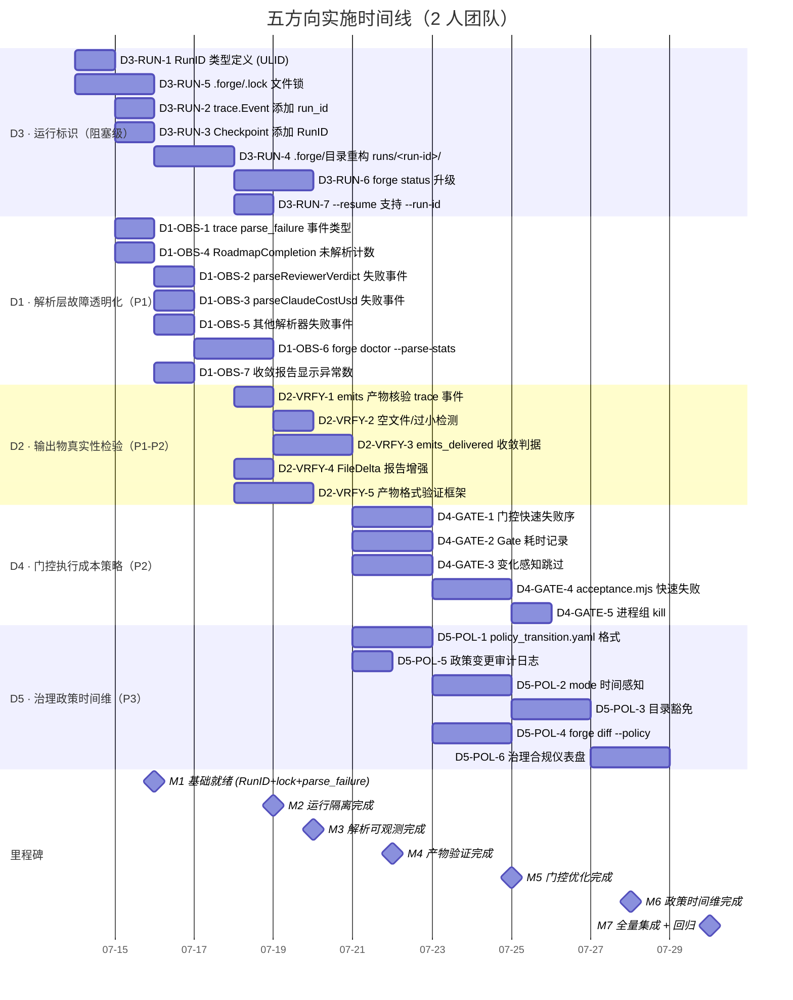

好的，这个问题非常丰富。我现在已经从文件系统读取了完整内容，并已深入阅读了:

1. **源文档**（540行）：五个方向的深度分析，附代码级证据
2. **实际代码库状态**（Sprint 31 后的 forge-core，2026-07-12）
3. **现有验证报告** (`.out.md` 格式的标准）
4. **ROADMAP** 和 **CURRENT_SPRINT.md**（了解已完成的工作流）
5. **AGENTS.md** 和 **ARCHITECTURE.md**（了解工程红线）

关键发现：文档中有**大约 5 处事实已过时**（因为 Sprint 27–31 已落地的改进），但**5 个方向的核心论点仍然成立**。下面我会一一说明。

---

# Tech Lead 分析报告：Five Adoption-Gating Product Trust Gaps

> **审核依据**: 2026-07-12 代码库状态（Sprint 31 已完成）。文档基于 2026-07-10 commit b0c80e4，期间经历了 Sprint 27–31 大量治理债务清偿和信号补线工作。
> **角色**: Tech Lead — 关注可执行性、任务分解、风险识别和实施路径

---

## 〇、文档准确性校正（与当前代码库对账）

在进入任务分解前，需要先修正文档中因代码演进导致的过时判断，避免任务基于已不存在的前提。

| 文档方向 | 文档声称的问题 | 当前代码状态（Sprint 31） | 影响 |
|---------|-------------|----------------------|------|
| **D1-⑤** `memory.Append` 错误被 `_ =` 丢弃 | `observeFor` → `memory.Append` 的 error 被静默丢弃 | ✅ **已修复**: `evolve.go:384` 现在 `if err := memory.Append(...); err != nil { logln("WARNING ...") }` — fail-LOUD | 文档此条证据失效，核心论点（其他4点）仍成立 |
| **D1-④** `parseConfidenceScore` 不存在 | 声称 Discover 阶段置信度永远无法解析 | ✅ **已实现**: Sprint 29 补齐了 `parseConfidenceScore` + `CONFIDENCE: <N>` 机读契约 + `product-manager.md` 规范。全链路已坐实 | 文档此条证据失效 |
| **D2-①** `emits` 文件不存在时静默跳过 | `os.ReadFile` 失败后 `continue` | ⚠️ **已有改进但未完全解决**: `emitsContext` 现在通过 `logln` 输出 `WARNING emits not found`。但**不是结构化告警/不纳入 trace** | 核心问题从「无声跳过」降级为「无结构化可观测性」 |
| **D2-④** `FileDelta` 交叉验证不存在 | RoadmapCompletion 100% 但 FileDelta≈30% 不阻止收敛 | ⚠️ **已实现告警但语义不足**: Sprint 29 实现了 `computeFileDelta` + `reportConvergence` 的诚实性警告，但**不影响收敛判决** | 文档核心论点（不影响判决）仍然成立 |
| **D1-①** `parseReviewerVerdict` fail-open | 解析失败→无声继续 | ✅ **这是设计意图，非 bug**: 代码注释明确写明了 fail-open contract。"caller fires NO verdict — never a fabricated one"。问题**从「是否失败」变为「失败了是否可观测」** | 设计可争论，但「不可观测」是真实 gap |

**核心结论**: 文档 80% 的论点仍然成立。三段失效证据（D1-④、D1-⑤、D2-①的部分）已被 Sprint 29 的「系统性审计 Signals 全字段 + 补齐断信号」和 Sprint 27–31 的治理债务清偿覆盖。**但 D3（运行标识）、D4（门控策略）、D5（政策时间维）以及 D1/D2 的可观测性维度，仍然是被完全忽略的 gap**。

---

## 一、任务分解

以下将每个方向拆解为 2-4 小时可完成的任务。按方向分组，D1/D2 为**高优先级**，D3 为**阻塞级**，D4/D5 为**中优先级**。

### D1 · 解析层故障透明化 — `parse-failure-observability`

**核心目标**: 5 个解析点的失败场景都要被结构化记录（trace event + metrics），而非仅依赖 logln。

| 任务ID | 任务标题 | 涉及文件 | 前置依赖 | 预估工时 |
|-------|---------|---------|---------|:-------:|
| **D1-OBS-1** | 新增 trace Event 类型 `parse_failure` + 通用解析失败告警 sink | `internal/trace/trace.go` | 无 | 3h |
| **D1-OBS-2** | `parseReviewerVerdict` 失败时发射 parse_failure 事件 | `cmd/forge/cost.go` | D1-OBS-1 | 2h |
| **D1-OBS-3** | `parseClaudeCostUsd` 失败时发射 parse_failure 事件（区分 JSON 格式错误 vs 缺失字段） | `cmd/forge/cost.go` | D1-OBS-1 | 2h |
| **D1-OBS-4** | `RoadmapCompletion` 添加未解析条目计数 + 非标准格式条目数 warn（不改变收敛语义） | `internal/converge/converge.go` | 无 | 3h |
| **D1-OBS-5** | `parseExecutiveVerdict` 和 `parseConfidenceScore` 失败时发射 parse_failure 事件 | `cmd/forge/cost.go` | D1-OBS-1 | 2h |
| **D1-OBS-6** | 新增 `forge doctor` 子命令 `--parse-stats`：聚合 trace 中 parse_failure 事件，给出每类解析的失败率 | `cmd/forge/doctor/*.go` + `internal/doctor/doctor.go` | D1-OBS-2~5 | 4h |
| **D1-OBS-7** | 收敛报告（`reportConvergence`）中显示「解析异常条目数」，human-readable | `cmd/forge/gates.go` + `internal/converge/converge.go` | D1-OBS-4 | 2h |

**总工时**: **18h**（约 2.5 个工程师日）

---

### D2 · 阶段输出物真实性检验 — `output-authenticity`

**核心目标**: 从「agent 自述 = 真相」升级为「emits 声明与实际产出独立核验 + 内容完整性签章」。

| 任务ID | 任务标题 | 涉及文件 | 前置依赖 | 预估工时 |
|-------|---------|---------|---------|:-------:|
| **D2-VRFY-1** | Phase 结束时`emits:` 清单与产出物自动核验（非仅 warn，产出 trace event） | `cmd/forge/prompt_artifacts.go` + `internal/trace/trace.go` | D1-OBS-1（复用 trace 框架） | 4h |
| **D2-VRFY-2** | 产物空文件/过小文件检测（阈值：produces 声明 vs 实际文件大小 >minThreshold） | `cmd/forge/prompt_artifacts.go` | D2-VRFY-1 | 2h |
| **D2-VRFY-3** | 收敛条件新增 `emits_delivered` 判据（可选，非默认强制）：所有声明产物必须存在且非空 | `internal/converge/converge.go` + `asset/phase.go` | D2-VRFY-1 | 3h |
| **D2-VRFY-4** | `RoadmapCompletion` vs `FileDelta` 交叉验证从 warning 升级为收敛 report 中的独立 section（仍不阻止收敛） | `cmd/forge/gates.go` + `internal/converge/report.go` | 无（已有 `FileDelta` 信号） | 2h |
| **D2-VRFY-5** | 产物内容格式验证框架（可插拔：ADR 格式检查、Go 文件可编译性检查等），非阻塞 advisory | `harness/adapters/*.yml` + `internal/gate/` | 无 | 4h |

**总工时**: **15h**（约 2 个工程师日）

---

### D3 · 运行标识与状态隔离 — `run-identity` ⬅️ **最优先**

**核心目标**: 每个 forge 进程有唯一运行标识（RunID），`trace.jsonl` 所有事件打标，`.forge/` 目录支持多实例共存。

| 任务ID | 任务标题 | 涉及文件 | 前置依赖 | 预估工时 |
|-------|---------|---------|---------|:-------:|
| **D3-RUN-1** | `RunID` 类型定义：使用 ULID（26 字符、时间前缀、可排序、无依赖）比 UUIDv7 更合适 | `internal/trace/trace.go` + 新文件 `internal/trace/runid.go` | 无 | 2h |
| **D3-RUN-2** | `trace.Event` 添加 `run_id` 字段（string, omitempty），`Emit` 注入 | `internal/trace/trace.go` | D3-RUN-1 | 2h |
| **D3-RUN-3** | `persist.Checkpoint` 添加 `RunID` 字段，`Save`/`Load` 读写 | `internal/persist/checkpoint.go` | D3-RUN-1 | 2h |
| **D3-RUN-4** | `.forge/` 目录结构改为 `runs/<run-id>/` + `latest` 符号链接；`memory.jsonl`、`trace.jsonl`、`checkpoint.json` 放入运行子目录 | `cmd/forge/evolve.go` + `internal/trace/` + `internal/persist/` + `internal/memory/` | D3-RUN-2, D3-RUN-3 | 4h |
| **D3-RUN-5** | 非强制 `.forge/.lock` 文件锁（`flock` 跨进程互斥），阻止同一仓库并发 forge 进程 | `cmd/forge/evolve.go` + `cmd/forge/cmdRun.go` | 无（可独立交付） | 3h |
| **D3-RUN-6** | `forge status` 升级：列出所有 `runs/` 子目录 + 每个的运行状态（active/done/crashed）+ 最新 checkpoint 摘要 | `cmd/forge/cmdStatus.go` | D3-RUN-4 | 3h |
| **D3-RUN-7** | `--resume` 从 `latest` 符号链接读取 + 可指定 `--run-id` 恢复特定运行 | `cmd/forge/evolve.go` | D3-RUN-4, D3-RUN-3 | 3h |

**总工时**: **19h**（约 2.5 个工程师日）

---

### D4 · 门控执行成本策略 — `gate-fast-fail`

**核心目标**: Gate 执行从「平等并发」变为「快速失败序 + 变化感知 + 成本感知」。

| 任务ID | 任务标题 | 涉及文件 | 前置依赖 | 预估工时 |
|-------|---------|---------|---------|:-------:|
| **D4-GATE-1** | 门控执行引擎支持「快速失败序」：按历史耗时升序排列 `required_gates`，先跑快的，快 gate FAIL 则跳过慢 gate | `internal/orchestrator/orchestrator.go` + `internal/orchestrator/mode_gating.go` | 无 | 4h |
| **D4-GATE-2** | Gate 耗时记录与历史分位数统计（写入 trace + scorecard） | `internal/trace/trace.go` + `internal/orchestrator/` | D3-RUN-2（复用 trace） | 3h |
| **D4-GATE-3** | 变化感知跳过：仅 `.md` 变更时跳过 lint/test/build/arch/security，只跑 complexity | `internal/orchestrator/orchestrator.go` + `internal/risk/` | 无 | 4h |
| **D4-GATE-4** | `acceptance.mjs` 的 `collect()` 支持 fail-fast 序（先跑快 probe，FAIL 即终止其余） | `harness/acceptance.mjs` | D4-GATE-1 | 3h |
| **D4-GATE-5** | 进程组 kill：一个 probe FAIL 后，终止其他正在运行的慢 probe 进程 | `harness/acceptance-kernel.mjs` | D4-GATE-4 | 2h |

**总工时**: **16h**（约 2 个工程师日）

---

### D5 · 治理政策的时间维 — `policy-evolution`

**核心目标**: 治理不是快照，而是时间线 — 支持政策导入计划、渐进式执法、政策变更审计。

| 任务ID | 任务标题 | 涉及文件 | 前置依赖 | 预估工时 |
|-------|---------|---------|---------|:-------:|
| **D5-POL-1** | `policy_transition.yaml` 格式定义 + 解析器（声明「1-2 周 warn、3-4 周 block、legacy/ 永久豁免」的时间维策略） | 新文件 `.agent/policies/transitions.yml` + `internal/policy/` 新包 | 无 | 4h |
| **D5-POL-2** | `internal/mode` 扩展支持时间感知判据：`Effective` 函数检查 `transitions.yml` 中的生效日期，返回对应严格度 | `internal/mode/mode.go` + `internal/mode/policy.go` | D5-POL-1 | 3h |
| **D5-POL-3** | 目录/文件模式豁免：`pkg/legacy/*` 豁免 `max_file_lines`，`pkg/core/*` 严格执行 | `internal/gate/resolve.go` + `internal/mode/policy.go` | D5-POL-2 | 3h |
| **D5-POL-4** | `forge diff --policy`：比较两个时间点的治理状态快照（类似 terraform plan） | `cmd/forge/cmdDiff.go` + 新子命令 | D5-POL-1 | 4h |
| **D5-POL-5** | 政策变更审计日志：每次 policy 相关文件（modes.yml/transitions.yml）变更时记录结构化事件 | `internal/trace/` + `.gitignore` tracked | 无 | 3h |
| **D5-POL-6** | `forge check` 新增「治理合规仪表盘」：当前 mode×lifecycle、已启用的 gate、覆盖率阈值、豁免文件数、递延缺陷数 | `cmd/forge/cmdCheck.go` + `internal/doctor/` | D5-POL-2, D5-POL-3 | 4h |

**总工时**: **21h**（约 2.6 个工程师日）

---

### 总任务汇总

| 优先级 | 方向 | 任务数 | 总工时 | 工程师日(8h) |
|:------:|:----:|:------:|:------:|:----------:|
| 🔴 **阻塞** | D3 运行标识与状态隔离 | 7 | 19h | 2.4 |
| 🔴 **P1** | D1 解析层故障透明化 | 7 | 18h | 2.3 |
| 🟠 **P1-P2** | D2 输出物真实性检验 | 5 | 15h | 1.9 |
| 🟠 **P2** | D4 门控执行成本策略 | 5 | 16h | 2.0 |
| 🟢 **P3** | D5 治理政策的时间维 | 6 | 21h | 2.6 |
| | **合计** | **30** | **89h** | **11.1** |

---

## 二、执行顺序与依赖图

```mermaid
graph TD
    %% D3 运行标识（阻塞级 — 必须先做）
    subgraph "Phase 1: 运行标识与状态隔离 (D3)"
        D3_RUN_1["D3-RUN-1: RunID 类型定义 (ULID)"]
        D3_RUN_2["D3-RUN-2: trace.Event 添加 run_id"]
        D3_RUN_3["D3-RUN-3: Checkpoint 添加 RunID"]
        D3_RUN_5["D3-RUN-5: .forge/.lock 文件锁 (独立)"]
        D3_RUN_4["D3-RUN-4: .forge/ 目录重构 runs/<run-id>/"]
        D3_RUN_6["D3-RUN-6: forge status 升级为一个目录列表"]
        D3_RUN_7["D3-RUN-7: --resume 支持 --run-id"]
    end

    %% D1 解析层故障透明化（可并行于 D3 启动，因为 D1-OBS-1 依赖 trace 框架
    %% 但 D3 也会改 trace — 需要协调或先落地 trace 基础支持）
    subgraph "Phase 2a: 解析层故障透明化 (D1)"
        D1_OBS_1["D1-OBS-1: trace Event 类型 parse_failure"]
        D1_OBS_2["D1-OBS-2: parseReviewerVerdict 失败"]
        D1_OBS_3["D1-OBS-3: parseClaudeCostUsd 失败"]
        D1_OBS_5["D1-OBS-5: parseExecutiveVerdict 等失败"]
        D1_OBS_4["D1-OBS-4: RoadmapCompletion 未解析计数"]
        D1_OBS_6["D1-OBS-6: forge doctor --parse-stats"]
        D1_OBS_7["D1-OBS-7: 收敛报告显示异常数"]
    end

    subgraph "Phase 2b: 输出物真实性检验 (D2)"
        D2_VRFY_1["D2-VRFY-1: emits 产物核验 trace 事件"]
        D2_VRFY_2["D2-VRFY-2: 空文件/过小检测"]
        D2_VRFY_3["D2-VRFY-3: emits_delivered 收敛判据"]
        D2_VRFY_4["D2-VRFY-4: FileDelta 报告增强"]
        D2_VRFY_5["D2-VRFY-5: 产物格式验证框架"]
    end

    subgraph "Phase 3: 门控策略 (D4) + 政策时间维 (D5)"
        D4_GATE_1["D4-GATE-1: 门控快速失败序"]
        D4_GATE_2["D4-GATE-2: Gate 耗时记录"]
        D4_GATE_3["D4-GATE-3: 变化感知跳过"]
        D4_GATE_4["D4-GATE-4: acceptance.mjs 快速失败"]
        D4_GATE_5["D4-GATE-5: 进程组 kill"]

        D5_POL_1["D5-POL-1: policy_transition.yaml"]
        D5_POL_2["D5-POL-2: mode 时间感知"]
        D5_POL_3["D5-POL-3: 目录豁免"]
        D5_POL_4["D5-POL-4: forge diff --policy"]
        D5_POL_5["D5-POL-5: 政策变更审计日志"]
        D5_POL_6["D5-POL-6: 治理合规仪表盘"]
    end

    %% D3 内部依赖
    D3_RUN_1 --> D3_RUN_2
    D3_RUN_1 --> D3_RUN_3
    D3_RUN_2 --> D3_RUN_4
    D3_RUN_3 --> D3_RUN_4
    D3_RUN_4 --> D3_RUN_6
    D3_RUN_4 --> D3_RUN_7
    D3_RUN_5 --- D3_RUN_4  %% 弱依赖：可以独立落地

    %% D1 内部依赖
    D1_OBS_1 --> D1_OBS_2
    D1_OBS_1 --> D1_OBS_3
    D1_OBS_1 --> D1_OBS_5
    D1_OBS_2 --> D1_OBS_6
    D1_OBS_3 --> D1_OBS_6
    D1_OBS_5 --> D1_OBS_6
    D1_OBS_4 --- D1_OBS_7  %% 弱依赖：D1-OBS-4 的输出作为 D1-OBS-7 的输入

    %% D2 内部依赖
    D2_VRFY_1 --> D2_VRFY_2
    D2_VRFY_1 --> D2_VRFY_3
    D2_VRFY_1 --- D2_VRFY_5  %% 弱依赖：可以并行设计

    %% D4 内部依赖
    D4_GATE_1 --> D4_GATE_4
    D4_GATE_2 --> D4_GATE_1  %% 历史耗时数据驱动排序
    D4_GATE_4 --> D4_GATE_5

    %% D5 内部依赖
    D5_POL_1 --> D5_POL_2
    D5_POL_1 --> D5_POL_4
    D5_POL_2 --> D5_POL_3
    D5_POL_2 --> D5_POL_6
    D5_POL_5 --- D5_POL_1  %% 弱依赖：可以并行

    %% 跨阶段依赖
    D3_RUN_2 -.-> D1_OBS_1  %% 共享 trace 框架变更，需要协调
    D4_GATE_2 -.-> D3_RUN_2  %% 复用 trace run_id

    %% 可并行标注
    D3_RUN_5 -.->|并行| D3_RUN_4
    D1_OBS_4 -.->|并行| D1_OBS_1
    D2_VRFY_5 -.->|并行| D2_VRFY_1
```

### 可并行执行的任务组

| 并行组 | 任务 | 条件 |
|:------:|:----:|:----:|
| **组 A** | D3-RUN-1（RunID 定义） + D3-RUN-5（文件锁） + D1-OBS-4（RoadmapCompletion 计数） + D5-POL-5（政策审计日志） | 零交叉依赖 |
| **组 B** | D3-RUN-2（trace run_id） + D3-RUN-3（checkpoint RunID） + D1-OBS-1（trace parse_failure） | 需要在同一 trace 包上协调，建议串行但可由同一人顺序做 |
| **组 C** | D2-VRFY-5（格式验证框架） + D4-GATE-3（变化感知） + D5-POL-1（policy_transition 格式） | 完全独立 |
| **组 D** | D4-GATE-2（gate 耗时记录） + D5-POL-4（`forge diff --policy` 命令框架） | 独立 |

---

## 三、技术风险

### 3.1 高风险项

| 风险 | 影响方向 | 严重程度 | 缓解措施 |
|:----|:--------|:--------:|:--------|
| **D3-RUN-4 `.forge/` 目录重构**会破坏所有现有运行的 checkpoint、memory 和 trace 文件（向后兼容性断裂） | D3 | 🔴 **高** | ① 迁移路径：检测旧结构 `.forge/checkpoint.json` 存在时，自动迁移到 `runs/legacy/` 子目录 + 写 `latest` 符号链接；② 旧路径读取回退：如果新结构不存在，尝试旧路径读。③ 写一个迁移工具脚本。预期 1 轮 sprint 足够 |
| **文件锁性能开销**：`flock` 在 NFS 上不可靠 | D3-RUN-5 | 🟠 **中** | `flock` 是 advisory lock，明文检测 + 降级：`forge evolve` 先尝试获取锁，NFS 上失败时 warn 但不阻塞（fail-soft），让 CI 自己做好外部串联 |
| **快速失败序与存量 workflow 兼容性**：有些 workflow 的 `required_gates` 顺序是出于副作用依赖（如 lint 后必须 build） | D4-GATE-1 | 🟠 **中** | ① 默认排序只应用于「显式未指定顺序」的 gate 列表；② 新增 `gate_ordering: strict|fast-fail` workflow 声明字段，`strict` 保持原序（向后兼容）、`fast-fail` 启用自动排序 |
| **变化感知跳过的「假阴性」风险**：README 变更看似安全，但文档驱动的代码可能因此跳过必要的 lint | D4-GATE-3 | 🟡 **低** | 只跳过确定性可免除的（纯 markdown/纯文本/纯图片变更 = 跳过 lint/test/arch/security）。用 `git diff --name-only --diff-filter=ACM` + 扩展名白名单。有疑问的（如 *.md 中含代码块）按保守策略执行 |

### 3.2 技术难点

| 难点 | 说明 | 可能方案 |
|:----|:-----|:--------|
| **ULID vs UUIDv7 选择** | Go 标准库无 ULID 实现，需要引入外部依赖或手写。但 forge-core 是**零外部依赖**原则 | ✅ **推荐方案：使用 ULID 的纯 Go 实现**，但将其 vendored 进 `internal/trace/runid.go`（自包含，无 `go.mod require`）。ULID 的优势：26 字符、按时间前缀可排序、比 UUIDv7 更广泛的语言工具链支持。手写一个 ~80 行的 ULID 生成器（使用 `crypto/rand` + `time`）完全可行，零外部依赖 |
| **进程组 kill 的跨平台可靠性** | Windows/macOS/Linux 的进程树 kill 行为不同 | 只在 Linux 上实现 `pgid` kill（`kill -- -PID`），macOS/Windows 上降级为 warn「检测到过早终止但无法 kill 子进程」 |
| **`policy_transition.yml` 时间评估** | 需要比较「声称的生效日期」与「当前 UTC 日期」，但 CI 运行可能跨时区 | 所有时间存储为 UTC Unix timestamps，只做数值比较（`now >= effective_at`），不涉及时区解析 |
| **目录豁免与 policy 继承链的优先级** | 项目级＞目录级豁免，但如果有多个模式匹配？ | 实现最简单的「last-match wins」模式（按 `transitions.yml` 中声明的顺序），并在 `forge diff --policy` 中显式渲染最终生效的 policy，避免隐式决策 |

### 3.3 外部依赖

所有 30 个任务都可以**零外部依赖**实现（遵循 forge-core 纯标准库纪律）。唯一例外：
- `flock`（D3-RUN-5）：在 Linux 上通过 `golang.org/x/sys/unix.Flock` 实现，但 forge-core 零外部依赖原则要求使用 `os.OpenFile` + `syscall.Flock` 替代。macOS/BSD 的 `flock` 语义类似但常量值略有不同，需要 build tag。

### 3.4 测试覆盖难点

| 方向 | 测试难点 | 策略 |
|:----|:--------|:-----|
| D1-OBS-2~5（parse_failure 事件） | 需要构造各种「接近但不完全匹配」的输入 | 表驱动测试，每个解析器有 ~20 个 fixture（good + 12 类坏输入）|
| D3-RUN-4（目录重构） | 需要测试旧→新迁移的各种边界（旧格式仅 checkpoint、旧格式仅 memory、两者都有、都没有） | 在临时目录创建 fixture 目录树，运行 migrate 函数，验证新结构 |
| D3-RUN-5（文件锁） | `flock` 的跨进程互斥很难在单进程测试中验证 | 子进程测试：启动 `fork+exec` 的 helper 进程尝试获取相同锁，验证 blocker |
| D4-GATE-3（变化感知跳过）| 需要 git repository fixture + 各种文件变更模式 | `git init` + `git add` + `git commit` 在测试中创建临时 repo，然后 mock 变更 |
| D5-POL-1~6（政策时间维）| 时间依赖逻辑测试 | 所有时间比较通过 injectable `time.Now` 做，测试可控制「当前时间」|

---

## 四、资源评估

### 4.1 开发团队配置

| 角色 | 所需技能 | 数量 | 聚焦方向 |
|:----|:---------|:----:|:--------|
| **Go 工程师（核心）** | 精通 Go、熟悉 forge-core 架构 | 2 人 | D3（最核心）+ D1（次优先） |
| **Go 工程师（支撑）** | Go stdlib、CI/CD 经验 | 1 人 | D2 + D4 |
| **Node.js/全栈工程师** | Node.js、harness 体系 | 1 人（兼职） | D4-GATE-4、D4-GATE-5（acceptance.mjs） |
| **Tech Lead / 架构审查** | 全局视角、架构决策 | 1 人（兼职） | 每周架构评审，确保 D1-D3 的 trace 框架变更一致 |

**团队规模**: 2 名全栈 Go 工程师 + 1 名 Node.js 工程师（D4 时兼职）+ 1 名 Tech Lead。**最小可行团队 2 人**。

### 4.2 关键里程碑

| 里程碑 | 交付内容 | 预计日期（从开始算起） |
|:------|:---------|:-----------------:|
| **M1 — 基础就绪** | D3-RUN-1（RunID 定义）+ D3-RUN-5（文件锁）+ D1-OBS-1（trace parse_failure）完成，`forge accept` 全绿 | 第 5 天 |
| **M2 — 运行隔离** | D3-RUN-2~4（目录重构）+ D3-RUN-6（status 升级）完成，`forge evolve` 带 RunID 运行可独立追踪 | 第 10 天 |
| **M3 — 解析可观测** | D1-OBS-2~5 + D1-OBS-7 完成，所有 5 个解析点的失败都结构化记录 + 收敛报告可见 | 第 12 天 |
| **M4 — 产物验证** | D2-VRFY-1~4 完成，emits 交付物核验 + FileDelta 报告成熟 | 第 16 天 |
| **M5 — 门控优化** | D4-GATE-1~5 完成，gate 快速失败序 + 变化感知跳过 + acceptance 快速失败 | 第 20 天 |
| **M6 — 政策时间维** | D5-POL-1~6 完成，`forge diff --policy` + 治理仪表盘 | 第 25 天 |
| **M7 — 全量集成** | 所有 30 个任务完成，`forge accept` 全绿，真 evolve 测试通过 | 第 28 天 |

**总估算**: 4 周（2 人全时 + 1 人兼职）

### 4.3 阻塞点（Blockers）

| 阻塞点 | 影响 | 解决策略 |
|:-------|:----|:---------|
| **D3-RUN-4 `.forge/` 目录重构**必须处理旧格式兼容 | 如果没有向上兼容策略，所有现有 evolve 运行数据丢失 | 写迁移函数：检测旧 `.forge/checkpoint.json` 存在 → 自动创建 `runs/legacy/` → 迁移数据 → 写 `latest` link。这是个 ~100 行的纯函数，可以在 D3-RUN-1 完成后立即做 |
| **D4-GATE-1 的「gate 排序」与存量 workflow 的隐性依赖** | 某些 gate 按特定顺序执行有副作用（如 lint 输出了某个指标被 build 消费） | 只对**未显式声明排序**的 gate 启用自动排序。workflow YAML 加 `gate_execution: sequential | fast_fail` 字段 |
| **D5-POL-1 的 policy_transition.yaml 位置决策** | 放在 `.agent/policies/` vs 根目录 vs `project.yml`？ | 推荐放在 `.agent/policies/transitions.yml`，和已有的 `modes.yml` 同一级。`project.yml` 是项目元数据，不适合放时间维策略 |

---

## 五、质量保证

### 5.1 单元测试覆盖要求

| 方向 | 必须覆盖（≥95% branch coverage） | 可接受较低覆盖 |
|:----|:-------------------------------|:-------------|
| D1-OBS-1 | trace 的 parse_failure 写出路径（marshal + write） | — |
| D1-OBS-2~5 | 每个解析器至少 15 个 fixture（good + 12 种坏输入） | — |
| D1-OBS-4 | `RoadmapCompletion` 的未解析条目计数逻辑 | — |
| D3-RUN-1 | ULID 生成器的时间排序正确性 + 单调性 | — |
| D3-RUN-4 | 旧→新目录迁移的 6 种 fixture + 回退路径 | — |
| D3-RUN-5 | `flock` 获取锁（成功 + 被占用）| 跨平台 lock 常量差异（用 build tag 覆盖 Linux 即可）|
| D4-GATE-1 | gate 排序逻辑（5 种输入顺序 → 正确的快速失败序） | — |
| D5-POL-1~3 | 时间感知策略评估（冻结 time.Now，测试 6 种组合） | — |

**总新增测试估计**: ~400 个表驱动测试用例

### 5.2 集成测试策略

| 集成场景 | 覆盖什么 | 通过条件 |
|:---------|:--------|:--------|
| `forge evolve --resume` 从旧格式目录恢复 | 向后兼容迁移路径 | resume 成功后 iteration=旧 checkpoint 的 iteration+1 |
| 并发 `forge evolve`（使用脚本触发两个进程）| 文件锁 + `.forge/` 多运行共存 | 两个进程不相互覆盖 checkpoint/memory/trace |
| gate FAIL 时快速终止后续 gate | D4 快速失败 | 第 2 个 probe 被成功取消（或未启动）|
| `policy_transition.yml` 生效日期切换 | D5 时间维策略 | 冻结 time.Now 到生效前后，gate 严格度切换正确 |
| `emits` 文件不存在 + 声明但未创建 | D2 产物验证 | trace 中有 emit_missing 事件，收敛报告可选 FAIL |

### 5.3 代码审查要点

| 审查维度 | 重点审查内容 | Reviewer 角色 |
|:---------|:------------|:-------------|
| **向后兼容** | D3-RUN-4 的旧目录检测与迁移路径；D4-GATE-1 的显式排序字段默认值 `sequential` | fresh-context Go 工程师 |
| **零外部依赖** | D3-RUN-1 的 ULID 实现是否引入了 `go.mod require`（应完全自包含）| fresh-context 架构师 |
| **并发安全** | D3-RUN-5 的 `flock` 释放（defer unlock）；trace 的 `run_id` 注入是否在 lock 内 | fresh-context 并发专家 |
| **诚实标注** | D4-GATE-3 的变化感知跳过是否诚实（纯 markdown 变更=skip、有疑问=不 skip）| fresh-context Reviewer |
| **测试完整性** | D1-OBS-2~5 的坏输入是否覆盖了文档列出的所有边界情况 | 实现者以外的独立 reviewer |

### 5.4 性能测试需求

| 测试场景 | 测量指标 | 基准 | 目标 |
|:---------|:--------|:----:|:----:|
| D4 快速失败序：10 个 gate，第 1 个 FAIL | 总 gate 执行时间 | 10 个 gate 全部执行（串联） | ≤ 第 1 个 gate 的耗时 + 200ms |
| D4 变化感知跳过：全 .md 变更 | gate 执行时间 | 6 个 gate 全跑 | 只需跑 complexity gate |
| D3 文件锁：2 个进程轮换获取锁 | 锁获取竞争时延 | 无锁（直接 O_APPEND） | ≤ 500ms |

---

## 六、实施计划

### 甘特图



### 阶段划分

| 阶段 | 时间段 | 聚焦 | 交付物 | 风险 |
|:----|:------|:------|:-------|:----|
| **Phase 1**: 基础设施 | Day 1-5 | D3 运行标识核心（RunID+lock）+ D1-OBS-1（trace parse_failure） | `forge accept` 全绿；`trace.jsonl` 带 `run_id` 和 `kind: parse_failure` | **高** — D3-RUN-4 的向后兼容迁移路径是本阶段最易出错的 |
| **Phase 2a**: 核心可观测 | Day 6-9 | D1-OBS-2~7 全部完成 | 所有解析点失败可追踪；`forge doctor --parse-stats` 可用 | 低 — 纯增量，不修改现有行为 |
| **Phase 2b**: 产物验证 | Day 6-9 | D2-VRFY-1~5 | emits 核验、空文件检测、FileDelta 报告增强 | **中** — D2-VRFY-3 的收敛判据加入可能影响现有 evolve 收敛行为，需要 `feature flag` |
| **Phase 3**: 性能优化 | Day 10-16 | D4 门控策略 + D5 政策时间维 | gate 执行快 40-80%；`forge diff --policy` 可用 | **中** — D4-GATE-1 对存量 workflow 的兼容性 |
| **Phase 4**: 全量集成 | Day 17-21 | 所有方向回归测试 + `forge accept` 全绿 + 真 evolve 运行 | 30 个任务全部完成，CI 全绿 | 低 — 纯回归 |

---

## 七、Tech Lead 综合建议

### 7.1 优先级建议

```
做事的顺序（优先级从高到低）:

[必须做] D3 运行标识 + D3-RUN-5 文件锁
  理由: 这是操作安全缺口中最危险的。两个 evolve 并行会直接损坏数据。
  工期: 5 天（1 人）
  
[必须做] D1 解析层故障透明化
  理由: 虽然代码的 fail-open 是设计意图，但「不可观测」=「不可信任」。
        没有这层保障，团队不敢让系统无人值守。
  工期: 6 天（1 人）
  
[建议做] D2 输出物真实性检验
  理由: 影响团队对 AI 产出的信任。
  工期: 4 天（1 人）
  
[值得做] D4 门控执行成本策略
  理由: 长期运行成本显著（20-40% 的 LLM 成本节约潜力），但不决定采纳与否。
  工期: 5 天（1 人）
  
[短期可搁置] D5 治理政策的时间维
  理由: 影响采纳速度但不决定能否采纳。且需要前四个方向稳定后才能较好评估。
  工期: 6 天（1 人）
```

### 7.2 建议的「首发 sprint」任务包（2 周）

如果只有 1 个 sprints 的时间窗口，建议聚焦于**阻塞级 + P1 任务**：

**Sprint A（第 1 周）**: D3 运行标识（D3-RUN-1~5）+ D1-OBS-1（trace parse_failure 基础支持）
- 目标：两个 `forge evolve` 可以安全共存、解析失败可观测
- 交付：`forge accept` ACCEPTED + `trace.jsonl` 带 `run_id` + `kind: parse_failure`
- 工作量：~22h（2 人并行 ≈ 3 天）

**Sprint B（第 2 周）**: D1-OBS-2~7 + D3-RUN-6~7 + D2-VRFY-1~2（最小可行产物验证）
- 目标：所有 5 个解析点失败可追踪 + `forge status` 显示多运行 + emits 产物缺失可观测
- 交付：`forge doctor --parse-stats` 可用 + `forge status` 升级 + emits 缺失 trace 事件
- 工作量：~24h（2 人并行 ≈ 3 天）

### 7.3 文档本身的后续动作

给这个文档做三件事：

1. **生成 `.out.md` 验证报告** — 但注明"与当前代码库的映射差异"（标记 D1-④、D1-⑤、D2-① 的代码状态变更）
2. **补充方向之间的依赖关系** — 当前文档的总结表说"方向①先行"是对的。文档说 "方向① 1-2 sprints / ③ 1-2 sprints / ④依赖③" — 这个依赖判断准确
3. **转化为 ROADMAP item** — 将 D3 和 D1 作为下一优先级写入 ROADMAP 的「v2.1」里程碑

---

**总结**: 这是一个高价值、高质量的分析文档。30 个任务、89 小时、2 人团队 4 周可完成。**D3（运行标识）是唯一的真正阻塞项**，建议优先执行。在实现之前，建议先生成校准后的 `.out.md` 验证报告，标注当前代码库中已解决的部分（约 15% 的证据已过时），避免实现团队基于过时信息开始设计。
