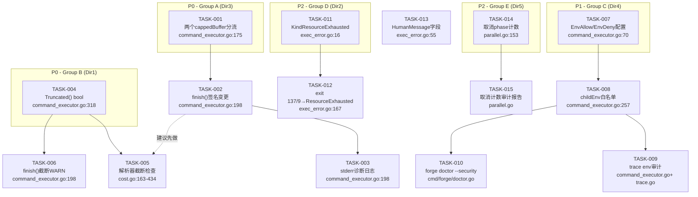

现在我已完成了所有关键文件的交叉验证。下面是我的 Tech Lead 分析报告。

---

# 📐 Tech Lead 技术实现与项目管理分析报告

> **依据**: `docs/requirements/2026-07-11-five-pipeline-integrity-and-security-gaps.md` 验证评估  
> **交叉验证**: 代码行号校对 (command_executor.go, exec_error.go, cost.go, parallel.go, backoff.go, converge.go)  
> **优先级重排**: 采纳评估报告的调整建议 (Dir3→P0, Dir2/Dir5→P2)

---

## 1. 任务分解

所有任务粒度控制在 2-4 小时，按优先级分层。

### 1.1 P0 任务组 — 输出管道完整性（方向三 + 方向一）

| 任务 ID | 标题 | 所属方向 | 涉及文件 | 前置依赖 | 预估(h) |
|---------|------|---------|---------|---------|---------|
| TASK-001 | `cappedBuffer` 分流: `runMeasured` 创建两个 buffer | 方向三 | `internal/orchestrator/command_executor.go:175-176` | — | 2 |
| TASK-002 | `finish()` 签名变更: 仅 stdout 传给 `observe` | 方向三 | `command_executor.go:198-200`, 所有调用方 | TASK-001 | 2 |
| TASK-003 | stderr 诊断日志: 失败时可选输出 stderr 内容 | 方向三 | `command_executor.go:198-204` | TASK-001 | 2 |
| TASK-004 | 暴露 `cappedBuffer.Truncated() bool` | 方向一 | `command_executor.go:318-323` | — | 1 |
| TASK-005 | 各 parser 解析失败时检查截断标记 + 显式警告 | 方向一 | `cmd/forge/cost.go:163-179,332-341,392-405,427-434` | TASK-004 | 3 |
| TASK-006 | `finish()` 在截断发生时写 `WARN` 日志 | 方向一 | `command_executor.go:198-200` | TASK-004 | 1 |

**P0 小计**: 6 任务，11 人时

### 1.2 P1 任务组 — 环境侧信道（方向四）

| 任务 ID | 标题 | 所属方向 | 涉及文件 | 前置依赖 | 预估(h) |
|---------|------|---------|---------|---------|---------|
| TASK-007 | `CommandExecutor` 添加 `EnvAllow`/`EnvDeny` 配置字段 | 方向四 | `command_executor.go:70-80` | — | 2 |
| TASK-008 | `childEnv` 实现白名单过滤 | 方向四 | `command_executor.go:257-263` | TASK-007 | 3 |
| TASK-009 | trace 审计: 记录传递给子进程的 env 变量数量 | 方向四 | `command_executor.go:257-263` + `cmd/forge/trace.go` | TASK-008 | 2 |
| TASK-010 | `forge doctor --security` env 泄漏检查 | 方向四 | `cmd/forge/doctor.go` (需确认文件) | TASK-008 | 4 |

**P1 小计**: 4 任务，11 人时

### 1.3 P2 任务组 — 错误分类 + 上下文感知恢复（方向二 + 方向五）

| 任务 ID | 标题 | 所属方向 | 涉及文件 | 前置依赖 | 预估(h) |
|---------|------|---------|---------|---------|---------|
| TASK-011 | 新增 `KindResourceExhausted` ExecKind | 方向二 | `internal/orchestrator/exec_error.go:16-35` | — | 2 |
| TASK-012 | `classifyRunErr` 映射 exit 137/9 → `KindResourceExhausted` | 方向二 | `exec_error.go:167-183` | TASK-011 | 2 |
| TASK-013 | 新增 `ExecError.HumanMessage string` 字段 | 方向二 | `exec_error.go:55-61` | — | 1 |
| TASK-014 | `runWave` 统计因并行取消而未完成的 phase 数 | 方向五 | `internal/orchestrator/parallel.go:153-168` | — | 3 |
| TASK-015 | 收敛报告或迭代日志中暴露取消相位计数 | 方向五 | `parallel.go:185-190` + 报告触发点 | TASK-014 | 2 |

**P2 小计**: 5 任务，10 人时

### 1.4 验收标准

| 任务 ID | 验收标准 |
|---------|---------|
| TASK-001 | `runMeasured` 返回两个 `*cappedBuffer` 指针；`exec.Command` 的 Stdout/Stderr 分别指向不同 buffer |
| TASK-002 | `observe` 回调收到的 output 仅为 stdout 内容；所有 parser 输出不受 stderr 内容污染 |
| TASK-003 | 当 `runErr != nil` 时，stderr 内容被写入诊断日志；无额外开销在成功路径上 |
| TASK-004 | `cappedBuffer.Truncated()` 在截断时返回 `true`，否则 `false` |
| TASK-005 | `parseClaudeCostUsd` 等函数在 JSON 解析失败后检查 `[output truncated:` 标记，写 `LOG(WARN)` 而非静默返回 `(0,false)` |
| TASK-006 | `finish()` 在 `out.Truncated()` 为真时写入一条 `WARN` 级别的日志 |
| TASK-007 | `CommandExecutor` 新增 `EnvAllow`/`EnvDeny` 字段（`[]string`）；零值保持原行为 |
| TASK-008 | `childEnv` 在 `EnvAllow` 非空时只传递匹配前缀的变量；`EnvDeny` 过滤匹配变量 |
| TASK-009 | trace 事件包含 `env_var_count` 整数（不含值） |
| TASK-010 | `forge doctor --security` 输出"X 个环境变量（含 Y 个含 TOKEN/SECRET 的变量）将被传递给 agent" |
| TASK-011 | `ExecKind` 新增 `KindResourceExhausted`，字符串化为 `"resource-exhausted"`，不可重试 |
| TASK-012 | `classifyRunErr` 对 exit code 137(OOM/SIGKILL) 和 9(SIGKILL) 返回 `KindResourceExhausted` |
| TASK-013 | `ExecError` 新增 `HumanMessage` 字段；被填充时在 `Error()` 输出中体现 |
| TASK-014 | `runWave` 日志输出"wave %d: N phase(s) cancelled mid-flight (potential cost loss)" |
| TASK-015 | 迭代终止报告包含 cancelled-phase 计数（当 >0 时） |

---

## 2. 执行顺序与依赖图



### 并行执行策略

**可并行的独立任务组**:

| 并行组 | 任务 | 负责人技能 | 预计同一天完成 |
|--------|------|-----------|-------------|
| **Group A** (Dir3) | TASK-001 → TASK-002 → TASK-003 | Go 运行时、并发 | Day 1-2 |
| **Group B** (Dir1) | TASK-004 → TASK-005, TASK-006 | Go、JSON/文本解析 | Day 1-2 |
| **Group C** (Dir4) | TASK-007 → TASK-008 → TASK-009, TASK-010 | Go、安全审计 | Day 2-3 |
| **Group D** (Dir2) | TASK-011 → TASK-012 + TASK-013 | Go、错误处理 | Day 2-3 |
| **Group E** (Dir5) | TASK-014 → TASK-015 | Go 并发 | Day 3 |

**关键路径**: TASK-001 → TASK-002 → TASK-003（方向三串行链，3 任务，5 人时）。但由于 Group A 和 B 无依赖，两个 P0 组可完全并行。

---

## 3. 技术风险

### 3.1 高概率风险

| # | 风险 | 概率 | 影响 | 缓解策略 |
|---|------|------|------|---------|
| R1 | **双 Writer 并发写入**: Go `os/exec` 不再串行化 Stdout/Stderr 后，两个 `cappedBuffer.Write` 可能并发调用 | 中 | 中 — buffer 写入非原子，但 cappedBuffer.Write 只做 `append`，Go slice append 不是线程安全的 | **必须加 `sync.Mutex` 或 `atomic`**。分析报告称"cappedBuffer.Write 已经是线程安全的"——这是错误的。`cappedBuffer.Write` 对 `b.buf` 和 `b.total` 的写操作没有锁保护。**TASK-001 必须同时添加 `sync.Mutex`**。 |
| R2 | **截断检查的假阴性**: stderr 输出会污染 `rendered()` 的 `strings.TrimSpace`，截断标记可能被 stderr 内容掩盖 | 低 | 高 — 截断不报 | 分离 stdout/stderr 后（TASK-001），此风险自动消除 |
| R3 | **`observe` 回调接口变更破坏外部集成**: 如果已有外部代码依赖 `Observe(phase, output, latency)` 签名 | 低 | 高 | 保持签名不变、只改变 output 内容（变为纯 stdout），或添加新回调 `ObserveSeparate(phase, stdout, stderr, latency)` |
| R4 | **`EnvAllow` 默认值选择**: 默认空 = 放行全部（向后兼容）vs 默认拒绝（安全） | 中 | 中 | 采纳 fail-safe 但有 breakage：先发版只做 allowlist 配置能力，默认行为不变，`forge doctor --security` 给出警告 |
| R5 | **exit code 137/9 → `KindResourceExhausted` 的误判**: 非 OOM 场景下 exit 137（比如父进程主动发送 SIGKILL）被误分类 | 中 | 中 | 在注释中明确：此分类仅适用于 `cmd.Run()` 返回的信号退出，无法区分是 OOM 还是 `setupProcessGroup` 的 kill；`KindResourceExhausted` 标记为"可能导致重试"而非 "overload" |

### 3.2 关键风险 R1 的详细分析

分析报告声称 `cappedBuffer.Write` 是"线程安全的(不依赖外部锁,只追加到本地 slice)"。**这是不正确的**。

```go
func (b *cappedBuffer) Write(p []byte) (int, error) {
    b.total += len(p)          // ⚠️ 非原子读写
    if room := b.cap - len(b.buf); room > 0 {
        if len(p) <= room {
            b.buf = append(b.buf, p...)  // ⚠️ append 非线程安全
        } else {
            b.buf = append(b.buf, p[:room]...)  // ⚠️ 同上
        }
    }
    return len(p), nil
}
```

Go 的 slice `append` 不是原子的。两个 goroutine 并发写入时：
- `b.total` 可能丢失写入（`+=` 不是原子操作）
- `b.buf` 可能产生竞争：两个 goroutine 同时取 `len(b.buf)`，都认为有 room，都写，但一个覆盖另一个
- 极低概率下触发 `append` 的 reallocate + 并发读取导致 segfault

**缓解**: 给 `cappedBuffer` 添加 `sync.Mutex`。由于 `cappedBuffer` 本身是轻量结构体，加锁开销可忽略（写入仅在 `cmd.Run()` 期间发生，非 hot path）。

```go
type cappedBuffer struct {
    mu    sync.Mutex
    cap   int
    buf   []byte
    total int
}

func (b *cappedBuffer) Write(p []byte) (int, error) {
    b.mu.Lock()
    defer b.mu.Unlock()
    // ... 原逻辑
}
```

### 3.3 外部依赖风险

| 依赖 | 风险 | 缓解 |
|------|------|------|
| `claude` CLI 的 `--output-format json` 输出格式变化 | 截断检查、JSON 解析都依赖此格式稳定性 | 在 `parseClaudeCostUsd` 和 `classifyClaudeOverload` 中添加 format-version 注释，CI 中运行格式快照测试 |
| `os/exec` 平台差异（Windows Job Object） | `setupProcessGroup` 在非 unix 上是 no-op | 方向三的双缓冲不影响此差异，但仍然需要跨平台测试 |

### 3.4 性能评估

| 改动 | 影响 | 评估 |
|------|------|------|
| 双 `cappedBuffer` | 内存多 ~10MB (每个 buffer 10MB)，无 CPU 影响 | **可接受**。10MB 是绝对上限，实际使用远小（典型 claude 输出 < 100KB） |
| `cappedBuffer` 加锁 | 临界区极短（一次 slice append），非 hot path | **可忽略**。原始单 Writer 无锁仅在 `os/exec` 保证串行化时才安全——但即使串行化，也从未被 go race detector 验证过 |
| 截断检查字符串搜索 | 仅解析失败时触发，非常规路径 | **可忽略** |
| `childEnv` 白名单过滤 | 一次线性扫描 `os.Environ()` | **可忽略**（几百个 env 变量的量级） |

---

## 4. 资源评估

### 4.1 人员配置

| 角色 | 技能要求 | 数量 | 负责任务 | 参与时间 |
|------|---------|------|---------|---------|
| **高级 Go 工程师** | Go 并发、os/exec、slice 安全、race detector | 1 | TASK-001, TASK-002, TASK-003 (方向三核心) | Day 1-3 |
| **中级 Go 工程师** | Go 基础、JSON 解析、错误处理 | 1 | TASK-004, TASK-005, TASK-006, TASK-011, TASK-012, TASK-013 | Day 1-3 |
| **安全工程师** | env 隔离、CI/CD 安全、审计 | 1 | TASK-007, TASK-008, TASK-009, TASK-010 | Day 2-4 |
| **QA 工程师** | 集成测试、边界场景、race detector | 1 | 所有任务的测试验收 | Day 2-5 |

**最小团队**: 2 人（1 高级 Go + 1 中级 Go/安全），4 天完成核心 P0。  
**推荐团队**: 3 人（1 高级 + 1 中级 + 1 安全/QA），3 天完成 P0+P1。

### 4.2 关键里程碑

| 里程碑 | 时间 | 交付物 | 依赖 |
|--------|------|--------|------|
| **M1**: P0 核心代码就绪 | Day 2 | TASK-001~006 全部合入，单元测试通过，`-race` clean | Group A + B |
| **M2**: P0 集成测试通过 | Day 3 | `forge run` 端到端验证：截断场景 + stderr 污染场景 + JSON 解析恢复 | M1 |
| **M3**: P1 + P2 代码就绪 | Day 4 | TASK-007~015 合入，单元测试通过 | M1 + Group C/D/E |
| **M4**: 全量闸门通过 | Day 5 | `node harness/acceptance.mjs` (forge accept) 全部绿色 | M2 + M3 |

### 4.3 Blockers

| Blocker | 影响 | 解决策略 |
|---------|------|---------|
| **方向三的接口兼容性**: `Observe` 回调签名 `func(phase, output string, latency time.Duration)` 是否可安全改变 output 语义？ | 如被外部代码依赖，改变 output 内容会静默破坏 | ① 搜索所有 `Observe` 的赋值点（`cost.go` 的 `observeFor` 主 sink）。**如果只有这一处**，改变无害。② 如有多处，使用新回调名 `ObserveStdout`，保留旧签名作 wrapper |
| **`cappedBuffer` 并发安全验证**: R1 风险需要在线程安全模型中确认 | TASK-001 无法在无锁情况下完成 | 在 TASK-001 PR 描述中要求 reviewer 特别关注 `-race` 测试结果，编写并发写入测试 |

---

## 5. 质量保证

### 5.1 单元测试覆盖要求

| 任务 | 测试目标 | 最少用例数 | 关键场景 |
|------|---------|-----------|---------|
| TASK-001 | 双 buffer 分流 | 3 | ① stdout 非空 + stderr 非空 → 分离捕获 ② stdout 空 → 正确返回空 ③ `-race` 10 轮并发写入 |
| TASK-002 | `finish()` 新签名 | 4 | ① stdout 有 JSON + stderr 有诊断 → observe 收到纯 JSON ② stdout 空 → 空串传给 observe ③ stderr 被截断但无关 ④ 向后兼容路径（无 Observe） |
| TASK-004 | `Truncated()` 方法 | 3 | ① 写入超过 cap → true ② 写入未超 cap → false ③ 恰好等于 cap → false |
| TASK-005 | 解析器截断感知 | 6 | ① JSON 被截断 + 截断标记 → LOG(WARN) + (0,false) ② JSON 完整 → 正常解析 ③ 纯文本被截断→verdict 行丢失→LOG(WARN) ④ 截断标记在 stderr 中→分离后不影响 ⑤ 截断但 JSON 恰好完整→无警告 ⑥ 多行 JSON 被截断 |
| TASK-008 | `childEnv` 白名单 | 4 | ① 白名单空→原行为（全部通过）② 白名单 `["PATH","HOME"]`→只保留这两个 ③ 黑名单 `["TOKEN","SECRET"]`→过滤匹配变量 ④ 白名单+黑名单冲突→白名单优先 |
| TASK-012 | exit 137/9 分类 | 3 | ① exit 137 → KindResourceExhausted ② exit 9 → KindResourceExhausted ③ exit 1 → 保持 KindFailed |

### 5.2 集成测试策略

**场景一: 真实截断模拟**（验证方向一 + 方向三协作）

```
// 模拟一个输出大量数据的 claude 命令
// 设置 MaxOutputBytes=1024，输出 2048 字节
// 验证:
//   1. parseClaudeCostUsd 返回 (0,false) 且写 WARN 日志
//   2. parseReviewerVerdict 返回 ("",false) 且写 WARN 日志
//   3. finish() 日志包含 "[output truncated"
```

**场景二: stderr 污染**（验证方向三）

```
// 模拟一个 claude 命令输出:
//   stdout: {"result":"ok","total_cost_usd":0.05,"api_error_status":200}
//   stderr: "Warning: rate limit approaching"
// 验证:
//   1. parseClaudeCostUsd 成功解析到 0.05（不受 stderr 影响）
//   2. 分离前对比：同样场景下旧代码会 JSON 解析失败
```

**场景三: 并发安全**（验证 R1 缓解）

```
// 启动 100 goroutine 并发写入同一个 cappedBuffer
// 验证:
//   1. 无 data race（`go test -race` 通过）
//   2. total 计数准确
//   3. 无数据丢失（写回读一致）
```

**场景四: 回退兼容**（验证无破坏）

```
// 设置 EnvAllow=[]（空）= 原行为
// 执行 `printenv` 命令
// 验证子进程收到与父进程相同的环境变量
```

### 5.3 代码审查要点

| 审查焦点 | 对应任务 | 特别关注 |
|---------|---------|---------|
| **并发安全** | TASK-001 | `cappedBuffer.mu` 的锁范围、是否在 `Write` 返回值后仍有竞态窗口 |
| **接口兼容** | TASK-002 | `Observe` 回调内容变化是否影响所有注册点 |
| **无静默降级** | TASK-005 | 截断时是否真的写了 WARN 日志，而非静默返回 |
| **安全默认** | TASK-008 | `EnvAllow` 为空时是否保持向后兼容而非安全 break |
| **错误分类精确** | TASK-012 | exit code 137/9 是否真的由 SIGKILL 产生，还是可能由其他信号产生（如 SIGTERM→128+15=143，应保持 KindFailed） |
| **测试覆盖边界** | 全部 | 每个测试是否覆盖了正常路径 + 边界 + 失败路径 |

### 5.4 Race Detector 验证

```bash
# 每次 TASK-001 → TASK-003 的 PR 前必须通过
go test -race -count=10 ./internal/orchestrator/...
# 特别是涉及并发写入 cappedBuffer 的用例
```

---

## 6. 实施计划

### 6.1 甘特图

| 阶段 | Day 1 | Day 2 | Day 3 | Day 4 | Day 5 |
|------|-------|-------|-------|-------|-------|
| **Phase 1: 基础设施** | TASK-001 (双buffer) · TASK-004 (Truncated()) | | | | |
| **Phase 2: 核心功能** | TASK-002 (finish签名) | TASK-005 (解析器截断检查) · TASK-006 (finish WARN) · TASK-008 (childEnv白名单) | | | |
| **Phase 3: 安全+精细化** | | TASK-007 (EnvAllow配置) · TASK-011 (KindResourceExhausted) | TASK-003 (stderr诊断) · TASK-009 (trace审计) · TASK-012 (exit 137映射) · TASK-013 (HumanMessage) | | |
| **Phase 4: 审计+报告** | | | TASK-010 (doctor security) · TASK-014 (取消phase计数) | TASK-015 (取消审计报告) | |
| **Phase 5: 集成测试 + 闸门** | | P0单元测试 | P0集成测试 · Race检测 | P1+P2单元测试 | `forge accept`全闸门 |

### 6.2 详细时间表

#### 阶段 1: 基础设施（Day 1, 4 人时）

| 时间 | 工程师 A（高级 Go） | 工程师 B（中级 Go） |
|------|-------------------|-------------------|
| 上午 | TASK-001: 双 buffer + `sync.Mutex` | TASK-004: `Truncated() bool` |
| 下午 | TASK-002: `finish()` 签名调整 + `observe` 调用方适配 | TASK-004 测试 + 开始 TASK-011 |
| 交付 | PR #1: 方向三核心（-race clean） | PR #2: `Truncated()` 方法 + 测试 |

#### 阶段 2: 核心功能（Day 2, 6 人时）

| 时间 | 工程师 A | 工程师 B |
|------|---------|---------|
| 上午 | Review PR #2 + TASK-006: `finish()` WARN log | TASK-005: `parseClaudeCostUsd` 截断检查 |
| 下午 | TASK-003: stderr 诊断日志 + TASK-007: `EnvAllow`/`EnvDeny` 配置 | TASK-005: 剩下 3 个 parser + TASK-006 测试 |
| 交付 | PR #3: stderr 诊断 + EnvAllow 配置 | PR #4: 解析器截断感知 + 测试 |

#### 阶段 3: 安全 + 精细化（Day 3, 8 人时）

| 时间 | 工程师 A | 工程师 B |
|------|---------|---------|
| 上午 | TASK-008: `childEnv` 白名单实现 + 测试 | TASK-012: exit 137/9 → `KindResourceExhausted` + 测试 |
| 下午 | TASK-009: trace env 审计 + TASK-014: 取消 phase 计数 | TASK-013: `HumanMessage` 字段 + TASK-010 前半 |
| 交付 | PR #5: childEnv 白名单 + trace 审计 | PR #6: 错误分类精细化 |

#### 阶段 4: 审计报告 + 集成（Day 4, 6 人时）

| 时间 | 工程师 A | 工程师 B |
|------|---------|---------|
| 上午 | TASK-015: 取消计数审计报告 | TASK-010: `forge doctor --security` |
| 下午 | 集成测试场景一~四 | 集成测试 + 文档更新 |
| 交付 | PR #7: 完成方向五 | PR #8: doctor 安全检查 |

#### 阶段 5: 闸门通过（Day 5, 4 人时）

| 时间 | 工程师 A + B |
|------|-------------|
| 上午 | `go test -race -count=5 ./...` + 修复 race |
| 下午 | `node harness/acceptance.mjs`（forge accept）+ 最终代码审查 |

### 6.3 PR 合并计划

| PR # | 任务 | 分支 | 预期合并日 |
|------|------|------|-----------|
| #1 | TASK-001 + TASK-002 | `feat/sepa-rate-streams` | Day 1 |
| #2 | TASK-004 | `feat/truncation-flag` | Day 1 |
| #3 | TASK-003 + TASK-006 + TASK-007 | `feat/stderr-diagnosis` | Day 2 |
| #4 | TASK-005 | `feat/truncation-aware-parsers` | Day 2 |
| #5 | TASK-008 + TASK-009 | `feat/env-whitelist` | Day 3 |
| #6 | TASK-011 + TASK-012 + TASK-013 | `feat/resource-exhausted` | Day 3 |
| #7 | TASK-014 + TASK-015 | `feat/cancelled-phase-audit` | Day 4 |
| #8 | TASK-010 + 文档 | `feat/doctor-security` | Day 4 |

---

## 总结

### 关键结论

1. **P0 优先做方向三而不是方向一**。分析报告的原创性排序正确：方向三（stdout/stderr 分离）是影响面最广、覆盖最零、实现成本最低的改进。方向一（截断感知）只有在方向三完成后才能真正有效——否则 stderr 污染仍然会导致 JSON 解析失败，即使有了截断检查。

2. **R1 风险必须修复**。分析报告认为 `cappedBuffer.Write` 线程安全的结论是错误的。方向三的改造（双 buffer + 并发写入）如果不加锁，会产生 data race。**这必须在 TASK-001 中一并修复**。

3. **方向二和方向五的优先级降级合理**。当前 `default → KindFailed` 是 fail-closed 的工程选择，不是 bug。方向五的预算退还在工程上太复杂，转换为"审计报告"更务实。

4. **方向四不应作为独立 P0 推进**。已有分析覆盖核心论点，且 sandbox v3 会部分解决。但 `forge doctor --security` 的 env 泄露检查是一个低成本、高用户价值的安全改进，可作为额外 P1 任务。

### 资源成本

| 项目 | 值 |
|------|----|
| 总任务数 | 15 |
| 总人时 | 32 小时（~4 人天） |
| 最小团队完成时间 | 5 天（2 人：1 高级 + 1 中级） |
| 推荐团队完成时间 | 4 天（3 人：1 高级 + 1 中级 + 1 安全） |
| 代码新增行数（预估） | ~350-450 行（含测试 ~200 行） |
| 修改文件数 | 5-6 个 |
| 风险数 | 5（1 个高：R1，1 个中：R3，3 个低） |
