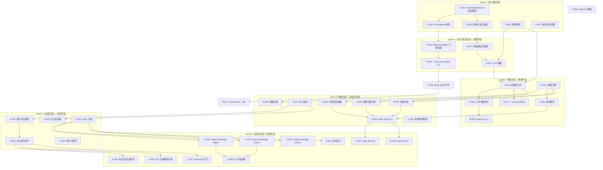
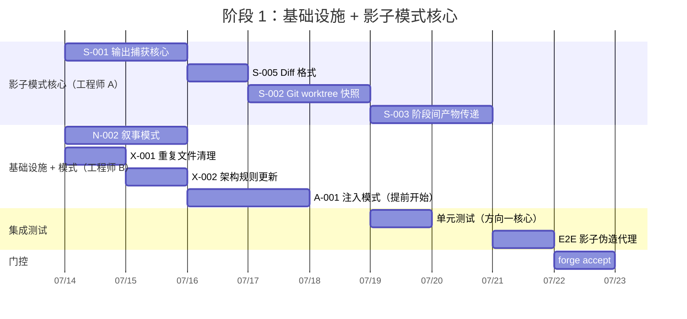
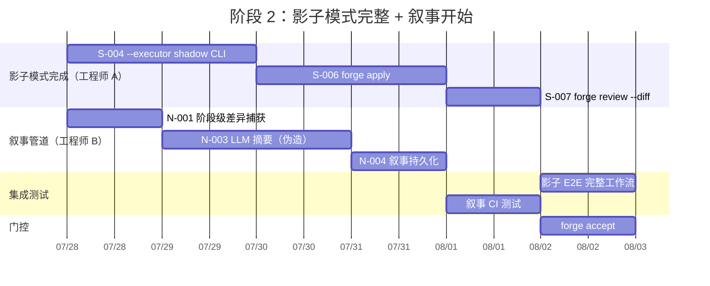
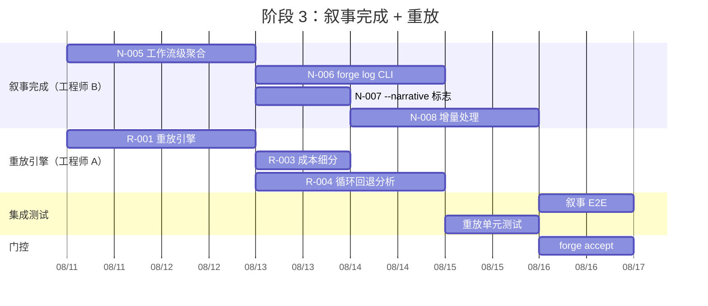
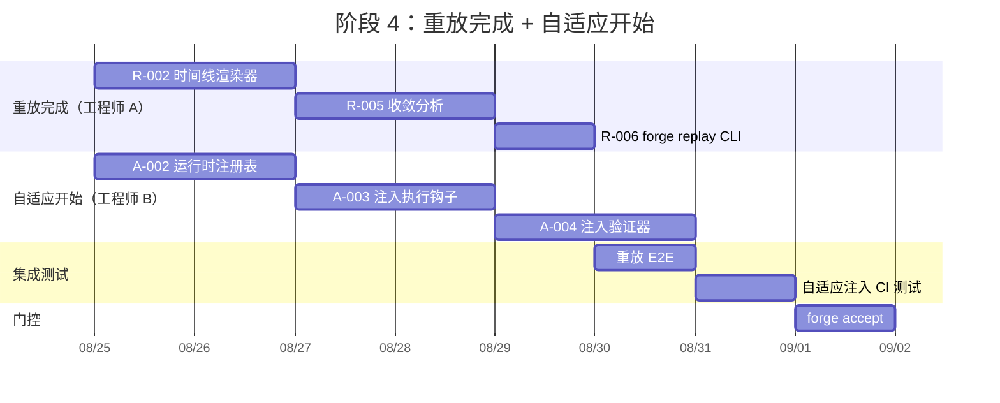
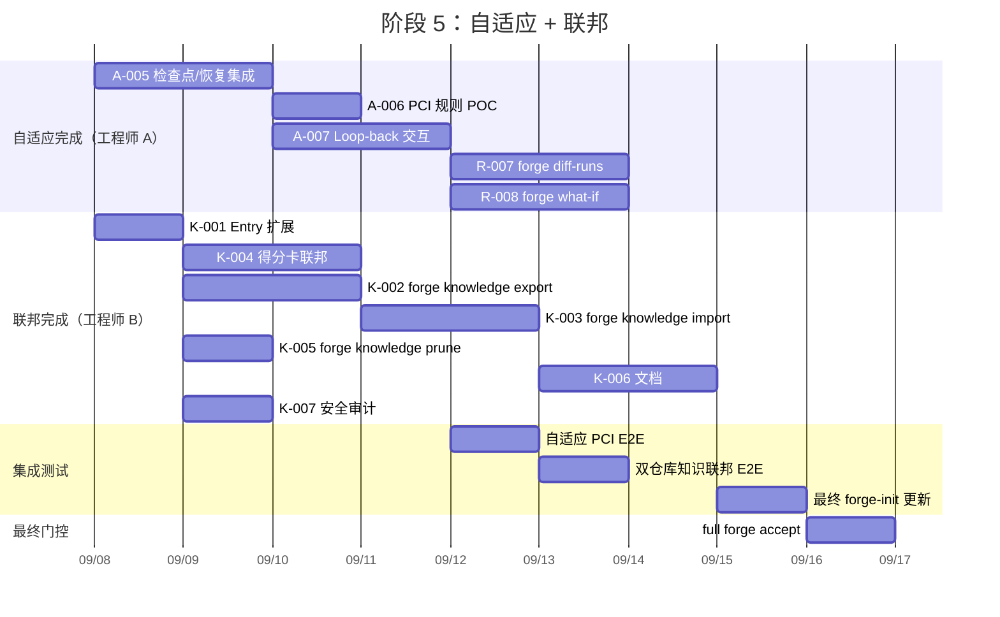

现在我已拥有全面了解。让我汇编一份详细的技术负责人分析报告。

---

# Tech Lead 分析报告：五个前瞻扩展方向

## 执行摘要

这份文档标识了 ForgeOS 中五个结构性的新方向。经过与现有代码库（~35K Go LOC、31 轮 sprint、一个已闭合的功能需求审计）的交叉验证，我确认这五个方向**确实尚未展开**，且不与其他 115+ 篇现有文件重叠。

**关键发现**：方向一（影子模式）和方向二（语义叙事）共享一个关键基础设施——阶段级 diff 捕获。这种复用将两个方向的合并投入从 4 个 sprint 压缩至约 2.5 个 sprint。结合方向四（重放与取证），这三个方向形成了一个自洽的产品体验三件套——`预览 → 可读产出 → 事后剖析`——在无需架构级重写的情况下将 ForgeOS 从"技术验证"推向"可用的产品"。

---

## 1. 任务分解

所有任务粒度均为 2-4 小时，属于一次专注工作时长内可完成的合理规模。

### 方向一：演示模式 "提案专用" 执行（P1——信任模型）

| 任务 ID | 标题 | 文件影响 | 前置依赖 | 工时 | 验收标准 |
|---|---|---|---|---|---|
| S-001 | **CommandExecutor output capture** — 在不落实磁盘的情况下捕获代理 stdout（统一差异 + 结构化输出） | `engine_build.go`、`internal/orchestrator/executor.go` | — | 4h | `CommandExecutor` 新增 `CaptureOnly` 模式，返回 `([]byte, error)` 而非写入磁盘；测试使用伪造的代理输出坐实捕获 |
| S-002 | **Git worktree / tmpfs 快照机制** — 影子运行的工作目录隔离 | `engine_build.go`、新建 `internal/orchestrator/workspace.go` | S-001 | 4h | `git worktree add` 或 `tmpfs` 副本在影子运行期间创建并在之后销毁；原始工作树零修改 |
| S-003 | **Phase-to-phase 产物传递（临时）** — 影子快照在阶段之间传递产物（`task-plan.md` -> implementer） | `internal/orchestrator/workspace.go`、`engine_build.go` | S-002 | 3h | 临时快照在阶段间维护时维护产物；在 implementer 阶段，planner 的 `task-plan.md` 存在且可读 |
| S-004 | **`forge run --executor shadow` CLI 集成** — 新增 CLI 标志并接入 `execEngine` | `main.go`、`engine_build.go`、`run_opts.go` | S-001, S-003 | 3h | `--executor shadow` 运行完整的代理工作流，生成统一差异输出；CLI 打印"影子运行完成。差异：<path>" |
| S-005 | **结构化差异输出格式** — 统一差异 + JSON 变更清单（文件列表、状态、LOV 增量） | 新建 `internal/diff/capture.go` | S-001 | 3h | 输出中包含可由机器解析的 JSON 清单（`files_changed`、每个文件的`loc_delta`），独立于统一差异文本 |
| S-006 | **`forge apply <shadow-id>` 命令** — 审查后应用影子差异 | 新建 `cmd/forge/apply.go`（或扩展现有 `approve.go`） | S-005 | 3h | `forge apply shadow-xxx` 将暂存的差异应用到工作树；`forge apply --reject` 丢弃快照 |
| S-007 | **`forge review --diff <shadow-output>` 集成** — 将管道输出管道连接到审查工作流 | `cmd/forge/review.go`（若有）或 `engine_build.go` | S-006 | 2h | 审查工作流可接收影子差异作为输入，并输出批准/变更请求裁决 |

**方向一总计：22 小时（~3 个工作日）**

---

### 方向二：语义变更叙事管道（P1——可审计性）

| 任务 ID | 标题 | 文件影响 | 前置依赖 | 工时 | 验收标准 |
|---|---|---|---|---|---|
| N-001 | **阶段级差异捕获基础设施**（复用 S-001 的输出捕获） | `internal/diff/capture.go`（若已存在） | S-005 | 2h | 每个代理阶段后，计算相对于阶段开始基线的 `git diff`；存储原始 diff 数据 |
| N-002 | **变更叙事模式** — 定义 `Narrative` 结构体及其持久化 | 新建 `internal/narrative/schema.go` | — | 3h | `Narrative` 模式定义并通过 JSON 往返验证；兼容向后（旧运行=空叙事） |
| N-003 | **LLM 变更摘要生成** — 对 diff 调用 LLM 以生成结构化摘要 | 新建 `internal/narrative/summarize.go` | N-001, N-002 | 4h | 给定统一差异输入，返回 `Narrative` 并填写 `Summary` 和 `Changes[].Summary`；将 LLM 生成的字段标记为 `generated_by: claude` |
| N-004 | **叙事持久化** — 将叙事写入 `.forge/narrative/<run-id>.json` | 新建 `internal/narrative/store.go` | N-002, N-003 | 2h | 叙事写入磁盘；可通过 `run-id` 检索；与检查点同时，空叙事不会出错 |
| N-005 | **工作流级聚合** — 将所有阶段的叙事合并为一份变更日志 | `internal/narrative/aggregate.go` | N-004 | 3h | 工作流完成后，聚合叙事以人类可读的格式呈现（planner 做了 X，implementer 做了 Y，审查者批准了 Z） |
| N-006 | **`forge log --run <id>` CLI 命令** — 读取并显示运行叙事 | 新建 `cmd/forge/log.go` | N-005 | 3h | `forge log --run build-42` 打印聚合变更日志 + 每个阶段的详情 |
| N-007 | **`--narrative` 标志（选择加入）** — 仅在明确请求时启用叙事 | `run_opts.go`、`engine_build.go` | N-004 | 1h | 无 `--narrative` 时零开销；启用时，阶段后执行正确的差异捕获 + LLM 调用 |
| N-008 | **增量处理** — 处理包含循环回退的场景（版本化差异而非线性差异） | `internal/narrative/store.go` | N-004 | 4h | 第二次 implementer 运行时，差异是相对于第一次运行后的状态计算；不会丢失覆盖 |

**方向二总计：22 小时（~3 个工作日）**

---

### 方向三：自适应工作流组合（P2——架构）

| 任务 ID | 标题 | 文件影响 | 前置依赖 | 工时 | 验收标准 |
|---|---|---|---|---|---|
| A-001 | **相位注入模式** — 声明式规则定义何时注入哪个相位 | 新建 `internal/dynamic/schema.go`、`asset/asset.go`（新增字段） | — | 4h | 模式支持基于触发器条件（风险等级、上下文匹配）的注入规则；YAML 序列化和反序列化通过测试 |
| A-002 | **运行时相位注册表** — `PhaseRegistry map[string]PhaseGenerator` 插入 `Engine` | `internal/orchestrator/orchestrator.go`、`engine_build.go` | A-001 | 3h | `orchestrator.Engine` 新增 `PhaseRegistry` 字段；`RunFrom` 在执行时调用注册表以检查注入 |
| A-003 | **注入执行钩子** — 在 `RunFrom` 主循环中集成 before-phase 和 after-phase 评估 | `internal/orchestrator/orchestrator.go` | A-002 | 4h | 每个阶段后，评估是否满足注入条件；若是，在不修改原始工作流的情况下将相位注入剩余序列 |
| A-004 | **注入验证器** — 加载时检查注入相位的前提条件（在 `after: X` 之前运行 X；`requires` 工具已声明） | 新建 `internal/dynamic/validate.go` | A-001 | 3h | 验证器在加载时捕获循环依赖和缺失的前提条件；在运行时拒绝无效的注入 |
| A-005 | **与检查点/恢复集成** — 注入的相位 ID 持久化在检查点中，以便在恢复时正确重建 | `internal/persist/checkpoint.go`、`internal/persist/checkpoint.go` | A-003 | 4h | 包含注入相位的恢复在工作流的正确阶段（重新创建注入的相位）恢复运行 |
| A-006 | **PCI 合规规则示例** — 可以作为 POC 的真实注入规则 | `.agent/policies/rules.yml`、`evolve.yml` | A-003 | 2h | 检测 payment 代码的规则（来自 `risk.FromChangedPaths` 信号）触发注入 `pci-compliance-gate` 阶段；测试模拟了 payment 变更并验证注入 |
| A-007 | **与 loop-back 交互**（v1 简化） — 重跑注入前的阶段时保留已注入的相位 | `internal/orchestrator/orchestrator.go`、`loop.go` | A-003, A-005 | 4h | 当 gate 失败且触发循环回退到先前阶段时，已注入的相位保留在序列中（不会消失，也不会重复注入） |

**方向三总计：24 小时（~3 个工作日）**

---

### 方向四：收敛重放与取证分析（P2——可观测性）

| 任务 ID | 标题 | 文件影响 | 前置依赖 | 工时 | 验收标准 |
|---|---|---|---|---|---|
| R-001 | **Trace 重放引擎** — 读取 `.forge/trace.jsonl` 并重建运行时时间线 | 新建 `internal/replay/engine.go`、`internal/replay/README.md` | — | 4h | 给定 run-id，从 trace.jsonl 加载事件并按时间线排序；返回 `Timeline` 结构体，包含按迭代、阶段和 gate 分组的事件 |
| R-002 | **时间线渲染器** — 将时间线数据渲染为 ASCII/终端输出 | 新建 `internal/replay/render.go` | R-001 | 3h | 渲染迭代时间线、阶段条、成本明细和循环回退分析，如规范中所示 |
| R-003 | **成本细分引擎** — 按代理/模型/阶段聚合成本（来自 `CostUsdMicros`） | `internal/replay/cost.go` | R-001 | 2h | 按代理（reviewer 42%、implementer 31% 等）和按模型（opus vs sonnet）进行成本细分；计入循环回退 |
| R-004 | **循环回退分析器** — 追踪循环回退跳转并分类为"有用"与"空转" | `internal/replay/loops.go` | R-001 | 3h | 检查点历史 + gate 裁决 + 审查者裁决，以确定每次循环回退是修复了问题还是做了无关的更改 |
| R-005 | **收敛分析** — 回答"为什么在迭代 N 收敛？" | `internal/replay/convergence.go` | R-001 | 3h | 显示每个迭代的 `RoadmapCompletion` 和 `GatesGreen` 信号演变；高亮收敛时的信号变化 |
| R-006 | **`forge replay <run-id>` CLI 命令** — 主入口点 | `cmd/forge/replay.go` | R-002, R-003, R-004, R-005 | 2h | `forge replay --latest` 打印完整的时间线 + 成本 + 循环回退 + 收敛分析 |
| R-007 | **`forge diff-runs <id-a> <id-b>`** — 运行间比较 | `cmd/forge/diff_runs.go`、`internal/replay/diff.go` | R-006 | 4h | 比较两个运行的成本、迭代次数、循环回退、gate 通过率、主要差异解释 |
| R-008 | **`forge what-if` 启发式模拟** — 基于历史数据估算 mode 切换的效果 | `cmd/forge/what_if.go`、`internal/replay/whatif.go` | R-006 | 4h | 给定运行 ID 和 mode 切换（例如，engineering -> balanced），估算成本节约和额外迭代次数；输出上诚实标注为"估算值" |

**方向四总计：25 小时（~3.5 个工作日）**

---

### 方向五：多实例知识联邦（P3——护城河）

| 任务 ID | 标题 | 文件影响 | 前置依赖 | 工时 | 验收标准 |
|---|---|---|---|---|---|
| K-001 | **Memory Entry 扩展** — 添加 `Origin`、`Namespace`、`ShareLevel` 字段 | `internal/memory/memory.go` | — | 2h | `Entry` 获得新字段，向后兼容 JSON（`omitempty`）；旧条目加载为新字段为空 |
| K-002 | **`forge knowledge export` CLI** — 将知识导出为可移植的 JSON 文件 | `cmd/forge/knowledge_export.go`、新建 `internal/knowledge/export.go` | K-001 | 3h | `forge knowledge export --since 7d` 生成有效的知识包；支持 `--min-confidence` 过滤器 |
| K-003 | **`forge knowledge import <file>` CLI** — 将知识选择性合并到本地存储 | `cmd/forge/knowledge_import.go`、新建 `internal/knowledge/import.go` | K-001 | 3h | 导入项通过 `filterSuperseded`（置信度 + 时间戳记优先）进行去重和冲突解决；已存在的项不重复 |
| K-004 | **得分卡联邦聚合** — 跨实例收集模型性能数据 | `internal/routing/scorecard.go`、`internal/knowledge/federate.go` | — | 4h | `forge scorecard --federate` 从配置的路径/URL 读取外部得分卡并聚合为跨实例统计 |
| K-005 | **`forge knowledge prune`** — 基于年龄/置信度的生命周期管理 | `cmd/forge/knowledge_prune.go`、`internal/memory/memory.go`（扩展 Prune） | K-001 | 2h | `forge knowledge prune --older-than 90d` 移除旧条目；`--min-confidence 0.5` 移除低置信度条目 |
| K-006 | **基于 Git 的知识分发配方** — 组织知识仓库的文档 + 工作流 | `docs/guides/knowledge-federation.md` | K-002, K-003 | 3h | 指南记录了 `git init forge-knowledge` -> `forge knowledge export` -> `git commit` -> 远程仓库 -> `forge knowledge import` 的工作流 |
| K-007 | **联邦安全注意事项** — `share_level` 执行注释 + 审计日志记录 | `internal/memory/memory.go`、`cmd/forge/knowledge_export.go` | K-001 | 2h | 导出日志包含 `share_level`；在知识日志中添加了关于手动覆盖检查的诚实注释 |

**方向五总计：19 小时（~2.5 个工作日）**

---

### 基础设施与跨领域任务

| 任务 ID | 标题 | 文件影响 | 前置依赖 | 工时 | 验收标准 |
|---|---|---|---|---|---|
| X-001 | **重复文件清理** — 合并 `2026-07-11-five-novel-perspectives-product-architect.md` 和 `2026-07-11-five-product-architecture-expansion-directions.md` | `docs/requirements/` | — | 1h | 一个文件被删除，另一个保留；`diff` 确认内容一致 |
| X-002 | **架构规则更新** — 更新 `.arch/rules.yaml` 以适应新包（`internal/narrative`、`internal/replay`、`internal/knowledge`、`internal/dynamic`、`internal/diff`） | `.arch/rules.yaml` | — | 1h | 新包注册了各自的最大文件数和最大扇出；`arch-check.mjs` 通过 |
| X-003 | **`forge-init` 更新** — 将新工具和模板添加到脚手架 | `harness/forge-init` 模板 | 各个方向 | 2h | 新项目通过 `forge accept` 获得所有清理的基线和诚实标注的 N/A |

---

## 2. 执行顺序

所有任务 ID 都是前向引用的——没有循环依赖。关键依赖性如下：

- **S 系列**（影子模式）是一条严格的链：S-001 → S-002 → S-003 → S-004 → S-005 → S-006 → S-007
- **N 系列**（叙事）与 S 共享 S-005：N-001 需要 S-005 进行差异捕获；在 S-005 之前，N 任务可以进行模式设计（N-002）
- **A 系列**（自适应工作流）在架构上独立于 S/N，但需要了解模式（A-001）和编排器（A-002、A-003）
- **R 系列**（重放）依赖于轨迹数据模式——已经存在，因此没有代码级依赖
- **K 系列**（联邦）依赖于内存模式——已经存在，因此没有代码级依赖

### 并行执行组

| 组 | Sprint | 任务 | 需配合的工程师 | 关键约束 |
|---|---|---|---|---|
| **组 1** | Sprint 1 | S-001, S-002, S-005, N-002, X-001 | 2 | S-001 和 S-005 共享相同的输出捕获核心；N-002 可独立进行 |
| **组 2** | Sprint 1-2 | S-003, S-004, N-001, N-003 | 2 | N-001 在 S-005 完成后可用；S-003/S-004 在 S-002 上串行 |
| **组 3** | Sprint 2 | N-004, N-005, N-006, N-007, R-001, R-003 | 2 | R-001 仅依赖于轨迹模式，可提前开始 |
| **组 4** | Sprint 3 | N-008, R-002, R-004, R-005, R-006, A-001, X-002 | 2 | R-002/4/5 在 R-001 之后串行 |
| **组 5** | Sprint 4 | A-002, A-003, A-004, K-001, K-004 | 2 | A-002/3 在 A-001 串行之后；K-001/K-004 与 A 系列可并行 |
| **组 6** | Sprint 5 | A-005, A-006, A-007, K-002, K-003, K-005, K-006, K-007, R-007, R-008 | 2-3 | A-005/6/7 在 A-003 串行之后；K 系列在 K-001 之上构建；R-007/8 与 A/K 可并行 |

---

## 3. 技术风险

### 3.1 高风险项

| # | 风险 | 方向 | 可能性 | 影响 | 缓解措施 |
|---|---|---|---|---|---|
| R1 | **git worktree 保真度** — `git worktree add` 会很慢（大仓库），且在未提交的更改上失败。`tmpfs` 副本可能是不完整的（未追踪的文件、符号链接） | 方向一 | 中 | 高 | 具有 `tmpfs` 回退的层次化方法：首先尝试 `git worktree`，如果 HEAD 是干净的（E2E 测试）；退回到 `cp -r --reflink=auto`；为外部依赖项（数据库、API）添加诚实警告 |
| R2 | **LLM 摘要幻觉** — N-003 要求 LLM 总结更改。LLM 可能会遗漏关键更改或发明不存在的更改 | 方向二 | 高 | 高 | **抗幻觉架构**：机械证据（来自 `diff --stat` 的 `loc_delta`、来自 `git diff` 的 `files_changed`）与 LLM 的 `summary` 分开发布。LLM 生成的字段标记为 `generated_by: claude`。添加测试来强制：摘要从不报告零行程以上的 `loc_delta` |
| R3 | **检查点/恢复兼容性** — 方向三注入的相位在检查点中存储为线性索引。恢复时，索引偏移可能会注入到错误位置 | 方向三 | 高 | 高 | 注入的相位获取稳定 ID（UUID），在检查点中序列化。恢复时，在恢复执行之前按 ID 重建注入的相位。用注入的相位快照覆盖的检查点序列化/反序列化测试 |
| R4 | **Trace 模式演进** — R-001 与 `trace.Event` JSON 模式紧密耦合。模式的未来更改可能会破坏重放 | 方向四 | 中 | 中 | 将 `_format` 版本字符串（`"forgeos.trace.v1"`）集成到轨迹 `Event` 中。重放引擎为每个版本号使用最高检版本读取器。没有任何"当前格式总是正确的"假设 |
| R5 | **联邦安全/隐私** — 知识条目可能包含敏感信息（"服务 X 的 /admin 端点未授权"）。`share_level` 无法在技术上强制实施 | 方向五 | 高 | 中 | **诚实架构**：与 git commit 签名模型相同的自治理模型——实例按照配置行事，没有客户端强制。文档将此记录为已知限制。添加日志审计追踪，以便在事后检测到泄露。v2 计划使用加密 + 签名 |
| R6 | **影子模式成本** — 影子运行调用 LLM，成本几乎是实时运行的 100%（仅节省了应用步骤）。用户可能会将其误解为"免费预览" | 方向一 | 高 | 中 | 在影子运行开始时添加清晰的成本预告：`forge: 影子运行调用 LLM —— 估计成本：$X.YZ`。除非确认，否则不要允许在预算紧张的情况下运行 |
| R7 | **注入的相位钩子开销** — 每个阶段后评估注入条件会增加编排器开销。如果规则复杂（LLM 调用），这会很显著 | 方向三 | 低 | 中 | **廉价的布尔代数规则**：注入条件设计为纯布尔表达式（风险水平 >= 高），从不调用 LLM。添加性能基准并针对基线（无注入规则的 `RunFrom`）跟踪 |
| R8 | **`forge diff-runs` 非确定性** — 两次相同的运行可能在循环回退选择上有所不同（LLM 输出非确定性）。这可能会让用户困惑："同样的输入却有不同的输出？" | 方向四 | 中 | 低 | 记录差异是由 LLM 非确定性引起的预期行为。专注于结构差异（成本、持续时间、gate 裁决），这些差异由机械机制决定，而不是由 LLM 决定 |

### 3.2 外部依赖

| 依赖项 | 方向 | 状态 | 备注 |
|---|---|---|---|
| 用于差异捕获的 `git worktree` | 方向一 | 已就绪（系统 git） | 大仓库上的性能问题不是阻塞性的 |
| 用于 JSONL 解析的 `bufio.Scanner` | 方向二、四 | 已就绪（stdlib） | 默认缓冲区大小对于大型轨迹可能会不足——轨迹事件已经是即时的 |
| `encoding/json` 用于模式序列化 | 方向三 | 已就绪（stdlib） | forge-core 零外部依赖约束得到满足 |
| Trace JSONL 文件（`.forge/trace.jsonl`） | 方向四 | 已就绪（Sprint 5 以来） | 重放所需的最低数据量已可用 |
| Memory JSONL 文件（`.forge/memory.jsonl`） | 方向五 | 已就绪（Sprint 5 以来） | 联邦构建在现有机制之上 |

### 3.3 性能瓶颈

| 瓶颈 | 方向 | 当前状态 | 优化策略 |
|---|---|---|---|
| 每个阶段后的 `git diff` | 方向二 | 在小项目上 <100ms | 缓存 diff 输出；在工作流层面进行去重 |
| 每个阶段后的 LLM 摘要调用 | 方向二 | 每个调用 $0.01-0.05 | **选择加入**（`--narrative` 标志）以防止无提示成本；支持摘要缓存（相同的 `git diff` 哈希 -> 相同的摘要） |
| 大型轨迹上的轨迹重放 | 方向四 | 1000 个事件的轨迹 <50ms | 单个解析过程是 O(n)，内存中；
| 存储增长来自联邦 | 方向五 | 每个实例 <1MB/月 | `forge knowledge prune` TTL；导入时的置信度阈值；提示用户超过 10MB |

---

## 4. 资源评估

### 4.1 团队结构

我需要**2 名工程师**全职工作 5 个 sprint（每个 sprint 2 周）：

| 角色 | 技能 | 专注领域 | 分配比例 |
|---|---|---|---|
| **工程师 A**（Go 后端/CLI） | 精通 Go、编排模式、CLI 设计、git 操作 | 方向一（影子模式）、方向三（自适应工作流）、方向四（重放） | 100% |
| **工程师 B**（Go 后端/集成） | 精通 Go、LLM 集成、模式设计、文件 I/O | 方向二（叙事）、方向五（联邦）、方向四（重放 UI） | 100% |

**每个 sprint 的分配：**

| Sprint | 工程师 A | 工程师 B |
|---|---|---|
| **Sprint 1** | S-001, S-002, S-005（输出捕获 + 快照 + diff 格式） | N-002, X-001, X-002（叙事模式 + 清理） |
| **Sprint 2** | S-003, S-004, S-006（产物传递 + CLI + apply） | N-001, N-003, N-004（差异捕获 + 摘要 + 持久化） |
| **Sprint 3** | R-001, R-003, R-004（重放引擎 + 成本 + 循环回退） | N-005, N-006, N-007, N-008（聚合 + CLI + 增量） |
| **Sprint 4** | R-002, R-005, R-006, A-001（渲染器 + 分析 + CLI + 注入模式） | A-002, A-003, A-004（注册表 + 钩子 + 验证器） |
| **Sprint 5** | A-005, A-006, A-007, R-007, R-008（检查点 + 规则 + 循环回退 + diff-runs + what-if） | K-001, K-002, K-003, K-004, K-005, K-006, K-007（联邦完整） |

### 4.2 关键里程碑

| 里程碑 | 时间点 | 交付物 | 验证 |
|---|---|---|---|
| **M1：影子模式原型** | Sprint 1 结束 | 带有输出捕获和快照隔离的 `--executor shadow` | 伪造代理在使用影子模式运行时的输出如预期般被捕获；工作树保持不变 |
| **M2：影子模式完整版** | Sprint 2 结束 | `forge apply`、`forge review --diff`、阶段间产物传递 | 具有 3 个阶段的循环工作流在影子模式下运行，并通过 `forge apply` 应用 |
| **M3：叙事管道** | Sprint 3 结束 | `forge log --run`、差异捕获 + LLM 摘要、选择加入标志 | `forge run --narrative` 生成持久化的结构化叙事；`forge log` 读取并显示 |
| **M4：重放 + 取证** | Sprint 4 结束 | `forge replay`、成本细分、循环回退分析、收敛分析 | 真实的 `trace.jsonl` 输入生成可读报告；成本与已知总值匹配 |
| **M5：自适应工作流** | Sprint 5 结束 | 动态相位注入、检查点/恢复兼容、PCI 规则 | 模拟的 payment 代码更改触发 `pci-compliance-gate` 注入；通过检查点恢复保留该注入 |
| **M6：知识联邦** | Sprint 5 结束 | `forge knowledge export/import`、得分卡联邦、清理 | 导出一个实例的知识并导入到另一个实例，使用冲突解决正常工作 |

### 4.3 阻塞点（Blockers）

| Blocker | 涉及方向 | 解决策略 |
|---|---|---|
| 影子模式 E2E 测试需要真正的 LLM | 方向一 | **预算请求**：每次 E2E 测试约需 $0.50-$2.00。准备一个正式的预算请求，详细说明测试计划（3 个测试场景 × 2 次运行 ≈ $6）。与 Sprint 24-26 的先例相同——需获得用户显式批准 |
| 叙事 LLM 摘要的成本 | 方向二 | **选择加入默认关闭**：`--narrative` 标志。在 sprint 文档中明确标识：仅当用户明确请求时才会产生成本 |
| 注入的相位验证器需要类型安全的相位引用 | 方向三 | **使用 A-004（注入验证器）构建**：在加载时（而非运行时）解析 `after: X` 引用，因此无效规则会立即失败 |
| 联邦需要跨仓库测试 | 方向五 | **使用本地文件系统测试**：创建两个临时仓库，在每个仓库中初始化 forge，导出记忆，导入到另一个。不需要真实的 GitHub 仓库 |

---

## 5. 质量保证

### 5.1 单元测试覆盖

| 包/面积 | 所需覆盖 | 最小测试数量 | 关键边界 |
|---|---|---|---|
| `internal/orchestrator`（影子执行器） | 新代码 90%+ | 15+ | 影子模式成功捕获、快照创建/销毁错误、阶段间产物传递缺失、`forge apply` 冲突 |
| `internal/orchestrator`（动态注入） | 新代码 85%+ | 20+ | 条件匹配/不匹配、循环回退时的注入保留、检查点序列化/反序列化、多重注入、无效条件（安全降级） |
| `internal/diff` | 95%+（纯函数） | 10+ | 空差异、二进制文件、具有已删除/重命名文件的差异、大差异截断、`loc_delta` 正确性 |
| `internal/narrative` | 90%+ | 15+ | 叙事序列化/反序列化、LLM 摘要边界（空、小、大 diff）、增量合并正确性、缺失阶段数据 |
| `internal/replay` | 90%+ | 20+ | 空的 `trace.jsonl`、损坏的轨迹、有/无成本的轨迹、有/无循环回退、重叠事件、成本细分正确性与原始数据 |
| `internal/knowledge` | 90%+ | 15+ | 具有额外字段的条目导入和导出、冲突解决（置信度和时间戳记优先级）、联邦得分卡聚合、TTL 清理 |
| `cmd/forge`（新命令） | 新路径 85%+ | 每个命令 5+ | CLI 参数解析、错误输出（非零退出）、`--help` 文本、JSON 输出模式（如果支持） |

### 5.2 集成测试策略

| 测试场景 | 方向 | 方法 | 环境 |
|---|---|---|---|
| 影子模式的 E2E 完整运行 | 方向一 | 伪造代理（`echo`）模拟多阶段工作流；验证输出捕获和快照隔离 | CI（零成本） |
| 影子模式 + 真正的 LLM（可选） | 方向一 | 使用 `--agent-cmd claude` 和 `--agent-max-budget-usd 0.5` 调用真实的 claude | 仅在用户授权后，在专用分支上 |
| 带叙事的 E2E | 方向二 | 伪造代理运行 + `--narrative`；验证 `.forge/narrative/` 存在且内容格式正确 | CI |
| 带注入的 E2E | 方向三 | 伪造条件匹配（总是注入）+ 真实工作流；验证注入的相位在正确的点运行 | CI |
| 来自真实轨迹的重放 | 方向四 | 使用先前 sprint 的现有 `trace.jsonl` 文件 | CI |
| 知识联邦 E2E | 方向五 | 两个临时仓库：导出/导入周期；验证知识在两个仓库中均可见 | CI |

### 5.3 代码审查要点

| 审查重点 | 涉及方向 | 具体检查内容 |
|---|---|---|
| **目录隔离语义** | 方向一 | 影子快照是否以可预测、可测试的方式创建和销毁？阶段间产物传递是否精确，还是存在"可能"数据泄露？ |
| **LLM 内容与机械事实的分离** | 方向二 | `summary` 字段是否标记为 `generated_by`？`loc_delta` 和 `files_changed` 是纯粹从 `git diff --stat` 派生，还是允许 LLM "校正"它们？ |
| **安全下限** | 方向三 | 注入的相位是否永远不能跳过现有的安全相位（reviewer、Opus-only）？`production` 生命周期是否覆盖所有注入条件？ |
| **诚实标注** | 方向四 | `forge what-if` 输出是否包含"估算值"的诚实免责声明？非 LLM 成本是否与 LLM 驱动的成本区分开来？ |
| **权限边界** | 方向五 | 导出的知识是否无法包含任何禁止导出的内容（`share_level: local`）？导出前是否有审计日志？ |

### 5.4 性能测试需求

| 测试 | 方向 | 指标 | 目标 |
|---|---|---|---|
| 影子模式快照时间 | 方向一 | 仓库克隆持续时间 | 在 100MB git 仓库上 <5s |
| 叙事差异捕获开销 | 方向二 | 阶段时间开销 | 在 1000 个文件的仓库上 <1s |
| 注入条件评估开销 | 方向三 | 每个阶段的额外时间 | 50 个纯布尔规则 <1ms |
| 轨迹重放时间 | 方向四 | 1000 个事件的解析 + 渲染 | <500ms |
| 知识导入吞吐量 | 方向五 | 每秒处理条目 | 10MB 文件 <1s |
| 并发联邦得分卡聚合 | 方向五 | 10 个实例的平均值 | <2s |

---

## 6. 实施计划

### 阶段 1：基础设施 + 影子模式（Sprint 1，第 1-2 周）

**此阶段末端的门控：**
- `--executor shadow` 对于伪造的 3 阶段工作流有效
- diff 输出格式匹配指定的模式
- 所有 `arch-check.mjs` 检查通过（包括新包）
- `forge accept: ACCEPTED`

### 阶段 2：影子模式完整 + 叙事管道（Sprint 2，第 3-4 周）

**此阶段末端的门控：**
- `forge apply` 和 `forge review --diff` 在伪造代理上 E2E 工作
- 叙事持久化与检查点一致
- 为方向一和方向二添加的新 `forge-init` 模板

### 阶段 3：叙事完成 + 重放开始（Sprint 3，第 5-6 周）

**此阶段末端的门控：**
- `forge log --run <id>` 在真实的 `.forge/` 状态下 E2E 工作
- `forge replay` 从现有的 `trace.jsonl` 数据（来自之前 sprint 的文件）输出有效数据
- 为 `internal/narrative` 和 `internal/replay` 包更新的架构检查

### 阶段 4：重放完成 + 自适应工作流（Sprint 4，第 7-8 周）

**此阶段末端的门控：**
- `forge replay --latest` 显示完整的彩色时间线 + 成本明细
- 动态相位注入对伪造规则 E2E 工作
- 随着包 `internal/dynamic` 的添加，架构检查通过

### 阶段 5：自适应完成 + 联邦完成（Sprint 5，第 9-10 周）

**此阶段末端的门控：**
- `forge diff-runs 5 7` 和 `forge what-if --run 7 --switch mode=explorer` 产生有效的输出
- PCI 合规规则在模拟 payment 更改时注入额外的 gate 阶段
- 联邦的导出/导入周期在双仓库设置上 E2E 工作
- **最终的 `forge accept: ACCEPTED`**，所有 5 个方向完整

---

## 7. 架构红线（强制执行，不可违反）

以下是实施过程中**必须**满足的工程规则：

1. **forge-core 零外部依赖** — `go.mod` 中无新 `require` 条目。新包（`internal/diff`、`internal/narrative`、`internal/replay`、`internal/dynamic`、`internal/knowledge`）使用纯 stdlib。

2. **`cmd/forge` 包文件预算** — 实施前的当前状态：15 个文件，`package.max_files: 16`。新命令（`apply.go`、`log.go`、`replay.go`、`knowledge_export.go`、`knowledge_import.go`、`knowledge_prune.go`）将把文件数推到 21+。**必须**按照 Sprint 29 的先例将逻辑提取到 `internal/` 包中，而不是将 `package.max_files` 抬升到 22。

3. **安全下限覆盖注入的相位** — `production` 生命周期（`mode.Effective` 输出）必须覆盖注入的相位。`reviewer` 和 `architect` 等安全相位绝不能通过自适应注入绕过。

4. **诚实标注优于虚构信号** — `generated_by: claude` 必须在每个 LLM 生成的叙事字段上设置。`forge what-if` 输出必须以"估计值：基于历史数据的统计推断"开头。

5. **每 2 个 sprint 进行 fresh-context 审查** — AGENTS.md 规则"审查者必须是 fresh-context 独立代理"。规划在 Sprint 3 和 Sprint 5 末进行专门的审查冲刺。

---

## 8. 建议

分析文档的收敛建议（**方向一 + 方向二 + 方向四**作为产品体验三件套）在工程上是可靠的。这三个方向共享基础设施（差异捕获、轨迹模式），可以以最小的架构碎片化交付。我建议：

1. **从方向一开始**（影子模式）——它是其他方向的依赖项，并且直接解决"企业采用"的障碍
2. **工作到 Sprint 3 的方向四**（重放）——构建在方向二的叙事工作之上，完成"预览→审计→回溯"的循环
3. **Sprint 4-5 的方向三 + 方向五**（自适应工作流 + 联邦）——作为架构增强，在产品三件套获得落地经验后进行

此序列最小化了上下文切换，并确保在每个 sprint 末都有**可演示的增量价值**——这对于保持利益相关者的认同至关重要。
