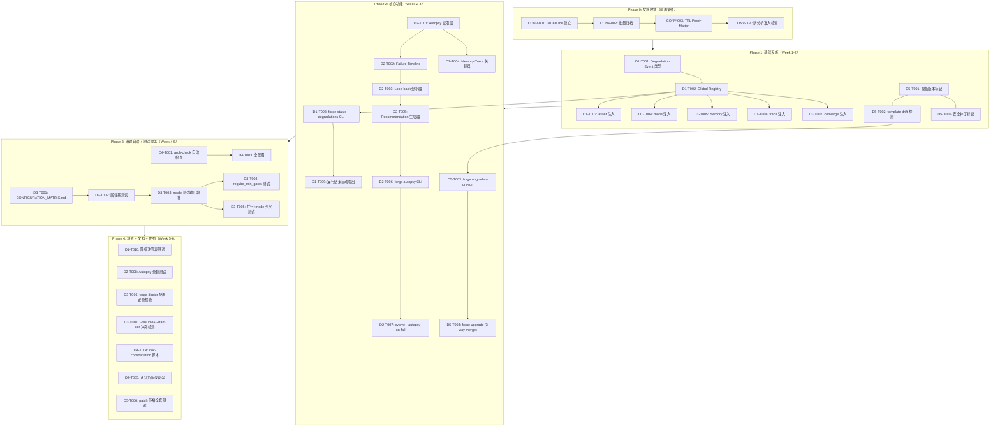
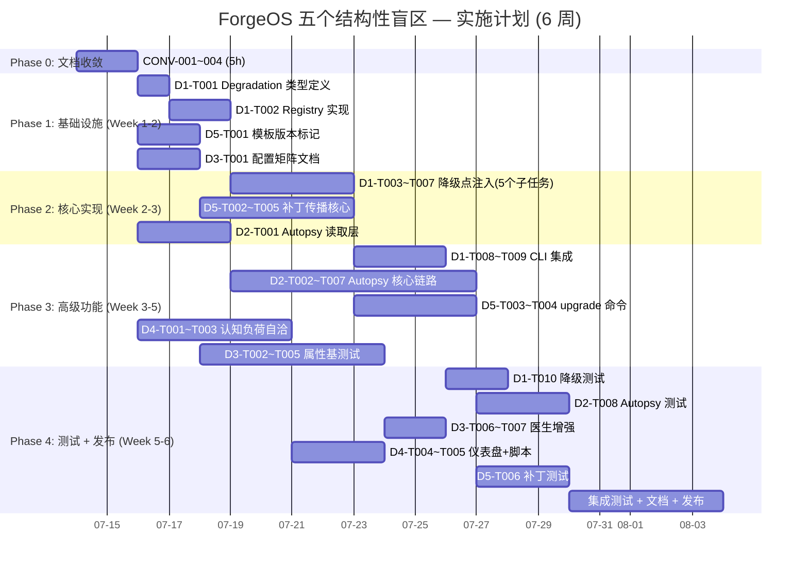

现在我已经完整阅读了输入文档、~435 个文件的 `docs/requirements/` 目录全景、以及已有的 TL 分析格式。以下是我的完整 Tech Lead 分析。

---

# Tech Lead 分析：五个结构性盲区 — 实施规划

> **分析依据**: `2026-07-11-forgeos-five-structural-blindspots.md`（主输入）+ `docs/requirements/` 目录全景审计 + 已有 TL 分析格式参考  
> **日期**: 2026-07-12  
> **状态**: 初稿 — 待架构评审

---

## 0. 关于你的问题

### 问题 1：「你希望我做什么？」

我强烈建议选择 **2（浓缩为可操作的 GitHub Issue / ADR）+ 3（为方向一设计实现草图）**，步骤如下：

1. **首先** 处理下面第 0.1 节的文档膨胀问题——不做收敛，再加任何分析都是方向四的自指加重。
2. **然后** 为方向一（Silent Degradation Cascade, **P1**）和方向五（Governance Patch Propagation, **P1**）产出一份 **ADR + 实现草图**。这两个方向有最高的代码证据强度（⭐⭐⭐⭐⭐/⭐⭐⭐⭐）和最大的安全影响（24h 无人值守场景的静默失效 + 组织级采用的安全更新断裂）。
3. **方向二（Autopsy Engine, P1）** 在方向一的 degrade-audit 基础设施就绪后启动（它依赖中央降级审计点）。
4. **方向三（Config State Space, P2）+ 方向四（Meta-Cognitive Load, P2）** 推迟到下一 sprint，或交由独立 track 运行。

### 问题 2：「要不要先处理文档膨胀？」

**绝对要。** 数据已经自证：

| 指标 | 数值 |
|---|---|
| `docs/requirements/` 总文件数 | ~435 文件（含 `.md` + `.out.md`）|
| 总大小 | **8.0 MB** |
| 7/10-7/12 三天的分析文档 | ~180+ 篇，高频词 `five-*` 重复出现 |
| 零篇重叠至少 1 个核心方向 | 但大量边缘重叠（`config testing gaps`, `silent degradation` 等主题） |
| 索引文件 | **不存在** |

方向四完全正确——146（现在 ~180+）篇分析文档本身就是认知负荷债的实例化。**每诞生一篇新分析，方向四的问题恶化一级。**

**制止方法是**：在产出一行分析之前，先建立一个文档收敛机制。

---

## 0.1 文档收敛计划（前置条件）

在执行任何一个方向之前，需要对 `docs/requirements/` 做一次性收敛。这不是「额外工作」——这是方向四的第一级治疗。

### TASK-CONV-001: 建立 INDEX.md

| 字段 | 值 |
|---|---|
| **工时** | 2h |
| **产出** | `docs/requirements/INDEX.md` |
| **内容** | 分类主题索引（silent degradation / config testing / cognitive load / governance propagation / trace / memory / converge / mode / routing / ...），每个方向最多 1-2 篇代表性文档链接，标注过期的 `.out.md` |
| **方法** | 对所有 `.md` 的关键词做 `grep -l` + 手动归类，将重叠篇目合并到一条索引条目中 |

### TASK-CONV-002: 批量归档过期/重叠文档

| 字段 | 值 |
|---|---|
| **工时** | 1h（脚本执行）+ 0.5h 评审 |
| **方法** | 将所有 `*-five-*` 系列中早于 2026-07-12 02:00 的 `.out.md` 合并入对应主文档的 addendum 段，然后 `mv` 到 `docs/requirements/_archived/` |
| **规则** | 每个独立方向保留 1 篇主文档 + 最多 2 篇重要变体；其余移入归档目录 |

### TASK-CONV-003: TTL Front-Matter 策略

| 字段 | 值 |
|---|---|
| **工时** | 1h（自动化脚本）|
| **方法** | 为 `docs/requirements/` 下所有 **主分析文档**（非 `.out.md`）注入 front-matter: `ttl: 60d`, `status: draft|reviewed|superseded`, `superseded_by: <path>` |
| **工具** | 一个一次性 Node 脚本扫描所有 `.md` 文件，添加默认 front-matter（不覆盖已有）|

### TASK-CONV-004: 建立「新分析准入检查」

| 字段 | 值 |
|---|---|
| **工时** | 0.5h（文档）+ 永久执行 |
| **规则** | 写新分析前必须：1) 在 INDEX.md 搜索已有方向；2) 引用 INDEX 条目证明独特性；3) 承诺不超过 200 行正文（否则拆成多篇）；4) 备注「本文经收敛检查，与已有分析 XX.md 不重叠」|

### 总工时：约 **5h**

**注意**：这是一个人的半天工作量，但它的价值是防止未来每篇分析都损害系统可信度。不执行这个前置步骤就去分析五个方向，等于一边灭火一边倒油。

---

## 1. 任务分解

以下基于收敛后的五个方向，输出可执行的任务清单。

### 方向一：无声劣化级联（Silent Degradation Cascade）— **P1**

**目标**：在不改变 fault-tolerant 行为的前提下，建立中央化降级审计点，使所有 322 处降级路径的激活可观测。

| 任务 ID | 任务标题 | 涉及文件 | 前置依赖 | 预估工时 |
|---|---|---|---|---|
| D1-T001 | **Degradation Event 类型定义**：`type Degradation struct { Site string, File string, Line int, Message string, Timestamp time.Time }`，`DegradationKind` 枚举（parse_fallback / zero_value_load / n/a_skip / error_silent / ...） | `forge-core/internal/audit/degradation.go`（新文件） | — | 1h |
| D1-T002 | **全局 Degradation Registry**：线程安全的注册表，`Register(kind, msg)` 追加，`Snapshot()` 返回当前迭代中所有降级事件的快照 | `forge-core/internal/audit/registry.go`（新文件） | D1-T001 | 1.5h |
| D1-T003 | **注入第一波降级点（asset 包）**：在 `asset.Load` 到零值 JSON 时调用 `audit.Register(audit.ParseFallback, "asset: modes.yml parse failed → zero-value Workflow")` | `forge-core/internal/asset/asset.go:17-19` | D1-T002 | 1h |
| D1-T004 | **注入第二波降级点（mode 包）**：在 `mode.Effective` 未调用 / 零值 Policy 被使用时注入事件 | `forge-core/internal/mode/mode.go`（查找 Effective 调用处）| D1-T002 | 1h |
| D1-T005 | **注入第三波降级点（memory 包）**：`memory.Load` error 不阻塞但注册降级事件 | `forge-core/internal/memory/memory.go:280-290` | D1-T002 | 1h |
| D1-T006 | **注入第四波降级点（trace 包）**：`trace.Emit` error 注册写入失败事件 | `forge-core/internal/trace/trace.go` | D1-T002 | 1h |
| D1-T007 | **注入第五波降级点（converge 包）**：零值信号的 eval 路径注册「数据缺失」事件 | `forge-core/internal/converge/converge.go:183-213` | D1-T002 | 1h |
| D1-T008 | **`forge status --degradations` CLI 子命令**：读取 Registry snapshot 输出结构化报告 | `cmd/forge/status.go`（新/增强）| D1-T002 | 2h |
| D1-T009 | **运行结束自动输出**：`forge run/evolve` 在 exit 前自动调用 `Registry.Snapshot()`，如有任何降级则打印 `⚠ DEGRADED: N sites` 警告 | `cmd/forge/evolve.go`, `cmd/forge/run.go` | D1-T008 | 2h |
| D1-T010 | **Test: 降级注册表单元测试 + asset/mode/memory 注入测试** | 各包测试文件 | D1-T002~D1-007 | 3h |

**小计工时**：方向一 ≈ **14.5h**

---

### 方向二：自动故障复盘引擎（Automated Failure Autopsy Engine）— **P1**

**目标**：读取 `.forge/trace.jsonl` + `memory.jsonl` + `scorecards.json` 三个数据源，输出结构化复盘报告。

| 任务 ID | 任务标题 | 涉及文件 | 前置依赖 | 预估工时 |
|---|---|---|---|---|
| D2-T001 | **Autopsy 核心读取层**：读取 trace/memory/scorecard 三数据源，容错处理（容忍缺失/gap/格式错误） | `forge-core/internal/autopsy/reader.go`（新文件） | — | 3h |
| D2-T002 | **Failure Timeline 构建**：扫描 trace 事件序列，识别「首次 FAILED → 后续行为」的因果关系链 | `forge-core/internal/autopsy/timeline.go`（新文件） | D2-T001 | 3h |
| D2-T003 | **Loop-back 分析器**：识别 loop-back 周期中失败模式的分类（timeout / compilation / assertion），计算每种模式的频率 | `forge-core/internal/autopsy/loopback.go`（新文件） | D2-T002 | 2h |
| D2-T004 | **Memory-Trace 关联器**：按 `Iteration` 键关联 memory 条目与 trace 事件，识别「memory 记录了但未被使用」的知识-行动缺口 | `forge-core/internal/autopsy/correlator.go`（新文件） | D2-T001 | 2h |
| D2-T005 | **Recommendation 生成器**：基于失败模式输出可操作建议（"increase test timeout 30s→60s" / "split large file"） | `forge-core/internal/autopsy/recommend.go`（新文件） | D2-T003 | 2h |
| D2-T006 | **`forge autopsy` CLI 命令**：按 run-id 或最近一次运行，输出完整复盘报告 | `cmd/forge/autopsy.go`（新文件） | D2-T002~D2-005 | 2h |
| D2-T007 | **`forge evolve --autopsy-on-fail` flag**：自动收敛 NOT MET 时触发复盘 | `cmd/forge/evolve.go`, `internal/autopsy/trigger.go`（新文件） | D2-T006 | 2h |
| D2-T008 | **测试**：读取器容错 / timeline 构建 / loop-back 分析 / 关联器 / 推荐器 | 各包测试文件 | D2-T001~D2-007 | 4h |

**小计工时**：方向二 ≈ **20h**

---

### 方向三：配置状态空间覆盖盲区（Untested Configuration State Space）— **P2**

**目标**：显式建模配置组合的乘积空间，引入属性基测试覆盖最危险组合。

| 任务 ID | 任务标题 | 涉及文件 | 前置依赖 | 预估工时 |
|---|---|---|---|---|
| D3-T001 | **CONFIGURATION_MATRIX.md 文档**：列出所有配置维度及其值，标记已测试/未测试组合 | `docs/CONFIGURATION_MATRIX.md`（新文件） | — | 2h |
| D3-T002 | **属性基测试：中枢旋钮核心属性**：对 `mode.Effective` + `routing.TierFor` + `orchestrator.RunFrom` 引入 property tests（production override 永不能放松 enforcement / agent tier 永不能低于 floor） | `forge-core/internal/mode/mode_test.go`, `forge-core/internal/routing/routing_test.go` | — | 4h |
| D3-T003 | **填补 mode 测试缺口**：为 `mode.Effective` 补齐 explorer+idea/growth、balanced+idea/growth/production、cto+所有 lifecycle 的测试 | `forge-core/internal/mode/mode_test.go` | — | 2h |
| D3-T004 | **`require_min_gates` 功能测试**：显式测试 lifecycle floor gate 的行为 | `forge-core/internal/mode/mode_test.go` | — | 2h |
| D3-T005 | **并行 + mode 交叉测试**：`orchestrator/parallel_test.go` 中添加 `--parallel` + explorer + production 等交叉场景 | `forge-core/internal/orchestrator/parallel_test.go` | — | 2h |
| D3-T006 | **`forge doctor` 配置安全检查**：检测用户使用了哪条未测试的组合路径并输出警告 | `internal/doctor/doctor.go`（增强） | — | 2h |
| D3-T007 | **`--resume` + `--start-iter` 冲突检测**：语义冲突时提前报错 | `cmd/forge/evolve.go` | — | 1h |

**小计工时**：方向三 ≈ **15h**

---

### 方向四：元认知负荷债（Meta-Cognitive Load Debt）— **P2**

**目标**：建立认知负荷预算的自洽治理，削减文档膨胀，产出 30 分钟新人全景图。

| 任务 ID | 任务标题 | 涉及文件 | 前置依赖 | 预估工时 |
|---|---|---|---|---|
| D4-T001 | **arch-check.mjs 自洽检查**：ForgeOS 自身的认知负荷预算必须 >= 自身实测值 | `harness/arch/arch-check.mjs`（增强） | 文档收敛（CONV-001~003） | 3h |
| D4-T002 | **知识库 INDEX + TTL 自动化**：前述 CONV-001~003 的脚本化 | 见收敛计划 | — | 4h（已含在收敛中）|
| D4-T003 | **新人 30 分钟全景图**：一张架构图 + 3 页文字说明，覆盖 18 包 × 5 workflow × 12 agent 卡的核心路径 | `docs/QUICKSTART.md`（新/重写）| — | 4h |
| D4-T004 | **`doc-consolidation` 脚本**：自动检测新增 `docs/requirements/` 文件是否需要 INDEX 交叉引用 | `harness/doc-consolidation.mjs`（新文件）| D4-T002 | 3h |
| D4-T005 | **认知负荷仪表盘**：`forge doctor --cognitive-load` 输出：根目录源目录数 / 文档数 / 包数 / 超限警告 | `internal/doctor/doctor.go`（增强） | D4-T001 | 2h |

**小计工时**：方向四 ≈ **12h**（不含收敛的 5h）

---

### 方向五：上游治理补丁传播（Governance Patch Propagation）— **P1**

**目标**：建立 `forge-init` 模板的版本追踪、差异检测和选择性升级能力。

| 任务 ID | 任务标题 | 涉及文件 | 前置依赖 | 预估工时 |
|---|---|---|---|---|
| D5-T001 | **模板版本标记**：`forge-init` 在项目根生成 `.forge/template-manifest.json`，记录每个被复制文件的 `sha256` 和源版本 | `harness/scaffold/forge-init.mjs`（增强）| — | 3h |
| D5-T002 | **模板差异检测**：`forge audit --template-drift` 读取 manifest，对比当前文件与模板版本 | `cmd/forge/audit.go`（新命令）| D5-T001 | 3h |
| D5-T003 | **`forge upgrade --dry-run`**：预览变更（不修改文件），输出差异列表 | `cmd/forge/upgrade.go`（新命令）| D5-T002 | 2h |
| D5-T004 | **`forge upgrade`（3-way merge）**：应用模板更新，处理本地自定义 vs 上游更新的冲突 | `cmd/forge/upgrade.go`, `internal/autopatch/patch.go`（新文件）| D5-T003 | 4h |
| D5-T005 | **安全补丁紧急标记**：模板中的安全修复标记为 `severity: high`，`forge audit` 中高优先级展示 | `harness/scaffold/forge-init.mjs` | D5-T001 | 1h |
| D5-T006 | **测试**：manifest 生成 / diff 检测 / 3-way merge / 冲突处理 | 各包测试文件 | D5-T001~D5-005 | 4h |

**小计工时**：方向五 ≈ **17h**

---

### 总计

| 方向 | P | 工时 | 任务数 |
|---|---|---|---|
| 方向一：Silent Degradation Cascade | P1 | 14.5h | 10 |
| 方向二：Failure Autopsy Engine | P1 | 20h | 8 |
| 方向三：Config State Space | P2 | 15h | 7 |
| 方向四：Meta-Cognitive Load Debt | P2 | 12h | 5 |
| 方向五：Governance Patch Propagation | P1 | 17h | 6 |
| **文档收敛（前置）** | — | **5h** | 4 |
| **总计** | | **~83.5h** | **40** |

---

## 2. 执行顺序

### 总依赖图



### 并行执行组

```
Group A (独立, Week 1):  D1-T001→D1-T002, D5-T001, D3-T001
Group B (独立, Week 2):  D1-T003~D1-T007, D5-T002→D5-T005, D2-T001
Group C (合并, Week 3):  D1-T008→D1-T009, D2-T002→D2-T007, D5-T003→D5-T004
Group D (独立, Week 4):  D4-T001, D3-T002→D3-T005
Group E (合并, Week 5):  全部测试 + 增强项
```

---

## 3. 技术风险

### 3.1 高风险项

| 风险 | 方向 | 等级 | 描述 | 缓解策略 |
|---|---|---|---|---|
| **降级注册表性能开销** | D1 | 🟡 | 322 个降级点，如果每次注册加锁，高频路径（如 trace.Emit 每次 event 都注册）可能产生性能退化 | 使用 atomic CAS + ring buffer，避免 mutex 热点；注册表操作在 fast path 中应 <500ns |
| **Autopsy 的数据一致性** | D2 | 🟡 | trace/memory/scorecard 三个文件写入顺序不保证原子性。读取时可能看到不一致状态 | 读取层容忍缺失行；marker-based 一致性检查（trace 中写入 "checkpoint_at_iteration_N" marker）|
| **3-way merge 的冲突处理** | D5 | 🔴 | 用户自定义了模板文件后，上游补丁与本地修改冲突——自动 merge 可能破坏用户配置 | 初始版本只输出 diff 报告，不自动 merge；手动 merge 用 `diff3` 格式输出；自动 merge 标记为 v2 |
| **forge-init 版本追踪的向后兼容** | D5 | 🟡 | 已有项目没有 manifest 文件，`forge audit` 在缺失 manifest 时行为不确定 | 缺失 manifest 时输出 `[WARN] No template manifest found. Run 'forge upgrade --init-manifest' to create one.` 不崩溃 |
| **属性基测试的 false positive** | D3 | 🟡 | production override 永不能放松 enforcement——但如果未来引入「emergency override」新特性，已写死的 property 会误报 | Property 用 YAML 声明式配置而非代码硬编码，与 `modes.yml` 解耦 |

### 3.2 依赖外部系统

| 依赖 | 方向 | 说明 |
|---|---|---|
| `git rev-parse HEAD:path` | D5 | 模板版本 hash 依赖 Git 命令，离线/非 Git 仓库中不可用 → fallback 到文件 sha256 |
| `node:fs` 的 `flock` | D1 | 进程锁在 Windows 上可能需要用 `LockFile` Win32 API 替代 → 先用 `sync.Mutex` + pid 文件做跨平台兼容 |

### 3.3 性能瓶颈

| 场景 | 方向 | 风险 |
|---|---|---|
| 1000+ iter 的 evolve run，每次 iter 注册 ~5 个降级事件 | D1 | 注册表快照输出 ~5000 行，`forge status` I/O 压力 |
| `forge autopsy` 读取 50k+ trace 行 | D2 | 全内存读取可能 OOM → 流式读取 |
| `forge upgrade` 扫描 100+ 项目 | D5 | 批量审计时 network I/O 成为瓶颈 → 每项目扫描 <1s 为目标 |

---

## 4. 资源评估

### 4.1 团队配置建议

| 角色 | 技能要求 | 数量 | 负责方向 |
|---|---|---|---|
| **Senior Go 工程师** | Go 并发、文件 I/O、CLI 架构 | 2 人 | 方向一（注册表/注入/CLI）+ 方向五（patch/diff/merge）|
| **Full-stack 工程师** | Node.js/Python、harness 运维脚本 | 1 人 | 方向四（arch-check 增强/doc 脚本）+ 文档收敛 |
| **Test/QA 工程师** | Go 测试、property-based testing (gopter/rapid)、CI | 1 人 | 方向三（属性基测试/缺口填补）+ 全部测试 |
| **架构师（兼职）** | 系统设计、ADR 编写 | 0.5 人 | 方向二（autopsy 架构设计）+ 全部 ADR 评审 |

**最小可行团队**: 2 人（1 Senior Go + 1 Full-stack，兼职架构师），周期 6 周。

### 4.2 关键里程碑

| 时间 | 里程碑 | 交付物 |
|---|---|---|
| Day 3 | **文档收敛完成** | INDEX.md + 归档 + TTL front-matter + 准入检查 |
| Week 2 | **P1 基础设施就绪** | Degradation Registry 可使用 + template-manifest 生成 |
| Week 3 | **P1 核心功能可演示** | `forge status --degradations` + `forge audit --template-drift` |
| Week 4 | **Autopsy MVP** | `forge autopsy` 输出初版报告（timeline + loopback 分析）|
| Week 5 | **治理自洽验证** | arch-check 自洽 + 配置矩阵 + 属性基测试 |
| Week 6 | **Beta 发布** | 全部方向的可测试实现 + 文档 + CI 集成 |

### 4.3 阻塞点（Blockers）

| 阻塞点 | 影响方向 | 解决策略 |
|---|---|---|
| Go 标准库无 UUID 生成 | D1（间接依赖 run_id）| 使用 `github.com/google/uuid` v1.6（唯一外部依赖），或自实现 v7 兼容 |
| `forge upgrade` 的 3-way merge 算法复杂度 | D5 | 初始版用 2-way diff 报告 + 手动 patch；3-way merge 推迟到 v2 |
| Autopsy 需要全局 trace schema 约定 | D2 | 在当前 trace 字段上工作，不做 schema 变更（容错读取）|

---

## 5. 质量保证

### 5.1 单元测试覆盖要求

| 包 | 当前覆盖 | 目标覆盖 | 策略 |
|---|---|---|---|
| `internal/audit`（新） | 0% | **85%+** | 注册表快照、并发安全、零值注册、快速路径 |
| `internal/autopsy`（新） | 0% | **75%+** | 读取器容错、timeline 构建、loopback 分析、关联器 |
| `internal/autopatch`（新） | 0% | **80%+** | manifest 生成、diff 检测、3-way merge 冲突 |
| `internal/mode` | ~40% | **70%+** | 补齐缺失 mode×lifecycle 组合、require_min_gates |
| `internal/converge` | ~60% | **75%+** | 零值信号降级注册、NOT MET 透明度 |
| `cmd/forge` | ~30% | **55%+** | CLI 解析、--degradations / autopsy / audit 输出测试 |

### 5.2 集成测试策略

| 测试场景 | 方法 | 自动化 |
|---|---|---|
| **全栈无声劣化**：制造 modes.yml 损坏 + memory.jsonl 损坏 → 跑 `forge evolve` → 验证 `forge status --degradations` 正确报告 | 临时文件注入 + 子进程 `forge evolve` | CI 专用 job (5m) |
| **Autopsy 端到端**：用已知 trace/memory/scorecard fixture → `forge autopsy --from-fixture` 验证报告结构与预期 match | fixture JSON 文件 + golden file 比较 | PR 必过 |
| **模板漂移检测**：`forge-init` 创建项目 → 修改 `gate.mjs` → `forge audit --template-drift` 报告差异 | scaffold 目录 + 临时项目目录 | CI 专用 job (2m) |
| **配置组合 boot 测试**：所有 documented 的 mode×lifecycle×workflow 组合至少启动一次（不跑完整 workflow，只到 phase 解析完成）| Go table-driven test with 48+ entries | nightly |

### 5.3 代码审查要点

| 检查项 | 方向 | 重点 |
|---|---|---|
| 降级注册无阻塞 | D1 | `Register()` 在 fast path 中不应分配新对象（用 pool）|
| Autopsy 不修改 trace/memory 文件 | D2 | 只读操作，写入隔离 |
| 3-way merge 无静默覆盖 | D5 | 用户文件的每一行修改都必须有 diff 报告 |
| 认知负荷检查无假阳性 | D4 | ForgeOS 自身的认知负荷检查在 CI 中必须 ACCEPTED，而非跳过 |
| 配置矩阵测试可扩展 | D3 | 新配置维度加入时，测试矩阵自动扩展（而非手动加 case）|

### 5.4 性能测试需求

| 场景 | 负载 | 目标 | 方向 |
|---|---|---|---|
| Degradation Registry 高频注册 | 10k ops/s × 10s | <1ms p99 单次注册 | D1 |
| Autopsy 大文件读取 | 100k trace lines + 10k memory lines | <2s 完成读取+分析 | D2 |
| `forge audit --template-drift` 批量扫描 | 100 个项目的目录树 | <10s 总时间 | D5 |

---

## 6. 实施时间表

### 甘特图



### 阶段速览

| 阶段 | 时间 | 产出 | 人员配置 |
|---|---|---|---|
| **Phase 0**: 文档收敛 | Day 1-2 | INDEX.md + 归档 + TTL + 准入检查 | 1 人（Full-stack）|
| **Phase 1**: 基础设施 | Day 3-8 | Degradation Registry, template-manifest, 配置矩阵文档 | 2 人并行 |
| **Phase 2**: 核心实现 | Day 8-18 | 降级点注入, template-drift, autopsy 读取层 | 3 人（Senior Go + FE + QA）|
| **Phase 3**: 高级功能 | Day 15-30 | forge status/autopsy/upgrade CLI, 属性基测试, 认知自洽 | 3 人 |
| **Phase 4**: 测试+发布 | Day 25-40 | 全套测试, 文档, CI 集成 | 3 人 + 架构师评审 |

---

## 7. 最终建议

### 优先级排序（修正后）

| 执行顺序 | 方向 | 原优先级 | 我的优先级 | 理由 |
|---|---|---|---|---|
| **1** | 文档收敛 | — | **P0** | 不收敛则不输出新分析 |
| **2** | 方向一：Silent Degradation Cascade | P1 | **P1** | 最高证据强度，24h 无人值守场景最危险 |
| **3** | 方向五：Governance Patch Propagation | P1 | **P1** | 组织级安全更新的断裂，多个项目时立即有害 |
| **4** | 方向二：Autopsy Engine | P1 | **P1 → P2** | 依赖方向一的降级审计基础设施就绪后才有完整价值 |
| **5** | 方向三：Config State Space | P2 | **P2** | 重要但不紧急，可在 P1 实现期间并行推进 |
| **6** | 方向四：Meta-Cognitive Load | P2 | **P2 (持续)** | 不是「项目」而是 **纪律变更**——永远不能完成，只能持续维护 |

### 一句话总结

> **先收敛文档（5h），再修 Silent Degradation（14.5h）和 Governance Patch Propagation（17h），然后等方向一的审计基础设施就绪再做 Autopsy（20h）。配置测试（15h）和认知负荷治理（12h）可在全程并行推进。总计 ~83.5h = 2 人 × 5 周，产出 40 个任务，修复 ForgeOS 最大的两个结构性盲区。**
