现在我有了完整的上下文。以下是技术负责人分析：

---

# ForgeOS 5 大扩展方向 —— 技术负责人分析报告

> **分析范围**: `docs/requirements/global-scan-five-codegrounded-extension-directions.md`
> **分析日期**: 2026-07-12
> **代码基线**: Sprint 31

---

## 1. 任务分解

### 1.1 方向一：错误灰色地带

| 任务ID | 标题 | 涉及文件 | 前置依赖 | 工时 | 验收标准 |
|--------|------|---------|---------|------|---------|
| TASK-001 | **新增 `KindPartialWrite` 分类** | `internal/orchestrator/exec_error.go` | 无 | 2h | `ExecKind` 新增 `KindPartialWrite` 常量；`classifyRunErr` 新增 timeout/overload 时返回 partial write 标记的逻辑；`Retryable()` 对 `KindPartialWrite` 返回 true；所有 `switch` 分支覆盖新 kind |
| TASK-002 | **新增 `KindResourceExhausted` 分类** | `internal/orchestrator/exec_error.go` | 无 | 1.5h | 检测 `syscall.ENOSPC`/`EMFILE`/`ENFILE`；返回带长退避的 `KindResourceExhausted`；`Retryable()` 返回 true；error 链保留原始 syscall errno |
| TASK-003 | **partial write 清理合约** | `internal/orchestrator/command_executor.go`, `internal/checkpoint/checkpoint.go` | TASK-001 | 3h | `CommandExecutor` 返回 partial-write 状态；orchestrator 重试前调用 `git checkout -- <affected>` 或回滚到上一个 checkpoint；trace 记录 `cleanup_rollback` 事件 |
| TASK-004 | **进程生命周期审计** | `internal/orchestrator/command_executor_unix.go`, `internal/orchestrator/command_executor.go` | 无 | 2.5h | `Run()` 返回后扫描 `/proc/<pid>/children`；残留进程记录到 trace（`kind: "error", detail: "N orphan processes"`）；提供 `HasOrphans() bool` 方法 |
| TASK-005 | **退避策略扩展：`KindResourceExhausted`** | `internal/orchestrator/backoff.go` | TASK-002 | 1.5h | 注册资源耗尽类的退避策略（初始退避 30s，指数增长至 5min）；不与 overload 的退避冲突 |
| TASK-006 | **单元测试：ExecKind 覆盖** | `internal/orchestrator/exec_error_test.go` | TASK-001, TASK-002 | 2h | 每个新 kind 的 `String()`/`Retryable()` 测试；`classifyRunErr` 传入 syscall.ENOSPC→ResourceExhausted 断言；partial write 标记测试；退化（输入未知→fallback）测试 |

### 1.2 方向二：project.yml schema

| 任务ID | 标题 | 涉及文件 | 前置依赖 | 工时 | 验收标准 |
|--------|------|---------|---------|------|---------|
| TASK-010 | **定义 `project.schema.yml`** | `.agent/project.schema.yml`（新建） | 无 | 2h | JSON Schema 声明 `mode`(enum)、`lifecycle`(enum)、`name`(string, required)、`format_version`(semver)、`min_forge_version`(semver, 可选)；`forge validate` 能读取并校验 |
| TASK-011 | **`internal/mode/mode.go` 输入校验** | `internal/mode/mode.go` | 无 | 1.5h | `Effective()` 对 mode/lifecycle 做 allowlist 检查；非法值 log `INVALID` 并用保守默认值（全开 → 改为 production 覆盖后的最严策略）；添加 `ValidMode()`/`ValidLifecycle()` 工具函数 |
| TASK-012 | **`forge validate` 集成 schema 校验** | `cmd/forge/validate.go` | TASK-010, TASK-011 | 2.5h | `forge validate` 解析 `project.schema.yml` 并校验 `project.yml` 合规；输出 JSON 格式校验错误；exit code = 1 当任何字段非法 |
| TASK-013 | **`project.yml` 兼容性迁移** | `.agent/project.yml`（模板）, `internal/asset/asset.go` | TASK-010 | 1h | 模板添加 `format_version` 字段；`asset.go` 在解析时可选读取 version 字段（向后兼容）；`forge migrate` 在 `explorer→engineering` 路径中升级 format_version |
| TASK-014 | **集成测试：schema 校验** | `cmd/forge/validate_test.go`（扩展） | TASK-012 | 1.5h | 合法 `project.yml` 通过校验；拼写错误的 lifecycle/mode 被拒绝；缺少 `name` 字段被拒绝；未知 `format_version` 给出 warning 而非 error |

### 1.3 方向三：Trace 格式进化

| 任务ID | 标题 | 涉及文件 | 前置依赖 | 工时 | 验收标准 |
|--------|------|---------|---------|------|---------|
| TASK-020 | **Event schema registry** | `internal/trace/registry.go`（新建）, `internal/trace/trace.go` | 无 | 3h | 集中 `Kind*` 常量注册表；每个 kind 关联必填字段列表；`RegisterKind()`/`ValidKind()`/`SchemaFor()` 接口；`Emit()` 做轻量合规检查（记 warn，不阻止写入） |
| TASK-021 | **trace 分段归档** | `internal/trace/archive.go`（新建）, `internal/checkpoint/checkpoint.go`（扩展） | 无 | 3h | 每 1000 事件切分新文件（`trace-001.jsonl`）；checkpoint 记录当前段索引；`LoadAll()` 支持按需读取旧段；`forge scorecard rebuild` 和 `forge doctor` 优先扫描最新段 |
| TASK-022 | **`mode_snapshot` 字段** | `internal/trace/trace.go`, `internal/orchestrator/orchestrator.go` | 无 | 2h | Event 新增 `omitempty` 的 `ModeSnapshot` 结构体（mode/lifecycle/gate_set）；`buildRunEngine` 注入 run 开始时的快照到 trace context；向后兼容 |
| TASK-023 | **`forge trace` CLI 子命令（v1 最小集）** | `cmd/forge/trace_cmd.go`（新建）, `cmd/forge/main.go`（扩展） | TASK-020, TASK-021, TASK-022 | 3h | `forge trace validate`（检查 schema 合规）；`forge trace stats --kind <kind>`（按 kind 统计事件数）；不要求 query/tape（推迟到 v2） |
| TASK-024 | **trace 兼容性测试** | `internal/trace/trace_test.go`（扩展） | TASK-020, TASK-021, TASK-022 | 2h | 写入 v1 格式能被 v1 消费者读回；新增字段以 `omitempty` 写入；旧 trace 格式（v1 无 mode_snapshot）能被新 parser 读取（mode_snapshot 为空）；分段归档后重建不丢事件 |

### 1.4 方向四：红线自动门控

| 任务ID | 标题 | 涉及文件 | 前置依赖 | 工时 | 验收标准 |
|--------|------|---------|---------|------|---------|
| TASK-030 | **`gate.mjs` 增量 preflight 警告** | `harness/gate.mjs` | 无 | 2h | 文件距 500 行阈值 < 50 行时输出 `[WARN] file.go (480 lines) — 20 lines to 500-line cap`；仍 runner 现有 enforce 逻辑（不改变终态行为） |
| TASK-031 | **创建 `gate-fast.mjs` 快速通道** | `harness/gate-fast.mjs`（新建）, `.claude/settings.json`（hook 配置更新） | 无 | 2.5h | 聚合体积检查 + 包文件数 + 函数长度检查；跳过 layering/fanin/circular（留到 `forge accept`）；< 50ms 完成；CC PostToolUse hook 切换为此脚本 |
| TASK-032 | **`arch-check` 增量预警** | `harness/arch/arch-check.mjs` | 无 | 1.5h | 函数长度从 45→52 行时在**跨越 50 行时**输出预警；包文件数在距上限 < 2 个文件时预警；预警信息含谁/何时扩容的记录 |
| TASK-033 | **`forge preflight` 自动阻断** | `cmd/forge/main.go`, `cmd/forge/engine_build.go` | TASK-031 | 2h | `forge run`/`forge evolve` 启动前自动调用 preflight 快速检查；违反红线则阻止 run 并在 trace 记录 `preflight: BLOCKED`；`--force` flag 可绕开 |
| TASK-034 | **文件年龄 + 作者追溯** | `harness/arch/arch-check.mjs` | 无 | 1.5h | 输出中增加 `file.go: 498 lines (+200 by implementer in 2 iterations) — approaching 500-line cap`；通过 git blame 按迭代粒度追溯 |
| TASK-035 | **集成测试：gate-fast.mjs** | `harness/test_gate.mjs`（扩展） | TASK-031 | 1.5h | 测试非法文件→FAIL；合法文件→PASS；包文件数超限→预警；函数长度跨阈值→预警；[WARN] 不影响 exit code |

### 1.5 方向五：子进程最小权限

| 任务ID | 标题 | 涉及文件 | 前置依赖 | 工时 | 验收标准 |
|--------|------|---------|---------|------|---------|
| TASK-040 | **`buildEnv` 环境变量白名单** | `internal/orchestrator/command_executor.go` | 无 | 2h | `buildEnv()` 只透传白名单变量（PATH, HOME, FORGE_*, ANTHROPIC_API_KEY）；其他变量默认清除；新增 `--preserve-env` flag 允许例外 |
| TASK-041 | **argv allowlist 检查** | `internal/orchestrator/command_executor.go`, `cmd/forge/engine_build.go` | 无 | 2h | `engine_build.go` 注册允许的 agent CLI 二进制的白名单（claude, node, python3）；`CommandExecutor.Execute()` 在 run 前检查 argv[0] basename；非法→`KindConfig` err；`--allow-agent-cmd` flag 添加自定义允许项并记录 trace |
| TASK-042 | **基于 phase 的文件写权限声明** | `internal/asset/asset.go`, `internal/orchestrator/engine_build.go` | 无 | 3h | Agent card 的 `emits:` 声明推导 allowed write paths；非 readonly phase 声明写路径白名单；`engine_build.go` 评估写路径约束；当前只实现框架+接口，v1 不做运行时强制（只 trace `decision: write_path`） |
| TASK-043 | **安全边界场景测试** | `internal/orchestrator/command_executor_test.go`（扩展） | TASK-040, TASK-041 | 2h | 白名单外二进制被拒绝→`KindConfig`；环境变量被过滤；`--preserve-env` 透传例外验证 |

---

## 2. 执行顺序——任务依赖图

```mermaid
graph TD
    %% 方向一：错误灰色地带
    subgraph "方向一：错误灰色地带 (P1)"
        T001["TASK-001<br/>KindPartialWrite"]
        T002["TASK-002<br/>KindResourceExhausted"]
        T003["TASK-003<br/>清理合约"]
        T004["TASK-004<br/>进程生命周期审计"]
        T005["TASK-005<br/>退避策略扩展"]
        T006["TASK-006<br/>单元测试"]
    end
    T001 --> T003
    T002 --> T005
    T001 --> T006
    T002 --> T006

    %% 方向二：project.yml schema (P1)
    subgraph "方向二：project.yml schema (P1)"
        T010["TASK-010<br/>project.schema.yml"]
        T011["TASK-011<br/>mode.go 输入校验"]
        T012["TASK-012<br/>forge validate 集成"]
        T013["TASK-013<br/>兼容性迁移"]
        T014["TASK-014<br/>集成测试"]
    end
    T010 --> T012
    T011 --> T012
    T010 --> T013
    T012 --> T014

    %% 方向四：红线自动门控 (P1)
    subgraph "方向四：红线自动门控 (P1)"
        T030["TASK-030<br/>preflight 警告"]
        T031["TASK-031<br/>gate-fast.mjs"]
        T032["TASK-032<br/>arch-check 增量"]
        T033["TASK-033<br/>forge preflight"]
        T034["TASK-034<br/>文件年龄追溯"]
        T035["TASK-035<br/>集成测试"]
    end
    T030 --> T031
    T030 --> T033
    T031 --> T033
    T032 --> T033
    T031 --> T035

    %% 方向三：Trace (P2)
    subgraph "方向三：Trace 格式进化 (P2)"
        T020["TASK-020<br/>schema registry"]
        T021["TASK-021<br/>分段归档"]
        T022["TASK-022<br/>mode_snapshot"]
        T023["TASK-023<br/>forge trace CLI"]
        T024["TASK-024<br/>兼容性测试"]
    end
    T020 --> T023
    T021 --> T023
    T022 --> T023
    T020 --> T024
    T021 --> T024

    %% 方向五：子进程最小权限 (P2)
    subgraph "方向五：子进程最小权限 (P2)"
        T040["TASK-040<br/>buildEnv 白名单"]
        T041["TASK-041<br/>argv allowlist"]
        T042["TASK-042<br/>写权限声明"]
        T043["TASK-043<br/>安全测试"]
    end
    T040 --> T041
    T040 --> T043
    T041 --> T043

    %% 并行组标注
    T001 -.- T004["可并行：TASK-001/002/004"]
    T010 -.- T011["可并行：TASK-010/011"]
```



### 可并行执行的任务组

| 并行组 | 任务 ID | 前提条件 | 建议 |
|--------|---------|---------|------|
| **G1** (方向二+四先发) | T010, T011, T030, T032 | 无 | 最高 ROI，零依赖，立即启动 |
| **G2** (方向一核心) | T001, T002, T004 | 无 | 互不依赖，分 2 人并行 |
| **G3** (方向三核心) | T020, T021, T022 | 无 | 可并行，但建议按 T020→T021→T022 顺序 |
| **G4** (方向五核心) | T040, T042 | 无 | 互不依赖，可并行 |
| **G5** (集成接线) | T003(T001后), T005(T002后), T012(T010+T011后), T033(T030+T031+T032后), T023(T020+T021+T022后), T041(T040后) | 各上游完成 | 集中协调 |
| **G6** (质量验证) | T006, T014, T024, T035, T043 | 各方向上游完成 | 单人可覆盖 |

---

## 3. 技术风险分析

### 3.1 方向一（错误灰色地带）

| 风险 | 等级 | 说明 | 缓解策略 |
|------|------|------|---------|
| **部分写成功的可靠检测** | **高** | 无法严格区分 "合法部分产物" 和 "部分写污染"——agent 可能在正常实现中途超时，留下完全合法的部分代码。误判会 flush 合法工作 | 只清理 checkpoint 之间的增量（由 `git diff` 检测）；基于 agent 阶段边界（phase→phase 的 diff）而非基于文件内容判断 |
| **孙子进程逃逸检测的 Linux 特有性** | 中 | `/proc/<pid>/children` 是 Linux-only，macOS/BSD 不支持 | 用 build tags + 条件编译（已有 `command_executor_unix.go` 模式）；非 Linux 平台做 skip + trace 记录 `orphan_scan: unsupported` |
| **`ENOSPC` 和 `KindTimeout` 的重叠** | 低 | 磁盘满时 agent 可能同时超时（I/O 变慢），`classifyRunErr` 的 timeout 优先会掩盖真正的资源耗尽 | 先检查 isOverload，再检查 syscall errno，最后检查 deadline——但明确日志标记 `SYSTEM: disk full (ENOSPC) masked by deadline?` 供事后诊断 |

### 3.2 方向二（project.yml schema）

| 风险 | 等级 | 说明 | 缓解策略 |
|------|------|---------|---------|
| **`project.schema.yml` 与 `modes.yml` 的双源真理** | **高** | `mode.go` 的 `baseline`/`lifecycleFloor` 硬编码 allowlist 在 Go 代码中——而 `project.schema.yml` 的 enum 值在 YAML 中。两者不同步 → schema 放行而 Go 拒绝（或反之） | 从 `mode.go` 导出 enum 值的常量（已存在 `const GateLint = "lint"` 模式），schema 的 enum 引用这些常量；**关键**：`forge validate` 应同时加载 YAML schema 和编译后的 allowlist 做交叉校验 |
| **零值容忍的根治设计冲突** | 中 | 文档建议「未知 lifecycle 默认 production」——但这是改变现有 fail-safe 契约。现有项目中可能有未知 lifecycle 但故意使用零值的场景 | 该行为通过独立的 `validation_strictness: warn|enforce` 配置选通；v1 只 warn 不改行为；v2 enforce。这给了项目 1 个 sprint 的迁移窗口 |
| **JSON Schema 库依赖** | 低 | Go 标准库无 JSON Schema 校验，需要引入 `github.com/santhosh-tekuri/jsonschema/v5` 或相似库 | 推荐 `jsonschema`（纯 Go，零外部依赖的依赖），~2MB 添加；覆盖度不担忧 |

### 3.3 方向三（Trace 格式进化）

| 风险 | 等级 | 说明 | 缓解策略 |
|------|------|---------|---------|
| **分段归档的读取性能退化** | 中 | 旧段需要跨多个文件读取——`forge scorecard rebuild` 从全量扫描变为跨段合并扫描 | 每个段文件的第一行写 `_segment_meta: { index: N, count: M, prev_segment: "trace-N-1.jsonl" }` 形成链表；`LoadAll` 可逆序遍历（从最新段往前）+ 合并 dedup；索引后的读取退化为 O(N) 全段——但全量重建不是 hot path（sprint 级别的频率） |
| **`mode_snapshot` 的序列化膨胀** | 低 | 每个事件多加 30-50 字节 JSON。100K 事件 ~3-5MB 额外开销 | 这是合理的；gate_set 字段用 `omitempty`，mode_snapshot 本身 `omitempty`。更激进的方案（引用指针到 head 事件）增加读取复杂性，v1 不做 |

### 3.4 方向四（红线自动门控）

| 风险 | 等级 | 说明 | 缓解策略 |
|------|------|---------|---------|
| **`gate-fast.mjs` hook 的 JSON 性能** | 中 | `arch-check` 依赖于 `scan.mjs` 对 Go/JS/Python 文件的真 import 解析——Go 需要 `go list -json`，JS 需要 import 图遍历——不再是简单的行数检查 | 分层策略：`gate-fast.mjs` 不做真正解析——只做正则级别的文件计数和行数检查。真正的依赖解析留到 `arch-check.mjs`（在 `forge accept` 全量跑）。这样 hook 在 ~10ms 内返回 |
| **CC PostToolUse hook 超时** | 低 | Claude Code 对 PostToolUse hook 有时间限制（~5s），`gate-fast.mjs` 如果超过会被 kill，绕过红线检查 | 内置超时保护：`gate-fast.mjs` 内部用 `setTimeout(3000)` + 如果超时则 PASS+log `gate-fast: TIMEOUT (skipped)`——never block the agent |
| **增量预警的 git blame 性能** | 低 | 文件 500 行 diff 追溯需要 `git blame`——在 monorepo 中可能 >100ms | `--dirstat` 粒度非逐行；只对距上限 50 行内的文件做 blame（定位阈值文件），其他文件跳过 |

### 3.5 方向五（子进程最小权限）

| 风险 | 等级 | 说明 | 缓解策略 |
|------|------|---------|---------|
| **环境变量白名单 break `claude` CLI** | **高** | `claude` CLI 需要 `ANTHROPIC_API_KEY`——但白名单方案可能漏掉 `ANTHROPIC_AUTH_TOKEN` 或未来的认证变量 | v1 从 `exec.LookPath(claude)` 解析 claude 的 `--help` 或包文档提取需要的 env var 键集（fail-safe: 如果 claude 不在 PATH，白名单只包含 FORGE_* + BASIC（PATH/HOME）——不泄露第三方凭据） |
| **`--agent-cmd` 的自定义二进制安全** | 中 | 用户通过 flag 添加自定义二进制执行——`allowlist` 模式要求手动注册，易用性下降 | 默认允许 `claude` + `node` + `python3` + `python`；`--allow-agent-cmd` 每次添加有 trace 记录；可选 `--allowlist-lenient` 模式（v1 不实现） |
| **写权限声明在 agent card 间不一致** | 中 | 部分 agent card 无精确 `emits:` 声明——无法推导写路径白名单 | v1 只做框架 + 日志；v2 要求 agent card 声明 emits；对无声明的 card 默认使用当前全写权限 + trace 记录 `write_path: unrestricted (no emits)` |

---

## 4. 资源评估

### 4.1 人员需求

| 角色 | 技能要求 | 数量 | 负责方向 |
|------|---------|------|---------|
| **Go 后端工程师** | 精通 Go、os/exec、syscall | 1 | 方向一（核心）+ 方向五（部分） |
| **Go 后端工程师** | 精通 Go、YAML/JSON Schema、系统校验 | 1 | 方向二 + 方向三（trace） |
| **Node.js 工具工程师** | 精通 Node.js、MJS、shell hook、git | 1 | 方向四（全部）+ 方向一（进程检测辅助） |
| **安全工程师** | Shell 安全、最小权限原则、环境隔离 | 0.5（兼职） | 方向五（审核） |
| **测试工程师** | Go test, Node test, 集成测试框架 | 1（兼职 50%） | 各方向测试 + CI 集成 |
| **Tech Lead** | 架构师 + 代码审查 | 0.5（兼职） | 跨方向协调 + ADR 编写 |

**最优团队规模**：2 名全栈后端 + 1 名工具工程师 + 共享测试（~3 人等效全职）。

### 4.2 关键里程碑

| 里程碑 | 内容 | 预计时间 | 验收标准 | 阻塞点 |
|--------|------|---------|---------|--------|
| **M0** (第 0 周周末) | 方向二全部完成：project.schema.yml + mode.go 校验 + forge validate | Sprint 32 前半 | `forge validate` 对非法 project.yml 报错退出 | 无 |
| **M1** (第 1 周周末) | 方向四全部完成：gate-fast.mjs + preflight + 增量预警 | Sprint 32 后半 | CC hook 切换到 gate-fast，agent 在编辑循环中收到增量预警 | CC PostToolUse hook 的兼容性测试 |
| **M2** (第 2 周周末) | 方向一核心完成：2 个新 Kind + 退避策略 + 进程审计 | Sprint 33 前半 | 所有测试通过；分类 RunErr 覆盖边界场景 | TASK-003 清理合约的设计复杂度 |
| **M3** (第 3 周周末) | 方向三核心完成：schema registry + 分段归档 + mode_snapshot | Sprint 33 后半 | trace 兼容性测试通过；`forge trace validate` 可用 | 分段归档后 scorecard rebuild 正确性 |
| **M4** (第 4 周周末) | 方向五全部完成 + 全量集成测试 | Sprint 34 前半 | 安全测试覆盖全部边界场景；CI 全绿 | 白名单方案对 claude CLI 的兼容性验证 |
| **M5** (第 5 周周末) | 三期收敛完成 + 文档更新 | Sprint 34 后半 | 所有 ADR 已写；BOOTSTRAP.md 更新；CI 过程化文档 | 无 |

### 4.3 阻塞点及解决策略

| 阻塞点 | 影响方向 | 解决策略 | 升级路径 |
|--------|---------|---------|---------|
| **CC PostToolUse hook 5s 超时限制** | 方向四 | `gate-fast.mjs` 内置 `setTimeout(3000)` + fail-open（超时则 PASS + logging） | 如频繁超时 → 降低检查频率到每 N 次编辑一次 |
| **claude CLI 的环境变量要求不透明** | 方向五 TASK-040 | v1 使用最保守白名单（只透传 ANTHROPIC_API_KEY + FORGE_* + PATH + HOME） | 如 claude 报 missing auth → audit 并白名单新变量 |
| **分段归档跨平台路径兼容** | 方向三 TASK-021 | 使用 `filepath.Base` + `json.Number` 保证跨平台正确 | 仅影响 trace rebuild 工具——非平台核心路径 |
| **已有 project.yml 的 `mode``lifecycle` 值在 schema 校验下失败** | 方向二 | v1 兼容模式：`forge validate` 对非法值 warning + 建议修复；v2 enforce | 提供 `forge migrate --fix-schema` 自动修复和提示升级路径 |

---

## 5. 质量保证

### 5.1 单元测试覆盖要求

| 方向 | 文件 | 覆盖率目标 | 关键测试场景 |
|------|------|-----------|------------|
| **一** | `exec_error.go` | 100% branch | 每个 ExecKind 的 `String()`/`Retryable()`；`classifyRunErr` 的 3 个新分支（partial write / resource exhausted / orphan）；error wrapping 链 |
| **一** | `backoff.go` | 100% branch | KindResourceExhausted 退避参数；退避与 overload 退避不冲突 |
| **一** | `command_executor_unix.go` | 90% branch | 进程组 SIGKILL 后有残留子进程的检测 |
| **二** | `mode.go` | 100% branch | `ValidMode()`/`ValidLifecycle()`；非法值→INVALID log+保守默认值；零值向后兼容 |
| **二** | `validate.go` | 95% line | schema 校验 pass/fail；JSON Schema 错误格式化为可读输出 |
| **三** | `trace.go` | 95% line | `ValidKind()`；`Emit()` 合规检查记 warn；`mode_snapshot` omitempty 序列化 |
| **三** | `archive.go` | 90% line | 分段切分；跨段读取重建；旧段按需读取不 OOM |
| **四** | `gate-fast.mjs` | 85% branch | 增量预警输出格式；跨阈值/未跨阈值/新文件场景；超时→PASS |
| **四** | `arch-check.mjs` | 85% branch | 函数长度增量预警；包文件数预警 |
| **五** | `command_executor.go` | 95% line | `buildEnv` 白名单过滤；argv allowlist 拒绝/通过；`--preserve-env` |

### 5.2 集成测试策略

| 测试套件 | 覆盖方向 | 方法 | 触发方式 |
|---------|---------|------|---------|
| **forge-accept-integration** | 二+四 | 构建一个带有非法 project.yml + 超限代码文件的沙箱项目；`forge validate` 和 `forge preflight` 都拦截 | `forge accept` 套件（已有 `harness/acceptance.mjs`） |
| **trace-roundtrip** | 三 | 运行一次小型 forge run 产生 trace；修改 trace 轮子（添加 mode_snapshot）；重建 scorecard 比较差异 | `forge scorecard rebuild` 后 `diff` 验证 |
| **exec-security** | 一+五 | 子进程试图访问环境变量（用 `printenv` → inspect stdout）；argv 拒绝黑名单二进制；ENOSPC 模拟 | Go test with `os.Process.Signal` + tempfile 限额 |
| **cross-platform** | 一+四 | macOS + Linux 都运行 gate-fast.mjs + 进程审计（Linux-only skip） | CI matrix（已有 `.github/workflows/forge.yml`） |

### 5.3 代码审查要点

每个 PR 必须检查以下内容（并入已有 CODE_REVIEW.md 流程）：

1. **方向一**：`classifyRunErr` 的 fallthrough 顺序——timeout > resource > overload > failed 必须不变；新 kind 的 `String()` 必须在 switch 中覆盖
2. **方向二**：`project.schema.yml` 的 enum 值与 `mode.go` 的常量是否同步——交叉引用检查
3. **方向三**：新增字段必须 `omitempty`；分段文件名的 lock-free 安全性
4. **方向四**：`gate-fast.mjs` 的超时 fail-open 安全性（绝不能 block agent）；preflight 的 `--force` flag 行为
5. **方向五**：环境变量白名单的最小原则；argv allowlist 的 path 解析安全性（避免 symlink 绕过）

### 5.4 性能测试需求

| 场景 | 方向 | 测量指标 | 目标阈值 |
|------|------|---------|---------|
| CC hook gate-fast.mjs 执行延迟 | 四 | wall-clock time | p99 < 100ms |
| `forge scorecard rebuild` 大 trace | 三 | 重建时间（100K 事件） | < 5s（vs 当前全量加载 < 10s） |
| `forge validate` schema 校验 | 二 | 启动到校验输出 | < 200ms |
| 进程审计命令执行延迟 | 一 | `/proc/children` 扫描额外耗时 | < 5ms（因为只在 run 结束时跑） |
| `buildEnv()` 白名单过滤 | 五 | env var 过滤耗时（100 env 条目） | < 1ms |

---

## 6. 实施计划——分阶段时间线

### 阶段 1：基础设施搭建 + 高 ROI 快速打击（Sprint 32，~10 天）

```
Week 1 (Sprint 32 前半)          Week 2 (Sprint 32 后半)
┌─────────────────────────────────┬─────────────────────────────────┐
│    方向二：project.yml schema     │     方向四：红线自动门控           │
│                                 │                                 │
│ TASK-010  ████████▓░░░ (80%)    │ TASK-030  ██████████▓░ (90%)    │
│ TASK-011  ████████▓░░░ (80%)    │ TASK-031  ████████▓░░░ (80%)    │
│ TASK-012  ░░░░░░░░░░░░         │ TASK-032  ████████▓░░░ (80%)    │
│ TASK-013  ██████████░░ (90%)    │ TASK-034  ████░░░░░░░░ (40%)    │
│                                 │                                 │
│          M0 milestone            │          M1 milestone           │
│    project.schema.yml 可运行     │    gate-fast 在 CC hook 中      │
└─────────────────────────────────┴─────────────────────────────────┘
```

**阶段任务**：
1. **Day 1-2**：TASK-010（project.schema.yml 定义）+ TASK-030（gate.mjs preflight 警告）
2. **Day 3-4**：TASK-011（mode.go 输入校验）+ TASK-031（gate-fast.mjs 核心）
3. **Day 5-6**：TASK-012（forge validate 集成 schema）+ TASK-032（arch-check 增量预警）
4. **Day 7-8**：TASK-013（兼容性迁移）+ TASK-033（forge preflight 自动阻断）
5. **Day 9-10**：TASK-014 + TASK-035（集成测试）+ M0/M1 验收

**并行策略**：
- Pair A（Go）：T010 → T011 → T012 → T013 → T014
- Pair B（Node）：T030 → T031 → T032 → T034 → T033 → T035

### 阶段 2：核心韧性 + 可观测性（Sprint 33，~10 天）

```
Week 1 (Sprint 33 前半)          Week 2 (Sprint 33 后半)
┌─────────────────────────────────┬─────────────────────────────────┐
│    方向一：错误灰色地带            │     方向三：Trace 格式进化        │
│                                 │                                 │
│ TASK-001  ████████▓░░░ (80%)    │ TASK-020  ████████▓░░░ (80%)    │
│ TASK-002  ██████████░░ (90%)    │ TASK-021  ██████████░░ (90%)    │
│ TASK-004  ████████▓░░░ (80%)    │ TASK-022  ██████████░░ (90%)    │
│ TASK-003  ░░░░░░░░░░░░         │ TASK-023  ████░░░░░░░░ (40%)    │
│ TASK-005  ██████░░░░░░ (60%)    │                                 │
│                                 │          M3 milestone           │
│          M2 milestone            │    schema registry 可用 +      │
│    2 个新 Kind + 退避策略完成    │    分段归档 + mode_snapshot      │
└─────────────────────────────────┴─────────────────────────────────┘
```

**阶段任务**：
1. **Day 1-3**：TASK-001（KindPartialWrite）+ TASK-002（KindResourceExhausted）+ TASK-020（schema registry）
2. **Day 4-5**：TASK-004（进程审计）+ TASK-005（退避策略）+ TASK-021（分段归档）
3. **Day 6-7**：TASK-003（清理合约）+ TASK-022（mode_snapshot + mode_gating.go 接线）
4. **Day 8-9**：TASK-006（错误分类测试）+ TASK-023 + TASK-024（trace 兼容性测试）
5. **Day 10**：M2 + M3 验收

**并行策略**：
- Pair A（Go 核心）：T001 → T003 → 辅助 T006
- Pair B（Go trace）：T020 → T021 → T022 → T023 → T024
- 共享：T002 + T004 + T005

### 阶段 3：安全加固 + 全量集成（Sprint 34，~10 天）

```
Week 1 (Sprint 34 前半)          Week 2 (Sprint 34 后半)
┌─────────────────────────────────┬─────────────────────────────────┐
│    方向五：子进程最小权限          │     全量集成测试 + 文档           │
│                                 │                                 │
│ TASK-040  ████████▓░░░ (80%)    │ TASK-043  ██████████░░ (90%)    │
│ TASK-041  ████████▓░░░ (80%)    │ forge-accept 集成套件扩展      │
│ TASK-042  ████████▓░░░ (80%)    │ CI 工作流更新                   │
│                                 │ 文档更新 + ADR                  │
│          M4 milestone            │          M5 milestone           │
│    安全边界测试通过               │    全量验收 + 发布就绪            │
└─────────────────────────────────┴─────────────────────────────────┘
```

**阶段任务**：
1. **Day 1-2**：TASK-040（buildEnv 白名单）+ TASK-042（写权限声明框架）
2. **Day 3-4**：TASK-041（argv allowlist）+ TASK-043（安全测试）
3. **Day 5-6**：`forge-accept` 集成套件扩展——验证全流程；修复 cross-package 边界问题
4. **Day 7-8**：更新 `.github/workflows/forge.yml` 添加新的 CI 检查；补充 `gate-fast.mjs` 到 CI 路径
5. **Day 9-10**：更新所有相关文档（BOOTSTRAP.md、AGENTS.md、CLAUDE.md）；写 ADR；M5 验收

**并行策略**：
- Pair A（Go 安全）：T040 → T041 → T043
- Pair B（Node 框架）：T042 → forge-accept 扩展 → CI 更新
- 共享：文档 + ADR

---

## 7. 收敛策略总结

### 「只做一件」：方向二（project.yml schema）

**总工时**：~8.5 小时（T010~T014，含测试）

如果你只有一星期的开发窗口，这就是唯一的选择。理由已经充分——这是整个 ForgeOS 安全模型的 TCB（可信计算基）缺口，一个拼写错误就能静默绕过所有 production 安全收紧。成本最低、风险最低、ROI 最高。

### 「做前三件」：方向二 + 四 + 一

**总工时**：~28 小时（含全量测试）

这是推荐路径。三个方向分别解决了：
1. **配置可信**（方向二）——输入层面的安全基线
2. **红线自动**（方向四）——开发过程中的工程纪律
3. **错误可诊断**（方向一）——运行时故障的清晰分类

这三个方向相互独立但协同增效：方向四的 preflight 在 agent 编辑阶段阻止红线违规；方向二的 schema 在 run 之前阻止配置错误；方向一在运行中阻止半死不活的错误蔓延。它们共同构建了「Run 前 → Run 前（preflight）→ Run 中 → Run 后」的全链路韧性。

### 「全部五件」：全量实施

**总工时**：~50 小时（含全量测试、跨平台适配、文档）

方向三和五适合在方向二+四+一完成后、团队有真实长运行 trace（方向三）和多用户部署场景（方向五）数据后再推进。它们不是「可选的」，而是「时间排序靠后」——在 Sprint 34 之后的迭代中逐步完成。

---

## 附录：ADR 建议

以下决策点建议编写正式 ADR：

| ADR | 主题 | 影响方向 | 建议时间 |
|-----|------|---------|---------|
| ADR-032 | `project.yml` 引入 schema + 零值容忍向严格校验的迁移路径 | 方向二 | 阶段 1 开始时 |
| ADR-033 | 错误分类从 5 类扩展到 7 类：`KindPartialWrite` + `KindResourceExhausted` 的定位和非退化的向后兼容规则 | 方向一 | 阶段 2 开始时 |
| ADR-034 | trace 事件格式 v1→v2 升级策略：`mode_snapshot` 可选字段 + 分段归档格式规范 | 方向三 | 阶段 2 开始前 |
| ADR-035 | 子进程最小权限的模型选择：环境变量白名单 + argv allowlist 的深度防御 vs. 容器隔离（Docker） | 方向五 | 阶段 3 开始前 |
