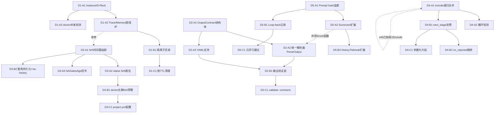

---

# Tech Lead 分析报告：ForgeOS 五个结构性扩展方向

> **分析基础**: `2026-07-11-forgeos-five-codegrounded-structural-gaps.md`（源文档）× 代码验证结果 `out.md`（HEAD `b0c80e4`）
> **分析人角色**: Tech Lead  
> **核心方法**: 基于代码证伪的可执行任务拆解

---

## 0. 验证修正后的方向定义

源文档五方向经代码验证后，需吸收三个修正：

| 方向 | 验证后调整 | 影响 |
|---|---|---|
| **D1** 多实例隔离 | 行号偏移 15-35 行但核心成立 | 任务实现时核对最新代码位置 |
| **D2** 输出契约 | `scoring/scoring.go` → `routing/routing.go:177` | 重构时直接引用 `routing.Score` |
| **D3** N/A 保鲜 | **核心命题保留**，但现状需重写——`GatesGreen` 已有 vacuous-green guard（`resolve.go:86`），全 N/A 不再静默绿 | 保鲜度/年龄追踪仍为零覆盖，保留为 D3 差异点 |
| **D4** 工作流模块 | 核心成立；需补充引用 v46 的 include 讨论，区分「治理一致性 vs 组合代数」 | 文档引用 + 差异化说明 |
| **D5** 元学习 | `scoring/scoring.go:None` → `routing/routing.go:177`；核心成立 | 定位修正，无功能影响 |

---

## 1. 任务分解

所有任务按照 **Phase A（可观测/基础设施）→ Phase B（核心功能）→ Phase C（高级/可选）** 三层结构拆解，每任务 2-6 小时。

### D1 — 多实例隔离

| 任务 ID | 标题 | 文件 | 前置 | 工时 | 验收标准 |
|---------|------|------|------|------|---------|
| **D1-A1** | 添加 `InstanceID` 与锁文件机制 | `forge-core/internal/persist/lock.go`（新） `persist/checkpoint.go` | 无 | 3h | 每次 `forge run/evolve` 启动时生成 UUID；在 `.forge/` 写入 `.lock` 文件含 `InstanceID`+ 启动时间；`flock` 获取失败时打印警告 |
| **D1-A2** | 为 `trace.go` 与 `memory.go` 添加文件锁保护 | `forge-core/internal/trace/trace.go` `memory/memory.go` | D1-A1 | 2h | 写入前尝试获取建议性 `flock`；获取失败打 `[WARN]` 不阻断；trace 行交错在单进程内不再发生 |
| **D1-A3** | `forge doctor` 并发检测 | `forge-core/cmd/forge/doctor.go` | D1-A1 | 2h | `forge doctor --concurrent` 检测 `.forge/.lock` 中是否存在其他活跃实例；报告「另一个 forge 实例正在运行（PID X，始于 Y）」 |
| **D1-B1** | 实例隔离子目录 | `persist/checkpoint.go` `trace/trace.go` `memory/memory.go` | D1-A1, D1-A2 | 4h | 每个实例写入 `.forge/run-<InstanceID>/` 子目录；但 checkpoint 仍写主 `.forge/checkpoint.json`（通过锁协调） |
| **D1-C1** | 锁文件 TTL 与 SIGKILL 后清理 | `persist/lock.go` | D1-B1 | 3h | 锁文件含启动时间戳；`forge doctor` 检测到过期锁（> 24h）时自动清理并报告 |

### D2 — 输出契约系统

| 任务 ID | 标题 | 文件 | 前置 | 工时 | 验收标准 |
|---------|------|------|------|------|---------|
| **D2-A1** | 定义 `OutputContract` 结构体并集成到 `asset.Phase` | `forge-core/internal/asset/asset.go` | 无 | 3h | 新增 `OutputContract` 类型（`Kind` `Tokens` `Prefix` `Format`）；`Phase` 新增 `OutputContract *OutputContract` 字段；JSON 序列化/反序列化正确 |
| **D2-A2** | 统一解析器 `ParseOutput` | `forge-core/internal/orchestrator/cost.go` | D2-A1 | 4h | 新函数 `ParseOutput(output string, contract OutputContract) (token string, ok bool)`；替换 `parseReviewerVerdict`/`parseExecutiveVerdict`/`parseConfidenceScore`；向后兼容（contract=nil 时回退旧行为） |
| **D2-A3** | Workflow YAML 支持 `output_contract` | `.agent/workflows/*.yml` 解析路径 `forge-core/internal/asset/workflow.go` | D2-A1 | 3h | workflow YAML 可声明 `phase.output_contract`；`loadWorkflow` 正确解析并绑定到 `Phase` |
| **D2-B1** | 输出验证层（契约遵守检查） | `orchestrator/cost.go` `trace/trace.go` | D2-A2, D2-A3 | 4h | agent 输出后先验证契约遵守情况；不匹配时写入 `kind:"output_contract_violation"` trace event；workflow 可配置 `on_contract_violation: degrade/retry/fail` |
| **D2-C1** | `forge validate --contracts` 双源一致性检查 | `forge-core/cmd/forge/validate.go` | D2-A2, D2-B1 | 3h | 扫描所有 agent 卡检查格式描述与 `phase.output_contract` 是否匹配；不一致→ `forge doctor` 报告 |

### D3 — Gate N/A 保鲜管理（重写现状）

> ⚠️ **注意**：D3 的「现状」部分需重写。已有 `resolve.go:86` vacuous-green guard 识别全 N/A 场景。D3 的核心差异点是 **保鲜度/年龄追踪**——这是零覆盖的区域。

| 任务 ID | 标题 | 文件 | 前置 | 工时 | 验收标准 |
|---------|------|------|------|------|---------|
| **D3-A1** | N/A 保鲜度追踪：`ProbeAll` 记录 N/A 时间戳 | `forge-core/internal/gate/gate.go` | 无 | 3h | `ProbeAll` 每次运行时记录每个 gate 的 N/A 起始时间戳到 `.forge/gate_na_timestamps.json`；gate 从 N/A 变为 PASS/FAIL 时清除 |
| **D3-A2** | `forge status` 增加 N/A 保鲜报告 | `forge-core/cmd/forge/status.go` | D3-A1 | 2h | `forge status` governance 报告显示每个 N/A gate 的持续天数；区分「首次运行 N/A」「持续 N/A X 天」「永久 N/A（白名单）」 |
| **D3-A3** | `converge.Signals` 增加 `NAGatesAge` 信号 | `forge-core/internal/converge/converge.go` | D3-A1 | 2h | `Signals` 新增 `NAGatesMaxAgeDays float64`；converge 报告中作为非阻断预警输出 |
| **D3-B1** | `forge doctor` 长期 N/A 预警 | `forge-core/cmd/forge/doctor.go` | D3-A2, D3-A3 | 3h | 当某个 gate N/A 超过 `project.yml: max_na_days`（默认 0=不预警）时，`forge doctor` 输出 `[WARN] coverage gate N/A for 41 days — consider configuring` |
| **D3-B2** | N/A 豁免持久化到 trace + `--na-history` | `trace/trace.go` `forge-core/cmd/forge/status.go` | D3-A1 | 3h | 每次豁免决策写入 `kind:"gate_waiver"` trace event（含 gate 名、已 N/A 天数）；`forge status --na-history` 显示每个 gate 的 N/A 趋势 |
| **D3-C1** | `project.yml` N/A 白名单与阈值配置 | `asset/project.go` | D3-B1 | 2h | `project.yml` 支持 `na_permanent: [coverage]` 和 `max_na_days: 30`；白名单 gate 不触发预警 |

### D4 — 工作流模块化

| 任务 ID | 标题 | 文件 | 前置 | 工时 | 验收标准 |
|---------|------|------|------|------|---------|
| **D4-A1** | `include` 指令：`loadWorkflow` 递归合并 | `forge-core/internal/asset/workflow.go` | 无 | 4h | `loadWorkflow` 解析 YAML 时递归处理 `include`；合并 phases 为扁平数组；循环 import 检测 → 返回 error |
| **D4-A2** | `include` 循环检测与错误报告 | `asset/workflow.go` | D4-A1 | 2h | 维护已加载路径 set；发现循环引用时返回清晰的 error（"workflow A → B → A detected"） |
| **D4-B1** | `next_stage` 消费：工作流链式调用 | `orchestrator/loop.go` `asset/asset.go` | D4-A1 | 5h | `stop.on_approved.next_stage` 被 LoopEngine 消费——workflow A 收敛后自动加载并执行 workflow B；convergence 报告显示 `converged: build → next_stage deploy (loaded)` |
| **D4-B2** | `on_rejected` 分支跳转 | `orchestrator/loop.go` | D4-B1 | 3h | `stop.on_rejected.next_stage` 被消费——security-review 被 reject 时跳到 `remediate.yml` |
| **D4-C1** | 参数化工作流片段（v2） | `asset/workflow.go` | D4-B1 | 5h | 支持 `parameters:` 声明 + `{{param}}` 替换；加载时注入参数值；——标记为 v2，可延后 |

### D5 — 元学习闭环

| 任务 ID | 标题 | 文件 | 前置 | 工时 | 验收标准 |
|---------|------|------|------|------|---------|
| **D5-A1** | Prompt hash 追踪：每次 agent phase 计算 sha256 | `forge-core/internal/prompt/prompt.go` `trace/trace.go` | 无 | 3h | `Build` 返回 prompt hash（`sha256`）作为附加返回值；trace.`Event.Detail` 记录 `prompt_hash:<hex>` |
| **D5-A2** | Scorecard 扩展：`prompt_hash` 维度 | `forge-core/internal/routing/scorecard.go` | D5-A1 | 3h | Scorecard schema 新增 `PromptHashStats`（`approve_rate`, `avg_cost`, `sample_count`）；`forge scorecard --by-prompt-hash` 显示按 prompt hash 聚合的指标 |
| **D5-B1** | Loop-back 记录 prompt hash 失败信息 | `orchestrator/loop.go` `memory/memory.go` | D5-A1 | 3h | 每次 `loopBackCount++` 时，记录当前 prompt hash 到 memory（`kind: "lesson"`, `topic: "prompt_quality"`）；触发原因（REVIEWER_REJECT / GATE_FAIL / NO_PROGRESS）一并记录 |
| **D5-B2** | HistoryTiebreak 增加 prompt hash 维度 | `routing/routing.go` | D5-A2 | 4h | 同 (model, task_type) 下可比较不同 prompt hash 的 approve rate；`forge route --prompt-diff <hash1> <hash2>` 输出对比 |
| **D5-C1** | 元学习建议：高 REQUEST_CHANGES 率触发 ROADMAP | `orchestrator/orchestrator.go` `converge/roadmap.go` | D5-B1, D5-B2 | 5h | 当同一 prompt hash 的 REQUEST_CHANGES 率 > 40%（over 5 runs），自动生成 ROADMAP item：「Review and improve [agent] card — high REQUEST_CHANGES rate (N%)」；**不自动修改 agent 卡** |

---

## 2. 执行顺序

### 任务依赖图



### 并行组

| 并行组 | 任务 | 预计总工时 | 说明 |
|--------|------|-----------|------|
| **组 A**（全部独立） | D1-A1, D2-A1, D3-A1, D4-A1, D5-A1 | 3+3+3+4+3 = **16h** | 基础可观测性任务，无交叉依赖，可 3 人并行 |
| **组 B-1** | D1-A2, D1-A3, D3-A2, D3-A3 | 2+2+2+2 = **8h** | D1/D3 第二阶段可并行 |
| **组 B-2** | D2-A2, D2-A3 | 4+3 = **7h** | D2 第二阶段 |
| **组 C-1** | D1-B1, D3-B1, D3-B2 | 4+3+3 = **10h** | D1/D3 核心功能 |
| **组 C-2** | D2-B1, D4-B1, D5-A2, D5-B1 | 4+5+3+3 = **15h** | D2/D4/D5 核心功能 |
| **组 D**（可并行） | D1-C1, D2-C1, D3-C1, D4-B2, D5-B2 | 3+3+2+3+4 = **15h** | 深化/高级功能 |
| **组 E**（单独） | D4-C1, D5-C1 | 5+5 = **10h** | v2 功能，可延后 |

---

## 3. 技术风险

### 3.1 高风险项

| 风险 | 方向影响 | 概率 | 影响 | 缓解策略 |
|------|---------|------|------|---------|
| **flock 在 CI 容器内不可用** | D1-A1, D1-A2 | 中 | 高 | `flock` 失败回退到无锁模式 + 打 `[WARN]`；在 container/docker 场景下检测 `$CI` 环境变量，跳过锁（容器每次重建无竞争） |
| **ParseOutput 替换三解析器是否改变 verdict 语义** | D2-A2 | 低 | 极高 | 旧的三个解析器保留为 `legacyParser`，新 `ParseOutput` 在 contract=nil 时完全委托给 legacy；新旧并行跑一个 sprint 做 diff 对比再删除 legacy |
| **prompt hash 对空白/注释敏感** | D5-A1, D5-A2 | 高 | 中 | 归一化阶段：hash 前 strip 空白、标准化换行符、移除注释。但需注意归一化+hash 可能使极端不同的 prompt 碰撞→加版本号 `normalizeV1` 兜底 |
| **include 循环检测覆盖不足** | D4-A1 | 低 | 高 | 用有向图 DFS 检测 + 路径打印；额外限制最大嵌套深度（`max_include_depth: 10`）防止符号链接循环绕过 set 检测 |
| **N/A 保鲜与现有 vacuous-green guard 冲突** | D3-A1 | 中 | 中 | 保证 D3 保鲜度机制独立于 verdict 逻辑：vacuous-green guard 判断「全 N/A 是否应该 FAIL」，D3 保鲜度判断「某个 gate N/A 了多久」——两个正交概念 |

### 3.2 外部依赖风险

| 依赖 | 方向 | 风险类型 | 说明 |
|------|------|---------|------|
| `syscall.Flock`（Unix）/ `LockFileEx`（Windows） | D1-A1 | 平台差异 | Go 标准库 `golang.org/x/sys/unix.Flock` 在 darwin/linux 上可用；Windows 需要 `syscall.LockFileEx`。建议做接口抽象 + 平台 build tags |
| workflow YAML 解析器 | D4-A1 | 已有实现稳定 | `asset.go` 用 `gopkg.in/yaml.v3` 或 `encoding/json`？需检查现有解析器，确认支持 `include` 字段的递归解析。若为 JSON，YAML to JSON 转换需引入依赖 |
| 测试环境多开进程 | D1-A1 测试 | 测试难度 | 多实例隔离的测试需要同时运行两个 `forge` 进程。可引入 `go test -race` + `testscript` 或 `os/exec` 子进程管理 |

### 3.3 性能风险

| 场景 | 方向 | 风险 |
|------|------|------|
| Prompt hash 计算每次 agent phase | D5-A1 | `sha256` 开销可忽略（< 10μs 对每次 10s+ 的 agent call） |
| `flock` 获取失败重试 | D1-A1 | 非阻塞 + `flock.LOCK_NB` → 立即返回，不等待 |
| include 递归加载在大型工作流 | D4-A1 | 加载时执行，不涉及运行时路径。最大 10 层深 × 10 文件 = 100 次文件 I/O，可忽略 |
| N/A 时间戳文件频繁读写 | D3-A1 | 只在 `ProbeAll` 调用时（每次 run 一次）写入，非热路径 |

---

## 4. 资源评估

### 4.1 人员技能需求

| 角色 | 人数 | 技能要求 | 覆盖方向 | 关键度 |
|------|------|---------|---------|--------|
| **Go 后端工程师**（核心） | 2 | Go 并发、文件锁、`os/exec`、JSON/YAML 序列化 | D1, D2, D3, D5 | 必选 |
| **Go 后端工程师**（工作流） | 1 | YAML 语法、递归解析、编排逻辑 | D4 | 必选 |
| **测试工程师** | 1 | Go testing + `testscript`、多进程测试、trace 文件格式验证 | 跨方向 | 可选但推荐 |
| **Code Reviewer** | 1（兼职） | 熟悉已有代码库、安全审查（flock/文件锁的竞态条件） | 跨方向 | 必选 |

**最低配置**: 2 人（1 核心 Go + 1 全栈/Go），6 周
**推荐配置**: 3 人（2 Go + 1 测试/文档），4 周

### 4.2 关键里程碑

| 里程碑 | 目标 | 预计完成 | 验收检查 |
|--------|------|---------|---------|
| **M1** 基础观测性上线 | D1-A1 ~ D1-A3, D2-A1, D3-A1, D4-A1, D5-A1 | **第 2 周末** | 所有 Phase A 任务集成 + 合并；`forge doctor --concurrent` 可用；`include` 语句可加载 |
| **M2** 核心功能就位 | D1-B1, D2-A2, D2-A3, D3-A2, D3-A3, D5-A2 | **第 4 周末** | 统一解析器替换三解析器（保留 legacy）；`forge status` 显示 N/A 保鲜度；scorecard 支持 prompt hash |
| **M3** 完整功能交付 | D2-B1, D4-B1, D5-B1, D3-B1, D3-B2 | **第 6 周末** | `next_stage` 工作流链；输出验证层；long N/A 预警；loop-back prompt hash 记录 |
| **M4** 深化与收尾 | D1-C1, D2-C1, D3-C1, D4-B2, D5-B2 | **第 8 周末** | 全部扩展方向 Phase A/B 完成；`forge validate --contracts` 可用 |
| **M5** v2 方向（可选） | D4-C1, D5-C1 | **第 10 周末** | 参数化工作流；元学习 ROADMAP 建议（可选，标记为 v2） |

### 4.3 阻塞点与解决策略

| 阻塞点 | 阻碍 | 解决策略 | 触发条件 |
|--------|------|---------|---------|
| **D1 flock 在 NFS 共享卷上的行为不确定** | D1-B1 隔离子目录在 NFS 上可能锁失败 | 在 `forge doctor` 中添加 NFS 检测 + 文档明确「多实例隔离仅支持本地文件系统」 | 用户反馈 / CI 在 NFS 上运行报 lock 错误 |
| **D2 `ParseOutput` 替换后回归** | 契约解析与旧行为不一致导致评审误判 | **新旧并行跑 2 周**：让 `ParseOutput` 和 legacy parsers 都运行，结果 diff 写入 trace，但不影响 verdict；2 周后 review diff 日志再切换 | 上线前 |
| **D4 include 与 v46 重复设计** | 如果 v46 已有实现，D4 需要适配而非重新发明 | 读 `expansion-five-truly-uncovered-frontiers-v46.md`，确定 v46 的 include 实现到什么程度；如果已有代码，直接适配而非重写 | Sprint 规划时 |
| **D5 冷启动样本不足** | 前 10-20 次运行无有效 prompt hash 统计 | Phase A 只管记录（prompt hash 写入 trace），不触发任何告警或建议。Phase C（元学习建议）设 `min_samples: 10` 硬条件 | 第 10 次 evolve 后 |

---

## 5. 质量保证

### 5.1 单元测试覆盖要求

| 方向 | 关键测试 | 覆盖率目标 | 测试框架 |
|------|---------|-----------|---------|
| D1 | `TestInstanceIDGenerate`、`TestLockAcquire`、`TestLockDoubleAcquire`、`TestLockReleaseOnSigterm` | 85%+ | Go `testing` |
| D2 | `TestParseOutput`（含所有 token 类型）、`TestParseOutputBackwardCompat`、`TestOutputContractVerdict` | 90%+ | Go `testing` + table-driven tests |
| D3 | `TestNAAgeTracking`、`TestNAAgeClearedOnPass`、`TestNAWhiteList` | 80%+ | Go `testing` |
| D4 | `TestIncludeMerge`、`TestIncludeCycleDetect`、`TestNextStageConsume`、`TestMaxIncludeDepth` | 85%+ | Go `testing` + golden file（YAML 合并结果比对） |
| D5 | `TestPromptHash`、`TestPromptHashNormalization`、`TestScorecardPromptHashAggregation` | 80%+ | Go `testing` |

### 5.2 集成测试策略

| 测试场景 | 方法 | 工具 | 频率 |
|---------|------|------|------|
| **多实例并发** | 启动 2 个 `forge run` 操作同一仓库，验证 trace 无交错+checkpoint 未被覆盖 | `bats`/`testscript` + `os/exec` | 每次 PR |
| **输出契约** | 构造 agent 输出（含格式偏差），验证 `ParseOutput` 正确 degrade | Go `testing`（mock agent output） | 每次 PR |
| **N/A 保鲜度** | 模拟 `ProbeAll` 运行 N 天，验证 `NAGatesAge` 随时间递增 | 时间 mock + stub `ProbeAll` | 每次 PR |
| **include 合并** | 构造多层 include YAML（含循环），验证合并结果与错误报告 | golden file + Go `testing` | 每次 PR |
| **prompt hash 追踪** | 用已知 prompt 输入验证 hash 一致性 + 归一化效果 | Go `testing`（固定输入→预期 hash） | 每次 PR |
| **回归测试** | D2 旧解析器 vs 新 `ParseOutput` 同一输入→比对输出 | Go `testing`（并行运行 + diff） | 切换前最后持 |

### 5.3 代码审查要点

| 审查焦点 | 相关方向 | 关注理由 |
|---------|---------|---------|
| **flock 的错误处理路径** | D1 | 锁获取失败时是否安全退化；防止死锁、文件描述符泄漏 |
| **ParseOutput 边界条件** | D2 | 空输出、多行重复、编码特殊字符——所有边缘用例是否覆盖 |
| **N/A 时间戳持久化格式** | D3 | 版本兼容性：当 `ProbeAll` 新增 gate 时旧时间戳如何处理 |
| **include 合并的 phase 排序** | D4 | include 后的 phasse 顺序是否语义正确；同名 phase 冲突怎么处理 |
| **prompt hash 归一化算法** | D5 | 归一化是否过度（丢失语义差异）或不足（空格不一致导致 hash 不同）|
| **跨方向耦合点** | 所有 | 例如 D5 改写 scorecard 时是否影响 D2（均引用 `Score` 函数） |

### 5.4 性能测试需求

| 场景 | 方向 | 测试方法 | 目标 |
|------|------|---------|------|
| 多实例锁竞争 | D1 | 10 并发进程同时 `flock`，测量等待时间 P50/P95/P99 | P99 < 50ms |
| include 深层嵌套（10 层 × 10 文件）加载 | D4 | 测试最大配置加载时间 | < 200ms |
| prompt hash 归一化+计算 | D5 | 测量每次 agent phase 的 hash 开销 | < 1ms（远低于 agent call 的秒级） |

---

## 6. 实施计划

### 甘特图（基于 3 人团队）

```
阶段/任务          | W1 | W2 | W3 | W4 | W5 | W6 | W7 | W8 | W9 | W10 |
                   |    |    |    |    |    |    |    |    |    |     |
=== 阶段1: 基础设施 ===
D1-A1 InstanceID   | ██ |    |    |    |    |    |    |    |    |    
D2-A1 Contract结构 | ██ |    |    |    |    |    |    |    |    |    
D3-A1 N/A时间戳    | ██ |    |    |    |    |    |    |    |    |    
D4-A1 include合并  | ██ | ██ |    |    |    |    |    |    |    |    
D5-A1 Prompt hash  | ██ |    |    |    |    |    |    |    |    |    
-- M1里程碑 --      |    | ◆  |    |    |    |    |    |    |    |    

=== 阶段2: 核心功能 ===
D1-A2 Trace锁保护  |    | ██ |    |    |    |    |    |    |    |    
D1-A3 doctor并发   |    | ██ |    |    |    |    |    |    |    |    
D2-A2 统一解析器   |    | ██ | ██ |    |    |    |    |    |    |    
D2-A3 YAML支持     |    | ██ |    |    |    |    |    |    |    |    
D3-A2 status报告   |    | ██ |    |    |    |    |    |    |    |    
D3-A3 NAGatesAge   |    | ██ |    |    |    |    |    |    |    |    
D5-A2 Scorecard扩  |    |    | ██ |    |    |    |    |    |    |    
-- M2里程碑 --      |    |    |    | ◆  |    |    |    |    |    |    

=== 阶段3: 集成/深化 ===
D1-B1 隔离子目录   |    |    |    | ██ | ██ |    |    |    |    |    
D2-B1 输出验证层   |    |    |    | ██ | ██ |    |    |    |    |    
D3-B1 长期N/A预警  |    |    |    | ██ |    |    |    |    |    |    
D3-B2 豁免持久化   |    |    |    |    | ██ |    |    |    |    |    
D4-B1 next_stage   |    |    |    | ██ | ██ | ██ |    |    |    |    
D5-B1 loop-back记  |    |    |    |    | ██ |    |    |    |    |    
-- M3里程碑 --      |    |    |    |    |    | ◆  |    |    |    |    

=== 阶段4: 完成/可选 ===
D1-C1 锁TTL清理    |    |    |    |    |    | ██ |    |    |    |    
D2-C1 validate合同 |    |    |    |    |    |    | ██ |    |    |    
D3-C1 project配置  |    |    |    |    |    |    | ██ |    |    |    
D4-B2 on_rejected  |    |    |    |    |    |    | ██ | ██ |    |    
D5-B2 Tiebreak扩展 |    |    |    |    |    |    |    | ██ |    |    
-- M4里程碑 --      |    |    |    |    |    |    |    | ◆  |    |    

=== 阶段5: v2方向 ===
D4-C1 参数化片段   |    |    |    |    |    |    |    |    | ██ | ██ |    
D5-C1 元学习建议   |    |    |    |    |    |    |    |    | ██ | ██ |    
-- M5里程碑 --      |    |    |    |    |    |    |    |    |    | ◆ |    
```

### 阶段详情

#### 阶段 1：基础设施搭建（第 1-2 周）

**目标**：5 个方向的 Phase A 全部落地——可观测性基础设施

| 执行内容 | 人员分配 | 交付物 |
|---------|---------|--------|
| D1-A1 (3h) + D1-A2 (2h) + D1-A3 (2h) | 工程师 A（Go） | 锁机制、doctor 检测 |
| D2-A1 (3h) + D2-A3 (3h) | 工程师 B（Go） | `OutputContract` 结构 + YAML 解析 |
| D3-A1 (3h) + D4-A1 (4h) | 工程师 C（Go） | N/A 时间戳追踪 + `include` 合并（含循环检测） |
| D5-A1 (3h) | 工程师 A（第 4 天完成后） | prompt hash 追踪 |

**风险缓冲**：预留 2 天处理 YAML 解析依赖和 cross-platform flock 抽象

**交付检查**：
- [x] `forge doctor --concurrent` 可在共享仓库上检测多实例
- [x] `include:` 在 workflow YAML 中可被正确解析
- [x] prompt hash 出现在 trace event 的 `Detail` 字段中
- [x] N/A 门禁的时间戳在 `.forge/gate_na_timestamps.json` 中持久化

#### 阶段 2：核心功能实现（第 3-4 周）

**目标**：各方向的核心功能——解析器替换、保鲜报告、scorecard 扩展

| 执行内容 | 人员分配 | 交付物 |
|---------|---------|--------|
| D2-A2 统一解析器 (4h) | 工程师 B | `ParseOutput` + 旧解析器并行运行 |
| D3-A2 status报告 (2h) + D3-A3 NAGatesAge (2h) | 工程师 C | `forge status` 显示 N/A 天数；`converge.Signals` 含 `NAGatesMaxAgeDays` |
| D5-A2 Scorecard扩展 (3h) | 工程师 A | `forge scorecard --by-prompt-hash` 工作 |
| D2-A2 的回归 diff 验证（跨 D2/D5 的 Score 函数引用被正确修正）| 所有 | 新旧解析器并行跑 → diff 写入 trace |

**风险缓冲**：`ParseOutput` 替换是最大风险项——预留 1 天做新旧 diff 收集 + BugFix

**交付检查**：
- [x] 统一解析器与旧解析器对相同输入产生相同输出（diff 0）
- [x] `forge status` 显示 `coverage N/A since 2026-07-11 (X days)`
- [x] scorecard 可按 prompt hash 聚合 approve rate

#### 阶段 3：集成测试和优化（第 5-6 周）

**目标**：完整功能流——输出验证、工作流链、N/A 预警

| 执行内容 | 人员分配 | 交付物 |
|---------|---------|--------|
| D1-B1 隔离子目录 (4h) | 工程师 A | 多实例数据隔离 |
| D2-B1 输出验证层 (4h) | 工程师 B | 契约违反检测 + trace + 可配置 degrade |
| D3-B1 长期N/A预警 (3h) + D3-B2 豁免持久化(3h) | 工程师 C | `forge doctor` 预警 + `--na-history` |
| D4-B1 next_stage消费 (5h) | 工程师 C（D3 完成后） | 工作流链自动触发 |
| D5-B1 loop-back记录 (3h) | 工程师 A | REQUEST_CHANGES 记录 prompt hash |

**风险缓冲**：`next_stage` 的编排逻辑与现有 LoopEngine 的集成可能冲突——预留 1 天做架构 review

**交付检查**：
- [x] 两个 `forge run` 并发时，各写入隔离目录，checkpoint 通过锁协调
- [x] agent 输出违反契约时，系统按 `degrade/retry/fail` 配置响应
- [x] `forge status --na-history` 显示趋势曲线
- [x] `build.yml` 收敛后自动加载 `deploy.yml` 的 phases

#### 阶段 4：发布准备 + 可选深化（第 7-8 周）

**目标**：Phase C 任务 + 全面回归 + 文档

| 执行内容 | 人员分配 | 交付物 |
|---------|---------|--------|
| D1-C1 锁TTL (3h) | 工程师 A | 过期锁自动清理 |
| D2-C1 validate--contracts (3h) | 工程师 B | 双源一致性检查 |
| D3-C1 project.yml配置 (2h) | 工程师 C | `na_permanent` + `max_na_days` |
| D4-B2 on_rejected (3h) | 工程师 C（D3 后） | 拒绝分支跳转 |
| D5-B2 HistoryTiebreak扩展 (4h) | 工程师 A | `forge route --prompt-diff` |
| 全面回归测试 + 文档 | 所有 | 集成测试全部 pass + 扩展方向文档 |

#### 阶段 5（可选）：v2 方向（第 9-10 周）

| 执行内容 | 人员 | 交付物 |
|---------|------|--------|
| D4-C1 参数化片段 (5h) | 工程师 C | `{{param}}` 替换 |
| D5-C1 元学习建议 (5h) | 工程师 A + B | `min_samples:10` 后自动生成 ROADMAP |

---

## 7. 验证发现的修正行动清单

基于 `out.md` 的三个发现，以下修正必须在实现前完成：

| 发现 | 修正行动 | 负责 | 截止 |
|------|---------|------|------|
| D3 重写现状描述 | 更新 D3 的代码证据段：引用 `resolve.go:86` 的 vacuous-green guard 作为已存在；保留 N/A 保鲜度/年龄追踪作为 D3 的差异化核心 | 技术文档 | 阶段 1 前 |
| `scoring/scoring.go` 不存在 | D2 和 D5 的所有文件引用改为 `routing/routing.go:177`；确认 `Score` 函数的签名（`func Score(dims map[string]float64, weights map[string]float64) float64`）与 D5 的使用场景匹配 | 工程师 B | 阶段 1 |
| D4 补充 v46 引用 | 在 D4 文档中增加 `expansion-five-truly-uncovered-frontiers-v46.md` 引用；区分「本文聚焦治理一致性 vs v46 的组合代数」 | 技术文档 | 阶段 1 前 |

---

## 8. 总结

| 维度 | 结论 |
|------|------|
| **总工期** | **8 周**（核心 5 方向 Phase A+B）/ **10 周**（含 Phase C v2 方向） |
| **最低团队** | 2 人（1 Go 核心 + 1 Go 工作流） |
| **推荐团队** | 3 人（2 Go + 1 测试/文档） |
| **最大技术风险** | D2 统一解析器替换三解析器的回归（已设新旧并行 2 周缓冲）|
| **最大架构风险** | D1 多实例 flock 在跨平台/CI 容器场景的兼容性（已设退化路径）|
| **杠杆最高的优先项** | **阶段 1 基础设施**（D1-A1, D2-A1, D3-A1, D4-A1, D5-A1）——5 个方向的可观测性基座并行在 2 周内落地，相互独立互不阻塞 |
| **必须推迟的决策** | D4-C1（参数化片段）和 D5-C1（元学习建议）标记为 v2 方向，冷启动问题和设计不确定度高 |
| **验收红线** | 每次 PR 必须通过 `node harness/acceptance.mjs`；`forge accept: ACCEPTED` 是合并门槛 |

**一句话行动建议**：第 1 周启动 5 个 Phase A 的并行实现（3 人各自独立），第 2 周启动 D2 统一解析器（最大风险项）并开始新旧并行 diff，第 4 周 M2 后评估 v2 方向的可行性决定是否继续 Phase C。
