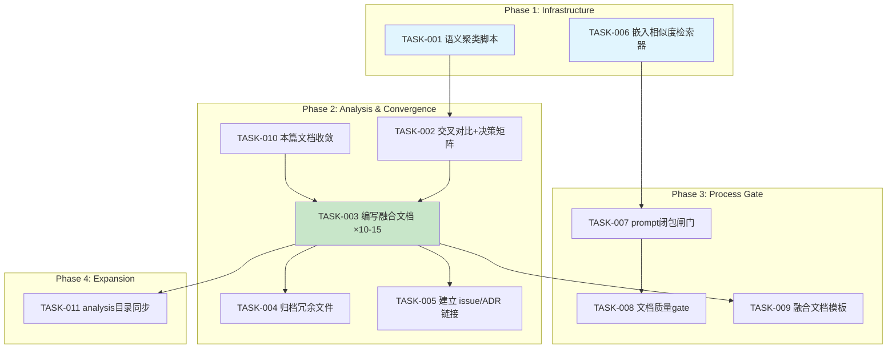
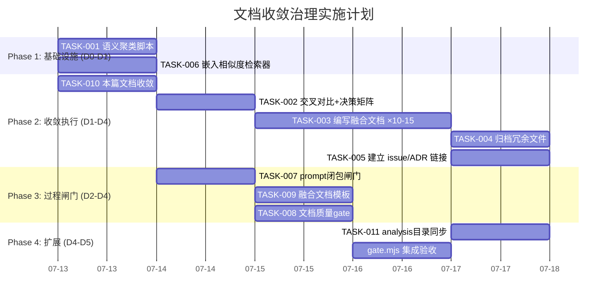

好的，我已经充分理解了上下文。作为 Tech Lead，以下是我的分析。

---

# Tech Lead 分析报告：docs/requirements/ 文档熵增问题

## 问题定性

这是一个**元治理（meta-governance）失效**问题。ForgeOS 自身的治理体系（arch-check / gate / check.py）能够有效约束代码质量，但在**文档生成过程**上缺少同等严格的闸门。213 个文件、7.6MB、48 小时内生成的同一模板变体，信号密度被稀释到极限——这是 ForgeOS 自己定义的"信息熵持续衰减"问题的自指实例。

**严重性评估**：P1（阻塞性技术债务）。在现有文档模式下继续添加新分析，产生的边际价值已经接近于零，而维护成本（检索、审阅、辨别）呈超线性增长。

---

## 1. 任务分解

将收敛操作分解为可执行的技术任务。每个任务 2-4 小时可完成。

### 1.1 文档收敛任务

| 任务 ID | 任务标题 | 所属方向 | 涉及文件 | 前置依赖 | 预估工时 | 验收标准 |
|---------|---------|---------|---------|---------|---------|---------|
| **TASK-001** | 语义聚类脚本：docs/requirements/ 全量聚类 | 文档收敛 | `scripts/cluster-docs.mjs` | 无 | 4h | 输出 JSON：每个文件→簇 ID + 与簇中心的相似度；识别 10-15 个簇；簇内文件按日期排序 |
| **TASK-002** | 差异化声明审查：对每个簇做交叉对比 | 文档收敛 | `scripts/cluster-docs.mjs` + 人工审阅 | TASK-001 | 4h | 每个簇产出合并/保留/删除的决策矩阵；识别重复度 >80% 的簇内文件 |
| **TASK-003** | 编写融合需求文档（10-15 篇） | 文档收敛 | `docs/requirements/converged/<cluster-name>.md` | TASK-002 | 3h/篇 | 每个融合文档吸收簇内所有代码证据、边界场景、产品判断；含交叉引用原始来源；含语义差异表 |
| **TASK-004** | 归档冗余文件 | 文档收敛 | `docs/requirements/` | TASK-003 | 2h | 被取代文件加 `.deprecated` 后缀；建立 `docs/requirements/.index.md` 列出所有簇及其成员；BOOTSTRAP 添加收敛后的阅读入口 |
| **TASK-005** | 建立文档→issue/ADR 链接 | 文档收敛 | `docs/requirements/` | TASK-003 | 4h | 每篇融合文档的每个方向至少链接一个 GitHub issue 或 ADR；issue 和 ADR 中引用融合文档为来源 |

### 1.2 过程治理任务

| 任务 ID | 任务标题 | 所属方向 | 涉及文件 | 前置依赖 | 预估工时 | 验收标准 |
|---------|---------|---------|---------|---------|---------|---------|
| **TASK-006** | 嵌入相似度检索器（替代关键词 grep） | 过程治理 | `harness/retrieval.mjs` 或 `forge-core/internal/retrieval/` | 无 | 4h | 对任意文本输入，在已有文档中检索 top-5 最相似文档及相似度分数；支持本地 embedding（可降级为 TF-IDF fallback）；性能 < 2s/query |
| **TASK-007** | prompt 闭包闸门：生成前检查 | 过程治理 | `harness/gate.mjs` 或新文件 `docs/new-analysis-check.mjs` | TASK-006 | 3h | 当 prompt 要求"新颖方向"时，自动调用 embedding 检索；最大相似度 >0.75 时拒绝生成并输出"该方向已被 X 覆盖"（含原文链接和差异度分析）；相似度 >0.50 时输出 warning |
| **TASK-008** | 文档质量 gate: docs/requirements/ 治理检查 | 过程治理 | `check.py` 或 `docs/doc-check.mjs` | TASK-007 | 2h | 新增 check 规则：新文档必须通过 TASK-007 检查（exit 0）；旧文档超过 30 天无 issue/ADR 链接则报警；重复簇中未标记 `.deprecated` 的文件报警 |
| **TASK-009** | 融合文档模板规范化 | 过程治理 | `.agent/skills/doc-template.md` 或 `docs/converged-template.md` | TASK-003 | 2h | 定义融合文档的标准模板（元信息区/方向骨架/代码证据/交叉引用/issue 链接/演化历史）；模板纳入 forge-init 复制集 |

### 1.3 数据迁移任务

| 任务 ID | 任务标题 | 所属方向 | 涉及文件 | 前置依赖 | 预估工时 | 验收标准 |
|---------|---------|---------|---------|---------|---------|---------|
| **TASK-010** | 对反馈中的这篇具体文档做收敛 | 文档收敛 | `2026-07-11-forgeos-five-codegrounded-systemic-frontiers.md` | 无 | 2h | 修正差异化声明（承认方向一重复）；将新颖子方向（三、四、五的未重复部分）合入已有融合文档或新建融合文档；标记原文件为 `.deprecated` |
| **TASK-011** | docs/analysis/ 目录同步治理 | 过程治理 | `docs/analysis/` | TASK-006 | 3h | 对 analysis 目录（~40 篇）执行同样的聚类检查；合并到 docs/requirements 的收敛索引中 |

---

## 2. 执行顺序

**可并行执行的任务组**：
- **组 A**（无依赖）：TASK-001（聚类）、TASK-006（检索器）、TASK-010（本文件）
- **组 B**（依赖组 A 完成）：TASK-002（决策矩阵）
- **组 C**（依赖 TASK-002）：TASK-003（融合文档）
- **组 D**（依赖 TASK-003）：TASK-004（归档）、TASK-005（链接）、TASK-009（模板）
- **组 E**（依赖 TASK-006）：TASK-007（闭包闸门）
- **组 F**（依赖 TASK-003+TASK-007）：TASK-008（文档质量 gate）

**关键路径**：T001 → T002 → T003 → T005/T004/T009/T011（约 35h 核心串行）

---

## 3. 技术风险

### 3.1 语义聚类准确度风险
| 风险 | 概率 | 影响 | 缓解策略 |
|------|------|------|---------|
| TF-IDF/简单 embedding 对中文文档聚类效果差 | **高** | 簇划分失准，错把真正新颖方向误判为重复 | 采用 sentence-transformers 或 fastText 做多语言 embedding；构建少量人工标注的验证集校准阈值 |
| 文档含大量代码引用，语义向量被代码特征主导 | 中 | 聚类按代码模式而非主题方向划分 | 预处理去除代码块和文件路径；使用标题+方向描述+结论做 embedding 而非全文 |
| 同簇内方向差异度仍很大 | 中 | 融合文档丢失细节 | 融合文档保留"方向变体"表格，标注每个原始文件独特贡献的部分 |

### 3.2 嵌入检索器 offline 风险
| 风险 | 概率 | 影响 | 缓解策略 |
|------|------|------|---------|
| 本地无法运行 embedding 模型（依赖 Python/PyTorch） | **高** | TASK-006 依赖外部资源 | 提供 TF-IDF fallback（sklearn 最小模式或纯 JS 实现）；无外部模型时 degrade 到 BM25，性能不亚于关键词 grep |
| embedding 模型版本变化导致检索结果漂移 | 低 | 历史结果不可复现 | 固定模型版本（例如 `sentence-transformers/all-MiniLM-L6-v2` v2025）；相似度分数使用分位数而非绝对值 |
| 查询延迟 > 2s 影响用户体验 | 中 | agent 生成流程变慢 | embedding 向量化缓存持久化到 `.retrieval_cache/`；增量更新（仅对新文档做向量化）；TF-IDF 构建倒排索引 |

### 3.3 过程治理执行风险
| 风险 | 概率 | 影响 | 缓解策略 |
|------|------|------|---------|
| TASK-007 闸门被强制 bypass | 中 | 继续产生重复文档 | 闸门嵌入 `harness/gate.mjs`，随 `for accept` 自动执行；新文档创建必须调用 `gate.mjs`（类似 arch-check 机制） |
| 旧文档清理决策争议 | **高** | 治理 stall | 采用保守策略：不删除任何文件，仅加 `.deprecated` 后缀 + 更新 `.index.md`；任何有争议的文档保持现状但标记"待审" |
| 团队不认同融合方向划分 | 中 | 收敛方向执行不到位 | 融合文档按"簇"组织但保留"不划分"选项——先全部 flat 索引，让 issue 链接自然形成簇 |

### 3.4 性能瓶颈
- **聚类脚本**：213 篇文档 × TF-IDF 矩阵 ≤ 1GB 内存，embedding 推理需要 GPU（若无 GPU，CPU 推理 213 篇约 30s——可接受）
- **检索器**：每次新生成前调用一次检索（<2s），不是性能瓶颈
- **文档质量 gate**：仅在新文件写入时执行一次，无性能负担

---

## 4. 资源评估

### 4.1 人员需求

| 角色 | 数量 | 技能要求 | 负责任务 |
|------|------|---------|---------|
| **基础设施工程师** | 1 | TypeScript/Node.js 熟练，有 NLP 或信息检索经验 | TASK-001（聚类脚本）、TASK-006（检索器） |
| **架构师/技术文档撰写者** | 1 | 熟悉 ForgeOS 代码库和治理体系，有技术写作能力 | TASK-002（决策矩阵）、TASK-003（融合文档）、TASK-009（模板） |
| **工程师** | 1 | 熟悉 harness 体系，Node.js/Go 开发 | TASK-007（闭包闸门）、TASK-008（文档 gate）、TASK-004（归档） |
| **产品经理/技术写手**（或兼职） | 1 | 熟悉项目方向和优先级 | TASK-005（issue/ADR 链接）、TASK-010（本文件收敛）、TASK-011（analysis 同步） |

最小可行性团队：2 人（1 基础设施 + 1 架构师/写手），工时约 80h。

### 4.2 关键里程碑

| 里程碑 | 日期（相对） | 可交付物 |
|--------|------------|---------|
| M1 — 聚类完成 | D+1 | TASK-001 输出聚类 JSON + 决策矩阵初稿 |
| M2 — 融合草稿完成 | D+3 | 10-15 篇融合文档草稿 |
| M3 — 闸门就绪 | D+3 | TASK-006 + TASK-007 + TASK-009 实现完成 |
| M4 — 收敛完成 | D+4 | TASK-003 终稿 + TASK-004 归档 + TASK-005 链接 |
| M5 — 治理闭环 | D+5 | TASK-008 文档 gate 生效，新文档自动通过相似度检查 |

### 4.3 Blocker 清单

| 序号 | 阻塞点 | 阻塞任务 | 解决策略 |
|------|-------|---------|---------|
| B1 | 本地无法运行 embedding 模型 | TASK-006 | TF-IDF fallback + 离线预计算向量库；备选：使用 OpenAI Embedding API（但引入外部依赖） |
| B2 | 文档中英文混杂，embedding 模型可能对中文支持差 | TASK-001, TASK-006 | 使用多语言模型（`paraphrase-multilingual-MiniLM-L12-v2`）；测试中文文档聚类效果，必要时做人工校准 |
| B3 | 团队对簇划分结果有不同意见 | TASK-003 | 先产出 3-5 篇"试点"融合文档，验证方法论后再全面铺开 |
| B4 | 已有 issue/ADR 链接可能为 0 | TASK-005 | 从融合文档生成 issue 草稿（每个方向 1 个），人工审阅后再创建；或先创建"文档追踪"label 的 issue |

---

## 5. 质量保证

### 5.1 单元测试覆盖

| 模块 | 覆盖率目标 | 关键测试场景 |
|------|-----------|-------------|
| `cluster-docs.mjs` | >85% | 空输入、1 篇文档、2 篇完全相同的文档、2 篇完全不同文档、中文+英文混合、含代码块的文档 |
| `retrieval.mjs` | >90% | 精确查询 top-1 match、同义词查询、无匹配查询、查询性能 <2s（CI benchmark）、embedding 缺失时 TF-IDF fallback |
| `new-analysis-check.mjs` | >90% | 相似度 > 0.75 拒绝、0.50-0.75 warning、<0.50 通过、embedding 服务不可用时 degrade graceful |
| `doc-check.mjs` | >85% | 新文档通过/拒绝、旧文档过期报警、`.deprecated` 标记一致性 |

### 5.2 集成测试策略

| 测试场景 | 触发条件 | 验证要点 |
|---------|---------|---------|
| **新分析生成** | 模拟 agent 生成新方向文档的流程 | 检索器被调用 → 返回相似文档 → 生成被阻止/允许 |
| **归档操作** | 执行 `mark-deprecated` 命令 | `.deprecated` 被添加 → docs/index.md 被更新 → 融合文档引用更新 |
| **融合文档质量** | 融合文档创建后 | 模板合规性检查 → 代码证据引用格式 → API 签名引用格式 |
| **端到端收敛** | 模拟完整收敛流程 | 聚类 → 决策 → 融合 → 归档 → gate.mjs 验证 | 
| **回归测试** | 任何聚类/检索代码变更 | 先前聚类结果再现性（确定性） |

### 5.3 代码审查要点

1. **聚类脚本 (TASK-001)**：
   - 聚类算法可复现：随机种子固定，结果确定性
   - 簇数确定方式合理（轮廓系数 / 肘部法 / 人工指定）
   - 不泄露敏感信息（文档内容不写入日志）

2. **检索器 (TASK-006)**：
   - TF-IDF fallback 路径正确触发并记录到 harness 输出
   - 相似度阈值不硬编码（通过 config/policy 注入）
   - 缓存失效策略合理（文件 mtime 变化时重建）

3. **闭包闸门 (TASK-007)**：
   - 不可 bypass：不能通过改 prompt 措辞规避检查
   - 拒绝信息足够帮助用户（给出已覆盖文档标题 + 差异性分析）
   - 不拒绝合法的后续深化（方向上但新增维度可通过）

4. **融合文档 (TASK-003)**：
   - 每个方向至少 1 个代码级证据
   - 引用格式统一（`file:line` 或 `file:start-end`）
   - 与 no-code 原则一致（融合文档本身不包含新代码）

### 5.4 性能测试需求

| 场景 | 指标 | 目标 |
|------|------|------|
| 213 篇文档聚类 | 完成时间 | <60s（CPU） |
| 新文档 embedding 计算 | 单次延迟 | <2s |
| 语义检索（213 篇） | 响应时间 | <500ms |
| 文档 gate 执行 | 响应时间 | <3s（含检索） |

---

## 6. 实施计划

### 甘特图

### 分阶段详解

#### 阶段 1：基础设施搭建（D0-D1，2天）

**目标**：搭建语义聚类和检索的底层能力

| 日 | 任务 | 产出 |
|---|------|------|
| D0 AM | TASK-001 聚类脚本实现 | `scripts/cluster-docs.mjs` + 对 213 篇文档的初步聚类结果 JSON |
| D0 PM | TASK-006 检索器实现 | `harness/retrieval.mjs` + embedding 缓存 + TF-IDF fallback |
| D1 AM | TASK-001+TASK-006 集成测试、阈值校准 | 3-5 个人工标注的验证 case；相似度阈值确定（0.75/0.50） |
| D1 PM | TASK-010 本篇文件收敛（快速 win） | 修正差异化声明；方向一标记为重复；将三/四/五合并到对应簇 |

**阶段 1 验收**：
- ✅ `cluster-docs.mjs` 在 ≤60s 内产出聚类 JSON
- ✅ `retrieval.mjs` 对已知重复 case 返回相似度 >0.75
- ✅ 本篇文档已收敛

#### 阶段 2：核心功能实现（D1-D4，3天）

**目标**：完成全部 213 篇文档的聚类、决策、融合、归档

| 日 | 任务 | 产出 |
|---|------|------|
| D1-D2 | TASK-002 交叉对比 + 决策矩阵 | 每簇决策（合并/保留/删除）；标注差异度 <0.50 的"孤立文档" |
| D2-D4 | TASK-003 融合文档编写（10-15 篇） | 首篇在 D2 完成作为模板验证；D3 完成 5 篇；D4 完成全部 |
| D3 | TASK-004 归档 | 被取代文件加 `.deprecated`；创建 `.index.md` |
| D3-D4 | TASK-005 建立链接 | 每篇融合文档 → GitHub issue；每个 issue 标记 `docs` + `converged` label |

**阶段 2 验收**：
- ✅ 融合文档 ≤15 篇，覆盖 213 篇的 >90%
- ✅ 每篇融合文档至少引用 3 个原始文件
- ✅ `docs/requirements/.index.md` 完整，包含簇 ID / 文件列表 / 融合文档引用 / 状态
- ✅ 至少 5 个真实 GitHub issue 创建（首期）

#### 阶段 3：集成测试和优化（D2-D4，3天，与阶段 2 并行）

**目标**：完成所有闸门和模板，与新文档生成流程集成

| 日 | 任务 | 产出 |
|---|------|------|
| D2-D3 | TASK-007 prompt 闭包闸门 | `harness/gate.mjs` 集成；agent 生成新文档前自动调用检索器 |
| D2 | TASK-009 融合文档模板 | `.agent/skills/doc-template.md`；示例模板文档 |
| D3-D4 | TASK-008 文档质量 gate | `check.py` 新 check 规则（或独立 `doc-check.mjs`） |
| D4 | TASK-007+TASK-008 集成到 `forge accept` | `node harness/acceptance.mjs` 包含文档质量检查 |

**阶段 3 验收**：
- ✅ 模拟生成与已有文件相似的新文档 → 被拒绝 + 给出引用
- ✅ 模拟生成真正新颖的文档 → 通过
- ✅ `forge accept` 包含文档质量 check
- ✅ 融合文档模板已纳入 forge-init 复制集

#### 阶段 4：发布和扩展（D4-D5，2天）

**目标**：同步到 analysis 目录和相关流程，完成全局收敛

| 日 | 任务 | 产出 |
|---|------|------|
| D4 | TASK-011 analysis 目录同步 | 对 ~40 篇 analysis 文档执行同样聚类；合并到 `.index.md` 或单独索引 |
| D4 | 根 BOOTSTRAP 更新 | 添加 docs/requirements/ 收敛后入口指引 |
| D4-D5 | `forge accept` 全量跑通 | 全部 8 检查 + 新文档质量检查 + 聚类脚本回归测试 |
| D5 | 复盘、文档、清理 | 本次收敛操作的 ADR；已知局限性和下一步 Plan |

**阶段 4 验收**：
- ✅ analysis 目录同步完成，无遗漏
- ✅ `forge accept` ACCEPTED
- ✅ 本次操作的 ADR 已记录（`.agent/DECISIONS.md` 或 `docs/adr/`）
- ✅ 治理闸门已生效，新文档生成不会重复本次问题

---

## 7. 核心建议总结

1. **停止生成新分析，先收敛**：在融合文档完成前，`docs/requirements/` 不应新增任何独立分析文档。闸门应阻止这一行为。

2. **用技术手段防止语义级重复**：关键词 grep 不足以检测语义重复。嵌入检索器（TASK-006）应作为最低可行方案，TF-IDF 是可接受的 fallback。

3. **融合文档 ≠ 归纳摘要**：每篇融合文档应保留原始分析的差异化价值——"什么被合并了、什么因为独特而被保留、什么被丢弃了"。不应变成模糊的通用描述。

4. **收敛是进程，不是一次性操作**：
   - 首次收敛：TASK-001~011 手动执行
   - 持续治理：TASK-007+TASK-008 自动执行
   - 周期性复盘：每 4 周检查 docs/requirements/ 熵值，必要时重新聚类

5. **这个问题本身是 ForgeOS 的"降级"场景的实例**：当治理系统自身的文档生成进入正反馈循环（重复生成→信号稀释→再生成→再稀释），需要类似"状态部分损坏降级"的机制——检测到异常后降级到安全模式（禁止继续生成，要求先收敛）。

---

以上分析可直接转化为 issue 或 ADR。如需我执行其中某个任务（例如编写聚类脚本原型、或起草第一篇融合文档），请告知。
