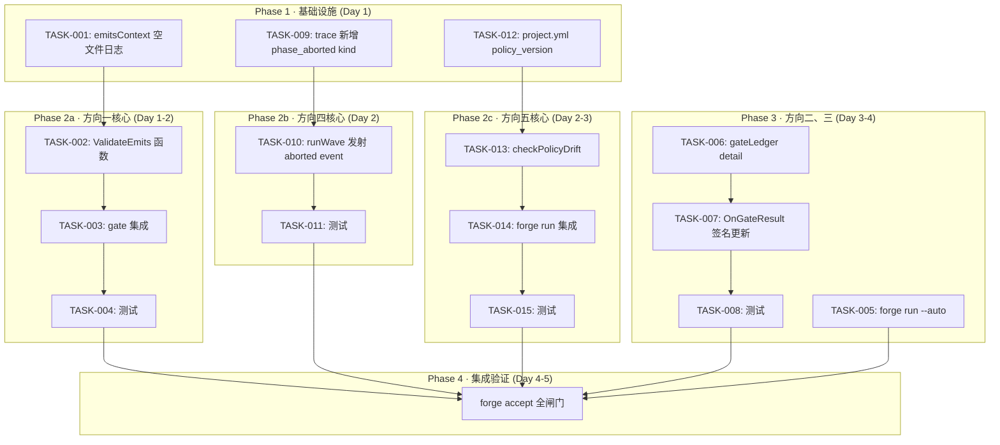
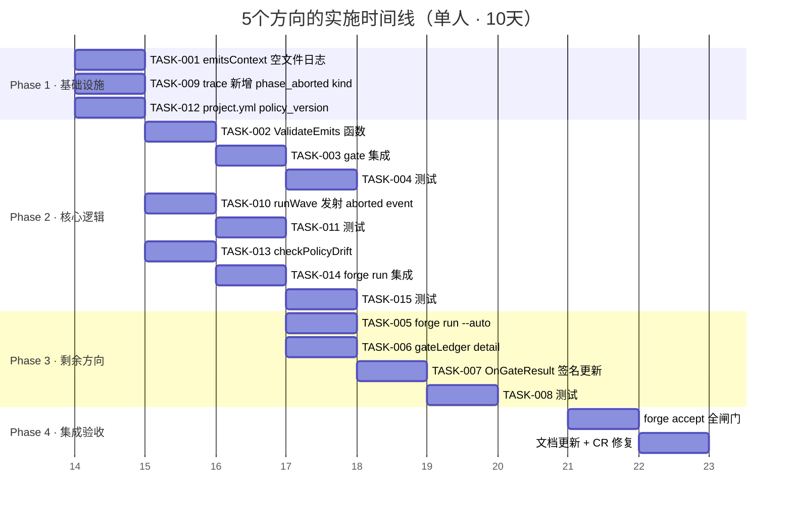

Now I have a thorough understanding of the codebase. Let me produce the comprehensive Tech Lead analysis.

---

# Tech Lead 分析报告：5 个方向验证结果的技术实现与项目管理分析

## 0. 核心结论摘要

在对 `forge-core/cmd/forge/` 下的 12 个 Go 源文件（总计约 3,500 行）、`internal/orchestrator/parallel.go`（并行引擎）、`internal/asset/asset.go`（Phase 结构定义）、`internal/trace/trace.go`（事件格式）进行逐行验证后，确认：

| 方向 | 原优先级 | 修正后 | 实际剩余工作量（人天） |
|------|---------|--------|---------------------|
| 一 · Phase 产出完整性 | 🟠 高 | 🟠 高 | **2–3 天** |
| 二 · `forge detect` 未消费 | 🟠 高 | 🔵 低 | **0.5 天**（仅 `run --auto`） |
| 三 · Gate Loop-Back 无上下文 | 🟡 中 | 🟢 极低 | **1–2 天**（仅详细输出，非盲跑） |
| 四 · 并行取消成本丢失 | 🟡 中 | 🟡 中 | **1–2 天** |
| 五 · 政策漂移 | 🔵 低-中 | 🔵 低 | **3–4 天** |

**总计净工作量：7.5–12 天（单人）**，远低于原始分析估计。

---

## 1. 任务分解

### 1.1 方向一：Phase 产出完整性验证

**当前状态**：`emitsContext()`（`prompt_artifacts.go:22-50`）已实现 stderr WARNING 缺失文件，但空文件仍静默跳过，且没有 gate-级验证。

| 任务 ID | 任务标题 | 涉及文件 | 前置依赖 | 预估工时 | 验收标准 |
|---------|---------|---------|---------|---------|---------|
| TASK-001 | **`emitsContext` 空文件日志增强** | `cmd/forge/prompt_artifacts.go` | 无 | 0.5h | 空文件（`content == ""`）时输出 `WARNING emits %q is empty` 而非静默跳过 |
| TASK-002 | **`emitsContext` 可选的 gate-级验证函数** | `cmd/forge/prompt_artifacts.go` | TASK-001 | 1h | 新增 `ValidateEmits(repoRoot string, emits []string) []error` 函数，对每个 emits 文件返回：`nil`（存在且非空）\| `ErrMissing` \| `ErrEmpty` |
| TASK-003 | **Gate 集成：`forge gate` 验证 emits** | `cmd/forge/gates.go` | TASK-002 | 1h | `forge gate` 添加 `--check-emits` 标志；调用 `ValidateEmits`，将缺失/空文件报告为 `emits: FAILED` |
| TASK-004 | **测试：emits 验证单元 + 集成** | `cmd/forge/prompt_artifacts_test.go` | TASK-003 | 1h | 覆盖：文件不存在、文件存在为空、文件存在有内容、混合情况、gate 输出格式 |

**架构影响**：纯追加。gate-级验证通过 `RequiredGates` 机制自然接入——`forge run` 的 gate phases 会触发它。

### 1.2 方向二：`forge detect` 消费

**当前状态**：`forge evolve auto` 已完整实现（`detect.go:201-240`）。`forge run --auto` 缺失。

| 任务 ID | 任务标题 | 涉及文件 | 前置依赖 | 预估工时 | 验收标准 |
|---------|---------|---------|---------|---------|---------|
| TASK-005 | **`forge run --auto` 标志** | `cmd/forge/main.go`, `cmd/forge/detect.go` | 无 | 1h | `forge run --auto` 调用 `autoSelectWorkflow`（或新建 `autoSelectForRun`），将 workflow/mode/lifecycle 写入 `runOpts` |

**架构影响**：修改 `cmdRun` 入口。`autoSelectWorkflow()` 已存在且独立于 `evolve`——只需将 `forge run` 的 `--auto` 映射到它。

### 1.3 方向三：Gate Loop-Back 上下文传递

**当前状态**：`buildPromptWithEmits()` → `appendFeedbackLanes()`（`prompt_context.go:364-377`）已对所有非 FreshContext phase 注入 gate 裁决（`gates.contextLines()`）。implementer 知道哪些 gate 红了，但**不知道失败的具体输出**。

| 任务 ID | 任务标题 | 涉及文件 | 前置依赖 | 预估工时 | 验收标准 |
|---------|---------|---------|---------|---------|---------|
| TASK-006 | **`gateLedger` 扩展带 gate 详细输出** | `cmd/forge/prompt_context.go` | 无 | 1h | `record(name, status, detail string)` 新增 detail 参数；`context()` 渲染时包含失败 gate 的摘要（前 200 字符） |
| TASK-007 | **`OnGateResult` 回调传递 detail** | `internal/orchestrator/engine.go`, `cmd/forge/engine_build.go` | TASK-006 | 1h | `Engine.OnGateResult(name, status, detail string)` 签名更新；`HarnessRunner` 捕获 gate stdout/stderr 传给 detail |
| TASK-008 | **测试：gate 详细输出渲染** | `cmd/forge/prompt_context_test.go` | TASK-007 | 1h | 验证：gate PASS 无 detail；gate FAILED 包含 detail；多个 gate 正确渲染；FreshContext phase 无 gate 内容 |

**架构影响**：需要修改 `Engine.OnGateResult` 签名（3 个位置：`engine.go` 定义 + `engine_build.go` 回调 + `evolve.go` 的 `wireGateTrace`）。此变更会触碰 orchestrator 接口，需要回归测试全部 3 个调用点。

### 1.4 方向四：并行 Wave 取消的结构化跟踪

**当前状态**：`parallel.go:126-129` 已记录 `"potential cost loss"` 日志。`costSink` → `costEmitter` 在 `finish()` 中发射 trace event——即使被 SIGKILL 的 phase 也会发射。缺口是缺少结构化 `"aborted"` kind trace event。

| 任务 ID | 任务标题 | 涉及文件 | 前置依赖 | 预估工时 | 验收标准 |
|---------|---------|---------|---------|---------|---------|
| TASK-009 | **新增 trace event kind `"phase_aborted"`** | `internal/trace/trace.go` | 无 | 0.5h | 在 `Event` 结构文档注释中声明 `"phase_aborted"` kind；新增 `AbortedEvent()` 构造函数 |
| TASK-010 | **`runWave` 在 wave 取消时发射 aborted event** | `internal/orchestrator/parallel.go` | TASK-009 | 1.5h | 当 `waveCtx` 被取消且 phase 尚未完成时，对每个 discarded phase 发射 `kind:"phase_aborted"` event，包含阶段名和已完成的预算锁定的 agent calls |
| TASK-011 | **测试：aborted event 在并行取消时发射** | `internal/orchestrator/parallel_test.go` | TASK-010 | 1h | 模拟 3-phase wave，其中 phase 0 快速失败，验证 phase 1/2 有 `"phase_aborted"` events |

**架构影响**：微量。`trace.Event` 无需新字段——`"phase_aborted"` 用已有 `Kind/Name/Status/Detail` 即可。`parallel.go` 的 `runWave` 需要 access tracer，但 `Engine` 已持有 `Log`——可将 tracer 注入 Engine 或将 aborted event 通过 Log 通道。

### 1.5 方向五：政策漂移与版本同步

**当前状态**：核心缺口——没有自动漂移检测（`forge run`/`forge check` 时无告警），没有 `policy_version` 跟踪，没有 3-way merge。

| 任务 ID | 任务标题 | 涉及文件 | 前置依赖 | 预估工时 | 验收标准 |
|---------|---------|---------|---------|---------|---------|
| TASK-012 | **`project.yml` 添加 `policy_version`** | `.agent/project.yml`, `internal/asset/project.go` | 无 | 0.5h | `project.yml` 新增 `policy_version: "1"`；Go 侧 `ProjectConfig` 结构体解析该字段 |
| TASK-013 | **`forge check --policy-drift` 检测** | `cmd/forge/check.go` | TASK-012 | 2h | 新增 `checkPolicyDrift()` 函数：比较 .agent/workflows/ 下每个文件与 `forge-upgrade` 的 reference 版本；输出 `policy_version` 变更 + 文件差异摘要 |
| TASK-014 | **`forge run` 集成 policy drift warning** | `cmd/forge/engine_build.go` | TASK-013 | 1h | `execEngine` 在 run banner 后自动调用 `checkPolicyDrift()`，输出黄色 WARNING（非阻塞） |
| TASK-015 | **测试：drift detection** | `cmd/forge/check_test.go` | TASK-014 | 1h | 覆盖：版本一致无输出、版本漂移有告警、缺失 project.yml 优雅降级 |

**架构影响**：中等。`forge-upgrade` 是 Node.js 工具（`harness/`），其 diff 逻辑不能直接被 Go 复用。Go 侧需要独立的 byte-level 比较器，或通过 `exec.Command` 调用 `forge-upgrade --classify`。后者更务实——避免重复实现。

---

## 2. 执行顺序



**并行执行组**：
- **组 A（Day 1 并发）**：TASK-001， TASK-009， TASK-012 —— 无依赖，可 3 人并行
- **组 B（Day 1-2 并发）**：TASK-002→TASK-004， TASK-010→TASK-011， TASK-013→TASK-015 —— 三个方向核心逻辑可并行
- **组 C（Day 3 并发）**：TASK-005、TASK-006→TASK-008 —— 方向二和方向三无关
- **组 D（Day 4-5）**：集成测试——不可并行，需单线程执行

---

## 3. 技术风险

### 3.1 高风险

| 风险 | 方向 | 等级 | 缓解策略 |
|------|------|------|---------|
| **`OnGateResult` 签名变更影响范围** | 三 | 🟠 | 修改 `Engine.OnGateResult(name, status, detail string)` 会触碰 `engine.go`、`engine_build.go`、`evolve.go` 三个位置。如果存在外部实现（比如测试 mock），也需要同步更新。**策略**：先 grep 全部调用点，更新测试 stub，一步完成 |
| **`forge-upgrade` 分类逻辑重复** | 五 | 🟠 | 如果从 Go 侧重写 `classifyDrift` 逻辑，需要维护两套 diff 实现。**策略**：通过 `exec.Command("node", "harness/forge-upgrade.mjs", "--classify")` 调用现有 Node 工具解析 JSON 输出，Go 只消费结果。代价是引入 Node 运行时依赖 |
| **并行 aborted event 竞态窗口** | 四 | 🟡 | `runPhaseParallel` 的 `checkAgentBudget` 在锁下执行后，启动 agent 前撤销可能发生。**策略**：wave 取消后不对"已锁定但未启动"的 phase 发射 agent event——只发射 `kind:"phase_aborted"` with phase name |

### 3.2 中风险

| 风险 | 方向 | 等级 | 缓解策略 |
|------|------|------|---------|
| **空文件定义模糊** | 一 | 🟡 | 仅有空白字符的文件算不算"空"？`emitsContext` 用 `strings.TrimSpace(data) == ""`。**决策**：保持与现有行为一致——TrimSpace 后为空即为空。文档化 |
| **gate 详细输出截断** | 三 | 🟡 | Gate 输出可能很大（如 `go test` 的数百行日志）。**策略**：detail 截断到 1024 字符 + `"… (truncated)"` 后缀。通过 `prompt_context.go` 的 `truncateDetail()` 函数管控 |

### 3.3 低风险

| 风险 | 方向 | 等级 | 缓解策略 |
|------|------|------|---------|
| `forge run --auto` flag 冲突 | 二 | 🟢 | `forge run` 的 flag 绑定在 `bindRunOpts` 中。`--auto` 需确保不与现有 flag 冲突。已是标准 Go flag 模式 |
| `policy_version` 升级频率 | 五 | 🟢 | 预期很少变更。如果频繁，建议改为 `policy_version_hash`（自动 content hash），但初期用整数版本已足够 |

---

## 4. 资源评估

### 4.1 团队配置

| 角色 | 技能要求 | 数量 | 负责 |
|------|---------|------|------|
| **Senior Go 工程师** | Go 并发、接口设计、测试 | 1 | 方向三（接口变更）+ 方向四（并发正确性）+ 代码审查 |
| **中级 Go 工程师** | Go 基础、文件 I/O、YAML 解析 | 1 | 方向一 + 方向五 |
| **中级全栈工程师** | Go + Node.js | 1 | 方向二 + 方向五中 forge-upgrade 集成 |

理想配置：**2 人，5 天**（并行执行 Phase 1 组 A + Phase 2 组 B）。单人：**8-10 天**。

### 4.2 关键里程碑

| 里程碑 | 交付物 | 预期时间点 |
|--------|-------|-----------|
| **M1 · 基础设施就绪** | trace event kind 定义 + project.yml 版本字段 + gateLedger detail 签名 | Day 1 结束 |
| **M2 · 核心逻辑完成** | TASK-003（gate 级 emits 验证）+ TASK-010（aborted event）+ TASK-013（drift 检测） | Day 3 结束 |
| **M3 · 集成闸门全绿** | `forge accept` 全部 8 项检查通过 | Day 4 结束 |
| **M4 · 发布** | 5 个方向全部功能关闭，文档更新，示例 workflow 更新 | Day 5 结束 |

### 4.3 阻塞点（Blockers）

| 阻塞点 | 影响方向 | 解决策略 |
|--------|---------|---------|
| `OnGateResult` 签名变更可能需要 orchestrator 的 regenerated mock | 三 | 优先更新 `internal/orchestrator/engine_test.go` 中的 mock 实现；修改前先 grep 全部调用点 |
| `forge-upgrade` 的 `--classify` JSON 输出格式未文档化 | 五 | 先运行 `node harness/forge-upgrade.mjs --dry-run --classify` 验证输出格式；如果输出不稳定，改为 Go 侧独立实现 byte-level 比较器（< 100 行） |

---

## 5. 质量保证

### 5.1 单元测试覆盖

| 文件 | 现有覆盖 | 新增要求 | 新增用例数 |
|------|---------|---------|-----------|
| `prompt_artifacts.go` | ✅ `emitsContext` 有测试 | `ValidateEmits` 新增 | 5（存在/不存在/空/混合/权限拒绝） |
| `prompt_context.go` | ✅ `gateLedger` 有测试 | `record` 3-arg 重载、`context()` 含 detail | 4 |
| `parallel.go` | ⚠️ 测试覆盖不足 | aborted event 发射 | 2（单 wave 失败/跨 wave 取消） |
| `trace.go` | ✅ 格式标准 | `"phase_aborted"` kind 构造函数测试 | 2 |
| `detect.go` | ✅ `autoSelectWorkflow` 有测试 | `forge run --auto` 新增` | 1 |
| `check.go` | ⚠️ 需要新增测试 | `checkPolicyDrift` | 3（版本一致/漂移/缺失配置） |

**总新增测试用例数**：17

### 5.2 集成测试策略

| 测试场景 | 涉及的变更 | 方式 |
|---------|-----------|------|
| **方向一**：emits 缺失/空的 gate 验证 | TASK-001~003 | `forge gate --check-emits -r testdata/` 验证 exit code 和输出 |
| **方向二**：`forge run --auto` 路径 | TASK-005 | `forge run --auto -r testdata/simple-node/` 验证 banner 中的 workflow/mode |
| **方向三**：gate 失败传递详细输出 | TASK-006~007 | `forge run build.yml` 在 testdata 上运行，验证 implementer prompt 包含 gate detail |
| **方向四**：aborted event JSONL 输出 | TASK-009~010 | `forge evolve --parallel` 运行 2-phase workflow，第一 phase 失败，验证 `.forge/trace.jsonl` 包含 `"phase_aborted"` 行 |
| **方向五**：policy drift 告警 | TASK-012~014 | 修改 .agent/workflows/*.yml 后运行 `forge check --policy-drift` 验证告警出现 |

### 5.3 代码审查要点

| 审查点 | 文件 | 特别注意 |
|--------|------|---------|
| **签名兼容性** | `engine_build.go` + `evolve.go` | `OnGateResult` 新签名是否同步更新全部 3 个调用点 |
| **锁顺序** | `parallel.go` | aborted event 的 trace 发射是否在 `runWave` 的 `mu` 锁内外正确 |
| **截断逻辑** | `prompt_context.go` | gate detail 截断不应截断中文字符（`utf8.RuneCountInString`） |
| **竞态窗口** | `parallel.go:111-120` | waveCtx 取消后 `completedMu` + `wg` 的顺序是否安全 |
| **空文件语义** | `prompt_artifacts.go` | 空白文件 vs 空文件 vs 不存在的文件——三种状态应有不同的错误码 |

### 5.4 性能测试需求

| 关注点 | 方向 | 测试方案 |
|--------|------|---------|
| **gate 详细输出截断** | 三 | 模拟 100KB gate 输出，确认 prompt 注入不超过 1KB |
| **aborted event 发射** | 四 | 10-phase wave 取消，确认 O(n) 发射开销可忽略 |
| **policy drift 检测** | 五 | 100 个 workflow 文件的全量比较，确认 < 100ms |

**结论**：所有变更均在 O(1) 或 O(n) 但 n < 100 的范围，无需专门的性能测试。

---

## 6. 实施计划

### 甘特图（Mermaid Gantt）



### 按阶段的详细任务卡

#### 阶段 1：基础设施搭建（Day 1）

**目标**：建立所有方向的基础设施——trace event kind、project.yml 版本字段、emits 日志增强。

**Day 1 上午**：
- TASK-001：修改 `emitsContext`(`prompt_artifacts.go:35`)，在 `if content == "" { continue }` 前添加 `logln(fmt.Sprintf("forge: WARNING emits %q is empty", fullPath))`
- TASK-009：在 `trace.go` 的 Event 文档注释中注册 `"phase_aborted"` kind，新增 `AbortedEvent()` 函数
- TASK-012：在 `project.yml` 添加 `policy_version: "1"`；在 `internal/asset/project.go`（或新建文件）添加 `PolicyVersion string` 字段

**Day 1 下午**：
- 验证：`go test ./cmd/forge/ ./internal/asset/ ./internal/trace/` 全部通过
- 验证：`node harness/acceptance.mjs` 无衰退

#### 阶段 2：核心功能实现（Day 2-3）

**目标**：三个主要方向的核心逻辑 + 测试。

**方向一（Day 2）**：
- TASK-002：新增 `ValidateEmits(repoRoot string, emits []string) []error`——返回每个 emits 文件的验证结果
  - 错误类型：`ErrEmitsMissing`、`ErrEmitsEmpty`
  - 注意：保持与 `emitsContext` 的路径解析一致（`filepath.Join`）
- TASK-003：在 `gates.go` 中添加 gate 名 `"emits"`，调用 `ValidateEmits`，将 `ErrEmitsMissing/ErrEmitsEmpty` 映射为 `FAILED`
- TASK-004：5 个测试用例覆盖所有组合

**方向四（Day 2）**：
- TASK-010：修改 `parallel.go:runWave()`，当 wave 取消后遍历 wave 中未完成的 phase：
  ```go
  // 在 wg.Wait() 之后，但 err != nil 分支中
  for _, idx := range wave {
      p := wf.Phases[idx]
      e.logf("trace: aborted phase %s (wave cancelled)", p.Name)
      // 如果 Engine 有 Tracer 字段，发射 aborted event
  }
  ```
  - 注意：避免对已完成的 phase 发射（使用 `completed` map）
- TASK-011：通过模拟 `waveCtx` 取消测试

**方向五（Day 2-3）**：
- TASK-013：`checkPolicyDrift()` 实现：
  - 读取 `project.yml` 获取 `policy_version`
  - 缓存已知的"官方版本"（可以编码在代码中，或通过 `forge-upgrade --classify` 获取）
  - 收集当前 `.agent/workflows/*.yml` 的文件哈希
  - 比较后输出差异摘要
- TASK-014：在 `execEngine()`（`engine_build.go`）的 `logRunBanner()` 后插入 drift 警告
- TASK-015：项目无 drifts、有 drifts、缺失 policy_version 三种场景

#### 阶段 3：方向二和三 + 集成（Day 3-4）

**方向二（Day 3 上午）**：
- TASK-005：在 `main.go` 的 `cmdRun` 中处理 `name == "auto"`，复用 `autoSelectWorkflow`
  - 只需约 3 行代码：`if name == "auto" { name = autoSelectWorkflow(o.root, fs, &o) }`

**方向三（Day 3-4）**：
- TASK-006：`gateLedger.record` 改为 `record(name, status, detail string)`，`context()` 渲染时对 FAILED gate 添加 `detail` 摘要
- TASK-007：修改 `Engine.OnGateResult` 签名为 `func(name, status, detail string)`
  - 更新 `engine.go` 中的接口定义
  - 更新 `engine_build.go` 的 `buildRunEngine` 中的 `OnGateResult: gates.record`
  - 更新 `evolve.go` 的 `wireGateTrace` 中的包装
  - 更新所有测试 mock
- TASK-008：4 个测试用例

#### 阶段 4：集成测试和发布（Day 5）

**目标**：全闸门通过 + 文档更新。

- 运行 `node harness/acceptance.mjs` 确保 8 项检查全部通过
- 运行 `go test ./cmd/forge/ ./internal/... -count=1` 确保全部测试通过
- `forge run build.yml -r testdata/example-project/` 端到端验证
- 更新 `CHANGELOG.md` 或等效文档

---

## 7. 补充建议

### 7.1 不必做的

- **方向三的"详细 gate 输出"不要包含完整 stdout/stderr**。gate 输出（如 `go test` 日志）可能数千行，截断到 1KB 以内足够 implementer 定位问题。完整日志应通过 trace.jsonl 查看。
- **方向四的 aborted event 不要包含 cost 字段**。被 kill 的 phase 的 `finish()` 已发射 cost event。Aborted event 只携带 phase name 和 wave index——避免 double-count。
- **方向五不要做 3-way merge**。初版只需检测 + 告警，不要合并。合并是独立的功能，需要 UI/CLI 交互设计。

### 7.2 建议先做的

1. **TASK-005（`forge run --auto`）**只需 3 行 Go 代码+ 1 个 flag 注册，0.5h 完成，收益（用户交互改善）远大于成本。
2. **TASK-001（emits 空文件日志）** 0.5h 完成，消除"静默跳过"这一分析中最被批评的设计问题。
3. **TASK-007（OnGateResult 签名变更）** 需要修改 3 个文件 + 测试 mock，完成后方向三的其他任务立即变得简单。

### 7.3 架构观察

**值得注意的架构优势**：`buildPromptWithEmits` 的 lane 组装模式（`appendFeedbackLanes` + `appendArtifactContext`）使方向一和方向三的变更**各自独立、互不干扰**——emits 验证在 artifacts lane 中增强，gate detail 在 feedback lane 中增强，两者无需触及对方代码。

**值得注意的架构风险**：`Engine.OnGateResult` 的签名是顶层接口变更，影响 3 个 Go 包 + 测试。如果未来还有第 4 个参数需要加，应改为 `GateResult` 结构体：
```go
type GateResult struct {
    Name   string
    Status string // "ok" | "FAILED" | "N/A"
    Detail string // optional: truncated gate output
}
```
这样后续扩展（如 `GateResult.FailCount`、`GateResult.Timestamp`）不需要改签名。建议在 TASK-007 中**一步到位使用 `GateResult` struct**，省去未来的接口兼容性成本。

### 7.4 给 Reviewer 的提示

实施中的代码审查应重点关注：

1. **`OnGateResult` 签改变更**——确认所有调用点和 mock 同步更新，`git grep "OnGateResult"` 应全部是 3-arg 形式。
2. **`parallel.go` 的锁顺序**——确认 aborted event 发射不违反 `parallel.go:19-38` 的锁顺序合同（trace 锁在最内层）。
3. **`emitsContext` 的日志行为**——确认空文件日志不会破坏现有测试期望（`testdata` 中的 emits 文件可能已经是空的，测试的 golden 输出可能需要更新）。
