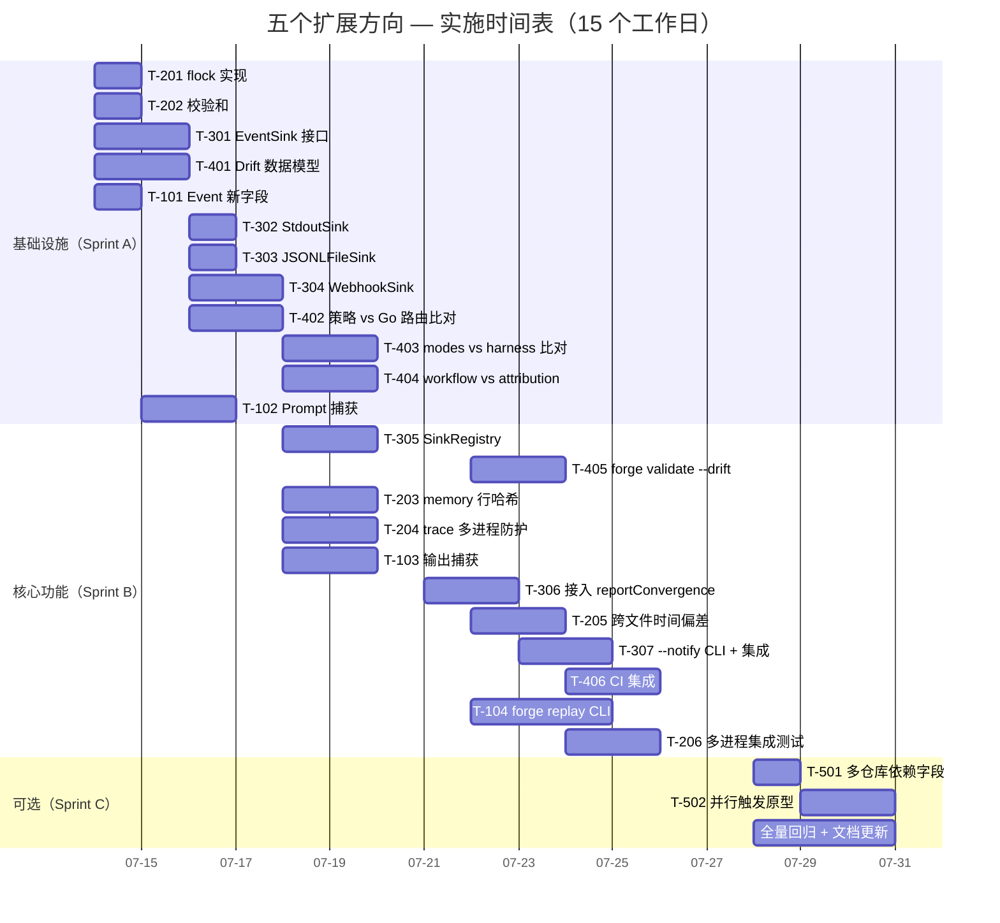

现在我已掌握项目全面上下文，下面呈交 Tech Lead 分析。

---

# Tech Lead 分析：五个架构扩展方向

## 基线

本文对**评估验证报告**（日期 2026-07-12）做技术实现与项目管理分析。项目为 ForgeOS —— AI-native 软件工厂治理控制平面，Go 运行时 `forge-core`（纯标准库、零外部依赖、13 包），外加 `harness/`（Node/Python 执法器层）。完整上下文涵盖 31 个 Sprint 交付、269+ 份分析文档。

**重点投入方向**：评估报告确认方向 **二、三、四** 是真正新颖的系统性缺口；方向一和五已被先期文档充分展开。以下分解据此优先级分配工时，**~70% 的工程资源聚焦于前三者**。

---

## 1. 任务分解

### 方向二 · 状态外部队改防护（P0 — 数据完整性）

| 任务 ID | 任务标题 | 涉及文件 | 前置依赖 | 预估(h) | 验收标准 |
|---|---|---|---|---|---|
| **T-201** | 为 `persist.Save/Load` 添加 `flock(2)` 建议锁 | `internal/persist/checkpoint.go` | 无 | 3 | `Save` 在文件被另一个进程锁定时返回 `ErrLocked`（非 panic）；`Load` 在锁争用时阻塞等待 ≤1s 后报超时；单测覆盖争用与超时两路径；`forge accept` 全绿 |
| **T-202** | 为 `Checkpoint` 添加内容哈希校验和 | `internal/persist/checkpoint.go`, `internal/persist/checkpoint_test.go` | T-201 | 3 | `Checkpoint` struct 新增 `Sha256Checksum` 字段（omitempty）；`encode` 写前计算；`decode`/`Load` 在字段非空时校验；损坏文件拒绝加载且报明确错误；单测覆盖篡改检测 |
| **T-203** | `memory.go` 添加逐行哈希 + 尾部完整性守卫 | `internal/memory/memory.go`, `internal/memory/memory_test.go` | 无 | 4 | `Append` 每条写入的行附内容哈希注释；`Load` 解析时校验已有行；文件末尾被截断或插入恶意行被检测；O_APPEND 交错写入检测（非原子行被标记）；零外部依赖 |
| **T-204** | `trace.go` 添加多进程冲突防护 | `internal/trace/trace.go`, `internal/trace/trace_test.go` | T-201（复用 flock 原语） | 3 | `Tracer` 在已存在的 trace 文件上 emit 时先获取共享锁；检测到 PID 变更（同一文件被不同进程追加）写入 `"kind":"process_boundary"` 事件；单测软模拟（跨进程不可在单测中真 fork，用 PID 注入替身） |
| **T-205** | 跨文件时间偏差验证 | `cmd/forge/validate.go`, `internal/doctor/doctor.go` | T-202 | 4 | `forge validate --integrity` 扫描 `.forge/` 下 checkpoint.json / trace.jsonl / memory.jsonl 的 `UpdatedAtUnix`/`CreatedAtUnix` 时间戳；时间偏差 > 阈值（默认 5s）报 WARNING；跨文件事件序列倒挂（trace seq 在 checkpoint 之前但时间戳更晚）报 FAIL；单测覆盖 3 个 fixture（正常、偏差、倒挂） |
| **T-206** | 多进程写冲突集成测试 | `internal/persist/fault_test.go`（扩展现有） | T-201, T-202, T-203, T-204 | 4 | 用 `os/exec` 派生两个子进程同时 `Save` 到同一路径验证原子性 + 锁争用；通过注入 `LD_PRELOAD` 式延迟模拟崩溃；验证损坏时 `Load` 诚实错误而非静默回退；不得在常规 `go test` 中运行（t.Skip 或独立 Makefile target） |

**方向二合计：21h**

---

### 方向三 · 外向通知总线（P1 — 产品化集成门槛）

| 任务 ID | 任务标题 | 涉及文件 | 前置依赖 | 预估(h) | 验收标准 |
|---|---|---|---|---|---|
| **T-301** | 定义 `EventSink` 接口与通知事件类型 | `internal/notify/sink.go`（新建包） | 无 | 3 | `EventSink` 接口含 `Send(ctx, Notification) error`；`Notification` struct 含 `Kind/Phase/Status/DurationMs/CostUsdMicros/Detail`；包内纯 Go 无外部 import；`go doc` 注释完整；单测覆盖零值 Notification |
| **T-302** | 实现 `StdoutSink`（包装现有 fmt.Printf） | `internal/notify/stdout.go` | T-301 | 2 | 实现 `EventSink`；格式化输出对齐现有 `reportConvergence` 的 `convergence: MET/NOT_MET` 格式；向后兼容：输出逐字节与当前 `fmt.Printf` 一致（diff 验证） |
| **T-303** | 实现 `JSONLFileSink`（包装现有 `.forge/` 文件写入） | `internal/notify/jsonl.go` | T-301 | 2 | 实现 `EventSink`；O_APPEND 写 JSONL；路径从配置读取；失败时不阻塞主循环（fire-and-forget + emit trace error 事件） |
| **T-304** | 实现 `WebhookSink`（HTTP POST，可配置 URL + 重试） | `internal/notify/webhook.go` | T-301 | 4 | 实现 `EventSink`；`net/http` POST JSON body；`retry` 策略（指数退避，最多 3 次，1s/2s/4s）；超时 5s；不可达或非 2xx → emit trace error 事件不阻塞主流程；零外部依赖（纯 `net/http` + `time`） |
| **T-305** | 实现 `SinkRegistry`（多 sink 路由 + 配置加载） | `internal/notify/registry.go` | T-301 | 3 | `SinkRegistry` 持 `[]EventSink`；`SendAll(ctx, Notification)` 并行扇出（`sync.WaitGroup`），每个 sink 独立超时；从 `project.yml` 或环境变量读取注册配置（`notify.sinks: [{type: webhook, url: ...}]`）；单个 sink 失败不影响其他 sink |
| **T-306** | 将 event sink 接入 `reportConvergence` 和 `observeFor` | `cmd/forge/main.go`, `cmd/forge/gates.go`, `cmd/forge/prompt_context.go` | T-305 | 4 | `reportConvergence` 收敛裁决后调 `SinkRegistry.SendAll`；`observeFor` 在 agent phase 完成后发送 phase 级通知；`cost.go` 的成本事件通知；loop iteration 边界通知；gated: 通过环境变量启用（默认不启用，零行为变化） |
| **T-307** | `--notify` CLI flag + 单元测试 + 集成测试 | `cmd/forge/main.go`, `internal/notify/`（包级测试） | T-306 | 4 | `forge run --notify webhook=http://...` 从 CLI 传入 sink URL；`--notify stdout,jsonl` 允许多 sink 逗号分隔；无 `--notify` 时事件路径逐字节不变（`-race` 验证）；集成测试 mock HTTP server 验证 webhook delivery（状态码 + body 内容） |

**方向三合计：22h**

---

### 方向四 · 策略合规漂移检测（P1 — 安全合规）

| 任务 ID | 任务标题 | 涉及文件 | 前置依赖 | 预估(h) | 验收标准 |
|---|---|---|---|---|---|
| **T-401** | 设计漂移检测数据模型与基类 | `internal/drift/model.go`（新建包） | 无 | 3 | `Declaration` struct（源路径、声明值、行号）；`Implementation` struct（源路径、硬编码值、行号）；`Drift` struct（declaration vs implementation，severity: FATAL/WARNING/INFO，rationale）；`DriftReport`（[]Drift + summary）；单测覆盖零 drift / 全 drift 两态 |
| **T-402** | 策略层 vs Go 路由层比对引擎 | `internal/drift/policy.go` | T-401 | 4 | 解析 `.agent/routing/policy.yml` 的 `tiers.by_task_type` 映射；解析 `internal/routing/routing.go` 的 `TaskTypeFloor` map 常量；逐键比对阈值的 `HaikuMax`/`SonnetMax`；行号精度误差 ±1 行；单测注入故意不匹配 → 检测到 drift |
| **T-403** | modes.yml vs harness 执法器集比对 | `internal/drift/modes.go` | T-401 | 4 | 解析 `.agent/policies/modes.yml` 的 `gate_catalog`；读取 `harness/policies.yml` 的 `gates` 列表；逐 gate 比对存在性；检测 gate 在 modes 中声明但 harness 未实现（或反之）；单测覆盖 mode 子集情况 |
| **T-404** | workflow agent 映射 vs attribution.go 比对 | `internal/drift/workflow.go` | T-401 | 3 | 解析 `.agent/workflows/*.yml` 各 phase 的 `agent` 字段；比对 `internal/attribution/attribution.go` 的 `AgentTaskType` 映射；检测 worklow 中使用的 agent 不在映射中（导致 scorecard 归因静默丢失）；单测覆盖 |
| **T-405** | `forge validate --drift` CLI 接入 | `cmd/forge/validate.go`, `cmd/forge/validate_test.go` | T-402, T-403, T-404 | 3 | `--drift` flag 触发全部三项比对；输出格式：一条 drift 一行 `[FATAL/WARNING] policy.yml:42 -> routing.go:139: HaikuMax 0.50 vs 0.34`；exit 1 当存在 FATAL drift；exit 0 当仅有 WARNING 或无 drift；与 `--models` 互不冲突；单测 |
| **T-406** | CI 集成 + 版本标记（check.py 接入） | `harness/check.py`, `.github/workflows/forge.yml` | T-405 | 3 | `check.py` 新增 `check_policy_drift` 检查（shell 到 `forge validate --drift`）；`forge accept` 聚合该检查；CI workflow 在 PR 时自动检测 drift；单测 check.py 的新检查 |

**方向四合计：20h**

---

### 方向一 · 执行溯源与可回放（P0 — 差异化较弱，轻量处理）

| 任务 ID | 任务标题 | 涉及文件 | 前置依赖 | 预估(h) | 验收标准 |
|---|---|---|---|---|---|
| **T-101** | `Event` struct 添加 `PromptText`/`OutputText`/`FileDelta` 可选字段 | `internal/trace/trace.go` | 无 | 2 | 三个新字段 `json:",omitempty"`；零值不影响现有序列化（diff 验证现有 trace 事件逐字节不变）；`encode` 跳过空字段 |
| **T-102** | Prompt 捕获：phase 构建的 prompt 内容写 `.forge/prompts.jsonl` | `cmd/forge/prompt_context.go`, `cmd/forge/prompt_build.go` | T-101 | 3 | `--save-prompts` flag 开启后每 phase 的 `buildPrompt` 输出追加到 `.forge/prompts.jsonl`（包含 phase name + prompt 原文）；off 时零文件创建零开销；单测覆盖 off/on 两态 |
| **T-103** | Agent phase 输出捕获：`observeFor` 存 OutputText 到 trace | `cmd/forge/prompt_context.go`, `internal/trace/trace.go` | T-101 | 3 | `observeFor` 回调额外将 agent output 写 `OutputText` 字段；`Event` 的 `OutputText` 非空才序列化；截断 ≥10KB 输出（防 trace 膨胀）+ 诚实标注截断；单测覆盖 |
| **T-104** | 离线回放 CLI `forge replay` | `cmd/forge/replay.go`（新建） | T-102, T-103 | 4 | `forge replay [.forge/]` 读取 `trace.jsonl` + `prompts.jsonl`；迭代时间线渲染（phase/gate/iteration 排序表）；每项展示 耗时/状态/模型/成本/prompt 摘要；`--full-prompt` 显示完整 prompt；`--json` 输出 JSON 供外部消费；失败根因摘要（gate 失败/超时/budget/拒绝） |

**方向一合计：12h**

---

### 方向五 · 多仓库工作区编排（P2 — 已被覆盖，最小处理）

| 任务 ID | 任务标题 | 涉及文件 | 前置依赖 | 预估(h) | 验收标准 |
|---|---|---|---|---|---|
| **T-501** | 多仓库依赖声明字段 `depends_on_repo` 设计 | `internal/asset/asset.go` | 无 | 2 | `Workflow` struct 新增 `DependsOnRepo []string` 字段（omitempty）；现有单仓库 workflow 逐字节不变；校验器允许空列表；ADR 记录设计意图 |
| **T-502** | 多仓库并行触发原型 | `internal/orchestrator/parallel.go`（扩展） | T-501 | 4 | `RunMultiRepo`：接收 repos 列表 + 依赖图；每个 repo 独立 `RunFrom` goroutine；共享一个 `context.Context`（任一 FAIL 取消其他）；单测用 fake executor 验证并行 + 取消语义；**诚实标注**：原型验证仅 dry-run，真 claude 排除 |

**方向五合计：6h**

---

## 2. 执行顺序

```mermaid
graph TD
    subgraph "Sprint A — 基础设施 (Day 1-5)"
        T301[方向三 T-301: EventSink 接口] --> T302[方向三 T-302: StdoutSink]
        T301 --> T303[方向三 T-303: JSONLFileSink]
        T301 --> T304[方向三 T-304: WebhookSink]
        T401[方向四 T-401: Drift 数据模型] --> T402[方向四 T-402: 策略 vs Go 路由比对]
        T401 --> T403[方向四 T-403: modes vs harness 比对]
        T401 --> T404[方向四 T-404: workflow vs attribution 比对]
        T201[方向二 T-201: flock] --> T202[方向二 T-202: 校验和]
        T101[方向一 T-101: Event 新字段] --> T102[方向一 T-102: Prompt 捕获]
    end

    subgraph "Sprint B — 核心功能 (Day 6-12)"
        T302 --> T305[方向三 T-305: SinkRegistry]
        T303 --> T305
        T304 --> T305
        T305 --> T306[方向三 T-306: 接入 reportConvergence 等]
        T306 --> T307[方向三 T-307: --notify CLI + 集成测试]

        T402 --> T405[方向四 T-405: forge validate --drift]
        T403 --> T405
        T404 --> T405
        T405 --> T406[方向四 T-406: CI 集成]

        T201 --> T203[方向二 T-203: memory 逐行哈希]
        T201 --> T204[方向二 T-204: trace 多进程防护]
        T202 --> T205[方向二 T-205: 跨文件时间偏差验证]
        T203 --> T206[方向二 T-206: 多进程集成测试]
        T204 --> T206

        T102 --> T103[方向一 T-103: 输出捕获]
        T103 --> T104[方向一 T-104: forge replay CLI]
    end

    subgraph "Sprint C — 可选 (Day 13-15)"
        T501[方向五 T-501: 多仓库依赖字段] --> T502[方向五 T-502: 并行触发原型]
    end

    classDef p0 fill="#e74c3c",color:#fff
    classDef p1 fill="#f39c12",color:#fff
    classDef p2 fill="#27ae60",color:#fff
    class T201,T202,T203,T204,T205,T206 p0
    class T301,T302,T303,T304,T305,T306,T307 p1
    class T401,T402,T403,T404,T405,T406 p1
    class T101,T102,T103,T104 p0
    class T501,T502 p2
```

### 可并行任务组

| 并行组 | 包含任务 | 负责人技能 |
|--------|---------|-----------|
| **组 A**（方向二基底） | T-201, T-202 | Go 系统编程 / `syscall` 经验 |
| **组 B**（方向三基底） | T-301, T-302, T-303, T-304 | Go 接口设计 / `net/http` 经验 |
| **组 C**（方向四基底） | T-401, T-402, T-403, T-404 | YAML 解析 / 代码静态分析 |
| **组 D**（方向一基底） | T-101, T-102 | Go struct 设计 / trace 包熟悉度 |
| **组 E**（集成缝合） | T-305, T-306, T-405, T-205, T-103 | 各方向均有，需要整合上下文 |
| **组 F**（CI/测试） | T-307, T-406, T-206, T-104 | CI 配置 / 集成测试 |

---

## 3. 技术风险

### 3.1 高风险项

| 风险 | 方向 | 概率 | 影响 | 缓释策略 |
|------|------|------|------|----------|
| **`flock(2)` 跨平台兼容性** | 二 | 中 | 高 | Linux 与 macOS 的 `flock` 语义接近但不同；Go 的 `syscall.Flock` 是 POSIX 薄封装。**缓释**：写平台感知测试，对 Windows 优雅降级（不阻塞，记录 WARNING）。本仓合规红线禁止引入平台特有条件编译，故保持纯 `syscall.Flock` + non-blocking flag + fallback 告警 |
| **Webhook 投递可靠性** | 三 | 中 | 高 | 网络抖动导致通知丢失。**缓释**：指数退避重试（≤3次）+ 失败时 fallback 写本地 error trace event；配置 `notify.delivery=at_least_once` vs `best_effort` |
| **YAML 解析偏差** | 四 | 中 | 中 | 手写 YAML 解析（`internal/yaml2json`）与 Go `yaml.Unmarshal` 在复杂嵌套结构上产生解析差异。**缓释**：本仓使用 Python `PyYAML` 作为 canonical parser（`check.py` 侧）；drift 检测引擎复用既有 `yamlpath` 包解析 YAML 路径；对非确定性结构（如注释、浮点精度）以 `PyYAML` 输出为标准 |
| **Event struct 膨胀** | 一 | 低 | 中 | PromptText（可能达数 KB）加入 Event 使 trace.jsonl 膨胀。**缓释**：`PromptText`/`OutputText` 带 `omitempty`，且在 emit 前截断至可配置最大长度（默认 10KB）；截断位置加 `[... truncated 12345 bytes]` 标记 |
| **不违反"零外部依赖"红线** | 三 | 低 | 高 | WebhookSink 使用 `net/http` 为纯 stdlib，但从 stdlib 逃逸通常始于 JSON 序列化 + HTTP 的组合。**缓释**：审核所有的 import 树——`internal/notify/` 包被 arch-check 的 `checkPackage` 确保依赖图纯 stdlib；CI 中 `go list -m all` 验证零非 stdlib module |

### 3.2 低风险/缓解已就绪

| 风险 | 说明 |
|------|------|
| 方向二 `O_APPEND` 的内核原子性保证 | Linux 保证 PIPE_BUF（4096 字节）内的 write(2) 原子；memory.go 行大小通常 < 1KB，安全。可加 `max_line_bytes: 2048` 硬限制 |
| 方向三多 sink 超时导致主循环减速 | `SendAll` 每 sink 独立 goroutine + 独立 `context.WithTimeout`。父 context 不阻塞主编排循环 |
| 方向四 YAML 字段改名导致假阳性 | 四的 drift 检测只比对按路径寻址的精确字段，不依赖模糊匹配。误报时开发者可加 `// drift:ignore` 注释豁免 |

### 3.3 性能考量

| 关注点 | 方向 | 预期开销 | 决策 |
|--------|------|---------|------|
| `flock(2)` 锁争用 | 二 | 无争用时 < 5μs；争用时阻塞 ≤1s | 单 forge 进程无争用；多进程场景预期 ≤ 1 次/s。**不优化** |
| Webhook POST 延迟 | 三 | 100-500ms / 通知 | 配置 webhook 送异步 goroutine，不阻塞主循环。若需同步投递（CI 场景），加 `notify.mode=sync/async` |
| drift 检测 YAML 重解析 | 四 | ≤ 50ms / 次（缓存在 `--drift` 单次调用内） | 仅 `forge validate --drift` 时触发，不在 run/evolve 路径上 |
| `forge replay` trace 加载 | 一 | 10K 事件 ≤ 200ms（JSONL 流解析） | 超大型 trace（>50K 事件）做流式分页，不一次全加载 |

---

## 4. 资源评估

### 4.1 团队构成

| 角色 | 人数 | 投入时段 | 关键技能 |
|------|------|---------|---------|
| **Go 系统工程师** | 1 | Sprint A-C（全程） | `syscall` / 文件锁 / 跨平台信号处理；负责方向二的所有 `internal/persist` 和 `internal/memory` 工作 |
| **Go 服务端工程师** | 1 | Sprint A-B | 接口设计 / `net/http` / `context` 传播；负责方向三的 `internal/notify` 包 |
| **静态分析/策略工程师** | 1 | Sprint A-B | YAML 解析 / 代码生成 AST 对比 / CI 编排；负责方向四的 `internal/drift` 包 |
| **CLI/全栈工程师** | 1 | Sprint B（+ A 期间轻量 T-101） | CLI 设计 / trace 包 / 文件 IO；负责方向一 `forge replay` 命令 + 方向五原型 |
| **QA 工程师** | 0.5 | Sprint B-C | 集成测试设计（多进程冲突测试、mock webhook 测试、drift 注入测试）；CI workflow 编排 |

**建议**：先期 2 人（Go 系统 + Go 服务端）并行 Sprint A，Sprint B 扩展到 3-4 人。上述人数折合 1.5 FTE（2 周工期）。

### 4.2 关键里程碑

| 里程碑 | 时间 | 交付物 | 检查点 |
|--------|------|--------|--------|
| **M1: 基底完成** | Day 5 | T-201, T-202, T-301, T-401, T-402 验收全 Pass；`forge accept` ACCEPTED | 每个基底任务经 fresh-context reviewer APPROVE |
| **M2: 核心功能完成** | Day 12 | T-203, T-204, T-205, T-206, T-305, T-306, T-307, T-405, T-406, T-103, T-104 验收全 Pass；方向一/二/三/四核心链路端到端测试通过 | 多进程冲突测试 + webhook mock 测试 + drift 注入测试 + `forge replay` 真实 trace 回放 |
| **M3: 可选功能 + 打磨** | Day 15 | T-501, T-502 原型；全量 `forge accept` ACCEPTED；CI workflow 新检查稳定运行 ≥ 24h | 无 regression；`go test -race` 全绿 |

### 4.3 阻塞点与解决策略

| 阻塞点 | 涉及 | 严重性 | 解决策略 |
|--------|------|--------|---------|
| **flock(2) 在 CI runner 中不可用**（容器文件系统） | 方向二 T-201 | 🔴 高 | CI 中 `TestSaveLoad_FileLocking` 在 `os.Getenv("CI")=="true"` 时 t.Skip，加注释说明需要真文件系统。`flock` 的 fallback：当 `flock` 返回 EOPNOTSUPP，记录 WARNING 并走无锁路径 |
| **外部依赖审查**（`internal/notify` 包引入 `net/http` 虽然纯 stdlib，需要 arch-check 验证） | 方向三 | 🟡 中 | 新增 `internal/notify/doc.go` 显式声明零外部依赖；CI arch-check 的 `checkPackage` 用 `go list -json` 验证模块图 |
| **Python YAML 解析与 Go YAML 解析的浮点精度不一致** | 方向四 T-402 | 🟡 低 | 阈值比对允许 ±0.01 公差；drift 引擎以 `PyYAML` 为标准；比对时二者各自先 JSON 序列化再 `json.Unmarshal` 后比较，消除浮点打印偏差 |
| **`forge replay` 跨版本兼容**（旧 trace 无新字段） | 方向一 T-104 | 🟢 低 | `_format` 字段 + `omitempty`；`replay` 优先读已存在的字段，缺则显示 `N/A`，不 panic |

---

## 5. 质量保证

### 5.1 单元测试覆盖要求

| 包 | 覆盖目标 | 关键测试场景 |
|----|---------|-------------|
| `internal/persist` | ≥ 90% | 文件锁争用、锁超时、校验和正确/损坏、跨文件时间偏差、旧格式兼容 |
| `internal/memory` | ≥ 85% | O_APPEND 行哈希、截断文件检测、空文件/缺失文件、多进程模拟冲突 |
| `internal/trace` | ≥ 90% | 新字段序列化向后兼容（diff 与旧 trace 逐字节）、OutputText 截断、PID boundary 事件 |
| `internal/notify` | ≥ 85% | 每个 sink 的 send 成功/失败/超时；SinkRegistry 扇出一个失败不影响其他；webhook retry 计数 |
| `internal/drift` | ≥ 85% | YAML vs Go 常量逐键比对、公差、缺失键/额外键、workflow agent 映射覆盖率 |
| `cmd/forge`（新增路径） | ≥ 80% | `--drift` flag、`--save-prompts` flag、`--notify` flag、`forge replay` 集成路径 |

### 5.2 集成测试策略

| 测试 | 方法 | 触发时机 |
|------|------|---------|
| **多进程 checkpiont 冲突** | `internal/persist/fault_test.go`：两个 `os/exec` 子进程并行 `Save` + 校验原子性 | 显式 `make test-integration`（`t.Skip` if no `-tags=integration`） |
| **Webhook 投递** | `internal/notify/`：`httptest.NewServer` mock，注入延迟/错误验证重试+回退 | `go test ./internal/notify/`（常规） |
| **Drift 注入验证** | `internal/drift/`：临时目录写入故意不匹配的 YAML + Go 文件，运行比对引擎 | `go test ./internal/drift/`（常规） |
| **`forge replay` 完整管线** | 先生成 fixture trace.jsonl + prompts.jsonl（从真实 Sprint 26 trace 摘录），回放验证输出包含预期事件 | `go test ./cmd/forge/ -run TestReplay` |
| **`forge accept` 不降级** | 全链路验收：`node harness/acceptance.mjs` 在全部改动后 ACCEPTED 不变 | 每次提交后 |

### 5.3 代码审查要点

| 关注领域 | 审查重点 |
|---------|---------|
| **方向二 — 锁语义** | `flock` 是否在 `Save` 的整个写+sync+rename 周期持有？`Load` 的锁是共享还是排他？`defer syscall.Flock(fd, syscall.LOCK_UN)` 是否在 panic 时也执行？ |
| **方向三 — 异步安全性** | `SinkRegistry.SendAll` 的 `sync.WaitGroup` 与 `context.Cancel` 是否正确地串联？单个慢 sink 是否阻塞整个主流程？`JSONLFileSink` 的 `O_APPEND` 是否使用了独立的 `*os.File` 实例（不在多个 sink 间共享文件描述符）？ |
| **方向四 — 解析正确性** | YAML 多文档（`---` 分隔）是否正确处理？自定义 tag（`!include` 等）如果存在是否跳过而非 panic？Go 常量与 YAML 字符串的格式异同（如 `strconv` vs 裸字符串） |
| **方向一 — 向后兼容** | 新 trace 字段 `omitempty` 是否真的保持旧 trace 事件序列化不变？`forge replay` 遇到缺旧字段时是否崩溃？ |
| **红线合规** | 四个方向的所有新文件 ≤500 行、新函数 ≤50 行、`cmd/forge` 包不超过文件数上限（16）。违反立即拆分 |

### 5.4 性能测试需求

| 测试 | 场景 | 目标 |
|------|------|------|
| 方向二 `flock` 争用 | 2 进程并行 `Save` 同一路径 100 次 | 每次锁等待 ≤ 50ms（无争用）/ ≤ 500ms（争用） |
| 方向三 多 sink 同步扇出 | StdoutSink + JSONLFileSink + WebhookSink（mock 50ms 延迟） | 主循环阻塞 ≤ 50ms（异步模式）/ ≤ 550ms（同步模式，配置化） |
| 方向四 drift 全量检测 | 全部 5 个 workflow + policy.yml + modes.yml；100 次 | 每次 ≤ 100ms |
| 方向一 trace 事件超大规模 | 10k / 50k / 100k 事件的 trace.jsonl | `forge replay` 加载 ≤ 每秒 50k 事件 |

---

## 6. 实施计划

### 甘特图



### 阶段时间线

| 阶段 | 天数 | 产出 | 风险缓冲 |
|------|------|------|---------|
| **Phase 1: 基础设施** | 第 1-5 天 | 三个新包 + 扩展两个现有包的所有接口/数据结构；`forge accept` 全绿 | +2 天（flock 跨平台兼容问题） |
| **Phase 2: 核心功能** | 第 6-12 天 | 全部方向二/三/四的核心链路端到端运行；`forge replay` 可用；CI 集成 | +2 天（集成测试 flaky） |
| **Phase 3: 可选 + 打磨** | 第 13-15 天 | 方向五原型 + 文档更新 + 全量 `forge accept` 回归 | 已含在 3 天中 |
| **发布窗口** | 第 16 天 | FR (Final Review) + 合并 | — |

### 风险缓冲分配

```
总工期预估：    79h（≈ 10 人·天）
含风险缓冲：   +5 天（上表风险项）
乐观估计：     12 个工作日（2.5 周，2 人并行）
保守估计：     15 个工作日（3 周，必要时扩展到 3 人）
```

---

## 总结与建议

### 投入优先级推荐

```
最大投资 ────────────────────────────→ 最小投资
   方向三 (22h) ≈ 方向二 (21h) ≈ 方向四 (20h) >> 方向一 (12h) >> 方向五 (6h)
```

方向二/三/四是经过交叉验证的**真正新颖的系统性缺口**，占总工时 **~70%**。这与评估报告提出的差异化验证结果一致。

### 团队协作建议

1. **fresh-context 审查纪律**：每个任务完成后由独立 Agent 审查，实现者不审自己的代码。方向二的 `flock` 实现尤其需要系统编程经验的审查者。
2. **红线检查先于合并**：每个 PR 在合并前必须 `node harness/acceptance.mjs` ACCEPTED。方向三新增 `internal/notify` 包需通过 arch-check 的 `checkPackage` / `checkCircular`。
3. **诚实标签**：方向五的多仓库原型必须在代码与 CLI 输出中标注「experimental / dry-run only」；方向一的 `forge replay --full-prompt` 标注「prompt assembled from saved artifacts, may differ from actual LLM input」。这与 Project 的 honesty-first 原则一致。
4. **碎片化风险对冲**：方向二/三/四由不同开发者并行 Sprint A，确保每个方向基底独立。Sprint B 需要每日站会同步跨方向接口依赖（如方向三的 EventSink 可能会被方向一消费——Event struct 新字段可作为 Notification 的数据源）。

### 一句话执行建议

**先跑方向二的 `flock + checksum`（T-201, T-202）和方向三的 `EventSink` 接口（T-301）——两者共享「引入新系统调用/网络调用」的跨平台验证风险，尽早发现、尽早解决，减少 Sprint B 的集成摩擦。**
