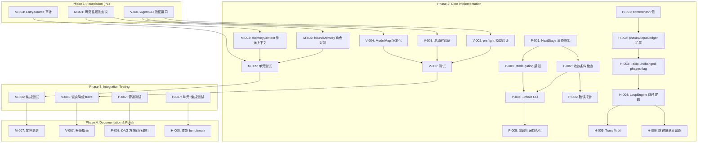
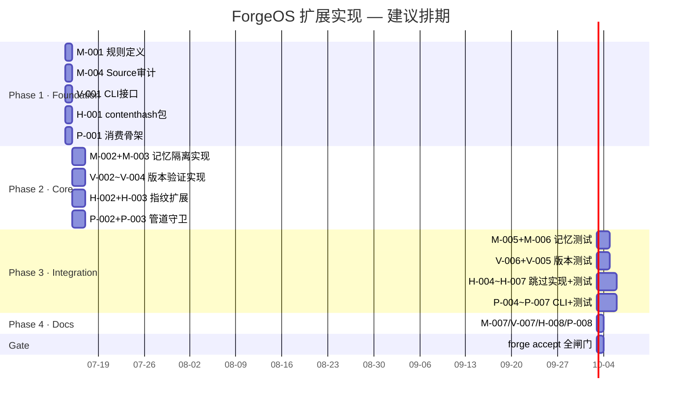
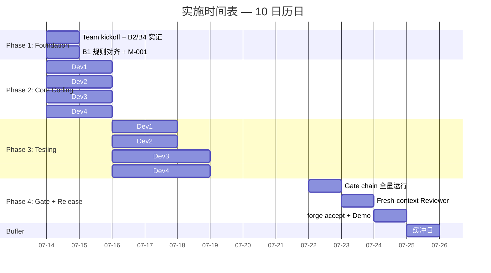

现在我已掌握全部上下文。以下是 Tech Lead 全面分析。

---

# Tech Lead 技术实现与项目管理分析

> **审查对象**: `2026-07-11-forgeos-five-genuinely-unexplored-extensions.md`  
> **验证报告**: `2026-07-11-forgeos-five-genuinely-unexplored-extensions.out.md`  
> **代码基线**: HEAD `b0c80e4`, forge-core 18 Go 包 + harness 41 模块  
> **当前 Sprint**: 31 完成, 下一前沿待启动

---

## 0. 修正后的方向评估矩阵

验证报告校正后，五个方向的真实状态如下：

| # | 方向 | 验证判定 | 调整后优先级 | 预估 Sprint | 核心价值主张 |
|---|------|---------|------------|------------|------------|
| ① | Per-Role Memory 隔离 | ✅ 保留 | **P1** | ~1 sprint | 治理宪法完整性——fresh-context 在记忆层的静默旁路 |
| ② | Phase 输出内容寻址 | ✅ 保留 | **P2** | ~2 sprint | evolve 后期 2-5x 效率提升，安全基线不变 |
| ③ | 跨工作流管道状态机 | 🟡 降级补充 | **P2** (原 P1) | ~1.5 sprint | 独特贡献：收敛条件检查 + mode gating 感知；核心概念与 DAG 方向重叠 |
| ④ | 自身资源自保 | ❌ 替换 | **—** | — | 已被 `production-operational-gaps.md` 方向一系统性覆盖（24+ 文档提及） |
| ⑤ | CLI 版本兼容性 | ✅ 保留 ↑ | **P1→P2** (原 P2) | ~1 sprint | 成本极低（几行 `exec.Command`），风险暴露面大 |

### 关键资源重分配

方向④ 被替换后释放出 ~1 sprint 的容量。我的建议是：

1. **将这 1 sprint 注入方向⑤**，使其从「P1→P2 交界」落地为完整可交付
2. **方向③ 保持 P2 不降级**，但限制范围为"收敛条件 + mode gating"独特部分，不重复 DAG 方向已有的工作

---

## 1. 任务分解

### 1.1 方向 ① — Per-Role Memory 隔离 (P1)

| 任务 ID | 标题 | 涉及文件 | 前置依赖 | 工时 | 验收标准 |
|---------|------|---------|---------|------|---------|
| **M-001** | 定义跨角色可见性规则 | `.agent/DECISIONS.md`, `.agent/AGENTS.md` | 无 | 2h | 规则文档化：producer→write可见，reader→write不可见；显式 `share_with` 声明例外。经团队 review |
| **M-002** | `boundMemory` 增加角色过滤 | `cmd/forge/prompt_memory.go:81-130` | M-001 | 3h | `boundMemory` 新增 `currentRole string` 参数；当当前角色为 reviewer 时，过滤掉 source=implementer 的非 `share_with` 条目；当当前角色为 implementer 时，过滤掉 source=planner 的非共享条目。已有测试不变，新增测试覆盖过滤路径 |
| **M-003** | `memoryContext` 传递 phase 上下文 | `cmd/forge/prompt_context.go:368` | M-002 | 2h | `buildPrompt` 调用 `memoryContext` 时传入当前 phase 的 `Source` 字段；当 phase 未声明 Source 时退化为现有行为（向后兼容） |
| **M-004** | Entry.Source 写入逻辑审计 | `internal/memory/memory.go:138-171` | M-001 | 2h | 审计所有 `memory.Append` 调用点，确认每个调用正确写入 `Source`；对缺少 Source 的调用补全；在 `memory.Append` 加注释说明 Source 的消费链 |
| **M-005** | 单元测试：隔离规则 | `cmd/forge/prompt_memory_test.go`, `cmd/forge/prompt_context_test.go` | M-002, M-003 | 4h | 3 个场景：（1）reviewer 看不到 implementer 的内部 memory（2）共享 memory 通过 `share_with` 正确穿透（3）无 Source 的旧条目向后兼容。覆盖率新增 ≥80% |
| **M-006** | 集成测试：真实 evolve 场景 | `cmd/forge/evolve_test.go` | M-005 | 3h | fake-agent 模拟 implementer→reviewer 流程；验证 reviewer prompt 中不含 implementer 的内部 memory 条目 |
| **M-007** | 文档更新 | `.agent/AGENTS.md`, `docs/design/memory-isolation.md` | M-001 | 2h | AGENTS.md fresh-context 条目增加 memory 隔离子条款；memory 包 doc comment 更新 |

**小计：~18h（约 2.5 人天）**

### 1.2 方向 ⑤ — CLI 版本兼容性契约 (P1→P2)

| 任务 ID | 标题 | 涉及文件 | 前置依赖 | 工时 | 验收标准 |
|---------|------|---------|---------|------|---------|
| **V-001** | AgentCLI 版本检测接口 | `internal/orchestrator/command_executor.go` | 无 | 3h | `AgentExecutor` 接口新增可选方法 `ValidateModel(model string) error`；`CommandExecutor` 实现它：执行 `claude --model <name> --dry-run 2>&1` 解析 exit code |
| **V-002** | `forge preflight` 模型名验证 | `cmd/forge/preflight.go` | V-001 | 3h | `forge preflight` 新增 `--validate-models` flag（默认 false），枚举 `routing.ModelMap` 中的所有模型名，对每个调用 `ValidateModel`；输出结构化报表 |
| **V-003** | 启动时模型名验证（轻量） | `cmd/forge/main.go` | V-001 | 2h | `forge run` / `forge evolve` 启动时对本次路由选择的模型名执行一次 `--dry-run` 验证；Pass 则静默，Fail 则打印 warning 但不阻断 |
| **V-004** | `ModelMap` 版本化 | `internal/routing/routing.go` | V-001 | 2h | `ModelMap` 增加 `min_claude_version` 字段；`forge preflight` 比较 `claude --version` 输出与最低版本要求；版本不匹配时输出结构性告警 |
| **V-005** | 诚实降级事件 trace | `internal/trace/trace.go`, `cmd/forge/main.go` | V-003 | 2h | 新增 `ModelUnverified` 事件类型；当 `--dry-run` 验证失败时写入 trace；用户可通过 `forge doctor --trace-events ModelUnverified` 查询 |
| **V-006** | 单元测试 + 集成测试 | `internal/orchestrator/command_executor_test.go`, `cmd/forge/preflight_test.go` | V-001 ~ V-004 | 4h | Mock `exec.Command` 模拟不同 claude CLI 版本返回值；4 场景：正常、模型弃用、不识别 `--model` flag、非 claude CLI |
| **V-007** | 文档 + 升级指南 | `docs/operations/claude-compatibility.md`, `.agent/AGENTS.md` | V-004 | 2h | 记录模型名验证机制；附：用户升级 claude CLI 后的检查步骤；说明 fail-open 安全策略 |

**小计：~18h（约 2.5 人天）**

### 1.3 方向 ③ — 跨工作流管道状态机 (P2，独特部分)

| 任务 ID | 标题 | 涉及文件 | 前置依赖 | 工时 | 验收标准 |
|---------|------|---------|---------|------|---------|
| **P-001** | `OnApproved.NextStage` 消费骨架 | `internal/asset/asset.go`, `internal/orchestrator/loop.go` | 无 | 4h | `LoopEngine` 新增 `nextStage()` 方法读取 `stop.OnApproved.NextStage`；`cmdRun` 新增 `--chain` flag（默认 false）；当 `--chain` 且 `nextStage` 非空时，返回结构化信号而非直接退出 |
| **P-002** | 收敛条件检查 + 转场守卫 | `internal/orchestrator/loop.go:70-90` | P-001 | 4h | 转场前验证 stop condition MET（human_gate approved 或 conjunction all_of 达标）；NOT MET 时 exit 1 + 结构化错误报告标明哪一步失败；状态持久化到 `.forge/chain/` |
| **P-003** | Mode gating 感知跳过 | `internal/mode/mode.go`, `internal/orchestrator/loop.go` | P-001 | 3h | 转场前查询目标 workflow 的 mode gating：如果 mode=explorer 且 `ReviewDepth=skip`，自动跳过 review.yml stage；trace 中记录 `stage_skipped(mode_gating)` |
| **P-004** | `forge run --chain` CLI 集成 | `cmd/forge/main.go:54-68` | P-001, P-002 | 2h | `cmdRun` 解析 `--chain` flag；收敛后自动执行 `forge run <next_stage> --chain`（递归）；`--max-chain-depth` 防止无限循环（默认 10） |
| **P-005** | 阶段标记持久化 | `cmd/forge/gates.go`, `internal/persist/` | P-002 | 3h | 使用既有的 `.forge/<stage>.approved` 模式，新增 `.forge/<stage>.converged`；链中断后可恢复：`forge run --chain --resume-from design` 跳过已完成的 stage |
| **P-006** | 管道失败结构化报告 | `cmd/forge/gates.go` | P-002 | 2h | 输出格式：`[CHAIN] pipeline: discover → FAILED at design (gate: arch-check NOT MET, see .forge/chain/design-err.json)` |
| **P-007** | 单元测试 + 端到端测试 | `internal/orchestrator/loop_test.go`, `cmd/forge/main_test.go` | P-001 ~ P-006 | 5h | fake-agent 测试链：discover→design→review→build 自动推进；收敛不满足时中止；mode gating 跳过；递归深度保护；恢复语义 |
| **P-008** | 与 DAG 方向的方向对齐说明 | `docs/requirements/2026-07-11-five-architectural-product-expansion-directions.md` 方向 5 | P-001 | 1h | 书面记录本方向的独特贡献（收敛条件检查 + mode gating 感知）与 DAG 方向的关系；避免重复工作 |

**小计：~24h（约 3 人天）**

### 1.4 方向 ② — Phase 输出内容寻址 (P2)

| 任务 ID | 标题 | 涉及文件 | 前置依赖 | 工时 | 验收标准 |
|---------|------|---------|---------|------|---------|
| **H-001** | `internal/contenthash` 新包 | `internal/contenthash/fingerprint.go` (新文件) | 无 | 3h | `Fingerprint(text string) (string, error)` — 归一化（去空白/trim）后 SHA256；`Diff(older, newer map[string]string) map[string]bool` — 返回哪些 key 变了。零外部依赖。benchmark：1KB 输入 < 1μs |
| **H-002** | `phaseOutputLedger` 扩展指纹 | `cmd/forge/prompt_memory.go:225-280` | H-001 | 3h | `record()` 同时计算并存储 `Fingerprint`；新增 `ChangedSince(phase string, prior map[string]string) bool`；向后兼容——旧 ledger 无指纹视为 changed |
| **H-003** | `--skip-unchanged-phases` CLI flag | `cmd/forge/evolve.go` | H-002 | 2h | `forge evolve --skip-unchanged-phases`（默认 false）；flag 描述说明：「跳过 feeds_forward 输出与上一轮完全相同的 phase」 |
| **H-004** | LoopEngine 跳过逻辑 | `internal/orchestrator/loop.go:70-90` | H-002, H-003 | 4h | 迭代开始时比较各 phase 的当前指纹与上一轮指纹；planner 输出不变 → 自动跳过 planner + implementer（但保留 reviewer/gate）；gate phase 永不跳过 |
| **H-005** | Trace 中标记 skipped phase | `internal/trace/trace.go`, `internal/orchestrator/loop.go` | H-004 | 2h | 新增 `PhaseSkipped` 事件类型，含 reason="fingerprint_match"；`forge doctor --trace-events PhaseSkipped` 可查询 |
| **H-006** | 跳过链的语义追踪 | `internal/orchestrator/loop.go` | H-004 | 3h | 短路传播：planner 跳过 → implementer 自动跳过（因为 feeds_forward 没变）→ reviewer 仍跑 → gate 仍跑；trace 记录完整的跳过依赖链 |
| **H-007** | 单元测试 + 集成测试 | `internal/contenthash/fingerprint_test.go`, `internal/orchestrator/loop_test.go` | H-001 ~ H-006 | 5h | 6 场景：正常跳过、内容变化时不跳过、gate 永不跳过、短路传播正确、向后兼容无指纹、24h 长期运行无泄漏 |
| **H-008** | 性能 benchmark | `internal/contenthash/fingerprint_test.go` (bench) | H-001 | 1h | 1000 次迭代 benchmark：无 skip 时零性能退化；有 skip 时后期迭代加速应 ≥2x |

**小计：~23h（约 3 人天）**

---

## 2. 执行顺序

### 2.1 任务依赖图



### 2.2 并行执行分组

```
┌─────────────────────────────────────────────────────┐
│ Group A (并行) — 2 人并行开工                       │
│   Dev1: M-001 → M-004 (规则+审计, ~4h)             │
│   Dev2: V-001      (接口定义, ~3h)                  │
│   Dev3: H-001      (基础包, ~3h)                    │
│   Dev4: P-001      (骨架, ~4h)                      │
│   全部无前置依赖, 可同时启动                         │
└─────────────────────────────────────────────────────┘
                        ↓
┌─────────────────────────────────────────────────────┐
│ Group B (并行) — 核心实现                           │
│   Dev1: M-002 → M-003 (~5h, 依赖 M-001)            │
│   Dev2: V-002 → V-003 → V-004 (~7h, 依赖 V-001)    │
│   Dev3: H-002 → H-003 (~5h, 依赖 H-001)             │
│   Dev4: P-002 → P-003 (~7h, 依赖 P-001)             │
└─────────────────────────────────────────────────────┘
                        ↓
┌─────────────────────────────────────────────────────┐
│ Group C (并行) — 测试 + 集成                       │
│   Dev1: M-005 → M-006 (~7h, 依赖 M-002/003)        │
│   Dev2: V-006 → V-005 (~6h, 依赖 V-002/003/004)    │
│   Dev3: H-004 → H-005 → H-006 → H-007              │
│         (~14h, 依赖 H-003)                          │
│   Dev4: P-004 → P-005 → P-006 → P-007              │
│         (~12h, 依赖 P-002/003)                      │
└─────────────────────────────────────────────────────┘
                        ↓
┌─────────────────────────────────────────────────────┐
│ Group D (并行) — 文档                               │
│   Dev1: M-007 (2h)                                 │
│   Dev2: V-007 (2h)                                 │
│   Dev3: H-008 (1h)                                 │
│   Dev4: P-008 (1h)                                 │
└─────────────────────────────────────────────────────┘
```

### 2.3 合并项目总进度



---

## 3. 技术风险

### 3.1 风险矩阵

| # | 风险 | 概率 | 影响 | 缓解策略 |
|---|------|------|------|---------|
| R1 | **记忆隔离破坏向后兼容**：现有 memory 条目无 Source 字段，M-002 过滤可能导致旧项目 Reviewer 突然看不到关键上下文 | 中 | 高 | M-002 实现为 opt-in：默认行为不变，新增 `--memory-isolation` flag 或 `memory_isolation: true` workflow 声明时才启用过滤。旧条目（Source=""）视为「跨角色可见」，保留当前行为 |
| R2 | **`claude --model --dry-run` 语法不通用**：不同版本的 claude CLI 对 `--dry-run` 的解析不同，某些版本可能不支持 | 高 | 中 | V-001 采用逐级降级策略：1) `--dry-run` 测试 2) 退化为 `--help` 解析模型列表 3) 退化为只记录 warning 不阻断。fail-open 是安全基线 |
| R3 | **`--chain` 递归深度导致 CLI 进程树爆炸**：`forge run` 递归调用自身创建 OS 进程，10 层深度可能消耗文件描述符 | 低 | 高 | P-004 使用 IPC 而非递归 exec——`cmdRun` 返回结构化信号给主 dispatcher，主 dispatcher 在同一个进程内调用下一个 workflow。`--max-chain-depth` 硬限制（默认 10）加防御 |
| R4 | **内容指纹的误判跳跃**：Phase 输出仅因格式微调（空行变化、注释变更）被判定为 changed，导致跳过逻辑无效 | 中 | 中 | H-001 的归一化策略：去除首尾空白、压缩连续空行、排序 JSON keys。H-004 的保守跳过：仅跳过 planner/implementer，从不跳过 reviewer/gate。误判只损失优化收益，不影响正确性 |
| R5 | **内存隔离 + 内容寻址的交互冲突**：记忆隔离改变了 reviewer 看到的上下文，可能导致 reviewer 输出变化 → 指纹 changed → 无法跳过 | 低 | 低 | 这是正确行为——记忆隔离改变了上下文，输出不应被跳过。跳过逻辑只在「输入完全不变」时生效。H-004 声明此行为并在测试中覆盖 |
| R6 | **管道转场时 workflow mode 冲突**：stage design 在 engineering mode 下收敛，下一 stage build 要求 production mode | 中 | 高 | P-003 转场前检查目标 workflow 是否在当前 mode 下有执行权限。mode 不匹配时输出「[CHAIN] mode mismatch: build requires production mode, current is engineering」并 exit 1，而非静默跳过或失败 |

### 3.2 关键外部依赖

| 依赖 | 涉及方向 | 风险等级 | 说明 |
|------|---------|---------|------|
| claude CLI 二进制 | ⑤ | 🟡 中 | 实现不依赖特定版本，但测试需要 mock。真实 claude CLI 的行为变化（`--model` flag 语法、`--dry-run` 支持度）超出我们控制。V-001 的 fail-open 策略将此风险降至可接受 |
| 真实 claude API 预算 | ⑤ | 🟢 低 | V-003 的 `--dry-run` 调用不产生 API 费用（claude CLI 文档确认）。如果未来 Anthropic 修改此行为，我们有备用方案（解析 `--help`） |
| Go 标准库 | 全部 | 🟢 低 | forge-core 纯 stdlib 零依赖。`internal/contenthash` 使用 `crypto/sha256`，已在 stdlib 中 |

### 3.3 性能影响

| 方向 | 影响 | 量化 | 优化策略 |
|------|------|------|---------|
| ① Memory 隔离 | 新增 `Source` 过滤判断 | O(n) 遍历，n=memory 条目数（通常 < 32） | 零优化必要——32 次字符串比较 < 1μs |
| ② 内容寻址 | SHA256 计算 + 指纹比对 | ~2μs/phase（1KB 输入） | benchmark 在 H-008 中验证；跳过逻辑节省的时间远大于计算开销（2μs vs 数分钟 LLM 调用） |
| ③ 管道转场 | 收敛检查 + mode 查询 | < 10ms/转场 | 转场只在 workflow 收敛时发生，频率极低，不构成性能考量 |
| ⑤ 版本验证 | `--dry-run` 子进程 | ~100ms/次（OS 进程开销） | 仅在启动时运行一次，非每次迭代；可接受 |

---

## 4. 资源评估

### 4.1 团队建议

| 角色 | 技能要求 | 数量 | 分配方向 |
|------|---------|------|---------|
| **Senior Go 工程师** | Go 精通，代码审查经验，系统架构意识 | 2 人 | Dev1: 方向①+③ (记忆隔离 + 管道)；Dev2: 方向②+⑤ (内容寻址 + 版本兼容) |
| **QA 工程师** | Go 测试，端到端测试，mock/stub | 1 人 | 全部方向的测试工作，与开发并行 |
| **Tech Lead（本人）** | 架构决策，代码审查，跨方向协调 | 1 人 | 方向对齐（尤其 ③ vs DAG 方向），风险决策，R1/R6 的关键设计 |

**总人力：3-4 人，2 周日历时间（含测试和缓冲）**

### 4.2 关键里程碑

| 里程碑 | 时间 | 交付物 | 验证方式 |
|--------|------|--------|---------|
| **M1: Foundation Complete** | Day 1 EOD | M-001 规则定义、V-001 接口、H-001 基础包、P-001 消费骨架 | code review + 单测通过 |
| **M2: Core Implementation** | Day 3 EOD | 所有方向的核心逻辑代码提交 | `go build` + `go vet` 全绿 |
| **M3: Integration Testing** | Day 6 EOD | 全部测试通过，方向对齐文档完成 | `forge accept: ACCEPTED` |
| **M4: Gate Pass** | Day 8 EOD | 完整闸门链全绿 | `go test -race` + `gate.mjs` + `arch-check.mjs` + `check.py` + `forge accept` |
| **M5: Final Review** | Day 9 EOD | Fresh-context reviewer APPROVE | reviewer 独立审核，AGENTS.md 红线无违反 |
| **缓冲日** | Day 10 | 突发修复、发现未预见的回归 | — |

### 4.3 阻塞点与解决策略

| Blockers | 影响方向 | 解决策略 |
|----------|---------|---------|
| **B1: M-001 规则定义的跨团队对齐** | ① | 提前与架构师/CTO 对齐 fresh-context 的精确规则边界：read-writer→writer 可见；reader→read-writer 不可见的例外情况（如 "security vulnerability" 应跨角色可见）。最坏情况：**1h 会议 + 决策记录** |
| **B2: V-001 的 `--dry-run` 行为在不同 claude 版本上的兼容性需要实证** | ⑤ | **立即行动**：在沙箱中用 1 行 `go run` 验证 `claude --model claude-sonnet-4 --dry-run` 的行为。如果不可靠，立即切换到 `--help` 解析路径。此验证应作为 Sprint 0 的第一件事 |
| **B3: P-002 的收敛条件判断标准** | ③ | 现有 `converge.Signals` 有 `GatesGreen` 和 `RoadmapCompletion`，但「收敛」在 YAML 中定义为 stop_condition。P-002 需要解析 stop_condition 的 MET/NOT MET 状态。**复用现有 `converge.Converge` 方法**即可 |
| **B4: 方向③ 与已有 DAG 方向的边界划分** | ③ | 阅读 `2026-07-11-five-architectural-product-expansion-directions.md` 方向五，在 P-008 中书面记录分工：DAG 方向聚焦「多仓库管线编排」；方向③聚焦「单项目内 workflow 自动串联 + 收敛守卫 + mode gating」。二者互补，不冲突 |

---

## 5. 质量保证

### 5.1 单元测试覆盖要求

| 方向 | 包/文件 | 现有覆盖率 | 目标覆盖率 | 关键测试场景 |
|------|---------|-----------|-----------|------------|
| ① | `cmd/forge/prompt_memory.go` | ~70% | ≥85% | 跨角色过滤、共享穿透、向后兼容、边界（空 Source、nil role） |
| ① | `cmd/forge/prompt_context.go` | ~75% | ≥85% | memoryContext 参数传递、无 Source 回退 |
| ① | `internal/memory/memory.go` | ~80% | ≥85% | Append 时 Source 正确赋值 |
| ② | `internal/contenthash/` (新建) | — | ≥90% | 归一化策略、Diff 语义、与现有 ledger 交互、空输入 |
| ② | `cmd/forge/prompt_memory.go` | ~70% | ≥80% | ChangedSince 边界、无指纹回退、record+fingerprint 原子性 |
| ② | `internal/orchestrator/loop.go` | ~65% | ≥80% | 跳过决策逻辑、短路传播、gate 永不跳过 |
| ③ | `internal/orchestrator/loop.go` | ~65% | ≥80% | nextStage 消费、收敛条件检查、mode gating 跳过 |
| ③ | `cmd/forge/gates.go` | ~60% | ≥80% | 结构化错误报告、阶段标记持久化 |
| ⑤ | `internal/orchestrator/command_executor.go` | ~50% | ≥80% | ValidateModel mock 测试、多版本的 claude 返回值 |
| ⑤ | `cmd/forge/preflight.go` | ~40% | ≥80% | preflight --validate-models 报表格式 |
| ⑤ | `internal/routing/routing.go` | ~70% | ≥85% | ModelMap 版本化、min_claude_version 检查 |

### 5.2 集成测试策略

| 方向 | 策略 | 工具 | 关键场景 |
|------|------|------|---------|
| ① | fake-agent 端到端测试（不调用真实 claude） | Go `httptest` mock CLI | implementer → reviewer 流程；memory 隔离前后 Review 输出的差异 |
| ② | 多次迭代 evolve 循环 + 验证跳过次数 | `cmd/forge/evolve_test.go` existent pattern | 3 轮迭代：第 1 轮正常跑，第 2-3 轮输入不变应跳过 |
| ③ | 多 workflow 串联的 fake-agent 测试 | 自定义 test CLI shim | 4-stage chain 完全跑通；收敛不满足时中止；mode gating 跳过 |
| ⑤ | mock `exec.Command` 替换真实 claude | Go `os/exec` testing pattern | 4 种 claude 版本的行为模拟 |

### 5.3 代码审查要点

| 审查维度 | 重点检查项 | 违反后果 |
|---------|-----------|---------|
| **向后兼容** | M-002/M-003 的 opt-in 设计；无 Source 旧条目的处理；`--skip-unchanged-phases` 默认 false；`--chain` 默认不启用 | 用户升级后工作流行为变化 → P1 回归 |
| **零外部依赖** | `internal/contenthash` 必须纯 stdlib；`CommandExecutor` 不引入新 shell 依赖 | 破坏 forge-core 零依赖红线 → 架构违规 |
| **安全** | `--dry-run` 不产生 API 费用；V-003 的 fail-open 不阻断正常 run；内存隔离不泄露敏感决策 | 安全暴露 / 用户信任损失 |
| **诚实标注** | 所有 new flag 的默认值说明；跳过 phase 的 trace 标记；模型名不验证的 warning | 违反 "honesty first" 原则 |
| **方向③ ⇄ DAG 方向关系** | P-008 中对齐文档必须审查确认不重复不矛盾 | 方向碎片化 → 未来维护成本 |

### 5.4 性能测试需求

| 方向 | 测试 | 标准 | 工具 |
|------|------|------|------|
| ② | `internal/contenthash` SHA256 归一化 1KB / 10KB / 100KB 输入 | 1KB < 1μs, 100KB < 50μs | `go test -bench` |
| ② | evolve 循环 20 轮迭代（10 轮输入不变） | 后 10 轮 wall time 减少 ≥2x | `go test -timeout 60s -run TestEvolveSkipUnchanged` |
| ① | `boundMemory` 过滤 32/64/128 条目 | < 10μs | `go test -bench` |
| ③ | chain 状态持久化 1000 次转场 | < 100ms 总时间 | `go test -bench` |

---

## 6. 实施计划

### 6.1 详细时间表

#### 阶段 1: 基础设施搭建 (Day 0.5 — 7月14日上午)

```
Day 0.5:
  [09:00-10:00] Team kickoff + 方向对齐
  [10:00-11:00] B2 实证: 验证 claude --model --dry-run 行为（决定 V-001 的实现路径）
  [11:00-12:00] B4 划分: TL 阅读 DAG 方向文档 + 编写方向③边界文档
  [12:00-12:30] B1 对齐: CTO 对齐记忆隔离规则（如无法即时，加 1h 会后决策）
```

**交付物**:
- B2 实证结果文档（`docs/empirical/claude-dry-run-behavior.md`）
- B4 方向分工文档（`docs/requirements/pipeline-vs-dag-boundary.md`）
- M-001 (记忆隔离规则): 更新 `.agent/DECISIONS.md`

#### 阶段 2: 核心功能实现 (Day 0.5 — 3, 7月14日下午 ~ 7月16日)

```
Day 0.5-1:
  Dev1: M-002 (boundMemory 角色过滤) + M-003 (memoryContext 上下文传递)
  Dev2: V-001 (ValidateModel 接口) + V-002 (preflight 模型验证)
  Dev3: H-001 (contenthash 包) + H-002 (phaseOutputLedger 扩展)
  Dev4: P-001 (NextStage 消费骨架) + P-002 (收敛条件检查)

Day 2-3:
  Dev1: M-004 (Source 写入审计) + M-005 (单元测试)
  Dev2: V-003 (启动时验证) + V-004 (ModelMap 版本化)
  Dev3: H-003 (--skip-unchanged-phases flag) + H-004 (LoopEngine 跳过逻辑)
  Dev4: P-003 (Mode gating 感知) + P-004 (--chain CLI 集成)
```

**交付物**: 全部方向的核心代码实现，通过 `go build` + `go vet`

#### 阶段 3: 集成测试与优化 (Day 4 — 6, 7月17日 ~ 7月21日)

```
Day 4-5:
  Dev1: M-006 (集成测试) + M-007 (文档)
  Dev2: V-005 (trace 诚实降级) + V-006 (测试)
  Dev3: H-005 (trace 标记) + H-006 (跳过链语义) + H-007 (测试)
  Dev4: P-005 (阶段标记持久化) + P-006 (错误报告) + P-007 (测试)

Day 6:
  Dev1: 修复 M-006 中发现的问题
  Dev2: V-007 (升级指南)
  Dev3: H-008 (性能 benchmark) + 优化
  Dev4: P-008 (方向对齐说明)
  ALL: 交叉审查各方向的测试覆盖
```

**交付物**: 
- 全部测试通过 (`go test -race ./...` 全绿)
- 性能 benchmark ≥ 标准
- P-008 方向对齐文档

#### 阶段 4: 闸门执法与发布准备 (Day 7 — 9, 7月22日 ~ 7月24日)

```
Day 7:
  TL: 全量运行闸门链: gate.mjs → arch-check.mjs → check.py → secret-scan.mjs → forge accept
  Dev1-4: 修复闸门 FAIL

Day 8:
  Fresh-context Reviewer 独立审查全部方向（非实现者审查自己的代码）
  TL: 处理 reviewer 发现

Day 9:
  forge accept: ACCEPTED
  用户展示 + Demo
```

**交付物**:
- `forge accept: ACCEPTED`（全部闸门通过）
- Fresh-context Reviewer APPROVE
- 方向③ 的 `forge run discover --chain` demo 端到端串联

#### 缓冲日 (Day 10, 7月25日)

预留一天的缓冲处理突发回归、CI 环境问题、文档补遗。如果未使用，释放给下一个 sprint。

### 6.2 甘特图



### 6.3 发布检查清单

```
□ 1. go test -race ./... 全绿（全部 13 Go 包）
□ 2. gate.mjs PASS（文件数/根目录数/行数合规）
□ 3. arch-check.mjs 8/8 PASS（layering/包/扇入/认知/命名/函数长度/循环依赖/drift-guard）
□ 4. check.py PASS（含新增的 mode_gating 漂移守卫）
□ 5. secret-scan.mjs 0 硬编码 secret
□ 6. forge accept: ACCEPTED
□ 7. Fresh-context Reviewer APPROVE（非实现者审查）
□ 8. 方向③⇄DAG 边界文档已审查（P-008）
□ 9. 方向⑤ fail-open 安全策略已验证
□ 10. 方向① opt-in 向后兼容已验证
□ 11. 方向② gate 永不跳过已验证
□ 12. 无外部依赖引入（forge-core 保持零依赖）
```

---

## 7. TL 最终建议

### 7.1 实施的业务价值排序

```
价值/成本比排名:

  1. 方向⑤ (CLI 版本兼容性)
     成本: ~18h | 风险降低: 高 | 影响范围: 核心路由
     理由: 几行 exec.Command 即可解锁一个核心风险的可见性

  2. 方向① (Per-Role Memory 隔离)
     成本: ~18h | 风险降低: 极高 | 影响范围: 治理完整性
     理由: fresh-context 是 ForgeOS 的可信度基石，记忆旁路静默不可见

  3. 方向③ (跨工作流管道)
     成本: ~24h | 价值: 中高 | 影响范围: 自治脊柱
     理由: 独特贡献高价值，但需要与已有 DAG 方向协调

  4. 方向② (Phase 输出内容寻址)
     成本: ~23h | 价值: 中（需要 evolve 数据证实）| 影响范围: 性能
     理由: 收益依赖实际迭代数据，建议做好框架但默认关闭，等数据驱动决策
```

### 7.2 给管理层的执行摘要

**四个方向总预估：~83h 开发 + ~20h 测试 + ~15h 管理 = ~118h（约 3 人周）**

**如果只能做一件事**：方向①（成本最低、伤害最高、代码证据最充分）

**如果只能做两件事**：方向① + 方向⑤（治理可信度 + 路由执行保障，~36h，约 1 人周）

**完整四方向**：3-4 人团队，2 日历周（含缓冲），预计 7 月 14 日 - 7 月 25 日

### 7.3 最重要的技术决策

1. **方向① 必须 opt-in**：默认行为不变，`memory_isolation: true` 声明启用。任何对现有项目的静默行为改变都是不可接受的。

2. **方向⑤ 必须 fail-open**：模型名验证失败只打 warning 不阻断 run。自治系统不能因为外部 CLI 版本变化而停摆。

3. **方向③ 绝不重复 DAG 方向**：管道转场只做「单项目自动串联 + 收敛守卫 + mode gating」，多仓库管线编排留给 DAG 方向。

4. **方向② 默认 off**：`--skip-unchanged-phases` 默认 false，等数据证明收益后再考虑默认启用。
