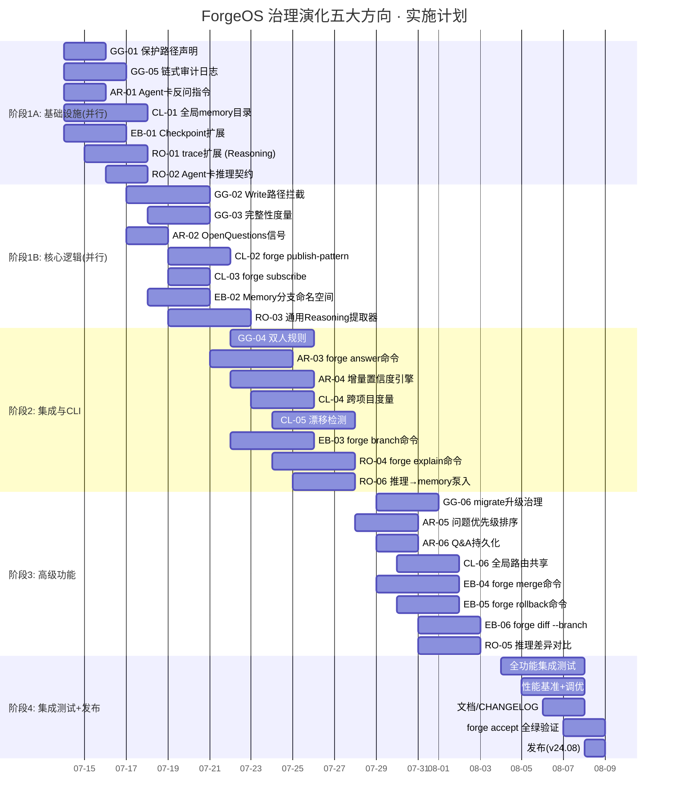

现在我已全面掌握原始文档、审查报告和关键代码结构。以下是我的 Tech Lead 分析。

---

# 🏗️ Tech Lead 分析：ForgeOS 治理演化五大方向

## 分析基础

| 源文档 | `2026-07-11-forgeos-five-highvalue-governance-evolution-extensions.md` |
|---|---|
| 审查报告 | `...highvalue-governance-evolution-extensions.out.md` |
| 审查关键修正 | 方向二 P1→P2(低成本P2)、方向四 P2→P1(接入成本低)；forge-core 18包；harness ~10.3k行 |
| 当前代码基线 | forge-core 18 Go包(~35k LOC)、harness 39+模块(~10.3k LOC)、.agent/ 5工作流+12 agent卡+9 skill卡 |

---

## 1. 任务分解

将五大方向拆解为 **24 个可执行任务**，每个 2-4 小时纯编码，含测试约 1 人天。

### 1.1 方向一 · 治理自保（GG — Governance Guard）

| 任务 ID | 标题 | 涉及文件 | 前置依赖 | 工时(h) | 验收标准 |
|---|---|---|---|---|---|
| **GG-01** | 设计受保护路径声明格式 | `project.yml` 或新建 `governance.yml` | 无 | 2 | 文档 + schema 设计评审通过；声明格式可表达 glob pattern 和精确路径 |
| **GG-02** | 实现 Write 路径拦截 | `forge-core/internal/orchestrator/executor.go` + `cmd/forge/engine_build.go` | GG-01 | 4 | 受保护路径被写入时返回硬错误(非静默跳过)；白名单路径可正常写入 |
| **GG-03** | 完整性度量(Pre/Post checksum) | `forge-core/internal/orchestrator/loop.go` + 新文件 `internal/integrity/checksum.go` | GG-01 | 3 | 每次迭代起跑前计算 checksum，迭代后重新计算；变更与 emits 不匹配时拒绝 |
| **GG-04** | 双人规则(Two-Person Rule)网关 | `cmd/forge/gates.go` + `.agent/workflows/` | GG-02 | 4 | 治理文件变更需要两个独立 agent 共识或 human approval；单 agent 无法单独改动 |
| **GG-05** | 链式审计日志(trace prev_hash) | `forge-core/internal/trace/trace.go` + `internal/trace/audit.go` | 无(但需 trace 格式版本化) | 3 | trace Event 增加 `PrevHash` 字段；每个事件包含前一个事件的 SHA-256；事后篡改可检测 |
| **GG-06** | `forge migrate --upgrade-governance` | `cmd/forge/migrate.go` | GG-01, GG-02 | 3 | 显式升级命令可绕过写保护；执行后自动更新 checksum 基线；记录审计事件 |

### 1.2 方向二 · 演化分支与回滚（EB — Evolution Branching）

| 任务 ID | 标题 | 涉及文件 | 前置依赖 | 工时(h) | 验收标准 |
|---|---|---|---|---|---|
| **EB-01** | Checkpoint 模型扩展：label + parent_iter | `forge-core/internal/persist/checkpoint.go` | 无(格式版本化已设计) | 4 | Checkpoint 结构新增 `Label string` + `ParentIter int` + `ParentLabel string`；向后兼容旧格式 |
| **EB-02** | Memory 分支命名空间 | `forge-core/internal/memory/memory.go` | EB-01 | 3 | 分支隔离的 memory 存储路径(如 `.forge/memory/branch-a.jsonl`)；`Append/Load` 可选分支参数 |
| **EB-03** | `forge branch` 命令 | `cmd/forge/branch.go` + 新文件 | EB-01, EB-02 | 4 | `forge branch experiment-a --from-iter 3` 创建分支；从指定 checkpoint + memory + trace 快照初始化 |
| **EB-04** | `forge merge` 命令 | `cmd/forge/merge.go` + 新文件 | EB-03 | 4 | 两个分支的 memory 合并(主线优先策略)；收敛结果比较；冲突声明输出 |
| **EB-05** | `forge rollback` 命令 | `cmd/forge/rollback.go` | EB-01 | 3 | `forge rollback --to-iter 3` 恢复 checkpoint + git 状态(或文件快照)；支持 `--dry-run` 预览 |
| **EB-06** | `forge diff --branch` 命令 | `cmd/forge/diff.go` 扩展 | EB-03, EB-04 | 3 | 两个分支的 gate 结果/Roadmap 完成度/成本差异可视化 |

### 1.3 方向三 · 人机模糊消除（AR — Ambiguity Resolution）

| 任务 ID | 标题 | 涉及文件 | 前置依赖 | 工时(h) | 验收标准 |
|---|---|---|---|---|---|
| **AR-01** | Agent 卡增加 `clarifying_questions` | `.agent/agents/*.md` (product-manager, architect) | 无 | 2 | agent 卡新增 `clarifying_questions` 段；prompt 构建时注入反问指令 |
| **AR-02** | `OpenQuestions` 信号字段 | `forge-core/internal/converge/converge.go` + Signals 结构 | 无 | 2 | converge.Signals 增加 `OpenQuestions []Question`；human_gate 报告同时输出待解答问题清单 |
| **AR-03** | `forge answer` 子命令 | `cmd/forge/answer.go` + 新文件 | AR-02 | 4 | `forge answer discover "用户支持邮箱登录"` 将回答注入 memory；触发增量置信度重评 |
| **AR-04** | 增量置信度评估引擎 | `forge-core/internal/converge/eval.go` 重构 | AR-02, AR-03 | 4 | 回答一个问题后局部重评置信度(非全量重跑)；评估成本降低 50-70% |
| **AR-05** | 问题优先级排序 | `forge-core/internal/converge/priority.go` + 新文件 | AR-04 | 3 | 按"哪个问题回答后置信度提升最大"排序；支持 `forge answer --list` 查看高杠杆问题 |
| **AR-06** | Q&A 持久化到 memory | `forge-core/internal/memory/memory.go` | AR-03 | 2 | memory Entry 增加 `KindQuestion`/`KindAnswer`；跨 run 保留；避免重复追问 |

### 1.4 方向四 · 跨项目学习（CL — Cross-Project Learning）

| 任务 ID | 标题 | 涉及文件 | 前置依赖 | 工时(h) | 验收标准 |
|---|---|---|---|---|---|
| **CL-01** | 全局 memory 目录与 API | `$FORGE_HOME/memory/` + `forge-core/internal/memory/global.go` | 无 | 4 | `LoadGlobal`/`AppendGlobal` API 实现；先查全局再查项目级；`FORGE_HOME` 环境变量 |
| **CL-02** | `forge publish-pattern` 命令 | `cmd/forge/publish.go` + 新文件 | CL-01 | 3 | 将已验证的 memory entry 从项目发布到全局库；自动附加源项目/验证方式/置信度元数据 |
| **CL-03** | `forge subscribe` 命令 | `cmd/forge/subscribe.go` | CL-01 | 2 | 在项目中激活主题的模式推荐；`forge subscribe go-patterns` |
| **CL-04** | 跨项目模式收敛度量 | `cmd/forge/patterns.go` | CL-02, CL-03 | 3 | `forge patterns --global` 输出使用频率、采纳率、贡献排名 |
| **CL-05** | 自动漂移检测 | `forge-core/internal/memory/drift.go` + 新文件 | CL-02 | 4 | 全局模式在新项目中被否决时自动记录；降低全局置信度；触发通知 |
| **CL-06** | 全局路由决策共享 | `forge-core/internal/routing/scorecard.go` 扩展 | CL-01 | 3 | `HistoryTiebreak` 可读全局 scorecard；最优模型选择跨项目投票 |

### 1.5 方向五 · 推理可观测性（RO — Reasoning Observability）

| 任务 ID | 标题 | 涉及文件 | 前置依赖 | 工时(h) | 验收标准 |
|---|---|---|---|---|---|
| **RO-01** | trace Event 扩展 Reasoning 字段 | `forge-core/internal/trace/trace.go` | 无(需格式版本化) | 3 | Event 新增 `Reasoning *Reasoning` 嵌入结构；向下兼容旧格式 |
| **RO-02** | Agent 卡增加 `reasoning_fields` 契约 | `.agent/agents/*.md` + 解析器 | AR-01(复用解析思路) | 2 | agent 卡声明推理输出位置；类似 VERDICT token 契约 |
| **RO-03** | 通用 Reasoning 提取器 | `cmd/forge/cost.go` 抽取 + 新文件 `extract.go` | RO-01, RO-02 | 4 | 从 agent 输出提取结构化推理块；覆盖 reviewr/architect/cto 等高杠杆角色 |
| **RO-04** | `forge explain` 命令 | `cmd/forge/explain.go` + 新文件 | RO-03 | 4 | `forge explain --decision shortcode-storage` 展示推理链；支持 `--path`/`--phase`/`--iter` 过滤 |
| **RO-05** | 推理差异对比 | `cmd/forge/diff.go` 再次扩展 | RO-04, EB-06 | 3 | `forge diff --branch` 增强为同时对比推理链；逐前提展示分歧点 |
| **RO-06** | 推理→memory 自动泵入 | `forge-core/internal/memory/memory.go` + `cmd/forge/reasoning_pump.go` | RO-03, CL-01 | 3 | 高置信度决策自动写入 memory(KindDecision)；后续 agent 可引用"之前已决定" |

---

## 2. 执行顺序

### 2.1 依赖图

```mermaid
graph TD
    %% ── 方向一：治理自保 ──
    GG01[GG-01 保护路径声明] --> GG02[GG-02 Write路径拦截]
    GG01 --> GG03[GG-03 完整性度量]
    GG02 --> GG04[GG-04 双人规则]
    GG03 --> GG06[GG-06 migrate升级治理]
    GG04 --> GG06
    GG05[GG-05 链式审计日志] -.-> GG06
    
    %% ── 方向三：模糊消除 ──
    AR01[AR-01 Agent卡反问指令] --> AR02[AR-02 OpenQuestions信号]
    AR02 --> AR03[AR-03 forge answer命令]
    AR03 --> AR04[AR-04 增量置信度引擎]
    AR04 --> AR05[AR-05 问题优先级排序]
    AR03 --> AR06[AR-06 Q&A持久化]

    %% ── 方向四：跨项目学习 ──
    CL01[CL-01 全局memory目录] --> CL02[CL-02 forge publish-pattern]
    CL01 --> CL03[CL-03 forge subscribe]
    CL02 --> CL04[CL-04 跨项目度量]
    CL02 --> CL05[CL-05 漂移检测]
    CL01 --> CL06[CL-06 全局路由共享]

    %% ── 方向二：演化分支 ──
    EB01[EB-01 Checkpoint扩展] --> EB02[EB-02 Memory分支命名空间]
    EB01 --> EB03[EB-03 forge branch命令]
    EB02 --> EB03
    EB03 --> EB04[EB-04 forge merge命令]
    EB03 --> EB05[EB-05 forge rollback命令]
    EB03 --> EB06[EB-06 forge diff --branch]

    %% ── 方向五：推理可观测性 ──
    RO01[RO-01 trace扩展] --> RO03[RO-03 Reasoning提取器]
    RO02[RO-02 Agent卡推理契约] --> RO03
    RO03 --> RO04[RO-04 forge explain命令]
    RO03 --> RO06[RO-06 推理→memory泵入]
    RO04 --> RO05[RO-05 推理差异对比]
    EB06 --> RO05

    %% ── 可并行执行的任务组 ──
    subgraph P0_Phase1A ["🚀 阶段1A: 基础设施(可并行)"]
        GG01
        GG05
        AR01
        CL01
        EB01
        RO01
        RO02
    end

    subgraph P0_Phase1B ["🚀 阶段1B: 核心逻辑(可并行)"]
        GG02
        GG03
        AR02
        CL02
        CL03
        EB02
        RO03
    end

    subgraph P0_Phase2 ["⚡ 阶段2: 集成与CLI(部分可并行)"]
        GG04
        AR03
        AR04
        CL04
        CL05
        EB03
        RO04
        RO06
    end

    subgraph P0_Phase3 ["🔧 阶段3: 高级功能(顺序依赖)"]
        GG06
        AR05
        AR06
        CL06
        EB04
        EB05
        EB06
        RO05
    end
```



### 2.2 并行策略

| 并行工作组 | 包含任务 | 推荐开发者技能 |
|---|---|---|
| **组A：治理安全** | GG-01→GG-02→GG-03→GG-04→GG-05→GG-06 | Go 后端 + 安全 |
| **组B：对话交互** | AR-01→AR-02→AR-03→AR-04→AR-05→AR-06 | Go 后端 + UX |
| **组C：跨项目** | CL-01→CL-02→CL-03→CL-04→CL-05→CL-06 | Go 后端 + 分布式系统 |
| **组D：分支/回滚** | EB-01→EB-02→EB-03→EB-04→EB-05→EB-06 | Go 后端 + 存储 |
| **组E：推理观测** | RO-01→RO-02→RO-03→RO-04→RO-05→RO-06 | Go 后端 + LLM |

**注意**：组A 和组B 是 **P1** 优先级，应优先启动；组C 同为 **P1** 但 CL-01(全局目录)是其他组D/组E 的非阻塞依赖；组D 和组E 是 **P2**。

---

## 3. 技术风险

### 3.1 关键风险矩阵

| 风险 | 方向 | 概率 | 影响 | 缓解策略 |
|---|---|---|---|---|
| **R1: Write 拦截的性能开销** | GG | 中 | 高 | 路径匹配使用编译后的 trie 而非正则；拦截路径仅在生产环境启用；benchmark 需证明 < 1μs 开销 |
| **R2: Checkpoint DAG 的存储一致性** | EB | 高 | 极高 | Checkpoint 格式版本化已在设计中；使用 readonly 事务语义写入；分支切换时原子性地切换 memory 文件 |
| **R3: 增量置信度评估的准确性** | AR | 高 | 高 | 初始实现不做 O(1) 加分——而是缩小评估范围(仅重评受影响的收敛标准)；边界情况用集成测试覆盖 |
| **R4: 全局 memory 的隐私泄露** | CL | 中 | 极高 | 默认 opt-in 模式；增加 `forge publish --audit` 扫描敏感信息；发布前强制 fresh-reviewer 审核 |
| **R5: Agent 自报告推理的诚实性** | RO | 高 | 中 | 推理是 trust-but-verify：gate 结果仍是客观验证层；RO-03 实现交叉校验(推理链与代码变更的一致性检查) |
| **R6: 跨方向格式版本化冲突** | 全部 | 中 | 高 | 所有格式版本化使用统一的版本号枚举(`forgeos.*.v1/v2`)；建立 `FormatRegistry` 单一注册点 |
| **R7: 分支合并的语义冲突** | EB | 高 | 中 | 合并策略使用"主线优先 + 冲突声明"而非自动解决；需要 `merge-reviewer` agent 或人类确认 |
| **R8: 现有 harness 闸门的兼容性** | GG | 低 | 高 | 治理保护对现有闸门使用松模式(先 warn 后 block)；兼容期至少 1 个 Sprint |

### 3.2 外部依赖分析

| 依赖 | 用途 | 风险级别 | 替代方案 |
|---|---|---|---|
| 无 —— forge-core 零外部依赖 | 全部 | 🟢 无风险 | N/A |
| 操作系统 rename(2) 原子性 | EB/Save | 🟢 已依赖 | 已在 checkpoint.go 中使用 |
| git(假设用户有版本控制) | EB/rollback | 🟡 可选 | 无 git 时使用文件快照 fallback |
| 文件系统权限 | GG/Write拦截 | 🟢 无额外依赖 | 仅检查进程级文件写权限 |

### 3.3 性能瓶颈与优化

| 场景 | 瓶颈 | 优化策略 |
|---|---|---|
| Write 路径检查(每次文件写入) | 路径匹配遍历 | 编译时 trie + 缓存热点路径；benchmark 目标 < 500ns |
| 完整性 checksum(每个迭代) | 全量治理文件扫描 | 增量 checksum(仅上次迭代后修改的文件) |
| 全局 memory 检索(跨项目) | 文件数增长 | 内存索引 + LMDB/bolt 嵌入存储(远期) |
| 推理链存储(每 agent 调用) | JSONL 文件膨胀 | 压缩存储旧链；`forge explain` 只读高频访问的最近 N 条 |

### 3.4 测试覆盖难点

| 难点 | 方向 | 策略 |
|---|---|---|
| "Agent 试图修改治理文件"的场景模拟 | GG | 使用 echo/dry agent 模式 + mock executor；不需要真实 LLM |
| 分支并发演进的时序一致性 | EB | `go test -race` + 竞态注入测试 |
| 增量置信度评估的等价性 | AR | property-based testing：增量结果应等于全量重跑结果在回答子集上的投影 |
| 跨项目模式漂移的语义有效性 | CL | 仿真多个项目同时运行的测试 fixture |
| 推理链准确性的 ground truth 建立 | RO | 构造已知推理的 agent 输出 fixture → 验证提取器是否恢复结构化推理 |

---

## 4. 资源评估

### 4.1 团队配置

| 角色 | 数量 | 技能要求 | 专注方向 |
|---|---|---|---|
| **Go 后端工程师(高级)** | 2 | forge-core 内部(Go 1.23+)、并发编程、文件系统操作 | 组A(治理)+组D(分支)各 1 人 |
| **Go 后端工程师(中级)** | 1 | Go 基础、CLI 开发、JSONL 存储 | 组B(对话) |
| **Go 后端工程师(中级)** | 1 | Go 基础、memory 包、检索 | 组C(跨项目) |
| **Go 后端工程师(中级)** | 1 | Go 基础、trace 系统、LLM 输出解析 | 组E(推理观测) |
| **QA 工程师** | 1 | Go 测试、集成测试、性能基准 | 全部方向 |
| **Tech Lead / 架构师** | 1 | 系统设计、代码审查、跨方向协调 | 全部方向 — 兼职 |

**最小可行团队**：2 名高级 Go 工程师 + 1 名 QA（兼职 TL），分两个并行轨道。

### 4.2 关键里程碑

```
M0 — 设计就绪(所有方向)      Day 0-2     GG01/EB01/AR01/CL01/RO01 schema 评审通过
M1 — 基础设施可用            Day 5       GG-05/GG-01/RO-01/CL-01/EB-01 全部合并 + 测试通过
M2 — 治理自保 MVP            Day 10      GG-01~GG-04 全部通过验收；`forge accept` 包括治理保护检查
M3 — 对话交互 MVP            Day 12      AR-01~AR-04 实现；`forge answer` 端到端演示
M4 — 跨项目学习 MVP          Day 18      CL-01~CL-04 实现；两个项目间模式可发布+订阅
M5 — 分支系统 MVP            Day 25      EB-01~EB-04 实现；`forge branch`/`merge`/`rollback` 可用
M6 — 推理观测 MVP            Day 30      RO-01~RO-04 实现；`forge explain` 展示推理链
M7 — 高级功能集成            Day 35      GG-06/AR-05/AR-06/CL-05/CL-06/EB-05/EB-06/RO-05/RO-06 全部完成
M8 — 全功能集成测试完成      Day 40      所有 cross-direction 集成测试通过；性能基准达标
M9 — 发布准备                Day 42      文档/CHANGELOG/升级指南就绪；`forge migrate` 测试通过
```

### 4.3 阻塞点与解决策略

| Blockers | 影响方向 | 解决策略 |
|---|---|---|
| **Checkpoint 格式版本化未设计** | EB | 已存在 `_format` 字段(`forgeos.checkpoint.v1`)；直接扩展即可 |
| **无 `FORGE_HOME` 概念** | CL | `FORGE_HOME` 或默认 `~/.forge/`；CL-01 中引入 |
| **trace 格式版本化未设计** | RO | 同 checkpoint，已有 `_format` 字段；设计为 `forgeos.trace.v1` |
| **当前 CLI 缺少子命令扩展框架** | 全部 | 已有 `cmd/forge/` 下每个命令独立文件；脚手架已就绪 |
| **memory Entry 类型目前仅 3 类** | AR/RO | 增加 `KindQuestion`/`KindAnswer`/`KindReasoning`；无需格式迁移 |

**结论：无硬阻塞点**。所有基础设施需求已在当前代码中留有扩展点。

---

## 5. 质量保证

### 5.1 单元测试覆盖要求

| 包 | 当前覆盖率 | 目标覆盖率 | 新增测试重点 |
|---|---|---|---|
| `internal/persist/` | ~90% | 95% | 分支标签序列化、DAG checkpoint 格式兼容 |
| `internal/trace/` | ~85% | 95% | Reasoning 字段编解码、chain-hash 验证 |
| `internal/memory/` | ~80% | 92% | 全局 memory 路径、`AppendGlobal`/`LoadGlobal`、漂移检测逻辑 |
| `internal/converge/` | ~75% | 90% | `OpenQuestions` 信号、增量置信度评估的正确性 |
| `internal/orchestrator/` | ~70% | 85% | Write 拦截、迭代级完整性检查 |
| `internal/routing/` | ~80% | 90% | 全局 scorecard 合并、跨项目路由决策 |
| `cmd/forge/` | ~60% | 80% | 所有新 CLI 子命令的 flag 解析 + mock run |

### 5.2 集成测试策略

| 测试场景 | 方向 | 方法 | 工具 |
|---|---|---|---|
| agent 尝试写治理文件 | GG | mock executor + 虚假 agent 输出 → 验证拦截 | `go test` + testify |
| 分支创建/合并/回滚的完整 round-trip | EB | 使用临时目录的多步 CLI 模拟 | shell test + `go test -exec` |
| 模糊消除的端到端流程 | AR | discover 流程 + `forge answer` → 验证置信度变化 | `go test` + mock LLM |
| 跨项目模式发布→订阅→采纳 | CL | 两个独立的临时项目 fixture | `go test` + 文件系统隔离 |
| 推理链捕获→提取→展示 | RO | 已知推理的 agent 输出输入 → 验证 CLI 输出 | `go test` + golden file |
| 跨方向集成(all 5) | 全部 | 全尺寸端到端：治理保护下启用分支→推理→跨项目 | `go test -tags=e2e` |

### 5.3 代码审查要点

| 审查维度 | 具体要点 | 对应方向 |
|---|---|---|
| **安全** | Write 拦截是否有绕过路径(如通过 symlink、mount)？ | GG |
| **一致性** | Checkpoint 格式版本化是否所有代码路径统一？ | EB |
| **幂等性** | `forge answer` 多次回答同一问题是否产生副作用？ | AR |
| **隐私** | 全局 memory 是否意外泄露项目内敏感信息？ | CL |
| **诚实性** | 推理链提取器是否对格式错误的 agent 输出有容错？ | RO |
| **性能** | 路径拦截是否为每条写入增加显著延迟？ | GG |

**强制规则**：
- 每个 PR 必须有对应的新测试（单元 + 集成）
- 每次修改后 `forge accept` 全绿
- 性能敏感路径（GG-02、CL-01 检索）需附带 micro-benchmark 结果
- **Reviewer 必须是 fresh-context 独立 Agent**（遵循 AGENTS.md）

### 5.4 性能测试需求

| 测试 | 目标 | 标准 |
|---|---|---|
| Write 路径拦截延迟 | GG-02 | P99 < 1μs (在一个有 100 条规则的项目上) |
| 完整性 checksum | GG-03 | 全量扫描 < 100ms (100 文件基准) |
| 全局 memory 检索 | CL-01 | P99 < 10ms (1000 条全局模式) |
| 推理链提取 | RO-03 | P99 < 5ms (10KB agent 输出) |
| `forge explain` 渲染 | RO-04 | P99 < 500ms (100 条推理链) |

---

## 6. 实施计划

### 6.1 甘特图



### 6.2 阶段详情

#### 阶段 1A：基础设施搭建（7月14日 — 7月16日，3天，全并行）

| 目标 | 交付物 | 并行度 |
|---|---|---|
| 所有方向的基础 schema 和数据格式 | GG-01 保护路径声明格式文档 | 5个工作组完全并行 |
| 跨方向统一格式版本化策略 | RO-01 trace 格式扩展 |    |
| 关键扩展点就绪 | CL-01 全局目录 API 设计 |    |

**关键路径**：CL-01(全局目录)是组C所有任务的前置，且是组D(EB-02 memory命名空间)的非阻塞依赖。

#### 阶段 1B：核心逻辑实现（7月17日 — 7月21日，5天，全并行）

| 目标 | 交付物 | 并行度 |
|---|---|---|
| 所有方向的核心逻辑就绪 | GG-02/GG-03 写入拦截+完整性检查 | 5个工作组完全并行 |
| 实现核心数据路径变更 | AR-02/CL-02/EB-02/RO-03 核心逻辑 |    |

**风险点**：GG-02 需要在 GG-01 之后实施，但 GG-01 只需要 2 天，GG-02 从第 4 天开始即可无缝衔接。

#### 阶段 2：集成与 CLI 命令（7月22日 — 7月25日，4天，组间并行、组内顺序）

| 目标 | 交付物 | 并行度 |
|---|---|---|
| 面向用户的功能就绪 | GG-04 双人规则、AR-03 `forge answer`、EB-03 `forge branch` | 组A/组B/组D 全并行 |
| 全部 CLI 子命令可运行 | RO-04 `forge explain`、CL-04 `forge patterns` | 但组内任务有顺序依赖 |

**关键里程碑**：M2(治理自保 MVP, Day 10) 和 M3(对话交互 MVP, Day 12)

#### 阶段 3：高级功能（7月28日 — 8月1日，5天，部分并行）

| 目标 | 交付物 | 并行度 |
|---|---|---|
| 方向间集成功能 | GG-06 升级治理、EB-04/05/06 分支全功能、RO-05 推理对比 | 高 — 各组相对独立 |
| 高级/边缘功能 | AR-05/06 问题排序+持久化、CL-06 全局路由 |    |

**关键里程碑**：M5(分支系统 MVP, Day 25) 和 M6(推理观测 MVP, Day 30)

#### 阶段 4：集成测试与发布（8月4日 — 8月8日，5天，全集中）

| 目标 | 交付物 | 并行度 |
|---|---|---|
| 全功能验证 | 5个方向的 cross-cutting 集成测试套件 | 中等 — 需要协调 |
| 性能达标 | 所有性能基准测试通过 |    |
| 发布就绪 | `forge accept` 全绿、文档完备、CHANGELOG |    |

**硬性要求**：`forge accept` 闸门全绿（gate.mjs 体积/arch-check 8检查/check.py/secret-scan/test/app-test）。

---

## 7. 建议的执行策略总结

### 优先级排序（含审查调整）

```
P1 · 立即执行:
  ├─ 方向一 · 治理自保     — 安全基线，无方向能绕过它
  ├─ 方向三 · 模糊消除     — 新手时刻体验，低 hanging fruit
  └─ 方向四 · 跨项目学习   — [审查升级] 接入成本低于估计，平台化核心前提

P2 · 下一批次:
  ├─ 方向二 · 演化分支     — [审查降级] 可复用 retain 机制实现低成本 P2
  └─ 方向五 · 推理可观测性 — [维持] 保持 P2，信任构建但非核心安全
```

### 值得注意的操作建议

1. **GG-02 是整张依赖图中最关键的单个任务** — 它是治理自保的核心防线，且不依赖任何其他方向。建议在 Sprint Day 1 启动。

2. **CL-01（全局目录）和 EB-02（分支命名空间）共享 70% 的设计** — 两个任务都需要 memory 路径从单文件扩展为目录结构。建议一起设计，分别实现。

3. **RO-03（推理提取器）应复用 AR-01（反问指令）的解析框架** — 都涉及从 agent 输出中提取结构化的标记块。提取 `VERDICT: <token>` 的现有 `cost.go` 解析器家族可以抽取为公共包。

4. **性能先不做早期优化** — 所有优化标注(benchmark + 延迟目标)在阶段 4 集中验证，不在阶段 1-3 过早优化。例外：GG-02 的路径匹配默认使用 map 而非 regex，避免后续改造。

5. **重复文件清理** — 审查报告 #5 指出 `...highvalue-governance-evolution-extensions.md` 与 `...product-architect-extensions.md` 内容一致。建议阶段 1 开始前先清理，避免后续文档引用混淆。

6. **推荐第一个验收 Demo** — 阶段 2 完成后(约 Day 12)，演示：agent 尝试修改 `harness/gate.mjs` → GG-02 拦截 → `forge answer` 提升 discover 置信度 → 端到端流程。此 Demo 覆盖方向一+方向三，展示最高优先级的两个方向联动效果。
