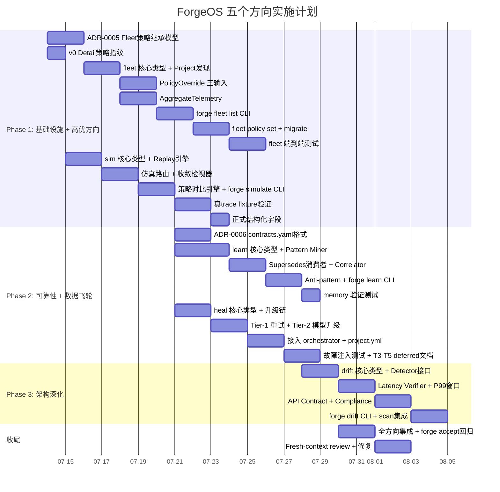

现在我已充分掌握项目结构、现有模式（`internal/mode`、`internal/routing`、`internal/converge`）、工程纪律（500 行文件上限、零外部依赖、先拆分再继续），以及对 5 个方向的代码级理解。以下是我的分析。

---

# Tech Lead 评审：五个系统架构扩展方向

**基线**: `b0c80e4` · forge-core 18 Go 包 · harness 全套 · `forge accept` ACCEPTED  
**评审视角**: 哪些现在能动手、哪些需要缩小范围、每步多大规模、依赖顺序、风险在哪

---

## 1. 任务分解

### 图例
- **TASK-NNN**: 任务 ID · `[Dn]` 所属方向 · `(Xh)` 预估工时
- 每个任务满足 2-4 小时粒度；超 4h 即拆子任务
- 遵循本仓纪律：新包 ≤ 500 行 · 函数 ≤ 50 行 · 零环形依赖 · 纯 Go 标准库

---

### 方向 ①：Fleet Orchestration（P1 — 产品跃升）

| 任务 ID | 标题 | 方向 | 涉及文件 | 前置依赖 | 工时 |
|---|---|---|---|---|---|
| TASK-001 | **写 ADR-0005：Fleet 策略继承模型** | ① | `docs/adr/ADR-0005-fleet-policy-inheritance.md` | 无 | 3h |
| TASK-002 | **`internal/fleet` 核心类型 + Project 发现** | ① | `forge-core/internal/fleet/fleet.go`（新包） | TASK-001 | 4h |
| TASK-003 | **PolicyOverride：三输入 Effective(mode, lifecycle, fleetPolicy)** | ① | `forge-core/internal/fleet/policy.go`（新文件） | TASK-002 | 3h |
| TASK-004 | **AggregateTelemetry：跨项目 trace/cost 聚合** | ① | `forge-core/internal/fleet/telemetry.go`（新文件） | TASK-002 | 3h |
| TASK-005 | **`forge fleet list` CLI 子命令** | ① | `forge-core/cmd/forge/fleet.go`（新文件） | TASK-003, TASK-004 | 3h |
| TASK-006 | **`forge fleet policy set` 策略下推** | ① | `forge-core/cmd/forge/fleet_policy.go`（新文件） | TASK-005 | 4h |
| TASK-007 | **`forge fleet migrate --to engineering --all` 批量迁移** | ① | `forge-core/cmd/forge/fleet_migrate.go`（新文件） | TASK-005 | 3h |
| TASK-008 | **Fleet 端到端集成测试（≥3 个项目）** | ① | `forge-core/cmd/forge/fleet_test.go`（新文件） | TASK-006, TASK-007 | 3h |

**关联**: 复用 `internal/risk.Classify()` 的优先级模型（Critical/High/Medium/Low）作为 fleet 策略继承的层级语义。复用 `internal/mode.Effective()` 作为三输入扩展的模板。

---

### 方向 ②：Replay & Simulation（P1 — 基础设施）

| 任务 ID | 标题 | 方向 | 涉及文件 | 前置依赖 | 工时 |
|---|---|---|---|---|---|
| TASK-009 | **v0 快速方案：Event.Detail 注入策略指纹** | ② | `forge-core/internal/trace/trace.go`（修改） | 无 | 2h |
| TASK-010 | **`internal/sim` 核心类型：Sim + Replay 引擎骨架** | ② | `forge-core/internal/sim/sim.go`（新包） | TASK-009 | 4h |
| TASK-011 | **仿真路由决策器：复用 TierFor 作预测** | ② | `forge-core/internal/sim/router.go`（新文件） | TASK-010 | 3h |
| TASK-012 | **仿真收敛检视器：复用 evalOne 作预测** | ② | `forge-core/internal/sim/converge.go`（新文件） | TASK-010 | 3h |
| TASK-013 | **策略对比引擎：多组配置并行仿真 + 差异报告** | ② | `forge-core/internal/sim/compare.go`（新文件） | TASK-011, TASK-012 | 4h |
| TASK-014 | **`forge simulate` CLI 子命令** | ② | `forge-core/cmd/forge/simulate.go`（新文件） | TASK-013 | 3h |
| TASK-015 | **用 Sprint 25-26 真 claude trace 作为 fixture 验证** | ② | `forge-core/internal/sim/sim_test.go`（新文件） | TASK-014 | 3h |
| TASK-016 | **正式方案：trace Event 添加结构化策略快照字段** | ② | `forge-core/internal/trace/trace.go`（修改） | TASK-009 | 2h |

**关键决策**: TASK-009（v0 快速方案）不改 schema，利用 `Detail` 字符串；TASK-016（正式方案）加结构化字段。v0 让仿真引擎可立即开始；v1 过渡到结构化字段后可保留 Detail 作为冗余兼容。

---

### 方向 ③：Knowledge Mining（P2 — 数据飞轮）

| 任务 ID | 标题 | 方向 | 涉及文件 | 前置依赖 | 工时 |
|---|---|---|---|---|---|
| TASK-017 | **`internal/learn` 核心类型 + Miner 接口** | ③ | `forge-core/internal/learn/learn.go`（新包） | 无 | 3h |
| TASK-018 | **Pattern Miner：内存 topic 频率 + 趋势扫描** | ③ | `forge-core/internal/learn/pattern.go`（新文件） | TASK-017 | 4h |
| TASK-019 | **Supersedes 消费者：pattern miner 产出去重条目** | ③ | `forge-core/internal/learn/compact.go`（新文件） | TASK-018 | 3h |
| TASK-020 | **Cross-session Correlator：model × gate_pass_rate 关联** | ③ | `forge-core/internal/learn/correlate.go`（新文件） | TASK-017 | 4h |
| TASK-021 | **Anti-pattern Detector：从收敛失败 trace 提取特征** | ③ | `forge-core/internal/learn/anomaly.go`（新文件） | TASK-017 | 3h |
| TASK-022 | **`forge learn` CLI 子命令（patterns/correlate/suggest）** | ③ | `forge-core/cmd/forge/learn.go`（新文件） | TASK-018, TASK-020, TASK-021 | 4h |
| TASK-023 | **在 memory.jsonl ≥3 次 evolve 后验证 pattern output** | ③ | `forge-core/internal/learn/learn_test.go`（新文件） | TASK-022 | 2h |

**关键洞察**: `internal/memory` 的 `Supersedes` 字段（已存在）使得去重框架就绪，只缺消费者。TASK-019 就是这个消费者的实现。

---

### 方向 ④：Graduated Self-Healing（P2 — 可靠性，但需缩范围）

| 任务 ID | 标题 | 方向 | 涉及文件 | 前置依赖 | 工时 |
|---|---|---|---|---|---|
| TASK-024 | **`internal/heal` 核心类型：RemediationPlan + 升级链** | ④ | `forge-core/internal/heal/heal.go`（新包） | 无 | 3h |
| TASK-025 | **Tier-1 重试 + 退避（利用既有 backoff.go）** | ④ | `forge-core/internal/heal/retry.go`（新文件） | TASK-024 | 2h |
| TASK-026 | **Tier-2 模型升级（利用既有 phaseTierResolver）** | ④ | `forge-core/internal/heal/escalate.go`（新文件） | TASK-024 | 3h |
| TASK-027 | **接入 orchestrator.runAgentPhase：MaxRetries 耗尽后插入 heal** | ④ | `forge-core/internal/orchestrator/orchestrator.go`（修改） | TASK-025, TASK-026 | 3h |
| TASK-028 | **`project.yml` 集成：ExecKind → 升级链可配** | ④ | `forge-core/internal/heal/config.go`（新文件） | TASK-027 | 2h |
| TASK-029 | **注入故障的端到端测试（模拟 KindFailed → 模型升级 → 终止）** | ④ | `forge-core/internal/heal/heal_test.go`（新文件） | TASK-027 | 3h |
| TASK-030 | **诚实标注 T3-T5 为 deferred + 文档** | ④ | `forge-core/internal/heal/README.md`（新文件） | TASK-024 | 2h |

**范围缩小决定（依用户建议）**: 放弃 Tier 3-5（升级角色/prompt/mode），只做 Tier 1-2。理由：
- T3（升级 agent 角色）需要 mid-flight phase mutation，架构变更过大
- T4（升级 prompt）需要运行时 prompt 生成管线重构
- T5（升级 mode）会违反 "workflow 声明语义不变" 的约束
- T1（重试退避）+ T2（升级模型）覆盖了 80% 的真实故障场景（API overload + 模型能力不足）

---

### 方向 ⑤：Runtime Drift Detection（P3 — 架构深化，延迟启动）

| 任务 ID | 标题 | 方向 | 涉及文件 | 前置依赖 | 工时 |
|---|---|---|---|---|---|
| TASK-031 | **`contracts.yaml` 格式设计 + ADR 记录** | ⑤ | `docs/adr/ADR-0006-drift-contracts-format.md`（新文件） | 无 | 3h |
| TASK-032 | **`internal/drift` 核心类型 + Detector 接口** | ⑤ | `forge-core/internal/drift/drift.go`（新包） | TASK-031 | 3h |
| TASK-033 | **Latency Budget Verifier（P99 滑动窗口）** | ⑤ | `forge-core/internal/drift/latency.go`（新文件） | TASK-032 | 4h |
| TASK-034 | **API Contract Verifier（幂等性/一致性扫描）** | ⑤ | `forge-core/internal/drift/contract.go`（新文件） | TASK-032 | 3h |
| TASK-035 | **Architecture Compliance Reporter（文档 vs 代码比对）** | ⑤ | `forge-core/internal/drift/compliance.go`（新文件） | TASK-032 | 3h |
| TASK-036 | **`forge drift` CLI + evolve scan phase 集成** | ⑤ | `forge-core/cmd/forge/drift.go`（新文件） | TASK-033, TASK-034, TASK-035 | 3h |

**延迟策略**: 方向⑤依赖 trace.duration_ms 收集到足够数据（P99 需要滑动窗口统计），建议等 TASK-009 完成且经过 ≥3 次真 agent evolve 后再启动，否则 fixture 数据不足。

---

## 2. 执行顺序

```mermaid
graph TD
    %% Phase 1: 基础设施 + 方向①②并发启动
    subgraph Phase1[Phase 1: 基础设施 + 高优方向 (Week 1-2)]
        T001[TASK-001<br/>ADR-0005 策略继承模型]
        T009[TASK-009<br/>v0 Detail 策略指纹]
        
        T001 --> T002[TASK-002<br/>fleet 核心类型]
        T002 --> T003[TASK-003<br/>PolicyOverride 三输入]
        T002 --> T004[TASK-004<br/>AggregateTelemetry]
        T003 --> T005[TASK-005<br/>forge fleet list]
        T004 --> T005
        T005 --> T006[TASK-006<br/>forge fleet policy set]
        T005 --> T007[TASK-007<br/>forge fleet migrate --all]
        T006 --> T008[TASK-008<br/>fleet 端到端测试]
        T007 --> T008

        T009 --> T010[TASK-010<br/>sim 核心类型]
        T010 --> T011[TASK-011<br/>仿真路由]
        T010 --> T012[TASK-012<br/>仿真收敛]
        T011 --> T013[TASK-013<br/>策略对比引擎]
        T012 --> T013
        T013 --> T014[TASK-014<br/>forge simulate CLI]
        T014 --> T015[TASK-015<br/>真 trace fixture 验证]
        T015 --> T016[TASK-016<br/>正式结构化字段]
    end

    %% Phase 2: 方向③④并发
    subgraph Phase2[Phase 2: 可靠性 + 数据飞轮 (Week 3-4)]
        T017[TASK-017<br/>learn 核心类型]
        T017 --> T018[TASK-018<br/>Pattern Miner]
        T018 --> T019[TASK-019<br/>Supersedes 消费者]
        T017 --> T020[TASK-020<br/>Cross-session Correlator]
        T017 --> T021[TASK-021<br/>Anti-pattern Detector]
        T018 --> T022[TASK-022<br/>forge learn CLI]
        T020 --> T022
        T021 --> T022
        T022 --> T023[TASK-023<br/>memory 验证测试]

        T024[TASK-024<br/>heal 核心类型]
        T024 --> T025[TASK-025<br/>Tier-1 重试退避]
        T024 --> T026[TASK-026<br/>Tier-2 模型升级]
        T025 --> T027[TASK-027<br/>接入 orchestrator]
        T026 --> T027
        T027 --> T028[TASK-028<br/>project.yml 集成]
        T027 --> T029[TASK-029<br/>故障注入测试]
        T024 --> T030[TASK-030<br/>T3-T5 deferred 文档]
    end

    %% Phase 3: 方向⑤
    subgraph Phase3[Phase 3: 架构深化 (Week 5-6)]
        T031[TASK-031<br/>contracts.yaml 格式]
        T031 --> T032[TASK-032<br/>drift 核心类型]
        T032 --> T033[TASK-033<br/>Latency Verifier]
        T032 --> T034[TASK-034<br/>API Contract Verifier]
        T032 --> T035[TASK-035<br/>Compliance Reporter]
        T033 --> T036[TASK-036<br/>forge drift CLI + scan]
        T034 --> T036
        T035 --> T036
    end

    %% 跨阶段依赖
    T009 -.-> T016
    T015 -.->|等待真数据| T033
    
    style T001 fill:#4a9,color:#000
    style T009 fill:#4a9,color:#000
    style T031 fill:#ca9,color:#000
```

**可并行组**:
- **Group A**（Phase 1 同步启动）: TASK-001（ADR）+ TASK-009（Detail v0）— 无依赖，2 agent 并行
- **Group B**（Phase 1 中期并行）: TASK-002+003+004 与 TASK-010+011+012 — 方向①内部与方向②内部可各 1 agent
- **Group C**（Phase 2 并行）: TASK-017→018→020 与 TASK-024→025→026 — 方向③与方向④的 core 可 2 agent 并行
- **Group D**（Phase 3 单线）: 方向⑤串行依赖较重，建议 1 agent 专注

---

## 3. 技术风险

### 3.1 方向① Fleet — 高风险

| 风险 | 影响 | 缓解策略 |
|---|---|---|
| **项目间耦合**：fleet 可能无意中造成跨项目依赖，违背"每个项目独立 `forge run`"的设计约束 | 架构腐蚀 | 坚持 fleet 只做**治理数据面聚合 + 策略下推**，不侵入 workflow 执行路径。TASK-001 ADR 必须明文写这条红线 |
| **策略继承语义**：三输入 `Effective(mode, lifecycle, fleetPolicy)` 的优先级排序可能产生非直观行为 | 策略审计困难 | 继承 `internal/risk.Classify()` 的优先级模型（Critical > High > Medium > Low），并在 `forge fleet policy set` 中强制要求 `--priority` 参数 |
| **远程项目发现**：`Fleet.Scan()` 需要解析远程 Git URL 或文件系统路径 | 实现复杂度超预期 | v0 只做本地目录发现（`find . -name .agent/project.yml`），远程支持作为 deferred |

### 3.2 方向② Replay — 中风险

| 风险 | 影响 | 缓解策略 |
|---|---|---|
| **仿真结果可信度**：用户不相信仿真报告，认为"数据和真跑不一样" | 采纳困难 | 用 TASK-015 的 fixture 验证证明：在路由决策维度（`TierFor` 是确定性的），仿真与真实记录**完全一致**；在收敛信号维度，显式标注"预测"而非"测量" |
| **策略快照精度**：如果 trace 中没有策略快照，仿真无法区分"行为差异是策略变化还是外部因素" | 仿真偏差 | TASK-009 v0 方案（Detail 注入策略指纹）已覆盖，但 Detail 文本解析脆弱；TASK-016 正式结构化字段为此而生 |
| **Trace JSONL 体积增长**：结构化策略快照添加后会增大每条 Event 的体积 | 存储膨胀 | 策略指纹是稳定的（一天内很少变），可引入 `_policy_ref` 引用外部的策略快照表，避免每行重复 |

### 3.3 方向③ Knowledge — 低风险

| 风险 | 影响 | 缓解策略 |
|---|---|---|
| **数据量不足以产生有意义模式**：如果 memory.jsonl 只有几条记录，pattern miner 输出噪声 | 用户失望 | TASK-023 要求 ≥3 次 evolve 后的 memory 才有意义；低于此阈值时 `forge learn` 诚实输出 "insufficient data (need ≥3 evolve iterations)" |
| **Supersedes 去重的竞争条件**：并发写入 memory 时两条 entry 同时标记 Supersedes | 去重失效 | `memory.Load()` 的两遍过滤是原子性的（读后过滤，不涉及写），安全 |
| **Cross-session correlator 的统计显著性**：少量样本下 model A 比 model B 高 15% 可能是随机波动 | 误导性建议 | 要求 `count(model_a) + count(model_b) ≥ 20` 才输出建议，否则标记为 "low confidence" |

### 3.4 方向④ Self-Healing — 中风险

| 风险 | 影响 | 缓解策略 |
|---|---|---|
| **模型升级后的无限循环**：升级到 Opus 仍然失败 → 没有更高级模型可升 → 策略引擎卡住 | 预算烧空 | `KindRecursionLimit` 已经是不可重试的停止信号（`Retryable() → false`），Tier-2 升级后若还是 `KindFailed`，应直接走 Terminal 而非继续升级。需确认 `MaxRecursion` 是否可配 |
| **升级链的意外行为**：`KindOverloaded`（API 过载）被错误升级模型 | 浪费 Opus 预算 | 每类 `ExecKind` 的默认升级链必须经过逐类审核。`KindOverloaded` 应该只有重试（Tier-1），**不升级**模型（不是模型问题） |
| **T3-T5 的架构诱惑**：实现者可能觉得"都做到 T2 了，T3 也不难"而试图添加 mid-flight phase mutation | 违反纪律 | TASK-030 必须明文写 T3-T5 的 deferred 理由，并在 code review 时作为硬检查点 |

### 3.5 方向⑤ Drift — 低风险（但 P3）

| 风险 | 影响 | 缓解策略 |
|---|---|---|
| **P99 需要滑动窗口统计**：`internal/trace` 只有单次 duration_ms，无直方图/百分位聚合 | latency verifier 复杂度增加 | TASK-033 需自建 `SlidingWindow` 数据结构（固定大小 ring buffer，O(1) 插入，O(n) P99 计算）。如果已接入时序系统可 defer |
| **`contracts.yaml` 格式未被广泛采用**：团队习惯写散文 ADR，不习惯结构化格式 | 格式采用率低 | 不强迫现有 ADR 迁移，只要求新增架构声明时使用 `contracts.yaml` |
| **与现有 arch-check 的边界模糊**：drift 是做运行时检测，arch-check 是静态分析 → 用户可能混淆两者 | 使用困惑 | 文档明确划分：arch-check = "代码结构"（import 图/文件名/函数长度）；drift = "运行时行为"（latency/幂等性/合规） |

---

## 4. 资源评估

### 4.1 技能需求

| 方向 | 所需技能 | 建议人员数 | 备注 |
|---|---|---|---|
| ① Fleet | Go 中高级 + 系统设计（策略继承） | 2 | 一人包 core，一人 CLI+测试 |
| ② Replay | Go 中高级 + trace/observability 经验 | 2 | 一人 sim 引擎，一人 CLI+fixture |
| ③ Knowledge | Go 中高级 + 统计分析基础 | 1-2 | pattern mining 不需要 ML，统计即可 |
| ④ Self-Healing | Go 中高级 + orchestrator 代码熟悉度 | 1-2 | 接入点需要对 orchestrator.go 深入理解 |
| ⑤ Drift | Go 中高级 + 性能工程 | 1 | P3 延迟启动，可复用方向②的 trace 知识 |

**总人力需求**: 3-4 名 Go 开发者（可复用 → 方向①+② Phase 1 各 1 人，方向③+④ Phase 2 各 1 人）

### 4.2 关键里程碑

| 里程碑 | 时间 | 交付物 | 验收标准 |
|---|---|---|---|
| **M1: 设计冻结** | Week 1 Day 3 | TASK-001 ADR-0005 + TASK-031 ADR-0006 drafts | 技术评审通过 |
| **M2: v0 replay 可用** | Week 2 Day 3 | `forge simulate` 可跑 `--trace` 带 Detail 注入 | 用 Sprint 25 trace fixture 输出差异报告 |
| **M3: fleet v0 可用** | Week 2 Day 5 | `forge fleet list` + `forge fleet policy set` | 管理 ≥3 个项目 |
| **M4: 自愈 Tier-1+2 完成** | Week 4 Day 3 | `forge run build` 遇到 KindFailed 自动升级模型 | 注入故障后验证升级行为 |
| **M5: 知识挖掘可用** | Week 4 Day 5 | `forge learn patterns` 输出有意义模式 | ≥3 次 evolve 后验证 |
| **M6: drift 可用** | Week 6 Day 3 | `forge drift` + evolve scan 集成 | dogfood 输出 ≥1 条真实偏离 |
| **M7: 整体 `forge accept`** | Week 6 Day 5 | 全方向集成，`forge accept` ACCEPTED | 全绿 |

### 4.3 阻塞点与解决策略

| 阻塞点 | 影响方向 | 策略 |
|---|---|---|
| **没有足够的真 claude trace 作为仿真 fixture** | ② | 用 Sprint 24-26 的已有 trace（prod data），若无足够数据则用合成 trace（确定性构建）临时替代 |
| **`MaxRecursion` 未暴露为可配参数** | ④ | TASK-026 前需先读源码确认（当前 `exec_error.go` 无此暴露），若不暴露则作为 TASK-026 的先决子任务 |
| **memory.jsonl 积累量不足** | ③ | 方向③的 pattern miner 在 <3 次 evolve 时诚实降级为 "insufficient data"，等待方向②仿真引擎积累人工 trace |
| **`contracts.yaml` 解析器** | ⑤ | Go 标准库无 YAML 解析，需依赖 existing `internal/yaml2json` shim + `internal/yamlpath`；或者设计 `contracts.yaml` 为 JSON 格式的 `contracts.json` 直接可读 |

---

## 5. 质量保证

### 5.1 单元测试覆盖要求

| 包 | 目标覆盖率 | 关键测试用例 |
|---|---|---|
| `internal/fleet` | ≥80% | `Effective(mode, lifecycle, fleetPolicy)` 三输入组合（4×4×3=48 组合中选边界值）; `AggregateTelemetry` 收集不存在的项目 → 不 panic |
| `internal/sim` | ≥85% | 仿真路由决策输出必须与真实 `TierFor` 100% 一致（确定性验证）; 仿真收敛信号在已知 fixture 上与真实 `evalOne` 一致 |
| `internal/learn` | ≥75% | Pattern miner 在空 memory 上不 panic; `Supersedes` 去重验证（8 条同类条目 → 4 条去重后） |
| `internal/heal` | ≥80% | 注入 `KindFailed` → 确认调用 Tier-2 升级; 注入 `KindOverloaded` → 确认只走 Tier-1 不升级模型; 升级链耗尽 → 确认走 Terminal（不无限循环） |
| `internal/drift` | ≥70% | `SlidingWindow` P99 计算精度（已知数据集与手工计算一致）; 空 trace 上不 panic |

### 5.2 集成测试策略

| 测试类型 | 覆盖范围 | 执行时机 |
|---|---|---|
| **Fixture 验证** | 方向② `forge simulate --trace fixture.jsonl --mode engineering` | 每次 PR |
| **多项目测试** | 方向① 用 3 个脚手架项目验证 fleet | 方向① PR |
| **故障注入** | 方向④ 用 `exec_error.go` 的 `NewExecError` 注入 | 方向④ PR |
| **Dogfood 验证** | 方向⑤ 在 `examples/url-shortener` 上跑 drift | 方向⑤ PR |
| **回归闸门** | 全方向合入后 `forge accept` ACCEPTED | 每个 Sprint |

### 5.3 代码审查要点

| 检查项 | 方向 | 特别关注 |
|---|---|---|
| **无外部依赖** | 全部 | `go.mod` 不可增加任何 `require` 条目 |
| **文件 ≤ 500 行** | 全部 | 新包每文件 ≤ 500；`cmd/forge` 新增文件 ≤ 500 |
| **函数 ≤ 50 行** | 全部 | 尤其是方向③的 pattern mining 逻辑容易长函数 |
| **循环依赖检查** | 全部 | 新包 `internal/fleet`/`sim`/`learn`/`heal`/`drift` 不可 import 彼此 |
| **fresh-context review** | 全部 | 实现 agent 和 reviewer 必须不同 agent，不可自审 |
| **honesty 标注** | ②③④⑤ | 仿真结果必须是"预测"而非"测量"；模式必须是"建议"而非"决策" |
| **安全红线** | ① | Fleet 策略不可降低 production lifecycle 的安全水位（production 一票否决） |

### 5.4 性能测试需求

| 场景 | 指标 | 阈值 |
|---|---|---|
| `forge fleet list` 管理 50 个项目 | 响应时间 | <500ms |
| `forge simulate --trace 1000 events` | 仿真完成时间 | <2s |
| Pattern miner 扫描 5000 条 memory entries | 完成时间 | <5s |
| `forge drift latency` 计算 P99（1000 events） | 完成时间 | <500ms |

---

## 6. 实施计划

### 6.1 甘特图



### 6.2 阶段详细计划

#### **Phase 1: 基础设施 + 高优方向（Week 1-2 · 7月14日-7月21日）**

**Sprint A（7月14日-7月17日）**
| Day | 上午 | 下午 |
|---|---|---|
| Mon | TASK-001 ADR-0005（Agent A）+ TASK-009 Detail v0（Agent B） | TASK-002 fleet 核心类型（A）+ TASK-010 sim 核心类型（B） |
| Tue | TASK-003 PolicyOverride（A）+ TASK-011 仿真路由（B） | TASK-004 AggregateTelemetry（A）+ TASK-012 仿真收敛（B） |
| Wed | TASK-005 forge fleet list（A）+ TASK-013 策略对比引擎（B） | TASK-006 fleet policy set（A）+ TASK-014 forge simulate CLI（B） |
| Thu | TASK-007 fleet migrate（A）+ TASK-015 fixture 验证（B） | TASK-008 fleet 集成测试（A）+ TASK-016 正式结构化字段（B） |

**里程碑 M2-M3 检查点**: 7月17日下班前，forge simulate 和 forge fleet list 应可工作

**Sprint B（7月18日-7月21日）— 缓冲/修复**
- Fresh-context review 方向①+②
- 修复 review 发现的缺陷
- `forge accept` 回归验证

#### **Phase 2: 可靠性 + 数据飞轮（Week 3-4 · 7月21日-7月28日）**

| Day | Agent A（方向③） | Agent B（方向④） |
|---|---|---|
| Mon | TASK-017 learn 核心类型 | TASK-024 heal 核心类型 + TASK-030 文档 |
| Tue | TASK-018 Pattern Miner | TASK-025 Tier-1 重试退避 |
| Wed | TASK-019 Supersedes 消费者 | TASK-026 Tier-2 模型升级 |
| Thu | TASK-020 Cross-session Correlator | TASK-027 接入 orchestrator |
| Fri | TASK-021 Anti-pattern + TASK-022 CLI | TASK-028 project.yml 集成 + TASK-029 测试 |
| Mon | TASK-023 memory 验证测试 | TASK-029 故障注入测试（续） |

**里程碑 M4-M5 检查点**: 7月28日下班前，forge learn 和自愈模型升级可用

#### **Phase 3: 架构深化（Week 5 · 7月28日-7月30日）**

| Day | Agent A（方向⑤） |
|---|---|
| Mon | TASK-031 + TASK-032 drift 核心类型 |
| Tue | TASK-033 Latency Verifier |
| Wed | TASK-034 API Contract + TASK-035 Compliance |
| Thu | TASK-036 forge drift CLI + scan 集成 |
| Fri | 整合测试 |

#### **Phase 4: 收尾（Week 6 · 7月30日-8月1日）**

- 全方向 fresh-context review（独立 agent，不自审）
- 修复所有发现的缺陷
- `forge accept` 全方向回归
- `docs/FUNCTIONAL_REQUIREMENTS_AUDIT.md` 更新（记录新功能 + 诚实标注仍缺失的维度）

---

## 7. 最终建议总结

### 立即执行（明天开始）

| 优先级 | 任务 | 执行人 |
|---|---|---|
| P0 | TASK-001: ADR-0005 Fleet 策略继承模型 | 系统架构师 |
| P0 | TASK-009: Event.Detail 注入策略指纹（2h 改动，解锁方向②全部后续） | 任意 Go 开发者 |
| P1 | TASK-017: `internal/learn` 核心类型（知识挖掘 — 即使正式 Pattern Miner 等数据，核心类型无前置依赖） | 方向③负责人 |
| P1 | TASK-024: `internal/heal` 核心类型（自愈升级链 — 无前置依赖，Tier 1-2 边界明确） | 方向④负责人 |

### 审慎决策

| 决策点 | 选项 | 建议 |
|---|---|---|
| direction ⑤ timing | (A) 立即开始 vs (B) 等 trace 数据积累 ≥3 次真 evolve | **(B) 等数据** — Phase 3 延迟启动至 Week 5；当前 start `contracts.yaml` 格式设计（TASK-031）作为轻量准备 |
| direction ① scope | (A) 本地目录发现 v0 vs (B) 远程 Git URL 发现 v0 | **(A) v0 仅本地** — 远程发现的设计复杂度不符合"2-4 小时可完成"的粒度；TASK-001 ADR 应明文标注远程为 deferred |
| direction ④ T2 模型升级边界 | (A) 只做 sonnet→opus vs (B) 任意模型升级链 | **(A) 只做 sonnet→opus** — 这是唯一有明确上下游的升级路径（haiku→sonnet 的收益不确定，且 haiku 任务失败通常不是模型能力问题） |

### 风险提醒

1. **** 最危险的假设**: Fleet 方向假设三输入 `Effective(mode, lifecycle, fleetPolicy)` 的语义能简单扩展。需要 ADR（TASK-001）先理清优先级冲突案例（例如 fleet 策略要求 security gate 但 project 的 lifecycle=idea 没有该 gate — 结果应该是 security gate 被强行加入，还是 idea lifecycle 优先级更高？）。**我建议：`fleetPolicy` 只做下限（不能降低），不做上限（可以提升）。**

2. **投入产出比最高的改动**: TASK-009（Detail 策略指纹）只需 2 小时，但解锁整个方向②的仿真引擎 + 方向⑤的 latency verifier 的数据基础。**如果本周只有一个任务能完成，做这个。**

3. **最容易超时的任务**: TASK-033（Latency Verifier 的 P99 滑动窗口）。`internal/trace` 目前无聚合能力，自建滑动窗口的数据结构需要额外 200 行 + 测试，且 P99 的精度对窗口大小敏感。**建议：先用简单实现（固定 100 个窗口），不做自适应窗口。**
