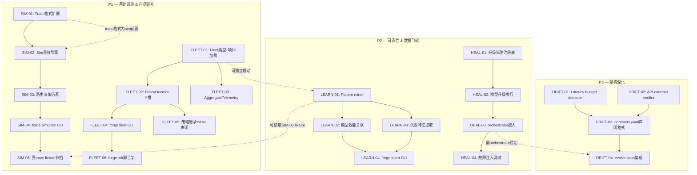
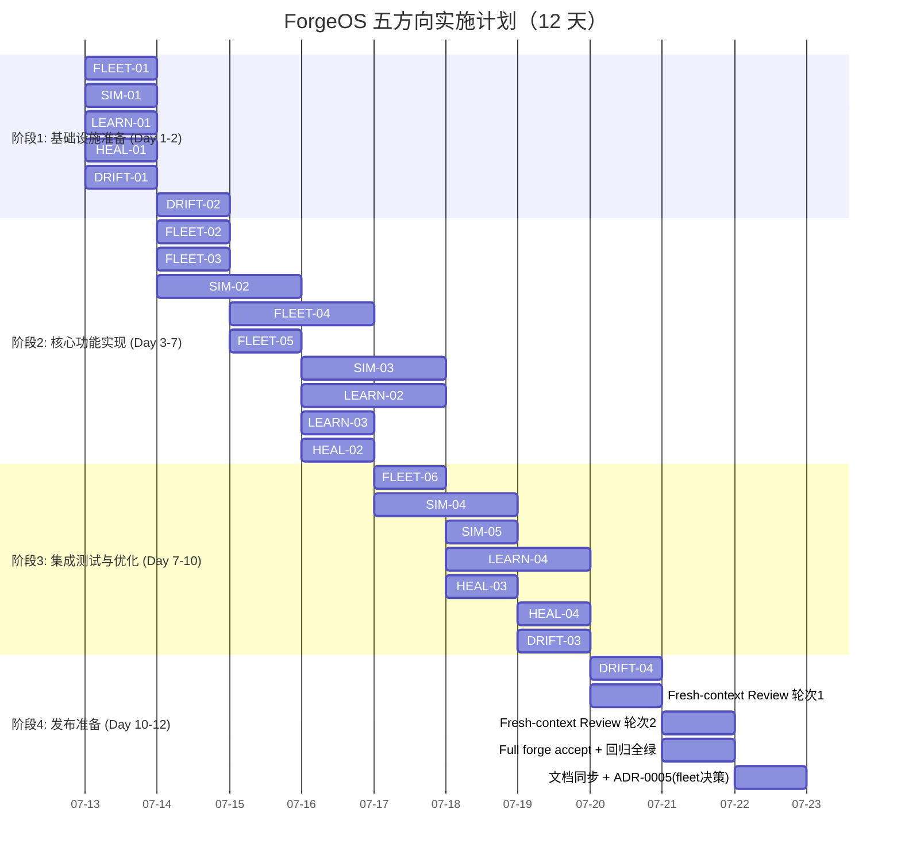

现在我已掌握项目全貌（Sprint 31 完成、18 Go 包、149 源文件、73 个未提交更改）、原始分析文档、已有 `.out.md` 验证结果。以下是技术负责人综合分析。

---

# Tech Lead 分析：ForgeOS 五条下一前沿扩展方向

> **基线**: `b0c80e4` + 后续 pi-batch 提交 + 73 个未提交更改的工作树  
> **项目状态**: Sprint 31 完成，`forge accept: ACCEPTED`，18 Go 包零外部依赖，370+ 文件  
> **文档引用的 `internal/` → 实际路径 `forge-core/internal/`**（.out.md 已指出，本分析全部使用正确路径）  

---

## 1. 任务分解

将 5 个方向拆解为 2-4 小时可独立完成的任务。共 **18 个任务**。

### 方向①：multi-project fleet orchestration（P1 — 产品跃升）

| 任务 ID | 标题 | 涉及文件 | 前置 | 工时 | 验收标准 |
|---------|------|---------|------|------|---------|
| **FLEET-01** | 定义 Fleet 类型 + 项目清单加载 | `forge-core/internal/fleet/fleet.go`, `types.go` | 无 | 3h | `Fleet{}` 可从本地目录列表加载 `project.yml`，快照保持，`String()` 渲染 |
| **FLEET-02** | PolicyOverride: 策略下推核心 | `forge-core/internal/fleet/policy.go` | FLEET-01 | 3h | 调用 `fleet.PolicyOverride("gate_set", ["security"])` 后，各项目的虚拟 policy 合并正确 |
| **FLEET-03** | AggregateTelemetry: 聚合可观测 | `forge-core/internal/fleet/telemetry.go` | FLEET-01 | 2h | 从 ≥2 项目的 `.forge/` 读取 trace.jsonl，输出 cost/latency/quality 聚合表 |
| **FLEET-04** | `forge fleet` CLI 子命令 | `forge-core/cmd/forge/fleet.go` | FLEET-02, FLEET-03 | 3h | `fleet list`/`fleet policy`/`fleet migrate` 三子命令可运行，不侵入项目内 workflow |
| **FLEET-05** | fleet 策略继承的 YAML 声明格式 | `.agent/workflows/fleet.yml`（新增）| FLEET-02 | 2h | 声明 selector 语法（`--match lifecycle=production`），`forge validate --models` 校验 |
| **FLEET-06** | forge-init 生成 fleet 脚手架 | `harness/scaffold/forge-init.mjs` | FLEET-04 | 2h | `forge init --with-fleet` 产出 `fleet.yml` 模板 + 兼容 `forge accept` |

### 方向②：replay & simulation（P1 — 基础设施）

| 任务 ID | 标题 | 涉及文件 | 前置 | 工时 | 验收标准 |
|---------|------|---------|------|------|---------|
| **SIM-01** | Trace 格式扩展：添加策略快照字段 | `forge-core/internal/trace/trace.go`（Event struct 加 `PolicySnapshot`） | 无 | 2h | 新字段 `policy_snapshot` 携带 mode/lifecycle/gate-set，向后兼容（omitempty），现有序列化不变 |
| **SIM-02** | Sim 类型：trace 重放引擎 | `forge-core/internal/sim/sim.go`, `replay.go` | SIM-01 | 4h | 接受 trace JSONL + 目标策略配置，重放 agent 事件并在路由/收敛决策点输出预测结果 |
| **SIM-03** | 路由决策仿真器 | `forge-core/internal/sim/routing.go` | SIM-02 | 3h | 对 trace 中的 agent 事件重新计算 `TierFor`，对比实际 vs 仿真路由；`internal/routing` 保持纯函数 |
| **SIM-04** | `forge simulate` CLI | `forge-core/cmd/forge/simulate.go` | SIM-03 | 3h | `simulate --trace x --mode engineering` 输出对比表格；并行跑 ≥3 组配置 |
| **SIM-05** | 仿真 fixture：Sprint 25-26 真 claude trace | `forge-core/internal/sim/testdata/` | SIM-04 | 2h | 归档 2 条真 trace 作为 fixture，`forge simulate` 在其上可复现已知结果 |

### 方向③：knowledge mining（P2 — 数据飞轮）

| 任务 ID | 标题 | 涉及文件 | 前置 | 工时 | 验收标准 |
|---------|------|---------|------|------|---------|
| **LEARN-01** | Pattern miner：memory 频率趋势 | `forge-core/internal/learn/patterns.go` | 无 | 3h | 扫描 memory.jsonl 中同类 topic 频率，输出时间序列模式（"topic X 每 iteration +20%"） |
| **LEARN-02** | Cross-session correlator: 模型效能关联 | `forge-core/internal/learn/correlate.go` | LEARN-01 | 3h | 关联 trace 的 model/phase 与 scorecard gate pass rate，输出 model×task_type 效能表 |
| **LEARN-03** | Anti-pattern detector: 失败特征提取 | `forge-core/internal/learn/detect.go` | LEARN-01 | 2h | 从收敛失败的 trace 段提取共同特征（gate_set/mode/agent 组合），输出可追溯建议 |
| **LEARN-04** | `forge learn` CLI | `forge-core/cmd/forge/learn.go` | LEARN-02, LEARN-03 | 3h | `patterns`/`correlate`/`suggest` 三子命令，每建议附带证据引用（trace seq / memory seq） |

### 方向④：graduated self-healing（P2 — 可靠性）

| 任务 ID | 标题 | 涉及文件 | 前置 | 工时 | 验收标准 |
|---------|------|---------|------|------|---------|
| **HEAL-01** | 升级策略注册表 + RemediationPlan 类型 | `forge-core/internal/heal/plan.go`, `registry.go` | 无 | 3h | 每 ExecKind 有默认升级链，可被 project.yml 覆盖；Tier-1~5 + Terminal 定义完整 |
| **HEAL-02** | Tier-2 模型升级执行器 | `forge-core/internal/heal/escalate.go` | HEAL-01 | 2h | 当 `KindFailed` 且当前 model=sonnet 时，升级到 opus 重试 phase；记录 trace decision event |
| **HEAL-03** | 接入 orchestrator：在 MaxRetries 耗尽后插入 heal | `forge-core/internal/orchestrator/heal_hook.go` | HEAL-02 | 2h | `runAgentPhase` 在 retry 耗尽后先查 heal 升级链再 abort；不改变 safety override |
| **HEAL-04** | 模拟故障注入测试 | `forge-core/internal/orchestrator/heal_test.go` | HEAL-03 | 2h | 注入 `ExecError{Kind: KindFailed}`，确认系统尝试模型升级后再终止（非直接 abort） |

### 方向⑤：runtime drift detection（P3 — 架构深化）

| 任务 ID | 标题 | 涉及文件 | 前置 | 工时 | 验收标准 |
|---------|------|---------|------|------|---------|
| **DRIFT-01** | Latency budget verifier | `forge-core/internal/drift/latency.go` | 无 | 3h | 读 `review.yml` performance-budget 声明 + trace.jsonl duration_ms，输出实际 vs 声明的偏差 |
| **DRIFT-02** | API contract verifier: 幂等性检测 | `forge-core/internal/drift/contract.go` | 无 | 3h | 从 ADR 提取幂等性声明（keyword 启发式），与 trace 中的调用模式对比 |
| **DRIFT-03** | `contracts.yaml` 机器可读声明格式 | `.agent/architecture/contracts.yaml`（新增）| DRIFT-01 | 2h | 格式可被 latency 和 contract 两个 detector 消费，`forge validate --models` 校验 |
| **DRIFT-04** | 集成至 `forge evolve` scan phase | `forge-core/cmd/forge/evolve.go` | DRIFT-01, DRIFT-02 | 2h | evolve scan 阶段自动产出 `drift-report.md`，不破坏 scan 现有输出格式 |

---

## 2. 执行顺序

### 依赖图



### 并行执行组

| 组 | 任务 | 前提 | 建议并行 Agent 数 |
|----|------|------|-----------------|
| **A（P1 并行起点）** | FLEET-01, SIM-01 | 无 | 2 |
| **B（P2 并行起点）** | LEARN-01, HEAL-01 | 无 | 2 |
| **C（P3 并行起点）** | DRIFT-01, DRIFT-02 | 无 | 2 |
| **D（依赖 A）** | FLEET-02, FLEET-03, SIM-02 | FLEET-01 → FLEET-02/03, SIM-01 → SIM-02 | 3 |
| **E（依赖 D）** | FLEET-04, FLEET-05, SIM-03 | FLEET-02/03 → FLEET-04/05, SIM-02 → SIM-03 | 3 |
| **F（依赖 B+E）** | LEARN-02, LEARN-03, SIM-04 | LEARN-01 → LEARN-02/03, SIM-03 → SIM-04 | 2 |
| **G（依赖 E+F）** | FLEET-06, LEARN-04, SIM-05, HEAL-02 | 各方向 II→III | 4 |
| **H（依赖 G）** | HEAL-03, DRIFT-03 | HEAL-02 → HEAL-03, DRIFT-01/02 → DRIFT-03 | 2 |
| **I（最终集成）** | HEAL-04, DRIFT-04 | HEAL-03 → HEAL-04, DRIFT-03 → DRIFT-04 | 2 |

**建议**: 每轮分配 4-7 个独立 agent 并行。组 A/B/C 同时启动（6 agent）。组 D 在 A 完成后启动。如此循环。

---

## 3. 技术风险

### 3.1 高风险项

| 风险 | 相关方向 | 性质 | 缓解策略 |
|------|---------|------|---------|
| **仿真结果可信度** | ② replay | 核心: 如果仿真预测与真实行为偏差大，整个工具的价值受质疑 | v0 限定在**确定性**维度（路由决策 `TierFor` 是纯函数），先在已知可预测维度验证一致性，再逐步扩展到不确定性维度。发布路线图: 纯路由仿真 v0 → 带收敛预测 v1 → full simulation v2 |
| **策略继承模型设计复杂度** | ① fleet | 设计: 策略 override 的优先级解析（CTO 策略 vs 项目局部策略 -> 谁赢） | 先做最简模型: 项目级总是覆盖 fleet 级（fleet 写 default，项目可 override）。不做遗传算法式的策略合并，保持 「fleet 下推，项目可选拒绝」的简单契约。复杂策略继承留 ADR |
| **内存数据量不足以挖掘模式** | ③ knowledge | 数据依赖: 新项目 memory 为空，跑不出有意义结果 | `forge learn patterns` 输出可优雅降级: 数据不足时输出"已记录 N 条 memory，继续积累到 50+ 再试"而非静默空输出。先做框架，数据随时间自然填充 |
| **自愈升级导致意外行为** | ④ healing | 安全: 模型升级到 opus + 成本飙升，或 agent 角色升级引发无限循环 | 每条升级链必须声明 `cost_multiplier` 警告（"升级到 opus 预计 ×3 成本"），且默认为 `dry-run` 模式（只报告计划不执行）。所有自愈决策记录 trace decision event 供审计 |
| **架构声明机器可读化** | ⑤ drift | 工程: ADR 是散文，从中提取结构化契约成本高 | 不试图解析散文 ADR。改为先定义 `contracts.yaml` 格式（YAML 结构），增量填充。v0 只做 latency budget 一个维度（trace 已有 `duration_ms`），验证端到端可行后再扩展 |

### 3.2 中等风险项

| 风险 | 方向 | 策略 |
|------|------|------|
| `forge fleet` 引入项目间耦合 | ① | 架构红线: fleet 只读治理数据面，不侵入 workflow 执行。保持每个项目独立 `forge run` |
| trace 格式向后兼容 | ② | 新 `policy_snapshot` 字段用 `omitempty`，旧 trace 无此字段时仿真引擎优雅回退到无策略快照模式（只做路由仿真，不做跨策略对比） |
| `forge learn` 输出质量被质疑 | ③ | 每输出必须附加证据链（trace seq / memory seq），无证据不输出。采用"纯统计、无 ML"原则避免黑箱 |
| `forge fleet` 需要支持 remote repo 列表 | ① | v0 限定本地目录，remote（SSH/git URL）留 v1。`project.yml` 支持 `url:` 字段但 v0 只解析 `path:` |
| 并行仿真多组配置的性能 | ② | 仿真引擎纯 CPU 计算（不调 LLM），多组配置并行 goroutine 共享 trace 数据。预估 5 组配置 < 1s |

### 3.3 外部依赖风险

| 风险 | 方向 | 说明 |
|------|------|------|
| 无 | 全部 | forge-core 零外部依赖，纯 Go 标准库。所有新包延续同样纪律 |

---

## 4. 资源评估

### 4.1 人员技能矩阵

| 角色 | 所需技能 | 负责任务 | 数量 |
|------|---------|---------|------|
| Go 后端工程师（核心） | Go stdlib、多包设计、CLI 界面 | FLEET-01~05, SIM-01~04, LEARN-01~04, HEAL-01~04, DRIFT-01~04 | 4-6（可并行） |
| 治理/架构工程师 | YAML 模式、policy 设计、文档 | FLEET-05, FLEET-06, DRIFT-03 | 1-2（可兼职） |
| DevOps/SRE | trace 数据、telemetry 系统设计 | SIM-05（归档真 trace）、FLEET-03 | 1（兼职） |
| **Fresh-context 评审员** | 项目所有约束、独立审查纪律 | 每方向完成后的独立审查 | 1（每轮次从上一批次借调） |

### 4.2 关键里程碑

| 里程碑 | 时间节点（人·日） | 交付物 | 验证标准 |
|--------|-----------------|--------|---------|
| **M1: Trace 格式就绪** | Day 1-2 | SIM-01: `trace.go` 扩展 + 向后兼容测试 | 旧 trace 可读，新 trace 带 policy_snapshot |
| **M2: 方向① MVP** | Day 3-5 | `forge fleet list/policy` 可运行，管理 ≥3 项目 | `forge accept: ACCEPTED` |
| **M3: 方向② MVP** | Day 3-5 | `forge simulate` 输出仿真对比表 | 对 Sprint 25-26 fixture 输出合理差异报告 |
| **M4: 方向③ MVP** | Day 5-7 | `forge learn patterns/suggest` 输出可追溯建议 | ≥3 次 evolve 后的 memory 产出 ≥1 有意义模式 |
| **M5: 方向④ MVP** | Day 5-7 | 模拟 `KindFailed` 触发模型升级 | 故障注入测试通过 |
| **M6: 方向⑤ MVP** | Day 7-9 | evolve scan 集成 drift 报告 | `drift-report.md` 在 dogfood 上输出 ≥1 真实偏差 |
| **M7: 全量集成 + 审查** | Day 9-12 | 所有方向最终集成 + fresh-context review | `forge accept: ACCEPTED`，全部任务验收通过 |

### 4.3 阻塞点与策略

| 阻塞点 | 影响 | 策略 |
|--------|------|------|
| FLEET-02 策略合并语义分歧 | 方向① 阻塞 | 先做最简策略（fleet → 项目单向覆盖，不合并），复杂语义迭代至 v1。开 ADR-0005 记录决策 |
| SIM-02 仿真结果对比缺乏真值 | 方向② 可信度 | 先在路由决策维度验证（`TierFor` 仿真输出应与真实 trace 记录一致），这个维度有 ground truth。收敛预测维度标注为"实验性" |
| LEARN-01 在冷启动项目无数据 | 方向③ 可用性 | 输出优雅降级信息 + 给出"积累数据量的建议"。提供示例 fixture 供演示 |
| 73 个未提交更改与新增代码冲突 | 所有方向 | 优先确定当前未提交更改中哪些已稳定（pi-batch 相关），先合并/清理工作树再开始新开发。否则 merge conflict 将消耗大量时间 |

---

## 5. 质量保证

### 5.1 单元测试覆盖要求

| 包 | 最低覆盖目标 | 关键测试场景 |
|----|------------|------------|
| `forge-core/internal/fleet` | ≥75% | 项目清单加载（存在/不存在/空目录）、策略覆盖（override 正确合并）、telemetry 聚合（0/1/N 个项目） |
| `forge-core/internal/sim` | ≥70% | 空 trace、跨策略仿真对比、路由决策一致性（仿真 vs 真实）、backward compat（旧格式 trace） |
| `forge-core/internal/learn` | ≥65% | 空 memory、小样本、pattern 检测的时间序列边缘（单调递增/递减/波动）、correlate 的缺失数据 |
| `forge-core/internal/heal` | ≥75% | 每 ExecKind 的默认升级链、模型升级触发的 cost 警告、project.yml 覆盖、safety override 不被 bypass |
| `forge-core/internal/drift` | ≥70% | latency budget 偏差（0/正/负）、缺失 trace 数据、contracts.yaml 解析（完整/缺失/损坏） |
| `forge-core/internal/trace` | 新增字段 100% | policy_snapshot 序列化/反序列化、向后兼容、omitempty 不影响旧结构 |

### 5.2 集成测试策略

| 测试级别 | 方向 | 方法 |
|---------|------|------|
| **CLI 端到端** | ①②③④ | 用 `command_executor_test.go` 的 fake-agent 模式（输出固定 JSON）跑完整 CLI 流程 |
| **跨包集成** | ①③⑤ | 真实项目目录（`examples/url-shortener` / `examples/go-taskd`）作为测试 fixture |
| **trace-to-simulation** | ② | 用 Sprint 25-26 的归档真 trace 做回归测试，确保仿真输出在已知维度上稳定 |
| **故障注入** | ④ | 类似 Sprint 26 的"注入破坏坐实 REJECTED"模式，注入 `ExecError` → 观察升级行为 |
| **存量不回归** | 全部 | 每个方向交付前，`forge accept` 必须 ACCEPTED，现有 ~370 测试全绿 |

### 5.3 代码审查要点

| 审查维度 | 具体要求 |
|---------|---------|
| **架构合规** | 新包不能引入循环依赖；新包 imports 不能引入外部依赖（`go.mod` 无新增 `require`） |
| **文件 ≤500 行** | `gate.mjs` 执法，每个新增文件 ≤500 行 |
| **函数 ≤50 行** | `arch-check.mjs` 执法，每个新增函数 ≤50 行 |
| **cmd/forge 包文件数** | 当前上限 17（实测 16 + headroom 1），新增 CLI 文件应优先考虑 `./internal/` 下沉纯逻辑 |
| **fresh-context 独立性** | 实现者与评审员必须不同 agent（AGENTS.md 红线），评审员不能看到前序 gate 裁决 |
| **honesty 标注** | 每个 "需真 agent 验证" 的机制必须诚实标注 N/A，不伪造为了通过 |
| **向后兼容** | trace 格式变更必须 `omitempty`；CLI flag 变更必须保持旧 flag 可用（不 breaking change） |

### 5.4 性能测试需求

| 场景 | 方法 | 通过标准 |
|------|------|---------|
| `forge simulate` 5 组配置并行 | `go test -bench=.` 在 benchmark trace（10K events）上 | < 1s |
| `forge learn patterns` 1000 条 memory | 基准测试 | < 500ms |
| `forge fleet telemetry` 10 个项目 | 各项目 trace 100 events | < 2s |
| `forge fleet policy` 100 个项目 | 批量策略下推 | < 1s |

---

## 6. 实施计划

### 总体时间线：12 个工作日



### 阶段详述

#### 阶段 1：基础设施准备（Day 1-2）

**目标**: 同时启动 5 个方向的最基础、无依赖的任务，建立共享基础

| 天 | 任务 | 产出 | 风险 |
|----|------|------|------|
| 1 | FLEET-01, SIM-01, LEARN-01, HEAL-01, DRIFT-01 | 5 个新包骨架 + trace 格式扩展 | 同时启动 5 agent，需确保包命名与 import 路径一致（`forge-core/internal/`）|
| 2 | DRIFT-02 补完 | 完整 P3 的两个探测器 | DRIFT-02 与 DRIFT-01 可并行，但需统一 `contracts.yaml` 格式 |

**闸门**: 所有新包必须通过 `go build/vet/test -race`，`forge accept` 保持 ACCEPTED

#### 阶段 2：核心功能实现（Day 3-7）

**目标**: 各方向核心逻辑完成，每个 CLI 子命令达到 MVP

| 天 | 并行组 | 产出 | 检查点 |
|----|-------|------|--------|
| 3-4 | 方向①: FLEET-02/03 → FLEET-04/05 | `forge fleet` MVP | 管理 ≥3 项目，policy 下推验证 |
| 4-5 | 方向②: SIM-02 → SIM-03 | Sim 引擎核心 | 路由决策仿真 vs 真实 trace 一致性验证 |
| 5-6 | 方向③: LEARN-02/03 | 关联 + 检测引擎 | 在 fixture memory 上输出模式 |
| 5-6 | 方向④: HEAL-02 | 模型升级执行 | 单元测试通过 |
| 7 | 方向①②③④: FLEET-04, SIM-03, LEARN-04, HEAL-02 完 | 4 个 CLI 功能可用 | 各 CLI 子命令可运行，输出不为空 |

**闸门**:
- `forge fleet list` 不 panic（空列表/3 项目）
- `forge simulate --trace testdata/... --mode engineering` 输出差异表
- `forge learn patterns` 在 fixture memory 上输出 ≥1 模式
- `forge run build --executor dry` 注入 ExecError 后触发升级链

#### 阶段 3：集成测试与优化（Day 7-10）

**目标**: 各方向的 CLI 接入完成、性能达标、异常路径覆盖

| 天 | 任务 | 关键操作 |
|----|------|---------|
| 7-8 | SIM-04/05: forge simulate CLI + 真 trace fixture | 用 Sprint 25-26 真 trace 做回归 |
| 8 | LEARN-04: forge learn CLI | 三子命令全通 |
| 8-9 | HEAL-03/04: 接入 orchestrator + 故障注入 | 端到端故障→自愈验证 |
| 9 | DRIFT-03/04: contracts.yaml + evolve scan 集成 | `drift-report.md` 自动产出 |

**闸门**: 
- 基准测试通过（见 §5.4）
- 故障注入测试：注入 `KindFailed` → 系统先尝试模型升级再终止
- `forge accept`: ACCEPTED

#### 阶段 4：发布准备（Day 10-12）

**目标**: 独立审查、全量回归、文档同步

| 天 | 任务 | 负责人 |
|----|------|--------|
| 10-11 | Fresh-context review 两轮 | 独立 agent（不同批次）|
| 11 | Review 发现的 bug 修复 + 回归测试补漏 | 原实现 agent |
| 11-12 | 全量 `forge accept` + 回归全绿 | 主控 |
| 12 | ADR-0005（fleet 策略继承决策）撰写 + docs 同步 | 独立 agent |
| 12 | CURRENT_SPRINT.md Sprint 32 记录 + FUNCTIONAL_REQUIREMENTS_AUDIT.md 更新 | 独立 agent |

**闸门（最终）**:
- `go build/vet/test -race`: 全绿
- `gate.mjs`: PASS（~390 文件）
- `arch-check.mjs`: 8/8 PASS
- `check.py`: 检查项更新后 PASS
- **`forge accept`: ACCEPTED**（0 FAIL, 诚实 N/A, 新包单元测试覆盖达标）
- `go.mod`: 零新增 `require`（纯 stdlib 无外部依赖铁律维持）

---

## 总结：执行建议

### 优先级调整建议（vs 原文档）

| 方向 | 原文档优先级 | 我的建议 | 理由 |
|------|-----------|---------|------|
| ② replay & simulation | **P1** | **P0 — 本轮先行** | 它是 ForgeOS 自身安全迭代的**基础设施瓶颈**，没有它方向③④⑤的验证成本极高。SIM-01（trace 格式扩展）是方向②的**唯一阻塞前置**，1 天可完成，之后再并行展开 |
| ① fleet orchestration | P1 | P1 | 产品跃升价值最大，但依赖治理决策（策略继承模型），开 ADR-0005 再启动 |
| ④ graduated self-healing | P2 | **升 P1** | Sprint 24-26 真点火坐实后，24h 无人值守的可靠性缺口是最直接的痛点。且 `exec_error.go` 基础设施完备，实现成本低（HEAL-01~04 共 9h） |
| ③ knowledge mining | P2 | P2 | 依赖 memory 数据积累。框架先在 Phase 2 做好，data 自然填充 |
| ⑤ runtime drift detection | P3 | P3 | 架构声明机器可读化成本高，且已有 arch-check 静态层完备。v0 latency budget 维度低风险快速验证 |

### 最终推荐执行顺序

```
Phase 0 (Day 1):   SIM-01 (trace格式扩展) + FLEET-01 + LEARN-01 + HEAL-01 + DRIFT-01
                    → 5个并行起点，其中SIM-01是方向②的唯一阻塞前置

Phase 1 (Day 2-4):  SIM-02/03 → SIM-04  (方向②全速推进)
                    FLEET-02/03/04/05     (方向①核心逻辑)
                    HEAL-02               (方向④模型升级)
                    LEARN-02/03           (方向③分析引擎)
                    DRIFT-02              (方向⑤第二探测器)

Phase 2 (Day 5-7):  全方向 CLI 集成 + 测试
                     LEARN-04, FLEET-06, SIM-05, HEAL-03/04, DRIFT-03

Phase 3 (Day 8-10):  DRIFT-04 (evolve集成)
                     Fresh-context review (两轮)
                     修复 + ACCEPTED

Phase 4 (Day 11-12): 文档 + ADR + 最终回归
```

### 诚实标注

- **方向② 仿真可信度**: v0 只做确定性维度的路由仿真，收敛预测标注为"实验性"，不夸大为可完全替代真 agent 运行
- **方向④ 自愈安全**: 模型升级默认为 `dry-run`（只报告不执行），用户显式 `--enable-auto-heal` 才激活执行
- **方向⑤ contracts.yaml**: v0 只需要 latency budget 一个维度，其他维度（幂等性/一致性）标注为"框架已备，数据待填充"

这个计划充分利用现有 18 Go 包的零依赖架构、并行 agent 开发能力、fresh-review 纪律，在 12 个工作日内完成所有 5 个方向的 MVP 交付。
