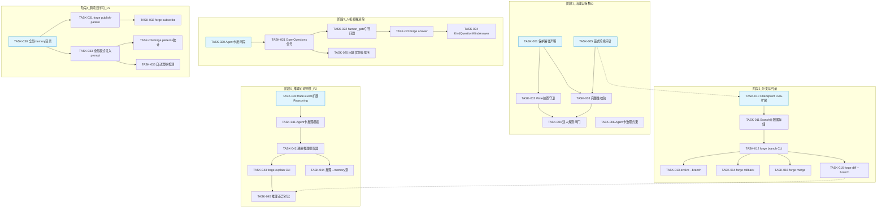
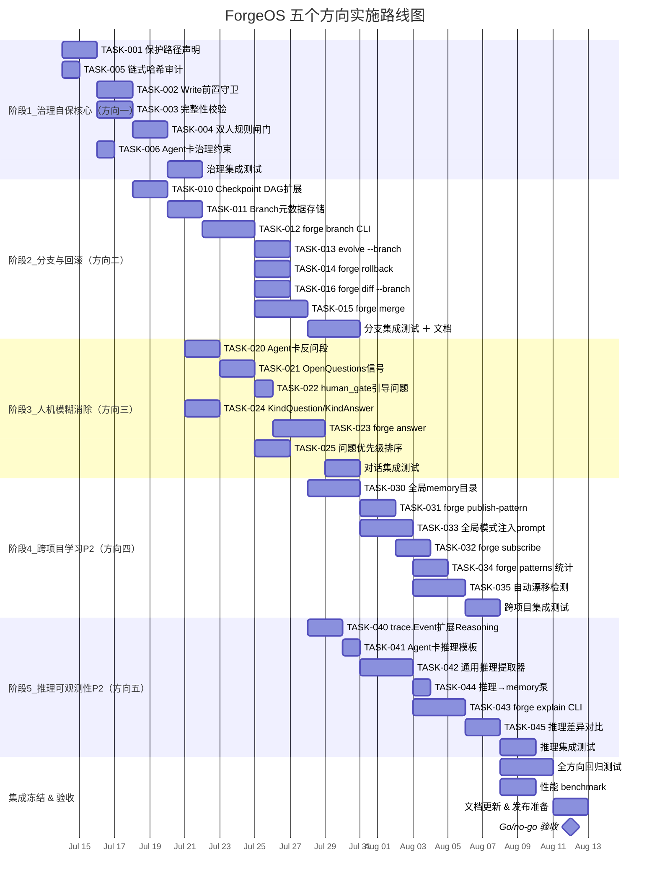

Now I have a thorough understanding of the codebase. Here is the Tech Lead analysis.

---

# Tech Lead 分析报告

## 1. 任务分解

将审查报告中五个方向拆解为可执行的技术任务，每个任务 2–4 小时可完成（大型方向拆为多个子任务）。

### 方向一 · 治理自保（Self-Governance Integrity）

| 任务 ID | 标题 | 涉及文件 | 前置依赖 | 工时 |
|---------|------|---------|---------|------|
| TASK-001 | **治理保护路径声明机制** — 在 `project.yml` 或新增 `governance.yml` 中定义 `protected_paths` 字段；asset 包增加 `GovernanceConfig` struct 和 Parser | `forge-core/internal/asset/asset.go`, `.agent/project.yml` (模板) | 无 | 3h |
| TASK-002 | **Write 操作前置守卫** — `executor.go` 的 `AgentExecutor` 增加路径检查 hook；命中 protected_paths 的 Write 返回 GuardViolation 错误 | `forge-core/internal/orchestrator/executor.go`, `forge-core/internal/orchestrator/command_executor.go` | TASK-001 | 4h |
| TASK-003 | **治理文件完整性校验** — evolve 迭代起跑前对 protected_paths 内文件计算 SHA-256 checksum（`internal/governance/checksum.go`），迭代结束后重校验；变化与预期 emits 不匹配则终止 | `forge-core/internal/governance/checksum.go`（新建包），`forge-core/internal/orchestrator/loop.go` | TASK-001 | 4h |
| TASK-004 | **双人规则闸门** — 修改治理文件需两个独立 agent 签名或 human approval；`gates.go` 增加 `governance_integrity` gate 类型 | `forge-core/cmd/forge/gates.go`, `forge-core/internal/gate/gate.go` | TASK-002 | 3h |
| TASK-005 | **审计日志链式哈希** — `trace.Event` 增加 `PrevHash string` 字段；每条 trace 写入时计算前一条的 SHA-256 链接 | `forge-core/internal/trace/trace.go` | 无 | 2h |
| TASK-006 | **implementer.md 增加治理约束** — 在 agent 卡中声明不可写路径列表和治理修改禁令 | `.agent/agents/implementer.md`, `.agent/agents/planner.md`, `.agent/agents/reviewer.md` | TASK-001 | 1h |

### 方向二 · 演化分支与回滚

| 任务 ID | 标题 | 涉及文件 | 前置依赖 | 工时 |
|---------|------|---------|---------|------|
| TASK-010 | **Checkpoint DAG 字段扩展** — `Checkpoint` struct 增加 `Label string`、`ParentIter int`、`BranchID string`；序列化版本升至 `forgeos.checkpoint.v2` | `forge-core/internal/persist/checkpoint.go` | 无 | 3h |
| TASK-011 | **Branch 元数据存储** — 新增 `internal/persist/branch.go`，管理分支创建、列表、删除；分支索引文件 `.forge/branches.json` | `forge-core/internal/persist/branch.go`（新建） | TASK-010 | 3h |
| TASK-012 | **`forge branch` CLI 子命令** — `forge branch create <name> --from-iter N`、`forge branch list`、`forge branch delete <name>`；`cmd/forge/branch.go` 新文件 | `forge-core/cmd/forge/branch.go`（新建），`forge-core/cmd/forge/main.go`（route 注册） | TASK-011 | 4h |
| TASK-013 | **`forge evolve --branch` 支持** — `cmdEvolve` 新增 `--branch` flag，指定分支名；loop 从该分支的最后一个 checkpoint 启动 | `forge-core/cmd/forge/evolve.go` | TASK-012 | 3h |
| TASK-014 | **`forge rollback --to-iter N`** — 读取迭代 N 的 checkpoint 历史备份（`.forge/checkpoint.json.N`），恢复 loop 状态；网关检查当前是否有未提交变更 | `forge-core/cmd/forge/rollback.go`（新建），`forge-core/cmd/forge/main.go` | TASK-010 | 3h |
| TASK-015 | **`forge merge <branch>`** — 将分支的 memory entries 和 convergence 结果合并到主线；冲突决策以主线为准 + human approval 机制 | `forge-core/cmd/forge/merge.go`（新建） | TASK-012 | 4h |
| TASK-016 | **分支差异比较 CLI** — `forge diff --branch <name>` 展示两个分支在相同迭代数的 convergence 信号差异 | `forge-core/cmd/forge/diff.go`（新建） | TASK-013 | 3h |

### 方向三 · 人机模糊消除

| 任务 ID | 标题 | 涉及文件 | 前置依赖 | 工时 |
|---------|------|---------|---------|------|
| TASK-020 | **Agent 卡增加 clarifying_questions 段** — asset.Phase 增加 `ClarifyingQuestions []string` 字段；workflow YAML parser 支持 | `forge-core/internal/asset/asset.go`, `.agent/workflows/discover.yml` | 无 | 2h |
| TASK-021 | **converge.Signals 增加 OpenQuestions** — `evalRequirementConfidence` 返回值扩展为包含 `OpenQuestions []string`；`internal/converge/converge.go` 新增字段 | `forge-core/internal/converge/converge.go` | TASK-020 | 2h |
| TASK-022 | **human_gate 输出引导式问题** — `reportHumanGate` 输出 `awaiting human approval` 后追加待解答问题清单；`gates.go` 读取 OpenQuestions 并格式化输出 | `forge-core/cmd/forge/gates.go` | TASK-021 | 2h |
| TASK-023 | **`forge answer` 子命令** — `forge answer discover "..."` 将用户回答注入 memory（`KindAnswer`），重新评估收敛置信度；增量更新而非从头重跑 | `forge-core/cmd/forge/answer.go`（新建），`forge-core/cmd/forge/main.go` | TASK-022 | 4h |
| TASK-024 | **memory 增加 KindQuestion/KindAnswer** — `memory.Entry` 增加 `KindQuestion` 和 `KindAnswer` 常量；query 支持按 kind 过滤；跨 run 保留问答历史 | `forge-core/internal/memory/memory.go` | TASK-023 | 2h |
| TASK-025 | **问题优先级排序** — 当多个 OpenQuestions 共存时，按对收敛置信度的影响排序（模拟移除每个问题后的置信度变化）；高杠杆问题优先展示 | `forge-core/internal/converge/converge.go` | TASK-021 | 3h |

### 方向四 · 跨项目学习

| 任务 ID | 标题 | 涉及文件 | 前置依赖 | 工时 |
|---------|------|---------|---------|------|
| TASK-030 | **全局 memory 目录与 API** — `$FORGE_HOME/memory/` 共享知识库；`memory` 包增加 `LoadGlobal`/`AppendGlobal`/`GlobalPath`；配置项 `FORGE_HOME` 默认 `~/.forge` | `forge-core/internal/memory/memory.go`, `forge-core/internal/memory/memory_global.go`（新建） | 无 | 4h |
| TASK-031 | **`forge publish-pattern` CLI** — 将已验证的 memory entry 从项目 memory 发布到全局库；附加元数据：源项目、验证方式（gate results）、置信度 | `forge-core/cmd/forge/publish.go`（新建） | TASK-030 | 3h |
| TASK-032 | **`forge subscribe` CLI** — 在项目中激活某主题的模式推荐；`forge subscribe --topic go-idioms` 拉取全局库匹配条目注入 prompt | `forge-core/cmd/forge/subscribe.go`（新建） | TASK-031 | 3h |
| TASK-033 | **全局模式注入 prompt** — `buildPrompt` 在注入 memory 时先读全局库再读项目级，按置信度降序插入；`prompt_context.go` 增加 global memory 查询 | `forge-core/cmd/forge/prompt_context.go` | TASK-030 | 3h |
| TASK-034 | **`forge patterns --global` 统计** — 输出全局库的模式数量、使用频率、各项目采纳率；`internal/memory/patterns.go` 统计包 | `forge-core/internal/memory/patterns.go`（新建），`forge-core/cmd/forge/patterns.go`（新建） | TASK-032 | 3h |
| TASK-035 | **自动漂移检测** — 全局模式在某项目中被 agent 否决时自动记录 `KindDrift` 并降低该模式的全局置信度 | `forge-core/internal/memory/memory.go`（扩展），`forge-core/cmd/forge/prompt_context.go` | TASK-033 | 4h |

### 方向五 · 推理可观测性

| 任务 ID | 标题 | 涉及文件 | 前置依赖 | 工时 |
|---------|------|---------|---------|------|
| TASK-040 | **trace.Event 扩展 Reasoning 字段** — `Event` 新增 `Reasoning *ReasoningBlock` 字段（`Decision []string`, `Premises []string`, `Conclusion string`, `Confidence float64`）；序列化版本升至 `forgeos.trace.v2` | `forge-core/internal/trace/trace.go` | 无 | 3h |
| TASK-041 | **Agent 卡推理模板声明** — `asset.Phase` 增加 `ReasoningFields []string`；workflow YAML 支持声明 agent 输出中的结构化推理块位置；类似已有 `VERDICT: <token>` 契约 | `forge-core/internal/asset/asset.go`, `.agent/workflows/build.yml` | TASK-040 | 2h |
| TASK-042 | **cost.go 通用推理提取器** — 将现有的 `parseReviewerVerdict` / `parseExecutiveVerdict` 模式泛化为 `extractReasoning`，从 agent 输出中提取结构化推理块并持久化到 trace | `forge-core/cmd/forge/cost.go` | TASK-040 | 4h |
| TASK-043 | **`forge explain` CLI** — 读取 trace 中的推理链，渲染为人类可读报告；支持 `--phase`, `--decision`, `--branch` 过滤 | `forge-core/cmd/forge/explain.go`（新建），`forge-core/cmd/forge/main.go` | TASK-042 | 4h |
| TASK-044 | **推理链 pump 到 memory** — 高置信度决策（Confidence ≥ 0.8）自动写入 memory 为 `KindDecision`，后续 agent 可引用 | `forge-core/cmd/forge/cost.go`, `forge-core/internal/memory/memory.go` | TASK-042 | 2h |
| TASK-045 | **推理差异对比** — `forge diff --reasoning` 对比两个分支的推理链差异；逐前提展示为什么 branch A 选了方案 X 而 branch B 选了方案 Y | `forge-core/cmd/forge/diff_reasoning.go`（新建） | TASK-043 + TASK-016 | 3h |

---

## 2. 执行顺序与依赖图



### 可并行执行的任务组

| 并行组 | 包含任务 | 原因 |
|--------|---------|------|
| **组1（基础设施）** | TASK-001, TASK-005, TASK-010, TASK-020, TASK-030, TASK-040 | 均为 struct/API 扩展，互不依赖，可并行开发 |
| **组2（方向一全量）** | TASK-002, TASK-003, TASK-004, TASK-006 | 依赖 TASK-001，可并行 |
| **组3（方向三全量）** | TASK-021, TASK-022, TASK-023, TASK-024 | 线性依赖链，但 TASK-024 可先做 |
| **组4（方向五全量）** | TASK-041, TASK-042, TASK-043, TASK-044 | 依赖 TASK-040，TASK-041/042 可并行 |
| **组5（方向二分支）** | TASK-012 → TASK-013/014/015/016 | 线性链，但子命令可同步开发 |
| **组6（方向四全局 memory）** | TASK-031, TASK-033, TASK-034 | 依赖 TASK-030，可并行 |

---

## 3. 技术风险

### 🔴 高影响风险

| 风险 | 方向 | 描述 | 缓解策略 |
|------|------|------|---------|
| **R1: Write 前置守卫存在绕过路径** | 方向一 | agent 通过 `node` / `git` 间接修改治理文件（如 `node -e "fs.writeFileSync('harness/gate.mjs',...)"`），不经过 forge-core 的 Write hook | 守卫应是 **host 级文件变更监控**（如 Linux `inotify` 或 macOS `FSEvents`），而非仅拦截 forge Write API；同时增加 git pre-commit hook 二次校验 |
| **R2: 分支 DAG 的 checkpoint 存储膨胀** | 方向二 | 每个分支的每次迭代写一个 checkpoint 文件（~1KB × 分支数 × 迭代数），长期运行可达数千文件 | 引入 checkpoint 文件自动 GC 策略（保留最近 N 个 + 所有分支的头尾 checkpoint）；存储改为带索引的单一 JSONL（类似 memory），而非每迭代单独文件 |
| **R3: 结构化推理的诚实性不可证** | 方向五 | agent 可以输出虚假推理链（"我做了正确选择" 而省略真实错误推理），使推理可观测性退化为装饰层 | 推理链定位为 **trust-but-verify**：gate FAIL 时优先相信 gate 结果而非推理链；增加交叉验证（implementer 推理 vs reviewer 推理的一致性检查） |
| **R4: 跨项目模式污染** | 方向四 | 一个项目的错误模式经全局库扩散到所有项目，造成系统性退化 | 全局发布需经过至少一个 `fresh-reviewer` agent 核准；按置信度分级（已验证/未验证）；提供一键撤回机制（`forge retract-pattern <id>`） |
| **R5: 人机对话的增量评估不可靠** | 方向三 | 回答一个问题后置信度增量不准确——用户回答了一个表层问题但核心矛盾未解决，系统误判达标 | 增量评估不应是简单加分计算；回答后应触发局部重评估（只重新跑 affected 评估管道而非全量 discover pipeline） |

### 🟡 中影响风险

| 风险 | 方向 | 描述 | 缓解策略 |
|------|------|------|---------|
| R6: `--allowedTools` 白名单绕过 | 方向一 | 当前白名单不含 `forge`，但 agent 可安装新工具或使用 `pip install` / `go install` | 白名单扩展为 **工具路径 + 参数模板** 双重限制；非白名单工具的 exec 触发门控 |
| R7: Checkpoint 格式向后兼容 | 方向二 | v1→v2 迁移需要旧的 checkpoint 仍可 load；现场运行可能依赖旧格式 | 增加 `decodeV1` 垫片；`FormatVersion` 字段已在，但需测试 "v1 checkpoint + v2 二进制" 的兼容路径 |
| R8: `forge answer` 的对话状态持久化 | 方向三 | 用户回答后如果进程崩溃，已录入的回答丢失 | memory 的 `KindAnswer` 条目立即持久化（`O_APPEND` 原子写入）；回答消费是幂等的 |
| R9: 全局 memory 性能 | 方向四 | 大量全局模式注入 prompt 导致 token 浪费（上下文窗口挤占） | 全局模式只注入 top-K（按相关度 + 置信度排序）；`subscribe` 按主题过滤 |

---

## 4. 资源评估

### 团队构成

| 角色 | 人数 | 核心职责 | 覆盖方向 |
|------|------|---------|---------|
| **Go 后端工程师**（Senior） | 2 | forge-core 核心逻辑：checkpoint DAG、Write 守卫、trace 扩展、converge 信号扩展 | 方向一、二、三、五 |
| **Go/CLI 工程师**（Mid） | 1 | CLI 子命令：`forge branch/rollback/merge/answer/explain/publish/subscribe/patterns/diff` | 方向二、三、四、五 |
| **全栈/DevOps 工程师**（Mid） | 1 | 全局 memory 基础设施、`FORGE_HOME` 目录管理、跨项目存储、迁移脚本 | 方向四、方向一（harness 集成） |
| **QA/测试工程师** | 1 | 核心场景端到端测试：分支生命周期、Write 守卫绕过检测、推理链验证 | 全部方向 |

**最小可行团队**：3 人（2 Go + 1 QA），但周期拉长约 1.5 倍。

### 关键里程碑

| 里程碑 | 时间点（假设 3 人全栈） | 交付物 |
|--------|----------------------|--------|
| **M1: 治理基线完成** | 第 3 周末 | protected_paths 声明生效、Write 守卫拦截治理文件修改、checksum 完整性校验通过、链式 trace 输出 |
| **M2: 分支回滚 MVP** | 第 6 周末 | `forge branch/create/merge/diff` + `forge rollback` 端到端可用；支持 2 分支并行演化 |
| **M3: 人机对话就绪** | 第 8 周末 | `forge answer` 增量更新置信度；discover 卡住时输出引导问题；问题优先级排序 |
| **M4: 跨项目学习 α** | 第 10 周末 | 全局 memory 目录读写、`publish/subscribe` 端到端、全局模式注入 prompt |
| **M5: 推理可观测性 MVP** | 第 11 周末 | structured reasoning 写入 trace、`forge explain` 输出推理报告、高置信度决策泵入 memory |
| **M6: 集成冻结 & 验收** | 第 12 周末 | 全方向集成测试通过、文档更新、性能 benchmark |

### 阻塞点（Blockers）与解决策略

| Blocker | 方向 | 描述 | 解决策略 |
|---------|------|------|---------|
| **B1: Write 守卫的 host 级文件监控** | 方向一 | Go 标准库无跨平台文件事件监控；`fsnotify` 非标准但广泛使用，或走 inotify 本机调用 | 短期：Write hook + git pre-commit 双重校验；长期：集成 `fsnotify` 作为可选增强（forge-core 零外部依赖策略需 break） |
| **B2: Checkpoint 格式版本化迁移路径** | 方向二 | 已有用户可能 `.forge/checkpoint.json` 无 format version（v1 默认）。v2 升级需在 load 时检测 | `Load` 函数检测 `_format` 字段：空字段走 `decodeV1`，`v1` 走现有 decode 并自动升级到 v2，`v2` 直接 decode。升级过程是透明的 |
| **B3: `FORGE_HOME` 目录约定** | 方向四 | 当前无全局目录概念；`$FORGE_HOME` 未定义时需 fallback 到 `~/.forge` | 在 `main.go` 启动时初始化全局路径，增加 `envDefault` 三级 fallback（`$FORGE_HOME` → `~/.forge` → `.forge`）；提供 `forge config --global` 覆盖 |
| **B4: 推理提取的 prompt 工程** | 方向五 | agent 不按结构推理模板输出，导致提取器无法解析 | 先在 `reviewer`/`architect` 两个角色启用（高杠杆），验证提取成功率 >80% 后推至 `implementer`；失败时降级为全文推理文本 raw 存储 |

---

## 5. 质量保证

### 5.1 单元测试覆盖要求

当前基础：**699 个测试函数，77 个测试文件**。新增代码必须满足：

| 包/文件 | 最低覆盖 | 关键测试场景 |
|---------|---------|-------------|
| `internal/persist/checkpoint.go` | 90% | v1→v2 迁移、DAG label 序列化反序列化、retain 旋转边界（N=0/1/5） |
| `internal/trace/trace.go` | 85% | ReasoningBlock 编码解码、PrevHash 链式链接、FormatVersion 升级 |
| `internal/memory/memory.go` + `memory_global.go` | 85% | LoadGlobal/AppendGlobal 并发安全、跨 project 隔离、漂移检测逻辑 |
| `internal/converge/converge.go` | 80% | OpenQuestions 传播、增量置信度重评估、问题优先级排序 |
| `internal/gate/gate.go` | 85% | governance_integrity gate 拦截测试、双人规则模拟 |
| `cmd/forge/*.go`（新 CLI） | 75% | `forge branch/create/merge/diff` 一体化端到端（mock checkpoint 存储） |
| `internal/orchestrator/executor.go` | 85% | Write 守卫拦截/放行路径、protected_paths 通配符匹配 |

### 5.2 集成测试策略

| 测试场景 | 方法 | 覆盖方向 |
|---------|------|---------|
| **治理完整度端到端** | 启动 evolve，agent 尝试写 `harness/gate.mjs` → 守卫拦截 → trace 记录 → 双人规则触发 | 方向一 |
| **分支生命周期** | `forge branch create` → evolve on branch A + B → `forge diff --branch` → `forge merge` → mainline 包含分支学习 | 方向二 |
| **对话增量评估** | discover 产出 CONFIDENCE: 65 → 输出 OpenQuestions → `forge answer "..."` → 置信度升至 82 → converge MET | 方向三 |
| **全局模式传播** | 项目 A `forge publish-pattern` → 项目 B `forge subscribe` → B 的 prompt 包含 A 的模式 → agent 引用模式 | 方向四 |
| **推理链捕获与对比** | evolve 运行 → `forge explain implementer --iter 3` 输出结构化推理 → `forge diff --reasoning` 对比两分支 | 方向五 |

### 5.3 代码审查要点

代码审查时重点检查：

1. **Write 守卫的绕过面**（方向一）：审查所有 `exec.Command` 调用，确认没有未受保护的文件写入路径。重点检查 `command_executor.go` 的参数拼接方式。
2. **Checkpoint DAG 的跨分支隔离**（方向二）：检查分支 A 的 checkpoint 是否可能被分支 B 误读。`BranchID` 在 load/save 时是否作为路径的一部分。
3. **增量置信度评估的幂等性**（方向三）：`forge answer` 重复执行不应导致置信度翻倍增长。
4. **全局 memory 的并发安全**（方向四）：`sync.Map` 的缓存失效策略在多进程场景下的正确性。
5. **推理提取的正则鲁棒性**（方向五）：`extractReasoning` 的正则表达式不应因 agent 输出的微小格式变化而静默失败；应该有明确的 fallback 路径。

### 5.4 性能测试需求

| 场景 | 指标 | 方向 |
|------|------|------|
| 100 分支 × 50 迭代的 checkpoint 目录性能 | 目录 `ls` 时间 ≤ 200ms，checkpoint load 时间 ≤ 50ms | 方向二 |
| 10 个活跃分支的并行 evolve | 单 checkpoint 写入 ≤ 10ms（非 IO 瓶颈），memory 追加 ≤ 5ms | 方向二 |
| 全局 memory 库含 10,000 条模式时的 prompt 注入 | 模式检索时间 ≤ 100ms，注入 token 开销 ≤ 总上下文的 15% | 方向四 |
| 1000 条 trace 事件的推理链渲染 | `forge explain` 输出时间 ≤ 500ms | 方向五 |
| Write 守卫对正常写操作的延迟影响 | 路径检查延迟 ≤ 1ms（字符串匹配 vs hash 计算模式） | 方向一 |

---

## 6. 实施计划

### 甘特图总览



### 阶段详情

#### 阶段 1：治理自保核心（7月14日–7月21日，6个工作日）

**目标**：ForgeOS 的治理文件不再能被 agent 无察觉地修改。

| 日 | 工作内容 |
|----|---------|
| D1 | TASK-001: `asset.go` 增加 `GovernanceConfig` struct + `ProtectedPaths` 字段 + JSON/YAML parser。TASK-005: trace.Event 增加 `PrevHash`，编写链式哈希单元测试 |
| D2 | TASK-002: `executor.go` 增加 `WriteGuard` hook：路径前缀匹配 + GuardViolation error 类型。`command_executor.go` 中集成守卫 |
| D3 | TASK-003: 新建 `internal/governance/checksum.go`，实现 `ComputeChecksum(dir, paths)` / `VerifyChecksum(snapshot)`。loop.go 中集成起跑/结束校验 |
| D4 | TASK-004: `gates.go` 增加 `governance_integrity` gate 类型。实现双人规则逻辑（若单 agent 修改则 require human approval）。TASK-006: 更新 agent 卡 |
| D5 | 治理集成测试 + 绕过面测试（通过 `node -e "fs.writeFileSync"` 尝试绕过 Write 守卫，确认拦截） |
| D6 | 编写治理文档、`project.yml` 模板更新、PR review |

**交付物**：`forge evolve` 运行中 agent 试图写 `.agent/` 或 `harness/` 会被拦截并记录 trace。修改治理文件需两个 agent 签核或 human approval。`trace.jsonl` 每条事件带 `prev_hash`。

#### 阶段 2：演化分支与回滚（7月18日–7月30日，9个工作日）

**目标**：用户能创建分支、在不同分支上独立 evolve、回滚到历史迭代、合并分支。

| 日 | 工作内容 |
|----|---------|
| D1 | TASK-010: `Checkpoint` struct 扩展 `Label/BranchID/ParentIter`，`FormatVersion` 改为 `v2`。编写 v1→v2 迁移测试 |
| D2 | TASK-011: 新建 `persist/branch.go`，分支索引文件 `.forge/branches.json`，分支 CRUD 操作 |
| D3–4 | TASK-012: `cmd/forge/branch.go`，实现 `forge branch create/list/delete`，测试分支索引的并发安全 |
| D5 | TASK-013: `evolve.go` 增加 `--branch` flag，loop 从分支的 checkpoint 启动。TASK-014: `rollback.go`，从 checkpoint.N 恢复 |
| D6 | TASK-016: `diff.go`，对比两分支 convergence 信号差异 |
| D7–8 | TASK-015: `merge.go`，memory 合并策略 + 冲突决策处理 |
| D9 | 分支集成测试：创建 3 分支、并行 evolve、merge、rollback；PR review + 文档 |

**交付物**：`forge branch create experiment-a --from-iter 3`；`forge evolve --branch experiment-a`；`forge rollback --to-iter 2`；`forge merge experiment-a`；`forge diff --branch experiment-a`。

#### 阶段 3：人机模糊消除（7月21日–7月30日，7个工作日）

**目标**：discover 卡住时输出引导问题；`forge answer` 支持增量回答。

| 日 | 工作内容 |
|----|---------|
| D1 | TASK-020: `asset.Phase` 增加 `ClarifyingQuestions`；workflow YAML parser 扩展。TASK-024: memory 增加 `KindQuestion/KindAnswer` |
| D2 | TASK-021: `converge.go` 返回 OpenQuestions 列表，`evalRequirementConfidence` 扩展 |
| D3 | TASK-022: `reportHumanGate` 输出问题清单。TASK-025: 问题优先级排序算法 |
| D4–5 | TASK-023: `forge answer` CLI，将回答写入 memory KindAnswer，触发增量置信度重评估 |
| D6 | 对话集成测试：discover 降至 CONFIDENCE: 55 → 3 个 OpenQuestions → 回答一个问题 → 置信度升至 68 → 再回答一个 → 82，MET |
| D7 | PR review + discover.yml 更新 + 用户文档 |

**交付物**：discover 卡住时输出 "To reach 80% confidence, I need: Q1/Q2/Q3"；`forge answer discover "Email login"` 增量提升置信度。

#### 阶段 4：跨项目学习（P2，7月28日–8月7日，9个工作日）

**目标**：全局 mode 库可用；模式可发布、订阅、自动注入。

| 日 | 工作内容 |
|----|---------|
| D1–2 | TASK-030: `memory_global.go` 实现 `LoadGlobal/AppendGlobal/GlobalPath`；`FORGE_HOME` 配置初始化 |
| D3 | TASK-031: `publish.go` CLI，验证 + 元数据 + 发布 |
| D4–5 | TASK-033: `prompt_context.go` 增加全局 memory 查询，按置信度降序注入 prompt |
| D6 | TASK-032: `subscribe.go` CLI，主题过滤 |
| D7 | TASK-034: `patterns.go` 统计展示 |
| D8 | TASK-035: 漂移检测逻辑，agent 否决时自动降低了置信度 |
| D9 | 跨项目集成测试 + PR review + 用户文档 |

**交付物**：`forge publish-pattern --kind decision --topic "go-idioms"`；`forge subscribe --topic "go-idioms"`；`forge patterns --global`。

#### 阶段 5：推理可观测性（P2，7月28日–8月7日，9个工作日）

**目标**：trace 记录结构化推理；`forge explain` 输出推理报告。

| 日 | 工作内容 |
|----|---------|
| D1 | TASK-040: `Event` 增加 `Reasoning *ReasoningBlock`，FormatVersion 升至 v2，编写序列化测试 |
| D2 | TASK-041: `asset.Phase` 增加 `ReasoningFields`，workflow YAML 支持 |
| D3–4 | TASK-042: `cost.go` 将 `parseReviewerVerdict` 泛化为 `extractReasoning`，解析 agent 输出的 `REASONING:` 块 |
| D5 | TASK-044: 置信度 ≥ 0.8 的决策泵入 memory KindDecision |
| D6–7 | TASK-043: `explain.go` CLI，读取 trace Reasoning 链 → 渲染 Markdown 报告 |
| D8 | TASK-045: `diff_reasoning.go`，基于 TASK-016 的分支 diff 框架 |
| D9 | 推理集成测试 + PR review |

**交付物**：`forge explain implementer --iter 3` 输出推理链；`forge diff --reasoning` 对比分支推理差异；推理链中高置信度决策自动写为 memory entry。

#### 最终集成验收（8月8日–8月12日，3个工作日）

| 任务 | 内容 |
|------|------|
| 全方向回归测试 | 全量 `go test ./...` + 集成测试场景（每个方向至少 3 个正面 + 2 个负面测试用例） |
| 性能 benchmark | 对照上面 5.4 节的性能阈值逐个验证 |
| 文档更新 | ARCHITECTURE.md + DECISIONS.md + 用户文档 + CLI help 文本 |
| Go/no-go 验收 | 5 个方向的演示：每个方向演示 2 个关键场景 + 1 个边界场景 |
| 发布标签 | `v0.5.0`（或当前版本 +1 minor） |

---

## 总结

**推荐优先级执行顺序**：

```
方向一（治理自保）→ 方向三（人机模糊消除）→ 方向二（分支回滚）→ 方向五（推理可观测）→ 方向四（跨项目学习）
```

**理由**：方向一是安全基线——没有治理自保，其他治理都是空中楼阁。方向三用户体验改进最快、用户价值最直接可见。方向二功能最重、对核心架构影响最大，需要最多集成测试，因此排在基础打稳之后。方向五和方向四是 P2 平台能力，价值高但实施难度大，适合在有治理保护和安全网的条件下稳步推进。

**3 人团队 5 周核心周期 + 1 周集成 = 6 周总工期**。建议采用 2 周 sprint 节奏，每个 sprint 锁定 2 个方向的进展，保持可演示状态。
