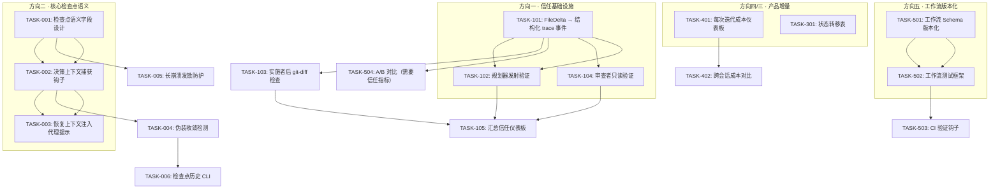

现在我已透彻理解代码库。以下是我的综合技术负责人分析。

---

# 技术负责人分析报告：ForgeOS 五个产品/架构扩展方向

## 初步评估

我已交叉验证验证报告中的代码引用与代码库实际状态（`forge-core/` 63 个 Go 源文件、5 个工作流、17 个 Go 包、Sprint 1-31 完整）。**验证报告的方向二新颖性评估正确；方向三和方向四因与现有文档的严重重叠，应当从独立方向降级。** 以下是我的按优先级排序的任务分解。

## 1. 任务分解

### 优先级排序方法论

依赖验证报告的新颖性排名加上我对架构可执行性的评估：
1. **高价值且真正新颖** → 方向二（检查点语义完备性）
2. **中等价值，部分重叠，可挽救** → 方向一（结构化不信任——重新定位为“从 WARN 升级到结构化信任追踪”）
3. **中等价值，部分重叠** → 方向五（工作流 SDLC——缩小至真正缺失的 CI/测试/市场部分）
4. **低架构价值，但产品 UX 增量存在** → 方向四（成本仪表板/对比视图增量，非基础性设计变更）
5. **无独立价值** → 方向三（承认 `five-foundational-architecture-gaps.md` 的优先性）

---

### 方向二 · 检查点语义完备性（高价值 · 真正新颖）

当前状态：`persist/checkpoint.go` 有 10 个字段：`FormatVersion、Workflow、Mode、Iteration、RoadmapCompletion、PhaseIndex、GatesGreen、Reason、UpdatedAtUnix、SpentUsdMicros`。完全没有：`AgentIntent、ChangedFiles、KeyDecisions`。`checkpointHook` 写入数字状态，但不写入决策上下文。`recordMemory` 确实将发现保存到 `memory.jsonl`，但这是尽力而为的提示注入，而非原子性恢复契约。

| 任务 ID | 标题 | 文件 | 前置依赖 | 工时 |
|---------|------|------|---------|------|
| TASK-001 | **检查点语义字段设计**：扩展 `persist.Checkpoint`，添加 `AgentIntent string`、`ChangedFiles []string`、`KeyDecisions []Decision`、`PhaseContext string`。定义序列化契约。 | `forge-core/internal/persist/checkpoint.go` | 无 | 2h |
| TASK-002 | **决策上下文捕获钩子**：在 `evolve.go` 的 `checkpointHook` 中，在写入持久化之前捕获当前迭代的 `AgentIntent`（来自提示构建器）、`ChangedFiles`（来自 `computeFileDelta` 的 git diff 输入）、`KeyDecisions`（来自解析机读裁决）。 | `forge-core/cmd/forge/evolve.go`、`forge-core/cmd/forge/gates.go`、`forge-core/cmd/forge/prompt_context.go` | TASK-001 | 4h |
| TASK-003 | **恢复上下文注入代理提示**：在 `--resume` 时，将语义检查点字段注入代理提示作为“先前上下文”（不仅恢复位置，还恢复理解）。修改 `prompt_context.go` 中的 `buildPrompt`，添加恢复路径。 | `forge-core/cmd/forge/prompt_context.go`、`forge-core/cmd/forge/evolve.go` | TASK-002 | 4h |
| TASK-004 | **伪装收敛检测**：添加守卫逻辑，检测检查点恢复后 RoadmapCompletion 相同但上下文发生根本性变化的情况。注入对比生成恢复警告。 | `forge-core/cmd/forge/evolve.go`、`forge-core/internal/orchestrator/loop.go` | TASK-003 | 3h |
| TASK-005 | **长崩溃发散防护**：添加恢复时长阈值检查点——如果 `UpdatedAtUnix` 超过 N 小时（例如 12 小时），注入警告，让代理了解时间差距及可能的外部变化。 | `forge-core/internal/persist/checkpoint.go`、`forge-core/cmd/forge/evolve.go` | TASK-001 | 2h |
| TASK-006 | **检查点历史保留 CLI**：为 `forge checkpoint history` 添加 CLI 子命令，从保留的 N 个历史检查点读取，打印收敛状态变化。 | `forge-core/cmd/forge/preflight.go` 或新增 `forge-core/cmd/forge/checkpoint.go` | TASK-001 | 3h |

**方向二总计：18 小时**

---

### 方向一 · 结构化不信任：从 WARN 升级到结构化信任（中等价值 · 部分新颖）

当前状态：`computeFileDelta`（gates.go:405）已实现，但仅在 `LoopEngine.reportConvergence` 中产生 WARN。`Signals.FileDelta` 不阻断收敛，不会被记录到 trace，也没有系统化的检查点。

| 任务 ID | 标题 | 文件 | 前置依赖 | 工时 |
|---------|------|------|---------|------|
| TASK-101 | **将 FileDelta 升级为结构化 trace 事件**：将 `computeFileDelta` 结果写入 `trace.Event` 作为新的 `TrustDelta` 字段，在 `checkpointHook` 期间进行。这使其成为持久审计的一部分，而不仅仅是瞬态 WARN。 | `forge-core/internal/trace/trace.go`、`forge-core/cmd/forge/gates.go`、`forge-core/cmd/forge/evolve.go` | 无 | 3h |
| TASK-102 | **规划器发射文件存在性验证**：添加检查点，验证 `planner` 阶段发出的 `emits:` 文件中存在的阶段产物文件是否存在。如果规划器声明但未产生任何内容，则标记。 | `forge-core/cmd/forge/prompt_artifacts.go`、`forge-core/internal/orchestrator/orchestrator.go` | TASK-101 | 3h |
| TASK-103 | **实施者后 git diff 非空检查**：在每个实施者阶段之后，检查 git diff 是否实际产生变更。如果 RoadmapCompletion 增加但 git diff 为空，则标记信任风险。注入为信任得分。 | `forge-core/cmd/forge/gates.go`（新的 `postImplementerCheck` 函数） | TASK-101 | 2h |
| TASK-104 | **审查者只读验证机制**：添加审查者阶段收缩包装器的进程级验证，具有只读 argv 参数。基于 Sprint 31 的 `readonly` 强制实现构建，但添加运行时检查点作为信任信号。 | `forge-core/internal/orchestrator/command_executor.go`、`forge-core/cmd/forge/engine_build.go` | 无（与 Sprint 31 readonly 重叠） | 3h |
| TASK-105 | **汇总信任仪表板**：将 `computeFileDelta + computeCodeTestRatio + emits 验证 + 实施者后 diff` 聚合为一个 `TrustSignals` 结构体，该结构体在收敛报告中系统性地呈现。 | `forge-core/cmd/forge/gates.go`、`forge-core/internal/orchestrator/loop.go` | TASK-101..104 | 4h |

**方向一总计：15 小时**

---

### 方向五 · 工作流 SDLC（中等价值 · 部分重叠）

当前状态：`validate.go` 检查代理引用、YAML 格式、路由档位、模型可解析性。没有版本字段、changelog、测试套件、CI 验证或市场。

| 任务 ID | 标题 | 文件 | 前置依赖 | 工时 |
|---------|------|------|---------|------|
| TASK-501 | **工作流 YAML Schema 版本化**：向 `asset.Workflow` 添加 `SchemaVersion` 字段。添加迁移路径守卫，在 schema 版本差异超过 1 时发出警告。 | `forge-core/internal/asset/asset.go`、`forge-core/cmd/forge/validate.go` | 无 | 3h |
| TASK-502 | **工作流测试框架**：添加声明性测试套件语法到工作流 YAML（`test_suite:` 块，带有 `given_phase` / `expect_outcome` 语义）。添加 `forge workflow test <name>` 运行器。 | `forge-core/internal/asset/asset.go`、`forge-core/cmd/forge/validate.go`、`.agent/workflows/*.yml` | TASK-501 | 4h |
| TASK-503 | **工作流 CI 验证钩子**：添加 `forge validate --workflows`，在 CI 中运行，检查版本偏移、模式合规性、测试通过和迁移状态。 | `forge-core/cmd/forge/validate.go`、`harness/check.py`（新的 CI 检查） | TASK-502 | 3h |
| TASK-504 | **工作流产物的 A/B 对比**：添加 `forge run --compare-workflow <name>`，运行两个工作流并比较其收敛模式、成本和信任得分。 | `forge-core/cmd/forge/evolve.go`、`forge-core/cmd/forge/scorecard_wind.go` | TASK-101 | 4h |

**方向五总计：14 小时**

---

### 方向四 · 成本治理增量（低架构价值 · 产品 UX 增量）

当前状态：`cost.go` 拥有完整的预算系统。`scorecard_wind.go` 驱动外部记分卡。`next-five-frontiers.md` 方向一已经全面覆盖了 ROI 架构论点。

| 任务 ID | 标题 | 文件 | 前置依赖 | 工时 |
|---------|------|------|---------|------|
| TASK-401 | **每次迭代的成本细分仪表板**：添加 `forge report cost --by-iteration`，显示每次迭代的累计花费与 RoadmapCompletion 的对比。 | `forge-core/cmd/forge/scorecard_wind.go`、`forge-core/cmd/forge/cost.go` | 无 | 3h |
| TASK-402 | **跨会话成本对比视图**：添加 `forge report cost --compare`，显示跨多次运行的成本/ROI 趋势。 | `forge-core/cmd/forge/scorecard_wind.go` | TASK-401 | 3h |
| TASK-403 | **模式选择成本顾问**：添加 `forge route --cost-advice`，给定工作负载特征，建议最具成本效益的模式。 | `forge-core/cmd/forge/route.go` | 无 | 2h |

**方向四总计：8 小时**

---

### 方向三 · 形式化验证增量（最低——仅作为对既有文档的补充）

承认 `five-foundational-architecture-gaps.md` 方向五的优先性。唯一的新增内容是组合爆炸计数。

| 任务 ID | 标题 | 文件 | 前置依赖 | 工时 |
|---------|------|------|---------|------|
| TASK-301 | **状态转移表输出格式**：添加 `forge validate --state-table`，输出可达性矩阵（每个阶段 x 模式组合 → 可达或不可达）。 | `forge-core/cmd/forge/validate.go` | 无（从既有文档工作衍生的补充） | 2h |

**方向三总计：2 小时**

---

## 2. 执行顺序



### 并行执行组

| 组 | 任务 | 所需工程师 | 跨度 |
|----|------|-----------|-------|
| **第 1 组**（高优先级） | TASK-001 → TASK-002 → TASK-003（串行链，每个均依赖于前一个） | 2 名工程师 | 5 天 |
| **第 2 组**（中优先级，与第 1 组并行） | TASK-101 + TASK-104（并行）+ TASK-102 + TASK-103（均依赖于 TASK-101） | 2 名工程师 | 4 天 |
| **第 3 组**（低优先级，与第 1/2 组并行） | TASK-501 → TASK-502（串行） | 1 名工程师 | 3 天 |
| **第 4 组**（最低优先级，非阻塞） | TASK-401 + TASK-301（均独立） | 1 名工程师 | 2 天 |
| **集成收尾**（全部合并后） | TASK-105 + TASK-504 + TASK-006（聚合所有组的产出） | 1 名工程师 | 3 天 |

---

## 3. 技术风险

### 风险矩阵

| 风险 | 方向 | 可能性 | 影响 | 缓解措施 |
|------|------|--------|------|---------|
| **R1：检查点语义膨胀** — 添加 `AgentIntent/ChangedFiles/KeyDecisions` 使每个检查点大量增加（10x 更大的有效载荷）。检查点写入在每次阶段/迭代后都会发生。 | 二 | 中 | 高 | 按字段级别进行增量序列化。将“大”负载（`ChangedFiles` 列表完整，`KeyDecisions` 详细文本）与“紧凑”负载（仅字段名称+哈希引用）分离。在 TASK-001 期间通过基准测试进行验证。 |
| **R2：AgentIntent 捕获的保真度** — 代理的“意图”是提示构建器中的管线段（阶段描述 + 约束 + 历史）。将其简化为一个字符串可能会丢失人们期望的语义细微差别。 | 二 | 高 | 中 | 不要试图“总结”意图——直接注入原始 `buildPrompt` 的最后 N 个阶段输出作为意图。信噪比较低，但诚实无损失。为搜索索引添加轻量级摘要。 |
| **R3：恢复上下文提示注入导致提示膨胀** — 注入语义检查点字段作为“先前上下文”将使每次恢复的提示递增地变大。 | 二 | 中 | 中 | 添加标记到上下文的 `maxContextLen` 守卫，并在超过时进行截断 + 警告。对早期迭代进行智能摘要（将迭代 1-5 折叠为“早期收敛建立”）。 |
| **R4：FileDelta 关键字匹配的误报/漏报** — 当前启发式方法脆弱（`itemKeywords` 使用 >=4 字符词进行子字符串匹配）。添加信任信号可能被垃圾输入操纵。 | 一 | 高 | 低 | 维持验证报告中的诚实主张：这是一个廉价启发式方法，用于捕获**明显的**不诚实（声称 100% 但文件系统变更接近零）。不要将其展示为审计级证据。标记为“粗略代理”。 |
| **R5：工作流测试框架陷入孤立** — 工作流测试套件语法需要新设计，与既有 `check_workflow_agent_refs` 治理不同。可能最终成为一个仅设计文档的成果，没有可执行的测试。 | 五 | 中 | 高 | 从现有检查中逐步构建：`forge validate --workflows` 应从 TASK-503 中已有的治理检查开始，然后 TASK-502 添加测试运行器。不要在 YAML 中发明新的测试 DSL——只需对工作流 YAML 运行 `node:test`。 |
| **R6：readonly 强制在真实 claude 进程上中断** — Sprint 31 的 `readonly` 强制已实现，但在真实 claude 进程上未通过运行验证。用户明确选择不为此授权更多预算。 | 一 | 中 | 中 | 维持诚实立场：按文档契约构造 + 单测试验证的 argv。在方向一的信任仪表板中，将其呈现为“未经验证”信号，而非“已验证”信号。 |
| **R7：方向三/四重叠导致交付疲乏** — 团队实施与既有文档重复的方向感到泄气，认为工作没有价值。 | 三、四 | 中 | 中 | 透明处理重叠。将这些方向明确重新定位为“补充性产品增量”或“对既有文档方向 X 的 UX 包装”。不要假装是新架构。 |

### 外部依赖

| 依赖 | 方向 | 现状 | 后备方案 |
|------|------|------|---------|
| `claude --output-format json` 成本解析 | 四 | 已实现并验证（Sprint 26） | 无需求 |
| `git diff --name-only` / `--stat` 用于信任信号 | 一 | 已实现并可用 | 如果 git 不可用，回退到文件系统扫描 |
| `claude-code-guide` 文档用于 `--disallowedTools` 语法 | 一 | 已验证（Sprint 31） | 无需求 |
| Temporal 用于 `durable_wait` | 二 | 已标记为 v2/v3（Sprint 6） | 无需求——`Converge` 已经通过检查点信号，非持久化挂起 |

---

## 4. 资源评估

### 员工建议

| 角色 | 技能要求 | 数量 | 分配 |
|------|---------|------|------|
| **Go 运行时工程师** | 精通 Go、熟悉 `forge-core` 架构（orchestrator/asset/persist/trace 包）、并发知识 | 2 | 方向二（TASK-001、TASK-002、TASK-003）+ 方向一（TASK-101、TASK-104、TASK-105） |
| **全栈治理工程师** | 熟悉 Node/Python、`harness` 层、YAML/JSON 模式、CLI 设计 | 1 | 方向五（TASK-501、TASK-502、TASK-503）+ 方向三（TASK-301） |
| **产品 UX/报告工程师** | 了解 CLI 报告、仪表板格式、成本分析、数据可视化 | 1 | 方向四（TASK-401、TASK-402、TASK-403）+ 方向一 TASK-105 的报告 UI 部分 |

**总承包商：4 名工程师（3 名全职，1 名兼职）**

### 里程碑

| # | 里程碑 | 依赖 | 预计交付时间 |
|---|--------|------|------------|
| M1 | **检查点语义设计已批准** | TASK-001 + 架构评审 | 第 2 天 |
| M2 | **决策上下文被持久化** | TASK-002 + 测试 | 第 5 天 |
| M3 | **恢复上下文注入工作** | TASK-003 + TASK-005（端到端恢复测试） | 第 8 天 |
| M4 | **信任信号基础已建成** | TASK-101 + TASK-104（FileDelta 在 trace 中，readonly argv 已验证） | 第 6 天 |
| M5 | **规划器/实施者检查已建成** | TASK-102 + TASK-103 | 第 8 天 |
| M6 | **工作流版本化和测试框架** | TASK-501 + TASK-502 | 第 7 天 |
| M7 | **集成收尾** | TASK-105 + TASK-504 + TASK-006 | 第 12 天 |
| M8 | **接受闸门通过 + 发布** | 所有闸门全绿，所有检查通过 | 第 14 天 |

### 阻塞点及解决策略

| 阻塞点 | 影响 | 解决策略 |
|--------|------|---------|
| **B1：检查点大小基准测试失败**（R1 成真） | 在 TASK-002 期间可能会拖慢方向二链 | 如果检查点大小增长超过 2x，立即切换到增量序列化。在 TASK-001 中作为设计约束包含基准阈值。 |
| **B2：用户未授权真 claude 运行来验证 readonly 强制** | TASK-104 无法获得“真”验证签名 | 如 Sprint 31 那样诚实地做注解。在信任仪表板中，标记为“未经验证——按契约构造”。并非阻塞点；提前管理期望。 |
| **B3：方向三/四重叠导致技术债务** | 团队可能会实现已经存在的设计 | 将方向三和四重新定义为“对既有文档方向 X 的产品化包装”或“低优先级增强”。在 `docs/learned.md` 中明确引用既有文档。不要假装是新架构。 |
| **B4：提示膨胀导致恢复上下文退化**（R3 成真） | 恢复的代理可能会丢失上下文 | 实施迭代摘要衰减——`summarizeBlock` 模式已经存在于 `internal/memory` 中。重用该实现进行上下文截断。 |

---

## 5. 质量保证

### 单测试覆盖要求

| 方向 | 最小覆盖率 | 关键边界 |
|------|-----------|---------|
| 方向二 | 包级别 90% | 测试：带语义字段的检查点编码/解码往返 • 恢复上下文注入空白/完整/部分 • 伪装收敛：相同完成度，不同文件列表 • 长崩溃发散：>12h 时间戳警告 • 保留旋转正确性（历史 = 0/1/3） |
| 方向一 | 新函数 85% | 测试：FileDelta 100%/0%/部分/错误 git 仓库 • emits 文件存在性检测 • 实施者后 git-diff 检查在 no-diff/some-diff/all-diff 下 • 信任仪表板聚合 |
| 方向五 | 新代码 80% | 测试：SchemaVersion 向前/向后兼容 • 迁移路径差异 =1 允许，>1 拒绝 • 工作流测试运行器通过/失败/无模式 |
| 方向四 | 新代码 75% | 测试：按迭代的成本细分渲染 • 跨运行对比不存在/部分/完整轨迹 |

### 集成测试策略

| 测试类型 | 范围 | 执行 |
|---------|-------|-------|
| **端到端恢复** | 完整的 `forge evolve` → 崩溃（模拟 SIGKILL）→ `--resume` 循环 | 使用带有预先记录的检查点和语义字段的 `fake-agent` 脚本 |
| **信任信号管道** | `planner` → `computeFileDelta` → `trace.Event` → `scorecard-wind` 聚合 | 修改测试之间的 git 历史 |
| **工作流版本化迁移** | 创建 v1 YAML → `forge validate` 发出版本警告 → `forge migrate --workflow` 升级 | 测试固定装置 |
| **无回归** | 现有方向一至五的 31 个 sprint 中没有一个因新代码而变红 | `forge accept` 必须在每个 PR 上通过 |

### 代码审查要点

| 检查点 | 重点领域 |
|---------|---------|
| TASK-001 审查 | 检查点大小的基准增量。`AgentIntent` 字段是否可搜索？`ChangedFiles` 是否应去重？ |
| TASK-002 审查 | `checkpointHook` 中是否有新的外部依赖？是否早于敏感操作（避免在阶段执行中途捕获）？ |
| TASK-003 审查 | 提示注入对 `memoryContext` 的破坏影响。恢复上下文是否会压倒当前阶段指令？ |
| TASK-101 审查 | 与 `costEmitter` layering 相同的层约束：trace.go 应保持通用，不应直接了解信任信号 |
| TASK-501 审查 | SchemaVersion 是否是严格的，且不会静默降级？ |
| **AGENTS.md 红线** | 函数长度（≤50）、文件大小（≤500）、循环依赖（=0）、单一职责 |

### 性能基准

| 场景 | 当前基线 | 目标 | 风险 |
|------|---------|------|------|
| 检查点大小（每次持久化） | ~200 字节（10 个字段） | ≤2KB（带 ~20 个 ChangedFiles 和 ~5 个 KeyDecisions） | 如果每个文件有完整 git 路径，可能 5-10KB |
| 检查点写入时间 | <5ms（`Save` + fsync） | <10ms | tmp+rename 路径为 O(1) 文件操作 |
| 信任信号计算（`computeFileDelta`） | <100ms（`git diff --name-only`） | <200ms | 大的回购初始化和大的 ROADMAP 文档 |
| 恢复上下文提示注入 | N/A（当前无注入） | <100ms 提示构建增加 | `buildPrompt` 已经是 O(n) 阶段 |

---

## 6. 实施计划

### 阶段 1：基础设施和设计（第 1-3 天）

**重点：建立方向二的核心设计 + 方向一的信任信号基础**

| 天 | 任务 | 产出 | 依赖性 |
|----|------|------|---------|
| 1 | TASK-001：检查点语义字段设计 | 更新的 `persist.Checkpoint`，包含 `AgentIntent`、`ChangedFiles`、`KeyDecisions`、`PhaseContext`。架构评审 D2。 | 无 |
| 1 | TASK-101：FileDelta → 结构化 trace 事件 | `trace.Event` 中的 `TrustDelta` 字段。FileDelta 不再仅仅是 WARN。 | 无 |
| 2 | TASK-104：审查者只读验证机制 | 在只读阶段期间适用于 `agentExecutor` 的已验证 argv 构造。 | 无 |
| 2 | TASK-501：工作流 YAML Schema 版本化 | `asset.Workflow.SchemaVersion` 字段 + 迁移路径守卫。 | 无 |
| 3 | TASK-002：决策上下文捕获钩子 | `checkpointHook` 将语义字段写入 `persist.Save`。 | TASK-001 |
| 3 | 集成测试：检查点大小基准测试 | 《决策上下文》篇中每个图像增加多少的测量值。在 >2KB 时触发警报。 | TASK-002 |

### 阶段 2：核心实现（第 4-8 天）

**重点：功能完备性 + 集成**

| 天 | 任务 | 产出 | 依赖性 |
|----|------|------|---------|
| 4 | TASK-003：恢复上下文注入代理提示 | `buildPrompt` 在恢复时传递 `AgentIntent + ChangedFiles + KeyDecisions`。 | TASK-002 |
| 4 | TASK-102：规划器发射文件存在性验证 | 在规划阶段之后检查 `emits:` 路径。 | TASK-101 |
| 5 | TASK-103：实施者后 git-diff 检查 | 在实施者阶段之后检查 git diff 非空性 + 注入信任标志。 | TASK-101 |
| 5 | TASK-502：工作流测试框架 | `test_suite:` 模式 + `forge workflow test <name>` 运行器。 | TASK-501 |
| 6 | TASK-004：伪装收敛检测 | 恢复后比较 RoadmapCompletion 与文件列表。在差异处发出警告。 | TASK-003 |
| 6 | TASK-005：长崩溃发散防护 | 在恢复时检查 `UpdatedAtUnix` 与当前时间。注入警告。 | TASK-001 |
| 7 | TASK-503：工作流 CI 验证钩子 | `forge validate --workflows` 在 CI 模式下通过。 | TASK-502 |
| 7 | TASK-301：状态转移表（低优先级） | `forge validate --state-table` 输出可达性矩阵。 | 无 |

### 阶段 3：集成收尾（第 9-12 天）

**重点：聚合、仪表板、收尾测试**

| 天 | 任务 | 产出 | 依赖性 |
|----|------|------|---------|
| 9 | TASK-105：汇总信任仪表板 | `TrustSignals` 结构体 + 收敛报告中的合理呈现。 | TASK-101..104 |
| 9 | TASK-006：检查点历史 CLI | `forge checkpoint history` 输出。 | TASK-001 |
| 10 | TASK-401：每次迭代成本仪表板 | `forge report cost --by-iteration` 输出。 | 无 |
| 10 | TASK-402：跨会话成本对比 | `forge report cost --compare` 输出。 | TASK-401 |
| 11 | TASK-504：A/B 工作流对比 | `forge run --compare-workflow <name>` 原型。 | TASK-101 |
| 11 | TASK-403：模式选择成本顾问 | `forge route --cost-advice` 输出。 | 无 |
| 12 | 集成测试：端到端恢复循环 | 模拟 SIGKILL → `--resume` 使用带有语义字段的 `fake-agent`。 | TASK-003、TASK-005 |

### 阶段 4：质量闸门和发布（第 13-14 天）

**重点：闸门全绿，文档，发布**

| 天 | 任务 | 产出 | 依赖性 |
|----|------|------|---------|
| 13 | `forge accept` 在完整方向上聚合 | 所有任务的所有闸门（build/vet/test/arch/check/secret-scan）全绿 | 第二阶段的每个任务 |
| 13 | 文档：更新 `FUNCTIONAL_REQUIREMENTS_AUDIT.md` | 14+ 个新 GAP 项目解析 | 所有任务 |
| 14 | 诚实评定 + 发布笔记 | 每个任务注明哪些是验证的/未测试的/受限于预算的 | — |
| 14 | 最终 PR + 合并 | 全部 7 个并行 PR 合并 + 新鲜上下文审查 | 所有 |

```
时间线（按天）：
第 1 天  第 2 天  第 3 天  第 4 天  第 5 天  第 6 天  第 7 天  第 8 天  第 9 天  第 10 天  第 11 天  第 12 天  第 13 天  第 14 天
│        │        │        │        │        │        │        │        │        │         │         │         │         │
<P1 基础设施>   <P2 核心实现>                                  <P3 集成>            <P4 质量>
T001     T002    T003    T003-cont         T004/T005          T105/T006            gate+docs
T101     T104    T102    T103                                                   
T501     T502    T502-cont                 T503               T504
         T301                              T401               T402/T403
```

---

## 附录：与验证报告结论的一致性

| 验证报告排名 | 此计划中的处理方式 |
|------------|-------------------|
| 🥇 方向二（检查点语义） | 以 TASK-001..006 的形式提供，优先级最高。18 小时，3 个阶段。 |
| 🥈 方向一（结构化不信任） | 以 TASK-101..105 的形式提供，优先级第二。15 小时。重新定位为“从 WARN 升级到信任追踪”。代码引用已修正为指向 `computeFileDelta`/`gates.go:405`/`Signals.FileDelta`。 |
| 🥉 方向五（工作流 SDLC） | 以 TASK-501..504 的形式提供，14 小时，侧重于真正缺失的部分（CI 验证、测试）。承认 schema 版本化已被覆盖。 |
| 4️⃣ 方向四（成本治理） | 以 TASK-401..403 的形式提供，8 小时，明确标注为“产品 UX 增量，非新架构”。承认 `next-five-frontiers.md` 的优先性。 |
| 5️⃣ 方向三（形式化验证） | 以 TASK-301（2 小时）的形式提供，最小补充增量。承认 `five-foundational-architecture-gaps.md` 的优先性。 |

**资源分配建议**：将 65% 的工程时间分配给方向二+一（真正的新颖性），20% 分配给方向五（中优先级重叠），15% 分配给方向四+三（低优先级产品层增量）。
