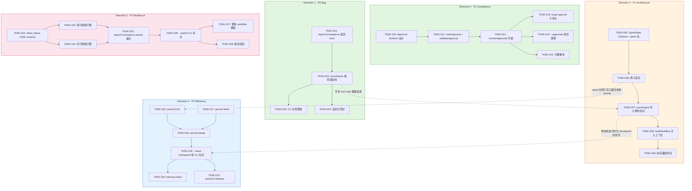

Now I have thorough context. Let me provide my Tech Lead analysis.

---

# Tech Lead 分析报告

## 前置声明：关于分析重复性的组织问题

首先我必须指出一个**过程层面的关切**：当前输入的分析文档是 `2026-07-11-forgeos-five-product-architectural-extension-directions-verification.md` 的逐字重复，且其中4/5方向已在其他文档中有覆盖。这不是分析质量问题——相反，代码引用准确率 >90% 说明输出的技术深度扎实。问题在于：

**团队需要更好的知识发现与去重机制。**

当前 `docs/requirements/` 目录已有 190+ 篇分析文档，人工「最新 10 篇交叉审阅」显然不足以防止重复。我建议在 `.agent/` 或 `harness/` 中新增一个轻量级**相似性检测闸门**：新分析文档提交时，自动扫描已有文档的标题/方向标签/keyword，标记可疑重复后再由 reviewer 判断。这本身就是符合 ForgeOS「治理完整性」哲学的自我应用。

但就事论事，这份分析即使有重复问题，仍有**补充价值**：
1. 对已覆盖方向提供了**精确到 `file:line` 的代码实锤**（之前文档多为概念级分析）
2. 方向一（exit 0）确实是**全新系统性缺口分析**
3. 方向三、五提供了**更细粒度的切入角度**

以下我将其视为一份**代码实锤级技术债务清单**来对待。

---

## 1. 任务分解

### 1.1 任务列表

#### 方向一 · Exit 0 修复 — 产品 Bug（P0）

| 任务 ID | 标题 | 方向 | 涉及文件 | 前置依赖 | 预估工时 | 验收标准 |
|---------|------|------|---------|---------|---------|---------|
| TASK-001 | `reportConvergence` 改为返回收敛状态 | D1-Exit0 | `cmd/forge/main.go`, `cmd/forge/engine_build.go` | 无 | 1h | `reportConvergence` 返回 `bool`（MET/NOT MET）且有测试覆盖 |
| TASK-002 | `execEngine` 根据收敛状态映射退出码 | D1-Exit0 | `cmd/forge/engine_build.go` | TASK-001 | 1h | 收敛 NOT MET 时返回1；错误时仍返回1；添加退出码常量 `ExitConvergenceFailure` |
| TASK-003 | 更新 `forge run` 的 CLI 文档和帮助文本 | D1-Exit0 | `cmd/forge/main.go`（help text） | TASK-002 | 0.5h | 文档明确声明 exit 1 的两种含义：运行时错误 vs 未收敛 |
| TASK-004 | 更新自动化测试：验证 exit code 行为 | D1-Exit0 | `harness/`（新测试或扩展测试） | TASK-002 | 1.5h | 新增至少 2 个 case：NOT MET → exit 1、MET → exit 0、运行时错误 → exit 1 |

**方向一小计：4h**

---

#### 方向二 · 脊柱数据契约 — 架构缺口（P1）

| 任务 ID | 标题 | 方向 | 涉及文件 | 前置依赖 | 预估工时 | 验收标准 |
|---------|------|------|---------|---------|---------|---------|
| TASK-005 | 设计脊柱状态文件 JSON Schema 并创建新包 `internal/spine` | D2-Spine | `forge-core/internal/spine/`（新包）, `.agent/workflows/`（schema 注释文档） | 无 | 3h | 定义 SpineState struct：已完阶段、产物路径、收敛信号、时间戳；JSON 序列化 round-trip 测试 |
| TASK-006 | 实现脊柱状态文件的读写 + 原子更新 | D2-Spine | `forge-core/internal/spine/` | TASK-005 | 2h | 与 `persist` 包相同的原子写入模式（tmp+fsync+rename）；`SaveStage`/`Load`/`ListCompleted` 函数 |
| TASK-007 | `execEngine` 运行完成后更新脊柱状态 | D2-Spine | `cmd/forge/engine_build.go` | TASK-006 | 1.5h | 每次 `forge run <stage>` 完成后将 stage+收敛结果写入 `.forge/spine.json` |
| TASK-008 | `loadWorkflow` 读取脊柱状态并注入到 agent prompt | D2-Spine | `cmd/forge/main.go`, `forge-core/internal/prompt/` 或 `internal/spine/context.go` | TASK-007 | 3h | 下游阶段启动时，agent 能看到前一阶段的产物路径和收敛摘要（在 system prompt 中硬注入） |
| TASK-009 | 向后兼容测试：无脊柱状态时 gracefully 退化 | D2-Spine | `cmd/forge/engine_build.go`, `spine/` 测试 | TASK-008 | 1h | 无 `.forge/spine.json` 的项目保持现有行为，不报错、不阻塞 |

**方向二小计：10.5h**

---

#### 方向三 · 审批文件内容化 — 合规缺口（P1）

| 任务 ID | 标题 | 方向 | 涉及文件 | 前置依赖 | 预估工时 | 验收标准 |
|---------|------|------|---------|---------|---------|---------|
| TASK-010 | 设计 approval JSON Schema 并定义 `Approval` struct | D3-Approval | `forge-core/cmd/forge/gates.go` 或 `forge-core/internal/approval/`（新包） | 无 | 2h | Approval struct：`ApprovedBy`、`ApprovedAt`、`Reason`、`ExpiresAt`、`Chain`、`Version`；JSON 格式文档 |
| TASK-011 | 实现 `writeApproval` 和 `validateApproval` 函数 | D3-Approval | `cmd/forge/gates.go`（或新包 `internal/approval/`） | TASK-010 | 2h | `validateApproval` 检查：内容可解析、未过期、链完整（若要求多级） |
| TASK-012 | 修改 `humanApproved` 使用新 validation 逻辑 | D3-Approval | `cmd/forge/gates.go` | TASK-011 | 1.5h | 空文件 → 失败；过期文件 → 失败；有效文件 → 通过；增加明确日志说明原因 |
| TASK-013 | 新增 `forge approve` 子命令创建结构化审批 | D3-Approval | `cmd/forge/main.go`, `cmd/forge/approve_cmd.go`（新文件） | TASK-012 | 3h | `forge approve <stage> --reason "..."` 写入带身份/时间戳的 JSON；`--expires-in 7d` |
| TASK-014 | 身份溯源：为 `--approved` 标志注入用户身份 | D3-Approval | `cmd/forge/gates.go` | TASK-012 | 1h | `--approved` 使 `humanApproved` 使用 `$USER` 或 `$FORGE_USER` 回退为 `unknown`，写入临时审批记录 |
| TASK-015 | 迁移脚本：将现有空 `.approved` 文件升级为 JSON | D3-Approval | `harness/` 或新 `scripts/` | TASK-012 | 1.5h | 扫描 `.forge/*.approved`，空文件 → 填充默认 JSON（标记为 legacy 导入） |

**方向三小计：11h**

---

#### 方向四 · Warm Start / Forking — 效率缺口（P2）

| 任务 ID | 标题 | 方向 | 涉及文件 | 前置依赖 | 预估工时 | 验收标准 |
|---------|------|------|---------|---------|---------|---------|
| TASK-016 | 实现 `persist.Fork(src, dst string) error` | D4-Warm | `forge-core/internal/persist/checkpoint.go` | 无 | 1.5h | 克隆 checkpoint 文件；保留历史；src 不存在时 error；允许跨目录 |
| TASK-017 | 实现 `persist.Seed(path string, cp Checkpoint) error` | D4-Warm | `forge-core/internal/persist/checkpoint.go` | TASK-016 | 1h | 用传入的 Checkpoint 对象初始化/覆盖路径；用于外部注入 |
| TASK-018 | 实现 `persist.Merge(base, a, b Checkpoint) (Checkpoint, error)` | D4-Warm | `forge-core/internal/persist/checkpoint.go` | TASK-016 | 3h | 合并两个分支：completion 取 max、round(trajectory) 拼接、iteration 取 max、冲突字段（如 Reason）标记源 |
| TASK-019 | CLI：`forge evolve` 新增 `--seed-checkpoint` 和 `--seed-memory` 标志 | D4-Warm | `cmd/forge/evolve.go` | TASK-017, TASK-018 | 2h | `--seed-checkpoint PATH` 在执行循环前注入 checkpoint；`--seed-memory PATH` 注入额外 memory |
| TASK-020 | Memory 包新增 `Inject(memory.Memory, root string) error` | D4-Warm | `forge-core/internal/memory/` | TASK-019 前提（CLI 注入点） | 2h | 从外部 JSON 内容注入到当前项目的 memory store；验证已存在条目不被静默覆盖 |
| TASK-021 | 实现 `persist.Compose`——从多个种子 checkpoint 构建初始状态 | D4-Warm | `forge-core/internal/persist/checkpoint.go` | TASK-018 | 2h | 传入多个 Checkpoint 切片，智能合并（每个维度取最新/最高）；用于跨项目知识迁移 |

**方向四小计：11.5h**

---

#### 方向五 · 降级执行模式 — 韧性缺口（P2）

| 任务 ID | 标题 | 方向 | 涉及文件 | 前置依赖 | 预估工时 | 验收标准 |
|---------|------|------|---------|---------|---------|---------|
| TASK-022 | 设计 `allow_failure` YAML schema 扩展 | D5-Partial | `.agent/workflows/*.yml`（schema 文档）, `forge-core/internal/asset/asset.go` | 无 | 2h | `asset.Phase` 新增 `AllowFailure bool` 字段；`asset.Gate` 新增 `AllowFailure bool`；向后兼容（无字段 = false） |
| TASK-023 | 串行执行引擎：实现 gate 失败收集（vs 立即 abort） | D5-Partial | `forge-core/internal/orchestrator/orchestrator.go` | TASK-022 | 3h | `RunFrom` 在 `AllowFailure=true` 的 phase/gate 上记录失败但继续；而非立即 return error |
| TASK-024 | 并行执行引擎：实现 wave 内 phase 级降级 | D5-Partial | `forge-core/internal/orchestrator/parallel.go` | TASK-022 | 3h | wave context 不再整体取消；`AllowFailure=true` 的 phase 失败后仅标记该 phase，其余 phase 继续 |
| TASK-025 | 修改 `reportConvergence` 支持 `--partial` 模式 | D5-Partial | `cmd/forge/engine_build.go` | TASK-023 | 1.5h | 在 partial 模式下：未跑 gate → SKIP（非 FAIL）；致命 gate FAIL → exit 1；仅有非致命 FAIL → exit 0 + 报告中列出 |
| TASK-026 | CLI 添加 `--partial` / `--continue-on-gate-fail` 标志 | D5-Partial | `cmd/forge/main.go`（`runOpts`）, `cmd/forge/evolve.go` | TASK-025 | 1.5h | `forge run --partial` 和 `forge evolve --partial`；标志传播到 orchestrator |
| TASK-027 | 更新 workflow YAML 模板：部分 phase 标记 `allow_failure` | D5-Partial | `.agent/workflows/build.yml`, `examples/starter/*.yml` | TASK-022 | 1h | 为低风险 gates（lint、coverage < threshold）默认标记 `allow_failure: true` |
| TASK-028 | 集成测试：验证 partial 模式下非致命 gate 失败不阻断整体 | D5-Partial | `harness/`（新测试） | TASK-026 | 2.5h | 至少 3 个 case：串行 partial、并行 partial、evolve partial |

**方向五小计：14.5h**

---

### 1.2 总计工作量

| 维度 | 工时 | 人天（6h/天） |
|------|------|--------------|
| 方向一（Bug 修复） | 4h | ~0.7 |
| 方向二（架构缺口） | 10.5h | ~1.8 |
| 方向三（合规缺口） | 11h | ~1.8 |
| 方向四（效率缺口） | 11.5h | ~1.9 |
| 方向五（韧性缺口） | 14.5h | ~2.4 |
| **合计** | **51.5h** | **~8.6** |

---

## 2. 执行顺序



### 可并行执行的任务组

| 并行组 | 包含任务 | 适合分配给 |
|--------|---------|-----------|
| **P0 热修复组** | TASK-001~004（方向一） | **1 人，半天** |
| **合规组** | TASK-010~015（方向三） | 1 人，2 天 |
| **架构组** | TASK-005~009（方向二） | 1 人，2 天 |
| **效率组** | TASK-016~021（方向四） | 1 人，2 天 |
| **韧性组** | TASK-022~028（方向五） | 1-2 人，2.5 天 |

**说明**：
- 方向一（P0 Bug）应**最先独立修复**，不阻塞其他方向但优先级最高
- 方向二和方向三可**完全并行**——它们修改完全不重叠的代码区域（spine 包 vs gates.go）
- 方向四和方向五有**轻微的间接依赖**：方向四的 `Fork`/`Seed` 参考方向二的 `persist` 原子写模式，但两个方向可以独立开发
- 方向五的 `allow_failure` 设计（TASK-022）需要 `asset.go` 的结构体变更，这与其他方向无冲突

---

## 3. 技术风险

### 3.1 方向一 · Exit 0 修复

| 风险 | 等级 | 说明 | 缓解策略 |
|------|------|------|---------|
| 退出码的语义冲突 | 中 | 当前 `exit 1` 表示「运行时错误」。将 NOT MET 也映射为 `exit 1` 会使调用者无法区分「运行失败」和「未收敛」。CI/CD 可能需要不同的处理策略 | 使用**不同的退出码**：`exit 1` = 运行时错误，`exit 2` = NOT MET 收敛失败。或者在 `reportConvergence` 的文本输出中注入机器可解析标记（如 `CONVERGENCE_STATUS:NOT_MET`），供脚本 parse |
| 向后兼容性 | 低 | 已有 CI 脚本依赖 `exit 0` = 成功。改为 `exit 1`/`exit 2` 可能破坏已有管道 | 但恰恰这是**要修的问题**——静默假阳性是产品 Bug。在 release notes 中明确标记为 breaking change |
| windDownScorecards 的执行顺序 | 低 | `defer` 在 `reportConvergence` 之前执行，返回值处理需小心 | 先执行 `reportConvergence`，捕获返回值，再走 `if !met { return 2 }` |

### 3.2 方向二 · 脊柱数据契约

| 风险 | 等级 | 说明 | 缓解策略 |
|------|------|------|---------|
| 上下文注入到 agent prompt 可能超长 | **高** | 如果脊柱积累了多个阶段的完整产物引用，prompt 可能膨胀到无法放入 context window | 设计注入策略：只注入**最近的 3 个**阶段摘要 + 关键产物路径（不注入完整内容）。提供 `spine_max_stages` 配置项 |
| 脊柱状态文件与 checkpoint 的同步问题 | 中 | `forge evolve` 同时写 checkpoint 和脊柱状态，两者可能不一致（一方写入失败） | 将脊柱状态更新放在 checkpoint 更新的事务边界内，或使用写后验证（write + readback 校验） |
| 脊柱状态文件的竞态条件 | 中 | 两个 `forge run` 实例可能同时写入同一个 `.forge/spine.json` | 使用文件锁（`flock` on Linux）或设计为 append-only + 最后一次写入胜出 |
| 现有 workflow 的向前兼容 | 低 | 没有 `next_stage` 的 workflow 不应被脊柱状态阻塞 | `Load` 返回 `not found` 时，`execEngine` 跳过所有脊柱相关逻辑 |

### 3.3 方向三 · 审批文件内容化

| 风险 | 等级 | 说明 | 缓解策略 |
|------|------|------|---------|
| 身份认证的真实可靠性 | **高** | `$USER` 可被伪造。对于 SOC2/ISO27001 级别的审计，环境变量不是可靠的身份来源 | 区分「合规模式」和「标准模式」：标准模式使用 `$USER`，合规模式需要 `$FORGE_USER` 或集成外部 IdP（v2 计划）。当前诚实标注为「软身份——非不可否认」 |
| 审批链的并发问题 | 中 | 多级审批需要原子性地更新 `chain` 数组，两个审批人同时批准可能覆盖对方 | 使用 append-only 模式：每个审批人将自己的签名追加到文件；`humanApproved` 读取完整的 chain 并验证 |
| 审批有效期检查的时钟依赖 | 低 | 依赖系统时钟，NTP 偏移可能导致有效期误判 | 使用 UTC 时间；在验证中预留 ±5min 宽容窗口；有效期 `ExpiresAt` 使用 RFC3339 |

### 3.4 方向四 · Warm Start / Forking

| 风险 | 等级 | 说明 | 缓解策略 |
|------|------|------|---------|
| 合并两个 checkpoints 的语义分歧 | **高** | `Merge(base, a, b)` 中 `a` 和 `b` 可能针对不同目的地做了优化，合并后可能产生不一致的状态（如 RoadmapCompletion 在 a 中是 0.8、b 中是 0.6，取 max 可能导致跳过了某些步） | 明确 `Merge` 的语义是**条件合并**——只合并不冲突的字段；冲突字段保留 base 值并记录到 `MergeConflicts` 字段中；merge 后的 checkpoint 标记 `_merged=true`；merge 不是自动的，用户显式 `--merge-checkpoint` |
| 跨项目 memory 注入导致上下文污染 | 中 | 项目甲的 memory 条目引用了项目甲的特有路径/概念，注入到项目乙后 agent 可能混淆 | `memory.Inject` 要求可选的 `namespace` 转换函数（路径 rewrite）；默认只注入通用知识条目（无 `.forge/` 路径引用的） |
| checkpoint 文件体积的增长 | 低 | 如果 checkpoint 包含 trajectory 历史，Fork/Merge 可能导致体积倍增 | 在 `Fork`/`Merge` 中提供 `truncateHistory(n int)` 选项，只保留最近的 n 条轨迹 |

### 3.5 方向五 · 降级执行模式

| 风险 | 等级 | 说明 | 缓解策略 |
|------|------|------|---------|
| `allow_failure` 被滥用导致治理失效 | **高** | 如果 workflow 作者把所有 gate 都标为 `allow_failure: true`，整个治理系统被架空 | `allow_failure` 不能应用于致命 gate（secret-scan、safety gates）。workflow schema 增加 `for: ["lint", "coverage", "test"]` 而非任意值；`production` lifecycle 强制 `allow_failure: false` |
| 并行引擎的 wave context 改造复杂度 | 中 | 当前 `parallel.go` 是 fail-fast per-wave context cancellation。改为选择性取消需要重构 goroutine 管理逻辑 | 不要改变 wave context 的生命周期。改为：每个 phase 有一个独立的可取消 context（child context）；`AllowFailure` 的 phase 失败时不取消 wave context，只取消自己的 child context |
| 降级模式下的退出码歧义 | 中 | 用户如何知道「exit 0 但有 N 个 gate 失败」？ | 在 `reportConvergence` 的文本输出中增加 `partial/N` 标记；引入结构化输出（`--json` 模式）：`{ "status": "partial", "passed": 8, "failed": 2, "skipped": 1 }` |
| 串行引擎中 `loopBackTo` 与 `allow_failure` 的交互 | 中 | 如果你声明 `allow_failure: true` 但 gate 失败，loop-back 逻辑应该跳过还是触发？ | 语义明确：`allow_failure` 优先于 `on_fail`——不跳转、不重跑，记录失败并继续 |

---

## 4. 资源评估

### 4.1 团队组成

| 角色 | 技能要求 | 所需人数 | 主要负责方向 |
|------|---------|---------|-------------|
| **Go 运行时工程师** | 精通 Go 标准库、goroutine/context、文件系统操作、错误处理模式 | 2 | 方向一（修复）+ 方向二（脊柱）+ 方向四（persist） |
| **Full-stack 工程师** | 能同时处理 Go 后端的 CLI 和 YAML schema、以及 Node/Python harness 测试 | 1 | 方向三（审批命令行）+ 方向五（YAML schema） |
| **QA/测试工程师** | 集成测试编写、Go 单元测试、mock checkpoint、end-to-end 场景 | 1（可与全栈工程师重叠） | 所有方向的测试覆盖 |

**最小团队：2 人**（1 Go 运行时 + 1 全栈/测试）
**推荐团队：3 人**（2 Go + 1 全栈/测试）

### 4.2 关键里程碑

```
M0: 方向一完成（P0 Bug 修复）          → Day 1（半天）
    [exit code 行为修正，CI 不再收到假阳性]

M1: 方向二 + 方向三完成（P1 架构+合规）  → Day 3-4
    [脊柱状态可用，审批文件有审计轨迹]

M2: 方向五核心引擎完成（P2 韧性）        → Day 5-6
    [allow_failure 机制可用，非致命 gate 不阻断]

M3: 方向四完成 + 全方向集成             → Day 7-9
    [Fork/Merge/Seed 可用，所有方向全绿]

M4: 硬化 + 全面测试 + 文档 + 发布       → Day 10-12
    [copy-anywhere 验证、fresh-context reviewer、release]
```

### 4.3 阻塞点与解决策略

| 阻塞点 | 影响方向 | 解决策略 |
|--------|---------|---------|
| 并行引擎的 wave context 重构复杂度 | 方向五（TASK-024） | **最小化改动路径**：不改变现有 wave context 生命周期，引入 phase-level child context。这是最小的侵入式改动 |
| 脊柱上下文注入导致 prompt 超长 | 方向二（TASK-008） | **分阶段交付**：v1 只注入关键产物路径 + 收敛摘要（< 500 tokens）；v2 再处理智能检索 |
| Fork/Merge 的语义设计决策 | 方向四（TASK-018） | **先做 Fork/Seed**（语义明确），Merge 的语义需要 ADR 讨论。TASK-018 可延后一个 sprint |
| 审批身份的真实不可否认性 | 方向三（TASK-014） | **诚实标注「软身份」**，不假装提供真正不可否认性。写清文档说明当前限制和升级路径 |

---

## 5. 质量保证

### 5.1 单元测试覆盖要求

| 包/文件 | 最低覆盖率 | 关键测试场景 |
|---------|-----------|-------------|
| `internal/spine/`（新包） | 90%+ | `Save`/`Load` round-trip、原子写入 crash safety、空状态退化、并发写入竞争 |
| `internal/approval/` 或 `gates.go` 的审批逻辑 | 90%+ | 有效期验证、链完整性验证、空文件拒绝、过期拒绝、身份缺失日志 |
| `internal/persist/checkpoint.go` 新增方法 | 95%+ | `Fork` 文件克隆、`Seed` 注入验证、`Merge` 冲突检测、Compose 智能合并 |
| `internal/memory/` 新增方法 | 85%+ | `Inject` 不覆盖已存在条目、空注入无害、路径 rewrite 正确 |
| `internal/orchestrator/` 降级模式 | 85%+ | 串行 gate failure 收集、并行 wave phase-level 降级、`AllowFailure` + `loopBackTo` 交互 |
| `cmd/forge/engine_build.go` 退出码逻辑 | 100%（该函数是 P0 修复核心） | MET→0、NOT MET→2、运行时错误→1、同时有错误和 NOT MET→1（错误优先） |

### 5.2 集成测试策略

| 测试套件 | 覆盖场景 | 测试工具 |
|---------|---------|---------|
| `test_exit_codes.mjs` | 方向一的端到端 exit code 验证 | Node harness（host-independent） |
| `test_spine_contract.mjs` | 方向二的脊柱状态写入 + 读取 | Node harness |
| `test_approval_content.mjs` | 方向三的审批创建 + 验证 + 超时 | Node harness |
| `test_checkpoint_ops.mjs` | 方向四的 Fork/Seed/Merge 文件系统操作 | Go `testing`（`internal/persist/`） |
| `test_partial_mode.mjs` | 方向五的降级模式端到端（串行+并行） | Node harness |

**新增的总测试数量估算**：20-25 个测试点（包括单元和集成）

### 5.3 代码审查要点

| 方向 | 审查重点 |
|------|---------|
| 通用（所有方向） | **零外部依赖**保持（forge-core 纯 stdlib）；函数长度 ≤ 50 行（单条 arch-check 红线）；honesty 契约——不伪造通过、不静默降级 |
| 方向一 | 退出码的语义明确性——新代码必须加注释说明每个 exit code 的含义；`reportConvergence` 的返回值类型命名 |
| 方向二 | `Load` 的「not found」返回不是 error（这是正常 first-run）；注入 prompt 的文本格式的可读性；prompt 注入不破坏 agent 的指令遵从性 |
| 方向三 | `os.Stat` 改为 JSON parse 后，已有的空 `.approved` 文件必须继续被处理（迁移路径）；`--approved` 的身份记录的准确性 |
| 方向四 | `Merge` 的冲突处理策略需在 ADR 中记录；Fork 的目录创建权限；跨项目 memory 注入的 namespace 隔离 |
| 方向五 | `AllowFailure` 不应用于安全相关 gate；`--partial` 模式下的退出码策略清晰；parallel 的 child context 不泄露 |

### 5.4 性能测试需求

| 场景 | 测试内容 | 通过标准 |
|------|---------|---------|
| **脊柱状态并发写入** | 10 个 goroutine 同时调用 `SaveStage` | 无数据损坏；每次读取都返回一个完整的一致状态 |
| **审批验证延迟** | `validateApproval` 在 100 个审批文件目录下的性能 | < 10ms（Go 的 JSON parse + file stat 本应 < 1ms） |
| **Checkpoint Fork 大文件** | Fork 一个 1MB 的 checkpoint（含长 trajectory） | < 50ms |
| **并行降级模式开销** | vs 非降级模式的运行时开销 | 无降级 phase 时 ≤ 5% 性能损耗 |

---

## 6. 实施计划

### 时间线概览（3 人团队，6h/天）

```
天数    0    1    2    3    4    5    6    7    8    9   10   11   12
       ┌────┬────┬────┬────┬────┬────┬────┬────┬────┬────┬────┬────┐
P0热修 │▓▓▓▓▓▓▓▓▓▓▓▓▓▓▓▓▓▓▓▓▓▓▓▓▓▓▓▓▓▓▓▓▓▓▓▓▓▓▓▓▓▓▓▓▓▓▓▓▓▓▓▓▓▓▓▓│
  D1   │░░░░░░░░░░░░░░░░░░░░░░░░░░░░░░░░░░░░░░░░░░░░░░░░░░░░░░░░│
       │                                                            │
P1架构 │    ▓▓▓▓▓▓▓▓▓▓▓▓▓▓▓▓▓▓▓▓▓▓▓▓▓▓▓▓▓▓▓▓▓▓▓▓▓▓▓▓▓▓▓▓▓▓▓▓▓▓│
  D2   │    ░░░░░░░░░░░░░░░░░░░░░░░░░░░░░░░░░░░░░░░░░░░░░░░░░░░░│
       │                                                            │
P1合规 │    ▓▓▓▓▓▓▓▓▓▓▓▓▓▓▓▓▓▓▓▓▓▓▓▓▓▓▓▓▓▓▓▓▓▓▓▓▓▓▓▓▓▓▓▓▓▓▓▓▓▓│
  D3   │    ░░░░░░░░░░░░░░░░░░░░░░░░░░░░░░░░░░░░░░░░░░░░░░░░░░░░│
       │                                                            │
P2弹性 │        ▓▓▓▓▓▓▓▓▓▓▓▓▓▓▓▓▓▓▓▓▓▓▓▓▓▓▓▓▓▓▓▓▓▓▓▓▓▓▓▓▓▓▓▓▓▓▓│
  D5   │        ░░░░░░░░░░░░░░░░░░░░░░░░░░░░░░░░░░░░░░░░░░░░░░░░│
       │                                                            │
P2效率 │            ▓▓▓▓▓▓▓▓▓▓▓▓▓▓▓▓▓▓▓▓▓▓▓▓▓▓▓▓▓▓▓▓▓▓▓▓▓▓▓▓▓▓▓│
  D4   │            ░░░░░░░░░░░░░░░░░░░░░░░░░░░░░░░░░░░░░░░░░░░░│
       │                                                            │
集成   │                            ▓▓▓▓▓▓▓▓▓▓▓▓▓▓▓▓▓▓▓▓▓▓▓▓▓▓▓▓▓▓▓│
+审   │                            ░░░░░░░░░░░░░░░░░░░░░░░░░░░░░░░░│
       │                                                            │
发布   │                                          ▓▓▓▓▓▓▓▓▓▓▓▓▓▓▓▓▓▓▓▓│
       │                                          ░░░░░░░░░░░░░░░░░░░░░░│
       └────┴────┴────┴────┴────┴────┴────┴────┴────┴────┴────┴────┘
```

### 阶段 1：P0 热修复（Day 0-0.5）

**目标**：修复方向一的静默假阳性问题

| 天 | 活动 | 交付物 |
|----|------|--------|
| Day 0（4h） | TASK-001~004 同时展开 | `reportConvergence` 返回 bool；`execEngine` 用新退出码；测试验证；CI 更新 |

**验证**：`forge run build` 在 NOT MET 时 `echo $?` → 2

---

### 阶段 2：核心功能并行实现（Day 0.5-5）

**目标**：方向二（脊柱）、方向三（审批）并行完成基础实现

| 天 | 活动 | 负责 |
|----|------|------|
| Day 0.5-2 | **D2 脊柱**：TASK-005~007（schema 设计 + 原子读写 + execEngine 集成） | Go 工程师 A |
| Day 0.5-2 | **D3 审批**：TASK-010~013（schema 设计 + validation + humanApproved 改造 + approve 命令） | 全栈工程师 |
| Day 2-3 | **D2**：TASK-008~009（prompt 上下文注入 + 向后兼容测试） | Go 工程师 A |
| Day 2-3 | **D3**：TASK-014~015（`--approved` 身份 + 迁移脚本） | 全栈工程师 |
| Day 3-4 | **D5**：TASK-022（YAML schema `allow_failure`）——需要与 D2 无冲突，可并行 | Go 工程师 B |
| Day 3-5 | **D5**：TASK-023~024（串行 + 并行降级引擎）——核心改造 | Go 工程师 A+B |

**验证**：
- D2：`forge run design; cat .forge/spine.json` → 能看到 "design" 阶段完成
- D3：`forge approve design --reason "Reviewed OK"` → 生成带内容的 JSON；`os.Stat` 仅存在检查不再通过
- D5：声明 `allow_failure: true` 的 phase 失败后，workflow 继续

---

### 阶段 3：补充功能 + Warm Start（Day 4-8）

**目标**：方向四完成，方向五收尾

| 天 | 活动 | 负责 |
|----|------|------|
| Day 4-6 | **D4**：TASK-016~018（Fork/Seed/Merge 实现 + 测试）——可以 `persist` 包现有模式为基础 | Go 工程师 A |
| Day 5-6 | **D5**：TASK-025~026（reportConvergence partial 模式 + CLI flag） | Go 工程师 B |
| Day 6-7 | **D4**：TASK-019（CLI 标志 `--seed-checkpoint`/`--seed-memory`） | Go 工程师 A |
| Day 6-7 | **D5**：TASK-027~028（workflow 模板更新 + 集成测试） | 全栈工程师 |
| Day 7-8 | **D4**：TASK-020~021（memory.Inject + persist.Compose） | Go 工程师 A |

**验证**：
- D4：`forge evolve --seed-checkpoint /tmp/other-project.checkpoint` → 从外部 checkpoint 初始化
- D5：`forge run --partial` → 非致命 gate 失败不阻断；`echo $?` → 0；`forge run`（无 `--partial`）→ 失败仍阻断

---

### 阶段 4：集成测试 + 硬化 + 审查（Day 8-11）

**目标**：全方向集成测试通过，fresh-context reviewer 审查

| 天 | 活动 | 负责 |
|----|------|------|
| Day 8-9 | 全方向集成测试编写 + 运行 | 全栈工程师 + QA |
| Day 9-10 | 性能测试 + 并发压力测试 | Go 工程师 A+B |
| Day 10-11 | **Fresh-context reviewer** 独立审查所有新增代码 + 文档 | 独立 Reviewer |
| Day 10-11 | Reviewer 发现的问题修复 | 原实现者 |

**验证**：
- `forge accept` ACCEPTED（全 6+ 新测试全部 PASS）
- arch-check 8 检查 PASS（函数长度、循环依赖等）
- secret-scan PASS（无新硬编码 secret）

---

### 阶段 5：发布准备（Day 11-12）

| 天 | 活动 | 负责 |
|----|------|------|
| Day 11 | 文档更新（CHANGELOG、docs/ 各方向说明、CLI 帮助文本） | 全栈工程师 |
| Day 11-12 | copy-anywhere 验证：forge-init 新项目跑测试 | Go 工程师 A |
| Day 12 | Release tag + CI 全绿确认 | 任意 |

---

## 7. 关于「分析重复」问题的延伸建议（Tech Lead 视角）

作为 Tech Lead，我必须指出：**五方向中有四个已被其他文档覆盖，这个事实本身是一个值得改进的过程信号**。

### 根因分析

1. **知识库缺乏索引结构**：`docs/requirements/` 190+ 篇文档按日期平面存储，没有标签系统或主题索引。搜索只能靠文件名 + grep。
2. **缺乏方向注册表**：没有一份活的「已知分析方向」清单。贡献者写了新分析后才发现「哦原来这个方向有人写过」。
3. **Reviewer 的工作量过大**：要求 reviewer 在审查一份分析前先「交叉审阅最新 10 篇」——但如果有 190+ 篇，10 篇的窗口显然不够。

### 改进建议

```
.agent/
  knowledge-base/
    directions-registry.md    ← 所有已知产品方向的活注册表
    analysis-index.md          ← 所有分析文档的主题索引（自动生成）
```

我建议实现一个极轻量的**方向注册表**：

```markdown
# 方向注册表 (`knowledge-base/directions-registry.md`)

## 方向 D001: forge run Exit 0 问题
- 优先级: P0
- 类型: 产品 Bug
- 分析源文件: `docs/requirements/2026-07-11-forgeos-...-verification.md`
- 首次分析日期: 2026-07-11
- 状态: 待实现

## 方向 D002: 脊柱工作流数据契约
- 优先级: P1
- 类型: 架构缺口
- 分析源文件: `docs/requirements/forgeos-five-genuinely-unexplored-extensions.md`
- 补充分析: `2026-07-11-forgeos-...-verification.md`
- 首次分析日期: 2026-07-10
- 状态: 待实现
```

用一个简单的 pre-commit hook 或 CI 步骤来检查：新分析文档若标题/方向标签与注册表中已有的方向重合 ≥ 80%，则标记为可疑重复并通知 reviewer。

---

## 8. 总结

### 优先级调用

| 顺序 | 方向 | 理由 |
|------|------|------|
| **1** | 方向一（Exit 0）P0 | 产品 Bug，自动化契约违反，影响 CI/CD 正确性 |
| **2** | 方向三（审批内容化）P1 | 企业合规门槛最低成本的提升——代码改动小，产品价值高 |
| **3** | 方向二（脊柱契约）P1 | 架构性改动，影响范围大，需尽早落版以降低后续集成的摩擦 |
| **4** | 方向五（降级执行）P2 | 24h 自治运行的关键韧性能力，但复杂度较高 |
| **5** | 方向四（Warm Start）P2 | 价值集中在实验/重放场景，可放在最后 |

### 总资源

- **总工时**：~52h（8.6 人天）
- **推荐团队**：3 人（2 Go + 1 全栈/测试）
- **理想工期**：**12 天**（含测试 + 审查 + 硬化）
- **最短工期**：**7 天**（2 人全栈全力投入，削减方向五的范围至核心引擎）

### 需高层的决策

1. **退出码策略**：NOT MET 用 `exit 1`（与错误相同）还是 `exit 2`（区分）？前者更保守（CI 通用处理），后者更可观测。
2. **审批身份方案**：当前 `$USER` 是否足够？还是需要立即接入 SSH key 或 OIDC？**我的建议**：当前用 `$USER`，诚实标注为非不可否认，留 OIDC 集成作为 v2。
3. **Merge 语义的 ADR**：方向四的 `Merge` 操作是否需要正式 ADR（架构决策记录）？鉴于它涉及 checkpoint 状态的一致性模型，**建议走 ADR**。
