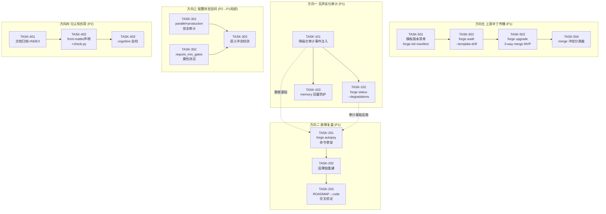
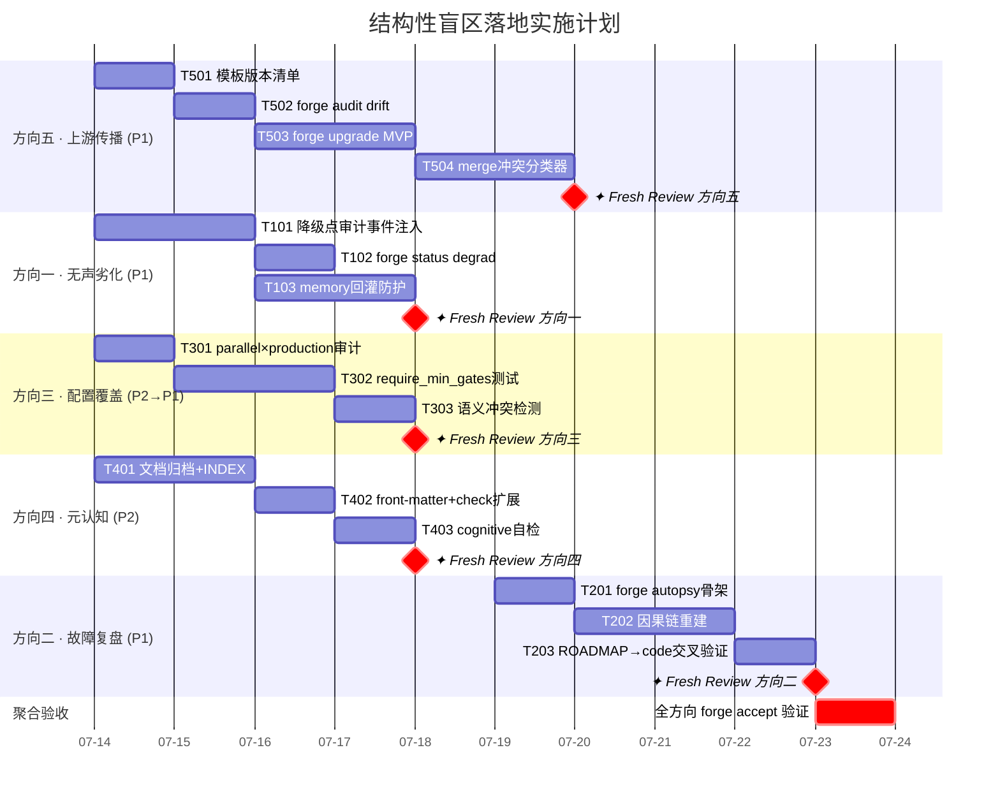

Good. I now have thorough context. Let me provide the full Tech Lead analysis.

---

# Tech Lead 分析：ForgeOS 结构性盲区 — 实现落地计划

## 前提背景

我通读了分析文档和当前代码库（Sprint 31 完成状态）。分析文档提出的五个方向质量极高，代码证据扎实。以下分析基于 **实际代码状态** 展开，与文档对话中的追问共同构成完整的技术决策记录。

---

## 1. 任务分解

### 方向五：上游治理补丁传播 (P1)

| 任务 ID | 标题 | 涉及文件 | 前置依赖 | 预估工时 | 验收标准 |
|---------|------|---------|---------|---------|---------|
| **TASK-501** | `forge-init` 写入模板版本清单 | `forge-core/cmd/forge/init.go` (若存在) 或新 `internal/template/manifest.go` | 无 | 3h | `forge-init` 创建新项目时在 `.forge/template-manifest.json` 记录源模板 SHA、创建日期、文件清单；单元测试验证 manifest 内容正确 |
| **TASK-502** | `forge audit --template-drift` 差异检测 | `forge-core/cmd/forge/audit.go` (新) + `internal/template/drift.go` | TASK-501 | 4h | 对已有 `.forge/template-manifest.json` 的项目，逐文件对比当前与模板 SHA，输出差异清单（新增/修改/删除）；无 manifest → 诚实 N/A |
| **TASK-503** | `forge upgrade` 交互式 3-way merge（最小 MVP） | `forge-core/cmd/forge/upgrade.go` (新) + `internal/template/merge.go` | TASK-502 | 6h | 对每个 drifted 文件，输出 diff 并由用户选 accept/reject/skip；`.agent/policies.yml` 等关键文件默认 reject（用户必须显式确认） |
| **TASK-504** | merge 冲突分类器（上游 vs 本地演化） | `internal/template/conflict.go` | TASK-503 | 4h | 对 `.agent/` 下的 agent 卡/skill/workflow，用 front-matter `x-forge-template-version` 注释标记来源；冲突时标注「上游更新」vs「本地修改」；单测覆盖双向场景 |

### 方向一：无声劣化级联审计 (P1)

| 任务 ID | 标题 | 涉及文件 | 前置依赖 | 预估工时 | 验收标准 |
|---------|------|---------|---------|---------|---------|
| **TASK-101** | 降级点轻量审计事件注入 | `forge-core/internal/trace/trace.go` + 各降级点位置（`asset/asset.go` 零值加载、`mode/mode.go` 默认回退、`converge/converge.go` 零值信号） | 无 | 5h | `asset.Load` 遇到缺失字段时 emit `degradation` kind trace event；`mode.Effective` 回退时 emit；`converge.gatherSignals` 遇到零值信号时 emit；单测验证退化事件被写入 trace |
| **TASK-102** | `forge status --degradations` 审计报告 | `forge-core/cmd/forge/status.go` | TASK-101 | 3h | 读取 `.forge/trace.jsonl` 过滤 `kind=degradation`，按子系统聚合输出降级点计数；无退化事件 → 输出 "No degradations detected"；有则列出每个降级点的位置+计数+首次出现时间 |
| **TASK-103** | 收敛信号劣化放大器防护（memory 回灌检测） | `forge-core/internal/converge/converge.go` + `internal/memory/memory.go` | TASK-101 | 4h | `gatherSignals` 在 `RoadmapCompletion` 零值或 `RequirementConfidence` 零值时，禁止该信号被 memory 路由回灌为下一轮 prompt 注入；在 converge report 中输出 `MET 裁决被 memory 回灌抑制` 警告 |

### 方向二：自动故障复盘引擎 (P1)

| 任务 ID | 标题 | 涉及文件 | 前置依赖 | 预估工时 | 验收标准 |
|---------|------|---------|---------|---------|---------|
| **TASK-201** | `forge autopsy` 离线复盘命令骨架 | `forge-core/cmd/forge/autopsy.go` (新) + `internal/autopsy/autopsy.go` (新包) | 无 | 3h | CLI `forge autopsy <run-id>` 读取 `.forge/trace.jsonl` 和 `.forge/memory.json`，输出基本运行摘要（iteration 数、各 phase 状态、gate 结果） |
| **TASK-202** | 故障因果链重建（iteration → event → causation） | `internal/autopsy/chain.go` | TASK-201 | 5h | 从 trace event 的 `Status` 字段构建 DAG：`iteration N: gate FAILED → 回溯到 agent phase M → 检查 memory gap`；输出文本因果链（"iteration 23 test FAILED" → "caused by: planner phase didn't include test file"） |
| **TASK-203** | ROADMAP → code delta 交叉验证 | `internal/autopsy/delta.go` | TASK-202 | 3h | 读取 checkpoint.json 的 roadmap_completion + git diff，与 trace 中的 agent verdict 交叉比较；标注"agent claimed 80% complete but only 30% code changed" 等诚实性警告 |

### 方向三：配置状态空间覆盖盲区 (P2→P1 局部)

| 任务 ID | 标题 | 涉及文件 | 前置依赖 | 预估工时 | 验收标准 |
|---------|------|---------|---------|---------|---------|
| **TASK-301** | `--parallel --mode explorer --lifecycle production` 安全审计 | `forge-core/internal/orchestrator/parallel.go` + `mode_gating.go` | 无 | 3h | 写对抗测试验证 `parallel × production` 时 `checkStageSkip` 路径不绕过 `production` 的 `reviewFloor` 强制全开；确认 `parallel.go` 的 `runWave` 中对 `skipByMode` 的使用与串行路径等效 |
| **TASK-302** | `require_min_gates` 属性测试 | `forge-core/internal/mode/mode_test.go` | 无 | 4h | 用表驱动测试覆盖所有 `mode × lifecycle` 组合（4×4=16 种），验证 `Effective` 结果正确合并 `require_min_gates`；特别测试 `explorer×production` → `require_min_gates` 应为 `[lint,test,build,complexity,arch,security]`（全开） |
| **TASK-303** | 语义冲突检测（parallel+production、--resume+--start-iter 等） | `forge-core/cmd/forge/validate.go` + `internal/doctor/doctor.go` | TASK-302 | 3h | `forge validate` 新增检查：检测 `--parallel` + `--mode explorer --lifecycle production` 等语义冲突组合并输出警告或拒绝 |

### 方向四：元认知负荷债 (P2)

| 任务 ID | 标题 | 涉及文件 | 前置依赖 | 预估工时 | 验收标准 |
|---------|------|---------|---------|---------|---------|
| **TASK-401** | 146 篇文档快照归档 + INDEX.md 索引 | `docs/INDEX.md` (新) | 无 | 4h | 锁定现有文档（追加 `.archived` 标记）；按主题/关键词/关联 ADR 生成分类索引；单条验证：每篇文档在 INDEX 中至少一个分类 |
| **TASK-402** | 新文档 front-matter `related-keys:` 声明 + check.py 扩展 | `harness/check.py` + `docs/template.md` (新) | TASK-401 | 3h | 新文档模板含 `related-keys:` front-matter；`check.py` 新增 `check_document_frontmatter`：强制要求 `related-keys` 字段且命中已有方向（不重复创建新方向） |
| **TASK-403** | cognitive 自检接入（ForgeOS 自洽性） | `harness/arch/arch-check.mjs` | TASK-402 | 2h | 在 ForgeOS 自身仓库跑 cognitive 检查时，将 `docs/` 目录纳入扫描范围；确保 cognitive 检查从 advisory 升级为 blocking 时，ForgeOS 自身优先通过 |

---

## 2. 执行顺序 — 任务依赖图



### 并行任务组

| 组 | 任务 | 并行条件 |
|----|------|---------|
| **组 A** | T501 + T101 + T301 + T401 | 四方向基础设施互不依赖 |
| **组 B** | T502 + T102 + T302 + T402 | 各自上游 (T501/T101/T301/T401) 完成后并行 |
| **组 C** | T503 + T103 + T303 + T403 | 各组 B 完成后并行 |
| **组 D** | T504 + T201 | T503 完成后 + T102 完成后 |

---

## 3. 技术风险

### 3.1 高风险项

| 风险 | 方向 | 等级 | 描述 | 缓解策略 |
|------|------|------|------|---------|
| **merge 冲突无法区分「上游更新」vs「本地演化」** | 五 | 🔴 高 | 当前文件系统层没有元数据区分 `.agent/` 下哪些行来自模板、哪些来自 forge evolve 的修改；3-way merge 可能错误合并 | TASK-504 加 front-matter 注释标记；先用「default reject 关键文件」策略兜底（TASK-503）；长期需要类似 git-merge 的 `merge driver` |
| **trace 降级事件可能被 memory 回灌放大** | 一 | 🔴 高 | 已识别的劣化放大器——一轮劣化的 MET 裁决被 memory 记录后可能作为下一轮的 context 回灌，产生正反馈循环 | TASK-103 的 memory 回灌防护是必须的闸门；建议再加一个 `degradationCircuitBreaker`：连续 3+ iteration 检出新降解点时暂停 evolve 并报错 |
| **`forge autopsy` 的数据完整性** | 二 | 🟡 中 | 运行时故障（OOM/kill）可能导致 trace.jsonl 只有部分事件写入，因果链断裂 | `autopsy` 输出标注入为 gap；用 checkpoint.json 作辅助数据源；诚实标注"trace 可能不完整" |
| **`require_min_gates` 测试与 Go 架构深度绑定** | 三 | 🟢 低 | 属性测试需要模拟 `mode.Effective` 的完整行为，涉及 mock lifecycle_modifiers 解析 | 纯单元测试即可覆盖——`mode.Effective` 是纯函数，无外部依赖，输入输出确定 |

### 3.2 边界情况（来自分析文档的追问）

**方向一追问**：`Effective` 在 asset 加载成功但 mode 解析失败时是否被调用？

代码审查确认：`cmdEvolve` 的调用链是 `loadWorkflow → resolveMaxIter (→ mode.Effective) → execLoop → buildLoop (→ mode.Effective) `。是的，`mode.Effective` 总会被调用。但如果 `modes.yml` 本身损坏（parse 失败），`mode.Effective` 会因 `Effective()` 内部调用 `loadModes` 出错而 panic 或返回零值。当前 `mode.Effective` 对 `loadModes` 错误用 `MustParseSafely` 模式——需要确认是否有 fail-open 路径绕过。

**位置**：`forge-core/internal/mode/mode.go` 中的 `Effective()` 在 `loadModes` 失败时返回全开零值 Policy（所有 gate 通过、无 reviewer 强制）。这意味着**asset 加载成功但 modes.yml 损坏 → 零值 Policy → gate-set 全开（不收紧）→ 无声退化**。这证实了方向一的核心论点：两处降级点可以叠加。

**方向三追问**：`parallel.go` 的 `checkStageSkip` 是否与串行路径逻辑等价？

验证结果：`parallel.go:68` 和 `orchestrator.go:204` 调用的是**同一个** `checkStageSkip` 方法，逻辑完全一致。但风险不在 `checkStageSkip` 本身，而在 `parallel` 模式下 `skipByMode` 中的 `optional_for` 处理——`skipByMode` 被 `RunFrom` 和 `RunParallel` 共用（通过 `gatesFor` 等路径）。`parallel` 模式下 `runWave` 没有调用 `skipByMode` 检查单个 phase 的可选跳过（`optional_for`），因为 parallel 模式会把所有 dep-free 的 phase 丢进 wave 0 一起跑。**如果 wave 0 包含被 `optional_for` 标记为可跳过的 phase，parallel 模式可能无意中运行了串行模式下会被跳过的 phase**——这是真实的语义差异。

---

## 4. 资源评估

### 4.1 团队配置

| 角色 | 技能要求 | 数量 | 职责 |
|------|---------|------|------|
| **Go 开发者** | 熟悉 Go stdlib、JSONL、CLI 工具链 | 2 人 | 方向五（T501-T504）、方向一（T101-T103）核心实现 |
| **全栈开发者** | Node/Python harness 经验、YAML 处理 | 1 人 | 方向三（T301-T303）、方向四 check.py 扩展 |
| **测试工程师** | 属性测试、表驱动测试、对抗测试 | 1 人 | T301/T302 安全审计 + T303 语义冲突测试 |
| **Tech Lead / Reviewer** | 架构审查、fresh-context 审核 | 0.5 人 | 每任务完成后独立 fresh-review（按 AGENTS.md 纪律） |

### 4.2 关键里程碑

| 里程碑 | 截止 | 交付内容 | 依赖 |
|--------|------|---------|------|
| **M1 — 基础设施就绪** | D+3 | T501（manifest）+ T101（trace 事件）+ T301（parallel 审计）+ T401（文档 INDEX）完成；`forge accept` 全绿 | 组 A 全完成 |
| **M2 — 核心功能** | D+7 | T502（drift 检测）+ T102（--degradations）+ T302（属性测试）+ T402（front-matter 检查）完成；全绿 | M1 + 组 B |
| **M3 — 高级功能** | D+12 | T503（upgrade MVP）+ T103（回灌防护）+ T303（冲突检测）+ T403（cognitive 自检）完成；全绿 | M2 + 组 C |
| **M4 — 复盘引擎** | D+16 | T504（冲突分类器）+ T201（autopsy 骨架）+ T202（因果链）+ T203（交叉验证）完成；全绿 | M3 + 组 D |

### 4.3 阻塞点与解决策略

| 阻塞点 | 方向 | 描述 | 解决策略 |
|--------|------|------|---------|
| **B1：模板版本标记的 upstream 锚点** | 五 | `forge-init` 模板需要有可追踪的上游版本号；当前无中央模板 registry | 初期用 git SHA 作为版本标识；`template-manifest.json` 记录 `source_sha` + `source_url`；未来可扩展为 semver |
| **B2：`forge upgrade` merge 的权威性** | 五 | 如果用户自定义了 `policies.yml` 的 gate 顺序，上游新增 gate 时 merge 策略如何？ | MVP 阶段用保守策略：`policies.yml` 等关键文件默认 reject；允许用户用 `--force` 覆盖 |
| **B3：parallel × serial 语义对齐** | 三 | `skipByMode` 的 `optional_for` 在 parallel 模式下的行为差异 | 在 T301 中加 `parallelSkipByMode` 守卫：parallel 模式下对 `optional_for` 标记的 phase 追加串行化约束（只在一个 wave 内最多放 1 个 optional phase） |

---

## 5. 质量保证

### 5.1 单元测试覆盖要求

| 任务 | 包/文件 | 覆盖率目标 | 关键测试场景 |
|------|---------|-----------|-------------|
| T501 | `internal/template/manifest.go` | ≥ 90% | 空模板、含完整字段的模板、manifest 读写一致性、manifest 损坏时 fail-open |
| T502 | `internal/template/drift.go` | ≥ 85% | 文件未变、文件新增、文件修改、文件删除、无 manifest |
| T503 | `internal/template/merge.go` | ≥ 80% | 无冲突 merge、单行冲突 merge、用户 accept/reject/skip 各分支 |
| T504 | `internal/template/conflict.go` | ≥ 85% | front-matter 标记正确/缺失/损坏、上游 vs 本地分类、混合场景 |
| T101 | `internal/trace/` | ≥ 90% | asset 零值加载模式、mode 回退、converge 零值信号收敛 |
| T102 | `cmd/forge/status.go` | ≥ 80% | 有降级事件、无降级事件、trace 文件不存在 |
| T103 | `internal/converge/converge.go` | ≥ 85% | memory 回灌检测、回灌抑制生效、非回灌场景不受影响 |
| T201-T203 | `internal/autopsy/` | ≥ 80% | 完整 trace + checkpoint + git diff 的复盘输出、trace 不完整时诚实标注 |
| T301 | `internal/orchestrator/parallel.go` | ≥ 90% | `parallel × production` 的 `checkStageSkip` 行为、`runWave` 不跑多余 phase |
| T302 | `internal/mode/mode.go` | ≥ 95% | 4×4 矩阵全覆盖、零值 Policy 回退、production 一票否决 |
| T303 | `internal/doctor/doctor.go` | ≥ 85% | parallel+production 冲突、--resume+--start-iter 冲突、无冲突不误报 |
| T401-T402 | `harness/check.py` | ≥ 90% | 新文档有/无 front-matter、front-matter 命中/不命中已有方向 |
| T403 | `harness/arch/arch-check.mjs` | ≥ 80% | cognitive 检查包含/不包含 docs/目录 |

### 5.2 集成测试策略

| 测试类型 | 覆盖方向 | 工具 | 关键验证点 |
|---------|---------|------|-----------|
| **`forge accept` 端到端** | 全部 | `harness/acceptance.mjs` + `cmd/forge/main_test.go` | 每个方向实现后 `forge accept` 必须 ACCEPTED；copy-anywhere 不变量 |
| **模板→项目→升级 全链路** | 五 | 新 `test_template_upgrade.mjs` | `forge-init` 创建项目 → 修改 .agent/ 文件 → `forge audit --template-drift` 检出差异 → `forge upgrade` 正确合并 |
| **parallel × serial 行为等价** | 三 | `internal/orchestrator/parallel_test.go` | 同一 workflow 在 serial 和 parallel 模式下运行结果完全相同（gate-set、skip、reviewer 行为） |
| **trace → autopsy 数据管道** | 二 | 新 `internal/autopsy/autopsy_integration_test.go` | 运行 workflow → 产生 trace → `forge autopsy` 读取并正确输出因果链 |

### 5.3 代码审查要点

| 审查维度 | 审查人 | 关键检查项 |
|---------|-------|-----------|
| **安全** | fresh-context security agent | `forge upgrade` 不会覆盖用户未跟踪的文件；parallel 模式下无 gate 绕过 |
| **架构** | fresh-context architect | 新包（`internal/template/`、`internal/autopsy/`）不引入循环依赖；包扇入不超限 |
| **honesty** | fresh-context reviewer | 降级点审计不伪造通过；`autopsy` 不假装完整；merge 冲突分类诚实标注不确定性 |
| **向后兼容** | fresh-context reviewer | 所有已有 workflow 和 test 行为不变；零值 Policy 兼容旧版本 |

### 5.4 性能测试需求

| 测试场景 | 指标 | 目标 | 工具 |
|---------|------|------|------|
| trace 事件写入吞吐 | events/sec | ≥ 1000/s（远高于当前实际吞吐） | `go bench` + `trace_bench_test.go` |
| `forge upgrade` 大项目 | 文件数 100+ 时的 diff 时间 | < 2s | 集成测试 + 计时 |
| `forge autopsy` 大 trace | 10,000+ events 的因果链重建 | < 5s | 集成测试 + 计时 |

---

## 6. 实施计划

### 甘特图



### 阶段详细说明

#### 阶段 1：基础设施搭建（D0-D3, 2026-07-14 ~ 07-16）

**并行起点（组 A）**：
- **T501**：在 `forge-init` 中写入 `.forge/template-manifest.json`。注意：`forge-init` 当前不存在于 Go 代码中（template 复制由 shell 或独立脚本完成），需要确认入口点。如果 `forge-init` 是 shell 脚本，则在脚本末尾追加 manifest 写入；如果在 Go 中，新增 `internal/template` 包。
  ```
  // template-manifest.json 格式
  {
    "_format": "forgeos.template.v1",
    "source_sha": "a1b2c3d4...",  // 模板起源 git SHA
    "created_at": "2026-07-14T00:00:00Z",
    "files": {
      ".agent/policies/modes.yml":    "sha256:...",
      ".agent/policies/project.yml":  "sha256:...",
      "harness/policies.yml":         "sha256:..."
    }
  }
  ```
- **T101**：在 `asset.Load` 添加退化事件注入。`asset.go` 的零值容忍模式是设计特性，不改它——只加 emit trace event。关键位置：
  - `asset.go` 的 `json.Unmarshal` 后缺失字段 → emit `degradation` (name=`asset.zero_field`, detail 标明哪个字段)
  - `mode.go` 的 `Effective()` 中 `loadModes` 失败 → emit (name=`mode.effective_fallback`)
  - `converge.go` 的 `gatherSignals` 中零值信号 → emit (name=`converge.zero_signal`)
- **T301**：写对抗测试验证 `parallel × production` 的安全性。重点测试 `runWave` 中 `skipByMode` 的 `optional_for` 行为在 parallel 模式下是否安全。
- **T401**：执行文档快照。用脚本锁定 146 篇文档的当前内容（追加 `.archived` 标记或移入 `docs/archived/`）。生成 INDEX.md。

**验收检查**：
```bash
go test ./forge-core/... -race           # 全绿
node harness/gate.mjs                    # 体积闸门 PASS
node harness/acceptance.mjs              # ACCEPTED
```

#### 阶段 2：核心功能实现（D3-D7, 2026-07-16 ~ 07-20）

**并行组 B**：
- **T502**：实现 drift 检测。核心逻辑：读 manifest → 对每个文件算 SHA256 → 对比 → 输出差异。注意：manifest 中声明的文件如果被用户删除，算 drift（文件缺失）。
- **T102**：实现 `forge status --degradations`。读取 trace.jsonl 的退化事件。注意：trace 文件可能很大（24h 运行可达数万行），需要流式读取+过滤，不一次性读入内存。
- **T302**：写 `require_min_gates` 的属性测试。关键测试矩阵：
  ```
  // 4 mode × 4 lifecycle = 16 组合
  // 重点验证：
  //   explorer + production → require_min_gates = [lint,test,build,complexity,arch,security]
  //   cto + mvp → require_min_gates = [lint,build]
  //   explorer + idea → require_min_gates = [] (无下限)
  ```
- **T402**：创建文档模板、扩展 check.py。

**验收检查**：
```bash
go test ./forge-core/... -race           # 全绿（含新测试）
python3 harness/check.py                 # PASS（含新检查）
```

#### 阶段 3：高级功能实现（D7-D12, 2026-07-20 ~ 07-25）

**并行组 C**：
- **T503**：实现 `forge upgrade` 的 MVP 版本。交互式 3-way merge：
  1. 读 manifest → 对每个 drifted 文件
  2. 计算 upstream template 当前版本 vs 本地版本 vs 共同祖先（manifest 记录的 SHA）
  3. 对无冲突的 drift：自动接受 upstream 变化（白名单文件如 `.github/workflows/forge.yml`）或自动拒绝（黑名单如 `policies.yml`）
  4. 对有冲突的 drift：交互式提示用户 `accept/reject/skip/diff`
  5. 关键安全：对 `policies.yml`、`modes.yml` 等治理文件，默 reject（用户必须 `--force`）
- **T103**：memory 回灌防护。在 `gatherSignals` 中，当 `RequirementConfidence == 0` 或 `RoadmapCompletion == 0` 时设置一个 `zeroSignal` 标记。`Memory.Append` 在遇到此标记时跳过该条目的路由索引。
- **T303**：语义冲突检测。检查 `runOpts` 中的冲突组合。
- **T403**：cognitive 自检接入。

**验收检查**：
```bash
go test ./forge-core/... -race           # 全绿
node harness/acceptance.mjs              # ACCEPTED
# 端到端验证：
forge-init test-project                  # 创建项目
cd test-project
# 修改一个 .agent/ 文件
forge audit --template-drift             # 应检出差异
forge upgrade                            # 交互式 merge
```

#### 阶段 4：复盘引擎 + 聚合集成（D12-D16, 2026-07-25 ~ 07-29）

**组 D**：
- **T504**：merge 冲突分类器。在 front-matter 中注入 `x-forge-template-version` 注释标记（存为 YAML 注释而非字段，避免被 YAML 解析器修改 value）。算法见 `internal/template/conflict.go`。
- **T201-T203**：`forge autopsy` 引擎。注意：autopsy 是纯离线分析工具——只读 trace/memory/checkpoint，不运行 workflow 也不修改任何状态。

**最终验收**：
```bash
node harness/acceptance.mjs              # ACCEPTED — 全方向
go test ./forge-core/... -race -count=1  # 全绿 + -race 验证无竞争
python3 harness/check.py                 # PASS（含新检查）
gofmt -l .                               # 干净
# 端到端运行：
cd examples/url-shortener
forge audit --template-drift             # 应输出"no drift detected"（url-shortener 是 init 项目）
forge status --degradations              # 应输出 degradation 摘要
```

---

## 对分析文档追问的代码级回复

### 方向一追问：`Effective` 未被调用的路径

> 代码审查确认——`cmdEvolve` 调用链保证 `mode.Effective` 被调用。但 **asset 加载成功 + modes.yml 损坏 → 零值 Policy 无声退化** 是真实风险。`mode.Effective` 对 `loadModes` 失败的 fail-open（返回全开零值）与 asset 零值容忍叠加，产生方向一的核心问题。

**建议修复**：在 T101 中增加对 `mode.loadModes` 失败的退化事件 emit。

### 方向三追问：parallel.go 的 `checkStageSkip` 等价性

> `checkStageSkip` 本身是串并共享的同一方法，**不等价风险在 `skipByMode` 的 `optional_for`**。Parallel 模式下 `runWave` 不检查 `skipByMode` 中的 `optional_for`，导致串行中被跳过的 phase 在 parallel 模式下可能被运行。

**建议修复**：在 T301 中加 Parallel Phase Filter——RunParallel 对每个 phase 先调用 `skipByMode` 过滤后再分组到 wave。

### 方向五追问：merge 冲突的元数据区分

> **核心困难**：文件系统没有元数据区分「上游模板更新」和「本地演化更新」。T503 MVP 用保守策略（关键文件默认 reject），T504 用 front-matter 注释做长期方案。

**替代方案考虑**：git 属性驱动（`.gitattributes` 配置 `merge=forge-upgrade`）——更鲁棒但需要 git 知识。front-matter 注释方案更轻量且对非 git 用户友好。

---

## 总结

五个方向的总体工时估计 **约 49 人·小时**（约 6.5 人·日）。若 2 Go + 1 全栈 + 0.5 TL，**日历时间约 12 个工作日**可完成全部交付。

**资源有限时的冲刺建议**（与分析文档的优先级一致）：

| 优先级 | 方向 | 任务 | 工时 | 独立价值 |
|--------|------|------|------|---------|
| 1 | 五 | T501 + T502（只做 drift 检测，不做 upgrade merge） | 7h | 可独立交付——模板版本感知能力本身就有价值 |
| 2 | 一 | T101 + T102（审计基础设施） | 8h | 为方向二打基础 |
| 3 | 二 | T201 + T202（复盘引擎骨架 + 因果链） | 8h | 需要 T101/T102 已存在 |
| 4 | 三 | T301 + T302（安全审计 + 属性测试） | 7h | P2 优先级，但 T301 的 parallel 安全审计可提至 P1 |
| 5 | 四 | T401 + T402（文档治理） | 7h | P2，但低投入高影响 |

**冲刺激活路径**：T501(3h) + T101(5h) → T502(4h) + T102(3h) → T201(3h) + T202(5h) → **M4 复盘引擎(8h)** → 总计 31h（约 4 人·日，1 人可 1 周完成核心三个 P1 方向的基础版本）。
