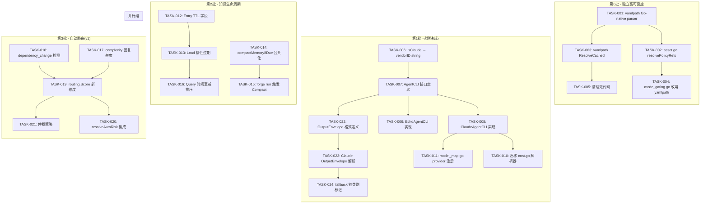

Now I have a thorough understanding of the codebase. Let me produce the comprehensive Tech Lead analysis.

---

# Tech Lead 分析报告：ForgeOS 方向性架构改进

## 总体评估

基于代码库取证（forge-core 13 个包，~260 Go 源文件）和上游分析文档，以下是对 5 个方向的**可执行任务分解**、**风险控制**和**实施规划**。

---

## 1. 任务分解

### 方向①：yamlpath 接入（第 0 批 — 独立、低风险）

| 任务 ID | 标题 | 涉及文件 | 前置依赖 | 工时 | 验收标准 |
|---------|------|---------|---------|------|---------|
| TASK-001 | yamlpath 添加 Go-native YAML 解析器（替代 python shim） | `internal/yamlpath/parser.go`（新）、`internal/yaml2json/yaml2json.go`（复用 block_scalar/normalize） | 无 | 4h | `yamlpath.Resolve` 无需 `python3`；Go-native YAML 1.1 subset 可通过现有 `yaml2json` test suite |
| TASK-002 | asset.go 添加 `resolvePolicyRefs()` post-processing | `internal/asset/asset.go`（新增 `resolvePolicyRefs` 方法）、`internal/asset/asset_test.go` | TASK-001 | 2h | `LoadWorkflowJSON` decode 后自动解析所有 `RequiredWhen` 中的 `#` 路径引用 |
| TASK-003 | yamlpath 添加 `ResolveCached`（避免每次 fork python） | `internal/yamlpath/yamlpath.go`（新增 `cache` 字段 + `ResolveCached` 方法）、`internal/yamlpath/yamlpath_test.go` | TASK-001 | 2h | 同文件同引用第 2 次调用命中 LRU cache，0 syscall |
| TASK-004 | mode_gating.go `requiredWhenKey()` 改用 yamlpath 解析 | `internal/orchestrator/mode_gating.go`（替换 `strings.LastIndex` 调用）、`internal/orchestrator/orchestrator_modegating_test.go` | TASK-002 | 1h | `requiredWhenKey("policies/modes.yml#workflow_depth.reviewer")` → `"reviewer"`；行为与当前 `LastIndex` 完全一致 |
| TASK-005 | 清理死代码：移除 python shim 依赖声明 | `internal/yamlpath/yamlpath.go`（删除 `ShimPath` 函数引用） | TASK-001 | 0.5h | `ShimPath` 不再被任何生产代码引用（仅保留在注释中） |

**方向① 总计：~9.5h（1.2 sprint）**

---

### 方向②：全链路厂商抽象（第 1 批 — P1 战略价值）

| 任务 ID | 标题 | 涉及文件 | 前置依赖 | 工时 | 验收标准 |
|---------|------|---------|---------|------|---------|
| TASK-006 | 将 `isClaude bool` 升级为 `vendorID string` | `cmd/forge/engine_build.go`（`agentExecutor` 签名变更）、`cmd/forge/engine_build_test.go` | 无 | 2h | 《新增枚举》`vendorID` 输出 `"claude"` / `"echo"` / `"unknown"`；所有分支行为不变 |
| TASK-007 | 定义 `AgentCLI` 接口（含 `ArgvBuilder` + `OutputParser` + `OverloadClassifier`） | `cmd/forge/cli_interface.go`（新） | TASK-006 | 3h | 接口定义覆盖 `claudeArgv`、`parseClaudeCostUsd`、`classifyClaudeOverload`、`unwrapClaudeResult` 四个 seam；现有测试全部通过 |
| TASK-008 | 实现 `ClaudeAgentCLI` 结构体（从 `isClaude` 分支迁移逻辑） | `cmd/forge/claude_agent.go`（新）、`cmd/forge/claude_agent_test.go`（新） | TASK-007 | 4h | 原 `isClaude` 分支的 6 个 seam 全部迁移至 `ClaudeAgentCLI`；`engine_build.go` 中只保留 `if vendorID=="claude"` 分发 |
| TASK-009 | 实现 `EchoAgentCLI`（用于验证接口完备性） | `cmd/forge/echo_agent.go`（新）、`cmd/forge/echo_agent_test.go`（新） | TASK-007 | 3h | `--executor command --agent-cmd echo` 完整走通 `ArgvBuilder` → `Executor` → `OutputParser` 链；`RenderLog` 输出原始 stdout |
| TASK-010 | 迁移 `cost.go` 的 Claude-specific 解析器到 `ClaudeAgentCLI.OutputParser` | `cmd/forge/cost.go`（移动 `parseReviewerVerdict`、`parseExecutiveVerdict`、`parseConfidenceScore`）、`cmd/forge/cost_test.go` | TASK-008 | 4h | 所有解析器作为 `OutputParser` 方法暴露；`cost_confidence_test.go` 和 `detect_parsers_test.go` 全部通过 |
| TASK-011 | `model_map.go` 添加 provider 注册表（支持多厂商模型名映射） | `cmd/forge/model_map.go`（新）、`internal/routing/routing.go`（调整 `Provider`/`ModelMap`） | TASK-006 | 2h | `routing.ResolveModel("openai", "gpt-4o")` → `"gpt-4o"`；`"anthropic"` 作为默认提供者 |

**方向② 总计：~18h（2.25 sprint）**

---

### 方向③：跨会话知识生命周期（第 2 批 — 独立、长期运行刚需）

| 任务 ID | 标题 | 涉及文件 | 前置依赖 | 工时 | 验收标准 |
|---------|------|---------|---------|------|---------|
| TASK-012 | `Entry` 结构体添加 `TTL` 和 `ExpiresAtUnix` 字段 | `internal/memory/memory.go`（修改 `Entry` struct）、`internal/memory/memory_test.go` | 无 | 1h | 新字段序列化/反序列化通过；旧 JSONL 行 decode 后缺省值为 0（无限期） |
| TASK-013 | `Load()` 增加惰性过期（跳过 `ExpiresAtUnix < now` 的 entry） | `internal/memory/memory.go`（修改 `decode` 或 `Load` 的 entry 后处理）、`internal/memory/memory_test.go` | TASK-012 | 2h | 过期 entry 在 `Load` 返回结果中被过滤；`Load` 不修改磁盘文件 |
| TASK-014 | `compactMemoryIfDue` 暴露为公共工具函数（供 `forge run` 调用） | `internal/memory/memory_compact.go`（提取 `CompactIfDue`）、`cmd/forge/evolve.go`（调整调用点） | 无 | 2h | `CompactIfDue(path, threshold, keepPerKind, ageSeconds)` 可被 `forge run` 和 `forge evolve` 共用 |
| TASK-015 | `forge run` pre-phase 钩子触发 `CompactIfDue` | `cmd/forge/engine_build.go`（`buildRunEngine` 入口处或 `main.go` 的 `execEngine`）、`cmd/forge/run_budget_test.go` | TASK-014 | 1h | `forge run` 在有 caches 超过 threshold 的 memory store 时自动触发 Compact |
| TASK-016 | `Query` 添加时间衰减排序因子（可选） | `internal/memory/memory.go`（新增 `QueryWithDecay` 方法） | TASK-012 | 3h | 新排序因子按 `CreatedAtUnix` 线性衰减；默认行为不变（零值参数回退到原排序） |

**方向③ 总计：~9h（1.1 sprint）**

---

### 方向④：运行时自动路由（第 3 批 — 依赖厂商抽象完成后）

| 任务 ID | 标题 | 涉及文件 | 前置依赖 | 工时 | 验收标准 |
|---------|------|---------|---------|------|---------|
| TASK-017 | 新增 `internal/risk/complexity.go` — 圈复杂度估算器 | `internal/risk/complexity.go`（新）、`internal/risk/complexity_test.go`（新） | 无 | 4h | 对 Go 文件实现函数级圈复杂度估算（Mc-Cabe 简化版）；对 git diff 返回新增文件的复杂度统计 |
| TASK-018 | 扩展 `risk_diff.go` — 添加 `dependency_change` 维度 | `internal/risk/risk_diff.go`（增加 `dependencyChangePaths` 方法）、`internal/risk/risk_diff_test.go` | 无 | 3h | 使用 `internal/asset` 的导入解析 + 已有 `arch-check.mjs` 的导入图对 `go.mod`/import 变更打标签 |
| TASK-019 | 在 `routing.Score` 中添加 `complexity` 和 `dependency_change` 维度权重 | `internal/routing/routing.go`（新增权重条目） | TASK-017、TASK-018 | 1h | 新增维度参与加权求和；零值输入不影响已有 score |
| TASK-020 | `resolveAutoRisk` 中接入新维度（`forge run`/`evolve` 集成） | `cmd/forge/engine_build.go`（`resolveAutoRisk` 内调用 complexity/dependency 检测） | TASK-019 | 2h | `forge run` 在 git 有变更时输出 `complexity=<N>` 和 `dependency_change=<N>` 到 log |
| TASK-021 | `phaseTierResolver` 增加仲裁策略：当各维度信号冲突时使用 max(risk) 而非加权和 | `cmd/forge/engine_build.go`（新增 `resolveTierConflict` 函数）、`cmd/forge/engine_build_test.go` | TASK-020 | 3h | 仲裁策略文档化；`complexity=low` 但 `risk=critical` 时选择 `Opus` 而非加权结果 |

**方向④(v1) 总计：~13h（1.6 sprint）**

---

### 方向⑤：结构化输出契约（附入方向② — 不独立排期）

| 任务 ID | 标题 | 涉及文件 | 前置依赖 | 工时 | 验收标准 |
|---------|------|---------|---------|------|---------|
| TASK-022 | 定义 `OutputEnvelope` 版本化格式（version/verdict/confidence/timestamp） | `cmd/forge/cli_interface.go`（加入 `OutputEnvelope` 接口定义） | TASK-007 | 1h | 定义遵循 "fail-closed"：未知 version 时返回 parse error |
| TASK-023 | `ClaudeAgentCLI.OutputParser` 实现 `OutputEnvelope` 解析 | `cmd/forge/claude_agent.go`（实现 `ParseEnvelope` 方法） | TASK-022、TASK-010 | 2h | `parseReviewerVerdict`、`parseConfidenceScore` 从信封解析而非末行匹配 |
| TASK-024 | 统一 fallback 链：`parseReviewerVerdict` → `parseExecutiveVerdict` → `parseConfidenceScore` 增加类别标记 | `cmd/forge/cost.go`（修改 fallback 链返回值）、`cmd/forge/prompt_context.go`（`observeFor` 适配新版 fallback） | TASK-023 | 1h | fallback 返回值携带 `(value, category, ok)` 三要素；`confidence` 与 `verdict` 不再混用 |

**方向⑤ 总计：~4h（附入方向②，不独立计算）**

---

## 2. 执行顺序：任务依赖图



### 可并行执行的任务组

| 并行组 | 任务 | 条件 |
|--------|------|------|
| **P0** | TASK-001（yamlpath native）↔ TASK-006（vendorID）↔ TASK-012（TTL 字段）↔ TASK-017（complexity）↔ TASK-018（dependency） | 无代码重叠；5 人可同时开工 |
| **P1** | TASK-014（Compact 公共化）↔ TASK-007（AgentCLI 接口定义） | 无代码重叠 |
| **P2** | TASK-008（ClaudeAgentCLI）↔ TASK-013（Load 惰性过期） | 无代码重叠 |

---

## 3. 技术风险

### 3.1 高风险项

| 风险 | 影响方向 | 概率 | 影响程度 | 缓解策略 |
|------|---------|------|---------|---------|
| yamlpath Go-native 解析器对 YAML 1.1 边缘 case 覆盖不足 | ① | 中 | 高（回退到 python shim 则抵消价值） | 先用 `internal/yaml2json` 已有 parser 做 subset；对不支持的 YAML 结构显式返回错误而非静默解析错误 |
| `AgentCLI` 接口定义过泛或过窄 | ② | 中 | 高（接口不稳定导致后续重构） | 先实现 `EchoAgentCLI` 验证接口完备性（TASK-009 严格在 TASK-008 之前或同时） |
| `forge run` 触发 `CompactIfDue` 时引入竞态条件 | ③ | 低 | 中 | `CompactIfDue` 使用文件级锁（`flock` on unix）；JSONL 的 O_APPEND 写入是原子的 |
| 圈复杂度估算器对非 Go 语言无效 | ④ | 高 | 中 | v1 只支持 Go（已有 `risk_diff.go` 的 `FromChangedPaths` 模式）；非 Go 项目降级为 `complexity=unknown` |

### 3.2 外部依赖风险

| 依赖 | 方向 | 风险描述 | 回退方案 |
|------|------|---------|---------|
| python3 + harness/yaml2json.py | ①（当前） | 每次 Resolve fork python3，~50ms 启动开销 | TASK-001 完成后消除此依赖 |
| git（git diff 生成变更路径） | ④ | `git` 命令不存在或版本过旧 | 无 git repo 时 `resolveAutoRisk` 返回空（已实现） |
| scorecards.json（Eval Engine 产出） | ②（HistoryTiebreak） | 格式变更或 IO 损坏 | `LoadScorecards` 已有 fail-loud-and-continue 模式 |

### 3.3 性能瓶颈

| 场景 | 当前瓶颈 | 优化策略 |
|------|---------|---------|
| `yamlpath.Resolve` 每次 fork python3 | ~50ms/call | TASK-003 的 `ResolveCached`（LRU）消除重复解析 |
| `memory.Load` 每次读全量 JSONL → 10k+ entries | ~10-50ms | 已有 `loadCache`（按 mtime 缓存）；TASK-013 的惰性过期减少 Load 后过滤 |
| `routing.HistoryTiebreak` 线扫 scorecards | <1ms（1000 entries） | 当前已足够；如果 scorecards 增长到 10k+ 需加索引 |

### 3.4 测试难点

| 难点 | 方向 | 策略 |
|------|------|------|
| 圈复杂度估算器需要大量真实代码样本验证 | ④ | 用 `forge-core` 自身的 ~260 个 .go 文件做基准测试；预期值手动标注 50 个代表性函数 |
| 厂商抽象接口的集成测试需要真实 Claude CLI | ② | `EchoAgentCLI` 提供无 LLM 的集成测试路径；Claude 特定路径只做单元测试 |
| memory TTL 过期的时间敏感性 | ③ | 重构 `time.Now()` 为可注入的 `clock interface`，测试时冻结时间 |

---

## 4. 资源评估

### 4.1 人员配置

| 角色 | 技能要求 | 数量 | 负责方向 |
|------|---------|------|---------|
| Go 高级工程师 | Go 标准库、YAML/JSON 处理、接口设计、测试驱动 | 2 人 | 方向①②③（核心） |
| Go 工程师 | Go 基础、git 操作、依赖图理解 | 1 人 | 方向④（v1） |
| QA 工程师 | 自动化测试、性能基准 | 1 人（半职） | 全部方向的测试和验收 |

### 4.2 关键里程碑

| 里程碑 | 时间 | 交付物 | 验收标准 |
|--------|------|--------|---------|
| **M0** | Day 5 | yamlpath Go-native + policy ref 接入 | `forge accept` 全绿；`mode_gating.go` 无 `strings.LastIndex` 调用 |
| **M1** | Day 15 | 厂商抽象 v1（vendorID + ClaudeAgentCLI + EchoAgentCLI） | 所有原有 `isClaude` 分支被接口替换；`echo` 模式走通完整 pipeline |
| **M2** | Day 20 | memory TTL + public Compact | `forge run` + `forge evolve` 均触发 Compact；过期 entry 不参与 Query |
| **M3** | Day 28 | 自动路由 v1（complexity + dependency + 仲裁） | `forge run --from-git` 输出包含新维度的路由日志 |
| **M4** | Day 30 | 发布就绪 | 全部 24 个任务通过验收；`harness/acceptance.mjs` 全绿；4 个方向 demo 可展示 |

### 4.3 阻塞点（Blockers）与解决策略

| Blocker | 方向 | 描述 | 解决策略 |
|---------|------|------|---------|
| B1 | ① | yamlpath Go-native parser 覆盖的 YAML subset 可能不足 | 不追求 100% 覆盖；不支持的结构显式报错（fail-closed）；紧急 case 保留 python shim fallback |
| B2 | ② | `AgentCLI` 接口的稳定性不确定 | 先用 2-3 天做接口原型 + EchoAgentCLI 验证；确认完备后再迁移 Claude 逻辑 |
| B3 | ④ | `complexity` 估算器缺少跨语言支持 | v1 限定 Go 文件；在 `risk_diff.go` 的路径过滤器中添加语言类型检测 |

---

## 5. 质量保证

### 5.1 单元测试覆盖要求

| 包 | 当前覆盖率 | 目标覆盖率 | 重点测试组件 |
|----|-----------|-----------|-------------|
| `internal/yamlpath` | ~70% | ≥90% | `Parse`、`Resolve`(native)、`walkPath`、边界 case（空路径、深度嵌套） |
| `cmd/forge`（engine_build） | ~60% | ≥85% | `phaseTierResolver`、`riskAdjustedTier`、`claudeArgv`、`agentExecutor` |
| `internal/memory` | ~80% | ≥90% | `Compact`、`Load`（惰性过期）、`QueryWithDecay`、`TTL` 序列化 |
| `internal/risk` | ~50% | ≥80% | `complexity` 估算、`dependencyChangePaths`、`Classify` 整合 |
| `internal/routing` | ~85% | ≥90% | `Score`（新维度）、`TierForScore`（仲裁策略） |

### 5.2 集成测试策略

| 测试场景 | 覆盖方向 | 策略 | 工具 |
|---------|---------|------|------|
| yamlpath policy ref 完整链路 | ① | 用 `testdata/policies/modes.yml` 实文件测试 `LoadWorkflowJSON` → `resolvePolicyRefs` → `mode_gating.go` | `go test -run TestPolicyRefResolution` |
| 厂商抽象完整 pipeline | ② | `EchoAgentCLI` 跑完整 `forge run`（dry-run 模式），验证 6 个阶段 log 输出正确 | `forge-core/cmd/forge/main_test.go` |
| memory TTL 集成 | ③ | 写入带 TTL 的 entry → 模拟时间推移 → Load 验证过期 | `clock.Mock` + `internal/memory/memory_test.go` |
| 自动路由端到端 | ④ | 创建 git 变更 → `forge run --from-git` → 验证 tier 选择包含 complexity/dependency 输入 | `forge-core/cmd/forge/route_test.go` |

### 5.3 代码审查要点

1. **接口设计审查**（方向②）：`AgentCLI` 的 3+ 方法签名是否覆盖所有 seam？`OutputEnvelope` 是否遵循 fail-closed？
2. **向后兼容审查**（全部方向）：旧 JSONL 格式的 `Entry` 无 `TTL` 字段，旧 workflow YAML 无 `policy ref` 声明——确保零值就是旧行为
3. **零外部依赖审查**（全部方向）：`go.mod` 无新增依赖；`internal/yamlpath` 的 native parser 只用 `encoding/json` + `strings`
4. **竞态审查**（方向③）：`CompactIfDue` 与并发 `Append` 同时发生时的行为

### 5.4 性能测试需求

| 测试 | 方向 | 方法 | 通过标准 |
|------|------|------|---------|
| yamlpath Resolve 延迟 | ① | Benchmark `ResolveCached` vs `Resolve`（1000 次调用） | `ResolveCached` P99 < 1ms（vs 原 ~50ms） |
| memory Load 10k entries | ③ | Benchmark `Load` 10k JSONL lines | < 100ms（含惰性过期过滤） |
| complexity 估算器 | ④ | Benchmark 对 forge-core 自身 260 文件 | < 200ms 全量扫描 |

---

## 6. 实施计划

```mermaid
gantt
    title ForgeOS 方向性架构改进 — 实施甘特图
    dateFormat  YYYY-MM-DD
    axisFormat  %m-%d

    section 第0批: yamlpath 接入
    TASK-001 Go-native YAML parser  :d1, 2026-07-14, 4h
    TASK-002 asset.go resolvePolicyRefs :d1, 2h
    TASK-003 yamlpath ResolveCached   :d1, 2h
    TASK-004 mode_gating.go 迁移     :d1, 1h
    TASK-005 清理死代码              :d1, 0.5h

    section 第1批: 厂商抽象(核心)
    TASK-006 isClaude→vendorID      :d2, 2026-07-15, 2h
    TASK-007 AgentCLI 接口定义       :d2, 3h
    TASK-008 ClaudeAgentCLI 实现     :d3, 2026-07-16, 4h
    TASK-009 EchoAgentCLI 实现       :d3, 3h
    TASK-010 cost.go 解析器迁移      :d4, 2026-07-17, 4h
    TASK-011 model_map.go           :d4, 2h

    section 第1批附: 结构化输出
    TASK-022 OutputEnvelope 定义     :d2, 1h
    TASK-023 Claude Envelope 解析    :d3, 2h
    TASK-024 fallback 类别标记       :d4, 1h

    section 第2批: 知识生命周期
    TASK-012 Entry TTL 字段          :d5, 2026-07-21, 1h
    TASK-013 Load 惰性过期           :d5, 2h
    TASK-014 CompactIfDue 公共化     :d5, 2h
    TASK-015 forge run 触发 Compact  :d5, 1h
    TASK-016 Query 时间衰减排序      :d6, 2026-07-22, 3h

    section 第3批: 自动路由(v1)
    TASK-017 complexity 估算         :d6, 4h
    TASK-018 dependency_change       :d6, 3h
    TASK-019 routing.Score 新维度     :d7, 2026-07-23, 1h
    TASK-020 resolveAutoRisk 集成    :d7, 2h
    TASK-021 仲裁策略                :d7, 3h

    section 集成测试与发布
    全量闸门回归测试                 :d8, 2026-07-24, 4h
    性能基准测试                     :d8, 2h
    文档更新(BOOTSTRAP/AGENTS)       :d8, 2h
    发布签名和 Release Notes         :d8, 2h
```

### 阶段时间线

| 阶段 | 日期 | 天数 | 工作内容 | 交付物 |
|------|------|------|---------|--------|
| **Phase 0** 基础设施 | Day 1-2 | 2d | yamlpath native parser + policy ref 接入；vendorID 改造 | `forge accept` 全绿；yamlpath 零 python 依赖 |
| **Phase 1** 核心重构 | Day 3-7 | 5d | AgentCLI 接口设计 + 双实现；memory TTL + Compact 公共化；结构化输出附入 | 厂商抽象可验证（Echo 模式）；memory TTL 端到端 |
| **Phase 2** 增量能力 | Day 8-10 | 3d | complexity/dependency 检测；routing.Score 扩展；仲裁策略 | 自动路由 v1 可展示（`forge run --from-git`） |
| **Phase 3** 集成与发布 | Day 11-12 | 2d | 全量回归测试；性能基准；文档更新 | 发布 tag；`harness/acceptance.mjs` 全绿 |

### 滚动窗口策略

```
Week 1 [Day 1-5]:  Phase 0 yamlpath + Phase 1 启动（vendorID + 接口定义）
Week 2 [Day 6-10]: Phase 1 完成（双实现 + cost 迁移） + Phase 2 启动（complexity）
Week 3 [Day 11-15]: Phase 2 完成（dependency + 仲裁） + 集成测试
Week 4 [Day 16-20]: 缓冲期 + 发布准备
```

**边际交付原则**：第 0 批（yamlpath）在第 2 天即可合并——独立、低风险、高可见度。第 1 批的 `vendorID` 改造（TASK-006）在第 3 天即可合并——它改行为、不改逻辑。每 2 个工作日产生一个可合并的 PR。

---

## 总结：增量与战略的平衡

| 维度 | 本计划选择 | 理由 |
|------|-----------|------|
| **风险偏好** | 保守 | 方向②（核心价值）在验证接口后才迁移；方向①（高可见度）最先交付；方向④（高不确定性）v1 只做两条管道 |
| **依赖管理** | 严格顺序 | 方向④ 必须等待方向② 完成；方向⑤ 附入方向② 不独立排期 |
| **可逆性** | 每个 PR 可回滚 | 所有改造都以「零值=旧行为」为原则；yamlpath 保留 python fallback |
| **人力** | 2 名 Go 工程师 + 1 名半职 QA | 方向②③ 可并行（无代码重叠）；方向①④ 也可与其他方向并行 |
