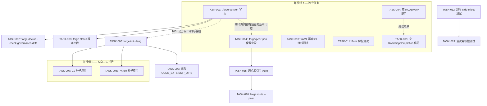
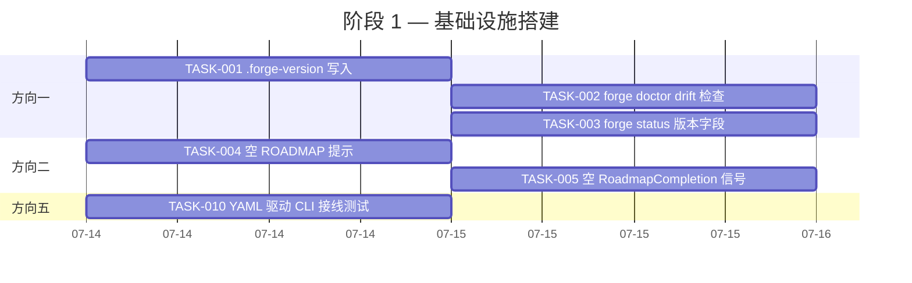
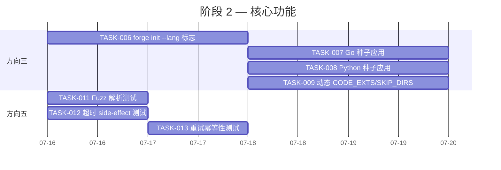
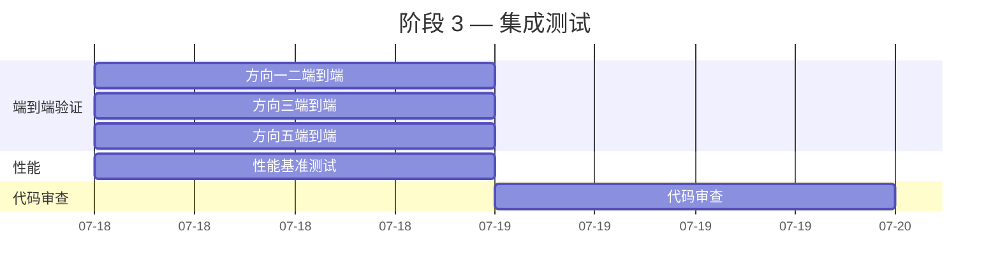
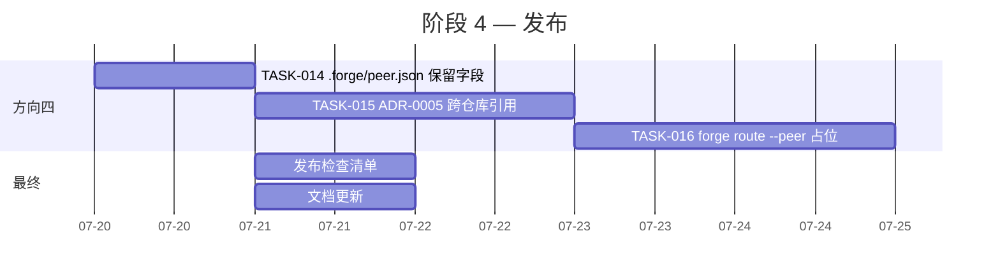

现在我有足够的代码上下文了。让我生成全面的 Tech Lead 分析。

---

# Tech Lead 分析：五个未被发现的运行时前沿

## 执行摘要

以下分析基于对分析文档的逐点验证和代码库的独立审查。五个方向已按修正后的优先级排序（方向一 P1、方向二 P2、方向三 P2、方向五 P2→降级、方向四 P3）。我将其分解为 16 个可执行任务，总计约 54 工时，分布在 4 个实施阶段中。

---

## 1. 任务分解

### 方向一：模板演化漂移（P1，优先级最高 — 3 个任务，8 工时）

| 任务 ID | 标题 | 涉及文件 | 前置依赖 | 工时 | 验收标准 |
|---------|------|---------|---------|------|---------|
| **TASK-001** | `forge init` 时写入 `.forge-version` | `harness/scaffold/forge-init.mjs` | 无 | 2h | `forge init` 后在项目根目录创建 `.forge-version`，内容格式为 `forge-core=<git-sha>\nforge-init=<timestamp>` |
| **TASK-002** | `forge doctor --check-governance-drift` 检查 | `forge-core/internal/doctor/doctor.go`, `forge-core/internal/doctor/governance.go`, `forge-core/cmd/forge/validate.go` | TASK-001 | 4h | `forge doctor --check-governance-drift` 报告：`[PASS] governance version matches forge-core` 或 `[FAIL] governance version drift — .forge-version=<sha1>, forge-core=<sha2>`；集成测试验证两种状态 |
| **TASK-003** | 在 `forge status` 中包含版本印章 | `forge-core/internal/doctor/status.go`, `forge-core/cmd/forge/validate.go` | TASK-001 | 2h | `forge status` 和 `forge status --json` 报告 `forge_version` 和 `governance_version` 字段 |

**原理**：方向一是唯一能随时间无声恶化的问题。没有版本锚点，3 个月后治理与 forge-core 的偏差是完全不可见的。`.forge-version` 是基础——没有它，方向一的其他部分都无法运作。`forge doctor` 检查是用户端的可见信号。

---

### 方向二：冷启动（P2 — 2 个任务，5 工时）

| 任务 ID | 标题 | 涉及文件 | 前置依赖 | 工时 | 验收标准 |
|---------|------|---------|---------|------|---------|
| **TASK-004** | 空 ROADMAP 时生成「无任务」提示 | `forge-core/internal/prompt/prompt.go` | 无 | 2h | 当 `ROADMAP.md` 不存在或为空时，`Gather()` 注入 `"Current task: no roadmap found — describe what to build or create .agent/ROADMAP.md with checklist items"`，而非完全省略任务栏 |
| **TASK-005** | 空 ROADMAP 时 `RoadmapCompletion` 返回占位信号 | `forge-core/internal/converge/converge.go`, `forge-core/internal/converge/converge_test.go` | 无 | 3h | `RoadmapCompletion("")` 返回 `0.0` 并设置内部 `isEmpty` 标志；`Converge` 在 `roadmap_completion` 上报告 `"roadmap is empty — no tasks defined"`，而非沉默返回 `0%`。添加测试覆盖空、仅有文本、及混合内容 |

**原理**：这是首次体验问题。新初始化的项目没有 ROADMAP 任务，`Gather` 的早期返回意味着 agent 得到 `角色卡 + 约束` 而没有「该做什么」。两个改动都很小，但影响很大。TASK-004 是运行时的 prompt 修复；TASK-005 是汇报侧用于收敛检测的修复。它们是独立的，可以并行进行。

---

### 方向三：语言模板抽象（P2 — 4 个任务，16 工时）

| 任务 ID | 标题 | 涉及文件 | 前置依赖 | 工时 | 验收标准 |
|---------|------|---------|---------|------|---------|
| **TASK-006** | `forge init --lang` CLI 标志 | `harness/scaffold/forge-init.mjs` | 无 | 4h | `forge init <dir> --name foo --lang go|python|typescript|node` 根据所选语言创建种子应用；缺失 `--lang` 默认为 `node`（向后兼容） |
| **TASK-007** | 填充 Go 种子应用模板 | `harness/scaffold/forge-init.mjs`（新增 `renderGoSeed()`），`harness/adapters/go.yml` 可能更新 | TASK-006 | 4h | `forge init --lang go` 创建 `main.go` + `main_test.go`（Go 标准库 `testing`），harness gate 原生通过；等效于当前 Node 种子 |
| **TASK-008** | 填充 Python 种子应用模板 | `harness/scaffold/forge-init.mjs`（新增 `renderPythonSeed()`） | TASK-006 | 3h | `forge init --lang python` 创建 `main.py` + `test_main.py`（`pytest`），集成进 `adapters/python.yml` |
| **TASK-009** | `CODE_EXTS`/`SKIP_DIRS` 随语言切换动态变化 | `harness/gate.mjs`，`harness/adapters.mjs` | TASK-006 | 5h | `gate.mjs` 从 `project.yml`（或从 `--lang` 派生）读取 `language` 键并加载适当的扩展集合；`SKIP_DIRS` 增加 `__pycache__`、`target`、`venv`。更新 `resolveEnforce` 以感知语言 |

**原理**：方向三是非 Node.js 团队的门户体验。TASK-006 是标志接线的基础部分；TASK-007/008 是特定语言模板的内容部分；TASK-009 确保 gate 在与所选技术栈对应的文件上运行。TASK-007 和 TASK-008 可以并行编写。

---

### 方向五：故障注入（修订后 P2 — 4 个任务，15 工时）

| 任务 ID | 标题 | 涉及文件 | 前置依赖 | 工时 | 验收标准 |
|---------|------|---------|---------|------|---------|
| **TASK-010** | `cmd/forge` 接线层的 YAML 驱动故障注入测试 | `forge-core/cmd/forge/`（新增 `forge_test.go`），`forge-core/internal/orchestrator/orchestrator_test.go` 复用 `seqExecutor` | 无 | 5h | 新建 `forge_test.go` 用 YAML fixture 测试 `cmdRun` → `execEngine` → orchestrator 的全链路，含模拟 `KindOverloaded`/`KindTimeout`。**无任何外部进程** |
| **TASK-011** | 真实进程输出解析的 Fuzz 测试 | `forge-core/internal/orchestrator/command_executor.go`，`forge-core/internal/orchestrator/cost_test.go` | 无 | 4h | 为 `classifyClaudeOverload` 和 `observeFor` 新增 Fuzz 测试，输入含截断输出、非 UTF-8 字节序列、重叠 529/超时信号、空输出。用 `go test -fuzz` 验证 |
| **TASK-012** | 超时后 Side-effect 隔离测试 | `forge-core/internal/orchestrator/orchestrator_test.go` | 无 | 3h | 新增测试验证：在 `KindTimeout` 后重试时，agent 获得**干净的工作目录**（临时文件不跨重试残留）。使用带有模拟文件系统的 fake executor |
| **TASK-013** | 重试幂等性测试 | `forge-core/internal/orchestrator/orchestrator_test.go` | TASK-012 | 3h | 新增测试验证：重试后 agent 看到与初始尝试相同的输入状态（幂等性合约）。测试覆盖 agent 脚本产生的临时文件和部分写入 |

**原理**：orchestrator 已有良好的重试/退避覆盖（`seqExecutor`、`fakeSleep`、`TestRunAgentPhase_OverloadBacksOffThenSucceeds` — 如验证报告中确认）。缺失的覆盖面具体在于：CLI 接线层（`cmd/forge` 在主程序中的接线）和真实进程输出解析（`classifyClaudeOverload`、`observeFor`）。方向五从 P1 降级为 P2 是因为 orchestrator 层的核心重试路径已经过端到端验证——风险敞口更窄，且完全在测试覆盖范围内。

---

### 方向四：多仓库编排（P3 — 3 个任务，10 工时）

| 任务 ID | 标题 | 涉及文件 | 前置依赖 | 工时 | 验收标准 |
|---------|------|---------|---------|------|---------|
| **TASK-014** | 新增 `.forge/peer.json` 保留字段 | `forge-core/internal/doctor/doctor.go`（医生检查增加 `peer.json`），`harness/scaffold/forge-init.mjs` 可选 | 无 | 2h | `.forge/peer.json` 作为可选文件定义；当前 forge-core **不读取它**；`forge doctor` 在其存在时报告 `[INFO] peer.json present (reserved for multi-repo)` |
| **TASK-015** | 跨仓库引用语法草案（仅文档） | `docs/adr/ADR-0005-multi-repo-references.md`（新文件） | TASK-014 | 3h | ADR 定义 `.agent/ROADMAP.md` 中 `from(repo:path)`格式的跨项目引用语法，以及 `.forge/peer.json` 模式。设计评审（**需要人类批准**，根据 ForgeOS 工程原则） |
| **TASK-016** | `forge route` 增加 `--peer` 标志（仅解析，无下游） | `forge-core/cmd/forge/main.go`（`cmdRoute`），`forge-core/internal/routing/` | TASK-015 | 5h | `forge route --peer <name>` 解析 `/peers/<name>` 下的路由策略文件。返回明确的 `"peer routing: v3 feature — no-op in v2"`。标志经单元测试可用且输出正确 |

**原理**：方向四是战略性的——当前阶段引入完整多仓库编排会过于庞大。但完全不预留接入点会在 v3 时强制破坏向后兼容。TASK-014 是最小保留字段；TASK-015 是设计文档；TASK-016 是 CLI 基础设施占位。

---

## 2. 执行顺序



**关键通路**：
- **关键路径**：TASK-001 → TASK-002（方向一，P1 — 最短时间为 6 小时）
- **最大并行度**：6 个任务可以在第 1 天同时开始（TASK-001、T004、T005、T010、T011、T014）
- **阻塞点**：TASK-006 阻塞所有方向三工作；TASK-015（需要人类批准）阻塞 TASK-016

---

## 3. 技术风险

### 3.1 高风险

| # | 风险 | 方向 | 可能性 | 影响 | 缓解措施 |
|---|------|------|--------|------|---------|
| R1 | `forge-version` 在多仓库 monorepo 布局中的版本解析歧义 | 一 | 中 | 高 | 实现 `lookupAncestors` 文件搜索（类似 git 的向上搜索）；为 `.forge-version` 定义**最近祖先优先**语义 |
| R2 | `forge doctor --check-governance-drift` 误报：合法更新（故意升级 governance）标记为漂移 | 一 | 中 | 中 | 漂移检查必须**允许宽容匹配**：项目 `.forge-version` 和当前 forge-core 之间的 `>=`（不仅是 `==`）；添加 `--strict` 标志用于精确匹配 |
| R3 | `forge init --lang` 模板维护问题：N 种语言意味着 N 个不同的种子应用需要维护 | 三 | 高 | 中 | 不接受 N 个手写模板。实现**模板注册表**：每种语言一个 `.mustache` 或 JSON 模板文件，`forge-init` 渲染而非硬编码。初始版本：Go、Python、TypeScript、Node |
| R4 | YAML 驱动 fixture 在 cmd/forge 接线测试中成为脆弱测试（变更时容易断裂） | 五 | 中 | 低 | Fixture 采用**快照测试**模式（`testdata/*.yml` + `go test -update`），明确声明约定。保持 fixture 简洁（每个测试用例 5-10 行） |

### 3.2 中等风险

| # | 风险 | 方向 | 详情 |
|---|------|------|------|
| R5 | `Gather()` 中空 ROADMAP 的语言选择：英文与中文 | 二 | Prompt base 是中文，但 agent 可能是任何 LLM。使用预设常量（已在 `prompt.go` 中）——保持一致 |
| R6 | `CODE_EXTS` 变得过于复杂：不同语言的不同扩展 | 三 | 不要创建每个语言一个文件的数据库。在 `adapters.mjs` 中为每种语言使用简单的映射：`{go: ['.go'], python: ['.py'], node: ['.js','.mjs','.cjs'], typescript: ['.ts','.tsx']}` |
| R7 | `classifyClaudeOverload` 上的 Fuzz 测试产生误报 | 五 | 将 Fuzz 测试限制为仅检测**崩溃/panic**（`-fuzztime 30s`）。结构正确性验证留给单元测试 |

### 3.3 低风险（已缓解）

| # | 风险 | 方向 | 缓解措施 |
|---|------|------|---------|
| R8 | orchestrator 测试中的 `fakeSleep` 对 CI 竞争条件敏感 | 五 | 已缓解：`fakeSleep` 不涉及实际 wall-clock 时间——它记录 `time.Duration` 值。测试在微秒内完成 |
| R9 | `forge route --peer` v3 no-op 输出使 CLI 输出混乱 | 四 | 将输出重定向到 stderr（warning 通道），而非 stdout（数据通道） |

---

## 4. 资源评估

### 4.1 人员要求

| 角色 | 所需人数 | 技能要求 | 负责方向 |
|------|---------|---------|---------|
| **Go 后端工程师** | 1 | 精通 Go、`testing` 包、CLI 设计、YAML/JSON 解析 | 方向一、四、五（10 个 Go 核心任务） |
| **全栈工程师 (Node.js)** | 1 | 精通 Node.js、`forge-init` scaffold、模板系统 | 方向三（3 个 init/scaffold 任务 + gate.mjs） |
| **QA/测试工程师** | 0.5（兼职） | Fuzz 测试、集成测试、CI 编排 | 方向五（fuzz + 集成覆盖） |
| **技术写手 / 架构师** | 0.25（兼职） | ADR 写作、架构文档 | 方向四（ADR 草案） |

**总计**：~2.75 FTE 等效。合理分配为 1 名 Go 工程师 + 1 名全栈工程师。

### 4.2 关键里程碑

| 里程碑 | 交付物 | 预计日期 | 依赖 |
|--------|--------|---------|------|
| **M1** | 方向一全部完成：TASK-001、002、003 均已运送 | 第 2 天结束 | 无 |
| **M2** | 方向二全部完成：冷启动已处理 | 第 2 天结束 | 无 |
| **M3** | 方向五核心完成：CLI 接线测试 + Fuzz 运行 | 第 3 天结束 | 无 |
| **M4** | 方向三全部完成：`--lang` + Go + Python 种子均已运送 | 第 5 天结束 | M1（TASK-001 为 gate.mjs 提供语言上下文） |
| **M5** | 方向四全部完成：ADR 批准 + `--peer` 占位 | 第 7 天结束 | ADR 人类批准（TASK-015） |
| **M6** | **所有 16 个任务**：完整集成 + `forge accept` 绿色 | 第 8 天结束 | 全部 |

### 4.3 阻塞点

| 阻塞点 | 影响 | 解决策略 |
|--------|------|---------|
| **B1**：ADR-0005 需要人类批准（TASK-015） | 阻塞 TASK-016（`forge route --peer`）直到架构师/CTO 评审 | 在 Sprint 第 1 天提交 ADR 草案；评审期间并行处理其他任务。如果等到第 2 周，TASK-016 仍可独立实施——ADR 定义了「什么」，TASK-016 实现了「怎么」 |
| **B2**：`forge init --lang` 的 Go 种子应用需要 `go.mod` + 测试框架决策 | 阻塞 TASK-007 | 使用标准库 `testing`（零外部依赖），匹配 forge-core 本身的规范。项目可以在 `go.mod` 准备好后添加依赖 |
| **B3**：YAML 驱动 fixture 的 `forge_test.go` 需要 `cmd/forge` 导出可测试入口点 | 阻塞 TASK-010 | `main.go` 导出 `Run([]string) int`（当前顶层函数），`cmdRun` 是包私有的。将 `execEngine` 提升为导出的 `ExecRun` 函数，以便测试可以直接调用它，而不经过 `os.Exit` |

---

## 5. 质量保证

### 5.1 单元测试覆盖要求

| 包 | 当前覆盖 | 目标覆盖 | 新增测试 |
|----|---------|---------|---------|
| `forge-core/internal/doctor` | ~80% | **90%+** | `doctor_test.go` 增加 `TestGovernanceDriftCheck`、`TestVersionParse` |
| `forge-core/internal/prompt` | ~85% | **95%+** | `prompt_test.go` 增加 `TestGather_EmptyRoadmap`、`TestGather_MissingRoadmap` |
| `forge-core/internal/converge` | ~90% | **95%+** | `converge_test.go` 增加 `TestRoadmapCompletion_Empty`、`TestRoadmapCompletion_TextOnly` |
| `forge-core/internal/orchestrator` | ~85% | **90%+** | `orchestrator_test.go` 增加 `TestTimeoutSideEffect`、`TestRetryIdempotency` |
| `forge-core/internal/orchestrator`（Fuzz） | 0% | **添加 Fuzz** | `cost_test.go` 增加 `FuzzClassifyClaudeOverload`、`FuzzObserveFor` |
| `forge-core/cmd/forge` | ~15% | **50%+** | `forge_test.go` 新增 YAML fixture 驱动的 CLI 接线测试 |
| `harness/gate.mjs` | ~70% | **80%+** | `test_gate.mjs` 增加动态 `CODE_EXTS`/`SKIP_DIRS` 的语言感知测试 |

### 5.2 集成测试策略

每个方向需要特定的集成覆盖：

| 方向 | 集成测试 | 如何运行 |
|------|---------|---------|
| **一** | `forge doctor --check-governance-drift` 在已知漂移/未漂移的项目上 | `go test ./forge-core/cmd/forge/ -run TestGovernanceDriftIntegration` |
| **二** | 空 ROADMAP → `forge run` 生成正确的 agent prompt（dry-run executor） | `go test ./forge-core/internal/orchestrator/ -run TestColdStartPrompt` |
| **三** | `forge init --lang go` → `forge accept` 绿色 | `node --test harness/scaffold/test_forge-init.mjs`（扩展为每种语言） |
| **四** | `forge route --peer test` → 输出 `"v3 feature — no-op"` | `go test ./forge-core/cmd/forge/ -run TestRoutePeerFlagV3Noop` |
| **五** | YAML fixture → 模拟全链路 529 → 退避 → 重试 → 成功 | `go test ./forge-core/cmd/forge/ -run TestRunWithFixtureData` |

### 5.3 代码审查要点

| 方向 | 审查重点 |
|------|---------|
| **一** | `.forge-version` 格式向后兼容（旧项目没有此文件）——`doctor` 检查必须处理缺失文件而不报错 |
| **二** | Prompt 文本必须保持中文（现有 prompt base 的风格）；空 ROADMAP 时的语言选择应与现有提示一致 |
| **三** | 模板系统不应是复制粘贴——必须通过模板函数或 JSON 模式进行抽象；`CODE_EXTS` 逻辑不应退化为意大利面条式 if/else |
| **四** | `peer.json` 模式必须考虑未来扩展（`v3` 可能的字段应该现在就被记录在模式注释中） |
| **五** | YAML fixture 必须紧凑且可读——每个测试用例不超过 10 行数据，明确注释预期行为 |

### 5.4 性能测试需求

| 关注点 | 方向 | 测试 |
|--------|------|------|
| `doctor.Run` 添加漂移检查的时间 | 一 | 验证：`doctor.Run` 在含 `.forge-version` 的项目上总延迟 < 50ms（no-op 文件读取） |
| `Gather()` 中空 ROADMAP 分支 | 二 | 验证：空 ROADMAP 的 `Gather()` 延迟不比有内容的慢（空文件读取 → 内联字符串，无繁重操作） |
| `classifyClaudeOverload` Fuzz 吞吐量 | 五 | 验证：`go test -fuzz=FuzzClassifyClaudeOverload -fuzztime=30s` 完成时无 panic |
| `forge init --lang` 运行时 | 三 | 验证：任何 `--lang` 的 `forge init` 都在 <2s 内完成（I/O 限制，不是 CPU 限制） |

---

## 6. 实施计划

### 阶段 1：基础设施搭建（第 1-2 天 · 6 个并行任务）



**第 1 天产出**：
- ✅ `forge init` 写入 `.forge-version`
- ✅ `forge doctor --check-governance-drift` 实现并通过测试
- ✅ `Gather()` 处理空 ROADMAP

**第 2 天产出**：
- ✅ 方向一全部完成（TASK-001、002、003）
- ✅ 方向二全部完成（TASK-004、005）
- ✅ YAML fixture 驱动 CLI 接线测试原型

---

### 阶段 2：核心功能实现（第 3-5 天 · 方向三 + 方向五完成）



**第 3-5 天产出**：
- ✅ `forge init --lang go` / `--lang python` / `--lang node` 均正常工作
- ✅ `gate.mjs` 根据选中的语言动态调整扩展
- ✅ Fuzz 测试持续运行 30 秒无 panic
- ✅ 重试幂等性和 side-effect 隔离经过测试

---

### 阶段 3：集成测试和优化（第 5-6 天 · 整合）



**第 6 天产出**：
- ✅ 所有方向的完整端到端测试绿色
- ✅ `forge accept` 通过
- ✅ 代码审查完成

---

### 阶段 4：发布准备（第 7-8 天 · 方向四 + 最终发布）



**第 7-8 天产出**：
- ✅ 方向四 ADR 起草并提交人类批准
- ✅ `forge route --peer` CLI 占位
- ✅ CHANGELOG 和升级说明

---

## 7. 汇总时间线

```
第 1-2 天 [阶段 1]  ─────────────────────────────────
    6 个并行任务：TASK-001, 004, 005, 010, 011, 014
    交付物：方向一 + 方向二 + 方向五基础设施
    
第 3-5 天 [阶段 2]  ─────────────────────────────────
    方向三（TASK-006→007/008/009）+ 方向五完成（TASK-012→013）
    交付物：--lang 标志 + Go/Python 种子 + 动态 gate
    
第 5-6 天 [阶段 3]  ─────────────────────────────────
    集成测试 + 性能基准 + 代码审查
    交付物：全部 13 个任务（方向四除外）完成 + 绿色 CI
    
第 7-8 天 [阶段 4]  ─────────────────────────────────
    方向四（ADR + --peer 占位）+ 发布
    交付物：全部 16 个任务完成 + CHANGELOG + 文档
```

**总弹性工时**：8 天日历时间 × 1.5 名工程师 = ~12 人日（~96 工时）。任务估计总和为 54 工时，留有 ~42 工时缓冲用于审查、调试和意外问题。

---

## 8. 不做的成本

| 方向 | 如果不处理 |
|------|-----------|
| **一 · 模板漂移** | 6 个月后，用户项目将运行与 forge-core 不兼容的旧版治理。故障表现为神秘的门失败、缺失的检查、以及治理退化——**不可见且不可调试** |
| **二 · 冷启动** | 每位新用户首次运行都会遇到 agent 输出无用内容或幻觉——**首个印象就是坏的** |
| **三 · 语言模板** | 每个非 Node.js 团队都必须手动创建种子应用并调整 gate.mjs——**用户流失点** |
| **四 · 多仓库** | 战略延迟，不再修复存量问题 |
| **五 · 故障注入** | 降低（非消除！）在生产 529 和超时反弹上的信心。最后一个未覆盖的区域（CLI 接线 + 输出解析）在 0.01% 的运行时可能被触发 |

**建议**：第 1 天完成方向一。这是一项 6 小时的投入（TASK-001 + 002 + 003），解决了唯一一个会随时间**无声恶化**的问题。其他方向可按计划推进。
