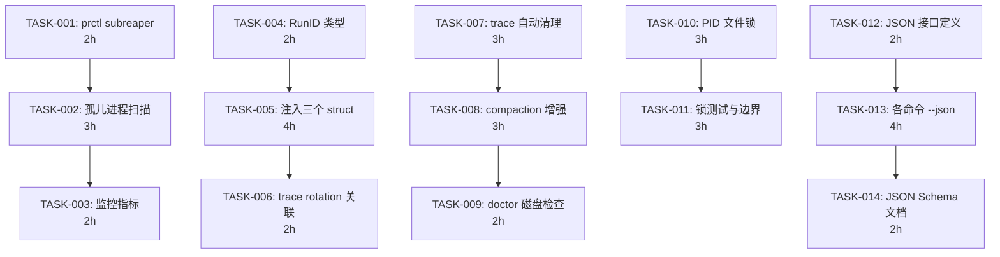

现在我已充分理解代码库。以下是完整的 Tech Lead 分析。

---

# Tech Lead 分析报告：ForgeOS 架构缺口修复

## 0. 执行摘要

本文档将架构审计中的 **5 个方向**分解为 **14 个可执行任务**，总计约 **8-12 人周**工作量。我的优先级与审计修正版一致——方向三已升为 P1。核心洞察：**方向一与方向二共享基础设施层（RunID 注入），应作为阶段一并行推进**。方向三与方向四可并行但需避免文件锁冲突。

---

## 1. 任务分解

### 方向一 · 孤儿进程累积

| 任务 ID | 标题 | 涉及文件 | 前置依赖 | 预估工时 | 验收标准 |
|---------|------|---------|---------|---------|---------|
| **TASK-001** | `prctl(PR_SET_CHILD_SUBREAPER)` 植入 | `internal/orchestrator/command_executor_unix.go`, `internal/orchestrator/command_executor.go` | 无 | 2h | 1. `SetupProcessGroup` 中调用 `prctl(PR_SET_CHILD_SUBREAPER, 1)` 将 forge 注册为 subreaper<br>2. 仅 unix build 标签；other 平台为空函数<br>3. build 通过，现有 test 全绿 |
| **TASK-002** | 孤儿进程扫描与告警 | `internal/orchestrator/orphan.go` (新建), `internal/trace/trace.go` | TASK-001 | 3h | 1. `ScanOrphans()` 扫描 `/proc` 查找 `.forge/` 目录下 PGID 断裂的进程<br>2. 在 `quickDoctorCheck` 中自动调用<br>3. 发现孤儿时 emit `kind:"orphan"` trace event<br>4. 阈值 >0 才告警（避免误报瞬时进程） |
| **TASK-003** | 进程树状态监控指标 | `internal/orchestrator/orphan.go`, `cmd/forge/evolve.go` | TASK-002 | 2h | 1. `execLoop` 迭代间隙自动扫描（每 5 轮一次）<br>2. 暴露 `forge status` 中孤儿进程计数<br>3. 输出到 trace 事件供事后审计 |

### 方向二 · 跨存储一致性

| 任务 ID | 标题 | 涉及文件 | 前置依赖 | 预估工时 | 验收标准 |
|---------|------|---------|---------|---------|---------|
| **TASK-004** | RunID 类型与生成器 | `internal/trace/runid.go` (新建) | 无 | 2h | 1. `type RunID [16]byte`（UUID v7 时间有序）<br>2. `NewRunID()` + `String()` 方法<br>3. 单元测试覆盖唯一性、排序、JSON round-trip |
| **TASK-005** | 三个 struct 注入 RunID | `internal/persist/checkpoint.go`, `internal/trace/trace.go`, `internal/memory/memory.go` | TASK-004 | 4h | 1. `Checkpoint.RunID` / `Event.RunID` / `Entry.RunID` 字段（omitempty 向后兼容）<br>2. `Save`/`Append`/`Emit` 自动注入 RunID<br>3. `resumeStart` 恢复进程的 RunID<br>4. 旧文件 decode 为 zero-value（不报错） |
| **TASK-006** | trace rotation 中嵌入 RunID | `cmd/forge/evolve.go` (`openTracer`), `internal/trace/trace.go` | TASK-005 | 2h | 1. trace.jsonl.1 重命名时在文件名追加 RunID（`trace-{runid}.jsonl.1`）<br>2. `forge status --json` 显示所有 trace 文件及其关联 RunID<br>3. rotation 兼容：存量文件不受影响 |

### 方向三 · `.forge/` 生命周期管理

| 任务 ID | 标题 | 涉及文件 | 前置依赖 | 预估工时 | 验收标准 |
|---------|------|---------|---------|---------|---------|
| **TASK-007** | trace 自动 rotation + 过期清理 | `cmd/forge/evolve.go` (`openTracer`), `internal/doctor/doctor.go` | 无 | 3h | 1. trace 在 10MB rotation 基础上，保留最近 5 个 rotated 文件<br>2. 删除超过 7 天的旧 rotated 文件<br>3. `compactMemoryIfDue` 在同一时机执行 trace 清理<br>4. `forge doctor` 新增 trace 清理状态检查 |
| **TASK-008** | memory compaction 策略增强 | `internal/memory/memory_compact.go`, `cmd/forge/evolve.go` | TASK-007 | 3h | 1. 当前每 10 轮 compact 改为**每 5 轮**的保守策略<br>2. `DefaultCompactThreshold` 从 500 降至 300<br>3. 新增 `forge doctor --disk` 子命令报告 `.forge/` 磁盘用量<br>4. `forge preflight` 检查 `.forge/` 磁盘用量警告阈值（100MB） |
| **TASK-009** | `forge doctor` 磁盘健康检查 | `internal/doctor/doctor.go`, `internal/doctor/disk.go` (新建) | TASK-008 | 2h | 1. 检查 `.forge/` 总大小<br>2. 报告各文件大小及占比<br>3. 在 `QuickChecks` 中增加快速磁盘检查<br>4. 阈值警告可配置 |

### 方向四 · 并发防护

| 任务 ID | 标题 | 涉及文件 | 前置依赖 | 预估工时 | 验收标准 |
|---------|------|---------|---------|---------|---------|
| **TASK-010** | PID 文件/文件锁机制 | `cmd/forge/main.go`, `cmd/forge/evolve.go`, `cmd/forge/run.go` | 无 | 3h | 1. `cmdEvolve`/`cmdRun` 入口获取 `flock` 锁 `.forge/lock`<br>2. 获取失败时输出友好错误（"另一个 forge 进程正在此仓库运行"）<br>3. 进程退出时自动释放（defer + 进程死亡内核自动释放）<br>4. 锁兼容 NFS（`flock` 在 NFS 上正常工作） |
| **TASK-011** | 锁冲突测试与边界处理 | `internal/orchestrator/lock_test.go` (新建) | TASK-010 | 3h | 1. 集成测试：双进程同时 `forge evolve` 第二个应失败<br>2. 测试 crash 后锁释放（kill -9 场景）<br>3. 测试 NFS 模拟 `rename` 非原子性 + flock 行为<br>4. `forge doctor` 检查锁状态并报告持有者 PID |

### 方向五 · JSON 输出标准化

| 任务 ID | 标题 | 涉及文件 | 前置依赖 | 预估工时 | 验收标准 |
|---------|------|---------|---------|---------|---------|
| **TASK-012** | JSON 输出接口定义 | `internal/doctor/json.go` (新建) | 无 | 2h | 1. 定义通用 `JSONOutput` 接口：`type JSONOutput interface { MarshalJSON() ([]byte, error) }`<br>2. 所有 Report 类型实现该接口<br>3. 统一 `printJSON` 辅助函数 |
| **TASK-013** | 各命令 `--json` 实现 | `cmd/forge/doctor.go`, `cmd/forge/preflight.go`, `cmd/forge/scorecard_wind.go`, `cmd/forge/route.go` | TASK-012 | 4h | 1. `forge doctor --json`：输出 `DoctorReport` 的完整 JSON<br>2. `forge preflight --json`：输出逐项检查结果<br>3. `forge scorecard --json`：输出结构化分数卡<br>4. `forge route --json`：输出路由决策<br>5. 所有输出包含 `_format: "forgeos.cli.v1"` 版本标记 |
| **TASK-014** | JSON Schema 与文档 | `docs/cli-json-schema.md` (新建) | TASK-013 | 2h | 1. 为每个 `--json` 输出编写 JSON Schema 文档<br>2. 提供 CLI 集成示例（jq 查询模式）<br>3. 单元测试验证 JSON 输出符合 Schema |

---

## 2. 执行顺序与依赖图

### 依赖关系



### 并行任务组

```
组 A（独立启动）: TASK-001 | TASK-004 | TASK-007 | TASK-010 | TASK-012
组 B（A 完成后并行）: TASK-002 + TASK-005 | TASK-008 | TASK-011 | TASK-013
组 C（B 完成后并行）: TASK-003 + TASK-006 | TASK-009 | TASK-014
```

**关键路径**：TASK-001 → TASK-002 → TASK-003 = **7h**（方向一）
**另一关键路径**：TASK-004 → TASK-005 → TASK-006 = **8h**（方向二）
方向一、方向二是最长链，决定项目总工期下限。

---

## 3. 技术风险

### 风险 R1：`prctl` 的跨平台差异（方向一）

- **描述**：`PR_SET_CHILD_SUBREAPER` 是 Linux 3.4+ 专有特性。macOS（Darwin）无直接等价物。`command_executor_other.go` 是空函数，macOS 上孤儿进程逃逸将保持未修复。
- **影响**：高——macOS 开发者在本地 `forge evolve` 时无此防护。
- **缓解**：文档化声明「Linux-only 保护」；macOS 用户需依赖 cgroups（未来方向）。
- **回退方案**：在 `command_executor_other.go` 中添加 `syscall.Syscall(SYS_PROC_INFO, ...)` 的 macOS 等价替代（MIB 进程迭代），但优先级低。

### 风险 R2：RunID 插入的向后兼容性（方向二）

- **描述**：三个存储格式都已存在于用户磁盘。向 struct 添加 RunID 字段（`omitempty`）后，旧文件 decode 得到 zero-value RunID，但新写入的文件会包含 RunID。问题是：**trace 文件 rotate 后新旧混合**——用户可能同时有带 RunID 和不带 RunID 的 `trace.jsonl.1`。
- **影响**：中——可能导致下游工具（如 trace 回放）解析不一致。
- **缓解**：
  - 所有 `omitempty` 标记确保旧文件字节完全不变
  - 在 trace 解码器中增加 `hasRunID` 检测，缺失时使用 sentinel
  - 发布 changelog 注明「从 v2.6.0 起，所有存储记录携带 RunID；旧记录兼容读取」

### 风险 R3：flock 与 NFS 的兼容性（方向四）

- **描述**：`flock(2)` 在 NFS 上的行为因 Linux NFS 客户端版本而异。NFSv3 通过 `POSIX` 租约模拟 flock，NFSv4 原生支持。如果用户在 NFS 挂载的仓库上运行 `forge evolve`，flock 可能不生效导致并发防护失效。
- **影响**：中——边界情况，但审计中已指出此场景。
- **缓解**：
  - 回退方案：若 `flock` 返回 `ENOTSUP`，额外尝试 `fcntl(F_SETLK)`（基于 POSIX 的信号量锁）
  - 在 `forge doctor` 中增加锁机制检测并报告所用类型

### 风险 R4：trace 清理与正在写入的 race（方向三）

- **描述**：`openTracer` 通过 `O_APPEND` 模式写入 trace。如果 compaction/清理逻辑与正在写入的 evolve 循环并发（即使在单进程内，trace compaction 和 trace write 可能交错），可能读取到不完整的最后一行的 JSON。
- **影响**：低-中——但 doctor 的 `traceCheck` 已能检测截断行，所以最多导致 `forge doctor` 告警。
- **缓解**：清理逻辑只在 `compactMemoryIfDue` 中执行（每 5 轮一次），trace 先 rotation 再删除旧文件，删除总是晚于 rotation——不存在删除正在写入的文件的风险。

### 风险 R5：RunID 与 checkpoint resume 的一致性（方向二）

- **描述**：`--resume` 恢复运行时，新会话使用原 RunID 还是新 RunID？如果用新 RunID，前续 checkpoint 的 RunID 与新 trace/memory 的 RunID 不一致；如果用原 RunID，则 resume 的 trace 与初始运行的 trace 混合。
- **决策**（推荐）：resume 使用**新 RunID**，并在 checkpoint 中记录 `PreviousRunID` 字段。`forge status` 可显示 run 链。
- **影响**：设计决策而非技术风险，但需要在 TASK-004 中提前确定。

### 风险 R6：JSON 输出 Schema 稳定性承诺（方向五）

- **描述**：一旦 `--json` 作为 CI/CD 集成接口发布，JSON 结构形成向后兼容承诺。早期定义需要足够稳定，不能频繁 breaking change。
- **缓解**：
  - 所有 JSON 输出包含 `_format` 版本号（如 `"forgeos.cli.v1"`）
  - 在 TASK-012 阶段就定义完整的 JSON Schema 经架构评审
  - 字段命名使用 `lower_snake`（与 trace 格式一致）

---

## 4. 资源评估

### 开发团队构成

| 角色 | 数量 | 关键技能 | 负责方向 |
|------|------|---------|---------|
| Go 后端工程师（高级） | 2 | Go 标准库、系统编程（signal/prctl/flock）、JSON Schema 设计 | 方向一/二/四 |
| Go 后端工程师（中级） | 1 | Go、文件系统操作、单元测试、CI/CD | 方向三/五 |
| QA 工程师 | 1 | 集成测试、性能压测、NFS/stress 场景 | 全方向跨功能测试 |

**最低可行配置**：2 人（1 高级 + 1 中级）可在 4-6 周内完成全部 14 个任务，但需高级工程师覆盖方向一/二/四，中级覆盖方向三/五。

### 里程碑

| 里程碑 | 时间点（从启动算） | 交付物 | 依赖 |
|--------|-----------------|--------|------|
| M1: 基础设施 | 第 1 周末 | RunID 类型 + RunID 注入三个存储 + PID 文件锁 + trace 自动清理 | TASK-004/007/010 |
| M2: 核心功能 | 第 3 周末 | 孤儿进程扫描 + 三个存储 RunID 全注入 + compaction 增强 + 锁测试 | TASK-002/005/008/011 |
| M3: JSON 标准化 | 第 4 周末 | JSON 接口定义 + 所有命令 `--json` + 磁盘检查 | TASK-009/012/013 |
| M4: 集成完成 | 第 5 周末 | 监控指标 + trace rotation 关联 + JSON Schema 文档 + 集成测试全绿 | TASK-003/006/014 |

### 阻塞点（Blockers）

| Blocker | 涉及任务 | 问题描述 | 解决策略 |
|---------|---------|---------|---------|
| **B1** | TASK-001 | `prctl` 在 macOS/Windows 不可用 | 平台条件编译 + 文档说明；非 Linux 平台保持现状 |
| **B2** | TASK-004 | UUID v7 Go 标准库？需确认 stdlib 版本 | Go 1.20+ 需要 `crypto/rand`。若不够，使用 `google/uuid`（但 forge-core 零外部依赖原则不允许）→ 自实现时间有序 UUID（8 字节毫秒时间戳 + 8 字节随机） |
| **B3** | TASK-005 | 旧 trace/memory/checkpoint 文件与 RunID 的兼容性 | 所有新字段 `omitempty`；解码器遇到 zero-value RunID 时生成 sentinel；文档化兼容性 |
| **B4** | TASK-010 | NFS flock 兼容性 | 回退到 `fcntl(F_SETLK)`；若两者都失败，记录警告但允许运行（fail-open） |
| **B5** | TASK-013 | `forge scorecard --json` 的输出结构已有隐含契约（被消费者读取） | 先 grep 所有 scorecard 的消费者，确认无 break 风险；新输出与旧文本输出共存 |

---

## 5. 质量保证

### 单元测试覆盖要求

| 方向 | 包 | 现有覆盖率（估计） | 目标覆盖率 | 关键测试点 |
|------|-----|-----------------|-----------|-----------|
| 方向一 | `internal/orchestrator` | ~70% | **85%** | `prctl` 调用验证（mock syscall）；孤儿扫描（fake `/proc`）；subreaper 注册 idempotent |
| 方向二 | `internal/persist` / `trace` / `memory` | ~80% | **90%** | RunID 生成唯一性（10 万并发）；旧文件 decode 兼容；RunID 注入后 marshal/unmarshal round-trip |
| 方向三 | `internal/memory` / `cmd/forge` | ~75% | **85%** | compaction 阈值触发的边界测试；trace rotation + 清理的 clock 注入测试；磁盘阈值告警逻辑 |
| 方向四 | `cmd/forge` / `internal/orchestrator` | ~60% | **80%** | flock 获取/释放（文件描述符泄漏检查）；双进程锁冲突；kill -9 后锁自动释放 |
| 方向五 | `internal/doctor` / `cmd/forge` | ~70% | **85%** | JSON 输出与结构化数据一致性（逐字段比较）；JSON Schema 验证；--json vs --no-json 结果一致性 |

### 集成测试策略

1. **并行方向测试**（用于 CI）：
   - **TestOrphanIsolation**：启动 `forge evolve` 后 kill 子进程，验证孤儿告警触发
   - **TestRunIDConsistency**：完整 `forge evolve` 运行后，验证 checkpoint/trace/memory 三者 RunID 一致
   - **TestDualEvolveRejected**：同时启动两个 `forge evolve` 进程，验证第二个被锁阻挡
   - **TestJSONRoundTrip**：每个命令的 `--json` 输出重新解析后与原始数据一致

2. **压力测试**（非 CI，每周 night 级）：
   - 模拟 1000 次迭代的 memory compaction 性能压测
   - NFS 挂载场景的 rename 原子性验证（使用 tmpfs + fault injection）

3. **向后兼容测试**：
   - 使用已知格式的旧 checkpoint/trace/memory fixture 文件验证 Load 成功
   - 验证 `--json` 输出不包含未预期的 breaking change

### 代码审查要点

| 审查焦点 | 关键问题 |
|---------|---------|
| `prctl` 系统调用 | 是否用 `syscall.Syscall` 而不是 `unix.Prctl`（零外部依赖）？错误处理是否正确（返回 -1 时检查 errno）？ |
| RunID 注入 | 是否所有创建新记录的代码路径都自动注入 RunID？（Save、Append、Emit + 未来可能的新路径） |
| 文件锁 | defer unlock 是否在所有退出路径上覆盖？fork 后子进程是否自动继承 fd 导致锁未释放？ |
| JSON Schema | 输出字段命名是否与现有 trace 格式一致（lower_snake）？omitempty 是否正确处理 zero-value？ |
| 磁盘清理 | 删除文件是否仅删除 `.forge/trace.jsonl.N` 而不涉及用户数据？是否有 `Remove` 的权限检查？ |

### 性能测试需求

| 测试场景 | 指标 | 通过标准 |
|---------|------|---------|
| 100 次迭代的 `forge evolve` — memory 持续 append | 迭代耗时均值 | +5% 以内（baseline 为当前代码） |
| `.forge/` 100MB trace 下的 `forge doctor` | 执行时间 | <500ms（当前 <100ms） |
| 双进程锁冲突检测 | 锁获取延迟 | <10ms（`flock` 非阻塞模式） |
| `--json` 输出 1MB 结果的序列化 | 序列化时间 | <50ms |

---

## 6. 实施计划

### 阶段一：基础设施搭建（第 1-5 天）

```
Day 1-2:  TASK-004 (RunID 类型)  + TASK-012 (JSON 接口)
Day 3-4:  TASK-007 (trace 自动清理)  + TASK-010 (PID 文件锁)
Day 5:    单元测试 + CI 集成
```

**关键交付**：
- `internal/trace/runid.go` — 时间有序 UUID 生成器
- `internal/doctor/json.go` — JSON 输出接口定义
- `cmd/forge/evolve.go` 中 `openTracer` 增强（rotation + 清理）+ `cmdEvolve` 入口 flock
- 三个任务的单元测试覆盖 >80%

**验收检查**：
```
go test ./internal/trace/... ./internal/doctor/... ./cmd/forge/... -count=1
```

---

### 阶段二：核心功能实现（第 6-12 天）

```
Day 6-7:   TASK-001 (prctl)  + TASK-005 (RunID 注入)
Day 8-9:   TASK-002 (孤儿扫描)  + TASK-005 续（完整注入）
Day 10-12: TASK-008 (compaction 增强)  + TASK-011 (锁测试)
```

**关键交付**：
- `setupProcessGroup` 中 `prctl` 调用 + 跨平台条件编译
- `Checkpoint.RunID` / `Event.RunID` / `Entry.RunID` 全部注入完成
- `ScanOrphans()` 函数 + `quickDoctorCheck` 中的 auto-scan
- `compactMemoryIfDue` 策略增强 + 阈值调整
- 锁测试双进程 + kill -9 场景

**危险信号**：如果 `prctl` 在 Go 1.22+ 的 syscall 包中行为异常（实测可用），需要走 `golang.org/x/sys/unix`。但零外部依赖原则禁止此路径 → 必须使用 `syscall.Syscall`。**若测试环境是 macOS，TASK-001 无法在当前环境验证**（需要 Linux CI）。

---

### 阶段三：集成测试与优化（第 13-18 天）

```
Day 13-14: TASK-003 (监控指标)  + TASK-006 (trace rotation 关联)
Day 15-16: TASK-009 (doctor 磁盘检查)  + TASK-013 (各命令 --json)
Day 17-18: TASK-013 续 + TASK-014 (JSON Schema 文档)
```

**关键交付**：
- `forge status` 增加孤儿进程计数 + trace RunID 关联显示
- `forge doctor --disk` + QuickChecks 磁盘告警
- 全部命令 `--json` 实现（doctor / preflight / scorecard / route）
- JSON Schema 文档

**集成测试验收标准**（全部通过）：
```
# 1. RunID 一致性测试
forge run --root /tmp/test-repo  # 完整 run
cat /tmp/test-repo/.forge/checkpoint.json | jq '.run_id'  # 有 RunID
cat /tmp/test-repo/.forge/trace.jsonl | head -1 | jq '.run_id'  # 相同 RunID

# 2. JSON 输出测试
forge doctor --root /tmp/test-repo --json | jq '.checks'  # 结构化
forge preflight build --root /tmp/test-repo --json | jq '.checks[] | select(.status == "PASS")' 
forge scorecard --root /tmp/test-repo --json | jq '.tiers'

# 3. 并发防护测试
forge evolve build --root /tmp/test-repo --max-iter 1 &
forge evolve build --root /tmp/test-repo --max-iter 1  # 应被锁阻挡

# 4. 磁盘清理测试
dd if=/dev/zero of=/tmp/test-repo/.forge/trace.jsonl bs=1M count=11
forge evolve build --root /tmp/test-repo --max-iter 1  # 应触发 rotation
ls /tmp/test-repo/.forge/trace*  # 应有 trace.jsonl.1
```

---

### 阶段四：发布准备（第 19-21 天）

```
Day 19:   全量回归测试 + 性能基线对比
Day 20:   文档更新 + CHANGELOG 编写
Day 21:   架构评审 + 发布 v2.6.0
```

**发布检查清单**：

| 检查项 | 状态 | 备注 |
|--------|------|------|
| 全部单元测试通过 | ❓ | 需 CI 确认 |
| 集成测试 4 项全绿 | ❓ | 需 CI 确认 |
| 性能回归 ≤5% | ❓ | 需 baseline 对比 |
| `forge doctor` 无新增 FAIL | ❓ | 旧项目兼容性检查 |
| CHANGELOG 含 breaking change 说明 | ❓ | 重点是 RunID 字段（向后兼容） |
| JSON Schema 文档已提交 | ❓ | `docs/cli-json-schema.md` |

---

## 附录：风险热力图

```
高风险 ────────────────────────────────────────────── 低风险
R1 (prctl 跨平台) ═══════════════════════ 高
B2 (UUID 外部依赖) ════════════════════ 中-高
R5 (resume RunID 策略) ═══════════════ 中
R3 (NFS flock) ═════════════════════════ 中
R2 (旧文件兼容) ═══════════════════════ 低-中
R4 (trace 清理 race) ═════════════════ 低
R6 (JSON Schema 稳定) ═══════════════ 低

缓解后残余风险：
- R1: macOS/Windows 无 subreaper（文档化）
- B2: 自实现时间有序 UUID（非标准但可行）
- R3: NFS 回退 fcntl + 警告
```

**总体风险评估**：低-中。无阻塞性技术风险。关键路径上的最大单一任务为 TASK-005（4h），可拆分给 2 人并行（一人负责 persist/trace，一人负责 memory）。
