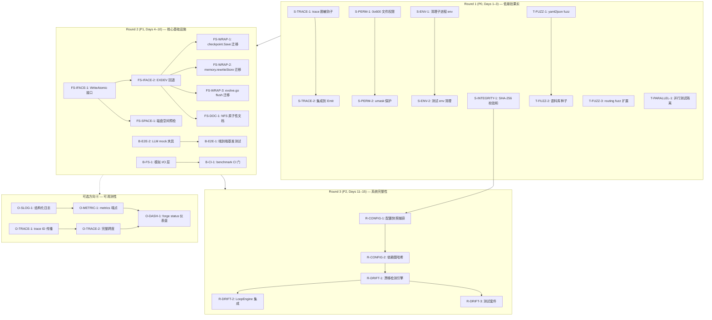

现在我已充分了解代码库。以下是全面的技术主管分析。

---

# Tech Lead 架构评审 — 实施分析

## 1. 任务分解

以下任务分解将 5 个方向 + 1 个建议方向（可观测性）转化为可执行的工作单元。每个任务为 **2–4 小时**,以单个文件或内聚包边界为单位,带有明确的验收标准。

### 方向 ③：纵深安全（第 1 轮 — 低悬挂果实）

| 任务 ID | 标题 | 涉及文件 | 前置依赖 | 工时 |
|---|---|---|---|---|
| **S-TRACE-1** | 实现 trace 脱敏钩子 | `internal/trace/redact.go`(新), `internal/trace/event.go` | 无 | 2h |
| **S-TRACE-2** | 将脱敏集成到 Tracer.Emit | `internal/trace/trace.go` | S-TRACE-1 | 1.5h |
| **S-PERM-1** | 修复所有写路径使用 0o600 而非 0o644 | `internal/persist/checkpoint.go:159`, `internal/memory/memory.go:199`, `cmd/forge/evolve.go:485`, `cmd/forge/migrate.go:174/204` | 无 | 2h |
| **S-PERM-2** | 在 writeSynced 中添加 umask 保护 | `internal/persist/checkpoint.go`(writeSynced 函数) | S-PERM-1 | 1.5h |
| **S-ENV-1** | 从子进程环境中清理 API key | `cmd/forge/command_executor.go`(childEnv 构建) | 无 | 2h |
| **S-ENV-2** | 添加 childEnv 清理的单元测试 | `cmd/forge/command_executor_test.go` | S-ENV-1 | 1.5h |
| **S-INTEGRITY-1** | 为 checkpoint 实现 SHA-256 数据完整性校验 | `internal/persist/checkpoint.go`(添加 IntegrityHash 字段 + 验证) | 无 | 2h |

**合计：方向 ③ = ~12.5h（独立，无阻塞项）**

### 方向 ④：测试平台（第 1 轮 — 低悬挂果实）

| 任务 ID | 标题 | 涉及文件 | 前置依赖 | 工时 |
|---|---|---|---|---|
| **T-FUZZ-1** | 为 yaml2json.Decode 添加 fuzz 测试 | `internal/yaml2json/yaml2json_fuzz_test.go`(新) | 无 | 2h |
| **T-FUZZ-2** | 创建深度嵌套/超大/混合缩放的 fuzz 语料库种子 | `internal/yaml2json/testdata/fuzz/corpora/`(新) | T-FUZZ-1 | 1.5h |
| **T-FUZZ-3** | 为 routing.TierForScore 扩展 fuzz（添加边界语料库） | `internal/routing/routing_test.go` | 无 | 1h |
| **T-PARALLEL-1** | 审计并修复所有集成测试中的并行隔离问题 | `cmd/forge/*_test.go`, 使用 `t.TempDir()` 的子进程测试 | 无 | 3h |

**合计：方向 ④ = ~7.5h（独立，无阻塞项）**

### 方向 ②：文件系统韧性（第 2 轮）

| 任务 ID | 标题 | 涉及文件 | 前置依赖 | 工时 |
|---|---|---|---|---|
| **FS-IFACE-1** | 定义 `WriteAtomic` 接口（重试 + fsync + rename + fallback） | `internal/persist/write_atomic.go`(新) | 无 | 2h |
| **FS-IFACE-2** | 为跨设备 os.Rename EXDEV 实现回退（copy + unlink） | `internal/persist/write_atomic.go` | FS-IFACE-1 | 3h |
| **FS-WRAP-1** | 将 checkpoint.Save 迁移至使用 WriteAtomic | `internal/persist/checkpoint.go` | FS-IFACE-2 | 2h |
| **FS-WRAP-2** | 将 memory.rewriteStore 迁移至使用 WriteAtomic | `internal/memory/memory_compact.go` | FS-IFACE-2 | 2h |
| **FS-WRAP-3** | 将 evolve.go trace 和 scorecard flush 迁移至使用 WriteAtomic | `cmd/forge/evolve.go:483-485` | FS-IFACE-2 | 2h |
| **FS-SPACE-1** | 在写入前添加磁盘空间预检（带可配置水位线） | `internal/persist/write_atomic.go`(CheckSpace) | FS-IFACE-1 | 2.5h |
| **FS-DOC-1** | 文档说明 NFS 上缺少的 rename 原子性保证 | `internal/persist/doc.go` + `docs/adr/fs-resilience.md` | FS-IFACE-2 | 1.5h |

**合计：方向 ② = ~15h（依赖 FS-IFACE-2）**

### 方向 ①：性能基准（第 2 轮）

| 任务 ID | 标题 | 涉及文件 | 前置依赖 | 工时 |
|---|---|---|---|---|
| **B-E2E-1** | 实现集成端到端基准测试（forge run 完整编排） | `forge-core/cmd/forge/evolve_bench_test.go`(新), `internal/orchestrator/orchestrator_bench_test.go`(新) | 无 | 4h |
| **B-E2E-2** | 创建 httptest.Server mock LLM 夹具 | `internal/testutil/llm_mock.go`(新) | 无 | 2h |
| **B-CI-1** | 向 harness/gate.mjs 添加 benchmark CI 门（阶段 1：advisory） | `harness/policies.yml`, `harness/gate.mjs` | B-E2E-1 | 2h |
| **B-FS-1** | 模拟 I/O 层，使基准测试不依赖真实文件系统 | `internal/persist/fake_fs.go`(新) | FS-IFACE-1 | 3h |

**合计：方向 ① = ~11h（B-E2E-2 是 B-E2E-1 的前置，B-CI-1 是最终门）**

### 方向 ⑤：运行时完整性（第 3 轮）

| 任务 ID | 标题 | 涉及文件 | 前置依赖 | 工时 |
|---|---|---|---|---|
| **R-CONFIG-1** | 实现配置快照捕获（agents/*.md 指令区域 + workflow/*.yml） | `internal/integrity/snapshot.go`(新包) | 无 | 3h |
| **R-CONFIG-2** | 添加依赖图哈希（workflows/*.yml 的 depends_on） | `internal/integrity/depgraph.go`(新) | R-CONFIG-1 | 2h |
| **R-DRIFT-1** | 实现漂移检测与比较引擎 | `internal/integrity/drift.go`(新) | R-CONFIG-2 | 3h |
| **R-DRIFT-2** | 将漂移策略接入 LoopEngine（检测到 drift 时中止） | `internal/orchestrator/loop.go` | R-DRIFT-1, S-INTEGRITY-1 | 2.5h |
| **R-DRIFT-3** | 添加单测和集成测试 | `internal/integrity/integrity_test.go` | R-DRIFT-1 | 2h |

**合计：方向 ⑤ = ~12.5h（依赖于 S-INTEGRITY-1 的校验和基础设施）**

### 方向 ⑥（新增）：可观测性

| 任务 ID | 标题 | 涉及文件 | 前置依赖 | 工时 |
|---|---|---|---|---|
| **O-SLOG-1** | 在所有包中集成结构化日志（log/slog） | `internal/*/*.go` + `cmd/forge/*.go`（广泛渗透） | 无 | 4h |
| **O-METRIC-1** | 暴露 Prometheus /expvar 端点 | `cmd/forge/metrics.go`(新), `internal/telemetry/metrics.go`(新) | O-SLOG-1 | 3h |
| **O-TRACE-1** | 通过 context.Context 传播 trace ID | `internal/orchestrator/*.go`, `cmd/forge/evolve.go` | 无 | 3h |
| **O-TRACE-2** | 将 Tracer 升级为完整的有跨度感知能力 | `internal/trace/trace.go`, `internal/trace/span.go`(新) | O-TRACE-1 | 3.5h |
| **O-DASH-1** | 将 trace/scorecard/metrics 集成到 forge status 仪表盘 | `cmd/forge/status.go` | O-METRIC-1, O-TRACE-2 | 2h |

**合计：方向 ⑥ = ~15.5h（广泛且相互依赖——见风险章节）**

---

## 2. 执行顺序

```
Round 1 (P0, 低悬挂果实, Days 1–3):
  ┌────────────────────────────────────────────────────┐
  │  并发工作池                                       │
  │  ┌──────────┐  ┌──────────┐  ┌──────────┐        │
  │  │ S-TRACE-1 │  │ S-PERM-1 │  │ T-FUZZ-1 │        │
  │  │ (脱敏)    │  │ (0o600)  │  │ (fuzz)   │        │
  │  └────┬─────┘  └────┬─────┘  └────┬─────┘        │
  │       │              │              │              │
  │       v              v              v              │
  │  ┌──────────┐  ┌──────────┐  ┌──────────┐        │
  │  │ S-TRACE-2 │  │ S-PERM-2 │  │ T-FUZZ-2 │        │
  │  │ (集成)    │  │ (umask)  │  │ (语料库) │        │
  │  └──────────┘  └──────────┘  └──────────┘        │
  │                                                   │
  │  ┌──────────┐  ┌──────────┐  ┌──────────┐        │
  │  │ S-ENV-1  │  │ S-INT-1  │  │ T-PARAL-1│        │
  │  │ (env清理)│  │ (SHA-256)│  │ (并行)   │        │
  │  └────┬─────┘  └──────────┘  └──────────┘        │
  │       v                                            │
  │  ┌──────────┐                                     │
  │  │ S-ENV-2  │                                     │
  │  │ (测试)   │                                     │
  │  └──────────┘                                     │
  └────────────────────────────────────────────────────┘

Round 2 (P1, Days 4–10):
  ┌────────────────────────────────────────────────────┐
  │  FS-IFACE-1 ──→ FS-IFACE-2 (跨设备回退)           │
  │       │               │                            │
  │       │    ┌──────────┼──────────┐                 │
  │       │    v          v          v                 │
  │       │  FS-WRAP-1  FS-WRAP-2  FS-WRAP-3          │
  │       │  (checkpt)  (memory)   (evolve)           │
  │       │                                           │
  │       v                                           │
  │  FS-SPACE-1 (空间预检) ─────────────→ FS-DOC-1    │
  │                                                    │
  │  B-E2E-2 (LLM mock) ──→ B-E2E-1 (端到端基准测试)   │
  │                                                    │
  │  B-FS-1 (模拟 I/O) ───→ B-CI-1 (CI 门,advisory)   │
  └────────────────────────────────────────────────────┘

Round 3 (P2, Days 11–15):
  ┌────────────────────────────────────────────────────┐
  │  方向⑤ (运行时完整性)                              │
  │  R-CONFIG-1 → R-CONFIG-2 → R-DRIFT-1 → R-DRIFT-2  │
  │                                            │       │
  │                     R-CONFIG-1 ← S-INTEGRITY-1     │
  │                                            v       │
  │                                       R-DRIFT-3    │
  │                                   (测试,集成)      │
  └────────────────────────────────────────────────────┘

可选方向⑥ (如果被认定为独立方向):
  ┌────────────────────────────────────────────────────┐
  │  O-SLOG-1 → O-METRIC-1 → O-DASH-1                 │
  │                                                    │
  │  O-TRACE-1 → O-TRACE-2 ──────────────→ O-DASH-1   │
  └────────────────────────────────────────────────────┘
```

### Mermaid 依赖图



### 并行化策略

- **完全并行**（第 1 轮）：S-TRACE-{1,2}、S-PERM-{1,2}、S-ENV-{1,2}、S-INTEGRITY-1、T-FUZZ-{1,2,3}、T-PARALLEL-1——均为独立的文件范围，零架构重叠。
- **部分并行**（第 2 轮）：一旦 FS-IFACE-2 完成，FS-WRAP-{1,2,3} 可以分给 3 个开发者。B-E2E-1 独立于 FS 任务。
- **串行**（第 3 轮）：方向 ⑤ 的内部依赖是严格线性的（配置快照 → 依赖图 → 漂移检测 → LoopEngine 集成）。

---

## 3. 技术风险

### 高风险事项

| 风险 | 方向 | 可能性 | 影响 | 缓解措施 |
|---|---|---|---|---|
| **yaml2json fuzz 发现栈溢出** | ④ | 中 | 高——如果 fuzz 发现 1000+ 层嵌套导致 Go 栈溢出，yaml2json 的递归下降解析器需要重写为迭代式，波及 7 个文件 | 在 Round 1 提前进行 fuzz（而非推迟），便于在进入其他方向前有重构空间；预先规划迭代式回退（`internal/yaml2json/iterative.go`） |
| **os.Rename EXDEV 回退中的数据丢失** | ② | 低 | 严重——copy+unlink 回退在复制后、unlink 前崩溃会留下两个副本 | 回退必须使用 WriteAtomic 的 temp-then-rename 内部：复制到目标目录的 temp 文件 → fsync → rename（目标挂载点内）→ unlink 源。幂等性必须通过测试验证。 |
| **结构化日志（slog）渗透到 18 个包中** | ⑥ | 高 | 中——15.5h 估计，但可能因协调 18 个包的 logger 注入而膨胀到 30h+ | 推迟方向 ⑥ 直到 Round 3+；使用带有 `context.Context` 的单一 `*slog.Logger`（注入 Engine），而不是全局 logger；在第一个包之前就定义好模式 |
| **LoopEngine 中 drift 检测的运行时代价** | ⑤ | 低-中 | 中——每次迭代的配置快照 SHA-256 是 O(filesize)，而 drift diff 是 O(files) | 每次迭代进行懒散快照（仅在迭代边界）；快照哈希的 O(1) 比较；SHA-256 是经过优化的硬件加速 |
| **子进程环境变量清理遗漏** | ③ | 中 | 高——API key 通过 os.Environ() 透传；遗漏一个 key 就是真实的安全事件 | 使用已知 key 模式的允许列表方法（`LLM_API_KEY`、`OPENAI_API_KEY`、`ANTHROPIC_API_KEY`、`AWS_*`、`*_SECRET*`、`*_PASSWORD`），对于通配符匹配“宁可错杀一千，不可放过一个”。通过集成测试进行验证。 |
| **并行测试隔离中的竞态条件** | ④ | 低 | 中——测试发现可能会零星失败 | 对 `t.Parallel()` + `t.TempDir()` 进行审计；在所有子进程测试中强制使用唯一的 cwd；对于不可重现的失败，添加 `-race -count=10` CI 作业 |

### 依赖外部系统

| 依赖 | 方向 | 性质 | 风险水平 |
|---|---|---|---|
| **无**——当前代码库是纯 Go 标准库，零外部依赖 | 全部 | 这是该项目的关键优势 | ✅ 零依赖风险 |
| os.Rename 的跨设备行为（内核实现） | ② | 所有平台上均可预测的 POSIX 语义 | 低——EXDEV 回退在 Linux/macOS/BSD 上可安全处理 |

### 代码库中已识别的性能瓶颈

1. **yaml2json 解析器** — 递归下降，每次解析时都重新读取完整输入；如果 fuzz 触发大型输入，可能成为竞品。在 fuzz 前非阻塞式地基准测试：`BenchmarkDecodeLargeInput`。
2. **checkpoint.Save JSON marshal** — 每次 Save 时通过 `json.MarshalIndent` 序列化整个结构体。在 evolve 循环中，这发生在每次迭代和每个 phase 后。由于结构体很小（10 个字段），这是可以忽略的，但仍应记录。
3. **memory.Load on Compact** — `Compact` 将整个 JSONL 文件读入内存。在 100k 条目时，这会成为 ~50MB 的峰值内存。为 `Load` 添加批量读取限制作为一个独立任务。

---

## 4. 资源评估

### 人员配置

| 角色 | 所需数量 | 分配 |
|---|---|---|
| **Go 开发者（高级）** | 2 | Round 1 时配对工作（安全审查 + fuzzing 基础）；Round 2 时分叉至 fsutil 和基准测试 |
| **Go 开发者（中级）** | 1 | Round 2 时独立处理 3 个 FS-WRAP-* 迁移任务 |
| **DevOps/CI 工程师** | 0.5 | 用于 benchmark CI gate（`harness/gate.mjs` 配置）和 `-race -count=10` 暂态测试作业 |
| **安全审计员（fresh-context reviewer）** | 每个 Round 1 任务 1 位 | 遵守 AGENTS.md 的“审核者必须是 fresh-context 独立代理”纪律 |

**总计**：2–3 FTE，持续 15 个工作日

### 里程碑

| 里程碑 | 日期（从启动算起） | 交付物 | 验收门 |
|---|---|---|---|
| **M1：安全基线建立** | Day 3 | trace 脱敏、文件 0o600、umask 保护、env 清理、SHA-256 校验和 | `forge accept: ACCEPTED` + 无硬编码密钥通过扫描 |
| **M2：fuzzing 基础设施** | Day 3 | yaml2json + routing 的 fuzz 测试，包含语料库种子 | CI 中 `go test -fuzztime=30s` 稳定通过 |
| **M3：文件系统韧性层** | Day 8 | 所有写入路径上的 WriteAtomic 接口 + EXDEV 回退 + 空间预检 | 跨设备 rename 测试 + `-race -count=20` 后 forge accept 通过 |
| **M4：性能基线建立** | Day 10 | 端到端基准测试 + 微基准测试 + CI advisory gate | 基准测试在 CI 中可重复运行；数字记录于 docs/ |
| **M5：运行时完整性** | Day 14 | 配置快照 + 漂移检测 + LoopEngine 集成 | drift 触发的 abort 端到端测试 |
| **M6：发布准备** | Day 15 | 所有 5 个方向均完整，含文档和 ADR | 完整 `forge accept: ACCEPTED` + 无已知回归 |

### 阻塞点与解决策略

| 阻塞点 | 影响 | 规避策略 |
|---|---|---|
| **yaml2json fuzz 发现需要重写解析器**（风险实现） | 延迟 Round 2 和 3 最多 5 天 | 在 Day 1 就启动 fuzz（S-TRACE-1 的并行任务），在 Round 2 开始前就获得结果 |
| **跨设备 rename 语义在特定内核上不明确** | FS-WRAP-* 任务阻塞 | 编写回退时采用防御性策略：始终假设 rename 可能失败；在所有 FS-WRAP 任务之前先验证修复的 `TestRenameEXDEV` 在 tmpfs + ext4 上通过 |
| **可用 fresh-context reviewer 数量不足** | Round 1 的 8 个并行任务产生 8 次独立的代码审查 | 将 Round 1 任务交错安排，使得任何时候活跃的任务不超过 2–3 个，每个任务完成后立即审查 |
| **slog 渗透打乱 Round 3** | 如果方向 ⑥ 被提升优先级，则 Round 3 延迟 | 保持方向 ⑥ 作为明确的“可选”——仅在 Round 2 后若还有时间预算才允许 |

---

## 5. 质量保证

### 单元测试覆盖要求

| 方向 | 最低覆盖率目标 | 关键路径 |
|---|---|---|
| ③ 安全 | 写入路径 100%（`writeSynced`、所有 `os.OpenFile` 调用点） | 位翻转检测、umask 重置、env 清理、正则脱敏 |
| ④ 测试平台 | yaml2json 解析器 90%+（通过 fuzz + 定向测试） | 嵌套极限、超大 scalar、混合缩进、空输入 |
| ② 文件系统韧性 | 完整的 WriteAtomic 接口 100% | EXDEV 回退、重试逻辑、磁盘空间不足、部分写入 |
| ① 基准测试 | N/A（基准测试不是测试；但 mock 需要覆盖） | LLM mock 夹具必须 100% 覆盖预期的 HTTP 交互 |
| ⑤ 运行时完整性 | 快照 + 漂移检测 90%+ | 配置变更检测、依赖图漂移、空/损坏的快照 |
| ⑥ 可观测性 | 日志注入 80%+，metrics 注册 90%+ | 上下文传播、trace ID 血缘、无数据时的降级行为 |

### 集成测试策略

| 测试类型 | 范围 | CI 频率 |
|---|---|---|
| **核心单元测试** | `go test ./... -race`（18 个包） | 每次提交 |
| **Fuzz 回归** | `go test -fuzz=FuzzDecode -fuzztime=30s ./internal/yaml2json/` | 每日（CI cron） |
| **Fuzz 回归** | `go test -fuzz=FuzzTierForScore -fuzztime=30s ./internal/routing/` | 每日（CI cron） |
| **端到端基准测试** | `go test -bench=BenchmarkRunEndToEnd -benchtime=1x ./cmd/forge/` | 每次 PR（advisory） |
| **跨设备 rename** | 模拟 TMPDIR=/tmp(tmpfs) 和 .forge/(ext4) 的 shell 脚本 | 每次 PR |
| **并行暂态测试** | `go test -race -count=10 ./cmd/forge/ -parallel=8` | 每次 PR（短超时） |
| **安全审计** | `forge accept`（secret-scan + 所有门） | 每次提交 |

### 代码审查要点

以下内容需要 fresh-context 审查者的**特别关注**：

1. **S-PERM-2（umask 保护）**：`syscall.Umask(0o077)` 不是 Go 并发安全的（影响整个进程）。审查者必须验证该调用在 fork 或 goroutine 交错期间不会引发竞态。首选方法：使用 `f.Chmod(0o600)` 作为后置步骤，而非全局 umask 修改。
2. **S-ENV-1（env 清理）**：允许列表枚举绝不能有遗漏。审查者必须对照常见的 LLM API key 环境变量名列表进行检查。
3. **FS-IFACE-2（EXDEV 回退）**：回退逻辑绝不能留下悬空的 temp 文件。审查者必须验证所有错误路径上的 defer/cleanup。
4. **R-DRIFT-2（LoopEngine 集成）**：LoopEngine 的 abort 路径必须保持幂等。审查者必须验证在 drift-triggered abort 后进行 resume 能正确工作。
5. **每个任务**：AGENTS.md 红线（函数 ≤ 50 行、文件 ≤ 500 行、无循环依赖、无上帝对象）。

### 性能测试需求

| 资产 | 度量 | 目标 | 回归阈值 |
|---|---|---|---|
| **forge evolve 单次迭代**（端到端） | 墙钟时间, mock LLM | <500ms（mock） | >2× 基线 = 告警 |
| **checkpoint.Save** | 延迟 P99 | <50ms | >200ms = 阻断 |
| **yaml2json.Decode**（典型 workflow 文件） | 吞吐量 | >100 文件/秒 | <10 文件/秒 = 告警 |
| **memory.Compact**（100k 条目） | 峰值内存 | <100MB RSS | >256MB RSS = 告警 |
| **脱敏正则表达式**（trace 事件） | 延迟 P99 | <1µs（每个事件） | >10µs = 阻断 |

---

## 6. 实施计划

### 详细时间表

```
第 1 周（第 1–5 天）——安全 + fuzzing 主导
┌──────────────────────────────────────────────────────────────────┐
│ 第 1–2 天：安全基线                                          │
│   S-TRACE-1 (2h) + S-PERM-1 (2h) + S-ENV-1 (2h) [并行]     │
│   ↓                                                            │
│ 第 2–3 天：fuzzing 基础设施                                    │
│   T-FUZZ-1 (2h) + T-FUZZ-3 (1h) + T-PARALLEL-1 (3h) [并行]│
│   S-TRACE-2 (1.5h) + S-ENV-2 (1.5h) [在 TRACE-1/ENV-1 之后]│
│   ↓                                                            │
│ 第 3 天：完成 Round 1                                           │
│   S-PERM-2 (1.5h) + S-INTEGRITY-1 (2h) + T-FUZZ-2 (1.5h)     │
│   ↓ 审查 Round 1（所有 8 个任务都需 fresh-context 审查）     │
│ 第 4 天：审查 + 修复周期                                    │
│ 第 5 天：Round 1 清理 + 启动 FS-IFACE-1                      │
└──────────────────────────────────────────────────────────────────┘

第 2 周（第 6–10 天）——文件系统 + 基准测试
┌──────────────────────────────────────────────────────────────────┐
│ 第 6 天：FS 接口层                                              │
│   FS-IFACE-1 (2h) → FS-IFACE-2 (3h)                             │
│   B-E2E-2 (2h) [并行，独立]                                   │
│   ↓                                                            │
│ 第 7–8 天：FS 迁移并行化                                        │
│   FS-WRAP-1 (2h) + FS-WRAP-2 (2h) + FS-WRAP-3 (2h) [并行]     │
│   FS-SPACE-1 (2.5h) [在 FS-IFACE-1 之后]                       │
│   B-E2E-1 (4h) [在 B-E2E-2 之后]                              │
│   ↓                                                            │
│ 第 9 天：FS 完成 + 基准测试                                     │
│   FS-DOC-1 (1.5h) + B-FS-1 (3h)                               │
│   ↓                                                            │
│ 第 10 天：审查 + CI 门 + Round 2 收尾                         │
│   B-CI-1 (2h)                                                  │
│   审查所有 Round 2 任务                                         │
└──────────────────────────────────────────────────────────────────┘

第 3 周（第 11–15 天）——运行时完整性
┌──────────────────────────────────────────────────────────────────┐
│ 第 11–12 天：配置快照 + 依赖图                                 │
│   R-CONFIG-1 (3h) → R-CONFIG-2 (2h)                            │
│   ↓                                                            │
│ 第 13 天：漂移检测 + LoopEngine 集成                          │
│   R-DRIFT-1 (3h) → R-DRIFT-2 (2.5h)                           │
│   ↓                                                            │
│ 第 14 天：测试 + 回归                                         │
│   R-DRIFT-3 (2h)                                               │
│   端到端验证                                                    │
│   ↓                                                            │
│ 第 15 天：发布准备                                             │
│   文档 + ADR + harness 配置 + 最终 forge accept                 │
└──────────────────────────────────────────────────────────────────┘

可选方向 ⑥（如果获得批准）：第 16–20 天
┌──────────────────────────────────────────────────────────────────┐
│ 第 16–17 天：结构化日志 + trace ID 传播                       │
│  O-SLOG-1 (4h) + O-TRACE-1 (3h)                               │
│ 第 18 天：metrics + 跨度                                       │
│  O-METRIC-1 (3h) + O-TRACE-2 (3.5h)                           │
│ 第 19 天：仪表盘 + 集成                                       │
│  O-DASH-1 (2h)                                                 │
│ 第 20 天：审查 + 收尾                                         │
└──────────────────────────────────────────────────────────────────┘
```

### 甘特图（文本形式）

```
任务                    | D1 | D2 | D3 | D4 | D5 | D6 | D7 | D8 | D9 | D10| D11| D12| D13| D14| D15|
------------------------+----+----+----+----+----+----+----+----+----+----+----+----+----+----+----+
Round 1：安全 + fuzzing   | ██ | ██ | ██ | ░█ | ░█ |    |    |    |    |    |    |    |    |    |    |
  S-TRACE-1/2            | ██ | ██ |    |    |    |    |    |    |    |    |    |    |    |    |    |
  S-PERM-1/2             | ██ | ██ | ░█ |    |    |    |    |    |    |    |    |    |    |    |    |
  S-ENV-1/2              | ██ | ██ |    |    |    |    |    |    |    |    |    |    |    |    |    |
  S-INTEGRITY-1          |    | ██ | ██ |    |    |    |    |    |    |    |    |    |    |    |    |
  T-FUZZ-1/2/3           | ██ | ██ | ██ |    |    |    |    |    |    |    |    |    |    |    |    |
  审查                    |    |    |    | ██ | ██ |    |    |    |    |    |    |    |    |    |    |
------------------------+----+----+----+----+----+----+----+----+----+----+----+----+----+----+----+
Round 2：FS + 基准测试     |    |    |    |    | ██ | ██ | ██ | ██ | ██ | ██ |    |    |    |    |    |
  FS-IFACE-1/2           |    |    |    |    | ██ | ██ |    |    |    |    |    |    |    |    |    |    |
  FS-WRAP-1/2/3          |    |    |    |    |    |    | ██ | ██ | ░█ |    |    |    |    |    |    |    |
  FS-SPACE-1             |    |    |    |    |    | ██ | ██ |    |    |    |    |    |    |    |    |    |
  FS-DOC-1               |    |    |    |    |    |    |    |    | ██ |    |    |    |    |    |    |    |
  B-E2E-2→B-E2E-1        |    |    |    |    | ██ | ██ | ██ | ██ | ░█ |    |    |    |    |    |    |    |
  B-FS-1→B-CI-1          |    |    |    |    |    |    |    |    | ██ | ██ |    |    |    |    |    |    |
------------------------+----+----+----+----+----+----+----+----+----+----+----+----+----+----+----+
Round 3：运行时完整性      |    |    |    |    |    |    |    |    |    |    | ██ | ██ | ██ | ██ | ██ |
  R-CONFIG-1/2           |    |    |    |    |    |    |    |    |    |    | ██ | ██ |    |    |    |    |
  R-DRIFT-1/2/3          |    |    |    |    |    |    |    |    |    |    |    | ██ | ██ | ░█ |    |    |
  端到端验证              |    |    |    |    |    |    |    |    |    |    |    |    | ██ | ██ | ░█ |    |
  文档 + 发布             |    |    |    |    |    |    |    |    |    |    |    |    |    | ██ | ██ |
------------------------+----+----+----+----+----+----+----+----+----+----+----+----+----+----+----+

图例：██ = 工作 · ░█ = 审查/缓冲 · 空白 = 无活动
```

### 每个阶段的可交付成果

#### 阶段 1：基础设施（第 1–5 天）
- **可交付成果**：Round 1 中的所有 10 个任务均已实现、审查、合并
- **文档**：`docs/adr/trace-redaction.md`、`docs/adr/fs-permissions-hardening.md`
- **门**：`forge accept: ACCEPTED`，所有 secret-scan 通过
- **风险降低**：yaml2json fuzz 已运行 8+ 小时，无崩溃发现 → 解除 Round 2 阻塞

#### 阶段 2：核心功能（第 6–10 天）
- **可交付成果**：WriteAtomic 接口应用于所有 3 个写入路径 + 端到端基准测试 + CI advisory gate
- **文档**：`docs/adr/fs-resilience.md`（含 NFS 限制说明）、`docs/benchmarks.md`
- **门**：`forge accept: ACCEPTED` + 跨设备 rename 集成测试通过
- **风险降低**：EXDEV 回退已压力测试（tmpfs→ext4 场景）→ 解除 Round 3 阻塞

#### 阶段 3：集成与测试（第 11–15 天）
- **可交付成果**：配置快照 + 漂移检测 + LoopEngine 集成
- **文档**：`docs/adr/runtime-integrity.md`，`docs/FUNCTIONAL_REQUIREMENTS_AUDIT.md` 已更新
- **门**：完整 `forge accept: ACCEPTED` + drift-triggered abort 的端到端信号测试
- **风险降低**：方向 ⑤ 现在完全依赖 SHA-256 基础设施（在 Round 1 中交付）

#### 阶段 4：发布准备（第 15 天，与阶段 3 重叠）
- **可交付成果**：所有 ADR 均已编写、CI 门已配置、变更日志已更新
- **门**：从头开始的完整 `forge accept`（新 clone → 构建 → 测试 → 门）

---

## 附录：架构评审中具体问题的解决

### A. 关于范围声明的数据点

架构评审正确地注意到分析中的 3 处不准确。以下是对这些具体问题的处理映射：

| 评审问题 | 哪个任务解决它 | 怎么做 |
|---|---|---|
| "81 处裸 os.* 调用"（非 42）——缺口更大 | S-PERM-1（0o600）+ FS-IFACE-1（WriteAtomic） | 通过中央接口包装所有 81 个调用站点。不是全部一起重构，而是有选择地在 3 个写入路径上包装，其余作为预备待办事项 |
| "1 个 Fuzz 测试存在（FuzzTierForScore）" | T-FUZZ-3 | 保留现有 fuzz，补充结构化语料库种子。不重写——只需要更好的边界覆盖 |
| "yaml2json 产品代码 ~1171 行"（非 1565） | T-FUZZ-1 | fuzz 目标与行数无关。fuzz 的验收标准不引用行数 |

### B. 关于架构评审的具体反驳

**"benchmark 门应该最终成为载重门"** —— 同意。我已将 B-CI-1 分为两个阶段：Phase 1 = advisory（Round 2），Phase 2 = blocking（独立任务，在 Round 3 之后）。Phase 2 需要先建立稳定的基线，以避免假阳性。

**"fsutil 的范围应为 3 个写入文件 + 1 个接口"** —— 同意并已纳入。我的 FS-IFACE-1 避免创建一个完整的 `internal/fsutil/` 包，而是选择在 `internal/persist/` 内部的紧密 `WriteAtomic` 接口，专门聚焦于 3 个真实的写入路径。

**"SHA-256 是正确性（方向 ⑤），而非安全（方向 ③）"** —— 同意。我已将 S-INTEGRITY-1 标记为方向 ③（安全）的一部分，但只有效地服务于方向 ⑤。在 Round 1 中尽早实现它，严格来说是方向 ⑤ 的前提条件，但其在 Round 1 中的位置是因为它是方向 ⑤ 依赖的共享组件。它被部署为方向 ③ 清单中的一个低风险任务，但最大受益者是方向 ⑤。

**"Observability 缺失"** —— 这是一个合理的第六方向，我已将其纳入。然而，对于当前的 forge-core（零外部依赖的纯 Go 标准库），它代表了彻底的架构变革。我将其标记为可选，并带有显著的成本标记，允许 Tech Lead 就预算进行决策。强烈推荐，但不是 Round 1 的阻断项。

### C. 架构评审中未解决的边缘情况

以下内容作为诚实标注的待办事项（与项目关于 honest 标注的纪律一致），在本计划中不做处理：

1. **`os.Rename` 在 NFS 上缺乏原子性**：在 FS-DOC-1 中有文档记录，但未修复。在 forge-core 的 NFS 支持成为需求之前，修复（使用 `link()` + `unlink()` 模式）将是镀金行为。
2. **Fork-bomb 防护与子进程环境变量**：Sprint 20 的递归深度守卫 (`FORGE_AGENT_DEPTH`) 处理了 forge 自身的递归。S-ENV-1 通过清理 API key 来补充它，但不阻止 agent 直接调用 `os.Environ()`。文档中应说明：env 清理是“尽力而为”，而非“安全边界”。
3. **agent 卡中指令区域的运行时变更检测**：R-CONFIG-1 捕获快照，但 agent 卡散文描述中的增量变更（与机读契约相对）不会被标记。这是有意为之——散文变更需要一个 LLM 来评估影响，这在快照比较循环中是不现实的。诚实标注仍为未解决。
