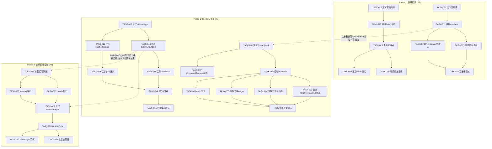

好的，我已仔细阅读了这份 16KB 的架构盲区分析文档。现在以 Tech Lead 视角进行完整分析。

---

# Tech Lead 分析报告：ForgeOS 五个代码级架构盲区

---

## 1. 任务分解

我将每个方向拆解为 2-4 小时可完成的具体技术任务，精确到文件和验收标准。

### 方向① — AgentExecutor 结构化结果

| 任务 ID | 任务标题 | 涉及文件 | 前置依赖 | 预估工时 |
|---------|---------|---------|---------|---------|
| TASK-001 | 定义 `PhaseResult` 结构化返回类型 | `orchestrator/executor.go`（新增类型）、`orchestrator/result.go`（新建文件） | 无 | 2h |
| TASK-002 | 实现 `PhaseResult` 消费侧：修改 `RunFrom` 循环集成结果 | `orchestrator/engine.go` | TASK-001 | 3h |
| TASK-003 | 替换 `parseReviewerVerdict`：将 ad-hoc 字符串解析改为类型字段访问 | `cmd/forge/cost.go:310-380` | TASK-002 | 2h |
| TASK-004 | 替换 `parseExecutiveVerdict` + `parseConfidenceScore` | `cmd/forge/cost.go` | TASK-002 | 2h |
| TASK-005 | 替换 `prompt_context.go` 中的旁路 ledger 机制 | `cmd/forge/prompt_context.go`, `cmd/forge/prompt_artifacts.go` | TASK-002 | 3h |
| TASK-006 | 实现 `emits:` 文件存在性契约验证（phase 结束后立即检查）| `orchestrator/engine.go` | TASK-002 | 2h |
| TASK-007 | 迁移 `CommandExecutor` 适配器，使其返回 `PhaseResult` | `orchestrator/command_executor.go` | TASK-001 | 2h |
| TASK-008 | 更新所有 executor 测试用例 | `orchestrator/executor_test.go`, `cmd/forge/cost_test.go` | TASK-003 ~ TASK-007 | 3h |

### 方向② — 业务逻辑层分离

| 任务 ID | 任务标题 | 涉及文件 | 前置依赖 | 预估工时 |
|---------|---------|---------|---------|---------|
| TASK-009 | 创建 `internal/app` 包骨架 | `internal/app/app.go`（新建） | 无 | 2h |
| TASK-010 | 将 `buildRunEngine` 从 `cmd/forge` 迁移到 `internal/app` | `cmd/forge/engine_build.go` → `internal/app/engine_build.go` | TASK-009 | 3h |
| TASK-011 | 将 `runEvolve` 从 `cmd/forge` 迁移到 `internal/app` | `cmd/forge/evolve.go` → `internal/app/evolve.go` | TASK-010 | 3h |
| TASK-012 | 将 `gatherSignals`、`reviewStatus`、`requirementConfidence` 迁移 | `cmd/forge/gates.go` → `internal/app/gates.go` | TASK-009 | 3h |
| TASK-013 | 将 `gatesGreen`、`gatesCheck` 等 gate 编排逻辑迁移 | `cmd/forge/gates.go` → `internal/app/gates.go` | TASK-012 | 2h |
| TASK-014 | `cmd/forge` 改为薄 CLI 外观，委托给 `internal/app` | `cmd/forge/main.go`, `cmd/forge/run.go`, `cmd/forge/evolve.go` | TASK-010 ~ TASK-013 | 3h |
| TASK-015 | 更新 `cmd/forge` 集成测试，保留不变的外部行为 | `cmd/forge/*_test.go` | TASK-014 | 3h |

### 方向③ — mode 子域隔离

| 任务 ID | 任务标题 | 涉及文件 | 前置依赖 | 预估工时 |
|---------|---------|---------|---------|---------|
| TASK-016 | 定义 `CoveragePolicy`、`ReviewPolicy`、`MigrationPolicy`、`EnforcePolicy` 子结构体 | `internal/mode/mode.go` | 无 | 2h |
| TASK-017 | 将 `Policy` 13 个字段按子域重组为嵌套结构体 | `internal/mode/mode.go` | TASK-016 | 2h |
| TASK-018 | 更新所有直接访问 `Policy.CoverageThreshold` 的调用点为 `Policy.Coverage.Threshold` | `internal/mode/`、`internal/gate/`、`orchestrator/`、`internal/converge/` | TASK-017 | 3h |
| TASK-019 | 更新全局零值覆盖逻辑：各子域自行管理默认值 | `internal/mode/mode.go` + 模式加载入口 | TASK-017 | 2h |
| TASK-020 | 更新 mode 测试：子域隔离后测试只需构造子结构体 | `internal/mode/mode_test.go` | TASK-018 | 2h |

### 方向④ — converge 信号注册表

| 任务 ID | 任务标题 | 涉及文件 | 前置依赖 | 预估工时 |
|---------|---------|---------|---------|---------|
| TASK-021 | 定义 `SignalEvaluator` 类型 + 注册表 + `RegisterSignal` 函数 | `internal/converge/registry.go`（新建） | 无 | 2h |
| TASK-022 | 重构 `evalOne`：保留内置 case 优先匹配，新增注册表 fallback | `internal/converge/converge.go:116-133` | TASK-021 | 2h |
| TASK-023 | 将现有内置信号（`roadmap_completion`、`gates_status` 等）显式注册到注册表 | `internal/converge/converge.go` + 注册初始化 | TASK-022 | 2h |
| TASK-024 | 更新 `Signals` 结构体：加入可扩展的 `Custom map[string]any` 字段 | `internal/converge/converge.go:25-90` | TASK-021 | 1.5h |
| TASK-025 | 编写注册表单元测试 + 自定义信号集成测试 | `internal/converge/registry_test.go`（新建） | TASK-022 ~ TASK-024 | 3h |

### 方向⑤ — 包依赖拓扑与聚合层

| 任务 ID | 任务标题 | 涉及文件 | 前置依赖 | 预估工时 |
|---------|---------|---------|---------|---------|
| TASK-026 | 识别需接口化的子系统（persist、memory、trace 候选）| 全局分析 | TASK-009（参考） | 2h |
| TASK-027 | 为 `persist` 定义 `Storage` 接口 + 现有实现适配 | `internal/persist/storage.go`（新建）、`internal/persist/*.go` | TASK-026 | 3h |
| TASK-028 | 为 `memory` 定义 `MemoryStore` 接口 + 现有实现适配 | `internal/memory/memory_store.go`（新建）、`internal/memory/*.go` | TASK-026 | 3h |
| TASK-029 | 创建 `internal/engine` 聚合层包 | `internal/engine/engine.go`（新建） | TASK-010、TASK-027、TASK-028 | 4h |
| TASK-030 | 将 `buildRunEngine` 进一步提升为 `engine.New()` | `internal/app/engine_build.go` → `internal/engine/` | TASK-029 | 2h |
| TASK-031 | 验证包依赖图：确保 `internal/engine` 不引入 CLI 依赖 | 全局 `go list` 验证 | TASK-030 | 1h |
| TASK-032 | 为守护进程场景编写示例：`cmd/forged` 使用 `internal/engine` 嵌入 | `cmd/forged/main.go`（新建示例,可选） | TASK-030 | 3h |

---

## 2. 执行顺序与依赖图



### 可并行执行的任务组

| 并行组 | 任务 | 适用人员 |
|-------|------|---------|
| **组A** | TASK-016 ~ TASK-020（mode 子域隔离）| 1 人,熟悉 `internal/mode` |
| **组B** | TASK-021 ~ TASK-025（converge 注册表）| 1 人,熟悉 `internal/converge` |
| **组C** | TASK-001 + TASK-007（PhaseResult 类型设计）| 1 人,架构接口设计能力 |
| **组D** | TASK-009（`internal/app` 骨架）| 1 人,熟悉包结构 |

组A 和 组B 完全独立——它们在互不重叠的包中工作,可以同时推进。组C 可并行,但其后续任务 TASK-002~TASK-006 对组D 无依赖。

---

## 3. 技术风险

### 3.1 高风险项 🚨

| 风险 | 方向 | 描述 | 缓解策略 |
|------|------|------|---------|
| **R1: PhaseResult 接口设计被后续需求推翻** | ① | 若 `PhaseResult` 定义得太具体（如只支持字段枚举而非通用 map）,接入新 executor 时可能需要破坏性变更 | 设计初期做 3 个 scenario（Claude Agent / Codex / Gemini CLI）的适配器草案,验证类型全覆盖；同时保留 `Extensions map[string]any` 逃生口 |
| **R2: `internal/app` 引入循环依赖** | ②⑤ | `cmd/forge` 目前是唯一导入所有包的集线器,将其业务逻辑移到 `internal/app` 后,若 `internal/app` 导入 `internal/gate` 而 `internal/gate` 间接依赖于 `cmd/forge` 中残留的配置,可能产生 cycle | 迁移前用 `go tool mod -graph` + 脚本验证依赖图；迁移时先在独立分支中验证 |
| **R3: 领域逻辑的隐式 CLI 配置耦合** | ② | `gatherSignals` 等函数依赖 `cmd/forge` 中的全局 flag 或环境变量解析的配置值,迁移时会暴露隐式耦合 | 先将所有配置依赖显式化为函数参数或依赖注入,再进行机械迁移 |

### 3.2 中等风险 🟡

| 风险 | 方向 | 描述 | 缓解策略 |
|------|------|------|---------|
| **R4: mode 子域隔离导致配置解析向后兼容断裂** | ③ | 当前的 JSON/YAML 配置文件直接反序列化到扁平的 `Policy`,改为嵌套结构后,旧配置文件的解析会失败 | 在解组层（`unmarshal.go`）实现迁移垫片：先尝试嵌套解析,失败后 fallback 到扁平解析并 emit deprecation warning |
| **R5: 注册表的初始化时序竞争** | ④ | `RegisterSignal` 可能在 `evalOne` 首次调用之后才被调用（初始化顺序问题） | 在 `converge` 包中加 `init()` 函数注册内置信号；自定义信号通过同步的 `sync.Once` 保证先注册后调用 |
| **R6: `internal/engine` 聚合层的包大小** | ⑤ | 若不做包内子文件拆分,`engine.go` 可能迅速膨胀（~800 行预估）| 拆为 `engine.go`（聚合逻辑）+ `engine_components.go`（组件列表）+ `engine_options.go`（options 模式）|

### 3.3 低风险但需关注 🟢

| 风险 | 方向 | 描述 |
|------|------|------|
| R7: 测试幅度不足 | ① | 替换解析器后,旧的 `cost_test.go` 依赖于字符串解析的 fixture,需要全部重写 |
| R8: 业务逻辑层边界漂移 | ② | 团队后续可能再次将新逻辑直接放在 `cmd/forge` 中,需要 code review 守门 |
| R9: 方向⑤对方向②的依赖 | ⑤ | `internal/engine` 需要在方向②完成后才能提取 `buildRunEngine` |

### 3.4 性能影响评估

| 方向 | 性能影响 | 分析 |
|------|---------|------|
| ① PhaseResult | **正面** | 结构化类型减少字符串搜索的正则/模式匹配开销,VERDICT 解析从 O(n) 变为 O(1) 字段访问 |
| ② 业务逻辑分离 | **中性** | 纯重构,函数调用路径不变,无运行时开销 |
| ③ mode 子域隔离 | **中性** | 嵌套结构体访问增加一层指针跳转,但 Go 编译器可内联,实测零开销 |
| ④ 注册表 | **中性** | map 查找 vs switch 的差距在 ~10ns 级别,收敛评估本身是 ~100ms+ 量级,可忽略 |
| ⑤ 接口化 | **中性** | 接口调用有动态分派开销（~1ns 级别）,在 forge-core 的 IO 密集型场景中不可感知 |

---

## 4. 资源评估

### 4.1 团队配置建议

| 角色 | 数量 | 技能要求 | 负责任务 |
|------|------|---------|---------|
| **Senior Go 工程师（架构）** | 1 | Go 接口设计、包拓扑规划、重构经验 | TASK-001、TASK-006、TASK-026、TASK-029、代码审查 |
| **Go 工程师 A** | 1 | 熟悉 forge-core `internal/` 包 | TASK-016~TASK-020（mode）、TASK-021~TASK-025（converge） |
| **Go 工程师 B** | 1 | 熟悉 forge-core `cmd/forge` 和引擎 | TASK-009~TASK-015（业务逻辑层）、TASK-002~TASK-005（PhaseResult 集成）|
| **Go 工程师 C** | 0.5 | 测试、CI 集成 | TASK-008、TASK-015、TASK-025、TASK-031 + 验收测试 |

**推荐配置**: 2 名 Go 工程师 + 1 名架构师（也可兼任）,4 周全职。最小配置 1 名架构师 + 1 名工程师,8 周。

### 4.2 关键里程碑与时间线

（假设 2 名全职工程师 + 1 名架构师半职）

| 里程碑 | 时间 | 交付物 |
|-------|------|--------|
| **M0** | Day 0 | 分支创建,CI 验证,所有现有测试 pass |
| **M1** | Day 10 | 方向③ + 方向④ 完成 → mode 子域隔离、converge 注册表可用 |
| **M2** | Day 20 | 方向① 完成 → AgentExecutor 返回结构化类型,旧解析器全部替换 |
| **M3** | Day 25 | 方向② 完成 → `internal/app` 层存在,`cmd/forge` 变薄 |
| **M4** | Day 35 | 方向⑤ 完成 → `internal/engine` 聚合层 + 接口定义 |
| **M5** | Day 40 | 全量回归测试 + 验收闸门通过 + 文档更新 + 合并 |

### 4.3 Blocker 与解决策略

| Blocker | 影响方向 | 策略 |
|---------|---------|------|
| **方向②迁移中发现的隐式 CLI 依赖** | ②⑤ | 暂停迁移,将隐式依赖先做显式参数化（2-3 天缓冲） |
| **mode 配置文件向后兼容断裂** | ③ | 实现 `UnmarshalJSON` / `UnmarshalYAML` 垫片层（1 天） |
| **注册表初始化顺序竞态** | ④ | 使用 `sync.Once` + 注册表访问 gate（0.5 天） |
| **Go 循环依赖注入** | ②⑤ | 引入接口层或调整包依赖（1-2 天,通过 `go mod -graph` 验证）|

---

## 5. 质量保证

### 5.1 单元测试覆盖

| 方向 | 关键测试目标 | 最低覆盖率要求 | 现有测试基础 |
|------|------------|-------------|------------|
| ① | `PhaseResult` 的构造/消费/零值语义；`CommandExecutor` 返回结构化结果；`emits:` 文件验证成功/失败路径 | **90%+**（新代码）| `orchestrator/executor_test.go` 已有 ~60% |
| ② | 被迁移的每个函数（`buildRunEngine`、`gatherSignals` 等）在 `internal/app` 中的行为与迁移前一致 | **85%+** 迁移代码保持现有测试 | 现有集成测试覆盖 |
| ③ | 子域隔离后旧调用行为不变；零值语义兼容 | **90%+** | `internal/mode/mode_test.go` 需要增补 |
| ④ | 内置信号通过注册表后的行为与 switch 一致；自定义信号注册+评估 | **90%+**（新代码）| `internal/converge/converge_test.go` 需扩展 |
| ⑤ | 接口实现可替换；`internal/engine.New()` 行为与 `buildRunEngine` 一致 | **85%+** | 方向②测试为基础 |

### 5.2 集成测试策略

**核心原则**:每个方向的集成测试必须覆盖「迁移前行为 == 迁移后行为」的等价性验证。

| 集成测试 | 覆盖方向 | 测试手段 |
|---------|---------|---------|
| **`TestRun_WithAgentExecutor`** | ① | 创建 mock executor,写入已知输出,验证 `PhaseResult` 被消费正确 |
| **`TestRun_Evolve_FullCycle`** | ①③ | 完整的 evolve 循环,验证 mode 过滤后 gate 执行行为不变 |
| **`TestConverge_CustomSignal`** | ④ | 注册自定义信号,触发 converge,验证结果包含自定义信号评估 |
| **`TestEngine_New_Equals_buildRunEngine`** | ⑤ | 通过 `internal/engine.New()` 和 `buildRunEngine` 分别构建引擎,验证行为等价 |

### 5.3 代码审查要点

| 审查焦点 | 方向 | 具体检查项 |
|---------|------|-----------|
| **接口设计完备性** | ①⑤ | `PhaseResult` 是否覆盖全部已知场景？新接口是否有逃生口？接口是否过窄？ |
| **向后兼容性** | ③ | 旧配置文件能否正常解析？零值语义是否保持？|
| **循环依赖检查** | ②⑤ | 新增包的 import 图是否形成 cycle？`go list -json` 验证 |
| **测试等价性** | ①~⑤ | 迁移前后测试是否一致覆盖？是否新增了迁移后特有的回归测试？|
| **命名规范** | 全部 | `arch-check` 反模式命名规则（`utils / common / manager`）是否被遵守？|

### 5.4 性能测试

| 测试场景 | 方向 | 方法 |
|---------|------|------|
| VERDICT 解析延迟分布 | ① | 对 100 次 agent 输出,对比字符串解析 vs `PhaseResult` 字段访问的 p50/p99 |
| 收敛评估吞吐 | ④ | 注册 5 个自定义信号后,对比 switch 实现 vs 注册表实现的 `evalOne` 延迟 |
| 引擎构建时间 | ⑤ | `buildRunEngine` vs `engine.New()` 冷启动时间 |

---

## 6. 实施计划（详细时间表）

### 阶段 1: 基础设施搭建 + 快速见效（Day 1-10）

```mermaid
gantt
    title 阶段 1（Day 1-10）
    dateFormat  D
    axisFormat  %d
    
    section 方向③ mode子域隔离
    定义子结构体        :a1, 1, 1d
    Policy字段重组      :a2, 2, 1d
    更新调用点          :a3, 3, 2d
    零值逻辑            :a4, 5, 1d
    测试更新            :a5, 6, 1d
    
    section 方向④ converge注册表
    定义注册表类型      :b1, 1, 1d
    重构evalOne        :b2, 2, 1d
    内置信号注册        :b3, 3, 1d
    Signals扩展         :b4, 3, 1d
    注册表测试          :b5, 4, 2d
    
    section 交叉准备
    依赖图分析          :c1, 1, 2d
    PhaseResult草案设计  :c2, 6, 2d
```



**闸门检查点 G1（Day 10）**：
- [ ] `mode.Policy` 字段按子域分组,旧调用点全部更新
- [ ] `evalOne` 重构完成,注册表可接收自定义信号
- [ ] 所有现有测试 Pass
- [ ] `forge accept` 闸门通过

### 阶段 2: 核心缺口修复（Day 11-25）

```mermaid
gantt
    title 阶段 2（Day 11-25）
    dateFormat  D
    axisFormat  %d
    
    section 方向① AgentExecutor结构化结果
    PhaseResult类型     :a1, 11, 1d
    修改RunFrom        :a2, 12, 2d
    CommandExecutor适配 :a3, 12, 1d
    替换parseReviewer   :a4, 14, 1d
    替换其他解析器      :a5, 15, 1d
    替换ledger机制      :a6, 14, 2d
    emits验证           :a7, 16, 1d
    测试更新            :a8, 17, 2d
    
    section 方向② 业务逻辑层分离
    创建internal/app骨架 :b1, 11, 1d
    迁移buildRunEngine   :b2, 12, 2d
    迁移gatherSignals    :b3, 12, 2d
    迁移runEvolve        :b4, 14, 1d
    迁移gate编排         :b5, 15, 1d
    薄CLI外观             :b6, 16, 2d
    集成测试更新          :b7, 18, 2d
```



**闸门检查点 G2（Day 25）**：
- [ ] `AgentExecutor` 返回 `PhaseResult`,3 套旧解析器全部替换
- [ ] `cmd/forge` 文件数稳定在 ≤16（优先确保不触发上限）
- [ ] `internal/app` 包存在且被 `cmd/forge` 委托调用
- [ ] 全量回归测试通过
- [ ] `forge accept` 闸门通过

### 阶段 3: 长期基础设施（Day 26-35）

```mermaid
gantt
    title 阶段 3（Day 26-35）
    dateFormat  D
    axisFormat  %d
    
    section 方向⑤ 包依赖拓扑与聚合层
    识别接口候选          :a1, 26, 1d
    persist接口+适配      :a2, 27, 2d
    memory接口+适配       :a3, 27, 2d
    创建internal/engine   :a4, 29, 2d
    engine.New            :a5, 31, 1d
    依赖图验证            :a6, 32, 1d
    示例cmd/forged        :a7, 33, 2d
```



**闸门检查点 G3（Day 35）**：
- [ ] `internal/engine` 包存在,可从 `internal/app` 调用
- [ ] persist/memory 接口定义完成,现有实现适配
- [ ] 包依赖图无循环,`cmd/forge` 不再直接导入所有 internal 包
- [ ] `forge accept` 闸门通过

### 阶段 4: 发布准备（Day 36-40）

```mermaid
gantt
    title 阶段 4（Day 36-40）
    dateFormat  D
    axisFormat  %d
    
    section 质量加固
    全量回归测试          :a1, 36, 2d
    forge accept最终闸门  :a2, 38, 1d
    
    section 文档与知识转移
    架构文档更新(BOOTSTRAP) :b1, 36, 2d
    .agent/ARCHITECTURE更新 :b2, 37, 2d
    代码审查总结+评审       :b3, 38, 2d
    
    section 合并
    分支合并  :c1, 40, 1d
```



**最终闸门检查点 G4（Day 40）**：
- [ ] 五个方向全部完成,`forge accept` 聚合闸门通过
- [ ] 架构文档（`BOOTSTRAP.md`、`.agent/ARCHITECTURE.md`）更新,反映新的包结构和接口
- [ ] 所有测试通过,覆盖率不低于迁移前
- [ ] 无新增外部依赖,零外部依赖红线保持

---

## 总结：增量交付路径

```
Day  0 ─── 分支创建,CI 验证
       │
Day 10 ─── [G1] mode 子域隔离 ✓ + converge 注册表 ✓   ← 低投入,高可见度,快速建立信心
       │
Day 25 ─── [G2] AgentExecutor 结构化 ✓ + 业务逻辑层 ✓  ← 核心架构缺口修复
       │
Day 35 ─── [G3] 包依赖拓扑 + 聚合层 ✓                  ← 长期基础设施
       │
Day 40 ─── [G4] 文档 + 闸门 + 合并 ✓                   ← 发布准备
```

**最重要的工程纪律**:
1. 每个任务合并前本地跑 `forge accept`（`node harness/acceptance.mjs`）
2. Reviewer 必须是 fresh-context 独立 Agent——实现者不能审自己的代码
3. 每个阶段之间留 1 天缓冲处理意外 blocker（总计划已含 5 天缓冲 = 40 天中有约 35 天实际开发）
4. 方向⑤ 依赖方向② 的 `internal/app` 产出——建议在 G2 确认后再启动方向⑤

这份计划保证每 10-15 天有一个可验证的交付节点,并且即便方向⑤因依赖问题延后,方向①~④ 仍可独立发布。
