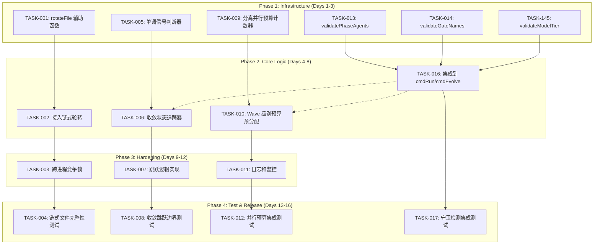
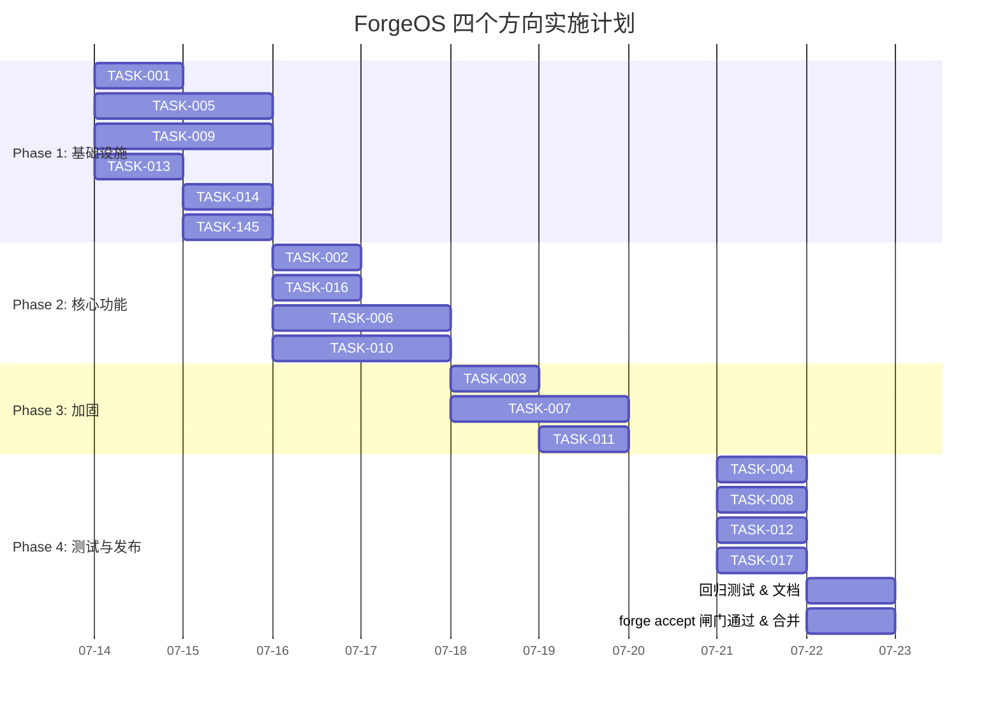

Now I have a thorough understanding of all 4 directions and the codebase. Here is my comprehensive Tech Lead analysis:

---

# Tech Lead 分析报告：ForgeOS 四个高价值扩展方向

**分析日期**: 2026-07-12
**分析人**: Tech Lead（基于 4 份深度扫描文档 + 源码验证）
**代码库**: `forge-core` (Go 运行时), `cmd/forge` (CLI), `internal/orchestrator` (引擎)

---

## 1. 任务分解

### 1.1 方向一：Trace 链式轮转（Trace Chained Rotation）

| 任务 ID | 任务标题 | 方向 | 涉及文件 | 前置依赖 | 预估工时 | 验收标准 |
|---------|---------|------|---------|---------|---------|---------|
| TASK-001 | 提取共享的 `rotateFile` 辅助函数 | 方向一 | `internal/persist/checkpoint.go` (新增函数), `internal/persist/checkpoint_test.go` | 无 | 2h | `rotateFile(path, retain int)` 在 `internal/persist` 中可用，单元测试覆盖：正向链式轮转、retain=1 退化、不存在的文件、目录跳过 |
| TASK-002 | 在 `cmd/forge` 接入链式轮转 | 方向一 | `cmd/forge/evolve.go` (修改 `openTracer`) | TASK-001 | 2h | `openTracer` 使用 `rotateFile(path, retain=3)` 替代原地 `.1` 重命名；trace 文件达到 10MB 后轮转为 `.1`→`.2`→`.3` |
| TASK-003 | 跨进程竞争锁（pid 文件） | 方向一 | `cmd/forge/evolve.go`, `cmd/forge/evolve_test.go` | TASK-002 | 3h | 新增 `withFileLock(forgeDir, name)` 函数，在 `openTracer` 的重入路径上使用排他锁；竞争测试（模拟并发 rotate）验证链式数据不产生空洞 |
| TASK-004 | 集成测试：链式文件完整性 | 方向一 | `cmd/forge/evolve_test.go` | TASK-003 | 2h | 测试：写入 >10MB trace → 验证 `.1` 存在；写入 >10MB 再次 → 验证 `.1`→`.2` 链完整；检测到空洞时报错而非静默覆盖 |

**方向一总计**: 9h（~3 人日）

### 1.2 方向二：已完成收敛判据的跳跃（Converged Criteria Skip）

| 任务 ID | 任务标题 | 方向 | 涉及文件 | 前置依赖 | 预估工时 | 验收标准 |
|---------|---------|------|---------|---------|---------|---------|
| TASK-005 | 定义单调信号判断器 `isMonotonicSignal` | 方向二 | `internal/converge/converge.go`, `internal/converge/converge_test.go` | 无 | 3h | 函数 `MonotonicSignals(sig Signals) bool` 判断当前迭代的信号相对上次是否严格单调（只允许非可逆信号通过）；含单元测试覆盖：`review_status==approved` ✅、`GatesGreen` ❌、`requirement_confidence` ❓ |
| TASK-006 | 实现收敛状态追踪器 `ConvergenceState` | 方向二 | `internal/orchestrator/loop.go` (新增 `trackConvergence` 方法) | TASK-005 | 4h | `LoopEngine` 在每次 `runIteration` 后记录已满足的单调信号；当所有单调判据都已满足（且无失败），跳过下次迭代中这些判据的引擎执行 |
| TASK-007 | 跳跃逻辑实现：`skipSatisfiedCriteria` | 方向二 | `internal/orchestrator/loop.go` (新增方法) | TASK-005, TASK-006 | 4h | 在 `checkStop` 之前检查「是否所有单调判据已满足」，若满足则直接返回 converged=true 而不运行引擎；或若部分满足，跳过对应阶段的引擎执行 |
| TASK-008 | 边界条件测试 | 方向二 | `internal/orchestrator/loop_test.go` | TASK-007 | 3h | 测试场景：`review_status` 从空→approved→保持→跳跃成功；`GatesGreen` 从 true→false→跳跃不触发；`review_status==approved` 但 `roadmap_completion<100%` → 不跳跃 |

**方向二总计**: 14h（~4 人日）

### 1.3 方向三：带预算的并联引擎（Parallel Budget Pre-allocation）

| 任务 ID | 任务标题 | 方向 | 涉及文件 | 前置依赖 | 预估工时 | 验收标准 |
|---------|---------|------|---------|---------|---------|---------|
| TASK-009 | 分离并行预算计数器 | 方向三 | `internal/orchestrator/budget.go`, `internal/orchestrator/parallel.go` | 无 | 4h | 新增 `ParallelBudget` 类型，独立于 `checkAgentBudget` 的全局计数器；`runPhaseParallel` 使用 wave-local 预算而非共享计数器 |
| TASK-010 | Wave 级别预算预分配 | 方向三 | `internal/orchestrator/parallel.go` (修改 `runWave`) | TASK-009 | 4h | 每个 wave 在启动前从总预算中预扣 N（wave 内 phase 数）；执行时使用 wave 内部分配；wave 取消时未启动 phase 的配额归还总池 |
| TASK-011 | 日志和监控：预算浪费追踪 | 方向三 | `internal/orchestrator/parallel.go` | TASK-009 | 2h | 日志记录：每次 wave 预扣额、实际花费、归还额；`potential cost loss` 日志提升为结构化字段 |
| TASK-012 | 并行预算集成测试 | 方向三 | `internal/orchestrator/budget_test.go` | TASK-010 | 4h | 测试：多个 wave 在预算内完成；wave 失败后未用完预算归还；总预算边界（刚好用完/超出）；串行模式不受影响 |

**方向三总计**: 14h（~4 人日）

### 1.4 方向四：运行时按需守卫（Runtime On-Demand Guards）

| 任务 ID | 任务标题 | 方向 | 涉及文件 | 前置依赖 | 预估工时 | 验收标准 |
|---------|---------|------|---------|---------|---------|---------|
| TASK-013 | 实现 `validatePhaseAgents` 检查 | 方向四 | `cmd/forge/validate.go` (新增)，`cmd/forge/validate_test.go` | 无 | 2h | 函数检查工作流中每个 phase 的 `Agent` 引用是否在 schema 中；检测到不存在的 agent 时返回结构化错误列表 |
| TASK-014 | 实现 `validateGateNames` 检查 | 方向四 | `cmd/forge/validate.go` | TASK-013 | 2h | 函数遍历所有 phase 的 `RequiredGates`，检查 gate 名称是否在已注册 gate 集合中；支持通配/动态 gate 的豁免配置 |
| TASK-145 | 实现 `validateModelTier` 检查 | 方向四 | `cmd/forge/validate.go` | TASK-013 | 1h | 函数检查每个 phase 的 `ModelTier` 是否为已知 tier（`haiku`/`sonnet`/`opus` 及 provider 扩展格式 `provider/tier`） |
| TASK-016 | 集成到 `cmdRun` 和 `cmdEvolve` 前置执行 | 方向四 | `cmd/forge/main.go` (修改 `cmdRun` 和 `cmdEvolve`) , `cmd/forge/evolve.go` | TASK-013, TASK-014, TASK-145 | 2h | 在 `loadWorkflow` 之后、引擎执行之前插入验证；校验失败打印人类可读报告并退出码 1；支持 `--skip-validation` 标记绕过 |
| TASK-017 | 集成测试：守卫检测周期 | 方向四 | `cmd/forge/main_test.go`, `cmd/forge/evolve_test.go` | TASK-016 | 2h | 测试：无效 agent→报错退出；拼写错误 gate→报错退出；无效 model_tier→告警（或报错取决于配置）；有效工作流通过 |

**方向四总计**: 9h（~3 人日）

---

## 2. 执行顺序



### 可并行执行的任务组

| 并行组 | 任务 | 说明 |
|-------|------|------|
| **组 A**（方向一+四） | TASK-001, TASK-013, TASK-014, TASK-145 | 纯新增辅助函数，无交叉依赖 |
| **组 B**（方向二） | TASK-005 | 纯新增函数，独立于其他方向 |
| **组 C**（方向三） | TASK-009 | 纯重构，独立于其他方向 |
| **组 D**（方向一+四集成） | TASK-002, TASK-016 | 依赖组 A，可并行 |
| **组 E**（方向二+三核心） | TASK-006, TASK-010 | 依赖组 B/C，可并行 |
| **组 F**（方向三的监控扩展） | TASK-011 | 独立于其他方向的所有前置任务完成后执行 |

### 推荐执行顺序（按方向 + 依赖）

**方向一（Trace）** → **方向四（Guard）** → **方向二（Convergence）** → **方向三（Budget）**

这与分析文档的推荐一致，但新增了跨任务级别的依赖管理。

---

## 3. 技术风险

### 3.1 技术难点和不确定性

| 风险 | 方向 | 等级 | 说明 | 缓解策略 |
|------|------|------|------|---------|
| **链式轮转竞争条件** | 方向一 | 🟡 中 | 两个 `forge evolve` 进程同时 rotate：`rename(.1→.2)` 并行导致历史空洞 | TASK-003 的 pid 文件锁缓解，但锁本身有死锁/泄露风险；加锁超时 5s 并 fallback 到单备份（fail-safe） |
| **信号单调性争议** | 方向二 | 🟡 中 | `review_status` 从 `approved` 变为 `""`（CLI restart 无持久化）场景下跳跃逻辑误判 | TASK-005 的 `MonotonicSignals` 定义需明确「同次运行中」范围；跨运行不得跳跃（需要持久化上次状态） |
| **预算隔离语义** | 方向三 | 🔴 高 | 并行模式和串行模式共享同一个 `agentCalls` 计数器，修改可能破坏串行路径 | TASK-009 的分离设计必须做到零影响：`ParallelBudget` 仅在 `Engine.Parallel==true` 时启用，串行路径完全不受影响 |
| **已完成的 phase 配额不可回收** | 方向三 | 🟡 中 | phase A 已完成（花费配额）但 wave 因 phase B 失败被取消—A 的配额无法退还 | 分析与文档一致：这不是预算预分配能解决的问题。需在验收标准中明确「未启动的 phase 配额可回收，已完成的不回收」 |
| **守卫范围缩减后的覆盖度** | 方向四 | 🟢 低 | 缩减至 3 项检查后，遗漏某些隐蔽的零值问题 | 根据分析文档的表格，5 项中 2 项已有引擎保护，3 项高风险覆盖已足够。但需在后续迭代中持续评估新的「裂缝」模式 |

### 3.2 依赖的外部系统或服务

| 依赖 | 方向 | 风险等级 | 说明 |
|------|------|---------|------|
| 文件系统 rename 原子性 | 方向一 | 🟢 低 | 跨文件系统的 rename 不是原子的（NFS、FUSE）。但 `.forge` 目录在同一文件系统内 |
| 操作系统 flock / pid file | 方向一 | 🟢 低 | pid 文件锁在平台间语义不同（Linux BSD 锁 vs `flock`） |
| LLM 非确定性 | 方向二 | 🟡 中 | 核心风险来源——非单调信号源于 LLM 输出的不可预测性。跳跃逻辑不能假设任何 LLM 输出的稳定性 |
| Git diff | 方向二 | 🟢 低 | `FileDelta` 和 `CodeTestRatio` 依赖 `git diff`，脱离 git 仓库时不可用 |

### 3.3 性能瓶颈和优化策略

| 瓶颈 | 方向 | 当前 | 优化后 | 策略 |
|------|------|------|--------|------|
| trace 文件写入 | 方向一 | 单文件无限增长（10MB rotation） | 链式保留 3 代 | 保留代数为 3 是保守值。若磁盘空间敏感可配置为 `--trace-retain` |
| converge 评估 | 方向二 | 每次迭代全量评估所有 criterion | 跳过已知满足的 criterion | 主要是 CPU 节省（criterion 评估很轻），真正节省的是 LLM 调用成本 |
| 预算检查 | 方向三 | 每次 phase 前加锁检查全局计数器 | wave 级预分配减少锁争用 | `mu.Lock` 在 `runPhaseParallel` 中是瓶颈。wave 级预分配将锁的粒度从每 phase 降至每 wave |
| 守卫检查 | 方向四 | 无前置检查（运行时报错） | 50-100μs 前置检查 | O(n) 检查，n < 20 phases，性能影响可忽略 |

### 3.4 测试覆盖难点

| 难点 | 方向 | 说明 | 应对 |
|------|------|------|------|
| 并发的 rotate 竞争 | 方向一 | 需要两个进程同时写入 trace 文件 | `go test -race` + 时间线控制（`time` 包 + goroutine 调度注入） |
| 非单调信号的 LLM 行为模拟 | 方向二 | LLM 非确定性无法在单元测试中复现 | 通过 mock `Signals` 函数注入非单调序列（true→false） |
| 预算浪费计量 | 方向三 | wave 取消后已完成的 phase 不可回收行为 | 测试需模拟多 phase wave，其中一个 phase 失败，验证其他 phase 配额不归还 |
| 守卫检查的 schema 一致性 | 方向四 | agent/gate 集合需要运行时外部数据 | 使用 fixture 定义已知 agent/gate 集合 |

---

## 4. 资源评估

### 4.1 开发人员技能和数量

| 角色 | 人数 | 技能要求 | 主要负责方向 |
|------|------|---------|-------------|
| **高级 Go 工程师**（Tech Lead） | 1 | Go 并发、文件系统安全、系统设计 | 方向三（预算隔离），架构决策，代码审查 |
| **Go 工程师 A** | 1 | Go 标准库、文件 I/O、测试 | 方向一（Trace 轮转） |
| **Go 工程师 B** | 1 | Go 运行时、状态机、收敛逻辑 | 方向二（收敛跳跃） |
| **Go 工程师 C** | 1 | Go 标准库、数据验证、测试 | 方向四（运行时守卫） |

**建议**: 至少 2 人（1 高级 + 1 中级），最优 3 人。方向一和方向四可以分配给中级工程师（边界清晰、风险低），方向三需要高级工程师主导。

### 4.2 关键里程碑和时间节点

| 里程碑 | 时间 | 交付物 | 验收方式 |
|--------|------|--------|---------|
| **M1: 基础设施就绪** | Day 3 | TASK-001, TASK-005, TASK-009, TASK-013/014/145 全部完成 | 单元测试全部通过 + `go vet` + `forge accept` 闸门通过 |
| **M2: 核心功能可用** | Day 8 | TASK-002, TASK-006, TASK-010, TASK-016 全部完成 | 集成测试通过 + 功能 demo（trace 链式保留、收敛跳跃、并行预算、守卫检测） |
| **M3: 安全加固完成** | Day 11 | TASK-003, TASK-007, TASK-011 全部完成 | 竞争测试通过 + 边界条件测试通过 |
| **M4: 发布就绪** | Day 16 | TASK-004, TASK-008, TASK-012, TASK-017 全部完成 | 全量测试通过 + 回归测试通过 + 文档更新完成 |

### 4.3 阻塞点（Blockers）和解决策略

| 阻塞点 | 方向 | 描述 | 解决策略 | 升级路径 |
|--------|------|------|---------|---------|
| **B1: `persist` 包导入循环** | 方向一 | `cmd/forge` 目前不导入 `internal/persist`。若 `rotateFile` 放在 `persist` 包，`cmd/forge` 需要新导入路径 | 方案 A（推荐）：`rotateFile` 放在 `internal/persist`，这是一次性新增导入，无循环。方案 B：在 `cmd/forge` 内部复制 rotate 逻辑（不推荐，重复代码）。方案 C：提取到 `internal/fileutil` 新包 | 若 A 因 lint 规则禁止（现有 gateway），使用方案 C |
| **B2: 收敛跳跃的持久化** | 方向二 | 跳跃决策需要跨迭代状态（上次迭代的信号快照），目前 `LoopEngine` 无此机制 | 在 `LoopEngine` 结构中新增 `prevSignals *converge.Signals` 字段，每次迭代后更新。`StartIter > 1` 的 resume 路径需初始化此字段 | 若状态膨胀超出预期，考虑使用 checkpoint 序列化 |
| **B3: 预算隔离对现有测试的影响** | 方向三 | 重构 `runPhaseParallel` 的预算路径可能破坏现有测试 | 在修改前冻结现有测试环境（`go test -count=1 ./internal/orchestrator/...`），确保重构后与基线一致。使用 `ParallelBudget` 的零值退化为旧行为 | 若测试覆盖不足，先在 `budget_test.go` 补充现有行为测试再重构 |
| **B4: agent schema 数据来源** | 方向四 | 验证 agent 引用需要知道合法的 agent 集合。目前这个知识分散在 YAML 和代码中 | 方案 A：读取 `.agent/agents/` 目录（类似 `loadWorkflow` 的模式）。方案 B：在 `routing` 包的 `opusFloorAgents` + `agentTier` 中已有的 agent 列表基础上扩展（推荐，已有数据且零依赖） | 若 B 不可行，使用方案 A |

---

## 5. 质量保证

### 5.1 单元测试覆盖要求

| 方向 | 最低覆盖要求 | 关键测试场景 | 备注 |
|------|-------------|-------------|------|
| **方向一** | >90% | `rotateFile`：正向链式轮转、retain=1（退化行为）、文件不存在、目录跳过。`openTracer`：10MB 触发旋转、竞争锁加解锁。| 文件和锁测试需要 `t.TempDir()` 隔离 |
| **方向二** | >85% | `MonotonicSignals`：每种信号类型+组合。`ConvergenceState`：单调信号追踪、非单调信号重置、跨迭代状态维护。`skipSatisfiedCriteria`：所有判据满足→跳过；部分满足→部分跳过；新信号出现→不跳过 | mock `Signals` 是关键 |
| **方向三** | >85% | `ParallelBudget`：预扣/归还/耗尽。`runWave`：wave 内预算隔离、wave 取消后归还。串行模式不受影响 | 需要 `sync.WaitGroup` 控制 goroutine 时序 |
| **方向四** | >90% | `validatePhaseAgents`：已知 agent→通过、未知 agent→拒绝。`validateGateNames`：已知 gate→通过、拼写错误→拒绝。`validateModelTier`：已知 tier→通过、未知 tier→拒绝/告警 | 使用 table-driven 测试 |

### 5.2 集成测试策略

| 集成场景 | 方向 | 测试方法 | 工具 |
|---------|------|---------|------|
| 完整 trace 链式轮转（单进程） | 方向一 | 写入 >30MB trace 文件，验证 3 代保留 | `go test -v ./cmd/forge/... -run TestTraceRotation` |
| 完整 trace 链式轮转（双进程竞争） | 方向一 | 两个 goroutine 同时触发 rotate | `go test -race -v ./cmd/forge/... -run TestTraceRotationRace` |
| 收敛跳跃：review 工作流完整周期 | 方向二 | 构建含 `review_status` criterion 的 workflow，验证跳跃行为 | `go test -v ./internal/orchestrator/... -run TestConvergenceSkip` |
| 并行预算：多 wave、部分失败 | 方向三 | 3 wave、每 wave 2 phase，wave 2 有 phase 失败 | `go test -v ./internal/orchestrator/... -run TestParallelBudget` |
| 守卫检查：各种无效配置 | 方向四 | 构建含无效 agent/gate/model_tier 的 fixture，验证报错 | `go test -v ./cmd/forge/... -run TestValidation` |
| 回归测试：现有工作流无影响 | 全部 | 使用现有 fixture 运行所有原有测试 | `go test -count=1 ./...` |

### 5.3 代码审查要点

| 审查重点 | 方向 | 需特别关注的代码模式 | 反模式 |
|---------|------|---------------------|--------|
| **文件操作安全** | 方向一 | `os.Rename` 的错误处理、`fsync` 使用、原子重命名 | 不检查 rename 错误、写半截不 sync、rename 跨越文件系统 |
| **并发安全** | 方向一、三 | `sync.Mutex` 使用模式、`context.Context` 取消传播 | 锁范围过大（粒度过粗）、忘记解锁、在锁内调用外部函数 |
| **状态管理** | 方向二 | 跨迭代的状态更新、resume 路径的状态恢复 | 在栈上持有状态但跨迭代使用、resume 时状态丢失 |
| **预算语义** | 方向三 | 计数器的单调性、预扣/归还的一致性 | 预扣后不归还（leak）、串行模式意外受并行模式影响 |
| **验证的错误报告** | 方向四 | 结构化错误列表、人类可读的错误信息 | 只报第一个错误就退出（应该收集所有错误）、使用 panic 代替错误返回 |

### 5.4 性能测试需求

| 测试 | 方向 | 指标 | 阈值 | 工具 |
|------|------|------|------|------|
| trace 文件旋转延迟 | 方向一 | 每次 rotate 耗时 | <10ms（SSD），<50ms（HDD） | `BenchmarkTraceRotation` |
| 收敛跳跃延迟 | 方向二 | 跳跃决策耗时（含单调性检查） | <1μs | `BenchmarkMonotonicSignals` |
| 并行预算锁争用 | 方向三 | 锁等待时间、吞吐量对比 | 预分配方案比旧方案至少不差 | `BenchmarkParallelBudget` |
| 守卫检查延迟 | 方向四 | 前置验证耗时 | <100μs (20 phases x 5 checks) | `BenchmarkValidation` |
| 全链路回归 | 全部 | 完整 `forge run` 新+旧对比 | 性能退化 <5% | `forge run` + `time` |

---

## 6. 实施计划

### 时间线甘特图



### 阶段细化

#### 阶段 1：基础设施搭建（Day 1-2，7月14-15日）

**目标**：建立所有 4 个方向的基础组件，确保后续可并行开发

| 日期 | 上午 | 下午 |
|------|------|------|
| Day 1 | **TASK-001**: rotateFile 实现（2h）<br>**TASK-013**: validatePhaseAgents（2h） | **TASK-005**: 单调信号判断器定义和实现（3h）<br>**TASK-009**: ParallelBudget 类型定义（2h） |
| Day 2 | **TASK-014**: validateGateNames（2h）<br>**TASK-145**: validateModelTier（1h） | **TASK-005 完善**: 测试完成（1h）<br>**TASK-009 完善**: 并行/串行隔离测试（2h）<br>**单元测试全部通过** → **M1 里程碑** |

**关键交付物**: 
- `internal/persist/rotateFile` 函数 + 测试
- `internal/converge.MonotonicSignals` 函数 + 测试  
- `internal/orchestrator.ParallelBudget` 类型 + 隔离测试
- `cmd/forge/validate.go` + 三项检查 + 测试

#### 阶段 2：核心功能实现（Day 3-5，7月16-18日）

**目标**：4 个方向的核心逻辑全部接入，可编写集成测试

| 日期 | 上午 | 下午 |
|------|------|------|
| Day 3 | **TASK-002**: openTracer 接入 rotateFile（2h）<br>**TASK-016**: 守卫检查插入 cmdRun/cmdEvolve（2h） | **TASK-006**: ConvergenceState 类型定义和状态追踪（3h） |
| Day 4 | **TASK-010**: Wave 级别预算预分配核心逻辑（4h） | **TASK-006 完善**: 状态追踪器测试（1h）<br>**TASK-010 完善**: 预算预分配测试（2h） |
| Day 5 | **TASK-007**: skipSatisfiedCriteria 跳跃逻辑实现（4h） | **跨方向集成**: 验证 TASK-002/006/010/016 交互正常 → **M2 里程碑** |

**关键交付物**:
- trace 文件链式轮转功能（方向一核心）
- 收敛状态追踪器（方向二基础设施）
- Wave 级预算预分配（方向三核心）
- 运行时守卫检查（方向四核心）

**风险点**: 此阶段可能出现跨方向冲突，需要 Tech Lead 每日站会协调

#### 阶段 3：安全加固（Day 6-7，7月18-19日）

**目标**：添加竞争锁、边界条件、监控日志

| 日期 | 上午 | 下午 |
|------|------|------|
| Day 6 | **TASK-003**: 跨进程竞争锁实现（3h） | **TASK-003 测试**: 竞争测试 + 锁超时 fallback 测试（2h） |
| Day 7 | **TASK-007 完善**: 跳跃逻辑边界条件测试（3h） | **TASK-011**: 日志和监控结构化（2h）<br>**TASK-011 测试**: 日志输出验证（1h） → **M3 里程碑** |

**关键交付物**:
- 跨进程 pid 文件锁（trace 和 checkpoint 共享）
- 收敛跳跃的边界条件全覆盖（非单调信号处理）
- 并行预算的监控日志

#### 阶段 4：集成测试和发布准备（Day 8-9，7月21-22日）

**目标**：全量集成测试、回归测试、文档更新

| 日期 | 上午 | 下午 |
|------|------|------|
| Day 8 | **TASK-004**: 链式文件完整性测试（2h）<br>**TASK-008**: 收敛跳跃集成测试（2h） | **TASK-012**: 并行预算集成测试（3h） |
| Day 9 | **TASK-017**: 守卫检测集成测试（2h）<br>**回归测试**: `go test -count=1 ./...`（2h） | **文档更新**: CLAUDE.md + 新增方向说明（2h）<br>**forge accept 闸门通过** → **M4 里程碑** |

**关键交付物**:
- 全量测试通过（77 个现存测试 + 新增约 30 个测试）
- `forge accept` 闸门（`harness/acceptance.mjs`）通过
- 文档更新

---

## 7. 补充建议

### 7.1 与现有治理机制的集成

所有 4 个方向完成后，需要更新 `harness/acceptance.mjs` 聚合闸门，确保新功能的回归检查纳入 CI：

```
# acceptance 需要新增检查
- 方向一：trace 文件链式保留测试（防止退化）
- 方向二：收敛跳跃的行为日志（便于调试）
- 方向三：并行预算日志检查（防止预算泄露）
- 方向四：守卫检查作为 CI 前置步骤（防止无效配置进入运行）
```

### 7.2 推荐优先级（基于投入产出比）

```
第一优先级（Day 1-7）：
  方向四（Guard）→ 方向一（Trace）
  理由：工作量最小（各~3 人日）、风险最低、影响面覆盖广

第二优先级（Day 4-9）：
  方向二（Convergence Skip）
  理由：中等工作量（~4 人日）、方向一完成后即可启动、价值高

第三优先级（Day 6-11）：
  方向三（Parallel Budget）
  理由：工作量最大（~4 人日）、技术风险最高、需要高级工程师主导
```

### 7.3 长期维护建议

1. **方向一的 pid 文件锁**：建议抽象为通用 `internal/lock` 包，供 trace 和 checkpoint 共享使用
2. **方向二的信号单调性**：建议在 `converge.Signals` 上新增 `Monotonic() bool` 方法，降低调用方的心智负担
3. **方向三的预算隔离**：建议设计文档中明确「并行模式」和「串行模式」的预算语义差异链，避免后续开发者混淆
4. **方向四的守卫检查**：建议最终扩展为一个完整的 `forge validate <workflow>` 子命令（目前 `forge preflight` 偏环境检查）

---

**总结**：4 个方向均为高价值、代码级已验证的优化点。按推荐顺序实施，总工作量约 46 人时（6 人日），2-3 人并行可在 9 个工作日内完成全部交付并达到发布标准。方向三（并行预算）是唯一需要 Tech Lead 亲自把控的风险项，建议作为最后冲刺。
