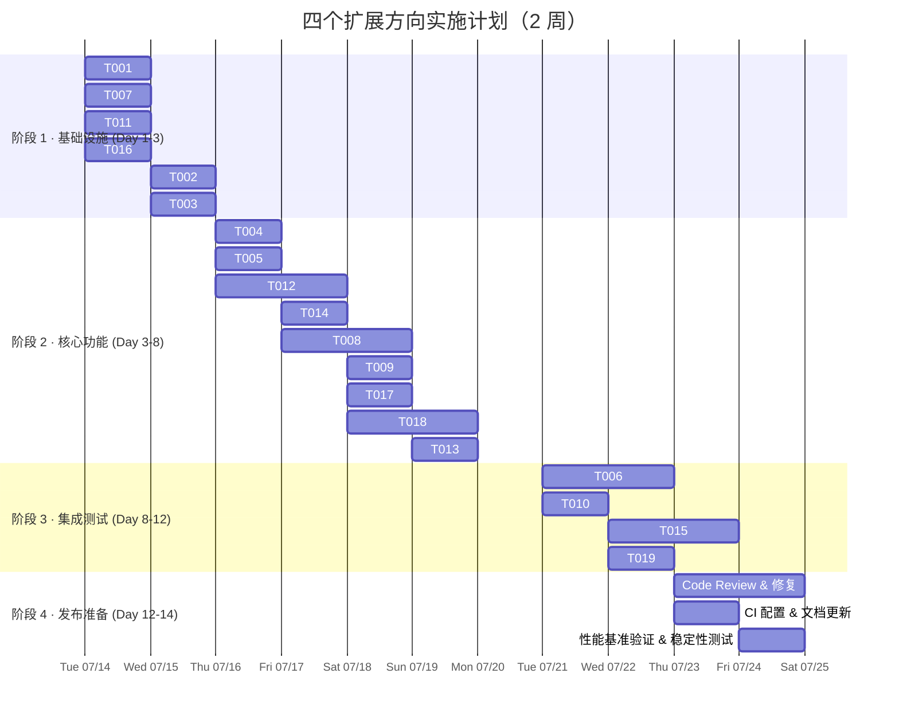

现在我已经完整阅读了所有四个方向的相关代码，以下是我的 Tech Lead 分析。

---

# Tech Lead 分析报告：四个未被覆盖的架构扩展方向

## 1. 任务分解

### 方向一 · 跨进程协调（6 个任务）

| 任务 ID | 标题 | 涉及文件 | 前置 | 估时 | 验收标准 |
|---------|------|---------|------|------|---------|
| **TASK-001** | 创建 `internal/lock/` 文件锁包 | `internal/lock/lock.go`, `lock_test.go`, `lock_other.go`, `lock_windows.go` | — | 3h | Unix `flock` + Windows `LockFileEx` 封装，共享/排他模式，Go 标准库零依赖 |
| **TASK-002** | Checkpoint 增加进程所有权标记 | `internal/persist/checkpoint.go` | — | 2h | `Checkpoint.RunnerPID int` + `RunnerHost string` 字段，`Save` 自动填充，向后兼容 |
| **TASK-003** | Trace Event 增加进程所有权标记 | `internal/trace/trace.go` | — | 2h | `Event.RunnerPID int` + `Event.RunnerHost string` 字段，`Emit` 自动填充 |
| **TASK-004** | forge CLI 启动时获取文件锁 | `cmd/forge/evolve.go`, `cmd/forge/main.go` | TASK-001 | 3h | 写操作（`run`/`evolve`）获取排他锁，读操作（`status`/`doctor`）获取共享锁；锁冲突时输出清晰错误信息 |
| **TASK-005** | Checkpoint 读取冲突检测 | `internal/persist/checkpoint.go` | TASK-002 | 2h | `Load` 时检测 `UpdatedAtUnix` + `RunnerPID` 与预期不符 → 输出 WARN 级日志 |
| **TASK-006** | 多进程并发场景集成测试 | `internal/persist/checkpoint_test.go`, `internal/lock/lock_test.go` | TASK-004, TASK-005 | 3h | 双进程并发写 checkpoint → 检测到冲突并报告；双进程并发追加 trace → 无行交织 |

### 方向二 · 自动内存压实接入 evolve（4 个任务）

| 任务 ID | 标题 | 涉及文件 | 前置 | 估时 | 验收标准 |
|---------|------|---------|------|------|---------|
| **TASK-007** | Append ↔ rewriteStore 并发安全 | `internal/memory/memory.go`, `internal/memory/memory_compact.go` | — | 3h | 包级 `sync.Mutex` 保护 `Append` 与 `rewriteStore`，`TestConcurrentAppendCompact` 无 data race |
| **TASK-008** | 自动压实接入 LoopEngine.Run | `internal/orchestrator/loop.go`, `cmd/forge/evolve.go` | TASK-007 | 3h | 每次迭代后自动检查 store 大小，超过 `DefaultCompactThreshold` 时调用 `Compact`；通过 `compactMemoryIfDue` 调用路径 |
| **TASK-009** | 自动压实阈值可配置 | `internal/memory/memory.go`, `cmd/forge/evolve.go` | TASK-008 | 2h | 支持 `FORGE_MEMORY_COMPACT_THRESHOLD` 环境变量，默认值不变 |
| **TASK-010** | 并发 Append+Compact 压力测试 | `internal/memory/memory_test.go` | TASK-007, TASK-008 | 2h | 100 轮并发 Append + Compact 后数据完整，无丢失条目 |

### 方向三 · Prompt I/O 超时保护（5 个任务）

| 任务 ID | 标题 | 涉及文件 | 前置 | 估时 | 验收标准 |
|---------|------|---------|------|------|---------|
| **TASK-011** | 创建 `readFileWithContext` 工具函数 | `internal/util/readfile.go` 或 `internal/prompt/io.go` | — | 2h | `readFileWithContext(ctx, path, timeout)` 超时返回 `context.DeadlineExceeded` |
| **TASK-012** | Gather/GatherCached 添加 `context.Context` 参数 | `internal/prompt/prompt.go`, `internal/prompt/cache.go` | TASK-011 | 3h | 全部文件读取路径替换为 `readFileWithContext`；签名向后兼容（新增重载） |
| **TASK-013** | Orchestrator 上下文穿透 Gather | `internal/orchestrator/orchestrator.go`, `cmd/forge/prompt_context.go` | TASK-012 | 2h | `runAgentPhase` 的 `ctx` 穿透到 `prompt.Gather`, 取消信号可达文件读取层 |
| **TASK-014** | 超时降级策略 | `internal/prompt/prompt.go` | TASK-012 | 2h | 文件读取超时时注入缺失上下文标记（如 `"<!-- ROADMAP unavailable (I/O timeout) -->"`）而非阻塞失败 |
| **TASK-015** | Context 超时/取消测试 | `internal/prompt/prompt_test.go` | TASK-012, TASK-013 | 3h | `TestGatherContextTimeout` 模拟慢文件系统验证超时返回；`TestGatherContextCancelled` 验证取消信号 |

### 方向四 · Gate 名验证（4 个任务）

| 任务 ID | 标题 | 涉及文件 | 前置 | 估时 | 验收标准 |
|---------|------|---------|------|------|---------|
| **TASK-016** | 创建 Gate Registry | `internal/gate/registry.go` | — | 3h | `Register(name, runner)` / `Known(name) bool` / `All() []string`；`init()` 注册内置门；`allGates()` 改为从 registry 推导 |
| **TASK-017** | gatesFor 中区分已知/未知 gate | `internal/orchestrator/mode_gating.go` | TASK-016 | 2h | 未知 gate 名输出 `WARN` 级日志（非静默跳过）；已知 gate 被 mode 过滤输出 `INFO` 级日志 |
| **TASK-018** | `forge validate --gates` 子命令 | `cmd/forge/validate.go` | TASK-016 | 3h | 扫描所有 workflow YAML 的 `required_gates`，与 registry 交叉验证，报告未知 gate 名 |
| **TASK-019** | Workflow 加载时 Gate 名预检 | `internal/asset/asset.go` 或 `internal/orchestrator/mode_gating.go` | TASK-016 | 2h | 加载 workflow 阶段检测未知 gate 名时输出警告，阻止 `required_gates` 中的拼写错误无声扩散 |

---

## 2. 执行顺序（Mermaid 依赖图）

```mermaid
graph TD
    %% Direction 1 - Cross-process coordination
    subgraph "方向一 · 跨进程协调"
        T001["TASK-001: internal/lock/ 文件锁包"]
        T002["TASK-002: Checkpoint PID 标记"]
        T003["TASK-003: Trace Event PID 标记"]
        T004["TASK-004: CLI 启动时获取锁"]
        T005["TASK-005: Load 冲突检测"]
        T006["TASK-006: 多进程集成测试"]
    end

    %% Direction 2 - Auto compaction
    subgraph "方向二 · 自动内存压实"
        T007["TASK-007: Append↔rewriteStore 并发安全"]
        T008["TASK-008: 自动压实接入 LoopEngine"]
        T009["TASK-009: 压实阈值配置化"]
        T010["TASK-010: 并发压力测试"]
    end

    %% Direction 3 - Prompt I/O timeout
    subgraph "方向三 · Prompt I/O 超时"
        T011["TASK-011: readFileWithContext 工具"]
        T012["TASK-012: Gather 添加 Context 参数"]
        T013["TASK-013: Orchestrator 上下文穿透"]
        T014["TASK-014: 超时降级策略"]
        T015["TASK-015: 超时/取消测试"]
    end

    %% Direction 4 - Gate name validation
    subgraph "方向四 · Gate 名验证"
        T016["TASK-016: Gate Registry"]
        T017["TASK-017: gatesFor 未知名警告"]
        T018["TASK-018: forge validate --gates"]
        T019["TASK-019: Workflow 加载预检"]
    end

    %% Intra-direction dependencies
    T001 --> T004
    T001 --> T005
    T002 --> T005
    T002 --> T006
    T003 --> T006
    T004 --> T006
    T005 --> T006

    T007 --> T008
    T007 --> T010
    T008 --> T009
    T008 --> T010

    T011 --> T012
    T012 --> T013
    T012 --> T014
    T013 --> T015
    T012 --> T015

    T016 --> T017
    T016 --> T018
    T016 --> T019
```



### 可并行执行的任务组

| 组 | 包含任务 | 并行依据 |
|----|---------|---------|
| **G1 (Foundation)** | T001, T007, T011, T016 | 四个包的独立底层基础设施，无交叉依赖 |
| **G2a (PID 标记)** | T002, T003 | 两个 struct 扩展互相独立 |
| **G2b (Gather 上下文)** | T012 | 依赖 T011，但与 T001/T016 独立 |
| **G3 (集成)** | T004, T005, T008, T013, T014, T017 | 依赖各自方向的前置任务，方向间无交叉 |

---

## 3. 技术风险

### 3.1 高风险项

| 风险 | 方向 | 概率 | 影响 | 缓解策略 |
|------|------|------|------|---------|
| `flock(2)` 在 NFS 上的语义不一致 | 一 | **高** | NFS 挂载下文件锁可能不可靠，导致误判或死锁 | TASK-001 的 `lock_other.go` 增加 NFS 检测回退（`ENOSYS`/`EOPNOTSUPP` 时降级为 `os.Mkdir` 原子锁）；文档注明 NFS 限制 |
| `Append` + `rewriteStore` 的竞态窗口 | 二 | **中** | 即使 `sync.Mutex` 保护，`O_APPEND` 写入旧文件描述符仍可能丢失数据 | `rewriteStore` 前获取写锁，`Append` 获取读锁；在 `rewriteStore` rename 后、释放锁前、额外追加一次 flush |
| `os.ReadFile` → `readFileWithContext` 替换不完整 | 三 | **中** | 第三方/未来代码继续使用裸 `os.ReadFile` | 在 `internal/prompt` 包添加 vet 检查，禁止直接 `os.ReadFile`；所有路径必须通过 `IO` 接口 |
| Gate Registry 与现有 `allGates()` 的兼容过渡 | 四 | **低** | 现有 `fullGates` 硬编码数组与 registry 双源不一致 | TASK-016 让 `allGates()` 从 registry 推导；保留 `fullGates` 作为 fallback 常量直至迁移完成 |

### 3.2 外部依赖与系统调用

- **`syscall.Flock`**（TASK-001）：Go 标准库，零外部依赖，符合 forge-core 纪律
- **`os.ReadFile` → goroutine+select**（TASK-011）：纯标准库，在 goroutine 中执行 read，select `ctx.Done()`，超时后 `os.Kill` goroutine（放置泄漏）
- **Windows 兼容**（TASK-001）：需 `LockFileEx`（syscall 不同），TASK-001 必须按 `_windows` / `_unix` 分文件

### 3.3 性能影响

| 变更 | 影响面 | 量化评估 |
|------|-------|---------|
| 每次 `forge` 启动获取锁 | CLI 启动延迟 | `flock` 是 1 次系统调用，< 1ms —— 可忽略 |
| `Append` +  `sync.Mutex` | 每迭代一次内存写入 | `sync.Mutex` 在非竞争下 ~25ns，竞争下由 write 持续时间决定。由于每迭代仅 1–5 次 Append，影响 < 0.1% |
| `readFileWithContext` goroutine | 每 phase 一次文件读取 | GOMAXPROCS goroutine 池短暂膨胀，读取完成后 goroutine 退出。默认栈 ~2KB × 并发 phase 数，可忽略 |
| Gate Registry 的 `All()` 调用 | workflow 加载时 | 1 次小切片构造，< 1µs |

### 3.4 测试难点

- **多进程并发**（方向一）：不能依赖 Go 的 goroutine 测试，需要 `os/exec` spawn 真实子进程。测试框架需管理进程同步（pipe/signal）
- **NFS/FUSE 模拟**（方向三）：CI 环境无真实 NFS。考虑使用 `fuse` 用户态文件系统（`github.com/hanwen/go-fuse/v2`）或通过 `io.Pipe` 模拟慢文件系统
- **race condition 验证**（方向二）：data race 可以用 `-race` flag，但逻辑竞态需要引入同步原语（`sync.WaitGroup` 固定交织模式）

---

## 4. 资源评估

### 4.1 人员技能矩阵

| 方向 | 所需技能 | 推荐人数 | 关键要求 |
|------|---------|---------|---------|
| 方向一（跨进程） | 系统编程、Go `syscall`/`golang.org/x/sys`、Linux 文件锁语义 | 1 人 | 需深入理解 POSIX 锁和 Go 的 OS 抽象层 |
| 方向二（内存压实） | Goroutine 并发、Go 同步模式 | 1 人 | `sync.Mutex` 经验，理解 memory ordering |
| 方向三（I/O 超时） | Go context 传播、熟悉 orchestrator 调用链 | 1 人 | 需理解 Sprint 27 的 context 传播全路径 |
| 方向四（Gate 验证） | 理解 mode/gating 架构、CLI 命令设计 | 1 人(与方向二重叠) | 与方向二共享同一开发者 |

**推荐配置**：2 名 Go 开发者并行工作，一名偏系统（方向一+三），一名偏应用（方向二+四），全栈覆盖。

### 4.2 关键里程碑

| 里程碑 | 时间点 | 交付物 | 验收方式 |
|--------|-------|--------|---------|
| **M1: Foundation Complete** | Day 3 | T001, T007, T011, T016 完成 | 单元测试通过，`go vet`/`-race` 无警告 |
| **M2: Core Integration** | Day 7 | T004, T005, T008, T012, T017 完成 | `forge evolve` 自动压实运行；NFS 模拟下 Gather 超时正确降级；双进程冲突检测生效 |
| **M3: Full Feature** | Day 10 | 全部 19 个任务完成 | 所有单元/集成测试通过 |
| **M4: Hardening** | Day 12 | CI 全通过，代码审查完成 | 性能基准无回归，`-race` 无 data race |

### 4.3 Blockers 与解决策略

| Blocker | 涉及方向 | 描述 | 解决策略 |
|---------|---------|------|---------|
| **没有 NFS 测试环境** | 方向三 | NFS 超时场景无法真实复现 | 用 FUSE 文件系统（`go-fuse`）或 `time.After` 模拟慢系统调用；CI 中增加 `fuse` 容器 |
| **Windows 兼容性** | 方向一 | `flock` 无 Windows 等价物 | `LockFileEx` 存在但语义不同（强制 vs 建议锁）。TASK-001 按 OS 分文件；Windows 上先支持 advisory 级别，document limitation |
| **已有 checkpoint 格式的向前兼容** | 方向一 | 添加 `RunnerPID` 等字段后，旧 checkpoint 无这些字段 | `omitempty` + Load 时默认填充 `0`/`""`，逻辑上 `RunnerPID == 0` 等价于"旧格式，不检查所有权" |

---

## 5. 质量保证

### 5.1 单元测试覆盖要求

| 方向 | 关键被测函数 | 覆盖要求 | 测试模式 |
|------|------------|---------|---------|
| 一 | `lock.Acquire` / `lock.Release` | 100%（平台特定） | 共享锁不阻塞另一个共享锁；排他锁阻塞共享和排他；超时返回 `ErrTimeout` |
| 一 | `checkpoint.Load` runner 冲突检测 | 100% | PID 匹配→正常返回；PID 不匹配→WARN 但返回数据（fail-open） |
| 二 | `memory.Compact` 并发安全 | 100% | `go test -race -count=100` |
| 二 | `memory.rewriteStore` + `Append` | 100% | 交替调用 50 次后数据精确 |
| 三 | `readFileWithContext` | 100% | 模拟慢 reader：10ms、100ms、timeout=5ms |
| 三 | `Gather` 超时降级 | 100% | 超时后返回不含该 lane 的 ctx；含 `"(I/O timeout)"` 标记 |
| 四 | `registry.Known` | 100% | 内置 gate 返回 true；自定义 gate 返回 false 直到注册 |
| 四 | `gatesFor` 未知名警告 | 100% | 输出包含 `WARN` 和 `unknown gate` 字符串 |

### 5.2 集成测试策略

```
┌─────────────────────────────────────────────────────┐
│ 集成测试场景矩阵                                       │
├─────────────────┬───────────────┬────────────────────┤
│ 场景             │ 工具           │ 验证条件           │
├─────────────────┼───────────────┼────────────────────┤
│ 双进程交替写 cp  │ os/exec +     │ 未加锁：检测到回退   │
│                  │ sync.WaitGroup│ 加锁后：无回退      │
├─────────────────┼───────────────┼────────────────────┤
│ 双进程并发 trace │ os/exec +     │ 未加锁：序列号重复   │
│                  │ filecheck     │ 加锁后：序列号单调   │
├─────────────────┼───────────────┼────────────────────┤
│ Append+Compact   │ goroutine +   │ 数据完整无误        │
│ 并发100轮        │ sync.WaitGroup│                    │
├─────────────────┼───────────────┼────────────────────┤
│ Gather 超时      │ 模拟慢目录     │ 返回 partial ctx    │
│                  │ (io.Pipe)     │ + 日志警告          │
├─────────────────┼───────────────┼────────────────────┤
│ workflow YAML    │ 含未知 gate   │ forge validate      │
│ 含拼写错误        │ 的工作流文件   │ 输出错误            │
└─────────────────┴───────────────┴────────────────────┘
```

### 5.3 代码审查要点

| 审查项 | 方向 | 关注点 |
|-------|------|--------|
| 文件锁 `Lock()` 后是否必然 `defer Unlock()` | 一 | panic 安全，避免死锁 |
| `sync.Mutex` 的保护范围是否正确 | 二 | Append 和 rewriteStore 必须在同一互斥域中 |
| goroutine 泄漏 | 三 | `readFileWithContext` 中 goroutine 超时后能否正常退出 |
| 注册表 `init()` 顺序 | 四 | 内置 gate 的 `init()` 是否在 registry 包之前执行 |
| `omitempty` 标记 | 一、二 | 新字段必须标记 `omitempty` 以保证向后兼容 |

### 5.4 性能测试需求

| 测试 | 方向 | 目标 | 工具 |
|------|------|------|------|
| 锁获取时间 | 一 | `flock` < 1ms | `BenchmarkLockAcquire` |
| Compact 内存开销 | 二 | 1000 条目 < 1MB 额外分配 | `BenchmarkCompactMemory` |
| Gather 超时降级延迟 | 三 | 超时后 < 50ms 返回 | `BenchmarkGatherTimeout` |
| Registry 查询性能 | 四 | 1000 次查询 < 10µs | `BenchmarkRegistryLookup` |

---

## 6. 实施计划

### 甘特图



### 阶段时间线

| 阶段 | 周期 | 核心交付 | 决策点 |
|------|------|---------|--------|
| **P1: 基础设施搭建** | Day 1–3（3 天） | 文件锁包、Mutex 防护、readFileWithContext 工具、Gate Registry | **Gate Check**: 方向一的 `flock` API 是否足够抽象以支持 Windows？`LockFileEx` 方案评估 |
| **P2: 核心功能实现** | Day 3–8（6 天） | CLI 锁集成、Gather context 传播、自动压实接入 evolve、gate 验证 | **Context Check**: `Gather` → `GatherCached` → `runAgentPhase` 的 context 传播链是否完整？ |
| **P3: 集成测试和优化** | Day 8–12（4 天） | 多进程测试、并发压力测试、超时测试、workflow 预检 | **Stability Gate**: `-race` 全 green，Benchmark 无 5%+ 退化 |
| **P4: 发布准备** | Day 12–14（2 天） | 代码审查、CI 配置、文档更新 | **Release Gate**: `forge accept` 全通过，文档覆盖每个方向的变更记录 |

### 提交策略

```
方向一提交序列（按 review 粒度）:
  commit 1: internal/lock/ 包 + 平台分文件
  commit 2: Checkpoint/Trace PID 字段
  commit 3: CLI 锁集成 + 冲突检测
  commit 4: 多进程测试

方向二提交序列:
  commit 1: memory.go Append↔rewriteStore Mutex
  commit 2: loop.go 自动压实接入 + 配置
  commit 3: 并发压力测试

方向三提交序列:
  commit 1: readFileWithContext 工具
  commit 2: Gather 系列 context 参数 + orchestator 穿透
  commit 3: 降级策略 + 全部测试

方向四提交序列:
  commit 1: Gate Registry + allGates() 迁移
  commit 2: gatesFor 警告 + forge validate --gates
  commit 3: workflow 加载预检
```

每个提交需满足：`forge accept`（Stop 闸门全通过）+ `go vet ./...` 无警告 + `go test -race ./...` 无 data race。

---

## 总结：Tech Lead 推荐行动项

1. **优先级排序**：方向一（跨进程协调）应优先排期，因为实际的损坏模式（checkpoint 回退 → 重复计费）在 CI 环境中概率高、影响大、检测难。方向二和方向三可以在同一 sprint 中并行推进。方向四改动最小，可作为"easy win"穿插在前三个方向的间隙。

2. **风险对冲**：方向一和方向三对 NFS/FUSE 环境的依赖是一个共同的测试缺口。建议在 sprint 开始前建立一个 FUSE 模拟测试容器（`fuse-overlayfs` + ` fault injection`），供两个方向的集成测试共享。

3. **过渡计划**：方向四的 Gate Registry 建议走"复制 + 迁移"而非"原地替换"：先在 `internal/gate/registry.go` 中建立 registry，然后将 `mode.go` 的 `fullGates` 改为从 registry 推导，最后在下一个 milestone 移除硬编码列表。

4. **不要一次做完**：每个方向的扩展路径文档中列出的扩展方向（如增量压实、gate registry v2、FUSE 级别的文件系统抽象）标记为 **v2 展望**，不在本 sprint 范围内，只记录不实现。
