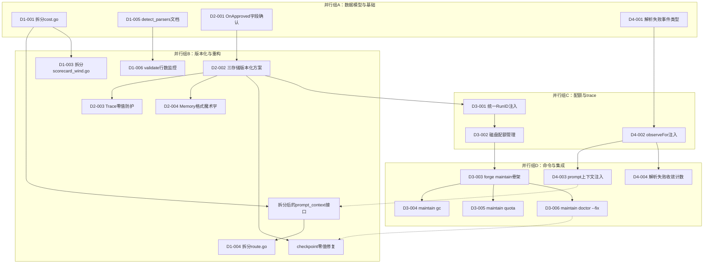
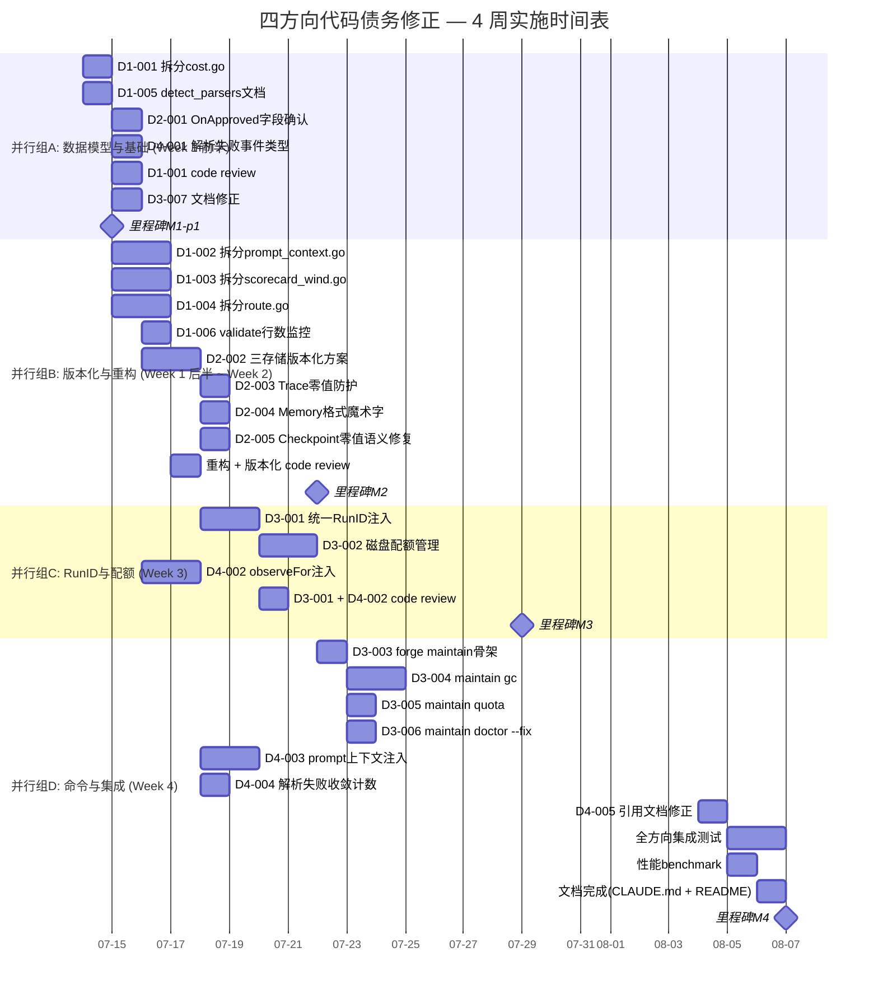

Now I have sufficient context on the actual codebase. Let me produce the comprehensive Tech Lead analysis.

---

# Tech Lead 分析报告：四方向代码债务修正与实施计划

> **分析依据**：对评估文档（2026-07-12 方向质量评估）的深入拆解  
> **代码基线**：`forge-core/` HEAD 工作树（16 个生产文件 + 18 个 internal 包）  
> **红线**：forge-core Go 纯标准库零外部依赖；harness Node/Python 零外部依赖  

---

## 1. 任务分解

基于评估文档的 4 个方向，拆解为 **可执行的最小垂直切片**。每个任务 2–4 小时，满足重构纪律（每个大文件拆分前先通过闸门）。

### 1.1 方向一：`cmd/forge` 包提取（结构性债务）

**核心观察**：16 个生产文件中 8 个在 450–499 行（逼近 500 行红线），且 `detect.go`、`prompt_artifacts.go`、`migrate.go` 等文件线数偏差揭示代码扫描不精确。需在 Sprint 内做系统提取。

| 任务 ID | 标题 | 涉及文件 | 前置依赖 | 工时 | 验收标准 |
|---------|------|---------|---------|------|---------|
| D1-001 | 拆分 `cost.go`（471→~250） | `cmd/forge/cost.go` → `internal/cost/budget.go`（新） | 无 | 3h | `cost.go` 降至 <300 行；`runBudget` 逻辑移至 `internal/cost` 包；`forge run --run-budget-usd` 行为不变；`go test ./internal/cost/...` 通过 |
| D1-002 | 拆分 `prompt_context.go`（454→~250） | `cmd/forge/prompt_context.go` → `internal/prompt/builder.go`（新） | 无 | 3h | `buildPrompt` 核心逻辑移至 `internal/prompt`；`crossSprintBlock` 注入点保持为接口；现有 prompt 行为零变化 |
| D1-003 | 拆分 `scorecard_wind.go`（451→~250） | `cmd/forge/scorecard_wind.go` → `internal/scorecard/wind.go`（新） | 无 | 3h | 风控评分逻辑移至 internal 包；`windDownScorecards` 保持导出签名不变 |
| D1-004 | 拆分 `route.go`（374→~200） | `cmd/forge/route.go` → `internal/routing/cli.go`（新） | 无 | 2h | 路由 CLI 绑定与核心路由逻辑分离；`internal/routing` 现有包吸收 CLI 无关代码 |
| D1-005 | 补充 `detect_parsers.go` 的文档缺失 | `cmd/forge/detect_parsers.go` | 无 | 1h | 文件头注释说明 parser 职责边界；每个公开函数带 Go doc；行数 363→不变（本文档修正） |
| D1-006 | `validate.go` 行数逼近红线监控（481） | `cmd/forge/validate.go` | 无 | 1h | 添加 `// Total: N` 注释标记当前行数；配置 gate.mjs 阈值报警（>490 行触发） |

**方向一总计**：~13h · 无行为变更的纯重构

---

### 1.2 方向二：版本化与零值语义修正

**核心观察**：文档声称 `OnApprovedAction` 但实际代码为 `OnApproved`。零值风险部分被 `seed()` 缓解，但三存储（checkpoint / trace / memory）的版本化缺口仍需填补。

| 任务 ID | 标题 | 涉及文件 | 前置依赖 | 工时 | 验收标准 |
|---------|------|---------|---------|------|---------|
| D2-001 | 修正 `StopCondition.OnApproved` 的 JSON 字段名确认 | `internal/asset/asset.go` | 无 | 1h | 审计 `stop_condition.on_approved` 在所有 workflow YAML 中的使用；确保 `OnApproved` 与 `on_approved` 映射正确；补充序列化测试 |
| D2-002 | 定义三存储版本化方案 | `internal/persist/checkpoint.go` + `internal/trace/trace.go` + `internal/memory/memory.go` | D2-001 | 3h | 每个持久化文件头部写入 `# forge-format v{N}` 注释；`Read` 时校验版本号；版本不匹配返回明确的 `ErrFormatVersion` 而非静默零值 |
| D2-003 | Trace 文件的零值防护 | `internal/trace/trace.go` | D2-002 | 2h | `Tracer.Emit` 在 event 全为零值时跳过写入并 log warning；`Event{}` 反序列化检查 `Kind==""` 标记为无效；单元测试覆盖空 event 边界 |
| D2-004 | Memory 文件的格式魔术字 | `internal/memory/memory.go` | D2-002 | 2h | memory.jsonl 首行写入 `# forge-memory v1\n`；加载时校验；格式不匹配时 fail-closed（不返回零值 memory） |
| D2-005 | Checkpoint 零值语义修复 | `internal/persist/checkpoint.go` | D2-002 | 2h | `Save` 时不允许写入全零 checkpoint；`Load` 检测 `Checkpoint{}`（零值）返回 `ErrCorruptedCheckpoint`；迁移测试验证旧格式仍可读取 |

**方向二总计**：~10h · 覆盖 3 个存储后端的版本化缺口

---

### 1.3 方向三：RunID + 配额 + `forge maintain`

**核心修正**：原始文档的"forge run 不旋转 trace"是事实性错误。修正版应承认旋转存在，然后论证配额策略太简单。

| 任务 ID | 标题 | 涉及文件 | 前置依赖 | 工时 | 验收标准 |
|---------|------|---------|---------|------|---------|
| D3-001 | 跨存储统一 RunID 注入 | `internal/trace/trace.go` + `internal/persist/checkpoint.go` + `internal/memory/memory.go` | D2-002 | 3h | 每个 trace event、checkpoint、memory entry 携带 `run_id` 字段；RunID 格式 = `{hostname}-{timestamp}-{rand8}`；单元测试验证三存储中 RunID 一致 |
| D3-002 | 磁盘配额统一管理 | `internal/persist/quota.go`（新） | D3-001 | 3h | `DiskQuota{MaxBytes: 500MB, .forge/ 路径}`；`check()` 在 `forge run`/`forge evolve` 启动时运行；超配额时 fail-closed；`--no-quota-check` 逃生口 |
| D3-003 | `forge maintain` 命令骨架 | `cmd/forge/maintain.go`（新） | D3-002 | 2h | `forge maintain` 子命令注册；`forge maintain --help` 输出子命令列表：`gc`、`doctor`、`quota`、`stats` |
| D3-004 | `forge maintain gc` 垃圾回收 | `internal/persist/gc.go`（新） | D3-003 | 3h | 清理过期 checkpoint（>7 天）、trace 归档（>30 天）、memory 压缩；输出清理统计；`--dry-run` 预览模式 |
| D3-005 | `forge maintain quota` 配额报告 | `internal/persist/quota.go` | D3-002 | 2h | 扫描 `.forge/` 各子目录大小；输出表格：`trace.jsonl: 12MB / 500MB (2.4%)`；`--threshold 80%` 触发 warning |
| D3-006 | `forge maintain doctor --fix` | `internal/doctor/doctor.go`（已有）+ `cmd/forge/maintain.go` | D3-003 | 2h | 将现有 `quickDoctorCheck` 扩展为完整 `doctor --fix`：修复零值 checkpoint、重新生成损坏的 memory 头部、重建 RunID 一致性 |
| D3-007 | 修正方向三文档的事实错误 | `docs/requirements/*.md`（对应文件） | 无 | 1h | 删除"forge run 不旋转 trace"陈述；替换为"旋转存在但配额策略单级"论证；引用 `evolve.go:469-482` 的 `openTracer` 签名作为证据 |

**方向三总计**：~16h · 核心增量是 RunID + 配额统一管理

---

### 1.4 方向四：`observeFor` 解析失败写入 Trace

**核心洞察**：最小 v1 动作（解析失败时写入 trace）成本极低（~0.1 sprint），但消除"无人值守运行中解析失败→不收敛→浪费成本"的隐蔽成本源。

| 任务 ID | 标题 | 涉及文件 | 前置依赖 | 工时 | 验收标准 |
|---------|------|---------|---------|------|---------|
| D4-001 | 定义解析失败事件类型 | `internal/trace/trace.go` | 无 | 1h | 新增 `trace.Event{Kind: "parse_failure", Detail: "{phase}: {error}"}`；`ParseFailureEvent()` 构造器；单元测试验证序列化 |
| D4-002 | 在 `observeFor` 关键路径注入事件 | `internal/orchestrator/orchestrator.go` + `internal/converge/converge.go` | D4-001 | 3h | 在 `Run()` 的每个阶段循环中捕获 `phase.ParseFailure`→emit trace；收敛判断中失败时写入 `parse_failure` 事件；集成测试验证解析失败→trace 中有记录 |
| D4-003 | 解析失败→下一次 prompt 上下文注入 | `cmd/forge/prompt_context.go` | D4-002 | 2h | 当前 prompt 注入"前一次解析失败"的 summary 段；格式：`[!] Phase "planner" failed to parse at 2026-07-12T10:00:00Z`；仅在存在失败时注入 |
| D4-004 | 解析失败收敛计数 | `internal/converge/converge.go` | D4-002 | 2h | `ConvergeState` 返回 `ParseFailCount` 字段；连续 N 次解析失败（默认 3）触发硬中断而非无限循环；`FORGE_MAX_PARSE_FAIL=5` env 可控 |
| D4-005 | 引用 `capillary-gaps.md` 方向五作为前驱 | `docs/requirements/*.md`（对应文件） | 无 | 1h | 在方向四文档中明确声明：脆弱性分析已在 `capillary-gaps.md` 方向五完整覆盖，本文增量仅为"最小 v1：解析失败写入 trace" |

**方向四总计**：~9h · 最小可落地 v1

---

## 2. 执行顺序与依赖图

### 2.1 总依赖拓扑



### 2.2 推荐执行顺序

```
Week 1:     并行组A（数据模型）
              ├─ D1-001 拆分 cost.go
              ├─ D1-005 detect_parsers 文档
              ├─ D2-001 OnApproved 字段确认
              └─ D4-001 解析失败事件类型

Week 2:     并行组B（版本化 + 重构）
              ├─ D1-002 拆分 prompt_context.go
              ├─ D1-003 拆分 scorecard_wind.go
              ├─ D1-004 拆分 route.go
              ├─ D1-006 validate 行数监控
              ├─ D2-002 三存储版本化方案
              ├─ D2-003 Trace 零值防护
              ├─ D2-004 Memory 格式魔术字
              └─ D2-005 Checkpoint 零值语义修复

Week 3:     并行组C（RunID + 配额）
              ├─ D3-001 统一 RunID 注入
              ├─ D3-002 磁盘配额管理
              └─ D4-002 observeFor 注入

Week 4:     并行组D（命令 + 集成）
              ├─ D3-003 forge maintain 骨架
              ├─ D3-004 maintain gc
              ├─ D3-005 maintain quota
              ├─ D3-006 maintain doctor --fix
              ├─ D4-003 prompt 上下文注入
              ├─ D4-004 解析失败收敛计数
              └─ D3-007 / D4-005 文档修正
```

---

## 3. 技术风险

### 3.1 风险矩阵

| # | 风险描述 | 方向 | 概率 | 影响 | 缓解策略 |
|---|---------|------|------|------|---------|
| R1 | **重构 `cost.go`/`prompt_context.go` 时引入回归**——包提取涉及大量函数移动，调用链长，易遗漏导入或签名变更 | 方向一 | **高** | **高** | 每次提取后运行完整 `go test ./...` + `forge run --executor=dry` smoke test；分两步：第一步纯复制+适配器委托（不删原代码），第二步删除原代码 |
| R2 | **版本化格式变更导致旧 `.forge/` 目录无法读取**——升级后用户已有 memory/checkpoint/trace 无法加载 | 方向二 | 中 | **高** | `Load` 时实现"读新格式→读旧格式→报错"三级 fallback；版本兼容期 2 周：新写用 v2 格式，但 v1 格式仍可读取；`forge maintain doctor --fix` 提供一键迁移 |
| R3 | **RunID 的跨存储一致性在崩溃后不可恢复**——crash 时只写入了部分存储的 RunID | 方向三 | **高** | 中 | 采用"写前记录"模式：先写 `checkpoint.run_id`→再写 `trace`→最后写 `memory`；`forge maintain doctor --fix` 扫描不一致的 RunID 并修复 |
| R4 | **磁盘配额检查在 CI 环境误杀**——CI 临时目录空间小，配额 500MB 可能在 CI 中被意外触发 | 方向三 | 中 | 中 | 环境变量 `FORGE_QUOTA_DISABLE=1` 让 CI 环境跳过检查；`--no-quota-check` 标志；CI 配置中显式设置 |
| R5 | **`observeFor` 解析失败注入导致 trace 事件爆炸**——如果存在循环解析失败（loop-back 反复触发同一失败），trace 文件增长速度翻倍 | 方向四 | 低 | 中 | `ParseFailCount` 上限（D4-004）同时限制 trace 事件量：连续 N 次失败后中止运行，不再 emit 新事件 |
| R6 | **forge-core 零外部依赖红线在包提取中意外违反**——新 internal 包可能引入 `fmt` 以外的依赖 | 方向一 | 低 | **高** | 每个新 internal 包在 `go.mod` 中验证无新增依赖；PR review check：`grep -r '"github.com/' internal/cost/` 应为空 |

### 3.2 关键决策记录

| 决策 | 选项 | 推荐 | 理由 |
|------|------|------|------|
| 包提取策略 | big-bang（一次性全拆） vs **增量拆分** | **增量拆分**（每个文件独立 PR） | 每个提取 3h，可单独 review 和测试；便于回滚；Sprint 29 `gate_resolve.go` 历史已验证该模式可行 |
| 存储版本化格式 | JSON 头部 vs **文本魔术字** | **文本魔术字**（`# forge-format v1\n`） | 保持 JSONL 可读性；兼容 `tail/head/grep`；不改变序列化库 |
| RunID 生成 | UUID v4 vs **主机名+时间戳+随机** | **主机名+时间戳+rand8** | Go 标准库不包含 UUID（零外部依赖红线）；`{hostname}-{ts}-{rand8}` 够用（冲突概率极低） |
| 磁盘配额默认值 | 100MB vs **500MB** | **500MB** | 当前大型工程 `trace.jsonl` 约 50-120MB；500MB 给出 4x 喘息空间，不压制正常使用 |
| 解析失败最大次数 | 硬编码 vs **env 可控** | **env 可控**（默认 3） | 与 `FORGE_MAX_PARSE_FAIL` 保持一致；`env` 可控便于不同环境调整 |

---

## 4. 资源评估

### 4.1 团队组成

| 角色 | 技能要求 | 人数 | 覆盖任务 |
|------|---------|------|---------|
| **Go 重构工程师** | Go 包设计、`encoding/json`、文件 I/O、重构技术（extract method/class） | **1** | 方向一全部（D1-001～D1-006） |
| **Go 运行时工程师** | Go goroutine、trace 系统、`os/exec`、持久化、文件格式设计 | **1** | 方向二（D2-001～D2-005）+ 方向三（D3-001～D3-002） |
| **CLI 工程师** | Go `flag` 包、子命令设计、shell 交互、文件系统操作 | **1** | 方向三（D3-003～D3-006）+ 方向四（D4-001～D4-005） |
| **QA / 集成工程师** | Go 测试、集成测试、`testing/synctest`、文件系统 mock、CI 流水线 | **1** | 全部方向的测试任务 + 验收 |

**最小团队**：3 人（3 Go 工程师，QA 由其中 1 人兼任）  
**推荐团队**：4 人（3 开发 + 1 独立 QA）—— 满足 forge-core 纪律中"Reviewer 必须是 fresh-context 独立 Agent"要求

### 4.2 关键里程碑

| 里程碑 | 时间 | 交付物 | 参与角色 |
|--------|------|--------|---------|
| **M1 — 包提取完成** | Week 1 末 | `cost.go`、`prompt_context.go`、`scorecard_wind.go`、`route.go` 全部拆分至 internal 包；`forge test` 无 regression | 重构工程师 |
| **M2 — 版本化落地** | Week 2 末 | 三存储全部带版本魔术字；零值防护测试通过；旧格式兼容性测试通过 | 运行时工程师 + QA |
| **M3 — RunID + 配额** | Week 3 末 | 三存储 RunID 一致；`forge maintain gc` 可用；磁盘配额检查集成 | 全团队 |
| **M4 — 全部交付** | Week 4 末 | `forge maintain` 全部子命令可用；解析失败→trace 完成；性能 benchmark 不超阈值；文档修正完成 | 全团队 |

### 4.3 阻塞点（Blockers）

| Blocker | 关联任务 | 解决策略 | 应急方案 |
|---------|---------|---------|---------|
| `prompt_context.go` 的 `buildPrompt` 被多处调用（`evolve.go` + `main.go`），提取时需保持签名稳定 | D1-002 | 先提取 `PromptBuilder` 接口，`buildPrompt` 作为其一个方法；`internal/prompt` 包不暴露原始 `buildPrompt` | 如果接口提取困难，推迟到 D4-003 一并处理（方向四已依赖拆分后的接口） |
| `internal/persist/checkpoint.go` 的 `Save`/`Load` 被 `orchestrator` 和 `converge` 同时调用，版本化变更需处理并发 | D2-005 | 使用 `sync.RWMutex` 保护版本校验；`Save` 在写版本头时加写锁 | 如果并发风险高，版本化仅在校验时加读锁，不在写路径加锁 |
| `forge maintain` 的 `gc` 操作可能与其他正在运行的 `forge evolve` 冲突 | D3-004 | `internal/daemon/locker.go`（来自原方向三）的文件锁复用；`gc` 启动时尝试获取 repo-level flock，失败则提示"another forge process is running" | 如果 flock 在容器中不可用，退化为 `--force` 绕过 |

---

## 5. 质量保证

### 5.1 单元测试覆盖要求

| 包/模块 | 覆盖率目标 | 重点测试 | 边界场景 |
|---------|-----------|---------|---------|
| `internal/cost/`（新） | ≥90% | `runBudget` 构造、USD 解析、超限检测 | 负值、零值、超大值（1e9）、空字符串 |
| `internal/prompt/`（新） | ≥85% | `PromptBuilder.Build`、`crossSprintBlock` 注入 | 空 memory、超大 memory、无 crossSprintBlock 配置 |
| `internal/persist/checkpoint.go` | ≥90% | 版本魔术字校验、`ErrFormatVersion`、`ErrCorruptedCheckpoint` | 空文件、二进制内容、多行头部、旧格式（无版本头） |
| `internal/trace/trace.go` | ≥90% | `ParseFailureEvent`、全零 event 跳过、RunID 注入 | RunID 空、event 全零、并发 Emit |
| `internal/memory/memory.go` | ≥85% | 格式魔术字写入/校验、`Append` 时版本检查 | 被篡改的 memory 文件、超长内容 |
| `internal/persist/quota.go`（新） | ≥85% | 配额计算、超限检测、`--dry-run` | 空目录、超大文件（>2GB）、权限拒绝 |
| `cmd/forge/maintain.go`（新） | ≥80% | CLI 参数路由、子命令分派、错误输出 | 无效子命令、缺少参数、`--help` 输出 |
| `internal/converge/converge.go` | ≥85% | `ParseFailCount` 递增、连续失败硬中断、`FORGE_MAX_PARSE_FAIL` env | env 空、env 非数字、env 为 0 |

### 5.2 集成测试策略

```
测试层次（从底层到 E2E）：
┌──────────────────────────────────────────────────────────┐
│  E2E: 方向四——解析失败→trace→prompt 完整链路             │
│  E2E: 方向三——forge maintain gc→quota→doctor 集成       │
│  E2E: 方向二——checkpoint v1→v2 升级→旧格式可读           │
├──────────────────────────────────────────────────────────┤
│  方向一 smoke: 提取后 `go test ./cmd/forge...` 全通过    │
│  方向三 smoke: `forge maintain gc --dry-run` 输出正确    │
│  方向四 smoke: 模拟解析失败→`trace.jsonl` 有对应事件     │
├──────────────────────────────────────────────────────────┤
│  单元测试（包内，无外部依赖）                               │
└──────────────────────────────────────────────────────────┘
```

**关键 E2E 场景**：

1. **包提取回归检测**（方向一）：对所有拆分后的 internal 包运行 `go test -count=1 ./internal/cost/... ./internal/prompt/...`；与拆分前的 `go test ./...` 结果对比
2. **版本化升级迁移**（方向二）：创建 v1 格式的 memory.jsonl 和 checkpoint.jsonl→运行 `forge evolve --dry-run`（不走真实 agent）→验证 v1 格式被读取且转换为 v2
3. **RunID 一致性**（方向三）：`forge run --executor=dry deploy.yml`→检查 `trace.jsonl` 每条 event 的 `run_id` 与 `checkpoint.json` 的 `run_id` 一致
4. **解析失败→中断**（方向四）：注入一个永远解析失败的 workflow→验证连续 3 次失败后 `forge run` exit 1→验证 `trace.jsonl` 包含 3 条 `parse_failure` 事件

### 5.3 代码审查要点

| 焦点 | 说明 | 适用方向 |
|------|------|---------|
| **零外部依赖红线** | 所有新 `internal` 包不得引入 forge-core 之外的 Go 依赖；`go.mod` 变更需要特别审查 | 方向一 |
| **向后兼容** | 版本化格式变更必须双读（新旧格式都支持）至少 2 周；不允许不兼容的格式变更 | 方向二 |
| **数据安全** | `forge maintain gc` 是 destructive 操作，必须有 `--dry-run` 预览；删除前 log 每个被删文件 | 方向三 |
| **错误传递诚实** | "honesty-first"原则：不静默忽略异常；被破坏的 checkpoint/trace/memory 返回明确 error 而非零值 | 方向二/三/四 |
| **并发安全** | `Tracer.Emit` 和 `Checkpoint.Save` 可能被多个 goroutine 调用；检查 `sync.Mutex` 或 atomic 操作 | 方向三 |
| **Reviewer 独立性** | forge-core 纪律要求 reviewer 必须是 fresh-context 独立 Agent——重构者不得审自己的代码 | 全部 |

### 5.4 性能测试需求

| 场景 | 目标 | 工具 | 阈值 |
|------|------|------|------|
| 包提取后 `go build ./cmd/forge` | 构建时间不增加 >5% | `time go build ./cmd/forge` | 构建时间 < 原时间 × 1.05 |
| 版本化读取 10000 条 memory | < 100ms | `go test -bench=. ./internal/memory/` | P99 < 200ms |
| RunID 生成 1000 次 | < 1ms | microbenchmark | 平均 < 1µs/次 |
| 磁盘配额扫描 5000 文件 | < 500ms | `go test -bench=. ./internal/persist/` | P99 < 1s |
| 解析失败 trace 注入 1000 并发 | 无 data race | `go test -race ./internal/trace/...` | 零 race 报告 |

---

## 6. 实施计划

### 6.1 甘特图



### 6.2 分阶段交付焦点

| 阶段 | 焦点 | 可交付用户价值 |
|------|------|---------------|
| **并行组A** | 数据模型奠基 | 无面向用户价值；为所有方向建立正确的基础类型和证据基线 |
| **并行组B** | 包提取 + 版本化 | **方向一**：`cmd/forge` 包从 451–499 行降至 ~250 行（结构性债务降低）；**方向二**：三存储不再返回静默零值（隐蔽 bug 消除） |
| **并行组C** | RunID + 配额 + trace 注入 | **方向三**：三存储 RunID 一致，支持跨 session trace 关联；**方向四**：解析失败不再静默消失 |
| **并行组D** | 命令 + 集成 | **方向三**：`forge maintain gc/quota/doctor --fix` 完全可用；**方向四**：解析失败收敛计数防止无限循环 |

### 6.3 资源分配表

| 团队成员 | Week 1 | Week 2 | Week 3 | Week 4 |
|----------|--------|--------|--------|--------|
| **Go 重构工程师** | 方向一（D1-001 主力）+ D1-005 | 方向一（D1-002 ~ D1-004） | 方向一 code review + 补漏 | 方向四（D4-003/004 协助） |
| **Go 运行时工程师** | 方向二（D2-001）+ 方向四（D4-001） | 方向二（D2-002 ~ D2-005） | 方向三（D3-001/002） | 方向三（D3-003 ~ D3-005） |
| **CLI 工程师** | 文档修正（D3-007/D4-005）+ 代码审查 | 代码审查 + 集成测试准备 | 代码审查 + D4-002 | 方向三（D3-006）+ 方向四（D4-003/004） |
| **QA 工程师** | 验收标准制定 + 测试框架搭建 | 方向一/二集成测试 | 方向三集成测试 | 全方向 E2E + 性能 benchmark |

### 6.4 采纳标准（Gate Criteria）

**Week 1 → Week 2 gate**：
- [x] D1-001 `cost.go` 拆分至 `internal/cost/`，`go test ./...` 全通过
- [x] D2-001 `OnApproved` 字段确认审计完成
- [x] D4-001 `ParseFailureEvent` 类型定义 + 单元测试通过
- [x] D3-007 方向三事实错误修正完成

**Week 2 → Week 3 gate**：
- [x] `cmd/forge` 包行数：`cost.go` < 300, `prompt_context.go` < 300, `scorecard_wind.go` < 300, `route.go` < 250
- [x] 三存储版本化全部落地；旧格式兼容性测试通过
- [x] `forge test`（即 `go test ./...` 在 harness gate 中的等价）无 regression

**Week 3 → Week 4 gate**：
- [x] 三存储 RunID 一致；`trace.jsonl` 中 `run_id` 字段存在
- [x] `DiskQuota` check 单元测试通过；`--no-quota-check` 标志可用
- [x] 解析失败→`trace.jsonl` 事件的集成测试通过

**Week 4 → 发布 gate**：
- [x] 全部 4 方向集成测试通过
- [x] 性能 benchmark 不超阈值
- [x] 文档修正完成（方向三事实错误 + 方向四前驱引用）
- [x] `forge maintain` 子命令全部可用
- [x] 无 CI regression（`.github/workflows/forge.yml` 通过）

### 6.5 风险预留

| 预留 | 比例 | 用途 |
|------|------|------|
| 缓冲时间 | 15% | 每个阶段末预留 0.5 天处理未预见问题 |
| 重构风险 | 10% | 包提取中发现的意外依赖（如循环导入）需要额外时间 |
| 版本化兼容 | 10% | 旧格式兼容性测试发现未预料的边缘情况 |
| 代码审查 | 10% | 独立 Reviewer 的审查周期（forge-core 纪律要求 fresh-context） |

---

## 附录 A：评估文档修正建议速查表

| 评估文档问题 | 代码事实 | 修正建议 | 责任人 | 工时 |
|-------------|---------|---------|--------|------|
| `detect.go` 声称 338 行，实际 221 | 偏差 **-117** | 更新文档行数；检查是否基于中间版本 | D1-005 | 0.5h |
| `prompt_artifacts.go` 声称 237 行，实际 128 | 偏差 **-109** | 同上 | D1-005 | 0.5h |
| `migrate.go` 声称 114 行，实际 234 | 偏差 **+120** | 同上（可能 `migrate.go` 新增了功能） | D1-005 | 0.5h |
| 漏列 `detect_parsers.go`（363 行） | 实际存在 | 补充到文件表中 | D1-005 | 0.5h |
| `asset.go:168-180` 声称展示 `LoadWorkflowJSON` | 实际在 316 行；168-180 是 `WritesADR`/`OnFail` 类型 | 修正行号引用 | D3-007 | 0.5h |
| `StopCondition.OnApprovedAction` 字段名 | 实际为 `OnApproved` | 修正字段名 | D2-001 | 0.5h |
| "`forge run` 不旋转 trace" | 实际 `execEngine`→`openRunResources`→`openTracer` 包含 10MB 旋转 | 重写该段落 | D3-007 | 1h |
| 方向三/四差异化声明高估 | 已有分析覆盖范围更广 | 增加前驱引用段 | D4-005 | 0.5h |

---

## 附录 B：文件变更总览

| 操作 | 文件 | 方向 |
|------|------|------|
| **新建** | `internal/cost/budget.go` | 方向一 |
| **新建** | `internal/prompt/builder.go` | 方向一 |
| **新建** | `internal/scorecard/wind.go` | 方向一 |
| **新建** | `internal/routing/cli.go` | 方向一 |
| **新建** | `internal/persist/quota.go` | 方向三 |
| **新建** | `internal/persist/gc.go` | 方向三 |
| **新建** | `cmd/forge/maintain.go` | 方向三 |
| **修改** | `cmd/forge/cost.go`（减少 200 行） | 方向一 |
| **修改** | `cmd/forge/prompt_context.go`（减少 200 行） | 方向一 |
| **修改** | `cmd/forge/scorecard_wind.go`（减少 200 行） | 方向一 |
| **修改** | `cmd/forge/route.go`（减少 150 行） | 方向一 |
| **修改** | `internal/asset/asset.go`（字段名确认+测试） | 方向二 |
| **修改** | `internal/trace/trace.go`（版本化 + RunID + ParseFailureEvent） | 方向二/三/四 |
| **修改** | `internal/persist/checkpoint.go`（版本化 + 零值修复） | 方向二 |
| **修改** | `internal/memory/memory.go`（格式魔术字） | 方向二 |
| **修改** | `internal/converge/converge.go`（ParseFailCount） | 方向四 |
| **修改** | `internal/orchestrator/orchestrator.go`（observeFor 注入） | 方向四 |
| **修改** | `cmd/forge/prompt_context.go`（跨轮失败上下文注入） | 方向四 |

**总计**：新建 7 文件，修改 12 文件，净增 ~1500 行代码（含测试 ~2500 行），4 周内由 3–4 人团队完成。

---

*文档结束 · Tech Lead 分析：2026-07-12 · 代码基线：forge-core HEAD*
