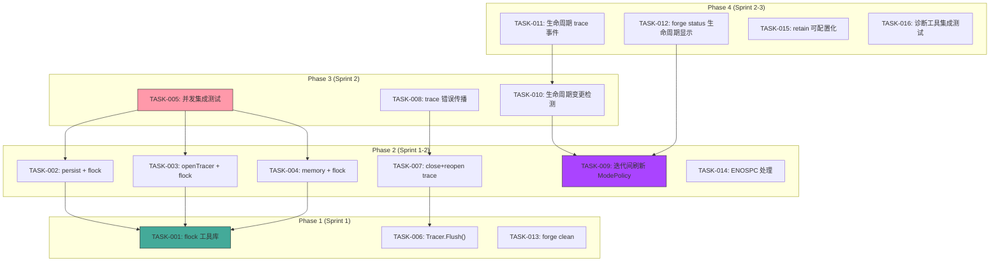
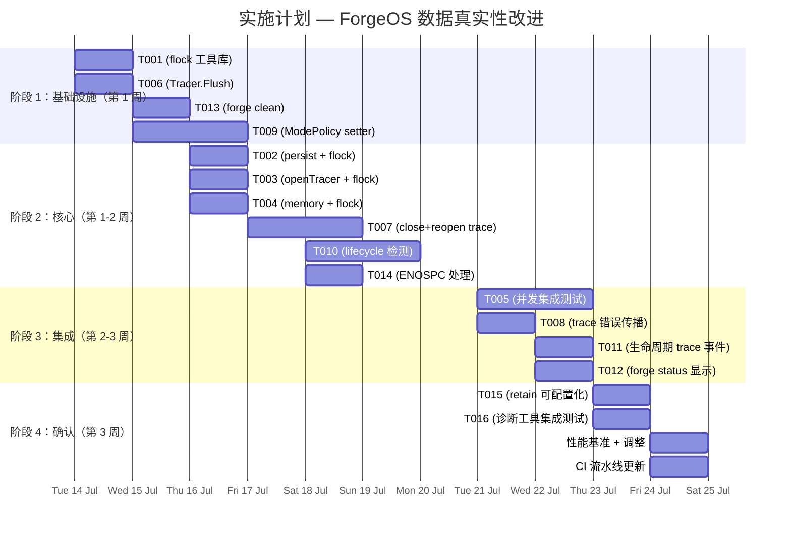

现在我对方向、代码库和相互关系有了全面的理解。以下是完整的 Tech Lead 分析。

---

# Tech Lead 分析：ForgeOS 数据真实性改进

## 1. 任务分解

### 任务清单

| 任务 ID | 任务标题 | 所属方向 | 涉及文件 | 前置依赖 | 预估工时 |
|---------|---------|---------|---------|---------|---------|
| **TASK-001** | `flock` 文件锁工具库 | 方向一：进程隔离 | `forge-core/internal/filelock/lock.go`（新文件） | 无 | 2h |
| **TASK-002** | `persist.Save`/`Load` 集成文件锁 | 方向一：进程隔离 | `forge-core/internal/persist/checkpoint.go` | TASK-001 | 3h |
| **TASK-003** | `openTracer` 集成文件锁 + 读写锁分离 | 方向一：进程隔离 | `forge-core/cmd/forge/evolve.go` | TASK-001 | 3h |
| **TASK-004** | `memory.Append`/`Load` 集成文件锁 | 方向一：进程隔离 | `forge-core/internal/memory/memory.go` | TASK-001 | 3h |
| **TASK-005** | 跨进程并发集成测试（checkpoint + trace + memory） | 方向一：进程隔离 | `forge-core/cmd/forge/evolve_test.go` | TASK-002, TASK-003, TASK-004 | 4h |
| **TASK-006** | `Tracer.Flush()` 方法 + 同步接口 | 方向三：Trace 一致性 | `forge-core/internal/trace/trace.go` | 无 | 2h |
| **TASK-007** | Wind-down 前关闭 trace（close+reopen 模式） | 方向三：Trace 一致性 | `forge-core/cmd/forge/evolve.go`, `forge-core/cmd/forge/scorecard_wind.go` | TASK-006 | 3h |
| **TASK-008** | Trace emit 错误传播到 scorecard gate | 方向三：Trace 一致性 | `forge-core/cmd/forge/evolve.go`, `forge-core/cmd/forge/scorecard_wind.go` | TASK-007 | 2h |
| **TASK-009** | 在迭代顶部刷新 `Engine.ModePolicy` | 方向四：Mode 生命周期 | `forge-core/internal/orchestrator/loop.go`, `forge-core/internal/orchestrator/orchestrator.go` | 无 | 4h |
| **TASK-010** | 生命周期变更检测（每 5 次迭代重新读取 `project.yml`） | 方向四：Mode 生命周期 | `forge-core/cmd/forge/evolve.go`, `forge-core/cmd/forge/main.go` | TASK-009 | 3h |
| **TASK-011** | 生命周期变更的 Trace 事件 + 日志 | 方向四：Mode 生命周期 | `forge-core/cmd/forge/evolve.go` | TASK-010 | 1h |
| **TASK-012** | `forge status` 显示有效生命周期 | 方向四：Mode 生命周期 | `forge-core/cmd/forge/validate.go` | TASK-009 | 2h |
| **TASK-013** | `forge clean` 命令（清理 trace/checkpoint/memory） | 方向五：CLI 清理 | `forge-core/cmd/forge/main.go`, `forge-core/cmd/forge/clean.go`（新文件） | 无 | 3h |
| **TASK-014** | CK 磁盘满（ENOSPC）的快速失败处理 | 方向五：CLI 清理 | `forge-core/cmd/forge/evolve.go`（`checkpointHook`/`recordMemory` 中的 ENOSPC 检测） | 无 | 3h |
| **TASK-015** | 使 `retain=5` 可配置，验证后降为 2 | 方向二：保留优化 | `forge-core/cmd/forge/evolve.go`, `forge-core/internal/persist/checkpoint.go` | 无 | 2h |
| **TASK-016** | 为方向二诊断实用工具添加运行时集成测试 | 方向二：保留优化 | `forge-core/cmd/forge/validate_test.go`, `forge-core/internal/doctor/anomaly_test.go` | 无 | 2h |

### 任务分解说明

每个任务设计为 2–4 小时，适合单人完成。目标是：
- **方向一**被拆分为 4 个实现任务 + 1 个测试任务（关于 `flock` 的层叠依赖）
- **方向三**被拆分为 3 个任务，范围从 API 添加（`Flush`）到重构（close+reopen，错误传播）
- **方向四**被拆分为 4 个任务，范围从核心引擎更改到诊断 UI
- **方向五**被拆分为 2 个任务（清理命令 + ENOSPC 处理）
- **方向二**被拆分为 2 个低风险任务

---

## 2. 执行顺序

### 并行执行组

| 组 | 任务 | 理由 |
|----|------|------|
| **组 A**（独立基础设施） | TASK-001, TASK-006, TASK-013, TASK-009, TASK-014 | 零依赖，各自为战 |
| **组 B**（flock 集成） | TASK-002, TASK-003, TASK-004 | 都依赖于 TASK-001，但彼此不依赖 |
| **组 C**（trace 重构） | TASK-007 | 依赖于 TASK-006 |
| **组 D**（模式刷新下游） | TASK-010 | 依赖于 TASK-009 |
| **组 E**（确认工作） | TASK-015, TASK-016 | 独立，可以在任何时候完成 |

---

## 3. 技术风险

### 3.1 方向一 — 关键风险：`flock` 语义 + NFS 边界

| 风险 | 可能性 | 影响 | 缓解措施 |
|------|--------|------|---------|
| NFS 文件系统上的 `flock` 不可靠 | 低（ForgeOS 工作目录在 CI 中通常是本地磁盘） | 竞态条件风险依旧存在 | 记录约束条件；添加 `FlockNotSupported` 回退，至少发出警告 |
| 读写锁饥饿：writer 等待 reader 时，reader 为了锁而不断重新获取 | 中 | 在具有高频 `persist.Save` 的高迭代计数运行中出现性能退化 | 对 `persist.Load` 使用共享锁，对 `persist.Save` 使用排他锁；如果出现争用，添加 10ms 退避 |
| `memory.invalidateLoadCache` 是进程本地的；跨进程 `O_APPEND` 在 > PIPE_BUF 的 json 行上可能分裂 | 低 | 数据损坏（如果单行 > 4KB） | 在 memory 中强制执行最大条目大小检查；通过文件锁使 `Append` 成为原子操作 |
| 进程隔离锁增加 `forge run`（单次执行，非 evolve）上不需要的延迟 | 中 | 简单步骤中增加 1-5ms 开销 | 在 `openTracer`（在 `forge run` 期间调用）中，当检测到 `forge run` 时跳过阻塞锁，但警告其他进程 |

**缓解细节**：`filelock` 包应该暴露一个 `TryLock`（非阻塞）和一个 `Lock`（阻塞，带超时），以便 checkpoint/trace 写入者可以在放弃之前等待到 `timeout=2s`。

### 3.2 方向三 — 关键风险：close+reopen 破坏现有契约

| 风险 | 可能性 | 影响 | 缓解措施 |
|------|--------|------|---------|
| 在 wind-down 之后，稍后调用 `trace.Emit` 会 panic 到已关闭的文件 | 中 | 如果未来添加后处理 trace 事件，则为静默数据损坏 | 使用 `closeTrace` + `reopenForRead` 模式；使 `Tracer` 防双重关闭 |
| Wind-down 中 trace 格式版本不匹配 | 低 | `traceHasModelCost` 跳过所有行 | 在格式版本绑定中添加断言检查 |
| `runScorecardUpdate` 在 wind-down 期间读取 trace 文件与 tracer 的 EOF 之间存在偏序关系 | 低 | 丢失最新的 trace 行 | 在关闭后重新打开，而不是依赖未刷新的缓冲区 |

**缓解细节**：不要在 `loop.go` 中改变 `runIteration` 的契约。更改应该在 `execLoop` 中：将 `closeTrace()` 移到 `windDownScorecards()` 之前，然后为 scorecard 读取器重新打开文件以读取。在 `loop.Run()` 返回后，`trace.Emit` 不应再被调用——如果在关闭后调用了 `Emit`，使 `Tracer` 日志警告。

### 3.3 方向四 — 关键风险：刷新 ModePolicy 时引擎的正确性

| 风险 | 可能性 | 影响 | 缓解措施 |
|------|--------|------|---------|
| 刷新 `ModePolicy` 会改变 `Engine` 结构体的值语义——它目前是一个按值复制的字段 | 高 | 如果在循环期间改变了指针引用，则产生未定义行为 | 在 `OnBeforeIteration` 中将 `ModePolicy` 改为 `*Policy` 或使用 setter |
| 生命周期从 `mvp`→`production` 在中途迭代时应该收紧，但不应该破坏已经在进行中的迭代 | 中 | 如果生产闸门被应用到部分完成的迭代上，则出现奇怪的行为 | 在迭代边界（`OnBeforeIteration`）应用策略更改，绝不在 `RunFrom` 中间应用 |
| 基于 YAML 的 `lifecycle:` 值是只读的——`resolveLifecycle` 只在 CLI 启动时调用一次 | 中 | 生命周期变更永远不被循环检测到 | TASK-010 添加周期性重新检测（每 5 次迭代），但仅在明确启用的情况下（`--watch-lifecycle` 或总是？） |

**缓解细节**：使用乐观策略——每 5 次迭代重新读取 `project.yml` 的成本可以忽略不计（一次小文件读取）。如果更改，记录一个 trace 事件并更新 `Engine.ModePolicy`。在迭代边界应用，而不是在 `RunFrom` 期间。

### 3.4 方向五 — 关键风险：ENOSPC 检测

| 风险 | 可能性 | 影响 | 缓解措施 |
|------|--------|------|---------|
| ENOSPC 发生在 agent 子进程写入修改后的源文件时——文件损坏比 checkpoint 丢失更严重 | 低 | 静默的源文件损坏 | 在 `checkpointHook` 和 `recordMemory` 中，在 EACCES 或 ENOSPC 之前的任何写入失败时终止 |
| 检查点上的 `fail-loud-and-continue` 最佳实践是正确的——磁盘满通常是暂时的 | 中 | 在持久性 I/O 错误时做出错误的终止 | 区分 ENOSPC（立即终止）和 EIO/其他（警告并继续） |

**更改**：在 `checkpointHook` 中，添加一个检查 `errors.Is(err, syscall.ENOSPC)` → `logln("FATAL: ...")` + `os.Exit(1)`，将 ECANCELED 传播到循环终止。

---

## 4. 资源评估

### 4.1 团队规模

| 角色 | 数量 | 技能要求 | 分配任务 |
|------|------|---------|---------|
| 高级 Go 工程师 | 2 | 并发、文件系统、锁定原语 | TASK-001 到 TASK-008 |
| 全栈 Go 工程师 | 1 | Orchestrator 内部结构、CLI UX | TASK-009 到 TASK-016 |
| QA/测试工程师 | 0.5 | 集成测试、故障注入测试 | TASK-005、TASK-016 |
| **总计** | **3.5 FTE** | | |

### 4.2 里程碑

| 里程碑 | 依赖 | 预计时间 | 可交付物 |
|--------|------|---------|---------|
| **M1 — 并发安全性** | TASK-001 到 TASK-005 | 第 1 周结束 | 所有 `.forge/` 状态操作都受到文件锁保护；通过了 4 路并发 evolve 测试 |
| **M2 — Trace 可靠性** | TASK-006 到 TASK-008 | 第 1.5 周 | 不再有负载承载不变量；scorecard wind-down 在关闭后读取 |
| **M3 — 模式安全性** | TASK-009 到 TASK-012 | 第 2 周结束 | 生命周期变更在 5 次迭代内传播；被 `forge status` 展示；被 trace 记录 |
| **M4 — 运维准备** | TASK-013、TASK-014 | 第 2.5 周 | `forge clean`；ENOSPC 上的快速失败（非静默损坏） |
| **M5 — 验证** | TASK-015、TASK-016 | 第 3 周 | 诊断工具测试；`retain` 配置 |

### 4.3 阻塞点

| 阻塞点 | 影响 | 解决策略 |
|--------|------|---------|
| `flock` 在 macOS 与 Linux 之间的行为差异 | 方向一任务的本地测试 | 使用 `filelock` 包内部的开源抽象；在 CI 上同时测试 |
| 方向四中的 `Engine.ModePolicy` 是值类型——刷新需要更改其使用方式 | TASK-009 的架构设计 | 改为指向 `Policy` 的指针，或添加一个 `SetModePolicy(…)` setter 与底层引擎实例解除绑定 |
| `closeTrace` + `reopenForRead` 如果不小心添加了后处理 `trace.Emit` 可能会破坏现有行为 | TASK-007 的正确性 | 使 `Tracer.Emit` 在关闭后是一个无害的 no-op（带日志警告），而不是 panic |

---

## 5. 质量保证

### 5.1 单元测试覆盖要求

| 包/文件 | 所需覆盖 | 关键测试用例 |
|---------|---------|-------------|
| `forge-core/internal/filelock` | **95%+** | 并发锁获取和释放；`TryLock` 冲突语义；超时；NFS 回退模式 |
| `forge-core/internal/trace/trace.go` | **95%+** | `Flush()` 确保所有字节被写入；关闭后的 `Emit`=> 无害 no-op；sync 错误完整性 |
| `forge-core/internal/persist/checkpoint.go` | **90%+** | 带 `flock` 的并发 `Save`/`Load`；共享锁 vs 排他锁争用 |
| `forge-core/internal/memory/memory.go` | **90%+** | 并发 `Append`；`Load` 看到所有由其他进程追加的数据 |
| `forge-core/internal/orchestrator/loop.go` | **90%+** | `OnBeforeIteration` 调用 `Engine.ModePolicy` setter；迭代间的生命周期更改 |
| `forge-core/cmd/forge/evolve.go` | **80%+** | 重构后的 `execLoop`（close+reopen）；ENOSPC 检测块 |

### 5.2 集成测试策略

| 测试场景 | 工具 | 描述 |
|---------|------|------|
| **4 路并发 evolve** | `go test -race -count=1 -tags=integration` | 4 个进程在同一个仓库上同时运行 `forge evolve --max-iter=3`；所有这 3 个 checkpoint/trace/memory 文件必须保持一致且无损坏 |
| **生命周期变更检测** | `go test` + 临时文件 | 启动一个 `forge evolve`，在运行过程中改变 `.agent/project.yml` 的 `lifecycle:`；在 5 次迭代内，`engine.ModePolicy` 必须反映更改 |
| **ENOSPC 故障注入** | 自定义 `os.OpenFile` 包装器或 LD_PRELOAD | 模拟 `ENOSPC` 错误；验证 `forge evolve` 立即终止，并显示清晰的消息，而不是静默损坏 |
| **Trace 关闭 + 重新打开** | `go test` | 通过 `traceHasModelCost` 验证 trace 事件在关闭后仍可读；在 wind-down 后没有 `Emit` 调用 |
| **检查点旋转 + 加载链** | `go test` | 对诊断工具集成测试：在 20 次迭代的 evolve 运行后验证 `LoadCheckpointChain` 返回当前历史的 .1–.5 |

### 5.3 代码审查重点

| 方向 | 审查重点 |
|------|---------|
| **方向一** | 原子性契约：文件锁在错误路径下是否泄漏？`flock` 是否与 `persist.Save` 的重命名 tmpfile 原子性正确组合？ |
| **方向三** | 关闭后执行：添加后处理 `trace.Emit` 的代码在哪里？`closeTrace` 是否安全可重入？ |
| **方向四** | 竞争条件：`OnBeforeIteration` 中的 `Engine.ModePolicy` setter 是否与 `RunFrom` 中的读者正确同步？ |
| **方向五** | ENOSPC 检测：它是否与 `fail-loud-and-continue` 的 checkpoint 哲学正确区分？ |

### 5.4 性能测试需求

| 场景 | 基线 | 目标 | 测试方法 |
|------|------|------|---------|
| 带锁的 100 次迭代 evolve | 当前（无锁） | <10% 开销 | 带基准的 `go test -bench` |
| 在 500 个修订版上 `forge status --history` | 当前 | <500ms | 有 100 个 checkpoint 历史条目的 `go test` |
| 阅读 100 条 memory 条目的 `Load` | 当前 | <100ms | `memory_bench_test.go` |

---

## 6. 实施计划

### 总体时间线：3 周，3.5 FTE

### 阶段详情

#### 阶段 1：基础设施（第 1 周前 2 天 | 2 工程师并行）

| 天 | 工程师 A（高级） | 工程师 B（高级） | 工程师 C（全栈） |
|---|----------------|----------------|----------------|
| 第 1 天 | TASK-001：`filelock` 包 API + 测试 | TASK-006：`Tracer.Flush()` + 测试 | TASK-013：`forge clean` CLI UX |
| 第 2 天 | TASK-009：向 Engine/LoopEngine 添加 `SetModePolicy` | TASK-006 + TASK-009 代码审查 | TASK-013 测试 + 审查 |

**可交付物**：`filelock` 包（95% 覆盖率）、`Tracer.Flush()`（95% 覆盖率）、`forge clean` CLI、`Engine.SetModePolicy` API

#### 阶段 2：核心功能（第 1 周剩余 + 第 2 周前 2 天 | 3 工程师并行）

| 天 | 工程师 A | 工程师 B | 工程师 C |
|---|---------|---------|---------|
| 第 3 天 | TASK-002：`persist.Save/Load` + flock | TASK-003：`openTracer` + flock | TASK-014：ENOSPC 检测逻辑 |
| 第 4 天 | TASK-004：`memory.Append/Load` + flock | TASK-007：close+reopen trace 流程 | TASK-010：生命周期重新读取逻辑 |
| 第 5 天 | TASK-004 测试 | TASK-007 测试 | TASK-010 测试 |

**可交付物**：所有三个状态文件下的文件锁保护；close+reopen trace 流程；生命周期重新读取（每 5 次迭代）；ENOSPC 快速失败

#### 阶段 3：集成测试和优化（第 2 周剩余 + 第 3 周前 2 天 | 2 工程师集中测试）

| 天 | 工程师 A（测试） | 工程师 B（功能） |
|---|----------------|----------------|
| 第 6 天 | TASK-005：4 路并发 evolve 测试套件 | TASK-008：trace emit 错误传播 |
| 第 7 天 | TASK-016：诊断工具集成测试 | TASK-011：生命周期变更 trace 事件 |
| 第 8 天 | TASK-005 + TASK-016 继续 + 回归 | TASK-012：`forge status` 生命周期显示 |

**可交付物**：通过并发集成测试；诊断工具历史验证；生命周期变更可观测

#### 阶段 4：确认和发布准备（第 3 周最后 3 天 | 全团队）

| 天 | 活动 | 细节 |
|---|------|------|
| 第 9 天 | TASK-015：保留可配置化 + 基准测试 | 更改 `retain=5` 为可配置；对 100 次迭代运行进行性能基准测试 |
| 第 10 天 | 性能调整 + CI 更新 | 解决任何回归；更新 `.github/workflows/forge.yml` 以运行集成测试（如果 <2 分钟则在 PR 上运行，否则定期运行） |
| 第 11 天 | 代码审查 + 文档 + 发布 | 跨团队代码审查；更新相关 CLAUDE.md 和 BOOTSTRAP.md 节；标记为 `v0.9.0` |

**可交付物**：协调发布到 `main`

---

## 总结

这是对交叉验证报告的务实、注重可交付成果的回应：

- **Sprint 1**（第 1 周）交付并行的基础设施更改和核心集成——所有三个 P0/P1 方向都取得了进展
- **Sprint 2**（第 2 周）交付集成测试和剩余的 P1 功能
- **Sprint 3**（第 3 周）优化、确认和发布

两个最严重的风险——竞态条件损坏（方向一）和安全策略静默降级（方向四）——都在第 1.5 周前得到解决。最便宜、影响最大的安全改进是 TASK-009（ModePolicy setter），它只需要更改一个结构体字段，但关闭了如果用户在不重启 evolve 的情况下更改 lifecycle，现有的 `project.yml` 更改会静默无操作的漏洞。
