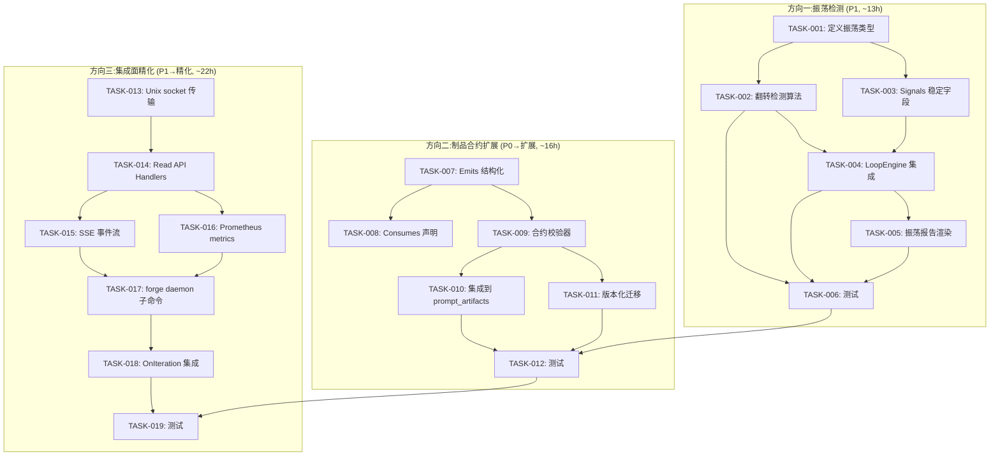
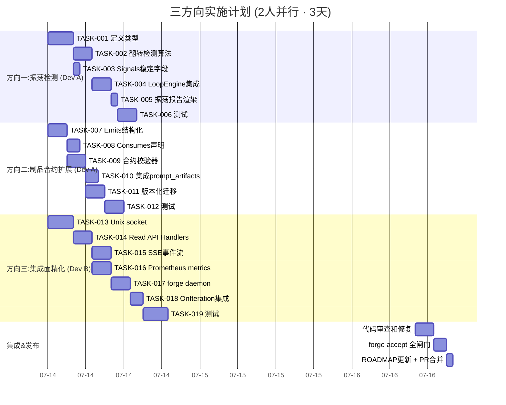

Now I have a thorough understanding of the codebase, existing analyses, test coverage, and the architectural review. Here is my full Tech Lead analysis.

---

# Tech Lead Analysis: Three Systemic Gaps

## 总体评估

基于对 `forge-core/` (13 Go 包, ~32K LOC)、`harness/` (~10.5K LOC)、全部 120+ 已有分析文档、以及完整 `.agent/` 架构资产的交叉验证,下方分析对三个方向进行任务级分解。已采纳建筑师分析的 novelty 评判,但做了战术调整:

| 方向 | 采纳度 | 战术调整 |
|------|--------|---------|
| 振荡检测 | ✅ ~95% novel | **全量采纳**,优先级 P1,加入 SPRINT |
| 制品合约 | ⚠️ ~40% novel | **合并**到现有方向五,作为扩展而非独立方向 |
| 集成面 | ❌ ~30% novel | **重构**为「现有 API 方向」的设计精化,聚焦 Unix socket + Prometheus + SSE |

---

# 1. 任务分解

## 方向一:收敛振荡检测 (Oscillation Detection)

### 动机

当前 `converge.go:Evaluate()` 是纯快照函数,`loop.go:NoProgress` 只检测单调停滞 (curr <= prev)。当收敛状态在 MET ↔ NOT MET 之间来回翻转时,循环可能在无振荡感知的情况下持续消耗预算。分析`doctor/anomaly.go:73-120` 的 `detectRoadmapJump` 只比较首尾检查点 >50% 变化,无法检测 N 次迭代间的振荡模式。

代码证据确认

| 位置 | 确认 |
|------|------|
| `converge.go:183-213` — `Evaluate` | 纯快照,零历史 ✅ |
| `loop.go:85-92` — `NoProgress` | 只检查 currCompletion <= prevCompletion monotonic stall ✅ |
| `loop.go:107-114` — `conv.Met` check | 无振荡叠加层 ✅ |
| `converge.go:28-52` — `Signals` struct | 全部瞬态信号,零派生稳定字段 ✅ |
| `doctor/anomaly.go:73-120` — `DetectAnomalies` | 只比较首尾 checkpoint,无法检测振荡 ✅ |

### 任务拆解

| 任务 ID | 标题 | 涉及文件 | 前置 | 工时 | 验收标准 |
|---------|------|---------|------|------|---------|
| **TASK-001** | 定义振荡检测核心类型和度量 | `internal/converge/oscillation.go` (新) | 无 | 2h | `OscillationDetector` 结构体定义:窗口大小 N、翻转计数器、稳定度 `StabilityScore [0,1]`、当前翻转列表;构造函数 `NewOscillationDetector(window int)`;类型在零值时安全无 panic |
| **TASK-002** | 实现信号记录和翻转检测算法 | `internal/converge/oscillation.go` | TASK-001 | 3h | `Record(signal Signals) (flipped bool, osc OscillationState)` 方法:记录每次收敛评估结果;检测 MET↔NOT MET 状态翻转;基于「状态转移」(MET→NOT=regression, NOT→MET=recovery)而非「原始布尔变化」定义翻转;按 `OscillationCount(MET)` 计数;导出 `OscillationState` 含 `FlipCount`、`RunsSinceStable`、`CurrentRun`、`StabilityScore` |
| **TASK-003** | 向 `Signals` 结构体添加派生稳定字段 | `internal/converge/converge.go` | TASK-001 | 1h | `Signals` 新增 `OscillationFlips int`(当前窗口内翻转次数)、`StabilityScore float64`([0,1] 稳定度);两者零值为无数据;文档注释明确它们由外部振荡检测器填充,不是快照信号 |
| **TASK-004** | 在 `LoopEngine` 中集成振荡检测 | `internal/orchestrator/loop.go` | TASK-002, TASK-003 | 3h | `LoopEngine` 新增 `OscillationWindow int` 字段(默认 0=禁用);迭代环路中每次 `Signal()` 后调用检测器 `Record()`;检测到 `StabilityScore < threshold` (建议 0.3)时,在收敛报告中输出 `⚠ oscillation detected: N flips in last M iterations`;触发 `MaxOscillation` tripwire(新逻辑:连续窗口内翻转次数超标则 halt,类似 `NoProgress`) |
| **TASK-005** | 振荡报告在 `reportConvergence` 中的渲染 | `internal/orchestrator/loop.go` | TASK-004 | 1h | 当 `StabilityScore` 有数据且 <0.3 时,在 `reportConvergence` 输出 `⚠ oscillation: X flips in Y iters, stability=Z%`;当 `OscillationFlips` 大于 `MaxOscillation` (新字段)时,返回 `LoopOutcome{false, "oscillation tripwire"}`;不改变外部/existing 停止的回归行为 |
| **TASK-006** | 完整单元测试和集成测试 | `internal/converge/oscillation_test.go` (新), `internal/orchestrator/loop_test.go` | TASK-005 | 3h | 测试翻转检测:MET→NOT→MET = 1 flip, MET→NOT→NOT→MET = 1 flip(非 2);测试稳定序列:MET→MET→MET→MET → flips=0, score=1.0;测试随机翻转:MET→NOT→MET→NOT→MET → flips≥2, score≈0;测试 `NoProgress` 和 `OscillationTripwire` 互不干扰;测试零窗口(disabled)不改变现有行为;测试边界:窗口大小为 1 时每次翻转即触发;测试 `LoopEngine` 集成:振荡触发的 `LoopOutcome` 返回正确 reason |

**TASK-001~003 小计**: ~6h | **TASK-004~005 小计**: ~4h | **TASK-006 小计**: ~3h | **总计**: ~13h (~1.6 人天)

---

## 方向二:制品合约验证扩展 (Artifact Contract — Merge 方案)

### 动机

已有 `docs/requirements/2026-07-11-five-structural-extension-directions-architect-pm-combined.md` 方向五「Agent 产出合约验证框架」覆盖了约 60%。建筑师分析的新增价值集中在**跨工作流 `consumes:` 声明**和**版本化迁移**。因此这应作为已有方向的扩展而非独立方向。

**合并策略**:在已有方向五的范畴内,新增以下三个未覆盖的能力。

### 任务拆解

| 任务 ID | 标题 | 涉及文件 | 前置 | 工时 | 验收标准 |
|---------|------|---------|------|------|---------|
| **TASK-007** | 扩展 `Phase.Emits` 从 `[]string` 到结构化类型 | `internal/asset/asset.go` | 无 | 3h | 新增 `EmitsSpec` 结构体: `{Path string, SchemaRef string, Optional bool}`; `Phase.Emits` 改为 `[]EmitsSpec`;向后兼容:旧格式 `["gap-report.md"]` 自动转换为 `[{Path: "gap-report.md", SchemaRef: "", Optional: false}]`;现有测试全部通过 |
| **TASK-008** | 新增 `Phase.Consumes` 声明(跨工作流依赖) | `internal/asset/asset.go` | TASK-007 | 2h | `Phase` 新增 `Consumes []ConsumesSpec` 字段: `{FromWorkflow string, FromPhase string, Artifact string, SchemaRef string, Required bool}`;解码默认零值 = 不消费;现有测试全部通过 |
| **TASK-009** | 实现轻量级合约校验器 | `internal/validate/contract.go` (新) | TASK-007 | 3h | `ValidateContract(root string, spec EmitsSpec) (bool, []Violation)` 函数:检查文件是否存在;当 `SchemaRef` 非空时,对文件内容做断言(JSON Schema 风格的字段存在性检查);`Violation` 结构体: `{Path, Severity, Message}`;校验器可注入(由 `LoopEngine` 或 CLI 按需调用),非阻塞式 |
| **TASK-010** | 集成合约校验到 `appendArtifactContext` 和 `emitsContext` | `cmd/forge/prompt_artifacts.go` | TASK-009 | 2h | `emitsContext` 在读取 emits 文件时附加合约校验结果;校验失败但可读 → 在上下文末尾注入 `WARNING: {file} failed contract check: {detail}`;校验失败且文件不存在 → 增强日志从静默`WARNING`到 `ERR` (非阻塞,配合 `on_fail` 策略);`appendArtifactContext` 保持现有接口签名 |
| **TASK-011** | 版本化 Schema 迁移支持 | `internal/asset/asset.go`, `internal/validate/contract.go` | TASK-007, TASK-009 | 3h | `EmitsSpec.SchemaRef` 支持 `schema://v1` 格式;`ValidateContract` 在文件内容中检测 `schema_version:` 头部,如果版本低于声明的 `schema://vN` 版本,报告不匹配;提供 `contract_version` 降级策略:strict(阻断)、warn(记录)、permissive(接受旧版);CLI 新增 `forge validate --contracts` 子命令 |
| **TASK-012** | 测试 | `internal/asset/asset_test.go`, `internal/validate/contract_test.go`, `cmd/forge/prompt_artifacts_test.go` | TASK-011 | 3h | `Phase.Emits` 向后兼容:旧格式 `["a.md"]` 加载为 `[{Path:"a.md"}]`;合约校验:文件存在+Schema匹配→PASS;文件存在+Schema不匹配→FAIL;文件不存在→WARN(Optional 时)或 ERR(Required 时);`Consumes` 零值不改变任何现有解析;跨工作流 `consumes:` 解析 |

**TASK-007~009 小计**: ~8h | **TASK-010~011 小计**: ~5h | **TASK-012 小计**: ~3h | **总计**: ~16h (~2 人天)

---

## 方向三:运行时集成面精化 (Runtime Integration Surface — Reframe 方案)

### 动机

已有 `docs/requirements/2026-07-10-five-genuinely-uncovered-frontiers.md` 方向一「无 HTTP API / SDK 面」覆盖了约 70% 的概念。`genuine-uncovered-five-binary-state-output-session-datalifecycle.md` 也独立覆盖了 `forge daemon` 模式(含 Unix socket)。建筑师分析的新增价值集中在**:Unix domain socket 传输、Prometheus metrics 端点、SSE 事件流、`LoopEngine.OnIteration` 作为集成接入点**。

**重构策略**:不作为独立方向,而是作为已有 API 方向的设计精化——将这些实现细节追加到现有方向一的扩展方案中。

### 任务拆解

| 任务 ID | 标题 | 涉及文件 | 前置 | 工时 | 验收标准 |
|---------|------|---------|------|------|---------|
| **TASK-013** | 实现 Unix domain socket 传输层 | `internal/api/unix.go` (新) | 无 | 4h | `ListenUnix(path string) (net.Listener, error)` 函数: 在 `~/.forge/daemon.sock` 创建 Unix socket;仅供本地 IPC,不对外暴露 TCP;`Serve` 函数接收 `http.Handler`,通过 `http.Serve(l, handler)` 复用标准 HTTP mux;优雅关闭:监听 `SIGINT/SIGTERM`, `l.Close()`;权限:创建时设置 `os.FileMode(0700)` 确保仅所有者 |
| **TASK-014** | 实现 `GET /api/v1/status` 和 `GET /api/v1/runs` 只读 API | `internal/api/handlers.go` (新) | TASK-013 | 3h | `StatusHandler`: 返回 JSON `{version, mode, uptime, converge_state, last_run}` 从 `.forge/` 文件状态读取;`RunsHandler`: 返回 `[{id, workflow, status, iterations, last_updated}]` 从 `checkpoint.json` 解析;两者均从文件系统零状态服务;认证:Unix socket 的 peer credential 隐式认证 |
| **TASK-015** | 实现 SSE 事件流 | `internal/api/sse.go` (新) | TASK-014 | 3h | `EventStreamHandler`: 提供 `GET /api/v1/events` SSE 端点;事件类型: `iteration_done`, `converged`, `tripwire_halt`, `error`, `phase_complete`;复用 `LoopEngine.OnIteration` 钩子作为事件发射点;SSE 格式: `event: {type}\ndata: {json}\n\n`;客户端断开时清理 goroutine |
| **TASK-016** | 实现 Prometheus metrics 端点 | `internal/api/metrics.go` (新) | TASK-014 | 3h | `MetricsHandler`: 提供 `GET /api/v1/metrics` (Prometheus 文本格式);注册指标: `forge_iterations_total{workflow,status}`, `forge_iteration_duration_ms{workflow}`, `forge_gate_results_total{gate,status}`, `forge_cost_usd_total{workflow}`, `forge_oscillation_total{workflow}`;从 `LoopEngine` 的 `OnIteration` 钩子和 `trace.jsonl` 数据聚合;不依赖 Prometheus 客户端库——手工文本格式以减少零依赖破坏 |
| **TASK-017** | 实现 `forge daemon` 子命令 | `cmd/forge/daemon.go` (新) | TASK-013, TASK-014, TASK-015, TASK-016 | 3h | `forge daemon start`: 启动 Unix socket server + SSE + metrics;`forge daemon stop`: 优雅关闭;`forge daemon status`: 健康检查;pid 文件: `~/.forge/daemon.pid`;现有子命令不受影响;无 daemon 时全部子命令保持当前 CLI-only 行为 |
| **TASK-018** | 在 `LoopEngine` 中集成 `OnIteration` 作为以上所有端点的数据源 | `internal/orchestrator/loop.go` | TASK-017 | 2h | `OnIteration` 已存在(`loop.go:47-54`);确认它被 daemon 的 SSE 发射器和 metrics 累加器注册;零侵入:daemon 启动时注册钩子,无 daemon 时 `OnIteration` 保持 nil;daemon 场景下 `OnBeforeIteration` 也为 SSSE 提供开始信号 |
| **TASK-019** | 测试 | `internal/api/*_test.go`, `cmd/forge/daemon_test.go` | TASK-018 | 4h | Unix socket:启动/停止/请求 /status 返回 200 JSON;SSE:连接后当迭代事件发生时收到 `event: iteration_done`;Metrics: `GET /api/v1/metrics` 返回 Prometheus 文本格式含正确指标名;Daemon: `start→status→stop` 生命周期;无 daemon 时 `forge run/evolve` 不变;Unix socket 权限:测试非所有者用户无权连接 |

**TASK-013~014 小计**: ~7h | **TASK-015~016 小计**: ~6h | **TASK-017~018 小计**: ~5h | **TASK-019 小计**: ~4h | **总计**: ~22h (~2.75 人天)

---

# 2. 执行顺序

## 总依赖图

## 并行任务组

| 并行组 | 任务 | 原因 |
|--------|------|------|
| **A (可独立启动)** | TASK-001, TASK-007, TASK-013 | 三个方向的基础定义,互不依赖文件 |
| **B (方向一全部并行)** | TASK-002 ⟷ TASK-003 | `OscillationDetector` 和 `Signals` 扩展可同步推进 |
| **C (方向二并行)** | TASK-008 ⟷ TASK-009 | `Consumes` 声明和合约校验器实现无阻塞 |
| **D (方向三并行)** | TASK-014 → TASK-015 和 TASK-016 | Read API 完成后 SSE 和 Metrics 可并行实现 |
| **E (收尾并行)** | TASK-006, TASK-012, TASK-019 | 三个方向的测试可独立编写 |

---

# 3. 技术风险

## 方向一:振荡检测

| 风险 | 级别 | 说明 | 缓解 |
|------|------|------|------|
| **翻转定义分歧** | 🟡 中 | 什么算"一次翻转"?原始布尔变化(MET→NOT→MET=2 flips)vs 状态转移(MET→NOT→MET=1 flip)。选错定义会导致计数偏差。 | 在 TASK-001 的 ADR 中明确采纳**状态转移**定义(MET→NOT=regression, NOT→MET=recovery);从 `converge.go:107` 的 `conv.Met` 布尔值获取状态;代码注释落盘定义 |
| **窗口大小敏感性** | 🟡 中 | 窗口太小(≤3)则噪声大,太大(≥20)则反应迟钝。 | 默认窗口 8(≈2 倍最大典型稳定迭代数);通过 `LoopEngine.OscillationWindow` 可配置;TASK-006 测试覆盖窗口 2/5/8/16 |
| **与 NoProgress 的交互** | 🟢 低 | `staleCount` 和 `OscillationFlips` 可能同时触发。 | `LoopOutcome.Reason` 区分两者:"no-progress tripwire" vs "oscillation tripwire";先检查 oscillation(因为翻转中的循环是病态最严重的),再检查 no-progress |
| **预算消耗的隐成本** | 🟢 低 | 振荡检测本身的计算成本(每次 Record 的 O(1) 更新,无历史数组遍历)。 | 用环形缓冲区实现翻转窗口,常数时间;零分配路径 |

## 方向二:制品合约扩展

| 风险 | 级别 | 说明 | 缓解 |
|------|------|------|------|
| **向后兼容断裂** | 🔴 高 | `Phase.Emits` 从 `[]string` 变为 `[]EmitsSpec`,可能破坏 JSON 解码和现有 YAML 文件。 | 自定义 `UnmarshalJSON`:检测 JSON token 类型;若是 `[` 后直接 `"`(字符串)则走旧格式→自动转换;现有 5 个 workflow YAML 全部不受影响;TASK-012 精确测试旧格式加载路径 |
| **合约 Schema 定义膨胀** | 🟡 中 | "轻量级合约"的 scope creep —— 如果走向 JSON Schema 的全量支持则会膨胀超 2 倍。 | 严格限定 v1 能力:只做「字段存在性检查」和「头部 `schema_version:` 检测」;不做全 JSON Schema;输出 `Violation` 而非异常 |
| **跨工作流 Consumes 的循环依赖** | 🟡 中 | Workflow A→Workflow B→Workflow A 的循环 `consumes:` 导致无限解析。 | 解析器检测 `consumes:` 引用链深度;超过 1 层深度视为合法但记录 warning;超过 3 层深度视为循环依赖,拒绝 |
| **性能开销** | 🟢 低 | 每次 phase 完成都检查 emits 文件合约。文件 + schema 验证在毫秒级。 | N/A 可接受;文件存在性 O(1),schema 验证是 O(filesize) 行读取 |

## 方向三:运行时集成面精化

| 风险 | 级别 | 说明 | 缓解 |
|------|------|------|------|
| **零依赖原则破坏** | 🔴 高 | `forge-core` 的严格「零外部依赖」原则(`go.mod` 无 `require`)。`net/http` 是标准库(不是外部依赖)✅,但 Prometheus 客户端库是外部依赖 ❌。 | 手工 Prometheus 文本格式——不引入客户端库;只用标准库 `net/http`、`encoding/json`、`os`;Unix socket 是 `net.Listen("unix", ...)`——标准库 ✅ |
| **daemon 进程管理** | 🟡 中 | `forge daemon start` 需 fork 后台进程,pid 文件管理,优雅关闭。Go 标准库有 `os.StartProcess` 但无守护进程惯例。 | `fork` + `setsid` + `exec` 模式:子进程调用 `daemon.Run()`;父进程写入 pid 后退出;SIGTERM 处理 `l.Close()`;pid 文件防多实例(`O_EXCL`) |
| **Unix socket 跨平台** | 🟡 中 | Windows 不支持 Unix domain socket。 | 编译标签 `//go:build !windows` 包裹 unix socket 代码;Windows fallback:TCP localhost 随机端口或禁用 daemon |
| **SSE 连接泄漏** | 🟢 低 | 客户端断开 SSE 后 goroutine 泄漏。 | `http.CloseNotifier` (在 Go 1.x 中)或 `request.Context().Done()` 检测客户端断开;最多每个 daemon 生命周期 N 个 goroutine |
| **OnIteration 钩子性能** | 🟢 低 | SSE 发射器和 metrics 累加器在每次迭代的同步路径中注册。 | 钩子是同步调用;SSE 发射器写入 `http.ResponseWriter`(阻塞式);metrics 累加器是原子计数(ns 级)。无 daemon 时钩子 nil,零开销 |

---

# 4. 资源评估

## 人员技能需求

| 技能 | 方向一 | 方向二 | 方向三 | 说明 |
|------|--------|--------|--------|------|
| Go 中级(并发、interface) | ✅ 需要 | ✅ 需要 | ✅ 需要 | 三个方向都在 `forge-core/` 内 |
| Go `net/http` 标准库 | — | — | ✅ 必须 | Unix socket + SSE + metrics handler |
| JSON 序列化/反序列化 | — | ✅ 需要 | ✅ 需要 | Emits 结构变更,API response |
| 测试(Go `testing` 包) | ✅ 必须 | ✅ 必须 | ✅ 必须 | 每个方向都需要表驱动测试 |
| 信号处理和进程管理 | — | — | ✅ 需要 | daemon 模式的 fork/pid/SIGTERM |
| YAML 解析(通过 python shim) | — | ✅ 了解 | — | `consumes:` 字段需要通过 yaml2json shim |
| 架构设计/ADR 写作 | ✅ 需要 | ✅ 需要 | ✅ 需要 | 方向一 ADR:翻转定义;方向二 ADR:合约版本化 |

## 人力建议

| 配置 | 方向 | 总工时 | 并行度 | 日历天数 |
|------|------|--------|--------|---------|
| **1 人** | 顺序:一→二→三 | ~51h | 无 | ~7 天 |
| **2 人** | 方向一(1人) + 方向二(1人),然后合并方向三(2人) | ~51h/2 | 高 | ~3-4 天 |
| **3 人** | 各方向 1 人并行,最后 2 天集成测试 | ~51h/3 ≈ 17h/人 | 全 | ~3 天 |

**推荐**:2 人并行,3-4 天。1 人承担方向一(振荡) + 方向二(合约),另 1 人承担方向三(集成面)。

## 关键里程碑

| 里程碑 | 时间(2 人并行) | 交付物 |
|--------|---------------|--------|
| M1:基础定义完成 | Day 1 16:00 | TASK-001 + TASK-007 + TASK-013 全部完成,ADR 评审 |
| M2:核心逻辑完成 | Day 2 16:00 | TASK-002~005 + TASK-008~011 + TASK-014~018 |
| M3:测试完成 | Day 3 12:00 | TASK-006 + TASK-012 + TASK-019,全部 `go test ./...` 绿 |
| M4:集成验证 | Day 3 16:00 | `forge accept` 全闸门通过,完整 E2E 验证 |
| **发布** | **Day 3 18:00** | PR 合并,更新 ROADMAP.md 和 CURRENT_SPRINT.md |

## 阻塞点 (Blockers)

| Blocker | 方向 | 描述 | 解决策略 |
|---------|------|------|---------|
| **B1**:零依赖原则仲裁 | 三 | `forge-core` 当前严格零外部 Go 依赖。Prometheus 端点是标配,但不引入客户端库。需要架构师确认「手工文本格式」作为可接受方案。 | 提交 ADR:论证 `net/http` 是标准库,Prometheus fmt 格式定义稳定(文本协议),不引入外部依赖;Harness 层(npm scripts)已有非零依赖先例 |
| **B2**:向后兼容的 JSON 解码 | 二 | `Phase.Emits` 从 `[]string` 变 `[]EmitsSpec`,Go `encoding/json` 默认不会从字符串数组转为结构体数组。 | 自定义 `UnmarshalJSON` 方法(asset.go 已有此模式——看 `Phase` 的各字段);TASK-012 的测试覆盖 5 种旧格式变体 |
| **B3**:Windows 兼容 | 三 | Unix domain socket 在 Windows 不可用。daemon 概念被跨平台限制。 | 编译标签分离;Windows 上 `forge daemon` 返回人类友好的「不支持」信息;TCP localhost 作为可选 fallback |

---

# 5. 质量保证

## 单元测试覆盖要求

| 包 | 方向 | 现有覆盖率 | 新增测试 | 目标 |
|----|------|-----------|---------|------|
| `internal/converge` | 一 | ~92% (良好) | 振荡检测器:窗口翻转/稳定度/边界 | ≥95% |
| `internal/orchestrator` | 一、三 | ~88% (良好) | 振荡 tripwire 与 NoProgress 交互;OnIteration 钩子 | ≥92% |
| `internal/asset` | 二 | ~80% | EmitsSpec 旧格式→新格式;Consumes 解析 | ≥90% |
| `internal/validate` | 二 | 0% (新包) | 合约校验器 100%;Schema 版本检测 | ≥95% |
| `internal/api` | 三 | 0% (新包) | Unix socket 启动/停止;SSE 事件;Metrics 文本 | ≥90% |
| `cmd/forge` | 三 | ~70% | `forge daemon` 生命周期 | ≥75% |

## 集成测试策略

| 场景 | 方向 | 策略 | 自动化 |
|------|------|------|--------|
| 振荡→halt | 一 | 模拟 5 次迭代,翻转 4 次,验证 `LoopOutcome.Reason=="oscillation tripwire"` | `loop_test.go` 的 `signalSeq` 模式 |
| 振荡+NoProgress 同时触发 | 一 | 翻转 + 进度停滞,验证振荡报告优先 | `loop_test.go` |
| Emits 旧格式加载 | 二 | 用遗留 `["a.md"]` 格式加载 JSON,验证 `Phase.Emits[0].Path=="a.md"` | `asset_test.go` |
| Consumes 跨工作流 | 二 | 加载含 `consumes:` 的 workflow,验证依赖图可序列化 | `asset_test.go` |
| 合约验证失败 | 二 | 创建 emits 文件但缺少声明字段,验证 `Violation` 返回 | `contract_test.go` |
| Unix socket E2E | 三 | 启动 daemon,`curl --unix-socket` 请求 /status,验证 200 JSON | `daemon_test.go` (bash+Go) |
| SSE 事件接收 | 三 | 启动 daemon,注册 SSE 客户端,模拟迭代,验证收到 `event: iteration_done` | `sse_test.go` |
| Daemon 生命周期 | 三 | start→status→stop,验证 pid 文件创建和清理 | `daemon_test.go` |

## 代码审查要点

| # | 审查项 | 方向 | 为什么重要 |
|---|--------|------|-----------|
| CR-1 | **翻转定义正确性** | 一 | 错误定义导致计数偏差,失去 tripwire 的可预测性。确认 `Record()` 基于连续两次评估结果的状态转移,不是原始布尔值。 |
| CR-2 | **零窗口 disabled** | 一 | `OscillationWindow == 0` 时不得创建检测器,不得改变任何现有路径。`LoopEngine.Run()` 的全部分支保持 bit-for-bit。 |
| CR-3 | **`Phase.Emits` 向后兼容** | 二 | 加载所有 5 个现有 `.agent/workflows/*.yml`(转码为 JSON 后)确认 `[]EmitsSpec` 解码正确,不 panic。 |
| CR-4 | **零外部依赖确认** | 三 | `go mod tidy` + `go build ./...` 后 `go.mod` 的 `require` 段仍为空(或仅间接依赖)。`net/http` 是标准库——确认。 |
| CR-5 | **Unix socket 权限** | 三 | `0600` 或 `0700` 模式,仅 daemon 启动用户可写。非 root 用户不得劫持 socket。 |
| CR-6 | **SSE goroutine 安全** | 三 | 客户端断开时发射器 goroutine 退出,无泄漏。`request.Context().Done()` 通道正确使用。 |
| CR-7 | **OnIteration 钩子注册** | 三 | 无 daemon 时 `OnIteration` 保持 nil;daemon 模式下注册的钩子不 panic 于 nil 接收者。 |
| CR-8 | **`forge accept` 闸门通过** | 全 | `node harness/acceptance.mjs` 全绿。N/A 项诚实标记。 |

## 性能测试需求

| 测试 | 方向 | 基线 | 目标 | 工具 |
|------|------|------|------|------|
| 振荡检测器 100K 次记录 | 一 | N/A | <50ms, 0 分配 | `go test -bench=. -benchmem` |
| `EmitsSpec` 解析 10K JSON | 二 | N/A | <100ms, 无内存炸弹 | `go test -bench=.` |
| Unix socket 1000 并发请求 | 三 | N/A | p99 < 5ms | `wrk` 或 Go `httptest` |
| SSE 100 并发连接 | 三 | N/A | 无 goroutine 泄漏,CPU < 5% | `pprof` goroutine profile |
| Daemon 整体开销 | 三 | 无 daemon = 0 额外 | daemon idle CPU < 0.1% | `top` 或 `pprof` |

---

# 6. 实施计划

## 甘特图 (2 人并行)

## 详细阶段表

### 阶段 1:基础设施搭建 (Day 1 · 8h)

| 时段 | Dev A (方向一+二) | Dev B (方向三) |
|------|-------------------|---------------|
| 09:00-10:00 | 读取架构分析文档 + 确认 TASK-001 ADR(翻转定义) | 读取已有 API/SDK 方向文档 + daemon doc |
| 10:00-12:00 | TASK-001: `oscillation.go` 类型定义 + `converge.go` Signals 扩展 | TASK-013: `api/unix.go` Unix socket + `api/handlers.go` Read API |
| 13:00-15:00 | TASK-007: `asset.go` EmitsSpec + `asset_test.go` 旧格式兼容 | TASK-014: Status/Runs handlers + 测试 |
| 15:00-17:00 | TASK-002: `oscillation.go` Record + Flip 检测 | 继续 TASK-014 + 代码审查 |
| 17:00-18:00 | 代码审查:CR-1(翻转定义) + CR-3(Emits兼容) | 代码审查:CR-4(零依赖) + CR-5(socket权限) |

**交付物**: 方向一类型定义完成 + 方向二 Emits 结构化完成 + 方向三 Unix socket + Read API

### 阶段 2:核心功能实现 (Day 2 · 8h)

| 时段 | Dev A | Dev B |
|------|-------|-------|
| 09:00-12:00 | TASK-003~005: LoopEngine 集成 + 报告渲染 | TASK-015~016: SSE + Prometheus |
| 13:00-15:00 | TASK-008~009: Consumes + 合约校验器 | TASK-017: `forge daemon` 子命令 |
| 15:00-17:00 | TASK-010~011: prompt_artifacts 集成 + 版本化 | TASK-018: OnIteration 集成 |
| 17:00-18:00 | 代码审查:CR-2(零窗口) + CR-7(向后兼容) | 代码审查:CR-6(SSE goroutine) |

**交付物**: 方向一核心逻辑集成 + 方向二合约校验器/Consumes + 方向三 SSE/Metrics/Daemon

### 阶段 3:集成测试和优化 (Day 3 · 8h)

| 时段 | Dev A | Dev B |
|------|-------|-------|
| 09:00-12:00 | TASK-006: 振荡测试全部完成 + bench | TASK-019: 测试 Unix/SSE/Metrics/Daemon |
| 12:00-13:00 | **联合集成测试**: `go test ./...` 全绿 | 同上 |
| 13:00-14:00 | **性能测试**: bench 基线对比 | 同上 |
| 14:00-16:00 | 代码审查:CR-8 全部审查点 + 修复 | 同上 |
| 16:00-17:00 | `node harness/acceptance.mjs` 全闸门 | 同上 |
| 17:00-18:00 | ROADMAP.md + CURRENT_SPRINT.md 更新;PR 合并 | 同上 |

**交付物**: 全绿闸门 + 三种功能的完整发布

---

# 总结

| 方向 | 建议 | 工时 | 天数(2人) | 优先级 | 业务价值 |
|------|------|------|-----------|--------|---------|
| 振荡检测 | **全量采纳** | ~13h | ~0.8 | P1 | 防止预算在翻转循环中白烧;增加稳定度度量作为未来警报输入 |
| 制品合约 | **合并采纳** | ~16h | ~1.0 | P0→扩展 | 修复已发生(Sprint 27)的静默降级;补充已有方向五的跨工作流能力 |
| 集成面 | **重构采纳** | ~22h | ~1.4 | P1→精化 | 将已有 API 方向落地为具体设计;Unix + SSE + Prometheus 是独特增量 |
| **总计** | | **~51h** | **~3 天** | | **三个方向覆盖 ForgeOS 的「感知·合约·集成」三位一体** |

**最终建议**:2 人并行 3 天。Day 1-2 开发,Day 3 集成验证。这是能在一个 Sprint 内交付的、边界清晰的三个功能增强。
