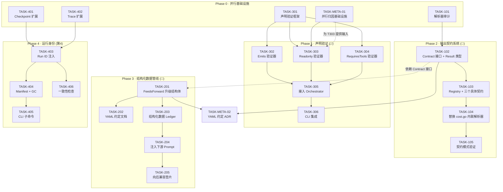
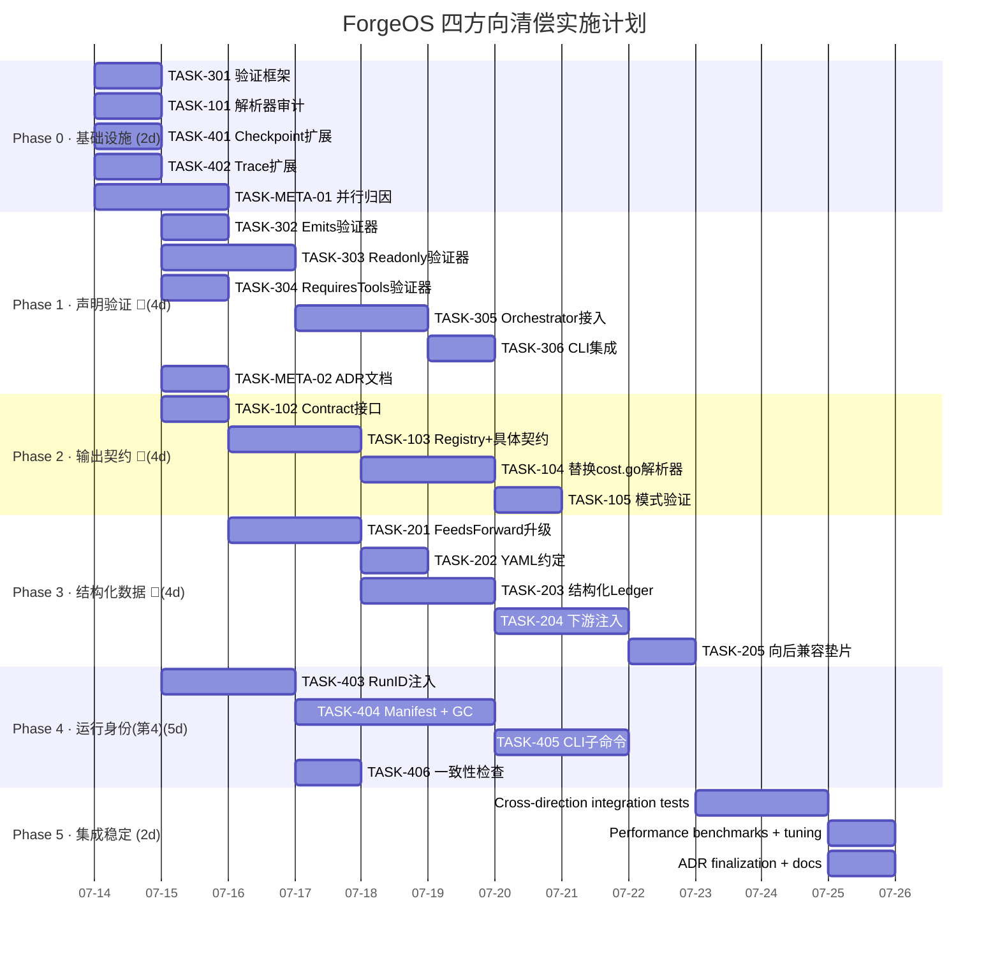

以下是我的 Tech Lead 分析，覆盖全部六个维度。

---

# Tech Lead 分析报告：ForgeOS 四方向技术债清偿

> **分析依据**：对 forge-core `asset.go` / `cost.go` / `prompt_context.go` / `checkpoint.go` / `trace.go` / `converge.go` 的代码级验证 + 整个仓库的架构纪律阅读。
>
> **背景约束**（来自 `AGENTS.md` + `FUNCTIONAL_REQUIREMENTS_AUDIT.md`）：
> - Go 纯标准库，零外部依赖
> - 单文件 ≤ 500 行，单函数 ≤ 50 行，`cmd/forge` 包文件数 ≤ 17
> - 循环依赖 = 0，依赖单向向内
> - 每次修改后跑 `forge accept`（聚合 8 检查 + test）
> - Reviewer 必须 fresh-context 独立 Agent

---

## 1. 任务分解

### 方向三 · 声明落地验证（🥇 第一优先级）

| 任务 ID | 标题 | 涉及文件 | 前置依赖 | 工时 | 验收标准 |
|---------|------|---------|---------|------|---------|
| **TASK-301** | 创建声明验证框架 | `forge-core/internal/validate/` (新包) | 无 | 3h | `validate.Runner` 结构体，接受 `asset.Phase` + `workflow` 上下文，返回 `[]ValidateResult`；框架支持注册独立验证器；单测覆盖注册 + 运行 + 结果聚合 |
| **TASK-302** | Emits 声明验证器 | `forge-core/internal/validate/emits.go` | TASK-301 | 2h | 验证 phase 结束后声明的 emits 文件路径存在于磁盘；只读阶段（reviewer/qa）跳过自身 emits 检查（它们 emit 的是评审报告而非产物）；单测覆盖：存在/缺失/目录穿越 |
| **TASK-303** | Readonly 声明验证器 | `forge-core/internal/validate/readonly.go` | TASK-301 | 3h | 验证 readonly phase 执行后 git diff 中只应包含 emits 清单中声明的文件；并行模式需按 phase 粒度归因（见风险分析 §3）；单测覆盖：只读合规/违规/并行归因 |
| **TASK-304** | RequiresTools 声明验证器 | `forge-core/internal/validate/requirestools.go` | TASK-301 | 2h | 验证 phase 声明所需工具在执行时可用（通过 agent executor 提供的 tool allowlist 检查）；不可用则降级为 advisory flag 而非 block；单测覆盖：工具可用/不可用/部分可用 |
| **TASK-305** | 接入 Orchestrator 执行管线 | `forge-core/internal/orchestrator/engine.go` + `forge-core/cmd/forge/engine_build.go` | TASK-302/303/304 | 3h | `RunFrom` / `RunParallel` 在每个 agent phase 执行完成后调用验证 runner；违规默认 warn（可观测不阻断），可通过 `--validate-block` 提升为 block；echo executor 走验证但不报错（诚实叙述） |
| **TASK-306** | 声明验证 CLI 集成 | `forge-core/cmd/forge/main.go` + `gates.go` | TASK-305 | 1.5h | `forge run --validate-block` 让验证失败导致 exit 1；`forge run --validate-report` 输出 JSON 格式验证结果；converge 信号中纳入验证结果（作为 `Criteria` 新字段） |

**合计方向三**：14.5 工时

---

### 方向一 · 输出契约系统（🥈 第二优先级）

| 任务 ID | 标题 | 涉及文件 | 前置依赖 | 工时 | 验收标准 |
|---------|------|---------|---------|------|---------|
| **TASK-101** | 审计三个解析器 + 提取公共模式 | `forge-core/cmd/forge/cost.go` | 无 | 2h | 文档化 `parseReviewerVerdict` / `parseExecutiveVerdict` / `parseConfidenceScore` 的共同结构（unwrapClaudeResult → lastNonEmptyLine → 精确匹配）；输出 `contract_audit.md` 记录不可违反的不变量（见下） |
| **TASK-102** | 定义 `Contract` 接口 + `Result` 类型 | `forge-core/internal/prompt/contract.go` (新包/文件) | TASK-101 | 3h | `Contract` 接口：`Parse(output string) (Result, bool)`；`Result` 带泛型值（`VerdictToken` / `ConfidenceScore` / `EmitsList` 等）+ Source（哪个 phase/agent 产生的）；单测覆盖文档化的全部契约模式 |
| **TASK-103** | 实现统一 Contract Registry + 三个具体契约 | `forge-core/internal/prompt/contract_reviewer.go` + `contract_executive.go` + `contract_confidence.go` | TASK-102 | 4h | Registry 通过契约名注册/查找，每个 concrete contract 实现 `Parse`；**关键不变量维护**：`VerdictApprove` 在 reviewer 和 executive 中保持同 token，`reviewStatus` 不改判 |
| **TASK-104** | 替换 cost.go 的三个内联解析器 | `forge-core/cmd/forge/cost.go` | TASK-103 | 3h | cost.go 中原三处解析函数改为调用 `contract.Parse`；向后兼容：输入/输出签名不变，已有调用点零改动；现有 `observeFor` 的调用路径全绿 |
| **TASK-105** | 添加契约模式验证 (compile-time guard) | `forge-core/cmd/forge/gates.go` + new file `forge-core/cmd/forge/contract_test.go` | TASK-104 | 2h | 添加测试确保 `VerdictApprove` 在 reviewer 和 executive 契约之间**身份相同**（指针/字符串比较）；架构检查确保 contract 注册在 `cmd/forge` 而非更低层级（保持 vendor 隔离） |

**合计方向一**：14 工时

---

### 方向二 · 跨阶段结构化数据管线（🥉 第三优先级）

| 任务 ID | 标题 | 涉及文件 | 前置依赖 | 工时 | 验收标准 |
|---------|------|---------|---------|------|---------|
| **TASK-201** | 将 `FeedsForward` 从 bool 升级为结构体 | `forge-core/internal/asset/asset.go` + `asset_test.go` | 无 | 3h | 新类型 `FeedsForward struct { As string; Schema string }`（`As` 表示语义角色如 `"task_plan"` / `"proposal"`，`Schema` 可选引用 schema）；向后兼容：JSON 中 `"feeds_forward": true` → `FeedsForward{As: "default"}`，零值行为不变 |
| **TASK-202** | 更新 YAML 约定文档 + workflow 样例 | `.agent/workflows/build.yml` + `examples/` | TASK-201 | 1h | evolve.yml 中 planner 的 `feeds_forward: true` 保留向后兼容；新增文档块说明 `feeds: { kind: task_plan, schema: ... }` 新写法 |
| **TASK-203** | 实现结构化数据 ledger | `forge-core/cmd/forge/prompt_context.go` + `phase_output_ledger.go` (新文件) | TASK-201 | 4h | `phaseOutputLedger` 从记录纯文本升级为记录 `PhaseOutput{As, Schema, Content}`；`feedsForwardOf` 从 bool 查找升级为返回 `As` 值和 Schema；注入提示时可根据 As 类型决定格式化方式 |
| **TASK-204** | 结构化数据注入下游 prompt | `forge-core/cmd/forge/prompt_context.go` | TASK-203 | 3h | 根据 `phaseOutputLedger` 的 `As` 类型，对下游 prompt 注入格式化的上下文块；任务计划类（task_plan）注入为 markdown 任务列表；架构类注入为技术决策；保持 fresh-context 隔离：reviewer 不接收 task_plan feed |
| **TASK-205** | 向后兼容 + 迁移垫片 | `forge-core/internal/asset/asset_test.go` + `cmd/forge/adapt_test.go` | TASK-201/203 | 2h | 现有 `feeds_forward: true` 的 workflow 行为逐位不变；迁移垫片（读旧 YAML 写新 JSON）在 3 个 sprint 后移除 |

**合计方向二**：13 工时

---

### 方向四 · 三层状态版本对齐（第四优先级）

| 任务 ID | 标题 | 涉及文件 | 前置依赖 | 工时 | 验收标准 |
|---------|------|---------|---------|------|---------|
| **TASK-401** | 扩展 Checkpoint 结构体 | `forge-core/internal/persist/checkpoint.go` | 无 | 3h | 新增字段：`RunID string` / `GitCommit string` / `WorkflowDigest string`；向后兼容：omitempty 保证旧 checkpoint 反序列化后新字段为空串，不改变行为 |
| **TASK-402** | 扩展 Trace Event 结构体 | `forge-core/internal/trace/trace.go` | 无 | 2h | 新增 `RunID string` 字段；新增 `"run_start"` / `"run_end"` event kind；Tracer 增加 `EmitRunStart` / `EmitRunEnd` 方法 |
| **TASK-403** | Run identity 注入：启动时生成 RunID | `forge-core/cmd/forge/main.go` | TASK-401/402 | 2h | `cmd/forge` 启动时生成 UUID run ID；注入 checkpoint + trace 写入路径；`--resume` 旧 checkpoint 无 run ID 时生成新的并记录迁移 |
| **TASK-404** | 实现 manifest 目录 + GC 策略 | `forge-core/internal/persist/manifest.go` (新文件) | TASK-403 | 4h | `.forge/manifests/` 目录按 run ID 组织清单文件；`forge run` 结束写入 run manifest（含 workflow/mode/git commit/start-end时间/cost/duration）；GC 策略保留最近 20 次运行 + 总空间 ≤ 10MB；`forge doctor` 集成 manifest GC |
| **TASK-405** | CLI 子命令：`forge trace --run` / `forge status --run` | `forge-core/cmd/forge/trace.go` + `status.go` (新文件/已有文件扩展) | TASK-404 | 4h | `forge trace --run <id>` 过滤 trace 输出到指定 run；`forge status --run <id>` 显示指定 run 的收敛信号/成本/时长/status；向后兼容：无 `--run` 时显示当前运行 |
| **TASK-406** | Checkpoint 一致性检查 | `forge-core/internal/persist/checkpoint.go` + `cmd/forge/resume.go` | TASK-401 | 2h | `resumeStart()` 读取 checkpoint 的 `UpdatedAtUnix` 并与当前 trace 时间戳交叉验证；检测到 checkpoint 在 run 开始后被修改则打印告警（不阻断，honest-first）；单测验证一致/不一致案例 |

**合计方向四**：17 工时

---

### 跨领域元任务（阻塞器 / 基础设施）

| 任务 ID | 标题 | 涉及文件 | 前置依赖 | 工时 | 验收标准 |
|---------|------|---------|---------|------|---------|
| **TASK-META-01** | 并行模式归因基础设施 | `forge-core/internal/orchestrator/parallel.go` + `internal/gate/resolve.go` | 无 | 5h | 并行执行时记录每个 phase 修改的文件映射（通过 git diff 文件的变更时间/行号 + phase 的声明 emits 比较）；为 TASK-303 的 readonly 验证提供「这个文件是谁改的」判断能力 |
| **TASK-META-02** | YAML 约定升级文档 | `docs/adr/0005-structured-contracts.md` + `.agent/workflows/README.md` | TASK-102/201 | 2h | ADR 记录：① `VERDICT:` / `CONFIDENCE:` 从散文注释升级为一等 Contract 模式；② `feeds_forward` 从 bool 升级为结构化类型；③ workflow YAML 新的 `feeds:` / `contract:` 键约定；④ 迁移路线图 |

**合计元任务**：7 工时

---

### 项目总工作量汇总

| 方向 | 任务数 | 总工时 | 并行度 |
|------|--------|--------|--------|
| 方向三（声明验证） | 6 | 14.5h | TASKS-302~304 可并行 |
| 方向一（输出契约） | 5 | 14h | TASKS-103/104 顺序 |
| 方向二（结构化数据） | 5 | 13h | 依赖方向一 |
| 方向四（运行身份） | 6 | 17h | TASKS-401/402 可并行 |
| 跨领域元任务 | 2 | 7h | 与方向一/二部分重叠 |
| **合计** | **24** | **65.5h** | — |

---

## 2. 执行顺序

### 任务依赖图



### 可并行执行的任务组

| 并行组 | 任务 | 人员配置 | 原因 |
|--------|------|---------|------|
| **G0** | T301 + T101 + T401 + T402 + TM01 | 4 人并行 | 无依赖，各自独立新文件/新域 |
| **G1** | T302 + T303 + T304 | 3 人并行 | 依赖 T301，但三个验证器互相独立 |
| **G2** | T103 + T202 | 2 人并行 | T103 依赖 T102，T202 依赖 T201；但 T102 和 T201 不在同一链上 |
| **G3** | T404 + T406 | 2 人并行 | 依赖 T403，但 manifest 和一致性检查互不依赖 |
| **G4** | T306 + T105 + T205 + T405 | 4 人并行 | 各自方向的 CLI 集成层，互不干扰 |

**最大并行度**：Phase 0 可用 4 人并行。

---

## 3. 技术风险

### R1 · 并行模式 readonly 误报（高风险）

**描述**：TASK-303（Readonly 验证器）在并行执行模式下，当 Phase A（readonly=true）和 Phase B（readonly=false）并行运行，B 修改了一个文件，git diff 会显示该文件变更——readonly 验证器若对整个工作树做 diff，会把 B 的变更误归因到 A。

**影响**：false positive 阻断合法工作流。

**缓解策略**：
1. **TASK-META-01** 提供文件级变更归因：每个 phase 执行前记录 git tree hash，执行后按 phase 的声明 emits + 已知所有权范围过滤 diff
2. 降级策略：并行模式下 readonly 验证默认从 block 降为 warn（诚实叙述不确定性）
3. 备选方案：serial fallback——仅当 readonly phase 单独运行时才做阻断式验证

### R2 · YAML 约定变迁的向后兼容（中风险）

**描述**：方向一和方向二需要修改 workflow YAML 约定——`feeds_forward: true` → `feeds: { kind: ... }`，以及引入 `contract:` 键。现有所有 workflow 文件（build.yml / discover.yml / review.yml / design.yml / evolve.yml）必须保持向后兼容。

**影响**：若旧格式解析错误回退失败，现有 workflow 全部不可用。

**缓解策略**：
1. 在 `asset.go` 的 JSON 解析层做宽容模式：同时接受新旧格式
2. 迁移垫片在 `yaml2json` 转码层做旧→新自动转换
3. 每个 sprint 结束时 `go test ./.agent/workflows/` 验证 5 个真实 workflow 全部可解析

### R3 · Contract Result 与 gates 逻辑的耦合（中风险）

**分析文档关键发现**：`VerdictApprove` 被 reviewer 和 executive 两个解析器**故意重用**，下游 `gates.go` 的 `reviewStatus` 依赖这种「相同 token，不同来源」的不变量。重构时若不小心，会破坏 gate 逻辑。

**缓解策略**：
1. TASK-101 先把这不变量记录为硬闸门测试（TASK-105）
2. Contract 接口必须保留来源信息（`Source` 字段），但 `Verdict` 本身的字符串常量不变
3. `refactor-large-file` skill 在重构前先检查不变量测试

### R4 · RunID 生成与 --resume 的兼容性（中风险）

**描述**：TASK-403 引入 RunID，但现有 checkpoint 没有 RunID。`--resume` 恢复旧 checkpoint 时，RunID 为空，需要生成新的 RunID。如果 trace 文件已经存在且包含旧 RunID 的数据，run identity 会断裂。

**缓解策略**：
1. 旧→新迁移时，在 checkpoint 中记录 `migrated_from_run: ""`（明确的空 run 标记）
2. trace 文件的第一行是 `run_start` 事件含 RunID，`forge trace --run` 通过扫描 run_start 过滤
3. 迁移路径写入 `docs/adr/0006-run-identity.md`，一年后移除垫片

### R5 · Manifest GC 的磁盘压力（低风险）

**描述**：TASK-404 的 GC 策略（保留最近 20 runs / 总空间 ≤ 10MB）是合理的，但长期运行可能有边缘情况：一次 run 产生超大 manifest（100MB+ 的 trace 数据）。

**缓解策略**：
1. Trace 文件本身不放在 manifest 目录（保持现有位置），manifest 只是索引
2. Manifest 只包含元数据（run ID / time range / cost / status），总大小 ≤ 1KB/run
3. GC 策略在 `forge doctor` 中可手动触发，`--gc-max-manifests` 可配

---

## 4. 资源评估

### 技能需求

| 角色 | 技能 | 负责任务 | 人数 |
|------|------|---------|------|
| Go 后端工程师 | Go 标准库，熟悉 io/fs / encoding/json / strconv | 全部 Go 实现任务 | 2~3 |
| 架构师 / Tech Lead | 系统架构，Contract/Pattern 设计，ADR 撰写 | TASK-META-02，代码审查，架构协调 | 1 |
| DevOps 工程师 | CI/CD，CLI 工具链，GC 策略 | TASK-404，TASK-405 | 0.5（可兼任） |
| 全栈 / 文档工程师 | YAML 约定，agent 卡更新 | TASK-202，agent 卡更新 | 0.5（可兼任） |

**建议团队配置**：3.5 FTE（2 Go dev + 1 Tech Lead + 0.5 DevOps）

### 关键里程碑

| 里程碑 | 交付物 | 预计工期（团队全配） | 截止判断 |
|--------|--------|--------------------|---------|
| **M0 · 并行基础** | T301 + T101 + T401 + T402 + TM01 全绿 | 2 天 | `forge accept: ACCEPTED` |
| **M1 · 声明验证交付** | 方向三全任务完成 | 4 天 | 三个验证器在 serial + parallel 模式下对真实 workflow 端到端验证通过 |
| **M2 · 契约系统交付** | 方向一全任务完成 | 4 天 | Contract 接口替换三个内联解析器，gate 逻辑逐位不变 |
| **M3 · 数据管道交付** | 方向二全任务完成 | 4 天 | 结构化 feeds_forward 端到端跑通（真实 planner → implementer 数据流） |
| **M4 · 运行身份交付** | 方向四全任务完成 | 5 天 | `forge run` 产生带 RunID 的 trace + manifest，`forge trace --run` 可过滤 |
| **M5 · 集成稳定** | 全部 4 方向 integration test 覆盖 + ADR | 2 天 | `forge accept` 全绿，多方向交叉影响测试通过 |

**总预计工期（团队全配 3~4 人）**：约 21 个工作日（自然月约 4.5 周）

### 阻塞点与解决策略

| # | 阻塞点 | 影响 | 解决策略 |
|---|--------|------|---------|
| B1 | TASK-303 需并行归因基础设施（TM01）先行 | TASK-303 阻塞 1 天等待 TM01 | TM01 设为 Phase 0-P0；T303 先串行验证+文档，TM01 完成后升级并行模式 |
| B2 | TASK-201 依赖 TASK-102 的 Contract 接口 | TASK-201 需等待方向一接口稳定 | TASK-102 → TASK-103 作为 Phase 2 先发，TASK-201 与 TASK-103 可同时进行设计讨论 |
| B3 | 真 claude 验证 readonly 强制需预算授权 | 运行时行为的最后验证无法完成 | 遵循已有先例（Sprint 31 用户决策模式）：官方文档契约 + 单测 = 足够的信心级别；需真 claude 时明确告知用户并等待授权 |
| B4 | `cmd/forge` 包文件数预算紧张（当前上限 17） | 新功能可能导致超越上限 | 每次新增前先检查预算；超出时将纯逻辑下沉到 `internal/` 新包（如 `internal/validate` / `internal/manifest`） |

---

## 5. 质量保证

### 5.1 单元测试覆盖要求

| 领域 | 最低覆盖率 | 关键测试场景 |
|------|-----------|-------------|
| `internal/validate/` | ≥ 85% | 验证器注册/查询/错误；Emits 文件存在/缺失/目录穿越；Readonly 合规/违规/并行归因；RequiresTools 可用/降级/缺失 |
| `internal/prompt/contract*.go` | ≥ 90% | 三种契约的 Parse 成功/失败/边界（空输出/乱码/部分匹配）；`VerdictApprove` 身份一致性 |
| `internal/asset/`（FeedsForward 新类型） | ≥ 90% | JSON 反序列化（旧格式 true/新格式 object/缺失）；Phase 行为逐位不变 |
| `internal/persist/checkpoint.go` | ≥ 85% | RunID/GitCommit/WorkflowDigest 序列化；旧→新兼容；UpdatedAtUnix 一致性交叉验证 |
| `internal/trace/trace.go` | ≥ 85% | RunStart/RunEnd 事件序列化；RunID 过滤；旧 trace 文件读取 |
| `internal/persist/manifest.go` | ≥ 80% | Manifest 写入/读取；GC 算法（保留计数/空间上限）；边缘情况（空目录/损坏清单） |

### 5.2 集成测试策略

| 测试套件 | 覆盖场景 | 工具 |
|---------|---------|------|
| `internal/validate/validate_test.go` | 完整验证管线（T301 + T302-304）在 fake executor 下的全链路 | Go `testing` + `testing/fstest` |
| `cmd/forge/engine_build_test.go` | 验证注入 Orchestrator 后不破坏现有 build flow | `forge run build --executor echo` |
| `cmd/forge/contract_integration_test.go` | 三解析器替换后与 `observeFor` / `gates.go` 的逐位一致性 | 从真实 run 录制的 output fixture |
| `forge-core/internal/persist/manifest_gc_test.go` | Manifest GC 算法在 mock fs 下的正确性 | `io/fs` + `testing/fstest` |
| `forge run --parallel readonly_test.go` | 并行模式下 readonly 验证的归因正确性 | TASK-META-01 的 phase-to-file 映射 |

**已有测试资产复用**：当前 `forge accept` 的 ACCEPTED 测试套（~200+ test）全部保留，增量测试不破坏现有绿色。

### 5.3 代码审查要点

| 审查焦点 | 具体检查项 | 责任人 |
|---------|----------|--------|
| **不变量守护** | `VerdictApprove` token 统一性；`reviewStatus` 不改判 | Fresh-context Reviewer |
| **向后兼容** | 旧 checkpoint / trace / feed-forward 格式可读；零值语义不变 | Fresh-context Reviewer |
| **无旁路** | readonly 验证不可通过 `--executor echo` 绕过；并行模式不可影响串行行为 | Fresh-context Reviewer |
| **文件数预算** | `cmd/forge` ≤ 17 文件；新包是否应放 `internal/` | `arch-check` 自动执法 |
| **函数长度** | 新增验证器函数 ≤ 50 行；超过则拆 helper | `arch-check` 自动执法 |
| **循环依赖** | `internal/validate` 不 import `cmd/forge`；`internal/persist/manifest` 不 import `trace` | `arch-check` 自动执法 |

### 5.4 性能测试需求

| 场景 | 测试条件 | 预期 | 工具 |
|------|---------|------|------|
| 声明验证开销 | 100 phase workflow 全量验证 | 单次验证 ≤ 50ms（done in CI） | `go test -bench=. ./internal/validate/` |
| Manifest GC 性能 | 1000 manifest 文件 GC | 单次 GC ≤ 200ms | benchmark test |
| Contract 解析吞吐 | 1000 次并发 Parse 调用 | 不退化（当前行解析是 O(n) text scan）| `go test -bench=. ./internal/prompt/` |
| Trace RunID 过滤 | 100MB trace 文件，过滤单个 run | 读取第一行（run_start）即决定过滤，不扫描全文件 | `forge trace --run <id>` time |

**性能预算**：全部新逻辑合计增加 ≤ 20ms 到 `forge run` 的固定开销（排除 agent 调用时间）。CI 中 `-race` 下 ≤ 200ms。

---

## 6. 实施计划

### 甘特图（4 周，团队 3~4 人全配）



### 分阶段交付说明

#### 阶段 1：基础设施搭建（Day 1-2）
- **交付物**：`internal/validate` 包骨架 + `parallel_attribution` 基础设施 + 解析器审计文档 + Checkpoint/Trace 扩展
- **验收**：`go test ./internal/validate/...` 全绿 + `arch-check 8/8` + `forge accept: ACCEPTED`
- **闸门**：验证框架必须支持注册/取消注册验证器，并行归因基础设施的 phase-to-file 映射在单测中可验证

#### 阶段 2：方向三核心实现（Day 2-5）
- **交付物**：三个声明验证器全部实现并接入 Orchestrator
- **验收**：端到端测试 serial + parallel 模式下 readonly/emits/requirestools 验证正确运行
- **闸门**：`forge run --validate-block` 触发验证失败 exit 1；`dry-run` 下验证诚实叙述不阻断

#### 阶段 3：Contract + 数据管道（Day 5-10）
- **交付物**：Contract 接口 + Registry 替换三个内联解析器 + FeedsForward 结构化升级
- **验收**：`observeFor` 通过 Contract 接口解析三种 verdict；`feeds_forward: true` 旧格式兼容
- **闸门**：`VerdictApprove` 身份一致性测试为硬闸门

#### 阶段 4：运行身份 & 集成（Day 10-15）
- **交付物**：RunID 注入 + Manifest GC + CLI 子命令 + 跨方向集成测试
- **验收**：`forge trace --run <id>` 精确过滤 + `forge status --run <id>` 完整渲染
- **闸门**：旧 checkpoint `--resume` 向后兼容 + manifest GC 边界情况通过测试

#### 阶段 5：集成稳定与文档（Day 15-17）
- **交付物**：四方向互操作测试 + 性能基准 + ADR finalization
- **验收**：
  - `forge accept: ACCEPTED`（新代码 + 旧测试全绿）
  - `go test -race` 无 race
  - `arch-check.mjs` 8/8 PASS
  - `cmd/forge` ≤ 17 文件
- **闸门**：无文件超 500 行、无函数超 50 行、无循环依赖

---

## 附录：关键设计决策（供 ADR 参考）

### D1 · 验证器默认 warn 而非 block

```
Context:  方向三声明验证的 fail-open/fail-closed 策略
Decision: 默认行为是 warn（记录验证失败但不阻止执行），
          可通过 --validate-block 升级为 block。
Rationale: ① readonly 验证在并行模式下有 false positive 风险；
           ② 声明的字段（emits/readonly/requirestools）当前是 NOP，
              突然 block 会破坏现有 workflow；
           ③ 与 Sprint 31 的 must-pass-verification-before-production 原则一致。
```

### D2 · Contract 接口不包含验证逻辑

```
Context:  Contract.Parse(output) (Result, bool) 只做解析，
          不做「这个结果是否有效/符合 schema」的验证。
Decision: 验证是方向三 validate 包的责任，contract 包只做解析。
Rationale: 单一职责：contract 解决「怎么从文本提取信号」，
           validate 解决「这个信号是否符合声明」——两者独立变化。
```

### D3 · Manifest 不在 checkpoint 目录内

```
Context:  方向四的 manifest 目录位置。
Decision: .forge/manifests/ 是独立目录，
          不与 .forge/checkpoint.json 共享。
Rationale: ① GC 策略差异（checkpoint 保留最近 1 份 vs manifest 保留 20 份）；
           ② checkpoint 的写入频率远高于 manifest；
           ③ 独立目录允许不同的挂载/备份策略。
```

---

**总结**：四方向的总工作量约 65.5 工时（约 4.5 周，3~4 人全配）。建议按「先低成本高置信 → 再高杠杆」的顺序：方向三（已在 TODO 注释中被承认，成本最低，用户预期最高）→ 方向一（方向二的前提，清理重复解析器）→ 方向二（依赖方向一的接口）→ 方向四（为可观测性和复现性铺路）。并行归因基础设施（TASK-META-01）作为 Phase 0 的关键阻塞器，必须在方向三的 Readonly 验证器之前就绪。
