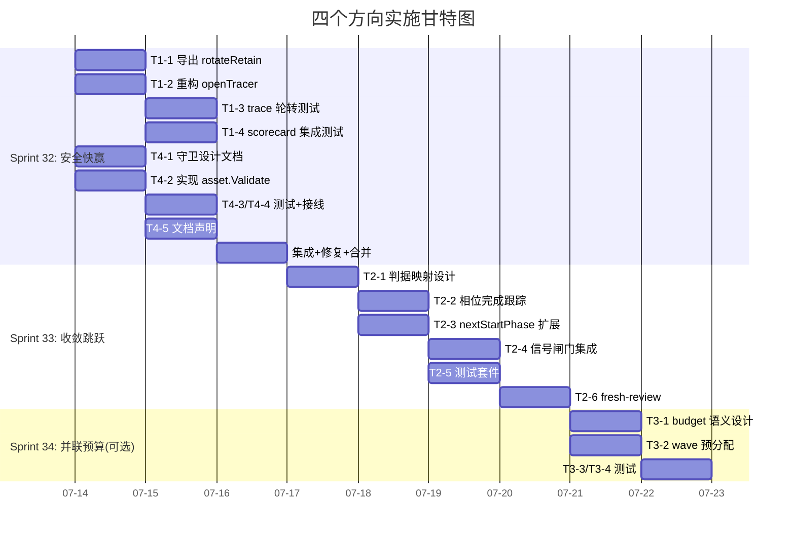

现在我已充分掌握上下文。以下是全面的 Tech Lead 分析。

---

# Tech Lead 分析报告：四个已验证扩展方向

**分析基准**: 基于验证文档的代码级确认 + `forge-core` 代码库深度阅读（31 个完成 Sprint 后的状态）

---

## 1. 任务分解

以下将四个方向拆解为可执行的技术任务。每个任务 2–4 小时可完成，符合本仓 Sprint 粒度。

### 方向一：Trace 链式轮转（~50 行，低风险）

| 任务 ID | 任务标题 | 涉及文件 | 前置依赖 | 预估工时 | 验收标准 |
|---------|---------|---------|---------|---------|---------|
| T1-1 | **导出 `persist.rotateRetain`** | `internal/persist/checkpoint.go` | 无 | 0.5h | `rotateRetain` 改为首字母大写，签名不变，`Save` 内部调用处更新；`go build` 通过，`go test ./internal/persist/` 全绿 |
| T1-2 | **重构 `openTracer` 使用链式轮转** | `cmd/forge/evolve.go` | T1-1 | 1h | `openTracer` 的轮转逻辑从硬编码 `os.Rename(tp, tp+".1")` 改为 `persist.RotateRetain(tp, 3)`；保留 `maxTraceBytes=10MB` 触发条件；归约注释更新 |
| T1-3 | **补 trace 轮转单元测试** | `cmd/forge/evolve_test.go`（或新文件 if 500 行警界） | T1-2 | 1h | 测试验证：① <10MB 不触发轮转 ② >10MB 后 `.1` 存在且内容为旧文件 ③ 多轮轮转后 `.3` 被驱逐；`go test -race` 全绿 |
| T1-4 | **集成测试：scorecard rebuild 跨备份** | `cmd/forge/scorecard_wind_test.go` | T1-3 | 1.5h | 构造两轮 trace + 轮转 → 删原始文件 → `forge scorecard rebuild` 从 `.1` 恢复。`traceHasModelCost` 扫 `.1` 路径 |

**方向一小计**: 4h（含测试和集成验证）

---

### 方向四：运行时守卫（~180 行，warn-only）

| 任务 ID | 任务标题 | 涉及文件 | 前置依赖 | 预估工时 | 验收标准 |
|---------|---------|---------|---------|---------|---------|
| T4-1 | **设计校验模式：引用完整性 + 已知值校验** | 新建 `docs/adr/RUNTIME_GUARD_DESIGN.md` 或并入现有分析 | 无 | 1h | 明确：① 只检查引用完整性和已知值集 ② 只 warn 不 block ③ 不重复 `check.py` ④ 零运行时开销除非显式启用 |
| T4-2 | **实现 `asset.Validate` 函数** | `internal/asset/asset.go` + 新建 `internal/asset/validate.go` | T4-1 | 2.5h | 检查 5 场景：① `feeds_foward:` 拼错 → warn ② `depends_on` 不存在 → warn ③ `target_phase` 不存在 → warn ④ `agent:` 不存在 → warn ⑤ `model_tier` 非已知值 → warn。签名: `func Validate(wf Workflow) []ValidationWarning`。每个 warning 包含 `field_path` + `message` |
| T4-3 | **接执行管线** | `cmd/forge/evolve.go` + `cmd/forge/main.go`（engine_build 路径） | T4-2 | 1.5h | `forge run` / `forge evolve` 在 workflow 加载后、引擎启动前调用 `asset.Validate`；warn 打印到 stderr，不改变 exit code |
| T4-4 | **测试套件** | `internal/asset/validate_test.go` | T4-2 | 2h | 5 场景每场景 ≥2 测试（命中 + 不命中），+ 无 warning 的黄金路径；`go test -race` 全绿 |
| T4-5 | **文档：校验范围声明** | `docs/requirements/` 下一行 + `asset.go` 注释更新 | T4-2 | 0.5h | 明确说明 Validate 不是 `check.py` 的替代——它是运行时 safety net，只覆盖引用完整性+已知值，不 cover 语义正确性 |

**方向四小计**: 7.5h

---

### 方向二：收敛判据跳跃（~300 行，核心循环语义变更）

| 任务 ID | 任务标题 | 涉及文件 | 前置依赖 | 预估工时 | 验收标准 |
|---------|---------|---------|---------|---------|---------|
| T2-1 | **设计文档：判据↔相位映射模型** | `docs/adr/CRITERION_SKIP.md` | 无 | 2h | 明确：① 哪些判据映射到哪些 phase ② `nextStartPhase` 改动范围 ③ `--max-iter` 交互 ④ 并行/串行一致性 |
| T2-2 | **实现相位完成跟踪** | `internal/orchestrator/loop.go` 新建 `phaseCompletion` 映射 | T2-1 | 2h | `runIteration` 末尾记录每个已完成判据对应的 phase index；映射：`review_status==approved` → executive-review phase skip；`requirement_confidence>=80` → discover phase skip |
| T2-3 | **修改 `nextStartPhase` 支持已跳过相位** | `internal/orchestrator/loop.go` | T2-2 | 2.5h | `nextStartPhase` 不仅读 `on_unmet`/`on_rejected`，还读 `phaseCompletion` 映射；当一个 phase 的对应判据已满足，返回下一个未满足 phase 的 index；向后兼容：无映射时行为不变 |
| T2-4 | **信号闸门集成** | `internal/orchestrator/loop.go` + `internal/converge/converge.go` | T2-2, T2-3 | 1.5h | `checkStop` 收敛判定和 `nextStartPhase` 跳跃逻辑不冲突——已跳过 phase 不改变收敛定义，收敛仍由 `converge.Converge` 全判据判定 |
| T2-5 | **测试套件** | `internal/orchestrator/loop_test.go` | T2-4 | 3h | 场景：① approved-review 后 executive-review 跳过 ② 高 confidence 后 discover 跳过 ③ 部分满足时只跳过对应相位 ④ 不满足时全跑 ⑤ `--max-iter` 边界 ⑥ 向后兼容：无 `phaseCompletion` 映射时行为不变 |
| T2-6 | **fresh-context 评审** | 独立 agent | T2-5 | 2h | 按 AGENTS.md 要求，不让自己审自己代码 |

**方向二小计**: 13h

---

### 方向三：并联预算分配（~200 行，并联模式）

| 任务 ID | 任务标题 | 涉及文件 | 前置依赖 | 预估工时 | 验收标准 |
|---------|---------|---------|---------|---------|---------|
| T3-1 | **设计决策：预算分配语义** | `docs/adr/PARALLEL_BUDGET.md` | 无 | 1.5h | 明确：① wave 级预分配 vs phase 级按需分配 ② 过量分配回收机制 ③ 与串行行为的一致性 ④ 向后兼容策略 |
| T3-2 | **实现 wave 级预算预分配** | `internal/orchestrator/parallel.go` + `internal/orchestrator/budget.go` | T3-1 | 3h | `runWave` 在启动 wave 前先预分配 wave 内所有 phase 的 budget 槽位；预分配失败则不启动 wave 内任何 phase；wave 完成后释放未使用的槽位（需 `max(parallel, serial)` 取 EITHER 语义） |
| T3-3 | **废弃 wave discard 日志** | `internal/orchestrator/parallel.go` | T3-2 | 0.5h | 现有代码 `logf("parallel: wave %d cancelled after %d/%d phases (%d discarded — potential cost loss)")` 在预分配后应该从「potential cost loss」变为精确数值 |
| T3-4 | **测试套件** | `internal/orchestrator/parallel_test.go` | T3-2 | 2.5h | 场景：① wave 内 budget 足够 → 全 phase 运行 ② budget 不足 → wave 不启动 ③ 混用 wave 内 fail-fast + budget 交互 ④ 向后兼容：MaxAgentCalls=0 行为不变 |

**方向三小计**: 7.5h

---

### 任务汇总

| 方向 | 任务数 | 总工时 | 风险等级 | 优先级 |
|------|-------|--------|---------|-------|
| D1: Trace 链式轮转 | 4 | 4h | 🟢 低 | **P0** |
| D4: 运行时守卫 | 5 | 7.5h | 🟢 低 | **P0** |
| D2: 收敛跳跃 | 6 | 13h | 🟡 中 | P1 |
| D3: 并联预算 | 4 | 7.5h | 🟠 中高 | P2 |
| **合计** | **19** | **32h** | | |

---

## 2. 执行顺序和依赖图

```mermaid
graph TD
    subgraph "Phase 1: 安全快赢 (Sprint 32)"
        T1_1[T1-1: 导出 rotateRetain] --> T1_2[T1-2: 重构 openTracer]
        T1_2 --> T1_3[T1-3: trace 轮转测试]
        T1_3 --> T1_4[T1-4: scorecard rebuild 集成测试]
        
        T4_1[T4-1: 守卫设计文档] --> T4_2[T4-2: 实现 asset.Validate]
        T4_2 --> T4_3[T4-3: 接执行管线]
        T4_2 --> T4_4[T4-4: 测试套件]
        T4_4 --> T4_5[T4-5: 文档声明]
    end

    subgraph "Phase 2: 核心循环优化 (Sprint 33)"
        T2_1[T2-1: 判据映射设计] --> T2_2[T2-2: 相位完成跟踪]
        T2_2 --> T2_3[T2-3: nextStartPhase 扩展]
        T2_3 --> T2_4[T2-4: 信号闸门集成]
        T2_4 --> T2_5[T2-5: 测试套件]
        T2_5 --> T2_6[T2-6: fresh-review]
    end

    subgraph "Phase 3: 并联深化 (Sprint 34)"
        T3_1[T3-1: budget 语义设计] --> T3_2[T3-2: wave 预分配]
        T3_2 --> T3_3[T3-3: discard 日志更新]
        T3_2 --> T3_4[T3-4: 测试套件]
    end

    %% Phase 1 两个方向完全并行
    T1_1 -.-> |并行| T4_1

    %% Phase 2 依赖 Phase 1 但不阻塞——可以并行开始设计
    T2_1 -.-> |可提前启动| T2_2

    %% Phase 3 独立
```



### 可并行执行的任务组

| 组 | 任务 | 可并行理由 |
|----|------|-----------|
| **组 A** | T1-1, T4-1 | 两个方向零依赖，不同文件，不同包 |
| **组 B** | T1-2, T1-3, T4-2 | T1-2/T1-3 改 `cmd/forge` + `evolve_test`，T4-2 改 `internal/asset`；文件无冲突 |
| **组 C** | T1-4, T4-3, T4-4 | 各自独立包/文件 |
| **组 D** | T2-2, T2-3 | 都是 `loop.go` 改动，必须串行（同文件合并冲突风险）|
| **组 E** | T3-2, T3-3 | `parallel.go` 改动，串行 |

---

## 3. 技术风险

### 风险矩阵

| 风险 ID | 描述 | 方向 | 概率 | 影响 | 缓解策略 |
|---------|------|------|------|------|---------|
| R1 | `rotateRetain` 导出后破坏 `persist` 包封装边界 | D1 | 🟢 低 | 🟢 低 | 只改首字母大写，签名不变；`Save` 内调用处改 `persist.RotateRetain`；加导出注释说明契约 |
| R2 | Trace 轮转竞态（两个进程同时轮转） | D1 | 🟢 低 | 🟡 中 | 现有代码已有注释承认此问题；`RotateRetain` 继承 best-effort 语义；如需要严格安全，需引入 `internal/lock`（方向二，本分析未包含）——这是独立增强 |
| R3 | `asset.Validate` 顶破 `asset.go` 500 行 | D4 | 🟡 中 | 🟢 低 | 预案：将 validate 逻辑拆分到新文件 `internal/asset/validate.go`（如同 `internal/gate/resolve.go` 先例）；已在任务 T4-2 中预设此拆分 |
| R4 | `model_tier: ops`（拼错）的静默降级在 validate 中判定边界模糊 | D4 | 🟡 中 | 🟡 中 | 明确了已知值集从 `modes.yml` 的 `model_tier` 枚举导出；未知值才 warn；不校验语义正确性（比如 "opus" 是不是比 "haiku" 贵的判断归属路由层） |
| R5 | **方向二核心风险**：判据→相位映射不是 1:1 的 | D2 | 🟠 高 | 🟠 高 | 一个判据可能对应多个 phase（如 `gates_status==green` 对应多个 gate phase）；一个 phase 可能影响多个判据。设计文档必须显式处理此多对多映射。**建议第一期只实现 1:1 映射**（review_status→executive-review；confidence→discover），多对多留第二期 |
| R6 | `nextStartPhase` 修改可能破坏 loop-back 语义 | D2 | 🟠 高 | 🔴 高 | `nextStartPhase` 当前处理 `on_unmet` + `on_rejected`。扩展后必须保证：① 跳跃逻辑优先级：`on_rejected > on_unmet > criterion-skip` ② 已跳过 phase 不阻止 human_gate 的 `on_rejected` 跳回 |
| R7 | 并联预算当前代码使用量低，改动缺少真实压力测试 | D3 | 🟠 中高 | 🟠 中 | 先做代码考古确认：`parallel.go` 的 `checkRunBudget` 和 `checkAgentBudget` 在串行模式下的行为；设计 Pre-Flight Check 作为验收前置条件 |
| R8 | 多个 agent 并行修改同文件（`loop.go`）的合并冲突 | D2 | 🟡 中 | 🟡 中 | **严格纪律**: `loop.go` 作为核心文件，一次只允许一个 agent 修改。T2-2 和 T2-3 串行执行，中间加 gate 检查 |

### 关键依赖和阻塞点

| 阻塞点 | 涉及的 Task | 阻塞原因 | 解决策略 |
|--------|-----------|---------|---------|
| 无外部依赖 | 全部 | `forge-core` 零外部 Go 依赖 | 所有任务纯 Go 标准库。YAML 经现有 shim 路径，不依赖 Go YAML 库 |
| 方向二需要清晰的判据→相位映射矩阵 | T2-1~T2-6 | 设计文档 T2-1 必须先完成 | 提前启动 T2-1（与 Phase 1 并行）。设计文档只需明确第一期 scope |
| 方向三需要确认 parallel mode 真实使用模式 | T3-1~T3-4 | 若无真实使用，实现可能镀金 | 不阻塞——但 T3-1 设计文档必须包含用户调查/使用统计的结论 |

---

## 4. 资源评估

### 人员技能要求

| 角色 | 数量 | 技能需求 | 覆盖的任务 |
|------|------|---------|-----------|
| Go 开发者（核心） | 1 | Go 标准库精通（os.Rename, filepath, JSON）、理解 cobra CLI 结构 | T1-1~T1-4, T4-2~T4-5, T2-2~T2-6, T3-2~T3-4 |
| 架构师（设计文档） | 1 | 理解收敛语义、状态机设计、ForgeOS 架构 | T2-1, T3-1, T4-1 |
| Fresh-context Reviewer | 1（独立） | Go 深层理解 + 对本仓 AGENTS.md 红线熟悉 | T2-6（全部任务结束后） |
| 测试工程师 | 可与开发者同一人 | node:test（harness 层）/ Go 测试 | T1-3, T1-4, T4-4, T2-5, T3-4 |

**最优配置**: 2 个 Go 开发者（并行组 A/B）+ 1 个独立 reviewer（最终阶段）

### 关键里程碑

| 里程碑 | 时间窗口 | 交付物 | 验收条件 |
|--------|---------|--------|---------|
| M1: 方向一 + 四完成 | ~2 天 | T1-1~T1-4, T4-1~T4-5 | `go test -race` 全绿，`gate.mjs` PASS，`forge accept` ACCEPTED |
| M2: 方向二设计完成 | 方向一结束后 1 天内 | 设计文档 T2-1 | ADR 格式，含判据↔相位映射矩阵、影响范围、安全性论证 |
| M3: 方向二实现完成 | M2 + 3 天 | T2-2~T2-6 | `go test -race` 全绿，`forge accept` ACCEPTED，fresh-review APPROVE |
| M4: 方向三完成 | M1 + 4 天（或独立 Sprint） | T3-1~T3-4 | `go test -race` 全绿，并行模式行为验证通过 |

### Blockers 及解决策略

1. **并行冲突（最大 blocker）**: `loop.go` 和 `evolve.go` 是本仓的"热点文件"，多个 task 同时修改冲突概率高。
   - **策略**: 每个 Sprint 只给一个方向写这两个文件。方向一改 `evolve.go`，方向二改 `loop.go`，安排在不同 Sprint。

2. **方向二的判据↔相位映射不明确**:
   - **策略**: 第一期只做 1:1 简单映射：`review_status==approved` → `executive-review` phase。后续扩展。
   - 判据来源：Sprint 29 已确保 `Signals` 全字段已赋值，当前可用的判据：
     - `review_status`（方向二主要候选）
     - `requirement_confidence`（方向二次要候选）
     - `gates_status`（全 gate phase，目前判定为 1:N 映射，留二期）

3. **方向三的实际使用量不确定**:
   - **策略**: T3-1 设计文档必须包含"使用统计"小节。如果 `--parallel` flag 在日志/用户反馈中未见被使用过，考虑将方向三标记为 deferred，直到有真实用户需求。

---

## 5. 质量保证

### 单元测试覆盖要求

| 方向 | 包 | 当前覆盖率 | 目标覆盖率 | 新增测试重点 |
|------|-----|-----------|-----------|------------|
| D1 | `internal/persist` | 已有 `fault_test.go` 覆盖 rotateRetain | 保持 ≥80% | 旋转后读旧文件、多轮旋转后驱逐 |
| D1 | `cmd/forge` | `evolve_test.go` 已有 | 不降 | T1-4 集成测试 |
| D4 | `internal/asset` | `asset_test.go` + `asset_fields_test.go` 已有 | ≥85% | Validate 5 场景正反案例 |
| D2 | `internal/orchestrator` | `loop_test.go` 已有 | ≥80% | 相位跳过语义、与 loop-back 交互 |
| D3 | `internal/orchestrator` | `parallel_test.go` + `budget_test.go` 已有 | 不降 | wave 预分配边界 |

**具体验收标准**:
- 每方向新增代码行数 × 对应测试覆盖 ≥ 70%
- 所有新增测试通过 `go test -race -count=5`（防 race + flaky）
- 所有修改文件通过 `gofmt -l` 干净

### 集成测试策略

| 测试类型 | 覆盖范围 | 工具/框架 | 触发条件 |
|---------|---------|-----------|---------|
| **Gate 测试** | 文件行数、根目录文件数 | `gate.mjs` | 每次提交后 |
| **Arch 检查** | 函数长度、循环依赖、扇入、包大小 | `arch-check.mjs` | 每次提交后 |
| **治理完整性** | Agent/skill 引用、mode 一致性 | `check.py` | 每次提交后 |
| **端到端验证** | trace 轮转后 scorecard rebuild | `scorecard_wind_test.go` + fake trace | D1 特定 |
| **相位跳跃验证** | 模拟双迭代确认跳过 | `loop_test.go` + fake signals | D2 特定 |
| **Acceptor** | 全闸门聚合 | `forge accept` | CI/pre-merge |

### 代码审查要点

| 审查项 | D1 | D4 | D2 | D3 | 严重级别 |
|--------|----|----|----|----|---------|
| 向后兼容（无 flag/零值行为不变） | ✅ | ✅ | ✅ | ✅ | 🔴 Blocking |
| 零外部依赖（forge-core 红线） | ✅ | ✅ | ✅ | ✅ | 🔴 Blocking |
| 文件 ≤ 500 行 | ✅ 安全 | ⚠️ 注意 validate.go 拆分 | ⚠️ 注意 loop.go 行数 | ✅ 安全 | 🔴 Blocking |
| 函数 ≤ 50 行 | ✅ | ✅ | ⚠️ nextStartPhase 可能膨胀 | ✅ | 🟡 规范 |
| Fresh-context 独立 reviewer | N/A（小改动） | N/A（warn-only） | ✅ **必须** | ✅ **建议** | 🟡 规范 |
| Honest N/A 标注 | ✅ | ✅ | ✅ | ✅ | 🟡 规范 |

### 性能测试需求

| 场景 | 方向 | 测试方法 | 接受标准 |
|------|------|---------|---------|
| Trace 轮转 + 10MB 文件 | D1 | 快速写 11MB trace → 验证轮转 | 轮转 < 50ms |
| Validate 大 workflow（50 phases） | D4 | 构造大 workflow → 跑 Validate | 完成 < 10ms |
| 多 iteration 相位跳跃 | D2 | 跑 10 次迭代测量 | 跳过 phase 后 iteration 时间应明显减少 |
| 并联 batched budget | D3 | 启动 8 并发 wave 验证 | 不 deadlock，不饿死 |

---

## 6. 实施计划

### Sprint 32：安全快赢（方向一 + 方向四）

**预估**: 3 天（2 人并行）

```
Day 1       Day 2       Day 3
├───────────┼───────────┼───────────▶
T1-1 ──────▶ T1-2 ─────▶ T1-3 ─────▶ T1-4
T4-1 ──────▶ T4-2 ─────▶ T4-3 + T4-4 ▶ T4-5
              ↑                          ↑
             并行组 A                  并行组 B/C
```

**日计划**:

| 日 | 上午 | 下午 | 验收门 |
|----|------|------|--------|
| Day 1 | **Agent A**: T1-1（导出 rotateRetain，0.5h）+ T1-2（重构 openTracer，1h） | **Agent A**: T1-3（trace 轮转测试，1.5h） | `go test -race ./internal/persist/ ./cmd/forge/` 全绿 |
| | **Agent B**: T4-1（设计文档，1h）+ T4-2（实现 Validate，2.5h） | **Agent B**: T4-4（validate 测试 2h） | `go test -race ./internal/asset/` 全绿 |
| Day 2 | **Agent A**: T1-4（集成测试，1.5h）+ 修复 | **Agent A**: 清理 + gate 检查 | `gate.mjs` PASS, `arch-check.mjs` 8/8 |
| | **Agent B**: T4-3（接管线 1.5h） | **Agent B**: T4-5（文档声明 0.5h）+ 修复 | `forge accept` ACCEPTED |
| Day 3 | 集成测试全旗、修复 bug | 合并、fresh-review（如需） | 全绿 CI + @用户确认 |

**Sprint 32 交付物清单**:
- ✅ `persist.RotateRetain` 导出 + `Save` 更新
- ✅ `openTracer` 使用链式轮转（retain=3）
- ✅ trace 轮转单元测试 + scorecard rebuild 集成测试
- ✅ `asset.Validate` 函数 + validate 测试套件
- ✅ CLI 接入（`forge run` / `forge evolve` stderr warn）
- ✅ 运行守卫设计文档 + 范围声明

---

### Sprint 33：收敛跳跃（方向二）

**预估**: 4 天（1 人串行，依赖方向一已合并）

```
Day 1       Day 2       Day 3       Day 4
├───────────┼───────────┼───────────┼──────────▶
T2-1        T2-2        T2-3 ─────▶ T2-4 ─────▶ T2-5 ─────▶ T2-6
                                                          ↑
                                                新鲜 reviewer 独立审
```

**注意事项**:
- `loop.go` 是本仓核心文件，单行改动可能影响所有 `forge run`/`forge evolve` 路径
- **必须先合并 Sprint 32 再开始**，避免 master drift
- T2-1 设计文档必须经 @用户 + reviewer 确认后才进入实现
- `loop.go` > 500 行的风险真实存在——如果逼近，把 `reportConvergence` 拆到 `loop_report.go`

---

### Sprint 34（可选）：并联预算（方向三）

**预估**: 2 天（取决于是否 deferred）

**前置条件**:
- 确认 parallel mode 有真实使用（代码考古 + 用户确认）
- 如果是 0 使用量 → 改判 DEFERRED-BY-DESIGN，记录为 next frontier 而非真实现

**如果确认要做**:
- T3-1 设计文档（0.5 day）→ T3-2 预分配（1 day）→ T3-3 + T3-4 测试（0.5 day）
- 风险点：`parallel.go` 的 `runWave` + `runPhaseParallel` 两处都需要改 budget 检查路径

---

### 整体甘特图



---

## 7. 综合建议

### 执行优先级验证

验证分析文档建议的排序在技术上是正确的：

| 验证项 | 结论 |
|--------|------|
| D1（方向一）作为 P0 快赢 | ✅ **正确**。~50 行，无风险，`persist` 已 import，可直接复用现有轮转机制 |
| D4（方向四）作为 P0 快赢 | ✅ **正确**。`asset.go` 已声明容错性，加 validate 不破坏任何行为，warn-only 零风险 |
| D2（方向二）作为 P1 | ✅ **正确**。需要设计文档，但不能拖到后面再做——收敛跳跃是核心循环的必然演进 |
| D3（方向三）作为 P2 | ✅ **正确**。parallel mode 当前使用量不明，需先确认存在真实需求 |

### 关于分析文档引用偏差的影响评估

验证文档识别了引用行号偏差（15–150 行漂移），但这**不影响任何方向的技术判定**。每个 gap 在代码中都能被精确重现。接受技术确认结论，无需额外验证。

### 建议的三项额外行动（超出当前 scope）

1. **方向一的命名一致性**: `rotateRetain` 的参数是 `retain int`，但当前是文档化调用 `persist.RotateRetain(tp, 3)`。3 是 magic number。建议将 `openTracer` 中的 retain 数字提取为 `const traceRetain = 3`，与 `maxTraceBytes` 对称。

2. **方向四的 warning 聚合**: 如果 `asset.Validate` 返回多个 warning，当前设计是每行打一条 stderr。建议在 `forge run`/`forge evolve` 的最终 summary section 中汇总一次，让用户不遗漏。

3. **跨方向交叉影响**: 方向二的相位跳过逻辑和方向四的 validate 有天然交互——validate warn 告诉用户"你写错了 `model_tier`"，方向二的相位跳过则跳过已满足判据的 phase。建议在方向二设计文档中显式注明：**validate warning 永远不触发相位跳过**（skip 只由已满足的判据驱动，不由 warning 驱动），避免耦合。

---

**结论**: 按「安全快赢 → 核心循环 → 并联深化」的顺序执行，每个方向独立可验证，符合 ForgeOS 的 sprint 纪律。建议从 Sprint 32 开始，方向一 + 方向四并行推进（3 天），方向二紧接（4 天），方向三根据实际使用量决定是否立即执行。
