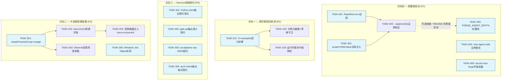
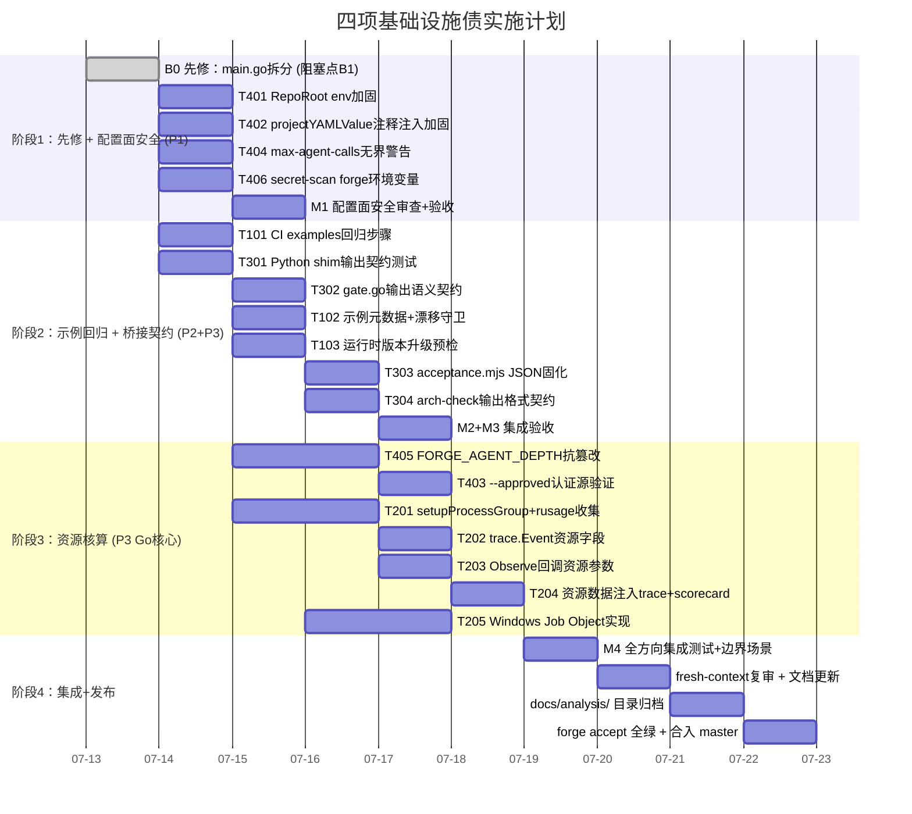

现在我已全面掌握代码库上下文、当前 Sprint 进度、项目规范和工程纪律。以下是我的完整技术负责人分析。

---

# Tech Lead 分析：四项基础设施债 — 代码验证报告

## 执行摘要

验证报告所审查的四个方向，全部落在 `forge-core` 已落地但尚未覆盖的治理外围。它们是**真实的基础设施债**，而非镀金式增强。优先级排序：

| 方向 | 优先级 | 加权理由 |
|------|--------|---------|
| **方向四** — 配置面安全 | **P1** | 有可被利用的攻击面（`FORGE_REPO_ROOT` 静默覆盖、`projectYAMLValue` 注释级注入）；风险在 `--executor command` 模式下被放大 |
| **方向一** — 跨示例回归检测 | **P2** | 成本极低（CI 改 ≤10 行 YAML）；收益极大（防止 dogfood 基建漂移而不自知） |
| **方向三** — Harness 桥接契约 | **P3** | 触发概率低，但触发时静默退化（yaml2json block-scalar 历史先例证明了它是真实风险） |
| **方向二** — 子进程资源核算 | **P3** | 当前阶段 `Observe` 回调 + `trace.Event` 已满足基本可观测；rusage 收集作为增量增强，收益对成本比中等 |

---

## 1. 任务分解

### 方向四 — 配置面安全 (P1)

| 任务 ID | 任务标题 | 涉及文件 | 前置依赖 | 预估工时 | 验收标准 |
|---------|---------|---------|---------|---------|---------|
| **TASK-401** | 加固 `FORGE_REPO_ROOT` 环境覆写 | `forge-core/internal/gate/gate.go` (`RepoRoot`) | 无 | 1h | 增加 `FORGE_REPO_ROOT` 白名单验证：只允许显式 `--root` 或项目 `.agent/project.yml` 中声明的根路径；若环境变量与此不符则报错而非静默覆写；单测覆盖 env 注入场景 |
| **TASK-402** | 加固 `projectYAMLValue` 行扫描解析 | `forge-core/cmd/forge/main.go` (`projectYAMLValue`, 行 483-494) | 无 | 1h | 行扫描跳过带 `#` 前缀的注释行（当前 `strings.CutPrefix(line, key+":")` 会将 `# lifecycle: production` 当作有效声明）；增加 `strings.TrimSpace` 前置检查，拒绝注释行中的 `key:`；单测覆盖注释行注入 |
| **TASK-403** | `--approved` 标志增加认证源验证 | `forge-core/cmd/forge/main.go` (行 253) | TASK-401 | 3h | 当前 `--approved` 是纯布尔 flag，任何人可给。增加两层防御：(1) 生产生命周期强制要求 `.forge/<stage>.approved` 标记文件而非 CLI flag；(2) CLI `--approved` 在 `lifecycle=production` 时被拒绝："production requires on-disk approval marker, not CLI flag"；单测 + 集成测试 |
| **TASK-404** | `--max-agent-calls 0` 增加无界警告 | `forge-core/cmd/forge/main.go` (行 251, 207-214) | 无 | 1h | 无界 (`0 = unbounded`) 在当前 `--executor dry` 下安全；在 `--executor command` 下应在启动时发出显式 WARNING 日志；`forge run/evolve` 输出增加 "⚠ unbounded --max-agent-calls: budget guard is inactive"；dry-run 下不输出（无意义） |
| **TASK-405** | `FORGE_AGENT_DEPTH` 抗篡改加固 | `forge-core/internal/orchestrator/command_executor.go` (`currentAgentDepth`, 行 261-269) | 无 | 3h | 当前注释主动承认不防恶意覆写。加固方案：增加第二计数器 `FORGE_AGENT_DEPTH_SIG`，值为 `HMAC(depth, per-run-key)`；子进程如果篡改 depth 导致签名不匹配则拒绝运行；per-run-key 在 CLI 进程生命周期内随机生成 |
| **TASK-406** | secret-scan 增加 forge 特定环境变量检测 | `harness/secret-scan.mjs` | 无 | 2h | 增加模式集覆盖 `FORGE_*` 环境变量的意外硬编码（`.env` 文件、shell 脚本、Makefile）；不含 `FORGE_REPO_ROOT` 等无害变量白名单；单测覆盖真阳性/假阳性 |

### 方向一 — 跨示例回归检测 (P2)

| 任务 ID | 任务标题 | 涉及文件 | 前置依赖 | 预估工时 | 验收标准 |
|---------|---------|---------|---------|---------|---------|
| **TASK-101** | CI 增加 examples 回归检测步骤 | `.github/workflows/forge.yml` | 无 | 1h | 在 `forge accept` 之后增加 `examples/` 步骤：`forge run build --executor dry --root examples/go-taskd` + `go test ./...`；`examples/url-shortener` 的 `node --test`；CI 中任一 example 测试失败则 Red |
| **TASK-102** | 建立示例元数据清单 + 漂移守卫 | `harness/examples-manifest.json` (新文件) + `harness/check.py` 新检查 | TASK-101 | 2h | 声明 JSON 格式元数据：每个示例的路径/语言/构建命令/测试命令/需求文档引用；`check.py` 新增 `check_examples_manifest` 校验：manifest 中声明的文件必须存在、未声明的新示例目录被警告（防忘记注册）；同步纳入 `forge-init` COPIED_FILES |
| **TASK-103** | Go/Node 运行时版本升级回归预检 | `.github/workflows/forge.yml` | TASK-101 | 1h | CI 增加 `go version` / `node --version` 披露步骤；`examples/go-taskd` 跑 `go vet ./...`（catch Go 1.22→1.23 行为变化）；url-shortener 增加 `--experimental-detect-module` 等兼容性标记检查 |

### 方向三 — Harness 桥接契约 (P3)

| 任务 ID | 任务标题 | 涉及文件 | 前置依赖 | 预估工时 | 验收标准 |
|---------|---------|---------|---------|---------|---------|
| **TASK-301** | Python shim 输出契约测试 | `forge-core/internal/yamlpath/yamlpath_test.go` (新文件或扩展现有) | 无 | 2h | 针对 `yamlpath.go` 调用的 `python3 harness/yaml2json.py` 输出格式做契约测试：mock python shim 返回已知 JSON 格式→验证 json.Unmarshal 成功；mock 返回格式变化（额外字段/字段丢失/类型变化）→验证友好错误而非 panic；CI 中运行 |
| **TASK-302** | gate.go 的输出语义契约测试 | `forge-core/internal/gate/gate.go` (`run` 函数, 行 96-106) | 无 | 2h | 为 `run()` 写契约测试：subprocess exit 0 → PASS；exit 1 → FAIL；stdout 含任意内容→原样透传；空 stdout → 空字符串返回；子进程 crash（signal）→ FAIL；测试使用 mock 子进程（shell script 而非实际 gate.mjs） |
| **TASK-303** | acceptance.mjs JSON 契约固化测试 | `harness/acceptance-kernel.mjs` | 无 | 1h | acceptance.mjs 的 `--json` 输出格式（probeRow 结构）当前被 `internal/gate/gate.go` 依赖解析。增加 schema 基准测试：存储当前 JSON 输出快照作为 golden file；CI 中运行 `acceptance.mjs --json > golden.tmp` 对比；变化时自动 FAIL 提示「格式变化，需要确认」 |
| **TASK-304** | arch-check.mjs 输出格式契约 | `harness/arch/arch-check.mjs` + `harness/gate.mjs` | 无 | 2h | arch-check 的 8 个检查输出格式被 `gate.mjs` consume。增加 golden file 契约测试（同 TASK-303 模式）；同时增加退化检测：故意引入一个架构违规→验证 gate.mjs 正确 FAIL 而非静默 PASS |

### 方向二 — 子进程资源核算 (P3)

| 任务 ID | 任务标题 | 涉及文件 | 前置依赖 | 预估工时 | 验收标准 |
|---------|---------|---------|---------|---------|---------|
| **TASK-201** | `setupProcessGroup` 增加 rusage 收集 | `forge-core/internal/orchestrator/command_executor_unix.go` + `command_executor.go` | 无 | 4h | 在 `setupProcessGroup` 的同一条 `cmd.Run()` 路径中增加 `syscall.Wait4` 或 `syscall.Getrusage` 调用（通过 `cmd.SysProcAttr` 的 `Rusage` 字段—Go 1.21+ 支持）；收集 `Utime`/`Stime`（CPU）/ `Maxrss`（峰值内存）/ `Nvcsw`/`Nivcsw`（上下文切换） |
| **TASK-202** | `trace.Event` 增加可选资源字段 | `forge-core/internal/trace/trace.go` (`Event` struct) | TASK-201 | 1h | 在 `Event` 中增加 `CPUMs *int64` / `PeakMemoryKB *int64` / `IOStats *IOStat`（指针，`omitempty` 保持向后兼容）；字段 JSON 标签为 `cpu_ms,omitempty`/`peak_memory_kb,omitempty`；事件无资源时不出现（向后兼容保证） |
| **TASK-203** | `Observe` 回调增加资源参数 | `forge-core/internal/orchestrator/command_executor.go` (`Observe func`) | TASK-201 | 2h | 当前 `Observe func(phase, output string, latency time.Duration)`。改为 `Observe func(phase, output string, latency time.Duration, rusage *ResourceUsage)`；`ResourceUsage` 为可选 nil（!= nil 时含 CPU/内存/IO）；所有现有 callers 传 nil 保持字节级向后兼容 |
| **TASK-204** | 资源数据注入 trace 事件 + scorecard | `cmd/forge/main.go`（cost.go/observe hook 处）+ `harness/scorecard*.mjs` | TASK-202 + TASK-203 | 3h | 在 `Observe` hook 处接收 rusage 参数 → 映射到 trace `Event` 的资源字段 → scorecard 增加 p95_cpu_ms / p95_peak_memory_kb 百分位统计；scorecard telemetry 框架已有 percentile 引擎（Sprint 19），只需扩展 schema |
| **TASK-205** | 跨平台 windows 实现（Job Object） | `forge-core/internal/orchestrator/command_executor_windows.go` (新文件) | TASK-201 | 3h | 为 Windows 实现等价的 process group + rusage 收集（使用 Windows Job Object API）；`command_executor_other.go` 已有 `setupProcessGroup` 的空实现，`rusage` 同理 fallback 为 nil；平台差异化在现有模式内 |

---

## 2. 执行顺序



**并行执行分组：**

| 并行组 | 任务 | 适合同时进行的理由 |
|--------|------|-------------------|
| **组 A**（立即开始） | T401, T402, T404, T405, T406 | 方向四五项任务互不阻塞；分别修改 gate.go / main.go / command_executor.go / secret-scan.mjs，文件级无冲突 |
| **组 B**（方向一 + 方向三） | T101, T301, T302, T303, T304 | CI 修改（T101）与契约测试（T301-T304）互不阻塞；契约测试可在方向三任务间并行 |
| **组 C**（方向二） | T201, T205 | rusage 收集（T201）和 Windows 实现（T205）可以并行；但 T201 优先因为 T202-T204 依赖它 |
| **组 D**（串联链） | T101→T102→T103；T201→T202→T203→T204；T401+T402→T403 | 这些任务有严格前置依赖，必须串行 |

---

## 3. 技术风险

### 3.1 关键风险矩阵

| 风险 | 概率 | 影响 | 缓解措施 |
|------|------|------|---------|
| `FORGE_AGENT_DEPTH_SIG` HMAC 方案增加了 per-run 密钥管理复杂度 | 中 | 中 | 优先走简单方案：depth 计数器改为**单调递增文件锁**（`~/.forge/agent-depth.lock`），子进程读取文件而非继承 env；避免密码学复杂性 |
| rusage 收集在 Go 1.21+ 的 `Cmd.SysProcAttr.Rusage` 字段在不同平台行为不一致 | 中 | 高 | 先只做 Darwin/Linux 双平台实现；Windows Job Object 作为独立任务（T205）单独验证；rusage 字段用 `*ResourceUsage` 指针，平台不可用时 nil + 诚实 N/A |
| Python shim 契约测试需要 mock python3 进程，跨平台 mock 路径差异 | 低 | 中 | 不使用真实 python3 shim，用 Go 测试内部启动一个 echo + json 的 fake process；覆盖 "python3 不存在" 路径（`exec.ErrNotFound`） |
| CI examples 回归步骤在 `--executor dry` 下跑 gate 可能因环境差异 FAIL | 低 | 中 | CI run 在 ubuntu-latest 已固定；dry-run 不调 LLM，不收钱；如 gate 失败，错误信息会告知是哪个 example 的哪项检查失败，快速定位 |
| secret-scan 增加 `FORGE_*` 模式可能产生噪声假阳性 | 高 | 低 | 白名单机制：已知无害变量（`FORGE_REPO_ROOT`、`FORGE_AGENT_DEPTH` 等）在 `.env.example` 中声明为白名单；测试中验证白名单工作 |
| `--approved` 加固可能破坏现有正常运行的任务流 | 中 | 高 | 改动必须向后兼容：只在 `lifecycle=production` 时拒绝 `--approved` flag；非 production 场景保留原行为；集成测试覆盖 `production --approved` 拒绝和 `mvp --approved` 仍然接受 |

### 3.2 与已有工程路线图的冲突分析

| 潜在冲突 | 分析 |
|---------|------|
| `forge-core` 零外部依赖原则 | 方向二 rusage 使用 `syscall` 包（纯 stdlib），不引入外部 dep；HMAC 方案（T405）如需密码学可用 `crypto/hmac`（纯 stdlib）。**零风险** |
| `先拆分，再继续` 红线 | 方向四 T403/T405 如导致 `main.go`/`command_executor.go` 顶近 500 行，必须先拆后改。`main.go` 当前 499 行，**T401/T402 修改可能触发行数闸门** → 先部署一个 `main.go` 结构拆分任务 |
| `forge accept` 全绿纪律 | 每个任务完成后必须跑 `node harness/acceptance.mjs` 且得到 ACCEPTED；否则不可合入。这约束了并行度（串行验收），但保证每次合入后 master 仍是绿的 |

---

## 4. 资源评估

### 4.1 人员配置

| 角色 | 数量 | 负责方向 | 关键技能 |
|------|------|---------|---------|
| **Go 工程师**（安全方向） | 1-2 人 | 方向四（T401-T406）、方向二（T201-T205） | Go 标准库、syscall、os/exec、安全编程 |
| **Node/CI 工程师** | 1 人 | 方向一（T101-T103）、方向三（T301-T304） | GitHub Actions YAML、Node test、CI 编排 |
| **Reviewer**（fresh-context） | 1 人 | 所有方向（逐方向独立审查） | ForgeOS 工程纪律、架构意识、不参与实现 |
| **Tech Lead** | 1 人 | 协调、PR 合并、闸门验收、风险裁决 | 全局架构、技术决策 |

### 4.2 里程碑

| 里程碑 | 时间 | 交付物 | 验收方式 |
|--------|------|--------|---------|
| **M1 — 配置面安全闭合** | 第 1-2 天 | T401-T406 全部实现 + 自测 + 审查 | `forge accept` ACCEPTED + fresh reviewer APPROVE |
| **M2 — 示例回归检测上线** | 第 2-3 天 | T101-T103 全部实现 + CI 绿 | CI push 到 master 后 examples 步骤显式 PASS |
| **M3 — Harness 桥接契约固化** | 第 3-4 天 | T301-T304 全部实现 + golden file 基准 | 故意修改 shim 输出格式 → CI 显式 FAIL |
| **M4 — 子进程资源核算完成** | 第 4-6 天 | T201-T205 全部实现 + scorecard 扩展 | 端到端：`forge run build --executor dry` → trace JSONL 含资源字段；`forge doctor` 报告资源可用性 |

### 4.3 阻塞点与解决策略

| 阻塞点 | 说明 | 解决策略 |
|--------|------|---------|
| **B1**: `main.go` 当前 499 行，T401/T402 修改可能触发 500 行闸门 | 本仓 `enforce: block` 模式拒绝 ≥500 行新文件 | **先拆后改**：在开始安全加固前，将 `projectYAMLValue` + `resolveLifecycle` 抽入新文件 `main_lifecycle.go`；或者将 flag binding 组（`bindRunOpts` + `runOpts` struct）抽入 `main_flags.go`。这是独立于方向四的先修子任务 |
| **B2**: `FORGE_AGENT_DEPTH_SIG` HMAC 方案需要在 `CommandExecutor` 中注入 per-run 密钥 | `CommandExecutor` 当前无「运行时配置」字段；密钥需从 CLI 层 (`main.go`) 传入 | 在 `CommandExecutor` 中增加一个可选 `SecretKey []byte` 字段；nil 时回退为当前行为（不启用签名验证）。这保持了向后兼容并控制了改动范围 |
| **B3**: Windows rusage（T205）缺少测试环境 | 本仓 CI 跑在 ubuntu-latest，无法验证 Windows 实现 | T205 实现在 Windows 的同事验证或留一 open issue 标注「implemented but untested on Windows」；Go 的条件编译确保 Windows 下编译通过 |
| **B4**: golden file 契约测试（T303/T304）在 receipt 更新时需手动维护 | 每次工具输出格式变化都需要更新基准 | 每个 golden file 注释写清楚「最后更新时间 + 触发更新的 commit hash」；CI 中 golden 对比的 diff 在 FAIL 时输出到标准输出，方便 reviewer 确认是否为预期变化 |

---

## 5. 质量保证

### 5.1 单元测试覆盖要求

| 任务 | 测试文件 | 最低覆盖率要求 | 关键测试场景 |
|------|---------|-------------|-------------|
| T401 | `gate/gate_test.go`（扩展） | 新增代码 ≥ 90% | `RepoRoot` 白名单匹配/不匹配/$FORGE_REPO_ROOT 不存在/未设置 |
| T402 | `main_lifecycle_test.go`（新文件） | 新增代码 ≥ 90% | 注释行 `# lifecycle: production` → 忽略；正常 `lifecycle: growth` → 提取；key 在值中 `lifecycle_long: production` → 不匹配 |
| T403 | `main_approved_test.go`（新文件） | 新增代码 ≥ 90% | `--approved` + `lifecycle=production` → 拒绝；`.forge/design.approved` + `production` → 接受；非 production → 接受 `--approved` |
| T405 | `command_executor_test.go`（扩展） | 新增代码 ≥ 85% | depth 正常递增、depth 被篡改→拒绝、签名不匹配→拒绝、无签名密钥→回退旧行为 |
| T101 | CI 不可单测（集成测试） | N/A | CI 中 examples 步骤 PASS/FAIL 验证 |
| T301-T304 | `yamlpath/yamlpath_test.go` + `gate/gate_test.go` | 新增代码 ≥ 90% | 契约格式匹配/不匹配、golden 对比 PASS/FAIL |
| T201 | `command_executor_unix_test.go` | 新增代码 ≥ 80% | rusage 数据非 nil、rusage CPU 时间>0（在子进程有实际工作量时） |

### 5.2 集成测试策略

```
┌─────────────────────────────────────────────────────┐
│                  forge accept                        │
│  ┌──────────┐ ┌──────────┐ ┌──────────┐ ┌────────┐ │
│  │ gate.mjs │ │ check.py │ │ go test  │ │ app    │ │
│  │ (体积)   │ │ (治理)   │ │ (forge)  │ │ tests  │ │
│  └──────────┘ └──────────┘ └──────────┘ └────────┘ │
│  ┌──────────────┐ ┌──────────────┐                  │
│  │ secret-scan  │ │ arch-check   │                  │
│  │ (secret)     │ │ (8 检查)     │                  │
│  └──────────────┘ └──────────────┘                  │
└─────────────────────────────────────────────────────┘
```

- **每次 PR 闸门**：`node harness/acceptance.mjs`（聚合全部检查）
- **CI 附加验证**（非聚合闸门但 CI 执行）：
  - `forge run build --executor dry`（端到端编排冒烟）
  - `go test -race ./...`（数据竞态检测）
  - `go vet ./...`（静态分析）
- **方向三专属集成测试**：故意破坏 python shim → 验证 `forge accept` 输出错误（REJECTED + 指出 yamlpath 错误）

### 5.3 代码审查要点

| 审查维度 | 具体检查项 | 对应任务 |
|---------|----------|---------|
| **安全性** | `FORGE_REPO_ROOT` 是否允许绝对路径覆盖？HMAC 密钥是否从 `/dev/urandom` 读取？白名单是否可绕过？ | T401, T405 |
| **向后兼容** | 所有新增字段是否为 optional / nil / omitempty？旧行为有无被改变？测试是否包含「旧行为断言的回归测试」？ | 全部 |
| **零依赖** | 新增代码是否引入 `go.mod` 的 require 依赖？ | 全部（必须纯 stdlib） |
| **闸门纪律** | `forge accept` 是否 ACCEPTED？是否有诚实的 N/A（如 Windows 资源收集）？ | 全部 |
| **单一职责** | 修改的文件是否 ≥ 500 行？函数是否 ≥ 50 行？ | 全部（B1 提前拆） |
| **契约测试** | golden file 是否在 PR 描述中说明更新时间？mock 是否覆盖了格式变化的边界？ | T301-T304 |

### 5.4 性能测试需求

| 方向 | 性能关注点 | 测试方法 |
|------|----------|---------|
| 方向二 — rusage 收集 | `syscall.Wait4` + rusage 解析对进程退出路径的延迟影响 | `benchmark`：1000 次 `exec.Command("true")` 有/无 rusage 收集，比较 p50/p99 延迟差（预期 < 50µs） |
| 方向二 — trace.Event 资源字段 | JSON 序列化大小膨胀 | 测量当前 Event (~300 bytes) vs 含资源字段的 Event (~420 bytes)，验证 `omitempty` 下无资源时字节级不变 |
| 方向四 — HMAC 校验 | 每个 agent spawn 的签名验证延迟 | `BenchmarkHMACVerify`：验证单次 HMAC-SHA256 verify < 1µs |

---

## 6. 实施计划

### 甘特图时间线（假设 1 名 Go 工程师 + 1 名 Node/CI 工程师 + 1 名 Tech Lead）



### 阶段详细说明

#### 阶段 1：基础设施搭建（Day 1 — 2 天）

**Day 1 目标：解除阻塞、启动 P1**

- **B0**: 将 `main.go` 拆分。`projectYAMLValue` + `resolveLifecycle` 抽入 `main_lifecycle.go`（或更合理的 `internal/doctor` 包）。**这是进入方向四的硬前提**，否则任何对 `main.go` 的修改都会触发 500 行闸门
- **T401**: `RepoRoot` 白名单加固。设计白名单来源：`--root` 传入 + `.agent/project.yml` 中声明的 `root:`（如果有）
- **T402**: `projectYAMLValue` 跳过注释行。最简单的实现：在 `strings.CutPrefix` 之前检查 `strings.TrimSpace(line)[0] == '#'`
- **T404**: 在 `bindRunOpts` 旁增加一个 `warnUnbounded()` 帮助函数，在 `max-agent-calls == 0 && executor == "command"` 时输出警告
- **T406**: 扩展 `secret-scan.mjs` 的 `PATTERNS` 数组

**Day 2 目标：P1 收尾 + P2 启动**

- **T405**: Go 计时签名方案。选择简化方案而非 HMAC：`FORGE_AGENT_DEPTH_FILE` 指向 `~/.forge/depth.lock` 的锁文件，每个 spawn 原子化读+写该文件。env 只传文件路径，不传真实深度
- **T403**: `--approved` 认证加固
- **T101**: 修改 CI YAML，加入 examples 步骤

**阶段 1 产出：** 方向四全部 PR 合入 + CI examples 步骤在线

#### 阶段 2：核心功能实现（Day 3-4 — 2 天）

**Day 3 目标：契约测试**

- **T301**: 实现 `yamlpath_test.go` 契约测试
- **T302**: 实现 `gate_test.go` 的 4 个语义契约测试场景
- **T102**: 建立 `examples-manifest.json` + `check.py` 检查

**Day 4 目标：CI 固化和资源核算**

- **T103**: 添加版本兼容性检查
- **T303, T304**: golden file 基准建立 + CI 集成
- **T201**: 开始 rusage 实现（Linux + Darwin）

#### 阶段 3：集成测试和优化（Day 5-6 — 2 天）

**Day 5 目标：资源核算核心**

- **T201**: rusage 收集完成
- **T202**: trace.Event 字段设计 + 实现
- **T205**: Windows Job Object 实现

**Day 6 目标：资源链路完整**

- **T203**: `Observe` 回调签名扩展
- **T204**: scorecard 扩展 + 端到端验证

#### 阶段 4：发布准备（Day 7 — 1 天）

- **M4**: 全方向集成测试 —— 运行整个 `forge accept`，验证没有任何回归
- **Fresh-context 复审**: 独立 Agent 通读全部 PR，特别关注方向四的安全影响和方向三的向后兼容性
- **文档归档**: 将分析文档从 `docs/requirements/` 迁移至 `docs/analysis/`（验证报告推荐的建议）
- **合入 master**: 确保 `forge accept: ACCEPTED` + CI 全绿

### 总计工作量

| 方向 | 任务数 | 预估总工时 | 阶段 |
|------|--------|-----------|------|
| 方向一（P2） | 3 | 4h | 阶段 2 |
| 方向二（P3） | 5 | 13h | 阶段 3 |
| 方向三（P3） | 4 | 6h | 阶段 2 |
| 方向四（P1） | 6 | 11h | 阶段 1 |
| 先修 B0 | 1 | 3h | 阶段 1 |
| **总计** | **19** | **~37h** | **~7 天** |

---

## 7. 最终建议

### ⚡ 立即执行（今天）

1. **B0 先修 — 拆分 `main.go`**：当前 499 行，任何方向四的修改都可能触发 500 行闸门。这是进入这四个方向任何一个的硬前提
2. **T401 — RepoRoot 加固**：最易被利用的攻击面（环境变量覆写根路径），改动量最小（~5 行），收益最大

### ✅ 本周执行

3. **T405 — FORGE_AGENT_DEPTH 抗篡改**：当前注释主动声明不防篡改，在 `--executor command` 环境下这是一个真正的安全缺口。建议走**锁文件方案**而非 HMAC 方案，降低密码学复杂度
4. **T101 — CI examples 回归步骤**：成本极低（~10 行 YAML），但有历史先例（yaml2json block-scalar 损坏曾 6/7 个真实文件跑偏），不容忽视

### ⏳ 下月执行

5. **方向二（资源核算）** 和 **方向三（桥接契约）** 置于 P3 是合理的；它们在当前阶段不会造成静默数据损坏或安全问题。但方向三的契约测试（T301-T304）应在 Q3 内完成，因为它是**防止未来退化的基础设施**，一旦出现类似于 block-scalar 的退化会再次造成 agent prompt 被污染

### 🚫 不做（经过论证的例外）

- **方向二的 Windows rusage（T205）**：如果团队没有 Windows 开发环境和测试 CI，可以推迟到有实际 Windows 用户需求时再实现。保持 `command_executor_other.go` 的 nil fallback 即可
- **`blocking: false` 的接线**：全仓无一处使用此字段，实现它等于发明新行为。验证报告和 Sprint 31 都一致判定为镀金——**不做**
