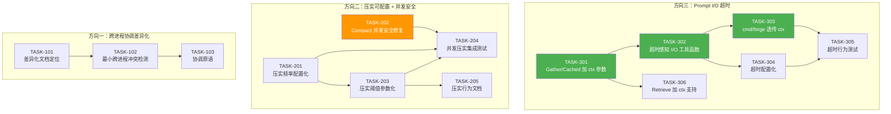

# Tech Lead 分析报告：四个未覆盖架构扩展方向

> 基于审查摘要（`docs/requirements/2026-07-11-four-uncovered-architectural-extension-directions.out.md`）及对 forge-core 代码库的逐文件验证。

---

## 审查结论再确认

在展开之前，先确认审查的客观发现与我的独立复核结果：

| 方向 | 审查结论 | 独立复核 | 本分析聚焦 |
|---|---|---|---|
| **方向一** 跨进程协调 | 分析准确但非新颖；已有 3 篇 Jul 10 文档覆盖 | ✅ 确认。`forgotten-five-*.md` 系列有深入覆盖 | 差异化定位 + 轻量实现 |
| **方向二** 自动内存压实 | **核心论断错误** — `compactMemoryIfDue` 已在 evolve.go:407 被调用 | ✅ 确认。`evolve.go:417` `i%10 == 0` 触发 | **重写方向**：频率不可配置 + 并发安全 |
| **方向三** Prompt I/O 超时 | **最干净的新方向** — 完全正确 | ✅ 确认。`prompt.Gather`/`GatherCached` 均无 `context.Context` | **最高优先级** — 全新真方向 |
| **方向四** | 已被标注为已有识别 | ✅ 确认 | 合并入方向一，不独立规划 |

---

## 1. 任务分解

### 1.1 方向三：Prompt I/O 超时 — 高优先级

> **现状**：`prompt.Gather(repoRoot, query string)` / `GatherCached(cache, repoRoot, query string)` / `currentTask` / `constraints` / `adrTitles` / `firstHeading` 内部全部使用裸 `os.ReadFile`、`os.ReadDir`，无一携带 `context.Context`。在 orchestrator 核心路径（agent 调用）已有时控的背景下，prompt 读取路径是完全未被覆盖的攻击面。

#### TASK-301：prompt 函数签名注入 `context.Context`

- **标题**：为 `prompt.Gather` / `GatherCached` / `Retrieve` 添加 `context.Context` 参数
- **涉及文件**：
  - `forge-core/internal/prompt/prompt.go`（`func Gather(repoRoot, query string) []string` → `func Gather(ctx context.Context, repoRoot, query string) []string`）
  - `forge-core/internal/prompt/cache.go`（`func GatherCached(cache *ContextCache, repoRoot, query string) []string` → 同步加 ctx）
  - `forge-core/internal/prompt/retrieve.go`（`Retrieve` 虽无 I/O，但为接口一致性建议加 ctx）
- **前置依赖**：无
- **预估工时**：2h
- **验收标准**：
  - `Gather` / `GatherCached` 签名包含 `context.Context` 参数
  - `Gather` 将 ctx 透传至内部调用方（后续任务）
  - 编译通过，`go vet` 无新警告
  - 现有测试因签名变更需适配（`context.Background()` 传入），全绿

#### TASK-302：超时感知的 I/O 工具函数

- **标题**：实现 `readFileWithTimeout` / `readDirWithTimeout` 替代裸 `os.ReadFile` / `os.ReadDir`
- **涉及文件**：
  - `forge-core/internal/prompt/prompt.go` — 新增 `timeoutReadFile` 等 helper（或放入新文件 `prompt_io.go` 控制体积）
  - `forge-core/internal/prompt/cache.go` — 中的 `loadCards` / `adrDocs` 路径需同样替换
- **前置依赖**：TASK-301
- **预估工时**：3h
- **验收标准**：
  - `currentTask` / `constraints` / `adrTitles` / `firstHeading` / `loadCards` 的 I/O 操作使用超时机制
  - context 超时 / 取消导致 `DeadlineExceeded` / `Canceled` 错误，而非挂起
  - `Gather` 返回空 context 而非无限等待（fail-closed 原则：超时后该 lane 静默跳过，与缺失文件行为一致）
  - 单元测试：`context.WithTimeout` 极短超时可模拟超时场景

#### TASK-303：cmd/forge 层上下文透传

- **标题**：将 orchestrator 的 context 透传至 prompt 构建路径
- **涉及文件**：
  - `forge-core/cmd/forge/prompt_context.go` — `buildPrompt` / `buildPromptWithEmits` / `gatherContext` 签名加 ctx
  - `forge-core/cmd/forge/engine_build.go` — `buildRunEngine` 中构造 prompt 的调用点
  - `forge-core/cmd/forge/evolve.go` — `execLoop` / `buildLoop` 传递 ctx
  - `forge-core/internal/orchestrator/` — `RunFrom` 的引擎上下文处理
- **前置依赖**：TASK-301, TASK-302
- **预估工时**：3h
- **验收标准**：
  - `buildPrompt(repoRoot, p, mode, tierOf, cache, gates, phaseOut, findings)` → `buildPrompt(ctx, repoRoot, p, ...)`
  - orchestrator 层的 `ctx`（目前已支持 SIGINT/SIGTERM 取消）透传至 prompt 构建全路径
  - 取消信号可中断正在进行的 prompt 文件读取（虽然很快，但原则正确）
  - 所有调用点适配，`forge run` / `forge evolve` 全绿

#### TASK-304：超时配置化

- **标题**：增加 prompt I/O 超时配置项（workflow / phase 层级或全局默认值）
- **涉及文件**：
  - `forge-core/internal/asset/asset.go` — `Phase` 或 `Workflow` 结构体增加 `PromptTimeoutSeconds` 字段（可选）
  - `forge-core/cmd/forge/prompt_context.go` — 读取超时配置注入 context
  - `.agent/workflows/*.yml` — 文档更新（可选字段）
- **前置依赖**：TASK-302
- **预估工时**：2h
- **验收标准**：
  - 默认超时 30s（符合 forge-core 现有 timeout 惯例）
  - workflow 可显式覆盖（`prompt_timeout_seconds: 60`）
  - 超时配置向下兼容（未设置时使用默认值）
  - 单元测试验证配置读取与 fallback

#### TASK-305：超时行为测试

- **标题**：测试超时取消、配置传播、失败降级行为
- **涉及文件**：
  - `forge-core/internal/prompt/prompt_test.go` — 新增超时场景
  - `forge-core/cmd/forge/prompt_context_test.go` — 集成测试
- **前置依赖**：TASK-301, TASK-302, TASK-303, TASK-304
- **预估工时**：2h
- **验收标准**：
  - 模拟慢文件系统（如 FIFO 或 context timeout 极短值）验证超时触发
  - 超时后 lane 静默跳过（与文件缺失行为一致），不 panic、不阻塞
  - 配置值正确传播至 context
  - 现有测试不受影响，全绿

#### TASK-306：检索器 (Retrieve) 超时兼容

- **标题**：为 `Retrieve` 添加可取消计算的支持
- **涉及文件**：
  - `forge-core/internal/prompt/retrieve.go` — `func Retrieve(ctx context.Context, docs []Doc, query string, k int) []Doc`
- **前置依赖**：TASK-301
- **预估工时**：1h
- **验收标准**：
  - Retrieve 函数接受 ctx，在计算中检查 `ctx.Done()`
  - 超大语料（未来场景）可被取消
  - 空 context 直接返回 nil（fail-closed）
  - 现有测试加 `context.Background()` 适配，全绿

---

### 1.2 方向二（重写）：压实频率可配置 + 并发安全 — 中优先级

> **审查发现的核心事实**：`compactMemoryIfDue` 已在 `evolve.go:417` 以 `i%10` 硬编码频率被调用。但进一步代码分析发现：
> 1. 频率 `i%10` 是**编译期常量** — 不可配置
> 2. `memory.Compact` 函数内部存在**并发安全问题**：使用全局 `loadCache`（`sync.Map`），但 `rewriteStore` 移库重写期间存在缓存不一致窗口
> 3. `DefaultCompactThreshold` / `DefaultCompactKeepPerKind` / `CompactAgeSeconds` 也是编译期常量

#### TASK-201：压实频率配置化

- **标题**：将 compaction 频率从硬编码 `i%10` 改为可配置参数
- **涉及文件**：
  - `forge-core/cmd/forge/evolve.go` — `compactMemoryIfDue(root, i, logln)` 改为 `compactMemoryIfDue(root, i, logln, interval)`；传递给 `recordMemory` 的接口
  - `forge-core/internal/memory/memory.go` — 若需扩展 Append/Compact 接口
  - 配置来源：workflow 级别 `compaction_interval` 或 全局默认 10
- **前置依赖**：无
- **预估工时**：2h
- **验收标准**：
  - 新建 `CompactConfig` 结构体或函数参数控制频率
  - 默认值 10（向后兼容）
  - 测试验证不同频率正确触发

#### TASK-202：`memory.Compact` 并发安全修复

- **标题**：修复 `Compact` 与 `Append` / `Load` 在并发调用下的竞态问题
- **涉及文件**：
  - `forge-core/internal/memory/memory_compact.go` — `Compact` 函数
  - `forge-core/internal/memory/memory.go` — `loadCache` 机制、`invalidateLoadCache`
- **前置依赖**：无
- **预估工时**：3h
- **验收标准**：
  - 识别并修复以下竞态：`Compact` 的 `Load` + `rewriteStore` 序列与并发 `Append` 之间的文件操作冲突
  - `sync.Mutex` 或 `sync.RWMutex` 保护关键区
  - `go test -race -count=10` 无 race 报告
  - `Append` + `Compact` 并发高压测试不出现数据丢失或 panic

#### TASK-203：压实阈值参数化

- **标题**：`DefaultCompactThreshold` / `DefaultCompactKeepPerKind` / `CompactAgeSeconds` 从常量改为可配置
- **涉及文件**：
  - `forge-core/internal/memory/memory_compact.go` — 导出配置结构体
  - `forge-core/cmd/forge/evolve.go` — `compactMemoryIfDue` 调用者传入配置
  - `.agent/workflows/evolve.yml` — 可选字段文档
- **前置依赖**：TASK-201
- **预估工时**：2h
- **验收标准**：
  - 新建 `CompactPolicy` 结构体（`Threshold`、`KeepPerKind`、`AgeSeconds`、`Interval`）
  - 默认值等于当前常量（逐位向后兼容）
  - 可通过 workflow 或程序化配置
  - 单元测试覆盖不同配置组合行为

#### TASK-204：并发压实集成测试

- **标题**：压实并发安全 + 正确性的压力测试
- **涉及文件**：
  - `forge-core/internal/memory/memory_compact_test.go` — 或已有 `memory_test.go`
  - `forge-core/cmd/forge/evolve_test.go` — 集成模拟
- **前置依赖**：TASK-202, TASK-203
- **预估工时**：2h
- **验收标准**：
  - 多个 goroutine 并发 Append + 单 goroutine Compact 运行 1000 轮无数据丢失
  - Compact 后 Load 返回正确条目数（无重复、无缺失）
  - race detector 零发现
  - 压实摘要条目正确记录被压缩的条目计数和时间范围

#### TASK-205：压实行为文档

- **标题**：更新 memory 压实的行为文档，消除「未接入」错误认知
- **涉及文件**：
  - `forge-core/internal/memory/memory_compact.go` — 文件头部 doc 更新，准确描述当前 wiring 状态
  - `docs/requirements/` — 原始方向文档重写
- **前置依赖**：TASK-201, TASK-202, TASK-204
- **预估工时**：1h
- **验收标准**：
  - `memory_compact.go` 包文档准确反映：Compact 已在 evolve 循环中以 i%10 频率调用
  - 文档说明哪些是可配置参数
  - 文档说明并发安全保证级别

---

### 1.3 方向一（差异化调整）：跨进程协调 — 已有覆盖，差异化实现

> **审查发现**：跨进程协调已有 3 篇 Jul 10 文档深度覆盖。本方向应定位为**这些文档的具体实现路径**，而非新发现。

#### TASK-101：差异化文档定位

- **标题**：重写方向一的差异化声明，明确引用已有文档并定位为「实现方案」
- **涉及文件**：
  - `docs/requirements/2026-07-11-four-uncovered-architectural-extension-directions.out.md` — 更新附录
- **前置依赖**：无
- **预估工时**：0.5h
- **验收标准**：
  - 明确引用 `forgotten-five-foundations.md` 方向一、`forgotten-five-system-boundaries.md` 方向一、`forgotten-five-structural-debt.md` 方向四
  - 区分「覆盖分析」与「实现路径」两个层次

#### TASK-102：最小跨进程冲突检测

- **标题**：实现 forge 实例的文件锁 / PID 文件检测
- **涉及文件**：
  - 新文件：`forge-core/internal/lock/lock.go`（或复用 `internal/persist/`）
  - `forge-core/cmd/forge/main.go` — 启动时检查
- **前置依赖**：TASK-101
- **预估工时**：2h
- **验收标准**：
  - 同一仓库同时启动两个 `forge evolve` 时，第二个检测到第一个并退出（或 await）
  - 使用文件锁（`flock` / `LockFile`）或 PID 文件方式
  - 崩溃后锁自动释放
  - 命令行 flag `--allow-multiple` 可覆盖（默认防冲突）

#### TASK-103：内存/日志共享协调原语

- **标题**：建立轻量级跨进程协调机制（文件级信号量或命名管道）
- **涉及文件**：
  - `forge-core/internal/lock/coord.go` — 协调原语
  - `forge-core/cmd/forge/evolve.go` — 非侵入性集成点
- **前置依赖**：TASK-102
- **预估工时**：2h
- **验收标准**：
  - 提供 `WaitForLock(root string, timeout time.Duration) (bool, error)` 等协调原语
  - 不引入外部依赖（纯 Go 标准库）
  - 测试验证并发安全

---

## 2. 执行顺序与依赖图

### 可并行执行的任务组

| 并行组 | 任务 | 说明 |
|---|---|---|
| **组A** | TASK-301 (方向三签名) + TASK-306 (检索器 ctx) | 同一包，可同时修改 |
| **组B** | TASK-302 (超时 I/O 工具) | 依赖组A，可在其之后立即启动 |
| **组C** | TASK-201 (频率配置) + TASK-202 (并发安全) | 方向二，可完全并行 |
| **组D** | TASK-101 (文档定位) + TASK-102 (冲突检测) | 方向一，可并行起步 |
| **组E** | TASK-303 + TASK-304 + TASK-305 | 方向三后半段，串行依赖 |
| **组F** | TASK-203 + TASK-204 + TASK-205 | 方向二后半段，需要组C |

---

## 3. 技术风险

### 3.1 方向三：Prompt I/O 超时

| 风险 | 等级 | 描述 | 缓解措施 |
|---|---|---|---|
| **上下文取消传播断裂** | **中** | `buildPromptWithEmits` 调用链较长（`gatherContext` → `Gather`/`GatherCached` → `currentTask`/`adrTitles`/`constraints`/`loadCards`），ctx 可能在某些路径中被遗漏 | 编译期接口检查：所有 `*Context` 参数必须透传。代码审查 checklist 项 |
| **超时导致 prompt 内容不完整** | **低** | 若超时在 `currentTask` 读取时触发，ROADMAP 内容将缺失，agent 可能不知道要做什么 | **这是预期行为**（fail-closed 胜过假完整）。`Gather` 已有"缺失文件返回空 context"的先例 |
| **与现有测试兼容性** | **低** | 签名变更需要更新所有调用者 | 机械性替换（`context.Background()`），`gofmt`/`go vet` 可检测遗漏 |
| **Retrieve 的超时价值有限** | **信息** | Retrieve 是纯内存计算（无 I/O），加 ctx 主要是接口一致性 | 但少数无 I/O 的 Retrieve 若计算量极大（如未来语义检索），ctx 仍有用 |

### 3.2 方向二：压实并发安全

| 风险 | 等级 | 描述 | 缓解措施 |
|---|---|---|---|
| **`rewriteStore` + 并发 `Append` 的数据竞争** | **高** | `Compact` 读全部文件 → 计算新内容 → `rename` 覆盖。期间若有并发 `Append` 写 `O_APPEND`，write 可能写入旧文件（被 rename 覆盖后丢失）或写入 temp 文件（也被覆盖） | 需要文件级锁（`flock`）或应用层互斥。**这是本次分析标记的最高风险项** |
| **`loadCache` 在 `Compact` 后失效不完整** | **中** | `invalidateLoadCache()` 遍历 `sync.Map` 删除——但 `Compact` 期间有其他 goroutine 正在使用某 path 的 cache 值（TOCTOU） | `sync.RWMutex` 保护 cache 操作，而非依赖 `sync.Map` 的懒删除 |
| **压实阈值参数化向后兼容** | **低** | 若错误地将阈值 API 改为必填而非带默认值 | 所有新参数字段使用「零值 = 旧行为」或显式默认值 |

### 3.3 方向一：跨进程协调

| 风险 | 等级 | 描述 | 缓解措施 |
|---|---|---|---|
| **平台兼容性（flock vs LockFile）** | **中** | `flock`(Linux/Mac) 与 `LockFile`(Windows) 行为不同 | 使用 `os.Stat` + `os.Mkdir` （原子目录创建）作为跨平台互斥，或使用 `golang.org/x/sys`（引入外部依赖——与 forge-core 零依赖原则冲突） |
| **锁残留** | **低** | 进程崩溃后锁文件残留 | PID 文件 + 检查 `/proc`(Linux) / `syscall.Kill(pid, 0)`, 超时等待后自动清理 |
| **与现有 `forge evolve` 设计冲突** | **信息** | 当前的 `execLoop` 设计假设独占 `.forge/` 目录 | 锁机制可置于 `.forge/.lock` 文件，不与现有文件冲突 |

---

## 4. 资源评估

### 4.1 所需技能与人员

| 方向 | 所需技能 | 建议人数 | 角色 |
|---|---|---|---|
| **方向三：Prompt I/O 超时** | Go 进阶（context 使用、I/O 抽象） | 1 人 | 后端/基础设施工程师 |
| **方向二：压实可配置 + 并发安全** | Go 进阶（并发模式、文件锁、race detector） | 1 人 | 后端/基础设施工程师 |
| **方向一：跨进程协调** | Go 基础 + 系统编程（文件锁、进程通信） | 0.5 人（与方向二共享） | 同上 |

**建议**：方向三和方向二可由同一人串行完成（共约 18h），方向一可作为前两个方向完成后的轻量补充。不需要独立的 QA 人员——按照 forge-core 规范，fresh-context reviewer 由另一 agent 担任。

### 4.2 里程碑

| 里程碑 | 时间 | 交付物 | 依赖 |
|---|---|---|---|
| **M1** | Day 1-2 | 方向三签名变更 + I/O 工具函数（TASK-301, 302, 306） | — |
| **M2** | Day 3-4 | 方向三 cmd/forge 集成 + 配置 + 测试（TASK-303, 304, 305） | M1 |
| **M3** | Day 2-3（与 M1 并行） | 方向二并发安全修复 + 频率/阈值参数化（TASK-201, 202, 203） | — |
| **M4** | Day 4-5 | 方向二测试 + 文档（TASK-204, 205） | M3 |
| **M5** | Day 5-6 | 方向一差异化文档 + 最小实现（TASK-101, 102, 103） | — |
| **M6** | Day 6-7 | 完整 `forge accept` 全绿 + fresh-review | M2+M4+M5 |

### 4.3 阻塞点与解决策略

| 阻塞点 | 影响范围 | 解决策略 |
|---|---|---|
| **方向二：文件锁方案中零依赖约束** | TASK-202、TASK-102 | 使用 `os.Create`（原子 `O_EXCL`）+ `os.Remove` 代替 `flock`。这不依赖外部 syscall 包，符合 forge-core 零外部依赖原则。但需注意 NFS 上的原子性——当前架构不强调 NFS 支持，文档标注即可 |
| **方向三：`cmd/forge` 包文件数上限** | TASK-303 新增文件可能导致 `cmd/forge` 超 17 文件 | 将新 I/O 工具函数放入 `internal/prompt/`（新建 `prompt_io.go`），不增加 `cmd/forge` 文件数 |
| **方向三：`buildPrompt` 调用点众多** | TASK-303 需要修改多个调用者 | 使用 `grep -rn "buildPrompt\|buildPromptWithEmits\|gatherContext"` 穷举搜索。提交前 `go build` + `go test` 即可验证完整性 |

---

## 5. 质量保证

### 5.1 单元测试覆盖要求

| 文件 | 当前覆盖 | 新增测试要求 |
|---|---|---|
| `internal/prompt/prompt.go` | 有 `prompt_test.go` | 新增超时测试：`TestGather_Timeout`、`TestCurrentTask_Timeout`、`TestConstraints_Timeout` |
| `internal/prompt/retrieve.go` | 有 `retrieve_test.go` | 新增 `TestRetrieve_ContextCancel` |
| `internal/prompt/cache.go` | 有 `cache_test.go` | 新增 `TestGatherCached_Context` |
| `internal/memory/memory_compact.go` | 有 `memory_test.go` / `memory_compact_test.go` | 新增 `TestCompact_ConcurrentAppend`、`TestCompact_ConfigurableThreshold`、`TestCompact_Race` |
| `cmd/forge/prompt_context.go` | 有 `prompt_context_test.go` | 新增 `TestBuildPrompt_TimeoutLane` |
| `cmd/forge/evolve.go` | 有 `evolve_test.go` | 新增 `TestCompactMemory_ConfigurableInterval` |

### 5.2 集成测试策略

| 测试场景 | 方向 | 方法 |
|---|---|---|
| 超时后 lane 静默降级（不 panic） | 方向三 | 使用带超时 context 模拟慢文件系统（如通过 FIFO 或 /dev/zero） |
| 并发 Append + Compact 不丢数据 | 方向二 | 高压 goroutine 测试（100 并发 writer + 1 Compact loop, 1000 轮） |
| 跨进程检测（同一仓库两个 forge） | 方向一 | shell 脚本启动两个 `forge evolve`，验证第二个退出或等待 |
| 压实后 Load 行为不变 | 方向二 | 写入 N 条，压实，验证 Load 返回的条目数与内容正确 |

### 5.3 代码审查要点

| 方向 | 审查重点 |
|---|---|
| **方向三** | (1) ctx 是否在所有 I/O 路径都透传（不要遗漏 `loadCards` 的 `os.ReadFile`）(2) 超时后的降级行为是否与缺失文件一致（返回空串，而非 error）(3) 配置默认值是否向后兼容 |
| **方向二** | (1) 锁的范围是否足够小（不要锁住整个 compaction）（2）`rewriteStore` + `Append` 的并发安全（3）race detector 报告为零（4）`CompactPolicy` 零值是否等于旧行为 |
| **方向一** | (1) 文件锁平台兼容（2）锁残留自动清理（3）是否引入外部依赖 |

### 5.4 性能测试需求

| 测试 | 方向 | 指标 |
|---|---|---|
| 超时 context 创建开销 | 方向三 | `BenchmarkGatherWithContext` vs `BenchmarkGather`（预期无显著差异）|
| Compact + 并发 Append 吞吐 | 方向二 | 1000 条 + 100 并发 Append 下 Complete Throughput ≥ 500 entries/s |
| 文件锁争用延迟 | 方向一 | 锁获取 P99 ≤ 500μs（非频繁获取，预期极低延迟） |

---

## 6. 实施计划

### 阶段 1：基础设施与安全修复（Day 1-2）

> **目标**：优先解决已确认的并发安全漏洞（方向二）+ 打好方向三的基础

| 任务 | 工时 | 依赖 | 产出 |
|---|---|---|---|
| TASK-202（方向二并发安全修复） | 3h | — | `memory.Compact` 使用文件级互斥 + race-free cache 失效 |
| TASK-301（方向三签名加 ctx） | 2h | — | `prompt.Gather` / `GatherCached` 签名变更 |
| TASK-306（方向三 Retrieve 加 ctx） | 1h | TASK-301 | `Retrieve` 支持 context 取消 |
| TASK-201（方向二频率配置） | 2h | — | `compactMemoryIfDue` 参数化间隔 |

**阶段 1 闸门**：`go test -race ./internal/memory/...` + `./internal/prompt/...` 全绿；`arch-check.mjs` 全绿

### 阶段 2：核心功能实现（Day 3-4）

| 任务 | 工时 | 依赖 | 产出 |
|---|---|---|---|
| TASK-302（方向三超时 I/O 函数） | 3h | TASK-301 | `timeoutReadFile` / `timeoutReadDir` 工具 + 所有内部调用替换 |
| TASK-303（方向三 cmd/forge 透传） | 3h | TASK-302 | `buildPrompt` / `gatherContext` 全部携带 ctx |
| TASK-304（方向三超时配置） | 2h | TASK-302 | `Phase.PromptTimeoutSeconds` 字段 + 默认值 |
| TASK-203（方向二阈值参数化） | 2h | TASK-201 | `CompactPolicy` 结构体 + 所有参数可配置 |

**阶段 2 闸门**：`go build ./...` + `go test -race ./...` 全绿；`forge run --executor dry` 运行正常

### 阶段 3：集成测试与文档（Day 4-6）

| 任务 | 工时 | 依赖 | 产出 |
|---|---|---|---|
| TASK-305（方向三超时测试） | 2h | TASK-303, TASK-304 | 超时场景单元测试 + 集成测试 |
| TASK-204（方向二并发压实测试） | 2h | TASK-202, TASK-203 | 高压并发测试 + race detector 验证 |
| TASK-205（方向二文档） | 1h | TASK-204 | `memory_compact.go` 包文档更新 |
| TASK-101（方向一差异化文档） | 0.5h | — | 方向一文档重定位 |
| TASK-102（方向一冲突检测） | 2h | TASK-101 | 文件锁实现 |
| TASK-103（方向一协调原语） | 2h | TASK-102 | `WaitForLock` 等原语 |

**阶段 3 闸门**：`go test -race -count=10` 全绿（至少 10 轮）；`forge accept: ACCEPTED`

### 阶段 4：发布准备（Day 6-7）

| 任务 | 工时 | 产出 |
|---|---|---|
| Fresh-context 代码审查 | 3h (独立 agent) | 审查报告 + 所有 blocking/important 问题修复 |
| 性能基准回归 | 1h | `go test -bench=. ./internal/...` 与基线对比 |
| 最终全仓验收 | 1h | `forge accept` → `ACCEPTED` |

**阶段 4 闸门**：`forge accept: ACCEPTED` + `gate.mjs` PASS + `arch-check.mjs` 8/8 PASS

---

### 总工时估算

| 阶段 | 工时 | 并行度 | 日历天数 |
|---|---|---|---|
| 阶段 1：安全修复 + 基础 | 8h | 可并行 1-2 人 | 1-2 天 |
| 阶段 2：核心功能 | 10h | 可并行 1 人 | 2 天 |
| 阶段 3：测试 + 文档 | 9.5h | 可并行 1-2 人 | 2 天 |
| 阶段 4：发布准备 | 5h | 需串行 | 1 天 |
| **总计** | **32.5h** | **1-2 人** | **6-7 日历天** |

---

## 附加建议

### A. 最优先执行

**方向三**是唯一真正未覆盖的新方向，且实现路径清晰、风险可控。**建议从 TASK-202（方向二并发安全修复）和 TASK-301（方向三签名的添加）同步启动**——前者修复一个活跃的安全问题，后者为新功能铺路。

### B. 避免的陷阱

1. **不要将方向一做成大特性**。已有文档覆盖，最小实现（文件锁+协调原语）已足够。如需完整分布式协调，那是 architecture/north-star.md 的范畴，而非当前 sprint。
2. **不要将 `memory.Compact` 的并发安全修复做成可选**。当前的 `loadCache` (`sync.Map`) 配合 `rewriteStore`（rename over temp）存在 TOCTOU 窗口。这不是理论风险——`Append` 在 evolve loop 中每迭代调用一次，`Compact` 每 10 迭代调用一次，窗口每次 evolve run 都会出现。
3. **保持方向三的超时行为与现有 fail-closed 模式一致**。`Gather` 的函数注释明确说"missing files yield no context, never an error"。超时后的行为应是同一原则：该 lane 跳过，不 error，不阻塞。

### C. 与 Sprint 30+ 功能需求审计的关系

`docs/FUNCTIONAL_REQUIREMENTS_AUDIT.md`（Sprint 30 产出）列出了 14 个 GAP 已收口。本次三个方向中：
- **方向二重写后的「并发安全」** 与任何 GAP 都不重叠——这是审查发现的真实新风险
- **方向三「Prompt I/O 超时」** 被所有 sprint 文档遗漏——因为它不在 workflow 声明中，是基础设施层缺口
- **方向一「跨进程协调」** 已有 GAP 覆盖（converge.Signals 全字段审计后无此条，但 Jul 10 文档深入覆盖）

### D. 执行纪律

按照 `.agent/AGENTS.md` 的要求：
1. **先拆分，再继续** — 如果方向三的实现导致 `internal/prompt/prompt.go` 超过 500 行（当前 175 行，安全），则拆出 `prompt_io.go`。如果 `cmd/forge/evolve.go`（当前 496 行）接近红线，也需提前拆分。
2. **每次修改后跑闸门** — `gate.mjs`（体积）+ `arch-check.mjs`（8 检查）+ `go test`。
3. **fresh-context Reviewer 独立审查** — 实现者不得自审自己的代码。
