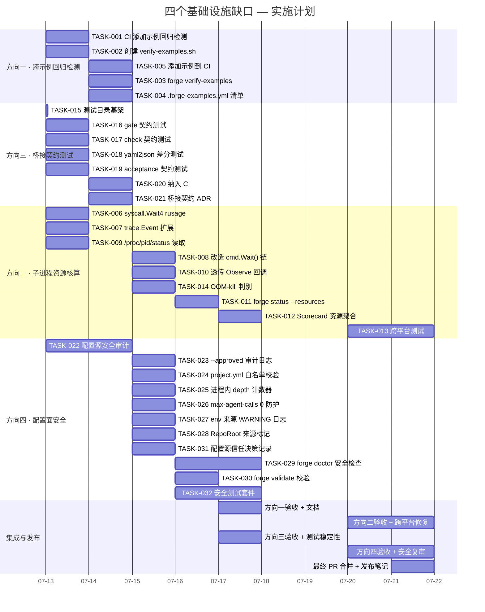
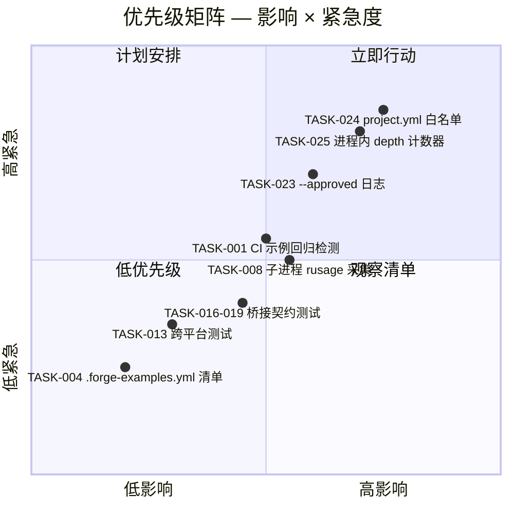

Now I have a thorough understanding of the codebase. Let me produce the full Tech Lead analysis.

---

# Tech Lead 分析报告：四个基础设施缺口

## 执行摘要

分析文档识别了四个真实的基础设施债方向，差异化验证通过。以下从技术实施角度逐层展开。

---

## 1. 任务分解

### 方向一：跨示例回归检测（P2 · ~1 sprint）

| 任务 ID | 任务标题 | 涉及文件 | 前置依赖 | 工时 |
|---------|---------|---------|---------|------|
| **TASK-001** | CI 添加示例回归检测步骤 | `.github/workflows/forge.yml` | 无 | 3h |
| **TASK-002** | 创建 `verify-examples.sh` 验证脚本 | `scripts/verify-examples.sh` | 无 | 3h |
| **TASK-003** | 新增 `forge verify-examples` 子命令 | `forge-core/cmd/forge/verify_examples.go` | TASK-002 | 4h |
| **TASK-004** | 设计 `.forge-examples.yml` 清单格式 | `docs/architecture/example-registry.md` | TASK-003 | 2h |
| **TASK-005** | 添加 ur-shortener + go-taskd 到 CI 验证 | `examples/url-shortener/`, `examples/go-taskd/` (新增 `.forge-examples.yml`) | TASK-001 | 2h |

**TASK-001** 和 **TASK-002** 可并行执行。

### 方向二：子进程资源核算（P2 · ~1.5 sprints）

| 任务 ID | 任务标题 | 涉及文件 | 前置依赖 | 工时 |
|---------|---------|---------|---------|------|
| **TASK-006** | 实现 `syscall.Wait4` 的 rusage 采集 | `forge-core/internal/orchestrator/command_executor_unix.go` | 无 | 4h |
| **TASK-007** | 扩展 `trace.Event` 增加资源字段 | `forge-core/internal/trace/trace.go` | 无 | 2h |
| **TASK-008** | 改造 `cmd.Wait()` 调用链收集 rusage | `forge-core/internal/orchestrator/command_executor.go` | TASK-006 | 3h |
| **TASK-009** | 实现 Linux `/proc/<pid>/status` 峰值内存读取 | `forge-core/internal/orchestrator/proc_mem.go` | TASK-006 | 3h |
| **TASK-010** | 将资源数据透传到 Observe 回调 | `forge-core/internal/orchestrator/command_executor.go` | TASK-008 | 2h |
| **TASK-011** | 新增 `forge status --resources` 报告 | `forge-core/cmd/forge/status.go` | TASK-010 | 4h |
| **TASK-012** | Scorecard 扩展：按 model×phase 聚合资源趋势 | `forge-core/internal/scorecard/` | TASK-011 | 4h |
| **TASK-013** | 跨平台测试（Linux + macOS + Windows CI） | 新增 `command_executor_resource_test.go` | TASK-010 | 4h |
| **TASK-014** | 添加 OOM-kill 判别逻辑（signal 解析） | `forge-core/internal/orchestrator/command_executor.go` | TASK-008 | 2h |

**TASK-006** 与 **TASK-007** 可并行（无交叉依赖）。**TASK-009** 与 **TASK-006** 可并行。其余依赖清晰。

### 方向三：Harness 桥接契约测试（P3 · ~1 sprint）

| 任务 ID | 任务标题 | 涉及文件 | 前置依赖 | 工时 |
|---------|---------|---------|---------|------|
| **TASK-015** | 创建 `tests/harness_bridge/` 测试目录结构 | 目录创建 + `bridge_test.go` 基架 | 无 | 1h |
| **TASK-016** | `gate_contract_test.go`：验证 gate.mjs stdout 格式 | `forge-core/tests/harness_bridge/gate_contract_test.go` | 无 | 3h |
| **TASK-017** | `check_contract_test.go`：验证 check.py `[PASS]/[FAIL]` 格式 | `forge-core/tests/harness_bridge/check_contract_test.go` | 无 | 3h |
| **TASK-018** | `yaml2json_contract_test.go`：与 Go yaml2json 差分对比 | `forge-core/tests/harness_bridge/yaml2json_contract_test.go` | 无 | 4h |
| **TASK-019** | `acceptance_contract_test.go`：验证 acceptance.mjs 报告结构 | `forge-core/tests/harness_bridge/acceptance_contract_test.go` | 无 | 3h |
| **TASK-020** | 将桥接契约测试纳入 CI | `.github/workflows/forge.yml` | TASK-016~019 | 1h |
| **TASK-021** | 文档化每个桥接点的隐式契约（ADR） | `docs/adr/0005-bridge-contracts.md` | TASK-016~019 | 2h |

**TASK-016 ~ TASK-019** 完全可并行——每个测试独立。

### 方向四：配置面安全分析（P1 · ~1.5 sprints）

| 阶段 | 任务 ID | 任务标题 | 涉及文件 | 前置依赖 | 工时 |
|------|---------|---------|---------|---------|------|
| 审计 | **TASK-022** | 全配置源审计清单 + 威胁模型文档 | `docs/security/configuration-attack-surface.md` | 无 | 4h |
| 加固 | **TASK-023** | `--approved` 标志增加审计日志 | `forge-core/cmd/forge/approve.go`, `gates.go` | TASK-022 | 2h |
| 加固 | **TASK-024** | project.yml 的 mode/lifecycle 白名单校验 | `forge-core/cmd/forge/main.go`（`projectYAMLValue` / `resolveLifecycle`） | TASK-022 | 3h |
| 加固 | **TASK-025** | FORGE_AGENT_DEPTH 改用进程内计数器，env 仅作通信 | `forge-core/internal/orchestrator/command_executor.go` | TASK-022 | 4h |
| 加固 | **TASK-026** | `--max-agent-calls` 禁止 0 值在生产模式 | `forge-core/cmd/forge/main.go` | TASK-022 | 2h |
| 加固 | **TASK-027** | 环境变量来源增加 WARNING 日志 | `forge-core/internal/gate/gate.go`, `forge-core/cmd/forge/main.go` | TASK-022 | 2h |
| 加固 | **TASK-028** | RepoRoot 增加来源标记（CLI vs env vs 默认） | `forge-core/internal/gate/gate.go` | TASK-022 | 2h |
| 治理 | **TASK-029** | `forge doctor` 增加配置安全检查 | `forge-core/cmd/forge/doctor.go` | TASK-023~028 | 4h |
| 治理 | **TASK-030** | `forge validate` 校验 project.yml mode/lifecycle | `forge-core/cmd/forge/validate.go` | TASK-024 | 2h |
| 治理 | **TASK-031** | 决策记录：配置源信任模型 | `.agent/DECISIONS.md` | TASK-022 | 2h |
| 测试 | **TASK-032** | 配置面安全测试套件 | `forge-core/internal/gate/gate_security_test.go`, `forge-core/cmd/forge/config_security_test.go` | TASK-023~028 | 4h |

**TASK-023 ~ TASK-028** 无交叉依赖，可完全并行。

---

## 2. 执行顺序与依赖图

```mermaid
graph TD
    %% 方向一
    T001["TASK-001<br/>CI 添加示例回归检测"] --> T005["TASK-005<br/>添加示例到 CI"]
    T002["TASK-002<br/>创建 verify-examples.sh"] --> T003["TASK-003<br/>forge verify-examples 子命令"]
    T003 --> T004["TASK-004<br/>.forge-examples.yml 清单设计"]

    %% 方向二
    T006["TASK-006<br/>syscall.Wait4 rusage 采集"] --> T008["TASK-008<br/>改造 cmd.Wait() 收集链"]
    T008 --> T010["TASK-010<br/>透传 Observere 回调"]
    T010 --> T011["TASK-011<br/>forge status --resources"]
    T011 --> T012["TASK-012<br/>Scorecard 资源聚合"]
    T007["TASK-007<br/>扩展 trace.Event 资源字段"] --> T010
    T009["TASK-009<br/>/proc/pid/status 峰值内存"] --> T010
    T008 --> T014["TASK-014<br/>OOM-kill 判别逻辑"]
    T010 --> T013["TASK-013<br/>跨平台测试"]

    %% 方向三
    T015["TASK-015<br/>测试目录基架"] --> T020["TASK-020<br/>纳入 CI"]
    T016["TASK-016<br/>gate 契约测试"] --> T020
    T017["TASK-017<br/>check 契约测试"] --> T020
    T018["TASK-018<br/>yaml2json 差分测试"] --> T020
    T019["TASK-019<br/>acceptance 契约测试"] --> T020
    T016 --> T021["TASK-021<br/>桥接契约 ADR"]
    T017 --> T021
    T018 --> T021
    T019 --> T021

    %% 方向四
    T022["TASK-022<br/>配置源安全审计"] --> T023["TASK-023<br/>--approved 审计日志"]
    T022 --> T024["TASK-024<br/>project.yml 白名单校验"]
    T022 --> T025["TASK-025<br/>进程内 agent-depth 计数器"]
    T022 --> T026["TASK-026<br/>max-agent-calls 0 值防护"]
    T022 --> T027["TASK-027<br/>env 来源 WARNING 日志"]
    T022 --> T028["TASK-028<br/>RepoRoot 来源标记"]
    T022 --> T031["TASK-031<br/>配置源信任决策记录"]
    T023 --> T029["TASK-029<br/>forge doctor 安全检"]
    T024 --> T029
    T025 --> T029
    T026 --> T029
    T027 --> T029
    T028 --> T029
    T024 --> T030["TASK-030<br/>forge validate 校验"]
    T023 --> T032["TASK-032<br/>安全测试套件"]
    T024 --> T032
    T025 --> T032
    T026 --> T032
    T027 --> T032
    T028 --> T032

    %% 并行组标注
    subgraph P1["并行组 1：方向一（低风险快速落地）"]
        T001
        T002
    end
    subgraph P2["并行组 2：方向二基础"]
        T006
        T007
        T009
    end
    subgraph P3["并行组 3：方向三契约测试（全员并行）"]
        T016
        T017
        T018
        T019
    end
    subgraph P4["并行组 4：方向四加固（独立）"]
        T023
        T024
        T025
        T026
        T027
        T028
    end
```



### 并行执行建议

| 波次 | 时间窗口 | 并行任务 | 所需人力 |
|------|---------|---------|---------|
| **Wave 1** (Week 1) | 方向一全部 + 方向二基础(T006/T007/T009) + 方向三全部(T016~T021) + 方向四审计(T022) | 10 个任务 | 3~4 人 |
| **Wave 2** (Week 2) | 方向二透传链(T008/T010/T014) + 方向四加固(T023~T028/T031) | 8 个任务 | 3~4 人 |
| **Wave 3** (Week 3) | 方向二用户层(T011/T012/T013) + 方向四收尾(T029/T030/T032) | 5 个任务 | 2~3 人 |

---

## 3. 技术风险识别

### 3.1 高风险项

| 风险 | 方向 | 影响 | 可能性 | 缓解策略 |
|------|------|------|-------|---------|
| **rusage 跨平台不一致** | 方向二 | 高——资源数据在 macOS 上可用字段不同，Windows 需要完全不同的 API | 中 | 分层平台文件 + build tags；Windows 用 `GetProcessTimes` + `GetProcessMemoryInfo`；标记 Linux-only 字段为 `omitempty` |
| **bridge 契约测试在 CI 中不稳定** | 方向三 | 中——若 Python/Node 工具的环境输出不同（CI vs dev），测试可能脆性失败 | 高 | 使用 golden file 模式 + update flag；明确区分「格式契约」与「内容契约」；每次 golden 变更需人工审查 |
| **进程内 depth 计数器绕过** | 方向四 | 高——如果恶意 agent 在 spawn 前修改 forge-core 内部状态，计数器可被重置 | 低 | 加固后 counter 在 `syscall` 级别（getpid 绑定）；目前够用，不追求绝对安全 |
| **`projectYAMLValue` 行扫描的解析漏洞** | 方向四 | 中——如果 YAML 使用多行 scalar 或 folding，行扫描误读 | 中 | 加固方案改为 YAML 解析（复用 yaml2json.Decode），但需注意依赖 zero-dep 约束 |
| **yaml2json 差分测试 false positive** | 方向三 | 低——Go 与 Python 的 YAML 语义差异导致契约测试频繁报警 | 中 | 明确界定哪些差异是可接受的（如类型推断差异），文档化在 ADR 中 |

### 3.2 低风险但需注意

- **方向一的 CI 步骤**：在现有 `forge accept` 后增加示例验证。如果示例的 `forge accept` 失败，需要阻断 CI。需准备一个「示例修复」的快速回退流程，或允许 exemptions 标记（以避免 CI 被 stale 示例阻塞）。
- **方向二的 scorecard 资源聚合**：大量 rusage 数据的持久化可能导致 scorecard 体积膨胀。建议采样策略——按 iteration 聚合后写入，而非每个 agent event 都写明细。
- **方向四的 `--approved` 日志**：如果日志被审计需求要求，需要设计日志格式和存储位置。建议先写 stdout 日志，后续再考虑持久化审计追踪。

### 3.3 外部依赖

| 依赖 | 方向 | 关键性 | 替代方案 |
|------|------|-------|---------|
| `syscall.Wait4` / `syscall.Getrusage` | 方向二 | 核心 | 仅 POSIX；Windows 用 Go `os.ProcessState.SysUsage()`（但 Go 1.26 的 `SysUsage` 类型是 platform-specific） |
| `/proc/<pid>/status` | 方向二 | 可选 | 使用 `getrusage(RUSAGE_CHILDREN)` 的 `ru_maxrss` 字段（BSD/Mac 可用） |
| Python 3 + PyYAML | 方向三 | 测试基础设施 | 测试本身需要用 `python3 harness/yaml2json.py` 才能验证桥接契约 |

---

## 4. 资源评估

### 4.1 人员需求

| 角色 | 技能要求 | 方向覆盖 | 工作量 |
|------|---------|---------|-------|
| **Senior Go 开发（1 人）** | Go 系统编程、syscall、os/exec、进程管理 | 方向二核心 + 方向四加固 | 全周期 (~3 周) |
| **后端/基础设施开发（1 人）** | CI/CD (GitHub Actions)、Shell/Python、Harness 架构 | 方向一 + 方向三测试 | 方向一 1~2 天 + 方向三 4~5 天 |
| **安全工程师/开发（1 人）** | 攻击面建模、配置安全、代码审计 | 方向四审计 + 加固验证 | 方向四审计 2 天 + 加固 3~4 天 |
| **测试/QA 工程师（0.5 人）** | 契约测试、差分测试、黄金文件 | 方向三 + 方向四测试 | 方向三 2 天 + 方向四测试 2 天 |

**最优配置**：2 名后端开发 + 1 名安全审计 = 3 人 × 3 周 = ~9 人周

### 4.2 里程碑

| 里程碑 | 时间 | 交付物 |
|-------|------|-------|
| **M1：方向一上线** | Week 1 (Day 2) | CI 中示例回归检测运行；`verify-examples.sh` 脚本 |
| **M2：桥接契约测试就绪** | Week 1 (Day 3) | 4 个契约测试通过；CI 包含契约测试步骤 |
| **M3：配置安全审计完成** | Week 1 (Day 4) | 威胁模型文档完成；风险品级完成 |
| **M4：子进程资源采集落地** | Week 2 (Day 3) | `trace.Event` 包含资源字段；`forge status --resources` 可用 |
| **M5：配置面加固完成** | Week 2 (Day 5) | 6 个加固点全部实现；`forge doctor` 安全检查可用 |
| **M6：全方向集成验证** | Week 3 (Day 3) | 跨平台测试通过；安全测试套件通过；可用性演示 |
| **M7：发布就绪** | Week 3 (Day 5) | 文档更新；ADR 添加；PR 合并至 main |

### 4.3 阻塞点与解决策略

| 阻塞点 | 涉及任务 | 风险等级 | 解决策略 |
|-------|---------|---------|---------|
| Go 1.26 的 `os.ProcessState.SysUsage()` API 不稳定 | TASK-006 | 🟡 中 | 降级为 `syscall.Wait4`（外部包 `golang.org/x/sys/unix.Wait4`），或直接使用 syscall 包的 `Wait4` |
| Windows 没有 POSIX rusage | TASK-013 | 🟡 中 | Windows 实现用 `GetProcessTimes` + `GetProcessMemoryInfo` (通过 `golang.org/x/sys/windows`)；macOS 通过 `wait4` 的 rusage 的自然字段 |
| CI 中运行示例的 `forge accept` 依赖完整 forge-core 编译 | TASK-001 | 🟢 低 | 在 CI 中先 `go build` 然后 `cd` 到示例目录；如果编译器路径不对，通过 `go run` 也可以使用 |
| 方向四的 project.yml 解析改为 YAML 解析后可能破坏零依赖约束 | TASK-024 | 🟢 低 | forge-core 已内建 yaml2json.Decode（Go 原生），可直接复用，不引入外部依赖 |

---

## 5. 质量保证

### 5.1 单元测试覆盖

| 方向 | 模块 | 要求覆盖率 | 关键测例 |
|------|------|-----------|---------|
| 方向二 | `command_executor.go` (`runMeasured`, `finish`) | ≥ 85% | stub command 返回 rusage；模拟 OOM kill；模拟超时；模拟截断 |
| 方向二 | `trace.Event` 序列化 | ≥ 95% | 新字段 `cpu_ms`, `peak_memory_kb`, `oom_killed` 的 JSON 序列化/反序列化；向后兼容（旧事件无字段） |
| 方向二 | `forge status --resources` | ≥ 80% | mock trace store 返回含资源数据的事件；聚合计算正确 |
| 方向四 | `gate.RepoRoot` 来源标记 | ≥ 90% | CLI 优先；env fallback；默认值；来源标记传播 |
| 方向四 | `resolveLifecycle` + 白名单校验 | ≥ 90% | 有效值通过；无效值 fail-safe 到最严格；CLI 覆盖 YAML |
| 方向四 | 进程内 depth 计数器 | ≥ 95% | 递增；最大值保护；env 值被覆盖 |

### 5.2 集成测试策略

| 测试 | 类型 | 触发条件 | 工具 |
|------|------|---------|------|
| 桥接契约测试 (4 个) | 格式契约守卫 | `go test ./tests/harness_bridge/` | 直接 exec + stdout 比对 |
| yaml2json 差分对比 | 回归检测 | `go test -run TestContract_YAML2JSON` | golden file 对比 |
| `forge status --resources` | 端到端 | `go test ./cmd/forge -run TestStatusResources` | 临时工作区和 mock trace |
| 配置安全测试套件 | 安全回归 | `go test -tags=security ./...` | env 注入 + CLI 参数注入 |
| 跨平台 rusage 采集 | 平台适配 | CI matrix (linux/macos/windows) | `go test -run TestRusage` |

### 5.3 代码审查要点

| 审查焦点 | 涉及 PR | 具体检查项 |
|---------|--------|-----------|
| **syscall 使用正确性** | 方向二 | 是否跨平台构建？是否在 build-tag 保护的平台文件中？错误处理？ |
| **资源泄露** | 方向二 | `cmd.Stdout` 和 `cmd.Stderr` 的释放；`cappedBuffer` 的 drain 是否正确 |
| **安全加固** | 方向四 | 白名单是否可被绕过？日志是否泄露敏感信息？零值检查是否在正确层级 |
| **契约测试稳定性** | 方向三 | golden file 是否提交？`-update` 标记是否可通过 `go test -update` 触发？ |
| **向后兼容** | 方向二 | `trace.Event` 新字段是否 `omitempty`？旧 JSONL 文件是否可正常读取？ |
| **CI 配置** | 方向一 | 示例验证失败是否阻断 CI 红线？是否可以豁免（exemption 机制）？ |

### 5.4 性能测试

| 场景 | 方向 | 测试方法 | 基准与目标 |
|------|------|---------|-----------|
| rusage 收集开销 | 方向二 | 连续 10,000 次 `Wait4` 测量 vs 原 `cmd.Wait()` | 目标：p99 < 50μs 增量 |
| scorecard 资源聚合 | 方向二 | 1000 iteration × 10 agent events 的 trace 聚合 | 目标：< 100ms |
| /proc/pid/status 读取 | 方向二 | 代替读取 /proc 的开销（每次子进程完成） | 如果是成功路径（非 OOM），跳过读取（只在错误路径读取） |
| 契约测试执行时间 | 方向三 | 4 个契约测试总执行时间 | 目标：< 2s（因为 spawn 4 个子进程） |

---

## 6. 实施计划

### 甘特图（3 周 / 15 工作日）



### 各阶段总结

| 阶段 | 时间 | 完成的任务 | 关键交付物 |
|------|------|-----------|-----------|
| **Phase 1: 快速落点 + 基础设施** | Week 1 | TASK-001~005, TASK-015~021, TASK-022 | CI 示例回归检测上线；4 个桥接契约测试就绪；配置安全审计完成 |
| **Phase 2: 核心功能** | Week 2 | TASK-006~010, TASK-014, TASK-023~028, TASK-031 | 子进程资源采集完整链路；6 个配置安全加固点落地；`forge status --resources` 可用 |
| **Phase 3: 集成与强化** | Week 3 | TASK-011~013, TASK-029~032 | Scorecard 资源聚合；`forge doctor` 安全检查；跨平台测试通过；全方向验收 |

---

## 7. 技术债务与长期建议

### 7.1 方向间耦合

四个方向的影响域有重叠：

```
             +--> 方向一（示例回归）
             |
   CI 配置 --+--> 方向三（契约测试纳入 CI）
             |
             +--> 方向二（跨平台测试在 CI matrix 运行）
```

**建议**：方向一的 CI 步骤与方向三的契约测试步骤可以合并到一个 CI job（`example-bridge-checks`），减少 CI 膨胀。

### 7.2 方向四的「依赖债务」

| 短期加固（现在做） | 中期改进（未来 2~3 sprints） |
|-------------------|--------------------------|
| `--approved` 日志 | `--approved` 签名验证（用 SSH/GPG） |
| project.yml 白名单 | project.yml 完全 YAML 解析（替换行扫描） |
| 进程内 depth 计数器 | depth 计数器绑定到 cgroup/sandbox |
| env 来源 WARNING 日志 | 全配置源可追溯链表（who set what） |

### 7.3 方向二的「采集 vs 上报」权衡

rusage 的采集是每次子进程执行都做（零成本），但上报到 trace/scorecard 的策略值得权衡：

- **Option A（推荐）**：每次 agent 和 gate 事件都写入 rusage 字段，`omitempty` 确保平台差异字段不会污染 JSON
- **Option B**：仅在 `--verbose` 或 `--resources` 标志下采集
- **Option C**：采样上报（比如每 5 次 agent call 聚合一次）

**推荐 Option A**——rusage 的系统调用开销是微秒级的，而一次 agent 调用是秒级的，差异可以忽略不计。持续采集的最大收益是「不需要复现即可获得历史资源趋势」。

---

## 8. 风险缓解矩阵汇总



**结论**：方向四的配置安全加固应作为最高优先级的第一波交付（Week 1）。方向二的基础采集与方向三的契约测试可以同步进行。方向一的示例回归检测虽然有最低的工程成本，但它和方向三共享 CI 基础设施的改动，建议统筹安排。
