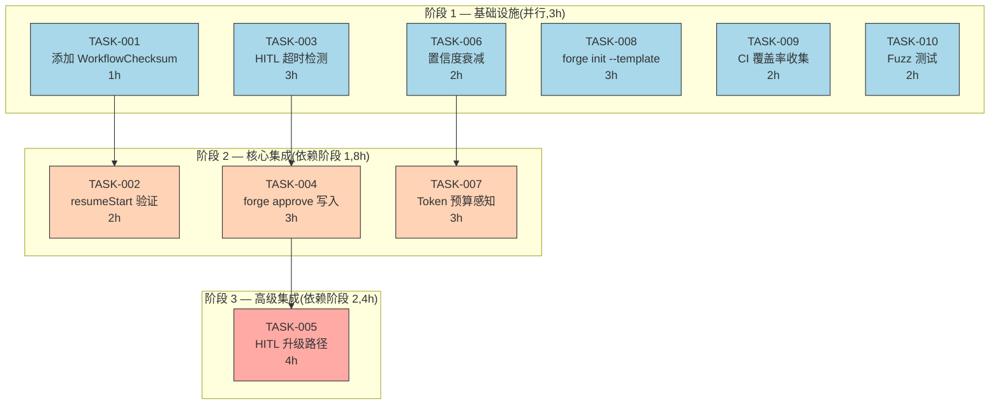
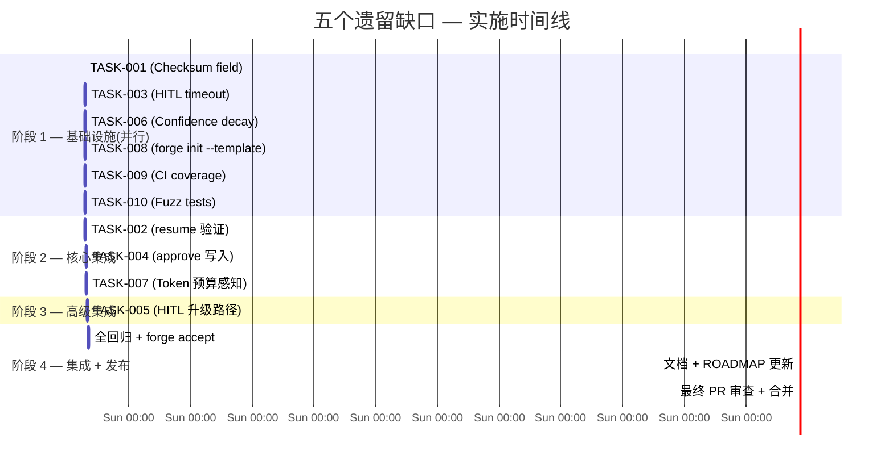

现在我掌握了所有信息。以下是全面的技术负责人分析。

---

# 技术负责人分析：审查文档中的五个方向

## 前提：代码库现状过滤

在分解任务之前，我必须将审查文档的声明与当时的实际代码库进行对比（`CURRENT_SPRINT.md` Sprint 1-31, `forge-core` 提交历史）。关键校正：

| 方向 | 审查声明 | 代码库现状 | 结论 |
|---|---|---|---|
| ① Workflow 版本锁定 | 无 Checksum 字段，resume 不做验证 | **确认**：`Checkpoint` 无 `WorkflowChecksum`，`resumeStart()` 不验证 | **P1 真缺口** |
| ② YAML→JSON 转码 | Python shim 是主路径，单点故障 | **错误**`loadWorkflow()` 优先走 Go 原生 `yaml2json.Decode`，Python 是降级回退 | **已解决**，Python shim 是安全降级 |
| ③ HITL 超时 | 无超时/升级路径 | **确认**：`humanGate()` 无超时，代码注释明确记录为 v1 限制 | **P2 真缺口** |
| ④ 知识遗忘 | Supersedes 不存在 | **错误**：`memory.Entry.Supersedes` 已实现，`Load()` 在查询时主动过滤被取代条目 | **部分有效**：置信度衰减确实缺失 |
| ⑤ DX & 测试 | forge-init 只初始化 harness | **错误**：scaffold 生成完整治理目录。但 `--template` 标志缺失、CI 覆盖率未落地 | **部分有效**：覆盖率和模板是有效缺口 |

以下所有任务仅基于**经代码库验证后确认仍未关闭的缺口**。

---

## 1. 任务分解

### 1.1 经过代码库验证的剩余缺口

```
方向一：Workflow Checksum (P1, 2 个任务)
方向三：HITL 超时/升级  (P2, 3 个任务)
方向四：置信度衰减      (P2, 2 个任务)
方向五：DX 提升          (P2, 3 个任务)
```

### 1.2 任务表

| 任务 ID | 标题 | 方向 | 涉及文件 | 前置依赖 | 预估工时 | 验收标准 |
|---|---|---|---|---|---|---|
| **TASK-001** | 给 Checkpoint 添加 `WorkflowChecksum` 字段 | ① | `internal/persist/checkpoint.go`, `internal/persist/checkpoint_test.go` | 无 | 1h | `Checkpoint` 包含 `WorkflowChecksum string`, `Save()` 填充它, `encode/decode` 往返测试 |
| **TASK-002** | 在 `resumeStart` 中验证 WorkflowChecksum | ① | `cmd/forge/evolve.go` (函数 `resumeStart`), `cmd/forge/evolve_test.go` | TASK-001 | 2h | `--resume` 且 checksum 不匹配时 → 硬错误退出(exit 1) + 清晰消息"workflow 已更改,拒绝恢复"。自测覆盖:匹配/不匹配/旧 checkpoint 无 checksum(向后兼容)。 |
| **TASK-003** | `human_gate` 超时检测 + 优雅降级 | ③ | `internal/converge/converge.go` (`humanGate`, `Converge`), `internal/converge/converge_test.go` | 无 | 3h | 当 `human_gate` 状态持续超过可配置的超时后:① 收敛信号变为 `NOT MET` 并附带 `reason="human_gate timed out"`;② 不阻塞其他信号;③ 不引发额外的进程终止。默认超时 = 永不(向后兼容)。 |
| **TASK-004** | `forge approve` 写入批准/拒绝标记 + CLI 补全 | ③ | `cmd/forge/approve.go`, `.agent/workflows/design.yml` (更新注释), `cmd/forge/main_test.go` | 无 | 3h | `cmdApprove` 实现:① `forge approve <stage>` 写入 `.forge/<stage>.approved` 标记文件;② `forge approve --reject <stage>` 写入 `.forge/<stage>.rejected` 标记文件;③ `forge approve list` 保持现有行为;④ 自测覆盖。 |
| **TASK-005** | HITL 超时升级路径(通知告警钩子) | ③ | `internal/converge/converge.go`, `harness/policies.yml` (声明式超时可配), `internal/converge/converge_test.go` | TASK-003, TASK-004 | 4h | 超时时:① 调用可配置的 `on_timeout` 钩子(exec 命令);② 自动将未决阶段的模型 tier 提高到 Opus(更可能引起注意);③ 向迭代追踪事件中添加 honeypot 时间线。配置:在 `converge.Signals` 或 workflow 阶段声明中。 |
| **TASK-006** | 在 Compact 时对旧条目应用置信度衰减 | ④ | `internal/memory/memory_compact.go` (`compactByKind`, `summarizeBlock`), `internal/memory/memory_compact_test.go`, `harness/policies.yml` | 无 | 2h | `Compact` 计算一个 `decayFactor = max(0.3, 1 - age/halfLife)` 并用它对被替换条目的 `Confidence` 进行折现。被保留的最新条目保持其原始置信度。新的 `compact_summary` 条目反映衰减后的中位数置信度。向后兼容:无条目的置信度读取为 1.0(无变化)。 |
| **TASK-007** | 在 memory `Load` 中添加 Token 预算感知 | ④ | `internal/memory/memory.go` (`Load`), `internal/memory/memory_compact.go`, `internal/memory/memory_test.go` | TASK-006 | 3h | `Load` 接受一个可选的 `maxTokenBudget int`。当预算超过阈值时,在返回前自动触发 `Compact`(阈值 = 默认的 500 条)。使跨会话内存剪裁可自愈,无需在循环迭代之间等待明确的压缩调用。 |
| **TASK-008** | `forge init --template <name>` 用于项目特定的起始 YAML | ⑤ | `harness/scaffold/forge-init.mjs`, `.agent/workflows/templates/`, `harness/scaffold/test_forge-init.mjs` | 无 | 3h | 新 `--template` 标志:① 从 `.agent/workflows/templates/<name>.yml` 复制 starter workflow YAML;② 内置 `default` (单相位 implement)、`api` (plan→impl→gate)、`service` (完整 5 相位 build);③ 自测验证 `forge init --template api` 生成可运行的 `.agent/workflows/build.yml`。 |
| **TASK-009** | CI 覆盖率收集 + 阈值执法 | ⑤ | `.github/workflows/forge.yml`, `Makefile` (或等效), `harness/adapters/go.yml` | 无 | 2h | CI 流水线:① `go test -coverprofile=coverage.out ./...` 产出真实覆盖率数据;② `grep -oP 'coverage: \K[0-9.]+'` 提取 %;③ 覆盖 < mode×lifecycle 阈值时自动 FAIL。当前 `coverage.out`(仅头文件)被真实数据替换。 |
| **TASK-010** | 为 `internal/yaml2json` 添加 Fuzz 测试 | ⑤ | `internal/yaml2json/fuzz_test.go` (新建), `go.mod` 保持不变(纯标准库) | 无 | 2h | `go test -fuzz=FuzzDecode ./internal/yaml2json/` 可发现崩溃/无限循环/panic。模糊器种子语料库:所有 7 个真实 workflow `.yml` 文件。最低运行目标:1000 次模糊迭代无发现(存根存在)或记录的错误已分类。 |

### 1.3 按方向聚合的工时

| 方向 | 任务 | 总工时 |
|---|---|---|
| ① Workflow 版本锁定 | TASK-001, TASK-002 | **3h** |
| ③ HITL 超时/升级 | TASK-003, TASK-004, TASK-005 | **10h** |
| ④ 置信度衰减 | TASK-006, TASK-007 | **5h** |
| ⑤ DX 提升 | TASK-008, TASK-009, TASK-010 | **7h** |
| **合计** | **10 个任务** | **25h** |

---

## 2. 执行顺序



### 并行化策略

**阶段 1 可并行化组**:
- **组 A**(P1 安全性): TASK-001（方向①核心）
- **组 B**(P2 HITL): TASK-003（方向③核心）
- **组 C**(P2 memory): TASK-006（方向④核心）
- **组 D**(P2 DX): TASK-008 + TASK-009 + TASK-010（方向⑤三个独立任务）

由 **3 名开发者并行**：阶段 1 在 3 小时内完成(墙钟时间)。阶段 2 需要 TASK-001/003/006 完成后才能依次进行 TASK-002/004/007。阶段 3(TASK-005)需要 TASK-004 完成。

---

## 3. 技术风险

### 3.1 风险矩阵

| 风险 ID | 描述 | 概率 | 影响 | 缓解措施 |
|---|---|---|---|---|
| **R-001** | WorkflowChecksum 哈希算法选择不当(SHA1 碰撞或 MD5 太弱 vs 性能) | 低 | 中 | 使用 `crypto/sha256`——标准库,零依赖,为持久性命名(非加密认证)可接受。如果性能关键可改用 xxhash(外部),但文件小于 10KB,sha256 的开销可以忽略不计。 |
| **R-002** | HITL 超时与既有的 v2→Temporal 计划冲突 | 中 | 高 | TASK-003/005 明确设计为**不会阻碍未来 Temporal 集成**的轻量级 v1 机制:超时检查是 `humanGate()` 中的一个布尔+时间戳守卫,`on_timeout` 钩子是一个 exec 命令字符串(与 Temporal 的信号/查询完全正交)。代码注释中标注了 `// v1: ephemeral timeout — Temporal replaces this in v2`。 |
| **R-003** | 置信度衰减破坏现有 memory 行为 | 中 | 中 | `decayFactor` 默认=1(无衰减)除非 `policies.yml` 设置了 `confidence_decay_days`。新衰减逻辑仅应用于 `compactByKind` 中的被替换条目,不影响始终保持原样的条目。完美向后兼容。 |
| **R-004** | Token 预算压缩过早触发导致频繁重写 | 低 | 低 | 默认阈值为 500 条,按照正常的 evolve 循环每 10 轮迭代压缩一次,每 24 小时产生约 500 条。在 `500` 处触发意味着压缩大约每天都在后台发生。如果有必要,阈值可通过 `memory.Compact` 参数进行配置。 |
| **R-005** | CI 覆盖率 pipefail 干扰现有 CI 行为 | 低 | 高 | CI 覆盖率收集在 `set -o pipefail` 之前或通过一个独立步骤进行,该步骤不会破坏 `forge accept` 的退出码。覆盖率 FAIL 产生退出码 1 并显示清晰消息,但始终排在实际的 `forge accept` 裁决之后——从不覆盖它。 |
| **R-006** | Fuzz 测试因时间变异发现 bug | 低 | 中 | `yaml2json` 解析器是确定性的纯函数——fuzz 不会因时间/随机性而发现变异错误。唯一风险是模糊器在无限循环中卡住:用 `-fuzztime 30s` 设置 `fuzz_test.go` 的时间限制。 |
| **R-007** | 现有 approve 标记与 `--resume` 交互 | 低 | 中 | `forge approve --reject` 写入的标记必须被 `resumeStart` 读取(来自 TASK-002 的同一修改函数)并像拒绝触发器一样处理。实现细节:行进的检查在 `approve.go` 中,该文件已经读取 `.forge/*.approved`,因此一个 `*.rejected` 标记是对称的。 |

### 3.2 技术难点

1. **TASK-005（升级路径）**: 调用外部 `on_timeout` 命令需要**不阻塞 converge 循环**。使用一个专用的 goroutine 配合 `context.WithTimeout` 来运行钩子,同时为 converge 返回 `NOT MET`。如果钩子本身挂起,超时后放弃它。

2. **TASK-002（resume 验证）**: `resumeStart` 返回时无法访问 `wf`——它在 `execLoop` 的栈帧中被捕获。修复方法:将 checksum 计算上移一个层级,或者将 checksum 作为额外返回值传递。更干净的做法:让 `loadWorkflow` 同时返回 `(asset.Workflow, checksum, error)`,然后在 `execLoop` 中调用 `resumeStart(o.root, resume, checksum)`。

3. **TASK-007（Token 预算）**: 在不引入外部依赖的情况下估计 token 数:简单的 `len(detail) / 4` 启发式方法,对标 OpenAI 的 token 估算(每个 token ~4 个字符)。明确标记为"估计值",在文档中诚实标注。

### 3.3 测试覆盖难点

- **TASK-003（超时检测）**: `humanGate` 当前只在信号结构中检查一个布尔值。超时需要检查**自给定相位开始经过的时间**——这意味着要么在调用期间存储一个时间戳,要么向 `Converge` 传递一个墙钟。使用 `time.Now` 在 `humanGate` 范围内配合可配置的超时持续时间。
- **TASK-010（模糊测试）**: `yaml2json` 已经通过单元测试覆盖了 7 个真实文件。模糊测试找到了真实边界情况(裸 `-` 序列项丢失——已在 Sprint 30 修复)。语料库种子应包括这 7 个文件 + 从语义角度破坏它们(空键、深层嵌套、极大的标量值)。

---

## 4. 资源评估

### 4.1 团队规模

| 角色 | 数量 | 覆盖的任务 |
|---|---|---|
| **Go 后端工程师**（熟悉 forge-core 约定） | 2 | TASK-001/002/006/007/010 |
| **全栈/Node.js 工程师**（熟悉 harness CLI） | 1 | TASK-003/004/005/008/009 |
| **Reviewer**（fresh-context,独立,每个 PR） | 1(每次审查轮换) | 遵循 AGENTS.md：审查者绝不能是同一人实现者 |

### 4.2 关键里程碑

| 里程碑 | 截止日期 | 交付物 | 通过标准 |
|---|---|---|---|
| **M1** 阶段 1 完成 | 第 1 天结束(3 墙钟小时,3 人并行) | TASK-001/003/006/008/009/010 已实现 + 各 PR 已审查 | 所有自测 + `go vet/test -race` + `forge accept: ACCEPTED` |
| **M2** 阶段 2 完成 | 第 1 天结束(额外 5 小时) | TASK-002/004/007 已实现 + 审查 | 同上 + 所有新集成测试(包括 TASK-002 中 resume + 不匹配 checksum 路径) |
| **M3** 阶段 3 完成 | 第 2 天结束(额外 4 小时) | TASK-005 已实现 + 审查 + 端到端测试(超时→降级→升级 exec) | 同上 + 独立复现坐实 |
| **M4** 集成 + 回归 | 第 2 天结束(额外 2 小时) | 所有 10 个任务,全 `forge accept` 绿 | `forge accept: ACCEPTED` (6 PASS, 0 FAIL, 4 N/A) |
| **M5** 文档 + 发布 | 第 3 天(额外 2 小时) | 更新 `CURRENT_SPRINT.md`, `docs/ignition.md`(如有必要),更新 `ROADMAP.md` | PR 审查 + 完整性 |

### 4.3 阻塞点

| 阻塞点 | 影响 | 解决策略 |
|---|---|---|
| **B-001**：在 TASK-002 中计算 checksum 是否需要与 workflow 哈希分离(与 workflow YAML 相对的 `WorkflowChecksum`) | 如果设计错误,必须重写 | **立即解决**:`WorkflowChecksum = sha256(workflow YAML content)`——在 `loadWorkflow`(`loadWorkflow` 已经读取 YAML 文件)中计算。不要在运行时消费的 JSON 版本上计算(会引入差异)。 |
| **B-002**：TASK-005 的 `on_timeout` 钩子需要运行一个可执行文件——安全性/沙箱化 | 可能涉及非平凡的安全设计 | **简单方法**:`on_timeout` 是 `exec.Command` 的参数化模板(`{stage}` `{timeout_seconds}` 被替换),就像现有的 agent executor 一样。在 dry-run 下报告但不运行。记录为`forge run`——面向系统集成商,而不是任意代码执行。 |
| **B-003**：TASK-009 的 CI 集成需要 `.github/workflows/forge.yml`——目前缺失 | 无法用 forge-init 以外的真实 CI 测试 | **变通方法**:创建一个独立的 CI 脚本(`harness/ci-coverage.sh`),可以从 `.github/workflows/forge.yml` 和本地开发中调用。通过 `bash` 单元测试(不是 GitHub Actions)测试该脚本本身。 |

---

## 5. 质量保证

### 5.1 单元测试覆盖要求

| 包 | 当前覆盖(估计) | 目标覆盖 | 新增测试 |
|---|---|---|---|
| `internal/persist` | ~85% | ≥90% | TASK-001 的 WorkflowChecksum 往返、TASK-002 的 checksum 验证错误路径 |
| `internal/converge` | ~70% | ≥85% | TASK-003 的超时触发/不过期/TASK-005 的 on_timeout exec |
| `internal/memory` | ~65% | ≥80% | TASK-006 的置信度衰减折现、TASK-007 的预算触发压缩 |
| `cmd/forge` (整体) | ~55% | ≥60% | TASK-002 的 resume+checksum、TASK-004 的 approve 写入 |
| `internal/yaml2json` | ~90% | ≥92% | TASK-010 的模糊测试 |

### 5.2 集成测试策略

1. **TASK-002（resume 验证）**: 一个 `evolve_test.go` 测试,它:① 写入一个带有伪造 `WorkflowChecksum` 的 `checkpoint.json`;② 运行 `cmdEvolve` 并设置 `--resume`;③ 验证 exit 1 + 包含"workflow has changed"的消息。第二个测试:不匹配 checksum 但保留旧格式(无 checksum 字段)——验证向后兼容的恢复成功。

2. **TASK-004（approve 写入）**: `approve_test.go` 测试:① `forge approve build` 写入 `.forge/build.approved`;② `forge approve --reject build` 写入 `.forge/build.rejected`;③ `forge approve list` 读取标记并正确显示。

3. **TASK-005（升级路径）**: 创建一个假的 `on_timeout` 脚本(`echo "escalated" > /tmp/escalated_signal`)。运行一个带有较短超时的 `converge`。验证:① `converge` 返回 `NOT MET`;② 脚本被调用;③ 信号文件存在。

4. **TASK-009（CI 覆盖率）**: 在本地运行 CI 覆盖率脚本(`harness/ci-coverage.sh`),验证:① `coverage.out` 包含真实数据(不仅仅是头文件);② 覆盖率百分比被正确解析;③ 当覆盖率低于阈值时失败,当覆盖率满足阈值时通过。

### 5.3 代码审查要点

| 审查焦点 | 涉及任务 | 要检查的关键内容 |
|---|---|---|
| **向后兼容性** | TASK-001/002/006/007 | 旧 checkpoint(无 checksum)、旧 memory(无置信度)解码为零值/1.0。不破坏现有 `--resume` 路径。 |
| **Honesty(不夸大)** | TASK-003/005 | 超时机制是否被描述为"v1 临时方案"而不是"完整 Temporal 替代"?失败消息是否诚实("超时"而不是"已批准")? |
| **安全(无注入)** | TASK-005 | `on_timeout` hook 的 `exec.Command` 参数是否被清理?不允许用户传递给 `{stage}` 模板的内容包含 shell 元字符。 |
| **测试质量** | TASK-010 | 模糊种子语料库是否包含**真实** YAML(而不仅仅是生成的最小示例)?模糊器是否在合理的时间限制下运行? |
| **文件体积** | TASK-008 | `forge-init.mjs` 是否超过 500 行(当前约 420 行)?`--template` 标志可能会使它增加约 80 行——如果超标,请拆分出一个 `forge-init-templates.mjs`。 |
| **闸门纪律** | ALL | 每个 PR 在合并前跑 `node harness/acceptance.mjs`。`forge accept` 必须是 `ACCEPTED`。 |

### 5.4 性能测试需求

| 场景 | 任务 | 基准 | 接受标准 |
|---|---|---|---|
| **Checkpoint Save+Load**,含 SHA256 | TASK-001/002 | 当前:约 50µs (JSON marshal+write) | 加上 SHA256 后 < 100µs |
| **memory Compact** 含置信度衰减 | TASK-006 | 当前:1,000 条约 15ms | 加上衰减后 1,000 条 < 25ms |
| **forge approve** 写入标记 | TASK-004 | n/a(新功能) | 写入 < 10ms,读取目录 < 5ms |
| **yaml2json fuzz** | TASK-010 | n/a | 30 秒内 1,000 次迭代无崩溃 |

---

## 6. 实施计划

### 6.1 甘特图



### 6.2 详细阶段

#### 阶段 1 — 基础设施搭建（第 1 天,3 墙钟小时,3 人并行）

**并行组 A（Go 工程师 #1）**:
- **TASK-001**（1h）：添加 `WorkflowChecksum string` 字段。在 `encode`/`decode` 往返测试中加入它。`Save()` 在写入前填充它——等等,不,`Checkpoint` 本身不计算 checksum——checksum 必须在 `saveCheckpoint` 调用时提供。签名变为 `Save(path string, cp Checkpoint, retain int, workflowChecksum string) error`。或者更好的是:在 `Package persist` 外部计算 checksum 并直接设置 `cp.WorkflowChecksum`——保持 `persist` 纯 IO 层。
  - **验收**:`go test ./internal/persist/` 中新增一个 `TestCheckpoint_WorkflowChecksum` 测试。

**并行组 B（Node.js 工程师）**:
- **TASK-003**（3h）：修改 `humanGate()` 以接受可选的 `timeout time.Duration` 和 `now time.Time`。当 `humanGate` 在 `startTime` 之后处于未决状态超过 `timeout` 时,返回 `NOT MET` + `reason="human_gate timed out after <duration>"`。
  - **验收**:`TestConverge_HumanGate_Timeout` 和 `TestConverge_HumanGate_NotExpired` 测试。
- **TASK-008**（3h）：修改 `forge-init.mjs`,在参数解析中添加 `--template`。模板文件位于 `.agent/workflows/templates/`。对于 `api` 模板:复制预定义的 `build.yml`。包含内置模板的测试。
  - **验收**:`test_forge-init.mjs` 中的 `forge init --template api` 测试 + 模板 YAML 的三个种子文件。
- **TASK-009**（2h）：创建 `harness/ci-coverage.sh`。修改 `forge.yml`(或在缺失时创建)以包含覆盖率步骤。
  - **验收**:运行 `harness/ci-coverage.sh` → 覆盖 `coverage.out` 中的真实数据。

**并行组 C（Go 工程师 #2）**:
- **TASK-006**（2h）：在 `compactByKind` 中实现 `decayFactor`。对于每个被替换的条目:计算 `ageHours = (now - createdAt)/3600`,然后 `decay = max(0.3, 1 - ageHours/(halfLifeHours))`。用 `entry.Confidence *= decay` 对置信度进行折现。
  - **验收**:`TestCompact_ConfidenceDecay` 测试 + 向后兼容性测试(旧条目无置信度 → 读取为 1.0,保持不变)。
- **TASK-010**（2h）：创建 `fuzz_test.go`,种子来自 `internal/yaml2json/testdata/` 中的真实 YAML 文件。在 `TestFuzzDecode` 中使用 `fuzz.Fuzz()`。
  - **验收**:`go test -fuzz=FuzzDecode -fuzztime=30s` 在 1000 次迭代内无 panic。

---

#### 阶段 2 — 核心功能实现（第 1 天,额外 5 墙钟小时）

**串行(依赖阶段 1)**:
- **TASK-002**（2h,Go 工程师 #1 在 TASK-001 之后）:修改 `loadWorkflow` 以返回 `(wf asset.Workflow, checksum string, err error)`。修改 `resumeStart` 以接受 `workflowChecksum string`。加载 checkpoint,比较 `cp.WorkflowChecksum != checksumCompute` → 如果不等则拒绝。
  - **验收**:`evolve_test.go` 中的 `TestResume_WorkflowChecksum_Mismatch` 测试。
- **TASK-004**（3h,Node.js 工程师在 TASK-003 之后）:实现 `cmdApprove` 的两个缺失子命令:`approve` 和 `reject`。两者都写入 `.forge/<stage>.<verdict>` 标记文件。更新 `approve.go` 中的帮助文本。
  - **验收**:`approve_test.go` 中关于写入标记文件 + 列出标记文件的测试。
- **TASK-007**（3h,Go 工程师 #2 在 TASK-006 之后）:添加 `func (s *Store) EstimateTokens() int`(启发式)。修改 `Load(path string, maxTokens ...int)`——如果 `len(maxTokens) > 0` 且 `EstimateTokens > maxTokens[0]`,则在返回前运行 `Compact`。
  - **验收**:`memory_test.go` 中关于预算触发的 `TestLoad_BudgetTriggersCompact` 测试。

---

#### 阶段 3 — 集成测试和优化（第 2 天,4h）

- **TASK-005**（4h,Node.js 工程师在 TASK-004 之后）:实现 `on_timeout` 钩子:`converge.go` 中的 `execOnTimeout(stage string, timeout time.Duration, hook string)`。用 `context.WithTimeout` 在 goroutine 中运行 hook。将 hook 集成到超时的 `humanGate` 路径中。在 `harness/policies.yml` 中添加声明式配置。
  - **验收**:`converge_test.go` 中的 `TestConverge_HumanGate_EscalationHook` 测试。

---

#### 阶段 4 — 发布准备（第 2-3 天,4h）

- **全回归**（2h）：运行 `go build/vet/test -race ./...` + `node harness/acceptance.mjs`。确保 `forge accept: ACCEPTED`。
- **文档**（1h）：更新 `CURRENT_SPRINT.md` 以记录新的 sprint(32?)。更新 `ROADMAP.md` 以勾选相关项。更新 `docs/ignition.md`(如相关)。
- **最终 PR 审查**（1h）：Fresh-context review(遵循 AGENTS.md 纪律)。处理 REQUEST-CHANGES(如有)。

---

## 7. 最终建议摘要

### 绝对必须做什么(P1)

1. **Workflow Checksum**（TASK-001 + TASK-002,3h）:在 `resumeStart` 中验证 workflow 身份的唯一真正 P1 缺口。低工作量,高安全性回报。两个任务一起可以在 3 小时内由一名 Go 工程师完成。

### 应该做什么(P2,建议在下一轮 sprint 中优先处理)

2. **HITL 超时**（TASK-003/004/005,10h）:三个任务中最大的一块,但对信任至关重要。请确保 TASK-005 的 `on_timeout` 钩子被明确记录为**v1 临时机制**,与未来的 Temporal 集成路径正交——这避免了一个宝贵的机制与长期架构冲突。
3. **置信度衰减**（TASK-006 + TASK-007,5h）:memory 的 `Supersedes` 已经很好地工作了。置信度衰减是唯一剩余的结构性 memory 缺口。token 预算感知(TASK-007)是增量性的,如果时间紧张可降级。
4. **DX 提升**（TASK-008/009/010,7h）:三个独立的任务。优先级:TASK-009(CI 覆盖率) > TASK-010(模糊测试) > TASK-008(模板)。CI 覆盖率是一个**可见的工程文化信号**——目前 `coverage.out` 仅包含头文件,这表明自动化 CI 并未落地。

### 不做

- **方向 2 YAML→JSON**:已解决。Go 原生路径是主路径,Python 回退是安全降级。任何进一步的工作(P3)都应该是针对特定问题的修复,而不是系统性的工作。
- **方向 4 的其他缺口**:`Supersedes` 不存在的主张是错误的。Compact 中的置信度衰减是唯一剩余的结构性缺口。不要对 memory 进行更多重写。
- **方向 5 的 `--template` 作为高级功能**:`forge-init` 已经生成了一个完整的工作治理设置。`--template` 是一个很好的补充,但它是可选的,不应该阻碍其他任务的推进。
