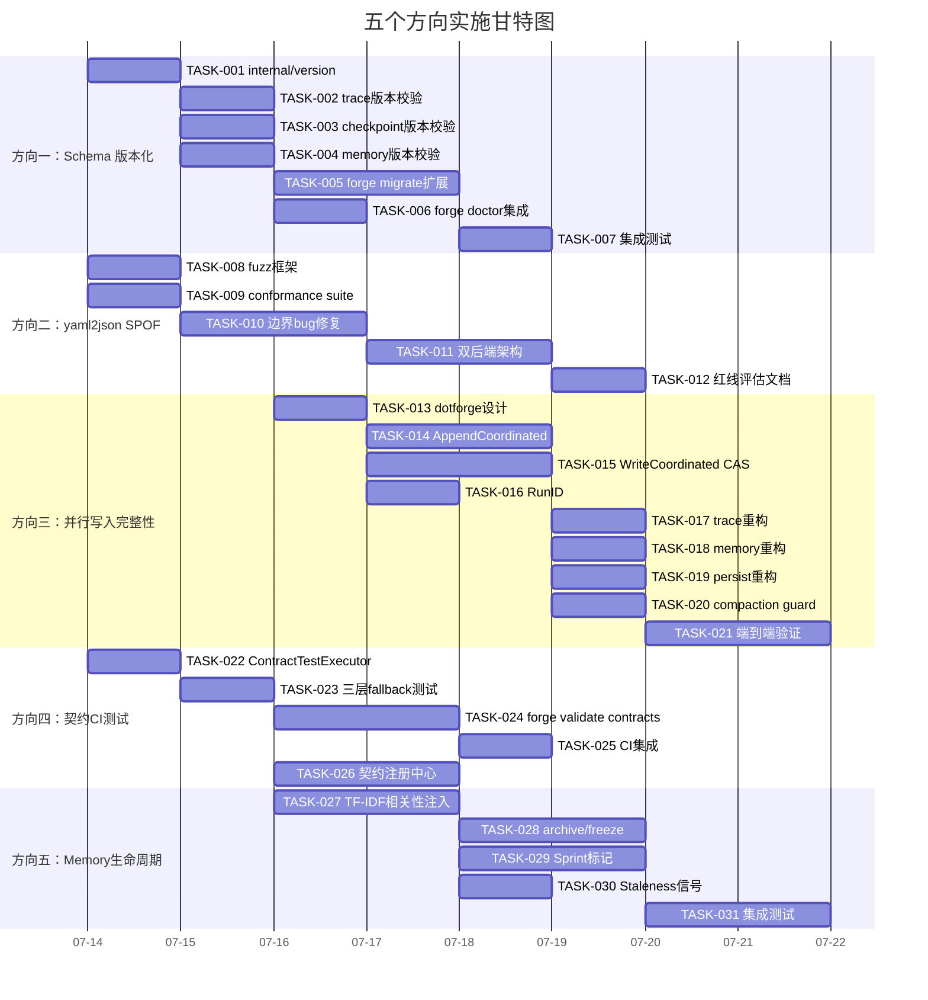

Now I have a thorough understanding of the codebase and the analysis document. Let me compose the Tech Lead analysis.

---

# Tech Lead 分析：五个代码级系统性扩展前沿

> **分析依据**: `docs/requirements/2026-07-11-scan-five-codegrounded-systemic-frontiers.md`  
> **代码库**: `forge-core` (Go) + `harness` (Node/Python)  
> **日期**: 2026-07-12  
> **角色**: Tech Lead

---

## 1. 任务分解

### 前置说明

- 所有路径均基于 `forge-core/` 根目录
- 任务粒度控制在 2-4 小时可完成，但需考虑测试编写时间（通常占 40-60%）
- P1 方向优先拆细，P2 方向可适当合并

---

### 方向一：持久化产物 Schema 版本化与迁移协议（🔴 P1）

| 任务 ID | 标题 | 涉及文件 | 前置 | 工时 | 验收标准 |
|---------|------|---------|------|------|---------|
| **TASK-001** | `internal/version` 版本注册中心包 | `forge-core/internal/version/`（新建目录） | 无 | 3h | 包导出当前三个产物的版本常量 + 兼容矩阵 `IsCompatible(major, minor) bool` + 单元测试 |
| **TASK-002** | trace decode 入口加版本校验 | `internal/trace/trace.go` (`decode`/`Load` 处) | TASK-001 | 2h | Load/Decode trace 文件时调用 `version.CheckTraceVersion()`；不匹配时输出 WARN（minor）或返回 error（major） |
| **TASK-003** | checkpoint decode 入口加版本校验 | `internal/persist/checkpoint.go` (`decode` 行 165-175) | TASK-001 | 2h | Load checkpoint 时校验 `FormatVersion`；major 不匹配返回显式 error + 提示迁移路径 |
| **TASK-004** | memory decode 入口加版本校验 | `internal/memory/memory.go` (`decode()`) | TASK-001 | 2h | Load/Decode memory 条目时逐条校验 `_format`；不匹配条目返回 error+行号 |
| **TASK-005** | `forge migrate` 扩展：trace/checkpoint/memory 子命令 | `cmd/forge/migrate.go` + 新建 `internal/migrate/format.go` | TASK-002/003/004 | 4h | `forge migrate trace --from-v1 --to-v2 <file>` 实现逐行 re-encode；`forge migrate checkpoint --from-v1 --to-v2 <file>` 实现 re-serialize |
| **TASK-006** | `forge doctor` 集成格式版本检查 | `internal/doctor/doctor.go` + `cmd/forge/doctor.go` | TASK-001 | 3h | `forge doctor` 扫描 `.forge/` 产物报告每条产物的版本号；不兼容版本标红 |
| **TASK-007** | 三合一边界情况集成测试 | `internal/version/version_test.go` + `internal/*/*_test.go` | TASK-002/003/004 | 3h | 测试 v1 读 v2（minor）→ 静默 + WARN；v1 读 v2（major）→ 错误；半损坏文件 → 错误；混合版本并行写入 → 版本标记冲突检测 |

**方向一总计：19h（约 2.5 人天）**

---

### 方向二：yaml2json 治理单点故障（🔴 P1）

| 任务 ID | 标题 | 涉及文件 | 前置 | 工时 | 验收标准 |
|---------|------|---------|------|------|---------|
| **TASK-008** | yaml2json fuzz 测试框架 | `internal/yaml2json/yaml2json_test.go` + 新建 `internal/yaml2json/fuzz_test.go` | 无 | 4h | `go test -fuzz FuzzYaml2Json` 运行；随机生成 YAML 输入 + Python `pyyaml` shim 对比输出；覆盖率 > 80% 已知边缘 |
| **TASK-009** | conformance suite：对标 PyYAML 的差异化测试 | `internal/yaml2json/yaml2json_test.go` | 无 | 3h | 收集 50+ 个 YAML 样例（含 block-scalar、anchor、tag、inline 嵌套、空值、多文档），双路径输出对比自动化 |
| **TASK-010** | 修复已发现的解析器边界 bug | `internal/yaml2json/normalize.go` (`stripComment`), `scalar.go` (`isNumeric`), `value.go` (`containsMapping`), `inline.go`, `sequence.go` | TASK-008 | 4h | `#` 在 URL 内不被截断；`0x` 等 numeric 字面量正确处理；`key:\n  value` mapping 识别；inline 嵌套引号内冒号正确处理；`-value` 无空格序列正确处理 |
| **TASK-011** | 双后端架构：`GoYamlParser` / `PyYamlShim` 抽象 | `internal/yaml2json/backend.go`（新建） + 重构 `yaml2json.go` | TASK-009 | 4h | 统一接口 `Parse([]byte) (map[string]any, error)` 双实现；运行时通过环境变量/env-config 选择后端；输出不一致时自动回退 shim + 告警日志 |
| **TASK-012** | 零外部依赖红线评估文档 | `docs/decisions/yaml2json-dependency-tradeoff.md`（新建） | TASK-011 | 2h | 文档记录三种方案权衡：纯手写修复 vs 双后端 vs 引入 yaml.v3；包含 gate 指标（解析速度、内存、外部依赖计数） |

**方向二总计：17h（约 2 人天）**

---

### 方向三：并行执行下共享 `.forge/` 资源的数据完整性协议（🟠 P1）

| 任务 ID | 标题 | 涉及文件 | 前置 | 工时 | 验收标准 |
|---------|------|---------|------|------|---------|
| **TASK-013** | `internal/dotforge` WAL 抽象包设计 | `forge-core/internal/dotforge/`（新建目录） | 无 | 4h | 定义 `CoordinatedWriter` 接口 + 三种模式：`AppendCoordinated`（`flock`）、`WriteCoordinated`（`O_EXCL`+rename）、`BatchAppend`（后合并） |
| **TASK-014** | AppendCoordinated：trace/memory 进程级追加锁 | `internal/dotforge/append.go`（新建） | TASK-013 | 3h | 基于 `flock(LOCK_EX)` 的进程级互斥追加；单写者场景零行为变化；测试模拟子进程争用验证无交错 |
| **TASK-015** | WriteCoordinated：checkpoint 原子覆盖 CAS | `internal/dotforge/write.go`（新建） | TASK-013 | 3h | 基于 `O_EXCL` 临时文件 + rename 的 CAS；并发的后写者失败而非静默覆盖；返回明确冲突 error |
| **TASK-016** | RunID 生成与注入 | `internal/dotforge/runid.go`（新建） | TASK-013 | 2h | `crypto/rand` 生成全局唯一 run ID；注入所有 trace/memory/checkpoint 条目；`Decode` 后可按 `RunID` 过滤 |
| **TASK-017** | 重构 trace.Emit 使用 dotforge | `internal/trace/trace.go` | TASK-014 | 3h | `Tracer.Emit` 内部使用 `dotforge.AppendCoordinated`；现有单路径 UT 全部通过 |
| **TASK-018** | 重构 memory.Append 使用 dotforge | `internal/memory/memory.go` | TASK-014 | 2h | `memory.Append` 使用 `dotforge.AppendCoordinated`；现有 UT 全部通过 |
| **TASK-019** | 重构 persist.Save 使用 dotforge | `internal/persist/checkpoint.go` | TASK-015 | 2h | `persist.Save` 使用 `dotforge.WriteCoordinated`；现有 UT 全部通过 |
| **TASK-020** | 并行 compaction guard | `internal/dotforge/compact.go`（新建） + `internal/memory/memory_compact.go` | TASK-014 | 3h | Compact 前获取进程级读锁；并行 phase 追加时 compact 阻塞直到追加完成 |
| **TASK-021** | RunParallel 集成 dotforge 端到端验证 | `internal/orchestrator/parallel_test.go` + 新建 `internal/dotforge/integration_test.go` | TASK-017/018/019/020 | 4h | `--parallel` 下真实子进程写入 dotforge 包裹的文件；验证 trace 行无交错、checkpoint 无覆盖、memory 完整 |

**方向三总计：26h（约 3.25 人天）**

---

### 方向四：Agent 契约解析 CI 可测桥接层（🟡 P2）

| 任务 ID | 标题 | 涉及文件 | 前置 | 工时 | 验收标准 |
|---------|------|---------|------|------|---------|
| **TASK-022** | `ContractTestExecutor` 实现 | `internal/orchestrator/contract_test_executor.go`（新建） | 无 | 3h | 实现 `AgentExecutor` 接口；接受 `map[phaseName]verdictToken` 映射；输出格式与真实 claude JSON 完全一致；通过 `observeFor` → `costSink` → 解析器路径 |
| **TASK-023** | 三层 fallback 编排集成测试 | `internal/orchestrator/contract_test_executor_test.go`（新建） | TASK-022 | 3h | 每个契约解析器类型（reviewer/executive/PM）至少 3 个正例 + 3 个反例；三层 fallback 顺序验证（二元→五元→confidence） |
| **TASK-024** | `forge validate --contracts` 子命令 | `cmd/forge/validate.go` + `internal/validate/contracts.go`（新建） | TASK-022 | 4h | `forge validate --contracts` 执行全部已知契约格式测试；零外部依赖、零 API 费用、输出 JSON 报告 |
| **TASK-025** | CI 集成 forge validate --contracts | `.github/workflows/forge.yml` | TASK-024 | 1h | CI pipeline 中 `forge validate --contracts` 作为独立 job 运行 |
| **TASK-026** | `.agent/contracts/` 契约注册中心 | `.agent/contracts/` 目录（新建） + `internal/contract/registry.go`（新建） | TASK-023 | 3h | 声明式 YAML 文件定义所有机读 token 的正则模式、适用 phase、预期行为；启动时 `forge validate --contracts` 自动加载 |

**方向四总计：14h（约 1.75 人天）**

---

### 方向五：Memory 知识内容级生命周期管理（🟡 P2）

| 任务 ID | 标题 | 涉及文件 | 前置 | 工时 | 验收标准 |
|---------|------|---------|------|------|---------|
| **TASK-027** | 相关性门控注入：TF-IDF 检索器集成 | `cmd/forge/prompt_memory.go` + `internal/prompt/retrieve.go` | 无 | 4h | memory 注入时复用现有 TF-IDF 检索器，以当前 phase `Agent`/`Description` 为 query；只注入 Top-K 匹配条目（默认 10）；compact 摘要条目参与检索 |
| **TASK-028** | `forge archive` / `forge freeze` 命令 | `cmd/forge/archive.go`（新建） + `internal/memory/memory.go`（扩展 Entry 类型） | 无 | 4h | 支持 `forge archive <topic>` 标记匹配条目为 `KindArchive`；`forge freeze <topic>` 标记为 `KindFreeze`；被标记条目不注入 prompt 但保留在 store 中 |
| **TASK-029** | Sprint 边界标记 | `internal/memory/memory.go` + `cmd/forge/evolve.go` | 无 | 3h | `Entry` 增加 `Sprint` 字段（`omitempty`）；`forge evolve` 启动时注入当前 sprint 号；注入时支持 `--sprint-window N`（只注入最近 N 个 sprint 的知识） |
| **TASK-030** | 知识 Staleness 收敛信号 | `internal/converge/converge.go`（扩展 `Signals`）+ `internal/memory/memory.go` | TASK-027 | 3h | 新增 `KnowledgeStaleness` 信号；计算被后续决策 supersede/archive 的条目比例；>30% 时触发告警 |
| **TASK-031** | 端到端 memory 生命周期集成测试 | `internal/memory/memory_lifecycle_test.go`（新建） | TASK-027/028/029/030 | 4h | 生成 500+ 模拟条目；验证相关性注入仅返回 Top-K；archive/freeze 条目不被注入；sprint 窗口过滤正确；stalesness 告警阈值正确 |

**方向五总计：18h（约 2.25 人天）**

---

### 任务汇总

| 方向 | 任务数 | 总工时 | 人天(8h) |
|------|--------|--------|----------|
| 方向一 | 7 | 19h | 2.5 |
| 方向二 | 5 | 17h | 2.0 |
| 方向三 | 9 | 26h | 3.25 |
| 方向四 | 5 | 14h | 1.75 |
| 方向五 | 5 | 18h | 2.25 |
| **总计** | **31** | **94h** | **~12 人天** |

---

## 2. 执行顺序

```mermaid
graph TD
    %% 方向一：Schema 版本化
    T001[TASK-001: internal/version 注册中心] --> T002[TASK-002: trace 版本校验]
    T001 --> T003[TASK-003: checkpoint 版本校验]
    T001 --> T004[TASK-004: memory 版本校验]
    T002 --> T005[TASK-005: forge migrate 扩展]
    T003 --> T005
    T004 --> T005
    T001 --> T006[TASK-006: forge doctor 集成]
    T002 --> T007[TASK-007: 集成测试]
    T003 --> T007
    T004 --> T007

    %% 方向二：yaml2json（独立于方向一，可并行）
    T008[TASK-008: yaml2json fuzz 框架] --> T010[TASK-010: 修复解析器边界 bug]
    T009[TASK-009: conformance suite] --> T010
    T010 --> T011[TASK-011: 双后端架构]
    T011 --> T012[TASK-012: 依赖红线评估文档]

    %% 方向三：并行写入协议（部分依赖方向一）
    T013[TASK-013: internal/dotforge 设计] --> T014[TASK-014: AppendCoordinated]
    T013 --> T015[TASK-015: WriteCoordinated CAS]
    T013 --> T016[TASK-016: RunID 生成]
    T014 --> T017[TASK-017: trace 使用 dotforge]
    T014 --> T018[TASK-018: memory 使用 dotforge]
    T015 --> T019[TASK-019: persist 使用 dotforge]
    T014 --> T020[TASK-020: compaction guard]
    T017 --> T021[TASK-021: RunParallel 集成验证]
    T018 --> T021
    T019 --> T021
    T020 --> T021
    T016 --> T021

    %% 方向四：契约测试（完全独立，可并行）
    T022[TASK-022: ContractTestExecutor] --> T023[TASK-023: 三层 fallback 测试]
    T023 --> T024[TASK-024: forge validate --contracts]
    T024 --> T025[TASK-025: CI 集成]
    T022 --> T026[TASK-026: 契约注册中心]
    T025 --> T026

    %% 方向五：Memory 生命周期（依赖方向一 T004 的版本校验）
    T004 -.-> T027[TASK-027: TF-IDF 相关性注入]
    T027 --> T028[TASK-028: archive/freeze]
    T027 --> T029[TASK-029: sprint 标记]
    T027 --> T030[TASK-030: staleness 信号]
    T028 --> T031[TASK-031: 集成测试]
    T029 --> T031
    T030 --> T031

    %% 并行组标注
    subgraph "Group A: 可并行（方向一+方向二）"
        T001[TASK-001]
        T008[TASK-008]
        T009[TASK-009]
    end

    subgraph "Group B: 可并行（方向三独立启动）"
        T013[TASK-013]
    end

    subgraph "Group C: 可并行（方向四独立启动）"
        T022[TASK-022]
    end
```



### 并行执行策略

| 并行组 | 包含任务 | 说明 |
|--------|---------|------|
| **Group A** | TASK-001, TASK-008, TASK-009 | P1 三线程并行，1 人各负责一个，或 1 人顺序做 |
| **Group B** | TASK-013 (方向三启动) | 方向三的设计阶段，需 1 人专注设计 WAL 抽象 |
| **Group C** | TASK-022 (方向四启动) | 完全独立，1 人完成 |
| **Group D** (Group A 完成后) | TASK-002→007 + TASK-010→011 | 方向一+方向二的实现推进 |
| **Group E** (Group B 完成后) | TASK-014→021 | 方向三实现推进 |
| **Group F** (Group C 完成后) | TASK-023→026 | 方向四实现推进 |
| **Group G** (TASK-004 完成后) | TASK-027→031 | 方向五启动（依赖 TASK-004） |

### 关键路径

```
TASK-001 → TASK-002/003/004 → TASK-005 → TASK-007
TASK-013 → TASK-014 → TASK-017/018 → TASK-021
```

关键路径最大长度约 **7 个顺序任务**（方向三），按 3-4h/任务算约 **3 天**。

---

## 3. 技术风险

### 3.1 方向一：Schema 版本化

| 风险 | 概率 | 影响 | 缓解策略 |
|------|------|------|---------|
| **向后兼容判断标准模糊**：什么是 major 变化 vs minor 变化在 Go struct 层面无编译器支持 | 高 | 中 | 在 `internal/version` 中定义显式枚举：`MajorChange` / `MinorChange` / `NoChange`，配合 code review 人工标注 |
| **旧文件没有 `_format` 字段**：现有 `.forge/` 目录中的所有产物都没有版本标记 | 必然 | 低 | 默认视作 v1；`forge doctor` 中专门 report "unversioned" 状态 |
| **性能开销**：每 decode 一个条目都调用 version check | 低 | 低 | 版本检查只涉及字符串比较，纳秒级开销；无需优化 |
| **迁移工具在大量文件时性能**：`forge migrate` 逐条 re-encode 百万行 JSONL | 中 | 中 | v1 不存在百万行级别；若出现，增加 `--batch` 和 `--progress` flag |

### 3.2 方向二：yaml2json 单点故障

| 风险 | 概率 | 影响 | 缓解策略 |
|------|------|------|---------|
| **Fuzz 发现严重深埋 bug**：手写解析器可能存在结构化缺陷导致 fuzz 产生大量 crash | 高 | 高 | 这是**发现**问题而非引发问题——fuzz 框架设计上要在 CI 中持续运行，而不是单次修复 |
| **双后端输出不一致场景太多**：Go 手写解析器与 PyYAML 的输出差异可能比预期多 | 中 | 中 | 后端选择策略默认为**一致性优先**：不一致时告警+回退到 shim。只在差分安全网覆盖的路径上使用 Go 解析器作为缓存加速 |
| **Python shim 路径在 CI 中不可用**：CI runner 可能没有 Python 或 PyYAML | 中 | 低 | shim 路径不是 Go 代码的核心依赖；CI 中 fallback 到纯 Go 路径；提供文档说明本地开发环境推荐配置 |
| **零外部依赖红线被打破的时机争议**：团队可能就引入 yaml.v3 产生分歧 | 中 | 低 | TASK-012 专门产出一份权衡文档，将决策权交给架构委员会；fuzz + 双后端已经能将风险降到可接受水平 |

### 3.3 方向三：并行写入完整性

| 风险 | 概率 | 影响 | 缓解策略 |
|------|------|------|---------|
| **`flock` 在 Docker/容器环境中不可用**：某些容器文件系统不支持 POSIX 文件锁 | 中 | 高 | 增加 `--dotforge-lock=none|flock|sqlite` 配置项；容器环境默认 `none`（退回到当前不安全行为，但显式告知） |
| **RunID 注入改变现有 JSONL 格式**：所有现有 trace/memory 文件多了一个字段 | 必然 | 低 | `omitempty` 确保旧文件无行为变化；新文件增加字段后的解码无需改动 |
| **`O_EXCL` CAS 导致合法 checkpoint Save 失败**：两个进程的实际写入时间差在毫秒级 | 中 | 高 | 失败方应重试（指数退避 3 次）+ 最终可合并模式（将状态合并而非覆盖）；测试验证争用场景 |
| **dotforge 抽象层增加了单路径延迟**：每次 trace Emit 都多了 `flock` 系统调用 | 中 | 低 | 单写者路径（当前 100% 场景）中可 skip lock；仅在 `--parallel` 时启用；benchmark 验证 <5% 开销 |
| **并行 compaction guard 死锁**：compact 锁和写入锁的获取顺序不一致 | 中 | 高 | 强制全局锁获取顺序：compact 读锁 < 写入排他锁；测试用 `-race` 运行；文档化 lock ordering |

### 3.4 方向四：契约 CI 测试

| 风险 | 概率 | 影响 | 缓解策略 |
|------|------|------|---------|
| **契约输出格式变化**：Claude CLI 升级后 JSON envelope 格式改变 | 低 | 中 | `ContractTestExecutor` 的 mimic 输出基于当前已知格式；格式变化时需手动更新 mimic 模板；最好将 `unwrapClaudeResult` 改为可配置解析器 |
| **三层 fallback 编辑测试覆盖不完整**：测试只覆盖已知契约 token，但 Agent 可能输出不在注册中心的 token | 中 | 中 | 在 `.agent/contracts/` 注册中心中声明"未知 token 视为无信号"的预期行为；模糊测试随机 token 输入 |
| **测试与实际 API 输出差异**：`ContractTestExecutor` 模拟输出与真实 claude 输出有微妙差异 | 高 | 中 | 定期（每 sprint）在真实 claude 上运行一次对照验证；差异发现后更新 mimic |

### 3.5 方向五：Memory 内容级生命周期

| 风险 | 概率 | 影响 | 缓解策略 |
|------|------|------|---------|
| **TF-IDF 检索器在当前 phase query 下效果差**：phase Description 是中文或简略描述时检索精度低 | 高 | 中 | 增加 fallback 策略：TF-IDF 无匹配时退回到时间衰减注入（当前行为）；可配置注入策略 |
| **相关性过滤后 memory 注入过少**：Top-K 可能返回 0 条 | 中 | 中 | 保底策略：最少注入 N 条最近条目（不管相关性）；确保 agent 始终能看到最近的 milestone |
| **Sprint 编号来源不可靠**：ROADMAP 中的 sprint 编号可能不一致 | 中 | 低 | sprint 字段为 `omitempty` 可选；未标记条目始终注入（向下兼容） |
| **Staleness 信号计算成本高**：每次 converge 都要扫描全部 memory 计算比例 | 低 | 低 | 偏移量计算：只在 memory compact 后重新计算 staleness；converge 时读取缓存值 |

---

## 4. 资源评估

### 4.1 人员需求

| 角色 | 所需技能 | 数量 | 主要负责方向 |
|------|---------|------|-------------|
| **Go 后端工程师（Senior）** | Go 并发、文件系统、序列化 | 2 人 | 方向一 + 方向三（核心基础设施变更） |
| **Go 后端工程师（Mid）** | Go 测试、CI、命令行工具 | 1 人 | 方向二 + 方向四（测试基础设施 + 工具） |
| **全栈/ML 工程师** | 信息检索、NLP、prompt 工程 | 1 人 | 方向五（memory 生命周期 + TF-IDF） |
| **QA 工程师** | 集成测试、fuzz 测试、性能基准 | 0.5 人 | 跨方向测试基础设施（fuzz/conformance/集成） |

**最小团队规模：3 人（2 Senior Go + 1 全栈）；推荐 4 人**。

### 4.2 关键里程碑

| 里程碑 | 时间点 | 交付物 | 依赖 |
|--------|--------|--------|------|
| **M1: 版本安全基线** | Sprint 1 (Week 1-2) | TASK-001→007 完成；`forge doctor` 可报告产物版本；所有 decode 入口带版本校验 | 无 |
| **M2: 解析器质量基线** | Sprint 1-2 | TASK-008→010 完成；yaml2json fuzz 在 CI 中运行；边界 bug 修复 | 无 |
| **M3: 并行写入安全** | Sprint 2-3 | TASK-013→021 完成；`--parallel` 下 dotforge 保护所有写入路径 | M1 中 checkpoint save 路径版本校验 |
| **M4: 契约测试基础** | Sprint 2 | TASK-022→025 完成；CI 中包含 `forge validate --contracts` | 与 M1/M2 并行 |
| **M5: 记忆智能注入** | Sprint 3-4 | TASK-027→031 完成；memory 注入基于内容相关性过滤 | M1 中 memory 版本校验 |
| **M6: 架构决策** | Sprint 2 | TASK-012 完成；零外部依赖正式评估 | M2 中双后端验证 |

### 4.3 阻塞点与解决策略

| 阻塞点 | 涉及方向 | 解决策略 | 负责人 |
|--------|---------|---------|--------|
| **`flock` 在容器中不可用** | 方向三 | 探测式 fallback：启动时检测 `flock` 可用性；不可用时告警并降级到不安全模式 | Senior Go #1 |
| **PyYAML conformance 发现深层语义差异** | 方向二 | 记录差异、走双后端路由、根据场景选择输出源；不追求 100% 一致性 | Senior Go #2 |
| **`.agent/contracts/` 格式设计争议** | 方向四 | 先实现最小可行（仅 token 正则表），格式可迭代；不要过度设计 | Mid Go + Tech Lead |
| **TF-IDF 检索效果不达标** | 方向五 | 短期使用 TF-IDF + 保底回退；中期评估 embedding 方案（成本 vs 效果） | 全栈/ML 工程师 |

---

## 5. 质量保证

### 5.1 单元测试覆盖要求

| 包 | 最低覆盖率要求 | 关键测试点 |
|----|--------------|-----------|
| `internal/version` | **100%** | 常量正确性、兼容矩阵所有组合、边界 case（空版本/未知版本） |
| `internal/yaml2json` | **85%**（当前约 60%） | 每个解析函数所有分支；fuzz 输出与 PyYAML 一致 |
| `internal/dotforge` | **95%** | 三种写入模式、锁竞争、死锁检测、`flock` 不可用降级 |
| `internal/contract` | **100%** | 正则编译、token 匹配、失败场景 |
| `internal/memory` | **80%**（扩展后） | 相关性注入、sprint 过滤、archive/freeze 标记 |
| `internal/converge` | **90%** | Staleness 信号计算、缓存命中 |

### 5.2 集成测试策略

| 测试场景 | 测试方法 | 频率 |
|---------|---------|------|
| **方向一：跨格式版本迁移** | 创建 v1 格式文件 → 升级到 v2 → 迁移 → 验证数据完整 | CI 每次提交 |
| **方向二：yaml2json vs PyYAML 双路径一致** | 50+ YAML 样例，双路径输出 diff | CI 每天 |
| **方向三：并行写入竞态** | 6 个并发子进程同时写同一文件 → 验证完整性和顺序 | CI 每次提交（`-race`） |
| **方向四：契约解析端到端** | `ContractTestExecutor` → `observeFor` → verdict → converge 全链路 | CI 每次提交 |
| **方向五：memory 生命周期** | 500+ 模拟条目 → 相关性注入 → archive → compact → 验证注入内容 | CI 每次提交 |
| **跨方向：真实 `--parallel` evolve** | `forge evolve --parallel` 运行迷你 workflow，验证输出正确 | CI 每天（夜间） |

### 5.3 代码审查要点

| 方向 | 审查重点 | 必须由谁审查 |
|------|---------|-------------|
| 方向一 | `_format` 兼容性逻辑、新旧版本互操作性、迁移工具的数据完整性 | Senior Go #2 |
| 方向二 | 双后端切换逻辑、fuzz 框架安全性（不消耗无限内存/时间） | Senior Go #1 |
| 方向三 | 锁顺序（lock ordering）文档、`flock` 正确性、CAS 重试逻辑 | Senior Go #1 + Senior Go #2 **（双人）** |
| 方向四 | `AgentExecutor` 接口扩展、测试 mimic 输出格式 | Mid Go + 方向一/三负责人 |
| 方向五 | TF-IDF 集成、注入策略逻辑、sprint 标记影响现有行为 | 全栈/ML 工程师 + Senior Go #2 |
| **跨方向** | 架构层面：`internal/dotforge` 包的边界是否合理、是否过度抽象 | Tech Lead |

### 5.4 性能测试需求

| 测试 | 场景 | 指标 | 基准 |
|------|------|------|------|
| yaml2json 吞吐 | 100 个真实 workflow YAML 文件解析 | 延迟 P95 < 50ms | 当前 ~5ms；接受 <20ms |
| dotforge 单路径延迟 | trace Emit 10000 次（单写者 + skip lock） | P99 增加 < 100μs | 当前 ~2μs；接受 <10μs |
| dotforge 并行争用 | 8 进程同时写同一 trace 文件 | 吞吐下降 < 50% vs 串行 | 串行基准 1000 evt/s |
| memory 相关性注入 | 500 条目中检索 Top-10 | 检索延迟 < 10ms | N/A（新功能） |

---

## 6. 实施计划

### 阶段时间线总览

```
Sprint 1 (Week 1-2)    ████████████████████████████████████
  ├─ M1: 版本安全基线     ████████████░░░░░░░░░░░░░░░░░░░░░░
  ├─ M2: 解析器质量基线    ░░░████████████░░░░░░░░░░░░░░░░░░░
  └─ M4: 契约测试基础     ░░░░░░░░░░████████████░░░░░░░░░░░░

Sprint 2 (Week 3-4)    ████████████████████████████████████
  ├─ M3: 并行写入安全     ░░░░░░░░░░░░░░████████████████░░░░
  ├─ M2(续): 双后端      ░░░░░░░░░░░░░░░░████████░░░░░░░░░░
  └─ M6: 架构决策文档    ░░░░░░░░░░░░░░░░░░░░████░░░░░░░░░░

Sprint 3-4 (Week 5-8)  ████████████████████████████████████
  └─ M5: 记忆智能注入    ░░░░░░░░░░░░░░░░░░░░░░░░████████████
```

### 详细阶段

#### 阶段 1：基础设施搭建（Sprint 1, Week 1 — 第 1-3 天）

**目标**：建立三个独立方向的骨架，消除阻塞点

| 天 | 工作内容 | 负责人 | 产出 |
|---|---------|--------|------|
| Day 1 | TASK-001: `internal/version` 注册中心 | Senior Go #1 | 版本常量 + 兼容矩阵 + UT |
| Day 1 | TASK-008: yaml2json fuzz 框架 + TASK-009: conformance suite | Senior Go #2 | Fuzz 可运行 + 50 样例 |
| Day 1 | TASK-022: `ContractTestExecutor` 骨架 | Mid Go | 接口实现 + mimic 输出管道 |
| Day 2 | TASK-002: trace 版本校验 | Senior Go #1 | decode 入口版本检查 |
| Day 2 | TASK-010: yaml2json 边界 bug 修复 | Senior Go #2 | 4 个已识别 bug 修复 |
| Day 2 | TASK-023: 三层 fallback 集成测试 | Mid Go | 12+ 测试用例通过 |
| Day 3 | TASK-003: checkpoint 版本校验 | Senior Go #1 | decode 入口版本检查 |
| Day 3 | TASK-004: memory 版本校验 | Senior Go #1 | decode 入口版本检查 |
| Day 3 | TASK-013: dotforge 接口设计 | Senior Go #1+2 设计评审 | 接口定义 + design doc |

**里程碑 M1 + M2 + M4 骨架搭建完成**

#### 阶段 2：核心功能实现（Sprint 1-2, Week 1-3）

**目标**：方向一二三四功能完整实现，方向五启动

| 周 | 工作内容 | 负责人 | 产出 |
|---|---------|--------|------|
| W1 (Day 3-5) | TASK-005: `forge migrate` 扩展 | Senior Go #1 | trace/checkpoint/memory 迁移子命令 |
| W1 (Day 3-5) | TASK-011: 双后端架构 | Senior Go #2 | `GoYamlParser`/`PyYamlShim` 抽象 |
| W1 (Day 3-5) | TASK-024: `forge validate --contracts` | Mid Go | validate 子命令 + CI 集成 |
| W2 (Day 6-8) | TASK-006: `forge doctor` 集成 + TASK-007: 三合一测试 | Senior Go #1 | doctor 版本检查 + 集成 UT |
| W2 (Day 6-8) | TASK-014: AppendCoordinated + TASK-015: WriteCoordinated | Senior Go #1 | dotforge 核心实现 |
| W2 (Day 6-8) | TASK-025: CI 集成 + TASK-026: 契约注册中心 | Mid Go | CI pipeline + YAML 注册表 |
| W2 (Day 6-8) | TASK-012: 依赖红线评估文档 | Senior Go #2 | 正式决策文档 |
| W3 (Day 9-11) | TASK-016: RunID + TASK-017/018/019: 三路径重构 | Senior Go #1+2 | dotforge 包裹现有路径 |
| W3 (Day 9-11) | TASK-020: compaction guard | Senior Go #1 | 并行 compact 安全 |

**里程碑 M3（方向三）在本阶段结束前完成**  
**注意**：方向三的 9 个任务是最大的单一工作块；如果 W2-W3 出现延误，需从方向四/五借调 Mid Go 支援 Senior Go #1

#### 阶段 3：方向五 + 集成验证（Sprint 2-3, Week 3-5）

**目标**：memory 生命周期 + 跨方向集成测试

| 周 | 工作内容 | 负责人 | 产出 |
|---|---------|--------|------|
| W3 (Day 11-12) | TASK-027: TF-IDF 相关性注入 | 全栈/ML 工程师 | memory 注入侧增强 |
| W3 (Day 11-12) | TASK-028: archive/freeze 命令 | 全栈/ML 工程师 | 命令行 + 存储逻辑 |
| W4 (Day 13-15) | TASK-029: Sprint 标记 | 全栈/ML 工程师 | Entry.Sprint + evolve 集成 |
| W4 (Day 13-15) | TASK-030: Staleness 信号 + TASK-031: 集成测试 | 全栈/ML 工程师 | converge 信号 + 500+ 条目测试 |
| W4 (Day 13-15) | TASK-021: RunParallel 集成 dotforge 验证 | Senior Go #1+2 | 端到端并行写入验证 |
| W5 (Day 16-18) | 跨方向集成测试 + bug bash | 全团队 | CI 全绿 + 并行 evolve 真实测试 |

**里程碑 M5 在本阶段结束前完成**

#### 阶段 4：发布准备（Sprint 4, Week 5-6）

**目标**：文档、性能基准、硬化

| 天 | 工作内容 | 负责人 | 产出 |
|---|---------|--------|------|
| Day 16-17 | 性能基准测试 | Senior Go #1 | 方向一/二/三性能报告 |
| Day 16-17 | 新版 `forge doctor` 用户体验测试 | Mid Go | UX 反馈 + 改进 |
| Day 18-19 | 文档更新（CHANGELOG、README、架构文档） | 全团队 + Tech Lead | 更新交付物 |
| Day 18-19 | 跨方向 bug 修复 + 边缘 case 硬化 | 全团队 | 零 critical bug |
| Day 20 | 发布候选 + 回归验证 | Tech Lead | 闸门全过 |

---

### 资源甘特图



---

## 附：风险优先级矩阵

```
高影响 ┼──────────────────────────────────────────
       │ 方向二: fuzz发现深层bug     │  方向三: flock不可用
       │ (严重度:critical)           │  (严重度:critical)
       │                             │
       │ 方向三: O_EXCL CAS死锁       │  方向五: TF-IDF效果差
       │ (严重度:high)               │  (严重度:high)
       │                             │
  影   │ 方向一: 旧文件无_format     │  方向三: dotforge增加延迟
  响   │ (严重度:medium)             │  (严重度:medium)
       │                             │
       │ 方向四: 契约格式变化         │  方向五: Sprint编号不一致
       │ (严重度:medium)             │  (严重度:low)
       │                             │
低影响 ┼──────────────────────────────────────────
       低概率                         高概率
                  发生概率
```

**Top 3 需重点关注的风险**：

1. **方向二：Fuzz 发现深层语义 bug**（高概率+高影响）→ 立即启动 TASK-008，在 Sprint 1 第一天就开跑 fuzz，尽早了解手写解析器的实际质量水平
2. **方向三：`flock` 在容器中不可用**（中概率+高影响）→ TASK-013 阶段就增加探测式 fallback 设计，不要等到实现阶段再发现
3. **方向三：锁顺序导致死锁**（中概率+高影响）→ 实施前必须完成锁顺序文档并通过 Senior 双人 review

---

**总结**：五个方向总计 **31 个任务，约 94 工时（12 人天）**。推荐 **3-4 人团队，2 个 Sprint（4 周）完成核心功能，第 3-4 周完成方向五和集成测试**。P1 方向（一二三）占总工作量的 66%，是优先级焦点。方向一修复成本最低但收益最大，应作为 Sprint 1 的第一优先级。
