现在我已充分了解代码库和审查文档。以下是我的 Tech Lead 分析报告。

---

# Tech Lead 分析报告：五方向闭包缺口扩展

## 1. 任务分解

将五个方向拆解为可执行的开发任务。粒度：每项任务约 2–4 小时。

### 方向一：置信度标定

| 任务 ID | 标题 | 涉及文件 | 前置依赖 | 工时 |
|---------|------|---------|---------|------|
| TASK-001 | 修复文档中置信度的代码引用错误 | `docs/expansion-analysis-v2.md` | 无 | 0.5h |
| TASK-002 | 新增 `KindCalibration` 类型到 memory 枚举 | `internal/memory/store.go`, `internal/memory/types.go` | 无 | 1h |
| TASK-003 | 实现跨 session 置信度历史追踪器 (`ConfidenceTracker`) | `internal/converge/confidence.go` (新文件) | TASK-002 | 3h |
| TASK-004 | 实现置信度漂移检测与校准逻辑 | `internal/converge/calibration.go` (新文件) | TASK-003 | 3h |
| TASK-005 | 将校准向量注入 prompt context | `cmd/forge/prompt_context.go`, `internal/prompt/prompt.go` | TASK-004 | 2h |
| TASK-006 | converge 决策流水线集成校准信号 | `internal/converge/converge.go` | TASK-004, TASK-005 | 2h |

### 方向二：原型感知工作流

| 任务 ID | 标题 | 涉及文件 | 前置依赖 | 工时 |
|---------|------|---------|---------|------|
| TASK-007 | 修复文档中 `detect` 消费事实错误 | `docs/expansion-analysis-v2.md` | 无 | 0.5h |
| TASK-008 | 添加 `archetype` 字段到 `projectProfile` + `workflowSuggestion` | `cmd/forge/detect.go` | 无 | 1.5h |
| TASK-009 | 扩展 `detectProject` 输出原型分类 | `cmd/forge/detect.go`, `cmd/forge/detect_parsers.go` | TASK-008 | 3h |
| TASK-010 | 实现原型感知的 phase 过滤器（按 archetype 包含/排除 phases） | `internal/workflow/archetype.go` (新文件) | TASK-009 | 4h |
| TASK-011 | `evolve.go` 集成 archetype phase 过滤 | `cmd/forge/evolve.go` | TASK-010 | 2h |

### 方向三：跨相位产物契约

| 任务 ID | 标题 | 涉及文件 | 前置依赖 | 工时 |
|---------|------|---------|---------|------|
| TASK-012 | 新增 YAML-Go 失配证据至文档 | `docs/expansion-analysis-v2.md` | 无 | 0.5h |
| TASK-013 | 修复 `OnApproved` 结构体 YAML-Go 失配：添加 `Emits` 字段 | `internal/asset/asset.go` | 无 | 1h |
| TASK-014 | 实现 phase 产物的 schema 定义系统 | `internal/asset/schema.go` (新文件) | TASK-013 | 3h |
| TASK-015 | 实现 phase 产出物的格式校验器 | `internal/asset/validator.go` (新文件) | TASK-014 | 3h |
| TASK-016 | `phaseOutputLedger` 集成 schema 校验 | `cmd/forge/prompt_memory.go` | TASK-015 | 2h |
| TASK-017 | 添加跨 phase 产物完整性断言（前置 phase 的 `Emits` 必须满足后置 phase 的 `Requires`） | `internal/workflow/contract.go` (新文件) | TASK-015 | 4h |

### 方向四：Tier 感知 Prompt

| 任务 ID | 标题 | 涉及文件 | 前置依赖 | 工时 |
|---------|------|---------|---------|------|
| TASK-018 | 实现 tier-aware context 大小调整（tier→adrTopK/taskCap/memoryCap 映射） | `internal/prompt/tier.go` (新文件) | 无 | 2h |
| TASK-019 | 实现 tier 感知的上下文块选择（按 tier 过滤注入的 context 块） | `internal/prompt/context_filter.go` (新文件) | TASK-018 | 3h |
| TASK-020 | 扩展角色卡系统，支持 tier 分区（`## Haiku`/`## Sonnet`/`## Opus`） | `internal/prompt/card.go` (新文件) | 无 | 2h |
| TASK-021 | 重构 `prompt.Build` 接收 tier 参数并按 tier 分支 | `internal/prompt/prompt.go` | TASK-018, TASK-019, TASK-020 | 3h |
| TASK-022 | prompt context 构建端集成 tier 感知注入 | `cmd/forge/prompt_context.go` | TASK-021 | 2h |

### 方向五：阶段交接协议

| 任务 ID | 标题 | 涉及文件 | 前置依赖 | 工时 |
|---------|------|---------|---------|------|
| TASK-023 | 修复文档中 `onMetNextStage` 伪引用 | `docs/expansion-analysis-v2.md` | 无 | 0.5h |
| TASK-024 | 添加 `RequiredArtifacts` 字段到 `OnApproved` 结构体 | `internal/asset/asset.go` | TASK-013 | 1h |
| TASK-025 | 实现阶段切换前的产物预检闸门 | `internal/workflow/handoff.go` (新文件) | TASK-024 | 3h |
| TASK-026 | 实现 `stage passport` — 阶段出入口契约的声明式定义 | `internal/workflow/passport.go` (新文件) | TASK-025 | 4h |
| TASK-027 | evolve loop 集成阶段预检（next_stage 跳转前验证产物完备性） | `cmd/forge/evolve.go` | TASK-025 | 2h |

### 文档修复（快速收益）

| 任务 ID | 标题 | 涉及文件 | 前依赖 | 工时 |
|---------|------|---------|--------|------|
| TASK-028 | 方向四差异证明添加脚注（概念前身在 `.out.arch.md`） | `docs/expansion-analysis-v2.md` | 无 | 0.5h |
| TASK-029 | 全文档使用 `rg` 验证每个代码引用后发布 | `docs/expansion-analysis-v2.md` | 全部 | 1h |

---

## 2. 执行顺序

```mermaid
graph TD
    subgraph 阶段1_文档修复基线[阶段1: 文档修复基线]
        T001[修复方向一代码引用] --> T029
        T007[修复方向二事实错误] --> T029
        T012[添加YAML-Go失配证据] --> T029
        T023[修复方向五伪引用] --> T029
        T028[添加差异证明脚注] --> T029
    end

    subgraph 阶段2_核心实现[阶段2: 核心功能实现]
        T002[KindCalibration枚举] --> T003[ConfidenceTracker]
        T003 --> T004[漂移检测与校准]
        T004 --> T005[校准Prompt注入]
        T004 --> T006[Converge集成校准]
        
        T008[archetype字段] --> T009[原型分类逻辑]
        T009 --> T010[原型phase过滤器]
        T010 --> T011[evolve集成]
        
        T013[OnApproved修复] --> T014[产物Schema系统]
        T014 --> T015[格式校验器]
        T015 --> T016[phaseOutputLedger集成]
        T015 --> T017[跨phase完整性断言]
        
        T018[Tier映射] --> T019[Context块过滤]
        T019 --> T021[prompt.Build重构]
        T020[角色卡Tier分区] --> T021
        T021 --> T022[Context构建集成]
        
        T013 --> T024[RequiredArtifacts]
        T024 --> T025[产物预检闸门]
        T025 --> T026[stage passport]
        T025 --> T027[evolve集成预检]
    end

    subgraph 阶段3_集成与验证[阶段3: 集成与验证]
        T005 --> T030[端到端置信度标定测试]
        T011 --> T031[原型感知工作流集成测试]
        T016 --> T032[产物契约集成测试]
        T017 --> T032
        T022 --> T033[Tier感知Prompt集成测试]
        T027 --> T034[阶段交接协议集成测试]
        T029 --> T035[全量闸门回归]
    end

    subgraph 并行组[并行组标记]
        P1[组A: 置信度标定] --> P2[组B: 原型感知]
        P2 --> P3[组C: 跨相位契约]
        P3 --> P4[组D: Tier感知Prompt]
        P4 --> P5[组E: 阶段交接协议]
    end

    style 阶段1_文档修复基线 fill:#d4edda,stroke:#28a745
    style 阶段2_核心实现 fill:#cce5ff,stroke:#004085
    style 阶段3_集成与验证 fill:#fff3cd,stroke:#856404
    style 并行组 fill:#f8f9fa,stroke:#6c757d
```



**可并行执行的任务组：**

| 组 | 任务 | 说明 |
|----|------|------|
| **组 A** | T002→T003→T004→T005→T006 | 置信度标定 — 独立 |
| **组 B** | T008→T009→T010→T011 | 原型感知工作流 — 独立 |
| **组 C** | T013→T014→T015→T016→T017 | 跨相位产物契约 — 依赖 T013，但与其他组独立 |
| **组 D** | T018→T019→T020→T021→T022 | Tier 感知 Prompt — 独立 |
| **组 E** | T024→T025→T026→T027 | 阶段交接协议 — 依赖 T013，但与 C 组下游可异步 |

**关键路径**：组 A（置信度标定）需要最多的数据结构变更，但各组完全独立并行。没有跨组的硬依赖。

---

## 3. 技术风险

### 🔴 高风险

| 风险 | 影响方向 | 描述 | 缓解策略 |
|------|---------|------|---------|
| **记忆体格式变更兼容性** | 方向一 | `KindCalibration` 新增枚举值 → 对已有 memory store 的读取兼容性。已有 store 无此类型，读取时可能 panic 或忽略。 | 在 memory 反序列化中加 `switch` 兜底，未知 Kind 安全跳过；写迁移脚本，首次运行时自动注入初始校准记录。 |
| **YAML 解析器非对称** | 方向三、五 | `asset.go` 的 JSON tag 与 `workflows/*.yml` 存在已知失配（`OnApproved` 缺 `Emits`）。若同时修结构体与 YAML，可能造成短暂的不兼容期。 | 分两步：1) 先使 Go 结构体 superset（添加 `Emits`、`RequiredArtifacts`，为零值时保持向后兼容）；2) 再让消费逻辑开始读这些字段。零值=旧行为。 |
| **Prompt 尺寸膨胀** | 方向四 | Tier 感知 Prompt 可能需要为小模型裁切 prompt 内容。若裁切过多导致 agent 缺少关键上下文，行为会退化。 | 为每个 tier 定义严格的内容优先级排序（硬约束 > ADR > 记忆 > 其他）。低 tier 的 prompt 质量变化需要量化监控（通过 evaluate phase scorecard）。 |
| **阶段协议引入死锁** | 方向五 | 若 `RequiredArtifacts` 检查太严格或阶段 YAML 配置不完整，会阻止合法的阶段切换，导致 evolve loop 卡死。 | 预检闸门添加 `--force` bypass 标志供人类操作员覆盖；所有 `RequiredArtifacts` 检查失败必须有可读的错误消息和恢复建议。 |

### 🟡 中风险

| 风险 | 影响方向 | 描述 | 缓解策略 |
|------|---------|------|---------|
| **检测逻辑精度有限** | 方向二 | `detectProject` 的 archetype 分类基于有限的启发式规则（语言/测试/CI），可能误分类非典型项目。 | archetype 允许用户通过 `project.yml` 显式覆盖；分类结果在 `forge detect --json` 中透明展示。 |
| **跨 session 校准的冷启动** | 方向一 | 新项目或首次运行没有置信度历史 → 校准无数据驱动。 | 冷启动时使用默认阈值（不使用校准）；首次收敛后自动创建基线校准记录。 |
| **Schema 定义过于严格** | 方向三 | 若产物 schema 定义太僵硬，可能妨碍创新性 agent 输出（LLM 输出天然多样性）。 | schema 使用保守的 subset check（存在性 + 非空），而非严格格式匹配；schema 通过 YAML 配置，不硬编码。 |

### 🟢 低风险但需注意

| 风险 | 影响方向 | 描述 |
|------|---------|------|
| 文档修复延迟 | 全部 | 如 T001/T007/T012/T023 不做，误导后续开发者。在写代码前先修文档引用。 |
| `autoSelectWorkflow` 重构风险 | 方向二 | `evolve.go:58` 调用 `autoSelectWorkflow` 有副作用（写回 `runOpts`），方向二需确保保持兼容。 |
| Tier 分区角色卡维护负担 | 方向四 | 每个 agents/*.md 需要维护 3 个 variant（Haiku/Sonnet/Opus）。可用模板 + 构建时生成解决。 |

---

## 4. 资源评估

### 开发团队构成

| 角色 | 人数 | 技能要求 | 主要负责 |
|------|------|---------|---------|
| **Go 后端工程师** | 2 | Go 熟练、熟悉 forge-core/asset/converge 内部结构 | 方向一（静态分析）、方向三、方向五 |
| **全栈工程师** | 1 | Go + YAML 配置系统、熟悉 detect/evolve 编排逻辑 | 方向二、方向四 |
| **QA 工程师** | 1 | Go 测试、集成测试、性能测试 | 全部方向的测试，特别是闸门回归 |
| **Tech Lead / 架构师** | 1 | 项目全局理解、代码审查、风险管理 | 协调、代码审查、方向三 schema 设计 |

**总人力**：~3 名开发 + 1 名 QA（或 3 名全栈工程师轮流 QA）。建议 2 组并行（组A+组B vs 组C+组D+组E）。

### 关键里程碑

| 里程碑 | 时间节点 | 交付物 | 验收标准 |
|--------|---------|--------|---------|
| **M1** 文档基线修复 | 第 1 天 | 修正后的 `expansion-analysis-v2.md` | 全部代码引用经 `rg` 验证；伪引用删除；差异证明脚注添加 |
| **M2** 五个方向 PoC | 第 3–4 天 | 每个方向的最小可验证原型 | 每个方向有一个 passing integration test 展示核心行为 |
| **M3** 完全实现 | 第 7–8 天 | 全部方向功能代码完成 | 所有单元测试通过；`forge accept` 闸门全部绿色 |
| **M4** 集成验证 | 第 10 天 | 端到端测试 + 性能基线 | 全量闸门通过；回归性能无退化；文档与代码一致 |

### 阻塞点与解决策略

| 阻塞点 | 影响 | 解决策略 |
|--------|------|---------|
| **YAML-Go 结构体失配的兼容性** | T013/T024 同时改动多个 YAML 相关结构体可能引发解析 panic | 在 `OnApproved` 等结构体中使用 `omitempty` + 指针字段（`*[]string`）；确保零值 = 旧行为 |
| **ConfidenceTracker 跨 session 持久化** | 尚无跨 session 的状态管理设施（memory 是 append-only，没有 update 语义） | 利用现有 `memory` 包，新增 `CalibrationEntry` 类型存储校准快照；读时为全量扫描（O(n) 可接受，因为 ~几十条） |
| **Tier card 的分区内容管理** | 每个 agent role card 需要三份 variant，维护成本高 | 建议用 `{{.Tier}}` 模板变量 + 条件块（`{{if eq .Tier "haiku"}}...`），编译时展开。不需要维护三个文件。 |

---

## 5. 质量保证

### 单元测试覆盖要求

| 方向 | 包 | 要求覆盖率 | 关键测试用例 |
|------|------|----------|------------|
| ① | `internal/converge` | ≥85% | `ConfidenceTracker.Add()` 历史记录追加；`DetectDrift()` 识别上升/下降/无趋势；冷启动校准返回默认值 |
| ② | `cmd/forge/detect.go` | ≥80% | `suggestWorkflow` 在 archetype 分类下返回正确的工作流建议；`filterPhasesByArchetype` 正确过滤 phase 列表 |
| ③ | `internal/asset` | ≥90% | `ValidateArtifact` 通过/拒绝有效/无效产物；`CheckCrossPhaseContract` 正确检测缺失依赖 |
| ④ | `internal/prompt` | ≥85% | `Build` 按 tier 注入不同长度的 context；低 tier 截断触发时 ADR 数量正确减少 |
| ⑤ | `internal/workflow` | ≥85% | `PreFlightCheck` 正确拒绝缺少必需产物的阶段切换；`--force` bypass 跳过检查 |

### 集成测试策略

```
tests/integration/
├── confidence_calibration_test.go     # 完整 pipeline: converge → tracker → calibration → prompt
├── archetype_workflow_test.go         # detect → filterPhases → execLoop
├── artifact_contract_test.go          # YAML → struct emit → validate → cross-phase check
├── tier_aware_prompt_test.go          # Build(tier=haiku|sonnet|opus) → context length diff
└── stage_handoff_test.go             # finalize → preflight → next_stage
```

**每个集成测试必须**：
1. 使用真实或非常接近真实的 YAML 工作流配置（`testdata/` 目录下）
2. 构建完整的对象图（不 mock 核心组件，只 mock 外部 subprocess 调用）
3. 验证正向路径 + 至少一个故障路径

### 代码审查要点

| 关注点 | 审查检查项 |
|--------|----------|
| **向后兼容** | 新字段是否都有 `omitempty`？旧 YAML 解析有无破坏？零值是否代表原行为？ |
| **错误处理** | 所有新加的错误路径是否都有清晰的消息 + 恢复建议？`--force` bypass 是否存在？ |
| **性能** | `ConfidenceTracker` 的扫描全表是否 O(n) 且在控制范围内？prompt tier 截断是否达成预期缩减？ |
| **可测试性** | 新函数是否避免全局依赖？`confidence.go` 是否接受 `memory.Store` 接口而非具体实现？ |
| **文档与代码一致** | 代码中的注释是否与文档一致？`BOOTSTRAP.md` / `.agent/PROJECT.md` 是否需要更新？ |

### 性能测试需求

| 测试 | 场景 | 目标 |
|------|------|------|
| 置信度历史查询 | 100 条校准记录全量扫描 | < 1ms |
| Prompt 构建（Tier-aware） | 50 条 ADR + 32 条 memory + 完整约束 | Haiku < Opus × 0.3（token 量） |
| 阶段预检 | 10 个产物检查 | < 5ms |
| 原型 phase 过滤 | 20 个 phases + 3 种 archetype | < 1ms |

---

## 6. 实施计划

### 总时间线：10 个工作日（2 周）

```mermaid
gantt
    title 五方向闭包缺口扩展实施甘特图
    dateFormat  YYYY-MM-DD
    axisFormat  %m-%d

    section 阶段1: 文档基线修复
    T001 修正方向一代码引用         :d1, 2026-07-13, 0.5d
    T007 修正方向二事实错误          :d1, 0.5d
    T012 添加YAML-Go失配证据        :d1, 0.5d
    T023 修正方向五伪引用            :d1, 0.5d
    T028 添加差异证明脚注            :d1, 0.5d
    T029 全文档 `rg` 验证           :d1, 1d

    section 阶段2: 核心功能实现
    T002 KindCalibration枚举        :after d1, 1d
    T003 ConfidenceTracker          :after T002, 1.5d
    T004 漂移检测与校准              :after T003, 1.5d
    T005 校准Prompt注入             :after T004, 1d
    T006 Converge集成校准           :after T004, 1d

    T008 archetype字段              :after d1, 1d
    T009 原型分类逻辑                :after T008, 1d
    T010 原型phase过滤器            :after T009, 1.5d
    T011 evolve集成                 :after T010, 1d

    T013 OnApproved修复             :after d1, 0.5d
    T014 产物Schema系统             :after T013, 1.5d
    T015 格式校验器                  :after T014, 1.5d
    T016 phaseOutputLedger集成      :after T015, 1d
    T017 跨phase完整性断言           :after T015, 1.5d

    T018 Tier映射                   :after d1, 1d
    T019 Context块过滤               :after T018, 1.5d
    T020 角色卡Tier分区              :after d1, 1d
    T021 prompt.Build重构            :after T019 & T020, 1.5d
    T022 Context构建集成             :after T021, 1d

    T024 RequiredArtifacts          :after T013, 0.5d
    T025 产物预检闸门                :after T024, 1.5d
    T026 stage passport             :after T025, 1.5d
    T027 evolve集成预检              :after T025, 1d

    section 阶段3: 集成与验证
    集成测试编写                     :after 阶段2, 2d
    回归闸门全量验证                 :after 集成测试, 1d
    性能基线验证                     :after 回归, 0.5d
    文档最终审计                     :after 回归, 0.5d
```

### 详细阶段计划

#### 阶段 1：文档基线修复（第 1 天）

**目标**：确保分析文档的准确性和可信度。

| 日 | 活动 | 产出 |
|---|------|------|
| Day 1 AM | 执行 T001/T007/T012/T023/T028 — 逐个修正五个方向的代码引用错误 | 修正后的 `expansion-analysis-v2.md` |
| Day 1 PM | T029 — 用 `rg -rn` 验证文档中每个代码引用；确认全部引用正确 | 文档验证报告，所有引用 greenlit |

**验收标准**：
- 所有伪引用（如 `onMetNextStage`）删除或替换为实际存在的符号
- 行号、文件名、返回值类型全部与 `rg` 输出一致
- 差异证明段添加脚注说明方向四概念前身在何处

#### 阶段 2：核心功能实现（第 2–7 天）

**并行模式**：两个开发小组并行。

| 组 | 成员组合 | 负责方向 | 日 2 | 日 3 | 日 4 | 日 5 | 日 6 | 日 7 |
|---|---------|---------|------|------|------|------|------|------|
| **Alpha** | Go 工程师 A + Tech Lead | 方向三（产物契约）+ 方向五（阶段交接） | T013 | T014 | T015 | T016+T017 | T024+T025 | T026+T027 |
| **Beta** | Go 工程师 B + 全栈工程师 | 方向一（置信度）+ 方向二（原型）+ 方向四（Tier） | T002+T008+T018 | T003+T009 | T004+T010+T019+T020 | T005+T011+T021 | T006+T022 | 缓冲日 |

**每日站会检查点**：
- Day 2: 所有新类型的定义完成（`KindCalibration`、`archetype` field、`OnApproved.Emits`、tier 映射常量）
- Day 4: 每个方向都有一个通过测试的「hello world」场景
- Day 6: 所有方向功能完成，单元测试通过
- Day 7: 修复跨组集成问题，准备进入阶段 3

#### 阶段 3：集成与验证（第 8–10 天）

**Day 8–9：集成测试**
- 编写全部 5 个集成测试（参见第 5 节）
- 使用 `testdata/` 下的真实 YAML 工作流配置
- 验证五个方向之间的互操作（例如：校准后的置信度通过 tier-aware prompt 正确注入）

**Day 10 AM：闸门回归 & 性能**
```bash
node harness/acceptance.mjs    # 完整 Stop 闸门
go test ./... -bench=. -benchmem  # 性能基线对比
```

**Day 10 PM：文档最终审计 & 交付**
- 通读所有新增代码的注释，确保与文档一致
- 更新 `BOOTSTRAP.md` / `.agent/ARCHITECTURE.md` 中受影响的章节
- 提交最终 PR，附带分析报告附录

---

## 总结：执行建议

| 决策 | 建议 | 理由 |
|------|------|------|
| **优先级** | 方向三（跨相位契约）> 方向一（置信度标定）> 方向五（阶段交接）> 方向二（原型工作流）> 方向四（Tier Prompt） | 方向三直接修复已知的 YAML-Go 失配和 Schema 断裂，收益最高、风险最低 |
| **并行策略** | Alpha（C+E）和 Beta（A+B+D）两组完全并行 | 五个方向之间没有跨组硬依赖；文档修复可并行于编码前完成 |
| **首次提交** | 第 1 天提交文档修复 PR | 独立的文档修复没有破坏性，可快速合并，为后续工作建立准确基线 |
| **风险控制** | 方向五的预检闸门默认透明（仅 warn 不 block），第 2 周再切换为 enforce | 避免过早引入阻塞性检查导致 evolve loop 卡死 |
| **技术债务** | 方向四的角色卡 tier 分区使用模板（`{{.Tier}}`）+ 编译时展开，不维护 3× 文件 | 避免 12 个 agent card × 3 tier = 36 个文件的管理噩梦 |
