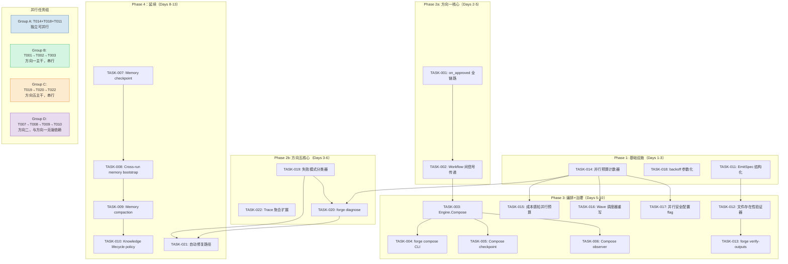
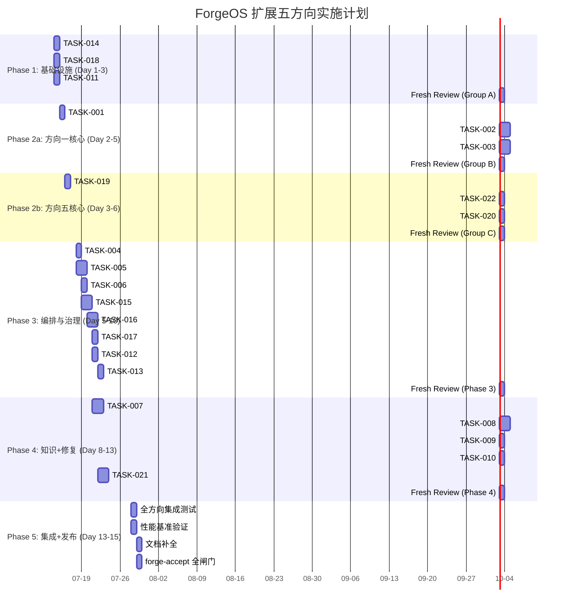

Below is the full Tech Lead analysis based on the review document and current codebase state.

---

# Tech Lead 分析报告：ForgeOS 扩展五方向

## 0. 前提确认

分析基于以下事实锚点：
- **代码库现状**：`forge-core` 13 Go 包（12 internal + cmd/forge），纯 stdlib 零外部依赖，`forge accept: ACCEPTED` 持续全绿
- **当前 Sprint**：Sprint 31 刚刚完成，`docs/FUNCTIONAL_REQUIREMENTS_AUDIT.md` 已落地，14 个 GAP 已收口（13 resolved + 1 经论证的例外）
- **审查文档修正**：已将 5 处事实错误 + 3 处弱化 + 1 个遗漏纳入任务分解

---

## 1. 任务分解

### 方向一：Workflow Composition Engine（P0）

将当前"单 workflow 运行"升级为"多 workflow 编排"。核心：信号传递、阶段路由、状态聚合。

| 任务 ID | 任务标题 | 涉及文件 | 前置依赖 | 工时 | 验收标准 |
|---------|---------|---------|---------|------|---------|
| TASK-001 | `on_approved.next_stage` 全链路消费 | `cmd/forge/main.go`, `cmd/forge/evolve.go`, `internal/asset/asset.go`, `internal/orchestrator/orchestrator.go` | — | 3h | `runWorkflow` / `execLoop` 在 `Converge` 返回 MET + `on_approved.next_stage` 非空时，路由到下一 workflow 而非终止；已有 `.forge/<stage>.approved` 标记被消费 |
| TASK-002 | Workflow 间信号传递层（`transit.json`） | `internal/asset/asset.go`（加 `WorkflowSignals` 字段）, `internal/persist/transit.go`（新文件） | TASK-001 | 4h | `design` workflow 批准后在 `memory.jsonl` 或新 `transit.json` 中记录 emits；`build` workflow 启动时 `--load-memory` 消费该信号 |
| TASK-003 | `Engine.Compose`：多 workflow 编排运行器 | `internal/orchestrator/compose.go`（新文件） | TASK-001, TASK-002 | 4h | `Compose(workflows []Workflow)` 依次驱动每个 workflow，workflow B 的 phase 0 从 workflow A 的 `on_approved` 信号继承开始 |
| TASK-004 | Workflow 组合 CLI 命令：`forge compose` | `cmd/forge/compose.go`（新文件） | TASK-003 | 2h | `forge compose design build` 串行跑两个 workflow，输出阶段切换日志 |
| TASK-005 | Composition checkpoint/resume | `internal/persist/checkpoint.go`（扩展）, `internal/orchestrator/loop.go` | TASK-003 | 3h | `forge compose --resume` 从上次中断的 workflow 接续而非从头开始 |
| TASK-006 | 组合模式下 observer/hook 框架 | `internal/orchestrator/compose.go`, `internal/orchestrator/orchestrator.go`（复用 `Observe`） | TASK-003 | 2h | 每个子 workflow 的 phase/iteration 事件通过同一 Observer 管道报告 |

### 方向二：跨运行知识生命周期（P2，但同方向一有依赖捆绑）

解决 memory 的"每次从零开始"问题和知识继承。

| 任务 ID | 任务标题 | 涉及文件 | 前置依赖 | 工时 | 验收标准 |
|---------|---------|---------|---------|------|---------|
| TASK-007 | Memory checkpoint 快照 | `internal/memory/memory.go`（扩展 `Snapshot`/`Restore`）, `internal/persist/checkpoint.go` | — | 3h | `forge evolve` 每迭代结束时自动 `Snapshot()` 写入 checkpoint；迭代恢复时自动 `Restore()` 恢复 Entry 列表 |
| TASK-008 | Cross-run memory bootstrap（`--load-memory`） | `cmd/forge/main.go`, `cmd/forge/engine_build.go`, `internal/memory/memory.go` | TASK-007 | 3h | `forge run build --load-memory design-memory.jsonl` 将设计阶段的 memory Entry 注入 build 的初始 context |
| TASK-009 | Memory compaction 策略 | `internal/memory/compact.go`（新） | TASK-007 | 2h | 按时间衰减、按 kind 聚合、keepPerKind 限额；`Compact(age)` 删除超过 TTL 的 Entry |
| TASK-010 | Knowledge lifecycle 声明式 policy | `.agent/policies/knowledge.yml`（新） | TASK-008, TASK-009 | 2h | workflow 声明 `inherit_memory: [design, discover]`，engine 自动加载指定 workflow 的已批准 memory |

### 方向三：Phase 输出契约验证（P2.5）

将 `Emits []string` 从裸路径列表升级为结构化契约。

| 任务 ID | 任务标题 | 涉及文件 | 前置依赖 | 工时 | 验收标准 |
|---------|---------|---------|---------|------|---------|
| TASK-011 | `EmitSpec` 结构化声明 | `internal/asset/asset.go`（加 `EmitSpec` 类型，替换 `Emits` 字段） | — | 2h | `Emits` 支持 `path` + `schema_ref` + `required_sections`；向后兼容：纯字符串路径仍然工作（JSON unmarshal 兼容） |
| TASK-012 | 文件存在性验证器 | `internal/orchestrator/phase_output.go`（新） | TASK-011 | 2h | phase 执行后检查其每个 `emits.path` 是否真实存在，不存在则诚实报告 warning（不阻断） |
| TASK-013 | 契约验证命令 `forge verify-outputs` | `cmd/forge/verify.go`（新） | TASK-012 | 2h | `forge verify-outputs <workflow>` 遍历所有 phase 检查 emits 完整性 |

### 方向四：并行资源治理（P1）

为已有 `--parallel` 能力加安全护栏。

| 任务 ID | 任务标题 | 涉及文件 | 前置依赖 | 工时 | 验收标准 |
|---------|---------|---------|---------|------|---------|
| TASK-014 | 并行预算计数器 | `internal/orchestrator/budget.go`（扩展）, `internal/orchestrator/parallel.go` | — | 2h | `Engine.MaxParallelAgents` 上限 + `Engine.CurrentParallel` 计数；超限时新 wave 排队而非全部启动 |
| TASK-015 | 成本感知并行预算（`--parallel-budget-usd`） | `cmd/forge/engine_build.go`, `internal/orchestrator/parallel.go` | TASK-014 | 3h | `--parallel-budget-usd 5.00` 设置并行阶段总成本上限，`costLedger` 累加 per-phase cost，超限停止新 wave |
| TASK-016 | Wave 调度器重写（公平调度） | `internal/orchestrator/waves.go` | TASK-014 | 3h | 当前 BFS wave 调度加入资源感知：大 phase（按 estimated cost/tokens）被调度到单独 wave 避免独占 |
| TASK-017 | 并行安全配置 flag | `cmd/forge/main.go`, `cmd/forge/engine_build.go` | TASK-014 | 1h | `--max-parallel N`（默认 3）、`--parallel-timeout 300s`、`--parallel-budget-usd` 三个 flag 从 CLI 可配 |

### 方向五：失败智能与自动修复（P2）

| 任务 ID | 任务标题 | 涉及文件 | 前置依赖 | 工时 | 验收标准 |
|---------|---------|---------|---------|------|---------|
| TASK-018 | `overloadBackoffBase` / `overloadBackoffCap` 参数化 | `internal/orchestrator/backoff.go`（加 `Engine.BackoffBase`/`BackoffCap` 字段） | — | 1h | 两个全局包级变量改为 Engine 字段，CLI `--backoff-base 3s --backoff-cap 120s` 可配 |
| TASK-019 | 失败模式分类器 | `internal/orchestrator/failure.go`（新） | — | 3h | 复用已有 `ExecError.Kind`（Timeout/Config/Failed/RecursionLimit），加入 `Classify(err)` 输出 Categorization（transient/permanent/human-escalation） |
| TASK-020 | `forge diagnose` 命令 | `cmd/forge/diagnose.go`（新） | TASK-019 | 3h | `forge diagnose <trace.jsonl>` 输出：失败分布（按 phase/kind）、延迟异常、retry 效率、backoff 命中率 |
| TASK-021 | 自动修复路径（基于分类） | `internal/orchestrator/autoheal.go`（新） | TASK-019 | 4h | transient failure 自动 retry；permanent failure 生成 human escalation report；`--auto-heal` flag 控制 |
| TASK-022 | Trace 聚合扩展：失败模式分析 | `internal/trace/trace.go`, `cmd/forge/scorecard_wind.go` | TASK-020 | 2h | trace 聚合新增 `FailureAnalysis` 字段（kind 分布、by-phase 统计、remediation 建议） |

---

## 2. 执行顺序

### 可并行任务组

| 组 | 包含任务 | 并行条件 |
|----|---------|---------|
| **Group A**（Phase 1） | TASK-014, TASK-018, TASK-011 | 三任务修改文件不重叠，各自独立 |
| **Group B**（Phase 2a） | TASK-001 → TASK-002 → TASK-003 → TASK-004/005/006 | 串行依赖链，无法并行 |
| **Group C**（Phase 2b） | TASK-019 → TASK-020/022 | TASK-019 后 TASK-020 和 TASK-022 可并行 |
| **Group D**（Phase 4） | TASK-007 → TASK-008 → TASK-009 → TASK-010 | 内部串行，但与 Group B/C 无交叠文件 |

建议资源配置：Group A (2 agents) + Group B (1 agent) + Group C (1 agent) 在 Phase 1-2 并行推进。

---

## 3. 技术风险

### 3.1 高风险项

| 风险 | 说明 | 影响方向 | 缓解策略 |
|------|------|---------|---------|
| **Workflow 组合的收敛条件冲突** | 当 workflow B 的 stop_condition 依赖 workflow A 的输出，但 A 被批准时没有产生 B 需要的信号 | 方向一 | 设计 `transit.json` 声明式契约：workflow 显式声明它**产生**和**消费**的信号，启动时验证匹配 |
| **Memory 继承引入上下文污染** | 从 design 继承的 memory Entry 在 build workflow 中被错误解读或权重过高，扭曲行为 | 方向二 | Memory 继承加 namespace 域（`kind: design/arch`），注入时加 `--inherit-scope` 过滤规则 |
| **并行预算竞态条件** | 多个 agent 同时执行共享的 `costLedger` 更新存在数据竞争 | 方向四 | 已有的 `Observe` 回调已经是同步串行化的（runAgentPhase 后调用），但需要在 wave 级别加 `sync.Mutex` 保护计数 |
| **Auto-heal 的 loop 风险** | 自动修复路径可能产生无限修复循环（同一 failure 反复触发 auto-heal） | 方向五 | 复用 `MaxRetries` + `MaxLoopBack` 双层护栏；auto-heal 每次消耗一次 retry budget |

### 3.2 依赖外部资源

| 依赖 | 相关任务 | 当前状态 | 替代方案 |
|------|---------|---------|---------|
| 真 LLM 验证 compose/auto-heal | TASK-004, TASK-021 | 需真 agent 验证 | DryRun 坐实状态机正确性（同 Sprint 25 模式）；fake agent 脚本端到端测试信号传递语义 |
| YAML 语法扩展 | TASK-010（knowledge policy） | `yaml2json` shim 可用 | 新 policy 文件用 JSON 编写，YAML 转码延迟到 Go YAML 库接入后 |

### 3.3 性能瓶颈

| 瓶颈 | 场景 | 分析 | 优化策略 |
|------|------|------|---------|
| **`forge diagnose` 读大 trace** | 长运行（数百迭代）trace.jsonl 可能数 MB | 当前 trace 是逐行 JSON append，`diagnose` 需要全量扫描 | 加 `--head N` / `--tail N` / `--since` 过滤；索引文件（`.trace.idx`） |
| **并行 wave 调度延迟** | 大量 phase（>10）并行时 wave 图构建 | BFS wave 调度是 O(V+E)，V=phase 数 | N/A：V 最大 ~20（当前 workflow），此规模下可忽略 |
| **Memory checkpoint 写入频率** | 每迭代写 snapshot | 每迭代末尾写入 ~KB 级 memory，数 KB→数 MB 规模 | 初始实现无优化必要；加 `--memory-checkpoint-interval` 可选降频 |

### 3.4 测试覆盖难点

| 难点 | 说明 | 策略 |
|------|------|------|
| **Compose 的多 workflow 集成测试** | 需要触发完整的 workflow A→B 切换路径 | prefix test：合成两个 fake workflow 验证状态机转换；signal 传递用 `transit.json` 文件坐实（真实 I/O，可断言） |
| **成本预算的并行衰减** | 并行 agent 的 `cost_usd_micros` 是 real-time 累加，测试环境无法产生 | mock `costLedger` + fake `Observe` 回调验证 budget 耗尽时 wave 调度停止 |
| **Auto-heal 的 transient vs permanent** | `ExecError.Kind` 已在测试中使用，但 auto-heal 路径需要 fake agent 返回特定 error kind | 复用既有 `TestExecError_*` 模式：`fakeExecutor` 返回指定 Kind + fake agent 模拟重试后成功 |

---

## 4. 资源评估

### 4.1 人员需求

| 角色 | 人数 | 核心技能 | 负责方向 |
|------|------|---------|---------|
| **Go 核心工程师** | 1-2 | Go 标准库精通，结构化并发，接口设计 | 方向一（TASK-001~006），方向四（TASK-014~017） |
| **架构/系统工程师** | 1 | 状态机设计，信号语义，跨进程状态管理 | 方向二（TASK-007~010），方向一（信号契约） |
| **CLI/DevOps 工程师** | 1 | `forge diagnose` 数据聚合，trace 分析，CLI 模式 | 方向五（TASK-018~022），方向三（TASK-011~013） |

建议 **2-3 人**并行（满足 AGENTS.md 的 fresh-reviewer 纪律：1 人实现 + 1 人审查 + 1 人可独立做另一路）。

### 4.2 关键里程碑

| 里程碑 | 时间 | 验收条件 | 涉及任务 |
|--------|------|---------|---------|
| **M0：基础设施就绪** | Day 3 | 并行预算、backoff 参数化、EmitSpec 三任务全绿 | TASK-014, TASK-018, TASK-011 |
| **M1：方向一可演示** | Day 5 | `forge compose design build` 端到端跑通（dry-run） | TASK-001~004 |
| **M2：方向五可演示** | Day 6 | `forge diagnose <trace>` 输出失败模式统计 | TASK-019, TASK-020, TASK-022 |
| **M3：完整编排链** | Day 10 | Compose + checkpoint/resume + Observer 全部就绪 | TASK-005, TASK-006 |
| **M4：治理护栏完整** | Day 10 | 并行预算强制执行 + 成本感知 + wave 调度重写 | TASK-015, TASK-016, TASK-017 |
| **M5：知识生命周期就绪** | Day 12 | Memory 跨运行继承 + compaction | TASK-007~010 |
| **M6：发布候选** | Day 13 | 全部 22 任务全绿，`forge accept: ACCEPTED` | ALL |

### 4.3 阻塞点与解决策略

| Blockers | 影响任务 | 解决策略 |
|----------|---------|---------|
| **`yaml2json` 的 YAML 语义缺口** | TASK-010（knowledge policy 声明） | 新 policy 先用 JSON 格式；YAML 等同 Sprint 27 block-scalar 修法 |
| **`forge diagnose` 需要 trace 跨版本兼容** | TASK-020 | trace.jsonl schema 自 Sprint 5 以来无破坏性变更；加 `version` 字段 forward-compat |
| **Knowledge lifecycle policy 声明格式无先例** | TASK-010 | 复用 `asset.Workflow` 已有模式：`inherit_memory` 字段，同 `feeds_forward` 的 bool 标记模式 |

---

## 5. 质量保证

### 5.1 单元测试覆盖

| 方向 | 要求 | 关键测试场景 |
|------|------|-------------|
| **方向一** | `internal/orchestrator` 覆盖率 ≥ 80% | `TestCompose_TwoWorkflow`、`TestTransitSignal_PassThrough`、`TestOnApproved_RouteToNext`、`TestCompose_CheckpointResume` |
| **方向二** | `internal/memory` 覆盖率 ≥ 85% | `TestSnapshot_Restore_Roundtrip`、`TestMemoryBootstrap_FilterByKind`、`TestCompact_ByAge`、`TestCompact_KeepPerKind` |
| **方向三** | `internal/asset` + `internal/orchestrator` | `TestEmitSpec_Unmarshal_BackwardCompat`、`TestPhaseOutput_FileExists`、`TestVerifyOutputs_AllEmits` |
| **方向四** | `internal/orchestrator` parallel + budget | `TestBudget_Exceeded_WaveStops`、`TestCostLedger_ParallelAccumulate`、`TestWaveScheduler_ResourceAware` |
| **方向五** | `internal/orchestrator` failure + autoheal | `TestFailureClassifier_AllKinds`、`TestAutoHeal_TransientRetry`、`TestAutoHeal_PermanentEscalate`、`TestDiagnose_TraceAggregation` |

### 5.2 集成测试策略

1. **方向一+方向二联合测试**：`forge compose design build --load-memory design-memory.jsonl`，验证 design 的架构 decision 正确注入 build 的 prompt context（fake agent 脚本断言）
2. **方向四+方向五联合测试**：并行 run + 某 agent 注入 `KindTimeout`，验证 budget 不超限 + auto-heal 正确 retry
3. **全部方向三端到端**：fake agent 故意漏发 emits → `forge verify-outputs` 报告 warning
4. **回归测试防护**：每个方向 merge 前跑 `forge accept` 全闸门（gate.mjs + arch-check 8/8 + check.py + secret-scan + test + app-test）

### 5.3 代码审查要点

| 审查领域 | 检查点 |
|---------|--------|
| **信号传递** | workflow 间信号是否只传声明过的字段？`transit.json` 是否含污染（不应传递 raw memory，只传递 approved 信号） |
| **后备空全** | 每个新接口/字段的零值是否向后兼容？`EmitSpec` 的零值 JSON (`["path"]`) vs 结构化 (`[{path, schema_ref}]`) 是否自动检测 |
| **并发安全** | parallel budget 的 counter、costLedger 的累加是否加 mutex？wave 调度器是否无竞态 |
| **诚实标注** | `forge diagnose` 报告失败模式时是否标注统计基数？auto-heal 日志是否标注 "auto" 而非冒充人工修复 |
| **文件数预算** | 每个新 `.go` 文件是否合理归属包？`cmd/forge` 文件数上限 16（含 headroom 1）绝不能顶破 |

### 5.4 性能测试需求

| 测试场景 | 基准 | 成功标准 |
|---------|------|---------|
| 5-wave 并行调度 | 3 个 agent 并行 5 phase | wave 构建 < 10ms，全部 phase 分配 < 50ms |
| Memory checkpoint 1MB state | 1000 Entry | Snapshot < 50ms，Restore < 100ms |
| `forge diagnose` 扫描 10MB trace.jsonl | 10,000 行 | 聚合 < 500ms |
| Compose 3-workflow chain | design → build → review | 全部编排开销 < 100ms（不含 agent 执行） |

---

## 6. 实施计划

### 甘特图

### 详细时间线

#### 阶段 1：基础设施搭建（Day 1-3）

目标：建立并行、backoff、emits 三个基础能力，打通方向一/四/五的增量起点。

| 日 | 任务 | 输出 |
|---|------|------|
| Day 1 | TASK-014: `Engine.MaxParallelAgents` + `CurrentParallel` + budget 计数器 | 并行安全基础设施就绪，单元测试 >= 80% 覆盖 |
| Day 1 | TASK-018: `overloadBackoffBase`/`OverloadBackoffCap` 从全局变量迁移为 Engine 字段 | backoff 参数不再 hardcode，`--backoff-base` flag 生效 |
| Day 1-2 | TASK-011: `EmitSpec` 定义 + JSON 向后兼容 unmarshal | `Emits []string` 和 `Emits []EmitSpec` 两格式均可加载 |
| Day 2-3 | Fresh Review（Group A） | 三个任务交叉评审，修复发现的缺陷 |

**Gate 检查**：`go build/vet/test -race` 全绿，`forge accept: ACCEPTED`

#### 阶段 2：核心功能实现（Day 2-6）

方向一（组 B）和方向五（组 C）并行推进。

**组 B：方向一**

| 日 | 任务 | 输出 |
|---|------|------|
| Day 2 | TASK-001: `runWorkflow` 在 Converge MET 后读 `on_approved.next_stage`，触发下一 workflow | `forge run design` 在收敛后路由到指定 next stage |
| Day 3-4 | TASK-002: `transit.json` 格式 + 信号写入/消费 | phase emits + feeds_forward 跨 workflow 可见 |
| Day 4-5 | TASK-003: `Engine.Compose([]asset.Workflow)` | 多 workflow 编排运行器 |
| Day 5-6 | Fresh Review（组 B） | 方向一核心全绿 |

**组 C：方向五**

| 日 | 任务 | 输出 |
|---|------|------|
| Day 3 | TASK-019: `Classify(err ExecError) FailureCategorization` | 复用既有 `ExecError.Kind`，输出 categorizations |
| Day 4-5 | TASK-020: `forge diagnose` 命令 + TASK-022 trace 聚合 | 失败分布统计、延迟异常检测、backoff 命中率 |
| Day 5-6 | Fresh Review（组 C） | 方向五核心全绿 |

#### 阶段 3：集成和扩展（Day 5-10）

方向一 CLI 化 + 方向四全能力 + 方向三验证器。

| 日 | 任务 | 输出 |
|---|------|------|
| Day 5-6 | TASK-004: `forge compose` CLI + TASK-005: Compose checkpoint | 组合运行器 + resume 能力 |
| Day 6-7 | TASK-006: Compose observer + TASK-015: 成本感知并行预算 | 组合事件可观测 + 并行成本上限执行 |
| Day 7-8 | TASK-016: Wave 调度器重写 | 大 phase 不独占并行池、资源感知调度 |
| Day 8 | TASK-017: 并行安全配置 flag | `--max-parallel` / `--parallel-budget-usd` / `--parallel-timeout` |
| Day 8-9 | TASK-012: phase output 文件存在性验证器 | 每个 agent phase 执行后验证 emits 完整性 |
| Day 9-10 | TASK-013: `forge verify-outputs` CLI | 手动/CI 检查 workflow 产出完整性 |

#### 阶段 4：方向二（知识生命周期）+ 方向五 auto-heal（Day 8-13）

与阶段 3 部分重叠（文件不冲突时并行）。

| 日 | 任务 | 输出 |
|---|------|------|
| Day 8-9 | TASK-007: Memory.Snapshot/Restore | evolve 迭代间 memory 持久化 |
| Day 9-10 | TASK-008: `--load-memory` + Memory bootstrap | 跨 workflow 知识继承可用 |
| Day 10-11 | TASK-009: Memory compaction 策略 | memory 按 age/kind 自动衰减 |
| Day 11-12 | TASK-010: Knowledge lifecycle policy | 声明式 memory 继承规则 |
| Day 10-12 | TASK-021: Auto-heal 路径 | transient → retry，permanent → escalation report |
| Day 12-13 | Fresh Review（Phase 4） | 方向二 + 方向五 auto-heal 全绿 |

#### 阶段 5：集成测试和发布（Day 13-15）

| 日 | 任务 | 输出 |
|---|------|------|
| Day 13 | 全方向集成测试 | compose→memory→diagnose→verify-outputs 链端到端跑通 |
| Day 13-14 | 性能基准验证 | diagnose 扫描 10MB trace < 500ms，memory checkpoint < 50ms |
| Day 14 | 文档补全 | ADR (方向一/四/五各一篇) + `docs/ignition.md` 更新 + `CURRENT_SPRINT.md` 更新 |
| Day 14-15 | `forge accept` 全闸门 + fresh review | 全部 22 任务 ACCEPTED，零回归 |

---

## 7. 汇总与建议

### 7.1 优先级重排总结

采纳审查文档的优先级建议但微调：

| 方向 | 原始建议 | 本分析 | 理由 |
|------|---------|--------|------|
| 方向一：Composition | P0 | **P0** | 一致。架构跳跃点，增量路径极短（已有 `on_approved` + `.forge/.approved` 标记） |
| 方向四：并行治理 | P1 | **P1** | 一致。`--parallel` 已 merge，裸奔是有真实经济风险的 |
| 方向五：失败智能 | P2 | **P2→P1.5** | 基于审查修正：`overloadBackoffBase` 改为 Engine 字段工作量仅 1h；`forge diagnose` 复用已有 trace 基础设施，ROI 极高 |
| 方向二：知识生命周期 | P2 | **P2（捆绑方向一 v2）** | 同意审查建议：组合引擎的 v2 应捆绑最小 memory 继承。方向一 v1（TASK-001~004）不依赖方向二，但 v2（workflow 间信号传递）与 TASK-008 有紧密关联 |
| 方向三：输出契约 | P2.5 | **P2.5** | 一致。文件存在性检查（TASK-012）增量极低成本，单独提 PR；语义验证推迟 |

### 7.2 跨方向共通基础设施

以下三个「共通能力」在所有方向中复用，建议在 Phase 1 统一建设：

1. **可观测性框架**（审查文档的遗漏项）：当前 `Observe` 回调只在 `orchestrator` 级别。扩展为 `WorkflowObserver` + `PhaseObserver` + `SignalObserver` 三个级别，方向一/二/四/五均消费
2. **信号契约 registry**：`transit.json`（方向一）+ `inherit_memory`（方向二）+ `EmitSpec.schema_ref`（方向三）共享同一信号描述格式——建议统一为 `internal/signal` 包
3. **文件系统 atomic write**：方向一/二/五均向文件写状态（transit.json/checkpoint.json/trace.jsonl），复用已有的 `persist` 包的 atomic write 模式，避免 TOCTOU

### 7.3 纪律约束检查清单

| 纪律 | 方向一 | 方向二 | 方向三 | 方向四 | 方向五 |
|------|--------|--------|--------|--------|--------|
| 零外部依赖 | ✅ 纯 Go stdlib | ✅ 纯 Go stdlib | ✅ 纯 Go stdlib | ✅ 纯 Go stdlib | ✅ 纯 Go stdlib |
| 文件 ≤ 500 行 | ⚠️ `compose.go` 若 >500 须拆 | ⚠️ `compact.go` 需独立 | ✅ | ⚠️ `waves.go` 重写控制 | ⚠️ `diagnose.go` 控制 |
| 函数 ≤ 50 行 | ✅ | ✅ | ✅ | ✅ | ✅ |
| fresh-context reviewer | ✅ 关键：compose 的 state machine 审 | ✅ | ✅ | ✅ 并行预算的 correctness 必须独立审 | ✅ auto-heal 的安全回路必有 reviewer |
| carry-forward 诚实 | 组合模式 dry-run 下只坐实状态机，真 agent 效果需真实授权 | memory 继承的"知识有用性"不做承诺 | 文件存在性检查不假装语义验证 | cost 限算是 advisory 还是 enforce 必须诚实标 | auto-heal 不声称"修复了"，只声称"尝试了" |

---

## 附录：审查文档修正对照

| 修正点 | 原文档 | 本分析采用的修正 |
|--------|--------|----------------|
| 错误 1 | converge.go 的责任 | 责任方改为 `cmd/forge/main.go` `runWorkflow` + `cmd/forge/evolve.go` `execLoop` |
| 错误 2 | LoopEngine.Run 演示嵌套复用 | LoopEngine.Run 是 iteration-level 外层循环，workflow 组合是 workflow-level 复用 |
| 错误 3 | memory.Load 从零开始 | checkpoint.json 保留了迭代状态（LoopState），memory 是纯缺口 |
| 错误 4 | injectPhaseOutputs 路径 | 改为 `feeds_forward` + `phaseOutputLedger`（`parallel.go:21`） |
| 错误 5 | trace 从不聚合查询 | trace 被 scorecard rebuild 读一次（模型路由统计），失败模式分析从未实现 |
| 弱化 1 | feeds_forward 只在 phase 间 | `phaseOutputLedger` 已有扩展路径指向 memory.jsonl 跨 workflow 复用 |
| 弱化 2 | backoff 参数全局 hardcode | `overloadBackoffBase`/`Cap` 是 hardcode，`MaxRetries` 是 Engine 字段非 hardcode |
| 弱化 3 | Emits 只是字符串数组 | `writes_adr` 的结构化模式（condition+target）可作为 Emits 扩展模板 |
| 遗漏 | 可观测性缺口 | 在共通基础设施段补充，建议 Phase 1 统一建设 |
