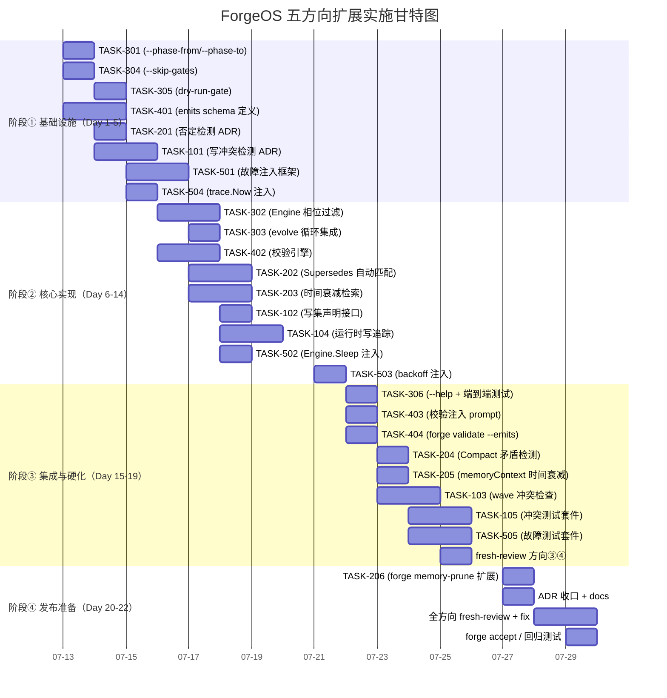

# Tech Lead 分析：ForgeOS 五个扩展方向

## 前置阅读摘要

基于验证文档的分析确认，代码库中五个方向的 GAP 全部**真实成立**。以下从 Tech Lead 视角进行任务拆解、风险识别和实施规划。

---

## 1. 任务分解

> **粒度原则**：每个任务 2-4 小时，不超过文件 500 行 / 函数 50 行约束。触线即按「先拆分，再继续」纪律切子任务。

### 方向③：选择性相位执行（推荐最高优先级）

| 任务 ID | 标题 | 涉及文件 | 前置依赖 | 预估工时 | 验收标准 |
|---------|------|---------|---------|---------|---------|
| TASK-301 | `--phase-from/--phase-to` flag 定义与解析 | `cmd/forge/main.go`（`bindRunOpts` + `runOpts`） | 无 | 2h | flag 正确解析，传递给 `execEngine`/`execLoop`，`forge run --help` 可见 |
| TASK-302 | Engine 层相位过滤实现 | `internal/orchestrator/orchestrator.go`（`Run`/`RunFrom` 增加 `PhaseFilter` 参数） | TASK-301 | 3h | `RunFrom` 接受 `startPhase`/`endPhase` 参数，跳过范围外相位；`--phase-from=2 --phase-to=4` 只跑第 2-4 相位 |
| TASK-303 | evolve 循环相位过滤集成 | `internal/orchestrator/loop.go`（`LoopEngine.runIteration` 传过滤参数） | TASK-302 | 2h | `forge evolve --phase-from=1` 正确作用域到每次迭代 |
| TASK-304 | `--skip-gates` flag 实现 | `cmd/forge/main.go` + `orchestrator/mode_gating.go`（gate 跳过逻辑） | 无（与 TASK-301 并行） | 2h | `forge run --skip-gates` 跳过所有 gate phase, 但 agent phase 正常执行 |
| TASK-305 | dry-run-gate 模式（执行 gate 但不 agent） | `internal/orchestrator/orchestrator.go`（`RunGate` 行为分支） | 无 | 3h | gate 阶段真实跑 harness, agent 阶段 dry-run；输出 gate 结果后停止 |
| TASK-306 | `forge run --help` 整合+端到端测试 | `cmd/forge/main.go` usage + `orchestrator_test.go` | TASK-301~305 | 2h | 6 个新 flag 在 usage 中完整列出；集成测试对各 flag 组合逐一路径覆盖 |

### 方向②：上下文毒性检测（第二优先）

| 任务 ID | 标题 | 涉及文件 | 前置依赖 | 预估工时 | 验收标准 |
|---------|------|---------|---------|---------|---------|
| TASK-201 | 句法级否定检测器设计 + ADR | `docs/adr/` | 无 | 2h | ADR 明确否定检测的范围：否定句式（"not X"/"avoid Y"/"don't Z"）+ 反义词对 + 数值否定 |
| TASK-202 | `memory.Supersedes` 自动匹配 | `internal/memory/memory.go`（`filterSuperseded` 扩展） | TASK-201 | 4h | 新 entry 写入时自动检测与现有 entry 的矛盾，自动填充 `Supersedes` 字段；非精确 topic 也能匹配（部分覆盖） |
| TASK-203 | memory 检索加入时间衰减 | `internal/prompt/retrieve.go`（`Retrieve` 增加 `decayWeight` 参数） | 无 | 3h | BM25-lite 结果按 entry 年龄衰减；参数可配置（默认对应 `recency_half_life_days: 30`） |
| TASK-204 | `Compact` 矛盾检测集成 | `internal/memory/memory_compact.go`（`compactByKind` 扩展） | TASK-202 | 2h | compact 时检测同一 kind 内矛盾 entry，合并为带双向引用的总结条目 |
| TASK-205 | `memoryContext` 时间衰减整合 | `cmd/forge/prompt_memory.go`（`boundMemory` + `memoryContext`） | TASK-203 | 2h | `memoryContext` 输出按时间衰减分排序，`forge run` 验证模型 prompt 中旧 memory 量减少 |
| TASK-206 | `forge memory-prune` 扩展（矛盾收缩） | `cmd/forge/validate.go`（`cmdMemoryPrune`） | TASK-204 | 2h | `forge memory-prune --resolve-contradictions` 跑矛盾检测 + 自动收缩 |

### 方向①：并行写冲突检测（第三优先，最高技术风险）

| 任务 ID | 标题 | 涉及文件 | 前置依赖 | 预估工时 | 验收标准 |
|---------|------|---------|---------|---------|---------|
| TASK-101 | 并行写冲突检测设计 ADR | `docs/adr/` | 无 | 3h | 确定检测策略（文件级锁 / 声明式写集检查 / 事务式暂存区）；风险评估 |
| TASK-102 | Phase 写集声明接口定义 | `internal/asset/phase.go`（`Writes` 字段 + 校验） | TASK-101 | 2h | `asset.Phase` 新增 `Writes []string` 字段；workflow YAML 解析支持 `writes:` |
| TASK-103 | wave 边界写冲突检查 | `internal/orchestrator/parallel.go`（`runWave` 前置检查） | TASK-102 | 4h | 每 wave 启动前检查 wave 内 phase 的 `Writes` 交集；冲突时 fail-fast + 明确错误信息 |
| TASK-104 | 运行时文件写入追踪（轻量级） | `internal/orchestrator/command_executor.go`（`trackedWriter` 包装） | 无 | 3h | 包装 `CommandExecutor` 的 stdout/文件写入，记录实际写路径；与声明 `Writes` 交叉验证 |
| TASK-105 | 并行模式冲突测试套件 | `internal/orchestrator/parallel_test.go` | TASK-102~104 | 3h | 至少 5 个 fixture：无冲突/完全冲突/部分冲突/声明缺失/运行时偏差 |

### 方向④：阶段间产出物形式化契约（与方向③并行）

| 任务 ID | 标题 | 涉及文件 | 前置依赖 | 预估工时 | 验收标准 |
|---------|------|---------|---------|---------|---------|
| TASK-401 | emits schema 定义 + YAML 解析 | `.agent/workflows/*.yml` + `internal/asset/phase.go` | 无 | 3h | `emits:` 支持 `{path: "...", schema: {...}}` 格式；向后兼容纯路径列表 |
| TASK-402 | phase 边界输出校验引擎 | `internal/asset/emits.go`（新文件） | TASK-401 | 4h | 校验 emits 文件存在 + JSON Schema 验证（可选）+ 文件类型/大小检查；不阻断但报告 |
| TASK-403 | 校验结果注入 prompt context | `cmd/forge/prompt_context.go`（`outputValidationLedger`） | TASK-402 | 2h | 校验结果作为可观测 lane 注入 agent prompt；agent 可见但非闸门阻断 |
| TASK-404 | `forge validate --emits` 命令 | `cmd/forge/validate.go` | TASK-402 | 2h | 独立验证 workflow 的 emits 产出物格式正确性，用于 CI/开发期检查 |

### 方向⑤：控制平面故障注入（第四优先）

| 任务 ID | 标题 | 涉及文件 | 前置依赖 | 预估工时 | 验收标准 |
|---------|------|---------|---------|---------|---------|
| TASK-501 | 故障注入框架设计 | `internal/orchestrator/fault.go`（新文件） | 无 | 3h | 定义 `FaultInjector` 接口 + `FaultConfig` 结构；基于概率/触发条件的注入点注册 |
| TASK-502 | Engine.Sleep 注入集成 | `internal/orchestrator/orchestrator.go` + `fault.go` | TASK-501 | 2h | `Engine.Sleep` 检查 `FaultInjector`；可模拟超时/panic/慢响应 |
| TASK-503 | backoff 重试注入 | `internal/orchestrator/backoff.go` | TASK-501 | 2h | backoff 循环可控注入：模拟连续失败/无限 backoff |
| TASK-504 | trace.Tracer.Now 注入适配 | `internal/trace/trace.go` | 无（独立） | 1h | `Now func()` 已有注入点，增加故障场景（时间跳跃/停止）测试 |
| TASK-505 | 故障场景测试套件 | `internal/orchestrator/fault_test.go` | TASK-501~504 | 4h | 8 个场景：超时→重试成功 / 超时→耗尽重试 / 过载→backoff→成功 / 死循环→NoProgress / 递归→cap / config 错误→不重试 / 时间跳跃→checkpoint / panic→recover |

---

## 2. 执行顺序与依赖图

```mermaid
graph TD
    %% 方向③（种子组 - 最高优先级）
    subgraph Phase3[方向③ 选择性相位执行 - 高优先级]
        T301["TASK-301<br/>--phase-from/--phase-to flags"]
        T304["TASK-304<br/>--skip-gates flag"]
        T305["TASK-305<br/>dry-run-gate mode"]
        T302["TASK-302<br/>Engine 相位过滤"]
        T303["TASK-303<br/>evolve 循环集成"]
        T306["TASK-306<br/>--help + 端到端测试"]
        
        T301 --> T302
        T302 --> T303
        T304 --> T306
        T305 --> T306
        T303 --> T306
    end

    %% 方向④（与方向③并行）
    subgraph Phase4[方向④ 产出物形式化契约 - 高优先级]
        T401["TASK-401<br/>emits schema 定义"]
        T402["TASK-402<br/>校验引擎"]
        T403["TASK-403<br/>校验注入 prompt"]
        T404["TASK-404<br/>forge validate --emits"]
        
        T401 --> T402
        T402 --> T403
        T402 --> T404
    end

    %% 方向②（第二波）
    subgraph Phase2[方向② 上下文毒性检测 - 中优先级]
        T201["TASK-201<br/>否定检测 ADR"]
        T203["TASK-203<br/>时间衰减检索"]
        T202["TASK-202<br/>Supersedes 自动匹配"]
        T204["TASK-204<br/>Compact 矛盾检测"]
        T205["TASK-205<br/>memoryContext 时间衰减"]
        T206["TASK-206<br/>forge memory-prune 扩展"]
        
        T201 --> T202
        T202 --> T204
        T203 --> T205
        T202 --> T206
        T204 --> T206
        T205 --> T206
    end

    %% 方向①（第三波）
    subgraph Phase1[方向① 并行写冲突检测 - 中高优先级]
        T101["TASK-101<br/>冲突检测 ADR"]
        T102["TASK-102<br/>写集声明接口"]
        T103["TASK-103<br/>wave 冲突检查"]
        T104["TASK-104<br/>运行时写追踪"]
        T105["TASK-105<br/>冲突测试套件"]
        
        T101 --> T102
        T102 --> T103
        T102 --> T104
        T103 --> T105
        T104 --> T105
    end

    %% 方向⑤（第四波）
    subgraph Phase5[方向⑤ 控制平面故障注入 - 低优先级]
        T501["TASK-501<br/>故障注入框架"]
        T502["TASK-502<br/>Engine.Sleep 注入"]
        T503["TASK-503<br/>backoff 注入"]
        T504["TASK-504<br/>trace.Now 注入"]
        T505["TASK-505<br/>故障测试套件"]
        
        T501 --> T502
        T501 --> T503
        T501 --> T504
        T502 --> T505
        T503 --> T505
        T504 --> T505
    end

    %% 并行组标注
    T301 -.->|并行| T304
    T301 -.->|并行| T305
    T304 -.->|并行| T305
    T303 -.->|并入| T306
end
```

### 并行执行组

| 并行组 | 包含任务 | 估算人数 | 理由 |
|--------|---------|---------|------|
| **组 A** | TASK-301, 304, 305（方向③flags）+ 全部方向④ | 2 人 | 均为纯新增代码，不修改既有路径；flags 与 schema 互不依赖 |
| **组 B** | TASK-201, 203（方向②设计+检索） | 1 人 | ADR 设计可独立于实现推进；时间衰减检索是纯 `internal/prompt` 层调整 |
| **组 C** | TASK-101, 104（方向①设计+写追踪） | 1 人 | 设计 ADR 与运行时追踪是不同关注层，可并行；但 TASK-103 依赖 TASK-102 的 `Writes` 定义 |
| **组 D** | TASK-501, 504（方向⑤框架+Now 注入） | 1 人 | 框架设计与 `trace.Now` 的故障场景补充可并行 |

---

## 3. 技术风险

### 3.1 方向①：并行写冲突检测 — ⚠️ 高风险

| 风险 | 级别 | 描述 | 缓解策略 |
|------|------|------|---------|
| **并发文件写入语义复杂** | 高 | `CommandExecutor` 走 `os/exec` spawn 子进程，Go 层无法准确追踪子进程写哪些文件（尤其是间接写入如 `git` 命令）。声明式 `Writes` 与实际写入可能不符 | 声明式为主 + 运行时启发式追踪（Linux `inotify`/macOS `fsevents` 可选，但 forge-core 零外部依赖限制）；v1 以声明式检查为主，运行时偏差仅 warning |
| **并行 + loop-back 组合爆炸** | 中 | 并行模式禁用了 loop-back，但若未来开禁，wave 内某个 phase 失败后回退到其他 phase，写集重新计算复杂 | 当前可声明「并行模式下 loop-back → abort」为已知限制，文档明确 |
| **性能损耗** | 低 | 写冲突检测增加 wave 前置计算开销 | 声明式 Writes 是 O(n²) phase 间路径比对；n ≤ 10 的 wave 下可忽略。运行时追踪用文件哈希 + 定期采样而非实时 |
| **误报** | 中 | 两个 phase 写不同文件但声明了相同路径模式（如 `docs/**`）导致假冲突 | 声明式支持 glob → 预展开；v1 宽容策略：完全重叠才阻断 |

### 3.2 方向②：上下文毒性检测 — 中等风险

| 风险 | 级别 | 描述 | 缓解策略 |
|------|------|------|---------|
| **否定检测准确率** | 高 | 句法级否定检测是 NLP 难题。简单正则/模式匹配会漏检（"The system must NOT..." 易检测，但 "Avoid patterns where..." 难） | v2 只做可判句法/结构矛盾（已如验证文档所说）；v3 再引入语义检索。诚实标注「不完整」、避免 false positive |
| **Supersedes 自激** | 中 | 自动检测可能让新 entry 误 Supersedes 相关但不同主题的旧 entry，导致信息丢失 | 自动检测结果需人工确认（写入前标记 `auto_supersedes` flag）；`Compact` 保留总结条目而非直接删除 |
| **时间衰减参数偏移** | 低 | `recency_half_life_days` 声明在 policy.yml 但 routing 消费，memory 检索未消费，新增一组参数可能不一致 | 统一从 `policy.yml` 读取，或从 `project.yml` 的 `mode`/`lifecycle` 派生默认值 |

### 3.3 方向③：选择性相位执行 — 低风险

| 风险 | 级别 | 描述 | 缓解策略 |
|------|------|------|---------|
| **相位索引漂移** | 低 | `--phase-from=3` 依赖相位在 workflow YAML 中的位置顺序。workflow 编辑后索引变，用户困惑 | 支持 phase 名称（`--phase-from=implementation`）与数值索引两种格式 |
| **skip-gates 的安全含义** | 中 | `--skip-gates` 跳过所有 harness 闸门，在 production 模式下不应允许 | `mode.Effective` 按 mode/lifecycle 强制：production 模式忽略 `--skip-gates`（类似已有 lifecycle floor 逻辑） |
| **dry-run-gate 与真实 gate 行为差异** | 中 | Gate 阶段若含副作用（如 CI webhook 触发），dry-run 应明确标记不做 | `RunGate` dry-run 模式只计算结果不执行副作用；输出 `[DRY-RUN]` 前缀 |

### 3.4 方向④：产出物形式化契约 — 低风险

| 风险 | 级别 | 描述 | 缓解策略 |
|------|------|------|---------|
| **Schema 过于严格** | 低 | 过度 schema 校验导致 LLM 产出的细微格式偏移被误判为失败 | v1 schema 校验仅 warning（注入 prompt 而非 fail）；`forge validate --emits` 用于独立检查 |
| **向后兼容性** | 低 | 现有 workflow 的 `emits:` 是纯路径列表，新增 `schema:` 会导致解析失败 | 纯路径列表保持兼容，`schema:` 可选；`asset.Phase` 的 `Emits` 字段做 tagged union |
| **与已有 feeds_forward 重叠** | 低 | phase 已有 `feeds_forward` 概念，emits 的格式校验可能与 feeds_forward 产出物重叠 | 明确职责边界：`feeds_forward` = 内容传递 + prompt 注入；`emits` schema = 文件格式验证，正交 |

### 3.5 方向⑤：故障注入框架 — 低风险

| 风险 | 级别 | 描述 | 缓解策略 |
|------|------|------|---------|
| **注入影响生产代码路径** | 中 | 故障注入点若长期留在生产代码中，可能影响性能或被误触发 | 构建标签（`//go:build fault_test`）隔离；生产编译不含注入代码 |
| **测试环境与生产行为差异** | 中 | 注入的故障可能无法真实反映实际环境中同类故障的表现 | 故障注入测试定位于「恢复行为验证」而非「故障模拟精度」；真实故障行为由生产监控覆盖 |
| **重复造轮子** | 低 | Go 生态已有 chaos 工具（chaosblade, litmus） | forge-core 零外部依赖纪律下，必须自行实现轻量注入 |

---

## 4. 资源评估

### 4.1 人力需求

| 角色 | 所需人数 | 技能要求 | 负责方向 |
|------|---------|---------|---------|
| 高级 Go 工程师 | 1 人 | 熟悉 Go 并发模型、`os/exec`、文件系统追踪 | 方向①（核心安全路径）+ 方向⑤（故障注入框架） |
| 全栈工程师 | 1 人 | Go + YAML/JSON Schema + prompt engineering | 方向③（CLI）+ 方向④（schema 校验） |
| ML/NLP 工程师 | 0.5 人 | 文本矛盾检测 / BM25 检索 / NLP 技术 | 方向②（上下文毒性）- 可兼职 |
| **总计** | **2-2.5 人** | | |

> 对于 ForgeOS 的 AI Agent 开发模式，这些工程师可以由 AI Agent 等效替代，但需要 fresh-context Reviewer（独立 Agent）进行代码审查。

### 4.2 关键里程碑

| 里程碑 | 时间节点 | 交付物 | 验证标准 |
|--------|---------|--------|---------|
| M1: 基础能力就绪 | 阶段 1 结束（Day 5） | 方向③ flags + 方向④ schema 定义 | `forge run --help` 展示新 flags；`asset.Workflow` 可解析新 schema 格式 |
| M2: 核心功能可用 | 阶段 2 结束（Day 12） | 方向③ 相位过滤 + 方向② 否定检测 + 方向① wave 冲突检查 | 全部新功能单测通过 + `forge accept` ACCEPTED |
| M3: 系统集成完成 | 阶段 3 结束（Day 18） | 全 5 方向端到端可用 + 故障测试 8 场景 | `forge run --parallel --phase-from=A --phase-to=B` 端到端验证；故障注入测试全绿 |
| M4: 硬化发布 | 阶段 4 结束（Day 22） | 文档 + ADR + 性能验证 + fresh-review 闭环 | `forge accept` ACCEPTED；fresh-context Reviewer APPROVE；无已知 blocking issue |

### 4.3 阻塞点与解决策略

| 阻塞点 | 方向 | 描述 | 解决策略 |
|--------|------|------|---------|
| **并行写冲突真实检测精度不足** | ① | Go 无法追踪子进程写文件路径（`os/exec` 隔离），声明式 Writes 与实际可能偏差 | v1 接受声明式为主，偏差仅 warning 不 blocking；v2 引入 ptrace/Linux 可选的沙箱级追踪 |
| **否定检测准确率不确定** | ② | 句法检测 NLP 的高误报率可能反而「毒化」记忆 | 严格限制检测范围：只检测明确否定句式（`not|never|avoid|don't` + 关键词），其余诚实标注「未覆盖」 |
| **新鲜上下文 Reviewer 加载量** | 全局 | 每方向需独立 Agent 审，5 方向 × 平均每个 3-8 任务 = 15-40 次独立审查 | 串行化方向审查：组 A 完成后统一审，不逐任务审；利用 Sprint 模式在每个方向结束时集中 fresh-review |
| **forge YAML 解析器限制** | ④ | 原生 Go YAML 解析器（`yaml2json`）刚修过 block-scalar 损坏，对新 schema 格式可能还有兼容性问题 | 新 schema 字段先用简单 key-value 格式（避免 block scalar/折叠），等 `yaml2json` 稳定期后再扩展 |

---

## 5. 质量保证

### 5.1 单元测试覆盖

| 包 | 最低覆盖率要求 | 关键测试点 |
|----|-------------|-----------|
| `internal/orchestrator` | ≥ 80% | RunFrom 相位过滤 / RunParallel wave 写冲突 / backoff 注入 / retry 分支 / loop-back + phase 过滤交互 |
| `internal/memory` | ≥ 85% | Supersedes 自动匹配（精确/部分/零匹配）/ 时间衰减排序 / Compact 矛盾检测 / 否定句法 parser |
| `internal/prompt` | ≥ 80% | `Retrieve` 时间衰减衰减因子 / 边界条件（空 query、零衰减） |
| `cmd/forge` | ≥ 70% | flag 解析 / usage 输出 / `forge validate --emits` / `forge memory-prune` 扩展 |
| `internal/trace` | ≥ 90% | `Now` 注入下的 Span 确定性 / 故障场景下 trace 完整性 |

### 5.2 集成测试策略

| 场景 | 方向覆盖 | 测试方法 | 通过标准 |
|------|---------|---------|---------|
| `forge run --phase-from=1 --phase-to=3` | ③ | 真实 workflow + dry-run | 只执行 phase 1-3；output 日志确认 |
| `forge run --skip-gates` | ③ | 真实 workflow + gate 编排 | gate phase 被跳过；agent phase 正常 |
| `forge run --parallel --phase-from` | ③+① | 带 `depends_on` 的并行 workflow | 并行 + 过滤同时生效 |
| Supersedes 自动匹配 | ② | `memory.Append` + 句法否定 check | 自动填充 `Supersedes` 字段 |
| 写冲突 fail-fast | ① | 两 phase 声明冲突 `Writes` | wave 启动时报错，不执行任何 phase |
| 故障注入 NoProgress | ⑤ | `FaultInjector` 模拟无进展 | LoopEngine 在 `NoProgress` 迭代后 halt |
| end-to-end evolve + all | 全方向 | `forge evolve` + 真 dry-run | `forge accept` ACCEPTED |

### 5.3 代码审查要点

| 审查项 | 方向 | 重点核查 |
|--------|------|---------|
| **锁序契约扩展** | ① | 新增 `Writes` 字段是否被并行路径访问 → 是否需要加入 LOCK ORDER CONTRACT（`parallel.go:31-52`） |
| **fail-safe 行为** | ③ | `--skip-gates` 在 production mode 下是否正确忽略（不跳过 gate） |
| **零值向后兼容** | ③④ | `PhaseFilter` 零值（nil）是否让 `Run`/`RunFrom` 保持字节级一致 |
| **honesty 标注** | ② | 否定检测的限制是否诚实在代码注释中标明（不假称检测完整） |
| **外部依赖** | 全方向 | **零外部依赖纪律**：不引入 nlp/schema-validator 库 |
| **文件行数** | 全方向 | 新增文件 ≤ 500 行；修改文件不触线；否则先拆 |
| **fresh-context reviewer 独立** | 全方向 | 实现 Agent 与 Review Agent 不同 context（不共享对话历史）；reviewer 不读前序 gate 裁决 |

### 5.4 性能测试需求

| 测试项 | 方向 | 方法 | 基线目标 |
|--------|------|------|---------|
| 写冲突检查延迟 | ① | Wave 构建前置开销（10-50 phase） | < 10ms（声明式）< 100ms（运行时追踪） |
| memory 检索时间衰减 | ② | 1000 entry 的 `Retrieve` + 衰减 | 与不衰减差异 < 5%（衰减计算是常数级） |
| phase 过滤开销 | ③ | `RunFrom` + 10 phase 过滤 | 零开销（只跳过 range 外，不额外 IO） |
| 故障注入性能影响 | ⑤ | 注入点检查频次（每次 `Sleep`/`backoff`） | < 1μs/检查（单布尔判断） |

---

## 6. 实施计划



### 执行策略

```
阶段 1（Day 1-5）：基础设施搭建
├── 并行执行组 A：方向③ flags + 方向④ schema 定义（2人）
│   └── 产出：flag 解析 + asset.Phase.Emits 扩展 + yaml2json 兼容
├── 并行执行组 B：方向② ADR + 方向① ADR（1人）
│   └── 产出：两篇 ADR，确定实现范围
└── 并行执行组 D：方向⑤ 框架 + trace 注入（1人）
    └── 产出：FaultInjector 接口 + 注入点注册

阶段 2（Day 6-14）：核心功能实现
├── 方向③ 收尾：Engine 过滤 → evolve 集成（前 2 天）
├── 方向④ 校验引擎开发（2 天）
├── 方向② 否定检测 + 时间衰减（3 天）
├── 方向① 写集声明 + 运行时追踪（3 天）
└── 方向⑤ backoff + Sleep 注入（2 天）

阶段 3（Day 15-19）：集成测试与优化
├── 全方向端到端测试编写
├── 跨方向集成场景验证
├── 性能基线测量
└── fresh-context Reviewer 审查

阶段 4（Day 20-22）：发布准备
├── 文档 + ADR 收口
├── 全部 reviewer 发现修复
├── forge accept 全绿
└── 发布笔记
```

---

## 总结与建议

### 优先级推荐（已验证文档共识）

**③ → ② → ① → ④ → ⑤**，理由：

1. **方向③（选择性相位执行）** 是纯新增功能，不修改既有路径，风险最低。且对于后续开发效率有乘数效应 —— 能在出错时指定 `--phase-from` 节约大量调试时间。**推荐 2 人并行起步**。

2. **方向④（产出物形式化契约）** 与③完全并行，且同样低风险。YAML schema 定义是单向加法。建议与③同时开始。

3. **方向②（上下文毒性检测）** 的否定检测部分需设计 ADR（1 天），但时间衰减检索是纯 `internal/prompt` 层独立修改，可与③④并行开发。Supersedes 自动匹配需等 ADR 确定范围后再实现。

4. **方向①（并行写冲突检测）** 技术风险最高，触及并行执行核心安全路径。需要等团队对代码库熟悉度达到一定程度（建议完成③④⑤后再启动）。且需注意：
   - 声明式 `Writes` 与运行时偏差的诚实处理
   - Lock Order Contract 扩展（`parallel.go` 的 8 级锁序需要增加第 9 级？）
   - 并行模式下 loop-back 不支持的已知限制

5. **方向⑤（控制平面故障注入）** 虽然优先级最低，但其中 `trace.Now` 注入适配（TASK-504）是 1 小时可完成的独立任务，可在阶段 1 以极低成本顺手完成。

### 关键纪律提醒

- **每次修改后跑 `node harness/acceptance.mjs`**，确保不引入构建/测试/架构违规
- **触线即拆**：任何文件 ≥ 500 行或函数 ≥ 50 行，立即应用 `refactor-large-file` skill
- **fresh-context 独立 reviewer**：实现 Agent 必须是独立 Agent，不能自审代码
- **honesty 第一**：否定检测限制、`Writes` 偏差、schema 校验的 warning 级别 —— 所有 trade-off 必须在代码注释中诚实标注，绝不假称功能完整
